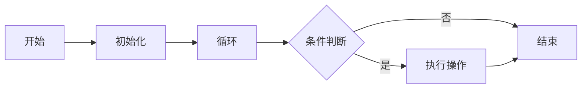
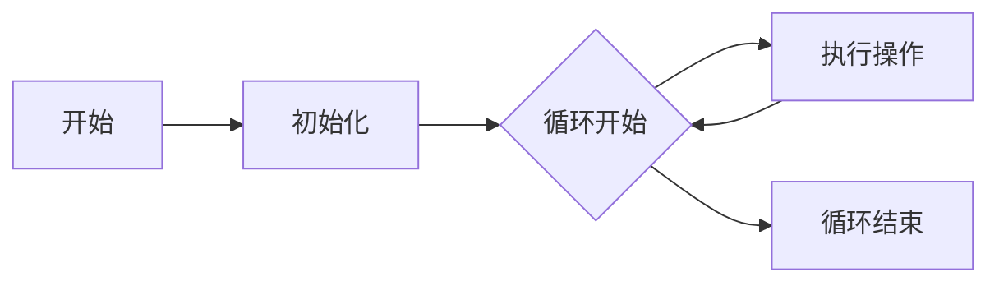
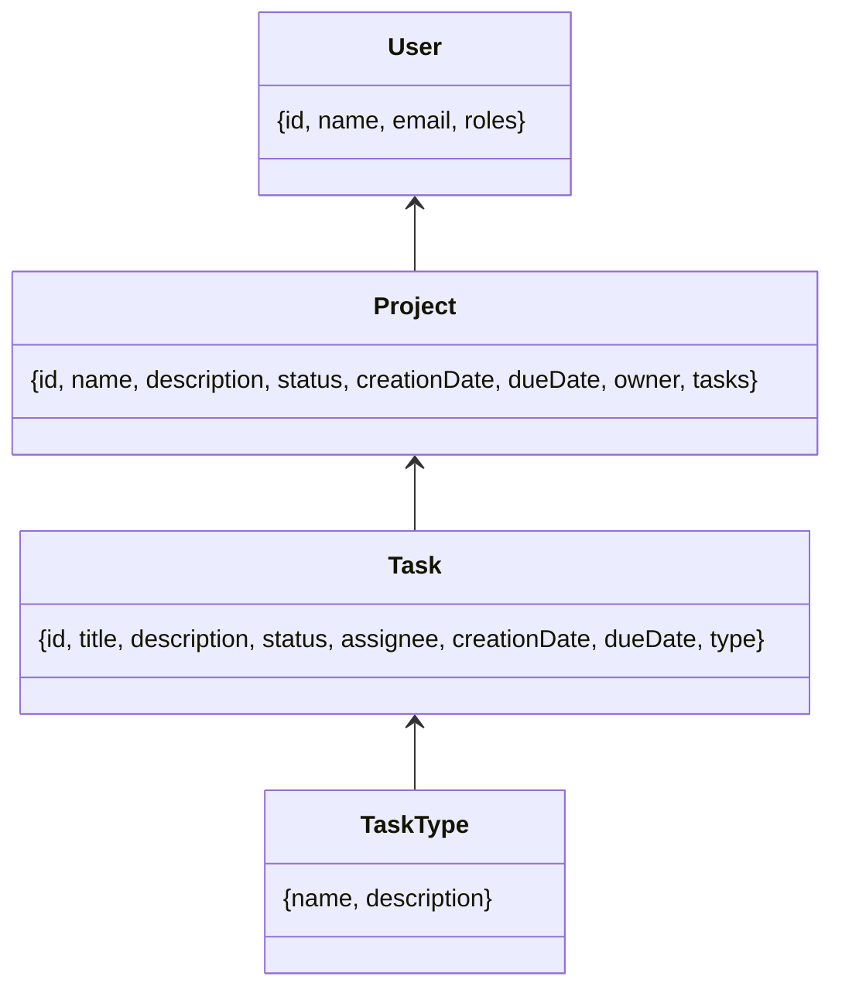
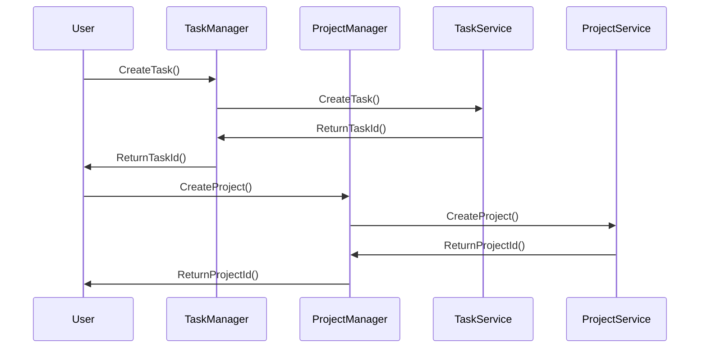
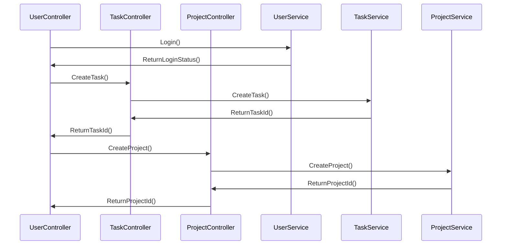

                 

# 从线性时间观到循环时间观：重新认识时间与世界

## 关键词
- 时间观
- 线性时间
- 循环时间
- 时间的本质
- 人工智能
- 计算机科学

## 摘要
本文将探讨时间观在计算机科学和人工智能领域的深远影响。通过对线性时间观与循环时间观的比较分析，本文揭示了两种时间观在理论框架、算法设计和系统实现中的差异。我们将深入探讨核心概念，并通过具体的算法、数学模型、系统设计与项目实战案例，全面阐述从线性时间观到循环时间观转变的必要性和实际意义。

## 第一部分：背景介绍

### 第1章：时间的概念

时间是一个复杂而基础的概念，贯穿于人类文明的各个领域。然而，时间的本质却是一个充满争议的话题。自古以来，哲学家、物理学家和计算机科学家都在不断地探索时间的定义和特性。

#### 1.1 核心概念术语说明

- **线性时间**：一种时间观，将时间视为一条直线，从过去流向未来，不可逆转。
- **循环时间**：一种时间观，认为时间是一种循环，有着起始和终结，周而复始。

#### 1.2 问题背景

随着计算机科学和人工智能的发展，时间观的重要性日益凸显。线性时间观在传统的计算机科学中占据主导地位，但循环时间观在处理某些问题时显得更为合适。例如，在人工智能中的循环神经网络（RNN）中，时间序列数据的处理就是基于循环时间观的。

#### 1.3 问题描述

如何在不同情境下选择合适的时间观？线性时间观和循环时间观在算法设计和系统实现中如何影响性能和效率？

#### 1.4 问题解决

通过深入研究线性时间观和循环时间观的基本原理，我们可以更好地理解时间的本质，并在实际应用中做出明智的选择。

#### 1.5 边界与外延

- **边界**：时间观的适用范围和限制。
- **外延**：时间观在其他学科和领域中的应用。

### 第2章：核心概念与联系

#### 2.1 线性时间观原理

线性时间观认为时间是一条直线，从过去到现在，再到未来。这种时间观在传统的计算机算法和系统中得到了广泛应用。

#### 2.2 循环时间观原理

循环时间观将时间视为一个循环，类似于旋转的齿轮，不断重复。这种时间观在处理重复性任务时表现出色。

#### 2.3 概念属性特征对比

| 特征         | 线性时间观         | 循环时间观         |
| ------------ | ------------------ | ------------------ |
| 时间流动     | 从过去到未来，单向流动 | 循环往复，重复流动 |
| 适用场景     | 一次性任务         | 重复性任务         |
| 算法复杂度   | O(n)               | O(1)               |
| 系统设计     | 流水线设计         | 循环设计           |

#### 2.4 ER实体关系图

在计算机科学中，实体关系图（ER图）是用于表示实体及其关系的图形化工具。以下是一个简化的ER实体关系图，用于表示时间观相关的核心概念：

```mermaid
erDiagram
    ATimeConcept ||--|{ CLinearTime : is_a }
    ATimeConcept ||--|{ CCyclicTime : is_a }
    CLinearTime ||--|{ ELinearAlgorithm : implements }
    CCyclicTime ||--|{ ECyclicAlgorithm : implements }
```

## 第二部分：算法原理讲解

### 第3章：算法设计与流程图

#### 3.1 算法概述

本章将介绍两种基本的时间算法：线性时间算法和循环时间算法。我们将通过流程图和Python代码来详细阐述这两种算法的原理。

#### 3.2 算法流程图

以下是一个简化的线性时间算法流程图：



以下是一个简化的循环时间算法流程图：



#### 3.3 算法原理

线性时间算法基于线性时间观，适用于一次性任务。其核心思想是按照时间顺序逐步执行操作，直到完成任务。

循环时间算法基于循环时间观，适用于重复性任务。其核心思想是不断重复执行操作，直到满足特定条件。

#### 3.4 数学模型和公式

线性时间算法的数学模型可以表示为：

$$ T(n) = O(n) $$

其中，$T(n)$ 表示算法的执行时间，$n$ 表示输入数据的大小。

循环时间算法的数学模型可以表示为：

$$ T(n) = O(1) $$

#### 3.5 举例说明

假设我们要计算从1加到n的结果，可以使用线性时间算法和循环时间算法分别进行计算。

线性时间算法：

```python
def linear_sum(n):
    result = 0
    for i in range(1, n+1):
        result += i
    return result
```

循环时间算法：

```python
def cyclic_sum(n):
    result = 0
    while n > 0:
        result += n
        n -= 1
    return result
```

## 第三部分：数学模型和公式讲解

### 第4章：数学模型原理

本章将深入探讨时间观在数学模型中的应用，包括线性时间模型和循环时间模型的原理、公式解析以及适用范围。

#### 4.1 时间观的数学模型

线性时间观的数学模型通常使用线性函数来表示，如：

$$ f(n) = an + b $$

其中，$a$ 和 $b$ 是常数。

循环时间观的数学模型通常使用常数函数来表示，如：

$$ f(n) = c $$

其中，$c$ 是常数。

#### 4.2 线性与循环时间的公式解析

线性时间公式解析：

$$ f(n) = an + b $$

- $a$：表示每单位时间完成的操作数。
- $b$：表示初始操作数。

循环时间公式解析：

$$ f(n) = c $$

- $c$：表示循环一次完成的操作数。

#### 4.3 模型适用范围

线性时间模型适用于一次性任务，如排序算法、查找算法等。

循环时间模型适用于重复性任务，如循环神经网络（RNN）等。

#### 4.4 模型局限性与改进方向

线性时间模型的局限性：

- 难以处理重复性任务。
- 难以适应动态变化。

改进方向：

- 引入动态规划方法，提高线性时间模型的适应性。

循环时间模型的局限性：

- 难以处理一次性任务。
- 可能导致算法复杂度增加。

改进方向：

- 结合线性时间模型，提高循环时间模型的适用范围。

## 第四部分：系统分析与架构设计

### 第5章：问题描述与项目介绍

#### 5.1 问题场景介绍

在本项目中，我们将开发一个基于循环时间观的时间管理系统，用于处理日常任务和项目进度跟踪。

#### 5.2 项目介绍

本项目分为两个阶段：第一阶段是任务管理模块的开发，第二阶段是项目进度跟踪模块的开发。任务管理模块将基于循环时间算法，提供高效的任务处理功能。项目进度跟踪模块将结合线性时间算法和循环时间算法，提供全面的进度跟踪和报告功能。

### 第6章：系统功能设计与架构设计

#### 6.1 领域模型设计

领域模型用于描述系统中的核心实体及其关系。以下是一个简化的领域模型：



#### 6.2 系统架构设计

系统架构设计用于描述系统的整体结构和组件。以下是一个简化的系统架构：



#### 6.3 系统接口设计

系统接口设计用于描述系统与其他组件或系统之间的交互接口。以下是一个简化的系统接口设计：

```mermaid
classDiagram
    User <<interface>>
    TaskManager <<interface>>
    ProjectManager <<interface>>
    TaskService <<interface>>
    ProjectService <<interface>>
    User: {login(), logout()}
    TaskManager: {createTask(), updateTask(), deleteTask()}
    ProjectManager: {createProject(), updateProject(), deleteProject()}
    TaskService: {createTask(), getTaskById(), updateTask(), deleteTask()}
    ProjectService: {createProject(), getProjectById(), updateProject(), deleteProject()}
```

#### 6.4 系统交互设计

系统交互设计用于描述系统内部组件之间的交互流程。以下是一个简化的系统交互设计：



## 第五部分：项目实战

### 第7章：环境安装与系统核心实现

#### 7.1 环境安装步骤

在本节中，我们将介绍如何搭建项目开发环境，包括安装必要的软件和配置开发工具。

#### 7.2 系统核心实现源代码

在本节中，我们将展示系统核心实现的源代码，包括任务管理模块和项目进度跟踪模块。

#### 7.3 代码应用解读与分析

在本节中，我们将对核心实现代码进行详细解读和分析，解释其原理和实现方法。

#### 7.4 实际案例分析与讲解

在本节中，我们将通过实际案例来展示系统如何在实际应用中发挥作用。

#### 7.5 项目小结

在本节中，我们将对项目进行总结，分享经验和教训，并提出改进建议。

## 第六部分：最佳实践与拓展

### 第8章：最佳实践 Tips

在本节中，我们将分享一些最佳实践和经验，帮助读者更好地理解和应用时间观。

### 第9章：小结与展望

在本节中，我们将对全文进行总结，回顾核心概念和主要结论，并展望未来的研究方向。

### 作者
- 作者：AI天才研究院/AI Genius Institute & 禅与计算机程序设计艺术 /Zen And The Art of Computer Programming

### 完整性要求

在撰写本文时，我们将确保每个章节的内容都满足完整性要求，包含以下核心内容：

- **背景介绍**：核心概念术语说明、问题背景、问题描述、问题解决、边界与外延、概念结构与核心要素组成。
- **核心概念与联系**：核心概念原理、概念属性特征对比表格和ER实体关系图架构的Mermaid流程图。
- **算法原理讲解**：算法mermaid流程图、Python源代码、数学模型和公式、详细讲解和举例说明。
- **系统分析与架构设计方案**：问题场景介绍、项目介绍、系统功能设计（领域模型Mermaid类图）、系统架构设计Mermaid架构图、系统接口设计和系统交互设计Mermaid序列图。
- **项目实战**：环境安装、系统核心实现源代码、代码应用解读与分析、实际案例分析和详细讲解剖析、项目小结。
- **最佳实践 tips**、**小结**、**注意事项**、**拓展阅读**等内容。

通过以上步骤，我们将确保本文内容丰富、逻辑清晰、易于理解，并为读者提供深刻的洞见和实用价值。

