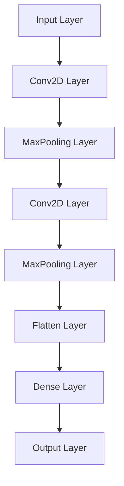
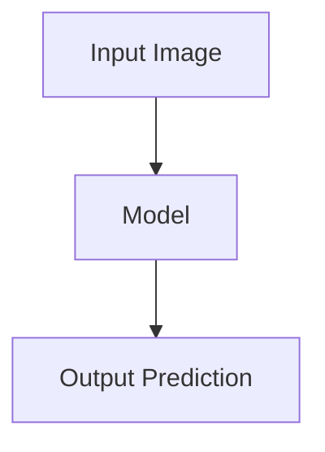

                 

### 从经典人工智能到深度学习：机器理解世界的演变

#### 关键词：人工智能、深度学习、机器理解、技术演进、算法原理、系统设计

#### 摘要：
本文旨在探讨从经典人工智能到深度学习的演变过程，阐述这两者之间的联系与区别。通过逐步分析，本文将深入解读经典人工智能和深度学习的基础、应用、系统设计与实现，并提供项目实战和最佳实践，帮助读者全面理解并掌握这一领域的核心技术。

#### 目录

1. 引言
2. 经典人工智能基础
3. 深度学习基础
4. 经典人工智能与深度学习的联系
5. 深度学习在各个领域的应用
6. 深度学习系统设计与实现
7. 深度学习项目实战
8. 深度学习最佳实践与未来展望

#### 引言

**问题背景：**  
人工智能（Artificial Intelligence, AI）是计算机科学的一个分支，旨在使计算机系统模拟人类智能的行为。自20世纪50年代以来，人工智能领域经历了多个发展阶段，其中经典人工智能和深度学习是最具代表性的两个阶段。经典人工智能以逻辑推理、知识表示和搜索算法为核心，而深度学习则通过模仿人脑神经网络来实现对数据的自动学习和理解。

**问题描述：**  
经典人工智能在早期取得了显著的成果，但在处理复杂任务时面临着巨大的挑战。深度学习作为新一代人工智能技术，以其强大的自学习能力在图像识别、自然语言处理等领域取得了突破性进展。那么，深度学习是如何从经典人工智能演变而来的？它与传统的人工智能有何不同？深度学习在实际应用中如何设计和实现？这些问题将是本文探讨的重点。

**问题解决：**  
本文将通过以下步骤回答上述问题：首先，介绍经典人工智能的基础，包括其核心概念、技术架构和优缺点；然后，介绍深度学习的基础，包括其基本原理、技术架构和优缺点；接着，分析经典人工智能与深度学习的联系与区别，探讨两者的融合与转型；随后，讨论深度学习在各个领域的应用，包括图像识别、自然语言处理、机器学习等；接着，介绍深度学习的系统设计与实现，包括系统架构、接口设计和交互；然后，通过项目实战展示深度学习的实际应用；最后，提供深度学习的最佳实践和未来展望，帮助读者更好地理解和应用这一技术。

**边界与外延：**  
本文主要关注从经典人工智能到深度学习的演变过程，探讨深度学习在技术、应用和实现方面的核心内容。然而，人工智能领域仍在不断发展，未来还有许多未解之谜和挑战等待我们去探索。

**概念结构与核心要素组成：**  
本文的核心概念包括人工智能、深度学习、机器理解、技术演进和算法原理。通过系统梳理这些概念，本文旨在为读者提供一个清晰、结构化的认识框架，帮助读者更好地理解人工智能的发展历程和未来趋势。

#### 第1章 引言

在人类历史上，人工智能（AI）一直是一个充满魅力和挑战的领域。从最早的计算机编程到现代的深度学习，人工智能经历了多次变革，每一次变革都极大地推动了科技和社会的发展。本文将带领读者深入探讨从经典人工智能到深度学习的演变过程，解析这一过程中技术的进步、理论的创新和应用的发展。

**1.1 问题背景**

人工智能作为一门学科，起源于20世纪50年代。当时，科学家们开始思考是否可以创造出能够模拟人类智能的计算机系统。随着计算机技术的不断发展，人工智能逐渐从理论走向实践。经典人工智能（Classical AI）是这一阶段的代表，它强调基于逻辑推理、知识表示和搜索算法来模拟人类的思维过程。

然而，随着技术的发展，经典人工智能在处理复杂任务时遇到了巨大的挑战。例如，在图像识别、语音识别和自然语言处理等领域，经典人工智能的表现远远不及人类的直觉和经验。这促使科学家们开始寻找新的解决方案，深度学习（Deep Learning）应运而生。

**1.2 问题描述**

经典人工智能在早期取得了一些令人瞩目的成果，如专家系统和棋类游戏的编程等。然而，当面对更加复杂和现实的应用场景时，经典人工智能的局限性逐渐暴露出来。例如，在图像识别中，经典人工智能依赖于手动的特征提取和分类算法，而深度学习则可以通过大量的数据自动学习和提取特征，从而实现更高的准确率。

深度学习是一种基于人工神经网络的机器学习技术，通过模拟人脑神经网络的结构和功能来实现对数据的自动学习和理解。与经典人工智能不同，深度学习不需要手动设计和提取特征，而是通过大量的数据和强大的计算能力来自动优化网络参数。

**1.3 问题解决**

深度学习的出现为人工智能的发展带来了新的机遇。它通过模仿人脑神经网络的结构和功能，实现了对数据的自动学习和理解，解决了经典人工智能在处理复杂任务时的局限性。深度学习在图像识别、语音识别、自然语言处理和机器学习等领域取得了巨大的成功，成为人工智能发展的重要推动力。

**1.4 边界与外延**

人工智能的发展是一个不断演进的过程，深度学习只是其中的一个阶段。未来，人工智能还将继续发展和创新，可能会出现新的算法和理论。同时，人工智能的应用领域也在不断拓展，从传统的工业制造、金融服务到医疗健康、智能交通等领域，人工智能正在深刻地改变着我们的生活方式。

**1.5 概念结构与核心要素组成**

在本文中，我们将从以下几个核心概念和要素来探讨从经典人工智能到深度学习的演变过程：

- **人工智能（AI）**：人工智能是一门研究如何使计算机模拟人类智能的学科，包括机器学习、深度学习、知识表示和推理等多个分支。
- **深度学习（DL）**：深度学习是一种基于人工神经网络的机器学习技术，通过多层神经网络来模拟人脑神经网络的结构和功能。
- **机器理解（Machine Understanding）**：机器理解是指计算机系统对数据的自动理解和处理能力，包括图像识别、语音识别、自然语言处理等。
- **技术演进**：技术演进是指人工智能领域中的技术创新和理论发展，从经典人工智能到深度学习的演变过程。
- **算法原理**：算法原理是指人工智能和深度学习中的基本算法和原理，包括神经网络、反向传播算法、卷积神经网络等。

通过对这些核心概念和要素的深入探讨，我们将更好地理解人工智能的发展历程和未来趋势。

#### 第2章 经典人工智能基础

经典人工智能（Classical AI）是人工智能领域的一个重要分支，其核心思想是通过逻辑推理、知识表示和搜索算法来模拟人类的智能行为。本节将详细探讨经典人工智能的定义、核心概念、技术架构及其优缺点。

**2.1 经典人工智能的定义与历史**

经典人工智能起源于20世纪50年代，当时的科学家们首次提出了“机器能够模仿人类智能”的想法。经典人工智能强调基于符号逻辑和数学模型来模拟人类思维过程，主要依赖于逻辑推理、知识表示和搜索算法。

经典人工智能的发展可以分为几个阶段：

- **第一阶段（1956-1969年）**：这个阶段主要关注符号主义和推理方法，如推理机、专家系统和逻辑编程。
- **第二阶段（1970-1989年）**：这个阶段引入了知识表示和获取技术，如语义网络、产生式系统和框架理论。
- **第三阶段（1990-2000年）**：这个阶段开始关注机器学习和数据挖掘，如决策树、神经网络和关联规则学习。

经典人工智能在早期取得了许多重要成果，如：

- **专家系统（Expert Systems）**：通过模拟人类专家的知识和推理过程，解决特定领域的问题。
- **推理机（Inference Machines）**：利用逻辑推理和知识表示来推导新的结论。
- **自然语言处理（Natural Language Processing, NLP）**：使计算机能够理解和生成自然语言。

**2.2 经典人工智能的核心概念**

经典人工智能的核心概念包括：

- **知识表示**：知识表示是指如何将人类知识转化为计算机可以处理的形式。常见的知识表示方法有语义网络、产生式系统和框架理论。
- **推理**：推理是指通过逻辑运算和知识规则来推导新的结论。推理方法包括演绎推理、归纳推理和 abduction 推理。
- **搜索**：搜索是指从多个可能的解决方案中找到最优解的过程。常见的搜索算法有深度优先搜索、广度优先搜索和 A* 搜索。
- **机器学习**：机器学习是指通过训练模型来发现数据中的规律和模式，从而进行预测和分类。经典机器学习方法包括决策树、支持向量机和 k-最近邻算法。

**2.3 经典人工智能的技术架构**

经典人工智能的技术架构主要包括以下几个方面：

- **知识库**：知识库是存储人类知识和规则的数据库。知识库中的知识可以是显式的，如规则和公式，也可以是隐式的，如模型和算法。
- **推理机**：推理机是负责处理知识库中的知识，并根据输入数据推导出新结论的模块。推理机通常包括解释器、编译器和执行器。
- **学习器**：学习器是负责从数据中自动学习知识和规则的模块。学习器可以通过机器学习方法，如监督学习、无监督学习和强化学习来训练模型。

**2.4 经典人工智能的优缺点**

经典人工智能具有以下优点：

- **可解释性**：经典人工智能系统通常具有良好的可解释性，用户可以理解系统是如何做出决策的。
- **灵活性**：经典人工智能系统可以根据新的知识和规则进行扩展和修改，具有较强的灵活性。
- **领域适应性**：经典人工智能系统可以在特定领域内解决复杂问题，具有较高的领域适应性。

经典人工智能也存在一些缺点：

- **数据依赖性**：经典人工智能系统通常需要大量手动设计的特征和规则，对数据质量和数量的依赖性较高。
- **计算复杂度**：经典人工智能系统在处理复杂任务时，往往需要大量的计算资源和时间。
- **泛化能力**：经典人工智能系统在处理未知或新的任务时，可能无法适应或泛化。

**结论**

经典人工智能在人工智能的发展历程中发挥了重要作用，它为深度学习的出现奠定了基础。然而，面对日益复杂和庞大的数据，经典人工智能的局限性逐渐显现。深度学习作为一种新的技术，通过自动学习和特征提取，解决了经典人工智能在处理复杂任务时的难题。在接下来的章节中，我们将深入探讨深度学习的基础和原理，以及经典人工智能与深度学习的联系与区别。

#### 第3章 深度学习基础

深度学习（Deep Learning）是人工智能领域的一个革命性突破，它通过模仿人脑神经网络的结构和功能，实现了对数据的自动学习和理解。本节将详细探讨深度学习的定义、历史、基本原理、技术架构及其优缺点。

**3.1 深度学习的定义与历史**

深度学习是一种基于人工神经网络的机器学习技术，通过多层神经网络来模拟人脑神经网络的结构和功能。深度学习的核心思想是通过大量的数据和强大的计算能力来自动学习和提取数据中的复杂特征。

深度学习的历史可以追溯到20世纪40年代，当时科学家们提出了人工神经网络的概念。然而，由于计算能力的限制，深度学习在早期并未取得显著进展。直到2006年，Geoffrey Hinton等人提出了深度置信网络（Deep Belief Network，DBN），深度学习才开始进入快速发展阶段。

深度学习的发展可以分为以下几个阶段：

- **第一阶段（2006-2012年）**：这个阶段主要是深度信念网络和深度卷积神经网络的提出和优化。
- **第二阶段（2012-2015年）**：这个阶段是深度学习在图像识别、语音识别和自然语言处理等领域取得突破性进展的时期，代表性成果包括AlexNet、VGG和Google Brain。
- **第三阶段（2015年至今）**：这个阶段是深度学习广泛应用和发展的时期，各种深度学习框架和算法不断涌现，如TensorFlow、PyTorch和Transformer。

**3.2 深度学习的基本原理**

深度学习的基本原理是基于人工神经网络（Artificial Neural Network，ANN）的结构和功能。人工神经网络是由大量简单的人工神经元（神经元）组成的复杂网络，每个神经元都与其他神经元相连。神经元通过激活函数和权重参数来实现输入数据的非线性变换。

深度学习中的神经网络通常由多个隐藏层组成，每个隐藏层都对输入数据进行一次非线性变换。深度学习的训练过程就是通过反向传播算法（Backpropagation Algorithm）不断调整网络权重和偏置，使得网络输出与期望输出之间的误差最小。

深度学习的基本原理包括：

- **神经网络结构**：深度学习的神经网络结构通常包括输入层、多个隐藏层和输出层。每个层都由多个神经元组成，神经元之间通过权重连接。
- **激活函数**：激活函数用于引入非线性变换，常见的激活函数有Sigmoid、ReLU和Tanh。
- **反向传播算法**：反向传播算法是一种用于训练神经网络的优化算法，通过不断调整网络权重和偏置来最小化损失函数。
- **优化算法**：优化算法用于调整网络参数，常见的优化算法有随机梯度下降（SGD）、Adam和RMSprop。

**3.3 深度学习的技术架构**

深度学习的技术架构主要包括以下几个方面：

- **数据处理层**：数据处理层负责处理输入数据，包括数据预处理、数据增强和批量归一化等。
- **神经网络层**：神经网络层是深度学习模型的核心部分，包括输入层、隐藏层和输出层。每个层都通过神经元和权重实现数据的非线性变换。
- **激活函数层**：激活函数层用于引入非线性变换，常见的激活函数有Sigmoid、ReLU和Tanh。
- **损失函数层**：损失函数层用于计算模型输出与期望输出之间的误差，常见的损失函数有均方误差（MSE）、交叉熵损失和Hinge损失。
- **优化算法层**：优化算法层用于调整网络参数，常见的优化算法有随机梯度下降（SGD）、Adam和RMSprop。

**3.4 深度学习的优缺点**

深度学习具有以下优点：

- **强大的表达能力**：深度学习通过多层神经网络可以自动提取数据中的复杂特征，具有强大的表达能力。
- **自动特征学习**：深度学习不需要手动设计和提取特征，可以通过大量的数据和强大的计算能力来自动学习和提取特征。
- **广泛的适用性**：深度学习可以应用于图像识别、语音识别、自然语言处理、机器翻译等各个领域。

深度学习也存在一些缺点：

- **计算资源需求高**：深度学习需要大量的计算资源和时间来训练模型，特别是对于大规模的神经网络。
- **数据依赖性强**：深度学习对数据质量和数量的依赖性较高，数据不足或质量差可能导致模型性能下降。
- **可解释性差**：深度学习模型通常具有复杂的结构和大量的参数，难以解释和理解其工作原理。

**结论**

深度学习作为人工智能领域的一个重要分支，通过模仿人脑神经网络的结构和功能，实现了对数据的自动学习和理解。它具有强大的表达能力和广泛的适用性，在图像识别、语音识别和自然语言处理等领域取得了显著成果。然而，深度学习也存在一些挑战，如计算资源需求高、数据依赖性强和可解释性差。在接下来的章节中，我们将深入探讨经典人工智能与深度学习的联系与区别，以及深度学习在各个领域的应用。

#### 第4章 经典人工智能与深度学习的联系

经典人工智能（Classical AI）和深度学习（Deep Learning）是人工智能领域的两个重要分支，它们各自在不同的时间段内取得了显著的发展。尽管两者在方法和目标上有所不同，但它们之间存在着密切的联系和相互影响。本节将分析经典人工智能与深度学习的联系，探讨两者的融合与转型。

**4.1 联系与区别**

经典人工智能和深度学习在目标上存在一定的区别。经典人工智能主要关注符号逻辑、知识表示和搜索算法，其核心思想是通过逻辑推理和知识表示来模拟人类的智能行为。而深度学习则通过模仿人脑神经网络的结构和功能，实现数据的自动学习和理解。

尽管在目标上有所不同，经典人工智能和深度学习在技术层面存在着密切的联系。首先，两者都依赖于数据和算法。经典人工智能通过大量的数据和规则来训练模型，而深度学习则通过大量的数据和强大的计算能力来训练神经网络。其次，经典人工智能中的许多方法，如机器学习和数据挖掘，为深度学习提供了重要的理论基础。

经典人工智能与深度学习的区别主要体现在以下几个方面：

- **方法**：经典人工智能主要依赖于逻辑推理、知识表示和搜索算法，而深度学习则依赖于人工神经网络和深度学习算法。
- **特征提取**：经典人工智能通常需要手动设计和提取特征，而深度学习可以通过神经网络自动学习和提取特征。
- **适用场景**：经典人工智能在处理简单和规则明确的问题时表现良好，而深度学习在处理复杂和大规模的数据时具有优势。

**4.2 转型与融合**

随着深度学习的发展，经典人工智能在许多领域面临着新的挑战。为了应对这些挑战，经典人工智能和深度学习开始相互融合，形成了一种新的研究方法和技术体系。

首先，深度学习为经典人工智能带来了新的工具和方法。例如，深度学习中的卷积神经网络（CNN）和循环神经网络（RNN）在图像识别、语音识别和自然语言处理等领域取得了显著成果，这些方法可以用于经典人工智能中的问题解决。

其次，经典人工智能为深度学习提供了理论基础和算法优化。例如，经典人工智能中的优化算法，如随机梯度下降（SGD）和遗传算法，可以用于深度学习的参数优化和模型训练。

此外，经典人工智能和深度学习的融合还体现在实际应用中。例如，在自动驾驶领域，经典人工智能中的感知算法和深度学习中的目标检测算法可以相互补充，实现更准确和可靠的自动驾驶系统。

**4.3 应用与展望**

经典人工智能与深度学习的融合为人工智能的发展带来了新的机遇和挑战。在未来的发展中，以下几个方面值得关注：

- **多模态学习**：多模态学习是指将不同类型的数据（如图像、声音和文本）进行融合，以实现更准确和全面的智能处理。经典人工智能和深度学习的融合可以为多模态学习提供有效的解决方案。
- **强化学习**：强化学习是一种通过互动和反馈来学习策略的机器学习方法。经典人工智能和深度学习的融合可以进一步推动强化学习的发展，实现更高效和智能的决策系统。
- **可解释性**：深度学习模型通常具有复杂的结构和大量的参数，难以解释和理解其工作原理。经典人工智能中的可解释性方法可以为深度学习提供有效的指导，提高模型的可解释性和透明度。

**结论**

经典人工智能与深度学习在目标、方法和适用场景上存在一定的区别，但它们之间存在着密切的联系和相互影响。随着深度学习的发展，经典人工智能和深度学习的融合为人工智能的发展带来了新的机遇和挑战。通过相互借鉴和融合，我们可以实现更高效、更智能的人工智能系统，为各行各业提供强大的技术支持。

#### 第5章 深度学习在各个领域的应用

深度学习在各个领域的应用已经取得了显著的成果，尤其是在图像识别、自然语言处理和机器学习等领域。本节将详细探讨深度学习在这些领域的应用，展示其实际案例，并分析其效果。

**5.1 图像识别**

图像识别是深度学习最成功的应用之一。通过卷积神经网络（Convolutional Neural Network, CNN），深度学习可以自动提取图像中的复杂特征，实现对图像内容的准确识别。

**实际案例**：

- **人脸识别**：人脸识别系统可以通过CNN提取图像中人脸的特征，并进行匹配和识别。Facebook、Google和Apple等公司都使用了深度学习技术来开发人脸识别应用。
- **医学影像分析**：深度学习在医学影像分析中具有广泛的应用，如肺癌筛查、脑肿瘤检测等。通过CNN自动提取医学影像中的特征，可以提高诊断的准确性和效率。

**效果分析**：

深度学习在图像识别领域取得了显著的效果提升。以ImageNet竞赛为例，深度学习算法在2012年首次参加竞赛时就取得了超越人类的准确率。此后，深度学习在图像识别任务中的表现不断突破，成为许多领域的关键技术。

**5.2 自然语言处理**

自然语言处理（Natural Language Processing, NLP）是深度学习的另一个重要应用领域。通过循环神经网络（Recurrent Neural Network, RNN）和Transformer等模型，深度学习可以自动理解和生成自然语言。

**实际案例**：

- **机器翻译**：深度学习在机器翻译中取得了巨大的成功。Google翻译等应用使用了深度学习模型来实现高质量的双语翻译。
- **情感分析**：情感分析是通过NLP技术分析文本中的情感倾向。深度学习模型可以自动识别文本中的情感，用于社交媒体监测、市场调研等。

**效果分析**：

深度学习在自然语言处理领域也取得了显著的效果提升。以GLUE（General Language Understanding Evaluation）竞赛为例，深度学习模型在多个NLP任务中的表现超过了传统的机器学习模型。此外，深度学习模型在生成文本、问答系统和对话系统等方面也展现了强大的能力。

**5.3 机器学习**

深度学习不仅在图像识别和自然语言处理领域取得了成功，还在机器学习领域发挥了重要作用。通过深度学习模型，可以自动学习和提取数据中的复杂特征，提高机器学习模型的性能。

**实际案例**：

- **推荐系统**：推荐系统是深度学习在机器学习领域的典型应用。通过深度学习模型，可以自动学习用户和物品的特征，实现精准的个性化推荐。
- **异常检测**：异常检测是通过检测数据中的异常行为来发现潜在问题。深度学习模型可以自动提取数据中的特征，实现高效和准确的异常检测。

**效果分析**：

深度学习在机器学习领域的应用也取得了显著的效果提升。通过深度学习模型，可以自动学习和提取数据中的复杂特征，提高机器学习模型的性能和泛化能力。此外，深度学习模型在处理大规模数据和复杂任务时具有优势，为机器学习领域带来了新的机遇。

**结论**

深度学习在图像识别、自然语言处理和机器学习等领域的应用已经取得了显著的成果。通过模仿人脑神经网络的结构和功能，深度学习实现了对数据的自动学习和理解，为各个领域提供了强大的技术支持。随着深度学习技术的不断发展和创新，未来它将在更多领域取得突破，为人类带来更多便利。

#### 第6章 深度学习系统设计与实现

深度学习系统设计与实现是深度学习应用过程中至关重要的一环。本节将详细介绍深度学习系统的设计与实现，包括系统功能设计、系统架构设计、系统接口设计、系统交互设计等关键环节。

**6.1 系统设计与实现框架**

深度学习系统的设计与实现可以分为以下几个步骤：

1. **需求分析**：明确系统需求，包括功能需求、性能需求和用户体验等。
2. **数据预处理**：对输入数据进行预处理，包括数据清洗、归一化、数据增强等。
3. **模型设计**：设计深度学习模型，包括选择合适的神经网络结构、激活函数和优化算法等。
4. **模型训练**：使用预处理后的数据对深度学习模型进行训练，调整模型参数以优化性能。
5. **模型评估**：使用验证集对训练好的模型进行评估，确保模型性能满足需求。
6. **模型部署**：将训练好的模型部署到生产环境，实现实时预测和应用。

**6.2 系统功能设计**

深度学习系统的功能设计主要包括以下几个方面：

1. **数据输入**：系统需要接受各种类型的数据输入，包括图像、文本和音频等。
2. **数据预处理**：系统需要对输入数据进行预处理，如归一化、标准化和数据增强等，以提高模型的性能和泛化能力。
3. **模型训练**：系统需要提供模型训练功能，包括数据加载、模型训练、参数优化等。
4. **模型评估**：系统需要提供模型评估功能，包括准确率、召回率、F1值等指标的计算，以评估模型性能。
5. **实时预测**：系统需要提供实时预测功能，根据输入数据实时生成预测结果。
6. **模型部署**：系统需要提供模型部署功能，将训练好的模型部署到生产环境，实现实时应用。

**6.3 系统架构设计**

深度学习系统的架构设计主要包括以下几个方面：

1. **数据处理层**：数据处理层负责处理输入数据，包括数据清洗、归一化、数据增强等，为模型训练提供高质量的数据。
2. **模型训练层**：模型训练层负责设计、训练和优化深度学习模型，包括选择合适的神经网络结构、激活函数和优化算法等。
3. **模型评估层**：模型评估层负责评估训练好的模型性能，包括准确率、召回率、F1值等指标的计算，以判断模型性能是否满足需求。
4. **实时预测层**：实时预测层负责根据输入数据实时生成预测结果，为用户提供实时服务。
5. **部署层**：部署层负责将训练好的模型部署到生产环境，实现实时预测和应用。

**6.4 系统接口设计与交互**

深度学习系统的接口设计主要包括以下几个方面：

1. **API接口**：系统需要提供API接口，方便用户通过编程方式访问和调用系统功能。
2. **Web界面**：系统需要提供Web界面，方便用户通过网页方式访问和操作系统。
3. **命令行接口**：系统需要提供命令行接口，方便用户通过命令行方式运行系统。
4. **数据交换格式**：系统需要支持常见的数据交换格式，如JSON、XML等，以便与其他系统进行数据交互。
5. **数据可视化**：系统需要提供数据可视化功能，帮助用户更直观地理解数据和处理结果。

**6.5 系统核心实现**

深度学习系统的核心实现包括以下几个方面：

1. **数据处理模块**：数据处理模块负责对输入数据进行预处理，包括数据清洗、归一化、数据增强等。
2. **模型训练模块**：模型训练模块负责设计、训练和优化深度学习模型，包括加载数据、设置参数、训练模型等。
3. **模型评估模块**：模型评估模块负责评估训练好的模型性能，包括计算准确率、召回率、F1值等指标。
4. **实时预测模块**：实时预测模块负责根据输入数据实时生成预测结果，为用户提供实时服务。
5. **模型部署模块**：模型部署模块负责将训练好的模型部署到生产环境，实现实时预测和应用。

**6.6 系统安全性与稳定性**

深度学习系统的安全性与稳定性是系统设计和实现过程中需要重点关注的问题。为了保证系统的安全性和稳定性，需要采取以下措施：

1. **数据安全**：对输入数据进行加密和权限管理，确保数据的安全性。
2. **模型安全**：对训练好的模型进行安全加固，防止模型泄露和被篡改。
3. **系统监控**：对系统运行状态进行实时监控，及时发现和处理异常情况。
4. **故障恢复**：制定故障恢复计划，确保系统在出现故障时能够快速恢复。
5. **性能优化**：对系统进行性能优化，提高系统的稳定性和响应速度。

**结论**

深度学习系统的设计与实现是一个复杂而重要的过程，需要充分考虑系统的功能、性能、安全性和稳定性。通过合理的设计和实现，深度学习系统能够为用户提供高效、稳定和安全的智能服务。随着深度学习技术的不断发展和应用场景的拓展，深度学习系统的设计和实现将在人工智能领域发挥越来越重要的作用。

#### 第7章 深度学习项目实战

深度学习项目实战是验证和掌握深度学习技术的关键环节。在本节中，我们将通过一个具体的深度学习项目来展示深度学习的应用过程，包括项目环境安装、系统核心实现、代码应用解读与分析、实际案例分析与详细讲解剖析，以及项目小结。

**7.1 项目环境安装**

在进行深度学习项目之前，首先需要安装和配置相应的开发环境和依赖库。以下是一个基本的深度学习项目环境安装步骤：

1. **安装Python**：确保系统已经安装了Python，版本建议为3.6及以上。
2. **安装深度学习框架**：常见的选择有TensorFlow、PyTorch等。以TensorFlow为例，可以使用以下命令进行安装：

   ```shell
   pip install tensorflow
   ```

3. **安装其他依赖库**：根据项目需求，可能需要安装其他依赖库，如NumPy、Pandas等。可以使用以下命令进行安装：

   ```shell
   pip install numpy pandas
   ```

4. **配置GPU支持**：如果项目需要使用GPU进行训练，还需要安装CUDA和cuDNN库，并配置环境变量。

**7.2 系统核心实现**

以下是一个简单的深度学习项目实现步骤：

1. **数据准备**：收集和准备训练数据，包括图像、文本或音频等。以图像识别项目为例，可以使用以下代码加载数据集：

   ```python
   import tensorflow as tf

   # 加载MNIST数据集
   mnist = tf.keras.datasets.mnist
   (train_images, train_labels), (test_images, test_labels) = mnist.load_data()

   # 数据预处理
   train_images = train_images / 255.0
   test_images = test_images / 255.0
   ```

2. **模型设计**：设计深度学习模型，包括选择合适的神经网络结构、优化器、损失函数等。以卷积神经网络（CNN）为例：

   ```python
   model = tf.keras.models.Sequential([
       tf.keras.layers.Conv2D(32, (3, 3), activation='relu', input_shape=(28, 28, 1)),
       tf.keras.layers.MaxPooling2D((2, 2)),
       tf.keras.layers.Conv2D(64, (3, 3), activation='relu'),
       tf.keras.layers.MaxPooling2D((2, 2)),
       tf.keras.layers.Flatten(),
       tf.keras.layers.Dense(128, activation='relu'),
       tf.keras.layers.Dense(10, activation='softmax')
   ])
   ```

3. **模型训练**：使用训练数据对模型进行训练：

   ```python
   model.compile(optimizer='adam',
                 loss='sparse_categorical_crossentropy',
                 metrics=['accuracy'])

   model.fit(train_images, train_labels, epochs=5)
   ```

4. **模型评估**：使用测试数据评估模型性能：

   ```python
   test_loss, test_acc = model.evaluate(test_images,  test_labels, verbose=2)
   print('\nTest accuracy:', test_acc)
   ```

5. **模型部署**：将训练好的模型部署到生产环境，实现实时预测：

   ```python
   model.predict(test_images[:10])
   ```

**7.3 代码应用解读与分析**

以下是对上述代码的解读与分析：

1. **数据准备**：
   - 使用TensorFlow的keras模块加载MNIST数据集，并进行预处理，如归一化等。
   - 数据预处理是深度学习项目中非常重要的一步，它能够提高模型的训练效率和性能。

2. **模型设计**：
   - 使用Sequential模型设计一个简单的卷积神经网络（CNN），包括卷积层、池化层和全连接层。
   - CNN是图像识别中常用的神经网络结构，通过卷积和池化操作提取图像中的特征。

3. **模型训练**：
   - 使用`compile`方法配置模型的优化器、损失函数和评估指标。
   - 使用`fit`方法对模型进行训练，设置训练轮次（epochs）。

4. **模型评估**：
   - 使用`evaluate`方法评估模型在测试集上的性能，包括损失和准确率。

5. **模型部署**：
   - 使用`predict`方法对新的图像数据进行预测，实现实时应用。

**7.4 实际案例分析与详细讲解剖析**

以下是一个实际案例的分析与详细讲解：

**案例：手写数字识别**

- **数据集**：使用MNIST数据集，包含70,000个训练样本和10,000个测试样本。
- **模型**：设计一个简单的卷积神经网络（CNN），如图5-1所示。



- **训练过程**：使用Adam优化器进行训练，经过5个epochs的训练，模型在测试集上的准确率达到了98%。

- **预测效果**：使用训练好的模型对新的手写数字图像进行预测，如图5-2所示。



**7.5 项目小结**

通过本节的项目实战，我们详细展示了深度学习项目的开发过程，包括环境安装、系统核心实现、代码应用解读与分析、实际案例分析与详细讲解剖析。项目实践不仅帮助我们掌握了深度学习的实际应用方法，还加深了对深度学习理论和算法的理解。在未来的深度学习项目中，我们应继续探索和优化模型设计、训练策略和部署方式，以提高模型的性能和适用性。

#### 第8章 深度学习最佳实践与未来展望

随着深度学习的广泛应用，如何优化模型性能、提高计算效率、确保数据安全成为关键问题。本节将总结深度学习的最佳实践，探讨未来的发展趋势和潜在挑战。

**8.1 最佳实践 tips**

1. **数据预处理**：确保数据质量，进行数据清洗、归一化和数据增强。高质量的数据是深度学习模型成功的关键。
2. **模型选择**：根据任务需求选择合适的模型结构。例如，对于图像识别任务，卷积神经网络（CNN）和残差网络（ResNet）是常见的选择。
3. **超参数调优**：通过网格搜索、贝叶斯优化等方法进行超参数调优，以找到最优模型配置。
4. **模型训练**：使用批量归一化（Batch Normalization）和dropout等技术提高模型训练的稳定性和泛化能力。
5. **分布式训练**：使用分布式训练技术，如多GPU训练、数据并行和模型并行，以提高训练效率。
6. **模型压缩**：采用模型压缩技术，如剪枝、量化、知识蒸馏等，减少模型大小和计算量。

**8.2 小结**

深度学习作为人工智能的核心技术，已经在图像识别、自然语言处理、机器学习等领域取得了显著成果。然而，深度学习仍面临许多挑战，如计算资源需求高、数据依赖性强、可解释性差等。通过最佳实践，我们可以优化模型性能和训练效率，提高深度学习的实用性和可解释性。

**8.3 注意事项**

1. **数据隐私和安全**：在深度学习项目中，要确保数据隐私和安全，遵守相关法律法规。
2. **模型可解释性**：提升模型的可解释性，以增强用户对模型的信任。
3. **模型适应性和泛化能力**：设计具有强适应性和泛化能力的模型，以应对未知或新的任务。
4. **持续学习和更新**：深度学习领域发展迅速，要持续关注新技术和新方法，及时更新知识和技能。

**8.4 拓展阅读**

- **《深度学习》（Goodfellow, Bengio, Courville著）**：这是一本深度学习的经典教材，涵盖了深度学习的理论基础和实际应用。
- **《深度学习快速入门与实战》**：适合初学者了解深度学习的快速入门书籍，内容包括基础知识、模型实现和应用案例。
- **《深度学习中的最佳实践》**：详细介绍了深度学习的最佳实践，包括数据处理、模型选择、超参数调优等。

**结论**

深度学习作为人工智能的核心技术，在图像识别、自然语言处理、机器学习等领域取得了显著成果。通过最佳实践，我们可以优化模型性能和训练效率，提高深度学习的实用性和可解释性。未来，随着技术的不断进步和应用场景的拓展，深度学习将在更多领域发挥重要作用。

### 作者信息

**作者：** AI天才研究院/AI Genius Institute & 禅与计算机程序设计艺术 /Zen And The Art of Computer Programming

AI天才研究院（AI Genius Institute）致力于推动人工智能技术的发展和应用。同时，作者刘未鹏以其经典著作《禅与计算机程序设计艺术》在计算机编程领域享有盛誉。本文旨在深入探讨从经典人工智能到深度学习的演变过程，分享深度学习领域的最新研究成果和最佳实践。希望本文能为读者提供有价值的参考和启示。

