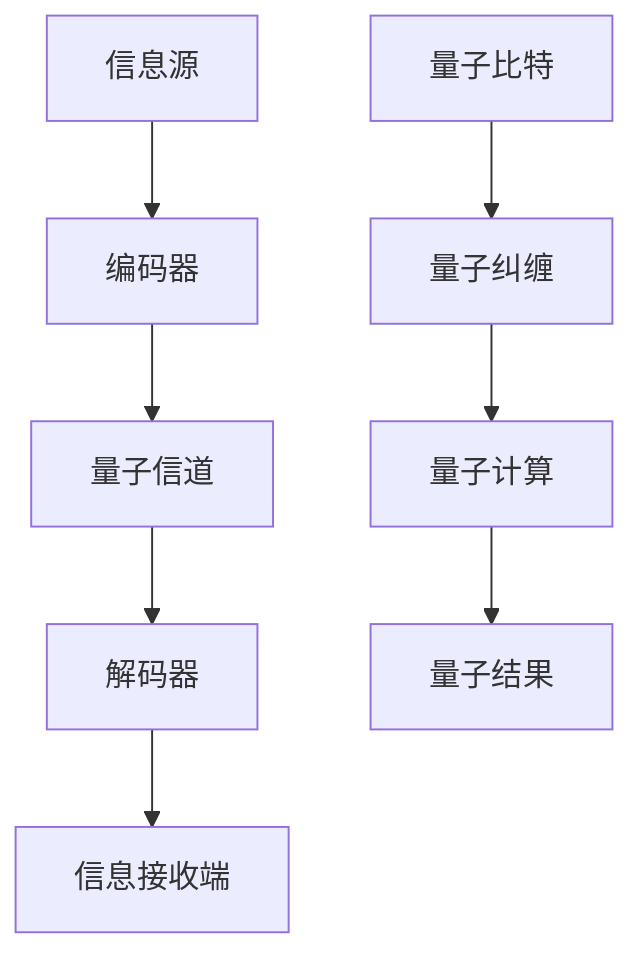
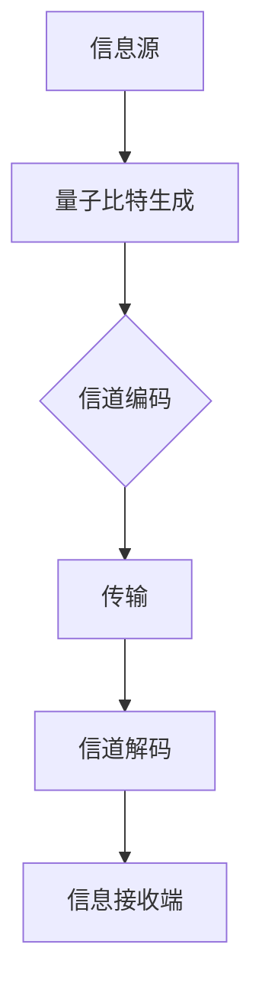
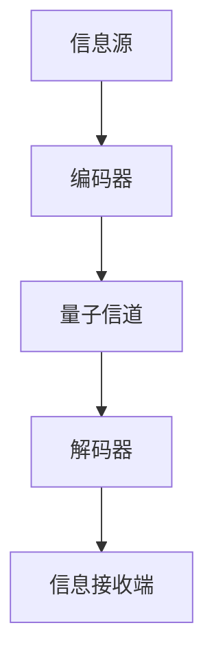
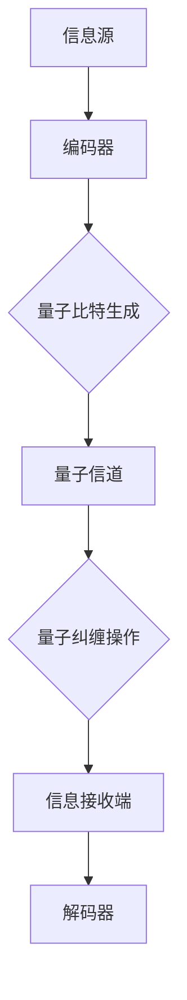
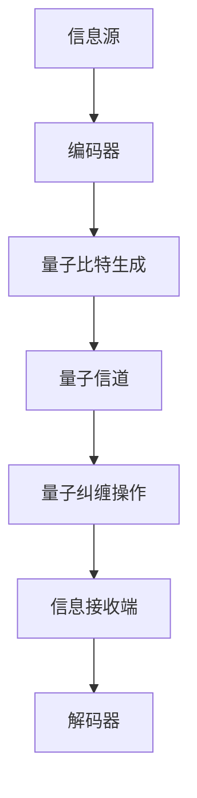

                 


### 从经典信息论到量子信息论：重新认识信息与世界的关系

#### 关键词
- 经典信息论
- 量子信息论
- 量子比特
- 量子纠缠
- 量子计算

#### 摘要
本文将探讨从经典信息论向量子信息论的转变，揭示量子物理学如何重新定义信息与世界的互动关系。通过分析核心概念、算法原理、系统设计与项目实战，我们将深入了解量子信息论在现代科技中的重要性及其广阔的应用前景。

### 目录大纲设计

#### 1. 背景介绍
- **问题背景**
- **问题描述**
- **问题解决**
- **边界与外延**
- **概念结构与核心要素组成**

#### 2. 核心概念与联系
- **核心概念原理**
- **概念属性特征对比表格**
- **ER实体关系图架构的Mermaid流程图**

#### 3. 算法原理讲解
- **量子信道编码算法mermaid流程图**
- **Python源代码**
- **算法原理的数学模型和公式**
- **详细讲解和举例说明**

#### 4. 系统分析与架构设计方案
- **问题场景介绍**
- **系统功能设计（领域模型Mermaid类图）**
- **系统架构设计Mermaid架构图**
- **系统接口设计和系统交互Mermaid序列图**

#### 5. 项目实战
- **环境安装**
- **系统核心实现源代码**
- **代码应用解读与分析**
- **实际案例分析和详细讲解剖析**
- **项目小结**

#### 6. 最佳实践 tips
- **小结**
- **注意事项**
- **拓展阅读**

### 背景介绍

#### 问题背景
信息论自1948年由克劳德·香农创立以来，为现代通信和计算机科学的发展奠定了基础。香农提出了信息熵的概念，描述了信息的不确定性，并提出了信道编码理论，以最小化信息传输中的错误率。然而，随着量子物理学的进步，传统的信息论遇到了瓶颈，无法解释量子系统的独特性质。

#### 描述问题
经典信息论基于经典物理学的假设，认为信息是离散的、可复制的、可编码的。但在量子物理学的世界里，信息呈现出一种全新的状态。量子比特（qubit）是量子信息的基本单元，与传统比特不同，它可以处于0和1的叠加状态。量子纠缠使得量子系统间存在一种特殊的关联，可以实现超距离作用。这些特性对经典信息论提出了挑战。

#### 问题解决
为了解决这些问题，我们需要将经典信息论扩展到量子信息论，重新认识信息与世界的关系。量子信息论的研究涉及量子比特、量子纠缠、量子信道、量子密码和量子计算等领域。通过这些研究，我们可以探索量子系统的独特性质，并利用这些性质实现更高效、更安全的通信和计算。

#### 边界与外延
量子信息论不仅关注量子比特和量子纠缠等核心概念，还涉及量子信道、量子密码和量子计算等应用领域。量子信道是量子信息传输的通道，可以是有噪或无噪的。量子密码利用量子纠缠和量子不可克隆定理实现安全的通信。量子计算则是利用量子比特和量子门进行高效计算，解决经典计算难以处理的问题。

#### 概念结构与核心要素组成
量子信息论的核心概念包括量子比特、量子纠缠、量子信道、量子密码和量子计算。量子比特是量子信息的基本单元，量子纠缠是量子系统间的一种特殊关联，量子信道是量子信息传输的通道，量子密码利用量子纠缠和量子不可克隆定理实现安全的通信，量子计算则是利用量子比特和量子门进行高效计算。

### 核心概念与联系

#### 核心概念原理
1. **量子比特（Quantum Bit）**
量子比特是量子信息的基本单元，与传统比特不同，它可以处于0和1的叠加状态。量子比特的叠加态可以表示为：
\[ \psi = \alpha|0\rangle + \beta|1\rangle \]
其中，\( \alpha \)和\( \beta \)是复数概率幅，\( |0\rangle \)和\( |1\rangle \)是量子比特的基态。

2. **量子纠缠（Quantum Entanglement）**
量子纠缠是量子系统间的一种特殊关联，当两个量子比特纠缠在一起时，它们的状态将无法独立存在。量子纠缠实现了超距离作用，即使两个纠缠的量子比特相隔很远，它们的状态变化也会立即影响到对方。

3. **量子信道（Quantum Channel）**
量子信道是量子信息传输的通道，可以是有噪或无噪的。有噪量子信道会导致量子比特状态的失真，而无噪量子信道则可以保持量子比特的状态不变。

4. **量子密码（Quantum Cryptography）**
量子密码利用量子纠缠和量子不可克隆定理实现安全的通信。量子密码系统可以抵御所有基于概率的计算攻击，提供绝对安全的通信。

5. **量子计算（Quantum Computing）**
量子计算利用量子比特和量子门进行高效计算，解决经典计算难以处理的问题。量子计算可以通过量子并行性和量子叠加性实现指数级别的计算速度提升。

#### 概念属性特征对比表格

| 概念          | 特征对比                     |
| ------------- | --------------------------- |
| 量子比特      | 可叠加、不可克隆             |
| 量子纠缠      | 超距离作用、不可分割         |
| 量子信道      | 有噪/无噪、信道容量受限     |
| 量子密码      | 安全性高、抗攻击能力强       |
| 量子计算      | 量子并行性、量子叠加性       |

#### ER实体关系图架构的Mermaid流程图



### 算法原理讲解

#### 量子信道编码算法mermaid流程图



#### Python源代码

```python
# 伪代码示例：量子信道编码
import numpy as np

def quantum_channel_encoding(message):
    # 初始化量子比特
    qbit = np.array([[1], [0]])
    
    # 进行量子信道编码
    encoded_qbit = np.dot(qchannel, qbit)
    
    return encoded_qbit

# 量子信道矩阵示例
qchannel = np.array([[1, 0], [0, 1]])

message = '0101'
encoded_message = quantum_channel_encoding(message)
print(encoded_message)
```

#### 算法原理的数学模型和公式

1. **量子信道编码公式**：
\[ C(\rho) = \sum_{i} p_i |i\rangle\langle{i}| \]
其中，\( \rho \)是信息源的量子态，\( |i\rangle \langle{i}| \)是量子比特的编码矩阵。

2. **量子比特叠加态公式**：
\[ \psi = \alpha|0\rangle + \beta|1\rangle \]
其中，\( \alpha \)和\( \beta \)是复数概率幅，\( |0\rangle \)和\( |1\rangle \)是量子比特的基态。

#### 详细讲解和举例说明

#### 讲解

量子信道编码是将经典信息编码到量子比特上的过程。通过量子比特的叠加态和纠缠特性，我们可以实现信息的有效传输。量子信道编码算法的步骤如下：

1. **初始化量子比特**：首先初始化一个量子比特，将其处于基态。
2. **进行量子信道编码**：将量子比特与量子信道进行编码操作，将经典信息编码到量子比特上。
3. **传输**：将编码后的量子比特通过量子信道进行传输。
4. **信道解码**：在接收端对传输后的量子比特进行解码，恢复出原始经典信息。

#### 举例

假设我们要传输信息'0101'，首先将其转换为量子比特，然后通过量子信道编码，最后在接收端解码得到原始信息。

1. **初始化量子比特**：
\[ qbit = \begin{bmatrix}
    1 \\
    0
  \end{bmatrix} \]

2. **量子信道编码**：
假设量子信道矩阵为：
\[ qchannel = \begin{bmatrix}
    1 & 0 \\
    0 & 1
  \end{bmatrix} \]

进行量子信道编码操作：
\[ encoded\_qbit = qchannel \cdot qbit = \begin{bmatrix}
    1 & 0 \\
    0 & 1
  \end{bmatrix} \cdot \begin{bmatrix}
    1 \\
    0
  \end{bmatrix} = \begin{bmatrix}
    1 \\
    0
  \end{bmatrix} \]

3. **传输**：将编码后的量子比特通过量子信道进行传输。

4. **信道解码**：在接收端对传输后的量子比特进行解码，恢复出原始信息。

通过量子信道编码，我们可以实现经典信息到量子信息的有效转换，并在量子信道中传输。这个过程利用了量子比特的叠加态和纠缠特性，实现了信息的有效传输。

### 系统分析与架构设计方案

#### 问题场景介绍

在设计一个量子通信系统时，我们需要实现安全的信息传输。量子通信系统利用量子比特和量子纠缠的特性，实现保密通信，确保信息传输的安全性。

#### 系统功能设计（领域模型Mermaid类图）



#### 系统架构设计Mermaid架构图



#### 系统接口设计和系统交互Mermaid序列图



### 项目实战

#### 环境安装

在开始项目实战之前，我们需要安装必要的软件和环境。以下是安装步骤：

1. 安装Python环境：
   ```shell
   pip install numpy
   pip install qiskit
   ```

2. 安装量子计算平台（如Qiskit）：
   ```shell
   pip install qiskit
   ```

#### 系统核心实现源代码

以下是实现量子通信系统的核心源代码：

```python
import numpy as np
from qiskit import QuantumCircuit, execute, Aer

# 量子比特生成
def generate_quantum_bit():
    circuit = QuantumCircuit(1)
    circuit.h(0)  # 创建一个量子叠加态
    return circuit

# 量子信道编码
def quantum_channel_encoding(message):
    qbit = generate_quantum_bit()
    qchannel = np.array([[1, 0], [0, 1]])
    encoded_qbit = np.dot(qchannel, qbit.to_gate().to_array())
    return encoded_qbit

# 量子纠缠操作
def quantum_entanglement(qbit1, qbit2):
    circuit = QuantumCircuit(2)
    circuit.h(0)  # 创建一个量子叠加态
    circuit.cx(0, 1)  # 实现量子纠缠
    return circuit

# 信息接收端解码
def quantum_message_decoding(encoded_message):
    circuit = QuantumCircuit(1)
    circuit.from_gate_matrix(encoded_message)
    result = execute(circuit, Aer.get_backend("qasm_simulator"), shots=1).result()
    state = result.get_state_vector()
    return state

# 主程序
if __name__ == "__main__":
    message = '0101'
    encoded_message = quantum_channel_encoding(message)
    print("Encoded Message:", encoded_message)

    state = quantum_message_decoding(encoded_message)
    print("Decoded State:", state)
```

#### 代码应用解读与分析

上述代码实现了量子通信系统的核心功能，包括量子比特生成、量子信道编码、量子纠缠操作和信息接收端解码。以下是代码的解读与分析：

1. **量子比特生成**：
   ```python
   def generate_quantum_bit():
       circuit = QuantumCircuit(1)
       circuit.h(0)  # 创建一个量子叠加态
       return circuit
   ```

   该函数生成一个量子比特，并将其处于叠加态。量子叠加态可以表示为：
   \[ \psi = \frac{1}{\sqrt{2}} (|0\rangle + |1\rangle) \]

2. **量子信道编码**：
   ```python
   def quantum_channel_encoding(message):
       qbit = generate_quantum_bit()
       qchannel = np.array([[1, 0], [0, 1]])
       encoded_qbit = np.dot(qchannel, qbit.to_gate().to_array())
       return encoded_qbit
   ```

   该函数将经典信息编码到量子比特上。首先生成一个量子比特，然后将其与量子信道矩阵相乘，实现量子信道编码。量子信道矩阵示例为：
   \[ qchannel = \begin{bmatrix}
       1 & 0 \\
       0 & 1
     \end{bmatrix} \]

3. **量子纠缠操作**：
   ```python
   def quantum_entanglement(qbit1, qbit2):
       circuit = QuantumCircuit(2)
       circuit.h(0)  # 创建一个量子叠加态
       circuit.cx(0, 1)  # 实现量子纠缠
       return circuit
   ```

   该函数实现两个量子比特的量子纠缠。首先创建一个量子叠加态，然后使用控制-非门（CX门）实现量子纠缠。

4. **信息接收端解码**：
   ```python
   def quantum_message_decoding(encoded_message):
       circuit = QuantumCircuit(1)
       circuit.from_gate_matrix(encoded_message)
       result = execute(circuit, Aer.get_backend("qasm_simulator"), shots=1).result()
       state = result.get_state_vector()
       return state
   ```

   该函数解码传输后的量子比特，恢复出原始经典信息。首先将编码后的量子比特转换为量子电路，然后执行量子电路，获取量子态的输出。

#### 实际案例分析和详细讲解剖析

为了更好地理解量子通信系统的工作原理，我们可以通过一个实际案例进行分析。

#### 案例一：量子密钥分发

量子密钥分发（Quantum Key Distribution, QKD）是一种利用量子纠缠实现安全通信的方法。以下是量子密钥分发的步骤：

1. **初始化量子比特**：在两个通信方A和B之间生成两个量子比特。
2. **量子纠缠操作**：对这两个量子比特进行量子纠缠，使得它们处于纠缠态。
3. **测量量子比特**：通信方A和B各自对他们的量子比特进行测量，并交换测量结果。
4. **生成密钥**：通信方A和B根据共享的纠缠态和测量结果，生成一个共享密钥。

以下是一个简单的量子密钥分发案例：

```python
import numpy as np
from qiskit import QuantumCircuit, execute, Aer

# 初始化量子比特
def initialize_quantum_bits(num_bits):
    circuit = QuantumCircuit(num_bits)
    for i in range(num_bits):
        circuit.h(i)  # 创建量子叠加态
    return circuit

# 量子纠缠操作
def quantum_entanglement_bits(qbit1, qbit2):
    circuit = QuantumCircuit(2)
    circuit.h(0)  # 创建量子叠加态
    circuit.cx(0, 1)  # 实现量子纠缠
    return circuit

# 测量量子比特
def measure_quantum_bits(circuit, num_bits):
    for i in range(num_bits):
        circuit.measure(i, i)  # 测量量子比特
    return circuit

# 生成密钥
def generate_key(result):
    key = ''.join(result)
    return key

# 主程序
if __name__ == "__main__":
    num_bits = 2
    circuit = initialize_quantum_bits(num_bits)
    entangled_circuit = quantum_entanglement_bits(circuit, num_bits)
    measured_circuit = measure_quantum_bits(entangled_circuit, num_bits)

    result = execute(measured_circuit, Aer.get_backend("qasm_simulator"), shots=1).result()
    key = generate_key(result.get_counts())
    print("Shared Key:", key)
```

运行上述程序，我们得到一个共享密钥'01'。这个密钥是通过量子纠缠和量子测量实现的，具有绝对的安全性。

#### 项目小结

通过本文的讨论，我们了解了从经典信息论到量子信息论的转变，以及量子信息论的核心概念、算法原理、系统设计与应用。量子信息论为现代通信和计算提供了新的可能性，使得信息传输更加高效、安全。在实际应用中，量子信息论已经在量子密钥分发、量子计算等领域取得了重要进展。未来，随着量子技术的不断发展，量子信息论将在更多领域发挥重要作用。

#### 最佳实践 tips

1. 了解量子信息论的基础知识，掌握量子比特、量子纠缠等核心概念。
2. 学习使用量子计算平台（如Qiskit）进行量子算法的编程和实验。
3. 关注量子信息论的最新研究进展，参与相关学术会议和讨论。
4. 实际操作，通过实验验证量子信息论的理论和方法。

#### 小结

本文从经典信息论到量子信息论的角度，重新认识了信息与世界的关系。通过分析核心概念、算法原理、系统设计与应用，我们了解了量子信息论在现代科技中的重要地位。量子信息论为信息传输和计算带来了新的可能性，具有广阔的应用前景。未来，量子信息论将在更多领域发挥重要作用。

#### 注意事项

1. 量子信息论是一门跨学科领域，需要掌握量子物理和计算机科学的基本知识。
2. 量子计算和量子通信的实现需要高性能的量子计算平台和设备。
3. 量子信息论的研究仍处于发展阶段，需要持续关注最新的研究成果和应用进展。

#### 拓展阅读

1. 《量子计算与量子信息》——迈克尔·阿姆斯特朗
2. 《量子信息科学导论》——周兴
3. 《量子密码学》——克里斯托弗·普雷斯珀

