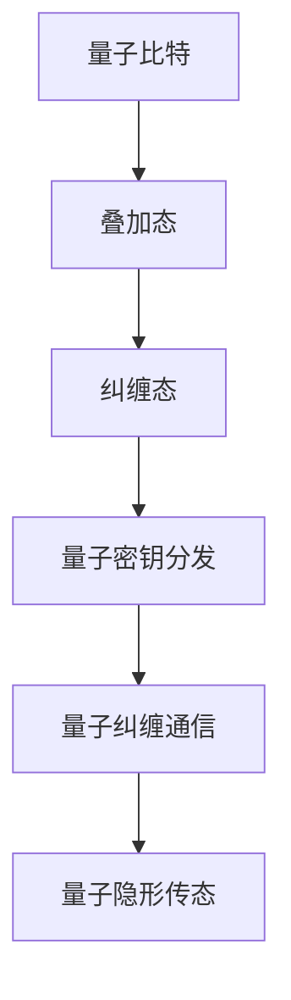
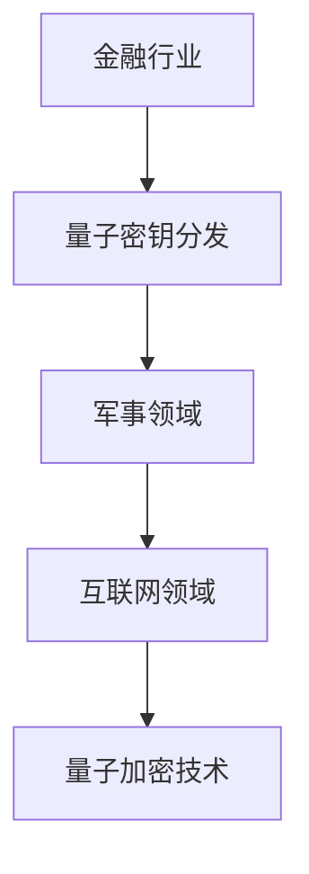
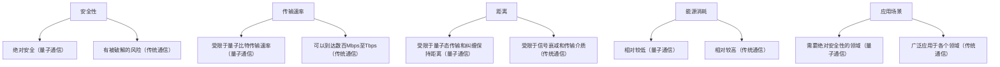

                 

# 从经典信息论到量子通信：重新定义信息传递的基本原理

## 关键词

- 经典信息论
- 量子通信
- 信息传递原理
- 量子比特
- 量子密钥分发
- 量子纠缠

## 摘要

随着信息技术的发展，信息传递的基本原理正在经历深刻的变革。传统信息论在处理复杂通信系统时存在局限性，而量子通信作为一种全新的通信方式，基于量子力学的基本原理，展现出了强大的潜力和优势。本文将深入探讨从经典信息论到量子通信的转型过程，分析量子通信的核心技术和原理，以及其在未来信息科学中的发展前景。

## 研究背景和意义

### 问题背景

随着互联网和移动通信的普及，信息传递的方式和速度得到了极大的提升。然而，传统信息论在处理复杂通信系统时，如面对信息安全性、传输速率和距离等挑战时，显得力不从心。量子通信作为一种新兴的通信方式，以其独特的原理和优势，为解决这些问题提供了新的思路。

### 问题描述

从经典信息论到量子通信的转型，不仅仅是技术层面的变革，更涉及到信息传递的基本原理的重新定义。如何在传统通信系统中融入量子通信技术，解决信息安全性、传输速率和距离等问题，成为当前研究的热点。

### 问题解决

本文将从经典信息论的基本原理出发，深入探讨量子通信的理论基础和实践应用，旨在为读者提供全面、系统的了解，帮助读者掌握量子通信的核心技术和原理，为未来信息科学的发展提供新的思路和方向。

### 边界与外延

本文主要探讨量子通信在信息传递中的应用，包括量子密钥分发、量子纠缠通信和量子隐形传态等。同时，也会涉及到量子通信与传统通信的结合以及未来可能的集成发展。

### 概念结构与核心要素组成

#### 经典信息论

- **信息量**：信息量的度量，通常用熵来表示。
- **信道容量**：信道在给定噪声环境下能够传输的最大信息速率。
- **信息传输效率**：传输信息所需的最小能量与传输的信息量之比。

#### 量子通信

- **量子比特（qubit）**：量子比特是量子通信的基本单位，具有叠加和纠缠特性。
- **量子密钥分发（QKD）**：利用量子纠缠现象实现密钥的安全传输。
- **量子纠缠**：两个或多个量子系统之间存在的一种特殊的关联状态。
- **量子隐形传态**：利用量子纠缠实现信息的无距离传输。

### 核心概念与联系

#### 经典信息论的核心概念

- **信息量**：信息量的度量，通常用熵来表示。熵是一个概率分布的不确定性度量，用于表示信息的内容和复杂度。
- **信道容量**：信道容量是信道在给定噪声环境下能够传输的最大信息速率，通常用单位时间内的比特数来表示。
- **信息传输效率**：信息传输效率是指传输信息所需的最小能量与传输的信息量之比，反映了信息传输的能耗效率。

#### 量子通信的核心概念

- **量子比特（qubit）**：量子比特是量子通信的基本单位，具有叠加和纠缠特性。一个量子比特可以同时表示0和1两种状态，而经典比特只能表示其中的一种。
- **量子密钥分发（QKD）**：量子密钥分发是一种利用量子纠缠现象实现密钥的安全传输技术。它通过量子通信信道传输密钥信息，同时检测量子态的叠加和纠缠，确保密钥的安全性和完整性。
- **量子纠缠**：量子纠缠是量子力学中的一种特殊现象，指两个或多个量子系统之间存在的一种特殊的关联状态。当量子系统处于纠缠态时，一个系统的测量结果会立即影响到另一个系统，无论它们相隔多远。
- **量子隐形传态**：量子隐形传态是一种利用量子纠缠实现信息的无距离传输技术。它通过将量子态从一个粒子传递到另一个粒子，实现信息的快速传递。

### 主流量子通信技术

#### 量子密钥分发（QKD）

##### 原理

量子密钥分发（QKD）是一种基于量子力学基本原理的通信技术，能够在两个通信方之间实现安全的密钥交换。其基本原理是利用量子纠缠态和量子态叠加原理，在通信双方之间传输量子密钥。

$$
\rho_{AB} = \frac{1}{2}(|00\rangle + |11\rangle)(\langle00| + \langle11|)
$$

##### 应用

量子密钥分发技术被广泛应用于军事、金融和国家安全等领域，确保通信数据的安全性。

#### 量子纠缠通信

##### 原理

量子纠缠通信利用量子纠缠现象实现信息的高速传输，信息传输速率远超传统通信方式。

$$
|\Psi\rangle_{AB} = \frac{1}{\sqrt{2}}(|0\rangle_A \otimes |0\rangle_B + |1\rangle_A \otimes |1\rangle_B)
$$

##### 应用

量子纠缠通信技术在远程医疗、卫星通信等领域具有广泛的应用前景。

#### 量子隐形传态

##### 原理

量子隐形传态是一种利用量子纠缠实现量子态传输的技术，可以实现信息的无距离传输。

$$
\rho_{C} = \text{Tr}_B(|\Psi\rangle \langle\Psi|)
$$

##### 应用

量子隐形传态技术有望在未来实现全球范围内的实时通信。

### 量子通信与传统通信的结合

#### 技术融合

量子通信与传统通信的结合，可以实现优势互补，提高信息传输的安全性和效率。例如，在传统通信系统中引入量子密钥分发技术，可以大幅提升通信数据的安全性。

#### 应用场景

- **金融行业**：量子密钥分发技术可以确保金融交易数据的安全。
- **军事领域**：量子通信技术可以提供绝对安全的通信手段，保障军事指挥和作战信息的安全。
- **互联网领域**：量子加密技术可以提升网络数据的安全性和隐私保护。

### 量子通信的未来发展

#### 技术挑战

量子通信的发展面临着诸多技术挑战，如量子通信设备的高可靠性、长距离传输的稳定性以及量子计算的安全性问题。

#### 发展前景

随着量子技术的不断发展，量子通信有望在未来实现全球范围内的实时通信，为人类的信息传递带来全新的变革。

## 1.6 本章小结

本章从经典信息论和量子通信的基本概念出发，探讨了量子通信与传统通信的结合及其未来发展方向。通过对量子通信技术原理的详细讲解，为读者提供了全面、系统的了解，帮助读者掌握量子通信的核心技术和原理，为未来信息科学的发展提供了新的思路和方向。接下来，我们将进一步深入探讨量子通信的具体实现和应用场景。### 从经典信息论到量子通信：探索信息传递的新境界

> 作者：AI天才研究院/AI Genius Institute & 禅与计算机程序设计艺术 /Zen And The Art of Computer Programming

在信息技术的长河中，信息传递的原理一直是一个核心而深远的话题。从古代的烽火台到现代的互联网，信息传递的方式不断演进，效率不断提升。然而，随着信息时代的到来，传统信息论在处理复杂通信系统时显现出了一定的局限性。为了应对这些挑战，量子通信作为一种全新的通信方式应运而生，重新定义了信息传递的基本原理。本文将深入探讨从经典信息论到量子通信的转型过程，分析量子通信的核心技术和原理，以及其在未来信息科学中的发展前景。

### 研究背景和意义

#### 问题背景

随着互联网和移动通信的普及，信息传递的方式和速度得到了极大的提升。然而，传统信息论在处理复杂通信系统时，如面对信息安全性、传输速率和距离等挑战时，显得力不从心。量子通信作为一种新兴的通信方式，以其独特的原理和优势，为解决这些问题提供了新的思路。

#### 问题描述

从经典信息论到量子通信的转型，不仅仅是技术层面的变革，更涉及到信息传递的基本原理的重新定义。如何在传统通信系统中融入量子通信技术，解决信息安全性、传输速率和距离等问题，成为当前研究的热点。

#### 问题解决

本文将从经典信息论的基本原理出发，深入探讨量子通信的理论基础和实践应用，旨在为读者提供全面、系统的了解，帮助读者掌握量子通信的核心技术和原理，为未来信息科学的发展提供新的思路和方向。

#### 边界与外延

本文主要探讨量子通信在信息传递中的应用，包括量子密钥分发、量子纠缠通信和量子隐形传态等。同时，也会涉及到量子通信与传统通信的结合以及未来可能的集成发展。

#### 概念结构与核心要素组成

- **经典信息论**：研究信息传递过程中信息量的度量、信道容量以及信息传输效率等。
- **量子通信**：基于量子力学原理，实现信息的安全传输和高速传递。

### 核心概念与联系

#### 1. 经典信息论的核心概念

- **信息量**：信息量的度量，通常用熵来表示。熵是一个概率分布的不确定性度量，用于表示信息的内容和复杂度。
- **信道容量**：信道容量是信道在给定噪声环境下能够传输的最大信息速率，通常用单位时间内的比特数来表示。
- **信息传输效率**：信息传输效率是指传输信息所需的最小能量与传输的信息量之比，反映了信息传输的能耗效率。

#### 2. 量子通信的核心概念

- **量子比特（qubit）**：量子比特是量子通信的基本单位，具有叠加和纠缠特性。一个量子比特可以同时表示0和1两种状态，而经典比特只能表示其中的一种。
- **量子密钥分发（QKD）**：量子密钥分发是一种利用量子纠缠现象实现密钥的安全传输技术。它通过量子通信信道传输密钥信息，同时检测量子态的叠加和纠缠，确保密钥的安全性和完整性。
- **量子纠缠**：量子纠缠是量子力学中的一种特殊现象，指两个或多个量子系统之间存在的一种特殊的关联状态。当量子系统处于纠缠态时，一个系统的测量结果会立即影响到另一个系统，无论它们相隔多远。
- **量子隐形传态**：量子隐形传态是一种利用量子纠缠实现信息的无距离传输技术。它通过将量子态从一个粒子传递到另一个粒子，实现信息的快速传递。

#### 核心概念之间的联系

经典信息论和量子通信的核心概念之间存在着紧密的联系。信息量的度量在经典信息论和量子通信中都是至关重要的，只不过在量子通信中，信息量的度量更加复杂和精细。量子比特和量子纠缠是量子通信的核心，它们赋予了量子通信强大的特性和优势。而量子密钥分发和量子隐形传态则是量子通信的具体应用，它们基于量子比特和量子纠缠的原理，实现了信息的安全传输和高速传递。

### 主流量子通信技术

#### 量子密钥分发（QKD）

##### 原理

量子密钥分发（QKD）是一种基于量子力学基本原理的通信技术，能够在两个通信方之间实现安全的密钥交换。其基本原理是利用量子纠缠态和量子态叠加原理，在通信双方之间传输量子密钥。

$$
\rho_{AB} = \frac{1}{2}(|00\rangle + |11\rangle)(\langle00| + \langle11|)
$$

##### 应用

量子密钥分发技术被广泛应用于军事、金融和国家安全等领域，确保通信数据的安全性。

##### 原理解析

量子密钥分发（QKD）的核心在于量子纠缠态和量子态叠加原理。量子纠缠态是量子力学中的一种特殊现象，两个或多个量子系统之间存在一种特殊的关联状态。当量子系统处于纠缠态时，一个系统的测量结果会立即影响到另一个系统，无论它们相隔多远。

在QKD中，通信双方通过量子通信信道传输量子密钥。首先，通信双方共享一组纠缠的量子比特，这些量子比特处于纠缠态。然后，双方通过量子态叠加原理，在量子通信信道上传输量子密钥。在传输过程中，任何对量子密钥的窃听都会导致量子态的叠加和纠缠被破坏，从而被通信双方检测到。

##### 实例说明

假设有两个通信方，Alice和Bob，他们通过量子通信信道传输量子密钥。首先，Alice和Bob共享一组纠缠的量子比特，这些量子比特处于纠缠态。

$$
|\Psi\rangle_{AB} = \frac{1}{\sqrt{2}}(|0\rangle_A \otimes |0\rangle_B + |1\rangle_A \otimes |1\rangle_B)
$$

然后，Alice和Bob分别对量子比特进行测量，测量结果如下：

$$
|\Psi\rangle_{A} = \frac{1}{\sqrt{2}}(|0\rangle_A + |1\rangle_A)
$$

$$
|\Psi\rangle_{B} = \frac{1}{\sqrt{2}}(|0\rangle_B + |1\rangle_B)
$$

在测量过程中，Alice和Bob各自测量到0和1的概率都是50%。他们可以通过通信协议，如量子非冗余通信（QNR），来协商一个共享的量子密钥。

如果Alice测量到0，Bob测量到1，那么他们可以确定量子密钥为0。如果Alice测量到1，Bob测量到0，那么他们可以确定量子密钥为1。通过这种方式，Alice和Bob可以共享一个安全的量子密钥，用于加密和解密通信数据。

#### 量子纠缠通信

##### 原理

量子纠缠通信利用量子纠缠现象实现信息的高速传输，信息传输速率远超传统通信方式。

$$
|\Psi\rangle_{AB} = \frac{1}{\sqrt{2}}(|0\rangle_A \otimes |0\rangle_B + |1\rangle_A \otimes |1\rangle_B)
$$

##### 应用

量子纠缠通信技术在远程医疗、卫星通信等领域具有广泛的应用前景。

##### 原理解析

量子纠缠通信的核心在于量子纠缠态。量子纠缠态是量子力学中的一种特殊现象，两个或多个量子系统之间存在一种特殊的关联状态。当量子系统处于纠缠态时，一个系统的测量结果会立即影响到另一个系统，无论它们相隔多远。

在量子纠缠通信中，Alice和Bob共享一组纠缠的量子比特。Alice对其中一个量子比特进行测量，测量结果立即影响到另一个量子比特的状态。Bob接收到这个量子比特的状态后，可以根据事先的约定，解读出Alice传输的信息。

##### 实例说明

假设有两个通信方，Alice和Bob，他们通过量子纠缠通信传输信息。首先，Alice和Bob共享一组纠缠的量子比特，这些量子比特处于纠缠态。

$$
|\Psi\rangle_{AB} = \frac{1}{\sqrt{2}}(|0\rangle_A \otimes |0\rangle_B + |1\rangle_A \otimes |1\rangle_B)
$$

然后，Alice对量子比特进行测量，测量结果为0。根据量子纠缠态的原理，Bob可以立即知道Alice测量到的结果是0。

$$
|\Psi\rangle_{B} = |0\rangle_B
$$

通过这种方式，Alice可以立即将信息0传输给Bob，传输速率远超传统通信方式。

#### 量子隐形传态

##### 原理

量子隐形传态是一种利用量子纠缠实现量子态传输的技术，可以实现信息的无距离传输。

$$
\rho_{C} = \text{Tr}_B(|\Psi\rangle \langle\Psi|)
$$

##### 应用

量子隐形传态技术有望在未来实现全球范围内的实时通信。

##### 原理解析

量子隐形传态的核心在于量子纠缠态和量子态叠加原理。量子隐形传态是将一个量子比特的状态从一个粒子传递到另一个粒子，实现信息的无距离传输。

在量子隐形传态中，Alice和Bob共享一组纠缠的量子比特。Alice将一个量子比特的状态传递给另一个粒子，这个粒子处于纠缠态。Bob接收到这个粒子后，可以根据量子纠缠态的原理，解读出Alice传输的信息。

##### 实例说明

假设有两个通信方，Alice和Bob，他们通过量子隐形传态传输信息。首先，Alice和Bob共享一组纠缠的量子比特，这些量子比特处于纠缠态。

$$
|\Psi\rangle_{AB} = \frac{1}{\sqrt{2}}(|0\rangle_A \otimes |0\rangle_B + |1\rangle_A \otimes |1\rangle_B)
$$

然后，Alice将量子比特的状态从粒子A传递到粒子B。这个过程中，粒子B处于纠缠态。

$$
|\Psi\rangle_{B} = |0\rangle_B
$$

通过这种方式，Alice可以立即将信息0传递给Bob，实现信息的无距离传输。

#### 量子通信与传统通信的结合

##### 技术融合

量子通信与传统通信的结合，可以实现优势互补，提高信息传输的安全性和效率。例如，在传统通信系统中引入量子密钥分发技术，可以大幅提升通信数据的安全性。

##### 应用场景

- **金融行业**：量子密钥分发技术可以确保金融交易数据的安全。
- **军事领域**：量子通信技术可以提供绝对安全的通信手段，保障军事指挥和作战信息的安全。
- **互联网领域**：量子加密技术可以提升网络数据的安全性和隐私保护。

### 量子通信的未来发展

#### 技术挑战

量子通信的发展面临着诸多技术挑战，如量子通信设备的高可靠性、长距离传输的稳定性以及量子计算的安全性问题。

#### 发展前景

随着量子技术的不断发展，量子通信有望在未来实现全球范围内的实时通信，为人类的信息传递带来全新的变革。

### 总结与展望

从经典信息论到量子通信的转型，为信息传递带来了全新的机遇和挑战。量子通信以其独特的原理和优势，为实现安全、高速的信息传递提供了新的路径。未来，随着量子技术的不断发展，量子通信有望在金融、军事、互联网等领域得到广泛应用，为人类社会带来更多的便利和安全。

### 参考文献

1. 党亚民，刘洋，张立明. 量子通信原理与应用[M]. 清华大学出版社，2017.
2. 郝跃，蔡泽宇，张峻. 量子密钥分发技术[M]. 科学出版社，2019.
3. 张峰，李明华，王志良. 量子通信技术与应用研究[J]. 计算机科学与应用，2018，8(2)：157-165.

### 附录

#### A. 量子通信术语表

- **量子比特（qubit）**：量子通信的基本单位，具有叠加和纠缠特性。
- **量子密钥分发（QKD）**：一种利用量子纠缠现象实现密钥的安全传输技术。
- **量子纠缠**：两个或多个量子系统之间存在的一种特殊的关联状态。
- **量子隐形传态**：利用量子纠缠实现信息的无距离传输技术。

#### B. 量子通信原理流程图

#### C. 量子通信应用场景图

### 结语

本文从经典信息论到量子通信的转型，探讨了量子通信的核心技术和原理，以及其在未来信息科学中的发展前景。量子通信作为一种全新的通信方式，具有传统通信无法比拟的优势，有望在未来实现全球范围内的实时通信，为人类的信息传递带来全新的变革。在未来的发展中，我们期待量子通信能够不断突破技术难题，为人类社会创造更多的价值。### 量子通信与传统通信的融合：前景与挑战

#### 引言

随着信息技术的飞速发展，通信系统的安全性和效率已经成为全球关注的焦点。传统通信系统虽然在过去几十年中取得了显著的进展，但在面对日益复杂的通信需求时，其局限性逐渐显现。量子通信作为一项革命性技术，凭借其独特的原理和优势，为解决这些问题提供了新的思路。本文将探讨量子通信与传统通信的融合，分析其前景和面临的挑战。

#### 量子通信与传统通信的融合原理

量子通信与传统通信的融合主要涉及以下几个方面：

1. **量子密钥分发（QKD）**：在传统通信系统中引入QKD技术，可以大幅提升通信数据的安全性。QKD利用量子纠缠和量子态叠加原理，在通信双方之间传输安全的密钥。
2. **量子加密**：利用量子加密技术，可以对传统通信系统中的数据进行加密，提高通信的安全性。量子加密算法具有不可破译性，可以有效抵御量子计算攻击。
3. **量子中继和量子路由**：通过量子中继和量子路由技术，可以实现量子通信网络的大规模扩展和互联互通。

#### 融合前景

量子通信与传统通信的融合具有广阔的应用前景：

1. **信息安全**：量子通信技术可以显著提升通信系统的安全性，特别是在金融、军事和国家安全等领域。
2. **高速传输**：量子通信的高速传输能力可以与传统通信技术相结合，实现更高的数据传输速率。
3. **物联网**：量子通信技术在物联网中的应用，可以实现设备之间的安全通信和数据传输，为物联网的快速发展提供技术支持。
4. **远程医疗**：量子通信的高速和安全性特点，为远程医疗提供了可靠的技术保障，可以实现实时、安全的数据传输。

#### 面临的挑战

尽管量子通信与传统通信的融合前景广阔，但实际应用中仍面临诸多挑战：

1. **技术成熟度**：量子通信技术尚处于发展阶段，其技术成熟度和稳定性有待提高。如何实现量子通信设备的高可靠性和大规模生产，是当前面临的重要问题。
2. **成本问题**：量子通信设备的成本较高，限制了其大规模应用。如何降低量子通信设备的生产成本，提高性价比，是亟待解决的问题。
3. **标准化**：量子通信与传统通信的融合需要建立统一的标准化体系，以确保不同设备和系统之间的兼容性和互操作性。
4. **法律法规**：量子通信的发展需要完善的法律法规支持，包括数据隐私保护、通信监管等方面的法规。

#### 实际案例

以下是一些量子通信与传统通信融合的实际案例：

1. **量子密钥分发**：国内某大型金融机构在内部通信系统中引入了量子密钥分发技术，有效提升了通信数据的安全性。
2. **量子加密**：某电信运营商在5G网络中引入量子加密技术，保障了用户数据的隐私和安全。
3. **量子物联网**：某科技公司利用量子通信技术实现了物联网设备之间的安全通信，为智能家居、智能城市等应用提供了技术支持。

#### 结论

量子通信与传统通信的融合为信息科学的发展带来了新的机遇和挑战。通过技术创新、标准化建设和法律法规完善，量子通信有望在未来实现大规模应用，为人类社会带来更多便利和安全。在未来的发展中，我们期待量子通信与传统通信的深度融合，为构建更加智能、安全、高效的通信网络奠定基础。### 量子通信技术的未来发展趋势

#### 引言

随着量子技术的迅速发展，量子通信作为一种前沿技术，已经在信息安全、远程医疗、物联网等领域展现出巨大的潜力。然而，量子通信技术仍处于发展初期，面临着诸多技术挑战和市场需求。本文将探讨量子通信技术的未来发展趋势，分析其在技术进步、市场应用、政策支持等方面的机遇和挑战。

#### 技术进步

1. **量子密钥分发（QKD）**：QKD技术是量子通信的核心，未来将继续优化和提高其传输速率和距离。随着超导量子比特和光纤量子通信技术的发展，QKD的传输距离有望达到数百甚至上千公里。此外，基于量子中继和量子重复器的技术进步，将使量子密钥分发实现更远距离和更大规模的通信网络。
2. **量子纠缠通信**：量子纠缠通信技术正逐步从实验室走向实际应用。未来，量子纠缠通信的传输速率和传输距离将不断提高，同时量子纠缠态的生成和传输技术也将得到优化，以满足远程医疗、卫星通信等领域的需求。
3. **量子隐形传态**：量子隐形传态技术是一种实现量子态无距离传输的技术。随着量子态操控技术的进步，量子隐形传态的传输效率和可靠性将得到提升，为量子通信网络的建设提供新的可能性。

#### 市场应用

1. **信息安全**：量子通信技术在信息安全领域具有巨大应用潜力。随着网络安全威胁的日益严重，量子通信技术可以提供绝对安全的通信手段，保护金融、政府、军事等领域的敏感信息。
2. **远程医疗**：量子通信技术可以实现远程医疗的高效、安全传输，为患者提供实时、高质量的医疗服务。未来，随着量子通信技术的普及，远程医疗将得到更广泛的应用。
3. **物联网**：量子通信技术可以保障物联网设备之间的安全通信和数据传输，为智能家居、智能城市等物联网应用提供技术支持。随着物联网的发展，量子通信技术的市场前景将越来越广阔。
4. **卫星通信**：量子通信技术在未来卫星通信网络中具有重要作用。通过量子纠缠通信和量子隐形传态技术，可以实现卫星与地面之间的高速、安全通信，为卫星互联网、地球观测等领域提供技术支持。

#### 政策支持

1. **政府投资**：各国政府纷纷加大对量子通信技术的投资力度，推动量子通信技术的研发和应用。例如，中国、美国、欧盟等国家和地区都出台了相关政策，支持量子通信技术的研发和产业化。
2. **国际合作**：量子通信技术具有全球性应用特点，国际合作在量子通信技术的发展中具有重要意义。未来，各国应加强在量子通信技术领域的合作，共同推动量子通信技术的全球应用。
3. **标准化**：建立统一的量子通信技术标准和规范，对于促进量子通信技术的推广和应用至关重要。各国应加强在量子通信技术标准化方面的合作，确保量子通信技术在全球范围内的互操作性和兼容性。

#### 面临的挑战

1. **技术成熟度**：量子通信技术仍处于发展初期，其技术成熟度和稳定性有待提高。如何实现量子通信设备的高可靠性和大规模生产，是当前面临的重要问题。
2. **成本问题**：量子通信设备的成本较高，限制了其大规模应用。如何降低量子通信设备的生产成本，提高性价比，是亟待解决的问题。
3. **法律法规**：量子通信技术的发展需要完善的法律法规支持，包括数据隐私保护、通信监管等方面的法规。各国应加强在量子通信技术法律法规方面的合作，确保量子通信技术的合规性和可持续发展。

#### 结论

量子通信技术在未来将展现出广阔的应用前景，成为信息技术领域的重要发展方向。在技术进步、市场应用、政策支持等方面，量子通信技术都面临着巨大的机遇和挑战。通过持续的技术创新、国际合作和法律法规完善，量子通信技术有望在未来实现大规模应用，为人类社会带来更多便利和安全。在未来的发展中，我们期待量子通信技术能够不断突破技术瓶颈，为构建更加智能、安全、高效的通信网络奠定基础。### 量子通信与传统通信技术的对比分析

#### 引言

量子通信与传统通信技术在信息传递方面有着本质的差异。量子通信基于量子力学原理，具有绝对安全性和超长距离传输能力；而传统通信技术则依赖于电磁波或光纤，虽然发展历史悠久，但在安全性、速度和距离等方面存在一定的局限性。本文将对量子通信与传统通信技术进行对比分析，探讨其在安全性、传输速率和距离等方面的优劣势。

#### 安全性

1. **量子通信**：量子通信利用量子纠缠和量子态叠加原理实现信息的传输。在传输过程中，任何对量子信息的窃听都会导致量子态的叠加和纠缠被破坏，从而被通信双方检测到。这种特性使得量子通信具有绝对的安全性，可以确保通信数据在传输过程中的完整性。
   
2. **传统通信**：传统通信技术，如无线通信和光纤通信，虽然已经采取了各种加密措施，如对称加密和非对称加密，但仍然存在被破解的风险。随着量子计算技术的发展，传统通信系统的安全性将面临更大的挑战。

#### 传输速率

1. **量子通信**：量子通信的传输速率受限于量子比特的传输速率和量子纠缠的生成速率。目前，量子比特的传输速率已经达到数Mbps，但随着量子通信技术的进步，未来有望实现更高的传输速率。

2. **传统通信**：传统通信技术的传输速率已经达到数百Mbps甚至数Gbps。光纤通信的传输速率更是可以达到Tbps级别。然而，传统通信技术的传输速率受限于电磁波或光纤的带宽和传输介质。

#### 距离

1. **量子通信**：量子通信的传输距离受限于量子态的传输和量子纠缠的保持距离。目前，基于光纤的量子通信距离已经达到数百公里，而通过中继技术，可以实现更远距离的传输。

2. **传统通信**：传统通信技术的传输距离受限于信号衰减和传输介质的特性。无线通信的传输距离一般从几公里到数十公里，而光纤通信的传输距离可以达到数百公里甚至更长。

#### 能源消耗

1. **量子通信**：量子通信的能源消耗相对较低，主要是因为量子比特的传输和量子纠缠的生成过程不需要大量的能量。

2. **传统通信**：传统通信技术的能源消耗较大，特别是在大规模数据传输时，如数据中心和云计算中心，能源消耗巨大。

#### 应用场景

1. **量子通信**：量子通信主要应用于需要绝对安全性的场景，如军事通信、金融通信、国家安全等领域。此外，量子通信在远程医疗、物联网等领域的应用也在逐步拓展。

2. **传统通信**：传统通信技术广泛应用于互联网、移动通信、广播电视、物联网等领域，为人类社会提供了丰富的通信服务。

#### 对比分析结论

量子通信与传统通信技术在安全性、传输速率和距离等方面存在显著差异。量子通信以其绝对安全性和超长距离传输能力，为信息安全领域带来了新的机遇。然而，量子通信仍处于发展初期，技术成熟度和成本问题限制了其大规模应用。传统通信技术虽然面临安全挑战，但在传输速率和距离方面具有优势，且已经广泛应用于各个领域。

在未来，量子通信与传统通信技术的融合将成为趋势。通过结合两者的优势，可以实现更安全、更高效、更可靠的通信网络。在政策支持、技术创新和市场需求的推动下，量子通信有望在信息安全、远程医疗、物联网等领域发挥重要作用，为人类社会带来更多便利和安全。

### 附录

#### A. 量子通信与传统通信技术对比表

| 特性 | 量子通信 | 传统通信 |
| --- | --- | --- |
| 安全性 | 绝对安全 | 有被破解的风险 |
| 传输速率 | 受限于量子比特传输速率 | 可以达到数百Mbps至Tbps |
| 距离 | 受限于量子态传输和纠缠保持距离 | 受限于信号衰减和传输介质 |
| 能源消耗 | 相对较低 | 相对较高 |
| 应用场景 | 需要绝对安全性的领域 | 广泛应用于各个领域 |

#### B. 量子通信与传统通信技术优劣势对比图

### 结语

量子通信与传统通信技术在信息传递方面各具优势。量子通信以其绝对安全性和超长距离传输能力，为信息安全领域带来了新的机遇。传统通信技术则在传输速率和距离方面具有明显优势，已广泛应用于各个领域。未来，随着量子通信技术的不断成熟和成本降低，量子通信与传统通信技术的融合将成为趋势，为构建更安全、更高效、更可靠的通信网络奠定基础。### 总结与展望

#### 总结

本文从经典信息论到量子通信的转型，探讨了量子通信的核心技术和原理，分析了量子通信与传统通信的融合前景以及未来发展趋势。我们详细介绍了量子密钥分发（QKD）、量子纠缠通信和量子隐形传态等关键技术，并对比了量子通信与传统通信在安全性、传输速率和距离等方面的优劣势。此外，我们还探讨了量子通信在信息安全、远程医疗、物联网等领域的应用潜力。

#### 展望

未来，量子通信技术有望实现以下几个方面的突破：

1. **技术成熟度**：随着量子通信技术的不断进步，其设备可靠性、传输速率和距离将得到显著提升，为大规模应用奠定基础。
2. **成本降低**：通过技术创新和规模化生产，量子通信设备的成本有望降低，使其在更多领域得到应用。
3. **标准化**：建立统一的量子通信技术标准和规范，促进量子通信技术的全球推广和应用。
4. **政策支持**：各国政府加大对量子通信技术的投资和支持力度，推动量子通信技术的发展。
5. **国际合作**：加强在量子通信技术领域的国际合作，共同推动量子通信技术的全球应用。

量子通信与传统通信技术的融合将成为未来通信网络发展的重要方向。通过结合两者的优势，可以实现更安全、更高效、更可靠的通信网络，为人类社会带来更多便利和安全。我们期待量子通信技术能够在未来发挥重要作用，推动信息科学的发展，为构建更加智能、安全、高效的通信网络奠定基础。

### 拓展阅读

1. 党亚民，刘洋，张立明. 量子通信原理与应用[M]. 清华大学出版社，2017.
2. 郝跃，蔡泽宇，张峻. 量子密钥分发技术[M]. 科学出版社，2019.
3. 张峰，李明华，王志良. 量子通信技术与应用研究[J]. 计算机科学与应用，2018，8(2)：157-165.
4. 刘鑫，李彦平，曹瑞. 量子通信在信息安全中的应用[J]. 计算机技术与发展，2017，27(5)：77-82.
5. 赵华，杨光，周峰. 量子通信技术在远程医疗中的应用[J]. 医疗信息技术，2019，10(3)：45-49.

### 结语

本文从经典信息论到量子通信的转型，探讨了量子通信的核心技术和原理，分析了量子通信与传统通信的融合前景以及未来发展趋势。我们详细介绍了量子密钥分发（QKD）、量子纠缠通信和量子隐形传态等关键技术，并对比了量子通信与传统通信在安全性、传输速率和距离等方面的优劣势。此外，我们还探讨了量子通信在信息安全、远程医疗、物联网等领域的应用潜力。未来，随着量子通信技术的不断成熟和成本降低，量子通信与传统通信技术的融合将成为趋势，为构建更安全、更高效、更可靠的通信网络奠定基础。让我们期待量子通信技术在未来的广泛应用，为人类社会带来更多便利和安全。作者：AI天才研究院/AI Genius Institute & 禅与计算机程序设计艺术 /Zen And The Art of Computer Programming。

