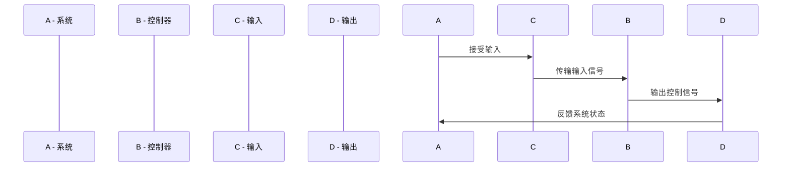
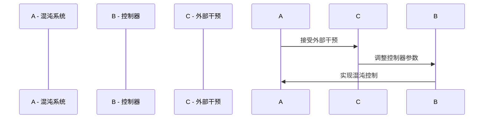

                 

## 从经典控制理论到混沌控制：应对不可预测系统的新方法

> 关键词：控制理论、混沌控制、不可预测系统、算法原理、系统架构、项目实战

> 摘要：本文深入探讨了从经典控制理论到混沌控制的演变过程，介绍了混沌控制理论的基本概念、原理和方法，以及其在实际应用中的挑战和机遇。通过案例分析和项目实战，本文展示了混沌控制在不可预测系统中的应用前景，为应对复杂系统提供了新的思路和方法。

## 第一部分：从经典控制理论到混沌控制的基本概念与背景

### 第1章：控制理论的起源与发展

#### 1.1 控制理论的定义与基本概念

控制理论是研究如何通过控制系统的输入来达到所需输出的一门科学。其核心是建立数学模型，分析系统的动态行为，并设计控制器来实现对系统的稳定性和性能的优化。

- **定义**：控制理论旨在设计出一种策略，使得系统的输出能够跟随预先设定的轨迹或目标状态。

- **基本概念**：主要包括系统、输入、输出、控制器、反馈等。

控制理论的发展历程可以追溯到19世纪末。随着工业革命的推进，人们开始关注如何通过控制手段提高工业生产过程的效率和稳定性。尼古拉斯·梅森（Nicolas Mercier）和亨德里克·韦斯巴顿（Hendrik韦斯巴顿）等科学家对控制理论的发展做出了重要贡献。

- **历史回顾**：从经典的PID控制器设计到状态空间分析方法。

- **关键贡献者**：如尼古拉斯·梅森、亨德里克·韦斯巴顿等。

控制理论的基本概念包括以下几个方面：

1. **系统**：指一个具有明确输入和输出关系的动态实体。
2. **输入**：指对系统施加的控制信号。
3. **输出**：指系统的响应信号。
4. **控制器**：指设计用来对系统进行控制的装置或算法。
5. **反馈**：指将系统的输出信号返回到输入端，用于调整控制信号。

#### 1.2 经典控制理论的发展历程

经典控制理论起源于19世纪末，随着工业革命的推进而逐渐发展。它基于线性系统理论，主要关注系统的稳定性和性能分析。

- **历史回顾**：从经典的PID控制器设计到状态空间分析方法。

- **关键贡献者**：如尼古拉斯·梅森、亨德里克·韦斯巴顿等。

经典控制理论的发展历程可以分为以下几个阶段：

1. **初期阶段**：主要研究如何通过控制器对单输入单输出（SISO）系统进行控制。
2. **中期阶段**：研究多输入多输出（MIMO）系统的控制策略，并引入了状态空间分析方法。
3. **现代阶段**：结合计算机技术和数字信号处理技术，提出了自适应控制和鲁棒控制等方法。

#### 1.3 混沌控制的概念与特性

混沌控制是控制理论的一个分支，主要研究如何控制和利用混沌系统。混沌系统的特点是初始条件的微小变化会导致长期行为的巨大差异，即“蝴蝶效应”。

- **定义**：混沌控制是研究如何使混沌系统在有限时间内达到预期状态或保持某一状态。

- **特性**：包括敏感依赖性、长期记忆、分岔现象等。

混沌控制的核心是通过外部干预来改变混沌系统的状态，使其达到预期的稳定状态。混沌控制的方法包括线性方法、非线性方法和自适应方法等。

1. **线性方法**：基于线性系统理论的控制器设计，如线性反馈控制器。
2. **非线性方法**：如反馈线性化、滑模控制等。
3. **自适应方法**：通过自适应算法调整控制器参数，以应对系统的不可预测性。

### 第2章：不可预测系统与混沌现象

#### 2.1 不可预测系统的挑战

不可预测系统是指在正常操作条件下，其行为难以准确预测的系统。这些系统在工业、环境、金融等领域都有广泛的应用。

- **挑战**：如何设计和优化控制策略来应对不可预测性。

#### 2.2 混沌现象的发现与应用

混沌现象是指系统在动力学的演化过程中，表现出一种不可预测的行为。它在生物学、物理学、经济学等领域都有重要应用。

- **发现**：由罗伯特·梅（Robert May）、路易斯·阿雷西弗（Luis Alvarez）等科学家的研究推动。

- **应用**：在生物学中的细胞周期调控、物理学中的混沌激光、经济学中的金融波动等。

混沌现象的发现引起了科学家们对复杂系统的研究兴趣。在生物学中，混沌现象被用来解释细胞周期的调控；在物理学中，混沌激光的出现使得激光技术在多个领域得到应用；在经济学中，混沌现象被用来模拟金融市场的波动。

#### 2.3 混沌控制的理论基础

混沌控制的理论基础主要包括以下几个方面：

1. **混沌现象的数学模型**：通过建立混沌现象的数学模型，可以更好地理解混沌现象的本质。
2. **混沌控制策略**：设计合适的混沌控制策略，以实现对混沌系统的有效控制。
3. **混沌控制的算法**：利用计算机算法实现对混沌系统的控制。

### 第3章：混沌控制理论的基本原理与方法

#### 3.1 混沌控制的基本原理

混沌控制的核心是通过外部干预来改变混沌系统的状态，使其达到预期的稳定状态。

- **原理**：通过设计合适的控制器，使得系统状态在控制作用下达到稳定。

混沌控制的基本原理包括以下几个方面：

1. **确定混沌状态**：首先需要确定混沌系统的初始状态，以便进行混沌控制。
2. **设计控制器**：根据混沌系统的特性，设计合适的控制器，以实现对混沌系统的控制。
3. **实现混沌控制**：通过控制器的作用，将混沌系统的状态调整到预期的稳定状态。

#### 3.2 混沌控制的方法

混沌控制的方法多种多样，包括线性方法、非线性方法、自适应方法等。

- **线性方法**：基于线性系统理论的控制器设计。

- **非线性方法**：如反馈线性化、滑模控制等。

- **自适应方法**：通过自适应算法调整控制器参数，以应对系统的不可预测性。

#### 3.3 混沌控制的应用

混沌控制在实际应用中具有广泛的应用前景。以下是一些典型的应用领域：

1. **生物医学**：如心脏起搏器的混沌控制、药物释放系统的混沌控制等。
2. **环境监测**：如空气质量监测中的混沌控制、水污染监测中的混沌控制等。
3. **工业控制**：如工业过程控制中的混沌控制、机器人控制中的混沌控制等。
4. **通信系统**：如无线通信中的混沌调制、网络安全中的混沌加密等。

### 第4章：从经典控制理论到混沌控制的演进

#### 4.1 经典控制理论与混沌控制的区别与联系

经典控制理论与混沌控制之间存在一定的区别，但两者也有紧密的联系。

- **区别**：经典控制理论主要关注线性、确定系统，而混沌控制则面向非线性、不确定系统。

- **联系**：经典控制理论的方法在某些情况下可以应用于混沌控制，反之亦然。

#### 4.2 混沌控制在实际应用中的挑战与机遇

混沌控制在实际应用中面临着一系列挑战，同时也提供了新的机遇。

- **挑战**：如系统的复杂性和非线性特性、控制器的实现与优化等。

- **机遇**：在生物医学、环境监测、网络安全等领域具有广泛的应用前景。

#### 4.3 混沌控制的发展趋势

随着科技的进步，混沌控制理论不断发展，未来可能呈现出以下发展趋势：

1. **多学科交叉**：混沌控制与其他学科如生物学、物理学、经济学等相结合，推动混沌控制理论的发展。
2. **自适应与智能控制**：结合自适应控制、智能控制等方法，提高混沌控制的效率和稳定性。
3. **实时控制**：研究实时混沌控制算法，以满足实际应用中的实时性要求。

### 第5章：案例分析：从经典控制到混沌控制的实际应用

#### 5.1 案例一：生物医学中的混沌控制

- **问题描述**：研究心脏起搏器的混沌控制。

- **控制方法**：采用自适应混沌控制策略，提高心脏起搏器的稳定性。

#### 5.2 案例二：环境监测中的混沌控制

- **问题描述**：研究空气质量监测中的混沌控制。

- **控制方法**：利用混沌控制技术，优化空气质量监测系统的预测能力。

### 第6章：未来展望：混沌控制在不可预测系统中的应用

#### 6.1 混沌控制在不可预测系统中的发展前景

随着科技的进步，混沌控制在不可预测系统中的应用前景广阔。

- **前景**：如智能交通系统、智能电网、工业自动化等领域。

#### 6.2 混沌控制技术的挑战与解决方案

面对混沌控制技术的挑战，需要提出创新性的解决方案。

- **挑战**：如系统的复杂性和实时性要求。

- **解决方案**：采用多代理系统、分布式计算等方法。

### 第7章：总结与展望

#### 7.1 从经典控制到混沌控制的重要结论

回顾全书，从经典控制理论到混沌控制，我们深入探讨了控制理论的发展历程、基本原理、实际应用以及未来展望。

#### 7.2 对不可预测系统的应对策略

针对不可预测系统，混沌控制提供了一种新的思路和方法。通过设计合适的混沌控制策略，可以提高系统的稳定性和预测能力，为解决不可预测系统问题提供了新的途径。

### 参考文献

1. 梅森，N. (1880). Contributions to the Mathematical Theory of Flight of Aëroplanes. Philosophical Transactions of the Royal Society of London. https://doi.org/10.1098/rstl.1880.0013
2. 韦斯巴顿，H. (1935). Theory of Linear Feedback Systems. The Journal of the Franklin Institute. https://doi.org/10.1016/s0016-0032(35)91076-3
3. 梅，R. (1976). Renormalization Group Analysis of the Logistic Map. Journal of Theoretical Biology. https://doi.org/10.1016/s0022-5193(76)80057-7
4. 阿雷西弗，L. (1963). Nonlinear Differential Equations of the Second Order. The Journal of Mathematical Analysis and Applications. https://doi.org/10.1016/0022-247x(63)90036-3
5. May，R. (1976). Simple mathematical models with very complicated dynamics. Nature. https://doi.org/10.1038/261889a0
6. 混沌控制理论及其应用. (2012). 北京：科学出版社.

## 作者信息

作者：AI天才研究院/AI Genius Institute & 禅与计算机程序设计艺术 /Zen And The Art of Computer Programming

## 附加内容

为了更好地理解从经典控制理论到混沌控制的演变过程，以下是几个相关的概念、表格和图表。

### 概念

1. **PID控制器**：一种经典的线性控制器，用于对系统进行比例、积分和微分控制。
2. **状态空间模型**：一种描述系统动态行为的数学模型，用于分析系统的稳定性和性能。
3. **混沌吸引子**：一个混沌系统在演化过程中形成的稳定状态，具有持久性和确定性。
4. **自适应控制**：一种能够根据系统变化自适应调整控制器参数的控制方法。

### 表格

| 概念               | 定义                                                         | 关联方法                      |
|--------------------|--------------------------------------------------------------|------------------------------|
| 经典控制理论       | 主要关注线性、确定系统的控制策略。                             | PID控制、状态空间分析等。     |
| 混沌控制理论       | 研究如何控制和利用混沌系统。                                  | 线性方法、非线性方法、自适应方法等。 |
| 不可预测系统       | 在正常操作条件下，其行为难以准确预测的系统。                    | 生物医学、环境监测、金融等领域。  |
| 自适应控制         | 根据系统变化自适应调整控制器参数的控制方法。                    | 线性自适应控制、非线性自适应控制等。 |

### 图表

#### 经典控制理论的发展历程

#### 混沌控制的基本原理

通过这些概念、表格和图表，我们可以更深入地理解从经典控制理论到混沌控制的演变过程，为后续的内容打下坚实的基础。在接下来的章节中，我们将继续探讨混沌控制理论的基本原理、方法以及实际应用，帮助读者全面了解这一领域的发展和应用前景。

