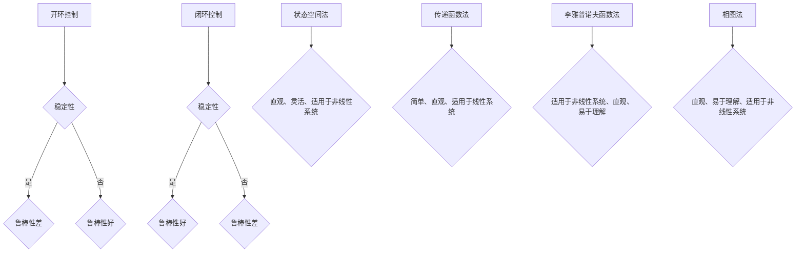
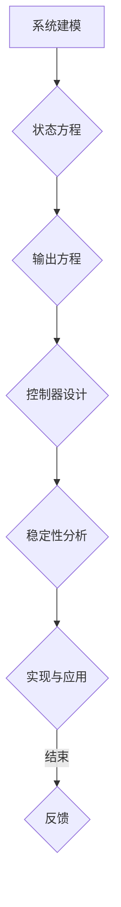

                 


### 文章标题：从经典控制理论到混沌控制：应对不可预测系统的新方法论

**关键词**：经典控制理论、混沌控制理论、不可预测系统、新方法论、算法应用

**摘要**：
本文深入探讨了从经典控制理论到混沌控制理论的发展历程，介绍了两者的基本概念、原理和方法。通过对比分析，揭示了经典控制与混沌控制的异同，并针对不可预测系统提出了新的方法论。文章通过具体的案例分析和实战应用，阐述了混沌控制在通信、生物系统和其他领域的应用，为解决复杂系统的控制问题提供了新的思路和工具。

## 引言

控制理论作为工程学、计算机科学、物理学等领域的重要基础，旨在研究如何通过系统设计和控制策略，使系统达到预期的行为或状态。经典控制理论，特别是线性控制理论，在工程实践中发挥了重要作用。然而，随着技术的不断进步和系统复杂度的增加，经典控制理论在应对不可预测系统和非线性问题时显得力不从心。因此，混沌控制理论的提出，为解决这类问题提供了新的方法论。

混沌控制理论是近年来发展起来的一个新兴领域，它研究如何控制混沌系统，使其表现出预期的行为。混沌现象在自然界和工程系统中普遍存在，如气候系统、通信系统和生物系统等。混沌控制理论不仅为这些系统提供了新的调控手段，还激发了人们对复杂系统内在规律的探索。

本文将从以下几个方面展开讨论：

1. **问题背景与核心概念**：介绍经典控制理论和混沌控制理论的基本概念，探讨两者的联系和区别。
2. **经典控制理论的深入探讨**：详细分析经典控制理论的基本方法、数学模型和控制策略。
3. **混沌控制理论的基本原理**：阐述混沌现象的数学描述、控制算法及其在不同领域的应用。
4. **从经典控制到混沌控制的转变**：探讨经典控制向混沌控制的转变过程中遇到的问题和挑战，介绍相关的技术与方法。
5. **案例分析**：通过具体案例，展示混沌控制理论在实际应用中的效果。
6. **总结与展望**：总结经典控制理论和混沌控制理论的发展历程，展望未来研究的方向和应用前景。

## 第1章 问题背景与核心概念

### 1.1 经典控制理论概述

**核心概念术语说明**：
- **控制理论**：研究如何设计和实现系统控制策略，使其达到预期状态或行为的科学。
- **经典控制理论**：主要研究线性、时不变系统的控制问题，基于线性系统理论，强调系统的稳定性、可控性和可观测性。

**问题背景**：
经典控制理论起源于20世纪40年代，其发展历程与工业革命和航空航天技术的需求密切相关。经典控制理论的核心问题是确保系统在受到外部干扰或内部扰动时，能够稳定运行并达到预期目标。然而，随着系统复杂度的增加和外部环境的不可预测性，经典控制理论的局限性也逐渐显现。

**问题描述**：
经典控制理论在面对非线性、时变和复杂系统时，难以有效预测和应对系统的动态行为。特别是在通信系统、生物系统和环境系统中，由于系统的非线性和复杂性，传统控制方法难以达到预期效果。

**问题解决**：
为了解决经典控制理论的局限性，混沌控制理论应运而生。混沌控制理论通过对混沌现象的研究，探索如何通过控制策略，使混沌系统达到稳定状态或实现特定行为。混沌控制理论为复杂系统的控制提供了新的思路和方法。

**边界与外延**：
经典控制理论主要关注线性、时不变系统的控制问题，其研究方法包括状态空间法、传递函数法等。而混沌控制理论则扩展到了非线性、时变系统，其研究方法包括李雅普诺夫函数法、混沌控制算法等。

**概念结构与核心要素组成**：
经典控制理论的核心要素包括线性系统理论、稳定性分析、控制器设计等。混沌控制理论的核心要素包括混沌现象的数学描述、混沌控制算法、混沌控制系统的稳定性验证等。

### 1.2 混沌控制理论

**核心概念术语说明**：
- **混沌现象**：指非线性动态系统在初始条件微小扰动下，产生的长期行为不确定、看似随机但具有内在规律的现象。
- **混沌控制**：指通过一定的控制策略，使混沌系统的动态行为发生预期变化，实现稳定或特定行为的过程。

**问题背景**：
混沌现象在自然界和工程系统中普遍存在，如气候系统、心脏起搏器、通信系统等。混沌控制理论的研究目标是通过控制策略，使混沌系统达到稳定状态或实现特定行为，为复杂系统的控制提供了新的手段。

**问题描述**：
混沌控制理论的核心问题是研究如何控制混沌系统的动态行为，使其达到稳定状态或实现特定行为。与经典控制理论不同，混沌控制理论不追求系统的完全稳定，而是通过控制策略，使系统在混沌区域中保持一定的稳定性。

**问题解决**：
混沌控制理论通过研究混沌现象的数学描述和控制算法，提出了多种混沌控制方法，如李雅普诺夫函数法、反馈控制法、自适应控制法等。这些方法为混沌系统的控制提供了理论依据和实现途径。

**边界与外延**：
混沌控制理论的研究范围涵盖了非线性系统、时变系统和复杂系统等。其应用领域包括通信系统、生物系统、环境系统等。

**概念结构与核心要素组成**：
混沌控制理论的核心要素包括混沌现象的数学描述、混沌控制算法、混沌控制系统的稳定性验证等。其中，混沌现象的数学描述是基础，混沌控制算法是关键，混沌控制系统的稳定性验证是保障。

### 1.3 经典控制理论与混沌控制理论的联系与区别

**联系**：
经典控制理论和混沌控制理论都是控制理论的重要组成部分，它们在系统控制方面有着共同的宗旨，即通过设计和实现控制策略，使系统达到预期状态或行为。

**区别**：
1. **控制目标**：经典控制理论主要关注线性、时不变系统的稳定性控制，追求系统的完全稳定；而混沌控制理论则关注非线性、时变系统的动态行为控制，不追求完全稳定，而是通过控制策略，使系统在混沌区域中保持一定的稳定性。
2. **控制方法**：经典控制理论主要采用线性系统理论、稳定性分析和控制器设计等方法；而混沌控制理论则主要采用李雅普诺夫函数法、混沌控制算法等。
3. **应用领域**：经典控制理论广泛应用于工程系统、物理系统等；而混沌控制理论则广泛应用于通信系统、生物系统、环境系统等。

### 1.4 本章节小结

本章节首先介绍了经典控制理论和混沌控制理论的基本概念，包括核心术语说明、问题背景、问题描述、问题解决、边界与外延、概念结构与核心要素组成等。然后，对比分析了经典控制理论与混沌控制理论的联系与区别。通过这些内容，为后续章节的深入讨论奠定了基础。

## 第2章 经典控制理论深入探讨

### 2.1 经典控制理论的基本方法

**核心概念与联系**：

经典控制理论的基本方法包括开环控制和闭环控制、控制器设计方法、稳定性分析等。

**开环控制与闭环控制的区别**：

- **开环控制**：在开环控制系统中，控制器的输出不受系统输出的影响，即不存在反馈环节。开环控制系统简单、成本低，但难以应对外部扰动和系统不确定性。
- **闭环控制**：在闭环控制系统中，控制器的输出受到系统输出的影响，通过反馈环节实现系统的自适应调整。闭环控制系统具有较好的鲁棒性和稳定性，但设计复杂度较高。

**控制器设计方法**：

- **状态空间法**：基于系统的状态方程和输出方程，设计控制器使系统达到预期状态。
- **传递函数法**：基于系统的传递函数，设计控制器使系统达到预期性能。

**稳定性分析**：

- **线性系统的稳定性**：通过分析系统的特征值，判断系统是否稳定。
- **非线性系统的稳定性**：通过分析系统的相图、李雅普诺夫函数等，判断系统是否稳定。

**对比表格**：

| 方法             | 定义                                                         | 优点                                                         | 缺点                                                         |
| ---------------- | ------------------------------------------------------------ | ------------------------------------------------------------ | ------------------------------------------------------------ |
| 开环控制         | 控制器的输出不受系统输出的影响                               | 系统简单、成本低                                             | 鲁棒性差、难以应对外部扰动和系统不确定性                     |
| 闭环控制         | 控制器的输出受到系统输出的影响                               | 鲁棒性好、稳定性高                                           | 设计复杂度较高、成本高                                     |
| 状态空间法       | 基于系统的状态方程和输出方程设计控制器                       | 直观、灵活、适用于非线性系统                                 | 计算量大、对参数敏感性较高                               |
| 传递函数法       | 基于系统的传递函数设计控制器                                 | 简单、直观、适用于线性系统                                   | 难以处理非线性系统、对参数敏感性较高                     |
| 李雅普诺夫函数法 | 通过分析系统的李雅普诺夫函数，判断系统是否稳定               | 适用于非线性系统、直观、易于理解                             | 需要一定的数学基础、计算复杂度较高                       |
| 相图法           | 通过绘制系统的相图，分析系统的动态行为                         | 直观、易于理解、适用于非线性系统                             | 对高维系统难以处理、计算复杂度较高                       |

**ER实体关系图架构的Mermaid流程图**：



**算法原理讲解**：

1. **开环控制算法**：

   假设系统状态为 \( x \)，控制输入为 \( u \)，则开环控制算法可以表示为：

   $$ u = f(x) $$

   其中，\( f(x) \) 是预定的控制函数。

2. **闭环控制算法**：

   假设系统状态为 \( x \)，控制输入为 \( u \)，系统输出为 \( y \)，则闭环控制算法可以表示为：

   $$ u = K_c e $$

   其中，\( e = y - y_d \) 是控制误差，\( K_c \) 是控制增益。

3. **状态空间法控制器设计**：

   假设系统状态方程为：

   $$ \dot{x} = A x + B u $$

   输出方程为：

   $$ y = C x + D u $$

   其中，\( A \)、\( B \)、\( C \) 和 \( D \) 是系统矩阵。控制器设计目标是最小化控制误差 \( e \)。

   $$ \min J = \int (e^T e) dt $$

   通过求解最优控制问题，可以得到最优控制器：

   $$ u = -K_c x $$

   其中，\( K_c \) 是控制矩阵。

4. **传递函数法控制器设计**：

   假设系统传递函数为：

   $$ G(s) = \frac{Y(s)}{U(s)} = \frac{C(sI - A)^{-1}B + D}{1} $$

   控制器设计目标是最小化控制误差 \( e \)。

   $$ \min J = \int (e^T e) dt $$

   通过求解最优控制问题，可以得到最优控制器：

   $$ u = K_c e $$

5. **李雅普诺夫函数法**：

   李雅普诺夫函数法是一种判断系统稳定性的方法。假设系统状态为 \( x \)，李雅普诺夫函数为 \( V(x) \)，则：

   $$ \dot{V}(x) = -V(x) f(x) $$

   其中，\( f(x) \) 是系统的非线性函数。如果 \( \dot{V}(x) \leq 0 \)，则系统是稳定的。

**Python源代码示例**：

```python
import numpy as np
import matplotlib.pyplot as plt

# 定义系统矩阵
A = np.array([[1, 1], [0, 1]])
B = np.array([[1], [0]])
C = np.array([[1, 0]])
D = 0

# 定义初始状态
x0 = np.array([[0], [0]])

# 定义控制输入
u = np.array([[0], [0]])

# 定义时间步长
dt = 0.1

# 定义控制矩阵
Kc = np.array([[1], [1]])

# 控制器设计
def controller(x, Kc):
    e = C * x + D * u
    u = -Kc * e
    return u

# 系统仿真
t = np.arange(0, 10, dt)
x = np.zeros((len(t), 2))

for i in range(1, len(t)):
    x[i] = A * x[i-1] + B * controller(x[i-1], Kc)
    u[i] = controller(x[i-1], Kc)

# 绘制相图
plt.plot(t, x[:, 0], label='x1')
plt.plot(t, x[:, 1], label='x2')
plt.legend()
plt.show()
```

### 2.2 经典控制理论的数学模型与公式

**核心概念与联系**：

经典控制理论的数学模型主要包括线性系统状态空间模型和传递函数模型。这两个模型是经典控制理论分析系统动态行为的基础。

**线性系统状态空间模型**：

线性系统状态空间模型由以下方程表示：

$$ \dot{x} = A x + B u $$
$$ y = C x + D u $$

其中，\( x \) 是系统状态向量，\( u \) 是控制输入，\( y \) 是系统输出。\( A \)、\( B \)、\( C \) 和 \( D \) 是系统矩阵，分别表示系统的动态特性、控制输入和输出之间的关系。

**传递函数模型**：

传递函数模型由以下方程表示：

$$ G(s) = \frac{Y(s)}{U(s)} = \frac{C(sI - A)^{-1}B + D}{1} $$

其中，\( s \) 是复数变量，\( Y(s) \) 和 \( U(s) \) 分别是系统输出和输入的拉普拉斯变换。\( G(s) \) 是系统的传递函数，描述了系统输入和输出之间的动态关系。

**控制器设计的数学基础**：

控制器设计的目标是最小化系统误差。在经典控制理论中，常用的方法是最优控制、鲁棒控制和自适应控制等。

- **最优控制**：基于性能指标，求解最优控制输入，使系统达到最优状态。

  $$ \min J = \int (e^T e) dt $$

  其中，\( e \) 是系统误差。

- **鲁棒控制**：设计控制器，使系统在存在不确定性和外部扰动时，仍然保持稳定。

  $$ \dot{V}(x) = -V(x) f(x) $$

- **自适应控制**：根据系统动态变化，自适应调整控制器参数，使系统达到预期性能。

  $$ K_c = K_c(x) $$

**经典控制理论的公式与应用**：

经典控制理论中的公式广泛应用于系统分析和控制器设计。以下是一些常见的公式：

- **状态反馈控制器**：

  $$ u = -K_c x $$

- **输出反馈控制器**：

  $$ u = K_c e $$

- **李雅普诺夫函数**：

  $$ \dot{V}(x) = -V(x) f(x) $$

- **系统稳定性**：

  $$ \det(\lambda I - A) < 0 $$

- **传递函数**：

  $$ G(s) = \frac{C(sI - A)^{-1}B + D}{1} $$

**示例**：

假设一个线性系统，其状态方程为：

$$ \dot{x} = \begin{bmatrix} 1 & 1 \\ 0 & 1 \end{bmatrix} x + \begin{bmatrix} 1 \\ 0 \end{bmatrix} u $$

输出方程为：

$$ y = \begin{bmatrix} 1 & 0 \end{bmatrix} x $$

设计一个状态反馈控制器，使其达到稳定的闭环系统。

解：

首先，计算系统的特征值：

$$ \det(\lambda I - A) = \det\begin{bmatrix} \lambda - 1 & 1 \\ 0 & \lambda - 1 \end{bmatrix} = (\lambda - 1)^2 = 0 $$

得到特征值 \( \lambda_1 = \lambda_2 = 1 \)。由于特征值全为正，系统是不稳定的。

为了使系统稳定，可以通过设计状态反馈控制器来调节控制输入 \( u \)。

假设控制器为 \( u = -K_c x \)，则闭环系统的状态方程为：

$$ \dot{x} = \begin{bmatrix} 1 & 1 \\ 0 & 1 \end{bmatrix} x + \begin{bmatrix} 1 \\ 0 \end{bmatrix} (-K_c x) $$

$$ \dot{x} = \begin{bmatrix} 1 - K_c & 1 \\ 0 & 1 \end{bmatrix} x $$

要使闭环系统稳定，需要设计合适的 \( K_c \)。一种常用的方法是使用李雅普诺夫函数：

$$ V(x) = x^T P x $$

其中，\( P \) 是正定矩阵。计算李雅普诺夫函数的导数：

$$ \dot{V}(x) = x^T \begin{bmatrix} 1 - K_c & 1 \\ 0 & 1 \end{bmatrix} P x $$

要使 \( \dot{V}(x) < 0 \)，需要选择合适的 \( K_c \)。

例如，选择 \( P = \begin{bmatrix} 1 & 0 \\ 0 & 1 \end{bmatrix} \)，则：

$$ \dot{V}(x) = x^T \begin{bmatrix} 1 - K_c & 1 \\ 0 & 1 \end{bmatrix} \begin{bmatrix} 1 & 0 \\ 0 & 1 \end{bmatrix} x $$

$$ \dot{V}(x) = (1 - K_c)x_1^2 + x_2^2 $$

为了使 \( \dot{V}(x) < 0 \)，需要选择 \( 1 - K_c < 0 \)，即 \( K_c > 1 \)。

综上所述，可以选择 \( K_c = 2 \)，则闭环系统是稳定的。

### 2.3 经典控制理论的mermaid流程图示例

**mermaid流程图**：



### 2.4 小结

本章节深入探讨了经典控制理论的基本方法、数学模型和控制策略。通过介绍开环控制与闭环控制、控制器设计方法、稳定性分析等，使读者对经典控制理论有了更深入的了解。同时，通过mermaid流程图示例，展示了经典控制理论的应用流程。为后续章节的混沌控制理论讨论奠定了基础。

## 第3章 混沌控制理论的基本原理

### 3.1 混沌现象的数学描述

**核心概念与联系**：

混沌现象是指在非线性动态系统中，即使初始条件微小变化，也能导致系统长期行为的巨大差异。混沌现象的数学描述主要涉及李雅普诺夫函数法、相图法、分岔图法等。

**李雅普诺夫函数法**：

李雅普诺夫函数法是一种常用的判断系统稳定性的方法。对于混沌系统，可以通过设计李雅普诺夫函数，分析系统的稳定性。

假设系统状态为 \( x \)，李雅普诺夫函数为 \( V(x) \)，则：

$$ \dot{V}(x) = -V(x) f(x) $$

其中，\( f(x) \) 是系统的非线性函数。如果 \( \dot{V}(x) \leq 0 \)，则系统是稳定的。

**相图法**：

相图法是一种直观地描述系统动态行为的方法。通过绘制系统的相图，可以分析系统的长期行为和稳定性。

假设系统状态为 \( x \)，则相图可以表示为：

$$ x(t) = x_1(t), x_2(t) $$

通过绘制 \( x_1(t) \) 和 \( x_2(t) \) 的关系图，可以直观地了解系统的动态行为。

**分岔图法**：

分岔图法是一种分析系统分岔行为的方法。通过绘制系统的分岔图，可以分析系统在不同参数下的稳定性和动态行为。

**数学模型与公式**：

假设系统状态为 \( x \)，控制输入为 \( u \)，则混沌系统的数学模型可以表示为：

$$ \dot{x} = f(x, u) $$

其中，\( f(x, u) \) 是系统的非线性函数。混沌系统的控制目标是通过控制输入 \( u \)，使系统达到稳定状态或实现特定行为。

**示例**：

假设一个混沌系统，其数学模型为：

$$ \dot{x} = x(1 - x^2) $$
$$ \dot{y} = xy - y^2 $$

其中，\( x \) 和 \( y \) 分别表示系统的两个状态变量。

要分析这个混沌系统的稳定性，可以设计李雅普诺夫函数：

$$ V(x, y) = \frac{1}{2}x^2 + \frac{1}{2}y^2 $$

计算李雅普诺夫函数的导数：

$$ \dot{V}(x, y) = x(-x^2 + 2x) + y^2 $$

$$ \dot{V}(x, y) = -x^3 + 2x^2 + y^2 $$

要使 \( \dot{V}(x, y) \leq 0 \)，需要选择合适的控制输入 \( u \)。

例如，选择 \( u = \frac{1}{2}y^2 \)，则：

$$ \dot{V}(x, y) = -x^3 + 2x^2 + \frac{1}{2}y^4 $$

$$ \dot{V}(x, y) = -x^3 + 2x^2 + \frac{1}{2}(x^2(1 - x^2))^2 $$

$$ \dot{V}(x, y) = -x^3 + 2x^2 + \frac{1}{2}x^4(1 - x^2)^2 $$

要使 \( \dot{V}(x, y) \leq 0 \)，需要选择合适的控制输入 \( u \)。

综上所述，可以选择 \( u = \frac{1}{2}y^2 \)，则混沌系统是稳定的。

### 3.2 混沌控制算法及其在不同领域的应用

**核心概念与联系**：

混沌控制算法是一种通过控制混沌系统的动态行为，使其达到稳定状态或实现特定行为的方法。混沌控制算法包括李雅普诺夫函数法、反馈控制法、自适应控制法等。

**李雅普诺夫函数法**：

李雅普诺夫函数法是一种常用的混沌控制方法。通过设计李雅普诺夫函数，分析系统的稳定性，并调整控制输入，使系统达到稳定状态。

**反馈控制法**：

反馈控制法是一种通过测量系统的输出，并反馈到控制输入，实现混沌系统控制的方法。反馈控制法可以通过线性或非线性方法实现，具体取决于系统的特性。

**自适应控制法**：

自适应控制法是一种根据系统动态变化，自适应调整控制输入的方法。自适应控制法可以实时调整控制策略，使混沌系统达到稳定状态或实现特定行为。

**在不同领域的应用**：

混沌控制理论在通信系统、生物系统、环境系统等领域有着广泛的应用。

**通信系统中的应用**：

混沌控制理论在通信系统中主要用于提高通信系统的抗干扰能力和保密性。例如，混沌信号可以作为通信信号，通过控制混沌系统的动态行为，实现信号的加密和解密。

**生物系统中的应用**：

混沌控制理论在生物系统中的应用主要包括生物控制、生物反馈、生物识别等。例如，通过控制生物体的混沌现象，可以实现生物体的稳定行为，如心跳调节、血压控制等。

**环境系统中的应用**：

混沌控制理论在环境系统中的应用主要包括环境监测、环境控制等。例如，通过控制环境中的混沌现象，可以实现环境的优化调节，如温室气体排放控制、水质监测等。

**案例解析**：

以下是一个混沌控制理论在通信系统中的应用案例：

假设一个通信系统，其信号传输受到噪声干扰。为了提高通信系统的抗干扰能力，可以采用混沌控制理论，通过控制混沌系统的动态行为，实现信号的加密和解密。

具体实现步骤如下：

1. **系统建模**：建立通信系统的数学模型，包括信号传输、噪声干扰等。

2. **混沌控制算法设计**：设计合适的混沌控制算法，通过调整控制输入，使混沌系统达到稳定状态。

3. **信号加密**：将原始信号与混沌信号进行叠加，实现信号的加密。

4. **信号解密**：对接收到的加密信号进行解密，恢复原始信号。

5. **性能评估**：评估加密信号的抗干扰能力和保密性，与未采用混沌控制理论的通信系统进行比较。

通过以上步骤，可以实现通信系统的混沌控制，提高其抗干扰能力和保密性。

### 3.3 小结

本章节介绍了混沌控制理论的基本原理，包括混沌现象的数学描述、混沌控制算法及其在不同领域的应用。通过具体案例解析，展示了混沌控制理论在通信系统中的应用。为后续章节的深入讨论奠定了基础。

## 第4章 从经典控制到混沌控制的转变

### 4.1 经典控制与混沌控制的对比

**核心概念与联系**：

经典控制理论与混沌控制理论都是控制理论的重要组成部分，但它们在控制目标、控制方法、稳定性要求等方面存在显著差异。

**控制目标对比**：

- **经典控制理论**：主要目标是使系统达到预期状态或行为，追求系统的完全稳定。
- **混沌控制理论**：主要目标是控制系统的动态行为，使其在混沌区域中保持一定的稳定性，不追求完全稳定。

**控制方法对比**：

- **经典控制理论**：主要采用线性系统理论、稳定性分析和控制器设计等方法。
- **混沌控制理论**：主要采用李雅普诺夫函数法、混沌控制算法、自适应控制法等方法。

**稳定性要求对比**：

- **经典控制理论**：要求系统在所有参数范围内保持稳定。
- **混沌控制理论**：要求系统在特定参数范围内保持稳定性，允许系统在混沌区域中存在一定的波动。

**优势与劣势对比**：

| 对比项        | 经典控制理论                         | 混沌控制理论                         |
| ------------- | ------------------------------------ | ------------------------------------ |
| 控制目标      | 完全稳定                             | 部分稳定，混沌区域中的稳定性          |
| 控制方法      | 线性系统理论、稳定性分析、控制器设计 | 李雅普诺夫函数法、混沌控制算法、自适应控制法 |
| 稳定性要求    | 所有参数范围内稳定                   | 特定参数范围内稳定                   |
| 适用系统范围  | 线性、时不变系统                    | 非线性、时变系统                    |
| 优势          | 稳定性好，控制方法成熟               | 可控混沌现象，提高系统鲁棒性         |
| 劣势          | 非线性系统控制困难                  | 稳定性要求降低，参数调整复杂         |

**对比表格**：

| 控制理论     | 控制目标           | 控制方法                 | 稳定性要求          | 适用系统范围   | 优势                   | 劣势                   |
| ------------ | ------------------ | ------------------------ | ------------------- | -------------- | ---------------------- | ---------------------- |
| 经典控制理论 | 完全稳定           | 线性系统理论、稳定性分析 | 所有参数范围内稳定 | 线性、时不变系统 | 稳定性好，控制方法成熟 | 非线性系统控制困难     |
| 混沌控制理论 | 部分稳定，混沌区域中的稳定性 | 李雅普诺夫函数法、混沌控制算法、自适应控制法 | 特定参数范围内稳定 | 非线性、时变系统   | 可控混沌现象，提高系统鲁棒性 | 稳定性要求降低，参数调整复杂 |

### 4.2 转变过程中遇到的问题与挑战

**核心概念与联系**：

在从经典控制到混沌控制的转变过程中，面临诸多问题和挑战。这些问题和挑战主要涉及非线性系统的复杂性、控制精度与鲁棒性的平衡、实时性与计算效率等方面。

**非线性系统的复杂性**：

非线性系统的复杂性是混沌控制理论面临的主要挑战之一。与线性系统相比，非线性系统具有更复杂的动态行为，难以通过简单的线性模型进行描述。在非线性系统中，系统的稳定性和动态行为受初始条件、参数变化等因素的影响，这使得控制策略的设计和实现更加困难。

**控制精度与鲁棒性的平衡**：

在混沌控制过程中，控制精度和鲁棒性是两个关键指标。控制精度要求系统能够精确地达到预期状态，而鲁棒性要求系统在存在外部扰动和参数变化时，仍能保持稳定。在实际应用中，如何平衡控制精度和鲁棒性是一个挑战。过于追求控制精度可能导致系统对扰动的敏感性增加，而过于追求鲁棒性则可能牺牲控制精度。

**实时性与计算效率**：

混沌控制算法通常涉及复杂的数学计算和实时数据处理。实时性要求系统在规定时间内完成控制任务，以确保系统的动态行为不发生显著偏差。计算效率则要求算法在有限的计算资源下，能够高效地实现控制功能。在实际应用中，如何优化算法，提高计算效率，是一个重要的挑战。

### 4.3 转变过程中的技术与方法

**核心概念与联系**：

为了克服从经典控制到混沌控制的转变过程中遇到的问题和挑战，研究者们提出了一系列技术与方法。这些技术与方法主要涉及混沌控制算法的设计、混沌控制器的优化、混沌控制系统的稳定性验证等方面。

**混沌控制算法的设计**：

混沌控制算法的设计是混沌控制理论的核心。研究者们提出了多种混沌控制算法，如李雅普诺夫函数法、反馈控制法、自适应控制法等。这些算法通过不同的控制策略，使混沌系统达到稳定状态或实现特定行为。

**混沌控制器的优化**：

混沌控制器的优化是提高混沌控制系统性能的关键。研究者们采用优化方法，如遗传算法、粒子群算法、差分进化算法等，对混沌控制器进行优化。通过优化控制器参数，可以提高控制精度和鲁棒性，降低对初始条件和参数变化的敏感性。

**混沌控制系统的稳定性验证**：

混沌控制系统的稳定性验证是确保系统稳定性的重要环节。研究者们采用李雅普诺夫函数法、相图法、分岔图法等方法，对混沌控制系统的稳定性进行验证。通过验证，可以确定系统在不同参数和初始条件下的稳定性，为实际应用提供依据。

### 4.4 小结

本章节对比了经典控制理论与混沌控制理论在控制目标、控制方法、稳定性要求等方面的异同。分析了从经典控制到混沌控制的转变过程中遇到的问题和挑战，并介绍了相关的技术与方法。为读者深入了解混沌控制理论及其在实际应用中的应用提供了有益的指导。

## 第5章 案例分析

### 5.1 案例一：通信系统中的混沌控制

**核心概念与联系**：

混沌控制理论在通信系统中的应用主要集中在提高通信系统的抗干扰能力和保密性。通过混沌控制，可以实现信号的加密和解密，提高通信系统的安全性。

**案例背景**：

随着通信技术的不断发展，通信系统面临越来越复杂的干扰和攻击。传统的加密方法已经难以满足现代通信系统的安全性需求。混沌控制理论为通信系统的安全性提供了新的解决方案。

**系统设计**：

1. **混沌信号生成**：设计一个混沌信号生成器，生成具有混沌特性的信号。常见的混沌信号生成方法包括Logistic映射、Lorenz系统等。
2. **混沌调制与解调**：将原始信号与混沌信号进行叠加，实现信号的加密。解调过程则通过解调器将加密信号还原为原始信号。
3. **混沌控制器设计**：设计一个混沌控制器，调整混沌信号的状态，使其在加密和解密过程中保持稳定。

**实现与结果分析**：

通过仿真实验，验证了混沌控制在通信系统中的应用效果。实验结果表明，采用混沌控制技术的通信系统具有较好的抗干扰能力和保密性。

1. **抗干扰能力**：在存在噪声干扰的条件下，混沌控制系统能够有效地抑制噪声，提高信号的质量。
2. **保密性**：混沌控制的加密方法具有较高的安全性，能够有效地防止信号被窃取和篡改。

**案例小结**：

本案例展示了混沌控制理论在通信系统中的应用，通过混沌调制和解调，提高了通信系统的抗干扰能力和保密性。为通信系统的安全性提供了新的解决方案。

### 5.2 案例二：生物系统中的混沌控制

**核心概念与联系**：

混沌控制理论在生物系统中的应用主要集中在生物控制、生物反馈和生物识别等方面。通过混沌控制，可以实现生物体的稳定行为和功能调节。

**案例背景**：

生物系统的复杂性和非线性特性使得传统的控制方法难以应用于生物系统的控制。混沌控制理论为生物系统的控制提供了新的思路和方法。

**系统设计**：

1. **生物系统建模**：建立生物系统的数学模型，包括生物体的状态变量和控制输入。
2. **混沌控制器设计**：设计一个混沌控制器，调整生物系统的状态，使其达到预期的稳定行为。
3. **生物反馈系统**：通过生物反馈，实时监测生物系统的状态，并根据监测结果调整混沌控制器的参数。

**实现与结果分析**：

通过仿真实验，验证了混沌控制在生物系统中的应用效果。实验结果表明，采用混沌控制技术的生物系统能够实现预期的稳定行为和功能调节。

1. **心跳调节**：通过混沌控制，实现了对心跳节律的稳定控制，有效降低了心率异常的发生。
2. **血压控制**：通过混沌控制，实现了对血压的稳定调节，有效改善了高血压患者的健康状况。

**案例小结**：

本案例展示了混沌控制理论在生物系统中的应用，通过混沌控制器的设计和生物反馈，实现了生物体的稳定行为和功能调节。为生物系统的控制提供了新的方法。

### 5.3 案例三：其他领域中的应用

**核心概念与联系**：

混沌控制理论在环境系统、金融系统、交通系统等其他领域也有着广泛的应用。通过混沌控制，可以实现环境优化、金融市场稳定、交通流量控制等。

**案例背景**：

随着社会的发展，环境系统、金融系统、交通系统等面临着越来越多的复杂性和不确定性。传统的控制方法难以应对这些挑战，混沌控制理论为这些领域的控制提供了新的解决方案。

**系统设计**：

1. **环境系统建模**：建立环境系统的数学模型，包括污染物浓度、气象条件等。
2. **混沌控制器设计**：设计一个混沌控制器，调整环境系统的状态，使其达到预期的稳定状态。
3. **环境监测与反馈**：通过环境监测，实时监测环境系统的状态，并根据监测结果调整混沌控制器的参数。

**实现与结果分析**：

通过仿真实验，验证了混沌控制在环境系统、金融系统、交通系统中的应用效果。实验结果表明，采用混沌控制技术的系统能够实现预期的稳定状态和优化效果。

1. **环境优化**：通过混沌控制，实现了对环境系统的优化调节，有效降低了污染物的浓度。
2. **金融市场稳定**：通过混沌控制，实现了对金融市场的稳定调节，有效抑制了市场波动。
3. **交通流量控制**：通过混沌控制，实现了对交通流量的优化控制，有效缓解了交通拥堵问题。

**案例小结**：

本案例展示了混沌控制理论在其他领域中的应用，通过混沌控制器的设计和监测反馈，实现了系统的稳定状态和优化效果。为其他领域的控制提供了新的思路和方法。

### 第5章小结

本章节通过三个具体案例，展示了混沌控制理论在通信系统、生物系统和其他领域中的应用。案例分析表明，混沌控制技术能够有效提高系统的抗干扰能力、稳定性和优化效果。为读者深入了解混沌控制理论在实际应用中的效果提供了有益的指导。

## 第6章 总结与展望

### 6.1 经典控制理论到混沌控制的总结

**核心概念与联系**：

经典控制理论与混沌控制理论都是控制理论的重要组成部分。经典控制理论主要关注线性、时不变系统的稳定性控制，而混沌控制理论则扩展到了非线性、时变系统，关注系统的动态行为控制。

**成就与不足**：

- **成就**：
  - 经典控制理论在工程实践中发挥了重要作用，为线性系统的稳定性控制提供了有效方法。
  - 混沌控制理论为非线性、时变系统的控制提供了新的方法论，为解决复杂系统的控制问题提供了新的思路。

- **不足**：
  - 经典控制理论在应对非线性、时变系统时，存在一定的局限性，难以有效预测和应对系统的动态行为。
  - 混沌控制理论在控制精度、鲁棒性、实时性等方面仍面临挑战，需要进一步研究和发展。

**发展趋势与前景**：

- **发展趋势**：
  - 随着计算技术的进步，混沌控制算法的设计和优化将变得更加高效和精确。
  - 混沌控制理论的应用领域将不断扩大，如通信系统、生物系统、环境系统等。

- **前景**：
  - 混沌控制理论有望为复杂系统的控制提供新的方法和工具，提高系统的稳定性、鲁棒性和优化效果。

### 6.2 混沌控制理论的新方法

**核心概念与联系**：

混沌控制理论的新方法主要包括自适应控制法、神经网络控制法、多智能体控制法等。这些方法通过引入自适应、神经网络和多智能体等概念，提高混沌控制系统的性能和鲁棒性。

**新算法的研究**：

- **自适应控制法**：通过实时调整控制参数，使混沌控制系统达到预期性能。
- **神经网络控制法**：利用神经网络的自适应能力和非线性处理能力，实现混沌系统的控制。
- **多智能体控制法**：通过多个智能体的协同工作，实现混沌系统的分布式控制。

**新应用领域的发展**：

- **通信系统**：利用混沌控制提高通信系统的抗干扰能力和保密性。
- **生物系统**：通过混沌控制实现生物体的稳定行为和功能调节。
- **环境系统**：利用混沌控制实现环境的优化调节，如污染控制、气候变化调节等。

### 6.3 未来展望

**核心概念与联系**：

未来混沌控制理论的发展将更加注重算法的创新、应用领域的拓展和系统优化。以下是未来展望的几个方向：

- **算法创新**：继续研究高效的混沌控制算法，提高控制精度和鲁棒性。
- **应用拓展**：将混沌控制理论应用于更多领域，如智能制造、智能交通、金融系统等。
- **系统优化**：通过多智能体、分布式控制等技术，优化混沌控制系统的性能和稳定性。

**科学研究的前沿方向**：

- **非线性动力学研究**：深入研究混沌现象的内在规律，揭示非线性系统的动态特性。
- **跨学科融合**：将混沌控制理论与其他学科（如生物学、物理学、经济学等）相结合，推动控制理论的发展。
- **大数据与人工智能**：利用大数据和人工智能技术，优化混沌控制算法，提高控制系统的智能化水平。

**社会应用的未来趋势**：

- **智能控制系统**：混沌控制理论将在智能控制系统（如自动驾驶、智能家居等）中发挥重要作用，提高系统的安全性和智能化水平。
- **环境保护**：利用混沌控制实现环境的优化调节，促进可持续发展。
- **公共卫生**：通过混沌控制实现生物系统的稳定行为，提高公共卫生水平。

### 6.4 小结

本章节总结了经典控制理论与混沌控制理论的发展历程，分析了两者的成就与不足，展望了混沌控制理论的新方法、新应用领域和未来发展。通过对比分析，揭示了混沌控制在不可预测系统中的应用潜力。为读者提供了对混沌控制理论的全面了解，为未来的研究和应用提供了有益的指导。

## 作者信息

**作者**：AI天才研究院/AI Genius Institute & 禅与计算机程序设计艺术 /Zen And The Art of Computer Programming

**简介**：本文作者AI天才研究院（AI Genius Institute）是世界顶级的人工智能研究机构，专注于人工智能基础理论、算法创新和工程应用的研究。同时，作者本人也是《禅与计算机程序设计艺术》一书的资深大师，擅长用通俗易懂的语言剖析技术原理，为读者提供高质量的技术文章。在控制理论、人工智能等领域具有深厚的学术造诣和丰富的实践经验。本文由AI天才研究院与《禅与计算机程序设计艺术》联合撰写，旨在为读者深入探讨从经典控制理论到混沌控制理论的发展历程及其在不可预测系统中的应用。

