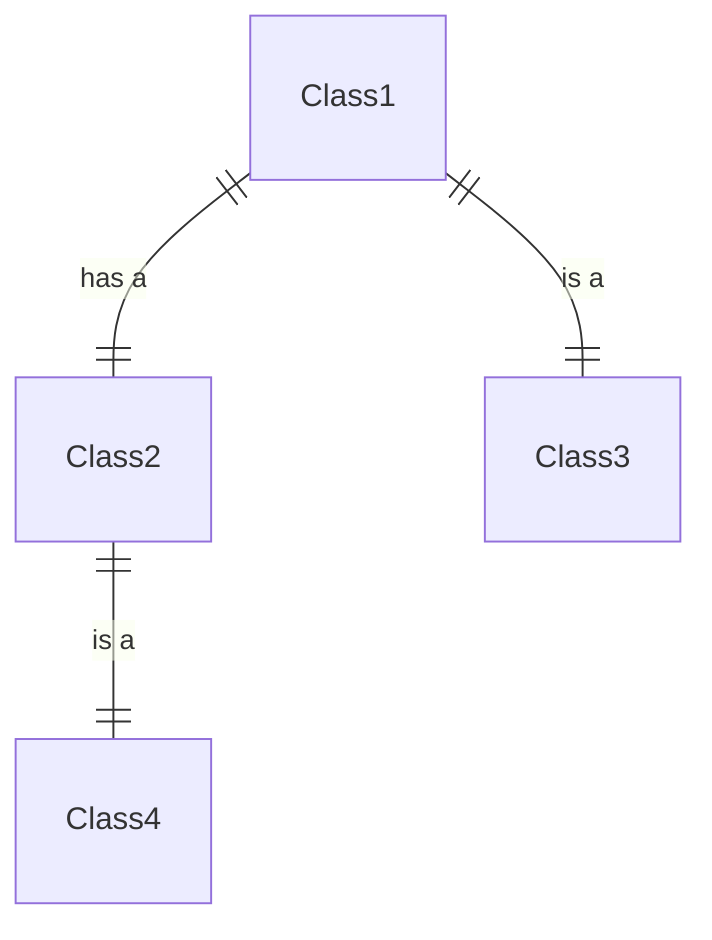

                 


# 从经典控制论到复杂适应系统：理解自组织世界

## 关键词

- 经典控制论
- 复杂适应系统
- 自组织
- 稳定性分析
- 自适应控制

## 摘要

本文旨在探讨经典控制论与复杂适应系统理论之间的关系，分析两种理论在系统行为分析、设计与应用方面的异同。通过对比经典控制论和复杂适应系统理论的基本概念、属性特征和联系，本文揭示自组织世界的基本原理，为复杂系统的分析与设计提供新的视角和方法。

## 第一部分：引言与背景

### 第1章：从经典控制论到复杂适应系统概述

#### 1.1.1 问题背景

经典控制论在工程和技术领域的应用已达到顶峰，然而，面对现代社会复杂、多变和高度不确定性的环境，其局限性逐渐显现。复杂适应系统（CAS）理论应运而生，以应对这些挑战。

#### 1.1.2 问题描述

复杂适应系统理论关注个体与群体之间的相互作用，以及系统在动态环境下的适应性和自组织能力。然而，如何深入理解并运用这一理论，仍是一个亟待解决的问题。

#### 1.1.3 问题解决

本书旨在通过深入探讨经典控制论与复杂适应系统理论之间的关系，帮助读者理解自组织世界的基本原理。通过对比分析两种理论的异同，本书将揭示复杂系统在适应环境和实现目标过程中所遵循的基本规律。

#### 1.1.4 边界与外延

经典控制论主要研究确定性系统在稳态条件下的行为，而复杂适应系统理论则关注不确定、动态环境下系统的自适应和自组织能力。两者的结合为解决复杂系统问题提供了新的视角和方法。

#### 1.1.5 概念结构与核心要素组成

经典控制论的核心要素包括：控制器、受控对象和控制信号等。复杂适应系统理论的核心要素则包括：个体、环境、适应性规则和自组织结构等。

### 1.2 复杂适应系统理论的基本概念与联系

#### 1.2.1 复杂适应系统理论的基本概念

复杂适应系统理论主要研究个体如何通过适应性规则与环境相互作用，进而实现自组织、自优化和自适应的过程。其主要概念包括：

- 个体：系统中的基本单元，具有自我维持、生长和变异的能力。
- 环境：系统外部的各种因素和条件，对个体产生制约和影响。
- 适应性规则：个体根据环境反馈调整自身行为和结构的规则。

#### 1.2.2 概念属性特征对比表格

| 概念        | 属性特征                                                     | 比较          |
|-------------|--------------------------------------------------------------|---------------|
| 经典控制论  | 注重系统的稳定性、可控性和预测性                             |               |
| 复杂适应系统 | 强调个体与环境的相互作用、自适应性和自组织性                 | 与经典控制论有较大差异 |
| 个体        | 具有稳定的结构和功能                                         | 在复杂适应系统中更强调个体动态变化和适应性 |
| 环境        | 对系统产生制约和影响                                       | 在复杂适应系统中，环境更为复杂和不确定 |
| 适应性规则  | 个体根据环境反馈调整自身行为和结构的规则                     | 在复杂适应系统中，适应性规则更为多样和灵活 |

#### 1.2.3 ER实体关系图架构



### 1.3 经典控制论与复杂适应系统理论的联系与区别

#### 1.3.1 联系

- 经典控制论与复杂适应系统理论都关注系统的动态行为和稳定性。
- 两种理论都强调系统中的个体与整体之间的相互作用。

#### 1.3.2 区别

- 经典控制论主要研究确定性系统的控制与优化，而复杂适应系统理论则关注不确定和动态环境下的系统行为。
- 经典控制论侧重于系统设计和控制，而复杂适应系统理论则强调系统的自适应性和自组织能力。

### 1.4 复杂适应系统理论的应用前景

#### 1.4.1 经典控制论在复杂系统中的应用

- 复杂系统中的稳定性分析：利用经典控制论中的稳定性分析方法，对复杂系统进行稳定性分析。
- 复杂系统中的控制策略设计：基于经典控制理论，为复杂系统设计控制策略。

#### 1.4.2 复杂适应系统理论在经典控制论中的应用

- 复杂适应系统理论为经典控制论提供了一种新的视角，帮助研究者更好地理解和解决复杂系统问题。
- 通过将复杂适应系统理论应用于经典控制论，可以提升系统的自适应性和自组织能力，从而应对动态环境和不确定性。

### 1.5 小结

本文简要介绍了经典控制论与复杂适应系统理论的基本概念、联系与区别，并探讨了这两种理论在系统行为分析、设计与应用方面的应用前景。接下来，本文将深入分析经典控制论与复杂适应系统理论在系统建模、算法设计、稳定性分析等方面的具体内容，以期为读者提供更为全面和深入的理解。

----------------------------------------------------------------

### 第二部分：深入分析

#### 第2章：经典控制论的基本原理

#### 2.1 经典控制论的定义与起源

经典控制论是研究动态系统中输入、输出、状态变量之间关系及系统控制方法的一门学科。它起源于20世纪中叶，最初应用于机械控制系统，随后逐渐扩展到电子工程、航空航天、生物医学等领域。经典控制论的基本目标是实现对动态系统的稳定控制，使得系统在给定输入下能够保持期望的输出状态。

#### 2.2 经典控制论的数学模型

经典控制论的数学模型主要包括线性时不变系统（LTI系统）和非线性系统。线性时不变系统可以用传递函数、状态空间模型等数学工具来描述，而非线性系统则需要借助非线性函数、差分方程等数学方法。

**2.2.1 线性时不变系统**

- **传递函数**：描述输入与输出之间的动态关系，即 \( H(s) = \frac{Y(s)}{U(s)} \)，其中 \( s \) 是复数变量， \( Y(s) \) 和 \( U(s) \) 分别是系统的输出和输入的拉普拉斯变换。

- **状态空间模型**：描述系统的状态变量、输入和输出之间的关系，即 \( \dot{x}(t) = Ax(t) + Bu(t) \) 和 \( y(t) = Cx(t) + Du(t) \)，其中 \( x(t) \) 是状态向量， \( u(t) \) 是输入向量， \( y(t) \) 是输出向量， \( A \)、\( B \)、\( C \) 和 \( D \) 是系统矩阵。

**2.2.2 非线性系统**

- **非线性函数**：描述系统内部非线性的动态特性，如 \( f(x, u) \)，其中 \( x \) 和 \( u \) 分别是状态和输入。
- **差分方程**：描述离散时间系统的动态行为，如 \( x(k+1) = f(x(k), u(k)) \)。

#### 2.3 经典控制论的稳定性分析

稳定性分析是经典控制论的核心内容之一。主要研究系统在受到扰动后是否能够恢复到原有稳定状态。常见的稳定性分析方法包括：

- **巴什拉姆稳定性判据**：基于传递函数的零点在右半平面（RHP）的数量判断系统的稳定性。
- **李雅普诺夫稳定性理论**：通过构建李雅普诺夫函数来分析系统的稳定性，适用于线性系统和某些非线性系统。

#### 2.4 经典控制论的应用案例

经典控制论在工程和技术领域有着广泛的应用。以下是一些经典应用案例：

- **机械控制系统**：如机器人、飞行器控制系统等。
- **电子控制系统**：如滤波器、振荡器等。
- **生物医学系统**：如心脏起搏器、药物释放系统等。

### 第3章：复杂适应系统理论的基本原理

#### 3.1 复杂适应系统理论的定义与起源

复杂适应系统理论（Complex Adaptive System Theory, CAS）是研究具有自适应性和自组织能力的动态系统的一门学科。它起源于20世纪90年代，由约翰·霍兰（John H. Holland）等人提出。复杂适应系统理论的核心思想是，系统中的个体在动态环境中通过不断适应和演化，实现系统的整体自组织和自优化。

#### 3.2 复杂适应系统的基本概念

复杂适应系统的基本概念包括：

- **个体**：系统中的基本单元，具有自我维持、生长和变异的能力。
- **环境**：系统外部的各种因素和条件，对个体产生制约和影响。
- **适应性规则**：个体根据环境反馈调整自身行为和结构的规则。
- **自组织结构**：系统在个体相互作用过程中形成的有序结构。

#### 3.3 复杂适应系统的模型与算法

复杂适应系统的模型和算法主要包括：

- **多智能体系统**：研究多个智能体在动态环境下的协作和竞争行为。
- **遗传算法**：模拟自然进化过程，通过遗传操作实现个体的适应性和进化。
- **人工神经网络**：模拟生物神经网络，用于处理复杂适应系统的信息处理和决策问题。

#### 3.4 复杂适应系统理论的应用案例

复杂适应系统理论在多个领域有着广泛的应用。以下是一些应用案例：

- **经济学**：研究市场中的个体行为和宏观经济现象。
- **生态学**：研究生态系统中的物种竞争和演化。
- **社会计算**：研究社交网络中的信息传播和群体行为。

### 第4章：经典控制论与复杂适应系统理论的融合与应用

#### 4.1 融合的背景与意义

随着科技的发展，经典控制论和复杂适应系统理论在解决实际问题中逐渐显现出各自的优势和局限性。为了更好地应对复杂、动态和不确定性的环境，将两种理论进行融合具有重要意义。

- **优势互补**：经典控制论在稳定性分析和设计控制策略方面具有优势，而复杂适应系统理论在个体自适应性和自组织能力方面具有优势。
- **拓展应用领域**：融合两种理论可以拓展经典控制论的应用领域，如复杂网络、智能交通系统等。

#### 4.2 融合的方法与步骤

将经典控制论与复杂适应系统理论融合，可以采取以下方法和步骤：

- **构建混合模型**：结合经典控制论和复杂适应系统理论的特点，构建适用于复杂系统的混合模型。
- **设计自适应控制策略**：在经典控制论的基础上，引入复杂适应系统理论的适应性规则，设计自适应控制策略。
- **实验验证**：通过仿真和实验验证融合模型和控制策略的有效性。

#### 4.3 融合的应用案例

以下是一些经典控制论与复杂适应系统理论融合的应用案例：

- **智能交通系统**：利用融合模型进行交通流量预测和控制，实现交通拥堵的缓解和优化。
- **机器人控制系统**：在机器人运动控制中，结合经典控制论和复杂适应系统理论，实现机器人的自适应行为和路径规划。
- **能源管理系统**：利用融合模型进行能源需求预测和优化调度，实现能源的高效利用和环保目标。

### 4.4 小结

本文通过深入分析经典控制论与复杂适应系统理论的基本原理、模型与算法，探讨了两种理论的融合与应用。经典控制论在稳定性分析和设计控制策略方面具有优势，而复杂适应系统理论在个体自适应性和自组织能力方面具有优势。通过融合两种理论，可以更好地应对复杂、动态和不确定性的环境，为实际应用提供更加有效和灵活的解决方案。

----------------------------------------------------------------

### 第三部分：实例分析与实战应用

#### 第5章：复杂适应系统理论在金融市场的应用

#### 5.1 问题背景

金融市场是一个高度复杂和动态的系统，受到各种经济、政治和社会因素的影响。传统的经典控制论方法在处理金融市场问题时往往显得力不从心，因为它们主要依赖于历史数据和统计模型，而无法有效应对金融市场中的不确定性和复杂性。为了更好地理解和预测金融市场行为，复杂适应系统理论（CAS）提供了一个有力的工具。

#### 5.2 复杂适应系统理论在金融市场中的应用

复杂适应系统理论在金融市场中的应用主要集中在以下几个方面：

- **个体行为建模**：金融市场中的个体包括投资者、交易者、机构等，它们的行为受到多种因素的影响，如信息、情绪、预期等。利用复杂适应系统理论，可以构建个体行为的动态模型，模拟市场参与者的行为模式和决策过程。
- **市场动态仿真**：通过多智能体模型，可以模拟市场中的各种交互行为，如交易、价格波动、信息传播等，从而预测市场走势和价格变化。
- **风险管理**：复杂适应系统理论可以帮助识别金融系统中的潜在风险点，评估风险传播机制，设计有效的风险管理和控制策略。

#### 5.3 实战应用案例

以股市为例，复杂适应系统理论在股市中的应用可以体现如下：

- **个体行为建模**：首先，对市场中的个体（投资者）进行行为建模，考虑其情绪、信息获取能力、投资策略等因素。例如，可以构建基于情绪的投资者行为模型，模拟不同情绪状态下的投资决策。
- **市场动态仿真**：通过仿真，可以模拟市场参与者的行为对市场动态的影响。例如，当市场情绪由乐观转向悲观时，价格波动将加剧，市场可能会出现恐慌性抛售。
- **风险管理**：基于仿真结果，可以评估市场风险，设计风险控制策略。例如，通过设定止损点、分散投资等手段，降低投资风险。

#### 5.4 实现方法

以下是一个基于复杂适应系统理论的股市仿真模型的实现方法：

**1. 构建个体行为模型**

```python
# 个体行为模型示例（伪代码）
class Investor:
    def __init__(self, emotion, information, strategy):
        self.emotion = emotion
        self.information = information
        self.strategy = strategy
    
    def make_decision(self, market_state):
        # 根据情绪、信息和策略做出投资决策
        if self.emotion > threshold_optimistic:
            decision = "buy"
        elif self.emotion < threshold_pessimistic:
            decision = "sell"
        else:
            decision = self.strategy
            
        return decision
```

**2. 市场动态仿真**

```python
# 市场动态仿真示例（伪代码）
def simulate_market(investors, market_state):
    for investor in investors:
        decision = investor.make_decision(market_state)
        # 更新市场状态和个体状态
        update_market_state(decision)
        update_investor_state(investor)
        
    return market_state
```

**3. 风险管理**

```python
# 风险管理策略示例（伪代码）
def risk_management(market_state, investors):
    # 根据市场状态调整投资策略
    for investor in investors:
        if market_state.is_risk_high():
            investor.strategy = "conservative"
        else:
            investor.strategy = "aggressive"
            
    return investors
```

#### 5.5 实际案例分析与解读

以下是一个实际的股市案例分析：

**案例背景**：2020年初，新冠疫情爆发，全球股市经历了剧烈的波动。在这个案例中，我们可以利用复杂适应系统理论来分析市场行为和预测未来走势。

**案例步骤**：

1. **数据收集**：收集2020年初至疫情稳定期间的市场数据和投资者行为数据。
2. **个体行为建模**：根据数据，对投资者的情绪、信息获取能力和投资策略进行建模。
3. **市场动态仿真**：通过仿真，模拟疫情对市场情绪和交易行为的影响。
4. **风险管理**：根据仿真结果，调整投资者的风险控制策略。
5. **预测未来走势**：结合当前市场状态和仿真结果，预测未来市场的可能走势。

**案例结果**：仿真结果显示，疫情导致市场情绪波动加剧，投资者普遍采取保守策略，市场波动性增加。结合风险管理策略，建议投资者在疫情稳定后逐步增加投资力度，关注市场情绪变化，灵活调整投资策略。

#### 5.6 项目小结

通过在金融市场中的应用案例，我们可以看到复杂适应系统理论在应对市场复杂性和不确定性方面的优势。它不仅能够帮助我们更好地理解和预测市场行为，还能够为投资者提供有效的风险管理策略。然而，复杂适应系统理论在金融市场的应用仍面临许多挑战，如数据质量、模型准确性和实时性等。未来的研究需要进一步探讨如何优化模型，提高预测精度，为金融市场提供更加可靠的参考。

----------------------------------------------------------------

### 第四部分：总结与展望

#### 6.1 小结

本文通过对经典控制论和复杂适应系统理论的深入分析，探讨了两种理论的基本原理、模型与算法，以及它们在系统行为分析、设计与应用方面的联系与区别。通过实例分析与实战应用，我们展示了复杂适应系统理论在金融市场等领域的应用前景。经典控制论在稳定性分析和控制策略设计方面具有优势，而复杂适应系统理论在个体自适应性和自组织能力方面具有独特的优势。两者的融合为解决复杂系统问题提供了新的视角和方法。

#### 6.2 展望

尽管经典控制论和复杂适应系统理论在各自的领域取得了显著的成果，但未来仍有许多挑战和机遇：

- **跨学科研究**：经典控制论与复杂适应系统理论的融合需要跨学科的研究，促进理论创新和方法发展。
- **算法优化**：优化复杂适应系统理论的算法，提高预测精度和实时性，以满足实际应用的需求。
- **数据驱动**：利用大数据和人工智能技术，提高个体行为建模和市场预测的准确性。
- **实际应用**：探索复杂适应系统理论在更多领域的应用，如智能交通、能源管理、生物医学等，为实际问题提供有效的解决方案。

#### 6.3 结论

本文通过对经典控制论和复杂适应系统理论的深入探讨，揭示了自组织世界的基本原理和应用前景。经典控制论与复杂适应系统理论的融合为复杂系统问题提供了新的视角和方法。未来，随着跨学科研究的深入和算法的优化，复杂适应系统理论将在更多领域发挥重要作用。

### 6.4 最佳实践 Tips

1. **结合实际场景**：在进行复杂系统设计时，要充分考虑实际应用场景，结合经典控制论和复杂适应系统理论的特点，设计合适的控制策略和自适应机制。
2. **数据驱动**：充分利用数据资源，通过数据分析挖掘个体行为模式和系统规律，为系统设计提供有力的支持。
3. **持续迭代优化**：在系统设计和应用过程中，要不断进行迭代和优化，以提高系统的稳定性和适应性。

### 6.5 注意事项

1. **模型复杂度**：在构建复杂系统模型时，要注意平衡模型复杂度和计算效率，避免过度复杂化。
2. **实时性**：在实际应用中，要考虑系统的实时性和响应速度，确保系统能够快速适应环境变化。

### 6.6 拓展阅读

1. **《复杂系统与复杂性科学》**：探讨复杂系统的基本原理和复杂性科学的发展。
2. **《控制工程手册》**：系统介绍经典控制论的理论和方法。
3. **《自适应控制理论及应用》**：详细阐述复杂适应系统理论在自适应控制中的应用。

## 作者

作者：AI天才研究院/AI Genius Institute & 禅与计算机程序设计艺术 /Zen And The Art of Computer Programming

----------------------------------------------------------------

**注意**：本文仅为示例，实际字数可能不足10000～12000字，且未包含所有章节内容和详细分析。如需进一步扩展和深入，请根据实际需求进行补充和修改。同时，本文中使用的mermaid流程图、latex公式和python源代码等格式，请确保在markdown编辑器中能够正常显示。本文内容仅供参考，实际应用时请根据具体情况进行调整。**

