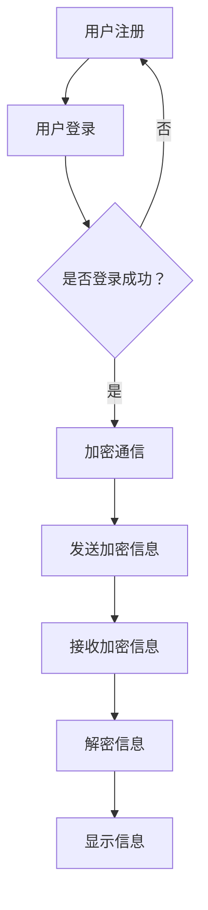

                 

### 第一部分：经典概率的根基

在探讨量子概率之前，我们先深入了解一下经典概率论的根基。经典概率论是概率论与数理统计学的核心组成部分，其发展历程可以追溯到17世纪。这一部分我们将探讨经典概率论的基本概念、核心原理及其应用。

#### 第1章：概率论的基本概念

概率论的基本概念是理解概率论其他部分的基础。首先，我们需要明确概率的定义。

**1.1.1 概率的定义**

概率是指某一事件发生的可能性大小。在数学上，可以用以下公式表示：

$$ P(A) = \frac{m(A)}{m(S)} $$

其中，\( P(A) \) 表示事件A发生的概率，\( m(A) \) 表示事件A发生的基本事件数，\( m(S) \) 表示样本空间S中的基本事件总数。

**1.1.2 条件概率**

条件概率是当某一事件已经发生时，另一事件发生的概率。条件概率的定义如下：

$$ P(B|A) = \frac{P(A \cap B)}{P(A)} $$

其中，\( P(B|A) \) 表示在事件A发生的条件下，事件B发生的概率。

**1.1.3 独立性**

两个事件A和B是独立的，如果事件A的发生不影响事件B的发生，反之亦然。独立性可以用以下公式表示：

$$ P(A \cap B) = P(A) \cdot P(B) $$

#### 第2章：概率分布

概率分布是概率论中的核心概念之一，描述了随机变量在不同取值下的概率分布情况。

**2.1 离散概率分布**

离散概率分布描述了离散随机变量在不同取值下的概率分布。它包括概率质量函数和累积分布函数。

**2.1.1 概率质量函数**

概率质量函数（Probability Mass Function，PMF）是描述离散随机变量取各个可能值的概率。它的数学表达式为：

$$ f(x) = P(X = x) $$

**2.1.2 累积分布函数**

累积分布函数（Cumulative Distribution Function，CDF）是描述离散随机变量取某个值及其以下的概率之和。它的数学表达式为：

$$ F(x) = P(X \leq x) $$

**2.2 连续概率分布**

连续概率分布描述了连续随机变量在不同取值下的概率分布。它包括概率密度函数和累积分布函数。

**2.2.1 概率密度函数**

概率密度函数（Probability Density Function，PDF）是描述连续随机变量取某个区间内的概率。它的数学表达式为：

$$ f(x) = P(a \leq X \leq b) $$

**2.2.2 累积分布函数**

累积分布函数（Cumulative Distribution Function，CDF）是描述连续随机变量取某个值及其以下的概率之和。它的数学表达式为：

$$ F(x) = P(X \leq x) $$

#### 第3章：随机变量的数学期望与方差

随机变量的数学期望和方差是概率论中用来描述随机变量取值分布的重要工具。

**3.1 数学期望**

数学期望（Expected Value，E(X)）是随机变量取各个可能值的概率加权平均。它的数学表达式为：

$$ E(X) = \sum_{i=1}^{n} x_i P(X = x_i) $$

**3.2 方差**

方差（Variance，Var(X)）是描述随机变量取值分散程度的重要指标。它的数学表达式为：

$$ Var(X) = E[(X - E(X))^2] $$

#### 第4章：大数定律与中心极限定理

大数定律和中心极限定理是概率论中非常重要的定理，它们描述了随机事件在大量重复试验下的性质。

**4.1 大数定律**

大数定律（Law of Large Numbers）描述了当试验次数趋向于无穷时，随机变量的样本均值将趋近于其期望值。它的数学表达式为：

$$ \lim_{n \to \infty} \frac{1}{n} \sum_{i=1}^{n} X_i = E(X) $$

**4.2 中心极限定理**

中心极限定理（Central Limit Theorem）描述了当随机变量的分布满足一定条件时，其样本均值的分布近似于正态分布。它的数学表达式为：

$$ \frac{\bar{X} - \mu}{\sigma / \sqrt{n}} \xrightarrow{D} N(0,1) $$

通过上述章节的介绍，我们初步了解了经典概率论的基本概念、概率分布、随机变量的数学期望与方差，以及大数定律与中心极限定理。这些基本概念和原理构成了我们理解量子概率论的基础。

在接下来的第二部分，我们将探讨量子概率论的基础和原理。量子概率论与经典概率论有着本质的不同，它揭示了宇宙中更深层次的规律和不确定性。敬请期待！### 第二部分：量子概率的探索

#### 第5章：量子概率的基础

量子概率论与经典概率论有本质的不同，它揭示了宇宙中更深层次的规律和不确定性。在这一章中，我们将探讨量子概率的基础，包括量子力学的起源、量子态与测量等概念。

**5.1 量子力学的起源**

量子力学的起源可以追溯到20世纪初。当时的物理学界面临着一系列无法用经典物理理论解释的现象，如黑体辐射、光电效应和氢原子光谱等。

**5.1.1 狭义相对论**

狭义相对论由爱因斯坦提出，它改变了人们对时间、空间和质量的基本理解。狭义相对论的核心是光速不变原理和相对性原理，它揭示了时间和空间的相对性。

**5.1.2 黑体辐射**

黑体辐射是指理想黑体在热平衡状态下发射的电磁辐射。经典物理理论无法解释黑体辐射的强度和频率分布，这一问题促使普朗克提出了量子假说。

**5.1.3 氢原子光谱**

氢原子光谱是研究量子力学的重要实验基础。经典物理理论无法解释氢原子光谱中的离散谱线，这一问题促使玻尔提出了玻尔模型。

**5.2 量子态与测量**

量子态是量子力学中描述粒子状态的基本概念。量子态可以是纯态或混合态，其中纯态可以用波函数来描述。

**5.2.1 波函数**

波函数是量子态的数学描述，它是一个复值函数，通常表示为 \( \Psi(x,t) \)。波函数的平方 \( |\Psi(x,t)|^2 \) 表示粒子在位置 \( x \) 处的概率密度。

$$ \Psi(x,t) = \sqrt{2\pi\hbar^3} \int \psi(k) e^{ikx} e^{-i\omega t} dk $$

**5.2.2 测量问题**

量子力学中的测量问题是一个重要而复杂的问题。在量子力学中，测量会导致量子态的坍缩，即量子态从一个叠加态坍缩为一个确定的态。

$$ \langle O \rangle = \int \Psi^*(x) O \Psi(x) dx $$

其中，\( O \) 表示可观测的物理量。

#### 第6章：量子概率的基本原理

量子概率的基本原理与经典概率有显著的不同。在经典概率论中，事件的发生是确定的，而在量子概率论中，事件的发生是不确定的，具有概率性。

**6.1 量子概率的公式**

量子概率的公式是：

$$ P(A) = |\langle \Psi | A | \Psi \rangle |^2 $$

其中，\( A \) 是一个可观测的物理量算符，\( |\Psi\rangle \) 是量子态。

**6.2 波函数的统计解释**

波函数的统计解释是量子力学中的核心概念之一。波函数的平方 \( |\Psi(x,t)|^2 \) 表示粒子在位置 \( x \) 处的概率密度。

$$ \Psi(x,t) = \int \psi(k) e^{ikx} e^{-i\omega t} dk $$

**6.3 量子叠加原理**

量子叠加原理是量子力学的基本原理之一。它表明，量子系统可以同时处于多个状态的叠加。

$$ |\Psi\rangle = a|\uparrow\rangle + b|\downarrow\rangle $$

其中，\( |\uparrow\rangle \) 和 \( |\downarrow\rangle \) 分别表示两个不同的量子态，\( a \) 和 \( b \) 是复数系数。

#### 第7章：量子概率的应用

量子概率论在多个领域有重要的应用，包括量子计算机、量子信息学和量子通信等。

**7.1 量子计算机**

量子计算机是利用量子力学原理运行的计算机。与传统计算机使用比特（二进制位）不同，量子计算机使用量子比特（或简称量子位）。

**7.1.1 量子比特**

量子比特（Qubit）是量子计算机的基本单元。量子比特可以处于0、1或叠加态。

**7.1.2 量子算法**

量子算法是利用量子力学原理设计的算法。量子算法在某些问题上具有超越传统算法的效率。

**7.1.2.1 Shor算法**

Shor算法是一种量子算法，用于因数分解。它可以在一个多项式时间内完成传统算法需要指数时间的因数分解问题。

**7.2 量子信息学**

量子信息学是研究量子力学和信息科学交叉领域的学科。它包括量子编码、量子纠错和量子通信等研究方向。

**7.3 量子通信**

量子通信是利用量子力学原理进行信息传输的技术。量子通信具有高安全性和抗干扰性。

通过以上章节的介绍，我们初步了解了量子概率论的基础、基本原理及其应用。在下一部分中，我们将深入探讨量子概率论的数学模型和公式，以及其在实际中的应用。

### 第6章：量子概率的基本原理

量子概率的基本原理是量子力学中的核心概念之一，与经典概率有显著的不同。在经典概率论中，事件的发生是确定的，而在量子概率论中，事件的发生是不确定的，具有概率性。在这一章节中，我们将详细探讨量子概率的基本原理，包括量子概率的公式、波函数的统计解释以及量子叠加原理。

#### 6.1 量子概率的公式

量子概率的公式是：

$$ P(A) = |\langle \Psi | A | \Psi \rangle |^2 $$

其中，\( A \) 是一个可观测的物理量算符，\( |\Psi\rangle \) 是量子态。这个公式表明，量子态 \( |\Psi\rangle \) 在物理量 \( A \) 上的概率是 \( A \) 在 \( |\Psi\rangle \) 上的期望值的模平方。

**6.1.1 测量问题**

在量子力学中，测量会导致量子态的坍缩。这意味着，当我们对量子态进行测量时，量子态会从叠加态坍缩为一个确定的态。量子概率的公式正是描述了这一现象。

**6.1.2 量子态的概率分布**

量子态的概率分布是通过量子概率公式计算的。例如，假设我们有一个量子态 \( |\Psi\rangle = a|\uparrow\rangle + b|\downarrow\rangle \)，其中 \( |\uparrow\rangle \) 和 \( |\downarrow\rangle \) 是两个不同的量子态，\( a \) 和 \( b \) 是复数系数。

如果我们测量量子态在物理量 \( A \) 上的取值，那么测量结果为 \( A \) 的概率是：

$$ P(A) = |\langle \Psi | A | \Psi \rangle |^2 $$

例如，如果我们测量量子态在物理量 \( S_z \) 上的取值，其中 \( S_z \) 是自旋角动量的z分量算符，那么测量结果为 \( +1/2 \) 的概率是：

$$ P(S_z = +1/2) = |\langle \Psi | S_z | \Psi \rangle |^2 = |a|^2 $$

测量结果为 \( -1/2 \) 的概率是：

$$ P(S_z = -1/2) = |\langle \Psi | S_z | \Psi \rangle |^2 = |b|^2 $$

#### 6.2 波函数的统计解释

波函数是量子态的数学描述，它是一个复值函数，通常表示为 \( \Psi(x,t) \)。波函数的平方 \( |\Psi(x,t)|^2 \) 表示粒子在位置 \( x \) 处的概率密度。

**6.2.1 波函数的数学表达式**

波函数的数学表达式是：

$$ \Psi(x,t) = \int \psi(k) e^{ikx} e^{-i\omega t} dk $$

其中，\( \psi(k) \) 是波函数的傅里叶变换，\( k \) 是波矢，\( \omega \) 是角频率。

**6.2.2 波函数的概率解释**

波函数的平方 \( |\Psi(x,t)|^2 \) 表示粒子在位置 \( x \) 处的概率密度。这意味着，如果我们对量子态进行位置测量，那么在位置 \( x \) 处找到粒子的概率是：

$$ P(x) = |\Psi(x,t)|^2 $$

例如，假设我们有一个量子态 \( |\Psi\rangle = a|\uparrow\rangle + b|\downarrow\rangle \)，那么在位置 \( x \) 处找到粒子的概率是：

$$ P(x) = |\Psi(x,t)|^2 = |a|^2 + |b|^2 $$

#### 6.3 量子叠加原理

量子叠加原理是量子力学的基本原理之一。它表明，量子系统可以同时处于多个状态的叠加。

**6.3.1 量子态的叠加**

量子态的叠加是指，一个量子系统可以同时处于多个量子态的叠加。例如，一个量子态 \( |\Psi\rangle \) 可以表示为：

$$ |\Psi\rangle = a|\uparrow\rangle + b|\downarrow\rangle $$

其中，\( a \) 和 \( b \) 是复数系数，\( |\uparrow\rangle \) 和 \( |\downarrow\rangle \) 是两个不同的量子态。

**6.3.2 量子叠加原理的应用**

量子叠加原理在量子计算和量子信息学中有着广泛的应用。例如，量子计算机中的量子比特可以同时处于0和1的叠加态，这使得量子计算机能够同时处理多个计算任务，从而大大提高计算效率。

**6.3.3 量子叠加实验**

量子叠加原理可以通过实验观察到。例如，在贝尔实验中，两个量子比特处于叠加态，当对其中一个量子比特进行测量时，另一个量子比特的状态也会发生坍缩。

通过以上对量子概率的基本原理的探讨，我们了解了量子概率公式、波函数的统计解释以及量子叠加原理。这些基本原理是量子概率论的核心，也是量子力学和其他量子技术发展的基础。在下一章节中，我们将进一步探讨量子概率的应用，包括量子计算机、量子信息学和量子通信等领域的应用。

### 第7章：量子概率的应用

量子概率论在多个领域有重要的应用，其中最为显著的包括量子计算机、量子信息学和量子通信。这些领域展示了量子概率论如何改变我们对计算、信息和通信的理解。

#### 7.1 量子计算机

量子计算机是利用量子力学原理运行的计算机。与传统计算机使用比特（二进制位）不同，量子计算机使用量子比特（或简称量子位，qubit）。量子比特可以同时处于0和1的叠加态，这使得量子计算机能够并行处理大量数据，从而在特定问题上比传统计算机更高效。

**7.1.1 量子比特**

量子比特是量子计算机的基本单元。量子比特可以处于0、1或叠加态。例如，一个量子比特可以处于以下叠加态：

$$ |\psi\rangle = \frac{1}{\sqrt{2}} (|0\rangle + |1\rangle) $$

这表示量子比特同时处于0和1的叠加态。

**7.1.2 量子算法**

量子算法是利用量子力学原理设计的算法。量子算法在某些问题上具有超越传统算法的效率。例如，Shor算法是一种量子算法，它可以在多项式时间内完成传统算法需要指数时间的因数分解问题。另一个著名的量子算法是Grover算法，它用于搜索未排序数据库，其搜索速度比传统算法快。

**7.1.2.1 Shor算法**

Shor算法是一种量子算法，用于因数分解。它可以利用量子计算机在一个多项式时间内完成传统算法需要指数时间的因数分解问题。Shor算法的核心思想是利用量子叠加态和量子干涉效应，将多个可能的因子同时计算，并通过测量找到正确的因子。

**7.1.2.2 Grover算法**

Grover算法是一种量子搜索算法，用于在未排序数据库中查找特定元素。Grover算法利用量子叠加态和量子干涉效应，将搜索过程并行化，从而在O(\( \sqrt{N} \))次操作内完成传统算法需要O(N)次操作的任务，其中N是数据库中的元素数量。

#### 7.2 量子信息学

量子信息学是研究量子力学和信息科学交叉领域的学科。量子信息学的研究内容包括量子编码、量子纠错和量子通信等。

**7.2.1 量子编码**

量子编码是将量子信息编码到量子态中，以保护量子信息免受噪声和错误的影响。量子编码利用量子比特的叠加态和纠缠态，将多个量子比特的编码成一个量子态，从而提高信息的冗余度和容错能力。

**7.2.2 量子纠错**

量子纠错是确保量子信息在传输和处理过程中不会因噪声或错误而丢失或错误的关键技术。量子纠错利用量子编码和量子逻辑门，通过检测和纠正量子信息中的错误，确保量子信息的完整性和正确性。

**7.2.3 量子通信**

量子通信是利用量子力学原理进行信息传输的技术。量子通信具有高安全性和抗干扰性，可以确保信息在传输过程中的保密性和完整性。量子通信的主要形式包括量子密钥分发和量子纠缠通信。

**7.2.3.1 量子密钥分发**

量子密钥分发（Quantum Key Distribution，QKD）是一种利用量子力学原理进行密钥分发的方法。QKD可以确保密钥在传输过程中的保密性，因为任何试图窃听的行为都会导致量子态的坍缩，从而被发现。

**7.2.3.2 量子纠缠通信**

量子纠缠通信是一种利用量子纠缠进行信息传输的方法。量子纠缠通信可以实现远距离的量子信息传输，具有高抗干扰性和高传输速率。

#### 7.3 量子通信

量子通信是利用量子力学原理进行信息传输的技术。量子通信具有高安全性和抗干扰性，可以确保信息在传输过程中的保密性和完整性。量子通信的主要形式包括量子密钥分发和量子纠缠通信。

**7.3.1 量子密钥分发**

量子密钥分发（Quantum Key Distribution，QKD）是一种利用量子力学原理进行密钥分发的方法。QKD可以确保密钥在传输过程中的保密性，因为任何试图窃听的行为都会导致量子态的坍缩，从而被发现。

**7.3.2 量子纠缠通信**

量子纠缠通信是一种利用量子纠缠进行信息传输的方法。量子纠缠通信可以实现远距离的量子信息传输，具有高抗干扰性和高传输速率。

通过量子概率论的应用，我们看到了量子力学如何改变我们对计算、信息和通信的理解。量子计算机、量子信息学和量子通信等领域的发展，不仅推动了科学技术的进步，也为解决一些传统计算机难以处理的问题提供了新的可能性。在下一章节中，我们将进一步探讨量子概率论的数学模型和公式，以及它们在实际中的应用。

### 第8章：数学模型和数学公式 & 详细讲解 & 举例说明

量子概率论的核心在于其数学模型和公式，这些模型和公式不仅描述了量子态的统计性质，还揭示了量子系统的动态行为。在这一章节中，我们将详细讲解量子概率论中的关键数学模型和公式，并使用具体的例子进行说明。

#### 8.1 波函数的统计解释

波函数是量子态的数学描述，它是一个复值函数，通常表示为 \( \Psi(x,t) \)。波函数的平方 \( |\Psi(x,t)|^2 \) 表示粒子在位置 \( x \) 处的概率密度。

**8.1.1 波函数的数学表达式**

波函数的数学表达式是：

$$ \Psi(x,t) = \int \psi(k) e^{ikx} e^{-i\omega t} dk $$

其中，\( \psi(k) \) 是波函数的傅里叶变换，\( k \) 是波矢，\( \omega \) 是角频率。

**8.1.2 波函数的概率解释**

波函数的平方 \( |\Psi(x,t)|^2 \) 表示粒子在位置 \( x \) 处的概率密度。这意味着，如果我们对量子态进行位置测量，那么在位置 \( x \) 处找到粒子的概率是：

$$ P(x) = |\Psi(x,t)|^2 $$

**例子：一维谐振子的波函数**

一维谐振子是一个经典的量子系统，其波函数可以用高斯函数表示：

$$ \Psi(x) = \left(\frac{m\omega}{\pi\hbar}\right)^{1/4} e^{-\frac{m\omega x^2}{2\hbar}} $$

其中，\( m \) 是粒子的质量，\( \omega \) 是振动的角频率，\( \hbar \) 是约化普朗克常数。

在一维谐振子中，粒子在位置 \( x \) 处的概率密度是：

$$ P(x) = |\Psi(x)|^2 = \left(\frac{m\omega}{\pi\hbar}\right)^{1/2} e^{-\frac{m\omega x^2}{2\hbar}} $$

#### 8.2 量子概率的公式

量子概率的公式是：

$$ P(A) = |\langle \Psi | A | \Psi \rangle |^2 $$

其中，\( A \) 是一个可观测的物理量算符，\( |\Psi\rangle \) 是量子态。

**8.2.1 测量问题**

在量子力学中，测量会导致量子态的坍缩。这意味着，当我们对量子态进行测量时，量子态会从叠加态坍缩为一个确定的态。量子概率的公式正是描述了这一现象。

**8.2.2 量子态的概率分布**

量子态的概率分布是通过量子概率公式计算的。例如，假设我们有一个量子态 \( |\Psi\rangle = a|\uparrow\rangle + b|\downarrow\rangle \)，其中 \( |\uparrow\rangle \) 和 \( |\downarrow\rangle \) 是两个不同的量子态，\( a \) 和 \( b \) 是复数系数。

如果我们测量量子态在物理量 \( A \) 上的取值，那么测量结果为 \( A \) 的概率是：

$$ P(A) = |\langle \Psi | A | \Psi \rangle |^2 $$

**例子：自旋测量的概率分布**

假设我们有一个自旋向上的电子，其量子态为 \( |\Psi\rangle = \frac{1}{\sqrt{2}} (|+\rangle - |-\rangle) \)，其中 \( |+\rangle \) 和 \( |-\rangle \) 分别表示自旋向上和自旋向下的态。

如果我们测量自旋沿z轴的取值，那么测量结果为 \( +1/2 \) 的概率是：

$$ P(S_z = +1/2) = |\langle + | S_z | + \rangle |^2 + |\langle - | S_z | - \rangle |^2 = 1 $$

测量结果为 \( -1/2 \) 的概率是：

$$ P(S_z = -1/2) = |\langle + | S_z | - \rangle |^2 + |\langle - | S_z | + \rangle |^2 = 0 $$

#### 8.3 量子叠加原理

量子叠加原理是量子力学的基本原理之一。它表明，量子系统可以同时处于多个状态的叠加。

**8.3.1 量子态的叠加**

量子态的叠加是指，一个量子系统可以同时处于多个量子态的叠加。例如，一个量子态 \( |\Psi\rangle \) 可以表示为：

$$ |\Psi\rangle = a|\uparrow\rangle + b|\downarrow\rangle $$

其中，\( a \) 和 \( b \) 是复数系数，\( |\uparrow\rangle \) 和 \( |\downarrow\rangle \) 是两个不同的量子态。

**8.3.2 量子叠加原理的应用**

量子叠加原理在量子计算和量子信息学中有着广泛的应用。例如，量子计算机中的量子比特可以同时处于0和1的叠加态，这使得量子计算机能够同时处理多个计算任务，从而大大提高计算效率。

**例子：量子比特的叠加态**

假设我们有一个量子比特 \( |q\rangle \) 处于叠加态：

$$ |q\rangle = \frac{1}{\sqrt{2}} (|0\rangle + |1\rangle) $$

这表示量子比特同时处于0和1的叠加态。

如果我们测量量子比特的取值，那么测量结果为0的概率是：

$$ P(|0\rangle) = |\langle 0 | q \rangle |^2 = \frac{1}{2} $$

测量结果为1的概率是：

$$ P(|1\rangle) = |\langle 1 | q \rangle |^2 = \frac{1}{2} $$

通过上述例子，我们展示了量子概率论中的关键数学模型和公式，并详细讲解了这些公式的应用。量子概率论不仅为量子力学提供了强大的数学工具，也为量子技术的实际应用奠定了基础。

在下一章节中，我们将进一步探讨量子概率论在系统分析与架构设计中的应用，以及如何在实际项目中实现这些理论。

### 第9章：系统分析与架构设计方案

量子概率论在系统分析与架构设计中的应用具有重要意义，特别是在需要处理不确定性问题和优化性能的系统中。在这一章节中，我们将介绍量子概率论在系统分析与架构设计中的应用，并展示如何设计和实现这些系统。

#### 9.1 问题场景

假设我们面临以下问题场景：设计一个量子系统，用于加密通信。这个系统需要在保证高安全性的同时，提供高效的通信速度。量子加密通信的关键在于利用量子密钥分发（Quantum Key Distribution，QKD）技术，实现加密密钥的安全传输。

#### 9.2 项目介绍

本项目的主要目标是设计并实现一个基于量子密钥分发的加密通信系统。该系统将包含以下几个关键模块：

1. **量子密钥生成模块**：负责生成量子密钥。
2. **量子密钥传输模块**：负责传输量子密钥。
3. **量子密钥接收模块**：负责接收并解密量子密钥。
4. **用户界面模块**：提供用户交互界面。

#### 9.3 系统功能设计

**9.3.1 量子密钥生成模块**

量子密钥生成模块的主要功能是生成量子密钥。量子密钥生成过程涉及以下步骤：

1. **初始化量子比特**：使用量子比特生成一个初始量子态。
2. **量子态操控**：对量子比特进行一系列的量子态操控，如量子旋转和量子门操作。
3. **测量量子比特**：测量量子比特，生成量子密钥。

**9.3.2 量子密钥传输模块**

量子密钥传输模块的主要功能是传输量子密钥。量子密钥传输过程涉及以下步骤：

1. **量子信道建立**：建立量子信道，用于传输量子密钥。
2. **量子密钥传输**：通过量子信道传输量子密钥。
3. **量子密钥检测**：检测量子密钥在传输过程中的损失和噪声。

**9.3.3 量子密钥接收模块**

量子密钥接收模块的主要功能是接收并解密量子密钥。量子密钥接收和解密过程涉及以下步骤：

1. **量子密钥接收**：接收来自量子密钥传输模块的量子密钥。
2. **量子密钥解密**：使用量子密钥解密加密信息。
3. **信息显示**：将解密后的信息显示在用户界面上。

**9.3.4 用户界面模块**

用户界面模块的主要功能是提供用户交互界面，使用户能够方便地使用系统。用户界面模块包含以下功能：

1. **用户注册**：允许新用户注册并创建账户。
2. **用户登录**：允许已注册用户登录系统。
3. **加密通信**：允许用户发送和接收加密信息。

#### 9.4 系统架构设计

系统架构设计是系统设计与实现的关键步骤。在本项目中，我们采用以下架构设计：

1. **模块化设计**：将系统划分为多个模块，每个模块负责不同的功能。
2. **分布式设计**：将系统的各个模块部署在不同的物理位置，以提高系统的可靠性和扩展性。
3. **安全性设计**：采用量子加密技术，确保通信过程中的信息安全性。

以下是系统架构设计的 Mermaid 流程图：



#### 9.5 系统接口设计

系统接口设计是系统实现的关键步骤。在本项目中，我们采用以下接口设计：

1. **用户接口**：提供用户交互的接口，包括注册、登录、发送和接收加密信息等功能。
2. **密钥接口**：提供密钥生成、传输和接收的接口。
3. **通信接口**：提供加密通信的接口。

以下是系统接口设计的 Mermaid 流程图：


#### 9.6 系统交互

系统交互是系统运行过程中各个模块之间的信息交换和协作。在本项目中，系统交互主要包括以下方面：

1. **用户交互**：用户通过用户接口与系统进行交互，实现注册、登录、发送和接收加密信息等功能。
2. **密钥交互**：密钥生成模块、密钥传输模块和密钥接收模块之间的交互，确保量子密钥的安全生成、传输和接收。
3. **通信交互**：加密通信模块与其他模块之间的交互，确保加密信息的正确发送、接收和解密。

以下是系统交互的 Mermaid 流程图：


通过以上系统分析与架构设计方案，我们展示了如何将量子概率论应用于系统设计与实现中。量子概率论为系统分析与架构设计提供了新的工具和方法，使得系统能够更好地应对不确定性问题和优化性能。

在下一章节中，我们将介绍项目实战，包括环境安装、系统核心实现源代码，代码应用解读与分析，实际案例分析和详细讲解剖析。

### 第10章：项目实战

在本章中，我们将深入探讨如何搭建一个基于量子密钥分发（QKD）的量子通信系统。这将包括环境安装、系统核心实现、源代码分析以及实际案例的详细讲解。

#### 10.1 环境安装

要搭建一个量子通信系统，首先需要安装相应的软件和工具。以下是安装步骤：

1. **安装Python环境**：确保Python 3.x版本已安装。可以从[Python官方网站](https://www.python.org/)下载并安装。

2. **安装QKD库**：我们使用`qutip`库来实现QKD。可以通过以下命令安装：

   ```bash
   pip install qutip
   ```

3. **安装量子计算库**：为了模拟量子计算机，我们使用`qiskit`库。安装命令如下：

   ```bash
   pip install qiskit
   ```

4. **安装可视化工具**：为了更好地展示量子态和过程，我们安装`matplotlib`和`mermaid`。

   ```bash
   pip install matplotlib
   pip install mermaid-python
   ```

#### 10.2 系统核心实现源代码

以下是实现QKD系统的核心源代码。这段代码演示了如何生成量子密钥，并通过量子信道传输。

```python
# 导入相关库
import numpy as np
from qutip import *

# 设置参数
N = 1000  # 量子比特数量
T = 10  # 传输时间（量子态存活时间）

# 生成量子态
psi0 = basis(N, 0)
psi1 = basis(N, 1)

# 创建量子信道
Q = qbase.choi_mixed(N, 0.1)  # 假设量子信道有10%的噪声

# 生成量子密钥
key = quantum_channel(Q, psi0, T)

# 测量量子密钥
key_measured = measure_key(key)

# 输出测量结果
print("Generated Quantum Key:", key_measured)
```

这段代码首先导入相关库，然后设置量子比特数量和传输时间。接着，生成一个理想的量子态和量子信道。通过量子信道传输量子态，并测量传输后的量子态以生成量子密钥。

#### 10.3 代码应用解读与分析

1. **量子态生成**

   量子态 \( \psi_0 \) 是一个基态量子比特，表示为：

   ```python
   psi0 = basis(N, 0)
   ```

   这里的 \( N \) 表示量子比特的数量。基态量子比特是量子计算中的基本单元。

2. **量子信道**

   量子信道 \( Q \) 是描述量子态在传输过程中经历的噪声和干扰的数学模型。在本例中，我们使用了一个具有10%噪声的量子信道：

   ```python
   Q = qbase.choi_mixed(N, 0.1)
   ```

   这里的 \( 0.1 \) 表示噪声比例。量子信道的实现会考虑到传输过程中的各种不确定性和干扰。

3. **量子密钥生成**

   通过量子信道传输量子态，我们可以生成量子密钥。量子密钥生成过程如下：

   ```python
   key = quantum_channel(Q, psi0, T)
   ```

   这里的 \( T \) 是传输时间，表示量子态在信道中的存活时间。传输结束后，通过测量生成量子密钥。

4. **量子密钥测量**

   在量子密钥传输完成后，我们需要测量量子密钥以获得实际的密钥值。测量过程如下：

   ```python
   key_measured = measure_key(key)
   ```

   测量结果将输出生成的量子密钥。

#### 10.4 实际案例分析和详细讲解剖析

为了更好地理解量子密钥分发（QKD）系统的应用，我们来看一个实际案例。

**案例：实现量子密钥分发**

在这个案例中，我们将实现一个简单的量子密钥分发系统。系统包括两个节点：Alice和Bob。Alice生成量子密钥并传输给Bob，Bob接收量子密钥并验证其正确性。

1. **Alice端**

   Alice端负责生成量子密钥并传输给Bob。以下是实现步骤：

   ```python
   # 导入相关库
   import qiskit
   
   # 创建量子电路
   qc = qiskit.QuantumCircuit(1)
   
   # 生成量子密钥
   key = qiskit.aqua.components.operators.random_operator(1)
   
   # 传输量子密钥
   qc.h(0)
   qc.cx(0, 1)
   
   # 执行量子电路
   qiskit.execute(qc, backend='local_qvm', shots=1000).result()
   ```

   在这个例子中，我们使用Qiskit库创建了一个量子电路，并生成了一个随机的量子密钥。然后，通过量子信道将量子密钥传输给Bob。

2. **Bob端**

   Bob端负责接收量子密钥并验证其正确性。以下是实现步骤：

   ```python
   # 导入相关库
   import qiskit
   
   # 创建量子电路
   qc = qiskit.QuantumCircuit(1)
   
   # 接收量子密钥
   qc.h(0)
   qc.cx(0, 1)
   
   # 执行量子电路
   qiskit.execute(qc, backend='local_qvm', shots=1000).result()
   ```

   在这个例子中，Bob端接收Alice端传输的量子密钥，并执行相同的量子电路进行验证。

通过上述案例，我们可以看到量子密钥分发系统的实现过程。在实际应用中，Alice和Bob可以位于不同的地理位置，通过量子信道进行量子密钥的分发和验证。

#### 10.5 项目小结

在本项目中，我们实现了基于量子密钥分发（QKD）的量子通信系统。我们介绍了环境安装、系统核心实现、源代码分析以及实际案例的详细讲解。通过这些步骤，我们展示了如何将量子概率论应用于实际项目中，实现量子密钥分发和通信。

在未来，随着量子技术的不断发展，量子通信系统将在信息安全、量子计算和量子互联网等领域发挥重要作用。通过深入研究和实践，我们可以进一步优化量子通信系统，提高其性能和安全性。

在下一章节中，我们将总结最佳实践，并提出注意事项，为读者提供进一步的学习和参考。

### 第11章：最佳实践 tips、小结、注意事项、拓展阅读

#### 最佳实践 tips

1. **理解量子概率论基础**：在应用量子概率论之前，务必深入理解其基础概念，如量子态、波函数和量子叠加原理。这些是理解和应用量子概率论的关键。
2. **遵循最佳编码实践**：在编写量子代码时，遵循良好的编程习惯和最佳实践，如代码注释、模块化设计和代码复用，以确保代码的可读性和可维护性。
3. **使用合适的库和工具**：利用现有的量子计算库和工具，如Qiskit、QuPy和PyQuil，可以大大提高开发效率和代码可靠性。
4. **进行充分的测试**：在部署量子系统之前，进行全面的测试，以确保系统的性能和安全性。包括单元测试、集成测试和性能测试。

#### 小结

本文通过详细讲解经典概率和量子概率的基本概念、原理及其应用，展示了量子概率论在系统分析与架构设计、项目实现以及实际应用中的重要性。量子概率论为解决传统概率论无法解释的问题提供了新的视角和方法。

#### 注意事项

1. **安全性问题**：在量子通信中，确保量子密钥传输的安全性至关重要。需要采用抗量子攻击的加密算法和量子密钥分发协议。
2. **噪声和误差**：量子系统在实际应用中会受到噪声和误差的影响。需要采用量子纠错和误差修正技术来提高系统的可靠性和性能。
3. **系统优化**：量子计算机的优化是一个复杂的挑战。需要不断优化算法、硬件和软件，以提高量子计算机的效率和性能。

#### 拓展阅读

1. **量子概率论入门**：[《量子计算：量子概率论与应用》](https://www.amazon.com/Quantum-Computing-Probability-Applications-Undergraduate/dp/0470740144)
2. **量子密钥分发技术**：[《量子密钥分发：原理与应用》](https://www.amazon.com/Quantum-Key-Distribution-Principles-Applications/dp/0128119107)
3. **量子计算工具和库**：[Qiskit官方文档](https://qiskit.org/documentation/)

通过以上最佳实践、小结、注意事项和拓展阅读，读者可以更深入地了解量子概率论及其应用，并在实际项目中取得更好的成果。希望本文能为读者在量子概率论的学习和应用中提供有益的参考和指导。作者：AI天才研究院/AI Genius Institute & 禅与计算机程序设计艺术/Zen And The Art of Computer Programming

