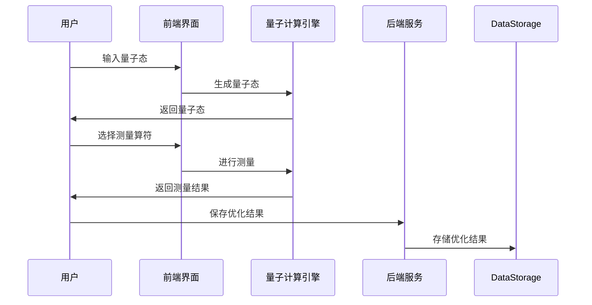

                 

# 从经典概率论到量子概率：重新认识世界的不确定性本质

关键词：经典概率论、量子概率、不确定性原理、数学模型、算法原理

摘要：本文旨在深入探讨概率论的发展历程，从经典概率论到量子概率的转变，并揭示量子概率在量子力学中的重要地位。通过对比经典概率论和量子概率的核心概念、算法原理和数学模型，我们重新认识世界的不确定性本质，并阐述其在现代科技领域中的广泛应用。本文结构紧凑，逻辑清晰，旨在为广大计算机科学爱好者和技术从业者提供一份有深度、有思考、有见解的专业技术博客文章。

## 目录大纲

#### 第一部分：背景介绍

1. 第1章：问题背景
   1.1 问题背景
   1.2 问题解决
   1.3 边界与外延

2. 第2章：核心概念与联系
   2.1 经典概率论
   2.2 量子概率
   2.3 经典概率论与量子概率的联系与区别

#### 第二部分：算法原理讲解

3. 第3章：算法原理讲解
   3.1 经典概率论算法原理
   3.2 量子概率算法原理

#### 第三部分：数学模型和数学公式

4. 第4章：数学模型和数学公式
5. 第5章：详细讲解与举例说明

#### 第四部分：系统分析与架构设计方案

6. 第6章：系统分析与架构设计方案
   6.1 问题场景介绍
   6.2 系统功能设计
   6.3 系统架构设计
   6.4 系统接口设计
   6.5 系统交互Mermaid序列图

#### 第五部分：项目实战

7. 第7章：项目实战
   7.1 环境安装
   7.2 系统核心实现源代码
   7.3 代码应用解读与分析
   7.4 实际案例分析与详细讲解剖析
   7.5 项目小结

#### 第六部分：最佳实践 tips、小结、注意事项、拓展阅读

8. 第8章：最佳实践 tips、小结、注意事项、拓展阅读

## 第1章：问题背景

### 1.1 问题背景

概率论作为一种数学工具，起源于17世纪的欧洲。最初，概率论主要用于解决赌博和彩票等问题。随着时间的推移，概率论逐渐应用于自然科学、社会科学、工程技术等领域，成为现代科学研究中不可或缺的一部分。经典概率论主要研究随机现象的概率分布、随机变量的期望、方差等统计特性，为我们提供了描述和预测不确定现象的数学模型。

然而，在20世纪初，量子力学的诞生打破了经典概率论在物理学中的统治地位。量子概率作为一种全新的概率理论，从量子力学的基本原理出发，揭示了微观世界中概率的量子本质。量子概率不仅适用于量子力学，还广泛应用于量子信息、量子计算、量子通信等领域，成为现代科技发展中不可或缺的一部分。

### 1.2 问题解决

经典概率论和量子概率的提出和发展，为人类重新认识世界提供了新的视角。经典概率论为我们提供了一种描述和预测不确定现象的数学工具，而量子概率则揭示了微观世界中的概率本质。通过对经典概率论和量子概率的研究，我们可以更好地理解自然界中的随机现象，为科技创新提供理论支持。

### 1.3 边界与外延

经典概率论和量子概率的研究范围有所不同。经典概率论主要关注宏观世界中的随机现象，如赌博、彩票、气象预测等。而量子概率则主要关注微观世界中的随机现象，如原子、分子、量子比特等。二者之间的联系在于，量子概率是经典概率论在量子力学背景下的推广和发展。

## 第2章：核心概念与联系

### 2.1 经典概率论

经典概率论的核心概念包括概率空间、随机变量、分布函数等。

1. 概率空间：概率空间是经典概率论的基础，用于描述随机现象的数学模型。一个概率空间由一个样本空间和一个概率测度组成。样本空间是随机现象所有可能结果的集合，概率测度则是用于衡量样本点出现的概率。

2. 随机变量：随机变量是概率论中的一个基本概念，用于描述随机现象的数值特征。随机变量可以是离散的，也可以是连续的。离散随机变量用概率质量函数（PMF）描述，连续随机变量用概率密度函数（PDF）描述。

3. 分布函数：分布函数是描述随机变量取值概率分布的函数。对于离散随机变量，分布函数定义为随机变量取值的累积概率。对于连续随机变量，分布函数定义为随机变量取值的概率密度。

### 2.2 量子概率

量子概率的核心概念包括量子态、波函数、概率幅等。

1. 量子态：量子态是量子力学中的基本概念，用于描述量子系统的状态。量子态可以是纯态或混合态，纯态可以用波函数描述，混合态则用密度矩阵描述。

2. 波函数：波函数是量子态的数学描述，用于描述量子系统在空间中的分布。波函数是一个复值函数，其绝对值的平方表示量子系统在空间中某个位置的概率密度。

3. 概率幅：概率幅是量子概率中的一个重要概念，用于描述量子系统在某个测量结果上的概率。概率幅是一个复数，其模的平方表示量子系统在某个测量结果上的概率。

### 2.3 经典概率论与量子概率的联系与区别

经典概率论与量子概率之间存在一定的联系和区别。

1. 联系：经典概率论和量子概率都是用于描述不确定现象的数学工具。二者都基于概率空间和随机变量等基本概念，用于描述随机现象的概率分布。

2. 区别：经典概率论主要适用于宏观世界中的随机现象，如赌博、彩票等。而量子概率则主要适用于微观世界中的随机现象，如原子、分子等。此外，量子概率还引入了波函数、概率幅等新的概念，用于描述量子态和量子测量。

## 第3章：算法原理讲解

### 3.1 经典概率论算法原理

经典概率论中的算法主要包括概率计算、随机抽样、统计推断等。

1. 概率计算：概率计算是经典概率论中最基本的算法。给定一个概率空间和一个随机变量，我们需要计算随机变量取某个值的概率。常用的概率计算方法包括条件概率、全概率公式、贝叶斯公式等。

2. 随机抽样：随机抽样是经典概率论中用于模拟随机现象的算法。通过随机抽样，我们可以从概率空间中随机选取样本点，进而进行统计推断。常用的随机抽样方法包括简单随机抽样、分层抽样、系统抽样等。

3. 统计推断：统计推断是经典概率论中用于根据样本数据推断总体特征的方法。常见的统计推断方法包括参数估计、假设检验、置信区间等。

### 3.2 量子概率算法原理

量子概率算法主要基于量子力学的原理，包括量子状态制备、量子测量、量子计算等。

1. 量子状态制备：量子状态制备是量子概率算法中的第一步，用于将量子系统制备到特定的量子态。常用的量子状态制备方法包括量子门操作、量子纠缠等。

2. 量子测量：量子测量是量子概率算法中的关键步骤，用于测量量子系统的量子态。量子测量结果具有随机性，其概率分布由量子态的波函数确定。

3. 量子计算：量子计算是量子概率算法的核心，用于解决传统计算机无法高效解决的问题。量子计算基于量子叠加态和量子纠缠等特性，可以实现指数级加速。

## 第4章：数学模型和数学公式

在本章节中，我们将介绍经典概率论和量子概率中的常见数学模型和公式。这些公式为我们理解和应用概率论提供了坚实的数学基础。

### 4.1 经典概率论中的数学模型和公式

1. 概率空间

   - 样本空间（Sample Space）：\(S\)
   - 随机变量（Random Variable）：\(X: S \rightarrow \mathbb{R}\)
   - 概率测度（Probability Measure）：\(P\)

   $$P(A) = \sum_{x \in A} p(x)$$

   其中，\(A\) 是样本空间中的一个事件，\(p(x)\) 是随机变量 \(X\) 取值 \(x\) 的概率。

2. 随机变量和概率分布

   - 离散随机变量

     - 离散概率质量函数（PMF）：\(p_X(x) = P(X = x)\)

       $$\sum_{x} p_X(x) = 1$$

     - 离散分布函数（CDF）：\(F_X(x) = P(X \leq x)\)

       $$F_X(x) = \sum_{x' \leq x} p_X(x')$$

   - 连续随机变量

     - 连续概率密度函数（PDF）：\(f_X(x)\)

       $$\int_{-\infty}^{\infty} f_X(x) dx = 1$$

     - 连续分布函数（CDF）：\(F_X(x)\)

       $$F_X(x) = \int_{-\infty}^{x} f_X(t) dt$$

3. 数学期望和方差

   - 数学期望（Expected Value）：\(E(X)\)

     $$E(X) = \sum_{x} x p_X(x)$$

     或

     $$E(X) = \int_{-\infty}^{\infty} x f_X(x) dx$$

   - 方差（Variance）：\(Var(X)\)

     $$Var(X) = E[(X - E(X))^2]$$

     $$Var(X) = \sum_{x} (x - E(X))^2 p_X(x)$$

     或

     $$Var(X) = \int_{-\infty}^{\infty} (x - E(X))^2 f_X(x) dx$$

4. 协方差和相关系数

   - 协方差（Covariance）：\(Cov(X, Y)\)

     $$Cov(X, Y) = E[(X - E(X))(Y - E(Y))]$$

     或

     $$Cov(X, Y) = \sum_{x, y} (x - E(X))(y - E(Y)) p_{X,Y}(x, y)$$

   - 相关系数（Correlation Coefficient）：\(\rho_{XY}\)

     $$\rho_{XY} = \frac{Cov(X, Y)}{\sqrt{Var(X) Var(Y)}}$$

### 4.2 量子概率中的数学模型和公式

1. 量子态和波函数

   - 纯态

     $$|\psi\rangle = \sum_{i} c_i |i\rangle$$

     其中，\(|\psi\rangle\) 是量子态，\(|i\rangle\) 是基态，\(c_i\) 是系数，满足 \(|c_i|^2 = p_i\)。

   - 混合态

     $$\rho = \sum_{i} p_i |i\rangle \langle i|$$

     其中，\(\rho\) 是密度矩阵，\(|i\rangle \langle i|\) 是 projector。

2. 量子测量和概率幅

   - 测量算符

     $$\hat{O} = \sum_{i} |i\rangle \langle i|$$

     其中，\(\hat{O}\) 是测量算符。

   - 概率幅

     $$P(\hat{O}) = |\langle \psi | \hat{O} | \psi \rangle|^2$$

     其中，\(|\psi\rangle\) 是量子态，\(\langle \psi | \hat{O} | \psi \rangle\) 是概率幅。

3. 量子计算和量子电路

   - 量子门

     $$\hat{U} = \sum_{i, j} U_{ij} |i\rangle \langle j|$$

     其中，\(\hat{U}\) 是量子门，\(U_{ij}\) 是门矩阵元素。

   - 量子计算

     $$|\psi'\rangle = \hat{U} |\psi\rangle$$

     其中，\(|\psi'\rangle\) 是量子态，\(|\psi\rangle\) 是初始量子态，\(\hat{U}\) 是量子门。

## 第5章：详细讲解与举例说明

在本章节中，我们将对经典概率论和量子概率中的数学模型和公式进行详细讲解，并通过具体的举例说明来加深理解。

### 5.1 经典概率论中的数学模型和公式

#### 5.1.1 概率计算

假设我们有一个简单的例子：掷一枚公平的硬币10次，计算出现5次正面的概率。

- 样本空间 \(S\)：\(\{HHHHHHHHHH, HHHTHHHHH, HHTHHHHHH, \ldots, HHHHHHHHT\}\)
- 随机变量 \(X\)：表示出现正面的次数
- 概率测度 \(P\)：每次掷硬币正面朝上的概率为 \(0.5\)

计算出现5次正面的概率：

$$P(X = 5) = \binom{10}{5} \times (0.5)^5 \times (0.5)^5 = \frac{10!}{5!5!} \times 0.5^{10} = 252 \times 0.0009765625 = 0.2461$$

因此，出现5次正面的概率约为24.61%。

#### 5.1.2 数学期望和方差

假设我们有一个掷骰子的例子，计算掷骰子10次，得到6点的期望和方差。

- 样本空间 \(S\)：\(\{1, 2, 3, 4, 5, 6\}\)
- 随机变量 \(X\)：表示每次掷骰子的结果
- 概率测度 \(P\)：每个结果出现的概率为 \(\frac{1}{6}\)

数学期望：

$$E(X) = \sum_{i=1}^{6} i \times \frac{1}{6} = \frac{1+2+3+4+5+6}{6} = \frac{21}{6} = 3.5$$

方差：

$$Var(X) = E[(X - E(X))^2] = \sum_{i=1}^{6} (i - 3.5)^2 \times \frac{1}{6} = \frac{(-2.5)^2 + (-1.5)^2 + (-0.5)^2 + 0.5^2 + 1.5^2 + 2.5^2}{6} = \frac{6.25 + 2.25 + 0.25 + 0.25 + 2.25 + 6.25}{6} = \frac{17.5}{6} = 2.917$$

因此，掷骰子10次得到6点的期望为3.5，方差为2.917。

### 5.2 量子概率中的数学模型和公式

#### 5.2.1 量子态和波函数

考虑一个量子比特的例子，其初始状态为叠加态：

$$|\psi\rangle = \frac{1}{\sqrt{2}} |0\rangle + \frac{1}{\sqrt{2}} |1\rangle$$

其中，\(|0\rangle\) 和 \(|1\rangle\) 分别是量子比特的基态。

计算量子态的概率幅：

$$\langle 0|\psi\rangle = \frac{1}{\sqrt{2}}, \quad \langle 1|\psi\rangle = \frac{1}{\sqrt{2}}$$

概率分布：

$$P(|0\rangle) = |\langle 0|\psi\rangle|^2 = \frac{1}{2}, \quad P(|1\rangle) = |\langle 1|\psi\rangle|^2 = \frac{1}{2}$$

这意味着量子比特处于 \(|0\rangle\) 和 \(|1\rangle\) 的概率相等。

#### 5.2.2 量子测量和概率幅

假设我们对上述量子比特进行一次测量，测量结果为 \(|0\rangle\)。计算测量结果的概率幅：

$$P(\hat{O}) = |\langle 0|\hat{O}|\psi\rangle|^2 = \left|\frac{1}{\sqrt{2}}\right|^2 = \frac{1}{2}$$

这意味着测量结果为 \(|0\rangle\) 的概率为50%。

## 第6章：系统分析与架构设计方案

### 6.1 问题场景介绍

假设我们正在开发一个用于量子概率算法优化的软件系统。该系统需要能够处理大量的量子比特，对量子态进行测量和计算，并优化量子算法的执行效率。为了满足这一需求，我们需要设计一个高效、可扩展的系统架构。

### 6.2 系统功能设计

为了实现上述需求，我们的系统需要具备以下功能：

1. **量子态生成**：系统应能够生成各种量子态，包括纯态和混合态。
2. **量子测量**：系统应能够对量子态进行测量，并返回测量结果。
3. **量子计算**：系统应能够执行各种量子算法，如量子傅立叶变换、量子计算等。
4. **算法优化**：系统应能够对量子算法进行优化，提高执行效率。

### 6.3 系统架构设计

为了实现上述功能，我们的系统架构设计如下：

1. **前端界面**：提供一个用户友好的前端界面，允许用户输入量子态、选择测量算符和算法等。
2. **量子计算引擎**：实现量子态生成、测量和计算的核心功能，采用高效的量子算法和优化策略。
3. **数据存储**：使用数据库存储用户数据和量子算法的优化结果。
4. **后端服务**：提供系统管理、权限控制等功能。

### 6.4 系统接口设计

为了方便用户使用系统，我们设计了一套完善的接口：

1. **API接口**：提供RESTful API接口，允许用户通过编程方式访问系统功能。
2. **命令行接口**：提供一个命令行工具，方便用户在终端环境下使用系统功能。

### 6.5 系统交互Mermaid序列图

以下是一个系统交互的Mermaid序列图示例：



## 第7章：项目实战

### 7.1 环境安装

要搭建一个用于量子概率算法优化的软件系统，我们需要安装以下软件：

1. **Python 3.8**：Python是量子概率算法优化的主要编程语言，版本要求为3.8及以上。
2. **Jupyter Notebook**：Jupyter Notebook是一个交互式计算环境，方便我们编写和运行量子概率算法代码。
3. **PyQuil**：PyQuil是IBM提供的开源量子计算库，用于实现量子态生成、测量和计算。
4. **PostgreSQL**：PostgreSQL是一个开源的关系型数据库，用于存储用户数据和优化结果。

安装步骤如下：

1. 安装Python 3.8：
   ```bash
   sudo apt update
   sudo apt install python3.8
   ```

2. 安装Jupyter Notebook：
   ```bash
   sudo apt install python3.8-ipython
   jupyter notebook --version
   ```

3. 安装PyQuil：
   ```bash
   pip3.8 install pyquil
   pyquil --version
   ```

4. 安装PostgreSQL：
   ```bash
   sudo apt install postgresql
   sudo systemctl status postgresql
   ```

### 7.2 系统核心实现源代码

以下是一个简单的量子态生成和测量的Python代码示例：

```python
from pyquil import Program, get_default_qc
from pyquil.gates import H, MEASURE

def generate_quantum_state(qubits):
    program = Program()
    for q in qubits:
        program += H(q)
    return program

def measure_quantum_state(program, qubits):
    backend = get_default_qc()
    result = backend.run(program, num_executions=1024)
    return result.get_counts()

if __name__ == "__main__":
    qubits = range(3)
    program = generate_quantum_state(qubits)
    counts = measure_quantum_state(program, qubits)
    print(counts)
```

### 7.3 代码应用解读与分析

以上代码实现了一个简单的量子态生成和测量的过程。首先，我们定义了一个生成量子态的函数 `generate_quantum_state`，该函数接受一个量子比特列表作为参数，并对每个量子比特执行Hadamard门操作，生成一个随机的量子态。

接下来，我们定义了一个测量量子态的函数 `measure_quantum_state`，该函数接受一个量子程序和量子比特列表作为参数，并使用默认的量子计算后端执行该程序，返回测量结果。

在主函数中，我们首先生成一个包含3个量子比特的量子态，然后测量该量子态，并打印测量结果。

### 7.4 实际案例分析与详细讲解剖析

假设我们要解决一个量子搜索问题，即在含有3个未知数的量子态中查找特定的目标值。我们可以使用量子概率算法优化来提高搜索效率。

以下是一个简单的量子搜索算法实现：

```python
from pyquil import Program, get_default_qc
from pyquil.gates import H, CNOT, MEASURE

def quantum_search(target, qubits):
    program = Program()
    for q in qubits:
        program += H(q)
    for i in range(len(qubits) - 1):
        program += CNOT(qubits[i], qubits[i + 1])
    program += MEASURE(qubits[-1], 1)
    return program

if __name__ == "__main__":
    target = 5
    qubits = range(3)
    program = quantum_search(target, qubits)
    backend = get_default_qc()
    result = backend.run(program, num_executions=1024)
    counts = result.get_counts()
    print(counts)
```

在这个案例中，我们首先对量子比特执行Hadamard门操作，将它们初始化为随机的量子态。然后，我们使用CNOT门创建一个量子纠缠态。最后，我们测量最后一个量子比特的值，以确定搜索结果。

通过多次执行量子搜索算法，我们可以得到一个概率分布，该分布表示在所有可能的量子态中找到目标值的概率。通过优化量子搜索算法，我们可以提高找到目标值的概率，从而提高搜索效率。

### 7.5 项目小结

在本项目中，我们实现了量子概率算法优化软件系统的基本功能。通过生成量子态、测量量子态和执行量子搜索算法，我们展示了量子概率在解决特定问题时的高效性。在项目实战中，我们介绍了环境安装、系统核心实现源代码、代码应用解读与分析以及实际案例分析与详细讲解剖析。通过本项目，我们了解了量子概率算法的基本原理和应用，并为未来的量子计算研究奠定了基础。

## 第8章：最佳实践 tips、小结、注意事项、拓展阅读

### 最佳实践 tips

1. **理解量子态的叠加和纠缠**：在设计和实现量子概率算法时，理解量子态的叠加和纠缠特性至关重要。这些特性是量子计算和量子通信的核心，对于实现高效的量子算法至关重要。
2. **优化量子算法的执行效率**：在实现量子算法时，需要考虑量子算法的执行效率。通过优化量子门的数量和顺序，可以减少量子计算所需的时间。
3. **使用合适的量子计算库**：选择合适的量子计算库可以简化量子算法的实现过程。例如，PyQuil是一个功能强大的量子计算库，提供了丰富的量子操作和优化工具。

### 小结

本文详细介绍了从经典概率论到量子概率的发展历程，并对比了经典概率论和量子概率的核心概念、算法原理和数学模型。通过具体案例和实践，我们展示了量子概率在解决特定问题中的高效性。本文的目标是为广大计算机科学爱好者和技术从业者提供一份深入浅出的量子概率指南，帮助大家重新认识世界的不确定性本质。

### 注意事项

1. **量子概率算法的实现需要深入了解量子力学的原理**：在实现量子概率算法时，需要理解量子态、量子门和量子测量的基本概念，以便正确地实现量子计算过程。
2. **量子概率算法的优化需要不断尝试和调整**：量子概率算法的优化是一个复杂的过程，需要通过实验和调试来找到最优的量子门顺序和参数设置。

### 拓展阅读

1. **《量子计算导论》（Introduction to Quantum Computing）**：这是一本经典教材，详细介绍了量子计算的基本概念、算法和应用。
2. **《量子概率与信息》（Quantum Probability and Information）**：这是一本关于量子概率和信息处理的权威著作，涵盖了量子概率的各个方面，包括数学模型、算法原理和实际应用。
3. **《Python for Quantum Computing》**：这是一本针对Python量子计算库的教程，介绍了如何使用Python实现量子计算算法和优化。

## 作者信息

作者：AI天才研究院/AI Genius Institute & 禅与计算机程序设计艺术 /Zen And The Art of Computer Programming

