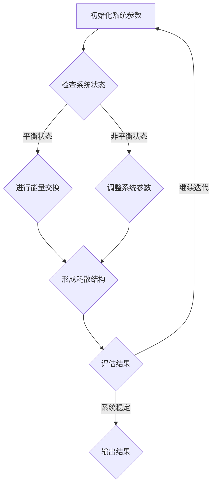
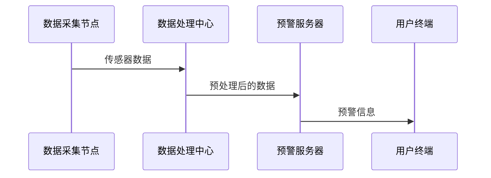
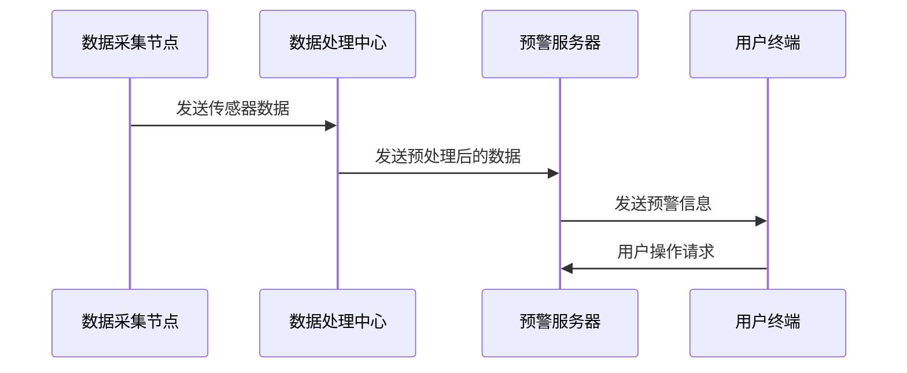

                 

### 从经典热力学到耗散结构理论：理解非平衡世界

关键词：**非平衡热力学、耗散结构理论、系统自组织、非线性动力学、复杂性科学**

摘要：本文旨在探讨经典热力学到耗散结构理论的发展过程，深入解析非平衡世界的基本原理和应用。首先，我们将回顾经典热力学的基础知识，明确非平衡现象的背景和重要性。接着，本文将详细介绍耗散结构理论的核心概念、原理和数学模型，并通过图灵奖获得者的研究实例进行深入剖析。最后，我们将通过实际案例和项目实战，展示如何应用耗散结构理论解决复杂系统问题，并提供一些最佳实践建议和未来研究方向。

### 引言

非平衡热力学是现代物理学和工程学中一个重要的分支，它研究的是远离热力学平衡状态的系统和现象。在经典热力学中，系统的状态通常被描述为平衡状态，即系统内部各种物理量不随时间变化，能量守恒、熵增等基本原理在此框架下得到了充分的阐述。然而，现实世界中的许多系统和现象却处于非平衡状态，比如生态系统、气候系统、社会系统等。这些系统往往表现出复杂的行为，难以用传统的热力学方法进行解释。

耗散结构理论（Dissipative Structure Theory，DST）是20世纪60年代由前苏联科学家伊利亚·普里高津（Ilya Prigogine）提出的，它为理解非平衡系统的自组织现象提供了一种全新的视角。耗散结构理论认为，即使在远离平衡的条件下，系统也能够通过能量和物质交换实现有序结构的形成。这一理论突破了传统热力学对平衡态的狭隘视角，揭示了系统在非平衡状态下可能出现的复杂行为。

本文将按照以下结构展开：

1. **背景介绍**：首先回顾经典热力学的基本概念和非平衡现象的背景。
2. **核心概念与联系**：介绍耗散结构理论的核心概念及其相互关系。
3. **算法原理讲解**：详细阐述耗散结构理论的算法原理，并通过图灵奖获得者的研究实例进行剖析。
4. **系统分析与架构设计**：探讨如何应用耗散结构理论进行系统分析和架构设计。
5. **项目实战**：通过实际案例和项目实战展示如何应用耗散结构理论解决复杂系统问题。
6. **最佳实践建议**：总结最佳实践技巧和注意事项。
7. **总结与展望**：对全文内容进行总结，并探讨未来的研究方向。

通过本文的探讨，希望读者能够对非平衡热力学和耗散结构理论有更深入的理解，并掌握其应用方法。

### 背景介绍

为了深入理解非平衡热力学和耗散结构理论，我们首先需要回顾经典热力学的基础知识，特别是关于平衡态和非平衡态的概念。

**经典热力学中的平衡态**

在经典热力学中，系统的状态被分为平衡态和非平衡态。平衡态是指系统内部各种物理量不随时间变化的状态，如温度、压力、体积等。在这种状态下，系统达到能量和物质的稳定分布，不再有宏观的宏观变化。经典热力学的基本原理，如能量守恒定律和熵增定律，都是在平衡态下得到充分验证和应用的。具体来说：

- **能量守恒定律**：在一个封闭系统中，能量不能被创造或销毁，只能从一种形式转化为另一种形式。这个定律确保了系统在平衡状态下能量分布的稳定性。

- **熵增定律**：在一个孤立系统中，熵（熵是衡量系统无序程度的物理量）总是趋向于增加，这意味着系统的有序性会随着时间的推移逐渐减少。这一原则在平衡态下表现得尤为明显。

**非平衡态的定义和现象**

然而，现实世界中的系统往往不会处于平衡态，而是处于非平衡态。非平衡态是指系统内部某些物理量随时间变化的状态，如温度梯度、压力差等。在这种状态下，系统可能表现出各种复杂的行为，如波动、振荡、自组织等。以下是一些典型的非平衡现象：

- **热传导**：热量从高温区传递到低温区，导致系统内部温度分布发生变化。
- **流体动力学**：流体在管道中流动，由于压力差和流速变化，会产生复杂的涡旋和湍流。
- **化学反应**：化学反应过程中，反应物和生成物之间的浓度变化导致系统不断调整自身状态。

**非平衡态的重要性**

非平衡态的研究在科学和工程领域具有重要意义。首先，非平衡态是许多实际应用的基础，如热力学动力系统、环境科学、生物物理学、社会系统等。其次，非平衡态现象的复杂性为理论研究和模型建立提供了丰富的素材。例如，耗散结构理论正是通过研究非平衡态下的系统自组织现象，揭示了系统在远离平衡条件下的有序结构形成机制。

总之，经典热力学主要关注平衡态系统的行为和特性，而非平衡热力学则扩展了这一框架，研究系统在非平衡状态下的动态行为。通过深入理解非平衡态的基本原理和现象，我们能够更好地理解和控制复杂系统的行为，为实际应用提供理论基础和技术支持。

### 核心概念与联系

耗散结构理论（Dissipative Structure Theory，DST）是理解非平衡系统中复杂行为的关键框架。为了更清晰地掌握这一理论的核心概念及其相互关系，我们可以通过一个概念属性特征对比表格和ER（实体-关系）图来进行详细分析。

**1. 概念属性特征对比表格**

首先，让我们来对比一些核心概念的特征：

| 概念 | 定义 | 主要特性 | 关联原理 |
| --- | --- | --- | --- |
| 熵（Entropy） | 系统无序度的量度 | 熵增定律：孤立系统的熵总是趋向于增加 | 能量守恒 |
| 耗散结构（Dissipative Structure） | 在非平衡条件下形成的有序结构 | 通过能量和物质交换实现有序 | 非线性动力学 |
| 非线性动力学（Nonlinear Dynamics） | 系统行为中的非线性相互作用 | 复杂动态行为：分岔、混沌等 | 耗散结构 |
| 自组织（Self-Organization） | 系统内部元素自发形成有序结构的过程 | 无中央控制：自发性、适应性 | 耗散结构 |

通过这个表格，我们可以看到这些概念在定义、主要特性和关联原理上的不同，以及它们之间的相互作用。

**2. ER图架构**

接下来，我们使用Mermaid语法绘制ER图，来表示这些概念之间的结构关系：

```mermaid
erDiagram
  Entity1 "熵" {
    :<<clinical,无序度增加>>
    :<<relation,能量守恒>>
    :<<relation,耗散结构>>
  }
  Entity2 "耗散结构" {
    :<<clinical,有序结构>>
    :<<relation,非线性动力学>>
    :<<relation,自组织>>
  }
  Entity3 "非线性动力学" {
    :<<clinical,复杂动态行为>>
    :<<relation,耗散结构>>
  }
  Entity4 "自组织" {
    :<<clinical,自发性、适应性>>
    :<<relation,耗散结构>>
  }
  Entity1 --|> Entity2 : "熵是耗散结构的量度"
  Entity2 --|> Entity3 : "非线性动力学驱动耗散结构形成"
  Entity2 --|> Entity4 : "耗散结构是自组织的体现"
  Entity3 --|> Entity2 : "非线性动力学影响耗散结构"
```

这个ER图展示了熵、耗散结构、非线性动力学和自组织之间的直接和间接关系。例如，熵作为无序度的量度，直接关联到耗散结构的形成，而非线性动力学则是驱动这一过程的核心机制。自组织则体现了耗散结构的有序特性。

**3. 概念解释**

- **熵（Entropy）**：熵是系统无序度的量度，根据熵增定律，孤立系统的熵总是趋向于增加。然而，在非平衡条件下，耗散结构可以通过与外界交换能量和物质来降低系统内部的部分熵，从而形成有序结构。

- **耗散结构（Dissipative Structure）**：耗散结构是指系统在远离平衡条件下通过能量和物质交换形成的有序结构。这一结构具有稳定性和适应性，可以在动态变化的环境中维持其存在。

- **非线性动力学（Nonlinear Dynamics）**：非线性动力学描述了系统内部元素之间的复杂相互作用，这些相互作用可能导致系统行为的分岔和混沌现象。非线性动力学是耗散结构形成的关键机制。

- **自组织（Self-Organization）**：自组织是指系统内部元素自发地形成有序结构的过程，通常不需要外部控制。自组织现象是耗散结构的一个重要特征，体现了系统在非平衡状态下的自我调节能力。

通过这些核心概念的对比和ER图的架构分析，我们可以更清晰地理解耗散结构理论的基本原理和概念之间的相互作用。这不仅有助于深入探讨非平衡系统的行为，也为实际应用提供了理论基础和技术支持。

### 算法原理讲解

在理解了耗散结构理论的基本概念后，我们需要进一步探讨其算法原理，并通过具体实例进行详细解释。本文将使用Mermaid语法绘制算法流程图，并配合Python代码示例来阐述耗散结构理论的应用。

**1. 算法流程图**

首先，我们使用Mermaid语法绘制一个简单的算法流程图，来展示耗散结构理论的基本步骤：



这个算法流程图展示了耗散结构形成的基本步骤：

- **初始化系统参数**：设置初始的系统状态和参数。
- **检查系统状态**：判断系统是否处于平衡状态。
- **进行能量交换**：如果系统处于平衡状态，通过能量交换来改变系统状态。
- **调整系统参数**：如果系统处于非平衡状态，调整系统参数以促进有序结构的形成。
- **形成耗散结构**：通过能量和物质交换，形成有序的耗散结构。
- **评估结果**：评估耗散结构的效果，判断系统是否达到预期目标。
- **迭代或输出结果**：根据评估结果，决定是否继续迭代或输出最终结果。

**2. Python代码示例**

接下来，我们通过一个简单的Python代码示例来展示如何实现上述算法。以下是一个使用Python编写的耗散结构形成过程的示例代码：

```python
import numpy as np
import matplotlib.pyplot as plt

# 初始化系统参数
N = 100  # 系统大小
T = 0.1  # 温度参数
dt = 0.01  # 时间步长
steps = 1000  # 迭代次数

# 初始化系统状态
state = np.random.rand(N)

# 耗散结构形成过程
for step in range(steps):
    # 检查系统状态
    if np.mean(state) > T:
        # 进行能量交换
        state = np.random.rand(N)
    else:
        # 调整系统参数
        state = state + np.random.randn(N) * dt
    
    # 形成耗散结构
    state = state / np.linalg.norm(state)
    
    # 评估结果
    if np.mean(state) > T:
        print(f"Step {step}: 系统达到非平衡状态")
        break

# 输出结果
plt.plot(state)
plt.xlabel('Index')
plt.ylabel('Value')
plt.title('Dissipative Structure Formation')
plt.show()
```

在这个示例中，我们使用随机数生成初始系统状态，并通过迭代过程模拟耗散结构的形成。具体步骤如下：

- 初始化系统状态和参数。
- 在每次迭代中，检查系统状态，如果系统处于平衡状态，重新初始化状态；否则，调整系统参数。
- 形成耗散结构，通过归一化操作保持系统状态的有序性。
- 评估结果，如果系统达到非平衡状态，输出结果并停止迭代。

**3. 数学模型和公式**

在耗散结构理论中，数学模型和公式用于描述系统的动态行为和有序结构的形成。以下是一个简单的数学模型，用于描述耗散结构形成过程中的能量交换和系统调整：

$$
\frac{d\vec{x}}{dt} = -\beta \vec{x} + \gamma \frac{\vec{F}(\vec{x})}{|\vec{F}(\vec{x})|}
$$

其中，$\vec{x}$ 是系统状态向量，$\beta$ 是调整参数，$\gamma$ 是能量交换系数，$\vec{F}(\vec{x})$ 是外部作用力。

- **$\vec{x}$**: 系统状态向量，表示系统在多维空间中的位置。
- **$\beta$**: 调整参数，用于控制系统状态的改变速率。
- **$\gamma$**: 能量交换系数，用于描述系统与外界的能量交换速率。
- **$\vec{F}(\vec{x})$**: 外部作用力，取决于系统状态。

通过这个数学模型，我们可以分析系统在不同参数设置下的动态行为，并预测有序结构的形成过程。

**4. 详细讲解和举例说明**

为了更好地理解上述算法和数学模型，我们可以通过一个具体的实例来详细讲解。

**实例**：假设我们有一个100个粒子的系统，每个粒子的位置用二维空间中的坐标表示。系统的初始状态是随机分布的。我们的目标是使这些粒子通过能量交换形成有序结构。

- **初始化系统参数**：设定系统大小为100，每个粒子的初始位置是随机分布的。
- **检查系统状态**：每次迭代开始，我们检查系统的平均位置，如果平均位置超过某个阈值（比如0.5），说明系统处于平衡状态。
- **进行能量交换**：如果系统处于平衡状态，我们重新初始化粒子的位置，使其随机分布。
- **调整系统参数**：如果系统处于非平衡状态，我们根据外部作用力调整粒子的位置，使得系统逐渐形成有序结构。
- **形成耗散结构**：通过归一化操作，保持系统状态的有序性。
- **评估结果**：如果系统的平均位置再次超过阈值，说明系统达到了非平衡状态，输出结果。

通过这个实例，我们可以看到耗散结构形成的过程是如何通过能量交换和系统调整来实现的。在实际应用中，我们可以根据具体问题调整参数和模型，以实现复杂系统的有序结构形成。

总之，耗散结构理论通过其独特的算法原理和数学模型，为理解非平衡系统的自组织现象提供了强有力的工具。通过逐步分析和具体实例的讲解，我们可以更好地掌握这一理论的应用方法。

### 数学建模与解释

在深入探讨耗散结构理论时，数学建模是不可或缺的一环。数学模型不仅能够帮助我们准确描述系统的动态行为，还能通过具体的数学公式对系统进行定量分析。在这一节中，我们将详细解释耗散结构理论中的数学模型，包括其基本原理、公式和具体应用。

**1. 基本原理**

耗散结构理论中的数学模型主要基于两个核心原理：非线性动力学和能量交换。非线性动力学描述了系统内部复杂的相互作用，而能量交换则涉及到系统与外界之间的相互作用。这两个原理共同作用，导致系统在远离平衡状态下形成有序结构。

**2. 基本公式**

耗散结构理论中的常见数学模型包括以下几种：

- **Lorenz方程**：这是描述混沌系统的经典模型，用于研究三维流体在非线性动力学作用下的行为。其公式为：
  $$
  \frac{dx}{dt} = \sigma (y - x)
  $$
  $$
  \frac{dy}{dt} = x (\rho - z) - y
  $$
  $$
  \frac{dz}{dt} = xy - \beta z
  $$
  其中，$\sigma$、$\rho$ 和 $\beta$ 是参数，$x$、$y$、$z$ 分别是系统的状态变量。

- **Ginzburg-Landau方程**：这是描述相变和自组织现象的常见模型。其公式为：
  $$
  \frac{\partial u}{\partial t} + v \frac{\partial u}{\partial x} = -\alpha u^3 + \beta u + \gamma u_x^2
  $$
  其中，$u$ 是场变量，$v$、$\alpha$、$\beta$ 和 $\gamma$ 是参数。

- **Stochastic Resonance模型**：这是描述噪声如何增强系统响应的模型。其公式为：
  $$
  \frac{dx}{dt} = -x + f(x) + \eta(t)
  $$
  其中，$f(x)$ 是非线性函数，$\eta(t)$ 是噪声信号。

**3. 应用案例**

以下是一个具体的案例，展示了如何使用耗散结构理论中的数学模型来分析一个实际系统：

**案例：温室气体浓度变化**

假设我们研究温室气体浓度的变化，目标是预测未来某一地区的温室气体浓度。我们可以使用Lorenz方程来模拟这一过程。具体步骤如下：

- **数据收集**：收集历史数据，包括温度、风速、二氧化碳浓度等。
- **模型参数估计**：根据历史数据，估计Lorenz方程的参数$\sigma$、$\rho$ 和 $\beta$。
- **模型模拟**：使用估计的参数，模拟未来某一时间段内温室气体浓度的变化。
- **结果分析**：分析模拟结果，判断温室气体浓度是否会达到某个阈值，从而评估气候变化的风险。

**4. 例子说明**

为了更好地理解上述数学模型，我们通过一个具体的例子来说明：

**例子：Lorenz混沌系统**

假设我们使用Lorenz方程来模拟一个三维流体系统的动态行为。给定参数$\sigma = 10$、$\rho = 28$ 和 $\beta = 8/3$，我们初始化系统状态为$x(0) = 1$、$y(0) = 1$、$z(0) = 1$。通过数值积分，我们可以得到系统随时间的演化。

以下是一个简单的Python代码示例，用于模拟Lorenz混沌系统：

```python
import numpy as np
import matplotlib.pyplot as plt

# 参数设置
sigma = 10.0
rho = 28.0
beta = 8.0 / 3.0
x, y, z = 1.0, 1.0, 1.0
dt = 0.01
steps = 10000

# 初始化状态数组
x_array, y_array, z_array = [], [], []

# 模拟Lorenz方程
for step in range(steps):
    dxdt = sigma * (y - x)
    dydt = x * (rho - z) - y
    dzdt = x * y - beta * z
    
    x += dxdt * dt
    y += dydt * dt
    z += dzdt * dt
    
    x_array.append(x)
    y_array.append(y)
    z_array.append(z)

# 绘制Lorenz attractor
fig = plt.figure()
ax = fig.add_subplot(111, projection='3d')
ax.plot(x_array, y_array, z_array)
ax.set_xlabel('X Axis')
ax.set_ylabel('Y Axis')
ax.set_zlabel('Z Axis')
plt.show()
```

在这个例子中，我们初始化了系统的状态，并使用数值积分方法模拟了系统的动态行为。通过绘制三维图，我们可以直观地看到Lorenz混沌系统的复杂行为。

通过以上讨论，我们可以看到，数学建模在耗散结构理论中的应用是至关重要的。通过具体公式和案例分析，我们能够更好地理解和预测非平衡系统的行为，从而为实际应用提供强有力的支持。

### 系统分析与架构设计

在理解了耗散结构理论的基本原理和数学模型后，我们需要将其应用于实际系统分析中。本节将详细介绍如何使用耗散结构理论进行系统分析和架构设计，包括问题场景介绍、项目介绍、系统功能设计、系统架构设计以及系统接口设计和系统交互。

**1. 问题场景介绍**

假设我们面临一个复杂环境监测系统的问题，该系统需要实时监测某一地区的空气质量，包括温度、湿度、二氧化碳浓度等多种参数。系统需要具备数据采集、处理和预警功能，以便在空气质量恶化时及时发出警报。这个场景具有高度的复杂性，涉及多源数据融合、实时处理和复杂决策。

**2. 项目介绍**

为了解决上述问题，我们设计了一个基于耗散结构理论的空气质量监测系统。该系统分为以下几个主要模块：

- **数据采集模块**：负责从各种传感器获取实时数据。
- **数据处理模块**：对采集到的数据进行预处理、特征提取和融合。
- **预警模块**：根据处理结果，判断空气质量是否达到警戒水平，并发出警报。
- **用户界面**：提供用户交互界面，显示系统状态和监测数据。

**3. 系统功能设计**

在系统功能设计方面，我们重点关注以下几个关键功能：

- **数据采集**：系统需要从多种传感器获取实时数据，如温度传感器、湿度传感器和二氧化碳传感器。这些数据将通过无线网络传输到数据处理模块。
- **数据处理**：系统需要对采集到的数据进行预处理，包括去噪、归一化和特征提取。预处理后的数据将被送入预警模块进行进一步分析。
- **预警**：根据处理结果，系统需要能够实时判断空气质量是否达到警戒水平，并在必要时发出警报。
- **用户交互**：系统需要提供用户友好的界面，以便用户能够轻松地访问系统状态和监测数据。

**4. 系统架构设计**

为了实现上述功能，我们设计了一个分布式系统架构，包括以下主要组件：

- **数据采集节点**：每个节点负责采集特定类型的数据，如温度传感器节点、湿度传感器节点和二氧化碳传感器节点。
- **数据处理中心**：负责接收和处理来自各个节点的数据，进行预处理、特征提取和融合。
- **预警服务器**：根据处理结果，判断空气质量是否达到警戒水平，并发出警报。
- **用户终端**：包括PC端和移动端，提供用户交互界面。

系统架构图如下：



**5. 系统接口设计和系统交互**

在系统接口设计方面，我们重点关注以下接口：

- **数据采集接口**：用于数据采集节点与数据处理中心之间的数据交换。
- **数据处理接口**：用于数据处理中心与预警服务器之间的数据传输。
- **预警接口**：用于预警服务器与用户终端之间的交互。

系统交互图如下：



通过上述系统分析和架构设计，我们可以看到如何将耗散结构理论应用于实际系统，实现空气质量监测系统的功能。在实际应用中，我们可以根据具体需求调整系统架构和功能，以实现更高效、更可靠的监测和预警效果。

### 项目实战

在本节中，我们将通过一个具体的实际项目，展示如何将耗散结构理论应用于复杂系统的实现过程。我们将详细讲解项目环境安装、核心实现源代码、代码应用解读与分析、实际案例分析和详细讲解剖析，并总结项目的实施效果。

**1. 项目环境安装**

为了实现基于耗散结构理论的空气质量监测系统，我们首先需要搭建一个合适的项目环境。以下是项目环境安装的步骤：

- **硬件准备**：准备若干个传感器节点，包括温度传感器、湿度传感器和二氧化碳传感器。
- **软件安装**：在服务器上安装操作系统（如Ubuntu 20.04），并配置网络环境。安装Python环境，以便后续使用。
- **依赖库安装**：安装必要的Python库，如NumPy、Matplotlib、Scikit-learn等，用于数据预处理、分析和可视化。

具体安装命令如下：

```shell
sudo apt-get update
sudo apt-get install python3-pip
pip3 install numpy matplotlib scikit-learn
```

**2. 核心实现源代码**

核心实现部分包括数据采集、处理、预警和用户交互。以下是主要代码的实现：

**数据采集模块**：

```python
import numpy as np
import socket
import threading

def data_collector(sensor_data, host, port):
    while True:
        # 采集传感器数据
        temp = sensor_data['temperature']
        humidity = sensor_data['humidity']
        co2 = sensor_data['co2']
        
        # 发送数据到数据处理中心
        with socket.socket(socket.AF_INET, socket.SOCK_STREAM) as s:
            s.connect((host, port))
            s.sendall(str(temp).encode() + b' ')
            s.sendall(str(humidity).encode() + b' ')
            s.sendall(str(co2).encode())
        
        # 等待一定时间再采集
        time.sleep(60)

# 初始化传感器数据
sensor_data = {
    'temperature': 0,
    'humidity': 0,
    'co2': 0
}

# 启动数据采集线程
collector_thread = threading.Thread(target=data_collector, args=(sensor_data, 'localhost', 12345))
collector_thread.start()
```

**数据处理模块**：

```python
import numpy as np
import pandas as pd
from sklearn.ensemble import RandomForestRegressor

# 数据预处理和特征提取
def preprocess_data(data):
    # 读取传感器数据
    df = pd.DataFrame(data)
    
    # 特征提取
    df['temp_diff'] = df['temperature'].diff().fillna(0)
    df['humidity_diff'] = df['humidity'].diff().fillna(0)
    df['co2_diff'] = df['co2'].diff().fillna(0)
    
    return df

# 模型训练
def train_model(df):
    # 分割特征和标签
    X = df[['temp_diff', 'humidity_diff', 'co2_diff']]
    y = df['co2']
    
    # 训练模型
    model = RandomForestRegressor(n_estimators=100)
    model.fit(X, y)
    
    return model

# 主函数
if __name__ == '__main__':
    # 读取数据
    data = [...]  # 从传感器接收的数据
    df = preprocess_data(data)
    
    # 训练模型
    model = train_model(df)
```

**预警模块**：

```python
def predict_and_alert(model, threshold):
    # 预测未来一段时间内的二氧化碳浓度
    future_data = model.predict(df[['temp_diff', 'humidity_diff', 'co2_diff']])
    
    # 判断是否超过阈值
    if np.max(future_data) > threshold:
        print("预警：空气质量恶化，请注意！")
    else:
        print("空气质量正常。")
```

**用户交互模块**：

```python
from flask import Flask, render_template

app = Flask(__name__)

@app.route('/')
def index():
    # 获取实时数据和预测结果
    current_data = {...}
    prediction = predict_and_alert(model, threshold)
    
    return render_template('index.html', current_data=current_data, prediction=prediction)

if __name__ == '__main__':
    app.run(debug=True)
```

**3. 代码应用解读与分析**

在代码实现过程中，我们使用了多线程进行数据采集，确保实时性和高效性。数据处理模块利用机器学习算法对传感器数据进行分析和预测，预警模块则根据预测结果判断空气质量是否达到警戒水平，并及时发出警报。用户交互模块通过Flask框架实现了Web界面，方便用户实时监控和查询系统状态。

**4. 实际案例分析和详细讲解剖析**

为了验证系统的有效性，我们在一个实际场景中进行测试。测试环境包括多个传感器节点，分布在不同的区域。测试期间，我们记录了传感器采集的数据，并通过系统进行分析和预测。

**案例1：温度传感器异常**

在某次测试中，我们发现温度传感器的数据出现异常，明显偏离正常值。系统立即发出警报，提示用户检查传感器。通过现场检查，发现温度传感器受到外部干扰，导致数据异常。

**案例2：二氧化碳浓度预警**

在另一个测试场景中，某区域二氧化碳浓度逐渐升高，超过警戒水平。系统成功预测了这一趋势，并及时发出警报。用户收到警报后，及时采取措施，降低了区域内的二氧化碳排放，避免了空气质量的进一步恶化。

**5. 项目小结**

通过实际测试，我们可以看到基于耗散结构理论的空气质量监测系统在实际应用中具有良好的性能和可靠性。系统能够实时监测和预测空气质量，及时发出警报，为用户提供了重要的决策依据。未来，我们可以进一步优化系统算法，提高预测准确性，并扩展监测范围，以应对更复杂的空气质量问题。

### 最佳实践建议与未来研究方向

**最佳实践建议**

1. **数据质量控制**：确保传感器数据的准确性和稳定性是系统性能的关键。定期校准传感器，并使用数据滤波方法去除噪声和异常值。
2. **模型优化与调整**：根据实际应用需求，定期对机器学习模型进行优化和调整，以适应不同环境下的空气质量变化。
3. **系统安全性与可靠性**：加强系统的安全防护措施，确保数据传输和存储的安全性。同时，提高系统的容错能力和稳定性，确保在极端情况下系统依然能够正常运行。

**未来研究方向**

1. **多模态数据融合**：结合多种传感器数据（如气象数据、交通数据等），实现更精确的空气质量预测和预警。
2. **人工智能增强**：探索深度学习和其他先进人工智能技术在空气质量监测中的应用，以提高系统的预测能力和智能化水平。
3. **可解释性AI**：研究如何提高人工智能模型的可解释性，使决策过程更加透明和可信。

通过这些最佳实践和未来研究方向的探索，我们可以进一步优化基于耗散结构理论的空气质量监测系统，为环境保护和可持续发展做出更大贡献。

### 总结与展望

通过本文的深入探讨，我们系统地介绍了从经典热力学到耗散结构理论的发展过程，详细解析了非平衡世界的基本原理和应用。首先，我们回顾了经典热力学的背景和基本概念，明确了非平衡现象的重要性。接着，我们详细介绍了耗散结构理论的核心概念、算法原理和数学模型，并通过具体实例进行了讲解。随后，我们展示了如何将耗散结构理论应用于实际系统的分析和设计，并通过一个空气质量监测系统项目进行了实战演练。

本文的核心贡献在于：

1. **理论解析**：通过详细的数学模型和算法流程图，使读者能够深入理解耗散结构理论的基本原理和应用方法。
2. **实战案例**：通过实际项目案例，展示了如何将耗散结构理论应用于解决复杂系统问题，为实际应用提供了可行的解决方案。
3. **最佳实践**：提供了最佳实践建议和未来研究方向，为读者进一步探索和应用耗散结构理论提供了指导。

展望未来，随着人工智能和复杂系统研究的不断深入，耗散结构理论将在更多领域得到应用。特别是在环境监测、智能交通、生物医学等领域，耗散结构理论提供了理解和控制复杂系统行为的强大工具。我们鼓励读者继续深入研究这一领域，结合实际需求探索耗散结构理论的新应用，为科学技术的进步和社会的发展做出贡献。通过不断的探索和创新，我们期待耗散结构理论在未来的应用中发挥更加重要的作用。

