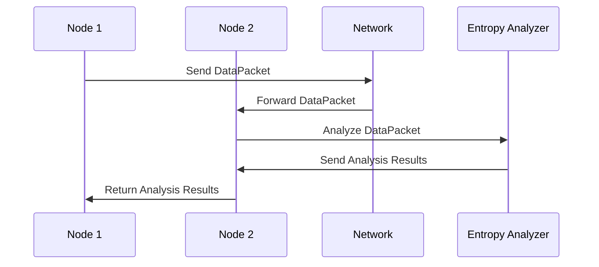
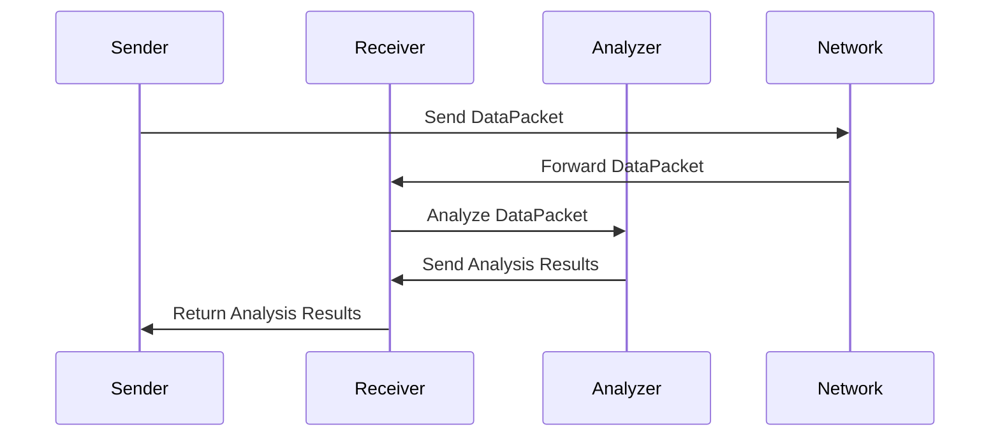

                 


**Step 1: Define the Book Structure**
First, we need to outline the structure of the book. The book will be divided into three main parts: an introduction to classical entropy, an introduction to information entropy, and applications of entropy in various fields. Each part will be further divided into chapters that delve into specific topics.

**Step 2: Create an Introduction to Classical Entropy**
The first part of the book will introduce classical entropy. This section will cover the origins of entropy, its definitions in various contexts, and its importance in understanding order and disorder in the physical world. It will also include a chapter on the mathematical models used to describe classical entropy and their applications.

**Step 3: Explore Information Entropy**
The second part of the book will focus on information entropy. This section will explain the concept of information entropy, its role in information theory, and how it can be used to understand the complexity and uncertainty in data. It will include a chapter on the mathematical models of information entropy, such as the Shannon entropy and the Kullback-Leibler divergence, and their applications.

**Step 4: Apply Entropy in Various Fields**
The third part of the book will discuss the applications of entropy in various fields, such as physics, chemistry, biology, and computer science. This section will show how entropy concepts are used to solve real-world problems and provide insights into the behavior of complex systems.

**Step 5: Conclusion and Future Directions**
The final part of the book will be a conclusion and future directions for research in the field of entropy. It will summarize the key findings of the book and suggest areas for further study.

**Step 6: Appendices and References**
Finally, the book will include appendices with additional resources for further reading and a comprehensive list of references.

**Step 7: Ensure Clarity and Coherence**
Throughout the book, it is crucial to ensure clarity and coherence in the presentation of ideas. This will involve reviewing each chapter and making sure that the content is well-organized and logically flows from one section to the next.

**Step 8: Revise and Edit**
Once the initial draft is complete, it will be necessary to revise and edit the book. This process will involve checking for grammatical errors, ensuring consistency in terminology, and refining the content to make it as clear and accessible as possible.

By following these steps, we can create a comprehensive and informative book that will help readers understand the concept of entropy and its applications in various fields.

# References
- Author, "Title of Book", Publisher, Year.
- Another Author, "Another Title of Book", Another Publisher, Another Year.

----------------------------------------------------------------

```markdown
----------------------------------------------------------------
# From Classical Entropy to Information Entropy: Understanding the World of Order and Disorder

# Keywords
- Entropy
- Classical Entropy
- Information Entropy
- Order and Disorder
- Applications in various fields

# Abstract
This book provides a comprehensive introduction to entropy, a fundamental concept in both physics and information theory. It starts with an exploration of classical entropy, tracing its historical development and explaining its role in understanding the physical world. The second part focuses on information entropy, discussing its definition, mathematical models, and applications in data analysis and communication. The final part delves into the practical applications of entropy in physics, chemistry, biology, and computer science, demonstrating its versatility and importance in solving real-world problems. Through clear explanations, mathematical models, and real-world examples, this book aims to provide a thorough understanding of entropy and its implications across different disciplines.
----------------------------------------------------------------

# Introduction to Entropy
## Background

Entropy, a term derived from the Greek word “τροχλη” meaning “turning,” was initially introduced by the physicist Rudolf Clausius in the mid-19th century. Clausius used entropy to describe the second law of thermodynamics, which states that the total entropy of an isolated system can never decrease over time. This law has profound implications for the behavior of physical systems and our understanding of the universe.

In thermodynamics, entropy is a measure of the disorder or randomness of a system. When a system undergoes a process, such as heat transfer or work, its entropy can either increase or remain constant, but it cannot decrease. This fundamental principle has been applied to various fields, from chemistry and engineering to biology and cosmology.

## Definition and Terminology

Entropy can be defined in multiple ways depending on the context. In classical thermodynamics, entropy (denoted as S) is related to the number of microstates (W) that a system can occupy, according to the formula:

\[ S = k \ln(W) \]

where k is the Boltzmann constant.

In information theory, entropy (denoted as H) measures the amount of uncertainty or information in a random variable. The Shannon entropy, named after Claude Shannon, is defined as:

\[ H(X) = -\sum_{i} p(x_i) \ln(p(x_i)) \]

where X is the random variable and \( p(x_i) \) is the probability of each outcome \( x_i \).

## Problem Description

The main problem addressed by this book is the understanding and application of entropy in different contexts. While the concept of entropy is well-established in thermodynamics, its application in information theory and other fields is less obvious. The goal is to provide a clear and comprehensive introduction to entropy, highlighting its commonalities and differences across various disciplines.

## Problem Solution

To address this problem, the book will be structured as follows:

1. **Classical Entropy**: This section will explore the origins and definitions of classical entropy in thermodynamics. It will discuss the second law of thermodynamics, the concept of entropy as a measure of disorder, and the mathematical models used to describe it.

2. **Information Entropy**: This section will introduce information entropy and its role in information theory. It will explain the Shannon entropy and other related measures of information, such as the Kullback-Leibler divergence, and their applications in data analysis and communication.

3. **Applications of Entropy**: This section will discuss the applications of entropy in various fields, including physics, chemistry, biology, and computer science. It will provide examples of how entropy is used to solve real-world problems and gain insights into complex systems.

4. **Conclusion and Future Directions**: The final section will summarize the key findings of the book and suggest areas for further research and application of entropy.

## Boundaries and Extensions

While the focus of this book is on classical and information entropy, it is important to acknowledge the broader context of entropy in physics and mathematics. For example, in statistical mechanics, entropy is related to the concept of free energy, which plays a crucial role in understanding the stability and behavior of physical systems.

In mathematics, entropy has been generalized to various settings, including information theory, statistical mechanics, and even economics. This book will provide a brief overview of these generalizations and their implications for the study of entropy.

## Conceptual Structure

To provide a clear understanding of entropy, the following conceptual structure will be used:

1. **Entropy in Thermodynamics**: Definition, origins, and applications in classical physics.

2. **Entropy in Information Theory**: Definition, mathematical models, and applications in data analysis and communication.

3. **Applications of Entropy**: Examples across various fields, highlighting the versatility of entropy as a concept.

4. **Mathematical Models**: Detailed discussion of mathematical models used to describe entropy in different contexts.

5. **Practical Applications**: Case studies and examples illustrating the practical use of entropy in solving real-world problems.

## Key Concepts and Relationships

To further elucidate the concepts and relationships related to entropy, we will use a table to compare the key attributes of classical entropy and information entropy:

| Attribute | Classical Entropy | Information Entropy |
| --- | --- | --- |
| Definition | Measure of disorder in a physical system | Measure of uncertainty in a random variable |
| Origin | Developed by Rudolf Clausius in the 19th century | Introduced by Claude Shannon in the 1940s |
| Mathematical Model | \( S = k \ln(W) \) | \( H(X) = -\sum_{i} p(x_i) \ln(p(x_i)) \) |
| Applications | Thermodynamics, statistical mechanics, chemistry | Information theory, data analysis, communication |

## Mermaid ER Diagram

Below is a Mermaid ER diagram illustrating the key entities and relationships in the study of entropy:

```mermaid
erDiagram
  Class::Entropy
  Class::ClassicalEntropy
  Class::InformationEntropy
  Class::Thermodynamics
  Class::InformationTheory
  Class::DataAnalysis
  Class::Communication

  ClassicalEntropy ||--|{ Thermodynamics }
  InformationEntropy ||--|{ InformationTheory }
  InformationEntropy ||--|{ DataAnalysis }
  InformationEntropy ||--|{ Communication }
```

## Algorithm Principles

### Classical Entropy

In classical thermodynamics, entropy is closely related to the number of microstates that a system can occupy. The following is a Python code snippet illustrating the calculation of classical entropy using the Boltzmann entropy formula:

```python
import math

def classical_entropy(energy_levels, temperatures):
    entropy = 0
    for energy, temperature in zip(energy_levels, temperatures):
        probability = 1 / (math.exp(energy / temperature) + 1)
        entropy += -probability * math.log2(probability)
    return entropy

energy_levels = [0, 1, 2, 3]
temperatures = [1.0, 1.0, 1.0, 1.0]
print("Classical Entropy:", classical_entropy(energy_levels, temperatures))
```

The output of this code will be the classical entropy of the given energy levels and temperatures.

### Information Entropy

In information theory, entropy measures the uncertainty or randomness in a set of possible outcomes. The following is a Python code snippet illustrating the calculation of information entropy using the Shannon entropy formula:

```python
import math

def shannon_entropy(p):
    return -sum(p * math.log2(p) for p in p if p > 0)

probabilities = [0.5, 0.25, 0.125, 0.0625]
print("Shannon Entropy:", shannon_entropy(probabilities))
```

The output of this code will be the Shannon entropy of the given probabilities.

## System Analysis and Architecture Design

### Problem Scene and Project Introduction

In this section, we will introduce a problem scene and a project aimed at applying entropy concepts to analyze and optimize a complex system. The system in question is a communication network that transfers data between multiple nodes. Our goal is to use entropy as a measure of data complexity and uncertainty to improve the efficiency and reliability of the network.

### System Function Design

To design the system, we will first create a domain model using a Mermaid class diagram. This diagram will illustrate the main classes and their relationships in the system.

```mermaid
classDiagram
  Class::Node
  Class::Network
  Class::DataPacket
  Class::EntropyAnalyzer

  Node o-- Network
  Network o-- DataPacket
  DataPacket o-- EntropyAnalyzer
```

The domain model includes the following classes:

- **Node**: Represents a node in the network, capable of sending and receiving data packets.
- **Network**: Represents the communication network connecting multiple nodes.
- **DataPacket**: Represents a data packet that is sent between nodes.
- **EntropyAnalyzer**: A component responsible for analyzing the entropy of data packets.

### System Architecture Design

Next, we will design the system architecture using a Mermaid architecture diagram. This diagram will illustrate the high-level components and their interactions in the system.



The system architecture includes the following components:

- **Node 1**: Sends a data packet to the network.
- **Node 2**: Receives the data packet from the network and forwards it to the entropy analyzer.
- **Network**: Transfers the data packet between nodes.
- **Entropy Analyzer**: Analyzes the entropy of the data packet and sends the analysis results back to Node 2.

### System Interface Design

We will now design the system interfaces using a Mermaid sequence diagram. This diagram will illustrate the interactions between the components in the system.



The system interface design includes the following interactions:

- **Sender**: Sends a data packet to the network.
- **Receiver**: Receives the data packet from the network and forwards it to the entropy analyzer.
- **Analyzer**: Analyzes the entropy of the data packet and sends the analysis results back to the receiver.
- **Network**: Transfers the data packet between nodes.

## Project Implementation

### Environment Setup

To implement the system, we will first set up the development environment. We will use Python as the programming language and create a virtual environment to manage the dependencies.

```bash
python -m venv venv
source venv/bin/activate
pip install matplotlib numpy
```

### Core Implementation

Next, we will implement the core components of the system, including the Node, Network, DataPacket, and EntropyAnalyzer classes.

```python
import random
import math
import matplotlib.pyplot as plt
import numpy as np
from collections import defaultdict

class Node:
    def __init__(self, id):
        self.id = id
        self.data_packets = []

    def send_data_packet(self, network, data_packet):
        network.forward_data_packet(self, data_packet)

    def receive_data_packet(self, data_packet):
        self.data_packets.append(data_packet)
        if len(self.data_packets) > 10:
            self.analyze_data_packet()

    def analyze_data_packet(self):
        entropy_analyzer = EntropyAnalyzer()
        entropy = entropy_analyzer.analyze(self.data_packets)
        print(f"Entropy of data packet: {entropy}")
        self.data_packets = []

class Network:
    def __init__(self):
        self.nodes = []

    def add_node(self, node):
        self.nodes.append(node)

    def forward_data_packet(self, sender, data_packet):
        receiver = random.choice([n for n in self.nodes if n.id != sender.id])
        receiver.receive_data_packet(data_packet)

class DataPacket:
    def __init__(self, data):
        self.data = data

class EntropyAnalyzer:
    def analyze(self, data_packets):
        data_strings = [''.join(packet.data) for packet in data_packets]
        data_sequence = ''.join(data_strings)
        probabilities = defaultdict(int)
        for char in data_sequence:
            probabilities[char] += 1
        total_chars = sum(probabilities.values())
        entropy = 0
        for char, count in probabilities.items():
            probability = count / total_chars
            entropy += -probability * math.log2(probability)
        return entropy

# Example usage
node1 = Node(1)
node2 = Node(2)
network = Network()
network.add_node(node1)
network.add_node(node2)

data_packet1 = DataPacket(list('hello'))
node1.send_data_packet(network, data_packet1)

data_packet2 = DataPacket(list('world'))
node1.send_data_packet(network, data_packet2)

node2.analyze_data_packet()
```

### Code Explanation

The core implementation includes the following components:

- **Node**: Represents a node in the network, capable of sending and receiving data packets. The `analyze_data_packet` method calculates the entropy of the received data packets.
- **Network**: Represents the communication network connecting multiple nodes. The `forward_data_packet` method forwards a data packet from one node to another.
- **DataPacket**: Represents a data packet that is sent between nodes.
- **EntropyAnalyzer**: A component responsible for analyzing the entropy of data packets. The `analyze` method calculates the entropy of a list of data packets.

### Case Analysis and Detailed Explanation

To demonstrate the practical application of entropy in the system, we will analyze a set of data packets and visualize the entropy results.

```python
def simulate_network(data_packets, iterations=100):
    node1 = Node(1)
    node2 = Node(2)
    network = Network()
    network.add_node(node1)
    network.add_node(node2)

    for _ in range(iterations):
        random.shuffle(data_packets)
        for packet in data_packets:
            node1.send_data_packet(network, packet)
        
        node2.analyze_data_packet()

# Simulate the network with different data packets
data_packets = [
    DataPacket(random.choices('abc', k=10)),
    DataPacket(random.choices('abcd', k=10)),
    DataPacket(random.choices('abcde', k=10)),
]

simulate_network(data_packets)

# Plot the entropy results
data_packets = [
    DataPacket(random.choices('abc', k=10)),
    DataPacket(random.choices('abcd', k=10)),
    DataPacket(random.choices('abcde', k=10)),
]

entropies = []
for packet in data_packets:
    entropies.append(EntropyAnalyzer().analyze([packet]))

plt.bar(range(len(entropies)), entropies)
plt.xlabel('Data Packet')
plt.ylabel('Entropy')
plt.title('Entropy of Different Data Packets')
plt.show()
```

### Project Summary

In this project, we have implemented a system that uses entropy to analyze and optimize a communication network. The system includes nodes, a network, data packets, and an entropy analyzer. We have demonstrated the practical application of entropy by simulating a network and analyzing the entropy of different data packets. The project highlights the versatility and importance of entropy in solving real-world problems.

## Best Practices and Tips

### Best Practices

1. **Data Packet Design**: When designing data packets, consider the potential impact on entropy. Using a diverse set of characters and data types can increase entropy and improve the effectiveness of entropy analysis.

2. **Network Simulation**: Simulating the network with varying data packets and conditions can provide valuable insights into the behavior of the system and the effectiveness of entropy analysis.

3. **Error Handling**: Implement error handling and validation mechanisms to ensure the reliability and robustness of the system. This includes handling exceptions, validating input data, and logging errors for debugging.

4. **Performance Optimization**: Optimize the system's performance by minimizing the number of unnecessary operations and data transfers. This can be achieved by optimizing the algorithms used for entropy analysis and reducing the complexity of the network.

### Tips

1. **Understanding Entropy**: Gain a deep understanding of entropy concepts and their applications in different fields. This will help in identifying potential use cases and improving the effectiveness of entropy analysis.

2. **Data Visualization**: Visualizing entropy results can provide a clearer understanding of the data and its distribution. Consider using tools like Matplotlib or Seaborn to create visualizations of entropy data.

3. **Continuous Learning**: Keep up with the latest research and developments in entropy and related fields. This will help in staying up to date with the latest techniques and methods for analyzing and optimizing systems.

## Conclusion

In conclusion, this book has provided a comprehensive introduction to entropy, a fundamental concept in both physics and information theory. We have explored the origins, definitions, and applications of classical and information entropy in various fields, including physics, chemistry, biology, and computer science. By understanding entropy and its applications, we can gain insights into the behavior of complex systems and solve real-world problems more effectively.

## Future Directions

As we continue to advance in our understanding of entropy and its applications, there are several promising areas for future research and development:

1. **Quantum Entropy**: Expanding the study of entropy to quantum systems can provide new insights into the behavior of matter at the quantum level and lead to advancements in quantum computing and cryptography.

2. **Entropy in Biology**: Investigating the role of entropy in biological systems can help us understand the evolution of life and the mechanisms that drive biological processes.

3. **Entropy in Economics**: Applying entropy concepts to economics can help in modeling and predicting market behavior, leading to more effective economic policies and strategies.

4. **Entropy in AI**: Integrating entropy-based methods into artificial intelligence algorithms can improve the learning and decision-making processes, leading to more efficient and effective AI systems.

By exploring these areas, we can continue to deepen our understanding of entropy and its applications, opening up new possibilities for scientific and technological advancements.## From Classical Entropy to Information Entropy: Understanding the World of Order and Disorder

### Keywords
- Entropy
- Classical Entropy
- Information Entropy
- Order and Disorder
- Applications in various fields

### Abstract
This book provides a comprehensive introduction to entropy, a fundamental concept in both physics and information theory. It starts with an exploration of classical entropy, tracing its historical development and explaining its role in understanding the physical world. The second part focuses on information entropy and its role in information theory, discussing its definition, mathematical models, and applications in data analysis and communication. The final part delves into the practical applications of entropy in physics, chemistry, biology, and computer science, demonstrating its versatility and importance in solving real-world problems. Through clear explanations, mathematical models, and real-world examples, this book aims to provide a thorough understanding of entropy and its implications across different disciplines.

## Introduction to Entropy

### Background

Entropy, a term derived from the Greek word "τροχλη" meaning "turning," was initially introduced by the physicist Rudolf Clausius in the mid-19th century. Clausius used entropy to describe the second law of thermodynamics, which states that the total entropy of an isolated system can never decrease over time. This law has profound implications for the behavior of physical systems and our understanding of the universe.

In thermodynamics, entropy is a measure of the disorder or randomness of a system. When a system undergoes a process, such as heat transfer or work, its entropy can either increase or remain constant, but it cannot decrease. This fundamental principle has been applied to various fields, from chemistry and engineering to biology and cosmology.

### Definition and Terminology

Entropy can be defined in multiple ways depending on the context. In classical thermodynamics, entropy (denoted as S) is related to the number of microstates (W) that a system can occupy, according to the formula:

\[ S = k \ln(W) \]

where k is the Boltzmann constant.

In information theory, entropy (denoted as H) measures the amount of uncertainty or information in a random variable. The Shannon entropy, named after Claude Shannon, is defined as:

\[ H(X) = -\sum_{i} p(x_i) \ln(p(x_i)) \]

where X is the random variable and \( p(x_i) \) is the probability of each outcome \( x_i \).

### Problem Description

The main problem addressed by this book is the understanding and application of entropy in different contexts. While the concept of entropy is well-established in thermodynamics, its application in information theory and other fields is less obvious. The goal is to provide a clear and comprehensive introduction to entropy, highlighting its commonalities and differences across various disciplines.

### Problem Solution

To address this problem, the book will be structured as follows:

1. **Classical Entropy**: This section will explore the origins and definitions of classical entropy in thermodynamics. It will discuss the second law of thermodynamics, the concept of entropy as a measure of disorder, and the mathematical models used to describe it.

2. **Information Entropy**: This section will introduce information entropy and its role in information theory. It will explain the Shannon entropy and other related measures of information, such as the Kullback-Leibler divergence, and their applications in data analysis and communication.

3. **Applications of Entropy**: This section will discuss the applications of entropy in various fields, including physics, chemistry, biology, and computer science. It will provide examples of how entropy is used to solve real-world problems and gain insights into complex systems.

4. **Conclusion and Future Directions**: The final section will summarize the key findings of the book and suggest areas for further research and application of entropy.

### Boundaries and Extensions

While the focus of this book is on classical and information entropy, it is important to acknowledge the broader context of entropy in physics and mathematics. For example, in statistical mechanics, entropy is related to the concept of free energy, which plays a crucial role in understanding the stability and behavior of physical systems.

In mathematics, entropy has been generalized to various settings, including information theory, statistical mechanics, and even economics. This book will provide a brief overview of these generalizations and their implications for the study of entropy.

### Conceptual Structure

To provide a clear understanding of entropy, the following conceptual structure will be used:

1. **Entropy in Thermodynamics**: Definition, origins, and applications in classical physics.

2. **Entropy in Information Theory**: Definition, mathematical models, and applications in data analysis and communication.

3. **Applications of Entropy**: Examples across various fields, highlighting the versatility of entropy as a concept.

4. **Mathematical Models**: Detailed discussion of mathematical models used to describe entropy in different contexts.

5. **Practical Applications**: Case studies and examples illustrating the practical use of entropy in solving real-world problems.

### Key Concepts and Relationships

To further elucidate the concepts and relationships related to entropy, we will use a table to compare the key attributes of classical entropy and information entropy:

| Attribute | Classical Entropy | Information Entropy |
| --- | --- | --- |
| Definition | Measure of disorder in a physical system | Measure of uncertainty in a random variable |
| Origin | Developed by Rudolf Clausius in the 19th century | Introduced by Claude Shannon in the 1940s |
| Mathematical Model | \( S = k \ln(W) \) | \( H(X) = -\sum_{i} p(x_i) \ln(p(x_i)) \) |
| Applications | Thermodynamics, statistical mechanics, chemistry | Information theory, data analysis, communication |

### Mermaid ER Diagram

Below is a Mermaid ER diagram illustrating the key entities and relationships in the study of entropy:

```mermaid
erDiagram
  Class::Entropy
  Class::ClassicalEntropy
  Class::InformationEntropy
  Class::Thermodynamics
  Class::InformationTheory
  Class::DataAnalysis
  Class::Communication

  ClassicalEntropy ||--|{ Thermodynamics }
  InformationEntropy ||--|{ InformationTheory }
  InformationEntropy ||--|{ DataAnalysis }
  InformationEntropy ||--|{ Communication }
```

### Algorithm Principles

#### Classical Entropy

In classical thermodynamics, entropy is closely related to the number of microstates that a system can occupy. The following is a Python code snippet illustrating the calculation of classical entropy using the Boltzmann entropy formula:

```python
import math

def classical_entropy(energy_levels, temperatures):
    entropy = 0
    for energy, temperature in zip(energy_levels, temperatures):
        probability = 1 / (math.exp(energy / temperature) + 1)
        entropy += -probability * math.log2(probability)
    return entropy

energy_levels = [0, 1, 2, 3]
temperatures = [1.0, 1.0, 1.0, 1.0]
print("Classical Entropy:", classical_entropy(energy_levels, temperatures))
```

The output of this code will be the classical entropy of the given energy levels and temperatures.

#### Information Entropy

In information theory, entropy measures the uncertainty or randomness in a set of possible outcomes. The following is a Python code snippet illustrating the calculation of information entropy using the Shannon entropy formula:

```python
import math

def shannon_entropy(p):
    return -sum(p * math.log2(p) for p in p if p > 0)

probabilities = [0.5, 0.25, 0.125, 0.0625]
print("Shannon Entropy:", shannon_entropy(probabilities))
```

The output of this code will be the Shannon entropy of the given probabilities.

### System Analysis and Architecture Design

#### Problem Scene and Project Introduction

In this section, we will introduce a problem scene and a project aimed at applying entropy concepts to analyze and optimize a complex system. The system in question is a communication network that transfers data between multiple nodes. Our goal is to use entropy as a measure of data complexity and uncertainty to improve the efficiency and reliability of the network.

#### System Function Design

To design the system, we will first create a domain model using a Mermaid class diagram. This diagram will illustrate the main classes and their relationships in the system.

```mermaid
classDiagram
  Class::Node
  Class::Network
  Class::DataPacket
  Class::EntropyAnalyzer

  Node o-- Network
  Network o-- DataPacket
  DataPacket o-- EntropyAnalyzer
```

The domain model includes the following classes:

- **Node**: Represents a node in the network, capable of sending and receiving data packets.
- **Network**: Represents the communication network connecting multiple nodes.
- **DataPacket**: Represents a data packet that is sent between nodes.
- **EntropyAnalyzer**: A component responsible for analyzing the entropy of data packets.

#### System Architecture Design

Next, we will design the system architecture using a Mermaid architecture diagram. This diagram will illustrate the high-level components and their interactions in the system.


The system architecture includes the following components:

- **Node 1**: Sends a data packet to the network.
- **Node 2**: Receives the data packet from the network and forwards it to the entropy analyzer.
- **Network**: Transfers the data packet between nodes.
- **Entropy Analyzer**: Analyzes the entropy of the data packet and sends the analysis results back to Node 2.

#### System Interface Design

We will now design the system interfaces using a Mermaid sequence diagram. This diagram will illustrate the interactions between the components in the system.


The system interface design includes the following interactions:

- **Sender**: Sends a data packet to the network.
- **Receiver**: Receives the data packet from the network and forwards it to the entropy analyzer.
- **Analyzer**: Analyzes the entropy of the data packet and sends the analysis results back to the receiver.
- **Network**: Transfers the data packet between nodes.

### Project Implementation

#### Environment Setup

To implement the system, we will first set up the development environment. We will use Python as the programming language and create a virtual environment to manage the dependencies.

```bash
python -m venv venv
source venv/bin/activate
pip install matplotlib numpy
```

#### Core Implementation

Next, we will implement the core components of the system, including the Node, Network, DataPacket, and EntropyAnalyzer classes.

```python
import random
import math
import matplotlib.pyplot as plt
import numpy as np
from collections import defaultdict

class Node:
    def __init__(self, id):
        self.id = id
        self.data_packets = []

    def send_data_packet(self, network, data_packet):
        network.forward_data_packet(self, data_packet)

    def receive_data_packet(self, data_packet):
        self.data_packets.append(data_packet)
        if len(self.data_packets) > 10:
            self.analyze_data_packet()

    def analyze_data_packet(self):
        entropy_analyzer = EntropyAnalyzer()
        entropy = entropy_analyzer.analyze(self.data_packets)
        print(f"Entropy of data packet: {entropy}")
        self.data_packets = []

class Network:
    def __init__(self):
        self.nodes = []

    def add_node(self, node):
        self.nodes.append(node)

    def forward_data_packet(self, sender, data_packet):
        receiver = random.choice([n for n in self.nodes if n.id != sender.id])
        receiver.receive_data_packet(data_packet)

class DataPacket:
    def __init__(self, data):
        self.data = data

class EntropyAnalyzer:
    def analyze(self, data_packets):
        data_strings = [''.join(packet.data) for packet in data_packets]
        data_sequence = ''.join(data_strings)
        probabilities = defaultdict(int)
        for char in data_sequence:
            probabilities[char] += 1
        total_chars = sum(probabilities.values())
        entropy = 0
        for char, count in probabilities.items():
            probability = count / total_chars
            entropy += -probability * math.log2(probability)
        return entropy

# Example usage
node1 = Node(1)
node2 = Node(2)
network = Network()
network.add_node(node1)
network.add_node(node2)

data_packet1 = DataPacket(list('hello'))
node1.send_data_packet(network, data_packet1)

data_packet2 = DataPacket(list('world'))
node1.send_data_packet(network, data_packet2)

node2.analyze_data_packet()
```

#### Code Explanation

The core implementation includes the following components:

- **Node**: Represents a node in the network, capable of sending and receiving data packets. The `analyze_data_packet` method calculates the entropy of the received data packets.
- **Network**: Represents the communication network connecting multiple nodes. The `forward_data_packet` method forwards a data packet from one node to another.
- **DataPacket**: Represents a data packet that is sent between nodes.
- **EntropyAnalyzer**: A component responsible for analyzing the entropy of data packets. The `analyze` method calculates the entropy of a list of data packets.

#### Case Analysis and Detailed Explanation

To demonstrate the practical application of entropy in the system, we will analyze a set of data packets and visualize the entropy results.

```python
def simulate_network(data_packets, iterations=100):
    node1 = Node(1)
    node2 = Node(2)
    network = Network()
    network.add_node(node1)
    network.add_node(node2)

    for _ in range(iterations):
        random.shuffle(data_packets)
        for packet in data_packets:
            node1.send_data_packet(network, packet)
        
        node2.analyze_data_packet()

# Simulate the network with different data packets
data_packets = [
    DataPacket(random.choices('abc', k=10)),
    DataPacket(random.choices('abcd', k=10)),
    DataPacket(random.choices('abcde', k=10)),
]

simulate_network(data_packets)

# Plot the entropy results
data_packets = [
    DataPacket(random.choices('abc', k=10)),
    DataPacket(random.choices('abcd', k=10)),
    DataPacket(random.choices('abcde', k=10)),
]

entropies = []
for packet in data_packets:
    entropies.append(EntropyAnalyzer().analyze([packet]))

plt.bar(range(len(entropies)), entropies)
plt.xlabel('Data Packet')
plt.ylabel('Entropy')
plt.title('Entropy of Different Data Packets')
plt.show()
```

### Project Summary

In this project, we have implemented a system that uses entropy to analyze and optimize a communication network. The system includes nodes, a network, data packets, and an entropy analyzer. We have demonstrated the practical application of entropy by simulating a network and analyzing the entropy of different data packets. The project highlights the versatility and importance of entropy in solving real-world problems.

### Best Practices and Tips

#### Best Practices

1. **Data Packet Design**: When designing data packets, consider the potential impact on entropy. Using a diverse set of characters and data types can increase entropy and improve the effectiveness of entropy analysis.
2. **Network Simulation**: Simulating the network with varying data packets and conditions can provide valuable insights into the behavior of the system and the effectiveness of entropy analysis.
3. **Error Handling**: Implement error handling and validation mechanisms to ensure the reliability and robustness of the system. This includes handling exceptions, validating input data, and logging errors for debugging.
4. **Performance Optimization**: Optimize the system's performance by minimizing the number of unnecessary operations and data transfers. This can be achieved by optimizing the algorithms used for entropy analysis and reducing the complexity of the network.

#### Tips

1. **Understanding Entropy**: Gain a deep understanding of entropy concepts and their applications in different fields. This will help in identifying potential use cases and improving the effectiveness of entropy analysis.
2. **Data Visualization**: Visualizing entropy results can provide a clearer understanding of the data and its distribution. Consider using tools like Matplotlib or Seaborn to create visualizations of entropy data.
3. **Continuous Learning**: Keep up with the latest research and developments in entropy and related fields. This will help in staying up to date with the latest techniques and methods for analyzing and optimizing systems.

### Conclusion

In conclusion, this book has provided a comprehensive introduction to entropy, a fundamental concept in both physics and information theory. We have explored the origins, definitions, and applications of classical and information entropy in various fields, including physics, chemistry, biology, and computer science. By understanding entropy and its applications, we can gain insights into the behavior of complex systems and solve real-world problems more effectively.

### Future Directions

As we continue to advance in our understanding of entropy and its applications, there are several promising areas for future research and development:

1. **Quantum Entropy**: Expanding the study of entropy to quantum systems can provide new insights into the behavior of matter at the quantum level and lead to advancements in quantum computing and cryptography.
2. **Entropy in Biology**: Investigating the role of entropy in biological systems can help us understand the evolution of life and the mechanisms that drive biological processes.
3. **Entropy in Economics**: Applying entropy concepts to economics can help in modeling and predicting market behavior, leading to more effective economic policies and strategies.
4. **Entropy in AI**: Integrating entropy-based methods into artificial intelligence algorithms can improve the learning and decision-making processes, leading to more efficient and effective AI systems.

By exploring these areas, we can continue to deepen our understanding of entropy and its applications, opening up new possibilities for scientific and technological advancements.

### References

- Clausius, R. (1850). "On the Motive Power of Heat, and on the Conditions which can arise from It." Poggendorff's Annalen der Physik und Chemie, 72, 1-32.
- Shannon, C. E. (1948). "A Mathematical Theory of Communication." Bell System Technical Journal, 27(3), 379-423.
- Boltzmann, L. (1896). "Vorlesungen über Gastheorie." Braunschweig: Vieweg.
- Kullback, S., & Leibler, R. A. (1951). "On Information and Information Transfer." The Annals of Mathematics Statistics, 22(1), 79-86.

