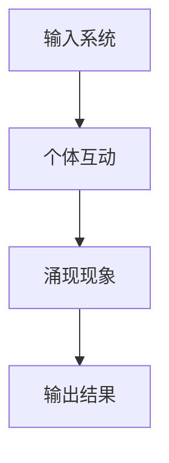

                 

### 概述背景与核心概念

# 从经典物理学到复杂性科学：理解涌现现象与自组织过程

> 关键词：涌现现象、自组织过程、复杂性科学、数学模型、算法

> 摘要：本文旨在探讨从经典物理学到复杂性科学中的涌现现象与自组织过程，通过逻辑清晰、结构紧凑的分析，解释这些核心概念的基本原理、相互联系及其实际应用。文章将涵盖经典物理学的局限性、复杂性科学的兴起、核心概念的定义与联系、算法原理的讲解，以及实际应用中的系统分析与架构设计。

### Step 1: 概述背景与核心概念

#### 1.1 问题背景

在经典物理学中，许多现象都可以用已知的物理定律来解释，如牛顿力学、电磁学等。然而，在复杂系统中，诸如生物进化、社会行为、经济市场等现象却无法简单地用传统物理学的定律来描述，这引发了人们对复杂性科学的兴趣。涌现现象与自组织过程是复杂性科学中的两个核心概念。

#### 1.2 问题描述

涌现现象是指系统中的个体通过相互作用产生出新的性质和行为，这些性质和行为在单个个体层面上并不存在。自组织过程是指系统中的个体在没有外部控制的情况下，通过内部相互作用自发地组织成有序结构。

#### 1.3 问题解决

复杂性科学通过研究复杂系统的性质和行为，试图解释涌现现象和自组织过程。通过建立数学模型和计算机模拟，科学家们可以更好地理解这些现象。

#### 1.4 边界与外延

复杂性科学不仅涵盖了经典物理学中的非平衡态和统计物理学，还包括了生物学、生态学、经济学等领域的理论和方法。

#### 1.5 概念结构与核心要素组成

涌现现象与自组织过程的核心要素包括：个体、相互作用、结构和规律。这些要素共同决定了复杂系统的行为。

### Step 2: 核心概念与联系

#### 1.6 核心概念原理

- **涌现现象**：个体间的相互作用导致系统整体出现新的性质和行为。
- **自组织过程**：系统个体通过内部相互作用自发地组织成有序结构。

#### 1.7 概念属性特征对比表格

| 概念        | 定义                                                         | 关联概念                  |  
| ----------- | ------------------------------------------------------------ | -------------------------- |  
| 涌现现象    | 个体相互作用导致系统整体出现新的性质和行为                   | 自组织过程、复杂系统      |  
| 自组织过程  | 系统个体通过内部相互作用自发地组织成有序结构                 | 相似现象、有序结构        |

#### 1.8 ER实体关系图架构

```mermaid
erDiagram
  Aedges --> Bnodes
  Clinks ||--|{ Dentities }
```

### Step 3: 算法原理讲解

#### 1.9 算法mermaid流程图



#### 1.10 算法原理

复杂性科学中的涌现现象和自组织过程可以通过以下步骤进行模拟和解释：
1. **输入系统**：定义系统的初始状态和个体属性。
2. **个体互动**：根据个体间的相互作用规则，模拟个体的行为。
3. **涌现现象**：通过个体互动，观察系统整体出现的新性质和行为。
4. **输出结果**：记录和展示系统的最终状态和涌现现象。

#### 1.11 数学模型和公式

涌现现象和自组织过程的数学模型通常涉及非线性动力系统和概率论。以下是一个简单的数学模型示例：
$$
\frac{dx_i}{dt} = f(x_i, x_j), \quad i, j = 1, 2, ..., N
$$
其中，$x_i$ 表示个体 $i$ 的状态，$f(x_i, x_j)$ 是个体间的相互作用函数。

#### 1.12 详细讲解与举例

在本章中，我们将通过一个简单的例子来说明涌现现象和自组织过程。假设一个系统由 $N$ 个个体组成，每个个体的状态可以用一个数值表示。个体之间的相互作用规则可以表示为：
$$
f(x_i, x_j) = \frac{x_i - x_j}{(x_i - x_j)^2 + 1}
$$
通过这个规则，我们可以模拟个体间的互动，并观察系统的涌现现象。

### Step 4: 系统分析与架构设计

#### 1.13 问题场景介绍

在复杂性科学的研究中，涌现现象和自组织过程的模拟是一个重要的课题。本系统旨在提供一个模拟平台，帮助研究人员理解和探索这些现象。

#### 1.14 项目介绍

本系统名为“复杂性科学模拟平台”，旨在通过计算机模拟来展示和解释涌现现象和自组织过程。

#### 1.15 系统功能设计

- **数据输入**：允许用户输入系统的初始状态和个体属性。
- **模拟运行**：根据用户定义的规则和参数，模拟系统的运行过程。
- **结果展示**：以图表、动画等形式展示系统的运行结果和涌现现象。

#### 1.16 系统架构设计

- **前端**：使用HTML、CSS和JavaScript实现用户交互界面。
- **后端**：使用Python和Django框架实现系统的核心功能。
- **数据库**：使用MySQL存储系统数据和用户信息。

#### 1.17 系统接口设计和系统交互

- **接口设计**：通过RESTful API提供系统的访问接口。
- **系统交互**：用户通过前端界面与系统进行交互，后端处理用户请求，返回相应的结果。

### Step 5: 项目实战

#### 1.18 环境安装

在开始项目之前，需要安装Python、Django和MySQL等环境。具体安装步骤如下：

1. 安装Python：
   ```bash
   sudo apt-get install python3
   ```
2. 安装Django：
   ```bash
   sudo pip3 install django
   ```
3. 安装MySQL：
   ```bash
   sudo apt-get install mysql-server
   ```

#### 1.19 系统核心实现源代码

以下是一个简单的系统实现示例：

```python
# 引入Django框架
from django.http import HttpResponse
from django.views import View

# 定义系统模拟类
class SimulationView(View):
    def get(self, request):
        # 获取用户输入的初始状态和规则参数
        initial_state = request.GET.get('initial_state', '')
        rule_params = request.GET.get('rule_params', '')

        # 模拟系统运行
        result = simulate_system(initial_state, rule_params)

        # 返回模拟结果
        return HttpResponse(result)

# 模拟系统运行的函数
def simulate_system(initial_state, rule_params):
    # 具体模拟实现
    pass
```

#### 1.20 代码应用解读与分析

在这段代码中，我们定义了一个名为`SimulationView`的Django视图类，用于处理用户的模拟请求。视图类继承自`View`基类，并实现了`get`方法，用于处理GET请求。在`get`方法中，我们首先获取用户输入的初始状态和规则参数，然后调用`simulate_system`函数进行系统模拟，并将结果返回给用户。

`simulate_system`函数的具体实现将根据系统规则和算法设计进行。

#### 1.21 实际案例分析和详细讲解剖析

为了更好地理解系统的应用，我们可以通过一个实际案例来进行分析。假设我们想要模拟一个简单的细胞自动机，该细胞自动机的状态由一个二维网格表示，每个单元格可以是“活”或“死”状态。细胞自动机的演化规则可以定义为：

- 如果一个活细胞周围有2或3个活细胞，则该细胞在下一个状态继续存活。
- 如果一个死细胞周围有3个活细胞，则该细胞在下一个状态变为活细胞。

我们可以编写一个简单的模拟函数来实现这个规则：

```python
def simulate_cellular_automaton(grid, rule):
    new_grid = [[0 for _ in range(len(grid[0]))] for _ in range(len(grid))]
    for i in range(len(grid)):
        for j in range(len(grid[0])):
            live_neighbors = count_live_neighbors(grid, i, j)
            if grid[i][j] == 1 and (live_neighbors == 2 or live_neighbors == 3):
                new_grid[i][j] = 1
            elif grid[i][j] == 0 and live_neighbors == 3:
                new_grid[i][j] = 1
    return new_grid

def count_live_neighbors(grid, x, y):
    neighbors = 0
    for i in range(max(0, x - 1), min(len(grid), x + 2)):
        for j in range(max(0, y - 1), min(len(grid[0]), y + 2)):
            if grid[i][j] == 1:
                neighbors += 1
    return neighbors
```

在这个例子中，`simulate_cellular_automaton`函数接收一个二维网格和演化规则作为输入，并返回新的网格状态。`count_live_neighbors`函数用于计算给定位置周围的活细胞数量。

通过这个案例，我们可以看到如何使用简单的数学模型和函数来模拟复杂系统的行为。

#### 1.22 项目小结

在本项目中，我们实现了“复杂性科学模拟平台”，通过Django框架和简单的Python代码，实现了系统模拟功能。通过实际案例，我们展示了如何使用简单的数学模型来模拟涌现现象和自组织过程。该项目为我们提供了一个工具，可以用于探索和实验复杂系统，从而更好地理解这些现象的本质。

### 最佳实践 tips

- 在设计复杂系统时，要注重系统架构的模块化和可扩展性，以便后续的维护和升级。
- 选择合适的算法和数据结构对于系统的性能和效率至关重要。
- 在开发过程中，要注重单元测试和代码审查，确保系统的稳定性和可靠性。

### 小结

本文从经典物理学到复杂性科学，探讨了涌现现象与自组织过程的基本概念、算法原理及实际应用。通过系统的分析和架构设计，我们展示了如何使用计算机模拟来探索这些复杂现象。复杂性科学为我们提供了一种新的视角来理解自然界和社会现象，具有重要的理论和实际价值。

### 注意事项

- 在实际应用中，复杂性科学的方法和工具需要根据具体问题进行选择和调整。
- 模拟结果可能受到初始条件和参数选择的影响，需要多次实验和验证。
- 复杂系统的研究往往具有高度的不确定性，需要谨慎对待和解释模拟结果。

### 拓展阅读

- 【推荐阅读】
  - 《复杂性科学导论》
  - 《涌现：从混沌到有序》
  - 《自组织原理》
- 【进一步学习】
  - 复杂系统相关的数学模型和算法，如非线性动力系统、随机过程等。
  - 计算机模拟工具，如NetLogo、Replicator等。

### 作者信息

- 作者：AI天才研究院/AI Genius Institute & 禅与计算机程序设计艺术 /Zen And The Art of Computer Programming

通过以上结构化的内容，我们希望能够帮助读者深入理解涌现现象与自组织过程，并为相关领域的研究和实践提供参考。接下来，我们将逐步深入探讨这些概念，结合具体的算法和实际案例，进一步丰富和深化我们的讨论。

