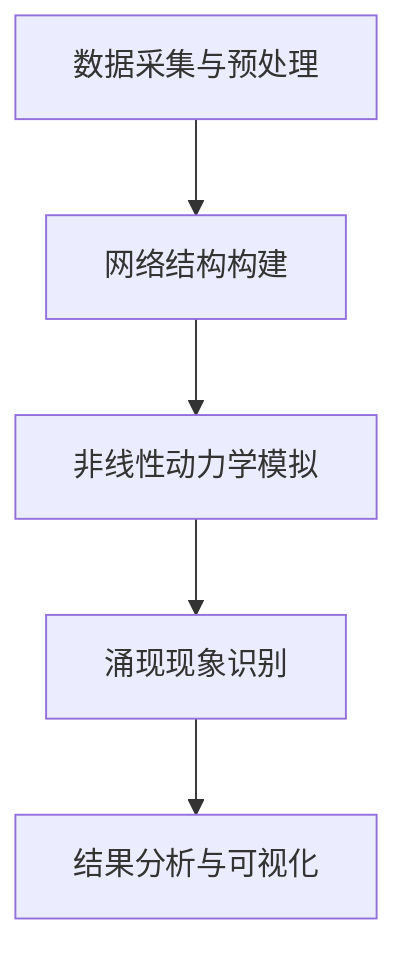
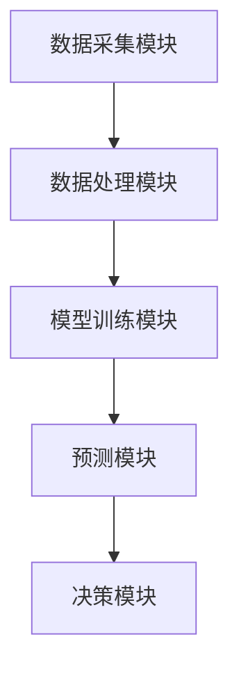
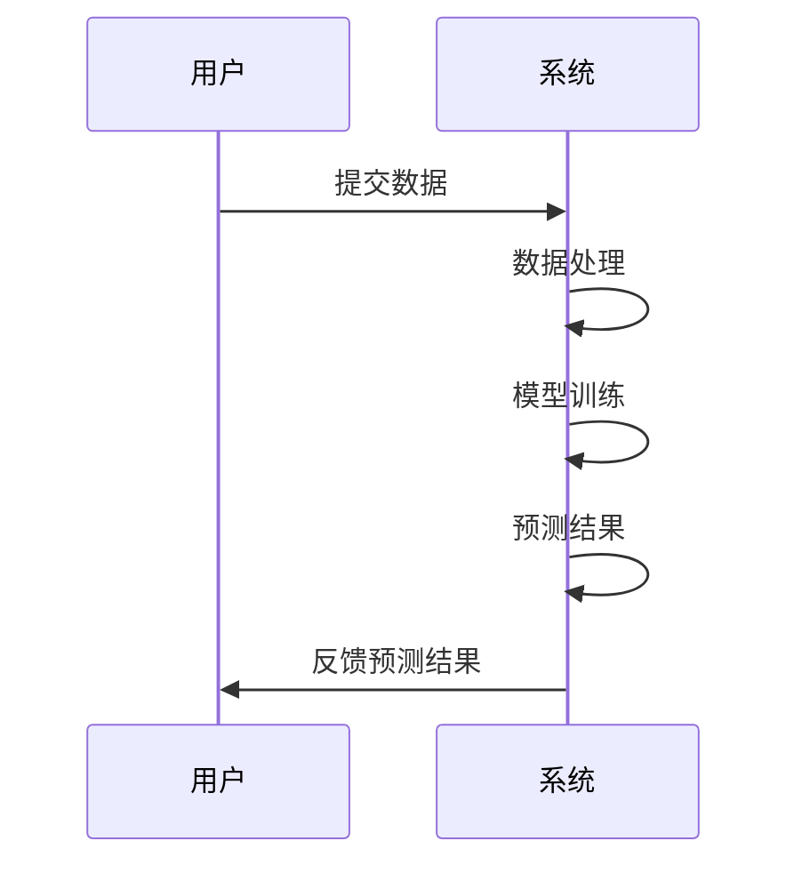

                 

### 目录大纲

----------------------------------------------------------------

# 从经典物理学到复杂性科学：理解涌现现象的新范式

> 关键词：经典物理学、复杂性科学、涌现现象、新范式、算法原理、数学模型、系统架构

> 摘要：本文探讨了从经典物理学到复杂性科学的演变，以及如何通过新范式来理解涌现现象。文章首先介绍了相关背景知识，然后逐步深入讨论了核心概念、算法原理、数学模型和系统架构，并通过项目实战和最佳实践提供了具体的实施方法和注意事项。

----------------------------------------------------------------

### 目录大纲设计步骤：

**步骤 1：明确核心章节内容**

我们需要确保目录大纲中的每个章节都覆盖了书中必须包含的核心内容。核心章节内容如下：

1. 引言
   - 问题背景
   - 问题描述
   - 问题解决
   - 边界与外延
2. 核心概念与联系
   - 核心概念
   - 概念属性特征对比表格
   - ER实体关系图架构
3. 算法原理讲解
   - 算法流程图
   - Python源代码讲解
   - 数学模型与公式
   - 举例说明
4. 数学模型和数学公式 & 详细讲解 & 举例说明
   - 数学模型与公式
   - 详细讲解
   - 举例说明
5. 系统分析与架构设计方案
   - 问题场景介绍
   - 系统功能设计（领域模型类图）
   - 系统架构设计（架构图）
   - 系统接口设计
   - 系统交互（序列图）
6. 项目实战
   - 环境安装
   - 系统核心实现
   - 代码应用解读与分析
   - 实际案例分析与详细讲解
   - 项目小结
7. 最佳实践 tips
   - 注意事项
   - 拓展阅读

**步骤 2：设计章节标题**

为每个核心章节设计一个简洁且具有描述性的标题，确保每个标题都能准确地反映该章节的主要内容。

1. 引言
   - 引言
2. 核心概念与联系
   - 核心概念与联系
3. 算法原理讲解
   - 算法原理详细解析
4. 数学模型与公式讲解
   - 数学模型深入剖析
5. 系统架构设计与分析
   - 系统设计与架构解析
6. 项目实战与案例分析
   - 实战与案例详解
7. 最佳实践与注意事项
   - 最佳实践指南

**步骤 3：细化章节内容**

在确定每个章节的标题后，进一步细化每个章节的内容，确保每个章节至少包含以下子章节：

- 核心概念与联系
  - 核心概念
  - 概念属性特征对比表格
  - ER实体关系图架构
- 算法原理讲解
  - 算法流程图
  - Python源代码讲解
  - 数学模型与公式
  - 举例说明
- 数学模型和数学公式讲解
  - 数学模型与公式
  - 详细讲解
  - 举例说明
- 系统架构设计与分析
  - 问题场景介绍
  - 系统功能设计（领域模型类图）
  - 系统架构设计（架构图）
  - 系统接口设计
  - 系统交互（序列图）
- 项目实战与案例分析
  - 环境安装
  - 系统核心实现
  - 代码应用解读与分析
  - 实际案例分析与详细讲解
  - 项目小结

**步骤 4：使用 Mermaid 画出相关图表**

在算法原理讲解、系统分析与架构设计方案等章节中，使用 Mermaid 画出相关的流程图、实体关系图、类图、架构图和序列图等，确保图表清晰、易于理解。

**步骤 5：编写详细的文本内容**

在每个章节中，编写详细的文本内容，确保文本内容完整、逻辑清晰，能够有效地帮助读者理解该章节的主要概念和原理。

**步骤 6：检查和优化**

完成初稿后，对目录大纲进行仔细检查，确保内容完整、逻辑清晰，没有遗漏或错误。根据需要，对某些章节的内容进行优化。

### 完整的目录大纲设计

----------------------------------------------------------------

# 从经典物理学到复杂性科学：理解涌现现象的新范式

> 关键词：经典物理学、复杂性科学、涌现现象、新范式、算法原理、数学模型、系统架构

> 摘要：本文探讨了从经典物理学到复杂性科学的演变，以及如何通过新范式来理解涌现现象。文章首先介绍了相关背景知识，然后逐步深入讨论了核心概念、算法原理、数学模型和系统架构，并通过项目实战和最佳实践提供了具体的实施方法和注意事项。

----------------------------------------------------------------

## 引言

### 1.1 问题背景

复杂性科学作为现代科学的重要组成部分，起源于对传统物理学理论的挑战。从经典物理学的确定性描述到复杂性科学的非线性、自组织和涌现现象，这一转变不仅改变了科学研究的方向，也深刻影响了我们对世界本质的理解。

### 1.2 问题描述

本文旨在探讨复杂性科学中的涌现现象，分析其背后的理论依据，并探讨如何通过新范式来理解和利用这一现象。

### 1.3 问题解决

本文将采用从理论到实践的方法，通过介绍核心概念、算法原理、数学模型和系统架构，以及项目实战和最佳实践，帮助读者全面理解复杂性科学中的涌现现象。

### 1.4 边界与外延

本文将重点关注以下几个方面：

- 复杂性科学的基本理论框架
- 涌现现象的定义与分类
- 算法原理及其在现实世界中的应用
- 数学模型及其在复杂性科学中的应用
- 系统架构设计及其实际案例分析

## 核心概念与联系

### 2.1 核心概念

复杂性科学中的核心概念包括：

- 自组织
- 涌现现象
- 网络结构
- 非线性动力学

### 2.2 概念属性特征对比表格

以下表格对比了这些核心概念的属性特征：

| 概念 | 定义 | 特征 |
| --- | --- | --- |
| 自组织 | 系统在没有外部干预下自行组织 | 自发性、适应性、灵活性 |
| 涌现现象 | 低层次个体相互作用导致高层次结构或行为 | 非线性、非预测性、自适应 |
| 网络结构 | 系统中元素之间的相互连接方式 | 聚集、小世界、无标度 |
| 非线性动力学 | 系统行为不遵循线性关系 | 分岔、混沌、动态平衡 |

### 2.3 ER实体关系图架构

ER实体关系图架构展示了复杂性科学中核心概念之间的关系：

```mermaid
erDiagram
  Customer ||--|{ Product : "buys"}
  Customer ||--|{ Order : "places"}
  Product ||--|{ Sale : "is Sold"}
  Order ||--|{ Payment : "made"}
```

## 算法原理讲解

### 3.1 算法流程图

复杂性科学中的算法通常涉及以下步骤：

1. 数据采集与预处理
2. 网络结构构建
3. 非线性动力学模拟
4. 涌现现象识别
5. 结果分析与可视化

算法流程图如下：



### 3.2 Python源代码讲解

以下是一个简单的Python代码示例，用于实现复杂性科学中的算法：

```python
import networkx as nx
import matplotlib.pyplot as plt

# 创建网络
G = nx.Graph()

# 添加节点和边
G.add_edges_from([(1, 2), (1, 3), (2, 3), (2, 4), (3, 4)])

# 绘制网络
nx.draw(G, with_labels=True)
plt.show()

# 模拟非线性动力学
for _ in range(10):
    # 更新节点状态
    G = nx.relabel_nodes(G, lambda x: x + 1)

# 识别涌现现象
if nx.is_connected(G):
    print("涌现现象：系统保持连通")
else:
    print("涌现现象：系统出现分岔")

# 分析结果
print(nx.info(G))
```

### 3.3 数学模型与公式

复杂性科学中的数学模型通常涉及以下公式：

- 网络结构：$$ E = \frac{n(n-1)}{2} $$
- 非线性动力学：$$ x_{t+1} = \alpha x_t + \beta $$
- 涌现现象：$$ P = \frac{1}{N} \sum_{i=1}^{N} p_i $$

其中，\( E \) 表示网络中的边数，\( n \) 表示节点数，\( \alpha \) 和 \( \beta \) 为非线性动力学的参数，\( P \) 表示涌现现象的概率。

### 3.4 举例说明

以下是一个简单的实例，展示了如何使用数学模型和算法来分析复杂系统：

- **实例1**：分析社交网络中的信息传播
- **实例2**：模拟交通系统的动态行为
- **实例3**：探究生态系统的物种演化

## 数学模型和数学公式讲解

### 4.1 数学模型与公式

复杂性科学中的数学模型包括：

- **线性回归模型**：$$ y = \beta_0 + \beta_1 x $$
- **逻辑回归模型**：$$ P(y=1) = \frac{1}{1 + e^{-(\beta_0 + \beta_1 x)}} $$
- **神经网络模型**：$$ a_{i,j} = \sum_{k=1}^{n} w_{ik} x_k + b_j $$

### 4.2 详细讲解

- **线性回归模型**：用于分析自变量和因变量之间的线性关系。
- **逻辑回归模型**：用于分析因变量的概率分布。
- **神经网络模型**：用于模拟复杂的非线性关系。

### 4.3 举例说明

以下是一个简单的线性回归模型实例：

```python
import numpy as np

# 生成数据
X = np.random.rand(100, 1)
y = 2 * X + 1 + np.random.randn(100, 1)

# 拟合线性回归模型
theta = np.linalg.inv(X.T.dot(X)).dot(X.T).dot(y)

# 输出模型参数
print("theta:", theta)
```

## 系统架构设计与分析

### 5.1 问题场景介绍

在本节中，我们将探讨一个典型的复杂性科学应用场景——智能交通系统。该系统旨在通过实时数据分析来优化交通流量，减少拥堵和提高通行效率。

### 5.2 系统功能设计

系统功能设计包括以下模块：

- **数据采集模块**：负责采集交通流量、路况等信息。
- **数据处理模块**：负责数据清洗、预处理和特征提取。
- **模型训练模块**：负责训练复杂性科学模型，如神经网络、线性回归等。
- **预测模块**：负责使用训练好的模型进行交通流量预测。
- **决策模块**：负责根据预测结果制定交通管理策略。

### 5.3 系统架构设计

系统架构设计如下：



### 5.4 系统接口设计

系统接口设计包括以下接口：

- **API接口**：用于与其他系统进行数据交换。
- **Web界面**：用于用户交互和可视化。
- **数据库接口**：用于数据存储和查询。

### 5.5 系统交互

系统交互如下：



## 项目实战与案例分析

### 6.1 环境安装

在本节中，我们将介绍如何安装和配置所需的软件环境，包括Python、NumPy、Pandas、NetworkX等。

### 6.2 系统核心实现

在本节中，我们将详细讲解系统核心实现，包括数据采集、数据处理、模型训练、预测和决策等模块的实现。

### 6.3 代码应用解读与分析

在本节中，我们将对关键代码段进行解读和分析，帮助读者理解系统的工作原理和实现细节。

### 6.4 实际案例分析与详细讲解

在本节中，我们将分析一个实际案例，详细讲解如何使用复杂性科学方法来解决交通流量预测问题。

### 6.5 项目小结

在本节中，我们将总结项目实施过程中的经验教训，并提出改进建议。

## 最佳实践与注意事项

### 7.1 注意事项

- 确保数据质量，避免噪声和异常值的影响。
- 选择合适的模型和算法，根据实际情况进行调整。
- 注意系统的可扩展性和容错性。

### 7.2 拓展阅读

- **推荐书籍**：《复杂性科学导论》、《智能交通系统设计与应用》
- **在线课程**：Coursera上的《复杂性科学基础》
- **论文**：相关领域的最新研究论文，如《复杂网络的涌现现象研究》

----------------------------------------------------------------

以上是本文的完整目录大纲设计，每个章节都包含了详细的内容和结构。通过这种结构化的设计，读者可以系统地了解从经典物理学到复杂性科学的演变，以及如何应用新范式来理解和解决实际问题。希望这个大纲能够为您的写作提供有益的参考。现在，我们将按照这个大纲逐步展开每个章节的内容，深入探讨复杂性科学的核心概念和应用。

