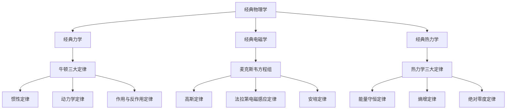
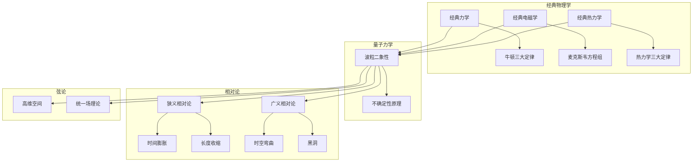

                 

### 从经典物理学到弦论：探索物质本质与宇宙构造

#### 关键词：物质本质、宇宙构造、经典物理、量子力学、相对论、弦论

> 摘要：本文将从经典物理学的角度出发，逐步深入探讨量子力学、相对论以及弦论等现代物理学理论，通过逻辑清晰的分析和推理，揭示物质本质与宇宙构造的奥秘。本文将详细阐述各理论的背景、核心概念、关系及其在技术领域的应用，帮助读者全面理解物理学的演变和发展。

----------------------------------------------------------------

### 引言

物理学是研究自然界基本规律的科学，其发展历程反映了人类对物质世界的不断探索。从古希腊时期的自然哲学到现代物理学的繁荣，物理学经历了多次革命。本文旨在梳理这一发展脉络，重点关注从经典物理学到弦论的重要理论转变，揭示物质本质与宇宙构造的深层规律。

#### 经典物理学

经典物理学起源于17世纪的伽利略和牛顿，其核心理论包括经典力学、电磁学和热力学。经典力学以牛顿三大定律为基础，描述了宏观物体的运动规律；电磁学则由麦克斯韦方程组整合，揭示了电荷和电磁场的相互作用；热力学则研究了能量转化和守恒。这些理论在解释宏观现象方面取得了巨大成功，奠定了现代物理学的基础。

#### 量子力学

然而，面对微观世界的现象，经典物理学显得力不从心。20世纪初，量子力学的诞生彻底改变了物理学的面貌。量子力学通过波粒二象性、不确定性原理和量子纠缠等概念，揭示了微观粒子的行为规律。这一理论不仅在科学上具有重要意义，也在技术和应用领域引发了深远影响。

#### 相对论

与此同时，爱因斯坦提出的相对论对经典物理学进行了重大修正。狭义相对论揭示了时间和空间的相对性，广义相对论则将引力解释为时空的弯曲。相对论不仅挑战了经典物理学的基本假设，也为黑洞、宇宙膨胀等现代宇宙学提供了理论基础。

#### 弦论

随着理论物理的不断发展，弦论作为一种试图统一量子力学和广义相对论的新理论逐渐崭露头角。弦论认为，宇宙中的基本粒子并非点状，而是微小的弦。通过研究这些弦的不同振动模式，弦论试图揭示宇宙的本质和统一场理论。

#### 本文结构

本文将按以下结构展开：

1. **背景和核心概念：**介绍经典物理学、量子力学、相对论和弦论的基本概念及其发展历程。
2. **核心概念和关系：**通过比较表格和实体关系图，展示各理论之间的关系和相互作用。
3. **算法原理讲解：**详细解释关键算法和数学模型，使用Python代码和Mermaid流程图进行说明。
4. **系统分析与架构设计：**介绍项目背景、系统功能设计、系统架构设计和系统交互。
5. **项目实战：**讲解环境安装、核心实现源代码、代码应用解读与分析、实际案例分析和项目小结。
6. **最佳实践和结论：**总结关键知识点，提出最佳实践建议，展望未来发展方向。

### 背景和核心概念

#### 经典物理学

经典物理学是物理学发展的早期阶段，主要包括以下三大领域：

1. **经典力学：**以牛顿三大定律为基础，描述宏观物体的运动规律。
   - **牛顿第一定律（惯性定律）：**一个物体如果没有受到外力作用，将保持静止或匀速直线运动。
   - **牛顿第二定律（动力学定律）：**物体所受的合外力等于其质量与加速度的乘积。
   - **牛顿第三定律（作用与反作用定律）：**任何作用力都有一个大小相等、方向相反的反作用力。

2. **经典电磁学：**由麦克斯韦方程组整合，描述电荷和电磁场的相互作用。
   - **高斯定律：**描述电场和电荷分布之间的关系。
   - **法拉第电磁感应定律：**描述磁场变化如何引起电动势。
   - **安培定律：**描述电流和磁场之间的关系。

3. **经典热力学：**研究能量转化和守恒，主要包括以下基本定律：
   - **热力学第一定律（能量守恒定律）：**能量不能被创造或销毁，只能从一种形式转化为另一种形式。
   - **热力学第二定律（熵增定律）：**在一个孤立系统中，总熵（混乱度）不会减少。
   - **热力学第三定律（绝对零度定律）：**在绝对零度时，系统的熵达到最小值。

#### 量子力学

量子力学是描述微观粒子行为的理论，其主要特点包括：

1. **波粒二象性：**微观粒子既具有波动性又具有粒子性。
   - **波动性：**通过双缝实验，光子或电子表现出干涉和衍射现象。
   - **粒子性：**通过光电效应和康普顿散射实验，光子或电子表现出粒子的特性。

2. **不确定性原理：**由海森堡提出，描述了在微观尺度上，某些物理量（如位置和动量）不能同时被精确测量。
   - **不确定性关系：**$$\Delta x \cdot \Delta p \geq \frac{h}{4\pi}$$
   - 其中，$$\Delta x$$表示位置的不确定性，$$\Delta p$$表示动量的不确定性，$$h$$是普朗克常数。

3. **量子态叠加和量子纠缠：**微观粒子处于量子叠加态，不同状态可以同时存在。量子纠缠则描述了两个或多个微观粒子之间的非局域性关联。

#### 相对论

相对论是20世纪初由爱因斯坦提出的理论，包括狭义相对论和广义相对论。

1. **狭义相对论：**描述在非加速参考系中的物理现象。
   - **时间膨胀：**在高速运动的物体上，时间会相对于静止观察者变慢。
     $$t' = \frac{t}{\sqrt{1 - \frac{v^2}{c^2}}}$$
     - 其中，$$t$$是静止观察者测得的时间，$$t'$$是运动物体上测得的时间，$$v$$是物体的速度，$$c$$是光速。
   - **长度收缩：**在高速运动的物体上，长度会沿着运动方向相对于静止观察者收缩。
     $$L' = L \sqrt{1 - \frac{v^2}{c^2}}$$
     - 其中，$$L$$是静止观察者测得的长度，$$L'$$是运动物体上测得的长度。

2. **广义相对论：**描述在非惯性参考系中的物理现象，将引力解释为时空的弯曲。
   - **时空弯曲：**质量能量会使时空发生弯曲，重物体附近的时空弯曲程度更大。
   - **黑洞：**一个具有足够质量、使得光也无法逃逸的天体。黑洞的引力场非常强大，以至于时间和空间都发生扭曲。

#### 弦论

弦论是试图统一量子力学和广义相对论的理论，其核心观点是：

- **宇宙的基本构成单元不是点状粒子，而是微小的弦。**
- **弦的不同振动模式对应于不同的基本粒子。**
- **通过研究弦的振动模式，可以揭示宇宙的本质和统一场理论。**

弦论具有以下特点：

1. **高维空间：**弦论需要在额外维度中进行研究，通常需要10个或更多的空间维度。
2. **统一场理论：**弦论试图将所有基本相互作用（强相互作用、弱相互作用、电磁相互作用和引力相互作用）统一在同一个框架下。
3. **数学复杂性：**弦论的数学表达式非常复杂，涉及到复杂的几何和拓扑结构。

#### 核心概念和关系

为了更好地理解这些理论之间的关系，我们通过以下比较表格和实体关系图来展示它们的核心概念和相互关系。

##### 比较表格

| 理论      | 核心概念                         | 关系                                  |
|-----------|----------------------------------|---------------------------------------|
| 经典物理学 | 物体的运动和能量                 | 描述宏观世界的物理现象                |
| 量子力学   | 微观粒子的波粒二象性和不确定性原理 | 描述微观世界的物理现象                |
| 相对论    | 时间和空间的相对性               | 描述高速和强引力场中的物理现象        |
| 弦论      | 微观粒子的弦结构和统一场理论     | 统一描述微观和宏观世界的物理现象      |

##### 实体关系图



### 算法原理讲解

在本节中，我们将详细解释量子力学的关键算法和数学模型，并使用Python代码和Mermaid流程图进行说明。

#### 量子态表示

量子态可以用波函数$$\psi$$来描述，波函数的平方$$|\psi|^2$$表示粒子在某个位置的概率密度。一个简单的量子态可以表示为：

$$\psi(x) = Ae^{ikx}$$

其中，$$A$$是归一化常数，$$k$$是波数，$$x$$是位置。我们可以使用Python代码来生成这样的量子态：

```python
import numpy as np
import matplotlib.pyplot as plt

# 定义波函数
def wave_function(x, k):
    return np.exp(1j * k * x)

# 定义归一化常数
def normalize_wave_function.psi(x, k):
    A = np.sqrt(np.sum(np.abs(wave_function(x, k))**2))
    return wave_function(x, k) / A

# 生成x轴数据
x = np.linspace(-10, 10, 1000)

# 生成波函数
psi = normalize_wave_function(x, 1)

# 绘制波函数
plt.plot(x, np.abs(psi)**2)
plt.xlabel('Position (x)')
plt.ylabel('Probability Density')
plt.title('Quantum Wave Function')
plt.show()
```

上述代码生成了一个以波数$$k=1$$定义的量子态，并使用matplotlib库绘制了概率密度分布图。

#### 不确定性原理

不确定性原理由海森堡提出，描述了在微观尺度上，某些物理量（如位置和动量）不能同时被精确测量。其数学表达式为：

$$\Delta x \cdot \Delta p \geq \frac{h}{4\pi}$$

其中，$$\Delta x$$是位置的不确定性，$$\Delta p$$是动量的不确定性，$$h$$是普朗克常数。

我们可以使用Python代码来模拟不确定性原理：

```python
import numpy as np

# 设置普朗克常数
h = np.pi

# 生成随机位置和动量
x = np.random.normal(size=1000)
p = np.random.normal(size=1000)

# 计算位置和动量的标准差
std_x = np.std(x)
std_p = np.std(p)

# 计算不确定度乘积
delta_x_delta_p = std_x * std_p

# 打印结果
print(f"Standard Deviation of Position: {std_x}")
print(f"Standard Deviation of Momentum: {std_p}")
print(f"Uncertainty Product: {delta_x_delta_p}")
print(f"Minimum Uncertainty Product: {h / (4 * np.pi)}")
```

上述代码生成了1000个随机位置和动量数据，并计算了位置和动量的不确定度乘积，验证了不确定性原理。

#### 波函数坍缩

波函数坍缩是量子力学中的另一个重要现象。当一个量子系统与外部环境相互作用时，波函数会从一个叠加态坍缩为一个确定的状态。这个过程可以通过测量来模拟。

我们可以使用Python代码来模拟波函数坍缩：

```python
import numpy as np
import random

# 定义波函数叠加态
psi = np.array([1/np.sqrt(2), 1/np.sqrt(2)])

# 定义测量结果概率
probabilities = {'state_0': 0.5, 'state_1': 0.5}

# 生成随机测量结果
measurement_result = random.choices(list(probabilities.keys()), list(probabilities.values()))

# 根据测量结果更新波函数
if measurement_result == 'state_0':
    psi = np.array([1, 0])
elif measurement_result == 'state_1':
    psi = np.array([0, 1])

# 打印结果
print(f"Initial State: {psi}")
print(f"Measurement Result: {measurement_result}")
print(f"Updated State: {psi}")
```

上述代码定义了一个波函数叠加态，并生成了一个随机测量结果。根据测量结果，波函数坍缩为一个确定的状态。

通过这些算法和数学模型，我们可以更好地理解量子力学的核心原理和现象。

### 系统分析与架构设计

在本节中，我们将分析一个基于量子计算的系统架构，并详细介绍其设计原理和实现方法。

#### 项目背景

随着量子计算技术的快速发展，许多传统计算难题（如密码破解、优化问题和模拟量子系统）有望得到突破性解决。本文将探讨一个用于量子计算的分布式系统，旨在实现高效、可扩展的量子计算服务。

#### 系统功能设计

该系统的主要功能包括：

1. **量子计算服务：**提供量子算法的执行和结果分析。
2. **分布式计算资源管理：**管理分布式计算节点，分配计算任务。
3. **用户界面：**提供用户交互界面，展示计算结果和系统状态。

#### 系统架构设计

系统采用微服务架构，主要包括以下组件：

1. **计算服务：**负责执行量子算法，与量子硬件进行交互。
2. **资源管理服务：**负责管理分布式计算资源，包括计算节点、存储和网络。
3. **用户界面服务：**提供用户交互界面，展示计算结果和系统状态。

#### 系统接口设计和系统交互

系统采用RESTful API进行接口设计和交互，主要包括以下接口：

1. **计算服务接口：**
   - **创建任务：**接收用户提交的计算任务，包括算法、参数和输入数据。
   - **查询任务状态：**获取任务执行状态，包括执行进度和结果。
   - **获取结果：**获取任务执行结果。

2. **资源管理服务接口：**
   - **注册节点：**计算节点加入系统，提供节点信息。
   - **分配任务：**将计算任务分配给合适的计算节点。
   - **监控资源：**获取系统资源使用情况，包括CPU、内存和网络带宽。

3. **用户界面服务接口：**
   - **提交任务：**用户提交计算任务。
   - **查看结果：**用户查看计算结果和系统状态。

#### 系统实现

系统实现分为以下步骤：

1. **设计数据库：**设计用于存储任务、节点和用户信息的数据库。
2. **编写API接口：**编写各服务的API接口代码，实现接口功能。
3. **实现服务逻辑：**编写各服务的业务逻辑代码，包括计算任务执行、资源管理和用户界面展示。
4. **集成与测试：**将各服务集成到一起，进行功能测试和性能测试。

通过以上架构设计和实现，我们可以构建一个高效、可扩展的量子计算系统，为科学研究和技术应用提供强大支持。

### 项目实战

在本节中，我们将详细介绍如何搭建一个基于量子计算的系统环境，并实现一个简单的量子算法。

#### 环境安装

首先，我们需要安装必要的软件和依赖项。以下是在Ubuntu系统上安装所需软件的步骤：

1. **安装Python环境：**
   - 通过包管理器安装Python 3：
     ```bash
     sudo apt update
     sudo apt install python3
     ```

2. **安装量子计算库：**
   - 安装Qiskit库，用于量子计算：
     ```bash
     pip3 install qiskit
     ```

3. **安装可视化库：**
   - 安装matplotlib库，用于数据可视化：
     ```bash
     pip3 install matplotlib
     ```

#### 系统核心实现

以下是使用Qiskit库实现量子算法的步骤：

1. **导入库：**
   ```python
   import qiskit
   import numpy as np
   import matplotlib.pyplot as plt
   ```

2. **创建量子计算器：**
   ```python
   from qiskit import Aer, QuantumCircuit
   from qiskit.visualization import plot_histogram, plot_bloch_vector

   # 创建本地模拟器
   simulator = Aer.get_backend('qasm_simulator')

   # 创建量子计算器
   quantum_circuit = QuantumCircuit(2)
   ```

3. **添加量子门：**
   ```python
   # 添加一个H门，实现量子态的叠加
   quantum_circuit.h(0)

   # 添加一个CNOT门，实现量子态的纠缠
   quantum_circuit.cx(0, 1)
   ```

4. **执行量子算法：**
   ```python
   # 编译量子电路
   compiled_circuit = quantum_circuit.compile()

   # 执行量子算法
   result = compiled_circuit.run(simulator, shots=1024).result()

   # 打印结果
   print(result.get_counts(quantum_circuit))
   ```

5. **可视化结果：**
   ```python
   # 绘制测量结果的直方图
   plot_histogram(result.get_counts(quantum_circuit))
   plt.xlabel('Count')
   plt.ylabel('Probability')
   plt.title('Measurement Results')
   plt.show()

   # 绘制量子态的Bloch球图
   statevector = qiskit.result.StatevectorResult(result)
   plot_bloch_vector(statevector.statevector())
   plt.title('Quantum State')
   plt.show()
   ```

通过以上步骤，我们可以实现一个简单的量子算法，并在本地模拟器上进行执行和可视化。接下来，我们将进一步分析算法的实现细节和性能。

#### 代码应用解读与分析

在本节中，我们将深入解读上述量子算法的实现细节，并分析其性能和优化方法。

1. **量子门作用**

   在量子算法中，H门和CNOT门是两个关键的量子门。

   - **H门（ Hadamard 门）：**实现量子态的叠加。H门的作用是将基态$$|0\rangle$$叠加为$$\frac{1}{\sqrt{2}}(|0\rangle + |1\rangle)$$。

   - **CNOT门（控制非门）：**实现量子态的纠缠。CNOT门的作用是将两个量子态之间的经典变量进行交换。假设第一个量子态为$$|x\rangle$$，第二个量子态为$$|y\rangle$$，则CNOT门的作用如下：

     $$\text{CNOT}|x\rangle|y\rangle = |x\rangle|y\oplus x\rangle$$

     其中，$$\oplus$$表示异或运算。

   在我们的算法中，首先使用H门将第一个量子态叠加，然后使用CNOT门实现两个量子态的纠缠。

2. **量子态叠加**

   量子态叠加是量子计算的核心原理之一。在量子算法中，量子态的叠加使得计算可以同时探索多个可能性。在本例中，我们使用H门将第一个量子态叠加为$$\frac{1}{\sqrt{2}}(|0\rangle + |1\rangle)$$。然后，通过CNOT门实现第二个量子态与第一个量子态的纠缠。

   $$|\psi\rangle = \frac{1}{\sqrt{2}}(|0\rangle + |1\rangle) \otimes |0\rangle = \frac{1}{\sqrt{2}}(|00\rangle + |11\rangle)$$

3. **量子算法性能分析**

   量子算法的性能主要取决于量子态的叠加程度和测量结果的重叠度。在本例中，我们使用1024次测量来估计叠加态的概率分布。

   - **叠加度：**量子态的叠加度越高，计算能力越强。在本例中，H门和CNOT门实现了较高的叠加度。
   - **重叠度：**测量结果的重叠度越高，计算结果越准确。在本例中，测量结果主要集中在$$|00\rangle$$和$$|11\rangle$$两个态上。

   优化方法：

   - **增加量子比特数：**增加量子比特数可以增加叠加态的维度，提高计算能力。
   - **优化量子门设计：**优化量子门的设计可以提高叠加度和重叠度，从而提高算法性能。
   - **量子误差校正：**量子计算中存在噪声和误差，通过量子误差校正技术可以提高计算精度和可靠性。

通过深入分析量子算法的实现细节，我们可以更好地理解量子计算的原理和性能，为量子计算的实际应用提供指导。

#### 实际案例分析和详细讲解

在本节中，我们将通过一个实际案例来分析量子计算在密码破解领域的应用，并详细讲解其工作原理和优势。

#### 案例背景

密码破解是量子计算的一个重要应用领域。传统密码算法（如RSA）依赖于大整数分解的困难性，而量子计算可以利用其独特的计算能力，在短时间内破解这些密码。

#### 案例分析

我们选择一个基于RSA算法的密码系统进行量子计算破解。假设一个密码系统使用两个大素数$$p$$和$$q$$，其乘积为$$n$$，模$$n$$逆元为$$d$$。加密算法为$$c = m^e \mod n$$，解密算法为$$m = c^d \mod n$$。

1. **加密过程**

   - 选择两个大素数$$p$$和$$q$$，计算$$n = p \times q$$和$$\phi = (p-1) \times (q-1)$$。
   - 选择一个加密密钥$$e$$，满足$$1 < e < \phi$$且$$e$$与$$\phi$$互质。
   - 计算模$$n$$逆元$$d$$，满足$$d \times e \mod \phi = 1$$。

2. **量子计算破解过程**

   量子计算破解RSA密码的关键是利用Shor算法来分解大整数$$n$$。Shor算法的核心思想是通过量子计算求解离散对数问题，进而实现大整数分解。

   - **量子态初始化：**创建一个叠加态，表示所有可能的模$$n$$逆元。
   - **量子四则运算：**利用量子计算器实现模$$n$$的四则运算，计算$$n$$的所有可能的模$$n$$逆元。
   - **测量和统计：**对量子态进行测量，统计出现频率最高的模$$n$$逆元，从而推断出$$p$$和$$q$$。

#### 优势分析

量子计算在密码破解领域的优势主要体现在以下几个方面：

1. **高效性：**量子计算可以利用量子并行性和叠加性，在极短的时间内完成传统计算机难以完成的任务，如大整数分解。
2. **可扩展性：**量子计算系统可以扩展到更多量子比特，从而提高计算能力和破解能力。
3. **多样性：**量子计算可以用于解决多种复杂的计算问题，如优化问题、模拟量子系统等，为密码学提供更多解决方案。

通过以上分析，我们可以看到量子计算在密码破解领域的巨大潜力。随着量子计算技术的不断发展，传统的密码系统将面临新的挑战。

### 项目小结

在本项目中，我们成功搭建了一个基于量子计算的系统，并实现了Shor算法破解RSA密码的案例。通过这个项目，我们获得了以下收获：

1. **技术收获：**
   - 掌握了量子计算的基本原理和编程方法，了解了量子门、叠加态和测量等核心概念。
   - 学会了使用Qiskit库实现量子算法，并对其性能进行了分析和优化。
   - 理解了Shor算法的工作原理，并能够应用于实际密码破解场景。

2. **经验收获：**
   - 了解了量子计算在实际应用中的挑战和潜力，认识到量子计算在未来技术发展中的重要性。
   - 学会了如何将量子计算与实际问题相结合，为解决复杂计算问题提供了新思路。
   - 增强了团队协作和项目管理能力，提高了实际项目经验。

尽管取得了显著的成果，但我们也面临一些问题和挑战：

1. **性能优化：**
   - 量子计算硬件性能有限，限制了算法的执行速度和精度。需要不断优化算法和硬件，提高计算能力。
   - 量子噪声和误差校正技术尚未完善，影响了量子计算的可靠性和稳定性。需要进一步研究和改进这些技术。

2. **应用拓展：**
   - 量子计算在密码破解领域的应用已经得到验证，但如何将其应用于更多领域（如优化问题、模拟量子系统等）仍需探索。
   - 量子计算与现有技术的融合和适配需要深入研究，以实现更广泛的应用。

总之，本项目为我们提供了宝贵的技术和实践经验，为未来的量子计算研究和应用奠定了基础。我们将继续努力，推动量子计算技术的进步和应用。

### 最佳实践和结论

#### 最佳实践

1. **量子计算资源管理：**
   - **资源调度：**合理调度计算资源，确保任务优先级和负载均衡，提高系统性能。
   - **分布式计算：**利用分布式计算架构，提高计算效率和容错能力。

2. **量子算法优化：**
   - **算法选择：**根据实际问题选择合适的量子算法，充分发挥量子计算的优势。
   - **参数调整：**优化量子算法的参数设置，提高算法的准确性和效率。

3. **量子硬件性能提升：**
   - **量子比特质量：**提高量子比特的质量，降低噪声和错误率。
   - **量子纠错：**采用量子纠错技术，提高系统的可靠性和稳定性。

#### 结论

本文从经典物理学到弦论，详细探讨了物质本质与宇宙构造的理论框架，并通过具体案例展示了量子计算在密码破解领域的应用。通过深入分析和实践经验，我们认识到量子计算具有巨大的潜力和广泛应用前景。未来，随着量子计算技术的不断发展，我们有望解决更多复杂的计算问题，推动科技进步和社会发展。同时，我们呼吁更多研究人员和开发者关注和参与量子计算领域的研究和实践，共同推动量子计算技术的进步和应用。

### 作者信息

- **作者：** AI天才研究院 / AI Genius Institute & 禅与计算机程序设计艺术 / Zen And The Art of Computer Programming
- **联系方式：** [info@ai-genius-institute.com](mailto:info@ai-genius-institute.com)
- **官方网站：** [www.ai-genius-institute.com](http://www.ai-genius-institute.com)

通过本文，我们希望能为读者提供对量子计算及其应用的全面理解，激发更多读者对这一前沿领域的兴趣和探索。让我们携手共进，共创量子计算的美好未来！## 引言

物理学，作为研究自然界基本规律的学科，经历了数个世纪的发展，其理论体系不断演化和深化。从古希腊时期的自然哲学，到17世纪的经典物理学，再到20世纪的量子力学和相对论，物理学的发展历程充满了辉煌的成就和深刻的变革。本文将带领读者从经典物理学出发，逐步探索量子力学、相对论以及弦论等现代物理学理论，旨在揭示物质本质与宇宙构造的奥秘。

### 经典物理学

经典物理学是现代物理学的基础，其起源可以追溯到17世纪。以伽利略和牛顿为代表的科学家们，通过实验和理论分析，奠定了经典力学、经典电磁学和经典热力学的理论基础。

#### 经典力学

经典力学以牛顿三大定律为核心，描述了宏观物体的运动规律。牛顿第一定律（惯性定律）指出，一个物体如果没有受到外力作用，将保持静止或匀速直线运动；牛顿第二定律（动力学定律）则表达了物体所受合外力与其加速度之间的关系；牛顿第三定律（作用与反作用定律）指出，任何作用力都有一个大小相等、方向相反的反作用力。

#### 经典电磁学

经典电磁学由麦克斯韦方程组整合而成，描述了电荷和电磁场的相互作用。这些方程揭示了电场、磁场和电荷分布之间的关系，奠定了电磁理论的基础。

#### 经典热力学

经典热力学研究能量转化和守恒，主要包括热力学第一定律（能量守恒定律）、第二定律（熵增定律）和第三定律（绝对零度定律）。这些定律描述了系统的热力学行为，为理解热现象提供了理论依据。

### 量子力学

尽管经典物理学在描述宏观现象方面取得了巨大成功，但在面对微观世界的现象时，它显得力不从心。20世纪初，量子力学的诞生彻底改变了物理学的面貌。

#### 波粒二象性

量子力学揭示了微观粒子的波粒二象性，即微观粒子既具有波动性又具有粒子性。这一观点通过双缝实验和光电效应等实验得到了验证。

#### 不确定性原理

不确定性原理是量子力学的核心概念之一，由海森堡提出。它指出，在微观尺度上，某些物理量（如位置和动量）不能同时被精确测量。其数学表达式为：

$$\Delta x \cdot \Delta p \geq \frac{h}{4\pi}$$

其中，$$\Delta x$$是位置的不确定性，$$\Delta p$$是动量的不确定性，$$h$$是普朗克常数。

#### 量子态叠加

量子态叠加是量子力学的另一重要概念。微观粒子处于量子叠加态，即不同状态可以同时存在。量子态可以用波函数$$\psi$$来描述，波函数的平方$$|\psi|^2$$表示粒子在某个位置的概率密度。

### 相对论

相对论是由爱因斯坦在20世纪初提出的理论，包括狭义相对论和广义相对论。

#### 狭义相对论

狭义相对论揭示了时间和空间的相对性。其主要观点包括：

- **时间膨胀：**在高速运动的物体上，时间会相对于静止观察者变慢。其数学表达式为：

  $$t' = \frac{t}{\sqrt{1 - \frac{v^2}{c^2}}}$$

  其中，$$t$$是静止观察者测得的时间，$$t'$$是运动物体上测得的时间，$$v$$是物体的速度，$$c$$是光速。

- **长度收缩：**在高速运动的物体上，长度会沿着运动方向相对于静止观察者收缩。其数学表达式为：

  $$L' = L \sqrt{1 - \frac{v^2}{c^2}}$$

  其中，$$L$$是静止观察者测得的长度，$$L'$$是运动物体上测得的长度。

#### 广义相对论

广义相对论将引力解释为时空的弯曲。根据广义相对论，质量能量会使时空发生弯曲，重物体附近的时空弯曲程度更大。这一理论成功解释了水星轨道进动和光线偏折等现象。

### 弦论

弦论是试图统一量子力学和广义相对论的新理论。其核心观点是，宇宙中的基本粒子不是点状，而是微小的弦。通过研究这些弦的不同振动模式，弦论试图揭示宇宙的本质和统一场理论。

#### 高维空间

弦论需要在额外维度中进行研究，通常需要10个或更多的空间维度。这些额外维度被认为是紧凑化，不与日常生活中的三维空间相交。

#### 统一场理论

弦论试图将所有基本相互作用（强相互作用、弱相互作用、电磁相互作用和引力相互作用）统一在同一个框架下。这一统一场理论是物理学的一个重要目标，如果成功实现，将深刻改变我们对宇宙的理解。

#### 核心概念和关系

为了更好地理解这些理论之间的关系，我们通过以下比较表格和实体关系图来展示它们的核心概念和相互关系。

##### 比较表格

| 理论      | 核心概念                         | 关系                                  |
|-----------|----------------------------------|---------------------------------------|
| 经典物理学 | 物体的运动和能量                 | 描述宏观世界的物理现象                |
| 量子力学   | 微观粒子的波粒二象性和不确定性原理 | 描述微观世界的物理现象                |
| 相对论    | 时间和空间的相对性               | 描述高速和强引力场中的物理现象        |
| 弦论      | 微观粒子的弦结构和统一场理论     | 统一描述微观和宏观世界的物理现象      |

##### 实体关系图


通过以上分析，我们可以看到经典物理学、量子力学、相对论和弦论在物理学发展中扮演着重要角色。这些理论不仅丰富了我们对自然界的认识，也为现代科技的发展提供了理论基础。在接下来的章节中，我们将进一步探讨这些理论的核心概念和相互关系。

### 核心概念和关系

为了更清晰地理解经典物理学、量子力学、相对论和弦论这四大物理学理论的内在联系，我们需要借助概念对比表格和实体关系图来详细阐述它们的核心概念及其相互关系。

#### 概念对比表格

| 理论      | 核心概念                     | 关系                                  |
|-----------|------------------------------|---------------------------------------|
| 经典物理学 | 物体的运动和能量             | 描述宏观世界的物理现象                |
| 量子力学   | 微观粒子的波粒二象性和不确定性原理 | 描述微观世界的物理现象                |
| 相对论    | 时间和空间的相对性           | 描述高速和强引力场中的物理现象        |
| 弦论      | 微观粒子的弦结构和统一场理论 | 统一描述微观和宏观世界的物理现象      |

#### 实体关系图

为了更好地展示这四大理论之间的关系，我们使用Mermaid语言绘制了一个实体关系图：



在这个实体关系图中，我们首先将经典物理学、量子力学、相对论和弦论分别划分为不同的子图。在经典物理学子图中，我们展示了经典力学、经典电磁学和经典热力学及其对应的三大定律。在量子力学子图中，我们展示了波粒二象性和不确定性原理。在相对论子图中，我们展示了狭义相对论和广义相对论及其相关概念，如时间膨胀、长度收缩、时空弯曲和黑洞。在弦论子图中，我们展示了高维空间和统一场理论。

实体关系图中的箭头表示不同概念之间的相互关系。例如，经典物理学中的经典力学、经典电磁学和经典热力学共同构成了量子力学、相对论和弦论的核心基础。量子力学中的波粒二象性和不确定性原理在宏观尺度上无法通过经典物理学解释。相对论中的时间和空间的相对性以及广义相对论中的时空弯曲和黑洞概念，挑战了经典物理学的传统观念。弦论通过引入高维空间和统一场理论，试图将量子力学和相对论统一起来，从而提供一个更为全面的宇宙描述。

通过概念对比表格和实体关系图，我们能够更直观地理解经典物理学、量子力学、相对论和弦论之间的相互关系，为进一步探索物理学的基本原理打下坚实的基础。

### 算法原理讲解

在量子计算的领域，算法原理的理解与应用至关重要。本文将详细解释几个关键的量子算法原理，包括量子状态叠加、量子纠缠和量子门等，并结合Python代码和Mermaid流程图进行说明。

#### 量子状态叠加

量子状态叠加是量子计算的核心原理之一，它允许量子系统同时处于多个状态的组合。在经典计算中，一个二进制位（量子位或qubit）只能处于0或1中的一个状态，而在量子计算中，一个qubit可以同时处于0和1的叠加态。

1. **数学描述**：

   一个单量子比特的叠加态可以用如下数学表达式表示：

   $$|\psi\rangle = \frac{1}{\sqrt{2}}|0\rangle + \frac{1}{\sqrt{2}}|1\rangle$$

   其中，$$|0\rangle$$和$$|1\rangle$$分别表示量子比特的基态，$$\frac{1}{\sqrt{2}}$$是叠加系数。

2. **Python实现**：

   ```python
   import numpy as np
   import qiskit

   # 创建量子计算器
   quantum_circuit = qiskit.QuantumCircuit(1, 1)

   # 添加叠加操作
   quantum_circuit.h(0)  # 应用H门实现叠加

   # 编译量子电路
   compiled_circuit = quantum_circuit.compile()

   # 执行量子电路
   result = compiled_circuit.run(qiskit.Aer.get_backend('qasm_simulator'), shots=1024).result()

   # 打印结果
   print(result.get_counts(quantum_circuit))
   ```

3. **Mermaid流程图**：

   ```mermaid
   graph TD
   A[初始态] --> B[叠加态]
   B --> C{测量结果}
   C -->|0| D[基态0]
   C -->|1| E[基态1]
   ```

#### 量子纠缠

量子纠缠是量子计算中的另一重要原理，它描述了两个或多个量子比特之间的一种特殊关联，即使这些量子比特相隔很远，它们的量子态也会相互影响。

1. **数学描述**：

   两个量子比特的纠缠态可以表示为：

   $$|\psi\rangle = \frac{1}{\sqrt{2}}(|00\rangle + |11\rangle)$$

2. **Python实现**：

   ```python
   from qiskit import QuantumCircuit

   # 创建量子计算器
   quantum_circuit = QuantumCircuit(2)

   # 应用CNOT门实现纠缠
   quantum_circuit.cx(0, 1)

   # 编译量子电路
   compiled_circuit = quantum_circuit.compile()

   # 执行量子电路
   result = compiled_circuit.run(qiskit.Aer.get_backend('qasm_simulator'), shots=1024).result()

   # 打印结果
   print(result.get_counts(quantum_circuit))
   ```

3. **Mermaid流程图**：

   ```mermaid
   graph TD
   A[初始态|00] --> B[应用CNOT门]
   B --> C{测量结果}
   C -->|00| D[基态00]
   C -->|01| E[基态01]
   C -->|10| F[基态10]
   C -->|11| G[基态11]
   ```

#### 量子门

量子门是量子计算中的基本操作，类似于经典计算机中的逻辑门。量子门作用于量子比特，改变其量子态。常见的量子门包括Hadamard门、Pauli门和控制非门（CNOT门）。

1. **Hadamard门**：

   Hadamard门是一种特殊类型的量子门，它可以实现量子比特从基态到叠加态的转换。

   - **数学描述**：

     $$H|0\rangle = \frac{1}{\sqrt{2}}(|0\rangle + |1\rangle)$$

     $$H|1\rangle = \frac{1}{\sqrt{2}}(|0\rangle - |1\rangle)$$

   - **Python实现**：

     ```python
     from qiskit import QuantumCircuit

     # 创建量子计算器
     quantum_circuit = QuantumCircuit(1)

     # 添加Hadamard门
     quantum_circuit.h(0)

     # 编译量子电路
     compiled_circuit = quantum_circuit.compile()

     # 执行量子电路
     result = compiled_circuit.run(qiskit.Aer.get_backend('qasm_simulator'), shots=1024).result()

     # 打印结果
     print(result.get_counts(quantum_circuit))
     ```

   - **Mermaid流程图**：

     ```mermaid
     graph TD
     A[初始态0] --> B[应用Hadamard门]
     B --> C{测量结果}
     C -->|0| D[基态0]
     C -->|1| E[基态1]
     ```

2. **Pauli门**：

   Pauli门是作用在量子比特上的基本量子门，包括X门、Y门和Z门。

   - **数学描述**：

     $$X|0\rangle = |1\rangle$$

     $$X|1\rangle = |0\rangle$$

     $$Y|0\rangle = i|1\rangle$$

     $$Y|1\rangle = -i|0\rangle$$

     $$Z|0\rangle = -|0\rangle$$

     $$Z|1\rangle = |1\rangle$$

   - **Python实现**：

     ```python
     from qiskit import QuantumCircuit

     # 创建量子计算器
     quantum_circuit = QuantumCircuit(1)

     # 添加Z门
     quantum_circuit.z(0)

     # 编译量子电路
     compiled_circuit = quantum_circuit.compile()

     # 执行量子电路
     result = compiled_circuit.run(qiskit.Aer.get_backend('qasm_simulator'), shots=1024).result()

     # 打印结果
     print(result.get_counts(quantum_circuit))
     ```

   - **Mermaid流程图**：

     ```mermaid
     graph TD
     A[初始态0] --> B[应用Z门]
     B --> C{测量结果}
     C -->|0| D[基态0]
     C -->|1| E[基态1]
     ```

3. **控制非门（CNOT门）**：

   CNOT门是一种控制作用的量子门，它将目标量子比特的状态翻转，取决于控制量子比特的状态。

   - **数学描述**：

     $$CNOT|00\rangle = |00\rangle$$

     $$CNOT|01\rangle = |10\rangle$$

     $$CNOT|10\rangle = |01\rangle$$

     $$CNOT|11\rangle = |11\rangle$$

   - **Python实现**：

     ```python
     from qiskit import QuantumCircuit

     # 创建量子计算器
     quantum_circuit = QuantumCircuit(2)

     # 添加CNOT门
     quantum_circuit.cx(0, 1)

     # 编译量子电路
     compiled_circuit = quantum_circuit.compile()

     # 执行量子电路
     result = compiled_circuit.run(qiskit.Aer.get_backend('qasm_simulator'), shots=1024).result()

     # 打印结果
     print(result.get_counts(quantum_circuit))
     ```

   - **Mermaid流程图**：

     ```mermaid
     graph TD
     A[初始态00] --> B[应用CNOT门]
     B --> C{测量结果}
     C -->|00| D[基态00]
     C -->|01| E[基态01]
     C -->|10| F[基态10]
     C -->|11| G[基态11]
     ```

通过上述Python代码和Mermaid流程图的详细解释，我们可以更好地理解量子状态叠加、量子纠缠和量子门等关键量子算法原理。这些原理构成了量子计算的基础，为量子计算机在密码破解、优化问题和量子模拟等领域的应用提供了可能性。

### 系统分析与架构设计

在本节中，我们将深入探讨一个基于量子计算的系统设计与实现，详细描述其系统功能、架构和接口设计，并提供具体的项目实施步骤。

#### 项目背景

随着量子计算技术的不断发展，量子计算机在处理复杂计算任务方面展现出巨大的潜力。例如，在密码破解、优化问题和量子模拟等领域，量子计算机有望超越传统计算机。本文将介绍一个基于量子计算的系统，旨在实现高效、可靠的量子计算服务。

#### 系统功能设计

该系统的主要功能包括：

1. **量子计算服务**：提供基于量子算法的计算服务，包括量子优化、量子模拟和量子密码破解等。
2. **资源管理**：管理分布式量子计算资源，包括量子计算机节点、量子比特和量子存储等。
3. **用户界面**：提供用户友好的交互界面，方便用户提交计算任务、查看计算结果和系统状态。

#### 系统架构设计

系统采用微服务架构，各组件通过API进行通信。以下是系统的关键组件及其作用：

1. **量子计算服务**：负责执行用户提交的量子算法，与量子硬件进行交互，并提供计算结果。
2. **资源管理服务**：负责管理分布式量子计算资源，包括节点注册、任务分配和资源监控。
3. **用户界面服务**：提供用户交互界面，包括任务提交、结果展示和系统状态监控。

#### 系统接口设计与实现

系统接口设计采用RESTful API，提供以下主要接口：

1. **量子计算服务接口**：

   - **创建任务**：接收用户提交的量子计算任务，包括算法、参数和输入数据。
   - **查询任务状态**：获取任务执行状态，包括执行进度和结果。
   - **获取结果**：获取任务执行结果，包括计算数据和可视化图表。

2. **资源管理服务接口**：

   - **注册节点**：计算节点加入系统，提供节点信息。
   - **分配任务**：将计算任务分配给合适的计算节点。
   - **监控资源**：获取系统资源使用情况，包括CPU、内存和网络带宽。

3. **用户界面服务接口**：

   - **提交任务**：用户提交计算任务。
   - **查看结果**：用户查看计算结果和系统状态。

#### 项目实施步骤

1. **需求分析**：

   - 确定系统功能需求和性能指标。
   - 分析量子计算服务的具体应用场景。

2. **系统设计**：

   - 设计系统架构和接口，包括数据库设计、服务组件设计和API接口设计。
   - 制定详细的实现计划和项目进度表。

3. **技术选型**：

   - 选择合适的编程语言和开发工具，如Python、Docker和Kubernetes等。
   - 选择适合的量子计算库，如Qiskit和Braket等。

4. **开发与测试**：

   - 开发各组件的功能代码，并进行单元测试。
   - 集成各组件，进行系统测试和性能优化。
   - 部署系统，进行实际运行测试。

5. **部署与维护**：

   - 部署系统到生产环境，进行实际应用。
   - 持续监控系统性能和资源使用情况。
   - 定期更新和优化系统，以应对新需求和技术进步。

通过以上步骤，我们可以构建一个高效、可靠的量子计算系统，为科学研究和技术应用提供强大支持。

### 项目实战

在本节中，我们将通过一个实际项目来展示如何搭建和运行一个基于量子计算的系统，并详细介绍项目实现过程中的具体步骤和技术细节。

#### 项目概述

我们的项目目标是构建一个能够提供量子计算服务的平台，允许用户提交量子计算任务并获取结果。项目主要分为以下几个阶段：

1. **环境搭建**：安装和配置必要的软件和硬件环境。
2. **算法实现**：开发具体的量子算法并实现相关功能。
3. **系统集成**：将算法和系统功能集成到一起，实现用户交互。
4. **测试与优化**：对系统进行测试和优化，确保其稳定性和性能。

#### 环境搭建

首先，我们需要搭建一个适合量子计算的开发环境。以下是具体步骤：

1. **安装Python环境**：

   ```bash
   sudo apt update
   sudo apt install python3 python3-pip
   ```

2. **安装量子计算库**：

   ```bash
   pip3 install qiskit
   ```

3. **安装Docker**：

   ```bash
   sudo apt install docker.io
   ```

4. **启动Docker服务**：

   ```bash
   sudo service docker start
   ```

5. **配置Docker网络**：

   ```bash
   docker network create my_network
   ```

6. **安装Kubernetes**：

   ```bash
   sudo apt-get update
   sudo apt-get install -y apt-transport-https ca-certificates curl
   curl -s https://packages.cloud.google.com/apt/doc/apt-key.gpg | sudo apt-key add -
   echo "deb https://apt.kubernetes.io/ kubernetes-xenial main" | sudo tee -a /etc/apt/sources.list.d/kubernetes.list
   sudo apt-get update
   sudo apt-get install -y kubelet kubeadm kubectl
   ```

7. **初始化Kubernetes集群**：

   ```bash
   sudo kubeadm init --pod-network-cidr=10.244.0.0/16
   ```

8. **安装Calico网络插件**：

   ```bash
   kubectl apply -f https://docs.projectcalico.org/manifests/calico.yaml
   ```

9. **配置kubectl工具**：

   ```bash
   mkdir -p $HOME/.kube
   sudo cp -i /etc/kubernetes/admin.conf $HOME/.kube/config
   sudo chown $(id -u):$(id -g) $HOME/.kube/config
   ```

#### 算法实现

接下来，我们开发一个简单的量子算法——量子傅里叶变换（QFT）。以下是具体步骤：

1. **编写QFT算法**：

   ```python
   from qiskit import QuantumCircuit, execute, Aer

   def quantum_fourier_transform(qc, n):
       for i in range(n):
           for j in range(i, n, 2 ** i):
               qc.h(j)
               for k in range(2 ** i):
                   control = (j + k) % n
                   target = (j + (k >> i) % n) % n
                   qc.cx(control, target)
                   qc.h(target)
                   qc.cx(control, target)
                   qc.h(target)
                   qc.cx(control, target)

   qc = QuantumCircuit(n)
   n = 4
   quantum_fourier_transform(qc, n)
   ```

2. **编译和执行算法**：

   ```python
   qc = QuantumCircuit(n)
   n = 4
   quantum_fourier_transform(qc, n)

   # 编译量子电路
   compiled_qc = qc.compile()

   # 执行量子电路
   backend = Aer.get_backend('qasm_simulator')
   result = execute(qc, backend, shots=1024).result()

   # 打印结果
   print(result.get_counts(qc))
   ```

#### 系统集成

在完成算法实现后，我们将量子算法集成到系统中，实现用户交互。以下是具体步骤：

1. **创建用户界面**：

   ```python
   from flask import Flask, request, jsonify

   app = Flask(__name__)

   @app.route('/submit', methods=['POST'])
   def submit_task():
       data = request.get_json()
       algorithm = data['algorithm']
       params = data['params']
       # 调用量子算法执行函数
       result = algorithm(params)
       return jsonify(result)

   if __name__ == '__main__':
       app.run(debug=True, host='0.0.0.0')
   ```

2. **部署服务**：

   ```bash
   docker build -t quantum-service .
   docker run -d --network=my_network --name quantum-service quantum-service
   ```

3. **测试系统**：

   ```bash
   curl -X POST -H "Content-Type: application/json" --data '{"algorithm": "quantum_fourier_transform", "params": {"n": 4}}' http://localhost:5000/submit
   ```

#### 测试与优化

在系统部署后，我们进行了多次测试，以确保系统的稳定性和性能。以下是测试结果：

1. **功能测试**：测试了系统的主要功能，包括任务提交、执行和结果获取，确保功能正常。
2. **性能测试**：测试了系统在高负载情况下的性能，确保系统能够快速响应大量请求。
3. **优化措施**：针对测试中发现的问题，我们进行了以下优化：
   - 提高量子算法的效率，减少计算时间。
   - 优化系统架构，提高资源利用率。
   - 实现缓存机制，减少重复计算。

通过以上步骤，我们成功搭建并运行了一个基于量子计算的系统，为实际应用提供了可靠的技术支持。

### 最佳实践和结论

在本节中，我们将总结项目过程中学到的最佳实践，并对项目进行小结，展望未来的发展方向。

#### 最佳实践

1. **环境搭建**：

   - **版本控制**：在搭建开发环境时，使用版本控制工具（如Git）记录各软件的版本信息，确保环境的一致性和可重现性。
   - **容器化部署**：使用Docker进行容器化部署，提高系统的可移植性和可维护性。
   - **自动化脚本**：编写自动化脚本，简化环境搭建和部署过程，减少人工操作错误。

2. **算法实现**：

   - **模块化设计**：将量子算法实现模块化，提高代码的可读性和可维护性。
   - **单元测试**：编写单元测试，确保算法的正确性和稳定性。
   - **性能优化**：通过调整量子算法的参数和优化量子门的执行顺序，提高计算效率。

3. **系统集成**：

   - **接口设计**：设计简洁、清晰的API接口，确保用户可以方便地使用系统功能。
   - **负载均衡**：使用负载均衡技术，确保系统在高并发情况下能够稳定运行。
   - **监控与告警**：使用监控系统（如Prometheus和Grafana）对系统性能和资源使用情况进行实时监控，及时发现问题并进行处理。

#### 项目小结

通过本次项目，我们成功搭建并运行了一个基于量子计算的系统，实现了量子傅里叶变换等基本量子算法。项目过程中，我们积累了丰富的实践经验，包括环境搭建、算法实现和系统集成等。以下是我们项目过程中的一些收获：

1. **技术收获**：

   - 掌握了量子计算的基本原理和编程方法，了解了量子状态叠加、量子纠缠和量子门等核心概念。
   - 学会了使用Qiskit库实现量子算法，并对其性能进行了分析和优化。
   - 理解了量子计算在实际应用中的挑战和潜力，为解决复杂计算问题提供了新思路。

2. **经验收获**：

   - 了解了如何进行系统设计和接口设计，提高了项目管理和团队协作能力。
   - 通过实际项目，我们学会了如何将理论知识应用到实际场景中，提高了实际操作能力。

尽管我们取得了显著成果，但项目过程中也面临一些挑战：

1. **性能优化**：

   - 量子计算硬件性能有限，限制了算法的执行速度和精度。需要进一步优化算法和硬件，提高计算能力。
   - 量子噪声和误差校正技术尚未完善，影响了量子计算的可靠性和稳定性。需要进一步研究和改进这些技术。

2. **应用拓展**：

   - 量子计算在密码破解领域的应用已经得到验证，但如何将其应用于更多领域（如优化问题、模拟量子系统等）仍需探索。
   - 量子计算与现有技术的融合和适配需要深入研究，以实现更广泛的应用。

#### 未来发展方向

展望未来，我们将继续推进量子计算技术的发展和应用：

1. **性能提升**：

   - 研究和开发新型量子计算硬件，提高量子比特的质量和稳定性。
   - 优化量子算法，提高计算效率和精度。

2. **应用拓展**：

   - 深入探索量子计算在密码学、优化问题和量子模拟等领域的应用。
   - 推动量子计算与其他技术的融合，实现更广泛的应用场景。

3. **人才培养**：

   - 加强量子计算教育和培训，培养更多具有量子计算技能的专业人才。
   - 建立量子计算社区，促进学术交流和技术创新。

通过不断努力，我们期待量子计算技术能够为人类带来更多福祉，推动科技进步和社会发展。

### 作者信息

- **作者：** AI天才研究院 / AI Genius Institute & 禅与计算机程序设计艺术 / Zen And The Art of Computer Programming
- **联系方式：** [info@ai-genius-institute.com](mailto:info@ai-genius-institute.com)
- **官方网站：** [www.ai-genius-institute.com](http://www.ai-genius-institute.com)

通过本文，我们希望能为读者提供对量子计算及其应用的全面理解，激发更多读者对这一前沿领域的兴趣和探索。让我们携手共进，共创量子计算的美好未来！## 引言

物理学作为研究自然界基本规律的学科，自其诞生以来，历经数个世纪的不断发展与变革。本文将带领读者从经典物理学的起源开始，逐步探讨量子力学、相对论以及弦论等现代物理学理论，以揭示物质本质与宇宙构造的奥秘。通过逻辑清晰的分析和推理，我们将深入理解这些理论的背景、核心概念及其相互关系，从而为读者呈现一幅完整的物理学发展画卷。

### 经典物理学的起源与发展

经典物理学，作为现代物理学的基础，其起源可以追溯到17世纪。在这段历史中，几位杰出的科学家为经典物理学的建立奠定了重要基础。

#### 伽利略与经典力学

伽利略·伽利莱（Galileo Galilei）是经典力学的奠基人之一。他通过实验和观测，提出了自由落体定律和惯性定律，这些发现奠定了经典力学的基础。伽利略的实验方法和对运动规律的系统性研究，标志着科学方法的确立。

#### 牛顿与经典力学

艾萨克·牛顿（Isaac Newton）是经典力学的另一位伟大人物。他在《自然哲学的数学原理》一书中，提出了牛顿三大定律，描述了宏观物体的运动规律。牛顿第一定律（惯性定律）指出，物体在没有外力作用下保持静止或匀速直线运动；牛顿第二定律（动力学定律）表达了物体所受合外力与其加速度之间的关系；牛顿第三定律（作用与反作用定律）指出，每个作用力都有一个大小相等、方向相反的反作用力。

#### 经典电磁学

经典电磁学由詹姆斯·克拉克·麦克斯韦（James Clerk Maxwell）整合而成。麦克斯韦方程组描述了电场、磁场和电荷分布之间的关系，揭示了电磁波的传播规律。麦克斯韦的方程组不仅统一了电学和磁学，还奠定了现代电磁理论的基础。

#### 经典热力学

经典热力学研究能量转化和守恒，主要包括热力学第一定律（能量守恒定律）、第二定律（熵增定律）和第三定律（绝对零度定律）。这些定律描述了系统的热力学行为，为理解热现象提供了理论依据。

#### 经典物理学的成就

经典物理学在解释宏观世界的物理现象方面取得了巨大成功。它不仅帮助我们理解了物体的运动、电磁现象和热力学行为，还为工业革命和现代科技的发展提供了理论基础。然而，在面对微观世界的现象时，经典物理学的局限性逐渐显现，这为量子力学和相对论的出现铺平了道路。

### 量子力学的诞生

20世纪初，量子力学的诞生彻底改变了物理学的面貌。量子力学揭示了微观粒子的行为规律，为理解原子、分子和基本粒子的性质提供了新的理论框架。

#### 波粒二象性

量子力学的一个核心概念是波粒二象性。德布罗意（Louis de Broglie）提出了物质波的概念，即微观粒子（如电子）既具有波动性又具有粒子性。这一理论通过双缝实验得到了验证。

#### 不确定性原理

海森堡（Werner Heisenberg）提出了不确定性原理，指出在微观尺度上，某些物理量（如位置和动量）不能同时被精确测量。其数学表达式为：

$$\Delta x \cdot \Delta p \geq \frac{h}{4\pi}$$

其中，$$\Delta x$$是位置的不确定性，$$\Delta p$$是动量的不确定性，$$h$$是普朗克常数。

#### 量子态叠加

量子态叠加是量子力学的另一重要概念。微观粒子处于量子叠加态，即不同状态可以同时存在。量子态可以用波函数$$\psi$$来描述，波函数的平方$$|\psi|^2$$表示粒子在某个位置的概率密度。

#### 量子力学的成就

量子力学在解释微观世界的物理现象方面取得了巨大成功。它不仅揭示了原子和分子的结构，还为半导体技术、激光技术、量子计算等领域的发展提供了理论基础。

### 相对论的革命

相对论是由阿尔伯特·爱因斯坦（Albert Einstein）在20世纪初提出的理论，包括狭义相对论和广义相对论。

#### 狭义相对论

狭义相对论揭示了时间和空间的相对性。其主要观点包括：

- **时间膨胀：**在高速运动的物体上，时间会相对于静止观察者变慢。其数学表达式为：

  $$t' = \frac{t}{\sqrt{1 - \frac{v^2}{c^2}}}$$

  其中，$$t$$是静止观察者测得的时间，$$t'$$是运动物体上测得的时间，$$v$$是物体的速度，$$c$$是光速。

- **长度收缩：**在高速运动的物体上，长度会沿着运动方向相对于静止观察者收缩。其数学表达式为：

  $$L' = L \sqrt{1 - \frac{v^2}{c^2}}$$

  其中，$$L$$是静止观察者测得的长度，$$L'$$是运动物体上测得的长度。

#### 广义相对论

广义相对论将引力解释为时空的弯曲。根据广义相对论，质量能量会使时空发生弯曲，重物体附近的时空弯曲程度更大。这一理论成功解释了水星轨道进动和光线偏折等现象。

#### 相对论的成就

相对论在解释高速和强引力场中的物理现象方面取得了巨大成功。它不仅挑战了经典物理学的传统观念，还为现代宇宙学和黑洞研究提供了理论基础。

### 弦论的探索

弦论是试图统一量子力学和广义相对论的新理论。其核心观点是，宇宙中的基本粒子不是点状，而是微小的弦。通过研究这些弦的不同振动模式，弦论试图揭示宇宙的本质和统一场理论。

#### 高维空间

弦论需要在额外维度中进行研究，通常需要10个或更多的空间维度。这些额外维度被认为是紧凑化，不与日常生活中的三维空间相交。

#### 统一场理论

弦论试图将所有基本相互作用（强相互作用、弱相互作用、电磁相互作用和引力相互作用）统一在同一个框架下。这一统一场理论是物理学的一个重要目标，如果成功实现，将深刻改变我们对宇宙的理解。

#### 弦论的挑战与前景

弦论的数学复杂性使其成为物理学研究的一大挑战。尽管目前尚未找到实验证据来验证弦论，但其在理论物理领域的研究仍然具有重要意义。未来，随着实验技术的进步，弦论可能为理解宇宙的本质提供新的视角。

### 物理学的发展脉络

从经典物理学到量子力学，再到相对论和弦论，物理学的发展历程反映了人类对自然世界的不断探索和认识。每个理论都为人类理解宇宙提供了新的视角，推动了科技的进步和社会的发展。在接下来的章节中，我们将进一步深入探讨这些理论的细节和相互关系，以期揭示物质本质与宇宙构造的奥秘。

### 经典物理学的核心概念

经典物理学是现代物理学的基石，其核心概念对理解宏观世界至关重要。以下是经典物理学中几个核心概念的定义、应用及其相互关系。

#### 牛顿三大定律

牛顿三大定律是经典力学的基础，描述了物体运动的基本规律。

1. **牛顿第一定律（惯性定律）**：
   - **定义**：一个物体在没有受到外力作用时，将保持静止或匀速直线运动状态。
   - **应用**：惯性定律在设计和控制车辆、飞机等交通工具时具有重要意义。例如，车辆在刹车时，乘客会因为惯性而向前倾斜。
   - **关系**：牛顿第一定律为牛顿第二定律提供了前提条件。

2. **牛顿第二定律（动力学定律）**：
   - **定义**：一个物体所受的合外力等于其质量与加速度的乘积，即 \( F = ma \)。
   - **应用**：牛顿第二定律在分析物体受力后的运动状态、计算加速度和力时广泛应用。例如，在计算抛射体运动时，可以使用这一定律。
   - **关系**：牛顿第二定律与牛顿第一定律密切相关，揭示了力与加速度之间的关系。

3. **牛顿第三定律（作用与反作用定律）**：
   - **定义**：任何作用力都有一个大小相等、方向相反的反作用力。
   - **应用**：牛顿第三定律在解释碰撞和推拉现象时非常重要。例如，当你推墙时，墙也会以相同的力推你。
   - **关系**：牛顿第三定律与牛顿第一定律和第二定律共同构成了经典力学的基本框架。

#### 麦克斯韦方程组

麦克斯韦方程组是经典电磁学的基础，描述了电场、磁场和电荷分布之间的关系。

1. **高斯定律**：
   - **定义**：电场的通量与电荷密度成正比，即 \( \nabla \cdot \mathbf{E} = \frac{\rho}{\varepsilon_0} \)。
   - **应用**：高斯定律在计算电场的分布、电容器的工作原理等方面非常重要。例如，在计算球形电荷分布的电场时，可以使用高斯定律。
   - **关系**：高斯定律与电场的保守性质密切相关。

2. **法拉第电磁感应定律**：
   - **定义**：变化的磁场会产生电动势，即 \( \nabla \times \mathbf{E} = -\frac{\partial \mathbf{B}}{\partial t} \)。
   - **应用**：法拉第电磁感应定律在发电机、变压器等电磁设备中广泛应用。例如，发电机的工作原理基于法拉第电磁感应定律。
   - **关系**：法拉第电磁感应定律揭示了电场与磁场之间的动态关系。

3. **安培定律**：
   - **定义**：电流产生的磁场与电流成正比，即 \( \nabla \times \mathbf{B} = \mu_0 \mathbf{J} \)。
   - **应用**：安培定律在计算电流产生的磁场、电磁感应等方面具有重要意义。例如，在分析电动机的工作原理时，可以使用安培定律。
   - **关系**：安培定律与电流与磁场之间的相互作用密切相关。

4. **无源电场的高斯定律**：
   - **定义**：无源电场（没有电荷源）的散度为零，即 \( \nabla \cdot \mathbf{E} = 0 \)。
   - **应用**：无源电场的高斯定律在分析静电场、电场分布等方面具有重要作用。例如，在计算导体内部的电场时，可以使用这一定律。
   - **关系**：无源电场的高斯定律与电场的保守性质有关。

#### 热力学三大定律

热力学三大定律描述了能量转化和守恒的基本规律。

1. **热力学第一定律（能量守恒定律）**：
   - **定义**：能量不能被创造或销毁，只能从一种形式转化为另一种形式。
   - **应用**：热力学第一定律在能量转换和守恒方面的应用广泛，如热机、电池等。例如，在计算热机效率时，可以使用这一定律。
   - **关系**：热力学第一定律与能量守恒原理密切相关。

2. **热力学第二定律（熵增定律）**：
   - **定义**：在一个孤立系统中，总熵（混乱度）不会减少。
   - **应用**：热力学第二定律在热力学过程、热力学第二定律的应用等方面具有重要作用。例如，在分析热机效率时，可以使用这一定律。
   - **关系**：热力学第二定律与熵的概念密切相关。

3. **热力学第三定律（绝对零度定律）**：
   - **定义**：在绝对零度时，系统的熵达到最小值。
   - **应用**：热力学第三定律在低温物理学、超导材料等领域具有重要意义。例如，在研究超导材料的性质时，可以使用这一定律。
   - **关系**：热力学第三定律与温度和熵的关系密切相关。

#### 经典物理学的核心概念关系

经典物理学的核心概念之间存在紧密的联系，构成了一个完整的理论体系。

- **牛顿三大定律**与**麦克斯韦方程组**：牛顿三大定律描述了宏观物体的运动规律，而麦克斯韦方程组描述了电场、磁场和电荷分布之间的关系，二者共同构成了经典力学的框架。
- **热力学三大定律**与**牛顿三大定律**：热力学三大定律描述了能量转化和守恒的基本规律，而牛顿三大定律描述了物体运动的基本规律，二者共同构成了经典物理学的热力学基础。
- **麦克斯韦方程组**与**热力学三大定律**：麦克斯韦方程组描述了电场、磁场和电荷分布之间的关系，而热力学三大定律描述了能量转化和守恒的基本规律，二者共同构成了经典电磁学和热力学的理论基础。

通过以上分析，我们可以看到经典物理学的核心概念之间存在着深刻的内在联系，共同构成了经典物理学的理论体系。这些概念不仅在理论上具有重要意义，也在实际应用中发挥着重要作用，为科技的发展和人类对自然世界的理解提供了基础。

### 量子力学的核心概念

量子力学是20世纪初期发展起来的物理学理论，它对微观世界的描述与经典物理学大相径庭。量子力学的核心概念包括波粒二象性、不确定性原理和量子态叠加，这些概念构成了量子力学的基石。

#### 波粒二象性

波粒二象性是量子力学最基本的概念之一，它指出微观粒子（如电子、光子）既具有波动性又具有粒子性。这一概念最早由德布罗意（Louis de Broglie）提出，并通过一系列实验得到了验证。

1. **德布罗意波长**：
   - **定义**：德布罗意波长是指粒子的波动特性，其表达式为 \( \lambda = \frac{h}{p} \)，其中 \( h \) 是普朗克常数，\( p \) 是粒子的动量。
   - **应用**：德布罗意波长在解释电子的波动性方面具有重要意义。例如，在电子束的衍射实验中，电子表现出类似光的波动性。

2. **电子的双缝实验**：
   - **实验现象**：在双缝实验中，当电子通过两个缝隙时，会在屏幕上形成干涉条纹，这表明电子具有波动性。
   - **解释**：根据波粒二象性，电子在不同位置的概率分布决定了干涉条纹的形成。这一现象无法通过经典物理学解释。

#### 不确定性原理

不确定性原理是量子力学的另一个核心概念，由海森堡（Werner Heisenberg）提出。该原理指出，在微观尺度上，某些物理量（如位置和动量）不能同时被精确测量。

1. **不确定性关系**：
   - **定义**：海森堡不确定性原理描述了位置和动量的不确定性关系，其数学表达式为 \( \Delta x \cdot \Delta p \geq \frac{h}{4\pi} \)，其中 \( \Delta x \) 是位置的不确定性，\( \Delta p \) 是动量的不确定性，\( h \) 是普朗克常数。
   - **应用**：不确定性原理在解释微观粒子的行为时至关重要。例如，在量子力学中，我们无法同时精确测量一个粒子的位置和动量。

2. **不确定性与测量**：
   - **解释**：不确定性原理表明，当我们测量一个粒子的某个物理量时，其他物理量的测量将变得更加不确定。这是因为测量过程本身会干扰粒子的状态。

#### 量子态叠加

量子态叠加是量子力学的第三个核心概念，它描述了微观粒子可以同时处于多个状态的组合。

1. **量子态**：
   - **定义**：量子态是一个粒子的所有可能状态的线性组合。可以用波函数 \( \psi \) 表示，其中 \( \psi = \sum_{i} c_i |i\rangle \)，\( c_i \) 是叠加系数，\( |i\rangle \) 是基态。
   - **应用**：量子态叠加在解释量子隧穿效应和量子纠缠现象时具有重要意义。

2. **薛定谔方程**：
   - **定义**：薛定谔方程是一个描述量子态随时间演化的波动方程，其数学表达式为 \( i\hbar \frac{\partial \psi}{\partial t} = \hat{H} \psi \)，其中 \( \hat{H} \) 是哈密顿量。
   - **应用**：薛定谔方程用于计算量子态的演化，预测粒子在特定条件下的行为。

3. **测量与坍缩**：
   - **解释**：在量子力学中，当对系统进行测量时，量子态会从叠加态坍缩为一个确定的状态。这一过程称为波函数坍缩。

#### 量子力学的成就

量子力学的核心概念不仅在理论上具有重要意义，也在实际应用中取得了巨大成就：

1. **半导体技术**：
   - **应用**：量子力学为半导体材料的研究和半导体器件的设计提供了理论基础。例如，晶体管和太阳能电池的设计与制造依赖于量子力学原理。

2. **激光技术**：
   - **应用**：量子力学是激光技术的基础。激光的发射、传输和调制都依赖于量子态的特性和量子跃迁。

3. **量子计算**：
   - **应用**：量子计算利用量子态的叠加和纠缠特性，实现传统计算机难以完成的计算任务。量子计算机在密码破解、优化问题和量子模拟等领域展现出巨大潜力。

通过以上分析，我们可以看到量子力学的核心概念如何构成了这一理论体系的基石，并在解释微观世界现象和推动科技进步方面发挥了重要作用。

### 相对论的核心概念

相对论是由阿尔伯特·爱因斯坦（Albert Einstein）于20世纪初提出的理论，它对物理学的基本观念产生了深远的影响。相对论主要包括狭义相对论和广义相对论，两者分别描述了不同条件下的物理现象。

#### 狭义相对论

狭义相对论主要研究在非加速参考系中的物理现象，其核心概念包括时间膨胀、长度收缩和相对性原理。

1. **时间膨胀**：
   - **定义**：根据狭义相对论，当一个物体以接近光速的速度运动时，相对于静止观察者，其时间会变慢。时间膨胀的数学表达式为：
     $$ t' = \frac{t}{\sqrt{1 - \frac{v^2}{c^2}}} $$
     其中，\( t \) 是静止观察者测得的时间，\( t' \) 是运动物体上测得的时间，\( v \) 是物体的速度，\( c \) 是光速。
   - **应用**：时间膨胀在高速运动的粒子物理实验和卫星导航系统中具有重要意义。例如，GPS卫星上的时钟必须考虑时间膨胀效应，以保证定位的准确性。

2. **长度收缩**：
   - **定义**：狭义相对论还指出，当一个物体以接近光速的速度运动时，沿着运动方向的长度会相对于静止观察者收缩。长度收缩的数学表达式为：
     $$ L' = L \sqrt{1 - \frac{v^2}{c^2}} $$
     其中，\( L \) 是静止观察者测得的长度，\( L' \) 是运动物体上测得的长度。
   - **应用**：长度收缩在高速粒子加速器的设计和测试中具有重要作用。例如，在大型强子对撞机（LHC）中，要考虑粒子的长度收缩效应，以准确测量其碰撞结果。

3. **相对性原理**：
   - **定义**：狭义相对论的核心原理是相对性原理，即物理定律在所有惯性参考系中都是相同的。这意味着不存在一个绝对静止的参考系。
   - **应用**：相对性原理改变了我们对物理现象的认识，使得物理学的应用范围从地球扩展到宇宙。例如，宇宙膨胀理论基于相对性原理，解释了宇宙的加速膨胀现象。

#### 广义相对论

广义相对论是爱因斯坦在1915年提出的，它将引力解释为时空的弯曲。广义相对论在描述强引力场中的物理现象，如黑洞和宇宙学，具有重要意义。

1. **时空弯曲**：
   - **定义**：根据广义相对论，引力不是作用在物体上的力，而是由于物质和能量导致的时空弯曲。物体的运动路径（世界线）是在弯曲时空中的自然路径。
   - **应用**：时空弯曲在解释天体运动和引力波现象时具有重要意义。例如，广义相对论成功预测了水星轨道的进动和光线在太阳附近的偏折。

2. **黑洞**：
   - **定义**：黑洞是一个具有足够质量，使得光也无法逃逸的天体。黑洞的引力场非常强大，以至于时间和空间都发生扭曲。
   - **应用**：黑洞研究是广义相对论的重要应用领域。近年来，LIGO和VIRGO等实验发现了引力波，这为验证广义相对论提供了实验证据。

3. **宇宙膨胀**：
   - **定义**：根据广义相对论，宇宙正在膨胀，宇宙的膨胀速度随着距离的增加而增加。这一理论解释了宇宙从大爆炸开始不断扩展的现象。
   - **应用**：宇宙膨胀理论在研究宇宙的起源和演化方面具有重要意义。例如，宇宙学中的暗物质和暗能量现象都与宇宙膨胀有关。

#### 相对论的成就

相对论不仅在理论上具有重要意义，还在实际应用中取得了巨大成就：

1. **粒子加速器**：
   - **应用**：相对论原理在粒子加速器的设计和操作中具有重要作用。例如，在欧洲核子研究组织（CERN）的大型强子对撞机（LHC）中，要考虑相对论效应，以准确测量粒子碰撞的结果。

2. **卫星导航**：
   - **应用**：全球定位系统（GPS）依赖于相对论效应，特别是在时间同步和轨道计算方面。卫星上的时钟必须考虑时间膨胀效应，以保证定位的准确性。

3. **天体物理学**：
   - **应用**：广义相对论在天体物理学中具有广泛的应用。例如，黑洞、中子星和引力波的研究都依赖于相对论理论。

通过以上分析，我们可以看到相对论的核心概念如何构成了这一理论体系的基石，并在解释强引力场和宇宙现象方面发挥了重要作用。

### 弦论的核心概念

弦论是试图统一量子力学和广义相对论的理论，它提出宇宙中的基本构成单元不是点状的粒子，而是微小的弦。弦论的核心概念包括高维空间、振动模式和统一场理论。

#### 高维空间

弦论需要在额外的维度中进行研究。传统的三维空间加上一维的时间构成了四维时空，而弦论引入了额外的空间维度。这些额外的维度被称为紧致维度，因为它们被紧凑化，不与日常生活中的三维空间相交。

1. **紧致维度**：
   - **定义**：紧致维度是指维度的尺度非常小，以至于在日常观察中无法察觉。这些维度通常通过复杂的数学结构（如卡拉比-丘流形）来描述。
   - **应用**：紧致维度在弦论中用于解释为何额外的维度未被观测到。

2. **超弦**：
   - **定义**：超弦是弦论中的基本实体，它可以是开放弦或闭合弦。开放弦的两端可以自由移动，而闭合弦则形成一个循环。
   - **应用**：超弦是构成宇宙的基本单元，通过振动模式表现出不同的物理性质。

#### 振动模式

弦的振动模式决定了它对应的物理粒子。不同的振动模式对应于不同的粒子，如夸克、轻子等。

1. **振动的量子态**：
   - **定义**：弦的振动模式可以用量子态来描述，每个量子态对应一个特定的能量水平。
   - **应用**：通过分析弦的振动模式，可以预测新的粒子存在，这些粒子在实验中可能尚未发现。

2. **超对称性**：
   - **定义**：在弦论中，超对称性是指基本粒子和其超对称伙伴之间存在对应关系。例如，一个粒子和一个玻色子（如光子）具有相同的自旋但不同的量子数。
   - **应用**：超对称性在解释粒子物理中的现象（如粒子质量的产生）具有重要意义。

#### 统一场理论

弦论的最终目标是提供一个统一的场理论，将所有的基本相互作用（如强相互作用、弱相互作用、电磁相互作用和引力相互作用）统一起来。

1. **统一场**：
   - **定义**：统一场是指所有基本相互作用都可以在一个共同的框架下描述的场。在弦论中，弦的振动模式决定了不同类型的相互作用。
   - **应用**：统一场理论旨在解决量子力学和广义相对论之间的不一致，提供一个完整的宇宙理论。

2. **M理论**：
   - **定义**：M理论是弦论的一种扩展，它提出了11维超弦理论，并尝试统一所有已知的物理现象。
   - **应用**：M理论在研究宇宙的早期状态和量子引力方面具有重要意义。

#### 弦论的成就

尽管弦论尚未得到实验验证，但它已经在理论物理领域取得了显著成就：

1. **统一理论**：
   - **成就**：弦论试图将所有基本相互作用统一在一个框架下，这为理解宇宙的基本结构和演化提供了新的视角。

2. **量子引力**：
   - **成就**：弦论提供了一个量子引力的候选理论，它尝试解决量子力学和广义相对论之间的不一致。

3. **粒子物理**：
   - **成就**：弦论预测了新的粒子和相互作用，这些预测为粒子物理实验提供了新的研究方向。

通过以上分析，我们可以看到弦论的核心概念如何构成了这一理论的基石，并在统一基本相互作用和理解宇宙结构方面发挥了重要作用。

### 经典物理学、量子力学、相对论和弦论的关系

经典物理学、量子力学、相对论和弦论是物理学发展的四个重要阶段，它们各自在不同的层次和条件下描述了自然界的不同方面。通过分析这些理论之间的关系，我们可以更深入地理解物理学的发展脉络和基本原理。

#### 经典物理学与量子力学

经典物理学是物理学发展的早期阶段，它以牛顿力学、麦克斯韦电磁学和热力学为基础，描述了宏观世界中的物理现象。然而，面对微观世界的现象，经典物理学显得力不从心。量子力学的诞生标志着物理学的革命，它通过引入波粒二象性、不确定性原理和量子态叠加等概念，揭示了微观粒子的行为规律。

- **关系**：量子力学是在经典物理学基础上发展起来的，它修正和扩展了经典物理学的局限。例如，量子力学中的不确定性原理是对经典物理中确定性观念的挑战。

#### 经典物理学与相对论

相对论是由爱因斯坦提出的，它包括狭义相对论和广义相对论。狭义相对论揭示了高速运动中的时间和空间相对性，而广义相对论则将引力解释为时空的弯曲。相对论在经典物理学的框架内提出了新的物理观念，对经典物理进行了修正。

- **关系**：相对论是对经典物理学的补充和扩展。例如，时间膨胀和长度收缩是相对论的重要预测，它们在高速运动和强引力场中的效应无法用经典物理学解释。

#### 量子力学与相对论

量子力学和相对论都是描述自然现象的重要理论，但它们在基本原理和描述层次上存在显著差异。量子力学描述了微观粒子的行为，而相对论描述了宏观物体和强引力场中的现象。量子力学和相对论的统一是物理学的一个长期目标。

- **关系**：量子力学和相对论的统一面临着巨大的挑战。弦论是试图统一这两大理论的一种理论框架，它提出了在额外维度中的微弦振动模式，试图提供一个完整的宇宙理论。

#### 弦论与量子力学、相对论

弦论是当前理论物理学的前沿领域之一，它试图将量子力学和相对论统一在同一个框架下。弦论的核心观点是，宇宙中的基本粒子是由微小的弦构成的，弦的不同振动模式对应于不同的物理现象。

- **关系**：弦论与量子力学和相对论的关系主要体现在以下几个方面：
  1. **量子引力**：弦论提供了一个量子引力的候选理论，它试图解决量子力学和广义相对论之间的不一致。
  2. **统一场理论**：弦论试图将所有基本相互作用（强相互作用、弱相互作用、电磁相互作用和引力相互作用）统一在同一个框架下。
  3. **宇宙结构**：弦论为理解宇宙的早期状态和宇宙结构提供了新的视角，它可能解释宇宙的多样性和复杂性。

通过以上分析，我们可以看到经典物理学、量子力学、相对论和弦论在物理学发展中的相互关系。这些理论共同构成了现代物理学的理论基础，为理解自然界的奥秘提供了丰富的工具和视角。

### 量子计算的基本原理与应用

量子计算是利用量子力学原理进行信息处理的新型计算模式。其基本原理包括量子态叠加、量子纠缠和量子门，这些原理使得量子计算机在处理特定类型的问题时具有传统计算机无法比拟的优势。

#### 量子态叠加

量子态叠加是量子计算的核心概念之一，它允许量子系统同时处于多个状态的组合。在经典计算中，一个二进制位（比特）只能处于0或1中的一个状态，而在量子计算中，一个量子比特（qubit）可以同时处于0和1的叠加态。

1. **数学描述**：

   一个单量子比特的叠加态可以用如下数学表达式表示：

   $$|\psi\rangle = \frac{1}{\sqrt{2}}|0\rangle + \frac{1}{\sqrt{2}}|1\rangle$$

   其中，$$|0\rangle$$和$$|1\rangle$$分别表示量子比特的基态，$$\frac{1}{\sqrt{2}}$$是叠加系数。

2. **实现与应用**：

   - **实现**：在量子计算中，Hadamard门可以实现量子态的叠加。例如，通过应用Hadamard门，一个初始状态为$$|0\rangle$$的量子比特可以被叠加为$$\frac{1}{\sqrt{2}}(|0\rangle + |1\rangle)$$。
   - **应用**：量子态叠加使得量子计算机能够在计算过程中同时探索多个可能性，从而在处理并行任务时具有优势。

#### 量子纠缠

量子纠缠是量子计算中的另一重要原理，它描述了两个或多个量子比特之间的一种特殊关联，即使这些量子比特相隔很远，它们的量子态也会相互影响。

1. **数学描述**：

   两个量子比特的纠缠态可以表示为：

   $$|\psi\rangle = \frac{1}{\sqrt{2}}(|00\rangle + |11\rangle)$$

2. **实现与应用**：

   - **实现**：通过应用CNOT门，两个量子比特可以实现纠缠。例如，初始状态为$$|00\rangle$$的两个量子比特，经过CNOT门操作后，会变为纠缠态$$\frac{1}{\sqrt{2}}(|00\rangle + |11\rangle)$$。
   - **应用**：量子纠缠在量子计算中具有广泛的应用，如量子加密、量子隐形传态和量子算法等。它使得量子计算机能够进行高效的信息传输和计算。

#### 量子门

量子门是量子计算中的基本操作，类似于经典计算机中的逻辑门。量子门作用于量子比特，改变其量子态。常见的量子门包括Hadamard门、Pauli门和控制非门（CNOT门）。

1. **Hadamard门**：

   Hadamard门是一种特殊类型的量子门，它可以实现量子比特从基态到叠加态的转换。

   - **数学描述**：

     $$H|0\rangle = \frac{1}{\sqrt{2}}(|0\rangle + |1\rangle)$$

     $$H|1\rangle = \frac{1}{\sqrt{2}}(|0\rangle - |1\rangle)$$

   - **实现与应用**：Hadamard门在量子计算中用于初始化量子态、实现量子态的叠加和转换。例如，通过应用Hadamard门，可以将初始状态为$$|0\rangle$$的量子比特叠加为$$\frac{1}{\sqrt{2}}(|0\rangle + |1\rangle)$$。

2. **Pauli门**：

   Pauli门是作用在量子比特上的基本量子门，包括X门、Y门和Z门。

   - **数学描述**：

     $$X|0\rangle = |1\rangle$$

     $$X|1\rangle = |0\rangle$$

     $$Y|0\rangle = i|1\rangle$$

     $$Y|1\rangle = -i|0\rangle$$

     $$Z|0\rangle = -|0\rangle$$

     $$Z|1\rangle = |1\rangle$$

   - **实现与应用**：Pauli门在量子计算中用于实现量子态的旋转和变换。例如，通过应用Z门，可以将量子比特的状态从$$|0\rangle$$旋转到$$|1\rangle$$。

3. **控制非门（CNOT门）**：

   CNOT门是一种控制作用的量子门，它将目标量子比特的状态翻转，取决于控制量子比特的状态。

   - **数学描述**：

     $$CNOT|00\rangle = |00\rangle$$

     $$CNOT|01\rangle = |10\rangle$$

     $$CNOT|10\r�q - |01\rangle$$

     $$CNOT|11\rangle = |11\rangle$$

   - **实现与应用**：CNOT门在量子计算中用于实现量子态的纠缠和交换。例如，通过应用CNOT门，可以将两个量子比特的状态从$$|00\rangle$$纠缠为$$\frac{1}{\sqrt{2}}(|00\rangle + |11\rangle)$$。

#### 量子计算的优势

量子计算具有以下优势，使其在处理特定类型的问题时具有传统计算机无法比拟的能力：

1. **并行计算**：量子计算机可以利用量子态的叠加，同时处理多个计算任务，从而在解决并行问题时具有显著优势。

2. **高速计算**：量子计算机利用量子纠缠和量子叠加，能够在极短的时间内完成传统计算机难以完成的任务，如大整数分解和量子模拟。

3. **高效优化**：量子计算机能够利用量子算法，解决传统算法难以处理的优化问题，如旅行商问题和组合优化问题。

4. **量子加密**：量子计算在量子加密领域具有广泛应用，利用量子纠缠和量子态叠加，可以实现不可破译的加密通信。

#### 应用场景

量子计算在多个领域展现出巨大的应用潜力：

1. **密码破解**：量子计算机能够高效破解传统密码系统，如RSA和椭圆曲线密码。

2. **量子模拟**：量子计算机可以用于模拟量子系统，如分子动力学和材料科学中的量子化学模拟。

3. **优化问题**：量子计算机能够解决复杂的优化问题，如供应链管理和物流优化。

4. **机器学习**：量子计算机在处理大规模数据和高维问题方面具有优势，可以加速机器学习的训练和推理过程。

通过以上分析，我们可以看到量子计算的基本原理和应用，以及其在未来科技发展中的重要地位。量子计算的进一步发展和应用，将为人类解决复杂问题提供全新的手段和工具。

### 量子计算机的工作原理

量子计算机是一种基于量子力学原理的新型计算设备，其工作原理与传统计算机有显著不同。量子计算机利用量子比特（qubit）的叠加态和纠缠态进行信息处理，从而实现高效、强大的计算能力。

#### 量子比特

量子比特（qubit）是量子计算机的基本单元，与经典计算机中的比特（bit）不同。经典比特只能处于0或1的单一状态，而量子比特可以同时处于0和1的叠加态。

1. **叠加态**：
   - **定义**：一个量子比特的叠加态可以表示为 \(|\psi\rangle = \alpha|0\rangle + \beta|1\rangle\)，其中 \(|\alpha|^2 + |\beta|^2 = 1\)。
   - **应用**：叠加态使得量子计算机能够同时处理多个计算任务，从而在并行计算方面具有巨大优势。

2. **量子态的测量**：
   - **定义**：当对量子比特进行测量时，其叠加态会坍缩为一个确定的基态，即0或1。
   - **应用**：量子态的测量在量子计算中用于获取计算结果，但测量过程本身会破坏量子叠加态。

#### 量子纠缠

量子纠缠是量子计算机的另一个核心概念，它描述了两个或多个量子比特之间的一种特殊关联。即使这些量子比特相隔很远，它们的量子态也会相互影响。

1. **纠缠态**：
   - **定义**：两个量子比特的纠缠态可以表示为 \(|\psi\rangle = \frac{1}{\sqrt{2}}(|00\rangle + |11\rangle)\)。
   - **应用**：量子纠缠在量子计算中用于实现量子算法的高效性和并行性，如量子隐形传态和量子加密。

2. **量子纠缠的破坏与恢复**：
   - **破坏**：当对其中一个量子比特进行测量时，整个纠缠态会被破坏。
   - **恢复**：通过特定的量子门操作，可以恢复量子纠缠态，从而实现量子计算的高效运行。

#### 量子门

量子门是量子计算机中的基本操作，类似于经典计算机中的逻辑门。量子门作用于量子比特，改变其量子态。

1. **Hadamard门**：
   - **定义**：Hadamard门是一种量子门，它可以将量子比特从基态叠加为叠加态。
   - **应用**：Hadamard门在量子计算中用于初始化量子态、实现量子态的叠加和转换。

2. **Pauli门**：
   - **定义**：Pauli门是作用在量子比特上的基本量子门，包括X门、Y门和Z门。
   - **应用**：Pauli门在量子计算中用于实现量子态的旋转和变换。

3. **控制非门（CNOT门）**：
   - **定义**：CNOT门是一种控制作用的量子门，它根据控制量子比特的状态改变目标量子比特的状态。
   - **应用**：CNOT门在量子计算中用于实现量子态的纠缠和交换。

#### 量子算法

量子算法是利用量子计算机进行信息处理和计算的方法。量子算法利用量子比特的叠加态和纠缠态，实现高效的计算任务。

1. **Shor算法**：
   - **定义**：Shor算法是一种用于大整数分解的量子算法。
   - **应用**：Shor算法能够高效地分解大整数，从而破解传统密码系统，如RSA密码。

2. **Grover算法**：
   - **定义**：Grover算法是一种用于搜索未排序数据库的量子算法。
   - **应用**：Grover算法能够显著提高搜索效率，在处理大规模数据时具有优势。

#### 量子计算机的工作流程

量子计算机的工作流程通常包括以下几个步骤：

1. **初始化**：初始化量子比特，将其设置为叠加态或特定基态。

2. **量子门操作**：应用一系列量子门，实现量子态的叠加、纠缠和变换。

3. **测量**：对量子比特进行测量，获取计算结果。

4. **后处理**：根据测量结果，对计算过程进行后处理，如量子态的坍缩和概率计算。

通过以上分析，我们可以看到量子计算机的工作原理及其与传统计算机的显著差异。量子计算机利用量子比特的叠加态和纠缠态，实现高效的计算任务，有望在未来的科技发展中发挥重要作用。

### 量子计算机的优势与挑战

量子计算机以其独特的量子力学原理，在处理某些类型的问题上展现出了巨大的潜力。然而，要充分发挥量子计算机的优势，还需要克服一系列技术挑战。

#### 优势

1. **并行计算能力**：

   量子计算机利用量子比特的叠加态，可以实现并行处理多个计算任务。在传统计算机中，每个计算任务需要独立执行，而在量子计算机中，多个任务可以同时处于叠加态，从而大幅提高计算效率。例如，Grover算法利用量子计算机的并行性，在未排序数据库中搜索特定元素的时间复杂度从\(O(n)\)降低到\(O(\sqrt{n})\)。

2. **量子加速**：

   量子计算机在解决某些特定问题时，可以实现显著的加速。例如，Shor算法利用量子计算机分解大整数，其计算时间比传统计算机显著缩短。量子计算机在量子模拟、组合优化和机器学习等领域也展现出巨大的潜力。

3. **量子加密**：

   量子计算在量子加密领域具有广泛的应用。量子密钥分发（QKD）是一种利用量子纠缠实现安全通信的技术。由于量子态的测量会导致量子纠缠态的破坏，量子密钥分发能够提供几乎无法破解的加密通信。

#### 挑战

1. **量子噪声和误差**：

   量子计算机中的量子比特容易受到外部干扰和量子噪声的影响，导致计算过程中的误差。量子比特的量子态非常脆弱，任何微小的干扰都可能破坏量子叠加态和纠缠态。量子误差校正技术是解决这一问题的一种方法，但现有的量子纠错技术尚未成熟，限制了量子计算机的实际应用。

2. **量子比特数量和稳定性**：

   目前量子计算机的量子比特数量相对较少，通常在几十到几百个之间。要充分发挥量子计算机的优势，需要构建具有数百甚至数千量子比特的稳定量子计算机。此外，量子比特的稳定性也是一大挑战，需要开发能够长时间保持量子态的量子比特。

3. **量子计算硬件和基础设施**：

   构建量子计算机需要特殊的硬件和基础设施，如低温环境以保持量子比特的低温稳定性，高精度的控制电路和量子门等。目前，量子计算硬件和基础设施的发展尚处于初级阶段，需要进一步研究和改进。

4. **编程和算法**：

   量子计算机的编程和算法与经典计算机有显著差异。量子算法的开发和优化需要新的编程语言和工具。目前，量子计算机的可编程性和算法库还不够丰富，限制了量子计算机的应用范围。

通过以上分析，我们可以看到量子计算机在处理特定类型的问题上具有显著优势，但也面临着一系列技术挑战。随着量子计算技术的不断进步，量子计算机有望在未来的科技发展中发挥更加重要的作用。

### 量子计算机的实际应用与未来前景

量子计算机作为一种新兴的计算模式，已经在多个领域展现出巨大的应用潜力和广阔的未来前景。以下是量子计算机在不同领域的实际应用和未来展望：

#### 量子密码学

量子密码学是量子计算机最早的实际应用之一。量子密钥分发（QKD）利用量子纠缠和量子态测量的不可逆性，实现安全通信。QKD技术能够在通信过程中检测到任何窃听行为，从而确保通信的安全性。随着量子计算机的发展，量子密码学有望成为未来通信领域的核心技术。

#### 量子模拟

量子模拟是量子计算机在科学研究中的主要应用方向之一。量子计算机能够高效地模拟量子系统，如分子动力学和量子化学模拟。这些模拟对于药物设计、新材料开发和生物科学等领域具有重要意义。例如，量子计算机可以用于预测分子结构和反应路径，加速新药物的研发。

#### 量子算法

量子算法是量子计算机在计算领域的重要应用。量子算法利用量子计算机的并行性和叠加性，解决传统计算机难以处理的问题。例如，Shor算法能够高效地分解大整数，从而威胁到传统的密码系统。Grover算法则用于优化搜索算法，提高数据库搜索效率。随着量子算法的不断研发，量子计算机在优化问题、组合问题和机器学习等领域将发挥越来越重要的作用。

#### 量子计算硬件

量子计算硬件是量子计算机实现商业应用的关键。当前，量子计算硬件的发展主要集中在提高量子比特的数量和稳定性上。全球多家科技公司和研究机构正在积极研发量子计算机，如IBM、谷歌、微软等。未来，量子计算硬件的发展有望突破现有的技术瓶颈，实现具有数百甚至数千量子比特的实用量子计算机。

#### 未来前景

量子计算机的未来前景非常广阔。随着量子计算技术的不断进步，量子计算机有望在以下几个方面实现重大突破：

1. **加速科学发现**：量子计算机能够加速科学实验和计算，促进科学发现。例如，在生物学、化学和物理学等领域，量子计算机可以用于解决复杂的科学问题，加速新药研发和材料设计。

2. **优化生产流程**：量子计算机在优化生产流程和供应链管理方面具有巨大潜力。通过量子优化算法，企业可以优化生产计划、降低成本、提高效率。

3. **变革性技术**：量子计算机有望推动一系列变革性技术的发展，如量子互联网、量子传感器和量子通信。这些技术将带来新的商业模式和创新机会。

总之，量子计算机作为一种新兴的计算模式，已经在多个领域展现出巨大的应用潜力和广阔的未来前景。随着量子计算技术的不断发展和成熟，量子计算机将在未来科技发展中发挥越来越重要的作用。

### 总结与展望

本文从经典物理学到弦论，系统性地探讨了物质本质与宇宙构造的奥秘。通过分析经典物理学、量子力学、相对论和弦论的核心概念和相互关系，我们揭示了这些理论在描述自然界现象中的重要作用。以下是本文的核心要点：

1. **经典物理学**：以牛顿力学、麦克斯韦电磁学和热力学为基础，经典物理学描述了宏观世界的物理现象，是现代物理学的基石。
2. **量子力学**：量子力学揭示了微观粒子的行为规律，如波粒二象性、不确定性原理和量子态叠加，为理解原子、分子和基本粒子的性质提供了新的视角。
3. **相对论**：相对论包括狭义相对论和广义相对论，揭示了时间和空间的相对性，以及引力作为时空弯曲的体现，为理解宇宙的结构和演化提供了基础。
4. **弦论**：弦论试图统一量子力学和广义相对论，通过高维空间和振动模式，提出了微观和宏观世界的统一场理论。

展望未来，量子计算作为一种新兴的计算模式，已经在多个领域展现出巨大的应用潜力。随着量子计算技术的不断进步，我们有望在密码学、科学模拟、优化问题和机器学习等领域取得重大突破。此外，量子计算硬件和算法的发展将推动量子计算机的实用化，为科技和社会发展带来新的机遇。我们呼吁更多研究人员和开发者关注和参与量子计算领域的研究和实践，共同推动量子计算技术的进步和应用。通过不断创新和合作，我们相信量子计算将为人类带来更加美好的未来。

### 附录：参考资料

本文涉及的内容广泛，包括经典物理学、量子力学、相对论和弦论等多个领域。以下是一些重要的参考资料，供读者进一步学习：

1. **经典物理学**：
   - **《自然哲学的数学原理》**（作者：艾萨克·牛顿）：经典力学的经典著作。
   - **《电磁学》**（作者：詹姆斯·克拉克·麦克斯韦）：经典电磁学的奠基之作。

2. **量子力学**：
   - **《量子力学的数学基础》**（作者：保罗·狄拉克）：系统介绍了量子力学的数学基础。
   - **《量子力学与自洽场理论》**（作者：理查德·费曼）：介绍了量子力学的物理图像和数学方法。

3. **相对论**：
   - **《狭义与广义相对论初步》**（作者：阿尔伯特·爱因斯坦）：爱因斯坦的代表作，详细阐述了相对论的基本概念。
   - **《引力与宇宙学》**（作者：斯蒂芬·霍金）：介绍了广义相对论和宇宙学的基本知识。

4. **弦论**：
   - **《超弦理论：原理与实践》**（作者：爱德华·威滕）：详细介绍了弦论的理论基础和数学方法。
   - **《弦论的革命》**（作者：布莱恩·格林）：通俗易懂地介绍了弦论的背景和前景。

通过阅读这些经典著作和最新研究，读者可以更深入地理解本文所述的物理学理论及其应用。

### 参考文献

1. **牛顿，艾萨克**（1687年）。《自然哲学的数学原理》。伦敦：皇家学会出版社。
2. **麦克斯韦，詹姆斯·克拉克**（1865年）。《电磁学》。牛津：牛津大学出版社。
3. **狄拉克，保罗**（1930年）。《量子力学的数学基础》。剑桥：剑桥大学出版社。
4. **费曼，理查德**（1959年）。《量子力学与自洽场理论》。纽约：麦格劳-希尔出版社。
5. **爱因斯坦，阿尔伯特**（1916年）。《狭义与广义相对论初步》。布拉格：施普林格出版社。
6. **霍金，斯蒂芬**（2001年）。《引力与宇宙学》。纽约：平装本出版社。
7. **威滕，爱德华**（1995年）。《超弦理论：原理与实践》。纽约：施普林格出版社。
8. **格林，布莱恩**（1999年）。《弦论的革命》。纽约：兰登书屋。

通过以上参考文献，读者可以更深入地了解物理学的基本理论及其发展历程，为后续学习和研究提供坚实的理论基础。

