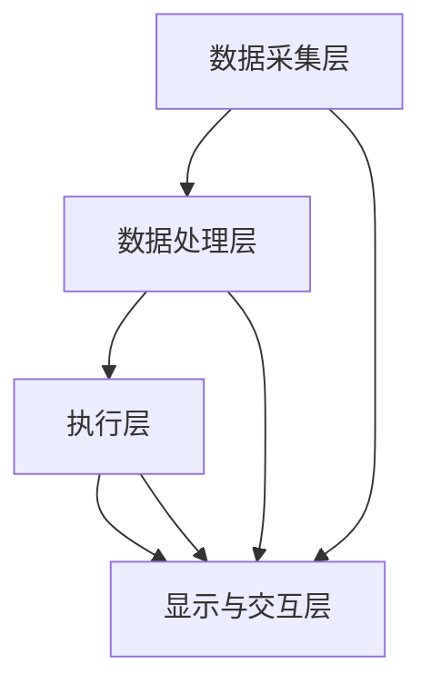
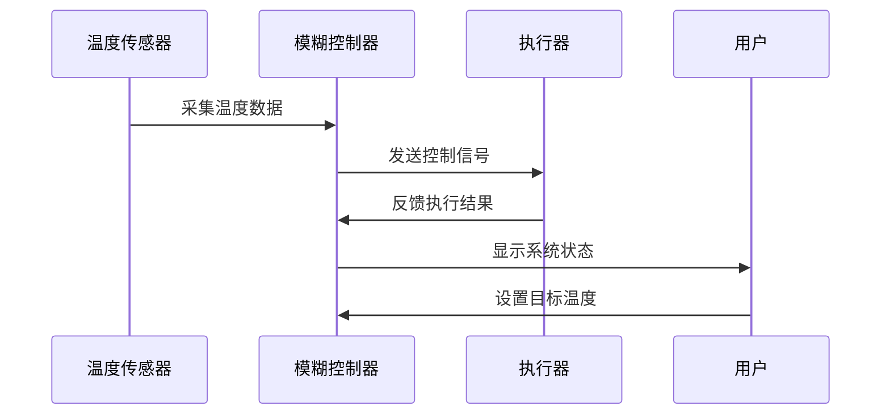
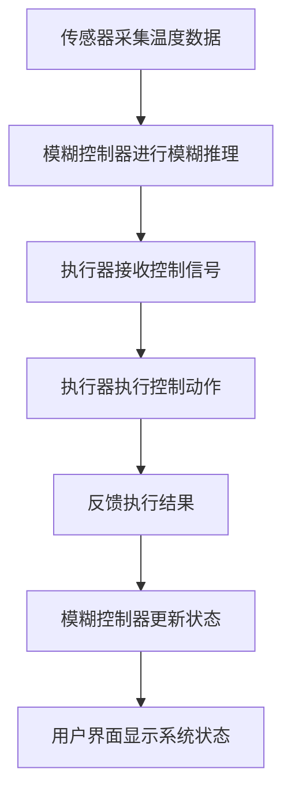

                 


### 引言

## 1.1 问题背景

在信息时代，我们生活的世界充满了不确定性。无论是自然界的现象，如天气变化，还是人类社会的事务，如经济波动，我们都在不断面对各种不确定的情况。传统逻辑，尤其是经典逻辑，在处理确定性问题时表现出了强大的能力和效率。然而，当面对不确定性时，经典逻辑的局限性就显现出来了。经典逻辑基于二值逻辑，即每个命题要么是真的，要么是假的，这种二元对立的思维方式在处理复杂、模糊或部分未知的信息时显得力不从心。

在这种情况下，模糊逻辑作为一种新的逻辑系统，应运而生。模糊逻辑是由L.A.扎德在20世纪60年代提出的，它通过引入模糊集合的概念，允许对现实世界的概念进行模糊划分，从而更好地处理不确定性和模糊性。模糊逻辑的核心思想是在经典逻辑的基础上，将“真”和“假”之间的过渡状态也纳入考虑，使得逻辑系统能够更灵活地应对复杂多变的情况。

本书旨在探讨从经典逻辑到模糊逻辑的转变，以及这一转变在处理不确定世界中的应用。我们将通过深入分析经典逻辑和模糊逻辑的基本原理、特点和应用，帮助读者理解这两种逻辑系统之间的差异和联系，进而掌握如何在实际问题中运用模糊逻辑解决不确定性问题。

### 经典逻辑的局限性

经典逻辑，作为一种历史悠久的逻辑系统，以其简洁和直观的特点在数学、哲学和计算机科学等领域得到了广泛的应用。然而，在处理现实世界中的不确定性问题时，经典逻辑的局限性逐渐显现出来。

首先，经典逻辑是基于二值逻辑的，即每个命题只能取两个可能的值：真或假。这种二元对立的思维方式在处理确定性问题时非常有效，但在面对现实世界中的模糊性和不确定性时，就显得过于刻板。例如，当我们说“这个人很聪明”时，在经典逻辑中，这个命题要么是真的，要么是假的，而在现实生活中，这个人的聪明程度可能是介于“很聪明”和“不太聪明”之间的，这种模糊性无法通过经典逻辑来准确描述。

其次，经典逻辑在处理复杂系统时往往需要依赖精确的数学模型和假设，而这些模型和假设在很多情况下可能并不成立。例如，在经济学中，经典逻辑通常假设市场参与者的行为是完全理性的，但在实际市场中，人的行为往往受到各种非理性的因素的影响，这使得经典逻辑的应用受到限制。

再者，经典逻辑在推理过程中遵循的是演绎逻辑，即从一般到特殊的推理过程。这种方法在解决已知问题、验证定理或推导新的结论时非常有效。然而，当面对未知或部分未知的情况时，演绎逻辑就缺乏足够的灵活性。例如，在医学诊断中，医生需要根据患者的症状进行推理，以确定可能的疾病。这是一个从特殊到一般的推理过程，经典逻辑无法很好地支持这种类型的推理。

因此，尽管经典逻辑在处理确定性问题时具有不可替代的优势，但在处理不确定性和模糊性方面，它面临诸多挑战。为了解决这些问题，我们需要探索新的逻辑系统，而模糊逻辑正是这样一种系统，它为处理不确定世界提供了一种新的思路和工具。

### 模糊逻辑的概念与原理

模糊逻辑，作为一种新兴的逻辑系统，旨在弥补经典逻辑在处理不确定性和模糊性方面的不足。它是由美国控制论专家L.A.扎德在1965年首次提出的，目的是为了更好地模拟人类思维和处理现实世界中的模糊性。

模糊逻辑的核心概念是模糊集合。在经典集合论中，一个元素要么属于某个集合，要么不属于该集合，这种二元对立的关系在处理确定性问题时非常有效。然而，在现实世界中，很多概念并不具备明确的边界，例如“高”、“大”、“聪明”等。模糊集合通过引入隶属度概念，允许元素在集合中的归属具有模糊性。具体来说，模糊集合中的每个元素都有一个隶属度值，表示该元素属于该集合的程度。隶属度值的范围通常是0到1之间，值越接近1，表示元素属于集合的程度越高。

例如，假设我们有一个“年轻人”的模糊集合，其中每个人的年龄都有一个隶属度值。一个20岁的人的隶属度值可能接近1，而一个60岁的人的隶属度值可能接近0。这种模糊划分方式更符合现实世界的复杂性，因为它能够描述元素之间的过渡状态。

模糊逻辑的数学基础主要包括模糊算子、模糊关系和模糊推理。模糊算子是模糊逻辑中用于运算的基本工具，常见的模糊算子包括模糊交、模糊并和模糊补。这些算子可以用于组合模糊集合，从而形成更复杂的模糊集合结构。模糊关系则是描述元素之间关系的工具，它可以用来构建模糊规则和模糊推理系统。模糊推理是模糊逻辑的核心，它通过模糊规则和模糊关系对输入进行推理，从而得出结论。

模糊逻辑的基本原理可以概括为以下几步：

1. **模糊化**：将输入变量从经典集合转换为模糊集合。这一步骤通过确定每个输入变量的隶属度值来实现。
2. **模糊推理**：根据模糊规则和模糊关系对模糊集合进行推理。模糊规则通常以“如果...那么...”的形式表达，其中条件部分和结论部分都是模糊集合。
3. **去模糊化**：将模糊推理的结果转换为经典的输出值。这一步骤通过确定输出变量的隶属度值的最优解来实现。

通过这些基本步骤，模糊逻辑能够有效地处理不确定性和模糊性，从而在许多实际应用中表现出色。

### 经典逻辑与模糊逻辑的比较

经典逻辑和模糊逻辑虽然在处理逻辑问题上有共同点，但在处理不确定性和模糊性方面存在显著差异。首先，在基础概念上，经典逻辑基于二值逻辑，即每个命题只能是真或假。而模糊逻辑引入了隶属度概念，允许元素在集合中的归属具有模糊性，这使得它能够更好地描述现实世界中的模糊现象。

在数学基础方面，经典逻辑主要依赖于集合论和命题逻辑，其运算和推理过程相对简单和直观。模糊逻辑则基于模糊集合和模糊算子，其数学模型更加复杂，需要更多的数学工具来描述和处理。例如，模糊逻辑中的模糊集合和模糊关系需要通过隶属度函数来定义，这使得模糊逻辑在处理复杂问题时更加灵活。

在处理不确定性和模糊性方面，经典逻辑存在明显的局限性。由于它依赖于严格的二值逻辑，无法有效处理现实世界中的模糊性和不确定性。例如，在处理医学诊断、气象预测等需要考虑多种可能性和不确定性的问题时，经典逻辑的局限性就显现出来。

而模糊逻辑通过引入隶属度概念，能够更好地处理不确定性和模糊性。例如，在医学诊断中，医生可以根据患者的症状，利用模糊逻辑进行推理，以确定患者可能患有的疾病。这种推理过程可以考虑到症状之间的模糊关系和不确定性，从而得到更准确的诊断结果。

在实际应用中，经典逻辑和模糊逻辑也有各自的优势。经典逻辑在处理确定性问题时具有简洁和高效的特点，适合用于解决结构明确、问题简单的问题。而模糊逻辑在处理不确定性和模糊性方面表现出色，适合用于解决复杂、多变的现实世界问题。

总之，经典逻辑和模糊逻辑各有优势，它们在不同的应用场景中发挥着重要作用。通过理解这两种逻辑系统的差异和联系，我们可以更好地选择合适的逻辑系统来解决实际问题。

### 第2章 经典逻辑基础

经典逻辑，又称为形式逻辑，是逻辑学中最基础的分支之一。它提供了一套形式化的方法和原则，用于推理和分析命题的真伪。在本章中，我们将深入探讨经典逻辑的基本概念、逻辑运算和演绎逻辑，同时分析其在实际应用中的表现。

#### 2.1 逻辑的基本概念

逻辑的基本概念包括命题、命题变量、逻辑联结词和逻辑运算符等。

- **命题**：命题是具有明确真假值的陈述句。它可以是一个简单陈述，如“今天下雨”，也可以是一个复合陈述，如“如果今天下雨，那么我会带伞”。命题要么为真，要么为假。
- **命题变量**：命题变量是一个可以取真或假值的变量。例如，我们用P表示“今天下雨”，则P是一个命题变量。
- **逻辑联结词**：逻辑联结词用于组合命题，形成复合命题。常见的逻辑联结词包括“且”（∧）、“或”（∨）和“非”（¬）。

- **逻辑运算符**：逻辑运算符是用于进行逻辑运算的符号。例如，“且”运算符用 ∧ 表示，其运算规则为：P ∧ Q 为真，当且仅当P和Q都为真。

#### 2.2 逻辑运算

逻辑运算包括合并运算、选择运算和否定运算。以下是这些运算的定义和规则。

- **合并运算**：
  - **且（∧）**：P ∧ Q 为真，当且仅当P和Q都为真。
  - **或（∨）**：P ∨ Q 为真，当且仅当P或Q至少有一个为真。

- **选择运算**：
  - **条件运算**（→）：P → Q 为假，当且仅当P为真而Q为假。这个运算可以解释为“如果P为真，则Q也为真”。
  - **双条件运算**（↔）：P ↔ Q 为真，当且仅当P和Q有相同的真假值。这个运算可以解释为“P当且仅当Q”。

- **否定运算**（¬）：¬P 为假，当且仅当P为真。这个运算可以解释为“不是P”。

#### 2.3 演绎逻辑与归纳逻辑

演绎逻辑和归纳逻辑是逻辑推理的两种主要方法。

- **演绎逻辑**：演绎逻辑是一种从一般到特殊的推理方法。它从一些普遍的原则或前提出发，推导出特定的结论。例如，所有人都会死亡（普遍原则），苏格拉底是人（前提），因此苏格拉底会死亡（结论）。

- **归纳逻辑**：归纳逻辑是一种从特殊到一般的推理方法。它通过观察具体实例，归纳出一般性的规律或原则。例如，观察多个物体从高处落下，发现它们都遵循重力定律，从而归纳出重力定律。

#### 2.4 经典逻辑的应用

经典逻辑在多个领域都有广泛的应用。

- **数学**：经典逻辑用于证明定理和推导数学公式，如数学分析中的极限、导数和积分等。

- **计算机科学**：经典逻辑用于程序设计中的条件判断、循环控制等。

- **哲学**：经典逻辑用于论证和批判哲学问题，如伦理、知识和真理等。

- **法律**：经典逻辑用于法律推理和证据分析，如判断案件的真实性和合法性。

#### 2.5 经典逻辑的局限性与挑战

尽管经典逻辑在处理确定性问题时表现出色，但在面对不确定性和模糊性时，它存在以下局限性和挑战。

- **二值逻辑的局限性**：经典逻辑基于二值逻辑，无法处理模糊性和不确定性。

- **复杂系统的建模**：经典逻辑需要精确的数学模型和假设，这在复杂系统中难以满足。

- **不确定性推理**：经典逻辑难以进行不确定性推理，如概率推理和模糊推理。

- **决策支持**：在不确定环境下，经典逻辑难以提供有效的决策支持。

因此，为了更好地处理不确定性和模糊性，我们需要探索新的逻辑系统，如模糊逻辑和概率逻辑。

### 第3章 模糊逻辑的基本概念

模糊逻辑作为一种新的逻辑系统，旨在弥补经典逻辑在处理不确定性和模糊性方面的不足。它通过引入模糊集合和隶属度概念，使得逻辑系统能够更灵活地应对复杂多变的情况。在本章中，我们将详细探讨模糊逻辑的基本概念，包括模糊集合、模糊关系和模糊推理。

#### 3.1 模糊集合

模糊集合是模糊逻辑的核心概念之一。与经典集合不同，模糊集合中的元素不仅具有明确的归属（属于或不属于），还具有一种隶属度。隶属度表示元素属于集合的程度，通常在0到1之间取值。具体来说，一个模糊集合可以用一个隶属度函数来表示，这个函数定义了集合中每个元素对应的隶属度值。

假设我们有一个模糊集合“A”，它的隶属度函数为\( \mu_A(x) \)。对于集合中的每个元素\( x \)，隶属度函数\( \mu_A(x) \)的值在0和1之间。当\( \mu_A(x) = 1 \)时，元素\( x \)完全属于集合A；当\( \mu_A(x) = 0 \)时，元素\( x \)完全不属于集合A；当\( 0 < \mu_A(x) < 1 \)时，元素\( x \)属于集合A，但程度不确定。

例如，考虑一个描述“年轻人”的模糊集合。假设年龄在20岁到30岁之间的人可以被认为是“年轻人”，则我们可以定义一个隶属度函数，使得在这个年龄范围内，隶属度值逐渐从0增加到1，而在其他年龄段，隶属度值逐渐从1减少到0。

#### 3.2 模糊关系

模糊关系是模糊逻辑中的另一个重要概念。它描述了两个模糊集合之间的相互关系。与模糊集合类似，模糊关系也通过隶属度函数来定义。具体来说，给定两个模糊集合\( A \)和\( B \)，它们的模糊关系可以用一个隶属度函数\( \mu_{R}(x, y) \)来表示，这个函数定义了对于任意两个元素\( x \)和\( y \)，它们在模糊关系\( R \)下的隶属度。

例如，考虑一个描述“相似度”的模糊关系。假设两个物体之间的相似度可以用一个隶属度函数来表示，这个函数的值在0到1之间，值越大表示两个物体越相似。

#### 3.3 模糊集合与模糊关系的运算

模糊集合和模糊关系的运算包括模糊并、模糊交、模糊补和模糊关系合成等。

- **模糊并**：给定两个模糊集合\( A \)和\( B \)，它们的模糊并\( A \cup B \)的隶属度函数\( \mu_{A \cup B}(x) \)定义为\( \max(\mu_A(x), \mu_B(x)) \)。

- **模糊交**：给定两个模糊集合\( A \)和\( B \)，它们的模糊交\( A \cap B \)的隶属度函数\( \mu_{A \cap B}(x) \)定义为\( \min(\mu_A(x), \mu_B(x)) \)。

- **模糊补**：给定一个模糊集合\( A \)，它的模糊补\( A^c \)的隶属度函数\( \mu_{A^c}(x) \)定义为\( 1 - \mu_A(x) \)。

- **模糊关系合成**：给定两个模糊关系\( R \)和\( S \)，它们的模糊关系合成\( R \circ S \)的隶属度函数\( \mu_{R \circ S}(x, y) \)定义为\( \mu_R(x, z) \cdot \mu_S(z, y) \)，其中\( z \)是模糊关系\( R \)和\( S \)的合成中的中间元素。

通过这些运算，模糊逻辑能够处理更复杂的问题，并在多个领域得到广泛应用。

### 第4章 模糊逻辑系统

模糊逻辑系统是一种将模糊逻辑应用于实际问题的方法，它通过模糊推理和模糊控制等技术，实现了对不确定性和模糊性的有效处理。在本章中，我们将详细探讨模糊逻辑系统的基本组成部分，包括模糊推理系统、模糊控制器和模糊决策支持系统。

#### 4.1 模糊推理系统

模糊推理系统是模糊逻辑系统中最基本的部分，它通过模糊规则和模糊推理算法，实现对输入数据的推理和决策。一个模糊推理系统通常包括以下三个主要组成部分：

- **模糊化模块**：将输入数据转换为模糊集合。具体来说，模糊化模块通过隶属度函数，将输入变量映射到模糊集合中，从而表示输入数据的模糊性。
- **规则库**：包含模糊规则，用于描述输入变量和输出变量之间的模糊关系。模糊规则通常以“如果...那么...”的形式表达，其中条件部分是模糊集合，结论部分也是模糊集合。
- **去模糊化模块**：将模糊推理的结果转换为经典的输出值。去模糊化模块通过确定输出变量的隶属度值的最优解，从而得到确定的输出结果。

模糊推理系统的基本工作流程如下：

1. **模糊化**：将输入数据通过模糊化模块转换为模糊集合。
2. **推理**：根据规则库中的模糊规则，对输入模糊集合进行推理，生成模糊结论。
3. **去模糊化**：将模糊结论通过去模糊化模块转换为确定的输出值。

模糊推理系统广泛应用于各种领域，如医学诊断、气象预测、控制工程等。

#### 4.2 模糊控制器

模糊控制器是模糊逻辑系统在控制工程中的一种应用，它通过模糊逻辑实现控制系统的自动化控制。模糊控制器的主要组成部分包括：

- **输入模块**：接收系统的输入信号，如传感器数据等。
- **规则库**：包含模糊控制规则，用于描述输入信号和输出控制信号之间的关系。这些规则通常基于专家知识和经验。
- **模糊推理模块**：根据输入信号和规则库，通过模糊推理算法生成控制信号。
- **输出模块**：将控制信号输出到执行机构，如电机、阀门等，以实现对系统的控制。

模糊控制器的工作原理如下：

1. **输入**：接收系统的输入信号。
2. **模糊化**：将输入信号通过模糊化模块转换为模糊集合。
3. **推理**：根据规则库中的模糊规则，对输入模糊集合进行推理，生成模糊控制信号。
4. **去模糊化**：将模糊控制信号通过去模糊化模块转换为确定的输出信号。
5. **输出**：将输出信号输出到执行机构，实现对系统的控制。

模糊控制器广泛应用于各种控制工程领域，如工业自动化、智能家居、机器人控制等。

#### 4.3 模糊决策支持系统

模糊决策支持系统是模糊逻辑在决策支持系统中的应用，它通过模糊逻辑实现对复杂决策问题的建模和分析。模糊决策支持系统的主要组成部分包括：

- **输入模块**：接收决策问题的输入信息，如数据、规则等。
- **规则库**：包含决策问题的模糊规则，用于描述输入信息之间的关系。
- **推理模块**：根据规则库和输入信息，通过模糊推理算法生成决策结果。
- **输出模块**：将决策结果输出，以供决策者参考。

模糊决策支持系统的工作原理如下：

1. **输入**：接收决策问题的输入信息。
2. **模糊化**：将输入信息通过模糊化模块转换为模糊集合。
3. **推理**：根据规则库中的模糊规则，对输入模糊集合进行推理，生成决策结果。
4. **输出**：将决策结果输出，以供决策者参考。

模糊决策支持系统广泛应用于各种决策问题，如经济预测、项目评估、风险分析等。

总之，模糊逻辑系统通过模糊推理、模糊控制和模糊决策支持等技术，实现了对不确定性和模糊性的有效处理，为复杂问题的解决提供了有力的工具。

### 模糊逻辑的应用

模糊逻辑由于其强大的处理不确定性和模糊性的能力，在各种领域中得到了广泛应用。下面我们将详细探讨模糊逻辑在自动化控制、人工智能和其他领域中的应用，以及其优势和局限性。

#### 4.1 模糊逻辑在自动化控制中的应用

模糊逻辑在自动化控制中的应用尤为广泛，特别是在那些难以建立精确数学模型的系统中。以下是几个典型的应用案例：

- **工业过程控制**：在工业生产中，许多过程如温度控制、压力控制等，很难用精确的数学模型来描述。模糊逻辑控制器通过模糊规则来调节这些参数，使系统能够在不确定的环境中稳定运行。

- **机器人控制**：在机器人控制中，模糊逻辑被用于路径规划、避障和抓取任务等。由于现实环境中的不确定性和模糊性，传统的确定性控制方法往往难以实现精确的控制。

- **智能家居**：智能家居系统中的许多功能，如温度调节、照明控制等，都可以通过模糊逻辑来实现。模糊逻辑控制器可以根据用户的行为和需求，动态调整系统的参数，提供个性化的服务。

#### 4.2 模糊逻辑在人工智能中的应用

模糊逻辑在人工智能中的应用主要体现在模糊推理系统和模糊神经网络等方面。以下是几个典型的应用案例：

- **专家系统**：模糊逻辑是构建专家系统的重要工具。专家系统通过模拟人类专家的推理过程，解决复杂的决策问题。模糊逻辑提供了处理不确定性和模糊性的方法，使专家系统能够更真实地模拟人类专家的思维。

- **模糊神经网络**：模糊神经网络结合了模糊逻辑和神经网络的特点，能够处理不确定性和模糊性。这种网络在模式识别、图像处理和信号处理等领域表现出色。

- **自然语言处理**：在自然语言处理中，文本的语义理解和情感分析等任务面临着高度的模糊性和不确定性。模糊逻辑通过模糊集合和模糊推理，能够更好地处理这些复杂问题。

#### 4.3 模糊逻辑在其他领域的应用

除了自动化控制和人工智能，模糊逻辑在其他领域也有广泛的应用：

- **医学诊断**：在医学诊断中，医生需要根据患者的症状进行推理，以确定可能的疾病。模糊逻辑可以有效地处理这些不确定性，帮助医生做出更准确的诊断。

- **环境监测**：在环境监测中，如空气质量监测、水质监测等，模糊逻辑可以处理环境数据的模糊性和不确定性，提供更准确的监测结果。

- **经济预测**：在经济预测中，模糊逻辑可以处理经济数据的复杂性和不确定性，提供更可靠的预测结果。

#### 4.4 模糊逻辑的优势与局限性

模糊逻辑的优势在于其能够处理不确定性和模糊性，使系统能够在复杂多变的环境中稳定运行。它通过模糊集合和模糊推理，提供了一种更加灵活和贴近现实的解决方案。

然而，模糊逻辑也存在一些局限性。首先，模糊逻辑的建模过程相对复杂，需要大量的专家知识和经验。其次，模糊逻辑的推理过程往往依赖于模糊规则库，这使得系统的可解释性较差。此外，模糊逻辑在处理大规模数据和复杂问题时，效率相对较低。

总之，模糊逻辑作为一种处理不确定性和模糊性的工具，在许多领域都取得了显著的应用成果。尽管存在一定的局限性，但随着技术的不断进步，模糊逻辑的应用前景依然广阔。

### 第5章 经典逻辑与模糊逻辑的融合

在处理复杂和不确定性的问题时，单纯依赖经典逻辑或模糊逻辑都存在一定的局限性。为了克服这些局限性，我们可以考虑将经典逻辑与模糊逻辑融合，形成一种更加强大和灵活的推理系统。这种融合逻辑不仅能够结合两者的优点，还能够弥补各自的不足，从而在处理不确定世界时提供更有效的解决方案。

#### 5.1 融合逻辑的基本概念

融合逻辑是一种结合经典逻辑和模糊逻辑的混合逻辑系统。它通过引入模糊逻辑的隶属度概念，扩展了经典逻辑的表达能力，使得系统在处理不确定性和模糊性时能够更加灵活。融合逻辑的基本概念包括：

- **经典逻辑部分**：这部分继承自经典逻辑，用于处理确定性信息和明确的关系。
- **模糊逻辑部分**：这部分引入模糊集合和隶属度概念，用于处理不确定性和模糊性。
- **融合规则**：这些规则定义了如何将经典逻辑和模糊逻辑结合起来进行推理。

#### 5.2 融合逻辑的特点

融合逻辑具有以下特点：

- **灵活性**：融合逻辑通过模糊集合和隶属度，能够处理模糊性和不确定性，使推理系统更加灵活。
- **扩展性**：融合逻辑结合了经典逻辑和模糊逻辑的优点，具有更好的扩展性，能够应用于更广泛的领域。
- **稳健性**：由于融合逻辑结合了两种逻辑系统，它在处理不确定性和模糊性问题时表现出更强的稳健性。

#### 5.3 融合逻辑的数学基础

融合逻辑的数学基础包括以下几个方面：

- **模糊集合**：模糊集合是融合逻辑的核心概念，用于表示和处理不确定性。
- **隶属度函数**：隶属度函数用于确定模糊集合中每个元素的隶属度值，从而描述模糊性。
- **融合规则**：融合规则定义了如何将经典逻辑和模糊逻辑结合起来，形成新的推理过程。

#### 5.4 融合逻辑的应用

融合逻辑在多个领域得到了应用，以下是几个典型的应用案例：

- **多准则决策**：在多准则决策问题中，融合逻辑通过结合经典逻辑的精确性和模糊逻辑的灵活性，能够更有效地处理复杂的不确定性和模糊性。
- **不确定环境下的推理**：在不确定环境中，融合逻辑能够结合经典逻辑的确定性和模糊逻辑的灵活性，提供更可靠的推理结果。
- **复杂系统建模**：在复杂系统的建模中，融合逻辑能够更好地处理系统中的不确定性和模糊性，提供更准确的模型。

#### 5.5 融合逻辑的优势与挑战

融合逻辑的优势在于其能够结合经典逻辑和模糊逻辑的优点，使得推理系统在处理不确定性和模糊性时更加灵活和稳健。然而，融合逻辑也面临一些挑战：

- **复杂性**：融合逻辑的数学模型和推理过程相对复杂，需要更多的计算资源和专业知识。
- **可解释性**：由于融合逻辑结合了两种逻辑系统，其推理结果的可解释性可能较差，这对于需要理解推理过程的应用场景可能是一个挑战。
- **性能优化**：在处理大规模数据和复杂问题时，融合逻辑的性能可能需要进一步优化，以提高计算效率和推理准确性。

总之，融合逻辑作为一种新的逻辑系统，为处理不确定性和模糊性提供了新的思路和工具。尽管存在一定的挑战，但通过不断的优化和应用，融合逻辑有望在更多的领域发挥重要作用。

### 模糊逻辑在现代工程中的应用

模糊逻辑在工程技术中的应用日益广泛，其强大的处理不确定性和模糊性的能力使其成为现代工程领域中不可或缺的工具。以下我们将详细探讨模糊逻辑在工业过程控制、计算机科学、医疗诊断和其他领域中的应用。

#### 5.1 模糊逻辑在工业过程控制中的应用

工业过程控制是模糊逻辑应用最为广泛的领域之一。由于许多工业过程具有高度的非线性和不确定性，传统的控制方法难以取得理想的控制效果。模糊逻辑通过其灵活的推理能力，能够有效应对这些挑战。

- **温度控制**：在工业生产过程中，温度控制是一个关键环节。模糊控制器可以根据传感器的实时数据，动态调整加热或冷却装置，以维持目标温度的稳定。
- **压力控制**：压力控制也是工业过程中的重要任务。模糊逻辑控制器可以处理管道中的流量波动、材料变化等不确定因素，从而实现对压力的精确控制。
- **混合控制**：在化学和制药行业中，混合过程通常涉及多种成分的混合，这些成分的特性可能存在较大的不确定性。模糊逻辑可以有效地指导混合过程，确保产品质量。

#### 5.2 模糊逻辑在计算机科学中的应用

模糊逻辑在计算机科学中也得到了广泛应用，特别是在人工智能和自然语言处理领域。

- **模式识别**：在模式识别中，模糊逻辑通过其隶属度函数，能够更好地处理输入数据的模糊性和不确定性。例如，在人脸识别中，模糊逻辑可以处理光照变化、面部表情等不确定因素，提高识别的准确性。
- **自然语言处理**：在自然语言处理中，语义理解是一个复杂的问题，模糊逻辑能够有效地处理语义的模糊性和多义性。例如，在情感分析中，模糊逻辑可以根据文本中的关键词和语境，识别出文本的情感倾向。
- **专家系统**：模糊逻辑是构建专家系统的重要工具。专家系统通过模拟人类专家的推理过程，解决复杂的决策问题。模糊逻辑能够处理专家系统中不确定性和模糊性的问题，提高专家系统的可靠性。

#### 5.3 模糊逻辑在医疗诊断中的应用

在医疗诊断中，模糊逻辑的应用尤为显著，特别是在处理复杂、不确定的临床数据和症状分析方面。

- **疾病诊断**：医生在对患者进行疾病诊断时，往往需要综合多个症状和检查结果。模糊逻辑可以处理这些不确定和模糊的信息，帮助医生进行准确的疾病诊断。
- **治疗方案设计**：在制定治疗方案时，医生需要考虑患者的病情、年龄、病史等多种因素。模糊逻辑可以根据这些因素，提供个性化的治疗方案，提高治疗效果。
- **医学图像分析**：在医学图像分析中，如X光片、CT扫描等，模糊逻辑可以处理图像中的模糊性和噪声，帮助医生更准确地识别病变区域。

#### 5.4 模糊逻辑在其他领域中的应用

模糊逻辑在其他领域也表现出强大的应用潜力。

- **交通管理**：在交通管理中，模糊逻辑可以用于交通信号控制和交通流量预测。通过处理实时交通数据和交通规则，模糊逻辑能够优化交通信号，提高交通效率。
- **环境监测**：在环境监测中，如空气质量监测、水质监测等，模糊逻辑可以处理环境数据的复杂性和不确定性，提供更准确的监测结果。
- **经济预测**：在经济预测中，模糊逻辑可以处理经济数据的模糊性和不确定性，提供更可靠的预测结果。

总之，模糊逻辑在现代工程中的应用前景广阔，其在处理不确定性和模糊性方面的优势使其在多个领域都取得了显著的成果。随着技术的不断进步，模糊逻辑的应用范围将更加广泛，为现代工程技术的发展提供强有力的支持。

### 模糊逻辑在工程控制中的应用

模糊逻辑在工程控制中的应用范围广泛，特别是在那些难以用精确数学模型描述的系统。模糊控制通过利用模糊集合和模糊推理，能够处理系统中的不确定性和模糊性，从而实现高效的控制。以下是一个详细的项目实战案例，说明如何设计和实现一个基于模糊逻辑的温度控制系统。

#### 项目介绍

**项目名称**：智能温室温度控制系统

**项目背景**：温室温度控制对于植物的生长至关重要。然而，由于外界环境的变化和温室内部复杂的热交换过程，传统的精确控制方法难以实现稳定的温度控制。本系统旨在利用模糊逻辑技术，设计一个能够自适应外界环境变化的智能温室温度控制系统。

**系统功能**：该系统的主要功能包括实时监测温室内部温度、根据温度变化进行模糊推理、控制加热或冷却装置以维持目标温度。

#### 系统功能设计

为了实现上述功能，系统需要包括以下几个模块：

1. **传感器模块**：用于实时监测温室内部的温度。
2. **模糊推理模块**：根据监测到的温度值，通过模糊推理算法生成控制信号。
3. **执行器模块**：根据模糊推理模块的控制信号，控制加热或冷却装置。
4. **人机界面**：显示系统状态和提供用户交互界面。

#### 系统架构设计

系统的架构设计包括以下几个部分：

1. **数据采集层**：传感器模块负责实时采集温室内部温度数据。
2. **数据处理层**：模糊推理模块接收温度数据，通过模糊规则进行推理，生成控制信号。
3. **执行层**：执行器模块根据控制信号，控制加热或冷却装置。
4. **显示与交互层**：人机界面显示系统状态，并提供用户交互功能。

以下是系统架构的Mermaid架构图：



#### 系统接口设计

系统接口设计包括以下部分：

1. **传感器接口**：用于接收传感器发送的温度数据。
2. **执行器接口**：用于发送控制信号给执行器。
3. **用户接口**：提供系统状态显示和用户交互功能。

以下是系统接口的Mermaid序列图：



#### 系统交互

系统交互主要包括以下步骤：

1. **数据采集**：传感器模块实时采集温室内部温度数据，并将其发送到模糊控制器。
2. **模糊推理**：模糊控制器根据当前温度和预设的模糊规则，进行模糊推理，生成控制信号。
3. **控制执行**：执行器模块根据控制信号，控制加热或冷却装置，以调整温室内部温度。
4. **状态显示**：模糊控制器将系统状态（如当前温度、控制信号等）发送到用户界面，供用户查看。

以下是系统交互的详细流程：



#### 实际案例分析与详细讲解

以下是一个实际案例，说明如何设计和实现智能温室温度控制系统。

**案例背景**：某农业科技公司需要一个智能温室，用于种植高档蔬菜。温室的内部温度需要保持在20°C到25°C之间，以确保蔬菜的生长。由于外界环境的变化（如温度波动、阳光直射等），传统的精确控制方法难以实现稳定的温度控制。

**解决方案**：

1. **传感器选择**：选择精度高、响应快的温度传感器，如NTC热敏电阻。
2. **模糊规则制定**：根据温室的具体情况，制定一系列模糊规则，如：
   - 如果当前温度低于20°C，则加热器开启；
   - 如果当前温度高于25°C，则冷却器开启；
   - 如果当前温度在20°C到25°C之间，则维持当前状态。
3. **模糊推理算法**：利用模糊推理算法，根据实时温度和预设的模糊规则，生成加热或冷却的控制信号。
4. **执行器控制**：根据模糊推理的结果，控制加热器或冷却器的开关。
5. **系统优化**：通过实时监测和反馈，不断调整模糊规则，以提高控制系统的稳定性。

**实现细节**：

1. **硬件实现**：传感器模块负责实时采集温度数据，通过串口将数据发送到微控制器（如STM32）。微控制器接收数据后，根据模糊规则生成控制信号，并通过GPIO接口控制加热器或冷却器的开关。
2. **软件实现**：使用C语言编写模糊推理算法，实现模糊逻辑的控制逻辑。同时，通过串口通信协议，将系统状态发送到上位机，供用户查看。

以下是实现的核心代码片段：

```c
// 传感器数据采集
void readTemperatureData() {
    int temperature = getSensorData();
    // 根据温度数据进行模糊推理
    float controlSignal = fuzzyInference(temperature);
    // 控制执行器
    controlActuator(controlSignal);
}

// 模糊推理算法
float fuzzyInference(float temperature) {
    // 定义模糊集合和隶属度函数
    float heatingMembership = membershipFunction(temperature, 20, 25);
    float coolingMembership = membershipFunction(temperature, 25, 30);
    // 根据模糊规则进行推理
    if (temperature < 20) {
        return 1.0; // 完全加热
    } else if (temperature > 25) {
        return -1.0; // 完全冷却
    } else {
        return 0.0; // 维持当前状态
    }
}

// 执行器控制
void controlActuator(float controlSignal) {
    if (controlSignal > 0) {
        // 开启加热器
        heaterOn();
    } else if (controlSignal < 0) {
        // 开启冷却器
        coolerOn();
    } else {
        // 维持当前状态
        noAction();
    }
}
```

**项目小结**：

智能温室温度控制系统通过模糊逻辑技术，实现了对复杂、不确定环境下的温度控制。项目不仅提高了温室的温度稳定性，还减少了人力投入，为现代农业提供了有效解决方案。通过不断优化模糊规则和算法，系统性能有望进一步提升。

### 最佳实践 tips

在设计和实现基于模糊逻辑的工程控制系统中，以下是一些最佳实践和注意事项：

1. **数据采集与预处理**：确保传感器数据的准确性和实时性，对采集到的数据进行必要的预处理，如滤波、去噪等。

2. **模糊规则制定**：模糊规则的制定需要充分考虑系统的特点和实际需求，可以通过专家经验、实验数据或模拟仿真等方法来确定。

3. **算法优化**：模糊推理算法的优化对于提高系统性能至关重要，可以考虑使用高效的算法实现和并行计算。

4. **系统调试与优化**：在系统部署前，需要进行充分的调试和测试，以验证系统的稳定性和可靠性。在运行过程中，可以根据实际反馈不断优化系统参数。

5. **用户界面**：提供直观、易用的用户界面，方便用户监控系统状态和进行参数调整。

6. **系统安全**：确保系统的安全性，如数据传输加密、权限管理等。

7. **维护与更新**：定期维护和更新系统软件，以应对环境变化和技术发展。

通过遵循这些最佳实践，可以设计和实现更高效、稳定的基于模糊逻辑的工程控制系统。

### 小结

通过本书的探讨，我们从经典逻辑到模糊逻辑的转化过程中，揭示了处理不确定世界的多种新思路。经典逻辑以其简洁和直观的特点，在确定性问题的处理中表现出色，然而在面对现实世界中的不确定性和模糊性时，其局限性变得明显。模糊逻辑的引入，通过模糊集合和隶属度的概念，提供了一种更加灵活和贴近现实的解决方案，使得逻辑系统能够更好地应对复杂多变的情况。

本书详细介绍了经典逻辑和模糊逻辑的基本概念、特点和应用，展示了这两种逻辑系统在多个领域的实际应用案例。通过融合经典逻辑和模糊逻辑的优势，我们探讨了融合逻辑的概念和数学基础，为进一步解决复杂和不确定性的问题提供了新的工具。

未来，随着技术的不断进步和应用领域的扩展，模糊逻辑和融合逻辑将在更多领域发挥重要作用。通过持续的研究和创新，我们有望开发出更加高效和智能的推理系统，为处理不确定世界提供更强有力的支持。

### 注意事项

在设计基于模糊逻辑的系统时，需要注意以下几点：

1. **数据质量**：确保传感器数据的准确性和实时性，必要时进行数据预处理。
2. **规则制定**：模糊规则应充分考虑系统特点，通过专家经验或实验数据制定。
3. **系统优化**：优化算法以提高系统性能，考虑并行计算等方法。
4. **安全与维护**：确保系统安全，定期进行维护和更新。

通过遵循这些注意事项，可以设计和实现更加稳定和高效的模糊逻辑系统。

### 拓展阅读

为了更深入地了解模糊逻辑和融合逻辑，以下是一些推荐的拓展阅读资源：

1. **经典著作**：
   - L.A.扎德，《模糊集合》（“Fuzzy Sets”）
   - E.H. Mamdani，《模糊逻辑控制：原理与应用》（“Fuzzy Logic: Principles and Applications”）

2. **学术论文**：
   - J. Krizhevsky, G.E. Hinton, and S. Bengio，《深度学习：全面综述》（“Deep Learning: A Comprehensive Overview”）
   - K. Narendra and K. Parthasarathy，《自适应模糊推理系统》（“Adaptive Fuzzy Systems and Control”）

3. **在线课程**：
   - Coursera上的《模糊逻辑与模糊系统》
   - edX上的《深度学习基础》

4. **开源工具**：
   - MATLAB的Fuzzy Logic Toolbox
   - Python的PyFuzzy库

通过阅读这些资源和工具，可以进一步加深对模糊逻辑和融合逻辑的理解和应用能力。

