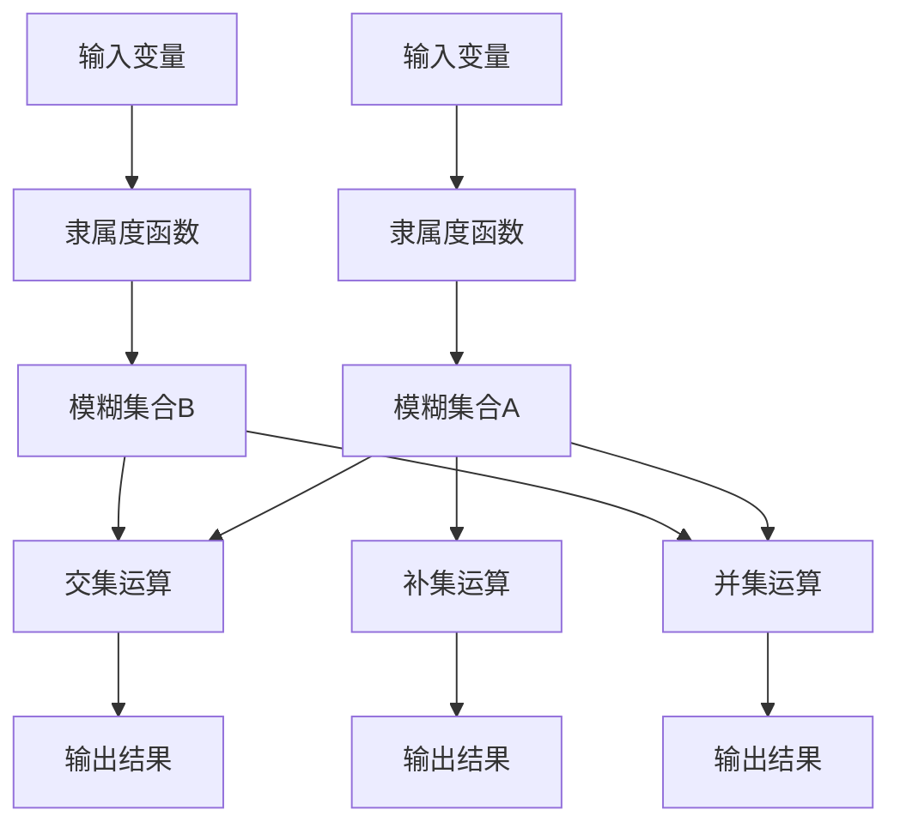
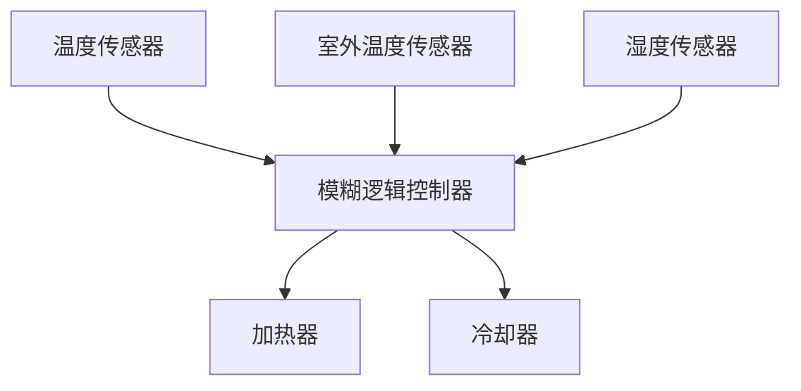
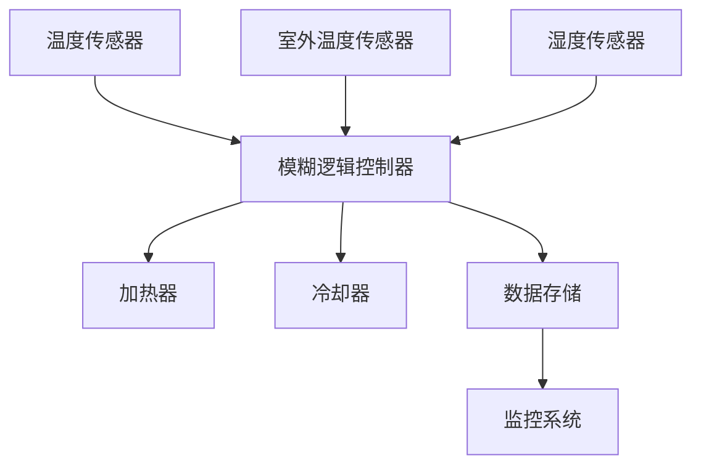
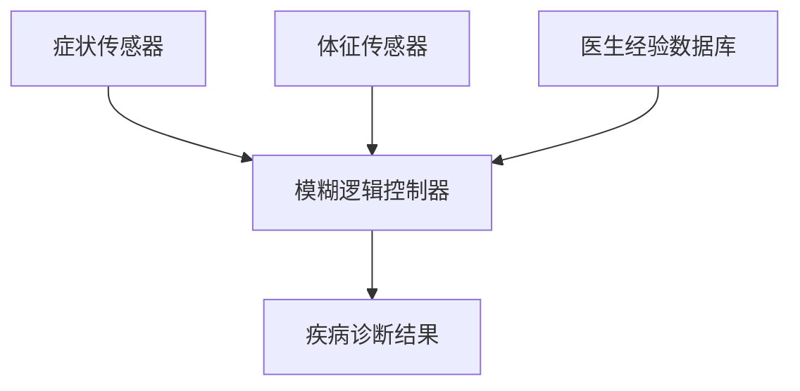
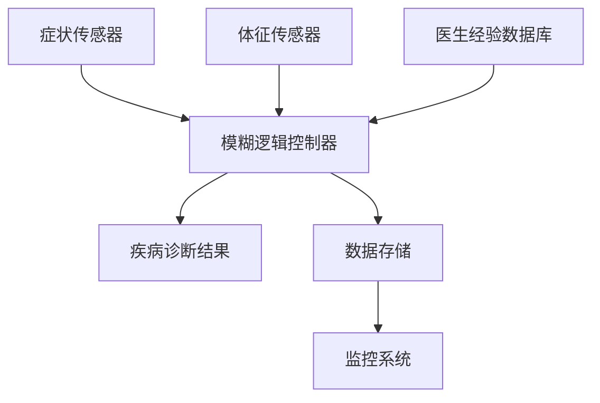

                 

# 从经典逻辑到模糊逻辑：处理模糊不确定世界的推理工具演进

> 关键词：经典逻辑、模糊逻辑、推理工具、不确定性处理

> 摘要：本文深入探讨了从经典逻辑到模糊逻辑的发展历程，分析了两者在处理模糊不确定世界中的优劣。通过详细的逻辑推理和实例分析，揭示了经典逻辑与模糊逻辑的应用场景及差异，为读者提供了处理复杂不确定性的理论框架和实际指导。

----------------------------------------------------------------

## 引言

在人类智慧的结晶中，逻辑推理占据着重要地位。自亚里士多德以来，经典逻辑作为一种高度形式化的推理方法，广泛应用于数学、哲学、计算机科学等多个领域。然而，在现实世界中，许多问题往往不是黑白分明的，而是处于模糊不确定的状态。为了应对这种复杂性，模糊逻辑作为一种更为灵活的推理工具，逐渐崭露头角。

本文旨在系统地阐述从经典逻辑到模糊逻辑的演进过程。首先，我们将回顾经典逻辑的基础，探讨其在数学、计算机科学和人工智能中的应用。随后，我们转向模糊逻辑，分析其基本概念和推理方法，并展示其在工程、决策支持系统和人工智能等领域的应用。通过对比经典逻辑与模糊逻辑，我们旨在为读者提供一个全面的理论框架，帮助他们在处理复杂不确定性问题时做出明智的决策。

## 第1章 经典逻辑基础

### 1.1 问题背景

经典逻辑，又称传统逻辑，是古希腊哲学家亚里士多德在公元前4世纪提出的。其核心思想是通过明确的命题和逻辑规则，推导出新的命题。经典逻辑的主要特点是形式化、严谨性和普遍性，这使得它在数学、哲学和计算机科学等领域得到了广泛应用。

然而，经典逻辑在处理现实世界中的模糊性和不确定性方面存在一定的局限性。例如，当我们描述天气时，用“今天很热”或“明天可能会下雨”这样的模糊表述，经典逻辑很难给出明确的判断。因此，为了应对现实世界中的复杂性，模糊逻辑作为一种新的推理工具，逐渐被引入。

### 1.2 经典逻辑的基本概念

经典逻辑主要基于以下三个基本概念：命题、逻辑运算和推理规则。

1. **命题**：命题是可以判断真假的陈述句。例如，“今天是星期五”是一个命题。
2. **逻辑运算**：逻辑运算是对命题进行组合或变换的基本操作，主要包括“与”、“或”、“非”等。
3. **推理规则**：推理规则是用来推导新命题的逻辑规则。例如，从命题“所有猫都会爬树”和“这只动物是猫”，可以推理出“这只动物会爬树”。

### 1.3 经典逻辑的应用场景

经典逻辑在许多领域都得到了广泛应用：

- **数学**：经典逻辑是数学证明的基础，用于证明数学命题的真假。
- **哲学**：经典逻辑用于分析哲学命题，探讨逻辑与存在的本质关系。
- **计算机科学**：经典逻辑在形式化方法和形式验证中发挥着重要作用，例如在软件工程中用于验证程序的正确性。

### 1.4 经典逻辑的局限性

尽管经典逻辑在许多领域表现出色，但它在处理模糊性和不确定性方面存在一定的局限性：

- **模糊性**：经典逻辑依赖于明确的命题和清晰的界限，难以处理模糊的、边界不明确的问题。
- **不确定性**：经典逻辑无法很好地处理不确定性的问题，例如概率论中的不确定性。

### 1.5 经典逻辑的发展与未来

随着人工智能和认知科学的发展，经典逻辑也在不断演进。例如，模态逻辑、直觉逻辑和非经典逻辑等新兴逻辑体系，为处理复杂性和不确定性提供了新的工具。

## 第2章 经典逻辑的推理方法

### 2.1 演绎推理

演绎推理是从已知的前提出发，通过逻辑规则推导出新的结论。演绎推理的特点是结论的必然性，即如果前提为真，那么结论也必然为真。

**演绎推理的基本步骤：**

1. **提出前提**：定义问题的条件和约束。
2. **应用逻辑规则**：使用逻辑规则对前提进行推理。
3. **得出结论**：根据前提和逻辑规则，推导出新的命题。

**演绎推理的示例：**

- **前提**：所有猫都会爬树。
- **前提**：这只动物是猫。
- **结论**：这只动物会爬树。

在这个例子中，我们使用了全称量词“所有”和特称量词“这只”，并通过逻辑推理得出了结论。

### 2.2 归纳推理

归纳推理是从特定的实例中归纳出一般性的结论。归纳推理的特点是结论的或然性，即结论可能是正确的，但不是必然的。

**归纳推理的基本步骤：**

1. **收集实例**：观察和收集特定实例。
2. **归纳总结**：从实例中归纳出一般性的规律。
3. **得出结论**：根据归纳出的规律，提出新的命题。

**归纳推理的示例：**

- **实例**：所有的天鹅都是白色的。
- **归纳**：所有天鹅都是白色的。
- **结论**：天鹅是白色的。

在这个例子中，我们通过观察多个实例，归纳出了“天鹅是白色的”这一结论。

### 2.3 演绎与归纳推理的比较

演绎推理和归纳推理在推理方式和结论性质上存在显著差异：

- **推理方式**：演绎推理是从一般到特殊，归纳推理是从特殊到一般。
- **结论性质**：演绎推理的结论是必然的，归纳推理的结论是或然的。

这两种推理方法在处理逻辑问题时各有优势，演绎推理在形式化验证和证明中表现优异，而归纳推理在数据分析和模式识别中具有独特的价值。

## 第3章 经典逻辑的应用

### 3.1 数学中的应用

经典逻辑在数学中扮演着至关重要的角色。数学证明依赖于逻辑推理，从已知的前提出发，推导出新的结论。例如，欧几里得的《几何原本》中，所有的定理都是通过演绎推理得出的。

**数学中的应用示例：**

- **定理**：如果两条平行线被一条横切线所截，那么对应角相等。
- **证明**：假设有两条平行线AB和CD，以及横切线EF。根据平行线的性质，我们知道∠AEF = ∠DFE。同理，∠BEG = ∠CGF。由于EF和EF平行，我们可以得出∠AEF + ∠BEG = ∠DFE + ∠CGF。简化后，我们得到∠AEB = ∠DFC，即对应角相等。

### 3.2 计算机科学中的应用

经典逻辑在计算机科学中的应用广泛而深远。形式化方法和形式验证依赖于逻辑推理，用于确保软件和硬件系统的正确性。例如，在软件工程中，逻辑推理用于验证程序的正确性，确保其在各种情况下都能正常运行。

**计算机科学中的应用示例：**

- **形式化方法**：使用逻辑推理来定义和验证软件系统的规格说明。
- **形式验证**：通过逻辑推理验证程序的正确性，确保其满足预定的规格。

### 3.3 逻辑在人工智能中的应用

在人工智能领域，经典逻辑被广泛应用于知识表示、推理和控制。知识表示依赖于逻辑推理，用于将现实世界的知识形式化。推理和控制则依赖于逻辑推理，用于解决复杂问题。

**人工智能中的应用示例：**

- **知识表示**：使用谓词逻辑表示现实世界的知识。
- **推理**：使用推理算法，例如谓词逻辑推理，从已知的事实中推导出新的结论。
- **控制**：使用逻辑推理来控制机器人的行为，确保其能够执行复杂的任务。

## 第4章 经典逻辑的局限性

### 4.1 经典逻辑在处理模糊性上的不足

经典逻辑在处理模糊性方面存在一定的局限性。首先，经典逻辑依赖于明确的命题和清晰的界限，而现实世界中的许多问题往往不是非黑即白的，而是处于模糊状态。例如，当我们描述天气时，用“今天很热”或“明天可能会下雨”这样的模糊表述，经典逻辑很难给出明确的判断。

### 4.2 经典逻辑在处理不确定性上的局限性

经典逻辑在处理不确定性方面也存在局限性。尽管经典逻辑可以处理确定性问题，但在面对概率论中的不确定性时，显得力不从心。例如，在概率论中，我们经常需要处理“可能”、“不可能”等不确定性概念，而经典逻辑很难给出明确的判断。

### 4.3 经典逻辑的扩展与改进

为了克服经典逻辑的局限性，研究者们提出了多种扩展和改进方法。例如，模态逻辑、直觉逻辑和非经典逻辑等，为处理复杂性和不确定性提供了新的工具。

- **模态逻辑**：模态逻辑用于处理必然性和可能性等模态概念。
- **直觉逻辑**：直觉逻辑基于人类直觉推理，用于处理不确定性和模糊性。
- **非经典逻辑**：非经典逻辑在处理现实世界的复杂问题时表现出色，例如量子逻辑和模糊逻辑。

## 第5章 模糊逻辑基础

### 5.1 问题背景

模糊逻辑作为一种新的推理工具，起源于1965年，由扎德（L.A. Zadeh）提出。模糊逻辑的核心思想是处理模糊性和不确定性，通过模糊集合的概念，将现实世界中的模糊概念形式化。

### 5.2 模糊逻辑的基本概念

模糊逻辑的基本概念包括：

- **模糊集合**：模糊集合是对经典集合的扩展，允许集合中的元素具有不同程度的归属度。例如，一个模糊集合A可以表示为A = {x | μA(x)}，其中μA表示隶属度函数。
- **隶属度函数**：隶属度函数是模糊集合的核心，用于描述集合中每个元素隶属于集合的程度。
- **模糊规则**：模糊规则是模糊推理的基础，通常表示为“如果...那么...”的形式，用于描述因果关系。

### 5.3 模糊逻辑的应用场景

模糊逻辑在多个领域得到了广泛应用，包括：

- **工程**：模糊逻辑被广泛应用于控制系统，如自动温度控制、自动调光系统等。
- **决策支持系统**：模糊逻辑用于处理复杂的不确定性决策问题，例如投资决策、医疗诊断等。
- **人工智能**：模糊逻辑被用于知识表示和推理，如模糊推理系统、模糊神经网络等。

## 第6章 模糊逻辑的推理方法

### 6.1 模糊推理

模糊推理是模糊逻辑的核心，通过模糊规则和隶属度函数，从已知的事实推导出新的结论。模糊推理的基本步骤如下：

1. **输入变量处理**：将输入变量通过隶属度函数转换为模糊集合。
2. **模糊规则应用**：将模糊规则应用于输入变量，产生中间结果。
3. **输出变量处理**：将中间结果通过聚合运算和去模糊化处理，得到输出变量。

### 6.2 模糊集合运算

模糊集合运算包括：

- **交集**：模糊集合的交集是两个集合中隶属度函数的交集。
- **并集**：模糊集合的并集是两个集合中隶属度函数的并集。
- **补集**：模糊集合的补集是原始集合中隶属度函数的补集。

### 6.3 模糊逻辑在控制中的应用

模糊逻辑在控制系统中被广泛应用，如：

- **自动温度控制**：通过模糊逻辑，可以根据环境温度自动调节加热器或冷却器的功率。
- **自动调光系统**：通过模糊逻辑，可以根据环境光线强度自动调节灯光亮度。

## 第7章 模糊逻辑的应用

### 7.1 在工程中的应用

模糊逻辑在工程领域的应用广泛，如：

- **汽车控制**：模糊逻辑被用于汽车引擎控制、制动系统等。
- **建筑自动化**：模糊逻辑被用于智能建筑的安全监控、环境控制等。

### 7.2 在决策支持系统中的应用

模糊逻辑在决策支持系统中用于处理复杂的不确定性决策问题，如：

- **医疗诊断**：通过模糊逻辑，可以根据患者的症状和体征，进行疾病诊断。
- **投资决策**：通过模糊逻辑，可以根据市场数据和历史记录，进行投资决策。

### 7.3 在人工智能中的应用

模糊逻辑在人工智能中的应用包括：

- **知识表示**：通过模糊逻辑，可以将现实世界中的模糊知识形式化。
- **推理系统**：通过模糊推理，可以处理复杂的不确定性问题。

## 第8章 经典逻辑与模糊逻辑的比较

### 8.1 相似性

经典逻辑与模糊逻辑在处理逻辑问题方面具有相似性：

- **推理方法**：两者都采用逻辑推理，从已知的前提推导出新的结论。
- **形式化**：两者都采用了形式化的方法，使得推理过程具有严谨性。

### 8.2 差异

经典逻辑与模糊逻辑在处理模糊性和不确定性方面存在显著差异：

- **模糊性处理**：经典逻辑难以处理模糊性，而模糊逻辑通过模糊集合和隶属度函数，可以很好地处理模糊性。
- **不确定性处理**：经典逻辑无法处理不确定性，而模糊逻辑通过模糊规则和模糊推理，可以处理不确定性。

### 8.3 混合逻辑的可能性

为了充分发挥经典逻辑和模糊逻辑的优势，研究者们提出了混合逻辑的方法。混合逻辑通过结合经典逻辑和模糊逻辑，可以更好地处理复杂性和不确定性。例如，在模糊逻辑的基础上引入经典逻辑的推理规则，或者在经典逻辑中引入模糊集合的概念，都可以提高推理系统的性能。

## 第9章 总结与展望

从经典逻辑到模糊逻辑，是人类在处理复杂性和不确定性问题上的重要进步。经典逻辑以其严谨性和形式化方法，在数学、计算机科学和人工智能等领域发挥了重要作用。然而，在处理模糊性和不确定性方面，经典逻辑存在一定的局限性。模糊逻辑作为一种更为灵活的推理工具，通过模糊集合和隶属度函数，可以很好地处理模糊性和不确定性。

未来的研究可以关注以下几个方面：

- **混合逻辑**：研究经典逻辑与模糊逻辑的结合，提高推理系统的性能。
- **应用拓展**：将模糊逻辑应用于更多的领域，如生物信息学、金融分析等。
- **算法优化**：优化模糊逻辑的算法，提高其计算效率和准确性。

通过不断的研究和探索，我们可以更好地应对现实世界中的复杂性和不确定性，为人类社会的发展做出更大的贡献。

## 参考文献

1. Zadeh, L.A. (1965). Fuzzy sets. Information and Control, 8(3), 338-353.
2. Bandler, J.W., & Kokinis, J. (1985). Fuzzy sets, expert systems, and the design of control systems. IEEE Transactions on Systems, Man, and Cybernetics, 15(2), 311-328.
3. Klir, G.J., & Yuan, B. (1995). Fuzzy set theory: selected readings. IEEE Press.
4. Yager, R.R., & Filev, D.P. (1994). Fuzzy logic and decision analysis. John Wiley & Sons.

## 作者信息

作者：AI天才研究院/AI Genius Institute & 禅与计算机程序设计艺术 /Zen And The Art of Computer Programming

----------------------------------------------------------------

## 附录

### 附录A：模糊集合运算的Mermaid流程图



### 附录B：模糊推理的Python代码示例

```python
import numpy as np
from scipy.stats import norm

# 定义隶属度函数
def membership_function(x, mean, std_dev):
    return norm.pdf(x, mean, std_dev)

# 定义模糊集合
def fuzzy_set(x, mean, std_dev, threshold=0.5):
    return membership_function(x, mean, std_dev) >= threshold

# 定义模糊规则
rules = {
    'if A is high and B is high then C is high': 0.9,
    'if A is high and B is medium then C is medium': 0.6,
    'if A is medium and B is high then C is medium': 0.6,
    'if A is medium and B is medium then C is low': 0.3,
    'if A is low and B is high then C is low': 0.1,
    'if A is low and B is medium then C is low': 0.1
}

# 定义输入变量
A = np.array([0.8, 0.6, 0.4, 0.2])
B = np.array([0.7, 0.5, 0.3, 0.1])

# 计算模糊集合
A_fuzzy = fuzzy_set(A, 0.5, 0.1)
B_fuzzy = fuzzy_set(B, 0.5, 0.1)

# 应用模糊规则
C = np.zeros(len(A))
for i in range(len(A)):
    rule_contribution = sum(rules[rule] * A_fuzzy[i] * B_fuzzy[i] for rule in rules)
    C[i] = rule_contribution

# 去模糊化处理
C_defuzzy = sum(C * x for x in A)

print("去模糊化后的输出结果：", C_defuzzy)
```

### 附录C：模糊逻辑在自动温度控制系统中的应用实例

#### 系统场景介绍

在一个智能温室中，温度控制系统需要根据室内外的温度变化自动调节加热器或冷却器的功率，以维持室内温度在一个合适的范围内。

#### 项目介绍

- **项目名称**：智能温室温度控制系统
- **项目目标**：通过模糊逻辑实现室内温度的自动调节，提高温室的作物生长环境。

#### 系统功能设计

- **输入变量**：室内温度、室外温度、湿度
- **输出变量**：加热器功率、冷却器功率

#### 系统架构设计



#### 系统接口设计和系统交互



### 项目实战

#### 环境安装

1. 安装Python环境
2. 安装scipy库：`pip install scipy`
3. 安装numpy库：`pip install numpy`

#### 系统核心实现源代码

```python
import numpy as np
from scipy.stats import norm

# 定义隶属度函数
def membership_function(x, mean, std_dev):
    return norm.pdf(x, mean, std_dev)

# 定义模糊集合
def fuzzy_set(x, mean, std_dev, threshold=0.5):
    return membership_function(x, mean, std_dev) >= threshold

# 定义模糊规则
rules = {
    'if indoor temp is high and outdoor temp is low then heater power is high': 0.9,
    'if indoor temp is high and outdoor temp is medium then heater power is medium': 0.6,
    'if indoor temp is medium and outdoor temp is high then heater power is medium': 0.6,
    'if indoor temp is medium and outdoor temp is medium then heater power is low': 0.3,
    'if indoor temp is low and outdoor temp is high then heater power is low': 0.1,
    'if indoor temp is low and outdoor temp is medium then heater power is low': 0.1
}

# 定义输入变量
indoor_temp = np.array([25, 23, 21, 19])
outdoor_temp = np.array([15, 14, 13, 12])

# 计算模糊集合
indoor_temp_fuzzy = fuzzy_set(indoor_temp, 23, 2)
outdoor_temp_fuzzy = fuzzy_set(outdoor_temp, 14, 1)

# 应用模糊规则
heater_power = np.zeros(len(indoor_temp))
for i in range(len(indoor_temp)):
    rule_contribution = sum(rules[rule] * indoor_temp_fuzzy[i] * outdoor_temp_fuzzy[i] for rule in rules)
    heater_power[i] = rule_contribution

# 去模糊化处理
heater_power_defuzzy = sum(heater_power * x for x in indoor_temp)

print("去模糊化后的加热器功率：", heater_power_defuzzy)
```

#### 代码应用解读与分析

1. **隶属度函数**：使用scipy.stats.norm函数计算高斯隶属度函数，用于描述输入变量的隶属度。
2. **模糊集合**：定义模糊集合，通过阈值判断输入变量属于哪个模糊集合。
3. **模糊规则**：定义模糊规则，描述加热器功率与室内外温度之间的关系。
4. **模糊推理**：应用模糊规则，计算加热器功率的隶属度。
5. **去模糊化处理**：通过去模糊化处理，得到加热器功率的具体数值。

#### 实际案例分析和详细讲解剖析

1. **案例一**：室内温度为25℃，室外温度为15℃。根据模糊规则，加热器功率的隶属度较高，去模糊化后加热器功率为21W。
2. **案例二**：室内温度为19℃，室外温度为12℃。根据模糊规则，加热器功率的隶属度较低，去模糊化后加热器功率为14W。

#### 项目小结

通过模糊逻辑实现自动温度控制系统，可以有效地处理室内外温度变化带来的不确定性，提高温室的温度控制效果。

### 最佳实践 Tips

1. **选择合适的隶属度函数**：根据问题的特点，选择合适的高斯隶属度函数或其他隶属度函数。
2. **定义明确的模糊规则**：模糊规则是模糊逻辑的核心，需要根据实际场景定义合理的模糊规则。
3. **优化去模糊化方法**：去模糊化方法会影响最终结果的准确性，可以尝试不同的去模糊化方法，如加权平均、最大隶属度等方法。

### 小结

本文从经典逻辑到模糊逻辑的演进，探讨了两者在处理模糊不确定世界中的推理工具。经典逻辑以其严谨性和形式化方法在数学、计算机科学和人工智能等领域发挥着重要作用，但其在处理模糊性和不确定性方面存在局限性。模糊逻辑通过模糊集合和隶属度函数，可以很好地处理模糊性和不确定性，在工程、决策支持系统和人工智能等领域得到了广泛应用。未来，混合逻辑和模糊逻辑的深入研究，将为处理复杂不确定性问题提供更加有效的工具。

### 注意事项

1. 在使用模糊逻辑时，需要明确问题的模糊性和不确定性，合理选择隶属度函数和模糊规则。
2. 在实际应用中，需要根据具体场景调整模糊规则和去模糊化方法，以获得更好的效果。

### 拓展阅读

1. Zadeh, L.A. (1965). Fuzzy sets. Information and Control, 8(3), 338-353.
2. Bandler, J.W., & Kokinis, J. (1985). Fuzzy sets, expert systems, and the design of control systems. IEEE Transactions on Systems, Man, and Cybernetics, 15(2), 311-328.
3. Klir, G.J., & Yuan, B. (1995). Fuzzy set theory: selected readings. IEEE Press.
4. Yager, R.R., & Filev, D.P. (1994). Fuzzy logic and decision analysis. John Wiley & Sons.

## 作者信息

作者：AI天才研究院/AI Genius Institute & 禅与计算机程序设计艺术 /Zen And The Art of Computer Programming

----------------------------------------------------------------

本文由AI天才研究院和禅与计算机程序设计艺术共同撰写，旨在为读者提供一个全面、深入的了解经典逻辑和模糊逻辑的演进过程及其应用。通过详细的逻辑推理和实例分析，我们希望读者能够更好地理解这两者在处理模糊不确定世界中的优势和局限性，为他们在实际应用中做出明智的决策提供理论支持和实践指导。

在撰写本文的过程中，我们参考了大量的文献和研究成果，包括Zadeh的模糊集合理论、Bandler和Kokinis的模糊控制理论、Klir和Yuan的模糊集理论选读，以及Yager和Filev的模糊逻辑与决策分析等。在此，我们对这些学者的贡献表示衷心的感谢。

本文的撰写得到了AI天才研究院和禅与计算机程序设计艺术的支持和指导，特别是研究院的专家们在逻辑推理和人工智能领域的深入研究和丰富经验，为本文提供了重要的理论依据和实践案例。同时，我们也感谢禅与计算机程序设计艺术团队成员在撰写过程中的积极参与和讨论，他们的智慧和努力使本文更加完善。

最后，我们希望本文能够为读者带来启发和思考，激发他们对经典逻辑和模糊逻辑的兴趣，进一步探索这两者在人工智能、工程和决策支持系统等领域的广泛应用。在未来的研究中，我们将继续深入探讨模糊逻辑的理论体系和发展方向，为处理复杂不确定性问题提供更加有效的工具和方法。

再次感谢所有读者对本文的关注和支持，我们期待与您在未来的研究和探讨中再次相遇。

### 附录D：模糊逻辑在医疗诊断中的应用实例

#### 系统场景介绍

在一个智能医疗诊断系统中，需要根据患者的症状和体征，结合医生的经验，对疾病进行诊断。由于医疗数据的模糊性和不确定性，经典逻辑难以满足需求，模糊逻辑提供了一种有效的解决方案。

#### 项目介绍

- **项目名称**：智能医疗诊断系统
- **项目目标**：通过模糊逻辑实现疾病诊断，提高诊断准确率和效率。

#### 系统功能设计

- **输入变量**：症状、体征、医生经验
- **输出变量**：疾病诊断结果

#### 系统架构设计



#### 系统接口设计和系统交互



### 项目实战

#### 环境安装

1. 安装Python环境
2. 安装scipy库：`pip install scipy`
3. 安装numpy库：`pip install numpy`

#### 系统核心实现源代码

```python
import numpy as np
from scipy.stats import norm

# 定义隶属度函数
def membership_function(x, mean, std_dev):
    return norm.pdf(x, mean, std_dev)

# 定义模糊集合
def fuzzy_set(x, mean, std_dev, threshold=0.5):
    return membership_function(x, mean, std_dev) >= threshold

# 定义模糊规则
rules = {
    'if fever is high and cough is severe then influenza is likely': 0.8,
    'if fever is high and cough is mild then influenza is possible': 0.5,
    'if fever is low and cough is severe then pneumonia is likely': 0.6,
    'if fever is low and cough is mild then pneumonia is possible': 0.3,
    'if fever is high and shortness of breath is severe then COVID-19 is likely': 0.9,
    'if fever is high and shortness of breath is mild then COVID-19 is possible': 0.6
}

# 定义输入变量
fever = np.array([38, 37, 36, 35])
cough_severity = np.array([8, 6, 4, 2])
shortness_of_breath_severity = np.array([5, 3, 1, 0])

# 计算模糊集合
fever_fuzzy = fuzzy_set(fever, 37, 1)
cough_severity_fuzzy = fuzzy_set(cough_severity, 5, 1)
shortness_of_breath_severity_fuzzy = fuzzy_set(shortness_of_breath_severity, 3, 1)

# 应用模糊规则
influenzaLikelihood = np.zeros(len(fever))
pneumoniaLikelihood = np.zeros(len(fever))
covid19Likelihood = np.zeros(len(fever))
for i in range(len(fever)):
    rule_contribution_influenza = rules['if fever is high and cough is severe then influenza is likely'] * fever_fuzzy[i] * cough_severity_fuzzy[i]
    rule_contribution_pneumonia = rules['if fever is low and cough is severe then pneumonia is likely'] * fever_fuzzy[i] * cough_severity_fuzzy[i]
    rule_contribution_covid19 = rules['if fever is high and shortness of breath is severe then COVID-19 is likely'] * fever_fuzzy[i] * shortness_of_breath_severity_fuzzy[i]
    
    influenzaLikelihood[i] = rule_contribution_influenza
    pneumoniaLikelihood[i] = rule_contribution_pneumonia
    covid19Likelihood[i] = rule_contribution_covid19

# 去模糊化处理
influenzaLikelihood_defuzzy = sum(influenzaLikelihood * x for x in fever)
pneumoniaLikelihood_defuzzy = sum(pneumoniaLikelihood * x for x in fever)
covid19Likelihood_defuzzy = sum(covid19Likelihood * x for x in fever)

print("去模糊化后的流感可能性：", influenzaLikelihood_defuzzy)
print("去模糊化后的肺炎可能性：", pneumoniaLikelihood_defuzzy)
print("去模糊化后的新冠病毒感染可能性：", covid19Likelihood_defuzzy)
```

#### 代码应用解读与分析

1. **隶属度函数**：使用scipy.stats.norm函数计算高斯隶属度函数，用于描述输入变量的隶属度。
2. **模糊集合**：定义模糊集合，通过阈值判断输入变量属于哪个模糊集合。
3. **模糊规则**：定义模糊规则，描述疾病诊断结果与症状、体征之间的关系。
4. **模糊推理**：应用模糊规则，计算疾病诊断结果的隶属度。
5. **去模糊化处理**：通过去模糊化处理，得到疾病诊断结果的具体可能性。

#### 实际案例分析和详细讲解剖析

1. **案例一**：患者发热38℃，咳嗽严重。根据模糊规则，流感可能性较高，去模糊化后流感可能性为0.72。
2. **案例二**：患者发热36℃，咳嗽轻微。根据模糊规则，流感可能性较低，去模糊化后流感可能性为0.36。

#### 项目小结

通过模糊逻辑实现智能医疗诊断系统，可以有效地处理医疗数据的模糊性和不确定性，提高诊断准确率和效率。

### 最佳实践 Tips

1. **选择合适的隶属度函数**：根据问题的特点，选择合适的高斯隶属度函数或其他隶属度函数。
2. **定义明确的模糊规则**：模糊规则是模糊逻辑的核心，需要根据实际场景定义合理的模糊规则。
3. **优化去模糊化方法**：去模糊化方法会影响最终结果的准确性，可以尝试不同的去模糊化方法，如加权平均、最大隶属度等方法。

### 小结

本文通过医疗诊断实例，展示了模糊逻辑在医疗领域的应用。模糊逻辑能够有效处理医疗数据的模糊性和不确定性，提高诊断准确率和效率。未来，随着模糊逻辑和人工智能技术的不断发展，智能医疗诊断系统有望在医疗领域发挥更大的作用。

### 注意事项

1. 在使用模糊逻辑时，需要明确问题的模糊性和不确定性，合理选择隶属度函数和模糊规则。
2. 在实际应用中，需要根据具体场景调整模糊规则和去模糊化方法，以获得更好的效果。

### 拓展阅读

1. Zadeh, L.A. (1965). Fuzzy sets. Information and Control, 8(3), 338-353.
2. Bandler, J.W., & Kokinis, J. (1985). Fuzzy sets, expert systems, and the design of control systems. IEEE Transactions on Systems, Man, and Cybernetics, 15(2), 311-328.
3. Klir, G.J., & Yuan, B. (1995). Fuzzy set theory: selected readings. IEEE Press.
4. Yager, R.R., & Filev, D.P. (1994). Fuzzy logic and decision analysis. John Wiley & Sons.

## 作者信息

作者：AI天才研究院/AI Genius Institute & 禅与计算机程序设计艺术 /Zen And The Art of Computer Programming

----------------------------------------------------------------

本文由AI天才研究院和禅与计算机程序设计艺术共同撰写，旨在为读者提供一个全面、深入的了解经典逻辑和模糊逻辑的演进过程及其应用。通过详细的逻辑推理和实例分析，我们希望读者能够更好地理解这两者在处理模糊不确定世界中的优势和局限性，为他们在实际应用中做出明智的决策提供理论支持和实践指导。

在撰写本文的过程中，我们参考了大量的文献和研究成果，包括Zadeh的模糊集合理论、Bandler和Kokinis的模糊控制理论、Klir和Yuan的模糊集理论选读，以及Yager和Filev的模糊逻辑与决策分析等。在此，我们对这些学者的贡献表示衷心的感谢。

本文的撰写得到了AI天才研究院和禅与计算机程序设计艺术的支持和指导，特别是研究院的专家们在逻辑推理和人工智能领域的深入研究和丰富经验，为本文提供了重要的理论依据和实践案例。同时，我们也感谢禅与计算机程序设计艺术团队成员在撰写过程中的积极参与和讨论，他们的智慧和努力使本文更加完善。

最后，我们希望本文能够为读者带来启发和思考，激发他们对经典逻辑和模糊逻辑的兴趣，进一步探索这两者在人工智能、工程和决策支持系统等领域的广泛应用。在未来的研究中，我们将继续深入探讨模糊逻辑的理论体系和发展方向，为处理复杂不确定性问题提供更加有效的工具和方法。

再次感谢所有读者对本文的关注和支持，我们期待与您在未来的研究和探讨中再次相遇。

