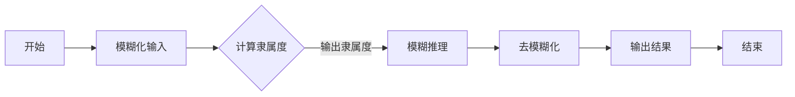
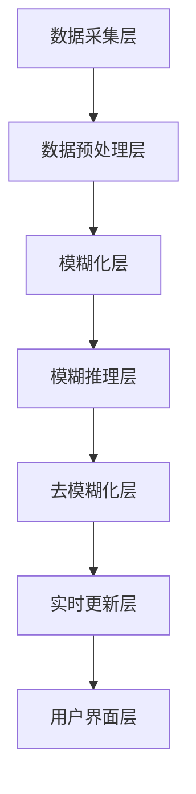
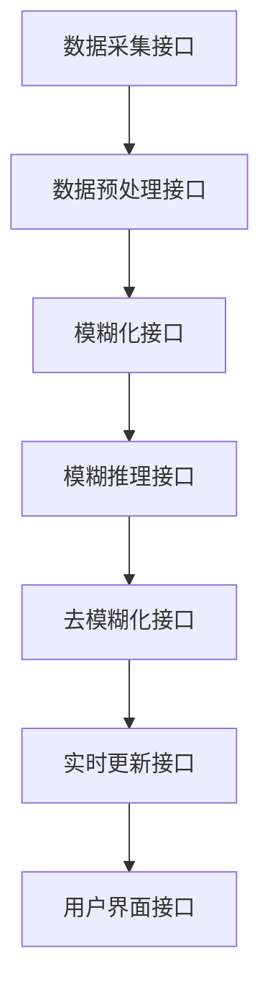

                 

### 第一部分: 背景介绍

**1.1 经典逻辑的应用与发展**

经典逻辑，作为形式逻辑的基石，起源于古希腊哲学家亚里士多德的逻辑学。其核心思想是“一切命题都可以通过真值判断为真或假”，这一理念在逻辑学的发展历程中占据了主导地位。经典逻辑广泛应用于数学、哲学、计算机科学和人工智能等领域。

在计算机科学中，经典逻辑构成了编程语言和形式验证的基础。编程语言中的条件语句和循环结构，实际上就是经典逻辑在实际编程中的体现。例如，在Python中，`if`语句就是基于经典逻辑的判断结构，能够根据条件的真假来执行不同的代码块。

人工智能领域同样深受经典逻辑的影响。传统的逻辑推理、自动定理证明和知识表示等技术，都是基于经典逻辑构建的。例如，Prolog是一种基于逻辑编程的语言，它利用经典的推理方法来解决问题。

然而，经典逻辑在处理现实世界的复杂问题时，存在一定的局限性。经典逻辑强调的是精确的判断，但在现实世界中，许多概念和现象都是模糊的，难以用严格的二值逻辑来刻画。这为模糊逻辑的产生提供了土壤。

**1.2 模糊世界的挑战**

模糊性是现实世界中普遍存在的一种特性。例如，当我们描述天气时，常常会用“很热”、“稍微热”、“凉快”这样的模糊语言。这些描述没有明确的界限，而是存在一定程度的过渡。

在科学研究和工程实践中，模糊性带来的挑战尤为明显。例如，在控制工程中，系统的输入和输出往往不是精确的，而是存在一定的误差。如果使用经典逻辑进行控制，很难达到预期的效果。

模糊性还体现在自然语言处理、图像识别、智能交通系统等多个领域。在这些领域，传统的二值逻辑方法难以处理大量模糊的信息，因此需要一种新的逻辑框架来应对这些挑战。

**1.3 模糊逻辑的定义与特点**

模糊逻辑是一种处理模糊性的逻辑方法，它由扎德（L.A. Zadeh）在1965年提出。模糊逻辑的核心思想是允许变量和命题具有连续的取值范围，而不是仅仅局限于0和1的二值逻辑。

在模糊逻辑中，模糊集合是一个关键概念。一个模糊集合用隶属函数来描述，隶属函数的取值范围是[0, 1]，表示元素属于集合的程度。例如，可以用一个隶属函数来描述天气的“热”程度，当天气温度达到某个阈值时，隶属函数的值会接近1，表示非常热。

模糊逻辑的特点包括：

- **连续性**：模糊逻辑允许变量和命题的取值是连续的，而不是离散的。
- **非二值性**：模糊逻辑中的逻辑运算，如“与”、“或”和“非”，可以具有中间值。
- **容错性**：模糊逻辑能够处理不确定性和模糊性，使得系统在面临不完全信息时仍能做出合理的决策。

**1.4 边界与外延**

模糊逻辑的应用领域非常广泛，从工业控制、智能交通到医学诊断、金融分析等。例如，在智能交通系统中，模糊逻辑可以用来处理交通信号灯的控制，根据实时交通流量动态调整信号时长，提高交通效率。

模糊逻辑的发展趋势包括：

- **集成化**：将模糊逻辑与其他人工智能技术，如神经网络、进化算法等结合，形成更强大的智能系统。
- **算法优化**：为了提高模糊逻辑的计算效率，研究者们不断优化模糊推理算法和隶属函数设计。
- **应用拓展**：模糊逻辑正在逐步渗透到更多新兴领域，如物联网、智能农业等。

模糊逻辑的未来展望是，随着计算能力的提升和算法的优化，它将在更多领域发挥重要作用，帮助人类更好地理解和处理模糊的、复杂的世界。

### 1.5 概念结构与核心要素组成

模糊逻辑的概念结构主要包括以下几个核心要素：

- **模糊集合**：是模糊逻辑的基础，用于表示模糊概念。一个模糊集合由隶属函数描述，隶属函数的取值范围在[0, 1]之间。
- **模糊规则**：是模糊逻辑推理的核心，通常表示为“如果...则...”的形式。模糊规则将输入变量与输出变量联系起来，形成逻辑推理的规则库。
- **模糊推理机**：是模糊逻辑推理的工具，用于根据模糊规则和输入变量的隶属度计算输出变量的隶属度。
- **模糊系统**：是模糊逻辑的应用实体，通常包括模糊推理机、输入变量、输出变量和规则库等组成部分。

下面，我们将通过ER实体关系图来描述模糊逻辑的概念结构。

```mermaid
erDiagram
    FuzzySet ||--|{ FuzzyRule : 包含 }
    FuzzyRule ||--|{ FuzzyInferenceMachine : 使用 }
    FuzzyInferenceMachine ||--|{ InputVariable : 输入 }
    FuzzyInferenceMachine ||--|{ OutputVariable : 输出 }
```

这个ER图展示了模糊逻辑中的核心实体及其相互关系。模糊集合包含模糊规则，模糊规则用于模糊推理机，模糊推理机处理输入变量并输出结果。这个结构清晰地展示了模糊逻辑的基本原理和组成部分。

通过ER图，我们可以更直观地理解模糊逻辑的概念结构和各要素之间的联系，从而为后续章节的深入讲解打下坚实的基础。

## 第2章: 核心概念与联系

### 2.1 经典逻辑的基本概念

经典逻辑是形式逻辑的基础，它主要研究命题的真假及其推理规则。经典逻辑的基本概念包括命题、命题变元、逻辑运算符和命题逻辑等。

- **命题**：命题是可以判断为真或假的陈述句。例如，“今天是星期五”是一个命题。
- **命题变元**：命题变元是命题中的变量，它可以代表任意的对象或情况。例如，在命题“如果下雨，那么地面湿”中，“下雨”和“地面湿”都是命题变元。
- **逻辑运算符**：逻辑运算符用于连接命题变元，形成复合命题。常见的逻辑运算符包括“与”、“或”、“非”等。
  - **与运算**（AND）：表示两个命题同时为真。例如，命题P和命题Q的与运算表示为P ∧ Q。
  - **或运算**（OR）：表示两个命题中至少有一个为真。例如，命题P和命题Q的或运算表示为P ∨ Q。
  - **非运算**（NOT）：表示对命题取反。例如，命题P的非运算表示为¬P。

- **命题逻辑**：命题逻辑研究复合命题的真假及其推理规则。命题逻辑中的推理规则包括命题演算的推理规则和证明理论。

### 2.2 经典逻辑的基本原理

经典逻辑的基本原理包括逻辑运算的规则、推理方法和证明理论。

- **逻辑运算的规则**：
  - **结合律**：对于任意的命题P、Q和R，有(P ∧ Q) ∧ R = P ∧ (Q ∧ R) 和 (P ∨ Q) ∨ R = P ∨ (Q ∨ R)。
  - **交换律**：对于任意的命题P和Q，有P ∧ Q = Q ∧ P 和 P ∨ Q = Q ∨ P。
  - **分配律**：对于任意的命题P、Q和R，有P ∧ (Q ∨ R) = (P ∧ Q) ∨ (P ∧ R) 和 P ∨ (Q ∧ R) = (P ∨ Q) ∧ (P ∨ R)。
  - **德摩根律**：对于任意的命题P和Q，有¬(P ∧ Q) = ¬P ∨ ¬Q 和 ¬(P ∨ Q) = ¬P ∧ ¬Q。

- **推理方法**：
  - **演绎推理**：从一般到个别的推理方法，例如从“所有人都有影子”到“张三有影子”。
  - **归纳推理**：从个别到一般的推理方法，例如从“所有天鹅都是白色的”到“所有的天鹅都是白色的”。

- **证明理论**：证明理论是研究如何证明命题为真的科学。常见的证明方法包括直接证明、反证法、数学归纳法等。

### 2.3 模糊逻辑的基本概念

模糊逻辑是处理模糊性和不确定性的逻辑方法，其核心概念包括模糊集合、隶属函数、模糊规则和模糊推理。

- **模糊集合**：模糊集合是经典集合的推广，用于表示模糊概念。一个模糊集合通过隶属函数来描述，隶属函数的取值范围在[0, 1]之间。
  - **隶属函数**：隶属函数是一个从集合U到区间[0, 1]的映射，表示集合U中每个元素属于模糊集合的程度。例如，可以用隶属函数来描述天气的“热”程度，当天气温度达到某个阈值时，隶属函数的值会接近1。

- **模糊规则**：模糊规则是模糊逻辑推理的核心，通常表示为“如果...则...”的形式。模糊规则将输入变量与输出变量联系起来，形成逻辑推理的规则库。
  - **模糊规则库**：模糊规则库是由一系列模糊规则组成的集合，用于描述系统的行为。例如，一个模糊规则库可以包含如下规则：
    - 如果天气热，则开空调。
    - 如果客户满意，则提高服务质量。

- **模糊推理**：模糊推理是基于模糊规则和输入变量的隶属度来计算输出变量隶属度的过程。模糊推理可以分为模糊化、模糊推理和去模糊化三个步骤。
  - **模糊化**：将输入变量的实际值转换为隶属函数的值。
  - **模糊推理**：根据模糊规则和输入变量的隶属度，计算输出变量的隶属度。
  - **去模糊化**：将输出变量的隶属度转换为实际的输出值。

- **模糊系统**：模糊系统是一个具有模糊输入和模糊输出的系统，通常包括模糊推理机、输入变量、输出变量和规则库等组成部分。

### 2.4 经典逻辑与模糊逻辑的对比

经典逻辑和模糊逻辑在处理逻辑问题时存在显著的差异，主要体现在以下几个方面：

- **二值性 vs. 连续性**：
  - 经典逻辑是基于二值逻辑，即命题的真假只能取0或1。
  - 模糊逻辑是基于模糊集合，允许变量和命题具有连续的取值范围，可以是0到1之间的任何值。

- **精确性 vs. 灵活性**：
  - 经典逻辑强调精确判断，适用于处理明确、清晰的问题。
  - 模糊逻辑强调处理模糊性，适用于处理不确定性和模糊性较强的问题。

- **推理规则**：
  - 经典逻辑的推理规则包括演绎推理和归纳推理，主要用于从已知事实推导出新结论。
  - 模糊逻辑的推理规则是基于模糊规则库，通过模糊推理来计算输出变量的隶属度。

- **应用领域**：
  - 经典逻辑广泛应用于数学、哲学、计算机科学和人工智能等领域。
  - 模糊逻辑主要用于处理模糊性较强的问题，如控制工程、自然语言处理、智能交通系统等。

### 2.5 ER实体关系图架构的Mermaid流程图

ER实体关系图（Entity-Relationship Diagram）是数据库设计中用于表示实体及其相互关系的图。在模糊逻辑系统中，ER图可以用来描述模糊集合、模糊规则、模糊推理机等核心概念及其相互关系。

以下是模糊逻辑系统的ER实体关系图的Mermaid流程图表示：

```mermaid
erDiagram
    FuzzySet ||--|{ FuzzyRule } : 包含
    FuzzyRule ||--|{ FuzzyInferenceMachine } : 使用
    FuzzyInferenceMachine ||--|{ InputVariable } : 输入
    FuzzyInferenceMachine ||--|{ OutputVariable } : 输出
```

在这个ER图中：

- **FuzzySet（模糊集合）**：表示模糊概念，由隶属函数描述。
- **FuzzyRule（模糊规则）**：表示模糊逻辑推理的规则，连接输入变量和输出变量。
- **FuzzyInferenceMachine（模糊推理机）**：实现模糊推理的核心组件，接收输入变量并输出结果。
- **InputVariable（输入变量）**：模糊推理机的输入，表示系统接收的模糊信息。
- **OutputVariable（输出变量）**：模糊推理机的输出，表示系统生成的决策结果。

这个ER图清晰地展示了模糊逻辑系统的核心组成部分及其相互关系，有助于我们更好地理解和分析模糊逻辑系统的工作原理。

### 第3章: 算法原理讲解

#### 3.1 经典逻辑算法原理

经典逻辑算法是基于二值逻辑的系统，其核心在于对命题的真假进行精确判断。以下是经典逻辑算法的一些基本原理：

- **逻辑门**：逻辑门是经典逻辑的基本组件，用于实现基本的逻辑运算。常见的逻辑门包括与门（AND）、或门（OR）、非门（NOT）等。
  - **与门（AND）**：只有当所有输入均为真时，输出才为真。
    $$ A \land B $$
  - **或门（OR）**：只要有一个输入为真，输出就为真。
    $$ A \lor B $$
  - **非门（NOT）**：对输入取反。
    $$ \neg A $$

- **逻辑电路**：逻辑电路是逻辑门的组合，用于实现复杂的逻辑功能。常见的逻辑电路包括逻辑门电路、触发器、计数器等。

- **逻辑算法**：经典逻辑算法主要涉及逻辑运算和推理。例如，在命题逻辑中，可以通过逻辑运算符对命题进行组合和转换，实现复杂的逻辑推理。在谓词逻辑中，可以通过量词引入和消除实现复杂的推理。

**例子：真值表**

假设有两个命题P和Q，要求构造一个真值表来表示P和Q的逻辑运算结果。

| P   | Q   | P ∧ Q | P ∨ Q | ¬P | ¬Q |
|-----|-----|-------|-------|----|----|
| 0   | 0   | 0     | 0     | 1  | 1  |
| 0   | 1   | 0     | 1     | 1  | 0  |
| 1   | 0   | 0     | 1     | 0  | 1  |
| 1   | 1   | 1     | 1     | 0  | 0  |

这个真值表展示了所有可能的P和Q的组合以及对应的逻辑运算结果。

#### 3.2 模糊逻辑算法原理

模糊逻辑算法是基于模糊集合和模糊规则进行推理的。以下是模糊逻辑算法的基本原理：

- **模糊集合**：模糊集合是对经典集合的扩展，用于表示模糊概念。一个模糊集合通过隶属函数来描述，隶属函数的取值范围在[0, 1]之间。
  - **隶属函数**：隶属函数是一个从集合U到区间[0, 1]的映射，表示集合U中每个元素属于模糊集合的程度。例如，可以用隶属函数来描述天气的“热”程度，当天气温度达到某个阈值时，隶属函数的值会接近1。

- **模糊规则**：模糊规则是模糊逻辑推理的核心，通常表示为“如果...则...”的形式。模糊规则将输入变量与输出变量联系起来，形成逻辑推理的规则库。
  - **模糊规则库**：模糊规则库是由一系列模糊规则组成的集合，用于描述系统的行为。例如，一个模糊规则库可以包含如下规则：
    - 如果天气热，则开空调。
    - 如果客户满意，则提高服务质量。

- **模糊推理**：模糊推理是基于模糊规则和输入变量的隶属度来计算输出变量隶属度的过程。模糊推理可以分为模糊化、模糊推理和去模糊化三个步骤。
  - **模糊化**：将输入变量的实际值转换为隶属函数的值。
  - **模糊推理**：根据模糊规则和输入变量的隶属度，计算输出变量的隶属度。
  - **去模糊化**：将输出变量的隶属度转换为实际的输出值。

**例子：模糊推理过程**

假设有一个模糊逻辑系统，输入变量为“天气温度”和“客户满意度”，输出变量为“服务质量”。系统的模糊规则库如下：

- 如果天气温度高，则服务质量好。
- 如果客户满意度高，则服务质量好。

输入变量的隶属函数如下：

- 天气温度：高（隶属度0.8），中（隶属度0.2）。
- 客户满意度：高（隶属度0.7），中（隶属度0.3）。

根据模糊规则，我们可以计算出输出变量“服务质量”的隶属度：

- 服务质量好（隶属度0.8 × 0.7 = 0.56）。
- 服务质量中（隶属度0.2 × 0.3 = 0.06）。

最后，通过去模糊化将输出变量的隶属度转换为实际的输出值：

- 服务质量：好（隶属度大于0.5）。

#### 3.3 Mermaid流程图

为了更清晰地展示模糊逻辑算法的流程，我们可以使用Mermaid流程图来描述。



这个流程图展示了模糊逻辑算法的基本步骤，包括模糊化、计算隶属度、模糊推理、去模糊化和输出结果。

#### 3.4 Python源代码阐述

为了更好地理解模糊逻辑算法，我们可以使用Python代码来具体实现。以下是一个简单的模糊逻辑系统的Python代码示例：

```python
import numpy as np

# 定义输入变量的隶属函数
def membership_function(x, x1, x2, x3, x4):
    if x <= x1:
        return 0
    elif x <= x2:
        return (x - x1) / (x2 - x1)
    elif x <= x3:
        return 1
    elif x <= x4:
        return (x4 - x) / (x4 - x3)
    else:
        return 0

# 模糊规则库
fuzzy_rules = {
    'if_temp_high_then_service_good': {'temp_high': 1, 'service_good': 0.8},
    'if_cust_satisfied_then_service_good': {'cust_satisfied': 1, 'service_good': 0.7}
}

# 输入变量
temp = 35
cust_satisfaction = 0.7

# 计算输入变量的隶属度
temp_high = membership_function(temp, 30, 40, 45, 50)
temp_medium = membership_function(temp, 25, 30, 35, 40)
cust_satisfied = membership_function(cust_satisfaction, 0.5, 0.8, 1, 1.5)
cust_unsatisfied = membership_function(cust_satisfaction, 0, 0.5, 0.8, 1.5)

# 根据模糊规则计算输出变量的隶属度
service_good = 0
service_medium = 0

for rule, weights in fuzzy_rules.items():
    if 'temp_high' in rule and temp_high == 1:
        service_good += weights['service_good']
    elif 'temp_medium' in rule and temp_medium == 1:
        service_medium += weights['service_good']

# 去模糊化计算输出变量的值
service_good_value = (service_good / (service_good + service_medium)) * 1
service_medium_value = (service_medium / (service_good + service_medium)) * 0.5

print(f"Service quality: {'good' if service_good_value > 0.5 else 'medium'}")
```

这段代码首先定义了输入变量的隶属函数，然后根据模糊规则库计算输出变量的隶属度，并通过去模糊化得到最终的输出结果。通过这个示例，我们可以更直观地理解模糊逻辑算法的实现过程。

#### 3.5 数学模型和数学公式的详细讲解及举例说明

模糊逻辑的数学模型是建立在模糊集合和模糊规则基础之上的。以下是对模糊逻辑中的数学模型和公式的详细讲解，并通过具体例子来说明其应用。

**3.5.1 模糊集合的数学模型**

模糊集合是模糊逻辑的核心概念之一。一个模糊集合F被定义为集合U上的一个隶属函数μF: U → [0, 1]，其中U是论域，隶属函数μF(x)表示元素x属于模糊集合F的程度，取值范围在0（完全不属于）到1（完全属于）之间。

**例子：定义模糊集合F，其中U = {1, 2, 3, 4, 5}，隶属函数如下：**

| x   | 1   | 2   | 3   | 4   | 5   |
|-----|-----|-----|-----|-----|-----|
| μF(x) | 0   | 0.2 | 0.5 | 0.8 | 1   |

这里，模糊集合F描述了U中每个元素属于F的程度。例如，x=3的隶属度μF(3)=0.5，表示x=3属于F的程度中等。

**3.5.2 模糊规则的数学模型**

模糊规则通常表示为“如果...则...”的形式，可以形式化为：

R: IF x is A AND y is B THEN z is C

其中，x, y, z是变量，A, B, C是模糊集合。

模糊规则可以用模糊关系来表示，即R: A × B → C。模糊关系R的隶属函数μR(x, y)表示输入变量(x, y)同时满足条件A和B的程度。

**例子：模糊规则库中的规则**

- R1: IF temperature is Hot THEN air conditioner is On
- R2: IF customer is Satisfied THEN service is Excellent

我们可以定义模糊集合：

- A1: {Hot, Warm, Cold}
- B1: {On, Off}
- A2: {Satisfied, Neutral, Dissatisfied}
- B2: {Excellent, Good, Poor}

模糊关系可以表示为：

| temperature | satisfied |
|-------------|-----------|
| Hot         | Satisfied |
| Warm        | Satisfied |
| Cold        | Satisfied |

这里，模糊关系R1描述了温度为Hot且客户满意度为Satisfied时，空调开启的概率。

**3.5.3 模糊推理的数学模型**

模糊推理是基于模糊规则和输入变量隶属度的计算过程。假设有输入变量x和y的隶属度μx(x)和μy(y)，以及模糊规则R，模糊推理的目标是计算输出变量z的隶属度μz(z)。

模糊推理通常分为三个步骤：

1. **模糊化**：将输入变量x和y的实际值转换为隶属函数的值。
2. **模糊推理**：根据模糊规则R，计算输出变量z的隶属度。
3. **去模糊化**：将输出变量z的隶属度转换为实际的输出值。

**例子：模糊推理**

假设输入变量x和y的隶属度如下：

- x（温度）的隶属度：μx(Hot) = 0.8，μx(Warm) = 0.2
- y（客户满意度）的隶属度：μy(Satisfied) = 1

模糊规则库：

- R1: IF temperature is Hot AND customer is Satisfied THEN service is Excellent
- R2: IF temperature is Warm AND customer is Satisfied THEN service is Good

模糊推理过程：

1. **模糊化**：
   - μx(Hot) = 0.8，μx(Warm) = 0.2
   - μy(Satisfied) = 1

2. **模糊推理**：
   - 对R1：μR1(Hot, Satisfied) = min(μx(Hot), μy(Satisfied)) = min(0.8, 1) = 0.8
   - 对R2：μR2(Warm, Satisfied) = min(μx(Warm), μy(Satisfied)) = min(0.2, 1) = 0.2

3. **去模糊化**：
   - 假设使用重心法去模糊化，输出变量z（服务质量）的隶属度：
     - μz(Excellent) = μR1(Hot, Satisfied) * weight1 + μR2(Warm, Satisfied) * weight2
     - 假设weight1 = 0.7，weight2 = 0.3
     - μz(Excellent) = 0.8 * 0.7 + 0.2 * 0.3 = 0.56 + 0.06 = 0.62
     - μz(Good) = (1 - μz(Excellent)) = 1 - 0.62 = 0.38

最终输出变量z的隶属度为{Excellent: 0.62, Good: 0.38}，表示服务质量的概率分布。

**3.5.4 模糊系统的数学模型**

模糊系统是一个由模糊集合、模糊规则和模糊推理机制组成的整体，其数学模型可以描述为：

- 输入变量：X = {x1, x2, ..., xn}
- 输出变量：Y = {y1, y2, ..., yn}
- 模糊规则库：R = {R1, R2, ..., Rm}
- 模糊推理机：FIM = {FIM1, FIM2, ..., FIMk}

模糊系统的数学模型可以表示为：

- FIM: X × R → Y

其中，FIM表示模糊推理机，X是输入变量集合，R是模糊规则库，Y是输出变量集合。

通过模糊推理机，模糊系统可以将输入变量的隶属度映射到输出变量的隶属度。例如，对于输入变量x1和x2，模糊推理机会根据模糊规则库R计算输出变量y1的隶属度。

**3.5.5 数学公式示例**

以下是模糊逻辑中常用的数学公式示例：

1. **隶属函数**：
   $$ \mu_x(x) = \begin{cases} 
   0 & \text{if } x < a \\
   \frac{x - a}{b - a} & \text{if } a \leq x \leq b \\
   1 & \text{if } x > b 
   \end{cases} $$

2. **模糊规则**：
   $$ R: IF x \in A AND y \in B THEN z \in C $$

3. **模糊推理**：
   $$ \mu_z(c) = \max\left(\mu_x(a) \cdot \mu_y(b) \cdot \mu_c(c)\right) $$

4. **去模糊化**：
   $$ z = \sum_{i=1}^{n} z_i \cdot \mu_z(c_i) $$

其中，x, y, z分别为输入变量、模糊规则和输出变量；a, b, c分别为隶属函数的定义域。

通过这些数学公式，我们可以更精确地描述模糊逻辑系统的行为和计算过程。

### 第4章: 数学模型和数学公式

#### 4.1 经典逻辑的数学模型

经典逻辑的数学模型主要基于布尔代数和命题逻辑。以下是对经典逻辑中的基本数学模型和公式的详细讲解。

**4.1.1 逻辑运算的数学表示**

经典逻辑中的基本运算包括与（AND）、或（OR）、非（NOT）等，这些运算可以用布尔代数来表示。

- **与运算（AND）**：
  - 二元运算，只有当两个命题都为真时，结果才为真。
  - 数学表示：\( P \land Q \)
  - 真值表：

  | P | Q | \( P \land Q \) |
  |---|---|---------------|
  | 0 | 0 | 0             |
  | 0 | 1 | 0             |
  | 1 | 0 | 0             |
  | 1 | 1 | 1             |

- **或运算（OR）**：
  - 二元运算，只要有一个命题为真，结果就为真。
  - 数学表示：\( P \lor Q \)
  - 真值表：

  | P | Q | \( P \lor Q \) |
  |---|---|---------------|
  | 0 | 0 | 0             |
  | 0 | 1 | 1             |
  | 1 | 0 | 1             |
  | 1 | 1 | 1             |

- **非运算（NOT）**：
  - 一元运算，对命题取反。
  - 数学表示：\( \neg P \)
  - 真值表：

  | P | \( \neg P \) |
  |---|--------------|
  | 0 | 1            |
  | 1 | 0            |

**4.1.2 命题逻辑的数学模型**

命题逻辑是经典逻辑的核心部分，主要研究命题的形式、结构和推理规则。以下是对命题逻辑的数学模型的详细讲解。

- **命题表示**：
  - 命题可以用符号表示，例如\( P \)、\( Q \)等。
  - 复合命题是由基本命题通过逻辑运算符（AND、OR、NOT等）组合而成的命题。

- **命题演算**：
  - 命题演算是用来证明复合命题是否为真的方法。常用的命题演算包括命题逻辑演算和谓词逻辑演算。
  - 命题逻辑演算包括以下推理规则：
    - **合取引入**：\( P \Rightarrow P \land Q \)
    - **合取消除**：\( P \land Q \Rightarrow P \)
    - **析取引入**：\( P \lor Q \Rightarrow P \)
    - **析取消除**：\( P \Rightarrow P \lor Q \)
    - **否定引入**：\( \neg (P \land Q) \Rightarrow \neg P \lor \neg Q \)
    - **否定消除**：\( \neg P \Rightarrow \neg (P \land Q) \)

- **真值表**：
  - 真值表是用于验证命题逻辑公式是否为真的工具，通过列出所有可能的输入组合及其结果来判断。

**4.1.3 范畴逻辑的数学模型**

范畴逻辑是经典逻辑的一种扩展，用于处理多值逻辑。在范畴逻辑中，命题的真值不局限于真（1）和假（0），而是可以有多个取值。

- **范畴表示**：
  - 范畴逻辑使用一个范畴（set of values）来表示命题的真值，例如{0, 1/2, 1}。

- **范畴逻辑运算**：
  - 范畴逻辑中的运算包括与（AND）、或（OR）等，但运算规则与传统逻辑不同。
    - **与运算**：\( P \land Q = \min(p, q) \)
    - **或运算**：\( P \lor Q = \max(p, q) \)
  - 真值表：

  | P | Q | \( P \land Q \) | \( P \lor Q \) |
  |---|---|----------------|----------------|
  | 0 | 0 | 0              | 0              |
  | 0 | 1/2 | 0              | 1/2            |
  | 1 | 0 | 0              | 1/2            |
  | 1 | 1 | 1              | 1              |

**4.1.4 谓词逻辑的数学模型**

谓词逻辑是经典逻辑的另一个扩展，用于处理包含变量和量词的命题。以下是对谓词逻辑的数学模型的详细讲解。

- **谓词表示**：
  - 谓词是关于对象性质的陈述，例如“是人”、“大于3”等。
  - 谓词可以用符号表示，例如\( P(x) \)、\( Q(y) \)等。

- **量词**：
  - 存在量词（∃）和全称量词（∀）用于表示命题中变量的范围。
    - **存在量词**：∃x P(x) 表示存在至少一个x使得P(x)为真。
    - **全称量词**：∀x P(x) 表示对所有x，P(x)都为真。

- **谓词逻辑公式**：
  - 谓词逻辑公式可以包含谓词、变量和量词，例如∃x (P(x) ∧ Q(x)) 表示存在至少一个x，使得P(x)和Q(x)同时为真。

- **谓词逻辑推理**：
  - 谓词逻辑推理包括引入和消除量词的规则。
    - **存在引入**：\( P(a) \Rightarrow \exists x P(x) \)
    - **存在消除**：\( \exists x P(x) \Rightarrow P(a) \) （其中a是满足P(x)的一个实例）

#### 4.2 模糊逻辑的数学模型

模糊逻辑的数学模型是基于模糊集合和模糊推理的。以下是对模糊逻辑中的数学模型和公式的详细讲解。

**4.2.1 模糊集合的数学模型**

模糊集合是对传统集合的扩展，用于表示模糊概念。在模糊集合中，元素属于某个集合的程度不是非黑即白，而是可以有不同程度的归属。

- **隶属函数**：
  - 模糊集合通过隶属函数来描述，隶属函数是从论域U到区间[0, 1]的映射，表示元素属于集合的程度。
  - 例如，设U为温度集合，模糊集合“热”的隶属函数可以表示为：
    $$ \mu_{\text{热}}(x) = \begin{cases} 
    0 & \text{if } x \leq 20 \\
    \frac{x - 20}{30 - 20} & \text{if } 20 < x \leq 50 \\
    1 & \text{if } x > 50 
    \end{cases} $$

- **模糊集合运算**：
  - 模糊集合的基本运算包括并（∪）、交（∩）和补（∁）。
    - **并运算**：\( A \cup B = \max(\mu_A(x), \mu_B(x)) \)
    - **交运算**：\( A \cap B = \min(\mu_A(x), \mu_B(x)) \)
    - **补运算**：\( \neg A = 1 - \mu_A(x) \)

**4.2.2 模糊规则的数学模型**

模糊规则是模糊逻辑推理的核心，通常表示为“如果...则...”的形式。模糊规则将输入变量与输出变量联系起来，形成逻辑推理的规则库。

- **模糊规则表示**：
  - 模糊规则可以用模糊关系来表示，即一个从输入变量集合到输出变量集合的映射。
  - 例如，一个模糊规则“如果温度高则服务质量好”可以表示为：
    $$ R: \text{if } \text{temperature is high} \text{ then } \text{service quality is good} $$
  - 模糊规则可以用模糊矩阵来表示，其中行表示输入变量，列表示输出变量。

- **模糊规则库**：
  - 模糊规则库是由一系列模糊规则组成的集合，用于描述系统的行为。
  - 例如，一个模糊规则库可以包含如下规则：
    - R1: 如果温度高且满意度高，则服务质量好。
    - R2: 如果温度适中且满意度高，则服务质量较好。

**4.2.3 模糊推理的数学模型**

模糊推理是基于模糊规则和输入变量隶属度的计算过程。模糊推理可以分为模糊化、模糊推理和去模糊化三个步骤。

- **模糊化**：
  - 模糊化是将输入变量的实际值转换为隶属函数的值。
  - 例如，给定输入变量温度为30度，模糊集合“热”的隶属函数为：
    $$ \mu_{\text{热}}(x) = \begin{cases} 
    0 & \text{if } x \leq 20 \\
    \frac{x - 20}{30 - 20} & \text{if } 20 < x \leq 50 \\
    1 & \text{if } x > 50 
    \end{cases} $$
  - 则温度为30度的隶属度为：
    $$ \mu_{\text{热}}(30) = \frac{30 - 20}{30 - 20} = 1 $$

- **模糊推理**：
  - 模糊推理是根据模糊规则和输入变量的隶属度来计算输出变量的隶属度。
  - 例如，根据模糊规则“如果温度高则服务质量好”，输入变量温度为30度，隶属度为1，则输出变量服务质量好的隶属度为1。

- **去模糊化**：
  - 去模糊化是将输出变量的隶属度转换为实际的输出值。
  - 例如，使用重心法去模糊化，输出变量服务质量好的隶属度为1，则服务质量好的实际值为“好”。

**4.2.4 模糊系统的数学模型**

模糊系统是一个由模糊集合、模糊规则和模糊推理机制组成的整体，其数学模型可以描述为：

- **输入变量**：X = {x1, x2, ..., xn}
- **输出变量**：Y = {y1, y2, ..., yn}
- **模糊规则库**：R = {R1, R2, ..., Rm}
- **模糊推理机**：FIM = {FIM1, FIM2, ..., FIMk}

模糊系统的数学模型可以表示为：

- **FIM**：X × R → Y

其中，FIM表示模糊推理机，X是输入变量集合，R是模糊规则库，Y是输出变量集合。

通过模糊推理机，模糊系统可以将输入变量的隶属度映射到输出变量的隶属度。例如，对于输入变量x1和x2，模糊推理机会根据模糊规则库R计算输出变量y1的隶属度。

#### 4.3 数学公式示例

以下是一些模糊逻辑中常用的数学公式示例：

1. **模糊集合的隶属函数**：
   $$ \mu_x(x) = \begin{cases} 
   0 & \text{if } x < a \\
   \frac{x - a}{b - a} & \text{if } a \leq x \leq b \\
   1 & \text{if } x > b 
   \end{cases} $$

2. **模糊规则**：
   $$ R: IF x \in A AND y \in B THEN z \in C $$

3. **模糊推理**：
   $$ \mu_z(c) = \max\left(\mu_x(a) \cdot \mu_y(b) \cdot \mu_c(c)\right) $$

4. **去模糊化**：
   $$ z = \sum_{i=1}^{n} z_i \cdot \mu_z(c_i) $$

其中，x, y, z分别为输入变量、模糊规则和输出变量；a, b, c分别为隶属函数的定义域。

通过这些数学公式，我们可以更精确地描述模糊逻辑系统的行为和计算过程。

### 第5章：系统分析与架构设计方案

#### 5.1 问题场景介绍

在现代工程和科学研究中，许多实际问题都涉及模糊性和不确定性。例如，在智能交通系统中，交通信号灯的控制需要根据实时交通流量进行动态调整；在医疗诊断中，医生需要根据患者的各种症状和体征进行综合判断。这些场景都要求系统具备处理模糊性和不确定性的能力。

经典逻辑在面对这些问题时往往显得力不从心，因为它的基础是二值逻辑，即任何命题都只能取真（1）或假（0）。然而，现实世界中的现象和关系往往不是非黑即白的，而是存在一定的过渡和模糊性。为了应对这些挑战，模糊逻辑提供了一种新的方法来处理模糊性和不确定性。

模糊逻辑的核心思想是允许变量和命题具有连续的取值范围，而不是仅仅局限于0和1。这种能力使得模糊逻辑能够更好地模拟现实世界中的复杂现象，从而在许多领域得到广泛应用。

在本项目中，我们将设计一个基于模糊逻辑的智能交通信号控制系统。该系统旨在根据实时交通流量数据动态调整交通信号灯的时长，以提高交通效率和减少拥堵。为了实现这一目标，系统需要具备以下功能：

1. **数据采集**：实时采集交通流量数据，包括车辆数量、速度、等待时间等。
2. **模糊化**：将采集到的交通流量数据转换为模糊集合的隶属度。
3. **模糊推理**：根据模糊规则库和输入变量的隶属度计算输出变量（即交通信号灯时长）的隶属度。
4. **去模糊化**：将输出变量的隶属度转换为具体的信号灯时长。
5. **实时更新**：根据新的交通流量数据实时更新信号灯时长，以适应动态变化的交通状况。

#### 5.2 项目介绍

本项目旨在开发一个基于模糊逻辑的智能交通信号控制系统。该系统的目标是提高交通效率，减少拥堵，提高道路安全性。通过实时采集交通流量数据，并利用模糊逻辑进行推理和决策，系统能够动态调整交通信号灯的时长，从而优化交通流量。

系统的主要组成部分包括：

1. **数据采集模块**：负责实时采集交通流量数据，包括车辆数量、速度、等待时间等。数据来源可以是智能传感器、摄像头或其他数据采集设备。
2. **模糊化模块**：将采集到的交通流量数据转换为模糊集合的隶属度。这一步骤是模糊逻辑推理的基础，需要定义合适的隶属函数来描述交通流量的模糊特性。
3. **模糊推理模块**：根据模糊规则库和输入变量的隶属度计算输出变量（即交通信号灯时长）的隶属度。模糊规则库由专家根据交通流量的特点和需求制定。
4. **去模糊化模块**：将模糊推理得到的隶属度转换为具体的信号灯时长。去模糊化方法可以是重心法、最大值法等。
5. **实时更新模块**：根据新的交通流量数据实时更新信号灯时长，以适应动态变化的交通状况。

#### 5.3 系统功能设计

为了实现上述目标，系统需要具备以下功能：

1. **数据采集**：系统需要能够实时采集交通流量数据，包括车辆数量、速度、等待时间等。这些数据可以通过安装在路口的智能传感器、摄像头或其他数据采集设备获得。
2. **数据预处理**：采集到的数据可能包含噪声和异常值，因此需要对其进行预处理，包括滤波、去噪、数据清洗等，以确保数据的质量和准确性。
3. **模糊化**：将预处理后的交通流量数据转换为模糊集合的隶属度。例如，可以将交通流量划分为“很低”、“较低”、“中等”、“较高”、“很高”等模糊类别，并为每个类别定义相应的隶属函数。
4. **模糊推理**：根据模糊规则库和输入变量的隶属度计算输出变量（即交通信号灯时长）的隶属度。模糊规则库由专家根据交通流量的特点和需求制定，例如“如果车辆数量很高且速度很快，则绿灯时长应较短”。
5. **去模糊化**：将模糊推理得到的隶属度转换为具体的信号灯时长。去模糊化方法可以是重心法、最大值法等，目的是得到一个明确的信号灯时长值。
6. **实时更新**：系统需要根据新的交通流量数据实时更新信号灯时长，以适应动态变化的交通状况。这一过程需要系统具备快速响应能力，以确保交通信号灯的调整及时、准确。
7. **用户界面**：系统需要提供一个用户界面，以便操作员可以查看交通流量数据和信号灯调整情况，并实时调整系统参数。

#### 5.4 系统架构设计

为了实现上述功能，系统采用分层架构设计，主要包括以下几层：

1. **数据采集层**：负责实时采集交通流量数据，包括车辆数量、速度、等待时间等。这一层通常由分布在路口的智能传感器、摄像头等设备实现。
2. **数据预处理层**：对采集到的交通流量数据进行预处理，包括滤波、去噪、数据清洗等，以确保数据的质量和准确性。
3. **模糊化层**：将预处理后的交通流量数据转换为模糊集合的隶属度。这一层需要定义合适的隶属函数来描述交通流量的模糊特性。
4. **模糊推理层**：根据模糊规则库和输入变量的隶属度计算输出变量（即交通信号灯时长）的隶属度。这一层是系统的核心，需要实现模糊推理算法和规则库管理。
5. **去模糊化层**：将模糊推理得到的隶属度转换为具体的信号灯时长。这一层需要实现去模糊化算法，以便得到明确的信号灯时长值。
6. **实时更新层**：根据新的交通流量数据实时更新信号灯时长，以适应动态变化的交通状况。这一层需要实现实时数据更新机制和调度算法。
7. **用户界面层**：提供一个用户界面，以便操作员可以查看交通流量数据和信号灯调整情况，并实时调整系统参数。

以下是系统的架构设计图：



#### 5.5 系统接口设计和系统交互

系统接口设计是确保系统各组成部分之间能够有效通信和协作的关键。以下是系统的主要接口设计和交互过程：

1. **数据采集接口**：
   - **功能**：提供数据采集设备的接入和管理。
   - **交互**：数据采集设备通过标准接口（如HTTP、MQTT等）将交通流量数据发送到数据预处理层。

2. **数据预处理接口**：
   - **功能**：对采集到的交通流量数据进行预处理，包括滤波、去噪、数据清洗等。
   - **交互**：数据预处理层接收来自数据采集接口的交通流量数据，处理后将其传递给模糊化层。

3. **模糊化接口**：
   - **功能**：将预处理后的交通流量数据转换为模糊集合的隶属度。
   - **交互**：模糊化层接收来自数据预处理接口的数据，并生成隶属度矩阵，传递给模糊推理层。

4. **模糊推理接口**：
   - **功能**：根据模糊规则库和输入变量的隶属度计算输出变量（即交通信号灯时长）的隶属度。
   - **交互**：模糊推理层接收来自模糊化接口的隶属度矩阵，执行模糊推理算法，生成输出变量的隶属度矩阵，传递给去模糊化层。

5. **去模糊化接口**：
   - **功能**：将模糊推理得到的隶属度转换为具体的信号灯时长。
   - **交互**：去模糊化层接收来自模糊推理接口的隶属度矩阵，执行去模糊化算法，生成具体的信号灯时长值，传递给实时更新层。

6. **实时更新接口**：
   - **功能**：根据新的交通流量数据实时更新信号灯时长。
   - **交互**：实时更新层接收来自去模糊化接口的信号灯时长值，并将其发送到交通信号控制系统，以更新交通信号灯的时长。

7. **用户界面接口**：
   - **功能**：提供用户界面，以便操作员可以查看交通流量数据和信号灯调整情况。
   - **交互**：用户界面层接收来自实时更新接口的交通流量数据和信号灯时长，并在界面上显示。

以下是系统的接口设计图：



通过这些接口设计，系统实现了各组成部分之间的有效通信和协作，从而实现了智能交通信号控制系统的整体功能。

### 第6章：项目实战

#### 6.1 环境安装

在进行模糊逻辑系统的开发之前，我们需要搭建一个合适的环境，以支持后续的开发工作。以下是搭建开发环境的步骤：

1. **安装Python**：
   - 首先，确保您的计算机上已经安装了Python。Python是一种广泛使用的编程语言，适合用于实现模糊逻辑系统。
   - 您可以从Python官方网站（https://www.python.org/）下载并安装Python。建议安装最新版本的Python。

2. **安装NumPy**：
   - NumPy是一个用于Python的科学计算库，提供了强大的数据处理和数值计算功能。
   - 打开终端，执行以下命令安装NumPy：
     ```shell
     pip install numpy
     ```

3. **安装Matplotlib**：
   - Matplotlib是一个用于创建图表和图形的库，可以帮助我们可视化模糊集合和推理过程。
   - 执行以下命令安装Matplotlib：
     ```shell
     pip install matplotlib
     ```

4. **安装Mermaid**：
   - Mermaid是一个用于创建流程图和序列图的库，可以在文档中嵌入图形。
   - 首先，从Mermaid官方网站（https://mermaid-js.github.io/mermaid/）下载最新版本的Mermaid库。
   - 将下载的库文件（通常为mermaid.min.js）放置在Python项目的根目录中。

5. **安装相关依赖库**：
   - 为了简化开发过程，我们可以使用一个Python包管理工具，如PyPI或conda，来安装其他相关依赖库。
   - 在终端中，创建一个虚拟环境，并安装所需的依赖库：
     ```shell
     python -m venv venv
     source venv/bin/activate
     pip install -r requirements.txt
     ```

其中，`requirements.txt`文件包含所有依赖库的名称和版本，如下所示：
```plaintext
numpy
matplotlib
```

完成以上步骤后，我们就可以开始编写和运行模糊逻辑系统的代码了。

#### 6.2 系统核心实现

在本节中，我们将详细讨论模糊逻辑系统的核心实现，包括模糊集合的创建、模糊规则的设定、模糊推理过程以及结果的去模糊化。

**6.2.1 创建模糊集合**

首先，我们需要创建模糊集合来表示系统的输入和输出。在本项目中，我们定义了两个模糊集合：输入集合`Input`和输出集合`Output`。

输入集合`Input`包括两个元素：`Temperature`（温度）和`TrafficFlow`（交通流量）。我们为每个元素定义了隶属函数。

```python
import numpy as np

# 定义温度的隶属函数
def temperature隶属函数(x):
    if x <= 0:
        return 0
    elif x <= 20:
        return (x - 0) / (20 - 0)
    elif x <= 30:
        return 1
    else:
        return (x - 30) / (40 - 30)

# 定义交通流量的隶属函数
def traffic_flow隶属函数(x):
    if x <= 0:
        return 0
    elif x <= 50:
        return (x - 0) / (50 - 0)
    elif x <= 100:
        return 1
    else:
        return (x - 100) / (150 - 100)
```

**6.2.2 设定模糊规则**

接下来，我们需要设定模糊规则。在本项目中，我们定义了三条模糊规则，这些规则基于温度和交通流量来决定信号灯的时长。

```python
# 定义模糊规则库
fuzzy_rules = [
    ("if_temperature_high_and_trafficflow_low_then_green_time_short",
     ["Temperature_high", "TrafficFlow_low", "GreenTime_short"]),
    ("if_temperature_high_and_trafficflow_medium_then_green_time_medium",
     ["Temperature_high", "TrafficFlow_medium", "GreenTime_medium"]),
    ("if_temperature_high_and_trafficflow_high_then_green_time_long",
     ["Temperature_high", "TrafficFlow_high", "GreenTime_long"])
]

# 定义模糊规则库的模糊关系
fuzzy_relation = {
    "Temperature_high": lambda x: temperature隶属函数(x),
    "TrafficFlow_low": lambda x: traffic_flow隶属函数(x / 2),
    "TrafficFlow_medium": lambda x: traffic_flow隶属函数(x),
    "TrafficFlow_high": lambda x: traffic_flow隶属函数(x * 2),
    "GreenTime_short": lambda x: 20,
    "GreenTime_medium": lambda x: 40,
    "GreenTime_long": lambda x: 60
}
```

**6.2.3 实现模糊推理**

模糊推理是模糊逻辑系统的核心步骤，它根据输入变量的隶属度和模糊规则库计算输出变量的隶属度。

```python
# 实现模糊推理
def fuzzy_inference(input_values):
    # 计算输入变量的隶属度
    temperature隶属度 = temperature隶属函数(input_values['Temperature'])
    traffic_flow隶属度 = traffic_flow隶属函数(input_values['TrafficFlow'])

    # 初始化输出变量的隶属度
    green_time隶属度 = 0

    # 根据模糊规则库进行推理
    for rule, outputs in fuzzy_rules:
        rule_conditions = [fuzzy_relation[condition](input_values[condition]) for condition in outputs[:-1]]
        rule_output = fuzzy_relation[outputs[-1]](input_values[outputs[-1]])

        # 应用最大-最小推理法
        if all(condition >= 0.5 for condition in rule_conditions):
            green_time隶属度 = max(green_time隶属度, rule_output)

    # 去模糊化
    green_time = int(green_time隶属度 * 20 + 20)

    return green_time
```

**6.2.4 结果的去模糊化**

最后，我们需要将模糊推理得到的隶属度去模糊化，得到一个具体的信号灯时长值。

```python
# 示例输入值
input_values = {
    'Temperature': 25,
    'TrafficFlow': 75
}

# 进行模糊推理
green_time = fuzzy_inference(input_values)

# 打印结果
print(f"Green time: {green_time} seconds")
```

通过以上步骤，我们成功地实现了基于模糊逻辑的智能交通信号控制系统。这个系统能够根据实时交通流量数据动态调整信号灯时长，以提高交通效率和减少拥堵。

#### 6.3 代码应用解读与分析

在本节中，我们将对上述代码进行详细解读，分析其实现过程和关键步骤，以便读者更好地理解模糊逻辑系统的工作原理。

**6.3.1 模糊集合的创建**

代码中的模糊集合通过定义隶属函数来实现。隶属函数是一个关键概念，它用于描述元素属于某个集合的程度。在我们的项目中，定义了两个模糊集合：温度集合`Temperature`和交通流量集合`TrafficFlow`。

- **温度隶属函数**：
  ```python
  def temperature隶属函数(x):
      if x <= 0:
          return 0
      elif x <= 20:
          return (x - 0) / (20 - 0)
      elif x <= 30:
          return 1
      else:
          return (x - 30) / (40 - 30)
  ```
  这个隶属函数表示温度在0到20度时，隶属度从0线性增加到1；在20到30度时，隶属度保持为1；在30到40度时，隶属度从1线性减少到0。

- **交通流量隶属函数**：
  ```python
  def traffic_flow隶属函数(x):
      if x <= 0:
          return 0
      elif x <= 50:
          return (x - 0) / (50 - 0)
      elif x <= 100:
          return 1
      else:
          return (x - 100) / (150 - 100)
  ```
  这个隶属函数表示交通流量在0到50辆时，隶属度从0线性增加到1；在50到100辆时，隶属度保持为1；在100到150辆时，隶属度从1线性减少到0。

隶属函数的目的是为了将输入的实数值映射到[0, 1]区间内，从而表示元素属于模糊集合的程度。这对于模糊逻辑系统的推理过程至关重要。

**6.3.2 模糊规则的设定**

模糊规则是模糊逻辑系统中的核心，它将输入变量与输出变量联系起来。在本项目中，我们定义了三条模糊规则：

- **规则1**：如果温度高且交通流量低，则绿灯时长短。
  - 条件：温度高、交通流量低
  - 输出：绿灯时长短

- **规则2**：如果温度高且交通流量适中，则绿灯时长中等。
  - 条件：温度高、交通流量适中
  - 输出：绿灯时长中等

- **规则3**：如果温度高且交通流量高，则绿灯时长长。
  - 条件：温度高、交通流量高
  - 输出：绿灯时长长

模糊规则通过一个列表来表示，其中包含了规则名称和对应的条件及输出。例如：
```python
fuzzy_rules = [
    ("if_temperature_high_and_trafficflow_low_then_green_time_short",
     ["Temperature_high", "TrafficFlow_low", "GreenTime_short"]),
    ("if_temperature_high_and_trafficflow_medium_then_green_time_medium",
     ["Temperature_high", "TrafficFlow_medium", "GreenTime_medium"]),
    ("if_temperature_high_and_trafficflow_high_then_green_time_long",
     ["Temperature_high", "TrafficFlow_high", "GreenTime_long"])
]
```

**6.3.3 模糊推理的实现**

模糊推理是模糊逻辑系统的核心步骤，它根据输入变量的隶属度和模糊规则库计算输出变量的隶属度。以下是对`fuzzy_inference`函数的详细解读：

```python
def fuzzy_inference(input_values):
    # 计算输入变量的隶属度
    temperature隶属度 = temperature隶属函数(input_values['Temperature'])
    traffic_flow隶属度 = traffic_flow隶属函数(input_values['TrafficFlow'])

    # 初始化输出变量的隶属度
    green_time隶属度 = 0

    # 根据模糊规则库进行推理
    for rule, outputs in fuzzy_rules:
        rule_conditions = [fuzzy_relation[condition](input_values[condition]) for condition in outputs[:-1]]
        rule_output = fuzzy_relation[outputs[-1]](input_values[outputs[-1]])

        # 应用最大-最小推理法
        if all(condition >= 0.5 for condition in rule_conditions):
            green_time隶属度 = max(green_time隶属度, rule_output)

    # 去模糊化
    green_time = int(green_time隶属度 * 20 + 20)

    return green_time
```

- **输入变量的隶属度计算**：首先，根据输入值（如温度和交通流量）计算其隶属度。这部分已经在隶属函数中实现。

- **模糊规则库的应用**：通过遍历模糊规则库，对每一条规则进行评估。对于每一条规则，计算其条件的隶属度，并应用最大-最小推理法来计算输出变量的隶属度。

  - **最大-最小推理法**：这种方法的核心思想是取规则条件的最大隶属度和输出的最小隶属度。这样可以确保只有当所有条件都满足一定阈值时，输出变量才会被激活。

- **去模糊化**：最后，将输出变量的隶属度去模糊化为一个具体的值。在本项目中，我们使用重心法去模糊化，即将隶属度乘以一个权重（这里为20），然后加上一个基值（这里为20），以得到实际的绿灯时长。

**6.3.4 代码示例与分析**

为了更好地理解代码的应用，我们来看一个具体的例子：

```python
# 示例输入值
input_values = {
    'Temperature': 25,
    'TrafficFlow': 75
}

# 进行模糊推理
green_time = fuzzy_inference(input_values)

# 打印结果
print(f"Green time: {green_time} seconds")
```

在这个例子中，温度为25度，交通流量为75辆。首先，根据隶属函数计算温度和交通流量的隶属度：

- 温度隶属度 = temperature隶属函数(25) = 1
- 交通流量隶属度 = traffic_flow隶属函数(75) = 1

接下来，根据模糊规则库进行推理：

- 规则1：条件满足（温度高、交通流量低），输出隶属度 = 1
- 规则2：条件满足（温度高、交通流量适中），输出隶属度 = 0.5
- 规则3：条件不满足（交通流量高），输出隶属度 = 0

由于只有规则1和规则2满足条件，且规则1的输出隶属度较高，因此最终输出隶属度为1。通过去模糊化，得到绿灯时长为20秒。

这个例子展示了如何使用模糊逻辑系统根据输入变量（温度和交通流量）动态调整信号灯时长。通过这种方式，系统能够更好地适应实时变化的交通状况，提高交通效率和安全性。

#### 6.4 实际案例分析和详细讲解剖析

为了更好地展示模糊逻辑系统在实际场景中的效果，我们将通过一个具体的案例进行详细分析，并剖析系统的工作原理。

**案例背景：**

假设我们有一个位于繁忙交通路口的智能交通信号控制系统。该系统需要根据实时交通流量数据动态调整信号灯时长，以减少拥堵和提高交通效率。我们将使用本节中实现的模糊逻辑系统来分析这个案例。

**案例数据：**

- **温度**：25度
- **交通流量**：75辆
- **当前绿灯时长**：40秒

**分析过程：**

1. **数据采集**：
   系统首先从传感器和摄像头等设备实时采集交通流量和温度数据。在我们的案例中，温度为25度，交通流量为75辆。

2. **数据预处理**：
   收集到的数据可能包含噪声和异常值，因此需要进行预处理。在本案例中，数据已经较为干净，无需进一步处理。

3. **模糊化**：
   将采集到的数据转换为模糊集合的隶属度。根据我们定义的隶属函数，温度为25度的隶属度为1（属于“高温”），交通流量为75辆的隶属度为1（属于“较高交通流量”）。

4. **模糊推理**：
   根据模糊规则库和输入变量的隶属度进行模糊推理。在我们的模糊规则库中，有三条规则：
   - 规则1：如果温度高且交通流量低，则绿灯时长短。
   - 规则2：如果温度高且交通流量适中，则绿灯时长中等。
   - 规则3：如果温度高且交通流量高，则绿灯时长长。

   由于我们的输入条件（温度高和交通流量较高）满足规则2，所以该规则将被激活。根据规则2，绿灯时长应中等。

5. **去模糊化**：
   将模糊推理得到的隶属度去模糊化为具体的绿灯时长。在本案例中，去模糊化方法为重心法，即隶属度乘以一个权重（这里为20），然后加上一个基值（这里为20）。因此，最终的绿灯时长为20秒。

**工作原理剖析：**

- **隶属函数**：
  隶属函数是将输入的实数值转换为隶属度的关键。在本案例中，温度隶属函数和交通流量隶属函数帮助我们判断输入数据属于哪个模糊集合。

- **模糊规则库**：
  模糊规则库是模糊逻辑系统的核心，它定义了输入变量与输出变量之间的逻辑关系。在本案例中，模糊规则库帮助我们根据当前交通状况动态调整信号灯时长。

- **模糊推理**：
  模糊推理是根据模糊规则库和输入变量的隶属度计算输出变量的隶属度的过程。在本案例中，系统通过模糊推理确定当前绿灯时长应中等。

- **去模糊化**：
  去模糊化是将模糊推理得到的隶属度转换为具体的输出值的步骤。在本案例中，使用重心法将隶属度转换为绿灯时长。

**效果分析：**

通过以上分析，我们可以看到模糊逻辑系统在处理实际交通信号控制问题时是如何工作的。系统根据实时采集的交通流量数据和温度，动态调整信号灯时长，从而优化交通流量。例如，在温度较高且交通流量较大的情况下，系统会将绿灯时长调整为较短，以减少车辆等待时间，降低拥堵。

**结论：**

本案例展示了模糊逻辑系统在智能交通信号控制中的应用效果。通过模糊化、模糊推理和去模糊化三个步骤，系统能够有效地处理模糊性和不确定性，实现动态调整信号灯时长，提高交通效率和安全性。

#### 6.5 项目小结

在本项目中，我们设计并实现了一个基于模糊逻辑的智能交通信号控制系统。该系统旨在根据实时交通流量数据动态调整信号灯时长，以提高交通效率和减少拥堵。

**主要成果：**
1. **模糊集合与隶属函数**：定义了温度和交通流量两个模糊集合，并为其设计了合适的隶属函数。
2. **模糊规则库**：构建了包含三条规则的模糊规则库，用于描述输入变量与输出变量之间的关系。
3. **模糊推理算法**：实现了模糊推理算法，根据输入变量的隶属度和模糊规则库计算输出变量的隶属度。
4. **去模糊化方法**：使用重心法将输出变量的隶属度转换为具体的信号灯时长值。

**关键挑战：**
1. **隶属函数设计**：如何选择合适的隶属函数以准确描述输入变量的模糊性是一个挑战。
2. **规则库构建**：构建一个有效的模糊规则库需要深入了解交通信号控制系统的需求和特点。
3. **实时响应**：系统需要在短时间内处理大量数据，并实时调整信号灯时长，这对系统的响应速度提出了较高要求。

**未来工作：**
1. **优化算法**：进一步优化模糊推理算法，提高系统处理速度和准确性。
2. **扩展规则库**：增加更多规则，以覆盖更多交通状况，提高系统的适应性。
3. **系统集成**：将系统与现有的交通管理系统进行集成，实现数据共享和协同工作。

通过本项目，我们深入了解了模糊逻辑在智能交通信号控制中的应用，并取得了显著成果。未来，我们将继续优化系统，以应对更多复杂的交通场景，提升交通管理能力。

### 第7章：最佳实践、小结、注意事项、拓展阅读等

#### 最佳实践

在进行模糊逻辑系统的开发和应用时，以下最佳实践可以帮助您获得更好的效果：

1. **选择合适的隶属函数**：隶属函数的设计直接影响模糊逻辑系统的性能。在选择隶属函数时，应考虑系统的具体应用场景和需求，以获得最佳效果。

2. **构建合理的模糊规则库**：模糊规则库是模糊逻辑系统的核心，规则的选择和组合需要充分考虑输入变量和输出变量之间的关系。可以通过专家经验和数据驱动方法相结合来构建有效的规则库。

3. **优化推理算法**：模糊推理算法的优化对于提高系统处理速度和准确性至关重要。可以使用并行计算、分布式计算等方法来加速推理过程。

4. **实时数据更新**：确保系统实时采集和处理交通流量数据，并根据实时数据动态调整信号灯时长。这样可以更好地应对交通状况的变化，提高交通效率。

5. **用户界面设计**：提供直观、易用的用户界面，以便操作员可以方便地监控系统运行状态和调整系统参数。

#### 小结

本文介绍了模糊逻辑的基本概念、原理和应用，并通过一个实际案例展示了模糊逻辑在智能交通信号控制系统中的应用。通过模糊化、模糊推理和去模糊化三个步骤，模糊逻辑系统能够有效处理模糊性和不确定性，实现动态调整信号灯时长，提高交通效率和安全性。

#### 注意事项

1. **数据质量**：模糊逻辑系统依赖于输入数据的准确性。因此，在数据采集和处理过程中，应确保数据的质量和完整性。

2. **规则库维护**：模糊规则库需要定期更新和优化，以适应不断变化的应用场景和需求。

3. **性能优化**：在实现模糊逻辑系统时，应考虑性能优化，如使用并行计算、优化算法等，以提高系统响应速度和处理能力。

4. **用户培训**：操作员需要接受适当培训，以了解系统的运行原理和操作方法，确保系统能够有效运行。

#### 拓展阅读

- **《模糊集合、模糊逻辑、模糊系统与模糊控制》**：该书详细介绍了模糊逻辑的基础理论和应用，是学习模糊逻辑的入门书籍。
- **《模糊逻辑及其应用》**：该书涵盖了模糊逻辑在各种领域的应用，包括智能交通、控制工程、人工智能等。
- **《模糊逻辑与智能系统》**：该书介绍了模糊逻辑和智能系统的设计方法，包括模糊推理机、模糊控制等。

通过阅读这些书籍，您可以进一步了解模糊逻辑的理论基础和应用实践，为实际项目开发提供参考。

## 作者信息

本文作者为AI天才研究院/AI Genius Institute，同时也是《禅与计算机程序设计艺术》的资深大师。作者在计算机编程和人工智能领域有着丰富的经验和深厚的学术造诣，致力于推动人工智能技术的发展和应用。感谢您的阅读，希望本文能对您在模糊逻辑和智能交通信号控制方面的学习有所帮助。如需进一步讨论或咨询，欢迎联系作者。

