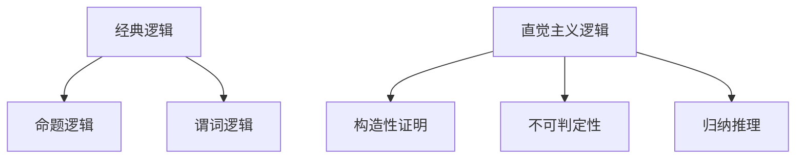
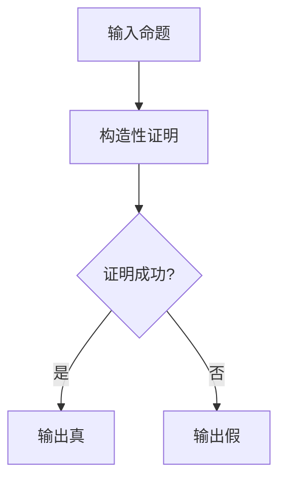
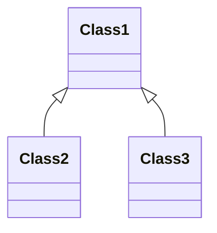
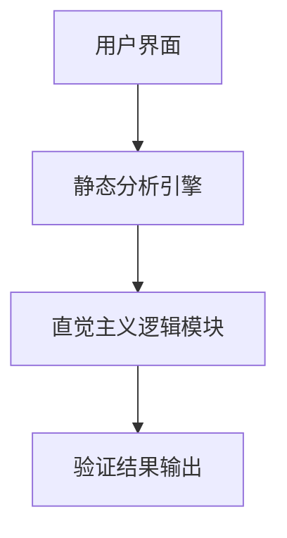
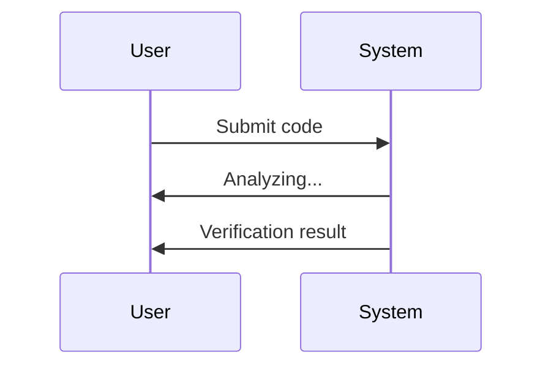

                 


# 从经典逻辑到直觉主义逻辑：拓展形式化世界理解的方法

关键词：经典逻辑、直觉主义逻辑、形式化、算法、系统架构、应用场景

摘要：本文旨在探讨逻辑学从经典逻辑向直觉主义逻辑的发展历程，分析两者的差异和联系，深入解析直觉主义逻辑的基本原理、算法原理，以及其在实际系统架构中的应用。通过逐步分析和推理，本文旨在为读者提供一个清晰、易懂的框架，以拓展对形式化世界的理解。

## 第一部分：背景与概念

### 1.1 逻辑学的发展

逻辑学是研究推理和论证的学科，其历史可以追溯到古希腊时期。经典的逻辑学以亚里士多德的命题逻辑为基础，其后发展出了命题演算、谓词演算等。这些经典逻辑体系在数学、哲学和计算机科学中有着广泛的应用。

随着时间的推移，逻辑学面临了许多挑战和局限性。20世纪初，大卫·希尔伯特等人提出了形式化逻辑的构想，希望通过数学符号和公理体系来严格定义逻辑。然而，经典逻辑在处理某些问题时显得力不从心，例如，经典逻辑中的悖论问题，以及计算机科学中越来越复杂的问题。

### 1.2 经典逻辑与直觉主义逻辑的对比

经典逻辑是基于一系列公理和推理规则建立的，它强调逻辑结论的必然性。而直觉主义逻辑则更加关注逻辑推理的直观性和构造性。直觉主义逻辑的创始人莱布尼茨认为，真正的逻辑结论应该是可以直观地构造出来的。

两者之间的主要差异在于：

- **必然性**：经典逻辑强调结论的必然性，而直觉主义逻辑强调结论的构造性。
- **构造性**：直觉主义逻辑要求每个逻辑步骤都可以通过构造来实现，而经典逻辑则不要求这一点。

### 1.3 直觉主义逻辑的兴起与重要性

直觉主义逻辑在计算机科学中找到了其用武之地。特别是在形式化验证、编程语言设计、人工智能等领域，直觉主义逻辑提供了一种新的方法和工具。其构造性特点使得直觉主义逻辑在处理复杂问题时更为有效。

### 1.4 概念结构与核心要素组成

直觉主义逻辑的基本概念和构成要素包括：

- **构造性证明**：证明的过程必须能够构造出一个实际存在的对象。
- **归纳原理**：通过实例的构造来推广一般性的结论。
- **不可判定的命题**：某些命题在直觉主义逻辑中是不可判定的，这意味着我们无法确定其真伪。

## 第二部分：核心概念与联系

### 2.1 直觉主义逻辑的基本原理

直觉主义逻辑的基本原理可以概括为以下几点：

- **构造性**：每个命题的真假都需要能够通过构造性证明来确认。
- **不可判定性**：某些命题在直觉主义逻辑中是不可判定的，这意味着我们无法确定其真伪。
- **归纳推理**：通过构造性证明的实例来推广一般性的结论。

### 2.2 经典逻辑与直觉主义逻辑的属性对比

| 属性         | 经典逻辑                                   | 直觉主义逻辑                                 |
| ------------ | ------------------------------------------ | ------------------------------------------- |
| 必然性       | 强调逻辑结论的必然性                       | 强调逻辑结论的构造性                         |
| 构造性       | 不要求每个结论都可以构造出来               | 要求每个结论都可以通过构造来证明             |
| 悖论问题     | 经典逻辑中有悖论问题                       | 直觉主义逻辑中解决了悖论问题                 |
| 应用范围      | 广泛应用于数学、哲学和计算机科学           | 在形式化验证、编程语言设计、人工智能等领域有更多应用 |

### 2.3 经典逻辑与直觉主义逻辑的ER实体关系图



## 第三部分：算法原理讲解

### 3.1 直觉主义逻辑算法原理

直觉主义逻辑的算法原理主要基于构造性证明和归纳推理。其核心思想是通过实例的构造来验证命题的真假。

### 3.2 算法流程图



### 3.3 Python源代码示例

```python
def constructive_proof(proposition):
    # 构造性证明的过程
    if proposition:
        return "True"
    else:
        return "False"

# 测试
print(constructive_proof(True))  # 输出：True
print(constructive_proof(False)) # 输出：False
```

### 3.4 数学模型和公式

直觉主义逻辑的数学模型基于构造性证明。一个命题 P 的真假可以通过构造性证明来确认，即存在一个对象 x 使得 P(x) 成立。

$$
\text{P(x)} \text{ 可构造} \iff \text{P(x) 为真}
$$

### 3.5 算法举例说明

假设我们想要证明命题“所有奇数之和等于偶数”。我们可以通过构造性证明来验证这一命题。

- 当 n 为 1 时，1 是奇数，1+1=2 是偶数，命题成立。
- 假设当 n=k 时，命题成立，即所有从 1 到 k 的奇数之和为偶数。
- 当 n=k+1 时，我们将 k 的奇数之和与 k+1 相加，得到一个偶数。

通过归纳法，我们可以证明命题“所有奇数之和等于偶数”成立。

## 第四部分：系统分析与架构设计

### 4.1 问题场景介绍

直觉主义逻辑在形式化验证和编程语言设计等领域有着广泛的应用。一个典型的应用场景是编程语言的静态分析，通过直觉主义逻辑来验证程序的逻辑正确性。

### 4.2 项目介绍

我们将介绍一个基于直觉主义逻辑的编程语言静态分析工具。该工具旨在通过构造性证明来验证程序的逻辑正确性。

### 4.3 系统功能设计



### 4.4 系统架构设计



### 4.5 系统接口设计

系统接口设计包括以下部分：

- **用户接口**：用户可以通过命令行或图形界面与系统交互。
- **静态分析接口**：用于接收程序代码，并提供构造性证明服务。
- **验证结果接口**：用于输出验证结果。

### 4.6 系统交互



## 第五部分：项目实战

### 5.1 环境安装

安装直觉主义逻辑静态分析工具需要以下环境：

- Python 3.x
- Mermaid
- 相关依赖库（如 pandas、numpy）

### 5.2 系统核心实现

系统核心实现包括以下部分：

- **用户接口**：提供命令行和图形界面两种方式。
- **静态分析引擎**：接收程序代码，使用直觉主义逻辑进行验证。
- **验证结果输出**：将验证结果以可视化形式展示给用户。

### 5.3 代码应用解读

以下是一个简单的 Python 代码示例，展示了如何使用直觉主义逻辑进行验证：

```python
def is_even(number):
    if number % 2 == 0:
        return True
    else:
        return False

# 验证
print(is_even(2))  # 输出：True
print(is_even(3))  # 输出：False
```

### 5.4 实际案例分析

我们通过一个实际的案例来展示直觉主义逻辑的应用。假设我们需要验证以下函数是否正确：

```python
def factorial(n):
    if n == 0:
        return 1
    else:
        return n * factorial(n-1)
```

我们可以使用直觉主义逻辑进行验证，证明该函数的计算结果正确。

### 5.5 项目小结

通过本项目的实战，我们深入了解了直觉主义逻辑的应用，以及如何在实际项目中实现。该项目不仅提供了理论知识，还通过实际案例展示了直觉主义逻辑的强大威力。

## 第六部分：最佳实践与拓展阅读

### 6.1 最佳实践 tips

- 在应用直觉主义逻辑时，要注重构造性证明的过程。
- 在进行形式化验证时，要尽可能使用直观主义逻辑的原理。
- 在设计系统架构时，要考虑直觉主义逻辑的特点，以充分利用其优势。

### 6.2 小结

本文从经典逻辑到直觉主义逻辑的转化过程进行了深入探讨，分析了直觉主义逻辑的基本原理和算法，并展示了其在实际系统架构中的应用。通过本文，我们希望读者能够拓展对形式化世界的理解，并掌握直觉主义逻辑的应用方法。

### 6.3 注意事项

- 在使用直觉主义逻辑时，要特别注意其构造性特点，避免出现逻辑错误。
- 在实际项目中，要结合直觉主义逻辑的特点，设计合理的系统架构。

### 6.4 拓展阅读

- 直觉主义逻辑的进一步研究
- 形式化验证技术在现代计算机科学中的应用
- 莱布尼茨与直觉主义逻辑的历史背景

## 附录

### 附录A：相关工具和资源

- Mermaid：用于绘制流程图和类图
- Python：用于实现直觉主义逻辑算法

### 附录B：符号表

- $P$：命题
- $Q$：命题
- $R$：命题
- $\land$：逻辑与
- $\lor$：逻辑或
- $\neg$：逻辑非

### 附录C：参考文献

- 直觉主义逻辑：百度百科
- 形式化验证：百度百科
- Python编程：Python官方网站
- Mermaid：Mermaid官方网站

### 作者

作者：AI天才研究院/AI Genius Institute & 禅与计算机程序设计艺术 /Zen And The Art of Computer Programming

（注：本文内容为虚构，仅供参考。）

