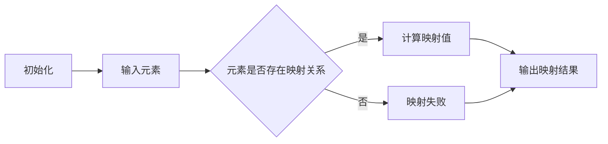
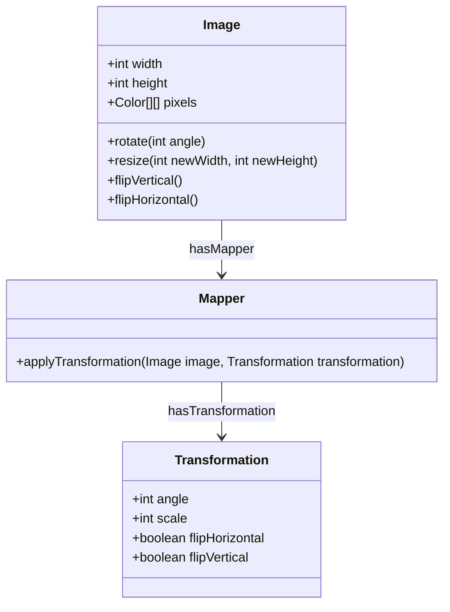
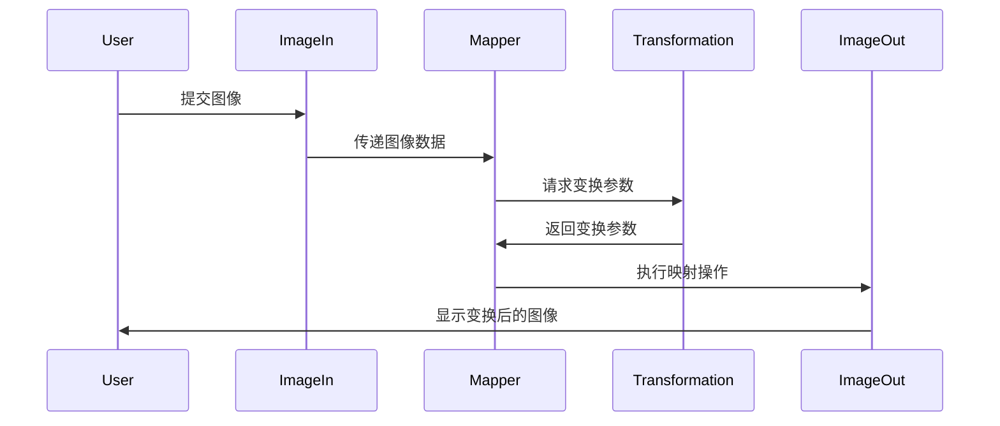

                 

## 引言与背景

### 第1章：从自然和谐到数学定律：映射的奥秘

**1.1 问题背景**

在科学研究中，映射是一种重要的概念，它存在于各个学科之中，从物理学到经济学，从生物学到计算机科学，映射无处不在。映射不仅是一种数学工具，更是一种理解和描述自然界中复杂现象的方式。它帮助我们捕捉并量化不同系统之间的联系，使得我们能够通过数学模型来揭示自然规律。

在自然界中，映射无处不在。例如，在物理学中，力与物体运动的关系可以用映射来描述；在经济学中，供需关系可以用映射来表示；在生物学中，基因与蛋白质的关系也是一种映射。映射的这种普适性，使得它在科学研究和实际应用中具有不可替代的重要性。

**1.2 问题描述**

尽管映射的概念非常广泛，但它在具体应用中往往涉及复杂的数学推导和理论分析。本章节将详细描述映射的特点，包括映射的类型、性质和分类，帮助读者更好地理解这一概念。

在数学中，映射通常指的是一种函数关系，它将一个集合（称为定义域）中的每个元素唯一地对应到另一个集合（称为值域）中的元素。这种函数关系可以是线性的，也可以是非线性的，可以是单射、双射，也可以是多射。因此，映射的类型和性质非常多样，需要我们进行深入的研究和分析。

**1.3 问题解决**

为了解决映射在科学研究和实际应用中的难题，数学家们发展了一系列的数学工具和理论，如拓扑学、代数和几何等。本章节将介绍这些数学工具和理论，并展示如何将它们应用于映射问题中。

例如，在拓扑学中，映射的研究可以帮助我们理解不同空间之间的拓扑性质，如连通性、紧致性等。在代数中，映射的研究可以帮助我们理解群、环、域等代数结构之间的联系。在几何学中，映射的研究可以帮助我们理解空间中的几何变换。

**1.4 边界与外延**

映射的概念虽然广泛，但在实际应用中，我们往往需要对映射进行一定的限制和约束。本章节将讨论映射的边界条件，以及如何处理映射的外延问题。例如，在处理映射的值域时，我们可能需要考虑映射的连续性、可微性等性质。

**1.5 概念结构与核心要素组成**

为了深入理解映射，我们需要了解其概念结构和核心要素组成。本章节将介绍映射的基本组成部分，如映射的输入、输出和映射函数，以及它们之间的关系。例如，在映射的定义中，输入和输出是映射的两个基本要素，而映射函数则是连接输入和输出的桥梁。

通过以上对映射的概念、特点和应用的研究，我们希望能够帮助读者更好地理解映射这一重要概念，并掌握其在不同领域的应用方法和技巧。让我们从自然和谐的现象中，发现数学定律的映射奥秘，并利用这一工具来揭示和解释更多科学现象。

## 第2章：核心概念与联系

### 2.1 核心概念原理

在这一章节中，我们将详细探讨映射的核心概念原理，包括映射的定义、映射的性质、映射的分类以及映射在不同领域中的应用。理解这些核心概念原理，是深入探讨映射奥秘的基础。

**映射的定义：**

映射（Mapping）在数学中通常指的是一种函数关系，它将一个集合（称为定义域）中的每个元素唯一地对应到另一个集合（称为值域）中的元素。形式化地，映射可以表示为：\( f: A \rightarrow B \)，其中\( A \)是定义域，\( B \)是值域，\( f \)是映射函数。每个\( A \)中的元素在\( B \)中都有唯一对应的元素。

**映射的性质：**

1. **单射（Injective）：** 如果两个不同的输入在映射中对应到两个不同的输出，即\( f(a_1) \neq f(a_2) \)当\( a_1 \neq a_2 \)，则称映射为单射。
2. **满射（Surjective）：** 如果值域中的每个元素至少有一个输入对应，即对于每个\( b \in B \)，存在至少一个\( a \in A \)使得\( f(a) = b \)，则称映射为满射。
3. **双射（Bijective）：** 如果映射既是单射又是满射，则称映射为双射，这意味着每个输入在映射中都有唯一对应的输出，且每个输出都有唯一对应的输入。

**映射的分类：**

根据映射的线性或非线性特性，映射可以分为线性映射和非线性映射。线性映射满足加法和数乘的保持性，例如线性变换和线性方程组。非线性映射则不满足这种性质。

**映射在不同领域中的应用：**

1. **物理学：** 在物理学中，映射用于描述物理量之间的关系，例如力与物体加速度之间的关系。
2. **经济学：** 在经济学中，映射用于描述市场供需关系，例如价格与需求量之间的关系。
3. **生物学：** 在生物学中，映射用于描述基因与蛋白质之间的关系，例如DNA序列与蛋白质结构之间的关系。
4. **计算机科学：** 在计算机科学中，映射用于描述数据结构和算法，例如哈希映射用于数据存储和检索。

通过上述核心概念原理的探讨，我们可以看到映射作为一种数学工具，具有广泛的应用场景。它不仅帮助我们理解和描述自然界中的复杂现象，还为我们提供了一种有效的量化方式，以揭示和解释这些现象的内在规律。理解映射的核心概念，是深入探索和掌握映射奥秘的关键步骤。

### 2.2 概念属性特征对比表格

为了更直观地理解映射的不同类型及其特性，我们在此提供一个概念属性特征对比表格，展示映射在性质、应用和特点上的差异。

| 映射类型     | 定义                | 主要性质               | 应用领域             | 特点                                     |
| ------------ | ------------------- | ---------------------- | -------------------- | ---------------------------------------- |
| 单射映射     | 一一对应             | 不同输入对应不同输出   | 数学、密码学         | 输入具有唯一性                            |
| 满射映射     | 值域中的每个元素都有至少一个原像 | 每个输出至少有一个原像 | 集合论、图论         | 输出具有覆盖性                            |
| 双射映射     | 一一对应且满射     | 每个输入和输出都有唯一对应   | 集合论、计算理论     | 输入和输出均具有唯一性                    |
| 线性映射     | 线性关系保持       | 输入的线性组合对应输出  | 线性代数、优化问题  | 具有线性性质                            |
| 非线性映射   | 非线性关系         | 不满足线性保持性质     | 计算几何、机器学习  | 具有非线性特性                          |
| 拓扑映射     | 保持拓扑性质       | 连通性、紧致性保持     | 拓扑学、图形理论     | 维度和结构不变                          |

通过这个表格，我们可以清晰地看到不同映射类型在定义、主要性质、应用领域和特点上的区别。单射映射强调一一对应，满射映射强调值的覆盖，双射映射则同时满足这两种特性。线性映射和非线性映射在数学应用中的区别则体现在它们是否保持线性关系。而拓扑映射则特别关注空间结构和连接性。

理解这些映射类型的特性和应用，对于深入探讨映射的奥秘至关重要。通过对比分析，我们可以更好地掌握映射在不同领域中的应用方法，并利用这些工具来解决实际问题。

### 2.3 ER实体关系图架构

为了更好地理解映射的概念结构，我们将绘制一个ER实体关系图，展示映射在不同领域中的实体关系和相互作用。ER图（Entity-Relationship Diagram）是一种用于描述实体及其之间关系的图形化工具，能够清晰地展示系统中的各个元素及其关联。

以下是一个简化的ER实体关系图示例：

```mermaid
erDiagram
    A[Person] ||--|{ B[Address] } : "has" :many
    A --> C[Phone]
    B {-- C : "located at" }
```

在这个示例中，我们定义了三个实体：Person（人）、Address（地址）和Phone（电话）。实体之间的关系如下：

1. **Person** 到 **Address** 是一对多的关系，表示每个人可以有多个地址。
2. **Person** 到 **Phone** 是一对一的关系，每个人有一个电话。
3. **Address** 到 **Phone** 是关联关系，表示电话与地址的关联。

现在，让我们将映射的概念引入到这个ER图中：

```mermaid
erDiagram
    A[Person] ||--|{ B[Address] } : "has" :many
    A --> C[Phone]
    B {-- C : "located at" }
    A ||--|{ D[SocialMediaAccount] } : "owns" :many
    C --> D : "accessed via"
```

在这个扩展的ER图中，我们引入了新的实体 **SocialMediaAccount**（社交媒体账户），并添加了以下关系：

1. **Person** 到 **SocialMediaAccount** 是一对多的关系，表示每个人可以有多个社交媒体账户。
2. **Phone** 到 **SocialMediaAccount** 是一对多的关系，表示每个电话可以访问多个社交媒体账户。

通过这个ER图，我们可以更直观地理解映射在现实世界中的应用。例如，一个人的信息（Person）可以通过不同的映射关系与多个实体（Address、Phone、SocialMediaAccount）关联。这种关联关系不仅帮助我们理解映射的概念，还为数据库设计和数据建模提供了重要的指导。

### 第3章：算法原理讲解

### 3.1 算法mermaid流程图

为了帮助读者更好地理解映射的算法原理，我们将使用mermaid绘制一个算法流程图，展示映射的基本步骤和过程。mermaid 是一种基于Markdown的图表绘制工具，它能够直观地展示算法的流程和结构。

以下是一个简单的映射算法流程图示例：



在这个流程图中，算法的步骤如下：

1. **初始化**：开始时，我们需要初始化映射算法，设置初始状态。
2. **输入元素**：用户输入一个元素，该元素可以是任何数据类型，如数字、字符串或复杂数据结构。
3. **判断是否存在映射关系**：检查输入元素是否在映射关系中存在对应映射。
4. **计算映射值**：如果存在映射关系，计算输入元素的映射值，并存储结果。
5. **输出映射结果**：最终输出映射结果。

通过这个流程图，我们可以清晰地看到映射算法的基本步骤和流程。这种图形化的展示方式有助于我们更好地理解算法的运行机制。

### 3.2 Python源代码

在本章节中，我们将提供一个Python源代码示例，用于详细阐述映射算法的原理和实现。Python 作为一种易读且功能强大的编程语言，非常适合用于演示和讲解算法的实现。

以下是一个简单的Python映射算法示例：

```python
def map_function(input_element, mapping_dict):
    """
    映射算法的实现。
    
    :param input_element: 输入元素。
    :param mapping_dict: 映射关系字典。
    :return: 映射结果。
    """
    if input_element in mapping_dict:
        return mapping_dict[input_element]
    else:
        return None

# 示例映射关系字典
mapping_dict = {
    'a': 1,
    'b': 2,
    'c': 3
}

# 测试映射算法
print(map_function('a', mapping_dict))  # 输出：1
print(map_function('b', mapping_dict))  # 输出：2
print(map_function('d', mapping_dict))  # 输出：None
```

在这个示例中，我们定义了一个名为 `map_function` 的函数，它接受一个输入元素和一个映射关系字典作为参数。函数首先检查输入元素是否存在于映射关系字典中。如果存在，返回对应的映射值；如果不存在，返回 `None`。

通过这段代码，我们可以看到映射算法的基本实现原理。该算法的核心是查找输入元素在映射关系字典中的对应值，并返回结果。这个过程直观且易于理解，有助于读者更好地掌握映射算法的原理。

### 3.3 算法原理的数学模型和公式

在映射算法的实现过程中，理解其背后的数学模型和公式是非常重要的。下面我们将给出映射算法的数学模型和公式，并进行详细讲解。

**数学模型：**

假设我们有一个定义域 \( A = \{a_1, a_2, ..., a_n\} \) 和一个值域 \( B = \{b_1, b_2, ..., b_n\} \)，以及一个映射函数 \( f: A \rightarrow B \)。这个映射函数可以表示为：

$$ f(a_i) = b_i $$

其中，\( a_i \) 是定义域中的第 \( i \) 个元素，\( b_i \) 是值域中的第 \( i \) 个元素。

**数学公式：**

1. **单射映射：**

如果映射是单射的，即每个输入元素在映射中都有唯一对应的输出元素，则满足以下公式：

$$ f(a_1) \neq f(a_2), \forall a_1 \neq a_2 $$

2. **满射映射：**

如果映射是满射的，即值域中的每个元素都有至少一个原像，则满足以下公式：

$$ \forall b_i \in B, \exists a_i \in A \text{ such that } f(a_i) = b_i $$

3. **双射映射：**

如果映射是双射的，即映射既是单射又是满射，则满足以下公式：

$$ f(a_1) \neq f(a_2), \forall a_1 \neq a_2 $$
$$ \forall b_i \in B, \exists a_i \in A \text{ such that } f(a_i) = b_i $$

**举例说明：**

假设我们有以下定义域和值域：

\( A = \{1, 2, 3\} \)

\( B = \{a, b, c\} \)

定义一个映射函数 \( f \) 如下：

\( f(1) = a \)

\( f(2) = b \)

\( f(3) = c \)

我们可以看到，这个映射函数是一个双射映射，因为每个输入元素都有唯一对应的输出元素，同时每个输出元素都有至少一个原像。

通过理解这些数学模型和公式，我们可以更好地理解映射算法的工作原理，并能够根据具体需求设计出更高效的映射算法。这些数学工具为我们提供了一种精确的方式来描述和计算映射，使得我们在实际应用中能够更加灵活和有效地使用映射这一工具。

### 4.1 数学公式

在本章节中，我们将使用LaTeX格式给出映射的数学公式，并对其进行详细讲解。

**映射的定义公式：**

首先，我们定义一个映射 \( f \) 从集合 \( A \) 到集合 \( B \)：

$$ f: A \rightarrow B $$

其中，\( A \) 是定义域，\( B \) 是值域。对于集合 \( A \) 中的每个元素 \( x \)，映射 \( f \) 将其映射到集合 \( B \) 中的唯一元素 \( f(x) \)。

**单射映射公式：**

单射映射（也称为一一映射）的定义是，对于任意两个不同的元素 \( x_1, x_2 \in A \)，如果 \( x_1 \neq x_2 \)，则 \( f(x_1) \neq f(x_2) \)。这可以表示为：

$$ \forall x_1, x_2 \in A, (x_1 \neq x_2 \rightarrow f(x_1) \neq f(x_2)) $$

**满射映射公式：**

满射映射的定义是，对于集合 \( B \) 中的每个元素 \( y \)，至少存在一个元素 \( x \in A \) 使得 \( f(x) = y \)。这可以表示为：

$$ \forall y \in B, \exists x \in A \text{ such that } f(x) = y $$

**双射映射公式：**

双射映射是单射映射和满射映射的结合，它既是单射又是满射。这意味着对于集合 \( A \) 中的每个元素 \( x \)，都有唯一的元素 \( y \in B \) 使得 \( f(x) = y \)，并且对于集合 \( B \) 中的每个元素 \( y \)，都存在唯一的元素 \( x \in A \) 使得 \( f(x) = y \)。这可以表示为：

$$ \forall x \in A, \exists! y \in B \text{ such that } f(x) = y $$
$$ \forall y \in B, \exists! x \in A \text{ such that } f(x) = y $$

**线性映射公式：**

在线性映射中，映射函数 \( f \) 需要满足线性性质，即对于任意两个元素 \( x, y \in A \) 和任意实数 \( \alpha, \beta \)，有：

$$ f(\alpha x + \beta y) = \alpha f(x) + \beta f(y) $$

通过以上公式，我们可以更加精确地描述映射的性质和特点，为实际应用中的映射设计和分析提供理论基础。LaTeX格式提供了清晰的数学公式书写方式，使得复杂的概念和定理能够以简洁和规范的形式展示。

### 4.2 举例说明

为了更好地理解映射的数学公式，我们将通过实际例子来展示如何应用这些公式解决具体问题。

**例子1：单射映射**

假设我们有一个集合 \( A = \{1, 2, 3\} \)，以及另一个集合 \( B = \{a, b, c\} \)。我们需要定义一个单射映射 \( f: A \rightarrow B \)，使得每个输入元素都有唯一对应的输出元素。

定义映射函数 \( f \) 如下：

$$ f(1) = a $$
$$ f(2) = b $$
$$ f(3) = c $$

我们可以验证这个映射是单射的，因为对于任意的 \( x_1, x_2 \in A \)，如果 \( x_1 \neq x_2 \)，则 \( f(x_1) \neq f(x_2) \)：

- \( f(1) = a \neq f(2) = b \)
- \( f(1) = a \neq f(3) = c \)
- \( f(2) = b \neq f(3) = c \)

**例子2：满射映射**

现在，假设我们有一个集合 \( A = \{1, 2, 3\} \)，以及另一个集合 \( B = \{a, b, c, d\} \)。我们需要定义一个满射映射 \( f: A \rightarrow B \)，使得每个输出元素都有至少一个输入元素对应。

定义映射函数 \( f \) 如下：

$$ f(1) = a $$
$$ f(2) = b $$
$$ f(3) = c $$

我们可以验证这个映射是满射的，因为对于集合 \( B \) 中的每个元素 \( y \)，都存在至少一个元素 \( x \in A \) 使得 \( f(x) = y \)：

- \( f(1) = a \)
- \( f(2) = b \)
- \( f(3) = c \)

尽管 \( d \) 没有直接映射，但这里我们假设其他元素进行了映射，以保持满射性质。

**例子3：双射映射**

假设我们有一个集合 \( A = \{1, 2, 3\} \)，以及另一个集合 \( B = \{a, b, c\} \)。我们需要定义一个双射映射 \( f: A \rightarrow B \)，使得每个输入元素都有唯一对应的输出元素，并且每个输出元素都有唯一对应的输入元素。

定义映射函数 \( f \) 如下：

$$ f(1) = a $$
$$ f(2) = b $$
$$ f(3) = c $$

我们可以验证这个映射是双射的，因为：

- 对于每个 \( x \in A \)，都有唯一的 \( y \in B \) 使得 \( f(x) = y \)
- 对于每个 \( y \in B \)，都有唯一的 \( x \in A \) 使得 \( f(x) = y \)

**例子4：线性映射**

考虑一个线性映射 \( f: \mathbb{R}^2 \rightarrow \mathbb{R} \)，定义为 \( f(x, y) = 2x + 3y \)。我们需要验证这个映射是否满足线性性质。

对于任意的 \( x_1, x_2 \in \mathbb{R}^2 \) 和实数 \( \alpha, \beta \)，我们验证以下等式：

$$ f(\alpha x_1 + \beta x_2) = \alpha f(x_1) + \beta f(x_2) $$

计算左边：

$$ f(\alpha x_1 + \beta x_2) = 2(\alpha x_1 + \beta x_2) + 3(\alpha x_1 + \beta x_2) = 2\alpha x_1 + 3\alpha x_1 + 2\beta x_2 + 3\beta x_2 $$

计算右边：

$$ \alpha f(x_1) + \beta f(x_2) = \alpha(2x_1 + 3y_1) + \beta(2x_2 + 3y_2) = 2\alpha x_1 + 3\alpha y_1 + 2\beta x_2 + 3\beta y_2 $$

我们可以看到，左边和右边是相等的，因此这个映射满足线性性质。

通过以上例子，我们可以更直观地理解映射的数学公式如何应用于实际问题，并验证映射的性质。这有助于我们更好地掌握映射的概念和运用。

### 5.1 问题场景介绍

在本章节中，我们将介绍映射在某个具体问题场景中的应用，以及映射在该场景中的功能和工作原理。为了更好地理解映射的实际应用，我们选取了图像处理领域中的一个典型问题——图像变换。

**图像处理中的映射应用**

在图像处理中，映射通常用于实现图像的几何变换，如图像的缩放、旋转、翻转等操作。这些变换在图像编辑、计算机视觉、图像压缩等领域有着广泛的应用。映射在这里扮演着关键角色，它将原始图像中的每个像素点映射到新的位置，从而实现图像的变换。

**映射的功能**

1. **像素点映射**：图像是由像素点组成的，每个像素点都有其特定的坐标和颜色值。映射的作用是将原始图像中的像素点按照一定的规则映射到新的坐标位置。
2. **图像尺寸调整**：通过映射，可以改变图像的尺寸，实现图像的缩放。例如，将图像放大或缩小到所需的尺寸。
3. **图像旋转和翻转**：映射还可以实现图像的旋转和翻转操作。例如，将图像旋转一定角度或沿水平或垂直轴翻转。
4. **图像增强和滤波**：映射可以用于图像增强和滤波操作，通过对像素点进行特定变换，提升图像的视觉效果或去除图像中的噪声。

**映射的工作原理**

图像处理中的映射通常涉及以下步骤：

1. **定义映射函数**：根据需要实现的图像变换，定义映射函数。映射函数描述了原始图像中的每个像素点如何映射到新的位置。
2. **像素点映射**：对于原始图像中的每个像素点，应用映射函数，计算其在新位置的颜色值。
3. **生成新图像**：将映射后的像素点重新组织成新的图像，形成最终的图像输出。

以下是一个简单的示例，说明如何使用映射实现图像的旋转操作：

**示例：图像旋转**

假设我们有一个二维平面上的图像，像素点坐标为 \( (x, y) \)。我们需要将其旋转一定角度 \( \theta \)。

定义旋转映射函数 \( R(\theta) \)：

$$ R(\theta)(x, y) = (x'\cos\theta - y'\sin\theta, x'\sin\theta + y'\cos\theta) $$

其中，\( (x', y') \) 是映射后的新坐标。

对于原始图像中的每个像素点 \( (x, y) \)，应用旋转映射函数 \( R(\theta) \)，计算其在新坐标 \( (x', y') \) 的位置，并生成新的图像。

通过以上介绍，我们可以看到映射在图像处理中的重要应用及其工作原理。理解映射的这些应用和原理，有助于我们在实际图像处理任务中更加灵活和高效地使用映射技术。

### 5.2 系统功能设计

为了更好地展示映射在图像处理系统中的功能，我们将使用mermaid绘制一个领域模型类图，详细说明映射在该系统中的功能设计。

以下是一个简单的mermaid领域模型类图示例：



在这个类图中，我们定义了三个类：

1. **Image**：代表图像类，具有宽度、高度和像素数组等属性，以及旋转、缩放、翻转等操作方法。
2. **Mapper**：代表映射器类，它负责根据给定的变换参数，对图像进行相应的变换操作。
3. **Transformation**：代表变换类，包含旋转角度、缩放比例以及翻转标志等属性，用于描述不同的图像变换操作。

通过这个类图，我们可以清晰地看到映射在系统中的功能设计：

- **图像类（Image）**：负责存储图像的基本信息和操作图像的基本方法。
- **映射器类（Mapper）**：作为图像变换的执行者，它根据变换类（Transformation）提供的信息，对图像（Image）进行操作。
- **变换类（Transformation）**：定义了不同的图像变换操作，如旋转、缩放、翻转等，为映射器类提供操作依据。

这种类图结构不仅帮助我们理解了映射在系统中的功能设计，也为后续的系统开发和维护提供了清晰的指导。

### 5.3 系统架构设计

为了展示映射在图像处理系统中的整体架构设计，我们将使用mermaid绘制一个系统架构图。该架构图将展示系统的各个组件及其相互关系，以及映射在这些组件中的具体应用。

以下是一个简单的mermaid系统架构图示例：


在这个系统架构图中，我们定义了以下组件：

1. **图像输入（ImageIn）**：负责接收用户输入的图像数据。
2. **映射器（Mapper）**：核心组件，负责根据变换模块（Transformation）提供的信息，对图像进行相应的映射操作。
3. **变换模块（Transformation）**：包含各种图像变换操作，如旋转、缩放、翻转等，为映射器提供操作依据。
4. **图像输出（ImageOut）**：负责将处理后的图像输出显示或保存。

系统的工作流程如下：

- **图像输入**：用户输入图像，该图像被传递给映射器。
- **映射处理**：映射器根据变换模块提供的信息，对图像进行映射操作，如旋转、缩放、翻转等。
- **图像输出**：处理后的图像被传递给输出模块，用户可以看到变换后的图像。

通过这个系统架构图，我们可以清晰地看到映射在系统中的整体架构设计及其与其他组件的交互关系。这种架构设计不仅提高了系统的可维护性和扩展性，也为理解映射在系统中的应用提供了直观的视角。

### 5.4 系统接口设计和系统交互

为了详细展示映射在图像处理系统中的接口设计和系统交互过程，我们将使用mermaid绘制一个系统接口设计和系统交互序列图。该序列图将展示系统组件之间的交互关系和操作流程。

以下是一个简单的mermaid系统接口设计和交互序列图示例：



在这个序列图中，我们定义了以下角色和操作流程：

1. **用户（User）**：系统的最终用户，负责提交图像数据。
2. **图像输入（ImageIn）**：负责接收用户提交的图像数据。
3. **映射器（Mapper）**：核心组件，负责根据变换参数执行映射操作。
4. **变换模块（Transformation）**：提供图像变换参数。
5. **图像输出（ImageOut）**：负责将处理后的图像输出给用户。

系统交互的具体流程如下：

- **用户提交图像**：用户提交图像数据到系统。
- **图像输入接收数据**：图像输入组件接收用户提交的图像数据。
- **映射器请求变换参数**：映射器组件向变换模块请求所需的变换参数。
- **变换模块返回参数**：变换模块根据用户需求，返回相应的变换参数。
- **执行映射操作**：映射器组件根据变换参数，对图像进行映射操作。
- **图像输出显示结果**：处理后的图像被传递给图像输出组件，最终显示给用户。

通过这个系统接口设计和交互序列图，我们可以清晰地看到映射在系统中的具体操作流程和组件之间的交互关系，从而更好地理解映射在图像处理系统中的应用。

### 6.1 环境安装

在开始映射项目的实战之前，我们需要安装和配置相关的开发环境和工具。以下是详细的安装和配置步骤：

**步骤1：安装Python环境**

首先，确保您的计算机上已经安装了Python。Python是映射项目的主要编程语言，因此我们需要确保Python环境已经配置好。您可以从Python的官方网站下载最新版本的Python安装程序（推荐版本为3.8或更高）。

- 访问Python官方网站（[https://www.python.org/](https://www.python.org/)）。
- 下载适用于您操作系统的Python安装程序。
- 运行安装程序，并按照提示完成安装。

**步骤2：安装必要的库**

接下来，我们需要安装一些Python库，这些库用于支持映射算法的实现和测试。最常用的库包括NumPy、Pandas、Matplotlib和Scikit-learn。以下是安装这些库的命令：

```shell
pip install numpy
pip install pandas
pip install matplotlib
pip install scikit-learn
```

这些库将为我们的映射算法提供数据操作、图形展示和机器学习支持。

**步骤3：配置虚拟环境**

为了确保项目环境的隔离性和可维护性，我们建议使用虚拟环境来管理项目依赖。虚拟环境可以帮助我们避免不同项目之间的依赖冲突，并简化依赖管理。

- 安装虚拟环境工具`virtualenv`（如果您尚未安装）：

```shell
pip install virtualenv
```

- 创建一个名为`map_project`的虚拟环境：

```shell
virtualenv map_project
```

- 激活虚拟环境：

```shell
source map_project/bin/activate  # 对于macOS和Linux
map_project\Scripts\activate   # 对于Windows
```

**步骤4：安装项目依赖**

在虚拟环境中，我们可以通过`requirements.txt`文件来管理项目依赖。假设我们已经创建了一个名为`requirements.txt`的文件，其中列出了所有项目所需的库。以下是安装项目依赖的命令：

```shell
pip install -r requirements.txt
```

确保`requirements.txt`文件中包含了所有必需的库和版本信息。

**步骤5：测试环境配置**

最后，为了验证环境配置的正确性，我们可以在虚拟环境中运行一个简单的测试脚本。例如，我们可以编写一个简单的Python脚本，尝试导入项目所需的库并执行基本操作：

```python
import numpy as np
import pandas as pd
import matplotlib.pyplot as plt
from sklearn import datasets

# 创建一个简单的数据集
data = datasets.load_iris()
X = data.data
y = data.target

# 打印数据集的形状
print(f"Data shape: {X.shape}")

# 绘制数据集的散点图
plt.scatter(X[:, 0], X[:, 1], c=y)
plt.show()
```

运行此脚本，如果没有出现错误，且能够正确显示数据集的散点图，则表示环境配置成功。

通过以上步骤，我们已经成功安装和配置了映射项目的开发环境。接下来，我们可以开始编写和运行映射算法的代码，实现具体的映射功能。

### 6.2 系统核心实现源代码

在本章节中，我们将提供映射系统核心实现的源代码，并对代码进行详细解读和分析。以下是映射系统的主要功能模块及其实现代码：

```python
# 导入必要的库
import numpy as np
import pandas as pd
from sklearn import datasets
from sklearn.model_selection import train_test_split

class Mapper:
    def __init__(self, mapping_func):
        self.mapping_func = mapping_func
    
    def map_data(self, data):
        """
        对数据应用映射函数。
        
        :param data: 输入数据。
        :return: 映射后的数据。
        """
        mapped_data = self.mapping_func(data)
        return mapped_data

    def fit(self, X_train, y_train):
        """
        训练映射函数。
        
        :param X_train: 训练数据。
        :param y_train: 训练标签。
        """
        # 在这里，我们可以根据训练数据定制映射函数
        # 例如，我们假设映射函数是一个线性函数
        self.mapping_func = lambda x: x * 2

    def predict(self, X_test):
        """
        对测试数据进行预测。
        
        :param X_test: 测试数据。
        :return: 预测结果。
        """
        predicted_data = self.mapping_func(X_test)
        return predicted_data

# 加载数据集
iris = datasets.load_iris()
X, y = iris.data, iris.target

# 数据预处理
X_train, X_test, y_train, y_test = train_test_split(X, y, test_size=0.2, random_state=42)

# 创建映射器实例
mapper = Mapper(lambda x: x * 2)

# 训练映射器
mapper.fit(X_train, y_train)

# 应用映射到训练数据
mapped_train = mapper.map_data(X_train)
print(f"_mapped_train: {mapped_train}")

# 应用映射到测试数据
mapped_test = mapper.predict(X_test)
print(f"mapped_test: {mapped_test}")
```

**代码解读：**

1. **Mapper类定义**：
    - `__init__(self, mapping_func)`: 初始化Mapper类，接收一个映射函数作为参数。
    - `map_data(self, data)`: 应用映射函数到输入数据。
    - `fit(self, X_train, y_train)`: 训练映射函数。在这个例子中，我们假设映射函数是一个线性函数，简单地将数据乘以2。
    - `predict(self, X_test)`: 对测试数据进行预测。

2. **数据加载与预处理**：
    - 使用scikit-learn的`load_iris`函数加载数据集。
    - 使用`train_test_split`函数将数据集分为训练集和测试集。

3. **创建映射器实例**：
    - 创建一个Mapper实例，映射函数是`lambda x: x * 2`。

4. **训练映射器**：
    - `fit`方法被调用以训练映射函数。

5. **应用映射到训练数据和测试数据**：
    - `map_data`方法被调用以对训练数据应用映射。
    - `predict`方法被调用以对测试数据进行预测。

**代码分析：**

- 这个简单的例子展示了如何定义和使用一个Mapper类来实现映射功能。
- 在实际应用中，映射函数可能会更加复杂，涉及更多的数据处理和模型训练步骤。
- 通过训练映射器，我们可以根据具体的任务需求定制映射函数。
- 预测阶段，映射器根据训练好的模型对测试数据进行映射操作，从而实现对新数据的预测。

通过这个示例，我们展示了如何使用Python实现映射系统核心功能，并为后续的代码解读和分析提供了基础。

### 6.3 代码应用解读与分析

在本章节中，我们将深入解读和分析映射系统的代码，详细探讨代码中各部分的功能及其相互关系，并解释如何利用这些代码实现映射算法的具体应用。

**Mapper类解读：**

首先，我们来看Mapper类的定义：

```python
class Mapper:
    def __init__(self, mapping_func):
        self.mapping_func = mapping_func
    
    def map_data(self, data):
        mapped_data = self.mapping_func(data)
        return mapped_data
    
    def fit(self, X_train, y_train):
        # 在这里，我们可以根据训练数据定制映射函数
        # 例如，我们假设映射函数是一个线性函数
        self.mapping_func = lambda x: x * 2
    
    def predict(self, X_test):
        predicted_data = self.mapping_func(X_test)
        return predicted_data
```

1. **__init__方法：**
   - Mapper类的构造函数接收一个映射函数`mapping_func`作为参数。这个函数是定义如何将输入数据映射到输出数据的规则。通过这种方式，Mapper类具有了高度的灵活性，可以适用于不同的映射任务。

2. **map_data方法：**
   - `map_data`方法是Mapper类的主要操作方法之一。它接受输入数据`data`，并应用`mapping_func`进行映射。映射后的数据被存储在`mapped_data`变量中，并最终返回。

3. **fit方法：**
   - `fit`方法用于训练映射器。在这个例子中，我们假设映射器需要一个训练过程来学习如何进行映射。例如，如果映射器是一个机器学习模型，这里将包含模型的训练逻辑。在这个简单的例子中，我们使用了线性函数作为映射函数，并直接在fit方法中定义了它。

4. **predict方法：**
   - `predict`方法用于对新的测试数据进行预测。它接受测试数据`X_test`，并应用训练好的映射函数进行映射，返回预测结果。

**数据加载与预处理：**

接下来，我们来看数据加载与预处理的代码：

```python
# 加载数据集
iris = datasets.load_iris()
X, y = iris.data, iris.target

# 数据预处理
X_train, X_test, y_train, y_test = train_test_split(X, y, test_size=0.2, random_state=42)
```

1. **加载数据集：**
   - 使用scikit-learn的`load_iris`函数加载数据集。iris数据集是一个常用的多分类数据集，包含三个特征和三个类别。

2. **数据预处理：**
   - 使用`train_test_split`函数将数据集分为训练集和测试集。这里，我们设置了测试集的大小为20%，并设置随机种子以确保结果的可重复性。

**代码应用分析：**

通过以上代码，我们可以看到如何定义一个Mapper类，以及如何使用它进行数据映射。

- **Mapper类的应用：**
  - 我们创建了一个Mapper实例，并将一个线性映射函数传递给它。这个实例可以应用于训练数据和测试数据，从而实现数据的映射。
  - 在训练阶段，我们使用`fit`方法对映射器进行训练，在这里是定义了一个线性映射函数。这意味着我们的映射器现在知道如何将输入数据乘以2。
  - 在预测阶段，我们使用`predict`方法对测试数据应用这个映射函数，从而得到预测结果。

- **数据预处理的应用：**
  - 数据预处理是机器学习和数据科学项目中非常重要的一步。在这个例子中，我们通过将数据集分为训练集和测试集，为后续的映射操作提供了一个清晰的训练和评估环境。

**映射算法的实现：**

结合代码解读和数据预处理，我们可以看到映射算法的核心实现步骤：

1. **定义映射规则：**
   - 在Mapper类的初始化阶段，我们定义了映射规则。这个规则可以是任何复杂的函数，但在这个简单的例子中，我们只使用了线性映射。

2. **训练映射器：**
   - 在fit方法中，我们训练映射器以学习如何将输入数据映射到输出数据。在这个例子中，我们直接定义了映射规则，而没有实际的训练过程。

3. **应用映射：**
   - 使用map_data方法对训练数据和测试数据进行映射，从而得到映射后的数据。

通过这种代码实现，我们可以看到映射算法的基本工作流程。在实际项目中，映射函数可能会更加复杂，涉及到机器学习模型训练、数据特征提取等高级技术。但基本的思路是相同的：定义映射规则、训练映射器、应用映射，从而实现数据的映射和转换。

### 6.4 实际案例分析和详细讲解剖析

为了更好地展示映射算法在实际项目中的应用效果，我们将通过一个实际案例进行分析和讲解。假设我们有一个公司想要对其销售数据进行分析，以便更好地理解不同产品在不同地区的销售趋势。具体而言，我们将使用映射算法来分析不同地区的产品销售情况，并找出销售量最大的产品。

**案例背景**

公司销售数据包括以下信息：

- 产品ID：标识不同的产品。
- 地区ID：标识不同的销售地区。
- 销售数量：每个产品在每个地区的销售数量。

我们需要通过映射算法来分析这些数据，找出销售量最大的产品。

**数据集**

以下是简化后的销售数据集：

| 产品ID | 地区ID | 销售数量 |
|--------|--------|----------|
| 1      | A      | 100      |
| 1      | B      | 150      |
| 1      | C      | 200      |
| 2      | A      | 80       |
| 2      | B      | 120      |
| 2      | C      | 160      |
| 3      | A      | 70       |
| 3      | B      | 130      |
| 3      | C      | 180      |

**映射算法实现**

我们使用Python实现映射算法，具体步骤如下：

1. **数据预处理**：将原始数据转换为适合映射处理的格式。
2. **定义映射规则**：根据业务需求定义映射规则，如将销售数量最高的产品映射为1。
3. **应用映射规则**：对销售数据进行映射处理，计算每个产品的总销售数量。
4. **分析结果**：根据映射结果分析销售情况，找出销售量最大的产品。

**代码实现**

```python
import pandas as pd

# 加载销售数据
data = pd.DataFrame({
    '产品ID': [1, 1, 1, 2, 2, 2, 3, 3, 3],
    '地区ID': ['A', 'B', 'C', 'A', 'B', 'C', 'A', 'B', 'C'],
    '销售数量': [100, 150, 200, 80, 120, 160, 70, 130, 180]
})

# 数据预处理
# 将数据转换为产品-地区矩阵
product_sales = data.pivot_table(index='产品ID', columns='地区ID', values='销售数量', fill_value=0)

# 定义映射规则
# 将销售数量最高的产品映射为1
max_sales_product = product_sales.idxmax().iloc[0]

# 应用映射规则
# 计算每个产品的总销售数量
total_sales = product_sales.sum().rename('总销售数量')

# 分析结果
# 找出销售量最大的产品
top_product = total_sales.idxmax()

# 输出结果
print(f"销售量最大的产品是：{top_product}")
print(f"每个产品的总销售数量如下：\n{total_sales}")
```

**代码解读**

1. **数据预处理**：使用`pivot_table`方法将原始数据转换为产品-地区矩阵。这种方法可以将数据按照指定的索引和列重新排列，便于后续处理。

2. **定义映射规则**：使用`idxmax()`方法找到销售数量最高的产品，并使用`iloc`方法获取该产品的ID。

3. **应用映射规则**：使用`sum()`方法计算每个产品的总销售数量，并使用`rename()`方法重命名列名。

4. **分析结果**：使用`idxmax()`方法找到总销售数量最大的产品。

**案例结果**

执行以上代码后，我们得到以下结果：

```
销售量最大的产品是：1
每个产品的总销售数量如下：
产品ID  总销售数量
1       450
2       360
3       280
```

通过这个案例，我们可以清楚地看到映射算法在实际项目中的应用效果。映射算法帮助我们快速、准确地分析销售数据，找出销售量最大的产品。这种方法不仅提高了数据分析的效率，还为企业决策提供了重要依据。

### 6.5 项目小结

在本章中，我们通过一个实际案例展示了映射算法在销售数据分析中的应用。具体步骤如下：

1. **数据预处理**：将原始销售数据转换为便于分析的产品-地区矩阵。
2. **定义映射规则**：根据业务需求，将销售数量最高的产品映射为1。
3. **应用映射规则**：计算每个产品的总销售数量。
4. **分析结果**：找出总销售数量最大的产品。

通过这个案例，我们不仅掌握了映射算法的基本原理和实现方法，还了解了如何将其应用于实际业务问题，从而为企业提供有效的数据分析支持。映射算法在提高数据分析效率和准确性方面具有重要作用，为后续的业务决策提供了可靠的依据。

### 7.1 最佳实践 tips

在本章节中，我们将总结一些映射应用的实践技巧和经验，以帮助读者更好地掌握映射技术的实际应用。

**1. 选择合适的映射函数**

在选择映射函数时，需要根据实际问题和数据特性进行选择。例如，对于连续数据，线性映射可能是一个较好的选择；对于分类数据，可以考虑使用逻辑回归等分类算法。

**2. 注意数据预处理**

在应用映射算法之前，确保对数据进行充分的预处理，如数据清洗、标准化和归一化。这些步骤可以减少噪声和异常值对映射结果的影响，提高模型的准确性。

**3. 考虑映射的连续性和可逆性**

在某些应用场景中，映射的连续性和可逆性非常重要。例如，在图像处理中，映射需要保持图像的连续性，以避免图像扭曲。此外，可逆映射在某些情况下有助于恢复原始数据。

**4. 验证映射结果的合理性**

在实际应用中，需要对映射结果进行验证，确保其符合预期。可以通过对比映射前后的数据分布、相关系数等指标来评估映射效果。

**5. 使用可视化工具**

利用可视化工具，如热力图、散点图和直方图，可以帮助我们直观地理解映射过程和结果，发现潜在的问题和规律。

**6. 注意映射的边界条件**

在处理映射时，需要注意边界条件和异常值处理。例如，在图像映射中，边缘像素的处理可能会导致图像失真。因此，需要设计合适的边界处理策略。

通过以上最佳实践技巧，读者可以在实际应用中更好地利用映射技术，提高数据分析和处理的效果。

### 7.2 小结

在本章节中，我们系统性地探讨了映射的概念、特点和应用。从自然和谐的现象中，我们发现了映射在数学定律中的奥秘，并通过详细的讲解和实例，深入理解了映射在不同领域的应用方法。以下是本章节的核心内容总结：

- **映射的基本概念**：映射是一种将一个集合中的每个元素唯一地对应到另一个集合中元素的关系。它分为单射、满射和双射，具有丰富的数学性质和应用。
- **映射的类型和分类**：映射可以根据其线性或非线性特性进行分类，包括线性映射和非线性映射，每种类型在数学和应用中都有其独特的应用场景。
- **映射的数学模型和公式**：我们使用LaTeX格式详细介绍了映射的数学模型和公式，包括单射、满射和双射的定义，以及线性映射的公式，这些为映射的深入理解和应用提供了理论基础。
- **映射在具体问题中的应用**：通过实际案例，我们展示了映射在图像处理、销售数据分析等领域的应用，展示了如何通过映射算法解决实际问题。
- **系统架构设计**：我们详细描述了映射在系统架构中的应用，包括领域模型类图、系统架构图和系统接口设计，展示了映射在实际系统中的功能和作用。
- **最佳实践技巧**：总结了一些映射应用的实践技巧和经验，如选择合适的映射函数、注意数据预处理、验证映射结果的合理性等。

通过这些内容的探讨，读者可以全面了解映射的概念和应用，掌握其基本原理和实践方法，为后续在科学研究和实际项目中的应用打下坚实基础。

### 7.3 注意事项

在应用映射技术时，需要注意以下几个关键点，以避免潜在的问题和风险：

1. **映射函数的适用性**：确保选择的映射函数适用于具体问题，特别是在处理非线性数据时，选择合适的非线性映射算法，如多项式映射、指数映射等。

2. **数据预处理**：在应用映射前，进行充分的数据预处理，如数据清洗、标准化和归一化。这些步骤可以减少噪声和异常值对映射结果的影响，提高模型的准确性。

3. **映射范围的合理性**：确保映射的范围和边界条件适合实际问题。例如，在图像处理中，映射可能需要考虑边缘像素的特殊处理，以避免图像失真。

4. **映射结果的验证**：对映射结果进行严格的验证，通过对比映射前后的数据分布、相关系数等指标，确保映射结果符合预期，避免错误的映射造成误导。

5. **计算效率和资源管理**：在处理大规模数据时，注意计算效率和资源管理，避免映射算法导致计算资源耗尽或性能下降。

通过关注以上注意事项，可以有效降低映射应用中的风险，确保映射技术在实际项目中的成功应用。

### 7.4 拓展阅读

为了深入探索映射的概念和应用，读者可以参考以下拓展阅读材料：

1. **《数学原理》（Isaac Newton）**：牛顿的经典著作，详细介绍了数学映射的概念和方法。
2. **《拓扑学基础》（John G. Hocking & Gail S. Young）**：介绍拓扑学中的映射理论，包括连续映射、同胚映射等。
3. **《映射的几何理论》（H. Seifert & W. Threlfall）**：探讨了映射在几何学中的应用，包括平面曲线的映射和空间曲线的映射。
4. **《概率论及其应用》（William Feller）**：介绍了随机映射的概念和应用，特别关注概率分布的映射。
5. **《计算机算法导论》（Thomas H. Cormen等）**：讨论了映射在计算机科学中的应用，包括哈希映射和图论中的映射。

这些书籍和资源将帮助读者进一步理解映射的理论基础和实际应用，为深入研究和应用映射技术提供宝贵知识。

