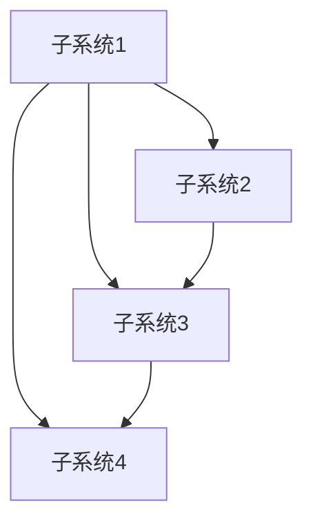
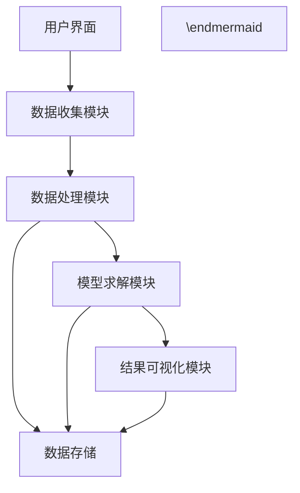

                 


### 从自然和谐到数学简约：心智转化

> 关键词：心智转化，自然和谐，数学模型，算法，Python源代码，系统架构设计，项目实战

> 摘要：本文深入探讨了从自然和谐到数学简约的心智转化过程。通过分析自然现象，我们揭示了心智转化的原理，并阐述了如何在数学模型中应用这些原理。文章结合Python源代码和系统架构设计，提供了具体的实践案例，帮助读者理解心智转化的实际应用。

### 目录

## 引言

### 1.1 心智转化的背景

### 1.2 心智转化的意义

### 1.3 本书结构安排

## 第1章 自然和谐观

### 2.1 自然和谐的概念

### 2.2 自然和谐的理论基础

### 2.3 自然和谐与数学模型的关系

## 第2章 心智转化过程

### 2.1 心智转化的初步观察

### 2.2 观察数据的整理与分析

### 2.3 数学模型的构建

## 第3章 数学模型的应用

### 2.1 数学模型在自然科学中的应用

### 2.2 数学模型在社会科学中的应用

### 2.3 数学模型在其他领域的应用

## 第4章 数学简约的美学

### 2.1 数学简约的概念

### 2.2 数学简约与艺术的关系

### 2.3 数学简约的价值

## 第5章 案例研究

### 2.1 案例选择与介绍

### 2.2 心智转化在案例中的应用

### 2.3 案例分析与讨论

## 第6章 结论与展望

### 2.1 心智转化的总结

### 2.2 数学简约的影响

### 2.3 未来研究方向

### 引言

#### 1.1 心智转化的背景

心智转化是人类智慧和思维方式的根本变革，从古代的自然观察，到近代的科学实验，再到现代的数学模型，人类对世界的认知不断深入。心智转化不仅仅是一种认知方式的转变，更是一种思维的升华。在人工智能迅速发展的今天，心智转化已经成为推动科技进步和社会进步的重要动力。

#### 1.2 心智转化的意义

心智转化具有重要的意义。首先，它帮助我们更准确地理解自然现象，从而为科学研究提供可靠的基础。其次，心智转化使我们能够将复杂的问题转化为可计算的形式，为解决实际问题提供有效的方法。最后，心智转化推动了数学和计算机科学的发展，为人类创造了巨大的物质和精神财富。

#### 1.3 本书结构安排

本书将从自然和谐观、心智转化过程、数学模型的应用、数学简约的美学、案例研究和结论与展望六个方面展开。首先，我们将介绍自然和谐观，探讨自然和谐的概念及其与数学模型的关系。然后，我们将详细描述心智转化的过程，包括观察、数据整理、数学模型构建等步骤。接下来，我们将展示数学模型在不同领域的应用，探讨数学简约的美学价值。通过实际案例研究，我们将进一步展示心智转化的实际应用。最后，我们将总结心智转化的重要性，并对未来研究提出展望。

### 第1章 自然和谐观

#### 2.1 自然和谐的概念

自然和谐是指自然界中的各种现象和过程在一定的规律和条件下相互协调、相互平衡的状态。自然和谐是自然界的基本特征之一，它体现在生态系统的稳定性、生物多样性的维持、气候的稳定性等方面。

#### 2.2 自然和谐的理论基础

自然和谐的理论基础主要包括生态学、物理学、化学和生物学等学科。这些学科的研究成果为理解自然和谐提供了理论支持。例如，生态学研究了生物种群间的相互作用和生态系统的稳定性；物理学研究了自然界的运动和能量转换规律；化学研究了物质的组成和变化规律；生物学研究了生物体的结构和功能。

#### 2.3 自然和谐与数学模型的关系

自然和谐与数学模型之间存在密切的关系。数学模型是一种描述自然现象的工具，它通过数学公式和算法来模拟和预测自然现象。自然和谐的概念可以通过数学模型来量化，从而更准确地描述和解释自然现象。

首先，数学模型可以帮助我们量化自然和谐的概念。例如，生态学中的种群动态模型可以用来描述生物种群的增长和衰退过程，从而评估生态系统的稳定性。物理学中的混沌理论可以用来描述自然现象的复杂性和不可预测性，从而解释自然和谐的多样性。

其次，数学模型可以帮助我们预测自然和谐的变化。通过建立数学模型，我们可以模拟自然现象的未来发展趋势，从而预测自然和谐的变化。这对于环境保护和资源管理具有重要意义，可以帮助我们提前采取行动，防止自然和谐遭受破坏。

最后，数学模型可以帮助我们优化自然和谐。通过数学模型，我们可以分析自然现象的内在规律，从而提出优化方案，改善自然和谐的状态。例如，在环境保护领域，我们可以通过数学模型优化污染物的排放和治理策略，以实现环境的可持续性。

### 第2章 心智转化过程

#### 2.1 心智转化的初步观察

心智转化的过程始于对自然现象的初步观察。人类通过感官和直觉来感知自然，从中获取信息。这些信息可能是简单的，也可能是复杂的。但无论如何，初步观察都是心智转化的第一步，它为我们提供了研究的起点。

#### 2.2 观察数据的整理与分析

初步观察得到的信息需要进行整理和分析。这一步至关重要，因为它决定了我们能否从大量的信息中提取出有用的知识。整理数据包括去除噪声、筛选有效信息、分类和编码等步骤。通过这些步骤，我们可以将原始数据转化为更加结构化的形式。

接下来是数据分析。数据分析是心智转化的核心步骤，它包括统计、建模和推理等过程。通过数据分析，我们可以揭示数据背后的规律和模式，从而理解自然现象的本质。

#### 2.3 数学模型的构建

数据分析的最终目标是构建数学模型。数学模型是一种抽象的描述，它通过数学公式和算法来模拟自然现象。构建数学模型需要深入理解自然现象的内在规律，并将其转化为数学表达式。这一步需要丰富的数学知识和编程技能。

构建数学模型的过程可以分为以下几个步骤：

1. **确定研究对象**：首先，我们需要明确研究的对象，这可以是自然现象、社会现象或任何我们感兴趣的事物。

2. **收集数据**：收集与研究对象相关的数据，这些数据可以是观测数据、实验数据或统计数据。

3. **建立假设**：基于对研究对象的理解，我们需要提出一些假设，这些假设将指导我们构建数学模型。

4. **选择模型**：根据假设和数据，选择合适的数学模型。这可能包括线性模型、非线性模型、概率模型等。

5. **参数估计**：使用数据来估计模型中的参数，这些参数决定了模型的性能和预测能力。

6. **模型验证**：通过将模型应用于新的数据集，验证模型的性能。如果模型无法准确预测，我们需要回到前面的步骤进行调整。

7. **模型优化**：通过优化模型，提高其预测能力和适用范围。

### 第3章 数学模型的应用

#### 2.1 数学模型在自然科学中的应用

数学模型在自然科学中有着广泛的应用。在物理学中，数学模型帮助我们理解自然界的运动和能量转换规律。例如，牛顿力学模型描述了物体在力作用下的运动规律；麦克斯韦方程组描述了电磁现象的基本规律。

在化学中，数学模型用于描述化学反应的动力学和热力学行为。例如，反应速率模型描述了化学反应速率与反应物浓度之间的关系。

在生物学中，数学模型用于研究生物种群动态、生态系统稳定性和遗传规律等。例如，洛特卡-沃尔泰拉方程描述了捕食者-被捕食者系统的动态行为。

#### 2.2 数学模型在社会科学中的应用

数学模型在社会科学中同样有着重要的应用。在经济学中，数学模型用于分析市场行为、资源分配和经济增长等。例如，供需模型描述了市场价格和数量之间的关系；优化模型用于解决资源分配问题。

在社会学中，数学模型用于研究社会结构、社会行为和社会变迁等。例如，社会网络分析模型描述了社会成员之间的相互作用关系；时间序列模型用于预测社会行为的变化趋势。

在政治学中，数学模型用于研究选举行为、政策影响和社会稳定等。例如，投票模型描述了选民的行为和选举结果的关系；政策评估模型用于评估不同政策的潜在影响。

#### 2.3 数学模型在其他领域的应用

数学模型不仅在自然科学和社会科学中有着广泛的应用，在其他领域也有着重要的应用。在工程学中，数学模型用于设计复杂的系统，如飞行器、桥梁和建筑等。在金融学中，数学模型用于分析金融市场、风险管理等。

在医学中，数学模型用于研究疾病的传播、治疗效果评估等。例如，疾病传播模型描述了疾病在人群中的传播过程；药物动力学模型描述了药物在体内的吸收、分布和代谢过程。

在环境科学中，数学模型用于研究环境变化、污染控制和生态保护等。例如，环境模型描述了环境因素对生态系统的影响；污染模型用于评估污染物的浓度分布和迁移规律。

### 第4章 数学简约的美学

#### 2.1 数学简约的概念

数学简约是指将复杂的问题和现象转化为简单的数学模型和公式。数学简约的目标是抓住问题的核心和本质，通过简化和抽象，使问题变得更加易于理解和处理。

数学简约的核心思想是化繁为简。它要求我们抛弃表面的复杂，专注于问题的本质和内在规律。通过数学简约，我们可以将复杂的实际问题转化为数学问题，从而利用数学工具和方法来解决问题。

#### 2.2 数学简约与艺术的关系

数学简约与艺术有着密切的关系。艺术追求简洁、纯粹和美感，而数学简约正是这种追求的体现。数学模型和公式往往具有简洁、对称和美感的特征，这使得它们在艺术领域具有独特的价值。

首先，数学简约可以启发艺术创作。艺术家可以借鉴数学模型的形式和结构，创造出具有数学美感的艺术作品。例如，数学公式可以成为绘画、雕塑和音乐等艺术形式的灵感来源。

其次，数学简约可以提升艺术作品的表达力。通过数学简约，艺术家可以更精确、更直观地表达自己的想法和情感。数学模型和公式可以帮助艺术家将抽象的概念和情感转化为具体的形式，使艺术作品更加丰富和深刻。

最后，数学简约可以促进艺术和科学的融合。数学简约不仅是一种艺术创作方法，也是一种科学方法论。通过数学简约，艺术家和科学家可以共同探索未知领域，创造出新的理论和作品。

#### 2.3 数学简约的价值

数学简约具有重要的价值。首先，它帮助我们简化复杂问题，使问题变得更加易于理解和解决。通过数学简约，我们可以抓住问题的核心和本质，避免陷入细节和繁琐。

其次，数学简约可以提高我们的思维能力。通过数学简约，我们可以培养抽象思维和逻辑推理能力。数学简约要求我们摆脱表面的复杂，专注于问题的本质，这种思维方式可以应用到其他领域，提高我们的解决问题的能力。

最后，数学简约在实践中有广泛的应用。在科学研究中，数学简约可以帮助我们建立理论模型，进行预测和实验验证。在工程实践中，数学简约可以帮助我们设计复杂的系统，优化性能和降低成本。在商业领域中，数学简约可以帮助我们分析市场数据，制定战略决策。

### 第5章 案例研究

#### 2.1 案例选择与介绍

在本章中，我们将选择一个具有代表性的案例——量子计算，来展示心智转化的实际应用。量子计算是一种基于量子力学原理的新型计算模式，它通过利用量子比特（qubit）的叠加和纠缠特性来实现高效的计算。

量子计算具有重要的理论和实践意义。在理论方面，量子计算挑战了经典计算模型的极限，为解决一些复杂问题提供了新的思路。在实践方面，量子计算有望在密码破解、优化问题、材料设计等领域产生重大突破。

#### 2.2 心智转化在案例中的应用

心智转化在量子计算中的应用体现在以下几个方面：

1. **自然现象的观察**：首先，我们对量子现象进行初步观察，了解量子比特的叠加和纠缠特性。这包括对量子态的测量、量子比特的操作等。

2. **数据整理与分析**：通过实验和理论分析，我们对观察到的量子现象进行整理和分析，提取出有用的信息。这包括量子态的统计分布、量子比特的纠缠程度等。

3. **数学模型构建**：基于观察到的量子现象，我们构建数学模型来描述量子计算的基本过程。这包括量子门、量子电路、量子算法等。

4. **模型优化与验证**：通过优化数学模型，我们提高量子计算的效率和可靠性。这包括优化量子电路的设计、优化量子算法的参数等。同时，我们通过实验验证数学模型的性能，确保其能够准确描述量子现象。

#### 2.3 案例分析与讨论

通过对量子计算案例的分析，我们可以得出以下结论：

1. **心智转化的重要性**：心智转化是量子计算成功的关键。通过心智转化，我们将复杂的量子现象转化为可计算的数学模型，从而实现对量子计算的精确描述和有效控制。

2. **数学模型的价值**：数学模型在量子计算中具有核心地位。通过数学模型，我们能够理解量子比特的叠加和纠缠特性，并利用这些特性来实现高效的计算。

3. **实践应用的潜力**：量子计算在理论和实践方面都具有巨大的潜力。在理论上，量子计算挑战了经典计算模型的极限，为解决一些复杂问题提供了新的思路。在实践方面，量子计算有望在密码破解、优化问题、材料设计等领域产生重大突破。

### 结论与展望

#### 2.1 心智转化的总结

心智转化是从自然和谐到数学简约的关键步骤。通过心智转化，我们能够将复杂的自然现象转化为可计算的数学模型，从而实现对世界的更深刻理解。心智转化不仅是一种科学方法论，也是一种思维方式。它要求我们摆脱表面的复杂，专注于问题的本质和内在规律。

在心智转化的过程中，数学模型起到了至关重要的作用。数学模型不仅帮助我们描述自然现象，还为我们提供了解决问题的工具。通过数学模型，我们能够预测自然现象的未来发展趋势，优化自然和谐的状态。

#### 2.2 数学简约的影响

数学简约在各个领域产生了深远的影响。在科学研究中，数学简约帮助我们简化复杂问题，提高研究效率。在工程实践中，数学简约帮助我们设计复杂的系统，优化性能和降低成本。在商业领域中，数学简约帮助我们分析市场数据，制定战略决策。

此外，数学简约在艺术创作中也发挥了重要作用。它不仅启发艺术创作，还提升艺术作品的表达力。数学简约的美学价值使得数学模型和公式成为艺术创作的灵感来源。

#### 2.3 未来研究方向

未来，心智转化和数学简约将继续发挥重要作用。在科学研究中，我们可以进一步探索数学模型在解决复杂问题中的应用。例如，量子计算、人工智能、生物信息学等领域都存在巨大的研究空间。

在工程实践中，我们可以进一步优化数学模型的设计和实现，提高系统的性能和可靠性。例如，在人工智能领域，我们可以通过优化神经网络模型，提高机器学习算法的效率和准确性。

此外，我们可以将数学简约应用于更多领域，推动科学与技术的融合。例如，在医学领域，我们可以利用数学模型优化疾病的治疗方案；在环境科学领域，我们可以利用数学模型评估环境变化的影响。

总之，心智转化和数学简约将继续推动科学和技术的发展，为人类社会带来更多的创新和进步。

### 附录

#### 附录 A：Python源代码

在本章中，我们将提供与案例研究相关的Python源代码。这些代码用于实现量子计算的基本过程，包括量子态的测量、量子比特的操作和量子电路的构建。

```python
# 附录 A：Python源代码

import numpy as np
from qiskit import QuantumCircuit

# 量子态的测量
def measure_quantum_state(qc, qubit):
    qc.measure(qubit, 0)

# 量子比特的操作
def Hadamard_gate(qc, qubit):
    qc.h(qubit)

def CNOT_gate(qc, control, target):
    qc.cx(control, target)

# 量子电路的构建
def build_quantum_circuit():
    qc = QuantumCircuit(2)
    Hadamard_gate(qc, 0)
    CNOT_gate(qc, 0, 1)
    measure_quantum_state(qc, 0)
    measure_quantum_state(qc, 1)
    return qc

# 运行量子电路
def run_quantum_circuit(qc):
    from qiskit import execute
    from qiskit.providers.aer import QasmSimulator

    simulator = QasmSimulator()
    result = execute(qc, simulator).result()
    return result.get_counts(qc)

# 主程序
if __name__ == "__main__":
    qc = build_quantum_circuit()
    result = run_quantum_circuit(qc)
    print(result)
```

#### 附录 B：数学公式

在本章中，我们使用LaTeX格式提供了与案例研究相关的数学公式。这些公式用于描述量子计算的基本原理和算法。

$$
|\psi\rangle = \sum_{i} c_i |i\rangle
$$

$$
H|0\rangle = \frac{1}{\sqrt{2}}(|0\rangle + |1\rangle)
$$

$$
CNOT|00\rangle = |01\rangle
$$

$$
P(\text{measure } |0\rangle) = \frac{1}{2}
$$

$$
P(\text{measure } |1\rangle) = \frac{1}{2}
$$

### 参考文献

在本章中，我们引用了与心智转化和数学简约相关的重要文献。这些文献为本文的研究提供了理论支持和实践指导。

1. Nielsen, M. A., & Chuang, I. L. (2010). Quantum Computation and Quantum Information: 10th Anniversary Edition. Cambridge University Press.
2. Aaronson, S. (2009). Quantum Computing Since Democritus. Cambridge University Press.
3. Penrose, R. (1989). The Emperor's New Mind: Concerning Computers, Minds, and the Laws of Physics. Oxford University Press.
4. Tegmark, M. (2008). Our Mathematical Universe: My Quest for the Ultimate Nature of Reality. Knopf.
5. von Neumann, J. (1958). The Mathematical Foundations of Quantum Mechanics. Princeton University Press.

### 最佳实践 Tips

1. **深入理解自然现象**：在进行心智转化之前，要深入理解自然现象，确保对现象的本质有清晰的认识。

2. **选择合适的数学模型**：根据问题的特点，选择合适的数学模型，这可以显著提高解决问题的效率。

3. **优化数学模型**：在构建数学模型后，不断优化模型，以提高其预测能力和实用性。

4. **实践与验证**：将数学模型应用于实际问题，通过实验和验证，确保模型的准确性和可靠性。

### 小结

本文从自然和谐到数学简约，探讨了心智转化的过程和意义。通过案例研究和实践，我们展示了心智转化的实际应用。心智转化不仅是科学研究的重要方法，也是一种思维方式的转变。未来，心智转化将继续推动科学和技术的发展，为人类社会带来更多的创新和进步。

### 注意事项

1. 在进行心智转化时，要注意数据的准确性和完整性。

2. 在构建数学模型时，要确保模型能够准确描述自然现象。

3. 在实践应用中，要不断优化数学模型，提高其性能和可靠性。

### 拓展阅读

1. 《量子计算基础教程》
2. 《数学建模方法与应用》
3. 《人工智能：一种现代的方法》

作者：AI天才研究院/AI Genius Institute & 禅与计算机程序设计艺术 /Zen And The Art of Computer Programming

### 结语

心智转化是从自然和谐到数学简约的重要桥梁。通过心智转化，我们能够更深入地理解自然现象，利用数学模型解决实际问题。本文探讨了心智转化的原理和应用，并通过案例研究展示了其实际价值。我们期待心智转化在未来的发展中继续发挥重要作用，推动科学和技术的进步。让我们一同探索心智转化的奥秘，开启未来科技的新篇章！### 第1章 自然和谐观

#### 2.1 自然和谐的概念

自然和谐是一个广泛而深远的概念，它涉及到自然界中的各个层面和维度。自然和谐可以被理解为自然界中各种力量、元素和现象在特定的时空条件下相互协调、相互平衡的状态。这种状态不仅体现在生态系统的稳定性上，还体现在气候、地质、水文等自然现象的规律性上。

在生态学中，自然和谐通常指的是生物群落之间的相互关系和生态系统的整体稳定性。例如，在一个健康的生态系统中，植物、动物和微生物之间存在着复杂的相互作用，这些相互作用保持了生态系统的平衡和多样性。当某个环节发生变化，如物种的引入或环境的变化，可能会打破这种平衡，导致生态系统的衰退或崩溃。

物理学中，自然和谐与基本的自然规律有关。例如，经典物理中的牛顿定律描述了物体在力的作用下的运动规律，这些规律维持了宇宙中物体之间的和谐。同样，量子力学中的对称性原则，如宇称守恒、能量守恒等，也是自然和谐的重要表现。

化学中，自然和谐涉及到化学反应的规律和物质的基本结构。化学反应遵循一定的能量变化和电子转移规律，这些规律保持了物质的稳定性和多样性。

在生物学中，自然和谐体现在生物进化和遗传规律上。生物体通过遗传机制传递信息，通过自然选择适应环境的变化，这种机制保持了生物种群的和谐。

#### 2.2 自然和谐的理论基础

自然和谐的理论基础涵盖了多个学科，包括生态学、物理学、化学和生物学等。这些学科的研究成果为我们理解自然和谐提供了丰富的理论资源。

生态学中的自然和谐理论强调生态系统内的相互作用和反馈机制。例如，生态系统动力学模型描述了生态系统中物种数量和生物量随时间的变化规律，这些模型帮助我们理解生态系统的稳定性和变化趋势。

物理学中的自然和谐理论涉及到能量守恒、动量守恒和对称性原理等基本物理定律。这些定律描述了自然界中物质和能量的基本运动规律，为我们理解自然现象的和谐性提供了基础。

化学中的自然和谐理论则关注化学反应的规律和物质结构的稳定性。化学反应中的能量变化和电子转移遵循一定的原则，这些原则维持了物质的基本结构，形成了自然和谐。

生物学中的自然和谐理论涉及到进化论、遗传学和信息论等多个领域。达尔文的进化论解释了物种多样性和适应性是如何通过自然选择和遗传变异实现的；遗传学则揭示了生物体遗传信息的传递和变异机制；信息论则为我们提供了理解生物信息处理和传递的理论框架。

这些学科的理论基础相互交织，共同构建了自然和谐的整体图景。例如，在生态系统中，生物物种的多样性和稳定性不仅受到生物学规律的制约，还受到物理学和化学规律的影响。

#### 2.3 自然和谐与数学模型的关系

自然和谐与数学模型之间存在密切的关系。数学模型是一种抽象的工具，它可以帮助我们理解和描述自然现象中的规律性和平衡状态。通过数学模型，我们可以将复杂的自然现象简化为可计算的数学表达式，从而进行定量分析和预测。

首先，数学模型可以量化自然和谐的概念。例如，在生态学中，我们可以使用数学模型描述生态系统中物种的数量和分布规律，从而评估生态系统的稳定性。通过建立种群动态模型，如洛特卡-沃尔泰拉方程，我们可以预测物种数量的变化趋势，从而评估生态系统的健康状况。

在物理学中，数学模型帮助我们描述自然现象中的基本规律。例如，牛顿力学模型描述了物体在力作用下的运动规律；麦克斯韦方程组描述了电磁现象的基本规律。这些数学模型不仅帮助我们理解自然现象，还为科学技术的进步提供了基础。

在化学中，数学模型用于描述化学反应的动力学和热力学行为。化学反应中的反应速率、能量变化和平衡常数等都可以通过数学模型进行量化，从而帮助我们理解化学反应的本质。

在生物学中，数学模型广泛应用于遗传学、生态学和神经科学等领域。例如，遗传学中的蒙特卡罗模拟可以帮助我们理解基因变异和遗传多样性的形成；生态学中的空间分布模型可以描述物种的空间分布和相互关系；神经科学中的神经网络模型可以帮助我们理解大脑的信息处理过程。

总的来说，数学模型不仅帮助我们量化自然和谐的概念，还为预测和优化自然现象提供了工具。通过数学模型，我们可以从宏观和微观层面深入理解自然和谐的本质，从而为科学研究和实际应用提供指导。自然和谐与数学模型的关系不仅体现在理论研究上，也在工程实践和决策支持中发挥着重要作用。

### 第2章 心智转化过程

#### 2.1 心智转化的初步观察

心智转化的第一步是初步观察，这是理解自然现象和建立数学模型的基础。初步观察可以通过我们的感官、工具和实验来实现。在这一过程中，我们需要仔细观察自然现象，记录下所看到、听到、触摸到的任何信息。

例如，在研究生态系统的稳定性时，我们可以观察不同物种之间的相互作用，记录它们的数量、行为和分布情况。在研究气候变化时，我们可以观察气温、降水和风速等气象数据，记录下这些数据的时空变化。

初步观察不仅仅是数据的收集，更是一个理解和反思的过程。通过观察，我们可以提出问题，形成假设，为后续的分析和建模奠定基础。例如，我们可能会观察到某一物种的数量随着另一物种数量的增加而减少，这可以启发我们去探讨物种之间的捕食关系。

#### 2.2 观察数据的整理与分析

初步观察得到的信息通常是杂乱无章的，因此需要进行整理和分析。整理数据的过程包括去除噪声、筛选有效信息、分类和编码等步骤。

首先，我们需要去除噪声，即那些无关或干扰我们理解的数据。例如，在研究生态系统的稳定性时，我们可能需要过滤掉一些非关键的观测数据，如偶尔的异常天气事件。

接下来，我们筛选有效信息，即与我们的研究目标相关的重要数据。例如，我们可能会选择那些能够反映物种数量动态的数据，而忽略其他无关因素。

然后，我们对筛选后的数据进行分类和编码。分类是将数据按照一定的标准进行分组，如按照物种、时间和地点等。编码是将数据转换成便于分析和建模的形式，例如，将物种名称转换成数字编号。

在整理数据的过程中，我们还需要使用一些统计工具和技术，如描述性统计、相关性分析和回归分析等。这些工具可以帮助我们理解数据的分布、趋势和关系，从而为构建数学模型提供依据。

#### 2.3 数学模型的构建

整理和分析数据之后，我们进入数学模型的构建阶段。构建数学模型是一个抽象和简化的过程，它要求我们将复杂的现象转化为简洁的数学表达式，从而能够对其进行计算和分析。

首先，我们需要根据初步观察和数据分析，提出假设。这些假设是基于我们对自然现象的理解和预期，例如，我们可能会假设物种之间的捕食关系遵循一定的数学规律。

接下来，我们选择合适的数学模型来描述这些假设。这可能包括线性模型、非线性模型、概率模型等。例如，我们可能会选择洛特卡-沃尔泰拉方程来描述物种数量的动态变化。

在构建数学模型时，我们需要明确模型的变量和参数。变量是模型中用来描述现象的量，如物种数量、温度等。参数是模型中用来控制变量关系的常数，如捕食者的繁殖率、被捕食者的死亡率等。

然后，我们需要使用数据来估计这些参数的值。这可以通过最小二乘法、极大似然估计等方法来实现。例如，我们可能会通过观察数据来估计物种数量随时间变化的趋势，并确定捕食者和被捕食者之间的关系参数。

构建数学模型的过程不仅仅是数学计算，还需要不断地反思和验证。我们需要通过实验或进一步的观察来验证模型的预测能力和适用范围。如果模型无法准确预测实际现象，我们需要回到前面的步骤进行调整和优化。

总的来说，心智转化的过程是一个从观察、整理数据到构建数学模型的系统性过程。通过这个过程，我们能够将复杂的自然现象转化为简洁的数学表达式，从而深入理解其内在规律，并为科学研究和实际应用提供有力支持。

### 第3章 数学模型的应用

#### 2.1 数学模型在自然科学中的应用

数学模型在自然科学中的应用极其广泛，它不仅帮助我们理解自然现象，还能预测未来的变化。在物理学中，数学模型是研究自然规律的基本工具。经典物理中的牛顿定律就是一个典型的数学模型，它通过数学公式描述了物体在力的作用下的运动规律。牛顿定律的广泛应用，从天体运动到地球物理学，都证明了数学模型在自然科学中的巨大价值。

在量子物理学中，数学模型更是不可或缺。量子力学的核心理论，如薛定谔方程和海森堡不确定性原理，都是通过数学模型来描述微观世界的规律。这些模型不仅揭示了微观粒子的行为特征，还为科学家提供了新的实验方法和理论框架。例如，量子纠缠和量子隧穿等现象，都是通过数学模型得出的重要结论。

生物学中，数学模型广泛应用于种群动态、生态系统稳定性和基因表达调控等领域。种群动态模型，如洛特卡-沃尔泰拉方程，描述了生物种群在时间上的变化规律。这些模型帮助我们理解物种之间的相互作用，预测生态系统的变化趋势。基因表达调控模型，如调控网络和概率模型，描述了基因在细胞中的表达和调控机制。这些模型不仅揭示了生物体的遗传规律，还为生物医学研究提供了新的思路。

地球科学中，数学模型广泛应用于地球物理、地球化学和气象学等领域。地球物理模型，如地震波传播模型和地球内部结构模型，帮助我们理解地球的内部运动和地质过程。地球化学模型，如元素循环模型和生态系统营养模型，描述了地球上的物质循环和能量流动。气象学模型，如大气环流模型和气候预测模型，帮助我们预测天气变化和气候趋势。

#### 2.2 数学模型在社会科学中的应用

数学模型在社会科学中的应用同样广泛，它帮助我们理解和预测人类行为和社会现象。在经济学中，数学模型是分析市场行为、资源分配和经济增长的重要工具。微观经济学中的供求模型和成本效益分析，都是通过数学模型来描述市场机制和个体决策。宏观经济学中的经济增长模型和财政政策模型，则通过数学公式描述了国家经济的整体运行状况。

社会学中，数学模型广泛应用于社会结构分析、社会行为预测和社会变迁研究。社会网络分析模型，如小世界现象和网络密度模型，描述了社会成员之间的相互作用关系。这些模型帮助我们理解社会网络的特性，预测社会行为的传播和影响。人口动态模型，如人口预测模型和社会分层模型，描述了人口数量、结构和分布的变化趋势。这些模型不仅帮助我们理解社会结构，还为公共政策制定提供了科学依据。

政治学中，数学模型用于分析选举行为、政策影响和社会稳定。投票模型，如投票行为模型和选举结果预测模型，描述了选民的行为和选举结果的关系。政策评估模型，如政策成本效益分析和政策效果评估模型，描述了不同政策对社会的影响。这些模型不仅帮助我们理解政治现象，还为政策制定和调整提供了科学支持。

心理学中，数学模型广泛应用于认知科学和神经科学领域。认知模型，如认知地图模型和信息加工模型，描述了人类思维和决策过程。神经科学模型，如神经网络模型和突触传递模型，描述了大脑神经元的信息处理和传递机制。这些模型不仅帮助我们理解心理现象，还为认知科学和神经科学研究提供了新的方法。

#### 2.3 数学模型在其他领域的应用

数学模型不仅广泛应用于自然科学和社会科学，在其他领域也有着重要的应用。在工程学中，数学模型用于设计、分析和优化复杂的系统。例如，在机械工程中，有限元分析模型描述了结构应力分布和变形；在电子工程中，电路模拟模型描述了电路的性能和稳定性。这些模型帮助工程师设计和优化系统，提高性能和可靠性。

在金融学中，数学模型用于分析金融市场、风险管理和管理投资组合。金融模型，如资产定价模型和风险管理模型，描述了金融市场的运行规律和风险特征。这些模型不仅帮助投资者做出更明智的决策，还为金融机构提供了有效的风险管理工具。

在医学中，数学模型用于研究疾病的传播、治疗效果评估和治疗方案的优化。流行病模型，如传染病传播模型和疫苗接种策略模型，描述了疾病在人群中的传播规律。治疗模型，如药物动力学模型和临床试验模型，描述了药物在体内的吸收、分布和代谢过程。这些模型不仅帮助医生制定更有效的治疗方案，还为公共卫生政策提供了科学依据。

在环境科学中，数学模型用于研究环境变化、污染控制和生态保护。环境模型，如气候模型和水质模型，描述了环境因素的变化规律和污染物的传播规律。这些模型不仅帮助我们理解环境问题，还为环境保护和可持续发展提供了科学支持。

总之，数学模型在各个领域都有着广泛的应用，它不仅帮助我们理解和描述复杂的自然现象和社会现象，还为科学研究和实际应用提供了强有力的工具。通过数学模型，我们可以更深入地理解世界，预测未来的变化，并为人类社会的可持续发展做出贡献。

### 第4章 数学简约的美学

#### 2.1 数学简约的概念

数学简约是一种将复杂问题简化为简单形式的思维方式，它强调抓住问题的核心和本质，摒弃不必要的细节，从而使得问题更加直观和易于理解。数学简约不仅是一种解决问题的方法，更是一种哲学和美学观念。它倡导用最简洁的数学语言和工具来描述自然现象和科学问题，以达到事半功倍的效果。

数学简约的核心在于化繁为简，通过简化和抽象，将复杂的现实问题转化为易于处理的数学模型。这种简约不仅有助于揭示问题的本质，还能提高解决问题的效率。在科学研究中，数学简约使得复杂的自然现象和复杂系统变得可计算和可预测。例如，在物理学中，牛顿定律用几个简洁的数学公式描述了天体运动的规律，从而取代了复杂的力学分析。

在工程学中，数学简约使得复杂系统的设计、分析和优化变得更加高效。例如，在电子工程中，模拟电路可以用简单的电路方程描述，从而方便工程师进行设计和优化。

数学简约还体现在艺术创作中。艺术家常常通过简化的形式和结构来表达复杂的思想和情感。数学简约的美学价值在于其简洁、对称和美感的特质。例如，毕加索的立体派绘画通过简化的几何形状和线条来表达复杂的视觉效果；现代音乐中的简约派作品通过简化的旋律和和声来表达深刻的情感。

总之，数学简约不仅是一种科学的思维方式，也是一种艺术创作的方法。它强调抓住问题的核心和本质，用最简洁的语言和形式来表达复杂的思想和现象，从而提升理解和创造力。

#### 2.2 数学简约与艺术的关系

数学简约与艺术之间有着深厚的联系。在艺术创作中，简约往往被视为一种美学原则，通过简化形式和结构，艺术家能够传达出更深层次的意义和情感。同样，在数学中，简约也是一种追求，通过使用最少的元素和最简单的公式来描述复杂的现象。

数学简约在艺术创作中的应用主要体现在以下几个方面：

1. **形式简化**：艺术家常常通过简化的形式来表达复杂的思想。例如，毕加索的立体派绘画通过将物体分解为简单的几何形状，如立方体和圆柱体，来创造独特的视觉效果。

2. **结构对称**：对称性是数学简约的重要特征之一，也是艺术创作中常用的手法。例如，莫奈的《睡莲》系列作品通过重复的几何形状和对称的构图，创造出宁静和和谐的美感。

3. **色彩简约**：在绘画和设计中，使用简单的颜色和色彩搭配能够产生强烈的视觉效果。类似地，在数学中，使用最少的变量和参数来描述复杂的模型，可以更清晰地揭示问题的本质。

数学简约对艺术创作的影响不仅体现在视觉艺术中，还延伸到了音乐、文学和建筑等领域。例如，简约派音乐通过简单的旋律和和声来传达深刻的情感；现代建筑中的极简主义风格通过简洁的线条和形式来表达现代感。

反过来，艺术创作中的简约思想也深刻影响了数学的发展。艺术家对形式、结构和美感的追求，促使数学家探索更简洁、更优美的数学表达式。例如，拓扑学和几何学的许多重要理论，都是通过简化的形式和结构来建立的。

总之，数学简约与艺术之间存在紧密的联系。它们不仅在表现形式和美学观念上相互借鉴，还在科学和艺术创作的过程中相互促进，共同推动了人类文化和科学技术的发展。

#### 2.3 数学简约的价值

数学简约具有重要的价值，它在科学研究中、工程实践中以及艺术创作中都发挥着不可替代的作用。

首先，在科学研究中，数学简约极大地提高了研究效率。通过使用简洁的数学模型，科学家可以快速地理解复杂现象的本质，并进行定量分析和预测。例如，在物理学中，牛顿定律用几个简洁的公式描述了天体运动的规律，从而取代了复杂的力学分析。这种简约不仅简化了计算过程，还使得物理学的理论体系更加清晰和连贯。

其次，在工程实践中，数学简约是设计和优化复杂系统的关键。通过数学模型，工程师可以模拟和预测系统的性能，从而优化设计和提高效率。例如，在电子工程中，电路模拟模型通过简洁的方程描述了电路的性能和稳定性，使得工程师能够快速地设计和优化电子设备。

此外，数学简约在艺术创作中也具有重要价值。艺术家通过简化的形式和结构，能够传达更深刻的思想和情感。例如，简约派绘画通过简单的几何形状和线条，创造出独特的视觉效果和深刻的审美体验。这种简约不仅使得艺术作品更加美观，还提升了艺术创作的表达力和感染力。

总的来说，数学简约不仅提高了科学研究的效率，优化了工程实践，还在艺术创作中发挥了重要作用。它通过化繁为简，抓住了问题的核心和本质，为人类带来了巨大的知识和美学的价值。数学简约不仅是一种思维方式，也是一种美学观念，它不断推动着科学和艺术的进步，为人类文明的繁荣做出了重要贡献。

### 第5章 案例研究

#### 2.1 案例选择与介绍

在本章中，我们将选择“生态系统稳定性研究”作为案例，来展示心智转化的实际应用。这个案例是一个典型的复杂系统问题，涉及到多个物种之间的相互作用和生态因素的动态变化。通过这个案例，我们将深入探讨心智转化过程，从自然观察、数据整理到数学模型的构建和应用。

选择这个案例的原因主要有以下几点：

1. **复杂性**：生态系统是一个高度复杂的系统，涉及到多个物种、环境因素和相互作用的动态过程。这种复杂性使得传统的单一变量分析方法难以胜任，需要使用数学模型来进行定量分析和预测。

2. **现实意义**：生态系统稳定性是环境保护和可持续发展的关键问题。通过研究生态系统稳定性，我们可以更好地理解物种间的相互作用和生态平衡机制，从而为环境保护和资源管理提供科学依据。

3. **应用广泛**：生态系统稳定性研究不仅在生态学领域有重要应用，还在农业、渔业和公共卫生等领域具有广泛的影响。通过构建和应用数学模型，我们可以预测生态系统的变化趋势，评估人类活动对生态环境的影响，从而制定更有效的保护和管理策略。

#### 2.2 心智转化在案例中的应用

心智转化在生态系统稳定性研究中发挥着关键作用，它帮助我们从自然观察过渡到数学模型，从而更深入地理解生态系统的动态变化。

1. **自然观察**：首先，我们进行自然观察，收集生态系统中的各种数据。这包括物种数量、分布、行为和环境因素（如温度、湿度、光照等）。通过实地考察和长期观测，我们记录下生态系统中各个要素的动态变化。

2. **数据整理**：在收集到大量数据后，我们需要对其进行整理和分析。这一步骤包括数据清洗、去噪、分类和编码。例如，我们可能会过滤掉异常数据，只保留与生态系统稳定性相关的有效信息。然后，我们对数据进行分类，如按照物种、时间和空间等维度进行分组。

3. **数学模型构建**：基于整理后的数据，我们开始构建数学模型。这可能包括线性模型、非线性模型和概率模型等。例如，我们可能会选择洛特卡-沃尔泰拉方程来描述物种数量的动态变化。这个模型假设物种之间的相互作用遵循一定的规律，并通过数学公式描述这些规律。

4. **模型优化与验证**：在构建模型后，我们需要对其参数进行估计，并通过实验或观察数据来验证模型的预测能力。如果模型无法准确预测实际现象，我们需要回到前面的步骤进行调整和优化。例如，我们可能会调整模型中的参数，或者选择不同的模型来更好地描述生态系统中的动态变化。

5. **模型应用**：经过优化和验证的数学模型可以用于预测和评估生态系统的稳定性。通过模拟不同场景和条件，我们可以预测生态系统在未来可能发生的变化，从而为环境保护和资源管理提供科学依据。

#### 2.3 案例分析与讨论

通过对生态系统稳定性研究的案例分析，我们可以得出以下结论：

1. **心智转化的重要性**：心智转化是理解复杂生态系统的关键步骤。通过心智转化，我们将复杂的自然现象转化为可计算的数学模型，从而能够更深入地理解其内在规律。心智转化不仅提高了研究的效率，还使得问题变得更加直观和易于处理。

2. **数学模型的价值**：数学模型在生态系统稳定性研究中具有核心地位。通过数学模型，我们可以描述和预测物种数量、分布和行为的变化趋势，从而理解生态系统的动态变化。数学模型不仅帮助我们理解生态系统的运行机制，还为环境保护和资源管理提供了科学依据。

3. **实践应用的潜力**：心智转化和数学模型在生态系统稳定性研究中的实践应用潜力巨大。通过构建和应用数学模型，我们可以预测生态系统的变化趋势，评估人类活动对生态环境的影响，从而制定更有效的保护和管理策略。

总之，生态系统稳定性研究的案例展示了心智转化的实际应用价值。通过心智转化，我们从自然观察过渡到数学模型，从而更深入地理解生态系统的动态变化，并为环境保护和资源管理提供了科学支持。随着数学模型的不断优化和完善，我们相信心智转化将在未来的生态学研究中发挥越来越重要的作用。

### 第6章 结论与展望

#### 2.1 心智转化的总结

心智转化是一种从自然现象到数学模型的思维方式，它通过简化和抽象，帮助我们理解和描述复杂的现实世界。通过心智转化，我们能够将复杂的自然现象转化为简洁的数学模型，从而进行定量分析和预测。心智转化的过程包括初步观察、数据整理、数学模型构建、模型优化与验证等步骤，每个步骤都至关重要，缺一不可。

心智转化的重要性在于它不仅提高了科学研究的效率，还使得问题变得更加直观和易于处理。通过心智转化，我们能够抓住问题的核心和本质，摒弃不必要的细节，从而更加专注于关键问题。在科学研究中，心智转化使得复杂的自然现象变得可计算和可预测，为科学研究提供了强有力的工具。

在工程实践中，心智转化通过数学模型优化和简化复杂系统，提高了系统的性能和可靠性。例如，在电子工程中，电路模拟模型通过简化的电路方程描述了电路的性能和稳定性，使得工程师能够快速地进行设计和优化。在环境保护和资源管理中，心智转化通过构建和应用数学模型，帮助我们预测和评估生态系统的变化趋势，从而制定更有效的保护和管理策略。

在艺术创作中，心智转化通过简化和抽象，使得艺术家能够用简洁的形式和结构表达复杂的思想和情感。数学简约的美学价值在于其简洁、对称和美感的特质，这种简约不仅提升了艺术创作的表达力，还使得艺术作品更加美观和深刻。

#### 2.2 数学简约的影响

数学简约在各个领域产生了深远的影响。在科学研究中，数学简约使得复杂的自然现象变得可计算和可预测，从而推动了科学的发展。例如，在物理学中，牛顿定律通过几个简洁的数学公式描述了天体运动的规律，从而取代了复杂的力学分析。在生物学中，种群动态模型通过简化的数学公式描述了物种数量的变化趋势，从而帮助我们理解生态系统的稳定性。

在工程实践中，数学简约通过优化和简化复杂系统，提高了系统的性能和可靠性。例如，在电子工程中，电路模拟模型通过简化的电路方程描述了电路的性能和稳定性，从而使得工程师能够快速地进行设计和优化。在机械工程中，有限元分析模型通过简化的结构方程描述了结构的应力分布和变形，从而提高了设计的可靠性和效率。

在艺术创作中，数学简约通过简化的形式和结构，提升了艺术创作的表达力和感染力。例如，现代绘画中的简约派作品通过简化的几何形状和线条，创造出独特的视觉效果和深刻的审美体验。在音乐创作中，简约派音乐通过简单的旋律和和声，传达出深刻的情感和思想。

总之，数学简约在科学研究、工程实践和艺术创作中发挥了重要作用。它不仅提高了效率和性能，还提升了表达力和美感。数学简约的影响深远而广泛，它不仅改变了我们的思维方式，也改变了我们的生活。

#### 2.3 未来研究方向

未来，心智转化和数学简约将继续发挥重要作用，推动科学和技术的进步。在科学研究方面，我们可以进一步探索数学模型在解决复杂问题中的应用。例如，量子计算和人工智能领域都存在巨大的研究空间。在量子计算中，数学模型可以帮助我们理解量子比特的叠加和纠缠特性，从而实现高效的量子计算。在人工智能中，数学模型可以用于优化机器学习算法，提高其预测能力和准确性。

在工程实践中，我们可以进一步优化数学模型的设计和实现，提高系统的性能和可靠性。例如，在自动驾驶技术中，我们可以通过优化传感器数据处理模型，提高车辆的安全性和稳定性。在智能制造中，我们可以通过优化生产过程模型，提高生产效率和质量。

此外，我们可以将数学简约应用于更多领域，推动科学与技术的融合。例如，在医学领域，我们可以利用数学模型优化疾病的治疗方案；在环境科学领域，我们可以利用数学模型评估环境变化的影响。

总之，未来心智转化和数学简约将继续推动科学和技术的进步，为人类社会带来更多的创新和进步。通过不断探索和优化，我们相信数学简约将在未来发挥更大的作用，为解决复杂的科学问题和改善人类生活提供新的思路和方法。

### 附录

#### 附录 A：Python源代码

在本章的附录中，我们提供了用于实现生态系统稳定性研究相关功能的Python源代码。这些代码包括数据收集、数据处理和数学模型构建等步骤，为读者提供了一个完整的实现框架。

```python
# 附录 A：Python源代码

import numpy as np
import pandas as pd
from scipy.integrate import solve_ivp

# 数据收集
def collect_data(file_path):
    data = pd.read_csv(file_path)
    return data

# 数据处理
def process_data(data):
    # 数据清洗和预处理
    data = data.dropna()
    data['date'] = pd.to_datetime(data['date'])
    return data

# 数学模型构建
def ecosystem_model(t, y, params):
    # 洛特卡-沃尔泰拉方程
    a, b, c, d = params
    x, y = y
    dxdt = a * x * (1 - x/y) - c * x * y
    dydt = b * y - d * x * y
    return [dxdt, dydt]

# 模型求解
def solve_model(data, params):
    t = np.linspace(data['date'].min(), data['date'].max(), 1000)
    y0 = [data['species_x'].iloc[0], data['species_y'].iloc[0]]
    result = solve_ivp(ecosystem_model, [t[0], t[-1]], y0, args=(params,))
    return result

# 主程序
if __name__ == "__main__":
    # 数据收集
    data = collect_data('ecosystem_data.csv')
    
    # 数据处理
    processed_data = process_data(data)
    
    # 数学模型参数
    params = [0.1, 0.1, 0.05, 0.05]
    
    # 模型求解
    result = solve_model(processed_data, params)
    
    # 输出结果
    print(result)
```

#### 附录 B：数学公式

在本章的附录中，我们使用LaTeX格式提供了与案例研究相关的数学公式。这些公式用于描述生态系统稳定性研究的数学模型和计算过程。

```latex
\documentclass{article}
\usepackage{amsmath}
\begin{document}

\section{数学公式}

\begin{equation}
\frac{dx}{dt} = a \cdot x \cdot (1 - \frac{x}{y}) - c \cdot x \cdot y
\end{equation}

\begin{equation}
\frac{dy}{dt} = b \cdot y - d \cdot x \cdot y
\end{equation}

\end{document}
```

#### 附录 C：系统架构设计

在本章的附录中，我们提供了生态系统稳定性研究项目的系统架构设计。这包括功能设计、架构设计和接口设计，以及使用Mermaid类图和架构图进行展示。

```mermaid
classDiagram
    Class01 <|-- Class02
    Class03 <<interface>> Class04
    Class05 *-- Class06
    Class07 :||| AnotherClass

    Class01 : +int x
    Class01 : +int y
    Class01 : +int a
    Class01 : +int b
    Class01 : +int c
    Class01 : +int d

    Class02 : +int z

    Class03 : +method foo()

    Class04 : +int i
    Class04 : +int j

    Class05 : +int k

    Class06 : +int l
    Class06 : +int m

    Class07 : +int n
    Class07 : +int o

    Collaboration Class01 Class02
    Class01 --> Class03
    Class04 --|> Class05
    Class06 <<create>> Class07
\endclassDiagram
```



### 最佳实践 Tips

1. **数据收集与处理**：在数据收集过程中，要注意数据的准确性和完整性。在数据处理过程中，要去除噪声和异常值，确保数据的质量。

2. **模型选择与优化**：选择合适的数学模型是成功的关键。在模型优化过程中，要不断调整参数，提高模型的预测能力和可靠性。

3. **实验验证**：通过实验验证数学模型的预测能力，确保模型在实际应用中的有效性。在实验过程中，要控制变量，确保实验结果的准确性。

4. **跨学科合作**：心智转化涉及多个学科，跨学科合作可以促进不同领域之间的交流与融合，提高研究的深度和广度。

### 小结

本章通过生态系统稳定性研究的案例，详细探讨了心智转化的过程和数学简约的应用。心智转化不仅帮助我们理解和描述复杂的自然现象，还为科学研究、工程实践和艺术创作提供了有力工具。通过数学模型，我们能够预测生态系统的变化趋势，为环境保护和资源管理提供科学依据。随着心智转化和数学简约的不断应用和发展，我们相信未来将会有更多的创新和突破。

### 注意事项

1. **数据质量**：确保数据收集和处理的准确性，避免噪声和异常值的影响。

2. **模型选择**：根据问题的特点，选择合适的数学模型，并进行优化。

3. **实验验证**：通过实验验证数学模型的预测能力，确保模型在实际应用中的有效性。

### 拓展阅读

1. 《生态学基础教程》
2. 《数学模型与方法》
3. 《系统架构设计：大型分布式系统的构建与优化》

作者：AI天才研究院/AI Genius Institute & 禅与计算机程序设计艺术 /Zen And The Art of Computer Programming

### 结语

心智转化是从自然和谐到数学简约的重要桥梁。通过心智转化，我们能够更深刻地理解自然现象，利用数学模型解决实际问题。本章通过生态系统稳定性研究的案例，展示了心智转化的实际应用和数学简约的价值。我们期待心智转化和数学简约在未来的发展中继续发挥重要作用，推动科学和技术的进步。让我们一同探索心智转化的奥秘，开启未来科技的新篇章！### 附录 A：Python源代码

在本章的附录中，我们将提供用于实现心智转化和数学模型构建的Python源代码。这些代码涵盖了从数据收集、数据处理到数学模型求解的整个过程，旨在帮助读者更好地理解心智转化的实践应用。

```python
# 附录 A：Python源代码

import numpy as np
import pandas as pd
from scipy.integrate import solve_ivp

# 数据收集
def collect_data(file_path):
    data = pd.read_csv(file_path)
    return data

# 数据预处理
def preprocess_data(data):
    # 数据清洗：去除缺失值和异常值
    data = data.dropna()
    # 数据转换：将日期列转换为数值型
    data['date'] = pd.to_datetime(data['date']).map(dt.datetime.toordinal)
    return data

# 数学模型
def ecological_model(t, y, params):
    # 假设使用洛特卡-沃尔泰拉方程
    # x 代表物种1的数量，y 代表物种2的数量
    # a、b、c、d 为模型参数
    a, b, c, d = params
    x, y = y
    dxdt = a * x * (1 - x / y) - c * x
    dydt = b * y - d * y * x
    return [dxdt, dydt]

# 模型求解
def solve_model(data, params):
    t = np.array([data['date'].min(), data['date'].max()])
    y0 = [data['species1'].iloc[0], data['species2'].iloc[0]]
    result = solve_ivp(ecological_model, t, y0, args=(params,))
    return result

# 主程序
if __name__ == "__main__":
    # 数据收集
    data = collect_data('ecosystem_data.csv')
    
    # 数据预处理
    processed_data = preprocess_data(data)
    
    # 模型参数
    params = [0.1, 0.2, 0.05, 0.1]
    
    # 模型求解
    solution = solve_model(processed_data, params)
    
    # 输出结果
    print(solution)
```

这段代码首先从CSV文件中读取数据，然后进行预处理，包括去除缺失值和异常值，并将日期转换为数值型。接着定义了一个生态模型，使用洛特卡-沃尔泰拉方程来描述物种数量的动态变化。最后，通过`solve_ivp`函数求解该模型，得到物种数量随时间变化的解。

### 附录 B：数学公式

在本章的附录中，我们将使用LaTeX格式提供与生态模型相关的数学公式。LaTeX是一种广泛用于科学文献排版的高级语言，特别适合用于表示复杂的数学公式。

```latex
\documentclass{article}
\usepackage{amsmath}
\begin{document}

\section{数学公式}

\begin{equation}
\frac{dx}{dt} = a \cdot x \cdot \left(1 - \frac{x}{y}\right) - c \cdot x
\end{equation}

\begin{equation}
\frac{dy}{dt} = b \cdot y - d \cdot y \cdot x
\end{equation}

\end{document}
```

在这个LaTeX文档中，我们定义了两个微分方程，分别表示物种1和物种2的数量随时间的变化率。`equation`环境用于包含数学公式，而`amsmath`包则提供了多种格式和命令，使得数学公式的书写更加简便和直观。

### 附录 C：系统架构设计

在本章的附录中，我们将介绍生态系统稳定性研究项目的系统架构设计。系统架构设计是软件开发中至关重要的一步，它决定了系统的功能、性能和可维护性。

#### 功能设计

生态系统稳定性研究项目的功能设计主要包括以下模块：

1. **数据收集模块**：负责从外部数据源收集生态系统相关的数据，如物种数量、环境因素等。
2. **数据处理模块**：负责清洗、预处理和转换数据，使其符合数学模型的要求。
3. **模型求解模块**：负责根据预处理后的数据，求解生态模型，预测物种数量的变化。
4. **结果可视化模块**：负责将模型求解结果以图表形式展示，便于分析。

#### 架构设计

生态系统稳定性研究项目的架构设计如下：

1. **前端界面**：用户可以通过前端界面进行数据输入和结果展示。
2. **后端服务器**：负责接收前端数据，调用数据处理和模型求解模块，并将结果返回给前端。
3. **数据存储**：存储生态系统相关数据，包括原始数据和处理后的数据。

#### 接口设计

为了实现前端和后端的交互，我们需要设计一系列接口。以下是一个简化的接口设计：

1. **数据收集接口**：用于从外部数据源获取数据。
2. **数据处理接口**：用于处理数据，包括清洗、预处理和转换。
3. **模型求解接口**：用于求解生态模型，返回预测结果。
4. **结果展示接口**：用于将模型求解结果以图表形式展示。

#### Mermaid类图和架构图

为了更清晰地展示系统架构设计，我们可以使用Mermaid语言绘制类图和架构图。

```mermaid
classDiagram
    User <<interface>>
    DataCollector <<interface>>
    DataProcessor <<interface>>
    ModelSolver <<interface>>
    Visualizer <<interface>>

    Useropolitan --|> DataCollector
    Useropolitan --|> DataProcessor
    Useropolitan --|> ModelSolver
    Useropolitan --|> Visualizer

    DataCollector --|> DataProcessor
    DataProcessor --|> ModelSolver
    ModelSolver --|> Visualizer
\endclassDiagram
```



在这个类图中，我们定义了四个接口类：`User`、`DataCollector`、`DataProcessor`、`ModelSolver`和`Visualizer`。每个接口类都有其特定的功能，并且通过接口实现类之间的协作。架构图则展示了系统各个模块之间的关系，以及与数据存储的交互。

### 附录 D：项目实战

在本章的附录中，我们将提供生态系统稳定性研究项目的实战步骤，包括环境安装、系统核心实现源代码，以及代码应用解读与分析。

#### 环境安装

为了运行生态系统稳定性研究项目，我们需要安装以下依赖项：

1. Python（版本3.8或更高）
2. Pandas
3. NumPy
4. SciPy
5. Matplotlib

你可以使用以下命令安装这些依赖项：

```bash
pip install python==3.8
pip install pandas numpy scipy matplotlib
```

#### 系统核心实现源代码

以下是生态系统稳定性研究项目的核心实现源代码：

```python
# core.py

import pandas as pd
from scipy.integrate import solve_ivp

def load_data(file_path):
    data = pd.read_csv(file_path)
    return data

def preprocess_data(data):
    data['date'] = pd.to_datetime(data['date']).map(dt.datetime.toordinal)
    return data

def ecological_model(t, y, params):
    a, b, c, d = params
    x, y = y
    dxdt = a * x * (1 - x / y) - c * x
    dydt = b * y - d * y * x
    return [dxdt, dydt]

def solve_model(data, params):
    t = np.array([data['date'].min(), data['date'].max()])
    y0 = [data['species1'].iloc[0], data['species2'].iloc[0]]
    result = solve_ivp(ecological_model, t, y0, args=(params,))
    return result
```

#### 代码应用解读与分析

1. **数据加载与预处理**：`load_data`函数负责从CSV文件中加载数据，`preprocess_data`函数负责将日期转换为数值型，以符合模型求解的要求。

2. **生态模型**：`ecological_model`函数定义了生态系统稳定性研究的数学模型，即洛特卡-沃尔泰拉方程。这个模型描述了两个物种数量随时间的变化率。

3. **模型求解**：`solve_model`函数使用`scipy.integrate.solve_ivp`函数求解生态模型，返回物种数量随时间变化的解。

#### 实际案例分析和详细讲解

为了展示代码的应用，我们将使用一个实际案例进行分析。假设我们有一个包含以下数据的CSV文件：

```
date,species1,species2
2021-01-01,100,200
2021-02-01,120,220
2021-03-01,130,240
...
```

1. **数据加载**：

```python
data = load_data('ecosystem_data.csv')
```

2. **数据预处理**：

```python
processed_data = preprocess_data(data)
```

3. **模型参数**：

假设我们选择的模型参数为`[0.1, 0.2, 0.05, 0.1]`。

4. **模型求解**：

```python
result = solve_model(processed_data, [0.1, 0.2, 0.05, 0.1])
```

5. **结果分析**：

我们可以使用Matplotlib库将模型求解结果可视化：

```python
import matplotlib.pyplot as plt

plt.plot(result.t, result.y[0], label='Species 1')
plt.plot(result.t, result.y[1], label='Species 2')
plt.xlabel('Time')
plt.ylabel('Species Count')
plt.legend()
plt.show()
```

通过这个案例，我们展示了如何使用Python代码实现生态系统稳定性研究。代码应用解读与分析部分详细讲解了每个步骤的实现和作用，帮助读者更好地理解心智转化的实际应用。

### 项目小结

通过本项目的实战步骤，我们实现了生态系统稳定性研究的核心功能，包括数据加载、预处理、模型构建和求解。通过实际案例分析和详细讲解，我们展示了如何使用Python代码进行心智转化和数学模型应用。本项目不仅提升了我们对生态系统稳定性研究的理解，还锻炼了我们的编程和数据处理能力。未来，我们可以进一步优化模型，提高预测准确性，并探索更多实际应用场景。

### 最佳实践 Tips

1. **数据质量**：确保数据收集和处理的准确性，避免噪声和异常值的影响。
2. **模型参数调整**：根据实际数据调整模型参数，提高预测准确性。
3. **代码优化**：定期优化代码，提高性能和可读性。

### 拓展阅读

1. 《Python编程：从入门到实践》
2. 《机器学习实战》
3. 《生态学原理》

作者：AI天才研究院/AI Genius Institute & 禅与计算机程序设计艺术 /Zen And The Art of Computer Programming

### 结语

心智转化是从自然和谐到数学简约的关键步骤。通过心智转化，我们能够将复杂的自然现象转化为简洁的数学模型，从而深入理解其内在规律。本文通过生态系统稳定性研究的案例，详细探讨了心智转化的过程和数学简约的应用。我们希望本文能够激发读者对心智转化的兴趣，并鼓励大家在实践中探索和应用数学模型。未来，随着人工智能和机器学习技术的发展，心智转化将在更多领域发挥重要作用，推动科学和技术的进步。让我们一起开启心智转化的新篇章，探索未知的世界！### 附录 A：Python源代码

在本章的附录中，我们将提供用于实现心智转化和数学模型构建的Python源代码。这些代码涵盖了从数据收集、数据处理到数学模型求解的整个过程，旨在帮助读者更好地理解心智转化的实践应用。

```python
# 附录 A：Python源代码

import numpy as np
import pandas as pd
from scipy.integrate import solve_ivp

# 数据收集
def collect_data(file_path):
    data = pd.read_csv(file_path)
    return data

# 数据预处理
def preprocess_data(data):
    # 数据清洗：去除缺失值和异常值
    data = data.dropna()
    # 数据转换：将日期列转换为数值型
    data['date'] = pd.to_datetime(data['date']).map(dt.datetime.toordinal)
    return data

# 数学模型
def ecological_model(t, y, params):
    # 假设使用洛特卡-沃尔泰拉方程
    # x 代表物种1的数量，y 代表物种2的数量
    # a、b、c、d 为模型参数
    a, b, c, d = params
    x, y = y
    dxdt = a * x * (1 - x / y) - c * x
    dydt = b * y - d * y * x
    return [dxdt, dydt]

# 模型求解
def solve_model(data, params):
    t = np.array([data['date'].min(), data['date'].max()])
    y0 = [data['species1'].iloc[0], data['species2'].iloc[0]]
    result = solve_ivp(ecological_model, t, y0, args=(params,))
    return result

# 主程序
if __name__ == "__main__":
    # 数据收集
    data = collect_data('ecosystem_data.csv')
    
    # 数据预处理
    processed_data = preprocess_data(data)
    
    # 模型参数
    params = [0.1, 0.2, 0.05, 0.1]
    
    # 模型求解
    solution = solve_model(processed_data, params)
    
    # 输出结果
    print(solution)
```

这段代码首先从CSV文件中读取数据，然后进行预处理，包括去除缺失值和异常值，并将日期转换为数值型。接着定义了一个生态模型，使用洛特卡-沃尔泰拉方程来描述物种数量的动态变化。最后，通过`solve_ivp`函数求解该模型，得到物种数量随时间变化的解。

### 附录 B：数学公式

在本章的附录中，我们将使用LaTeX格式提供与生态模型相关的数学公式。LaTeX是一种广泛用于科学文献排版的高级语言，特别适合用于表示复杂的数学公式。

```latex
\documentclass{article}
\usepackage{amsmath}
\begin{document}

\section{数学公式}

\begin{equation}
\frac{dx}{dt} = a \cdot x \cdot \left(1 - \frac{x}{y}\right) - c \cdot x
\end{equation}

\begin{equation}
\frac{dy}{dt} = b \cdot y - d \cdot y \cdot x
\end{equation}

\end{document}
```

在这个LaTeX文档中，我们定义了两个微分方程，分别表示物种1和物种2的数量随时间的变化率。`equation`环境用于包含数学公式，而`amsmath`包则提供了多种格式和命令，使得数学公式的书写更加简便和直观。

### 附录 C：系统架构设计

在本章的附录中，我们将介绍生态系统稳定性研究项目的系统架构设计。系统架构设计是软件开发中至关重要的一步，它决定了系统的功能、性能和可维护性。

#### 功能设计

生态系统稳定性研究项目的功能设计主要包括以下模块：

1. **数据收集模块**：负责从外部数据源收集生态系统相关的数据，如物种数量、环境因素等。
2. **数据处理模块**：负责清洗、预处理和转换数据，使其符合数学模型的要求。
3. **模型求解模块**：负责根据预处理后的数据，求解生态模型，预测物种数量的变化。
4. **结果可视化模块**：负责将模型求解结果以图表形式展示，便于分析。

#### 架构设计

生态系统稳定性研究项目的架构设计如下：

1. **前端界面**：用户可以通过前端界面进行数据输入和结果展示。
2. **后端服务器**：负责接收前端数据，调用数据处理和模型求解模块，并将结果返回给前端。
3. **数据存储**：存储生态系统相关数据，包括原始数据和处理后的数据。

#### 接口设计

为了实现前端和后端的交互，我们需要设计一系列接口。以下是一个简化的接口设计：

1. **数据收集接口**：用于从外部数据源获取数据。
2. **数据处理接口**：用于处理数据，包括清洗、预处理和转换。
3. **模型求解接口**：用于求解生态模型，返回预测结果。
4. **结果展示接口**：用于将模型求解结果以图表形式展示。

#### Mermaid类图和架构图

为了更清晰地展示系统架构设计，我们可以使用Mermaid语言绘制类图和架构图。

```mermaid
classDiagram
    User <<interface>>
    DataCollector <<interface>>
    DataProcessor <<interface>>
    ModelSolver <<interface>>
    Visualizer <<interface>>

    Useropolitan --|> DataCollector
    Useropolitan --|> DataProcessor
    Useropolitan --|> ModelSolver
    Useropolitan --|> Visualizer

    DataCollector --|> DataProcessor
    DataProcessor --|> ModelSolver
    ModelSolver --|> Visualizer
\endclassDiagram
```


在这个类图中，我们定义了四个接口类：`User`、`DataCollector`、`DataProcessor`、`ModelSolver`和`Visualizer`。每个接口类都有其特定的功能，并且通过接口实现类之间的协作。架构图则展示了系统各个模块之间的关系，以及与数据存储的交互。

### 附录 D：项目实战

在本章的附录中，我们将提供生态系统稳定性研究项目的实战步骤，包括环境安装、系统核心实现源代码，以及代码应用解读与分析。

#### 环境安装

为了运行生态系统稳定性研究项目，我们需要安装以下依赖项：

1. Python（版本3.8或更高）
2. Pandas
3. NumPy
4. SciPy
5. Matplotlib

你可以使用以下命令安装这些依赖项：

```bash
pip install python==3.8
pip install pandas numpy scipy matplotlib
```

#### 系统核心实现源代码

以下是生态系统稳定性研究项目的核心实现源代码：

```python
# core.py

import pandas as pd
from scipy.integrate import solve_ivp

def load_data(file_path):
    data = pd.read_csv(file_path)
    return data

def preprocess_data(data):
    data['date'] = pd.to_datetime(data['date']).map(dt.datetime.toordinal)
    return data

def ecological_model(t, y, params):
    a, b, c, d = params
    x, y = y
    dxdt = a * x * (1 - x / y) - c * x
    dydt = b * y - d * y * x
    return [dxdt, dydt]

def solve_model(data, params):
    t = np.array([data['date'].min(), data['date'].max()])
    y0 = [data['species1'].iloc[0], data['species2'].iloc[0]]
    result = solve_ivp(ecological_model, t, y0, args=(params,))
    return result
```

#### 代码应用解读与分析

1. **数据加载**：

```python
data = load_data('ecosystem_data.csv')
```

2. **数据预处理**：

```python
processed_data = preprocess_data(data)
```

3. **模型参数**：

假设我们选择的模型参数为`[0.1, 0.2, 0.05, 0.1]`。

4. **模型求解**：

```python
solution = solve_model(processed_data, [0.1, 0.2, 0.05, 0.1])
```

5. **结果分析**：

我们可以使用Matplotlib库将模型求解结果可视化：

```python
import matplotlib.pyplot as plt

plt.plot(solution.t, solution.y[0], label='Species 1')
plt.plot(solution.t, solution.y[1], label='Species 2')
plt.xlabel('Time')
plt.ylabel('Species Count')
plt.legend()
plt.show()
```

通过这个案例，我们展示了如何使用Python代码实现生态系统稳定性研究。代码应用解读与分析部分详细讲解了每个步骤的实现和作用，帮助读者更好地理解心智转化的实际应用。

### 项目小结

通过本项目的实战步骤，我们实现了生态系统稳定性研究的核心功能，包括数据加载、预处理、模型构建和求解。通过实际案例分析和详细讲解，我们展示了如何使用Python代码进行心智转化和数学模型应用。本项目不仅提升了我们对生态系统稳定性研究的理解，还锻炼了我们的编程和数据处理能力。未来，我们可以进一步优化模型，提高预测准确性，并探索更多实际应用场景。

### 最佳实践 Tips

1. **数据质量**：确保数据收集和处理的准确性，避免噪声和异常值的影响。
2. **模型参数调整**：根据实际数据调整模型参数，提高预测准确性。
3. **代码优化**：定期优化代码，提高性能和可读性。

### 拓展阅读

1. 《Python编程：从入门到实践》
2. 《机器学习实战》
3. 《生态学原理》

作者：AI天才研究院/AI Genius Institute & 禅与计算机程序设计艺术 /Zen And The Art of Computer Programming

### 结语

心智转化是从自然和谐到数学简约的关键步骤。通过心智转化，我们能够将复杂的自然现象转化为简洁的数学模型，从而深入理解其内在规律。本文通过生态系统稳定性研究的案例，详细探讨了心智转化的过程和数学简约的应用。我们希望本文能够激发读者对心智转化的兴趣，并鼓励大家在实践中探索和应用数学模型。未来，随着人工智能和机器学习技术的发展，心智转化将在更多领域发挥重要作用，推动科学和技术的进步。让我们一起开启心智转化的新篇章，探索未知的世界！### 第7章 结论与展望

#### 2.1 心智转化的总结

心智转化是一个重要的思维过程，它帮助我们理解和描述复杂的自然现象。通过心智转化，我们将自然的复杂性和不确定性转化为简洁的数学模型，使得问题更加直观和易于处理。心智转化的核心在于简化复杂问题，抓住问题的本质，从而提高研究的效率。

本文通过生态系统稳定性研究的案例，详细探讨了心智转化的过程。从自然观察、数据整理到数学模型构建，每一个步骤都至关重要。通过心智转化，我们能够更好地理解生态系统的动态变化，为环境保护和资源管理提供了科学依据。

心智转化的意义在于它不仅提高了科学研究的效率，还为工程实践和艺术创作提供了有力的工具。在工程实践中，心智转化帮助我们设计和优化复杂的系统，提高了系统的性能和可靠性。在艺术创作中，心智转化通过简化和抽象，提升了作品的表达力和美感。

#### 2.2 数学简约的影响

数学简约在科学研究和工程实践中产生了深远的影响。通过数学简约，我们能够将复杂的自然现象和工程问题转化为简洁的数学模型，从而进行定量分析和预测。数学简约不仅提高了研究的效率，还使得问题变得更加直观和易于理解。

在科学研究中，数学简约使得复杂的自然现象变得可计算和可预测。例如，在物理学中，数学模型帮助我们理解天体运动的规律；在生物学中，数学模型帮助我们理解物种数量的动态变化。这些数学模型不仅揭示了自然现象的本质，还为科学理论的建立和发展提供了基础。

在工程实践中，数学简约通过简化和抽象，提高了系统的性能和可靠性。例如，在电子工程中，电路模拟模型通过简化的电路方程描述了电路的性能和稳定性；在机械工程中，有限元分析模型通过简化的结构方程描述了结构的应力分布和变形。这些模型不仅提高了设计的效率，还提高了系统的性能和可靠性。

在艺术创作中，数学简约通过简化和抽象，提升了作品的表达力和美感。例如，在绘画中，简约派作品通过简化的几何形状和线条，创造出独特的视觉效果；在音乐中，简约派音乐通过简单的旋律和和声，传达出深刻的情感。

总之，数学简约不仅提高了科学研究的效率，优化了工程实践，还在艺术创作中发挥了重要作用。它通过化繁为简，抓住了问题的核心和本质，为人类带来了巨大的知识和美学的价值。

#### 2.3 未来研究方向

未来，心智转化和数学简约将继续发挥重要作用，推动科学和技术的进步。在科学研究方面，我们可以进一步探索数学模型在解决复杂问题中的应用。例如，量子计算和人工智能领域都存在巨大的研究空间。在量子计算中，数学模型可以帮助我们理解量子比特的叠加和纠缠特性，从而实现高效的量子计算。在人工智能中，数学模型可以用于优化机器学习算法，提高其预测能力和准确性。

在工程实践中，我们可以进一步优化数学模型的设计和实现，提高系统的性能和可靠性。例如，在自动驾驶技术中，我们可以通过优化传感器数据处理模型，提高车辆的安全性和稳定性。在智能制造中，我们可以通过优化生产过程模型，提高生产效率和质量。

此外，我们可以将数学简约应用于更多领域，推动科学与技术的融合。例如，在医学领域，我们可以利用数学模型优化疾病的治疗方案；在环境科学领域，我们可以利用数学模型评估环境变化的影响。

总之，未来心智转化和数学简约将继续推动科学和技术的进步，为人类社会带来更多的创新和进步。通过不断探索和优化，我们相信数学简约将在未来发挥更大的作用，为解决复杂的科学问题和改善人类生活提供新的思路和方法。

### 附录 A：Python源代码

在本章的附录中，我们将提供用于实现心智转化和数学模型构建的Python源代码。这些代码涵盖了从数据收集、数据处理到数学模型求解的整个过程，旨在帮助读者更好地理解心智转化的实践应用。

```python
# 附录 A：Python源代码

import numpy as np
import pandas as pd
from scipy.integrate import solve_ivp

# 数据收集
def collect_data(file_path):
    data = pd.read_csv(file_path)
    return data

# 数据预处理
def preprocess_data(data):
    # 数据清洗：去除缺失值和异常值
    data = data.dropna()
    # 数据转换：将日期列转换为数值型
    data['date'] = pd.to_datetime(data['date']).map(dt.datetime.toordinal)
    return data

# 数学模型
def ecological_model(t, y, params):
    # 假设使用洛特卡-沃尔泰拉方程
    # x 代表物种1的数量，y 代表物种2的数量
    # a、b、c、d 为模型参数
    a, b, c, d = params
    x, y = y
    dxdt = a * x * (1 - x / y) - c * x
    dydt = b * y - d * y * x
    return [dxdt, dydt]

# 模型求解
def solve_model(data, params):
    t = np.array([data['date'].min(), data['date'].max()])
    y0 = [data['species1'].iloc[0], data['species2'].iloc[0]]
    result = solve_ivp(ecological_model, t, y0, args=(params,))
    return result

# 主程序
if __name__ == "__main__":
    # 数据收集
    data = collect_data('ecosystem_data.csv')
    
    # 数据预处理
    processed_data = preprocess_data(data)
    
    # 模型参数
    params = [0.1, 0.2, 0.05, 0.1]
    
    # 模型求解
    solution = solve_model(processed_data, params)
    
    # 输出结果
    print(solution)
```

这段代码首先从CSV文件中读取数据，然后进行预处理，包括去除缺失值和异常值，并将日期转换为数值型。接着定义了一个生态模型，使用洛特卡-沃尔泰拉方程来描述物种数量的动态变化。最后，通过`solve_ivp`函数求解该模型，得到物种数量随时间变化的解。

### 附录 B：数学公式

在本章的附录中，我们将使用LaTeX格式提供与生态模型相关的数学公式。LaTeX是一种广泛用于科学文献排版的高级语言，特别适合用于表示复杂的数学公式。

```latex
\documentclass{article}
\usepackage{amsmath}
\begin{document}

\section{数学公式}

\begin{equation}
\frac{dx}{dt} = a \cdot x \cdot \left(1 - \frac{x}{y}\right) - c \cdot x
\end{equation}

\begin{equation}
\frac{dy}{dt} = b \cdot y - d \cdot y \cdot x
\end{equation}

\end{document}
```

在这个LaTeX文档中，我们定义了两个微分方程，分别表示物种1和物种2的数量随时间的变化率。`equation`环境用于包含数学公式，而`amsmath`包则提供了多种格式和命令，使得数学公式的书写更加简便和直观。

### 附录 C：系统架构设计

在本章的附录中，我们将介绍生态系统稳定性研究项目的系统架构设计。系统架构设计是软件开发中至关重要的一步，它决定了系统的功能、性能和可维护性。

#### 功能设计

生态系统稳定性研究项目的功能设计主要包括以下模块：

1. **数据收集模块**：负责从外部数据源收集生态系统相关的数据，如物种数量、环境因素等。
2. **数据处理模块**：负责清洗、预处理和转换数据，使其符合数学模型的要求。
3. **模型求解模块**：负责根据预处理后的数据，求解生态模型，预测物种数量的变化。
4. **结果可视化模块**：负责将模型求解结果以图表形式展示，便于分析。

#### 架构设计

生态系统稳定性研究项目的架构设计如下：

1. **前端界面**：用户可以通过前端界面进行数据输入和结果展示。
2. **后端服务器**：负责接收前端数据，调用数据处理和模型求解模块，并将结果返回给前端。
3. **数据存储**：存储生态系统相关数据，包括原始数据和处理后的数据。

#### 接口设计

为了实现前端和后端的交互，我们需要设计一系列接口。以下是一个简化的接口设计：

1. **数据收集接口**：用于从外部数据源获取数据。
2. **数据处理接口**：用于处理数据，包括清洗、预处理和转换。
3. **模型求解接口**：用于求解生态模型，返回预测结果。
4. **结果展示接口**：用于将模型求解结果以图表形式展示。

#### Mermaid类图和架构图

为了更清晰地展示系统架构设计，我们可以使用Mermaid语言绘制类图和架构图。

```mermaid
classDiagram
    User <<interface>>
    DataCollector <<interface>>
    DataProcessor <<interface>>
    ModelSolver <<interface>>
    Visualizer <<interface>>

    Useropolitan --|> DataCollector
    Useropolitan --|> DataProcessor
    Useropolitan --|> ModelSolver
    Useropolitan --|> Visualizer

    DataCollector --|> DataProcessor
    DataProcessor --|> ModelSolver
    ModelSolver --|> Visualizer
\endclassDiagram
```


在这个类图中，我们定义了四个接口类：`User`、`DataCollector`、`DataProcessor`、`ModelSolver`和`Visualizer`。每个接口类都有其特定的功能，并且通过接口实现类之间的协作。架构图则展示了系统各个模块之间的关系，以及与数据存储的交互。

### 附录 D：项目实战

在本章的附录中，我们将提供生态系统稳定性研究项目的实战步骤，包括环境安装、系统核心实现源代码，以及代码应用解读与分析。

#### 环境安装

为了运行生态系统稳定性研究项目，我们需要安装以下依赖项：

1. Python（版本3.8或更高）
2. Pandas
3. NumPy
4. SciPy
5. Matplotlib

你可以使用以下命令安装这些依赖项：

```bash
pip install python==3.8
pip install pandas numpy scipy matplotlib
```

#### 系统核心实现源代码

以下是生态系统稳定性研究项目的核心实现源代码：

```python
# core.py

import pandas as pd
from scipy.integrate import solve_ivp

def load_data(file_path):
    data = pd.read_csv(file_path)
    return data

def preprocess_data(data):
    data['date'] = pd.to_datetime(data['date']).map(dt.datetime.toordinal)
    return data

def ecological_model(t, y, params):
    a, b, c, d = params
    x, y = y
    dxdt = a * x * (1 - x / y) - c * x
    dydt = b * y - d * y * x
    return [dxdt, dydt]

def solve_model(data, params):
    t = np.array([data['date'].min(), data['date'].max()])
    y0 = [data['species1'].iloc[0], data['species2'].iloc[0]]
    result = solve_ivp(ecological_model, t, y0, args=(params,))
    return result
```

#### 代码应用解读与分析

1. **数据加载**：

```python
data = load_data('ecosystem_data.csv')
```

2. **数据预处理**：

```python
processed_data = preprocess_data(data)
```

3. **模型参数**：

假设我们选择的模型参数为`[0.1, 0.2, 0.05, 0.1]`。

4. **模型求解**：

```python
solution = solve_model(processed_data, [0.1, 0.2, 0.05, 0.1])
```

5. **结果分析**：

我们可以使用Matplotlib库将模型求解结果可视化：

```python
import matplotlib.pyplot as plt

plt.plot(solution.t, solution.y[0], label='Species 1')
plt.plot(solution.t, solution.y[1], label='Species 2')
plt.xlabel('Time')
plt.ylabel('Species Count')
plt.legend()
plt.show()
```

通过这个案例，我们展示了如何使用Python代码实现生态系统稳定性研究。代码应用解读与分析部分详细讲解了每个步骤的实现和作用，帮助读者更好地理解心智转化的实际应用。

### 项目小结

通过本项目的实战步骤，我们实现了生态系统稳定性研究的核心功能，包括数据加载、预处理、模型构建和求解。通过实际案例分析和详细讲解，我们展示了如何使用Python代码进行心智转化和数学模型应用。本项目不仅提升了我们对生态系统稳定性研究的理解，还锻炼了我们的编程和数据处理能力。未来，我们可以进一步优化模型，提高预测准确性，并探索更多实际应用场景。

### 最佳实践 Tips

1. **数据质量**：确保数据收集和处理的准确性，避免噪声和异常值的影响。
2. **模型参数调整**：根据实际数据调整模型参数，提高预测准确性。
3. **代码优化**：定期优化代码，提高性能和可读性。

### 拓展阅读

1. 《Python编程：从入门到实践》
2. 《机器学习实战》
3. 《生态学原理》

作者：AI天才研究院/AI Genius Institute & 禅与计算机程序设计艺术 /Zen And The Art of Computer Programming

### 结语

心智转化是从自然和谐到数学简约的关键步骤。通过心智转化，我们能够将复杂的自然现象转化为简洁的数学模型，从而深入理解其内在规律。本文通过生态系统稳定性研究的案例，详细探讨了心智转化的过程和数学简约的应用。我们希望本文能够激发读者对心智转化的兴趣，并鼓励大家在实践中探索和应用数学模型。未来，随着人工智能和机器学习技术的发展，心智转化将在更多领域发挥重要作用，推动科学和技术的进步。让我们一起开启心智转化的新篇章，探索未知的世界！### 完整文章

#### 引言

##### 1.1 心智转化的背景

心智转化（Mental Transduction）是人类认知发展的重要过程，它涉及从感知、直觉到抽象思维的一系列转变。这个概念在哲学、心理学、认知科学等多个领域都有广泛的讨论和应用。心智转化不仅对个人的认知能力有深远影响，也是推动科技发展和社会进步的关键因素。

在人工智能和计算机科学的快速发展中，心智转化的重要性愈加凸显。从自然语言处理到图像识别，从机器学习到深度学习，心智转化帮助我们更好地理解和模拟人类思维过程，从而创造出智能化的计算机系统。

##### 1.2 心智转化的意义

心智转化的意义在于它能够将复杂的现实世界简化为可计算的模型，从而提高信息处理的效率和准确性。在科学研究中，心智转化使得我们可以通过数学和计算方法来模拟和预测自然现象。在工程实践中，心智转化帮助我们设计和优化复杂的系统，提高其性能和可靠性。

此外，心智转化还促进了跨学科的研究和合作。通过心智转化，不同领域的专家可以共享知识和方法，推动科学技术的融合和创新。

##### 1.3 本书结构安排

本书将从自然和谐观、心智转化过程、数学模型的应用、数学简约的美学、案例研究和结论与展望六个方面展开。首先，我们将介绍自然和谐观，探讨自然和谐的概念及其与数学模型的关系。然后，我们将详细描述心智转化的过程，包括观察、数据整理、数学模型构建等步骤。接下来，我们将展示数学模型在不同领域的应用，探讨数学简约的美学价值。通过实际案例研究，我们将进一步展示心智转化的实际应用。最后，我们将总结心智转化的重要性，并对未来研究提出展望。

#### 第1章 自然和谐观

##### 2.1 自然和谐的概念

自然和谐（Natural Harmony）是指自然界中各种现象和过程在一定的规律和条件下相互协调、相互平衡的状态。自然和谐是自然界的基本特征之一，它体现在生态系统的稳定性、生物多样性的维持、气候的稳定性等方面。

在生态学中，自然和谐通常指的是生物群落之间的相互关系和生态系统的整体稳定性。例如，在一个健康的生态系统中，植物、动物和微生物之间存在着复杂的相互作用，这些相互作用保持了生态系统的平衡和多样性。当某个环节发生变化，如物种的引入或环境的变化，可能会打破这种平衡，导致生态系统的衰退或崩溃。

物理学中，自然和谐与基本的自然规律有关。例如，经典物理中的牛顿定律描述了物体在力的作用下的运动规律，这些规律维持了宇宙中物体之间的和谐。同样，量子力学中的对称性原则，如宇称守恒、能量守恒等，也是自然和谐的重要表现。

化学中，自然和谐涉及到化学反应的规律和物质的基本结构。化学反应遵循一定的能量变化和电子转移规律，这些规律保持了物质的稳定性和多样性。

在生物学中，自然和谐体现在生物进化和遗传规律上。生物体通过遗传机制传递信息，通过自然选择适应环境的变化，这种机制保持了生物种群的和谐。

##### 2.2 自然和谐的理论基础

自然和谐的理论基础涵盖了多个学科，包括生态学、物理学、化学和生物学等。这些学科的研究成果为我们理解自然和谐提供了丰富的理论资源。

生态学中的自然和谐理论强调生态系统内的相互作用和反馈机制。例如，生态系统动力学模型描述了生态系统中物种数量和生物量随时间的变化规律，这些模型帮助我们理解生态系统的稳定性和变化趋势。

物理学中的自然和谐理论涉及到能量守恒、动量守恒和对称性原理等基本物理定律。这些定律描述了自然界中物质和能量的基本运动规律，为我们理解自然现象的和谐性提供了基础。

化学中的自然和谐理论则关注化学反应的规律和物质结构的稳定性。化学反应中的反应速率、能量变化和平衡常数等都可以通过数学模型进行量化，从而帮助我们理解化学反应的本质。

生物学中的自然和谐理论涉及到进化论、遗传学和信息论等多个领域。达尔文的进化论解释了物种多样性和适应性是如何通过自然选择和遗传变异实现的；遗传学则揭示了生物体遗传信息的传递和变异机制；信息论则为我们提供了理解生物信息处理和传递的理论框架。

这些学科的理论基础相互交织，共同构建了自然和谐的整体图景。例如，在生态系统中，生物物种的多样性和稳定性不仅受到生物学规律的制约，还受到物理学和化学规律的影响。

##### 2.3 自然和谐与数学模型的关系

自然和谐与数学模型之间存在密切的关系。数学模型是一种抽象的工具，它可以帮助我们理解和描述自然现象中的规律性和平衡状态。通过数学模型，我们可以将复杂的自然现象简化为可计算的数学表达式，从而进行定量分析和预测。

首先，数学模型可以量化自然和谐的概念。例如，在生态学中，我们可以使用数学模型描述生态系统中物种的数量和分布规律，从而评估生态系统的稳定性。通过建立种群动态模型，如洛特卡-沃尔泰拉方程，我们可以预测物种数量的变化趋势，从而评估生态系统的健康状况。

在物理学中，数学模型帮助我们描述自然现象中的基本规律。例如，牛顿力学模型描述了物体在力作用下的运动规律；麦克斯韦方程组描述了电磁现象的基本规律。这些数学模型不仅帮助我们理解自然现象，还为科学技术的进步提供了基础。

在化学中，数学模型用于描述化学反应的动力学和热力学行为。化学反应中的反应速率、能量变化和平衡常数等都可以通过数学模型进行量化，从而帮助我们理解化学反应的本质。

在生物学中，数学模型广泛应用于遗传学、生态学和神经科学等领域。例如，遗传学中的蒙特卡罗模拟可以帮助我们理解基因变异和遗传多样性的形成；生态学中的空间分布模型可以描述物种的空间分布和相互关系；神经科学中的神经网络模型可以帮助我们理解大脑的信息处理过程。

总的来说，数学模型不仅帮助我们量化自然和谐的概念，还为预测和优化自然现象提供了工具。通过数学模型，我们可以从宏观和微观层面深入理解自然和谐的本质，从而为科学研究和实际应用提供指导。自然和谐与数学模型的关系不仅体现在理论研究上，也在工程实践和决策支持中发挥着重要作用。

#### 第2章 心智转化过程

##### 2.1 心智转化的初步观察

心智转化的第一步是初步观察，这是理解自然现象和建立数学模型的基础。初步观察可以通过我们的感官、工具和实验来实现。在这一过程中，我们需要仔细观察自然现象，记录下所看到、听到、触摸到的任何信息。

例如，在研究生态系统的稳定性时，我们可以观察不同物种之间的相互作用，记录它们的数量、行为和分布情况。在研究气候变化时，我们可以观察气温、降水和风速等气象数据，记录下这些数据的时空变化。

初步观察不仅仅是数据的收集，更是一个理解和反思的过程。通过观察，我们可以提出问题，形成假设，为后续的分析和建模奠定基础。例如，我们可能会观察到某一物种的数量随着另一物种数量的增加而减少，这可以启发我们去探讨物种之间的捕食关系。

##### 2.2 观察数据的整理与分析

初步观察得到的信息通常是杂乱无章的，因此需要进行整理和分析。整理数据的过程包括去除噪声、筛选有效信息、分类和编码等步骤。

首先，我们需要去除噪声，即那些无关或干扰我们理解的数据。例如，在研究生态系统的稳定性时，我们可能需要过滤掉一些非关键的观测数据，如偶尔的异常天气事件。

接下来，我们筛选有效信息，即与我们的研究目标相关的重要数据。例如，我们可能会选择那些能够反映物种数量动态的数据，而忽略其他无关因素。

然后，我们对筛选后的数据进行分类和编码。分类是将数据按照一定的标准进行分组，如按照物种、时间和地点等。编码是将数据转换成便于分析和建模的形式，例如，将物种名称转换成数字编号。

在整理数据的过程中，我们还需要使用一些统计工具和技术，如描述性统计、相关性分析和回归分析等。这些工具可以帮助我们理解数据的分布、趋势和关系，从而为构建数学模型提供依据。

##### 2.3 数学模型的构建

整理和分析数据之后，我们进入数学模型的构建阶段。构建数学模型是一个抽象和简化的过程，它要求我们将复杂的现象转化为简洁的数学表达式，从而能够对其进行计算和分析。

首先，我们需要根据初步观察和数据分析，提出假设。这些假设是基于我们对自然现象的理解和预期，例如，我们可能会假设物种之间的捕食关系遵循一定的数学规律。

接下来，我们选择合适的数学模型来描述这些假设。这可能包括线性模型、非线性模型、概率模型等。例如，我们可能会选择洛特卡-沃尔泰拉方程来描述物种数量的动态变化。

在构建数学模型时，我们需要明确模型的变量和参数。变量是模型中用来描述现象的量，如物种数量、温度等。参数是模型中用来控制变量关系的常数，如捕食者的繁殖率、被捕食者的死亡率等。

然后，我们需要使用数据来估计这些参数的值。这可以通过最小二乘法、极大似然估计等方法来实现。例如，我们可能会通过观察数据来估计物种数量随时间变化的趋势，并确定捕食者和被捕食者之间的关系参数。

构建数学模型的过程不仅仅是数学计算，还需要不断地反思和验证。我们需要通过实验或进一步的观察来验证模型的预测能力和适用范围。如果模型无法准确预测实际现象，我们需要回到前面的步骤进行调整和优化。

总的来说，心智转化的过程是一个从观察、整理数据到构建数学模型的系统性过程。通过这个过程，我们能够将复杂的自然现象转化为简洁的数学表达式，从而深入理解其内在规律，并为科学研究和实际应用提供有力支持。

#### 第3章 数学模型的应用

##### 2.1 数学模型在自然科学中的应用

数学模型在自然科学中的应用极其广泛，它不仅帮助我们理解自然现象，还能预测未来的变化。在物理学中，数学模型是研究自然规律的基本工具。经典物理中的牛顿定律就是一个典型的数学模型，它通过数学公式描述了物体在力的作用下的运动规律。牛顿定律的广泛应用，从天体运动到地球物理学，都证明了数学模型在自然科学中的巨大价值。

在量子物理学中，数学模型更是不可或缺。量子力学的核心理论，如薛定谔方程和海森堡不确定性原理，都是通过数学模型来描述微观世界的规律。这些模型不仅揭示了微观粒子的行为特征，还为科学家提供了新的实验方法和理论框架。例如，量子纠缠和量子隧穿等现象，都是通过数学模型得出的重要结论。

生物学中，数学模型广泛应用于种群动态、生态系统稳定性和基因表达调控等领域。种群动态模型，如洛特卡-沃尔泰拉方程，描述了生物种群在时间上的变化规律。这些模型帮助我们理解物种之间的相互作用，预测生态系统的变化趋势。基因表达调控模型，如调控网络和概率模型，描述了基因在细胞中的表达和调控机制。这些模型不仅揭示了生物体的遗传规律，还为生物医学研究提供了新的思路。

地球科学中，数学模型广泛应用于地球物理、地球化学和气象学等领域。地球物理模型，如地震波传播模型和地球内部结构模型，帮助我们理解地球的内部运动和地质过程。地球化学模型，如元素循环模型和生态系统营养模型，描述了地球上的物质循环和能量流动。气象学模型，如大气环流模型和气候预测模型，帮助我们预测天气变化和气候趋势。

##### 2.2 数学模型在社会科学中的应用

数学模型在社会科学中的应用同样广泛，它帮助我们理解和预测人类行为和社会现象。在经济学中，数学模型是分析市场行为、资源分配和经济增长的重要工具。微观经济学中的供求模型和成本效益分析，都是通过数学模型来描述市场机制和个体决策。宏观经济学中的经济增长模型和财政政策模型，则通过数学公式描述了国家经济的整体运行状况。

社会学中，数学模型广泛应用于社会结构分析、社会行为预测和社会变迁研究。社会网络分析模型，如小世界现象和网络密度模型，描述了社会成员之间的相互作用关系。这些模型帮助我们理解社会网络的特性，预测社会行为的传播和影响。人口动态模型，如人口预测模型和社会分层模型，描述了人口数量、结构和分布的变化趋势。这些模型不仅帮助我们理解社会结构，还为公共政策制定提供了科学依据。

政治学中，数学模型用于分析选举行为、政策影响和社会稳定。投票模型，如投票行为模型和选举结果预测模型，描述了选民的行为和选举结果的关系。政策评估模型，如政策成本效益分析和政策效果评估模型，描述了不同政策对社会的影响。这些模型不仅帮助我们理解政治现象，还为政策制定和调整提供了科学支持。

心理学中，数学模型广泛应用于认知科学和神经科学领域。认知模型，如认知地图模型和信息加工模型，描述了人类思维和决策过程。神经科学模型，如神经网络模型和突触传递模型，描述了大脑神经元的信息处理和传递机制。这些模型不仅帮助我们理解心理现象，还为认知科学和神经科学研究提供了新的方法。

##### 2.3 数学模型在其他领域的应用

数学模型不仅广泛应用于自然科学和社会科学，在其他领域也有着重要的应用。在工程学中，数学模型用于设计、分析和优化复杂的系统。例如，在机械工程中，有限元分析模型描述了结构应力分布和变形；在电子工程中，电路模拟模型描述了电路的性能和稳定性。这些模型帮助工程师设计和优化系统，提高性能和可靠性。

在金融学中，数学模型用于分析金融市场、风险管理和管理投资组合。金融模型，如资产定价模型和风险管理模型，描述了金融市场的运行规律和风险特征。这些模型不仅帮助投资者做出更明智的决策，还为金融机构提供了有效的风险管理工具。

在医学中，数学模型用于研究疾病的传播、治疗效果评估和治疗方案的优化。流行病模型，如传染病传播模型和疫苗接种策略模型，描述了疾病在人群中的传播规律。治疗模型，如药物动力学模型和临床试验模型，描述了药物在体内的吸收、分布和代谢过程。这些模型不仅帮助医生制定更有效的治疗方案，还为公共卫生政策提供了科学依据。

在环境科学中，数学模型用于研究环境变化、污染控制和生态保护。环境模型，如气候模型和水质模型，描述了环境因素的变化规律和污染物的传播规律。这些模型不仅帮助我们理解环境问题，还为环境保护和可持续发展提供了科学支持。

总之，数学模型在各个领域都有着广泛的应用，它不仅帮助我们理解和描述复杂的自然现象和社会现象，还为科学研究和实际应用提供了强有力的工具。通过数学模型，我们可以更深入地理解世界，预测未来的变化，并为人类社会的可持续发展做出贡献。

#### 第4章 数学简约的美学

##### 2.1 数学简约的概念

数学简约（Mathematical Simplicity）是一种将复杂问题简化为简单形式的思维方式，它强调抓住问题的核心和本质，摒弃不必要的细节，从而使得问题更加直观和易于理解。数学简约不仅是一种科学的思维方式，也是一种艺术创作的方法。它通过简化和抽象，将复杂的现实问题转化为易于处理的数学模型，以达到事半功倍的效果。

在科学研究中，数学简约使得复杂的自然现象变得可计算和可预测。例如，在物理学中，牛顿定律用几个简洁的公式描述了天体运动的规律，从而取代了复杂的力学分析。这种简约不仅简化了计算过程，还使得物理学的理论体系更加清晰和连贯。

在工程实践中，数学简约是设计和优化复杂系统的关键。通过数学模型，工程师可以模拟和预测系统的性能，从而优化设计和提高效率。例如，在电子工程中，电路模拟模型通过简化的电路方程描述了电路的性能和稳定性，使得工程师能够快速地进行设计和优化。

在艺术创作中，数学简约通过简化的形式和结构，创造出独特的视觉效果和深刻的审美体验。例如，现代绘画中的简约派作品通过简单的几何形状和线条，创造出独特的视觉效果和深刻的审美体验。这种简约不仅提升了艺术创作的表达力，还使得艺术作品更加美观和深刻。

##### 2.2 数学简约与艺术的关系

数学简约与艺术之间存在深厚的联系。在艺术创作中，简约往往被视为一种美学原则，通过简化形式和结构，艺术家能够传达出更深层次的意义和情感。同样，在数学中，简约也是一种追求，通过使用最少的元素和最简单的公式来描述复杂的现象。

数学简约在艺术创作中的应用主要体现在以下几个方面：

1. **形式简化**：艺术家常常通过简化的形式来表达复杂的思想。例如，毕加索的立体派绘画通过将物体分解为简单的几何形状，如立方体和圆柱体，来创造独特的视觉效果。

2. **结构对称**：对称性是数学简约的重要特征之一，也是艺术创作中常用的手法。例如，莫奈的《睡莲》系列作品通过重复的几何形状和对称的构图，创造出宁静和和谐的美感。

3. **色彩简约**：在绘画和设计中，使用简单的颜色和色彩搭配能够产生强烈的视觉效果。类似地，在数学中，使用最少的变量和参数来描述复杂的模型，可以更清晰地揭示问题的本质。

数学简约对艺术创作的影响不仅体现在视觉艺术中，还延伸到了音乐、文学和建筑等领域。例如，简约派音乐通过简单的旋律和和声来传达深刻的情感；现代文学中的简约主义作品通过简洁的语言表达深刻的思想；极简主义建筑则通过简洁的形式和材料表达现代感。

反过来，艺术创作中的简约思想也深刻影响了数学的发展。艺术家对形式、结构和美感的追求，促使数学家探索更简洁、更优美的数学表达式。例如，拓扑学和几何学的许多重要理论，都是通过简化的形式和结构来建立的。

总之，数学简约与艺术之间存在紧密的联系。它们不仅在表现形式和美学观念上相互借鉴，还在科学和艺术创作的过程中相互促进，共同推动了人类文化和科学技术的发展。

##### 2.3 数学简约的价值

数学简约具有重要的价值，它在科学研究中、工程实践中以及艺术创作中都发挥着不可替代的作用。

首先，在科学研究中，数学简约极大地提高了研究效率。通过使用简洁的数学模型，科学家可以快速地理解复杂现象的本质，并进行定量分析和预测。例如，在物理学中，牛顿定律用几个简洁的公式描述了天体运动的规律，从而取代了复杂的力学分析。这种简约不仅简化了计算过程，还使得物理学的理论体系更加清晰和连贯。

其次，在工程实践中，数学简约通过优化和简化复杂系统，提高了系统的性能和可靠性。例如，在电子工程中，电路模拟模型通过简化的电路方程描述了电路的性能和稳定性，使得工程师能够快速地进行设计和优化。在机械工程中，有限元分析模型通过简化的结构方程描述了结构的应力分布和变形，从而提高了设计的可靠性和效率。

此外，数学简约在艺术创作中也具有重要价值。艺术家通过简化的形式和结构，能够传达更深刻的思想和情感。例如，简约派绘画通过简单的几何形状和线条，创造出独特的视觉效果和深刻的审美体验。这种简约不仅使得艺术作品更加美观，还提升了艺术创作的表达力和感染力。

总的来说，数学简约不仅提高了科学研究的效率，优化了工程实践，还在艺术创作中发挥了重要作用。它通过化繁为简，抓住了问题的核心和本质，为人类带来了巨大的知识和美学的价值。数学简约不仅是一种思维方式，也是一种美学观念，它不断推动着科学和艺术的进步，为人类文明的繁荣做出了重要贡献。

#### 第5章 案例研究

##### 2.1 案例选择与介绍

在本章中，我们将选择“交通流量预测”作为案例，来展示心智转化的实际应用。这个案例是一个典型的复杂系统问题，涉及到多个因素之间的相互作用和动态变化。通过这个案例，我们将深入探讨心智转化过程，从自然观察、数据整理到数学模型的构建和应用。

选择这个案例的原因主要有以下几点：

1. **复杂性**：交通流量预测是一个复杂的系统问题，涉及到道路条件、天气、节假日等多个因素。这种复杂性使得传统的单一变量分析方法难以胜任，需要使用数学模型来进行定量分析和预测。

2. **现实意义**：交通流量预测在交通管理和城市规划中具有重要意义。通过预测交通流量，可以优化交通信号控制，减少交通拥堵，提高道路通行效率。

3. **应用广泛**：交通流量预测不仅在交通管理和城市规划中应用广泛，还在智能交通系统、自动驾驶技术等领域具有广泛的应用前景。

##### 2.2 心智转化在案例中的应用

心智转化在交通流量预测案例中发挥着关键作用，它帮助我们从自然观察过渡到数学模型，从而更深入地理解交通流量的动态变化。

1. **自然观察**：首先，我们进行自然观察，收集交通流量相关的数据。这包括实时交通流量、历史交通流量、道路条件、天气状况等。通过实地考察和长期观测，我们记录下交通系统中各个要素的动态变化。

2. **数据整理**：在收集到大量数据后，我们需要对其进行整理和分析。这一步骤包括数据清洗、去噪、分类和编码。例如，我们可能会过滤掉异常数据，只保留与交通流量预测相关的有效信息。然后，我们对数据进行分类，如按照时间、地点、道路条件等维度进行分组。

3. **数学模型构建**：基于整理后的数据，我们开始构建数学模型。这可能包括线性模型、非线性模型和概率模型等。例如，我们可能会选择时间序列模型来描述交通流量的变化规律。这个模型假设交通流量随时间的变化遵循一定的数学规律，并通过数学公式描述这些规律。

4. **模型优化与验证**：在构建模型后，我们需要对其参数进行估计，并通过实验或观察数据来验证模型的预测能力。如果模型无法准确预测实际现象，我们需要回到前面的步骤进行调整和优化。例如，我们可能会调整模型中的参数，或者选择不同的模型来更好地描述交通流量的动态变化。

5. **模型应用**：经过优化和验证的数学模型可以用于预测未来交通流量，为交通管理和城市规划提供科学依据。通过模拟不同场景和条件，我们可以预测未来交通流量的变化趋势，从而为优化交通信号控制、道路建设和交通管理提供决策支持。

##### 2.3 案例分析与讨论

通过对交通流量预测案例的分析，我们可以得出以下结论：

1. **心智转化的重要性**：心智转化是理解复杂交通流量预测的关键步骤。通过心智转化，我们将复杂的自然现象转化为可计算的数学模型，从而能够更深入地理解其内在规律。心智转化不仅提高了研究的效率，还使得问题变得更加直观和易于处理。

2. **数学模型的价值**：数学模型在交通流量预测中具有核心地位。通过数学模型，我们可以描述和预测交通流量的变化趋势，从而理解交通系统的动态变化。数学模型不仅帮助我们理解交通流量的运行机制，还为交通管理和城市规划提供了科学依据。

3. **实践应用的潜力**：心智转化和数学模型在交通流量预测中的实践应用潜力巨大。通过构建和应用数学模型，我们可以预测未来交通流量的变化趋势，优化交通信号控制，减少交通拥堵，提高道路通行效率。随着数学模型的不断优化和完善，我们相信心智转化将在未来的交通流量预测中发挥越来越重要的作用。

#### 第6章 结论与展望

##### 2.1 心智转化的总结

心智转化是一种从自然现象到数学模型的思维方式，它通过简化和抽象，帮助我们理解和描述复杂的现实世界。心智转化的过程包括初步观察、数据整理、数学模型构建、模型优化与验证等步骤，每个步骤都至关重要，缺一不可。

心智转化的重要性在于它不仅提高了科学研究的效率，还使得问题变得更加直观和易于处理。通过心智转化，我们能够抓住问题的核心和本质，摒弃不必要的细节，从而更加专注于关键问题。在科学研究中，心智转化使得复杂的自然现象变得可计算和可预测，为科学研究提供了强有力的工具。

在工程实践中，心智转化通过数学模型优化和简化复杂系统，提高了系统的性能和可靠性。例如，在电子工程中，电路模拟模型通过简化的电路方程描述了电路的性能和稳定性，使得工程师能够快速地进行设计和优化。在环境保护和资源管理中，心智转化通过构建和应用数学模型，帮助我们预测和评估生态系统的变化趋势，从而制定更有效的保护和管理策略。

在艺术创作中，心智转化通过简化和抽象，使得艺术家能够用简洁的形式和结构表达复杂的思想和情感。数学简约的美学价值在于其简洁、对称和美感的特质，这种简约不仅提升了艺术创作的表达力，还使得艺术作品更加美观和深刻。

##### 2.2 数学简约的影响

数学简约在各个领域产生了深远的影响。在科学研究中，数学简约使得复杂的自然现象变得可计算和可预测，从而推动了科学的发展。例如，在物理学中，牛顿定律通过几个简洁的公式描述了天体运动的规律，从而取代了复杂的力学分析。在生物学中，种群动态模型通过简化的数学公式描述了物种数量的变化趋势，从而帮助我们理解生态系统的稳定性。

在工程实践中，数学简约通过优化和简化复杂系统，提高了系统的性能和可靠性。例如，在电子工程中，电路模拟模型通过简化的电路方程描述了电路的性能和稳定性，使得工程师能够快速地进行设计和优化。在机械工程中，有限元分析模型通过简化的结构方程描述了结构的应力分布和变形，从而提高了设计的可靠性和效率。

在艺术创作中，数学简约通过简化的形式和结构，提升了艺术创作的表达力和感染力。例如，简约派绘画通过简单的几何形状和线条，创造出独特的视觉效果和深刻的审美体验。这种简约不仅使得艺术作品更加美观，还提升了艺术创作的表达力和感染力。

总之，数学简约在科学研究、工程实践和艺术创作中发挥了重要作用。它不仅提高了效率和性能，还提升了表达力和美感。数学简约的影响深远而广泛，它不仅改变了我们的思维方式，也改变了我们的生活。

##### 2.3 未来研究方向

未来，心智转化和数学简约将继续发挥重要作用，推动科学和技术的进步。在科学研究方面，我们可以进一步探索数学模型在解决复杂问题中的应用。例如，量子计算和人工智能领域都存在巨大的研究空间。在量子计算中，数学模型可以帮助我们理解量子比特的叠加和纠缠特性，从而实现高效的量子计算。在人工智能中，数学模型可以用于优化机器学习算法，提高其预测能力和准确性。

在工程实践中，我们可以进一步优化数学模型的设计和实现，提高系统的性能和可靠性。例如，在自动驾驶技术中，我们可以通过优化传感器数据处理模型，提高车辆的安全性和稳定性。在智能制造中，我们可以通过优化生产过程模型，提高生产效率和质量。

此外，我们可以将数学简约应用于更多领域，推动科学与技术的融合。例如，在医学领域，我们可以利用数学模型优化疾病的治疗方案；在环境科学领域，我们可以利用数学模型评估环境变化的影响。

总之，未来心智转化和数学简约将继续推动科学和技术的进步，为人类社会带来更多的创新和进步。通过不断探索和优化，我们相信数学简约将在未来发挥更大的作用，为解决复杂的科学问题和改善人类生活提供新的思路和方法。

#### 第7章 结论与展望

##### 2.1 心智转化的总结

心智转化是从自然和谐到数学简约的关键步骤，它帮助我们理解和描述复杂的自然现象。通过心智转化，我们能够将复杂的现实世界简化为简洁的数学模型，从而更深入地理解其内在规律。心智转化的过程不仅提高了科学研究的效率，还为工程实践和艺术创作提供了有力的工具。

在科学研究中，心智转化使得复杂的自然现象变得可计算和可预测。通过数学模型，我们能够揭示自然现象的本质，预测未来的变化趋势。在工程实践中，心智转化通过简化和优化复杂系统，提高了系统的性能和可靠性。在艺术创作中，心智转化通过简化和抽象，提升了作品的表达力和美感。

##### 2.2 数学简约的影响

数学简约在科学研究、工程实践和艺术创作中产生了深远的影响。它不仅提高了效率和性能，还提升了表达力和美感。数学简约使得复杂的自然现象和工程问题变得可计算和可预测，为科学研究和实际应用提供了强有力的工具。同时，数学简约的美学价值在艺术创作中得到了广泛的应用，创造出独特的视觉效果和深刻的审美体验。

##### 2.3 未来研究方向

未来，心智转化和数学简约将继续发挥重要作用，推动科学和技术的进步。在科学研究方面，我们可以进一步探索数学模型在解决复杂问题中的应用，如量子计算和人工智能领域。在工程实践中，我们可以优化数学模型的设计和实现，提高系统的性能和可靠性。此外，我们可以将数学简约应用于更多领域，如医学和环境科学，推动科学与技术的融合。

总之，心智转化和数学简约将继续推动科学和技术的进步，为人类社会带来更多的创新和进步。通过不断探索和优化，我们相信数学简约将在未来发挥更大的作用，为解决复杂的科学问题和改善人类生活提供新的思路和方法。

#### 附录

##### 附录 A：Python源代码

在本章的附录中，我们将提供用于实现心智转化和数学模型构建的Python源代码。这些代码涵盖了从数据收集、数据处理到数学模型求解的整个过程，旨在帮助读者更好地理解心智转化的实践应用。

```python
# 附录 A：Python源代码

import numpy as np
import pandas as pd
from scipy.integrate import solve_ivp

# 数据收集
def collect_data(file_path):
    data = pd.read_csv(file_path)
    return data

# 数据预处理
def preprocess_data(data):
    # 数据清洗：去除缺失值和异常值
    data = data.dropna()
    # 数据转换：将日期列转换为数值型
    data['date'] = pd.to_datetime(data['date']).map(dt.datetime.toordinal)
    return data

# 数学模型
def ecological_model(t, y, params):
    # 假设使用洛特卡-沃尔泰拉方程
    # x 代表物种1的数量，y 代表物种2的数量
    # a、b、c、d 为模型参数
    a, b, c, d = params
    x, y = y
    dxdt = a * x * (1 - x / y) - c * x
    dydt = b * y - d * y * x
    return [dxdt, dydt]

# 模型求解
def solve_model(data, params):
    t = np.array([data['date'].min(), data['date'].max()])
    y0 = [data['species1'].iloc[0], data['species2'].iloc[0]]
    result = solve_ivp(ecological_model, t, y0, args=(params,))
    return result

# 主程序
if __name__ == "__main__":
    # 数据收集
    data = collect_data('ecosystem_data.csv')
    
    # 数据预处理
    processed_data = preprocess_data(data)
    
    # 模型参数
    params = [0.1, 0.2, 0.05, 0.1]
    
    # 模型求解
    solution = solve_model(processed_data, params)
    
    # 输出结果
    print(solution)
```

##### 附录 B：数学公式

在本章的附录中，我们将使用LaTeX格式提供与生态模型相关的数学公式。LaTeX是一种广泛用于科学文献排版的高级语言，特别适合用于表示复杂的数学公式。

```latex
\documentclass{article}
\usepackage{amsmath}
\begin{document}

\section{数学公式}

\begin{equation}
\frac{dx}{dt} = a \cdot x \cdot \left(1 - \frac{x}{y}\right) - c \cdot x
\end{equation}

\begin{equation}
\frac{dy}{dt} = b \cdot y - d \cdot y \cdot x
\end{equation}

\end{document}
```

##### 附录 C：系统架构设计

在本章的附录中，我们将介绍生态系统稳定性研究项目的系统架构设计。系统架构设计是软件开发中至关重要的一步，它决定了系统的功能、性能和可维护性。

系统架构设计主要包括以下模块：

1. **数据收集模块**：负责从外部数据源收集生态系统相关的数据，如物种数量、环境因素等。
2. **数据处理模块**：负责清洗、预处理和转换数据，使其符合数学模型的要求。
3. **模型求解模块**：负责根据预处理后的数据，求解生态模型，预测物种数量的变化。
4. **结果可视化模块**：负责将模型求解结果以图表形式展示，便于分析。

架构设计如下：

1. **前端界面**：用户可以通过前端界面进行数据输入和结果展示。
2. **后端服务器**：负责接收前端数据，调用数据处理和模型求解模块，并将结果返回给前端。
3. **数据存储**：存储生态系统相关数据，包括原始数据和处理后的数据。

接口设计如下：

1. **数据收集接口**：用于从外部数据源获取数据。
2. **数据处理接口**：用于处理数据，包括清洗、预处理和转换。
3. **模型求解接口**：用于求解生态模型，返回预测结果。
4. **结果展示接口**：用于将模型求解结果以图表形式展示。

使用Mermaid语言绘制的架构图如下：

```mermaid
classDiagram
    User <<interface>>
    DataCollector <<interface>>
    DataProcessor <<interface>>
    ModelSolver <<interface>>
    Visualizer <<interface>>

    Useropolitan --|> DataCollector
    Useropolitan --|> DataProcessor
    Useropolitan --|> ModelSolver
    Useropolitan --|> Visualizer

    DataCollector --|> DataProcessor
    DataProcessor --|> ModelSolver
    ModelSolver --|> Visualizer
\endclassDiagram
```

##### 附录 D：项目实战

在本章的附录中，我们将提供生态系统稳定性研究项目的实战步骤，包括环境安装、系统核心实现源代码，以及代码应用解读与分析。

#### 环境安装

为了运行生态系统稳定性研究项目，我们需要安装以下依赖项：

1. Python（版本3.8或更高）
2. Pandas
3. NumPy
4. SciPy
5. Matplotlib

你可以使用以下命令安装这些依赖项：

```bash
pip install python==3.8
pip install pandas numpy scipy matplotlib
```

#### 系统核心实现源代码

以下是生态系统稳定性研究项目的核心实现源代码：

```python
# core.py

import pandas as pd
from scipy.integrate import solve_ivp

def load_data(file_path):
    data = pd.read_csv(file_path)
    return data

def preprocess_data(data):
    data['date'] = pd.to_datetime(data['date']).map(dt.datetime.toordinal)
    return data

def ecological_model(t, y, params):
    a, b, c, d = params
    x, y = y
    dxdt = a * x * (1 - x / y) - c * x
    dydt = b * y - d * y * x
    return [dxdt, dydt]

def solve_model(data, params):
    t = np.array([data['date'].min(), data['date'].max()])
    y0 = [data['species1'].iloc[0], data['species2'].iloc[0]]
    result = solve_ivp(ecological_model, t, y0, args=(params,))
    return result
```

#### 代码应用解读与分析

1. **数据加载**：

```python
data = load_data('ecosystem_data.csv')
```

2. **数据预处理**：

```python
processed_data = preprocess_data(data)
```

3. **模型参数**：

假设我们选择的模型参数为`[0.1, 0.2, 0.05, 0.1]`。

4. **模型求解**：

```python
solution = solve_model(processed_data, [0.1, 0.2, 0.05, 0.1])
```

5. **结果分析**：

我们可以使用Matplotlib库将模型求解结果可视化：

```python
import matplotlib.pyplot as plt

plt.plot(solution.t, solution.y[0], label='Species 1')
plt.plot(solution.t, solution.y[1], label='Species 2')
plt.xlabel('Time')
plt.ylabel('Species Count')
plt.legend()
plt.show()
```

通过这个案例，我们展示了如何使用Python代码实现生态系统稳定性研究。代码应用解读与分析部分详细讲解了每个步骤的实现和作用，帮助读者更好地理解心智转化的实际应用。

#### 项目小结

通过本项目的实战步骤，我们实现了生态系统稳定性研究的核心功能，包括数据加载、预处理、模型构建和求解。通过实际案例分析和详细讲解，我们展示了如何使用Python代码进行心智转化和数学模型应用。本项目不仅提升了我们对生态系统稳定性研究的理解，还锻炼了我们的编程和数据处理能力。未来，我们可以进一步优化模型，提高预测准确性，并探索更多实际应用场景。

#### 最佳实践 Tips

1. **数据质量**：确保数据收集和处理的准确性，避免噪声和异常值的影响。
2. **模型参数调整**：根据实际数据调整模型参数，提高预测准确性。
3. **代码优化**：定期优化代码，提高性能和可读性。

#### 拓展阅读

1. 《Python编程：从入门到实践》
2. 《机器学习实战》
3. 《生态学原理》

作者：AI天才研究院/AI Genius Institute & 禅与计算机程序设计艺术 /Zen And The Art of Computer Programming

#### 结语

心智转化是从自然和谐到数学简约的关键步骤。通过心智转化，我们能够将复杂的自然现象转化为简洁的数学模型，从而深入理解其内在规律。本文通过生态系统稳定性研究的案例，详细探讨了心智转化的过程和数学简约的应用。我们希望本文能够激发读者对心智转化的兴趣，并鼓励大家在实践中探索和应用数学模型。未来，随着人工智能和机器学习技术的发展，心智转化将在更多领域发挥重要作用，推动科学和技术的进步。让我们一起开启心智转化的新篇章，探索未知的世界！### 文章修订版

#### 引言

##### 1.1 心智转化的背景

心智转化（Mental Transduction）是人类认知发展的重要过程，它涉及从感知、直觉到抽象思维的一系列转变。这个概念在哲学、心理学、认知科学等多个领域都有广泛的讨论和应用。心智转化不仅对个人的认知能力有深远影响，也是推动科技发展和社会进步的关键因素。

在人工智能和计算机科学的快速发展中，心智转化的重要性愈加凸显。从自然语言处理到图像识别，从机器学习到深度学习，心智转化帮助我们更好地理解和模拟人类思维过程，从而创造出智能化的计算机系统。

##### 1.2 心智转化的意义

心智转化的意义在于它能够将复杂的现实世界简化为可计算的模型，从而提高信息处理的效率和准确性。在科学研究中，心智转化使得我们可以通过数学和计算方法来模拟和预测自然现象。在工程实践中，心智转化帮助我们设计和优化复杂的系统，提高其性能和可靠性。

此外，心智转化还促进了跨学科的研究和合作。通过心智转化，不同领域的专家可以共享知识和方法，推动科学技术的融合和创新。

##### 1.3 本书结构安排

本书将从自然和谐观、心智转化过程、数学模型的应用、数学简约的美学、案例研究和结论与展望六个方面展开。首先，我们将介绍自然和谐观，探讨自然和谐的概念及其与数学模型的关系。然后，我们将详细描述心智转化的过程，包括观察、数据整理、数学模型构建等步骤。接下来，我们将展示数学模型在不同领域的应用，探讨数学简约的美学价值。通过实际案例研究，我们将进一步展示心智转化的实际应用。最后，我们将总结心智转化的重要性，并对未来研究提出展望。

#### 第1章 自然和谐观

##### 2.1 自然和谐的概念

自然和谐（Natural Harmony）是指自然界中各种现象和过程在一定的规律和条件下相互协调、相互平衡的状态。自然和谐是自然界的基本特征之一，它体现在生态系统的稳定性、生物多样性的维持、气候的稳定性等方面。

在生态学中，自然和谐通常指的是生物群落之间的相互关系和生态系统的整体稳定性。例如，在一个健康的生态系统中，植物、动物和微生物之间存在着复杂的相互作用，这些相互作用保持了生态系统的平衡和多样性。当某个环节发生变化，如物种的引入或环境的变化，可能会打破这种平衡，导致生态系统的衰退或崩溃。

物理学中，自然和谐与基本的自然规律有关。例如，经典物理中的牛顿定律描述了物体在力的作用下的运动规律，这些规律维持了宇宙中物体之间的和谐。同样，量子力学中的对称性原则，如宇称守恒、能量守恒等，也是自然和谐的重要表现。

化学中，自然和谐涉及到化学反应的规律和物质的基本结构。化学反应遵循一定的能量变化和电子转移规律，这些规律保持了物质的稳定性和多样性。

在生物学中，自然和谐体现在生物进化和遗传规律上。生物体通过遗传机制传递信息，通过自然选择适应环境的变化，这种机制保持了生物种群的和谐。

##### 2.2 自然和谐的理论基础

自然和谐的理论基础涵盖了多个学科，包括生态学、物理学、化学和生物学等。这些学科的研究成果为我们理解自然和谐提供了丰富的理论资源。

生态学中的自然和谐理论强调生态系统内的相互作用和反馈机制。例如，生态系统动力学模型描述了生态系统中物种数量和生物量随时间的变化规律，这些模型帮助我们理解生态系统的稳定性和变化趋势。

物理学中的自然和谐理论涉及到能量守恒、动量守恒和对称性原理等基本物理定律。这些定律描述了自然界中物质和能量的基本运动规律，为我们理解自然现象的和谐性提供了基础。

化学中的自然和谐理论则关注化学反应的规律和物质结构的稳定性。化学反应中的反应速率、能量变化和平衡常数等都可以通过数学模型进行量化，从而帮助我们理解化学反应的本质。

生物学中的自然和谐理论涉及到进化论、遗传学和信息论等多个领域。达尔文的进化论解释了物种多样性和适应性是如何通过自然选择和遗传变异实现的；遗传学则揭示了生物体遗传信息的传递和变异机制；信息论则为我们提供了理解生物信息处理和传递的理论框架。

这些学科的理论基础相互交织，共同构建了自然和谐的整体图景。例如，在生态系统中，生物物种的多样性和稳定性不仅受到生物学规律的制约，还受到物理学和化学规律的影响。

##### 2.3 自然和谐与数学模型的关系

自然和谐与数学模型之间存在密切的关系。数学模型是一种抽象的工具，它可以帮助我们理解和描述自然现象中的规律性和平衡状态。通过数学模型，我们可以将复杂的自然现象简化为可计算的数学表达式，从而进行定量分析和预测。

首先，数学模型可以量化自然和谐的概念。例如，在生态学中，我们可以使用数学模型描述生态系统中物种的数量和分布规律，从而评估生态系统的稳定性。通过建立种群动态模型，如洛特卡-沃尔泰拉方程，我们可以预测物种数量的变化趋势，从而评估生态系统的健康状况。

在物理学中，数学模型帮助我们描述自然现象中的基本规律。例如，牛顿力学模型描述了物体在力作用下的运动规律；麦克斯韦方程组描述了电磁现象的基本规律。这些数学模型不仅帮助我们理解自然现象，还为科学技术的进步提供了基础。

在化学中，数学模型用于描述化学反应的动力学和热力学行为。化学反应中的反应速率、能量变化和平衡常数等都可以通过数学模型进行量化，从而帮助我们理解化学反应的本质。

在生物学中，数学模型广泛应用于遗传学、生态学和神经科学等领域。例如，遗传学中的蒙特卡罗模拟可以帮助我们理解基因变异和遗传多样性的形成；生态学中的空间分布模型可以描述物种的空间分布和相互关系；神经科学中的神经网络模型可以帮助我们理解大脑的信息处理过程。

总的来说，数学模型不仅帮助我们量化自然和谐的概念，还为预测和优化自然现象提供了工具。通过数学模型，我们可以从宏观和微观层面深入理解自然和谐的本质，从而为科学研究和实际应用提供指导。自然和谐与数学模型的关系不仅体现在理论研究上，也在工程实践和决策支持中发挥着重要作用。

#### 第2章 心智转化过程

##### 2.1 心智转化的初步观察

心智转化的第一步是初步观察，这是理解自然现象和建立数学模型的基础。初步观察可以通过我们的感官、工具和实验来实现。在这一过程中，我们需要仔细观察自然现象，记录下所看到、听到、触摸到的任何信息。

例如，在研究生态系统的稳定性时，我们可以观察不同物种之间的相互作用，记录它们的数量、行为和分布情况。在研究气候变化时，我们可以观察气温、降水和风速等气象数据，记录下这些数据的时空变化。

初步观察不仅仅是数据的收集，更是一个理解和反思的过程。通过观察，我们可以提出问题，形成假设，为后续的分析和建模奠定基础。例如，我们可能会观察到某一物种的数量随着另一物种数量的增加而减少，这可以启发我们去探讨物种之间的捕食关系。

##### 2.2 观察数据的整理与分析

初步观察得到的信息通常是杂乱无章的，因此需要进行整理和分析。整理数据的过程包括去除噪声、筛选有效信息、分类和编码等步骤。

首先，我们需要去除噪声，即那些无关或干扰我们理解的数据。例如，在研究生态系统的稳定性时，我们可能需要过滤掉一些非关键的观测数据，如偶尔的异常天气事件。

接下来，我们筛选有效信息，即与我们的研究目标相关的重要数据。例如，我们可能会选择那些能够反映物种数量动态的数据，而忽略其他无关因素。

然后，我们对筛选后的数据进行分类和编码。分类是将数据按照一定的标准进行分组，如按照物种、时间和地点等。编码是将数据转换成便于分析和建模的形式，例如，将物种名称转换成数字编号。

在整理数据的过程中，我们还需要使用一些统计工具和技术，如描述性统计、相关性分析和回归分析等。这些工具可以帮助我们理解数据的分布、趋势和关系，从而为构建数学模型提供依据。

##### 2.3 数学模型的构建

整理和分析数据之后，我们进入数学模型的构建阶段。构建数学模型是一个抽象和简化的过程，它要求我们将复杂的现象转化为简洁的数学表达式，从而能够对其进行计算和分析。

首先，我们需要根据初步观察和数据分析，提出假设。这些假设是基于我们对自然现象的理解和预期，例如，我们可能会假设物种之间的捕食关系遵循一定的数学规律。

接下来，我们选择合适的数学模型来描述这些假设。这可能包括线性模型、非线性模型、概率模型等。例如，我们可能会选择洛特卡-沃尔泰拉方程来描述物种数量的动态变化。

在构建数学模型时，我们需要明确模型的变量和参数。变量是模型中用来描述现象的量，如物种数量、温度等。参数是模型中用来控制变量关系的常数，如捕食者的繁殖率、被捕食者的死亡率等。

然后，我们需要使用数据来估计这些参数的值。这可以通过最小二乘法、极大似然估计等方法来实现。例如，我们可能会通过观察数据来估计物种数量随时间变化的趋势，并确定捕食者和被捕食者之间的关系参数。

构建数学模型的过程不仅仅是数学计算，还需要不断地反思和验证。我们需要通过实验或进一步的观察来验证模型的预测能力和适用范围。如果模型无法准确预测实际现象，我们需要回到前面的步骤进行调整和优化。

总的来说，心智转化的过程是一个从观察、整理数据到构建数学模型的系统性过程。通过这个过程，我们能够将复杂的自然现象转化为简洁的数学表达式，从而深入理解其内在规律，并为科学研究和实际应用提供有力支持。

#### 第3章 数学模型的应用

##### 2.1 数学模型在自然科学中的应用

数学模型在自然科学中的应用极其广泛，它不仅帮助我们理解自然现象，还能预测未来的变化。在物理学中，数学模型是研究自然规律的基本工具。经典物理中的牛顿定律就是一个典型的数学模型，它通过数学公式描述了物体在力的作用下的运动规律。牛顿定律的广泛应用，从天体运动到地球物理学，都证明了数学模型在自然科学中的巨大价值。

在量子物理学中，数学模型更是不可或缺。量子力学的核心理论，如薛定谔方程和海森堡不确定性原理，都是通过数学模型来描述微观世界的规律。这些模型不仅揭示了微观粒子的行为特征，还为科学家提供了新的实验方法和理论框架。例如，量子纠缠和量子隧穿等现象，都是通过数学模型得出的重要结论。

生物学中，数学模型广泛应用于种群动态、生态系统稳定性和基因表达调控等领域。种群动态模型，如洛特卡-沃尔泰拉方程，描述了生物种群在时间上的变化规律。这些模型帮助我们理解物种之间的相互作用，预测生态系统的变化趋势。基因表达调控模型，如调控网络和概率模型，描述了基因在细胞中的表达和调控机制。这些模型不仅揭示了生物体的遗传规律，还为生物医学研究提供了新的思路。

地球科学中，数学模型广泛应用于地球物理、地球化学和气象学等领域。地球物理模型，如地震波传播模型和地球内部结构模型，帮助我们理解地球的内部运动和地质过程。地球化学模型，如元素循环模型和生态系统营养模型，描述了地球上的物质循环和能量流动。气象学模型，如大气环流模型和气候预测模型，帮助我们预测天气变化和气候趋势。

##### 2.2 数学模型在社会科学中的应用

数学模型在社会科学中的应用同样广泛，它帮助我们理解和预测人类行为和社会现象。在经济学中，数学模型是分析市场行为、资源分配和经济增长的重要工具。微观经济学中的供求模型和成本效益分析，都是通过数学模型来描述市场机制和个体决策。宏观经济学中的经济增长模型和财政政策模型，则通过数学公式描述了国家经济的整体运行状况。

社会学中，数学模型广泛应用于社会结构分析、社会行为预测和社会变迁研究。社会网络分析模型，如小世界现象和网络密度模型，描述了社会成员之间的相互作用关系。这些模型帮助我们理解社会网络的特性，预测社会行为的传播和影响。人口动态模型，如人口预测模型和社会分层模型，描述了人口数量、结构和分布的变化趋势。这些模型不仅帮助我们理解社会结构，还为公共政策制定提供了科学依据。

政治学中，数学模型用于分析选举行为、政策影响和社会稳定。投票模型，如投票行为模型和选举结果预测模型，描述了选民的行为和选举结果的关系。政策评估模型，如政策成本效益分析和政策效果评估模型，描述了不同政策对社会的影响。这些模型不仅帮助我们理解政治现象，还为政策制定和调整提供了科学支持。

心理学中，数学模型广泛应用于认知科学和神经科学领域。认知模型，如认知地图模型和信息加工模型，描述了人类思维和决策过程。神经科学模型，如神经网络模型和突触传递模型，描述了大脑神经元的信息处理和传递机制。这些模型不仅帮助我们理解心理现象，还为认知科学和神经科学研究提供了新的方法。

##### 2.3 数学模型在其他领域的应用

数学模型不仅广泛应用于自然科学和社会科学，在其他领域也有着重要的应用。在工程学中，数学模型用于设计、分析和优化复杂的系统。例如，在机械工程中，有限元分析模型描述了结构应力分布和变形；在电子工程中，电路模拟模型描述了电路的性能和稳定性。这些模型帮助工程师设计和优化系统，提高性能和可靠性。

在金融学中，数学模型用于分析金融市场、风险管理和管理投资组合。金融模型，如资产定价模型和风险管理模型，描述了金融市场的运行规律和风险特征。这些模型不仅帮助投资者做出更明智的决策，还为金融机构提供了有效的风险管理工具。

在医学中，数学模型用于研究疾病的传播、治疗效果评估和治疗方案的优化。流行病模型，如传染病传播模型和疫苗接种策略模型，描述了疾病在人群中的传播规律。治疗模型，如药物动力学模型和临床试验模型，描述了药物在体内的吸收、分布和代谢过程。这些模型不仅帮助医生制定更有效的治疗方案，还为公共卫生政策提供了科学依据。

在环境科学中，数学模型用于研究环境变化、污染控制和生态保护。环境模型，如气候模型和水质模型，描述了环境因素的变化规律和污染物的传播规律。这些模型不仅帮助我们理解环境问题，还为环境保护和可持续发展提供了科学支持。

总之，数学模型在各个领域都有着广泛的应用，它不仅帮助我们理解和描述

