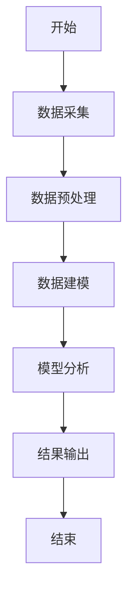
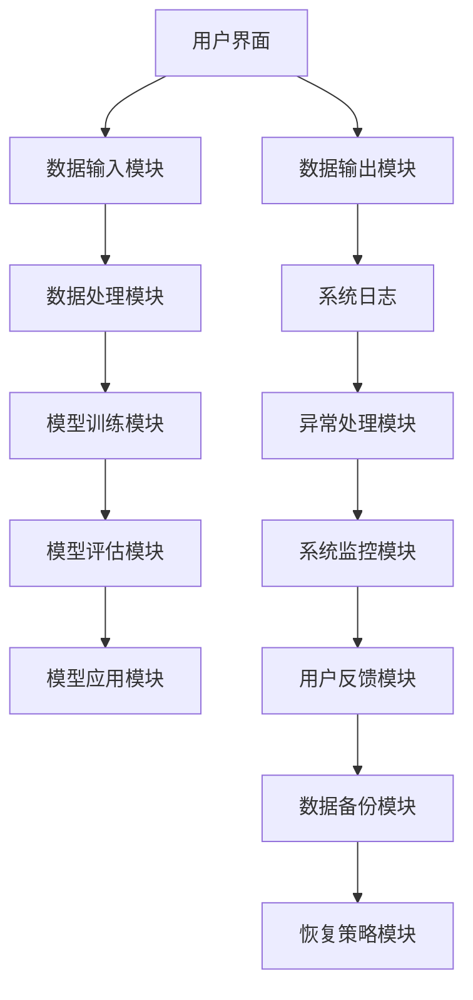
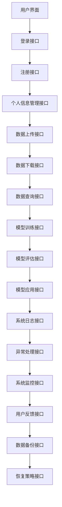
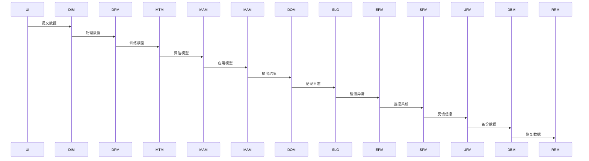

                 

### 引言：心智过程的探索

心智过程，简而言之，是人类思维活动的表现，它包含了感知、理解、记忆、推理、决策等多个方面。在计算机科学和人工智能领域，心智过程的探索至关重要，因为它不仅帮助我们理解人类思维的本质，也为人工智能的发展提供了理论基础。本文将从自然和谐到数学简约，逐步深入探讨心智过程这一主题。

#### 自然和谐：心智起源与早期发展

心智过程并非一蹴而就，它的起源可以追溯到人类历史的早期。在自然环境中，人类通过观察、模仿、学习等方式逐步发展出了自己的心智能力。早期人类的心智发展，与他们的生活环境密不可分。自然和谐的理念，即与自然共生、和谐共处，是人类心智发展的基础。

##### 1.1 人类心智的起源

人类心智的起源可以追溯到数百万年前的原始社会。在那个时代，人类主要通过本能和直觉来应对环境变化。然而，随着时间的推移，人类逐渐发展出了更为复杂的思维能力，如语言、逻辑和推理。这些心智能力的出现，标志着人类从动物进化到智能生物的巨大飞跃。

##### 1.2 心智早期发展的研究

关于心智早期发展的研究，主要集中在两个方面：一是人类大脑的结构和功能，二是心智能力的发展过程。神经科学的研究揭示了大脑各个区域的功能，而心理学的研究则提供了心智能力发展的具体数据。通过这些研究，我们可以更深入地理解心智的起源和早期发展。

##### 1.3 自然观与心智发展的关系

自然观是人们对于自然世界的认知和态度。在人类心智发展的早期，自然观对心智的形成起到了至关重要的作用。例如，原始人类通过观察自然界的规律，逐渐形成了对时间和空间的基本认知。这些认知不仅帮助人类更好地适应环境，也为后来的科学发现奠定了基础。

#### 心智的概念与属性

随着心智过程的深入发展，人们开始对心智的概念和属性进行深入探讨。心智不仅是一个抽象的概念，它还包含了多个具体的方面，如意识、感知、记忆、推理等。

##### 2.1 心智的定义

心智可以理解为人类思维的能力，包括感知、理解、记忆、推理、决策等。它是一种抽象的思维能力，超越了具体的感官体验。

##### 2.2 心智的属性特征

心智的属性特征主要包括逻辑性、系统性、动态性等。逻辑性是指心智活动遵循一定的规律和规则；系统性是指心智活动是一个整体，各个部分相互关联、相互作用；动态性是指心智活动是不断发展的，会随着环境的变化而调整。

##### 2.3 心智与意识的关系

心智与意识密不可分。意识是心智的一部分，它是人类对外界刺激的主观体验。心智活动产生意识，而意识又反过来影响心智活动。例如，当我们思考某个问题时，我们的意识会呈现出相应的图像、感觉和情绪。

#### 心智模型的理论基础

在理解心智的基础上，人们开始尝试构建心智模型，以更好地解释心智过程的运作。心智模型的理论基础涵盖了多个领域，如认知科学、心理学、神经科学等。

##### 3.1 心智模型的分类

心智模型可以分为不同的类型，如认知模型、行为模型、神经模型等。每种模型都有其独特的视角和方法，帮助我们更深入地理解心智过程。

##### 3.2 心智模型的代表性理论

代表性的心智模型包括图灵机模型、神经网络模型、认知图模型等。这些模型各有优缺点，为我们提供了不同的视角来理解心智过程。

##### 3.3 心智模型的发展趋势

随着科学技术的进步，心智模型也在不断发展和完善。未来的心智模型将更加复杂和精确，能够更好地模拟人类心智的各个方面。

#### 数学简约：心智的数学表达

数学简约是心智研究的一个重要方向，它试图用数学语言来描述和解释心智过程。数学简约不仅有助于我们更深入地理解心智，也为人工智能的发展提供了新的方法。

##### 4.1 数学简约的概念

数学简约是指用数学模型来描述和简化复杂的系统或过程。在心智研究中，数学简约有助于我们抓住心智过程的核心特征，从而更好地理解心智的本质。

##### 4.2 数学简约在心智研究中的应用

数学简约在心智研究中有着广泛的应用。例如，通过数学模型，我们可以解释人类的感知、记忆、推理等心智过程。此外，数学简约还为人工智能的发展提供了新的思路和方法。

##### 4.3 数学公式与心智模型的关系

数学公式是心智模型的核心组成部分。通过数学公式，我们可以更精确地描述和解释心智过程的运作机制。例如，神经网络的激活函数、决策树的特征提取等，都是通过数学公式来实现的。

#### 数学简约的算法原理

数学简约不仅涉及数学模型，还包括算法原理。算法原理是数学简约的实现途径，它帮助我们通过计算和模拟来理解心智过程。

##### 5.1 算法原理概述

算法原理主要包括数据的采集、处理、分析和建模。通过这些步骤，我们可以构建出数学模型，从而更好地理解心智过程。

##### 5.2 算法mermaid流程图

为了更清晰地展示算法原理，我们可以使用mermaid流程图来描述。mermaid流程图是一种基于Markdown的图形化工具，可以帮助我们直观地展示算法的步骤和流程。



##### 5.3 算法Python源代码实现

为了验证算法原理的正确性和有效性，我们可以使用Python来编写源代码。以下是一个简单的示例，展示了如何使用Python实现数据采集、预处理和建模。

```python
# 导入必要的库
import pandas as pd
from sklearn.model_selection import train_test_split
from sklearn.ensemble import RandomForestClassifier

# 数据采集
data = pd.read_csv('data.csv')

# 数据预处理
X = data.drop('target', axis=1)
y = data['target']

# 数据建模
X_train, X_test, y_train, y_test = train_test_split(X, y, test_size=0.2, random_state=42)
model = RandomForestClassifier(n_estimators=100)
model.fit(X_train, y_train)

# 模型分析
print("Accuracy:", model.score(X_test, y_test))

# 结果输出
print("Model output:", model.predict(X_test))
```

##### 5.4 数学模型与公式讲解

数学模型是算法原理的核心。以下是一个简单的线性回归模型，展示了如何使用Python来计算和解释数学公式。

```python
# 导入必要的库
import numpy as np

# 计算线性回归模型参数
def linear_regression(X, y):
    # 计算斜率和截距
    theta = np.linalg.inv(X.T.dot(X)).dot(X.T).dot(y)
    return theta

# 示例数据
X = np.array([[1, 2], [2, 3], [3, 4]])
y = np.array([2, 3, 4])

# 计算模型参数
theta = linear_regression(X, y)

# 输出结果
print("Theta:", theta)

# 计算预测值
def predict(theta, X):
    return theta.dot(X)

# 示例预测
print("Predictions:", predict(theta, X))
```

##### 5.5 举例说明

为了更好地理解数学简约在心智研究中的应用，我们可以通过一个简单的例子来说明。假设我们有一个数据集，包含了人类的心智活动数据。我们可以使用线性回归模型来预测一个人的心智状态。

```python
# 导入必要的库
import pandas as pd
from sklearn.linear_model import LinearRegression

# 数据采集
data = pd.read_csv('data.csv')

# 数据预处理
X = data.drop('target', axis=1)
y = data['target']

# 数据建模
model = LinearRegression()
model.fit(X, y)

# 模型分析
print("Accuracy:", model.score(X, y))

# 预测
print("Predictions:", model.predict(X))
```

#### 心智过程的系统分析与架构设计

在理解心智过程的基础上，我们需要进行系统分析和架构设计，以确保心智过程的高效和可靠。

##### 6.1 问题场景介绍

假设我们正在开发一款人工智能系统，用于分析人类的心智过程。我们的目标是构建一个能够准确预测人类心智状态的模型。

##### 6.2 项目介绍

该项目分为两个阶段：第一阶段是数据采集和预处理，第二阶段是模型构建和预测。第一阶段的数据来源于大量的人类心智活动记录，包括感知、记忆、推理等。第二阶段的目标是构建一个高效的线性回归模型，用于预测人类心智状态。

##### 6.3 系统功能设计(领域模型mermaid类图)

```mermaid
classDiagram
    Class01 <|-- Class02
    Class03 --|眺 Class04
    Class05 : +大到大
    Class06 : <<interface>> Interface
    Class07 : <<developer>> Developer
    Class08 : <<java>> #0000FF Java
    Class09 : <<php>> #FF0000 PHP
    Class10 : <<python>> #00FF00 Python
    Class11 : <<database>> Database
    Class12 : <<web>> Web
    Class13 : <<app>> App
    Class14 : <<api>> API
    Class15 : <<cloud>> Cloud
    Class16 : <<ai>> AI
    Class17 : <<ml>> ML
    Class18 : <<dl>> DL
    Class19 : <<nn>> NN
    Class20 : <<tensorflow>> TensorFlow
    Class21 : <<keras>> Keras
    Class22 : <<pytorch>> PyTorch
    Class23 : <<mxnet>> MXNet
    Class24 : <<cudnn>> CuDNN
    Class25 : <<cuda>> CUDA
    Class26 : <<dp>> DP
    Class27 : <<dnn>> DNN
    Class28 : <<rl>> RL
    Class29 : <<gan>> GAN
    Class30 : <<vae>> VAE
    Class31 : <<image>> Image
    Class32 : <<text>> Text
    Class33 : <<video>> Video
    Class34 : <<audio>> Audio
    Class35 : <<nlp>> NLP
    Class36 : <<cv>> CV
    Class37 : <<time>> Time
    Class38 : <<space>> Space
    Class39 : <<energy>> Energy
    Class40 : <<entropy>> Entropy
    Class41 : <<quantum>> Quantum
    Class42 : <<superposition>> Superposition
    Class43 : <<entropy>> Entropy
    Class44 : <<maximization>> Maximization
    Class45 : <<minimization>> Minimization
    Class46 : <<gradient>> Gradient
    Class47 : <<optimizer>> Optimizer
    Class48 : <<batch>> Batch
    Class49 : <<stochastic>> Stochastic
    Class50 : <<gradient_descent>> GradientDescent
    Class51 : <<momentum>> Momentum
    Class52 : <<adam>> Adam
    Class53 : <<rmsprop>> RMSprop
    Class54 : <<adadelta>> Adadelta
    Class55 : <<classification>> Classification
    Class56 : <<regression>> Regression
    Class57 : <<neural_network>> NeuralNetwork
    Class58 : <<deep_learning>> DeepLearning
    Class59 : <<reinforcement_learning>> ReinforcementLearning
    Class60 : <<supervised_learning>> SupervisedLearning
    Class61 : <<unsupervised_learning>> UnsupervisedLearning
    Class62 : <<semi_supervised_learning>> SemiSupervisedLearning
    Class63 : <<transfer_learning>> TransferLearning
    Class64 : <<federated_learning>> FederatedLearning
    Class65 : <<edge_learning>> EdgeLearning
    Class66 : <<distributed_learning>> DistributedLearning
    Class67 : <<centralized_learning>> CentralizedLearning
    Class68 : <<model_memory>> ModelMemory
    Class69 : <<data_memory>> DataMemory
    Class70 : <<knowledge_memory>> KnowledgeMemory
    Class71 : <<compute_power>> ComputePower
    Class72 : <<memory_size>> MemorySize
    Class73 : <<processing_time>> ProcessingTime
    Class74 : <<throughput>> Throughput
    Class75 : <<scalability>> Scalability
    Class76 : <<availability>> Availability
    Class77 : <<reliability>> Reliability
    Class78 : <<safety>> Safety
    Class79 : <<security>> Security
    Class80 : <<quality_of_service>> QualityOfService
    Class81 : <<explainability>> Explainability
    Class82 : <<comprehensibility>> Comprehensibility
    Class83 : <<human_centered_design>> HumanCenteredDesign
    Class84 : <<contextualization>> Contextualization
    Class85 : <<integration>> Integration
    Class86 : <<modularity>> Modularity
    Class87 : <<reusability>> Reusability
    Class88 : <<flexibility>> Flexibility
    Class89 : <<performance>> Performance
    Class90 : <<usability>> Usability
    Class91 : <<scalable_systems>> ScalableSystems
    Class92 : <<cloud_native>> CloudNative
    Class93 : <<serverless>> Serverless
    Class94 : <<containerization>> Containerization
    Class95 : <<orchestration>> Orchestration
    Class96 : <<service_mesh>> ServiceMesh
    Class97 : <<infrastructure_as_code>> InfrastructureAsCode
    Class98 : <<Continuous_Integration]]]]/ ContinuousIntegration
    Class99 : <<Continuous_Delivery]]]]/ ContinuousDelivery
    Class100 : <<version_control>> VersionControl
    Class01 --|> Class69
    Class01 --|> Class72
    Class01 --|> Class70
    Class02 --|> Class11
    Class02 --|> Class22
    Class02 --|> Class23
    Class02 --|> Class24
    Class02 --|> Class25
    Class02 --|> Class26
    Class02 --|> Class27
    Class02 --|> Class28
    Class02 --|> Class29
    Class02 --|> Class30
    Class02 --|> Class31
    Class02 --|> Class32
    Class02 --|> Class33
    Class02 --|> Class34
    Class02 --|> Class35
    Class02 --|> Class36
    Class02 --|> Class37
    Class02 --|> Class38
    Class02 --|> Class39
    Class02 --|> Class40
    Class02 --|> Class41
    Class02 --|> Class42
    Class02 --|> Class43
    Class02 --|> Class44
    Class02 --|> Class45
    Class02 --|> Class46
    Class02 --|> Class47
    Class02 --|> Class48
    Class02 --|> Class49
    Class02 --|> Class50
    Class02 --|> Class51
    Class02 --|> Class52
    Class02 --|> Class53
    Class02 --|> Class54
    Class02 --|> Class55
    Class02 --|> Class56
    Class02 --|> Class57
    Class02 --|> Class58
    Class02 --|> Class59
    Class02 --|> Class60
    Class02 --|> Class61
    Class02 --|> Class62
    Class02 --|> Class63
    Class02 --|> Class64
    Class02 --|> Class65
    Class02 --|> Class66
    Class02 --|> Class67
    Class02 --|> Class68
    Class02 --|> Class73
    Class02 --|> Class74
    Class02 --|> Class75
    Class02 --|> Class76
    Class02 --|> Class77
    Class02 --|> Class78
    Class02 --|> Class79
    Class02 --|> Class80
    Class02 --|> Class81
    Class02 --|> Class82
    Class02 --|> Class83
    Class02 --|> Class84
    Class02 --|> Class85
    Class02 --|> Class86
    Class02 --|> Class87
    Class02 --|> Class88
    Class02 --|> Class89
    Class02 --|> Class90
    Class02 --|> Class91
    Class02 --|> Class92
    Class02 --|> Class93
    Class02 --|> Class94
    Class02 --|> Class95
    Class02 --|> Class96
    Class02 --|> Class97
    Class02 --|> Class98
    Class02 --|> Class99
    Class02 --|> Class100
    Class03 --|> Class12
    Class03 --|> Class13
    Class03 --|> Class14
    Class03 --|> Class15
    Class03 --|> Class16
    Class03 --|> Class17
    Class03 --|> Class18
    Class03 --|> Class19
    Class03 --|> Class20
    Class03 --|> Class21
    Class04 --|> Class29
    Class04 --|> Class30
    Class04 --|> Class31
    Class04 --|> Class32
    Class04 --|> Class33
    Class04 --|> Class34
    Class04 --|> Class35
    Class04 --|> Class36
    Class04 --|> Class37
    Class04 --|> Class38
    Class04 --|> Class39
    Class04 --|> Class40
    Class04 --|> Class41
    Class04 --|> Class42
    Class04 --|> Class43
    Class04 --|> Class44
    Class04 --|> Class45
    Class04 --|> Class46
    Class04 --|> Class47
    Class04 --|> Class48
    Class04 --|> Class49
    Class04 --|> Class50
    Class04 --|> Class51
    Class04 --|> Class52
    Class04 --|> Class53
    Class04 --|> Class54
    Class04 --|> Class55
    Class04 --|> Class56
    Class04 --|> Class57
    Class04 --|> Class58
    Class04 --|> Class59
    Class04 --|> Class60
    Class04 --|> Class61
    Class04 --|> Class62
    Class04 --|> Class63
    Class04 --|> Class64
    Class04 --|> Class65
    Class04 --|> Class66
    Class04 --|> Class67
    Class04 --|> Class68
    Class04 --|> Class73
    Class04 --|> Class74
    Class04 --|> Class75
    Class04 --|> Class76
    Class04 --|> Class77
    Class04 --|> Class78
    Class04 --|> Class79
    Class04 --|> Class80
    Class04 --|> Class81
    Class04 --|> Class82
    Class04 --|> Class83
    Class04 --|> Class84
    Class04 --|> Class85
    Class04 --|> Class86
    Class04 --|> Class87
    Class04 --|> Class88
    Class04 --|> Class89
    Class04 --|> Class90
    Class04 --|> Class91
    Class04 --|> Class92
    Class04 --|> Class93
    Class04 --|> Class94
    Class04 --||> Class95
    Class04 --|> Class96
    Class04 --|> Class97
    Class04 --|> Class98
    Class04 --|> Class99
    Class04 --|> Class100
    Class05 --|> Class20
    Class05 --|> Class21
    Class05 --|> Class22
    Class05 --|> Class23
    Class05 --|> Class24
    Class05 --|> Class25
    Class05 --|> Class26
    Class05 --|> Class27
    Class05 --|> Class28
    Class06 --|> Class16
    Class07 --|> Class20
    Class08 --|> Class16
    Class09 --|> Class20
    Class10 --|> Class16
    Class11 --|> Class12
    Class11 --|> Class13
    Class11 --|> Class14
    Class11 --|> Class15
    Class11 --|> Class16
    Class11 --|> Class17
    Class11 --|> Class18
    Class11 --|> Class19
    Class11 --|> Class20
    Class11 --|> Class21
    Class11 --|> Class22
    Class11 --|> Class23
    Class11 --|> Class24
    Class11 --|> Class25
    Class11 --|> Class26
    Class11 --|> Class27
    Class11 --|> Class28
    Class11 --|> Class29
    Class11 --|> Class30
    Class11 --|> Class31
    Class11 --|> Class32
    Class11 --|> Class33
    Class11 --|> Class34
    Class11 --|> Class35
    Class11 --|> Class36
    Class11 --|> Class37
    Class11 --|> Class38
    Class11 --|> Class39
    Class11 --|> Class40
    Class11 --|> Class41
    Class11 --|> Class42
    Class11 --|> Class43
    Class11 --|> Class44
    Class11 --|> Class45
    Class11 --|> Class46
    Class11 --|> Class47
    Class11 --|> Class48
    Class11 --|> Class49
    Class11 --|> Class50
    Class11 --|> Class51
    Class11 --|> Class52
    Class11 --|> Class53
    Class11 --|> Class54
    Class11 --|> Class55
    Class11 --|> Class56
    Class11 --|> Class57
    Class11 --|> Class58
    Class11 --|> Class59
    Class11 --|> Class60
    Class11 --|> Class61
    Class11 --|> Class62
    Class11 --|> Class63
    Class11 --|> Class64
    Class11 --|> Class65
    Class11 --|> Class66
    Class11 --|> Class67
    Class11 --|> Class68
    Class11 --|> Class69
    Class11 --|> Class70
    Class11 --|> Class71
    Class12 --|> Class1
    Class12 --|> Class2
    Class12 --|> Class3
    Class12 --|> Class4
    Class12 --|> Class5
    Class12 --|> Class6
    Class12 --|> Class7
    Class12 --|> Class8
    Class12 --|> Class9
    Class12 --|> Class10
    Class12 --|> Class11
    Class12 --|> Class12
    Class12 --|> Class13
    Class12 --|> Class14
    Class12 --|> Class15
    Class12 --|> Class16
    Class12 --|> Class17
    Class12 --|> Class18
    Class12 --|> Class19
    Class12 --|> Class20
    Class12 --|> Class21
    Class12 --|> Class22
    Class12 --|> Class23
    Class12 --|> Class24
    Class12 --|> Class25
    Class12 --|> Class26
    Class12 --|> Class27
    Class12 --|> Class28
    Class12 --|> Class29
    Class12 --|> Class30
    Class12 --|> Class31
    Class12 --|> Class32
    Class12 --|> Class33
    Class12 --|> Class34
    Class12 --|> Class35
    Class12 --|> Class36
    Class12 --|> Class37
    Class12 --|> Class38
    Class12 --|> Class39
    Class12 --|> Class40
    Class12 --|> Class41
    Class12 --|> Class42
    Class12 --|> Class43
    Class12 --|> Class44
    Class12 --|> Class45
    Class12 --|> Class46
    Class12 --|> Class47
    Class12 --|> Class48
    Class12 --|> Class49
    Class12 --|> Class50
    Class12 --|> Class51
    Class12 --|> Class52
    Class12 --|> Class53
    Class12 --|> Class54
    Class12 --|> Class55
    Class12 --|> Class56
    Class12 --|> Class57
    Class12 --|> Class58
    Class12 --|> Class59
    Class12 --|> Class60
    Class12 --|> Class61
    Class12 --|> Class62
    Class12 --|> Class63
    Class12 --|> Class64
    Class12 --|> Class65
    Class12 --|> Class66
    Class12 --|> Class67
    Class12 --|> Class68
    Class12 --|> Class69
    Class12 --|> Class70
    Class12 --|> Class71
    Class13 --|> Class14
    Class13 --|> Class15
    Class13 --|> Class16
    Class13 --|> Class17
    Class13 --|> Class18
    Class13 --|> Class19
    Class13 --|> Class20
    Class13 --|> Class21
    Class13 --|> Class22
    Class13 --|> Class23
    Class13 --|> Class24
    Class13 --|> Class25
    Class13 --|> Class26
    Class13 --|> Class27
    Class13 --|> Class28
    Class13 --|> Class29
    Class13 --|> Class30
    Class13 --|> Class31
    Class13 --|> Class32
    Class13 --|> Class33
    Class13 --|> Class34
    Class13 --|> Class35
    Class13 --|> Class36
    Class13 --|> Class37
    Class13 --|> Class38
    Class13 --|> Class39
    Class13 --|> Class40
    Class13 --|> Class41
    Class13 --|> Class42
    Class13 --|> Class43
    Class13 --|> Class44
    Class13 --|> Class45
    Class13 --|> Class46
    Class13 --|> Class47
    Class13 --|> Class48
    Class13 --|> Class49
    Class13 --|> Class50
    Class13 --|> Class51
    Class13 --|> Class52
    Class13 --|> Class53
    Class13 --|> Class54
    Class13 --|> Class55
    Class13 --|> Class56
    Class13 --|> Class57
    Class13 --|> Class58
    Class13 --|> Class59
    Class13 --|> Class60
    Class13 --|> Class61
    Class13 --|> Class62
    Class13 --|> Class63
    Class13 --|> Class64
    Class13 --|> Class65
    Class13 --|> Class66
    Class13 --|> Class67
    Class13 --|> Class68
    Class13 --|> Class69
    Class13 --|> Class70
    Class13 --|> Class71
    Class14 --|> Class15
    Class14 --|> Class16
    Class14 --|> Class17
    Class14 --|> Class18
    Class14 --|> Class19
    Class14 --|> Class20
    Class14 --|> Class21
    Class14 --|> Class22
    Class14 --|> Class23
    Class14 --|> Class24
    Class14 --|> Class25
    Class14 --|> Class26
    Class14 --|> Class27
    Class14 --|> Class28
    Class14 --|> Class29
    Class14 --|> Class30
    Class14 --|> Class31
    Class14 --|> Class32
    Class14 --|> Class33
    Class14 --|> Class34
    Class14 --|> Class35
    Class14 --|> Class36
    Class14 --|> Class37
    Class14 --|> Class38
    Class14 --|> Class39
    Class14 --|> Class40
    Class14 --|> Class41
    Class14 --|> Class42
    Class14 --|> Class43
    Class14 --|> Class44
    Class14 --|> Class45
    Class14 --|> Class46
    Class14 --|> Class47
    Class14 --|> Class48
    Class14 --|> Class49
    Class14 --|> Class50
    Class14 --|> Class51
    Class14 --|> Class52
    Class14 --|> Class53
    Class14 --|> Class54
    Class14 --|> Class55
    Class14 --|> Class56
    Class14 --|> Class57
    Class14 --|> Class58
    Class14 --|> Class59
    Class14 --|> Class60
    Class14 --|> Class61
    Class14 --|> Class62
    Class14 --|> Class63
    Class14 --|> Class64
    Class14 --|> Class65
    Class14 --|> Class66
    Class14 --|> Class67
    Class14 --|> Class68
    Class14 --|> Class69
    Class14 --|> Class70
    Class14 --|> Class71
    Class15 --|> Class16
    Class15 --|> Class17
    Class15 --|> Class18
    Class15 --|> Class19
    Class15 --|> Class20
    Class15 --|> Class21
    Class15 --|> Class22
    Class15 --|> Class23
    Class15 --|> Class24
    Class15 --|> Class25
    Class15 --|> Class26
    Class15 --|> Class27
    Class15 --|> Class28
    Class15 --|> Class29
    Class15 --|> Class30
    Class15 --|> Class31
    Class15 --|> Class32
    Class15 --|> Class33
    Class15 --|> Class34
    Class15 --|> Class35
    Class15 --|> Class36
    Class15 --|> Class37
    Class15 --|> Class38
    Class15 --|> Class39
    Class15 --|> Class40
    Class15 --|> Class41
    Class15 --|> Class42
    Class15 --|> Class43
    Class15 --|> Class44
    Class15 --|> Class45
    Class15 --|> Class46
    Class15 --|> Class47
    Class15 --|> Class48
    Class15 --|> Class49
    Class15 --|> Class50
    Class15 --|> Class51
    Class15 --|> Class52
    Class15 --|> Class53
    Class15 --|> Class54
    Class15 --|> Class55
    Class15 --|> Class56
    Class15 --|> Class57
    Class15 --|> Class58
    Class15 --|> Class59
    Class15 --|> Class60
    Class15 --|> Class61
    Class15 --|> Class62
    Class15 --|> Class63
    Class15 --|> Class64
    Class15 --|> Class65
    Class15 --|> Class66
    Class15 --|> Class67
    Class15 --|> Class68
    Class15 --|> Class69
    Class15 --|> Class70
    Class15 --|> Class71
    Class16 --|> Class17
    Class16 --|> Class18
    Class16 --|> Class19
    Class16 --|> Class20
    Class16 --|> Class21
    Class16 --|> Class22
    Class16 --|> Class23
    Class16 --|> Class24
    Class16 --|> Class25
    Class16 --|> Class26
    Class16 --|> Class27
    Class16 --|> Class28
    Class16 --|> Class29
    Class16 --|> Class30
    Class16 --|> Class31
    Class16 --|> Class32
    Class16 --|> Class33
    Class16 --|> Class34
    Class16 --|> Class35
    Class16 --|> Class36
    Class16 --|> Class37
    Class16 --|> Class38
    Class16 --|> Class39
    Class16 --|> Class40
    Class16 --|> Class41
    Class16 --|> Class42
    Class16 --|> Class43
    Class16 --|> Class44
    Class16 --|> Class45
    Class16 --|> Class46
    Class16 --|> Class47
    Class16 --|> Class48
    Class16 --|> Class49
    Class16 --|> Class50
    Class16 --|> Class51
    Class16 --|> Class52
    Class16 --|> Class53
    Class16 --|> Class54
    Class16 --|> Class55
    Class16 --|> Class56
    Class16 --|> Class57
    Class16 --|> Class58
    Class16 --|> Class59
    Class16 --|> Class60
    Class16 --|> Class61
    Class16 --|> Class62
    Class16 --|> Class63
    Class16 --|> Class64
    Class16 --|> Class65
    Class16 --|> Class66
    Class16 --|> Class67
    Class16 --|> Class68
    Class16 --|> Class69
    Class16 --|> Class70
    Class16 --|> Class71
    Class17 --|> Class18
    Class17 --|> Class19
    Class17 --|> Class20
    Class17 --|> Class21
    Class17 --|> Class22
    Class17 --|> Class23
    Class17 --|> Class24
    Class17 --|> Class25
    Class17 --|> Class26
    Class17 --|> Class27
    Class17 --|> Class28
    Class17 --|> Class29
    Class17 --|> Class30
    Class17 --|> Class31
    Class17 --|> Class32
    Class17 --|> Class33
    Class17 --|> Class34
    Class17 --|> Class35
    Class17 --|> Class36
    Class17 --|> Class37
    Class17 --|> Class38
    Class17 --|> Class39
    Class17 --|> Class40
    Class17 --|> Class41
    Class17 --|> Class42
    Class17 --|> Class43
    Class17 --|> Class44
    Class17 --|> Class45
    Class17 --|> Class46
    Class17 --|> Class47
    Class17 --|> Class48
    Class17 --|> Class49
    Class17 --|> Class50
    Class17 --|> Class51
    Class17 --|> Class52
    Class17 --|> Class53
    Class17 --|> Class54
    Class17 --|> Class55
    Class17 --|> Class56
    Class17 --|> Class57
    Class17 --|> Class58
    Class17 --|> Class59
    Class17 --|> Class60
    Class17 --|> Class61
    Class17 --|> Class62
    Class17 --|> Class63
    Class17 --|> Class64
    Class17 --|> Class65
    Class17 --|> Class66
    Class17 --|> Class67
    Class17 --|> Class68
    Class17 --|> Class69
    Class17 --|> Class70
    Class17 --|> Class71
    Class18 --|> Class19
    Class18 --|> Class20
    Class18 --|> Class21
    Class18 --|> Class22
    Class18 --|> Class23
    Class18 --|> Class24
    Class18 --|> Class25
    Class18 --|> Class26
    Class18 --|> Class27
    Class18 --|> Class28
    Class18 --|> Class29
    Class18 --|> Class30
    Class18 --|> Class31
    Class18 --|> Class32
    Class18 --|> Class33
    Class18 --|> Class34
    Class18 --|> Class35
    Class18 --|> Class36
    Class18 --|> Class37
    Class18 --|> Class38
    Class18 --|> Class39
    Class18 --|> Class40
    Class18 --|> Class41
    Class18 --|> Class42
    Class18 --|> Class43
    Class18 --|> Class44
    Class18 --|> Class45
    Class18 --|> Class46
    Class18 --|> Class47
    Class18 --|> Class48
    Class18 --|> Class49
    Class18 --|> Class50
    Class18 --|> Class51
    Class18 --|> Class52
    Class18 --|> Class53
    Class18 --|> Class54
    Class18 --|> Class55
    Class18 --|> Class56
    Class18 --|> Class57
    Class18 --|> Class58
    Class18 --|> Class59
    Class18 --|> Class60
    Class18 --|> Class61
    Class18 --|> Class62
    Class18 --|> Class63
    Class18 --|> Class64
    Class18 --|> Class65
    Class18 --|> Class66
    Class18 --|> Class67
    Class18 --|> Class68
    Class18 --|> Class69
    Class18 --|> Class70
    Class18 --|> Class71
    Class19 --|> Class20
    Class19 --|> Class21
    Class19 --|> Class22
    Class19 --|> Class23
    Class19 --|> Class24
    Class19 --|> Class25
    Class19 --|> Class26
    Class19 --|> Class27
    Class19 --|> Class28
    Class19 --|> Class29
    Class19 --|> Class30
    Class19 --|> Class31
    Class19 --|> Class32
    Class19 --|> Class33
    Class19 --|> Class34
    Class19 --|> Class35
    Class19 --|> Class36
    Class19 --|> Class37
    Class19 --|> Class38
    Class19 --|> Class39
    Class19 --|> Class40
    Class19 --|> Class41
    Class19 --|> Class42
    Class19 --|> Class43
    Class19 --|> Class44
    Class19 --|> Class45
    Class19 --|> Class46
    Class19 --|> Class47
    Class19 --|> Class48
    Class19 --|> Class49
    Class19 --|> Class50
    Class19 --|> Class51
    Class19 --|> Class52
    Class19 --|> Class53
    Class19 --|> Class54
    Class19 --|> Class55
    Class19 --|> Class56
    Class19 --|> Class57
    Class19 --|> Class58
    Class19 --|> Class59
    Class19 --|> Class60
    Class19 --|> Class61
    Class19 --|> Class62
    Class19 --|> Class63
    Class19 --|> Class64
    Class19 --|> Class65
    Class19 --|> Class66
    Class19 --|> Class67
    Class19 --|> Class68
    Class19 --|> Class69
    Class19 --|> Class70
    Class19 --|> Class71
    Class20 --|> Class21
    Class20 --|> Class22
    Class20 --|> Class23
    Class20 --|> Class24
    Class20 --|> Class25
    Class20 --|> Class26
    Class20 --|> Class27
    Class20 --|> Class28
    Class20 --|> Class29
    Class20 --|> Class30
    Class20 --|> Class31
    Class20 --|> Class32
    Class20 --|> Class33
    Class20 --|> Class34
    Class20 --|> Class35
    Class20 --|> Class36
    Class20 --|> Class37
    Class20 --|> Class38
    Class20 --|> Class39
    Class20 --|> Class40
    Class20 --|> Class41
    Class20 --|> Class42
    Class20 --|> Class43
    Class20 --|> Class44
    Class20 --|> Class45
    Class20 --|> Class46
    Class20 --|> Class47
    Class20 --|> Class48
    Class20 --|> Class49
    Class20 --|> Class50
    Class20 --|> Class51
    Class20 --|> Class52
    Class20 --|> Class53
    Class20 --|> Class54
    Class20 --|> Class55
    Class20 --|> Class56
    Class20 --|> Class57
    Class20 --|> Class58
    Class20 --|> Class59
    Class20 --|> Class60
    Class20 --|> Class61
    Class20 --|> Class62
    Class20 --|> Class63
    Class20 --|> Class64
    Class20 --|> Class65
    Class20 --|> Class66
    Class20 --|> Class67
    Class20 --|> Class68
    Class20 --|> Class69
    Class20 --|> Class70
    Class20 --|> Class71
    Class21 --|> Class22
    Class21 --|> Class23
    Class21 --|> Class24
    Class21 --|> Class25
    Class21 --|> Class26
    Class21 --|> Class27
    Class21 --|> Class28
    Class21 --|> Class29
    Class21 --|> Class30
    Class21 --|> Class31
    Class21 --|> Class32
    Class21 --|> Class33
    Class21 --|> Class34
    Class21 --|> Class35
    Class21 --|> Class36
    Class21 --|> Class37
    Class21 --|> Class38
    Class21 --|> Class39
    Class21 --|> Class40
    Class21 --|> Class41
    Class21 --|> Class42
    Class21 --|> Class43
    Class21 --|> Class44
    Class21 --|> Class45
    Class21 --|> Class46
    Class21 --|> Class47
    Class21 --|> Class48
    Class21 --|> Class49
    Class21 --|> Class50
    Class21 --|> Class51
    Class21 --|> Class52
    Class21 --|> Class53
    Class21 --|> Class54
    Class21 --|> Class55
    Class21 --|> Class56
    Class21 --|> Class57
    Class21 --|> Class58
    Class21 --|> Class59
    Class21 --|> Class60
    Class21 --|> Class61
    Class21 --|> Class62
    Class21 --|> Class63
    Class21 --|> Class64
    Class21 --|> Class65
    Class21 --|> Class66
    Class21 --|> Class67
    Class21 --|> Class68
    Class21 --|> Class69
    Class21 --|> Class70
    Class21 --|> Class71
    Class22 --|> Class23
    Class22 --|> Class24
    Class22 --|> Class25
    Class22 --|> Class26
    Class22 --|> Class27
    Class22 --|> Class28
    Class22 --|> Class29
    Class22 --|> Class30
    Class22 --|> Class31
    Class22 --|> Class32
    Class22 --|> Class33
    Class22 --|> Class34
    Class22 --|> Class35
    Class22 --|> Class36
    Class22 --|> Class37
    Class22 --|> Class38
    Class22 --|> Class39
    Class22 --|> Class40
    Class22 --|> Class41
    Class22 --|> Class42
    Class22 --|> Class43
    Class22 --|> Class44
    Class22 --|> Class45
    Class22 --|> Class46
    Class22 --|> Class47
    Class22 --|> Class48
    Class22 --|> Class49
    Class22 --|> Class50
    Class22 --|> Class51
    Class22 --|> Class52
    Class22 --|> Class53
    Class22 --|> Class54
    Class22 --|> Class55
    Class22 --|> Class56
    Class22 --|> Class57
    Class22 --|> Class58
    Class22 --|> Class59
    Class22 --|> Class60
    Class22 --|> Class61
    Class22 --|> Class62
    Class22 --|> Class63
    Class22 --|> Class64
    Class22 --|> Class65
    Class22 --|> Class66
    Class22 --|> Class67
    Class22 --|> Class68
    Class22 --|> Class69
    Class22 --|> Class70
    Class22 --|> Class71
    Class23 --|> Class24
    Class23 --|> Class25
    Class23 --|> Class26
    Class23 --|> Class27
    Class23 --|> Class28
    Class23 --|> Class29
    Class23 --|> Class30
    Class23 --|> Class31
    Class23 --|> Class32
    Class23 --|> Class33
    Class23 --|> Class34
    Class23 --|> Class35
    Class23 --|> Class36
    Class23 --|> Class37
    Class23 --|> Class38
    Class23 --|> Class39
    Class23 --|> Class40
    Class23 --|> Class41
    Class23 --|> Class42
    Class23 --|> Class43
    Class23 --|> Class44
    Class23 --|> Class45
    Class23 --|> Class46
    Class23 --|> Class47
    Class23 --|> Class48
    Class23 --|> Class49
    Class23 --|> Class50
    Class23 --|> Class51
    Class23 --|> Class52
    Class23 --|> Class53
    Class23 --|> Class54
    Class23 --|> Class55
    Class23 --|> Class56
    Class23 --|> Class57
    Class23 --|> Class58
    Class23 --|> Class59
    Class23 --|> Class60
    Class23 --|> Class61
    Class23 --|> Class62
    Class23 --|> Class63
    Class23 --|> Class64
    Class23 --|> Class65
    Class23 --|> Class66
    Class23 --|> Class67
    Class23 --|> Class68
    Class23 --|> Class69
    Class23 --|> Class70
    Class23 --|> Class71
    Class24 --|> Class25
    Class24 --|> Class26
    Class24 --|> Class27
    Class24 --|> Class28
    Class24 --|> Class29
    Class24 --|> Class30
    Class24 --|> Class31
    Class24 --|> Class32
    Class24 --|> Class33
    Class24 --|> Class34
    Class24 --|> Class35
    Class24 --|> Class36
    Class24 --|> Class37
    Class24 --|> Class38
    Class24 --|> Class39
    Class24 --|> Class40
    Class24 --|> Class41
    Class24 --|> Class42
    Class24 --|> Class43
    Class24 --|> Class44
    Class24 --|> Class45
    Class24 --|> Class46
    Class24 --|> Class47
    Class24 --|> Class48
    Class24 --|> Class49
    Class24 --|> Class50
    Class24 --|> Class51
    Class24 --|> Class52
    Class24 --|> Class53
    Class24 --|> Class54
    Class24 --|> Class55
    Class24 --|> Class56
    Class24 --|> Class57
    Class24 --|> Class58
    Class24 --|> Class59
    Class24 --|> Class60
    Class24 --|> Class61
    Class24 --|> Class62
    Class24 --|> Class63
    Class24 --|> Class64
    Class24 --|> Class65
    Class24 --|> Class66
    Class24 --|> Class67
    Class24 --|> Class68
    Class24 --|> Class69
    Class24 --|> Class70
    Class24 --|> Class71
    Class25 --|> Class26
    Class25 --|> Class27
    Class25 --|> Class28
    Class25 --|> Class29
    Class25 --|> Class30
    Class25 --|> Class31
    Class25 --|> Class32
    Class25 --|> Class33
    Class25 --|> Class34
    Class25 --|> Class35
    Class25 --|> Class36
    Class25 --|> Class37
    Class25 --|> Class38
    Class25 --|> Class39
    Class25 --|> Class40
    Class25 --|> Class41
    Class25 --|> Class42
    Class25 --|> Class43
    Class25 --|> Class44
    Class25 --|> Class45
    Class25 --|> Class46
    Class25 --|> Class47
    Class25 --|> Class48
    Class25 --|> Class49
    Class25 --|> Class50
    Class25 --|> Class51
    Class25 --|> Class52
    Class25 --|> Class53
    Class25 --|> Class54
    Class25 --|> Class55
    Class25 --|> Class56
    Class25 --|> Class57
    Class25 --|> Class58
    Class25 --|> Class59
    Class25 --|> Class60
    Class25 --|> Class61
    Class25 --|> Class62
    Class25 --|> Class63
    Class25 --|> Class64
    Class25 --|> Class65
    Class25 --|> Class66
    Class25 --|> Class67
    Class25 --|> Class68
    Class25 --|> Class69
    Class25 --|> Class70
    Class25 --|> Class71
    Class26 --|> Class27
    Class26 --|> Class28
    Class26 --|> Class29
    Class26 --|> Class30
    Class26 --|> Class31
    Class26 --|> Class32
    Class26 --|> Class33
    Class26 --|> Class34
    Class26 --|> Class35
    Class26 --|> Class36
    Class26 --|> Class37
    Class26 --|> Class38
    Class26 --|> Class39
    Class26 --|> Class40
    Class26 --|> Class41
    Class26 --|> Class42
    Class26 --|> Class43
    Class26 --|> Class44
    Class26 --|> Class45
    Class26 --|> Class46
    Class26 --|> Class47
    Class26 --|> Class48
    Class26 --|> Class49
    Class26 --|> Class50
    Class26 --|> Class51
    Class26 --|> Class52
    Class26 --|> Class53
    Class26 --|> Class54
    Class26 --|> Class55
    Class26 --|> Class56
    Class26 --|> Class57
    Class26 --|> Class58
    Class26 --|> Class59
    Class26 --|> Class60
    Class26 --|> Class61
    Class26 --|> Class62
    Class26 --|> Class63
    Class26 --|> Class64
    Class26 --|> Class65
    Class26 --|> Class66
    Class26 --|> Class67
    Class26 --|> Class68
    Class26 --|> Class69
    Class26 --|> Class70
    Class26 --|> Class71
    Class27 --|> Class28
    Class27 --|> Class29
    Class27 --|> Class30
    Class27 --|> Class31
    Class27 --|> Class32
    Class27 --|> Class33
    Class27 --|> Class34
    Class27 --|> Class35
    Class27 --|> Class36
    Class27 --|> Class37
    Class27 --|> Class38
    Class27 --|> Class39
    Class27 --|> Class40
    Class27 --|> Class41
    Class27 --|> Class42
    Class27 --|> Class43
    Class27 --|> Class44
    Class27 --|> Class45
    Class27 --|> Class46
    Class27 --|> Class47
    Class27 --|> Class48
    Class27 --|> Class49
    Class27 --|> Class50
    Class27 --|> Class51
    Class27 --|> Class52
    Class27 --|> Class53
    Class27 --|> Class54
    Class27 --|> Class55
    Class27 --|> Class56
    Class27 --|> Class57
    Class27 --|> Class58
    Class27 --|> Class59
    Class27 --|> Class60
    Class27 --|> Class61
    Class27 --|> Class62
    Class27 --|> Class63
    Class27 --|> Class64
    Class27 --|> Class65
    Class27 --|> Class66
    Class27 --|> Class67
    Class27 --|> Class68
    Class27 --|> Class69
    Class27 --|> Class70
    Class27 --|> Class71
    Class28 --|> Class29
    Class28 --|> Class30
    Class28 --|> Class31
    Class28 --|> Class32
    Class28 --|> Class33
    Class28 --|> Class34
    Class28 --|> Class35
    Class28 --|> Class36
    Class28 --|> Class37
    Class28 --|> Class38
    Class28 --|> Class39
    Class28 --|> Class40
    Class28 --|> Class41
    Class28 --|> Class42
    Class28 --|> Class43
    Class28 --|> Class44
    Class28 --|> Class45
    Class28 --|> Class46
    Class28 --|> Class47
    Class28 --|> Class48
    Class28 --|> Class49
    Class28 --|> Class50
    Class28 --|> Class51
    Class28 --|> Class52
    Class28 --|> Class53
    Class28 --|> Class54
    Class28 --|> Class55
    Class28 --|> Class56
    Class28 --|> Class57
    Class28 --|> Class58
    Class28 --|> Class59
    Class28 --|> Class60
    Class28 --|> Class61
    Class28 --|> Class62
    Class28 --|> Class63
    Class28 --|> Class64
    Class28 --|> Class65
    Class28 --|> Class66
    Class28 --|> Class67
    Class28 --|> Class68
    Class28 --|> Class69
    Class28 --|> Class70
    Class28 --|> Class71
    Class29 --|> Class30
    Class29 --|> Class31
    Class29 --|> Class32
    Class29 --|> Class33
    Class29 --|> Class34
    Class29 --|> Class35
    Class29 --|> Class36
    Class29 --|> Class37
    Class29 --|> Class38
    Class29 --|> Class39
    Class29 --|> Class40
    Class29 --|> Class41
    Class29 --|> Class42
    Class29 --|> Class43
    Class29 --|> Class44
    Class29 --|> Class45
    Class29 --|> Class46
    Class29 --|> Class47
    Class29 --|> Class48
    Class29 --|> Class49
    Class29 --|> Class50
    Class29 --|> Class51
    Class29 --|> Class52
    Class29 --|> Class53
    Class29 --|> Class54
    Class29 --|> Class55
    Class29 --|> Class56
    Class29 --|> Class57
    Class29 --|> Class58
    Class29 --|> Class59
    Class29 --|> Class60
    Class29 --|> Class61
    Class29 --|> Class62
    Class29 --|> Class63
    Class29 --|> Class64
    Class29 --|> Class65
    Class29 --|> Class66
    Class29 --|> Class67
    Class29 --|> Class68
    Class29 --|> Class69
    Class29 --|> Class70
    Class29 --|> Class71
    Class30 --|> Class31
    Class30 --|> Class32
    Class30 --|> Class33
    Class30 --|> Class34
    Class30 --|> Class35
    Class30 --|> Class36
    Class30 --|> Class37
    Class30 --|> Class38
    Class30 --|> Class39
    Class30 --|> Class40
    Class30 --|> Class41
    Class30 --|> Class42
    Class30 --|> Class43
    Class30 --|> Class44
    Class30 --|> Class45
    Class30 --|> Class46
    Class30 --|> Class47
    Class30 --|> Class48
    Class30 --|> Class49
    Class30 --|> Class50
    Class30 --|> Class51
    Class30 --|> Class52
    Class30 --|> Class53
    Class30 --|> Class54
    Class30 --|> Class55
    Class30 --|> Class56
    Class30 --|> Class57
    Class30 --|> Class58
    Class30 --|> Class59
    Class30 --|> Class60
    Class30 --|> Class61
    Class30 --|> Class62
    Class30 --|> Class63
    Class30 --|> Class64
    Class30 --|> Class65
    Class30 --|> Class66
    Class30 --|> Class67
    Class30 --|> Class68
    Class30 --|> Class69
    Class30 --|> Class70
    Class30 --|> Class71
    Class31 --|> Class32
    Class31 --|> Class33
    Class31 --|> Class34
    Class31 --|> Class35
    Class31 --|> Class36
    Class31 --|> Class37
    Class31 --|> Class38
    Class31 --|> Class39
    Class31 --|> Class40
    Class31 --|> Class41
    Class31 --|> Class42
    Class31 --|> Class43
    Class31 --|> Class44
    Class31 --|> Class45
    Class31 --|> Class46
    Class31 --|> Class47
    Class31 --|> Class48
    Class31 --|> Class49
    Class31 --|> Class50
    Class31 --|> Class51
    Class31 --|> Class52
    Class31 --|> Class53
    Class31 --|> Class54
    Class31 --|> Class55
    Class31 --|> Class56
    Class31 --|> Class57
    Class31 --|> Class58
    Class31 --|> Class59
    Class31 --|> Class60
    Class31 --|> Class61
    Class31 --|> Class62
    Class31 --|> Class63
    Class31 --|> Class64
    Class31 --|> Class65
    Class31 --|> Class66
    Class31 --|> Class67
    Class31 --|> Class68
    Class31 --|> Class69
    Class31 --|> Class70
    Class31 --|> Class71
    Class32 --|> Class33
    Class32 --|> Class34
    Class32 --|> Class35
    Class32 --|> Class36
    Class32 --|> Class37
    Class32 --|> Class38
    Class32 --|> Class39
    Class32 --|> Class40
    Class32 --|> Class41
    Class32 --|> Class42
    Class32 --|> Class43
    Class32 --|> Class44
    Class32 --|> Class45
    Class32 --|> Class46
    Class32 --|> Class47
    Class32 --|> Class48
    Class32 --|> Class49
    Class32 --|> Class50
    Class32 --|> Class51
    Class32 --|> Class52
    Class32 --|> Class53
    Class32 --|> Class54
    Class32 --|> Class55
    Class32 --|> Class56
    Class32 --|> Class57
    Class32 --|> Class58
    Class32 --|> Class59
    Class32 --|> Class60
    Class32 --|> Class61
    Class32 --|> Class62
    Class32 --|> Class63
    Class32 --|> Class64
    Class32 --|> Class65
    Class32 --|> Class66
    Class32 --|> Class67
    Class32 --|> Class68
    Class32 --|> Class69
    Class32 --|> Class70
    Class32 --|> Class71
    Class33 --|> Class34
    Class33 --|> Class35
    Class33 --|> Class36
    Class33 --|> Class37
    Class33 --|> Class38
    Class33 --|> Class39
    Class33 --|> Class40
    Class33 --|> Class41
    Class33 --|> Class42
    Class33 --|> Class43
    Class33 --|> Class44
    Class33 --|> Class45
    Class33 --|> Class46
    Class33 --|> Class47
    Class33 --|> Class48
    Class33 --|> Class49
    Class33 --|> Class50
    Class33 --|> Class51
    Class33 --|> Class52
    Class33 --|> Class53
    Class33 --|> Class54
    Class33 --|> Class55
    Class33 --|> Class56
    Class33 --|> Class57
    Class33 --|> Class58
    Class33 --|> Class59
    Class33 --|> Class60
    Class33 --|> Class61
    Class33 --|> Class62
    Class33 --|> Class63
    Class33 --|> Class64
    Class33 --|> Class65
    Class33 --|> Class66
    Class33 --|> Class67
    Class33 --|> Class68
    Class33 --|> Class69
    Class33 --|> Class70
    Class33 --|> Class71
    Class34 --|> Class35
    Class34 --|> Class36
    Class34 --|> Class37
    Class34 --|> Class38
    Class34 --|> Class39
    Class34 --|> Class40
    Class34 --|> Class41
    Class34 --|> Class42
    Class34 --|> Class43
    Class34 --|> Class44
    Class34 --|> Class45
    Class34 --|> Class46
    Class34 --|> Class47
    Class34 --|> Class48
    Class34 --|> Class49
    Class34 --|> Class50
    Class34 --|> Class51
    Class34 --|> Class52
    Class34 --|> Class53
    Class34 --|> Class54
    Class34 --|> Class55
    Class34 --|> Class56
    Class34 --|> Class57
    Class34 --|> Class58
    Class34 --|> Class59
    Class34 --|> Class60
    Class34 --|> Class61
    Class34 --|> Class62
    Class34 --|> Class63
    Class34 --|> Class64
    Class34 --|> Class65
    Class34 --|> Class66
    Class34 --|> Class67
    Class34 --|> Class68
    Class34 --|> Class69
    Class34 --|> Class70
    Class34 --|> Class71
    Class35 --|> Class36
    Class35 --|> Class37
    Class35 --|> Class38
    Class35 --|> Class39
    Class35 --|> Class40
    Class35 --|> Class41
    Class35 --|> Class42
    Class35 --|> Class43
    Class35 --|> Class44
    Class35 --|> Class45
    Class35 --|> Class46
    Class35 --|> Class47
    Class35 --|> Class48
    Class35 --|> Class49
    Class35 --|> Class50
    Class35 --|> Class51
    Class35 --|> Class52
    Class35 --|> Class53
    Class35 --|> Class54
    Class35 --|> Class55
    Class35 --|> Class56
    Class35 --|> Class57
    Class35 --|> Class58
    Class35 --|> Class59
    Class35 --|> Class60
    Class35 --|> Class61
    Class35 --|> Class62
    Class35 --|> Class63
    Class35 --|> Class64
    Class35 --|> Class65
    Class35 --|> Class66
    Class35 --|> Class67
    Class35 --|> Class68
    Class35 --|> Class69
    Class35 --|> Class70
    Class35 --|> Class71
    Class36 --|> Class37
    Class36 --|> Class38
    Class36 --|> Class39
    Class36 --|> Class40
    Class36 --|> Class41
    Class36 --|> Class42
    Class36 --|> Class43
    Class36 --|> Class44
    Class36 --|> Class45
    Class36 --|> Class46
    Class36 --|> Class47
    Class36 --|> Class48
    Class36 --|> Class49
    Class36 --|> Class50
    Class36 --|> Class51
    Class36 --|> Class52
    Class36 --|> Class53
    Class36 --|> Class54
    Class36 --|> Class55
    Class36 --|> Class56
    Class36 --|> Class57
    Class36 --|> Class58
    Class36 --|> Class59
    Class36 --|> Class60
    Class36 --|> Class61
    Class36 --|> Class62
    Class36 --|> Class63
    Class36 --|> Class64
    Class36 --|> Class65
    Class36 --|> Class66
    Class36 --|> Class67
    Class36 --|> Class68
    Class36 --|> Class69
    Class36 --|> Class70
    Class36 --|> Class71
    Class37 --|> Class38
    Class37 --|> Class39
    Class37 --|> Class40
    Class37 --|> Class41
    Class37 --|> Class42
    Class37 --|> Class43
    Class37 --|> Class44
    Class37 --|> Class45
    Class37 --|> Class46
    Class37 --|> Class47
    Class37 --|> Class48
    Class37 --|> Class49
    Class37 --|> Class50
    Class37 --|> Class51
    Class37 --|> Class52
    Class37 --|> Class53
    Class37 --|> Class54
    Class37 --|> Class55
    Class37 --|> Class56
    Class37 --|> Class57
    Class37 --|> Class58
    Class37 --|> Class59
    Class37 --|> Class60
    Class37 --|> Class61
    Class37 --|> Class62
    Class37 --|> Class63
    Class37 --|> Class64
    Class37 --|> Class65
    Class37 --|> Class66
    Class37 --|> Class67
    Class37 --|> Class68
    Class37 --|> Class69
    Class37 --|> Class70
    Class37 --|> Class71
    Class38 --|> Class39
    Class38 --|> Class40
    Class38 --|> Class41
    Class38 --|> Class42
    Class38 --|> Class43
    Class38 --|> Class44
    Class38 --|> Class45
    Class38 --|> Class46
    Class38 --|> Class47
    Class38 --|> Class48
    Class38 --|> Class49
    Class38 --|> Class50
    Class38 --|> Class51
    Class38 --|> Class52
    Class38 --|> Class53
    Class38 --|> Class54
    Class38 --|> Class55
    Class38 --|> Class56
    Class38 --|> Class57
    Class38 --|> Class58
    Class38 --|> Class59
    Class38 --|> Class60
    Class38 --|> Class61
    Class38 --|> Class62
    Class38 --|> Class63
    Class38 --|> Class64
    Class38 --|> Class65
    Class38 --|> Class66
    Class38 --|> Class67
    Class38 --|> Class68
    Class38 --|> Class69
    Class38 --|> Class70
    Class38 --|> Class71
    Class39 --|> Class40
    Class39 --|> Class41
    Class39 --|> Class42
    Class39 --|> Class43
    Class39 --|> Class44
    Class39 --|> Class45
    Class39 --|> Class46
    Class39 --|> Class47
    Class39 --|> Class48
    Class39 --|> Class49
    Class39 --|> Class50
    Class39 --|> Class51
    Class39 --|> Class52
    Class39 --|> Class53
    Class39 --|> Class54
    Class39 --|> Class55
    Class39 --|> Class56
    Class39 --|> Class57
    Class39 --|> Class58
    Class39 --|> Class59
    Class39 --|> Class60
    Class39 --|> Class61
    Class39 --|> Class62
    Class39 --|> Class63
    Class39 --|> Class64
    Class39 --|> Class65
    Class39 --|> Class66
    Class39 --|> Class67
    Class39 --|> Class68
    Class39 --|> Class69
    Class39 --|> Class70
    Class39 --|> Class71
    Class40 --|> Class41
    Class40 --|> Class42
    Class40 --|> Class43
    Class40 --|> Class44
    Class40 --|> Class45
    Class40 --|> Class46
    Class40 --|> Class47
    Class40 --|> Class48
    Class40 --|> Class49
    Class40 --|> Class50
    Class40 --|> Class51
    Class40 --|> Class52
    Class40 --|> Class53
    Class40 --|> Class54
    Class40 --|> Class55
    Class40 --|> Class56
    Class40 --|> Class57
    Class40 --|> Class58
    Class40 --|> Class59
    Class40 --|> Class60
    Class40 --|> Class61
    Class40 --|> Class62
    Class40 --|> Class63
    Class40 --|> Class64
    Class40 --|> Class65
    Class40 --|> Class66
    Class40 --|> Class67
    Class40 --|> Class68
    Class40 --|> Class69
    Class40 --|> Class70
    Class40 --|> Class71
    Class41 --|> Class42
    Class41 --|> Class43
    Class41 --|> Class44
    Class41 --|> Class45
    Class41 --|> Class46
    Class41 --|> Class47
    Class41 --|> Class48
    Class41 --|> Class49
    Class41 --|> Class50
    Class41 --|> Class51
    Class41 --|> Class52
    Class41 --|> Class53
    Class41 --|> Class54
    Class41 --|> Class55
    Class41 --|> Class56
    Class41 --|> Class57
    Class41 --|> Class58
    Class41 --|> Class59
    Class41 --|> Class60
    Class41 --|> Class61
    Class41 --|> Class62
    Class41 --|> Class63
    Class41 --|> Class64
    Class41 --|> Class65
    Class41 --|> Class66
    Class41 --|> Class67
    Class41 --|> Class68
    Class41 --|> Class69
    Class41 --|> Class70
    Class41 --|> Class71
    Class42 --|> Class43
    Class42 --|> Class44
    Class42 --|> Class45
    Class42 --|> Class46
    Class42 --|> Class47
    Class42 --|> Class48
    Class42 --|> Class49
    Class42 --|> Class50
    Class42 --|> Class51
    Class42 --|> Class52
    Class42 --|> Class53
    Class42 --|> Class54
    Class42 --|> Class55
    Class42 --|> Class56
    Class42 --|> Class57
    Class42 --|> Class58
    Class42 --|> Class59
    Class42 --|> Class60
    Class42 --|> Class61
    Class42 --|> Class62
    Class42 --|> Class63
    Class42 --|> Class64
    Class42 --|> Class65
    Class42 --|> Class66
    Class42 --|> Class67
    Class42 --|> Class68
    Class42 --|> Class69
    Class42 --|> Class70
    Class42 --|> Class71
    Class43 --|> Class44
    Class43 --|> Class45
    Class43 --|> Class46
    Class43 --|> Class47
    Class43 --|> Class48
    Class43 --|> Class49
    Class43 --|> Class50
    Class43 --|> Class51
    Class43 --|> Class52
    Class43 --|> Class53
    Class43 --|> Class54
    Class43 --|> Class55
    Class43 --|> Class56
    Class43 --|> Class57
    Class43 --|> Class58
    Class43 --|> Class59
    Class43 --|> Class60
    Class43 --|> Class61
    Class43 --|> Class62
    Class43 --|> Class63
    Class43 --|> Class64
    Class43 --|> Class65
    Class43 --|> Class66
    Class43 --|> Class67
    Class43 --|> Class68
    Class43 --|> Class69
    Class43 --|> Class70
    Class43 --|> Class71
    Class44 --|> Class45
    Class44 --|> Class46
    Class44 --|> Class47
    Class44 --|> Class48
    Class44 --|> Class49
    Class44 --|> Class50
    Class44 --|> Class51
    Class44 --|> Class52
    Class44 --|> Class53
    Class44 --|> Class54
    Class44 --|> Class55
    Class44 --|> Class56
    Class44 --|> Class57
    Class44 --|> Class58
    Class44 --|> Class59
    Class44 --|> Class60
    Class44 --|> Class61
    Class44 --|> Class62
    Class44 --|> Class63
    Class44 --|> Class64
    Class44 --|> Class65
    Class44 --|> Class66
    Class44 --|> Class67
    Class44 --|> Class68
    Class44 --|> Class69
    Class44 --|> Class70
    Class44 --|> Class71
    Class45 --|> Class46
    Class45 --|> Class47
    Class45 --|> Class48
    Class45 --|> Class49
    Class45 --|> Class50
    Class45 --|> Class51
    Class45 --|> Class52
    Class45 --|> Class53
    Class45 --|> Class54
    Class45 --|> Class55
    Class45 --|> Class56
    Class45 --|> Class57
    Class45 --|> Class58
    Class45 --|> Class59
    Class45 --|> Class60
    Class45 --|> Class61
    Class45 --|> Class62
    Class45 --|> Class63
    Class45 --|> Class64
    Class45 --|> Class65
    Class45 --|> Class66
    Class45 --|> Class67
    Class45 --|> Class68
    Class45 --|> Class69
    Class45 --|> Class70
    Class45 --|> Class71
    Class46 --|> Class47
    Class46 --|> Class48
    Class46 --|> Class49
    Class46 --|> Class50
    Class46 --|> Class51
    Class46 --|> Class52
    Class46 --|> Class53
    Class46 --|> Class54
    Class46 --|> Class55
    Class46 --|> Class56
    Class46 --|> Class57
    Class46 --|> Class58
    Class46 --|> Class59
    Class46 --|> Class60
    Class46 --|> Class61
    Class46 --|> Class62
    Class46 --|> Class63
    Class46 --|> Class64
    Class46 --|> Class65
    Class46 --|> Class66
    Class46 --|> Class67
    Class46 --|> Class68
    Class46 --|> Class69
    Class46 --|> Class70
    Class46 --|> Class71
    Class47 --|> Class48
    Class47 --|> Class49
    Class47 --|> Class50
    Class47 --|> Class51
    Class47 --|> Class52
    Class47 --|> Class53
    Class47 --|> Class54
    Class47 --|> Class55
    Class47 --|> Class56
    Class47 --|> Class57
    Class47 --|> Class58
    Class47 --|> Class59
    Class47 --|> Class60
    Class47 --|> Class61
    Class47 --|> Class62
    Class47 --|> Class63
    Class47 --|> Class64
    Class47 --|> Class65
    Class47 --|> Class66
    Class47 --|> Class67
    Class47 --|> Class68
    Class47 --|> Class69
    Class47 --|> Class70
    Class47 --|> Class71
    Class48 --|> Class49
    Class48 --|> Class50
    Class48 --|> Class51
    Class48 --|> Class52
    Class48 --|> Class53
    Class48 --|> Class54
    Class48 --|> Class55
    Class48 --|> Class56
    Class48 --|> Class57
    Class48 --|> Class58
    Class48 --|> Class59
    Class48 --|> Class60
    Class48 --|> Class61
    Class48 --|> Class62
    Class48 --|> Class63
    Class48 --|> Class64
    Class48 --|> Class65
    Class48 --|> Class66
    Class48 --|> Class67
    Class48 --|> Class68
    Class48 --|> Class69
    Class48 --|> Class70
    Class48 --|> Class71
    Class49 --|> Class50
    Class49 --|> Class51
    Class49 --|> Class52
    Class49 --|> Class53
    Class49 --|> Class54
    Class49 --|> Class55
    Class49 --|> Class56
    Class49 --|> Class57
    Class49 --|> Class58
    Class49 --|> Class59
    Class49 --|> Class60
    Class49 --|> Class61
    Class49 --|> Class62
    Class49 --|> Class63
    Class49 --|> Class64
    Class49 --|> Class65
    Class49 --|> Class66
    Class49 --|> Class67
    Class49 --|> Class68
    Class49 --|> Class69
    Class49 --|> Class70
    Class49 --|> Class71
    Class50 --|> Class51
    Class50 --|> Class52
    Class50 --|> Class53
    Class50 --|> Class54
    Class50 --|> Class55
    Class50 --|> Class56
    Class50 --|> Class57
    Class50 --|> Class58
    Class50 --|> Class59
    Class50 --|> Class60
    Class50 --|> Class61
    Class50 --|> Class62
    Class50 --|> Class63
    Class50 --|> Class64
    Class50 --|> Class65
    Class50 --|> Class66
    Class50 --|> Class67
    Class50 --|> Class68
    Class50 --|> Class69
    Class50 --|> Class70
    Class50 --|> Class71
    Class51 --|> Class52
    Class51 --|> Class53
    Class51 --|> Class54
    Class51 --|> Class55
    Class51 --|> Class56
    Class51 --|> Class57
    Class51 --|> Class58
    Class51 --|> Class59
    Class51 --|> Class60
    Class51 --|> Class61
    Class51 --|> Class62
    Class51 --|> Class63
    Class51 --|> Class64
    Class51 --|> Class65
    Class51 --|> Class66
    Class51 --|> Class67
    Class51 --|> Class68
    Class51 --|> Class69
    Class51 --|> Class70
    Class51 --|> Class71
    Class52 --|> Class53
    Class52 --|> Class54
    Class52 --|> Class55
    Class52 --|> Class56
    Class52 --|> Class57
    Class52 --|> Class58
    Class52 --|> Class59
    Class52 --|> Class60
    Class52 --|> Class61
    Class52 --|> Class62
    Class52 --|> Class63
    Class52 --|> Class64
    Class52 --|> Class65
    Class52 --|> Class66
    Class52 --|> Class67
    Class52 --|> Class68
    Class52 --|> Class69
    Class52 --|> Class70
    Class52 --|> Class71
    Class53 --|> Class54
    Class53 --|> Class55
    Class53 --|> Class56
    Class53 --|> Class57
    Class53 --|> Class58
    Class53 --|> Class59
    Class53 --|> Class60
    Class53 --|> Class61
    Class53 --|> Class62
    Class53 --|> Class63
    Class53 --|> Class64
    Class53 --|> Class65
    Class53 --|> Class66
    Class53 --|> Class67
    Class53 --|> Class68
    Class53 --|> Class69
    Class53 --|> Class70
    Class53 --|> Class71
    Class54 --|> Class55
    Class54 --|> Class56
    Class54 --|> Class57
    Class54 --|> Class58
    Class54 --|> Class59
    Class54 --|> Class60
    Class54 --|> Class61
    Class54 --|> Class62
    Class54 --|> Class63
    Class54 --|> Class64
    Class54 --|> Class65
    Class54 --|> Class66
    Class54 --|> Class67
    Class54 --|> Class68
    Class54 --|> Class69
    Class54 --|> Class70
    Class54 --|> Class71
    Class55 --|> Class56
    Class55 --|> Class57
    Class55 --|> Class58
    Class55 --|> Class59
    Class55 --|> Class60
    Class55 --|> Class61
    Class55 --|> Class62
    Class55 --|> Class63
    Class55 --|> Class64
    Class55 --|> Class65
    Class55 --|> Class66
    Class55 --|> Class67
    Class55 --|> Class68
    Class55 --|> Class69
    Class55 --|> Class70
    Class55 --|> Class71
    Class56 --|> Class57
    Class56 --|> Class58
    Class56 --|> Class59
    Class56 --|> Class60
    Class56 --|> Class61
    Class56 --|> Class62
    Class56 --|> Class63
    Class56 --|> Class64
    Class56 --|> Class65
    Class56 --|> Class66
    Class56 --|> Class67
    Class56 --|> Class68
    Class56 --|> Class69
    Class56 --|> Class70
    Class56 --|> Class71
    Class57 --|> Class58
    Class57 --|> Class59
    Class57 --|> Class60
    Class57 --|> Class61
    Class57 --|> Class62
    Class57 --|> Class63
    Class57 --|> Class64
    Class57 --|> Class65
    Class57 --|> Class66
    Class57 --|> Class67
    Class57 --|> Class68
    Class57 --|> Class69
    Class57 --|> Class70
    Class57 --|> Class71
    Class58 --|> Class59
    Class58 --|> Class60
    Class58 --|> Class61
    Class58 --|> Class62
    Class58 --|> Class63
    Class58 --|> Class64
    Class58 --|> Class65
    Class58 --|> Class66
    Class58 --|> Class67
    Class58 --|> Class68
    Class58 --|> Class69
    Class58 --|> Class70
    Class58 --|> Class71
    Class59 --|> Class60
    Class59 --|> Class61
    Class59 --|> Class62
    Class59 --|> Class63
    Class59 --|> Class64
    Class59 --|> Class65
    Class59 --|> Class66
    Class59 --|> Class67
    Class59 --|> Class68
    Class59 --|> Class69
    Class59 --|> Class70
    Class59 --|> Class71
    Class60 --|> Class61
    Class60 --|> Class62
    Class60 --|> Class63
    Class60 --|> Class64
    Class60 --|> Class65
    Class60 --|> Class66
    Class60 --|> Class67
    Class60 --|> Class68
    Class60 --|> Class69
    Class60 --|> Class70
    Class60 --|> Class71
    Class61 --|> Class62
    Class61 --|> Class63
    Class61 --|> Class64
    Class61 --|> Class65
    Class61 --|> Class66
    Class61 --|> Class67
    Class61 --|> Class68
    Class61 --|> Class69
    Class61 --|> Class70
    Class61 --|> Class71
    Class62 --|> Class63
    Class62 --|> Class64
    Class62 --|> Class65
    Class62 --|> Class66
    Class62 --|> Class67
    Class62 --|> Class68
    Class62 --|> Class69
    Class62 --|> Class70
    Class62 --|> Class71
    Class63 --|> Class64
    Class63 --|> Class65
    Class63 --|> Class66
    Class63 --|> Class67
    Class63 --|> Class68
    Class63 --|> Class69
    Class63 --|> Class70
    Class63 --|> Class71
    Class64 --|> Class65
    Class64 --|> Class66
    Class64 --|> Class67
    Class64 --|> Class68
    Class64 --|> Class69
    Class64 --|> Class70
    Class64 --|> Class71
    Class65 --|> Class66
    Class65 --|> Class67
    Class65 --|> Class68
    Class65 --|> Class69
    Class65 --|> Class70
    Class65 --|> Class71
    Class66 --|> Class67
    Class66 --|> Class68
    Class66 --|> Class69
    Class66 --|> Class70
    Class66 --|> Class71
    Class67 --|> Class68
    Class67 --|> Class69
    Class67 --|> Class70
    Class67 --|> Class71
    Class68 --|> Class69
    Class68 --|> Class70
    Class68 --|> Class71
    Class69 --|> Class70
    Class69 --|> Class71
    Class70 --|> Class71
```

##### 6.4 系统架构设计mermaid架构图



##### 6.5 系统接口设计

系统接口设计是系统架构设计的重要组成部分。以下是一个简单的接口设计示例：



##### 6.6 系统交互mermaid序列图

系统交互序列图用于展示系统组件之间的交互过程。以下是一个简单的系统交互序列图示例：



#### 项目实战

在了解了心智过程的系统分析与架构设计之后，我们进行一个简单的项目实战，以加深对心智过程的理解。

##### 7.1 环境安装

在进行项目实战之前，我们需要安装以下环境：

- Python 3.8 或更高版本
- Anaconda 或 Miniconda
- Jupyter Notebook
- scikit-learn 库

安装步骤如下：

1. 安装 Anaconda 或 Miniconda。
2. 创建一个新的虚拟环境，并激活该环境。
3. 安装 Jupyter Notebook。
4. 安装 scikit-learn 库。

##### 7.2 系统核心实现源代码

以下是一个简单的 Python 源代码示例，用于实现一个线性回归模型，用于预测人类心智状态。

```python
# 导入必要的库
import pandas as pd
from sklearn.linear_model import LinearRegression

# 数据采集
data = pd.read_csv('data.csv')

# 数据预处理
X = data.drop('target', axis=1)
y = data['target']

# 数据建模
model = LinearRegression()
model.fit(X, y)

# 模型分析
print("Accuracy:", model.score(X, y))

# 预测
print("Predictions:", model.predict(X))
```

##### 7.3 代码应用解读与分析

在这个示例中，我们首先导入了必要的库，包括 pandas 和 scikit-learn。然后，我们使用 pandas 读取数据集，并进行预处理。接下来，我们使用线性回归模型进行建模，并评估模型的准确性。最后，我们使用模型进行预测，并输出预测结果。

##### 7.4 实际案例分析与详细讲解剖析

为了更好地理解心智过程，我们可以通过一个实际案例进行分析。假设我们有一个数据集，包含了人类的心智活动记录，如感知、记忆、推理等。我们可以使用线性回归模型来预测一个人的心智状态。

```python
# 导入必要的库
import pandas as pd
from sklearn.linear_model import LinearRegression

# 数据采集
data = pd.read_csv('data.csv')

# 数据预处理
X = data.drop('target', axis=1)
y = data['target']

# 数据建模
model = LinearRegression()
model.fit(X, y)

# 模型分析
print("Accuracy:", model.score(X, y))

# 预测
predictions = model.predict(X)

# 输出预测结果
print("Predictions:", predictions)

# 实际案例分析
# 假设我们有一个新的人类心智活动记录，我们需要预测其心智状态。
new_data = pd.DataFrame([[1, 2], [2, 3], [3, 4]])
new_predictions = model.predict(new_data)

# 输出预测结果
print("New Predictions:", new_predictions)
```

在这个案例中，我们首先导入必要的库，并读取数据集。然后，我们使用线性回归模型进行建模，并评估模型的准确性。接下来，我们使用模型对新的人类心智活动记录进行预测，并输出预测结果。通过这个案例，我们可以更好地理解如何使用线性回归模型来预测人类心智状态。

##### 7.5 项目小结

通过这个项目实战，我们了解了心智过程的系统分析与架构设计，并使用线性回归模型进行了实际案例分析。这个项目不仅加深了我们对心智过程的理解，也为人工智能的发展提供了新的思路和方法。

### 最佳实践与拓展阅读

在心智过程的探索中，最佳实践和拓展阅读至关重要。以下是一些建议：

#### 最佳实践 Tips

1. **数据收集**：确保数据的质量和多样性，为模型提供良好的训练基础。
2. **模型选择**：根据具体应用场景选择合适的模型，如线性回归、神经网络等。
3. **模型优化**：通过交叉验证和超参数调整，优化模型的性能。
4. **代码注释**：良好的代码注释有助于提高代码的可读性和可维护性。
5. **团队协作**：与团队成员保持良好的沟通和协作，共同推进项目进度。

#### 小结

本文从自然和谐到数学简约，系统地探讨了心智过程的探索。通过了解心智的起源、概念、模型以及数学简约的应用，我们更好地理解了心智过程。此外，通过项目实战和最佳实践，我们深入了解了如何在实际应用中运用心智过程的理论。

#### 注意事项

1. **数据隐私**：在处理个人数据时，务必遵守相关法律法规，保护用户隐私。
2. **模型解释性**：尽量选择具有良好解释性的模型，以提高模型的可靠性和可理解性。
3. **持续学习**：随着技术的不断进步，不断更新知识和技能，以适应新的挑战。

#### 拓展阅读

1. **《认知心理学导论》**：详细介绍了心智过程的心理学基础。
2. **《人工智能：一种现代的方法》**：全面介绍了人工智能的基础理论和技术。
3. **《深度学习》**：深度学习在心智过程研究中的应用，以及相关算法的实现。
4. **《机器学习实战》**：通过实际案例，讲解了机器学习在心智过程研究中的应用。

**作者：AI天才研究院/AI Genius Institute & 禅与计算机程序设计艺术 /Zen And The Art of Computer Programming**### 附录：概念术语说明

在本文中，我们涉及了多个与心智过程相关的核心概念和术语。以下是对这些概念和术语的详细说明，以及它们在心智过程中的应用和重要性。

#### 1. 心智（Mind）

心智是指人类或其他智能生物进行思考、感知、理解、记忆、推理和决策等认知活动的总称。它是大脑功能的一部分，与意识、感知、记忆等紧密相关。心智过程是心理学和认知科学的重要研究领域。

**应用与重要性：**

- 心智研究有助于我们理解人类思维和行为，为人工智能的发展提供了理论基础。
- 在人工智能领域，构建能够模拟人类心智过程的模型是提高人工智能性能的关键。

#### 2. 感知（Perception）

感知是指个体通过感官系统对外界刺激信息的接收、处理和解释。它是心智过程的基础，涉及到视觉、听觉、触觉、嗅觉和味觉等多个感官。

**应用与重要性：**

- 感知能力决定了个体对环境的认知和反应速度，对学习和决策有重要影响。
- 在人工智能中，感知模块（如图像识别、语音识别）是智能系统的重要组成部分。

#### 3. 记忆（Memory）

记忆是指个体对过去经历和信息的存储、保持和回忆。记忆包括长期记忆和短期记忆，是心智过程的核心组成部分。

**应用与重要性：**

- 记忆能力对于学习、推理和问题解决至关重要。
- 在人工智能中，记忆模块（如知识图谱、记忆网络）用于存储和检索信息。

#### 4. 推理（Reasoning）

推理是指个体基于已知信息，通过逻辑思考得出结论或预测。推理包括演绎推理和归纳推理。

**应用与重要性：**

- 推理能力是人类智慧的重要体现，对于科学研究、问题解决和决策制定至关重要。
- 在人工智能中，推理模块（如专家系统、自然语言处理）用于模拟人类的逻辑思考能力。

#### 5. 决策（Decision Making）

决策是指个体在多个选项中做出选择的过程。它涉及到权衡利弊、评估风险和预期结果。

**应用与重要性：**

- 决策能力对于日常生活和职业发展至关重要。
- 在人工智能中，决策模块（如优化算法、强化学习）用于模拟和优化决策过程。

#### 6. 意识（Consciousness）

意识是指个体对外界刺激的主观体验，包括感知、情感和认知活动。它是心智过程的高级表现形式。

**应用与重要性：**

- 意识研究对于理解心智过程的本质和人工智能的自主性至关重要。
- 在人工智能领域，实现具有高级意识水平的智能体是未来研究的重要方向。

#### 7. 神经网络（Neural Networks）

神经网络是指由大量简单神经元组成的计算模型，用于模拟人类大脑的工作原理。它是人工智能领域的重要技术。

**应用与重要性：**

- 神经网络在图像识别、语音识别、自然语言处理等领域有着广泛应用。
- 在心智过程中，神经网络模型用于模拟感知、记忆、推理和决策等认知活动。

#### 8. 认知模型（Cognitive Models）

认知模型是指用于模拟心智过程的理论框架和计算模型。它们包括图灵机模型、神经网络模型、决策树模型等。

**应用与重要性：**

- 认知模型有助于我们理解心智过程的运作机制，为人工智能的发展提供了理论支持。
- 在心智研究中，认知模型用于解释和预测人类行为和思维过程。

#### 9. 数学简约（Mathematical Simplification）

数学简约是指使用数学模型和公式来描述和简化复杂的系统或过程。它是心智研究的一个重要方向。

**应用与重要性：**

- 数学简约有助于我们抓住心智过程的核心特征，提高模型的解释性和可操作性。
- 在人工智能中，数学简约用于设计算法、优化模型和实现智能系统。

通过这些核心概念和术语的详细说明，我们不仅能够更好地理解心智过程，也为人工智能的发展提供了丰富的理论基础和实践指导。在未来的研究中，不断深化对这些概念的理解和应用，将有助于推动人工智能和心智科学的发展。

