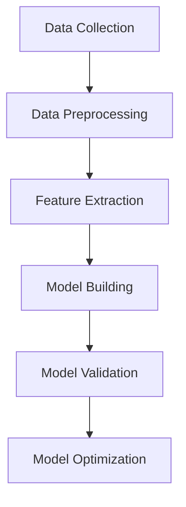

                 


### 引言

#### 问题背景

从自然观察到数学抽象，这是一个跨越科学与技术的桥梁。自然观察是人类认识世界、理解自然规律的重要途径，而数学抽象则是将复杂现象简化为可计算、可分析的模型，是科学研究的基石。随着信息技术的飞速发展，数据爆炸式增长，如何从海量数据中提取有价值的信息，成为了当前研究的焦点。映射过程正是在这种背景下被提出来，它不仅连接了观察与数学抽象，也是实现数据分析、人工智能、系统建模等应用的关键步骤。

#### 核心问题

在映射过程中，我们面临的核心问题是如何从自然观察中提取有意义的信息，并将其转化为数学模型。这个过程不仅涉及数据的收集和处理，还包括对数学抽象的理解和运用。具体来说，需要解决以下几个关键问题：

1. **自然观察与数据的关系**：如何通过观察获取准确的数据，并理解这些数据背后的物理或生物机制。
2. **数学抽象的构建**：如何将观察到的现象转化为数学语言，构建有效的数学模型。
3. **映射过程的优化**：如何提高映射的准确性和效率，优化模型的结构和参数。

#### 解决方案

为了解决上述问题，我们提出以下研究方案：

1. **数据收集与处理**：介绍不同类型的数据收集方法，以及数据预处理和可视化的技术。
2. **数学抽象与模型构建**：讨论数学抽象的概念，分析不同类型的数学模型，以及模型验证和优化的策略。
3. **映射过程的理论基础**：深入探讨映射过程的原理，构建映射函数，分析映射函数的属性和极限理论。
4. **映射过程的应用**：展示映射过程在自然科学、社会科学以及跨学科综合应用中的实例，分析其实际效果和挑战。
5. **跨学科综合应用**：探讨如何将映射过程应用于跨学科的研究，解决复杂的实际问题。

#### 研究现状与未来趋势

目前，映射过程的研究已经取得了显著成果，特别是在数据科学和人工智能领域。然而，仍有许多挑战需要克服，如数据噪声处理、复杂系统的建模以及跨学科的融合。未来，随着技术的不断进步，映射过程的研究将更加深入，有望在更多领域得到应用，推动科学和技术的进一步发展。

#### 边界与外延

本文研究的映射过程主要关注从自然观察到数学抽象的转化，涉及的数据类型包括但不限于时间序列、空间分布和社会网络。数学模型主要包括统计学模型、微分方程模型和机器学习模型。本文未涉及的其他映射过程，如从数学抽象到物理实验的映射，将在未来的研究中进行探讨。

#### 本书结构

本书分为三个部分，首先介绍映射过程的背景、核心概念和原理；然后展示映射过程在自然科学和社会科学中的应用；最后探讨跨学科综合应用的可能性。每章都包含详细的案例分析，帮助读者深入理解映射过程的实际应用。

#### 本章小结

本章介绍了映射过程的背景和核心问题，提出了研究方案，并概述了本书的结构。通过本章的学习，读者将初步了解映射过程的重要性，并对接下来的内容有所期待。

### 第一部分：核心概念与原理

### 第1章 自然观察与数据收集

#### 1.1 观察的本质

自然观察是人类获取知识的重要方式，它指的是通过感官或仪器对自然现象的感知和记录。观察的本质在于对现象的捕捉和解释，它不仅涉及物理层面的感知，还包括对现象背后的机制和规律的探究。观察的目的是为了揭示自然界的规律，从而为科学研究和应用提供基础数据。

#### 1.2 观察方法与技术

自然观察的方法和技术多种多样，包括直接观察、仪器测量、遥感技术等。直接观察是指使用肉眼或辅助工具（如放大镜、望远镜）进行观察。仪器测量则是利用各种测量设备（如温度计、压力计、光谱仪）对物理量进行定量测量。遥感技术则利用卫星、飞机等高空设备对地面或水下进行远距离观测。

#### 1.3 观察结果的可靠性

观察结果的可靠性取决于多种因素，包括观察者的经验、仪器的精确度和数据的处理方法。为了提高观察结果的可靠性，研究者需要采用标准化的观察方法，使用高精度的仪器，并采用适当的数据处理和分析技术。此外，重复观测和多个观察者的交叉验证也是确保观察结果准确性的重要手段。

#### 1.4 数据收集与处理

数据收集是映射过程的第一步，其质量直接影响后续的模型构建和结果解释。数据收集的方法包括实地测量、实验采集、网络爬取等。在数据收集过程中，需要特别注意数据的完整性和一致性。

数据预处理是数据收集后的第一步，其目的是消除噪声、填补缺失值、归一化数据等。常用的预处理技术包括数据清洗、数据归一化、特征提取等。

数据可视化是数据处理的重要环节，它能够帮助研究者直观地理解数据分布、趋势和关系。常用的数据可视化工具包括Matplotlib、Seaborn、Plotly等。

#### 1.5 观察与数据的关系

观察和数据之间的关系是映射过程的核心。观察过程产生的数据是构建数学模型的基础，而数学模型则是理解和解释自然现象的重要工具。通过将观察数据映射到数学模型中，研究者可以揭示自然现象的内在规律，从而推动科学发现和技术进步。

#### 1.6 观察数据的特征提取

特征提取是数据预处理后的关键步骤，其目的是从原始数据中提取出最有用的信息。特征提取的方法包括统计学方法（如主成分分析、聚类分析）、机器学习方法（如特征选择、深度学习）等。通过特征提取，研究者可以减少数据维度，提高模型精度，从而更有效地进行数据分析。

#### 1.7 观察数据的模型构建

构建数学模型是映射过程的下一步，其目的是将观察数据转化为可计算、可分析的模型。模型构建的方法包括统计学模型（如线性回归、时间序列分析）、物理学模型（如微分方程、波动方程）和机器学习模型（如决策树、神经网络）等。通过模型构建，研究者可以预测未来趋势、解释现象发生的原因，并指导实际应用。

#### 本章小结

本章介绍了自然观察与数据收集的基本概念、方法和技术，探讨了观察与数据的关系，以及数据特征提取和模型构建的过程。通过本章的学习，读者将了解如何从自然观察中获取有价值的数据，并掌握构建数学模型的基本原理和技术。

### 第2章 数学抽象与模型构建

#### 2.1 数学抽象的概念

数学抽象是将复杂现象简化为数学模型的过程，它是一种将实际问题转化为可计算、可分析的数学问题的方法。数学抽象的目的是通过简化和抽象，揭示现象的本质和内在规律。数学抽象不仅依赖于数学理论，还需要对实际问题有深入的理解。

#### 2.2 数学模型构建方法

数学模型的构建方法取决于具体问题的性质和研究目标。常见的数学模型构建方法包括以下几种：

1. **统计学模型**：统计学模型通过统计分析数据，提取出数据中的统计规律，用于描述和预测现象。常见的统计学模型包括线性回归、时间序列分析、聚类分析等。

2. **物理学模型**：物理学模型通过物理定律和方程，描述现象的物理过程。常见的物理学模型包括微分方程、波动方程、守恒方程等。

3. **机器学习模型**：机器学习模型通过学习和拟合数据，建立输入与输出之间的映射关系。常见的机器学习模型包括线性回归、决策树、神经网络等。

4. **混合模型**：混合模型将不同类型的模型结合起来，以弥补单一模型的局限性。例如，将统计学模型与机器学习模型结合，可以同时利用统计学方法和机器学习方法的优点。

#### 2.3 模型验证与优化

模型验证是确保模型有效性和准确性的关键步骤。模型验证的方法包括：

1. **交叉验证**：交叉验证通过将数据集划分为训练集和验证集，对模型进行多次训练和验证，以评估模型的泛化能力。

2. **假设检验**：假设检验通过建立零假设和备择假设，使用统计方法对模型进行验证，以判断模型是否显著优于随机模型。

模型优化是通过调整模型参数和结构，提高模型的预测准确性和泛化能力。常见的模型优化策略包括：

1. **参数调整**：通过调整模型的参数，寻找最佳参数组合，以提高模型的性能。

2. **特征选择**：通过选择最有用的特征，减少模型的复杂度和计算成本。

3. **模型集成**：通过将多个模型结合起来，提高模型的预测能力。

#### 2.4 数学模型的应用案例

数学模型在各个领域都有广泛的应用，以下是一些典型的应用案例：

1. **经济学**：经济学中的供需模型、经济增长模型、金融模型等，都是数学模型的典型应用。

2. **生物学**：生物学中的种群模型、生态系统模型、遗传模型等，用于描述和预测生物现象。

3. **环境科学**：环境科学中的污染模型、气候变化模型、生态系统模型等，用于研究环境问题。

4. **物理学**：物理学中的粒子物理模型、量子力学模型、流体力学模型等，用于描述和解释物理现象。

5. **工程学**：工程学中的结构力学模型、电路模型、控制模型等，用于设计、分析和优化工程系统。

#### 2.5 数学模型的优缺点

数学模型具有以下优点：

1. **精确性**：数学模型能够精确描述现象，提供定量的预测和解释。

2. **普适性**：数学模型可以在不同场景下使用，具有广泛的适用性。

3. **可计算性**：数学模型可以使用计算机进行高效计算，处理大量数据。

数学模型也存在一些缺点：

1. **简化性**：数学模型通常需要对现实世界进行简化，可能导致结果的局限性。

2. **参数依赖**：数学模型的性能很大程度上依赖于参数的选择，参数的不确定性可能导致模型的不稳定。

3. **适用性限制**：数学模型可能不适用于所有情况，特别是在复杂和非线性系统中。

#### 本章小结

本章介绍了数学抽象的概念、数学模型构建方法、模型验证与优化策略，以及数学模型在各领域的应用案例。通过本章的学习，读者将了解如何使用数学模型来描述和解释自然现象，并掌握数学模型构建和优化的基本方法。

### 第3章 映射过程的理论基础

#### 3.1 映射过程的定义

映射过程是指将一个集合（称为定义域）中的元素通过某种规则映射到另一个集合（称为值域）中的元素的过程。在数学中，映射通常用函数表示。一个函数 \( f \) 从集合 \( A \) 到集合 \( B \) 可以定义为：对于集合 \( A \) 中的每个元素 \( x \)，都存在唯一的集合 \( B \) 中的元素 \( y \)，使得 \( f(x) = y \)。映射过程可以用集合表示法或函数表达式表示。

#### 3.2 映射过程的基本要素

映射过程的基本要素包括：

1. **定义域（Domain）**：映射过程中元素的初始集合，通常用字母 \( A \) 表示。

2. **值域（Codomain）**：映射过程中元素映射到的集合，通常用字母 \( B \) 表示。

3. **映射规则（Mapping Rule）**：定义域中的每个元素通过映射规则映射到值域中的元素。映射规则可以用公式或算法表示。

4. **像（Image）**：定义域中的元素经过映射规则后得到的值域中的元素。

5. **原像（Pre-image）**：值域中的元素经过映射规则后得到的定义域中的元素。

#### 3.3 映射过程的类型

映射过程可以根据不同的标准进行分类，以下是几种常见的映射类型：

1. **单射（Injective）**：如果对于定义域中的不同元素 \( x_1 \) 和 \( x_2 \)，当 \( x_1 \neq x_2 \) 时，总有 \( f(x_1) \neq f(x_2) \)，则称映射 \( f \) 为单射。单射确保了定义域中的不同元素映射到值域中的不同元素。

2. **满射（Surjective）**：如果对于值域中的每个元素 \( y \)，都存在至少一个定义域中的元素 \( x \)，使得 \( f(x) = y \)，则称映射 \( f \) 为满射。满射确保了值域中的每个元素都有至少一个原像。

3. **双射（Bijective）**：如果映射 \( f \) 既是单射又是满射，则称 \( f \) 为双射。双射确保了定义域和值域之间的一一对应关系。

4. **同构（Isomorphism）**：如果两个集合之间的映射保持了集合的结构和性质，则称这两个集合是同构的。同构映射是一种保持集合之间相似性的重要映射类型。

#### 3.4 映射函数的属性分析

映射函数的属性分析是理解映射过程的重要环节。以下是几种常见的映射函数属性：

1. **连续性（Continuity）**：映射函数在定义域内的每个点附近都是连续的，即函数值在该点附近的变化是平滑的。

2. **可微性（Differentiability）**：映射函数在定义域内的每个点都存在导数，即函数在该点的局部行为是线性的。

3. **单调性（Monotonicity）**：映射函数在整个定义域上都是单调的，即函数值随着定义域中的元素增大而增大或减小。

4. **周期性（Periodicity）**：映射函数具有周期性，即存在一个正数 \( T \)，使得对于定义域中的每个元素 \( x \)，都有 \( f(x + T) = f(x) \)。

5. **奇偶性（Oddness/Evenness）**：映射函数是奇函数（满足 \( f(-x) = -f(x) \)）或偶函数（满足 \( f(-x) = f(x) \)）。

#### 3.5 映射过程的极限理论

映射过程的极限理论是分析映射函数行为的重要工具。以下是几种常见的极限概念：

1. **左极限（Left Limit）**：当自变量趋近于某个值时，函数值从左侧趋近的极限。

2. **右极限（Right Limit）**：当自变量趋近于某个值时，函数值从右侧趋近的极限。

3. **二重极限（Double Limit）**：当自变量趋近于某个值时，函数值从两侧趋近的极限。

4. **无穷极限（Infinite Limit）**：当自变量趋近于无穷大或无穷小时，函数值的极限。

5. **振荡极限（Oscillating Limit）**：当自变量趋近于某个值时，函数值在某个区间内振荡，没有确定的极限。

#### 3.6 映射函数的图示

映射函数的图示是理解映射过程直观而有效的方式。通过图示，可以清晰地看到定义域和值域之间的关系，以及映射函数的属性和特征。常用的图示方法包括：

1. **笛卡尔坐标系**：使用笛卡尔坐标系绘制映射函数的图像，横轴表示定义域，纵轴表示值域。

2. **平行坐标系**：使用平行坐标系绘制映射函数的图像，每个坐标轴代表一个维度。

3. **三维坐标系**：使用三维坐标系绘制三维映射函数的图像，显示定义域和值域的三维空间关系。

4. **极坐标系**：使用极坐标系绘制极坐标映射函数的图像，适用于处理旋转和缩放问题。

#### 本章小结

本章详细介绍了映射过程的定义、基本要素、类型、映射函数的属性分析以及极限理论。通过本章的学习，读者将深入理解映射过程的理论基础，为后续章节的进一步探讨打下坚实基础。

### 第4章 映射过程的理论基础

#### 4.1 映射过程的原理

映射过程的原理是指如何将自然现象或数据通过某种规则映射到数学模型中，以便进行进一步分析和理解。映射过程的核心在于找到一种适当的数学语言来描述和解释现实世界的现象。具体来说，映射过程可以分为以下几个步骤：

1. **数据收集**：通过观察、实验或数据采集工具收集与现象相关的数据。
2. **数据预处理**：清洗数据，消除噪声，标准化数据，以便进行进一步分析。
3. **特征提取**：从预处理后的数据中提取有用的特征，用于构建数学模型。
4. **模型构建**：选择适当的数学模型，将特征映射到数学表达式中。
5. **模型验证**：通过测试数据验证模型的准确性和泛化能力。
6. **模型优化**：调整模型参数，优化模型结构，提高模型的性能。

#### 4.2 映射函数

映射函数是映射过程的核心组成部分，它定义了如何将定义域中的元素映射到值域中的元素。映射函数可以用符号表示为 \( f: A \rightarrow B \)，其中 \( A \) 是定义域，\( B \) 是值域。映射函数具有以下属性：

- **单射（Injective）**：如果对于任意 \( x_1, x_2 \in A \)，当 \( x_1 \neq x_2 \) 时，总有 \( f(x_1) \neq f(x_2) \)，则称映射 \( f \) 是单射。
- **满射（Surjective）**：如果对于任意 \( y \in B \)，都存在 \( x \in A \)，使得 \( f(x) = y \)，则称映射 \( f \) 是满射。
- **双射（Bijective）**：如果映射 \( f \) 同时是单射和满射，则称 \( f \) 是双射。

#### 4.3 映射函数的属性对比

为了更好地理解映射函数，我们可以通过表格对比不同映射函数的属性：

| 映射类型 | 单射 | 满射 | 双射 |
|----------|------|------|------|
| 单射     | 是   | 否   | 否   |
| 满射     | 否   | 是   | 是   |
| 双射     | 是   | 是   | 是   |

#### 4.4 ER实体关系图

实体关系图（Entity-Relationship Diagram，ER图）是用于描述实体之间关系的图形表示方法。在映射过程中，ER图可以帮助我们理解实体之间的关系，从而构建有效的数学模型。以下是ER图的示例：

```mermaid
erDiagram
  Person ||--|{ Phone }|
  Person ||--|{ Address }|
  Phone   ||--|{ CallLog }|
  Address ||--|{ ZipCode }|
```

在这个示例中，我们定义了四个实体：Person（人）、Phone（电话）、Address（地址）和ZipCode（邮编）。Person实体与Phone实体和Address实体之间存在一对多的关系，Phone实体与CallLog实体之间存在一对多的关系，Address实体与ZipCode实体之间存在一对多的关系。

#### 4.5 映射函数的Mermaid流程图

为了更直观地展示映射函数的流程，我们可以使用Mermaid流程图。以下是映射函数的基本流程：



在这个流程图中，我们从数据收集开始，经过数据预处理、特征提取、模型构建、模型验证和模型优化，最终得到一个优化的映射函数。

#### 4.6 映射函数的Python源代码

为了更深入地理解映射函数的原理，我们可以使用Python编写一个简单的映射函数。以下是一个示例代码，展示了如何从输入数据中提取特征，并构建一个简单的线性映射函数：

```python
import numpy as np

# 输入数据
X = np.array([[1, 2], [3, 4], [5, 6]])

# 特征提取
def feature_extraction(x):
    return np.array([x[0], x[1]])

# 映射函数
def mapping_function(x):
    features = feature_extraction(x)
    y = np.dot(features, np.array([1, 1]))
    return y

# 计算映射结果
Y = [mapping_function(x) for x in X]

print(Y)
```

在这个示例中，我们首先定义了输入数据 \( X \)，然后定义了特征提取函数 `feature_extraction` 和映射函数 `mapping_function`。映射函数通过计算输入数据的特征乘以权重向量，得到映射结果 \( Y \)。

#### 本章小结

本章介绍了映射过程的原理、映射函数的定义和属性、ER实体关系图以及映射函数的Mermaid流程图和Python源代码。通过本章的学习，读者将能够理解映射过程的基本概念和实现方法，为后续章节的深入探讨打下基础。接下来，我们将继续探讨映射过程在自然科学、社会科学以及跨学科综合应用中的具体实例。

