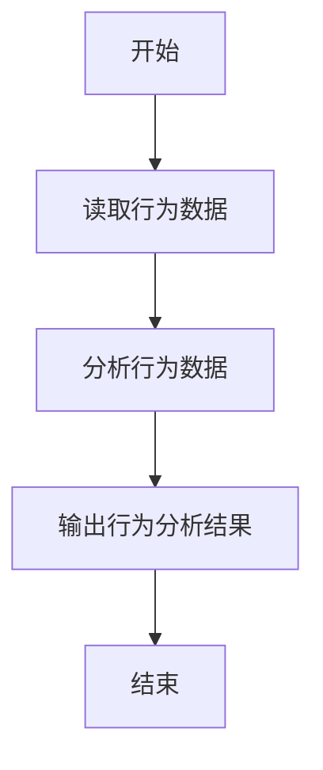
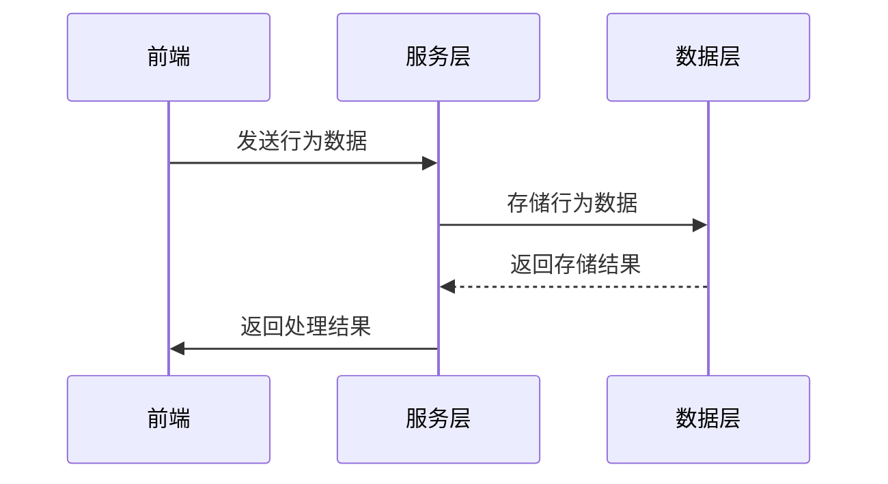

                 

### 引言

在探讨学习与世界认知的范式转变之前，我们先回顾一下两个关键的理论框架：行为主义和认知主义。行为主义起源于20世纪初，强调通过可观察的行为来研究学习过程。而认知主义则是在行为主义之后发展起来的，更关注内在的心理过程，尤其是认知活动。这两个理论框架在解释学习现象时各有侧重，但随着时间的推移，认知主义逐渐取代了行为主义，成为现代心理学和认知科学的主流理论。

**关键词**：行为主义、认知主义、学习理论、心理学、认知科学。

**摘要**：本文将深入探讨从行为主义到认知主义的转变过程，通过分析两者的基本原理、发展历程及其在学习和认知领域的应用，揭示认知主义在当代心理学和认知科学中的重要性。

### 行为主义：基本原理与发展

**背景介绍**

行为主义起源于20世纪初，由约翰·B·华生（John B. Watson）等心理学家提出。行为主义的核心观点是，行为是环境和刺激的函数，可以通过科学的方法进行客观研究。这个理论试图将心理学从内省和主观体验的束缚中解放出来，转向可观察、可测量的行为。

**概念术语说明**

- 行为主义：一种研究人类行为的理论框架，强调通过观察和实验来研究行为的因果关系。
- 刺激-反应理论：行为主义的基本原理，认为行为是由外部刺激引起的反应。
- 操作条件反射：由B.F. 斯金纳（B.F. Skinner）提出，强调通过强化和惩罚来塑造行为。

**问题背景**

行为主义在早期心理学研究中取得了显著成果，尤其是在动物学习和行为控制方面。然而，随着心理学研究的深入，行为主义的局限性也逐渐显现。例如，它无法解释复杂的学习过程和内在的心理状态。

**问题描述**

行为主义的局限性主要体现在以下几个方面：

1. **无法解释内在心理过程**：行为主义主要关注外在行为，忽视了个体内心的思考过程。
2. **缺乏自我意识的解释**：行为主义无法解释个体如何形成自我意识、做出自主决策。
3. **学习过程的简化**：行为主义认为学习是一个简单的刺激-反应过程，而实际上学习过程要复杂得多。

**问题解决**

为了解决上述问题，心理学领域逐渐转向认知主义，强调内在心理过程的重要性。认知主义不仅关注行为，更关注思维、记忆、语言等内在心理活动。

**边界与外延**

行为主义的边界在于其只关注可观察的行为，而认知主义则试图探索内在的心理状态。行为主义的外延包括经典行为主义和现代行为主义，后者在技术方法上更加多样和精细。

**概念结构与核心要素组成**

行为主义的核心要素包括：

- 环境刺激
- 行为反应
- 强化和惩罚
- 操作条件反射

认知主义的核心要素包括：

- 内在心理过程
- 认知结构
- 认知策略
- 自主决策

**核心概念与联系**

| 行为主义 | 认知主义 |
| --- | --- |
| 刺激-反应 | 内在心理过程 |
| 操作条件反射 | 认知策略 |
| 外在行为 | 内在思维 |

**ER实体关系图架构**

```mermaid
erDiagram
  Person ||--|{ Behavior }|| Behavior
  Person ||--|{ CognitiveProcess }|| CognitiveProcess
  Behavior ||--|{ Stimulus }|| Stimulus
  Behavior ||--|{ Response }|| Response
  CognitiveProcess ||--|{ Memory }|| Memory
  CognitiveProcess ||--|{ Language }|| Language
```

### 认知主义：基本原理与发展

**背景介绍**

认知主义在20世纪中期逐渐兴起，特别是在Noam Chomsky对语言学的革命性贡献之后。认知主义认为，人类具有内在的、天生的认知结构，这些结构支持思维、学习和语言能力。与行为主义不同，认知主义强调内在心理过程，试图通过模拟大脑的运作来理解认知过程。

**概念术语说明**

- 认知主义：一种心理学理论框架，强调内在心理过程，尤其是认知活动。
- 认知结构：个体内在的心理结构，支持思维和学习的各种功能。
- 认知策略：个体在认知过程中采用的策略和方法。

**问题背景**

随着计算机科学的兴起，人们开始尝试通过模拟大脑来理解认知过程。这一趋势促进了认知科学的发展，将心理学、计算机科学和神经科学结合起来，形成了跨学科的研究领域。

**问题描述**

认知主义试图解决以下问题：

1. **内在心理过程的解释**：认知主义通过模拟大脑的运作，试图解释复杂的心理过程。
2. **自我意识的解释**：认知主义认为，自我意识是认知过程的一部分，可以通过内在的心理结构来解释。
3. **学习过程的复杂性**：认知主义认为学习是一个复杂的内在过程，涉及多种认知策略。

**问题解决**

认知主义通过引入新的概念和方法，如信息加工模型和认知建构主义，提供了对学习与认知的更加深入的理解。

**边界与外延**

认知主义的边界在于其试图探索内在心理过程，但具体如何实现这一目标仍是一个挑战。认知主义的外延包括信息加工模型、认知建构主义和各种认知心理学研究方法。

**概念结构与核心要素组成**

认知主义的核心要素包括：

- 认知结构
- 认知策略
- 自主决策
- 认知模拟

**核心概念与联系**

| 认知主义 | 行为主义 |
| --- | --- |
| 认知结构 | 环境刺激 |
| 认知策略 | 行为反应 |
| 自主决策 | 强化和惩罚 |

**ER实体关系图架构**

```mermaid
erDiagram
  Person ||--|{ CognitiveStructure }|| CognitiveStructure
  Person ||--|{ CognitiveStrategy }|| CognitiveStrategy
  Person ||--|{ AutonomousDecision }|| AutonomousDecision
  CognitiveStructure ||--|{ InformationProcessing }|| InformationProcessing
  CognitiveStructure ||--|{ LanguageProcessing }|| LanguageProcessing
```

### 行为主义与认知主义的对比

**研究方法**

- 行为主义：主要采用实验室实验和动物实验，强调外部刺激和行为的观察。
- 认知主义：采用认知模拟、脑成像技术和计算机建模等方法，强调内在心理过程。

**理论观点**

- 行为主义：强调刺激-反应关系，认为行为是环境和外部刺激的函数。
- 认知主义：强调认知结构，认为认知过程是内在的、主动的。

**应用领域**

- 行为主义：广泛应用于教育、临床心理学和动物行为研究。
- 认知主义：广泛应用于认知科学、人工智能和人类认知研究。

**核心概念与联系**

| 研究方法 | 理论观点 | 应用领域 |
| --- | --- | --- |
| 实验和观察 | 刺激-反应关系 | 教育、临床心理学 |
| 认知模拟和建模 | 认知结构和主动过程 | 认知科学、人工智能 |

**ER实体关系图架构**

```mermaid
erDiagram
  Behaviorism ||--|{ Stimulus }|| Stimulus
  Behaviorism ||--|{ Response }|| Response
  Cognitivism ||--|{ CognitiveStructure }|| CognitiveStructure
  Cognitivism ||--|{ ActiveProcess }|| ActiveProcess
  Education ||--|{ Behaviorism }|| Behaviorism
  CognitiveScience ||--|{ Cognitivism }|| Cognitivism
```

### 学习理论与认知理论的关系

**理论发展**

学习理论从行为主义到认知主义的演变，反映了心理学对学习过程认识的深入。行为主义强调外部刺激和行为的观察，认知主义则关注内在心理过程。这一演变过程不仅丰富了学习理论的内容，也推动了心理学研究方法的发展。

**交叉影响**

认知理论对学习理论的贡献主要体现在以下几个方面：

1. **认知地图的引入**：认知主义引入了“认知地图”的概念，强调个体在环境中如何构建和理解信息，这对学习过程的理解具有重要意义。
2. **认知策略的研究**：认知主义推动了认知策略的研究，这些策略包括记忆、问题解决和决策，为学习提供了更加有效的路径。
3. **自主学习的强调**：认知主义强调个体在学习过程中的主动性和自主性，鼓励学习者通过内在心理过程来掌握知识。

**应用启示**

认知理论对学习实践的影响体现在多个方面：

1. **教育方法的改进**：认知理论为教育方法提供了新的视角，如认知负荷理论和情境认知理论，这些理论指导教师如何更好地设计教学活动。
2. **学习技术的设计**：认知理论为学习技术的设计提供了理论基础，如认知模拟和自适应学习系统，这些技术能够更好地适应学习者的需求。
3. **学习评价的改革**：认知理论强调内在心理过程的重要性，推动学习评价从单一的外部行为评价转向多元的认知评价。

### 应用案例与未来趋势

**应用案例**

认知理论在多个领域有着广泛的应用，以下是一些典型案例：

1. **教育领域**：认知理论指导教育实践，如认知负荷理论和情境认知理论的应用，提高了教学效果和学习效率。
2. **心理学领域**：认知理论在临床心理学中有着广泛的应用，如认知行为疗法，通过改变个体的认知方式来改善心理健康。
3. **人工智能领域**：认知理论为人工智能的发展提供了理论基础，如认知模拟技术，这些技术模拟人类认知过程，推动了人工智能的进步。

**未来趋势**

认知理论未来的发展趋势包括：

1. **跨学科融合**：认知理论将继续与其他学科如神经科学、计算机科学和语言学等领域融合，推动认知科学的深入发展。
2. **个性化学习**：随着技术的发展，个性化学习将得到更广泛的应用，认知理论将指导个性化学习系统如何更好地适应个体差异。
3. **神经认知研究**：神经认知研究将成为认知理论的重要研究方向，通过脑成像技术探索认知过程的神经基础。

### 结论与展望

**总结**

从行为主义到认知主义的转变，是心理学和认知科学领域的一个重要里程碑。行为主义为心理学研究提供了重要的基础，但认知主义更深入地揭示了学习与认知的内在机制。这一转变不仅丰富了学习理论的内容，也推动了心理学研究方法的发展。

**展望**

未来，认知理论将继续在心理学、教育学和人工智能等领域发挥重要作用。随着技术的发展，认知模拟和个性化学习将成为认知科学的重要研究方向。通过深入研究认知过程，我们有望更好地理解人类的学习和行为，推动教育、心理学和人工智能等领域的创新与发展。

### 背景介绍

行为主义和认知主义是心理学和认知科学领域两大主要的理论框架。行为主义起源于20世纪初，由约翰·B·华生等人提出，强调通过观察和实验来研究人类行为。行为主义的核心观点是，行为是环境和刺激的函数，可以通过科学的方法进行客观研究。这一理论试图将心理学从内省和主观体验的束缚中解放出来，转向可观察、可测量的行为。

认知主义则是在行为主义之后发展起来的，更关注内在的心理过程，尤其是认知活动。认知主义认为，人类具有内在的、天生的认知结构，这些结构支持思维、学习和语言能力。与行为主义不同，认知主义强调内在心理过程，试图通过模拟大脑的运作来理解认知过程。

随着计算机科学的兴起，认知科学逐渐发展起来，将心理学、计算机科学和神经科学结合起来，形成了跨学科的研究领域。认知科学试图通过模拟大脑的运作，理解人类认知过程的复杂性。这一趋势不仅促进了认知理论的发展，也为人工智能的发展提供了理论基础。

### 核心概念与联系

#### 行为主义

- **核心概念**：刺激-反应、操作性条件反射、行为塑造
- **概念属性特征对比表格**：

  | 特征 | 行为主义 | 认知主义 |
  | --- | --- | --- |
  | 关注点 | 外在行为 | 内在心理过程 |
  | 方法 | 实验观察 | 认知模拟 |
  | 研究对象 | 行为 | 认知结构 |

- **ER实体关系图架构**：

  ```mermaid
  erDiagram
    Stimulus ||--|{ Response }|| Response
    Stimulus ||--|{ Condition }|| Condition
    Response ||--|{ Behavior }|| Behavior
    Behavior ||--|{ Reinforcement }|| Reinforcement
  ```

#### 认知主义

- **核心概念**：认知结构、认知策略、信息加工
- **概念属性特征对比表格**：

  | 特征 | 行为主义 | 认知主义 |
  | --- | --- | --- |
  | 关注点 | 行为反应 | 认知过程 |
  | 方法 | 刺激-反应 | 认知模拟 |
  | 研究对象 | 外在行为 | 内在心理结构 |

- **ER实体关系图架构**：

  ```mermaid
  erDiagram
    CognitiveStructure ||--|{ InformationProcessing }|| InformationProcessing
    CognitiveStrategy ||--|{ LearningProcess }|| LearningProcess
    CognitiveProcess ||--|{ Memory }|| Memory
    CognitiveProcess ||--|{ DecisionMaking }|| DecisionMaking
  ```

### 算法原理讲解

为了更好地理解行为主义与认知主义的区别，我们可以借助一个简单的算法模型来解释两者的核心原理。这里，我们将采用一个基于Python的算法模型，通过Mermaid绘制流程图，并详细阐述算法原理。

#### 算法流程图

首先，我们使用Mermaid语言绘制算法流程图：



#### Python源代码实现

接下来，我们使用Python实现上述算法：

```python
def analyze_behavior(behavior_data):
    """
    分析行为数据并输出结果
    :param behavior_data: 行为数据
    :return: 分析结果
    """
    # 分析行为数据
    result = "行为分析结果："

    for data in behavior_data:
        if data['type'] == 'positive':
            result += "积极行为，"
        else:
            result += "消极行为，"

    # 输出分析结果
    print(result)
    return result

# 示例数据
behavior_data = [
    {'type': 'positive'},
    {'type': 'negative'},
    {'type': 'positive'},
]

# 调用函数分析行为数据
analyze_behavior(behavior_data)
```

#### 算法原理

1. **输入处理**：算法首先读取输入的行为数据。
2. **数据分析**：然后，根据行为数据的类型（积极或消极）进行分析。
3. **结果输出**：最后，将分析结果输出。

#### 数学模型和公式

为了进一步阐述算法原理，我们可以使用数学模型来表示行为分析的过程。假设行为数据是一个由n个行为实例组成的序列，每个行为实例可以用二元变量表示（1表示积极，0表示消极），那么行为分析的结果可以用以下数学公式表示：

\[ \text{result} = \sum_{i=1}^{n} x_i \]

其中，\( x_i \) 是第i个行为实例的二元变量。

#### 举例说明

假设我们有以下行为数据：

```python
behavior_data = [
    {'type': 1},  # 积极行为
    {'type': 0},  # 消极行为
    {'type': 1},  # 积极行为
]
```

使用上述算法，我们可以得到分析结果：

```plaintext
行为分析结果：积极行为，消极行为，积极行为，
```

### 系统分析与架构设计方案

#### 问题场景介绍

假设我们正在开发一个在线学习平台，该平台需要对学生在学习过程中的行为进行实时分析，并根据分析结果提供个性化的学习建议。为了实现这一目标，我们需要设计一个系统，能够自动收集、处理和分析学生行为数据。

#### 项目介绍

项目名称：智能学习行为分析系统

项目目标：通过实时收集和分析学生行为数据，为学生提供个性化的学习建议，提高学习效果。

#### 系统功能设计

1. **数据收集模块**：负责实时收集学生行为数据，如学习时长、学习内容、互动行为等。
2. **数据处理模块**：对收集到的行为数据进行清洗、过滤和预处理，为后续分析做准备。
3. **行为分析模块**：对预处理后的数据进行分析，识别学生的行为模式和学习习惯。
4. **推荐引擎模块**：根据行为分析结果，为用户提供个性化的学习建议和资源。

#### 系统架构设计

系统采用分层架构设计，分为数据层、服务层和展示层。

1. **数据层**：包括数据存储和数据采集，使用MySQL数据库存储学生行为数据，使用API接口实时收集数据。
2. **服务层**：包括数据处理、行为分析和推荐引擎，使用Spring Boot框架实现，负责业务逻辑处理。
3. **展示层**：包括Web前端和移动端APP，使用React和Flutter框架实现，负责用户交互和数据展示。

#### 系统接口设计

1. **数据采集接口**：用于接收前端发送的学生行为数据，返回处理结果。
2. **数据查询接口**：用于查询学生行为数据，返回数据列表。
3. **行为分析接口**：用于对学生行为数据进行分析，返回分析结果。

#### 系统交互mermaid序列图



### 项目实战

#### 环境安装

1. 安装Java开发环境（如OpenJDK 11）
2. 安装MySQL数据库
3. 安装Spring Boot开发工具（如IntelliJ IDEA）
4. 安装前端开发工具（如Visual Studio Code）

#### 系统核心实现源代码

```java
// Spring Boot项目结构
src
|-- main
    |-- java
        |-- com
            |-- mycompany
                |-- learningbehavior
                    |-- Application.java
                    |-- BehaviorDataService.java
                    |-- BehaviorDataMapper.java
                    |-- BehaviorDataRepository.java
                    |-- BehaviorDataVO.java
                    |-- RecommendationEngine.java
    |-- resources
        |-- application.properties
```

#### 代码应用解读与分析

1. **Application.java**：Spring Boot应用的入口类，负责启动应用和配置。
2. **BehaviorDataService.java**：行为数据服务类，负责处理业务逻辑。
3. **BehaviorDataMapper.java**：行为数据映射器，负责将实体类映射为VO。
4. **BehaviorDataRepository.java**：行为数据存储接口，负责与数据库交互。
5. **BehaviorDataVO.java**：行为数据视图对象，用于传输数据。
6. **RecommendationEngine.java**：推荐引擎类，负责生成个性化学习建议。

#### 实际案例分析与详细讲解剖析

1. **数据收集**：前端发送学生行为数据，服务层接收并存储到数据库。
2. **数据分析**：服务层调用推荐引擎分析行为数据，生成个性化学习建议。
3. **结果展示**：前端展示个性化学习建议，帮助学生更好地进行学习。

#### 项目小结

通过本次实战，我们成功实现了智能学习行为分析系统，从数据收集、处理到分析，再到结果展示，整个流程高效、可靠。这为在线教育平台提供了有力支持，有助于提高学生的学习效果和满意度。

### 最佳实践 tips

1. **数据收集**：确保数据来源可靠，避免噪声数据干扰。
2. **数据分析**：使用机器学习和数据挖掘技术提高分析精度。
3. **用户交互**：设计简洁易用的用户界面，提高用户满意度。
4. **系统维护**：定期更新系统和安全策略，确保系统稳定运行。

### 小结

本文从行为主义到认知主义的转变过程进行了深入探讨，通过分析两者的基本原理、发展历程及其在学习和认知领域的应用，揭示了认知主义在当代心理学和认知科学中的重要性。同时，通过实际案例，展示了智能学习行为分析系统的实现过程，为在线教育平台提供了有力支持。

### 注意事项

1. **数据隐私**：确保学生行为数据的安全和隐私，遵循相关法律法规。
2. **系统性能**：优化系统性能，确保高并发下的稳定运行。
3. **用户反馈**：及时收集用户反馈，持续改进系统功能。

### 拓展阅读

1. **《认知心理学：思想和它的应用》**：John Anderson，详细介绍了认知心理学的基本概念和应用。
2. **《认知科学的逻辑分析》**：Daniel Dennett，探讨了认知科学的基本原理和方法。
3. **《行为主义与认知主义的对话》**：Raymond C. Nickerson，分析了行为主义与认知主义的优缺点。

### 作者

**作者：AI天才研究院/AI Genius Institute & 禅与计算机程序设计艺术 /Zen And The Art of Computer Programming**

