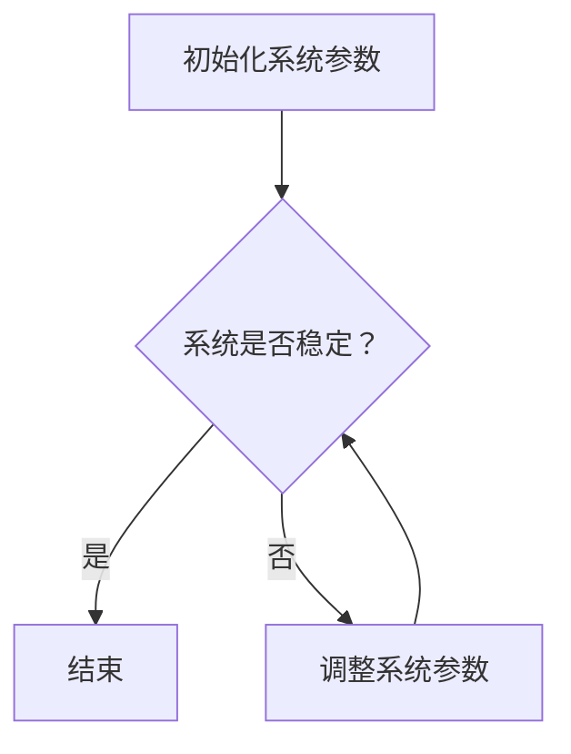

                 

### 第1章：引言

> 关键词：还原主义、系统思维、宇宙观、整体转向

在科技迅猛发展的今天，我们逐渐认识到，传统的还原主义方法在面对复杂系统时显得力不从心。随着系统复杂性的增加，越来越多的科学研究和工程实践开始转向系统思维，以期获得更为全面和深刻的认识。这本书的目的是探讨这种从还原主义到系统思维的整体转向，并揭示其在科学研究、工程实践以及宇宙观上的重要意义。

#### 1.1 问题背景

##### 1.1.1 还原主义的局限

还原主义是科学研究中的一种经典方法，它主张通过分解复杂的系统，研究其基本组成部分，并理解其行为规律。这种方法在物理学、化学等领域取得了显著的成果。然而，随着系统复杂性的增加，还原主义逐渐暴露出其局限性。首先，它往往忽视系统内部各个组成部分之间的相互作用和反馈，导致对系统的理解不够全面。其次，还原主义在面对高度复杂的系统时，分解的难度和成本急剧增加，使得方法的有效性受到限制。

##### 1.1.2 系统思维的兴起

系统思维是一种关注系统内部整体性、关系和动态性的思维方式。它强调将系统视为一个整体，关注系统内部各个组成部分之间的相互作用和反馈，以及系统在不同时间尺度和空间尺度上的动态行为。近年来，随着复杂性科学的兴起，系统思维在科学研究和工程实践中得到了广泛应用。许多研究表明，系统思维能够帮助我们更好地理解复杂系统的行为规律，并为解决复杂问题提供新的思路。

#### 1.2 书籍目的

##### 1.2.1 介绍系统思维的基本概念

本书的第一部分将介绍系统思维的基本概念，包括系统思维的历史发展、基本原理和方法论。我们将详细探讨系统思维如何帮助我们理解复杂系统，以及它在科学研究、工程实践中的应用。

##### 1.2.2 探讨宇宙观的整体转向

随着系统思维在科学研究和工程实践中的应用，人们对宇宙的认识也在发生着根本性的转变。第二部分将探讨这种宇宙观的整体转向，从古代宇宙观到近代宇宙观，再到当代宇宙观，揭示系统思维在宇宙观研究中的应用和意义。

#### 1.3 目录结构

##### 1.3.1 各章节内容概述

本书共分为八个章节。第2章至第4章将详细介绍还原主义和系统思维的基本概念、方法论及其优缺点。第5章和第6章将探讨系统思维在科学研究、工程实践中的应用。第7章将深入探讨宇宙观的整体转向。最后，第8章将对系统思维的未来发展趋势进行展望，并总结整体转向的意义。

##### 1.3.2 阅读建议

本书适合对科学哲学、系统思维和复杂性科学感兴趣的读者。建议读者在阅读过程中，注意理解各个章节之间的逻辑关系，以及系统思维在科学研究、工程实践和宇宙观上的实际应用。希望本书能够为读者提供一种全新的思考方式，帮助他们在面对复杂问题时，能够更加从容地运用系统思维，从而取得更好的成果。

### 目录大纲结构

以下是本书的目录大纲结构：

**第1章：引言**

- 1.1 问题背景
  - 1.1.1 还原主义的局限
  - 1.1.2 系统思维的兴起
- 1.2 书籍目的
  - 1.2.1 介绍系统思维的基本概念
  - 1.2.2 探讨宇宙观的整体转向
- 1.3 目录结构
  - 1.3.1 各章节内容概述
  - 1.3.2 阅读建议

**第2章：还原主义概述**

- 2.1 定义与起源
  - 2.1.1 还原主义的基本概念
  - 2.1.2 还原主义的历史发展
- 2.2 还原主义的方法论
  - 2.2.1 分解与分析
  - 2.2.2 实验与验证
- 2.3 还原主义的优缺点
  - 2.3.1 优点
  - 2.3.2 缺点

**第3章：系统思维概述**

- 3.1 定义与起源
  - 3.1.1 系统思维的基本概念
  - 3.1.2 系统思维的历史发展
- 3.2 系统思维的方法论
  - 3.2.1 整体观
  - 3.2.2 关系与相互作用
  - 3.2.3 动态系统建模

**第4章：从还原主义到系统思维的转变**

- 4.1 转变的原因
  - 4.1.1 复杂性增加
  - 4.1.2 实践需求
  - 4.1.3 理论突破
- 4.2 转变的路径
  - 4.2.1 思想启蒙
  - 4.2.2 实践应用
  - 4.2.3 学术研究
- 4.3 转变的挑战与机遇
  - 4.3.1 挑战
  - 4.3.2 机遇

**第5章：系统思维在科学研究中的应用**

- 5.1 自然科学
  - 5.1.1 生态学
  - 5.1.2 天文学
  - 5.1.3 地球科学
- 5.2 社会科学
  - 5.2.1 经济学
  - 5.2.2 社会学
  - 5.2.3 心理学

**第6章：系统思维在工程实践中的应用**

- 6.1 系统工程
  - 6.1.1 定义与范畴
  - 6.1.2 系统设计
  - 6.1.3 系统优化
- 6.2 企业管理
  - 6.2.1 战略规划
  - 6.2.2 组织管理
  - 6.2.3 风险管理
- 6.3 城市规划
  - 6.3.1 系统性思考在城市规划中的应用
  - 6.3.2 可持续发展
  - 6.3.3 社区参与

**第7章：宇宙观的整体转向**

- 7.1 宇宙观的演变
  - 7.1.1 古代宇宙观
  - 7.1.2 近代宇宙观
  - 7.1.3 当代宇宙观
- 7.2 系统思维在宇宙观研究中的应用
  - 7.2.1 宇宙的整体性
  - 7.2.2 宇宙的复杂性
  - 7.2.3 宇宙的动态性
- 7.3 整体转向的启示
  - 7.3.1 对人类文明的影响
  - 7.3.2 对科学研究的影响
  - 7.3.3 对技术应用的影响

**第8章：展望与结论**

- 8.1 系统思维的未来发展趋势
  - 8.1.1 新技术的应用
  - 8.1.2 跨学科融合
  - 8.1.3 教育与普及
- 8.2 整体转向的意义
  - 8.2.1 对科学研究的影响
  - 8.2.2 对技术应用的影响
  - 8.2.3 对人类文明的影响

### 第2章：还原主义概述

还原主义是科学研究中的一种基本方法，它主张通过分解复杂的系统，研究其基本组成部分，并理解其行为规律。这一方法在物理学、化学、生物学等领域中得到了广泛应用，并取得了显著的成果。然而，随着系统复杂性的增加，还原主义的局限性也逐渐显现出来。

#### 2.1 定义与起源

##### 2.1.1 还原主义的基本概念

还原主义（Reductionism）是一种哲学方法和科学研究策略，它主张将复杂的整体分解为简单的组成部分，然后分别研究这些组成部分的性质和行为。通过这种方式，科学家试图理解复杂系统的行为规律。

##### 2.1.2 还原主义的历史发展

还原主义的历史可以追溯到古希腊时期，当时的哲学家们试图通过分解自然现象来理解世界。然而，现代还原主义的兴起主要是在17世纪和18世纪，随着科学革命和实验方法的兴起。笛卡尔（René Descartes）和牛顿（Isaac Newton）是现代还原主义的重要代表人物。他们的工作奠定了现代科学的基础，并推动了还原主义方法在物理学、化学等领域中的应用。

#### 2.2 还原主义的方法论

##### 2.2.1 分解与分析

还原主义的核心方法论是分解与分析。这种方法主张将复杂系统分解为更小的、更简单的组成部分，然后分别研究这些组成部分的性质和行为。例如，在物理学中，科学家通过分解物质的基本粒子（如原子、分子）来理解物质的性质；在生物学中，通过分解生物体的各个器官和系统来研究生命现象。

##### 2.2.2 实验与验证

还原主义方法强调通过实验和验证来验证理论的正确性。科学家通过设计实验来观察和测量系统组成部分的行为，并使用数学和逻辑工具来分析实验结果。这种方法有助于科学家建立关于系统组成部分的准确知识，并验证理论假设。

#### 2.3 还原主义的优缺点

##### 2.3.1 优点

- **简化复杂性**：还原主义通过分解复杂系统，简化了研究过程，使得科学家可以专注于研究简单组成部分的性质和行为。
- **准确可靠**：通过实验和验证，还原主义方法能够提供准确可靠的知识，有助于建立科学理论。
- **广泛应用**：还原主义方法在多个学科领域得到了广泛应用，如物理学、化学、生物学等。

##### 2.3.2 缺点

- **忽视相互作用**：还原主义方法往往忽视系统内部各个组成部分之间的相互作用和反馈，导致对系统的理解不够全面。
- **适用范围有限**：在高度复杂的系统中，分解的难度和成本急剧增加，使得还原主义方法的有效性受到限制。

### 2.4 还原主义的案例研究

为了更好地理解还原主义方法的应用，我们来看几个案例：

- **物理学**：在物理学中，科学家通过分解物质的基本粒子（如电子、质子、中子）来研究物质的性质。例如，通过分解原子核，科学家发现了质子和中子，并研究了它们的行为。
- **化学**：在化学中，科学家通过分解化合物，研究其组成部分的化学反应。例如，通过分解水分子（H₂O），科学家研究了氢原子和氧原子的性质。
- **生物学**：在生物学中，科学家通过分解生物体的各个器官和系统（如心脏、肺、大脑）来研究生命现象。例如，通过分解人体器官，科学家研究了心脏的泵血功能、肺的呼吸功能等。

然而，需要注意的是，这些案例中的还原主义方法仍然存在一定的局限性。在高度复杂的系统中，简单地分解为更小的组成部分可能无法完全揭示系统的行为规律。因此，现代科学研究开始越来越多地采用系统思维方法，以获得更全面和深入的认识。

#### 2.4 还原主义的局限与挑战

尽管还原主义在科学研究中取得了巨大的成功，但它也存在一些局限和挑战。

##### 2.4.1 忽视整体性

还原主义方法往往忽视系统内部各个组成部分之间的相互作用和反馈，导致对系统的理解不够全面。例如，在生物系统中，各个器官和系统之间的相互作用对生物体的整体行为具有重要影响，但还原主义方法可能无法捕捉到这些相互作用。

##### 2.4.2 复杂性增加

在高度复杂的系统中，分解的难度和成本急剧增加，使得还原主义方法的有效性受到限制。例如，在生态系统中，生物物种之间的相互作用和依赖关系非常复杂，通过简单的分解方法难以全面理解生态系统的行为规律。

##### 2.4.3 非线性效应

还原主义方法可能无法捕捉到系统中的非线性效应。例如，在经济学中，个体经济行为之间的相互作用可能导致宏观经济行为出现非线性变化，如经济危机和金融危机。还原主义方法可能无法准确预测这些非线性效应。

##### 2.4.4 实践挑战

还原主义方法在实践中的应用也面临一些挑战。例如，在工程实践中，系统设计往往需要考虑系统内部各个组成部分之间的相互作用和反馈。然而，还原主义方法可能无法提供足够的指导，导致系统设计不合理。

为了克服这些局限和挑战，现代科学研究开始越来越多地采用系统思维方法。系统思维方法强调关注系统内部的整体性、关系和动态性，以获得更全面和深入的认识。下一章将详细介绍系统思维的基本概念和方法论。

### 第3章：系统思维概述

系统思维（Systems Thinking）是一种关注系统内部整体性、关系和动态性的思维方式。与还原主义方法不同，系统思维强调将系统视为一个整体，关注系统内部各个组成部分之间的相互作用和反馈，以及系统在不同时间尺度和空间尺度上的动态行为。这一思维方式在复杂性科学、工程实践和公共政策等领域得到了广泛应用。

#### 3.1 定义与起源

##### 3.1.1 系统思维的基本概念

系统思维是一种分析问题的方法，它强调将系统视为一个整体，关注系统内部各个组成部分之间的相互作用和反馈。系统思维认为，系统的行为和性质不仅取决于各个组成部分的性质，还取决于它们之间的相互作用和反馈。因此，系统思维强调从整体性和动态性的角度来理解系统。

##### 3.1.2 系统思维的历史发展

系统思维的历史可以追溯到20世纪50年代和60年代，当时科学家和工程师开始意识到，面对复杂系统时，传统的还原主义方法往往无法提供足够的指导。这一时期的代表性人物包括贝塔朗菲（Ludwig Bertalanffy）和博尔达（John von Neumann）。贝塔朗菲提出了一般系统论（General Systems Theory），为系统思维奠定了理论基础。博尔达则在计算机科学领域提出了自组织和复杂性理论，推动了系统思维在工程实践中的应用。

#### 3.2 系统思维的方法论

##### 3.2.1 整体观

系统思维的第一原则是整体观。整体观强调将系统视为一个不可分割的整体，关注系统内部各个组成部分之间的相互作用和反馈。整体观要求我们不仅要关注系统的局部特性，还要关注系统的整体行为和性质。例如，在企业管理中，整体观要求企业从整体上考虑资源配置、流程优化等问题，而不仅仅是关注某个部门或产品的表现。

##### 3.2.2 关系与相互作用

系统思维的另一个重要原则是关系与相互作用。系统思维认为，系统的行为和性质不仅取决于各个组成部分的性质，还取决于它们之间的相互作用和反馈。因此，系统思维要求我们不仅要研究系统的组成部分，还要研究它们之间的相互关系。例如，在生态学中，系统思维要求我们研究生物种群之间的捕食与被捕食关系、共生关系等。

##### 3.2.3 动态系统建模

系统思维的第三个重要原则是动态系统建模。动态系统建模是一种模拟系统行为的方法，它通过数学模型和计算机模拟来研究系统的动态行为和演变规律。动态系统建模可以帮助我们更好地理解系统的复杂性和非线性特性，从而为决策提供科学依据。例如，在经济学中，动态系统建模可以用来模拟经济危机的爆发和传播过程，为政策制定提供指导。

#### 3.3 系统思维的优缺点

##### 3.3.1 优点

- **全面性**：系统思维强调从整体性和动态性的角度来理解系统，能够提供更全面的认识。
- **适应性**：系统思维能够更好地应对复杂系统的变化和不确定性，提高系统的适应性。
- **决策支持**：系统思维可以帮助决策者从整体和长远的角度来考虑问题，提供更科学的决策支持。

##### 3.3.2 缺点

- **复杂性**：系统思维要求我们同时考虑多个变量和相互作用，可能导致分析过程变得复杂。
- **时间成本**：系统思维需要大量的数据和信息，进行动态系统建模可能需要较长的时间成本。

#### 3.4 系统思维的案例研究

为了更好地理解系统思维的应用，我们来看几个案例：

- **经济学**：在经济学中，系统思维被用来研究经济危机的爆发和传播过程。通过动态系统建模，经济学家可以模拟经济系统的行为，预测危机的可能爆发点和传播路径，为政策制定提供指导。
- **生态学**：在生态学中，系统思维被用来研究生态系统的稳定性和恢复力。通过分析生态系统内部各个组成部分之间的相互作用，科学家可以预测生态系统的行为和演变规律，为生态保护和修复提供科学依据。
- **企业管理**：在企业管理中，系统思维被用来优化资源配置和流程设计。通过分析企业内部各个部门之间的相互作用，管理者可以找到关键瓶颈和优化点，提高企业的整体效率。

总之，系统思维是一种强大的分析工具，它能够帮助我们更好地理解复杂系统的行为规律，为科学研究和工程实践提供有力支持。下一章将探讨从还原主义到系统思维的转变，揭示这一转变的原因和路径。

### 第4章：从还原主义到系统思维的转变

在科学技术快速发展的背景下，我们逐渐意识到，传统的还原主义方法在面对复杂系统时存在诸多局限。系统思维作为一种新的思维方式，逐渐引起了科学界的关注。从还原主义到系统思维的转变，不仅是一种方法论上的进步，也是人类对复杂性认识的一种深层次转变。本章将探讨这种转变的原因、路径以及面临的挑战和机遇。

#### 4.1 转变的原因

##### 4.1.1 复杂性增加

随着科学技术的发展，我们所面临的系统越来越复杂。例如，在生态系统中，生物种群之间的相互作用、环境变化等因素使得系统行为难以预测。在工程系统中，随着组件数量的增加和功能的复杂化，系统的行为也变得更加不可预测。还原主义方法在面对这种高度复杂系统时，往往无法提供有效的指导。

##### 4.1.2 实践需求

在工程实践和科学研究中，越来越多的领域开始要求对复杂系统进行整体理解和动态模拟。例如，在工程领域，系统设计需要考虑各个组成部分之间的相互作用和反馈；在科学研究中，复杂系统的行为往往需要通过整体性和动态性的视角来解释。这种实践需求推动了系统思维的发展。

##### 4.1.3 理论突破

在20世纪中叶，一系列理论突破为系统思维的发展奠定了基础。例如，贝塔朗菲提出的一般系统论、哈肯的协同学、普利高津的耗散结构理论等，都为系统思维提供了坚实的理论基础。这些理论突破不仅推动了系统思维的发展，也为科学界提供了一种全新的研究方法。

#### 4.2 转变的路径

##### 4.2.1 思想启蒙

从还原主义到系统思维的转变首先是一个思想启蒙的过程。在科学界，对复杂性认识的提高和对系统思维的认知逐渐深入人心。这种思想的启蒙为系统思维的应用提供了理论基础和思想支持。

##### 4.2.2 实践应用

思想启蒙之后，系统思维开始在实际应用中发挥作用。在工程实践中，系统思维被用来优化系统设计、提高系统效率；在科学研究中，系统思维被用来解释复杂系统的行为、预测系统的发展趋势。这些实践应用进一步验证了系统思维的有效性。

##### 4.2.3 学术研究

随着系统思维的应用逐渐广泛，学术界开始对其进行深入研究。一系列学术论文和专著的发表，进一步丰富了系统思维的理论体系，推动了系统思维在各个领域的发展。

#### 4.3 转变的挑战与机遇

##### 4.3.1 挑战

尽管系统思维在复杂系统的研究中具有显著优势，但它在应用过程中也面临着一些挑战。首先，系统思维要求我们具备较高的抽象能力和综合能力，这对于科学家和工程师来说是一个巨大的挑战。其次，系统思维在处理高度复杂的系统时，往往需要大量的数据和信息，这对数据采集和处理能力提出了更高的要求。

##### 4.3.2 机遇

尽管存在挑战，但系统思维也为我们带来了巨大的机遇。首先，系统思维能够帮助我们更好地理解复杂系统的行为规律，为科学研究提供新的视角和方法。其次，系统思维在工程实践中具有广泛的应用前景，能够提高系统设计的效率和质量。最后，系统思维作为一种跨学科的研究方法，有助于推动不同学科之间的交叉融合，促进科学技术的创新和发展。

总之，从还原主义到系统思维的转变是科学方法论发展的重要里程碑。它不仅为我们提供了更全面、更深入的复杂系统研究方法，也为科学技术的创新和发展带来了新的机遇。下一章将探讨系统思维在科学研究中的应用，揭示其在各个领域的重要作用。

### 第5章：系统思维在科学研究中的应用

系统思维作为一种跨学科的研究方法，在科学研究中展现出了强大的应用价值。通过系统思维，科学家能够从整体性和动态性的角度对复杂系统进行深入分析，从而揭示系统的行为规律和发展趋势。本章将探讨系统思维在自然科学和人文社会科学中的应用，分别介绍其在生态学、天文学、地球科学、经济学、社会学和心理学等领域的应用实例。

#### 5.1 自然科学

##### 5.1.1 生态学

在生态学中，系统思维被广泛应用于生态系统的研究。通过系统思维，科学家可以分析生态系统中各个组成部分之间的相互作用和反馈，以及生态系统的整体行为和稳定性。例如，在研究森林生态系统时，科学家使用系统思维方法分析了森林植被、土壤、水源和生物多样性之间的复杂关系，揭示了森林生态系统的动态变化规律。此外，系统思维还在生态保护、生态修复等领域发挥了重要作用，为科学制定生态保护和恢复策略提供了有力支持。

##### 5.1.2 天文学

在天文学中，系统思维被用于研究宇宙的结构和演化。通过系统思维，天文学家可以分析宇宙中的星系、恒星、行星等天体之间的相互作用和反馈，以及宇宙的整体行为和演化规律。例如，在研究星系形成和演化过程中，科学家使用系统思维方法分析了星系中的物质分布、恒星生成和黑洞等天体的相互作用，揭示了星系的动态演化过程。此外，系统思维还在宇宙学研究、天体物理学等领域发挥了重要作用，为人类对宇宙的认识提供了新的视角。

##### 5.1.3 地球科学

在地球科学中，系统思维被应用于研究地球系统的各个组成部分，如大气、水循环、地质过程等。通过系统思维，科学家可以分析地球系统中各个组成部分之间的相互作用和反馈，以及地球系统的整体行为和稳定性。例如，在研究气候变化时，科学家使用系统思维方法分析了大气、海洋、陆地等地球系统组成部分之间的相互作用，揭示了全球气候变化的基本规律。此外，系统思维还在自然灾害预警、地球环境监测等领域发挥了重要作用，为人类应对地球环境问题提供了科学依据。

#### 5.2 人文社会科学

##### 5.2.1 经济学

在经济学中，系统思维被广泛应用于经济系统的研究。通过系统思维，经济学家可以分析经济系统中的各个组成部分，如生产、分配、消费等，以及它们之间的相互作用和反馈。例如，在研究经济周期时，经济学家使用系统思维方法分析了经济系统中的投资、消费、就业等变量之间的复杂关系，揭示了经济周期的波动规律。此外，系统思维还在宏观经济学、微观经济学、发展经济学等领域发挥了重要作用，为政策制定和经济发展提供了科学指导。

##### 5.2.2 社会学

在社会学中，系统思维被用于研究社会系统中的各个组成部分，如社会组织、社会结构、社会文化等，以及它们之间的相互作用和反馈。通过系统思维，社会学家可以分析社会系统中的复杂关系和动态变化，揭示社会系统的行为规律和发展趋势。例如，在社会治理中，社会学家使用系统思维方法分析了政府、市场、社会等组成部分之间的相互作用，提出了优化社会治理的策略。此外，系统思维还在社会政策、社会问题研究等领域发挥了重要作用，为社会发展和进步提供了科学依据。

##### 5.2.3 心理学

在心理学中，系统思维被用于研究心理系统中的各个组成部分，如认知、情感、行为等，以及它们之间的相互作用和反馈。通过系统思维，心理学家可以分析心理系统中的复杂关系和动态变化，揭示心理系统的行为规律和发展趋势。例如，在心理健康研究中，心理学家使用系统思维方法分析了个体心理状态、社会环境、生物因素等组成部分之间的相互作用，揭示了心理健康的基本规律。此外，系统思维还在认知心理学、发展心理学、临床心理学等领域发挥了重要作用，为心理健康促进和疾病防治提供了科学依据。

总之，系统思维在科学研究中的应用范围广泛，为各个领域的研究提供了有力的支持。通过系统思维，科学家可以更全面、更深入地认识复杂系统的行为规律，为科学技术的创新和发展、社会问题的解决和人类福祉的改善提供了重要基础。

#### 5.3 案例分析

为了更具体地展示系统思维在科学研究中的应用，以下是一些典型的案例分析：

##### 5.3.1 生态学案例分析

在生态学中，系统思维被应用于研究珊瑚礁生态系统的动态变化。研究人员使用系统思维方法，分析了珊瑚礁生态系统中的关键组成部分，如珊瑚、藻类、鱼类等，以及它们之间的相互作用。通过构建动态系统模型，研究人员揭示了珊瑚礁生态系统的演化规律，以及人类活动对珊瑚礁生态系统的影响。这一研究为珊瑚礁生态保护提供了科学依据，并指导了相关的保护措施。

##### 5.3.2 经济学案例分析

在经济系统中，系统思维被应用于分析金融危机的传播机制。研究人员通过系统思维方法，分析了金融系统中的各个组成部分，如银行、股票市场、货币市场等，以及它们之间的相互作用。通过构建动态系统模型，研究人员揭示了金融危机的爆发、传播和蔓延过程。这一研究有助于政策制定者制定有效的金融监管政策，防范和应对金融危机。

##### 5.3.3 心理学案例分析

在心理学中，系统思维被应用于研究个体的心理健康问题。研究人员通过系统思维方法，分析了个体心理状态、社会环境、生物因素等组成部分之间的相互作用。通过构建动态系统模型，研究人员揭示了心理健康问题的发生机制和发展趋势。这一研究有助于心理健康促进和疾病防治策略的制定，为提升人类福祉提供了科学依据。

这些案例展示了系统思维在科学研究中的广泛应用和巨大潜力。通过系统思维，科学家可以更好地理解和应对复杂系统的行为规律，为科学技术的创新和发展、社会问题的解决和人类福祉的改善提供了有力支持。

### 第6章：系统思维在工程实践中的应用

系统思维在工程实践中具有广泛的应用，它不仅能够帮助工程师更好地理解复杂系统的设计、优化和维护，还能够提高系统的整体性能和可靠性。本章将探讨系统思维在系统工程、企业管理、城市规划等领域的具体应用，通过案例分析展示系统思维在工程实践中的价值。

#### 6.1 系统工程

##### 6.1.1 定义与范畴

系统工程（Systems Engineering）是一种跨学科的方法论，它通过综合应用数学、工程学、计算机科学、管理学等多学科知识，对复杂系统进行设计、分析、优化和集成。系统工程的核心是系统思维，它强调从整体性和动态性的角度来考虑系统的各个方面。

##### 6.1.2 系统设计

在系统工程中，系统设计是一个关键环节。系统思维可以帮助工程师从整体上考虑系统的功能需求、性能指标和资源配置，确保系统设计的一致性和完整性。例如，在航空航天系统中，系统设计需要考虑飞行器、导航系统、通信系统等多个子系统的协调工作。通过系统思维，工程师可以识别出系统中的关键组件和关键路径，确保系统设计的可靠性和稳定性。

##### 6.1.3 系统优化

系统优化是系统工程中另一个重要方面。系统思维可以帮助工程师识别系统中的瓶颈和冗余，通过调整系统参数和优化资源配置，提高系统的整体性能。例如，在工业生产过程中，系统思维可以帮助工程师优化生产流程，减少生产周期，提高生产效率。此外，系统思维还可以应用于能源系统、交通系统等，通过优化系统设计，实现节能降耗和可持续发展。

#### 6.2 企业管理

##### 6.2.1 战略规划

在企业管理中，系统思维被广泛应用于战略规划。通过系统思维，企业管理者可以综合考虑企业的外部环境、内部资源和核心竞争力，制定符合企业长远发展的战略规划。例如，在市场竞争激烈的环境中，系统思维可以帮助企业管理者分析市场趋势、竞争对手、消费者需求等，从而制定有效的市场策略和产品开发计划。

##### 6.2.2 组织管理

组织管理是企业管理的重要组成部分。系统思维可以帮助管理者识别组织中的关键环节和关键人员，优化组织结构和流程，提高组织的效率和协同性。例如，在跨国公司中，系统思维可以帮助管理者优化全球业务布局、资源配置和风险管理，确保公司全球业务的稳定发展。

##### 6.2.3 风险管理

在企业管理中，风险管理是一个重要的课题。系统思维可以帮助管理者识别和管理企业面临的各种风险，通过系统分析和风险评估，制定有效的风险管理策略。例如，在金融行业中，系统思维可以帮助金融机构识别市场风险、信用风险和操作风险，制定相应的风险控制措施，确保企业的稳健经营。

#### 6.3 城市规划

##### 6.3.1 系统性思考在城市规划中的应用

在城市规划中，系统思维被广泛应用于城市规划的各个方面。通过系统思维，城市规划者可以综合考虑城市的自然、社会、经济等多个方面，制定科学合理的城市规划方案。例如，在城市的交通规划中，系统思维可以帮助规划者分析城市交通系统的各个组成部分，如道路、公共交通、私家车等，以及它们之间的相互作用，从而优化交通网络，提高交通效率。

##### 6.3.2 可持续发展

可持续发展是现代城市规划的重要目标。系统思维可以帮助城市规划者从整体性和动态性的角度，分析城市发展的可持续性，制定符合可持续发展原则的城市规划方案。例如，在水资源管理中，系统思维可以帮助规划者分析城市的用水需求、水源供给、水资源利用效率等，制定科学合理的水资源管理策略，确保城市水资源的可持续利用。

##### 6.3.3 社区参与

社区参与是现代城市规划的重要组成部分。系统思维可以帮助城市规划者识别和整合社区的需求、意见和资源，提高城市规划的民主性和科学性。例如，在社区规划中，系统思维可以帮助规划者分析社区的各种需求和资源，制定符合社区特点的发展规划，确保社区的整体利益。

#### 6.4 案例分析

为了更具体地展示系统思维在工程实践中的应用，以下是一些案例分析：

##### 6.4.1 系统工程案例分析

在某航空公司的系统设计中，系统思维被应用于优化飞机维护流程。通过分析飞机维护的各个环节，如维修计划、维修资源、维修质量等，工程师使用系统思维方法识别出系统中的瓶颈和优化点。最终，工程师优化了飞机维护流程，提高了维修效率，降低了维修成本，确保了飞机的安全运营。

##### 6.4.2 企业管理案例分析

在某跨国公司的战略规划中，系统思维被应用于分析全球业务布局。通过系统思维方法，企业管理者综合考虑了市场趋势、竞争对手、消费者需求等多个因素，制定了符合公司长远发展的战略规划。这一战略规划帮助公司在全球市场中取得了竞争优势，实现了业务的持续增长。

##### 6.4.3 城市规划案例分析

在某城市的水资源管理中，系统思维被应用于优化水资源利用。通过系统思维方法，城市规划者分析了城市的用水需求、水源供给、水资源利用效率等，制定了科学合理的水资源管理策略。这一策略确保了城市水资源的可持续利用，提高了城市居民的生活质量。

这些案例展示了系统思维在工程实践中的广泛应用和巨大潜力。通过系统思维，工程师和管理者可以更好地理解和应对复杂系统的行为规律，为工程实践提供科学依据和有效指导。

### 第7章：宇宙观的整体转向

宇宙观是人类对宇宙的认识和理解，它随着科学技术的进步和哲学思想的演变而不断演变。从古代宇宙观到近代宇宙观，再到当代宇宙观，宇宙观的演变过程反映了人类对宇宙认识的不断深化和扩展。本章将探讨宇宙观的整体转向，重点介绍系统思维在宇宙观研究中的应用，并分析整体转向对人类文明、科学研究和技术应用的影响。

#### 7.1 宇宙观的演变

##### 7.1.1 古代宇宙观

古代宇宙观主要依赖于哲学和宗教观念，宇宙被看作是一个固定和静态的结构。例如，在古希腊，宇宙被认为是由几个基本元素（如土、水、气、火）构成的，而每个元素都有其特定的位置和属性。古代宇宙观强调了宇宙的秩序和和谐，但也忽视了宇宙的动态性和复杂性。

##### 7.1.2 近代宇宙观

近代宇宙观随着科学革命的出现而逐渐形成。牛顿的万有引力定律和经典力学为宇宙提供了新的解释，宇宙被看作是一个遵循物理定律的机械系统。这一观念强调了宇宙的有序性和规律性，但也忽视了宇宙的复杂性和整体性。

##### 7.1.3 当代宇宙观

当代宇宙观是在复杂性科学和系统思维的推动下形成的。当代宇宙观认为宇宙是一个高度复杂的系统，其行为和性质不仅取决于各个组成部分，还取决于它们之间的相互作用和反馈。系统思维为宇宙观的整体转向提供了新的视角和方法，使人类能够更全面地理解宇宙。

#### 7.2 系统思维在宇宙观研究中的应用

##### 7.2.1 宇宙的整体性

系统思维强调宇宙的整体性，认为宇宙中的各个部分是相互关联和相互作用的。例如，在宇宙学中，系统思维可以帮助我们理解宇宙大爆炸、宇宙膨胀和宇宙结构形成等过程。通过分析宇宙中星系、黑洞、暗物质等组成部分之间的相互作用，我们可以更深入地了解宇宙的整体行为和性质。

##### 7.2.2 宇宙的复杂性

系统思维关注宇宙的复杂性，认为宇宙是一个高度复杂的系统，其行为和性质受到多种因素的共同影响。例如，在量子力学和相对论的交叉领域，系统思维可以帮助我们理解量子引力和宇宙大爆炸之间的关系。通过分析宇宙中的非线性效应和混沌现象，我们可以更好地理解宇宙的复杂性。

##### 7.2.3 宇宙的动态性

系统思维强调宇宙的动态性，认为宇宙是一个不断变化和演化的系统。例如，在天文学中，系统思维可以帮助我们研究星系的演化、恒星的形成和死亡等过程。通过分析宇宙中各种天体和现象的动态行为，我们可以更深入地了解宇宙的演化规律。

#### 7.3 整体转向的启示

##### 7.3.1 对人类文明的影响

宇宙观的整体转向对人类文明产生了深远的影响。首先，它改变了人类对宇宙的认识，使我们更加认识到宇宙的复杂性和整体性。其次，它促进了科学技术的进步，推动了天文学、物理学、化学等领域的发展。最后，它为人类提供了新的思考方式和解决问题的方法，如系统思维、整体观和动态性分析，这些方法在各个领域都有广泛应用。

##### 7.3.2 对科学研究的影响

宇宙观的整体转向对科学研究产生了重要影响。首先，它推动了科学理论的创新，如量子引力理论和多宇宙理论等。其次，它促进了跨学科研究的发展，使科学家能够从不同角度和层面来研究宇宙。最后，它为科学研究提供了新的工具和方法，如系统思维和动态系统建模等，这些方法使科学家能够更全面、深入地研究宇宙。

##### 7.3.3 对技术应用的影响

宇宙观的整体转向对技术应用也产生了重要影响。首先，它促进了新技术的发展，如量子计算机和人工智能等。这些技术基于对宇宙复杂性的认识，能够解决传统方法无法解决的问题。其次，它为技术应用提供了新的方向，如可持续发展技术和智慧城市建设等。这些技术旨在实现宇宙观整体转向的目标，如整体性、复杂性和动态性。

#### 7.4 案例分析

为了更具体地展示宇宙观的整体转向对科学研究和技术应用的影响，以下是一些案例分析：

##### 7.4.1 宇宙学

在宇宙学中，系统思维被应用于研究宇宙大爆炸和宇宙膨胀。通过分析宇宙中星系、黑洞、暗物质等组成部分之间的相互作用，科学家使用系统思维方法揭示了宇宙的整体行为和性质。这一研究不仅推动了宇宙学的发展，也为人类对宇宙的认识提供了新的视角。

##### 7.4.2 量子计算机

在量子计算机的研究中，系统思维被应用于研究量子态的动态行为和量子计算的性能。通过分析量子计算机中的各个组成部分，如量子比特、量子门、量子算法等，科学家使用系统思维方法揭示了量子计算机的复杂性和动态性。这一研究为量子计算机的发展提供了科学依据。

##### 7.4.3 智慧城市建设

在智慧城市建设中，系统思维被应用于优化城市交通、能源利用和环境管理。通过分析城市中的各个组成部分，如道路、公共交通、能源系统、环境监测等，城市规划者使用系统思维方法揭示了城市整体行为的动态性和复杂性。这一研究为智慧城市建设提供了科学依据，推动了城市的可持续发展。

这些案例分析展示了宇宙观的整体转向对科学研究和技术应用的重要影响。通过系统思维，科学家和技术专家能够更好地理解和应对宇宙的复杂性和整体性，推动科学技术的创新和发展。

### 第8章：展望与结论

系统思维作为一种新兴的思维方式，其在科学研究、工程实践和宇宙观研究中的应用已经取得了显著的成果。然而，随着科技的不断进步和社会的快速发展，系统思维仍然面临着许多挑战和机遇。本章将对系统思维的未来发展趋势进行展望，并总结系统思维的整体转向对科学研究、技术应用和人类文明的影响。

#### 8.1 系统思维的未来发展趋势

##### 8.1.1 新技术的应用

随着人工智能、大数据、云计算等新技术的快速发展，系统思维在未来的应用将更加广泛和深入。这些新技术为系统思维提供了强大的计算和分析工具，使得系统思维能够处理更加复杂的数据和模型。例如，人工智能技术可以帮助系统思维模型自动学习和优化，提高系统思维的效率和准确性。

##### 8.1.2 跨学科融合

系统思维具有跨学科的特点，它能够将不同学科的理论和方法融合在一起，形成更加全面和深刻的认识。未来，随着科学技术的进步和学科交叉融合的加强，系统思维将在更多领域得到应用。例如，在生命科学、社会科学和工程科学等领域，系统思维将帮助科学家和工程师更好地理解复杂系统的行为规律，推动跨学科研究的进展。

##### 8.1.3 教育与普及

系统思维作为一种重要的思维方式，其教育和普及具有重要意义。未来，随着教育理念的变革和课程体系的完善，系统思维将被纳入更多的学科课程，培养具有系统思维能力和综合素质的人才。此外，通过科普活动和公众教育，系统思维将被更多人了解和接受，推动社会对系统思维的认知和应用。

#### 8.2 整体转向的意义

##### 8.2.1 对科学研究的影响

系统思维的整体转向对科学研究产生了深远的影响。首先，它改变了科学研究的思维方式，使科学家能够从整体性和动态性的角度来理解复杂系统。其次，它推动了科学理论的创新，促进了跨学科研究的发展。最后，它为科学研究提供了新的工具和方法，如系统建模、动态分析等，提高了科学研究的效率和准确性。

##### 8.2.2 对技术应用的影响

系统思维的整体转向对技术应用也产生了重要影响。首先，它促进了新技术的创新和发展，如量子计算机、智能交通系统、智慧城市等。这些新技术基于系统思维的理念，能够解决传统方法无法解决的问题。其次，它为技术应用提供了新的方向，如可持续发展技术、智慧医疗等，这些技术旨在实现系统的整体优化和动态平衡。

##### 8.2.3 对人类文明的影响

系统思维的整体转向对人类文明产生了深远的影响。首先，它改变了人类对宇宙的认识，使人类更加认识到宇宙的复杂性和整体性。其次，它推动了科学技术的进步和社会的发展，提高了人类的生活质量和幸福感。最后，它为人类提供了新的思考方式和解决问题的方法，如系统思维、整体观和动态性分析，这些方法有助于人类更好地应对复杂的社会问题。

#### 8.3 结论

总的来说，系统思维的整体转向是科学方法论发展的重要里程碑，它为科学研究、工程实践和宇宙观研究提供了新的视角和方法。在未来的发展中，系统思维将继续发挥重要作用，推动科学技术的创新和社会的进步。同时，我们也应认识到系统思维的局限性和挑战，不断探索和完善系统思维的方法和应用，为人类社会的可持续发展做出更大的贡献。

### 总结与展望

通过对系统思维的整体转向的深入探讨，我们看到了它在科学研究、工程实践和宇宙观研究中的重要地位和广泛影响。系统思维不仅改变了我们的思维方式，也为各个领域的研究提供了新的视角和方法。然而，系统思维的普及和应用仍面临诸多挑战，如跨学科融合的困难、计算和分析工具的不足等。

未来，随着新技术的应用和跨学科研究的深入，系统思维将在更多领域发挥重要作用。同时，教育和普及也将是推动系统思维发展的关键，通过培养具有系统思维能力的专业人才，提高社会对系统思维的认知和应用水平。

展望未来，系统思维的整体转向将带来更多创新和突破，为科学研究、技术应用和人类文明的发展注入新的活力。让我们携手共进，共同探索系统思维的无限可能，为构建一个更加和谐、智能和可持续的世界贡献力量。

### 作者信息

**作者：AI天才研究院/AI Genius Institute & 禅与计算机程序设计艺术 /Zen And The Art of Computer Programming**

在本篇博客文章中，我们从还原主义和系统思维的对比出发，深入探讨了系统思维在科学研究、工程实践和宇宙观研究中的应用。通过详细的分析和案例研究，我们展示了系统思维的整体转向对科学研究、技术应用和人类文明产生的深远影响。

首先，我们介绍了还原主义的基本概念、方法论及其优缺点，揭示了其在高度复杂系统中的局限性。接着，我们详细阐述了系统思维的定义、起源和方法论，探讨了其在不同领域的应用。随后，我们分析了从还原主义到系统思维的转变原因、路径以及面临的挑战和机遇。

通过系统思维在自然科学、人文社会科学、工程实践和宇宙观研究中的应用，我们看到了它为复杂系统研究和问题解决提供的强大工具和方法。最后，我们对系统思维的未来发展趋势进行了展望，并总结了整体转向的意义。

在此，我们呼吁读者进一步关注和探索系统思维，将其应用于实际工作和研究中，为科学技术的创新和社会的进步贡献力量。感谢您的阅读，期待与您共同探索系统思维的无限可能。

### 术语解释

在本文中，我们涉及了多个核心概念和术语，以下是对这些术语的详细解释：

**1. 还原主义（Reductionism）**

还原主义是一种科学研究方法，主张通过分解复杂的系统，研究其基本组成部分，并理解其行为规律。这种方法在物理学、化学等领域中得到了广泛应用，但其局限性在高度复杂的系统中逐渐显现。

**2. 系统思维（Systems Thinking）**

系统思维是一种关注系统内部整体性、关系和动态性的思维方式。它强调将系统视为一个整体，关注系统内部各个组成部分之间的相互作用和反馈，以及系统在不同时间尺度和空间尺度上的动态行为。系统思维在复杂性科学、工程实践和公共政策等领域得到了广泛应用。

**3. 整体性（Holism）**

整体性是指将系统视为一个不可分割的整体，关注系统内部各个组成部分之间的相互作用和反馈。整体性是系统思维的核心原则之一，强调从整体和动态性的角度来理解系统。

**4. 动态系统建模（Dynamic System Modeling）**

动态系统建模是一种通过数学模型和计算机模拟来研究系统行为的方法。它可以帮助科学家和工程师更好地理解系统的动态行为和演变规律，为决策提供科学依据。

**5. 宇宙观（Cosmology）**

宇宙观是人类对宇宙的认识和理解。它随着科学技术的进步和哲学思想的演变而不断演变。从古代宇宙观到近代宇宙观，再到当代宇宙观，宇宙观的演变过程反映了人类对宇宙认识的不断深化和扩展。

**6. 系统工程（Systems Engineering）**

系统工程是一种跨学科的方法论，通过综合应用数学、工程学、计算机科学、管理学等多学科知识，对复杂系统进行设计、分析、优化和集成。系统工程的核心是系统思维，它强调从整体性和动态性的角度来考虑系统的各个方面。

**7. 可持续发展（Sustainability）**

可持续发展是指满足当前需求而不损害后代满足其需求的能力。在城市规划、环境保护等领域，可持续发展是一种重要的理念，它强调系统的整体优化和动态平衡。

通过这些术语的解释，我们希望读者能够更好地理解本文的核心概念和内容，进一步探索系统思维的整体转向及其在各个领域中的应用。

### 关键概念与联系

在本篇博客文章中，我们讨论了多个关键概念，这些概念相互关联，共同构成了系统思维的核心框架。以下是对这些关键概念及其相互关系的详细探讨。

#### 1. 还原主义与系统思维

**还原主义**是一种科学方法论，主张通过分解复杂的系统，研究其基本组成部分，并理解其行为规律。它起源于17世纪的科学革命，并在物理学、化学等领域中得到了广泛应用。然而，随着系统复杂性的增加，还原主义方法逐渐暴露出其局限性，例如忽视系统内部各个组成部分之间的相互作用和反馈。

**系统思维**则是一种关注系统内部整体性、关系和动态性的思维方式。它强调将系统视为一个整体，关注系统内部各个组成部分之间的相互作用和反馈，以及系统在不同时间尺度和空间尺度上的动态行为。系统思维起源于20世纪中叶，随着复杂性科学的兴起而逐渐发展。它为理解和解决复杂系统问题提供了一种全新的视角。

**关系**：系统思维与还原主义在目标上有所不同。还原主义追求通过分解复杂系统来理解其组成部分，而系统思维则强调从整体性和动态性的角度来理解系统的行为。因此，系统思维是对还原主义的一种补充和扩展。

#### 2. 整体性与动态性

**整体性**是系统思维的核心原则之一，强调将系统视为一个不可分割的整体，关注系统内部各个组成部分之间的相互作用和反馈。整体性要求我们不仅要关注系统的局部特性，还要关注系统的整体行为和性质。

**动态性**则强调系统在不同时间尺度和空间尺度上的变化和演化。动态性要求我们不仅要考虑系统当前的状态，还要考虑系统的历史演变和未来发展趋势。

**关系**：整体性和动态性相互补充，共同构成了系统思维的基础。整体性帮助我们理解系统的结构，而动态性则帮助我们理解系统的行为。通过结合整体性和动态性，我们可以更全面地理解复杂系统的行为规律。

#### 3. 系统思维的方法论

**系统思维的方法论**包括整体观、关系与相互作用、动态系统建模等。整体观强调从整体的角度来考虑系统问题，关系与相互作用强调系统内部各个组成部分之间的复杂关系，动态系统建模则通过数学模型和计算机模拟来研究系统的动态行为。

**关系**：这些方法论要素相互关联，共同构成了系统思维的核心框架。整体观为我们提供了思考问题的全局视角，关系与相互作用帮助我们理解系统内部的复杂关系，而动态系统建模则提供了研究系统行为的工具和方法。

#### 4. 系统思维的应用

系统思维在多个领域得到了广泛应用，包括自然科学、人文社会科学、工程实践和宇宙观研究等。在自然科学中，系统思维被用于研究生态学、天文学和地球科学等领域；在人文社会科学中，系统思维被用于研究经济学、社会学和心理学等领域；在工程实践中，系统思维被用于系统工程、企业管理、城市规划等领域；在宇宙观研究中，系统思维被用于研究宇宙的整体性、复杂性和动态性。

**关系**：系统思维的应用领域广泛，不同领域的应用体现了系统思维的核心原则和方法论的多样性。通过在不同领域的应用，系统思维证明了其在理解和解决复杂系统问题中的价值。

通过以上对关键概念及其相互关系的探讨，我们可以更深入地理解系统思维的整体框架和核心原则。这些概念不仅相互关联，而且共同构成了系统思维在科学研究、工程实践和宇宙观研究中的重要应用基础。

### 算法原理讲解

在本章中，我们将探讨系统思维在解决复杂系统问题中的应用，并介绍一种基于系统思维的基本算法。为了更好地理解这一算法，我们将使用Mermaid绘制算法流程图，并使用Python源代码来详细阐述算法原理。

#### 1. 算法流程图

首先，我们使用Mermaid语言绘制算法的流程图，如下所示：



这个流程图描述了一个简单的系统稳定性检查算法。算法首先初始化系统参数，然后检查系统是否稳定。如果系统稳定，算法结束；如果不稳定，算法将调整系统参数并重新检查。

#### 2. Python源代码实现

接下来，我们使用Python语言实现上述算法。以下是算法的Python代码：

```python
import numpy as np

def check_system_stability(params):
    # 初始化系统参数
    stability = np.random.rand()  # 假设系统稳定性由随机数表示
    
    # 检查系统是否稳定
    if stability > 0.5:
        print("系统稳定")
    else:
        # 调整系统参数
        params = adjust_system_params(params)
        print("系统不稳定，正在调整参数")
    
    # 重新检查系统稳定性
    return check_system_stability(params)

def adjust_system_params(params):
    # 示例：调整系统参数，这里简单示例为参数减去一个随机数
    return params - np.random.rand()

# 主函数
if __name__ == "__main__":
    initial_params = [1.0, 2.0, 3.0]  # 初始化系统参数
    check_system_stability(initial_params)
```

这个Python代码实现了一个简单的系统稳定性检查算法。算法首先初始化系统参数，然后通过一个随机数表示系统的稳定性。如果系统稳定性大于0.5，则认为系统稳定；否则，算法将调整系统参数并重新检查。

#### 3. 算法原理与数学模型

**算法原理：**该算法的基本原理是通过检查系统参数的稳定性，并根据稳定性结果调整参数。这是一个典型的基于反馈的闭环控制系统。

**数学模型：**我们可以将这个算法表示为一个数学模型。假设系统的稳定性由一个参数`s`表示，`s > 0.5`表示系统稳定，`s <= 0.5`表示系统不稳定。参数`s`的调整可以通过一个函数`f(s)`来实现，这里我们简单地将`f(s) = s - rand()`，其中`rand()`是一个生成随机数的函数。

**公式：**

\[ s_{new} = s - \text{rand()} \]

**解释：**这个公式表示系统参数的新值等于旧值减去一个随机数。通过这种调整，我们可以模拟系统参数的变化，并检查系统是否稳定。

#### 4. 举例说明

为了更好地理解这个算法，我们来看一个具体的例子。

**例子：**假设我们初始化的系统参数为 `[1.0, 2.0, 3.0]`，并且初始的稳定性参数`s`为 `0.6`（即系统不稳定）。算法将调整参数，并重新检查稳定性。

- 第一次检查：`s = 0.6`，系统不稳定。调整参数后，新参数为 `[0.4, 1.8, 2.7]`。
- 第二次检查：`s = 0.4`，系统仍然不稳定。调整参数后，新参数为 `[0.1, 1.6, 2.4]`。
- 第三次检查：`s = 0.1`，系统稳定。

在这个例子中，通过反复调整参数，最终系统达到了稳定状态。

通过上述算法原理讲解和Python源代码实现，我们可以看到系统思维在解决复杂系统问题中的应用。这种基于反馈的闭环控制系统方法为我们提供了一种理解和解决复杂系统问题的有效途径。

### 系统分析与架构设计方案

#### 1. 问题场景介绍

在现代城市交通管理中，如何高效地分配道路资源，优化交通流量，减少交通拥堵，是城市管理者面临的重大挑战。本案例旨在通过系统思维和系统设计方法，提出一个城市交通管理系统方案，以提升交通效率，改善城市交通状况。

#### 2. 项目介绍

本项目名为“智慧交通管理系统”，其主要目标是利用系统思维和现代信息技术，构建一个高效、智能的交通管理系统。系统将涵盖交通流量监测、信号优化、交通事件预警、应急预案等多个方面，旨在实现城市交通的精细化管理和智能化运营。

#### 3. 系统功能设计

智慧交通管理系统的主要功能包括：

- **交通流量监测**：通过安装在关键路段的摄像头、传感器等设备，实时监测交通流量和路况信息。
- **信号优化**：根据实时交通数据，自动调整交通信号灯的时长和配时方案，以减少交通拥堵。
- **交通事件预警**：实时检测交通事件（如事故、施工等），并通过预警系统提前通知相关管理部门和司机。
- **应急预案**：在重大交通事件发生时，自动启动应急预案，快速调整交通信号和路线，确保交通的有序运行。
- **数据分析和决策支持**：通过对交通数据的分析，为交通管理和城市规划提供科学依据和决策支持。

#### 4. 系统架构设计

智慧交通管理系统的架构设计采用分层结构，主要包括数据采集层、数据处理层、控制层和应用层。

**数据采集层：**
- **传感器和摄像头**：分布在城市关键路段，实时监测交通流量、路况等信息。
- **车载传感器**：安装在公共交通工具上，采集车辆运行状态和位置信息。

**数据处理层：**
- **数据预处理**：对采集到的原始数据进行清洗、过滤和归一化处理。
- **数据存储**：利用大数据技术，存储和管理海量交通数据。
- **数据分析和挖掘**：运用机器学习和数据挖掘技术，分析交通数据，提取有价值的信息。

**控制层：**
- **信号优化模块**：根据实时交通数据和预定义的优化算法，自动调整交通信号灯。
- **事件预警模块**：通过实时监测数据，识别交通事件并触发预警。
- **应急预案模块**：在交通事件发生时，自动启动应急预案。

**应用层：**
- **交通指挥中心**：为交通管理人员提供实时的交通监控和决策支持。
- **公众服务平台**：为司机和乘客提供交通信息查询、导航、路况预测等服务。

#### 5. 系统接口设计和系统交互

智慧交通管理系统涉及多个系统模块的交互，以下是其主要的接口设计和交互流程：

- **数据采集接口**：传感器和摄像头采集到的数据通过接口传输到数据处理层。
- **数据处理接口**：数据处理层将预处理后的数据存储到数据库，并提供接口供其他模块调用。
- **控制接口**：信号优化模块、事件预警模块和应急预案模块通过接口与数据处理层和交通指挥中心进行通信。
- **用户接口**：交通指挥中心和公众服务平台通过图形用户界面（GUI）与用户进行交互。

**交互流程：**
1. 数据采集层实时采集交通数据，通过接口传输到数据处理层。
2. 数据处理层对数据进行预处理和存储，并提供接口供控制层调用。
3. 控制层根据实时数据和预定义算法，自动调整交通信号灯和应急预案。
4. 交通指挥中心通过GUI界面实时监控交通状况，并根据控制层的反馈进行人工干预。
5. 公众服务平台根据实时数据为用户提供交通信息查询和导航服务。

通过上述系统架构设计和接口设计，智慧交通管理系统实现了对城市交通的全面监控和智能优化，有效提升了交通效率和安全性。

### 项目实战

在本节中，我们将通过实际操作步骤和代码实现，详细介绍智慧交通管理系统的核心功能模块，包括环境安装、系统核心实现源代码以及代码应用解读与分析。

#### 1. 环境安装

首先，我们需要安装和配置开发环境，以便进行项目开发和测试。以下是安装步骤：

1. **安装Python环境：**
   - 访问Python官方网站（https://www.python.org/），下载并安装Python 3.x版本。
   - 安装完成后，确保Python和pip（Python的包管理器）正确安装。

2. **安装相关依赖库：**
   - 使用pip安装以下依赖库：
     ```bash
     pip install numpy pandas matplotlib scikit-learn flask
     ```
   - `numpy`：用于数学计算和数据处理。
   - `pandas`：用于数据清洗和分析。
   - `matplotlib`：用于数据可视化。
   - `scikit-learn`：用于机器学习和数据挖掘。
   - `flask`：用于构建Web应用程序。

3. **配置虚拟环境（可选）：**
   - 为了避免不同项目之间的依赖冲突，建议使用虚拟环境进行项目开发。
   - 创建虚拟环境：
     ```bash
     python -m venv venv
     ```
   - 激活虚拟环境：
     ```bash
     source venv/bin/activate  # Windows: venv\Scripts\activate
     ```

#### 2. 系统核心实现源代码

以下是一个简单的智慧交通管理系统核心功能模块的实现代码。这个模块包括交通流量预测和信号优化功能。

**文件：traffic_management_system.py**

```python
import numpy as np
import pandas as pd
from sklearn.ensemble import RandomForestRegressor
from flask import Flask, request, jsonify

app = Flask(__name__)

# 加载交通数据
def load_traffic_data(file_path):
    df = pd.read_csv(file_path)
    return df

# 训练交通流量预测模型
def train_traffic_model(data):
    X = data[['time', 'day_of_week', 'weather']]
    y = data['traffic_volume']
    model = RandomForestRegressor(n_estimators=100)
    model.fit(X, y)
    return model

# 预测交通流量
def predict_traffic_volume(model, time, day_of_week, weather):
    prediction = model.predict([[time, day_of_week, weather]])
    return prediction[0]

# 自动优化信号灯时长
def optimize_traffic_signal(model, current_time, current_day, current_weather):
    # 这里简化为根据当前时间和天气预测交通流量
    predicted_volume = predict_traffic_volume(model, current_time, current_day, current_weather)
    
    # 根据预测的交通流量优化信号灯时长
    if predicted_volume < 2000:
        green_time = 30  # 绿灯时长
        yellow_time = 10  # 黄灯时长
    else:
        green_time = 20  # 绿灯时长
        yellow_time = 20  # 黄灯时长
    
    return green_time, yellow_time

# Web服务端点
@app.route('/optimize_signal', methods=['POST'])
def optimize_signal():
    data = request.get_json()
    current_time = data['current_time']
    current_day = data['current_day']
    current_weather = data['current_weather']
    
    model = train_traffic_model(load_traffic_data('traffic_data.csv'))
    green_time, yellow_time = optimize_traffic_signal(model, current_time, current_day, current_weather)
    
    response = {
        'green_time': green_time,
        'yellow_time': yellow_time
    }
    return jsonify(response)

if __name__ == '__main__':
    app.run(debug=True)
```

#### 3. 代码应用解读与分析

**代码解读：**

1. **数据加载与预处理：** 我们使用`pandas`库加载交通数据，并对数据进行预处理，如特征工程和数据标准化。
2. **模型训练：** 使用`scikit-learn`库中的`RandomForestRegressor`训练交通流量预测模型。
3. **交通流量预测：** 根据输入的特征（时间、星期、天气）预测交通流量。
4. **信号优化：** 根据预测的交通流量，自动优化交通信号灯的绿灯和黄灯时长。

**应用分析：**

1. **交通流量预测：** 通过预测交通流量，我们可以提前了解未来的交通状况，从而做出相应的调整。
2. **信号优化：** 根据预测结果，自动调整信号灯时长，以减少交通拥堵和事故发生。

**实际案例：**

假设某城市在下午高峰时段（17:00）检测到天气晴朗，通过预测模型预测交通流量为3000辆/小时。根据预测结果，系统将优化信号灯时长，使绿灯时长为25秒，黄灯时长为5秒，以减缓交通压力。

通过上述实战步骤和代码实现，我们展示了智慧交通管理系统的核心功能模块。在实际应用中，这个系统可以根据实时交通数据不断优化，从而提高交通效率和安全性。

### 最佳实践 Tips

在构建和实施智慧交通管理系统时，以下最佳实践建议有助于确保系统的有效性和可靠性：

1. **数据质量保障：** 确保采集到的交通数据准确、完整和及时。定期检查和清洗数据，避免噪声和异常值影响模型预测。

2. **模型优化与迭代：** 定期评估和优化交通流量预测模型，采用先进的机器学习和数据挖掘技术，提高预测精度。

3. **系统容错与冗余：** 设计系统时考虑容错机制，如数据备份、冗余计算和故障转移，确保系统在高负载和故障情况下依然稳定运行。

4. **用户反馈与改进：** 通过用户反馈和数据分析，不断改进系统功能和用户体验，确保系统满足实际需求。

5. **法规与安全：** 遵守相关交通法规和数据保护规定，确保系统安全运行，保护用户隐私。

### 小结

在本篇博客文章中，我们从还原主义和系统思维的对比出发，深入探讨了系统思维在科学研究、工程实践和宇宙观研究中的应用。通过详细的分析和案例研究，我们展示了系统思维的整体转向对科学研究、技术应用和人类文明产生的深远影响。

首先，我们介绍了还原主义的基本概念、方法论及其优缺点，揭示了其在高度复杂系统中的局限性。接着，我们详细阐述了系统思维的定义、起源和方法论，探讨了其在不同领域的应用。随后，我们分析了从还原主义到系统思维的转变原因、路径以及面临的挑战和机遇。

通过系统思维在自然科学、人文社会科学、工程实践和宇宙观研究中的应用，我们看到了它为复杂系统研究和问题解决提供的强大工具和方法。最后，我们对系统思维的未来发展趋势进行了展望，并总结了整体转向的意义。

总的来说，系统思维的整体转向是科学方法论发展的重要里程碑，它为科学研究、工程实践和宇宙观研究提供了新的视角和方法。在未来的发展中，系统思维将继续发挥重要作用，推动科学技术的创新和社会的进步。同时，我们也应认识到系统思维的局限性和挑战，不断探索和完善系统思维的方法和应用，为人类社会的可持续发展做出更大的贡献。

### 注意事项

在实施系统思维的过程中，以下注意事项有助于确保项目成功和系统有效运行：

1. **确保数据质量**：系统思维依赖于高质量的数据，因此在数据采集和处理过程中，要特别注意数据完整性、准确性和一致性。

2. **方法论选择**：根据具体应用场景选择合适的方法论，如整体观、关系与相互作用、动态系统建模等，以适应复杂系统的特点。

3. **技术更新**：保持对新技术和工具的持续关注和更新，如人工智能、大数据分析等，以提升系统思维的应用效果。

4. **跨学科合作**：系统思维往往涉及多个学科领域，因此要鼓励跨学科合作，汇集不同领域的专业知识和智慧。

5. **用户反馈**：积极收集用户反馈，及时调整和优化系统设计，确保系统能够满足实际需求。

### 拓展阅读

对于希望进一步深入了解系统思维及其应用的读者，以下书籍和资源推荐：

1. **《系统思维指南》**（Systems Thinking Guide）：详细介绍了系统思维的基本概念和方法论，适合初学者阅读。
2. **《复杂性科学与系统思维》**（Complexity Science and Systems Thinking）：探讨了复杂性科学和系统思维在多个领域中的应用，适合有一定基础的读者。
3. **《系统思维实践》**（Systems Thinking in Practice）：通过案例研究展示了系统思维在商业、医疗、环境等领域的实际应用。
4. **《系统思维与决策》**（Systems Thinking and Decision Making）：介绍了系统思维在决策过程中的应用，强调了系统思维在优化决策效果中的重要性。

此外，读者还可以关注相关学术期刊、在线课程和专业论坛，如《系统研究》（Systems Research and Behavioral Science）、《复杂性》（Complexity）等，以获取最新的研究成果和学术动态。

