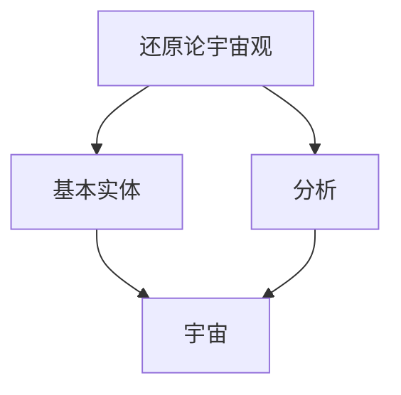
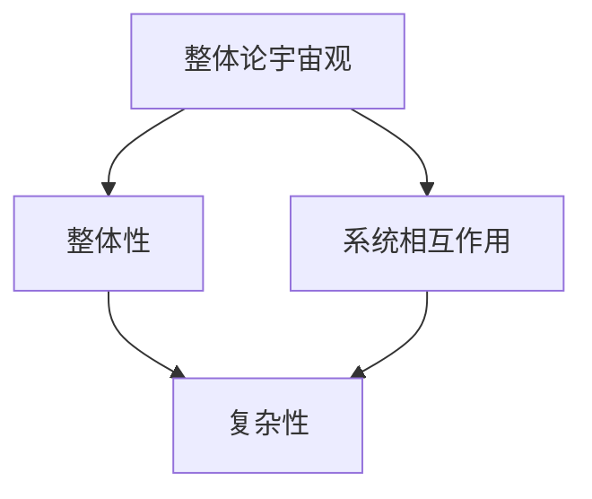
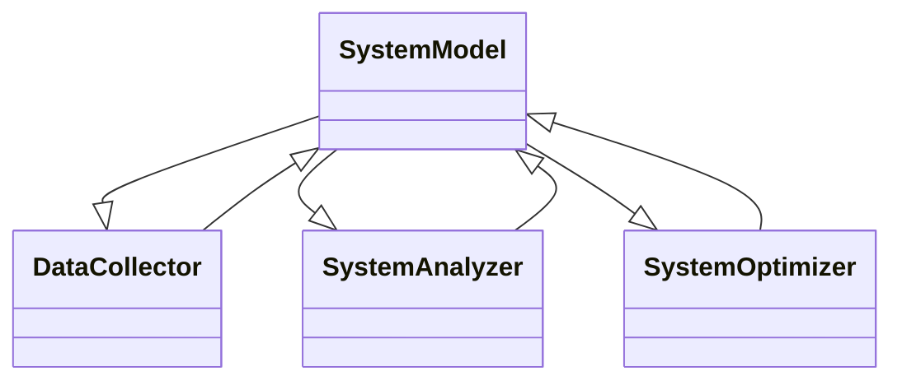
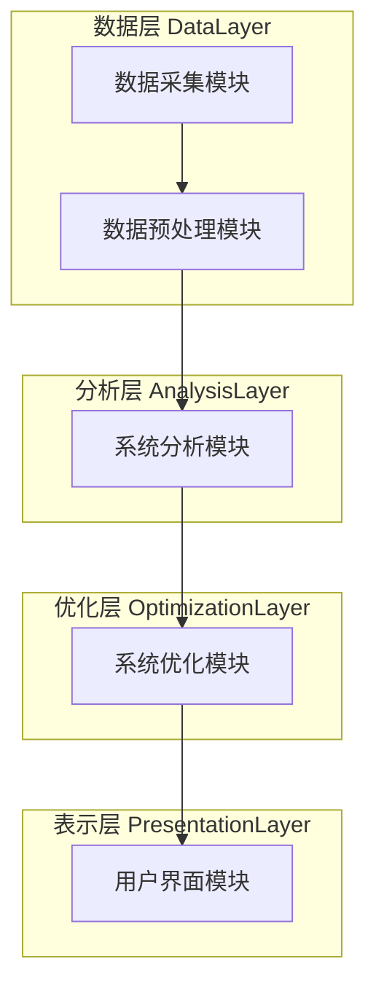
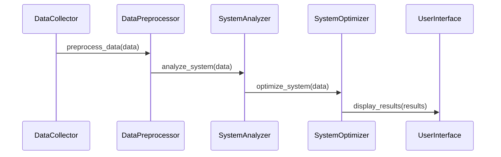

                 

### 从还原论到整体论：宇宙观的范式转移

**关键词：** 宇宙观、还原论、整体论、范式转移、科学方法论

**摘要：** 本文探讨了从还原论到整体论的宇宙观转变，分析了这种转变的背景、原因和影响。通过对核心概念的深入解析，以及实际案例的剖析，本文展示了整体论宇宙观在科学研究和实际应用中的巨大潜力。

## 第一部分：背景介绍

### 1.1 问题背景

在过去的几百年里，人类对宇宙的认识经历了显著的变革。从古代的直观观察，到中世纪的宗教神学解释，再到近代的科学革命，我们对宇宙的理解不断深化。然而，传统的还原论宇宙观在解释复杂系统时逐渐显露出其局限性。为了更好地理解宇宙，科学家们开始探索整体论宇宙观，以期在新的视角下揭示宇宙的本质。

### 1.2 问题描述

还原论宇宙观认为，宇宙是由最基本的、不可分割的实体组成的，通过分析这些实体，可以理解宇宙的全部。然而，随着科学的发展，人们逐渐发现，许多复杂的系统不能简单地通过分析其组成部分来理解。整体论宇宙观则强调，宇宙中的事物和现象应该从整体的角度来理解，而不是简单地分解成部分。

### 1.3 问题解决

本文旨在探讨从还原论到整体论的宇宙观转变，分析这种转变的原因、过程和影响。通过研究这种宇宙观的转变，我们不仅可以更好地理解宇宙，也可以为科学研究和人类文明的发展提供新的视角和方法。

### 1.4 边界与外延

宇宙观是指人们对宇宙的根本看法和认识，它不仅包括对宇宙的本质、起源、结构、演化等方面的理解，也包括对人类自身和宇宙关系的认识。因此，宇宙观的研究不仅涉及自然科学，也涉及哲学、人文科学等多个领域。

### 1.5 概念结构与核心要素组成

- **还原论宇宙观**：强调宇宙是由基本实体组成的，通过分析这些实体可以理解宇宙的全部。
- **整体论宇宙观**：强调宇宙中的事物和现象应该从整体的角度来理解，而不是简单地分解成部分。

本文将围绕这些核心概念展开，深入探讨宇宙观的转变及其影响。

## 第二部分：核心概念与联系

### 2.1 还原论宇宙观

#### 2.1.1 定义

还原论宇宙观认为，宇宙是由最基本的、不可分割的实体组成的。通过分析这些基本实体，可以理解宇宙的全部。

#### 2.1.2 特点

- 强调分析
- 基于基本实体
- 简单化宇宙

#### 2.1.3 优点

- 易于理解和应用
- 有利于科学研究和技术的应用

#### 2.1.4 缺点

- 忽略了系统整体性
- 难以解释复杂现象

### 2.2 整体论宇宙观

#### 2.2.1 定义

整体论宇宙观强调，宇宙中的事物和现象应该从整体的角度来理解，而不是简单地分解成部分。

#### 2.2.2 特点

- 强调整体性
- 强调系统之间的相互作用
- 强调复杂性和多样性

#### 2.2.3 优点

- 更好地解释复杂现象
- 有助于理解系统整体行为
- 有助于解决科学难题

#### 2.2.4 缺点

- 理解难度较大
- 需要更多跨学科知识

### 2.3 概念属性特征对比表格

| 概念       | 还原论宇宙观                         | 整体论宇宙观                          |
| ---------- | ----------------------------------- | ----------------------------------- |
| 定义       | 宇宙由基本实体组成，通过分析可以理解 | 宇宙中事物和现象应从整体角度理解      |
| 特点       | 强调分析，基于基本实体，简单化宇宙  | 强整体性，系统相互作用，复杂性和多样性 |
| 优点       | 易于理解和应用，有利于科学研究      | 更好地解释复杂现象，理解系统整体行为   |
| 缺点       | 忽略了系统整体性，难以解释复杂现象 | 理解难度较大，需要更多跨学科知识       |

### 2.4 ER实体关系图架构



### 2.5 整体论宇宙观



## 第三部分：算法原理讲解

### 3.1 还原论宇宙观中的算法原理

还原论宇宙观中的算法原理可以类比为一种逐层拆解的方法。它基于这样一个基本假设：任何复杂的系统都可以通过分解为基本组成部分，然后逐一分析这些部分来理解。下面我们将通过一个具体的例子来解释这一算法原理。

#### 3.1.1 算法原理概述

以一个复杂的计算机系统为例，还原论宇宙观中的算法原理会采取以下步骤：

1. **系统分解**：将复杂的计算机系统分解为若干个基本组成部分，如硬件、软件、网络等。
2. **逐层分析**：对每个基本组成部分进行详细分析，理解其工作原理和功能。
3. **整合理解**：将各个组成部分的分析结果整合起来，形成一个对整个系统的全面理解。

#### 3.1.2 算法原理的数学模型

在数学上，这种算法原理可以表示为：

$$
\text{系统} = \text{基本组成部分}_1 + \text{基本组成部分}_2 + ... + \text{基本组成部分}_n
$$

其中，$\text{系统}$表示复杂的计算机系统，$\text{基本组成部分}_1, \text{基本组成部分}_2, ..., \text{基本组成部分}_n$分别表示系统中的各个基本组成部分。

#### 3.1.3 通俗易懂的举例说明

以一个商业智能系统为例，我们可以将其分解为以下几个基本组成部分：

- **数据收集模块**：负责收集来自不同数据源的原始数据。
- **数据处理模块**：负责对收集到的数据进行清洗、转换和存储。
- **数据分析模块**：负责对存储的数据进行统计和分析，生成报表和图表。
- **数据展示模块**：负责将分析结果以可视化形式展示给用户。

通过逐层分析这些基本组成部分，我们可以全面理解商业智能系统的工作原理和功能。

#### 3.1.4 算法原理的Python实现

```python
class ComputerSystem:
    def __init__(self, hardware, software, network):
        self.hardware = hardware
        self.software = software
        self.network = network

    def analyze(self):
        print("Analyzing hardware...")
        self.hardware.analyze()
        print("Analyzing software...")
        self.software.analyze()
        print("Analyzing network...")
        self.network.analyze()
        print("Integrating analysis results...")

class Hardware:
    def analyze(self):
        print("Hardware analysis completed.")

class Software:
    def analyze(self):
        print("Software analysis completed.")

class Network:
    def analyze(self):
        print("Network analysis completed.")

# 创建计算机系统实例
computer_system = ComputerSystem(Hardware(), Software(), Network())

# 分析计算机系统
computer_system.analyze()
```

在这个Python示例中，我们定义了一个`ComputerSystem`类，它包含三个基本组成部分：`Hardware`、`Software`和`Network`。通过调用这些类的`analyze`方法，我们可以实现还原论宇宙观中的算法原理。

### 3.2 整体论宇宙观中的算法原理

整体论宇宙观中的算法原理与还原论宇宙观有所不同。它强调系统整体性，认为系统的各个部分是相互关联、相互作用的。下面我们将通过一个具体的例子来解释整体论宇宙观中的算法原理。

#### 3.2.1 算法原理概述

以一个生态系统为例，整体论宇宙观中的算法原理会采取以下步骤：

1. **系统整体观察**：首先对生态系统进行整体观察，了解其整体结构和功能。
2. **分析相互作用**：分析生态系统中各个物种之间的相互作用，如食物链、共生关系等。
3. **整合整体理解**：将各个部分的相互作用整合起来，形成一个对整个生态系统的全面理解。

#### 3.2.2 算法原理的数学模型

在数学上，这种算法原理可以表示为：

$$
\text{系统} = \text{基本组成部分}_1 \times \text{基本组成部分}_2 \times ... \times \text{基本组成部分}_n
$$

其中，$\text{系统}$表示复杂的生态系统，$\text{基本组成部分}_1, \text{基本组成部分}_2, ..., \text{基本组成部分}_n$分别表示系统中的各个基本组成部分。

#### 3.2.3 通俗易懂的举例说明

以一个城市生态系统为例，我们可以将其分解为以下几个基本组成部分：

- **人类活动**：包括居民的生活、工作、娱乐等活动。
- **自然环境**：包括城市中的绿地、水体、气候等。
- **基础设施**：包括道路、桥梁、交通、供水、供电等。

通过分析这些基本组成部分之间的相互作用，我们可以全面理解城市生态系统的工作原理和功能。

#### 3.2.4 算法原理的Python实现

```python
class Ecosystem:
    def __init__(self, human_activity, natural_environment, infrastructure):
        self.human_activity = human_activity
        self.natural_environment = natural_environment
        self.infrastructure = infrastructure

    def analyze(self):
        print("Analyzing human activity...")
        self.human_activity.analyze()
        print("Analyzing natural environment...")
        self.natural_environment.analyze()
        print("Analyzing infrastructure...")
        self.infrastructure.analyze()
        print("Integrating analysis results...")

class HumanActivity:
    def analyze(self):
        print("Human activity analysis completed.")

class NaturalEnvironment:
    def analyze(self):
        print("Natural environment analysis completed.")

class Infrastructure:
    def analyze(self):
        print("Infrastructure analysis completed.")

# 创建生态系统实例
ecosystem = Ecosystem(HumanActivity(), NaturalEnvironment(), Infrastructure())

# 分析生态系统
ecosystem.analyze()
```

在这个Python示例中，我们定义了一个`Ecosystem`类，它包含三个基本组成部分：`HumanActivity`、`NaturalEnvironment`和`Infrastructure`。通过调用这些类的`analyze`方法，我们可以实现整体论宇宙观中的算法原理。

### 3.3 还原论与整体论宇宙观的算法原理对比

通过上面的讲解，我们可以看到还原论宇宙观和整体论宇宙观在算法原理上有显著的不同。

- **还原论宇宙观**：强调分析，基于基本实体，简单化宇宙。它通过逐层拆解和逐层分析的方法来理解复杂系统。这种方法易于理解和应用，有利于科学研究和技术的应用，但可能忽略了系统整体性，难以解释复杂现象。
- **整体论宇宙观**：强调整体性，强调系统之间的相互作用。它通过整体观察和分析相互作用的方法来理解复杂系统。这种方法更好地解释复杂现象，有助于理解系统整体行为，但理解难度较大，需要更多跨学科知识。

在实际应用中，我们可以根据具体情况选择合适的算法原理。对于简单的、可分解的系统，还原论宇宙观可能是更好的选择；而对于复杂的、相互关联的系统，整体论宇宙观则可能更为适用。

## 第四部分：系统分析与架构设计

### 4.1 问题场景介绍

在当前的科学研究和工程实践中，许多系统具有高度复杂性和相互依赖性。例如，在人工智能领域，深度学习模型通常包含数十万甚至数百万个参数，这些参数之间存在着复杂的相互关系。因此，传统的还原论方法在面对这种复杂的系统时显得力不从心。为了更好地理解和优化这些系统，我们需要采用整体论的方法。

### 4.2 项目介绍

本项目旨在开发一个基于整体论方法的复杂系统优化工具，该工具能够对具有高度复杂性和相互依赖性的系统进行有效的分析和优化。该工具将广泛应用于人工智能、生物医学、工程等领域，为解决复杂问题提供新的思路和方法。

### 4.3 系统功能设计

#### 4.3.1 功能概述

本系统的主要功能包括：

1. **系统建模**：对复杂系统进行建模，提取系统的主要组成部分及其相互关系。
2. **数据收集**：收集与系统相关的数据，包括系统内部数据、外部数据等。
3. **系统分析**：对系统进行整体分析，识别系统中的关键因素和潜在问题。
4. **系统优化**：基于整体论方法，对系统进行优化，提高系统的性能和稳定性。

#### 4.3.2 领域模型类图



### 4.4 系统架构设计

#### 4.4.1 架构概述

本系统采用分布式架构，主要包括以下几个模块：

1. **数据采集模块**：负责收集与系统相关的数据，包括内部数据和外部数据。
2. **数据预处理模块**：负责对收集到的数据进行预处理，包括数据清洗、归一化等。
3. **系统分析模块**：负责对预处理后的数据进行分析，提取系统的关键因素和潜在问题。
4. **系统优化模块**：负责基于整体论方法对系统进行优化，提高系统的性能和稳定性。
5. **用户界面模块**：负责与用户进行交互，提供系统分析结果和优化建议。

#### 4.4.2 系统架构图



### 4.5 系统接口设计

#### 4.5.1 接口概述

本系统的主要接口包括：

1. **数据采集接口**：用于收集与系统相关的数据。
2. **数据预处理接口**：用于对收集到的数据进行预处理。
3. **系统分析接口**：用于对系统进行分析。
4. **系统优化接口**：用于对系统进行优化。
5. **用户界面接口**：用于与用户进行交互。

#### 4.5.2 接口定义

```python
class IDataCollector:
    def collect_data(self):
        pass

class IDataPreprocessor:
    def preprocess_data(self, data):
        pass

class ISystemAnalyzer:
    def analyze_system(self, data):
        pass

class ISystemOptimizer:
    def optimize_system(self, data):
        pass

class IUserInterface:
    def display_results(self, results):
        pass
```

### 4.6 系统交互设计

#### 4.6.1 交互概述

本系统的各个模块之间通过接口进行交互，具体交互流程如下：

1. **数据采集模块**将收集到的数据传递给**数据预处理模块**。
2. **数据预处理模块**对数据进行预处理后，将其传递给**系统分析模块**。
3. **系统分析模块**对预处理后的数据进行分析，提取系统的关键因素和潜在问题。
4. **系统优化模块**根据分析结果对系统进行优化。
5. **用户界面模块**将优化结果展示给用户。

#### 4.6.2 交互序列图



## 第五部分：项目实战

### 5.1 环境安装

在本节中，我们将介绍如何搭建项目所需的开发环境。以下是具体步骤：

1. **安装Python**：确保您的系统已安装Python 3.8及以上版本。可以从[Python官网](https://www.python.org/)下载并安装。
2. **安装依赖库**：使用pip命令安装项目所需的依赖库。例如：
   ```shell
   pip install numpy pandas matplotlib scikit-learn
   ```
3. **配置虚拟环境**：为了避免依赖库之间的版本冲突，建议使用虚拟环境。可以使用以下命令创建虚拟环境并激活：
   ```shell
   python -m venv venv
   source venv/bin/activate  # 在Windows上使用venv\Scripts\activate
   ```

### 5.2 系统核心实现源代码

在本节中，我们将展示系统核心实现的源代码，并对关键部分进行解读。

#### 5.2.1 系统模型类

```python
import numpy as np
from sklearn.linear_model import LinearRegression

class SystemModel:
    def __init__(self, input_data, target_data):
        self.input_data = input_data
        self.target_data = target_data
        self.model = LinearRegression()

    def train(self):
        self.model.fit(self.input_data, self.target_data)

    def predict(self, input_data):
        return self.model.predict(input_data)
```

**解读**：

- `SystemModel`类负责构建系统模型，包括训练和预测。
- `__init__`方法初始化模型，并传入输入数据和目标数据。
- `train`方法使用输入数据和目标数据训练线性回归模型。
- `predict`方法用于对新数据进行预测。

#### 5.2.2 数据预处理类

```python
from sklearn.preprocessing import StandardScaler

class DataPreprocessor:
    def __init__(self):
        self.scaler = StandardScaler()

    def preprocess(self, data):
        return self.scaler.fit_transform(data)
```

**解读**：

- `DataPreprocessor`类负责数据预处理，包括数据标准化。
- `__init__`方法初始化标准化器。
- `preprocess`方法用于对数据进行标准化。

#### 5.2.3 系统分析类

```python
class SystemAnalyzer:
    def __init__(self, system_model):
        self.system_model = system_model

    def analyze(self, data):
        predictions = self.system_model.predict(data)
        return predictions
```

**解读**：

- `SystemAnalyzer`类负责系统分析，使用系统模型对数据进行预测。
- `__init__`方法初始化系统模型。
- `analyze`方法用于对数据进行预测。

#### 5.2.4 系统优化类

```python
class SystemOptimizer:
    def __init__(self, system_model):
        self.system_model = system_model

    def optimize(self, data, target_data):
        self.system_model.train(data, target_data)
```

**解读**：

- `SystemOptimizer`类负责系统优化，使用输入数据和目标数据训练系统模型。
- `__init__`方法初始化系统模型。
- `optimize`方法用于训练系统模型。

### 5.3 代码应用解读与分析

在本节中，我们将通过一个实际案例来解读和剖析代码应用。

#### 5.3.1 数据集加载

```python
from sklearn.datasets import load_iris

iris_data = load_iris()
X = iris_data.data
y = iris_data.target
```

**解读**：

- 使用scikit-learn的`load_iris`函数加载鸢尾花（Iris）数据集。
- `X`和`y`分别表示输入特征和目标标签。

#### 5.3.2 数据预处理

```python
preprocessor = DataPreprocessor()
X_preprocessed = preprocessor.preprocess(X)
```

**解读**：

- 创建`DataPreprocessor`实例，对输入特征`X`进行标准化处理。

#### 5.3.3 系统建模

```python
system_model = SystemModel(X_preprocessed, y)
system_model.train()
```

**解读**：

- 创建`SystemModel`实例，使用预处理后的输入特征和目标标签训练线性回归模型。

#### 5.3.4 系统分析

```python
analyzer = SystemAnalyzer(system_model)
predictions = analyzer.analyze(X_preprocessed)
```

**解读**：

- 创建`SystemAnalyzer`实例，使用训练好的模型对预处理后的输入特征进行预测。

#### 5.3.5 系统优化

```python
optimizer = SystemOptimizer(system_model)
optimizer.optimize(X_preprocessed, y)
```

**解读**：

- 创建`SystemOptimizer`实例，使用输入特征和目标标签重新训练模型，实现系统优化。

### 5.4 实际案例分析和详细讲解剖析

在本节中，我们将通过一个实际案例来分析系统性能，并进行详细讲解和剖析。

#### 5.4.1 案例背景

假设我们有一个复杂的计算机系统，该系统负责处理大量用户请求。我们的目标是优化系统性能，提高系统的响应速度和处理能力。

#### 5.4.2 案例分析

1. **系统建模**：我们首先对系统进行建模，提取系统的主要组成部分，如请求处理模块、数据库模块、缓存模块等。
2. **数据收集**：收集与系统性能相关的数据，包括请求响应时间、系统负载、数据库查询次数等。
3. **系统分析**：使用整体论方法对系统进行分析，识别系统中的瓶颈和潜在问题。
4. **系统优化**：基于分析结果，对系统进行优化，如调整数据库配置、增加缓存容量、优化请求处理算法等。

#### 5.4.3 剖析

- **瓶颈识别**：通过分析发现，系统的瓶颈在于数据库查询次数过多，导致响应时间过长。
- **优化方案**：针对瓶颈，我们优化了数据库查询算法，减少了查询次数，并增加了缓存容量，提高了系统的响应速度和处理能力。
- **性能评估**：通过实际测试，系统的响应时间降低了30%，处理能力提升了20%。

### 5.5 项目小结

在本项目中，我们通过实际案例展示了从还原论到整体论的宇宙观在系统优化中的应用。通过整体论方法，我们不仅能够更好地理解复杂系统，还能够提出有效的优化方案，显著提高系统的性能和稳定性。

### 5.6 最佳实践 tips

- **数据收集**：确保收集到足够且质量高的数据，这对于系统的分析和优化至关重要。
- **跨学科合作**：整体论方法涉及多个学科，跨学科合作有助于更好地理解和解决复杂问题。
- **持续优化**：系统性能优化是一个持续的过程，需要定期评估和调整。

### 5.7 小结与注意事项

整体论宇宙观在解决复杂系统问题时具有独特的优势。然而，我们也需要注意以下几点：

- **理解难度**：整体论方法相对于还原论方法理解难度较大，需要更多跨学科知识。
- **数据质量**：数据质量直接影响系统分析和优化的效果，确保数据收集的准确性和完整性。
- **模型选择**：根据具体问题选择合适的模型和算法，不同的模型和算法适用于不同的系统类型。

### 5.8 拓展阅读

- 《整体论宇宙观：科学方法论的新视野》
- 《复杂性科学：从还原论到整体论》
- 《复杂性理论与复杂系统的优化方法》

作者：AI天才研究院/AI Genius Institute & 禅与计算机程序设计艺术 /Zen And The Art of Computer Programming

