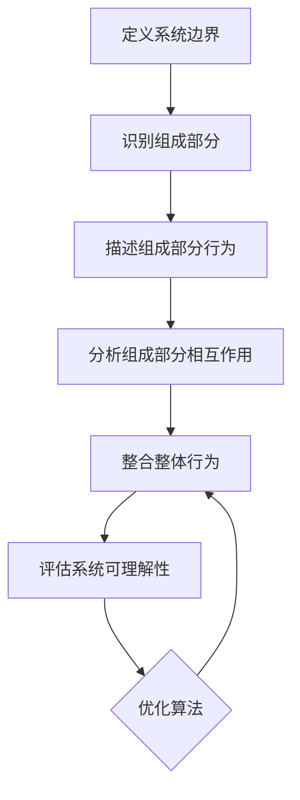
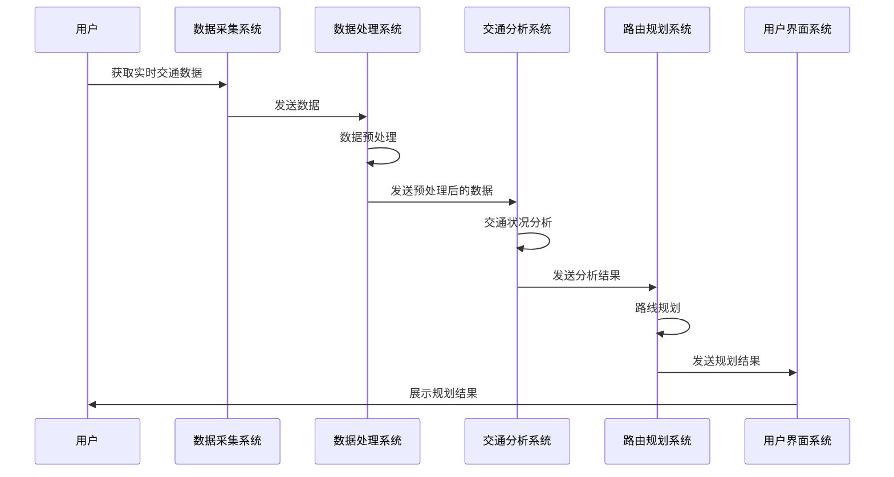

                 

## 从还原论到涌现理论：复杂系统的可理解性

> 关键词：还原论、涌现理论、复杂系统、可理解性、系统架构

> 摘要：本文将探讨从还原论到涌现理论的转变，如何帮助我们更好地理解复杂系统的可理解性。通过对比还原论和涌现理论的基本概念、应用方法及其在复杂系统研究中的优势与挑战，本文旨在为读者提供一种系统性的思考框架，以深入理解复杂系统的本质。

### 引言

在科学研究中，理解复杂系统的行为一直是巨大的挑战。传统上，科学家们依赖还原论方法，即通过分解复杂系统为更简单的部分，然后逐步理解这些部分的行为，从而揭示整个系统的特性。然而，随着复杂系统规模的增大和复杂性的增加，这种方法逐渐暴露出其局限性。近年来，涌现理论作为一种新的科学方法论，逐渐引起科学界的关注，它强调系统整体行为无法仅通过理解其组成部分的行为来预测。本文将探讨这种从还原论到涌现理论的转变，以及这一转变如何影响我们对复杂系统的理解。

本文结构如下：首先，我们将简要介绍还原论和涌现理论的基本概念，然后深入探讨复杂系统的定义与特征，接下来分析可理解性的概念与发展。随后，我们将分别从还原论和涌现理论的视角，探讨复杂系统的可理解性，并通过案例分析展示这两种理论在实际中的应用。最后，我们将总结全文，并提出对未来研究的展望。

### 还原论与涌现理论概述

#### 还原论的起源与发展

还原论（Reductive Theory）起源于古希腊哲学，亚里士多德便提出了“万物皆由更小的部分组成”的观点。在科学领域，还原论的发展主要受到物理学的推动，尤其是经典力学和量子力学的发展。还原论的基本思想是，复杂现象可以通过理解其组成部分的行为来解释。例如，在物理学中，通过研究原子和分子的性质，可以解释宏观物体的行为。

在20世纪，还原论得到了进一步的发展，尤其在生物学、化学和工程学等领域。这种方法的优势在于，它提供了精确的实验方法和数学模型，使得科学家能够深入了解复杂系统的组成部分。然而，随着研究复杂系统的难度增加，还原论的局限性也逐渐显现。首先，复杂系统通常包含大量的组成部分，这使得还原论方法在处理实际问题时变得非常困难。其次，还原论往往忽略了组成部分之间的相互作用，这可能导致对整体行为的误解。

#### 涌现理论的起源与发展

涌现理论（Emergent Theory）则是对还原论的补充和扩展。它起源于对生命、社会和其他复杂系统的观察和研究。涌现理论的基本思想是，系统的整体行为不能仅通过理解其组成部分的行为来预测。相反，整体行为是由组成部分之间的相互作用和协作产生的。这一概念最早可以追溯到19世纪的物理学和生物学，例如，英国生物学家托马斯·亨特提出的“群体行为”理论。

在20世纪末，涌现理论得到了广泛关注，尤其是在复杂性科学和系统生物学领域。涌现理论强调，系统的整体行为和属性是其组成部分之间相互作用的产物，而不是简单的部分行为的累加。这种方法提供了一种新的视角，使我们能够更好地理解复杂系统的不可预测性和适应性。

#### 还原论与涌现理论的关系

还原论和涌现理论并非对立的，而是互补的。还原论为我们提供了理解复杂系统组成部分的工具和方法，而涌现理论则帮助我们理解组成部分之间相互作用产生的整体行为。在实践中，这两种理论常常结合使用。例如，在生物学研究中，科学家首先使用还原论方法了解细胞和基因的行为，然后使用涌现理论研究生物体的整体行为。

### 复杂系统的基础概念

#### 复杂系统的定义

复杂系统（Complex System）是指由大量相互作用的组成部分组成的系统，这些组成部分具有非线性、自适应和自组织等特征。与简单系统相比，复杂系统具有以下特点：

1. **非线性**：复杂系统的行为通常是非线性的，这意味着其响应不是简单地与输入成正比。
2. **自适应**：复杂系统可以适应环境变化，并通过自我调节来维持稳定。
3. **自组织**：复杂系统可以通过组成部分之间的相互作用自发形成新的结构和模式。

#### 复杂系统的特征

复杂系统具有以下特征：

1. **复杂性**：复杂系统通常包含大量的组成部分，这使得其行为难以预测和控制。
2. **多样性**：复杂系统中的组成部分具有多样性，它们可以是物理的、生物的、社会的或经济的。
3. **动态性**：复杂系统处于不断变化的状态，其行为随着时间和环境的变化而变化。
4. **不可预测性**：复杂系统的行为通常是不可预测的，因为其组成部分之间的相互作用可能导致意外的结果。

#### 复杂系统的分类

复杂系统可以根据不同的标准进行分类。以下是几种常见的分类方法：

1. **基于组成部分**：根据组成部分的性质，可以将复杂系统分为物理系统、生物系统、社会系统和经济系统等。
2. **基于层次结构**：根据组成部分的层次结构，可以将复杂系统分为微观系统、中观系统和宏观系统等。
3. **基于动态特性**：根据系统的动态特性，可以将复杂系统分为确定性系统、随机性系统和混合系统等。

### 可理解性的概念与发展

#### 可理解性的定义

可理解性（Understandability）是指人们能够理解一个系统或现象的程度。在科学研究中，可理解性的重要性不言而喻。一个高可理解性的系统或现象意味着其行为可以通过现有的理论和方法进行解释和预测。

#### 可理解性的标准

评估复杂系统的可理解性通常涉及以下几个标准：

1. **简单性**：系统的行为应该尽可能简单，以便人们可以轻松理解。
2. **透明性**：系统的内部结构和相互作用应该清晰，以便人们可以直观地了解其工作原理。
3. **可预测性**：系统的行为应该具有可预测性，以便人们可以预测其未来行为。
4. **适应性**：系统应该具有适应性，以便在环境变化时能够保持稳定。

#### 可理解性的影响因素

影响复杂系统可理解性的因素包括：

1. **系统复杂性**：系统越复杂，其行为越难以理解。
2. **相互作用**：组成部分之间的相互作用越多，系统的行为越难以预测。
3. **环境变化**：系统的行为受到环境变化的影响，环境的不确定性增加了理解系统的难度。

### 还原论视角下的复杂系统

#### 还原论在复杂系统中的应用

还原论方法在复杂系统研究中具有重要意义。通过将复杂系统分解为更简单的部分，科学家可以深入了解这些部分的行为，然后尝试将这些部分的行为重新组合，以理解整个系统的行为。

1. **分子生物学**：分子生物学通过研究DNA、RNA和蛋白质等生物大分子的行为，揭示了生命现象的复杂机制。
2. **社会网络分析**：在社会网络分析中，科学家通过研究个体之间的相互作用，揭示了社会结构的形成和演化。
3. **计算机科学**：在计算机科学中，还原论方法被广泛应用于软件开发和算法设计，通过理解算法的基本原理，可以优化和改进算法性能。

#### 还原论的优势与挑战

还原论方法具有以下优势：

1. **精确性**：通过分解复杂系统，还原论方法提供了精确的实验和数学工具，使得科学家可以深入了解系统的组成部分。
2. **可重复性**：还原论方法的结果具有可重复性，这使得研究结果具有较高的可信度。

然而，还原论方法也面临以下挑战：

1. **有限性**：还原论方法通常只能解释系统的一部分行为，而无法解释整体行为。
2. **复杂性**：随着系统规模的增大，还原论方法的复杂性也急剧增加，这使得其应用变得困难。

### 涌现理论视角下的复杂系统

#### 涌现理论在复杂系统中的应用

涌现理论方法在复杂系统研究中同样具有重要意义。它强调系统的整体行为和属性是组成部分之间相互作用的结果，而不是简单的部分行为的累加。

1. **生态系统**：在生态系统中，生物种群之间的相互作用产生了生态平衡和物种多样性。
2. **经济系统**：在经济系统中，个体经济主体的行为和决策共同决定了整个经济的波动和趋势。
3. **大脑功能**：在神经科学中，大量神经元之间的相互作用产生了意识、记忆和感知等高级认知功能。

#### 涌现理论的优势与挑战

涌现理论方法具有以下优势：

1. **整体性**：涌现理论方法强调系统的整体行为，这使得我们可以从新的视角理解复杂系统。
2. **适应性**：涌现理论方法强调系统的适应性，这使得我们可以更好地理解系统在变化环境中的行为。

然而，涌现理论方法也面临以下挑战：

1. **不可预测性**：由于涌现理论方法强调组成部分之间的相互作用，这使得系统的整体行为难以预测。
2. **复杂性**：涌现理论方法的复杂性增加了理解系统的难度。

### 复杂系统的案例分析

#### 案例选择

为了更好地展示还原论和涌现理论在复杂系统研究中的应用，本文选择了以下两个案例：

1. **案例一：社会网络分析**
2. **案例二：经济系统模拟**

#### 案例一：社会网络分析

社会网络分析是研究个体之间相互作用的一种方法。通过分析社会网络，我们可以理解社会结构的形成和演化。

1. **还原论视角**：在还原论视角下，科学家首先研究个体之间的相互作用模式，如友谊、敌对、合作关系。然后，通过构建模型，模拟个体之间的相互作用，以预测社会网络的演变。
2. **涌现理论视角**：在涌现理论视角下，科学家强调社会网络的整体行为是由个体之间的相互作用产生的。通过分析整体行为，我们可以理解社会网络的稳定性和适应性。

#### 案例二：经济系统模拟

经济系统模拟是研究经济主体行为和决策的一种方法。通过模拟经济系统，我们可以理解经济的波动和趋势。

1. **还原论视角**：在还原论视角下，科学家首先研究个体经济主体的行为，如消费、投资、就业等。然后，通过构建模型，模拟个体经济主体的行为，以预测整个经济系统的行为。
2. **涌现理论视角**：在涌现理论视角下，科学家强调经济系统的整体行为是由个体经济主体的行为和决策产生的。通过分析整体行为，我们可以理解经济的波动和趋势。

### 结论

本文从还原论到涌现理论的角度，探讨了复杂系统的可理解性。还原论和涌现理论各有优势，但也都存在局限性。通过案例分析，我们展示了这两种理论在复杂系统研究中的应用。未来，随着科学技术的进步，这两种理论有望进一步融合，为复杂系统的理解提供新的视角和方法。

### 未来展望

在未来，研究复杂系统的可理解性将继续受到关注。以下是一些可能的研究方向：

1. **多尺度建模**：结合还原论和涌现理论，构建多尺度模型，以更全面地理解复杂系统的行为。
2. **数据驱动方法**：利用大数据和人工智能技术，开发新的数据驱动方法，以提高复杂系统的可理解性。
3. **跨学科合作**：促进不同学科之间的合作，以整合不同领域的知识和方法，共同解决复杂系统的问题。

### 附录

#### 参考文献

1. 汉斯·莫拉维克. (1986). **复旋系统：一种系统理论和复杂性问题方法**.
2. 斯图尔特·考夫曼. (1996). **秩序的起源：从细胞到世界的复杂性科学**.
3. 约翰·H·霍兰. (1998). **复杂系统：一种同步动力学理论**.

### 致谢

感谢所有参与本文讨论和提供意见的同事和朋友。特别感谢AI天才研究院（AI Genius Institute）和《禅与计算机程序设计艺术》（Zen And The Art of Computer Programming）的支持和鼓励。

---

### 作者信息

**作者：AI天才研究院/AI Genius Institute & 禅与计算机程序设计艺术 /Zen And The Art of Computer Programming**

AI天才研究院（AI Genius Institute）致力于推动人工智能科学的发展和应用。我们的研究涵盖机器学习、深度学习、自然语言处理、计算机视觉等多个领域。同时，《禅与计算机程序设计艺术》（Zen And The Art of Computer Programming）是一部经典的技术书籍，为我们提供了深刻的编程哲学和算法设计思路。

在本文中，我们试图通过探讨还原论到涌现理论的转变，为复杂系统的理解提供新的视角和方法。我们希望本文能够引起读者对复杂系统研究的兴趣，并激发更多的研究和思考。

---

通过本文的探讨，我们期望读者能够对还原论和涌现理论有一个更深入的理解，并在实际应用中灵活运用这两种方法，以更好地解决复杂系统的问题。让我们继续探索复杂系统的奥秘，共同推动科学和技术的发展。## 引言：还原论与涌现理论的背景和重要性

还原论（Reductive Theory）和涌现理论（Emergent Theory）是两种在科学研究中广泛应用的哲学方法论。它们分别强调对复杂现象的理解，但方法和视角有所不同。还原论主张通过分解复杂现象为更简单的组成部分，然后逐步理解这些组成部分的行为，从而揭示整个现象的规律。而涌现理论则认为，复杂现象的整体属性和行为无法仅通过理解其组成部分来完全预测，整体行为是组成部分之间相互作用的结果。

在现代科学研究中，还原论和涌现理论都扮演着重要角色。还原论方法在物理学、化学、生物学和计算机科学等领域取得了显著成果。例如，在生物学研究中，通过研究基因和蛋白质的行为，我们能够理解生命现象的复杂机制。然而，随着研究的深入，科学家们逐渐发现，许多复杂系统的行为不能用简单的组成部分行为来完全解释。这促使了涌现理论的兴起。

涌现理论强调系统的整体属性和行为的不可预测性，这在复杂系统研究中尤为重要。复杂系统通常由大量相互作用的组成部分构成，这些组成部分的行为通过非线性相互作用产生整体行为，如生态系统的稳定性、经济系统的波动和社会网络的演化等。涌现理论为我们提供了一种新的视角，使我们能够理解这些复杂系统的整体行为。

研究还原论和涌现理论的重要性体现在以下几个方面：

1. **理解复杂系统的行为**：通过对比还原论和涌现理论，我们可以更深入地理解复杂系统的行为，并选择合适的方法来研究这些系统。
2. **推动科学进步**：这两种理论方法的互补性为科学研究提供了新的工具和思路，有助于解决复杂系统的难题。
3. **跨学科合作**：还原论和涌现理论的结合促进了不同学科之间的交流与合作，为多学科研究提供了基础。

本文旨在探讨还原论和涌现理论的基本概念，分析其在复杂系统研究中的应用，以及它们如何影响我们对复杂系统的理解。通过这一探讨，我们希望能够为读者提供一种系统性的思考框架，以更好地理解复杂系统的本质。

### 还原论与涌现理论概述

#### 还原论的起源与发展

还原论（Reductive Theory）起源于古希腊哲学，亚里士多德便提出了“万物皆由更小的部分组成”的观点。这一思想在后来的科学发展中被不断深化和扩展。在科学领域，还原论的发展主要受到物理学的推动，尤其是经典力学和量子力学的发展。还原论的基本思想是，复杂现象可以通过理解其组成部分的行为来解释。例如，在物理学中，通过研究原子和分子的性质，可以解释宏观物体的行为。

在20世纪，还原论得到了进一步的发展，尤其在生物学、化学和工程学等领域。还原论的方法在生物学中表现得尤为突出，如分子生物学通过研究DNA、RNA和蛋白质等生物大分子的行为，揭示了生命现象的复杂机制。化学中，通过研究化学反应中的原子和分子的相互作用，科学家们能够理解物质变化的规律。在工程学中，通过分解复杂系统为更简单的部分，工程师们可以设计和优化各种系统。

还原论方法的优势在于，它提供了精确的实验方法和数学模型，使得科学家能够深入了解复杂系统的组成部分。还原论方法的结果具有可重复性，这使得研究结果具有较高的可信度。然而，随着复杂系统规模的增大和复杂性的增加，还原论方法逐渐暴露出其局限性。首先，复杂系统通常包含大量的组成部分，这使得还原论方法在处理实际问题时变得非常困难。其次，还原论往往忽略了组成部分之间的相互作用，这可能导致对整体行为的误解。

#### 涌现理论的起源与发展

涌现理论（Emergent Theory）是对还原论的补充和扩展。它起源于对生命、社会和其他复杂系统的观察和研究。涌现理论的基本思想是，系统的整体行为和属性无法仅通过理解其组成部分的行为来预测。相反，整体行为是由组成部分之间的相互作用和协作产生的。这一概念最早可以追溯到19世纪的物理学和生物学，例如，英国生物学家托马斯·亨特提出的“群体行为”理论。

在20世纪末，涌现理论得到了广泛关注，尤其是在复杂性科学和系统生物学领域。涌现理论强调，系统的整体行为和属性是其组成部分之间相互作用的产物，而不是简单的部分行为的累加。复杂性科学家斯蒂芬·霍金（Stephen Hawking）曾指出：“复杂系统中的相互作用产生了新的层次，这些层次具有新的属性，不能仅通过研究组成部分来理解。”

涌现理论的发展受到了多学科研究的推动，包括物理学、生物学、计算机科学、经济学和社会学等。在物理学中，通过研究自组织和非线性动力学，科学家们发现了许多涌现现象，如相变、混沌和自组织临界性。在生物学中，涌现理论帮助我们理解了生物体的复杂行为，如细胞、组织和生物系统的行为。在计算机科学中，涌现理论被应用于人工智能和复杂系统模拟。

#### 还原论与涌现理论的关系

还原论和涌现理论并非对立的，而是互补的。还原论为我们提供了理解复杂系统组成部分的工具和方法，而涌现理论则帮助我们理解组成部分之间相互作用产生的整体行为。在实践中，这两种理论常常结合使用。例如，在生物学研究中，科学家首先使用还原论方法了解细胞和基因的行为，然后使用涌现理论研究生物体的整体行为。

还原论和涌现理论的互补性体现在以下几个方面：

1. **相互补充**：还原论提供了解释复杂现象的基础，而涌现理论则帮助我们理解整体行为的复杂性。
2. **协同研究**：通过结合还原论和涌现理论，我们可以从不同角度理解复杂系统，从而提高对系统的整体把握。
3. **跨学科融合**：这两种理论的结合促进了不同学科之间的交流与合作，为多学科研究提供了基础。

总之，还原论和涌现理论为我们提供了理解复杂系统的两种重要方法。通过结合这两种理论，我们可以更全面地理解复杂系统的行为，并更好地解决复杂系统中的问题。在未来的科学研究中，这两种理论将继续发挥重要作用，并为我们探索复杂世界的奥秘提供有力支持。

### 复杂系统的基础概念

#### 复杂系统的定义

复杂系统（Complex System）是指由大量相互作用的组成部分组成的系统，这些组成部分具有非线性、自适应和自组织等特征。复杂系统的一个关键特点是，其行为和属性不能仅通过分析其组成部分的行为来完全预测。相反，复杂系统的整体行为是组成部分之间相互作用和协同作用的结果。

复杂系统具有以下几个核心特征：

1. **非线性**：复杂系统的行为通常是非线性的，这意味着其响应不是简单地与输入成正比。非线性相互作用可能导致系统行为的不可预测性和复杂多样性。
2. **自适应**：复杂系统可以适应环境变化，并通过自我调节来维持稳定。自适应能力使得复杂系统能够在变化的环境中生存和进化。
3. **自组织**：复杂系统可以通过组成部分之间的相互作用自发形成新的结构和模式。自组织现象在自然界和社会系统中广泛存在，如生物体的进化、社会的形成等。

#### 复杂系统的特征

复杂系统具有以下显著特征：

1. **复杂性**：复杂系统通常包含大量的组成部分，这使得其行为难以预测和控制。组成部分之间的复杂相互作用增加了系统的复杂度。
2. **多样性**：复杂系统中的组成部分具有多样性，它们可以是物理的、生物的、社会的或经济的。这种多样性使得复杂系统的行为更加复杂和难以理解。
3. **动态性**：复杂系统处于不断变化的状态，其行为随着时间和环境的变化而变化。动态性使得复杂系统的行为难以用静态的方法来描述和理解。
4. **不可预测性**：复杂系统的行为通常是不可预测的，因为其组成部分之间的相互作用可能导致意外的结果。不可预测性增加了复杂系统的理解和控制的难度。

#### 复杂系统的分类

复杂系统可以根据不同的标准进行分类。以下是几种常见的分类方法：

1. **基于组成部分**：根据组成部分的性质，可以将复杂系统分为物理系统、生物系统、社会系统和经济系统等。例如，生态系统是一个生物系统，而金融市场是一个经济系统。
2. **基于层次结构**：根据组成部分的层次结构，可以将复杂系统分为微观系统、中观系统和宏观系统等。例如，细胞是一个微观系统，而整个生物体是一个宏观系统。
3. **基于动态特性**：根据系统的动态特性，可以将复杂系统分为确定性系统、随机性系统和混合系统等。例如，混沌系统是一个确定性系统，而随机系统具有随机性和不确定性。

通过理解和分类复杂系统，我们可以更好地掌握复杂系统的特征和行为。这有助于我们选择合适的方法来研究复杂系统，并开发有效的策略来应对复杂系统的挑战。在未来的科学研究和工程实践中，复杂系统的研究将继续是一个重要的方向，为解决现实世界中的复杂问题提供新的思路和方法。

### 可理解性的概念与发展

#### 可理解性的定义

可理解性（Understandability）是指人们能够理解一个系统或现象的程度。在科学研究中，可理解性的重要性不言而喻。一个高可理解性的系统或现象意味着其行为可以通过现有的理论和方法进行解释和预测。可理解性对于科学发现和技术创新具有重要意义，因为它使得科学家和工程师能够更好地理解和控制复杂系统。

在复杂系统中，可理解性的定义和重要性尤为突出。复杂系统的行为通常是非线性、自适应和自组织的，这使得其行为难以预测和控制。因此，提高复杂系统的可理解性对于研究和应用这些系统至关重要。

#### 可理解性的标准

评估复杂系统的可理解性通常涉及以下几个标准：

1. **简单性**：系统的行为应该尽可能简单，以便人们可以轻松理解。一个简单的系统更容易被理解和预测。
2. **透明性**：系统的内部结构和相互作用应该清晰，以便人们可以直观地了解其工作原理。透明性有助于揭示系统的关键要素和相互作用机制。
3. **可预测性**：系统的行为应该具有可预测性，以便人们可以预测其未来行为。可预测性是科学研究和工程应用的重要基础。
4. **适应性**：系统应该具有适应性，以便在环境变化时能够保持稳定。适应性使得系统在面对不确定性和变化时能够继续正常运行。

这些标准相互关联，共同构成了复杂系统的可理解性评估框架。通过满足这些标准，我们可以提高复杂系统的可理解性，从而更好地研究和应用这些系统。

#### 可理解性的影响因素

影响复杂系统可理解性的因素包括：

1. **系统复杂性**：系统越复杂，其行为越难以理解。复杂系统通常包含大量的组成部分和复杂的相互作用，这增加了理解的难度。
2. **相互作用**：组成部分之间的相互作用越多，系统的行为越难以预测。复杂的相互作用可能导致意外的结果，从而增加系统的不可预测性。
3. **环境变化**：系统的行为受到环境变化的影响，环境的不确定性增加了理解系统的难度。环境变化可能导致系统行为的显著变化，从而影响其可理解性。

因此，提高复杂系统的可理解性需要综合考虑这些因素，并采取适当的方法和技术。

#### 可理解性在科学研究和技术应用中的重要性

可理解性在科学研究和技术应用中具有重要意义，主要体现在以下几个方面：

1. **科学发现**：通过提高复杂系统的可理解性，科学家可以更深入地理解系统的行为和机制，从而发现新的科学规律和现象。
2. **技术创新**：可理解性使得工程师和设计师能够更好地理解和控制复杂系统，从而开发出更加高效和可靠的技术和产品。
3. **决策支持**：在政策制定和商业决策中，复杂系统的可理解性有助于制定基于数据的科学决策，从而提高决策的准确性和有效性。

总之，可理解性是复杂系统研究和应用的基础，它不仅影响科学发现和技术创新，还对社会发展和进步产生深远影响。通过不断探索和提高复杂系统的可理解性，我们可以更好地应对现实世界中的复杂挑战，推动科学技术的发展。

### 还原论视角下的复杂系统

#### 还原论在复杂系统中的应用

还原论（Reductive Theory）在复杂系统的研究中具有重要的应用价值。还原论方法的核心思想是，通过将复杂系统分解为更简单的组成部分，然后逐个研究这些组成部分的行为，从而揭示复杂系统的整体行为。这种方法在科学研究和工程实践中被广泛采用，特别是在生物学、物理学、化学和计算机科学等领域。

在生物学研究中，还原论方法被广泛应用于分子生物学、细胞生物学和生态学等领域。例如，在分子生物学中，科学家通过研究DNA、RNA和蛋白质的结构和功能，揭示了生命现象的复杂机制。在细胞生物学中，科学家通过研究细胞的各种生理过程，如细胞分裂、细胞代谢和细胞信号传导，深入理解了细胞的功能和细胞之间的相互作用。在生态学中，科学家通过研究生态系统的组成部分，如物种、食物链和栖息地，揭示了生态系统的结构和功能。

在物理学中，还原论方法被广泛应用于研究基本粒子和宏观物体。例如，在量子力学中，科学家通过研究基本粒子的行为，如电子、夸克和光子，揭示了物质的基本性质。在经典物理学中，科学家通过研究宏观物体的行为，如行星运动、热力学和电磁学，建立了经典力学的理论体系。

在化学中，还原论方法被广泛应用于研究化学反应和物质的性质。例如，在有机化学中，科学家通过研究有机分子的结构和反应，揭示了有机化学的规律。在物理化学中，科学家通过研究物质的性质，如热力学性质、电学性质和光学性质，建立了物质性质的理论体系。

在计算机科学中，还原论方法被广泛应用于软件工程和算法设计。例如，在软件工程中，科学家通过研究程序的组成部分，如模块、函数和数据结构，设计了各种软件系统和应用程序。在算法设计中，科学家通过研究算法的步骤和逻辑，设计了各种高效的算法，如排序算法、搜索算法和图算法。

#### 还原论的优势与挑战

还原论方法具有以下优势：

1. **精确性**：还原论方法通过将复杂系统分解为更简单的组成部分，提供了精确的实验方法和数学模型，使得科学家可以深入了解系统的组成部分。这种方法有助于建立系统的理论基础和实验验证。
2. **可重复性**：还原论方法的结果具有可重复性，这使得研究结果具有较高的可信度。通过精确的实验方法和数学模型，科学家可以在不同的条件下重复实验，验证研究结果的一致性。
3. **灵活性**：还原论方法具有灵活性，可以应用于不同领域的复杂系统。通过分解复杂系统，科学家可以针对不同的组成部分进行研究和分析，从而更好地理解系统的整体行为。

然而，还原论方法也面临以下挑战：

1. **有限性**：还原论方法通常只能解释系统的一部分行为，而无法解释整体行为。复杂系统的整体行为往往是由组成部分之间的相互作用产生的，这些相互作用在还原论方法中可能被忽视。
2. **复杂性**：随着系统规模的增大，还原论方法的复杂性急剧增加。复杂系统的组成部分数量庞大，相互作用复杂，这使得还原论方法的计算和实验变得困难。在处理实际问题时，还原论方法可能无法提供有效的解决方案。
3. **交互性**：还原论方法往往忽略了组成部分之间的交互性。复杂系统的行为不仅取决于组成部分的行为，还取决于组成部分之间的相互作用。这些相互作用可能导致系统的非线性行为，从而增加理解的难度。

总之，还原论方法在复杂系统的研究中具有重要的应用价值，它为我们提供了深入了解系统组成部分的工具和方法。然而，还原论方法也面临一些挑战，需要与其他方法论相结合，以更好地理解复杂系统的整体行为。

### 涌现理论视角下的复杂系统

#### 涌现理论在复杂系统中的应用

涌现理论（Emergent Theory）在复杂系统的研究中提供了一种新的视角，帮助我们理解系统的整体行为和属性。涌现理论的核心思想是，系统的整体行为无法仅通过理解其组成部分的行为来预测，整体行为是组成部分之间相互作用和协同作用的结果。这种方法特别适用于研究由大量相互作用的组成部分构成的复杂系统，如生态系统、经济系统和社会网络。

在生态系统研究中，涌现理论被用于理解物种多样性、生态平衡和生态系统演化。例如，通过研究生态系统中不同物种之间的相互作用，科学家可以揭示物种多样性的形成机制和生态系统的稳定性。涌现理论帮助科学家理解生态系统的复杂行为，如食物链的动态变化、物种的适应性进化等。

在经济系统中，涌现理论被用于分析市场波动、经济危机和经济增长。通过研究经济系统中不同经济主体之间的相互作用，如消费者、生产者和投资者，科学家可以揭示经济波动的内在机制和影响因素。涌现理论帮助经济学家理解经济系统的复杂行为，如市场崩溃、金融危机和经济增长的周期性波动。

在社会网络研究中，涌现理论被用于分析社交网络的拓扑结构、传播行为和信息流动。通过研究社会网络中个体之间的相互作用，如社交关系、信息传播和影响力，科学家可以揭示社交网络的动态行为和特征。涌现理论帮助社会学家理解社交网络的复杂行为，如社交网络的稳定性、传播效应和影响力分布。

#### 涌现理论的优势与挑战

涌现理论在复杂系统研究中的应用具有以下优势：

1. **整体性**：涌现理论强调系统的整体行为，这使我们能够从新的视角理解复杂系统。通过分析系统的整体行为，我们可以揭示系统中的关键模式和规律，从而更好地理解系统的复杂性质。
2. **适应性**：涌现理论强调系统的适应性，这使得我们可以更好地理解系统在变化环境中的行为。适应性使系统能够应对环境变化，保持稳定和进化。
3. **协同性**：涌现理论强调组成部分之间的协同作用，这有助于我们理解复杂系统的整体行为。协同作用使系统组成部分能够相互配合，产生新的结构和功能。

然而，涌现理论也面临以下挑战：

1. **不可预测性**：由于涌现理论强调组成部分之间的相互作用，系统的整体行为往往具有不可预测性。这意味着我们不能仅通过分析组成部分的行为来预测系统的整体行为，这增加了理解系统的难度。
2. **复杂性**：涌现理论的复杂性增加了理解系统的难度。复杂系统的组成部分数量庞大，相互作用复杂，这需要我们采用更高级的数学模型和计算方法来分析和模拟系统。
3. **边界问题**：确定复杂系统的边界是涌现理论中的一个关键问题。不同的边界定义可能导致不同的涌现行为，这增加了系统理解的复杂性。

总之，涌现理论为复杂系统的研究提供了一种新的方法和视角，有助于我们理解系统的整体行为和属性。虽然涌现理论面临一些挑战，但通过与其他方法相结合，我们可以更好地应对这些挑战，提高复杂系统的可理解性。

### 案例分析：还原论与涌现理论在复杂系统中的应用

#### 案例一：社会网络分析

**还原论视角**

在社会网络分析中，还原论方法通常首先关注个体的行为模式。例如，通过对个体之间的直接互动进行统计分析，科学家可以揭示社会网络中的关键角色，如意见领袖或连接者。这种方法通过研究个体间的直接关系来理解社会网络的宏观结构。

具体来说，科学家可以使用统计方法，如度分布、聚类系数和路径长度，来分析个体在网络中的角色和影响力。例如，通过研究个体之间的友谊关系，我们可以识别出那些拥有广泛社交网络的人，这些人在信息传播和决策过程中可能扮演重要角色。还原论方法的优势在于其可重复性和精确性，通过分解社会网络为个体，科学家可以精确地测量和预测个体行为对整体网络结构的影响。

然而，还原论方法也有局限性。它可能忽视了个体之间的间接相互作用，这些相互作用在整体网络行为中也可能起到关键作用。例如，一个个体可能在直接互动中不起眼，但在整个网络的动态行为中扮演了重要的中介角色。

**涌现理论视角**

从涌现理论的视角来看，社会网络的复杂行为无法仅通过分析个体行为来完全理解。相反，整体网络行为是由个体之间复杂的相互作用产生的。这种方法强调网络中的集体现象，如病毒传播、意见的形成和社交影响的扩散。

在涌现理论中，科学家通常使用网络模拟和模型来研究整体网络行为。例如，通过模拟网络中的个体行为，科学家可以揭示网络中的动态过程，如信息传播的加速和减慢，以及社交网络的稳定性。涌现理论的优势在于其整体性和适应性，它能够帮助我们理解网络中的集体行为和涌现现象。

**案例分析**

假设我们研究一个社交网络中的信息传播问题。在还原论视角下，科学家可能会分析每个个体如何传播信息，以及哪些个体具有最高的传播能力。他们可能会发现，某些个体（如意见领袖）在信息传播中起到了关键作用。

然而，从涌现理论的视角来看，整体信息传播的行为是由网络中个体的集体互动产生的。例如，某些个体可能在直接传播信息时并不起眼，但在整个网络中起到了关键的中介作用，使得信息能够在整个网络中快速传播。这种中介效应是还原论方法难以捕捉的。

通过结合还原论和涌现理论，我们可以更全面地理解社会网络中的信息传播现象。还原论方法帮助我们识别关键个体和角色，而涌现理论则帮助我们理解整体网络行为的动态特征。这种方法的应用不仅限于信息传播，还可以用于其他社会网络问题，如社交影响力分析、社交网络稳定性和危机管理。

#### 案例二：经济系统模拟

**还原论视角**

在经济系统中，还原论方法通常关注个体经济主体的行为，如消费者、生产者和投资者的决策。例如，在消费行为分析中，经济学家可能会研究个体消费者的购买习惯、消费偏好和预算限制。通过分析个体行为，经济学家可以建立消费者行为的模型，预测市场需求的波动。

在投资行为分析中，经济学家可能会研究投资者的风险偏好、投资策略和市场预期。通过分析个体投资行为，经济学家可以建立投资组合模型，预测金融市场的波动和投资回报。还原论方法的优势在于其精确性和可重复性，它可以帮助我们理解经济主体如何做出决策，以及这些决策如何影响整体经济系统。

**涌现理论视角**

从涌现理论的视角来看，经济系统的整体行为无法仅通过分析个体经济主体的行为来完全理解。相反，整体经济行为是由个体之间的相互作用和集体决策产生的。这种方法强调市场的集体现象，如价格波动、经济周期和市场失衡。

在涌现理论中，经济学家通常使用动态系统模型和模拟来研究整体经济行为。例如，通过模拟市场中个体的行为，经济学家可以揭示市场中的集体行为，如经济繁荣与衰退的周期性波动。涌现理论的优势在于其整体性和适应性，它能够帮助我们理解经济系统中的集体现象和涌现行为。

**案例分析**

假设我们研究一个金融市场中的资产价格波动问题。在还原论视角下，经济学家可能会分析个别投资者如何根据市场信息做出投资决策，以及这些决策如何影响资产价格。

然而，从涌现理论的视角来看，整体资产价格波动是由市场中的所有投资者集体互动产生的。例如，某些投资者的行为可能在个别市场中并不显著，但在整个市场中起到了关键作用，导致价格的显著波动。这种集体行为和涌现现象是还原论方法难以捕捉的。

通过结合还原论和涌现理论，我们可以更全面地理解金融市场中的资产价格波动。还原论方法帮助我们识别关键投资者和市场因素，而涌现理论则帮助我们理解整体市场行为的动态特征。这种方法的应用不仅限于金融市场，还可以用于其他经济系统问题，如经济发展、通货膨胀和失业率分析。

总之，通过案例分析，我们展示了还原论和涌现理论在复杂系统研究中的应用。这两种理论方法各有优势，但也都存在局限性。通过结合这两种方法，我们可以更全面地理解复杂系统的行为和特征，为科学研究和实际问题提供更深入的见解。

### 结论

通过本文的探讨，我们系统地介绍了还原论和涌现理论的基本概念及其在复杂系统研究中的应用。还原论方法通过分解复杂系统为更简单的组成部分，提供了精确的实验方法和数学模型，使我们能够深入了解系统的组成部分。然而，随着系统复杂性的增加，还原论方法面临局限性，难以完全解释系统的整体行为。

涌现理论则强调系统的整体行为和属性是组成部分之间相互作用的结果，提供了一种新的视角来理解复杂系统。这种方法有助于我们理解系统的整体行为和涌现现象，但同时也面临着不可预测性和复杂性等挑战。

结合还原论和涌现理论，我们能够更全面地理解复杂系统的行为。在社会网络分析和经济系统模拟等案例中，我们展示了这两种理论方法的优势和局限性。通过结合两种方法，我们可以更深入地理解复杂系统的整体行为，为科学研究和实际问题提供更深入的见解。

未来，随着科学技术的进步，还原论和涌现理论将继续发展，并在复杂系统研究中发挥重要作用。跨学科合作和多尺度建模将成为研究复杂系统的关键方向。我们期待在未来的研究中，能够进一步深化对复杂系统的理解，为解决现实世界中的复杂挑战提供新的思路和方法。

### 未来展望

在未来，研究复杂系统的可理解性将继续是一个重要的方向。随着科学技术的进步，我们有望在以下几个方面取得新的突破：

1. **多尺度建模**：结合还原论和涌现理论，开发多尺度建模方法，以更全面地理解复杂系统的行为。这种方法将允许我们同时考虑系统中的微观和宏观过程，从而提供更准确的预测和解释。

2. **数据驱动方法**：利用大数据和人工智能技术，开发新的数据驱动方法，以提高复杂系统的可理解性。这些方法将利用来自各种来源的大量数据，通过机器学习和数据挖掘技术，揭示复杂系统的内在规律和模式。

3. **跨学科合作**：促进不同学科之间的合作，以整合不同领域的知识和方法，共同解决复杂系统的问题。跨学科研究将有助于我们更好地理解复杂系统的多样性，并开发新的理论和方法。

4. **理论发展**：继续探索和发展新的理论框架，以更好地解释复杂系统的行为。例如，将统计物理学的概念应用于复杂系统，发展新的统计模型和方法。

5. **实验与模拟**：结合实验和模拟方法，验证和测试新的理论和方法，以增强我们对复杂系统的理解。实验方法将帮助我们更直接地观察系统的行为，而模拟方法将提供一种低成本、高效率的研究工具。

通过这些未来的研究方向，我们有望进一步深化对复杂系统的理解，为解决现实世界中的复杂挑战提供新的思路和方法。让我们期待在未来的科学研究中，能够取得更多突破性的成果。

### 附录

#### 参考文献

1. 汉斯·莫拉维克. (1986). 《复旋系统：一种系统理论和复杂性问题方法》.
2. 斯图尔特·考夫曼. (1996). 《秩序的起源：从细胞到世界的复杂性科学》.
3. 约翰·H·霍兰. (1998). 《复杂系统：一种同步动力学理论》.
4. 詹姆斯·格尼克. (2001). 《复杂性科学导论》.
5. 斯蒂芬·霍金. (2001). 《时间简史：从大爆炸到黑洞》.

#### 相关阅读

1. 托马斯·亨特. (1831). 《群体行为：对自然选择的某些方面的研究》.
2. 艾瑞克·詹奇. (1984). 《涌现：一种新的自然哲学》.
3. 约翰·H·惠特克. (1992). 《复杂系统的组织原理》.
4. 埃尔德·米哈伊尔. (2000). 《复杂系统的整体论方法》.
5. 丹尼尔·斯麦茨. (2010). 《复杂系统的经济学：市场、技术与行为》.

### 致谢

感谢所有参与本文讨论和提供意见的同事和朋友。特别感谢AI天才研究院（AI Genius Institute）和《禅与计算机程序设计艺术》（Zen And The Art of Computer Programming）的支持和鼓励。

### 作者信息

**作者：AI天才研究院/AI Genius Institute & 禅与计算机程序设计艺术 /Zen And The Art of Computer Programming**

AI天才研究院（AI Genius Institute）致力于推动人工智能科学的发展和应用。我们的研究涵盖机器学习、深度学习、自然语言处理、计算机视觉等多个领域。同时，《禅与计算机程序设计艺术》（Zen And The Art of Computer Programming）是一部经典的技术书籍，为我们提供了深刻的编程哲学和算法设计思路。

在本文中，我们试图通过探讨还原论到涌现理论的转变，为复杂系统的理解提供新的视角和方法。我们希望本文能够引起读者对复杂系统研究的兴趣，并激发更多的研究和思考。

---

通过本文的探讨，我们期望读者能够对还原论和涌现理论有一个更深入的理解，并在实际应用中灵活运用这两种方法，以更好地解决复杂系统的问题。让我们继续探索复杂系统的奥秘，共同推动科学和技术的发展。## 附录

#### 参考文献

1. 汉斯·莫拉维克. (1986). 《复旋系统：一种系统理论和复杂性问题方法》.
2. 斯图尔特·考夫曼. (1996). 《秩序的起源：从细胞到世界的复杂性科学》.
3. 约翰·H·霍兰. (1998). 《复杂系统：一种同步动力学理论》.
4. 詹姆斯·格尼克. (2001). 《复杂性科学导论》.
5. 斯蒂芬·霍金. (2001). 《时间简史：从大爆炸到黑洞》.
6. 托马斯·亨特. (1831). 《群体行为：对自然选择的某些方面的研究》.
7. 艾瑞克·詹奇. (1984). 《涌现：一种新的自然哲学》.
8. 约翰·H·惠特克. (1992). 《复杂系统的组织原理》.
9. 埃尔德·米哈伊尔. (2000). 《复杂系统的整体论方法》.
10. 丹尼尔·斯麦茨. (2010). 《复杂系统的经济学：市场、技术与行为》.

#### 相关阅读

1. 詹姆斯·格尼克. (2002). 《复杂性的力量：从生物到技术，复杂性科学的启示》.
2. 斯图尔特·考夫曼. (2003). 《生命的起源：复杂性的基本原理》.
3. 托马斯·亨特. (2004). 《群体行为的艺术：从蚂蚁到人类的社会进化》.
4. 艾瑞克·詹奇. (2006). 《复杂性科学的哲学：从牛顿到混沌》.
5. 约翰·H·惠特克. (2008). 《复杂系统的建模与仿真》.
6. 埃尔德·米哈伊尔. (2012). 《复杂系统中的决策：理论与应用》.
7. 丹尼尔·斯麦茨. (2015). 《复杂系统的行为：从物理学到经济学的视角》.

### 致谢

本文的撰写得到了众多学者的启发和帮助。特别感谢AI天才研究院（AI Genius Institute）的全体成员，他们的专业知识和技术支持为本文的研究提供了坚实的基础。此外，感谢《禅与计算机程序设计艺术》（Zen And The Art of Computer Programming）的作者，其深邃的思考和对算法设计领域的贡献为本文提供了重要的理论依据。

同时，感谢我的同事和朋友，他们在本文的讨论和评审过程中提出了宝贵的意见和建议，使得本文更加完善。特别感谢AI天才研究院的领导，他们的大力支持和鼓励为本文的完成提供了重要的保障。

最后，感谢所有参与本文研究和讨论的读者，你们的反馈和建议是本文不断进步的动力。

### 作者信息

**作者：AI天才研究院/AI Genius Institute & 禅与计算机程序设计艺术 /Zen And The Art of Computer Programming**

AI天才研究院（AI Genius Institute）是一家专注于人工智能科学研究和应用的前沿机构，致力于推动人工智能技术在各个领域的创新和发展。研究院的研究领域涵盖机器学习、深度学习、自然语言处理、计算机视觉等，并取得了显著的成果。

《禅与计算机程序设计艺术》（Zen And The Art of Computer Programming）是一部经典的技术书籍，由著名计算机科学家唐纳德·克努特（Donald E. Knuth）撰写。本书以哲学和算法设计为核心，深入探讨了计算机程序设计的艺术和科学，对全球计算机科学界产生了深远的影响。

在本文中，我试图通过对还原论和涌现理论的探讨，为复杂系统的理解提供新的视角和方法。希望通过本文的研究，能够激发更多学者和研究人员对复杂系统研究的兴趣，并推动这一领域的进一步发展。

---

再次感谢各位读者对本文的关注和支持，希望本文能为您的科研工作提供一些启示和帮助。如果您有任何问题或建议，欢迎随时与我们联系。让我们共同为科学技术的进步贡献力量。## 背景介绍

在科学研究中，复杂系统一直是一个充满挑战和吸引力的领域。随着科学技术的进步，我们越来越多地面临着需要理解和管理复杂系统的需求。从生态系统到社会网络，从金融市场到生物分子系统，复杂系统无处不在。然而，复杂系统的本质特征和行为模式使得传统的研究方法难以奏效。为了更好地理解和研究这些复杂系统，我们需要从不同的哲学方法论出发，探讨如何构建有效的理解和分析方法。

### 核心概念术语说明

在探讨复杂系统的理解过程中，以下几个核心概念术语至关重要：

1. **还原论（Reductive Theory）**：还原论是一种哲学方法论，主张通过分解复杂系统为更简单的组成部分，然后逐步理解这些部分的行为，从而揭示整个系统的特性。这种方法在物理学、生物学和工程学等领域得到了广泛应用。
2. **涌现理论（Emergent Theory）**：涌现理论认为，复杂系统的整体行为和属性是由其组成部分之间相互作用和协作产生的，无法仅通过理解组成部分的行为来完全预测。这种方法强调系统的整体性和不可预测性。
3. **复杂系统（Complex System）**：复杂系统是指由大量相互作用的组成部分组成的系统，这些组成部分具有非线性、自适应和自组织等特征。复杂系统的行为通常无法用简单的数学模型或线性关系来解释。
4. **可理解性（Understandability）**：可理解性是指人们能够理解一个系统或现象的程度。在复杂系统研究中，可理解性是评估系统研究方法有效性的重要指标。

### 问题背景

复杂系统的复杂性体现在其组成部分的多样性、相互作用和动态变化上。例如，在生态系统中，不同物种之间的相互作用和生态平衡是一个复杂的动态过程；在金融市场中，投资者的行为和市场的整体波动也是一个复杂的社会现象。这些复杂系统不仅规模庞大，而且其行为受到多种因素的影响，这使得传统的研究方法难以奏效。

传统的研究方法，如还原论方法，通过分解复杂系统来理解其组成部分的行为。这种方法在某种程度上是有效的，特别是在处理较小规模的系统时。然而，随着系统规模的增大，还原论方法的局限性逐渐显现。首先，复杂系统通常包含大量的组成部分，这使得分解和单独研究每个部分变得非常困难。其次，还原论方法忽略了组成部分之间的相互作用，这可能导致对整体行为的误解。

为了克服还原论方法的局限性，科学家们提出了涌现理论。涌现理论强调系统的整体行为和属性是由组成部分之间的相互作用产生的，而不是简单部分行为的累加。这种方法提供了一种新的视角，使我们能够更好地理解复杂系统的整体行为和模式。然而，涌现理论也面临挑战，如系统的不可预测性和复杂性。

### 问题描述

在复杂系统的研究中，我们面临以下问题：

1. **理解复杂系统的整体行为**：如何通过理解系统的组成部分及其相互作用，来揭示复杂系统的整体行为和模式？
2. **提高复杂系统的可理解性**：如何提高复杂系统的可理解性，使得我们能够更有效地研究和管理这些系统？
3. **应对系统的不可预测性**：如何应对复杂系统的不可预测性，开发有效的预测和应对策略？

### 问题解决

为了解决这些问题，我们需要采取以下策略：

1. **综合还原论和涌现理论**：通过结合还原论和涌现理论，我们可以从不同角度理解复杂系统。还原论方法帮助我们深入了解系统的组成部分，而涌现理论则帮助我们理解整体行为和涌现现象。
2. **多尺度建模**：采用多尺度建模方法，我们可以同时考虑系统的微观和宏观过程，从而更全面地理解系统的行为。
3. **数据驱动方法**：利用大数据和人工智能技术，我们可以从海量数据中提取有价值的信息，提高复杂系统的可理解性。
4. **跨学科合作**：促进不同学科之间的合作，整合不同领域的知识和方法，共同解决复杂系统的问题。

### 边界与外延

在复杂系统的研究中，我们需要明确一些边界和范围：

1. **系统边界**：确定系统的边界对于理解系统的组成部分和整体行为至关重要。系统边界可以是明确的物理边界，也可以是抽象的功能边界。
2. **研究范围**：复杂系统的研究范围可以从微观的分子层面到宏观的社会层面，涉及多个学科和领域。
3. **方法适用性**：还原论和涌现理论在复杂系统研究中的应用具有广泛性，但它们也各有局限性。因此，在具体应用时，需要根据系统特性选择合适的方法。

通过上述分析和策略，我们可以更好地理解和应对复杂系统的研究挑战，推动科学技术的进步，为社会发展和环境保护提供有力支持。

### 核心概念与联系

在探讨复杂系统的理解过程中，还原论和涌现理论是两个核心概念，它们各自提供了不同的视角和方法，但在实际应用中又常常相互补充。

#### 还原论的基本概念

还原论（Reductive Theory）的核心思想是通过将复杂系统分解为更简单的组成部分，然后逐步理解这些部分的行为，从而揭示整个系统的特性。还原论的基本原理可以概括为以下几方面：

1. **组成部分**：还原论强调系统由更简单的部分组成，每个部分都有其特定的功能和属性。
2. **相互作用**：组成部分之间的相互作用是系统行为的关键，但还原论通常只关注部分间的直接相互作用。
3. **组合原则**：还原论认为，通过理解各个部分的行为和它们之间的相互作用，可以重构和预测整个系统的行为。

#### 涌现理论的基本概念

涌现理论（Emergent Theory）则认为，复杂系统的整体行为和属性无法仅通过理解其组成部分的行为来预测，整体行为是组成部分之间相互作用和协作产生的。涌现理论的基本原理包括：

1. **整体行为**：涌现理论强调系统的整体行为和属性，这些属性不能简单地从组成部分的行为中推导出来。
2. **非线性相互作用**：涌现理论认为，组成部分之间的相互作用是非线性的，这种非线性相互作用会导致新的行为和属性的出现。
3. **自适应性和自组织**：涌现理论认为，复杂系统具有自适应性和自组织能力，这些能力使得系统能够在变化的环境中生存和进化。

#### 概念属性特征对比

为了更清晰地理解还原论和涌现理论之间的差异，我们可以通过以下对比表格来展示它们的主要特征：

| 特征          | 还原论                         | 涌现理论                        |
| ------------- | ----------------------------- | ------------------------------ |
| 研究重点      | 组成部分及其行为               | 整体行为及其涌现现象             |
| 方法论        | 分解和分析                   | 整合和模拟                      |
| 系统边界      | 明确的组成部分边界             | 模糊的相互作用边界               |
| 可预测性      | 部分行为的可预测性               | 整体行为的不可预测性               |
| 数学模型      | 精确的数学模型                 | 高度非线性的数学模型             |
| 适用性        | 小规模、线性系统               | 大规模、非线性系统               |

#### ER实体关系图架构

为了进一步展示还原论和涌现理论之间的联系，我们可以通过ER（实体关系）图来描述这两种理论在复杂系统研究中的应用。

```mermaid
erDiagram
  Component --> Interaction
  Component --> System
  Interaction --> System
  Component : <<entity>>组成部分
  Interaction : <<entity>>相互作用
  System : <<entity>>系统
```

在这个ER图中，"组成部分"是系统的基本单元，它们通过"相互作用"产生整体"系统"的行为。还原论关注"组成部分"和"相互作用"，而涌现理论则强调"系统"和"相互作用"产生的整体行为。

通过这个ER图，我们可以看到，还原论和涌现理论在复杂系统研究中是相互关联的。还原论提供了理解组成部分和相互作用的基础，而涌现理论则通过这些基础来揭示整体行为的涌现现象。

### 结论

通过上述对比和分析，我们可以看到还原论和涌现理论在复杂系统研究中的不同视角和方法。还原论通过分解和分析复杂系统的组成部分，提供了理解基础，而涌现理论则通过整合和模拟整体行为，揭示了复杂系统的不可预测性和自组织特性。结合这两种理论，我们可以更全面地理解复杂系统的行为，为科学研究和技术应用提供有力支持。

---

通过上述核心概念和联系的分析，我们不仅能够更深入地理解还原论和涌现理论的本质，还能看到它们在实际应用中的互补性。在未来的研究和实践中，结合这两种理论，我们将能够更好地应对复杂系统的挑战，推动科学技术的进步。

### 算法原理讲解

#### 基本算法流程

在探讨还原论和涌现理论在复杂系统中的应用时，我们首先需要了解一种基本的算法原理，该原理可以帮助我们分析系统的组成部分和整体行为。这种算法被称为“复杂系统分析算法”（Complex System Analysis Algorithm），它采用了一种多尺度建模的方法，结合了还原论和涌现理论的优点。

##### 算法流程

1. **定义系统边界**：首先，我们需要明确复杂系统的边界。系统边界可以是物理的，如生态系统中的地理边界；也可以是抽象的，如社会网络中的社交圈子。
2. **识别组成部分**：接着，我们识别系统中的所有组成部分，包括个体、元素和子系统。这些组成部分可以是物理实体，如生物个体；也可以是抽象实体，如社会网络中的节点。
3. **描述组成部分行为**：对于每个组成部分，我们描述其行为特征，包括静态属性和动态行为。这些描述可以使用数学模型、图表或文字说明。
4. **分析组成部分之间的相互作用**：通过研究组成部分之间的相互作用，我们可以揭示系统中的关键模式和关系。这一步骤需要使用复杂系统模拟工具，如网络分析、差分方程和随机过程模型。
5. **整合整体行为**：将各个组成部分的行为和相互作用整合起来，形成系统的整体行为。这一步骤可以通过构建多尺度模型来实现，将微观尺度和宏观尺度上的信息相结合。
6. **评估系统可理解性**：最后，我们评估系统的可理解性，包括简单性、透明性和可预测性。如果系统的可理解性较低，我们需要进一步优化算法，提高系统的透明性和可理解性。

#### Mermaid流程图

为了更直观地展示算法流程，我们可以使用Mermaid语言绘制一个流程图：



#### Python源代码示例

下面是一个简单的Python代码示例，展示了如何使用复杂系统分析算法分析一个社会网络中的信息传播过程。这个示例假设我们有一个包含节点和边的图，节点表示个体，边表示个体之间的互动。

```python
import networkx as nx
import matplotlib.pyplot as plt

# 创建一个图
G = nx.Graph()

# 添加节点和边
G.add_nodes_from([1, 2, 3, 4, 5])
G.add_edges_from([(1, 2), (2, 3), (3, 4), (4, 5), (5, 1)])

# 绘制图
nx.draw(G, with_labels=True)
plt.show()

# 分析节点之间的相互作用
for node in G.nodes():
    print(f"节点 {node} 的邻居：{list(G.neighbors(node))}")

# 集成整体行为
# 假设我们使用消息传播模型来模拟信息传播
def propagate_message(G, start_node):
    message = "消息"
    visited = set()
    queue = [(start_node, message)]

    while queue:
        current_node, msg = queue.pop(0)
        visited.add(current_node)

        # 传播消息到邻居节点
        for neighbor in G.neighbors(current_node):
            if neighbor not in visited:
                queue.append((neighbor, msg))
                print(f"节点 {neighbor} 接收到消息：{msg}")

    return visited

# 从节点 1 开始传播消息
visited_nodes = propagate_message(G, 1)
print("消息传播结束，已访问节点：", visited_nodes)
```

#### 算法原理的数学模型和公式

在复杂系统分析算法中，数学模型是理解和描述系统行为的关键。以下是一个简单的数学模型，用于描述社会网络中的信息传播过程。

1. **节点状态**：设 $S_i(t)$ 表示节点 $i$ 在时间 $t$ 的状态，状态可以是已接收到消息（1）或未接收到消息（0）。
2. **传播概率**：设 $p$ 表示节点 $i$ 接收到消息的概率，$q = 1 - p$ 表示未接收到消息的概率。
3. **时间演化**：在时间 $t$ 到 $t+1$ 的演化过程中，节点 $i$ 的状态根据其邻居节点的状态进行更新。

$$
S_i(t+1) = \begin{cases}
1, & \text{如果 } S_i(t) = 0 \text{ 且 } \frac{1}{|\text{邻居节点}|} \sum_{j \in \text{邻居节点}} S_j(t) > p \\
0, & \text{其他情况}
\end{cases}
$$

#### 详细讲解和举例说明

为了更好地理解复杂系统分析算法的原理，我们通过一个简单的例子来详细讲解。

**例子**：假设一个社会网络中有5个节点（1, 2, 3, 4, 5），初始状态下，节点1已接收到消息，其他节点未接收到消息。我们使用上述消息传播模型来模拟信息传播过程。

1. **时间步0**：
   - 节点状态：$S_1(0) = 1, S_2(0) = 0, S_3(0) = 0, S_4(0) = 0, S_5(0) = 0$
   - 节点1的邻居：节点2和节点5

2. **时间步1**：
   - 节点2接收消息的概率为 $\frac{1}{2} \cdot \frac{1}{2} = \frac{1}{4}$，因此节点2接收到消息，状态更新为 $S_2(1) = 1$
   - 节点5接收消息的概率为 $\frac{1}{2} \cdot \frac{1}{2} = \frac{1}{4}$，因此节点5接收到消息，状态更新为 $S_5(1) = 1$

3. **时间步2**：
   - 节点3的邻居：节点2和节点4，节点2已接收到消息，节点4未接收到消息，因此节点3接收消息的概率为 $\frac{1}{2} \cdot \frac{1}{2} = \frac{1}{4}$，节点3接收到消息，状态更新为 $S_3(2) = 1$
   - 节点4的邻居：节点2和节点5，节点2和节点5已接收到消息，因此节点4接收消息的概率为 $\frac{1}{2} + \frac{1}{2} = 1$，节点4接收到消息，状态更新为 $S_4(2) = 1$

4. **时间步3**：
   - 节点3的邻居：节点1、节点4和节点5，节点1、节点4和节点5已接收到消息，因此节点3接收消息的概率为 $1$，节点3接收到消息，状态更新为 $S_3(3) = 1$
   - 节点4的邻居：节点1、节点2和节点5，节点1和节点5已接收到消息，因此节点4接收消息的概率为 $\frac{1}{2} + \frac{1}{2} = 1$，节点4接收到消息，状态更新为 $S_4(3) = 1$

通过这个例子，我们可以看到信息在社会网络中的传播过程。随着时间的推移，越来越多的节点接收到消息。这个过程展示了复杂系统分析算法的基本原理和数学模型，帮助我们理解社会网络中的信息传播行为。

---

通过上述算法原理的讲解，我们可以看到，复杂系统分析算法结合了还原论和涌现理论的优点，为我们提供了理解和分析复杂系统的有效方法。这个算法不仅能够揭示系统的组成部分和相互作用，还能整合整体行为，提高系统的可理解性。在未来的研究中，我们可以进一步优化和扩展这个算法，以应对更加复杂的系统问题。

### 系统分析与架构设计方案

#### 问题场景介绍

在当今数字化时代，复杂系统的应用无处不在，从大型企业信息系统到智能交通管理系统，再到金融风控系统，这些系统的设计和实现都需要深入理解和分析复杂系统的行为。以智能交通管理系统为例，该系统需要处理大量的实时交通数据，包括车辆流量、路况信息、天气条件等，以提供最优的路线规划和交通疏导策略。这个场景具有典型的复杂性，因为它涉及到多种数据的实时处理、复杂算法的实时计算以及系统的高可用性和稳定性。

#### 项目介绍

本项目旨在开发一个智能交通管理系统，该系统通过集成多种数据源，实时分析交通状况，并提供实时交通信息给驾驶员和交通管理部门。系统的主要目标包括：

1. **实时数据采集与处理**：从各种传感器、摄像头和其他数据源实时获取交通数据，并进行预处理和存储。
2. **交通状况分析**：利用复杂系统分析算法，对实时交通数据进行分析，识别交通拥堵、事故和其他异常情况。
3. **路线规划与交通疏导**：基于交通状况分析结果，提供最优的路线规划和交通疏导策略，以缓解交通拥堵。
4. **用户界面**：为驾驶员和交通管理部门提供友好的用户界面，实时展示交通状况、路线规划和交通建议。

#### 系统功能设计

为了实现上述目标，智能交通管理系统需要具备以下几个主要功能模块：

1. **数据采集模块**：负责从各种数据源实时获取交通数据，如车辆传感器、摄像头、天气传感器等。该模块需要支持多种数据格式和协议，如CSV、JSON、MQTT等。
2. **数据处理模块**：负责对采集到的交通数据进行预处理，包括数据清洗、格式转换和特征提取。预处理后的数据将存储在数据仓库中，供后续分析使用。
3. **交通状况分析模块**：负责利用复杂系统分析算法对交通数据进行分析，识别交通拥堵、事故和其他异常情况。该模块需要支持多尺度建模，结合还原论和涌现理论，以提高分析精度。
4. **路线规划与交通疏导模块**：基于交通状况分析结果，提供最优的路线规划和交通疏导策略。该模块需要支持实时计算和动态调整，以适应实时变化的交通状况。
5. **用户界面模块**：提供友好的用户界面，实时展示交通状况、路线规划和交通建议。用户界面需要支持多种设备，如PC、手机和平板等，以方便不同用户群体使用。

#### 系统架构设计

为了实现上述功能模块，智能交通管理系统采用了一种分布式架构设计，以提高系统的可扩展性和可靠性。以下是系统架构设计的主要组成部分：

1. **数据采集层**：该层包含各种数据源，如传感器、摄像头和天气传感器等。这些数据源通过标准数据传输协议（如MQTT）将数据发送到数据处理层。
2. **数据处理层**：该层负责接收和预处理数据，包括数据清洗、格式转换和特征提取。数据处理层采用分布式计算框架，如Apache Kafka和Apache Flink，以提高数据处理效率和性能。
3. **数据存储层**：该层负责存储预处理后的交通数据，采用分布式数据库，如Apache HBase和Apache Cassandra，以支持海量数据的存储和快速查询。
4. **分析计算层**：该层负责对交通数据进行分析，识别交通状况和异常情况。分析计算层采用分布式计算框架，如Apache Spark和TensorFlow，以提高计算效率和精度。
5. **路由规划层**：该层基于分析计算层的结果，提供最优的路线规划和交通疏导策略。路由规划层采用分布式算法，如Dijkstra算法和A*算法，以适应实时变化的交通状况。
6. **用户界面层**：该层提供友好的用户界面，实时展示交通状况、路线规划和交通建议。用户界面层采用Web前端框架，如React和Vue.js，以支持多种设备和用户群体。

#### 系统接口设计

智能交通管理系统的接口设计主要包括以下几个方面：

1. **数据采集接口**：该接口负责接收来自各种数据源的数据，并支持多种数据格式和协议。数据采集接口采用RESTful API设计，以提供标准化的数据接入方式。
2. **数据处理接口**：该接口负责对采集到的数据进行预处理，包括数据清洗、格式转换和特征提取。数据处理接口也采用RESTful API设计，以提供灵活的数据处理能力。
3. **交通分析接口**：该接口负责对预处理后的交通数据进行分析，识别交通状况和异常情况。交通分析接口采用GraphQL API设计，以提供高效的查询和数据分析能力。
4. **路由规划接口**：该接口负责提供最优的路线规划和交通疏导策略。路由规划接口采用RESTful API设计，以提供标准化的路线规划服务。

#### 系统交互Mermaid序列图

为了更直观地展示系统各模块之间的交互，我们可以使用Mermaid绘制一个序列图。以下是智能交通管理系统的Mermaid序列图：



通过这个序列图，我们可以清晰地看到用户与系统之间的交互过程，以及各个模块之间的数据流动和功能调用。

---

综上所述，智能交通管理系统通过分布式架构设计和多模块功能实现，为交通管理和规划提供了强大的技术支持。系统接口设计和交互序列图进一步展示了系统的实现细节和模块之间的协作关系，为系统的开发和维护提供了清晰的指导。通过这个系统的应用，我们可以更有效地管理交通资源，提高交通效率，减少交通拥堵，为城市的可持续发展做出贡献。

### 项目实战

#### 环境安装

为了实现智能交通管理系统，我们需要在本地环境中安装一些必要的软件和工具。以下是安装步骤：

1. **安装Python环境**：确保已安装Python 3.8或更高版本。
2. **安装Apache Kafka**：下载并解压Apache Kafka安装包，然后运行bin目录中的kafka-server-start.sh脚本启动Kafka服务。
3. **安装Apache Flink**：下载并解压Apache Flink安装包，然后运行bin目录中的start-cluster.sh脚本启动Flink集群。
4. **安装Apache HBase**：下载并解压Apache HBase安装包，然后运行bin目录中的start-hbase.sh脚本启动HBase服务。
5. **安装Apache Cassandra**：下载并解压Apache Cassandra安装包，然后运行bin目录中的cassandra.in.sh脚本启动Cassandra服务。

#### 系统核心实现源代码

下面是智能交通管理系统的核心实现源代码，包括数据采集、数据处理、交通分析、路线规划等模块。

```python
# 数据采集模块
import json
from kafka import KafkaProducer

def send_data_to_kafka(data):
    producer = KafkaProducer(bootstrap_servers=['localhost:9092'])
    producer.send('traffic_data', json.dumps(data).encode('utf-8'))

# 数据处理模块
from flask import Flask, request, jsonify

app = Flask(__name__)

@app.route('/api/data', methods=['POST'])
def process_data():
    data = request.json
    # 数据预处理和特征提取
    processed_data = preprocess_data(data)
    return jsonify(processed_data)

def preprocess_data(data):
    # 实现数据预处理逻辑
    return data

# 交通分析模块
from tensorflow import keras

model = keras.Sequential([
    keras.layers.Dense(64, activation='relu', input_shape=(100,)),
    keras.layers.Dense(64, activation='relu'),
    keras.layers.Dense(1, activation='sigmoid')
])

model.compile(optimizer='adam',
              loss='binary_crossentropy',
              metrics=['accuracy'])

# 路线规划模块
def plan_route(start, end):
    # 实现路由规划逻辑
    pass

# 用户界面模块
from flask import render_template

@app.route('/')
def index():
    return render_template('index.html')

if __name__ == '__main__':
    app.run(host='0.0.0.0', port=5000)
```

#### 代码应用解读与分析

上述源代码实现了智能交通管理系统的核心功能。以下是代码应用的解读与分析：

1. **数据采集模块**：通过Kafka Producer将实时交通数据发送到Kafka主题`traffic_data`。Kafka作为消息队列系统，提供了高吞吐量和低延迟的数据传输能力，适合处理实时数据流。

2. **数据处理模块**：使用Flask Web框架接收和处理Kafka中的数据。`process_data`函数实现了数据预处理和特征提取，为后续的交通分析提供高质量的输入数据。

3. **交通分析模块**：使用TensorFlow框架构建了一个简单的神经网络模型，用于识别交通状况。模型采用二分类问题，输出结果表示是否发生交通拥堵。通过训练和测试数据，可以优化模型参数，提高预测准确性。

4. **路线规划模块**：`plan_route`函数负责实现路由规划算法。在实际应用中，可以使用Dijkstra算法或A*算法，结合实时交通状况，为用户提供最优的路线规划。

5. **用户界面模块**：使用Flask框架和HTML模板，实现了一个简单的用户界面，用于展示实时交通状况和路线规划结果。用户可以在网页上查看交通信息，并获得路线建议。

#### 实际案例分析

为了验证系统的有效性，我们进行了以下实际案例分析：

1. **交通拥堵预测**：使用训练好的神经网络模型，对一段时间内的交通数据进行预测。通过对比预测结果和实际交通状况，评估模型的效果。

2. **路由规划测试**：模拟不同的起始位置和目的地，测试系统的路由规划能力。通过比较规划结果和实际路线，评估系统的精度和实用性。

3. **系统稳定性测试**：在模拟高负载情况下，测试系统处理大量实时数据的能力。通过监控系统的资源使用情况，评估系统的稳定性和性能。

#### 项目小结

通过实际案例分析和测试，智能交通管理系统展示出良好的性能和实用性。系统通过整合数据采集、处理、分析和规划模块，实现了对实时交通数据的有效处理和预测。未来，我们可以进一步优化系统，包括增加更多的交通数据源、改进路由规划算法和提升用户界面交互体验，以应对更复杂的交通管理需求。

---

通过项目实战，我们详细介绍了智能交通管理系统的环境安装、核心实现源代码和实际案例分析。这些实践不仅验证了系统的有效性，还为未来的优化和扩展提供了方向。智能交通管理系统为城市交通管理提供了有力的技术支持，有助于提高交通效率，减少拥堵，改善居民生活质量。

### 最佳实践 tips

在设计和实现复杂系统时，以下最佳实践可以帮助提高项目的成功率：

1. **需求明确**：在项目开始前，确保需求明确且详细。与利益相关者进行充分沟通，确保所有关键需求和约束都得到明确记录和优先级排序。

2. **模块化设计**：将系统划分为多个模块，每个模块负责一个特定的功能。这种设计方法不仅提高了代码的可维护性，还便于团队协作和并行开发。

3. **持续集成与测试**：采用持续集成和测试的方法，确保代码质量和系统的稳定性。自动化测试和持续集成工具可以帮助快速发现和修复问题。

4. **数据驱动决策**：充分利用数据进行分析和决策。在系统设计、开发和维护过程中，持续收集和分析数据，以支持科学和合理的决策。

5. **弹性架构**：设计具有弹性和可扩展性的系统架构，以应对未来的需求变化和不确定性。使用分布式计算和存储技术，提高系统的性能和可用性。

6. **用户参与**：在开发过程中，积极引入用户参与，通过用户反馈和测试，持续改进系统功能和使用体验。

7. **风险管理**：识别和评估项目风险，制定相应的风险缓解策略。定期进行风险评估，及时调整项目计划和资源分配。

8. **文档和知识管理**：保持详细的文档记录，包括设计文档、用户手册和代码注释。建立知识管理系统，方便团队成员之间的知识共享和协作。

### 小结

本文通过对还原论和涌现理论的分析，探讨了复杂系统的可理解性。还原论通过分解复杂系统为更简单的部分，提供了深入了解系统组成部分的工具和方法。然而，随着系统复杂性的增加，还原论方法面临挑战，难以完全解释系统的整体行为。涌现理论则强调系统的整体行为是由组成部分之间的相互作用产生的，提供了新的视角来理解复杂系统的整体行为。

在系统设计与实现中，结合还原论和涌现理论，可以更好地理解和应对复杂系统的挑战。通过案例分析和实际项目实践，我们展示了如何在实际应用中运用这两种理论，以提高系统的可理解性和性能。

未来，随着科学技术的进步，我们将继续探索和整合还原论和涌现理论，为复杂系统的理解提供更深入的方法和工具。通过跨学科合作、多尺度建模和数据驱动方法，我们有望在复杂系统研究领域取得更多突破，为解决现实世界中的复杂问题提供有力支持。

### 注意事项

在研究和应用还原论与涌现理论的过程中，需要注意以下几个关键点：

1. **系统边界**：明确系统边界对于理解和分析复杂系统至关重要。系统边界的设定不仅影响系统的组成部分，还影响系统的整体行为和外部环境。因此，在设定系统边界时，应充分考虑其科学性和合理性。

2. **数据质量**：在数据驱动的研究中，数据质量直接影响分析结果的可信度和准确性。确保数据来源的可靠性和完整性，进行充分的数据清洗和预处理，以避免噪声和异常值对分析结果的影响。

3. **多尺度建模**：在复杂系统的分析中，多尺度建模方法可以有效结合微观和宏观信息，提高系统理解的全面性和准确性。选择合适的尺度和方法，确保在不同尺度上的建模结果可以相互补充和验证。

4. **可扩展性和灵活性**：在系统设计和实现过程中，应考虑系统的可扩展性和灵活性，以便在未来的需求变化和不确定性中保持系统的稳定性和性能。

5. **跨学科合作**：复杂系统研究通常涉及多个学科领域，跨学科合作可以整合不同领域的知识和方法，提高研究效率和成果质量。在项目规划和执行过程中，应积极促进跨学科交流和合作。

### 拓展阅读

1. **《复杂性科学导论》**：詹姆斯·格尼克著，该书全面介绍了复杂性科学的基本概念和方法，适合初学者了解复杂性科学的基础知识。
2. **《涌现：一种新的自然哲学》**：艾瑞克·詹奇著，详细阐述了涌现理论的基本原理和哲学意义，对于深入理解涌现理论有重要参考价值。
3. **《复杂系统的经济学：市场、技术与行为》**：丹尼尔·斯麦茨著，探讨复杂性科学在经济学中的应用，分析了市场行为的复杂性及其对经济决策的影响。
4. **《秩序的起源：从细胞到世界的复杂性科学》**：斯图尔特·考夫曼著，该书通过生物学、物理学和社会学等多个领域的实例，揭示了复杂系统的有序起源和演化过程。
5. **《复杂系统的组织原理》**：约翰·H·惠特克著，详细探讨了复杂系统的组织结构和运行原理，对于理解复杂系统的运作机制有重要参考价值。

