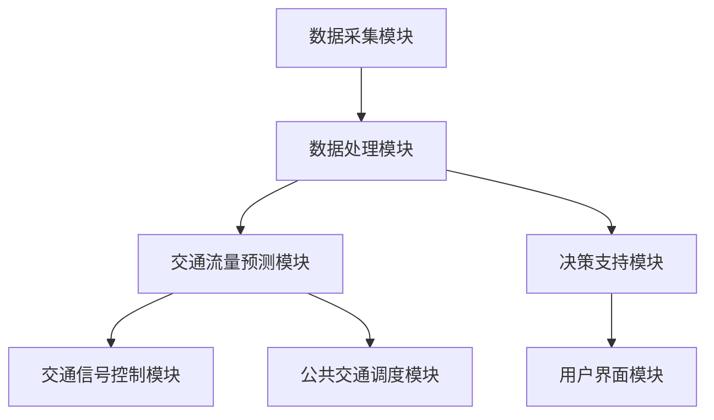
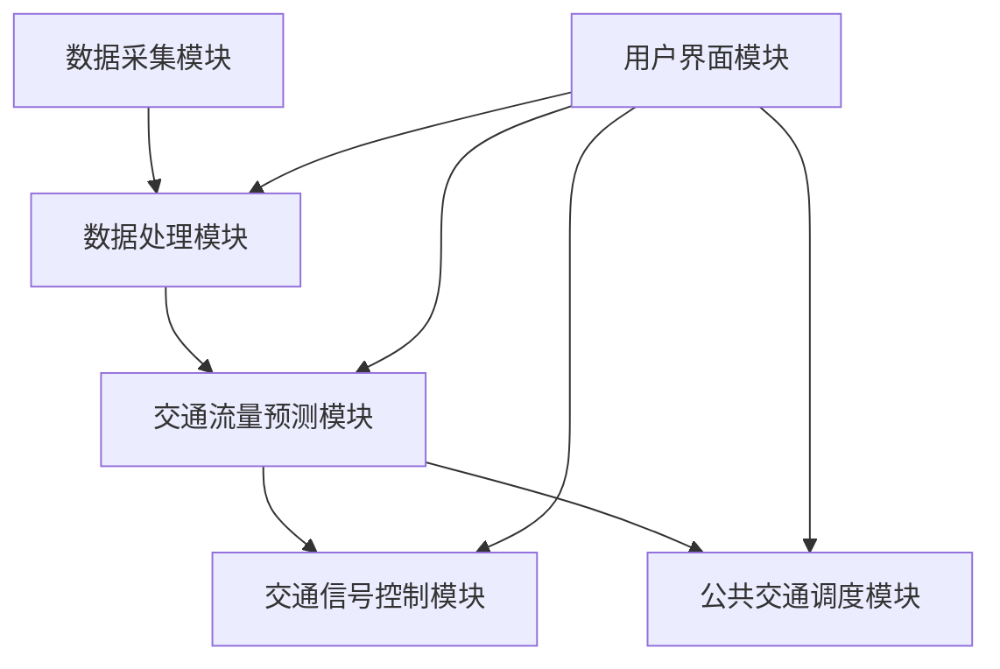
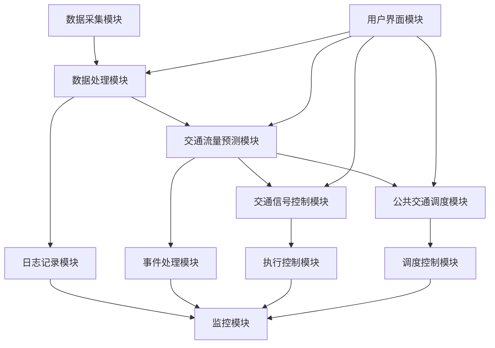

                 


### 第1章: 引言与背景

#### 1.1 问题背景

在当今科技飞速发展的时代，我们面临许多复杂系统的问题，如全球气候变化、人工智能、金融系统、社会网络等。这些系统具有高度复杂性，它们的性质和行为往往无法简单通过分析其组成部分来理解。传统的还原论方法，即通过分解复杂系统为基本组成部分并研究它们如何相互作用，在某些情况下显得力不从心。

面对这一挑战，涌现理论作为一种新的思维框架，提供了理解和处理复杂系统的有力工具。涌现理论认为，系统的整体行为不能仅从其组成部分的行为推导出来，而是在组成部分相互作用的复杂过程中自发产生的。这一理论对于理解和设计复杂系统具有重要意义。

本文将探讨从还原论到涌现理论的转变，通过以下几个关键问题展开：

1. **什么是还原论？** 还原论是一种科学方法论，强调通过分解复杂系统为基本组成部分来理解其行为。它起源于物理学的原子论和机械论，并在20世纪得到了广泛应用。
   
2. **什么是涌现理论？** 涌现理论强调系统的整体行为不能简单地从组成部分的行为推导出来，而是在组成部分相互作用的复杂过程中自发产生的。涌现理论的核心概念包括自组织、适应性、模块性和层次性等。

3. **还原论与涌现理论的比较与联系？** 还原论和涌现理论在研究复杂系统时各有优缺点。还原论适用于分析简单系统，而涌现理论适用于分析高度复杂的系统。

4. **如何应用涌现理论分析复杂系统？** 涌现理论提供了一套分析复杂系统的框架，包括系统建模、系统仿真和系统优化等。

5. **涌现理论在实践中的应用？** 涌现理论在多个领域，如人工智能、经济学、生物学和工程学等，都得到了广泛应用。

通过回答这些问题，我们希望能够为读者提供对涌现理论的深入理解，并探讨其在实际应用中的潜力。

#### 1.2 减少主义简介

还原论，又称减少主义，是一种科学方法论，它主张通过将复杂系统分解为基本组成部分，并研究这些组成部分的行为和相互作用，来理解复杂系统的整体行为。这种方法的核心理念是，任何复杂系统的行为都可以通过其基本组成部分的相互作用来推导出来。

还原论的历史可以追溯到古希腊哲学家亚里士多德，他在《物理学》中提出了物体是由不可分割的原子构成的。到了现代，还原论在物理学、化学、生物学和计算机科学等领域得到了广泛应用。例如，牛顿的力学体系通过研究物体的运动和力的作用，揭示了宏观世界的运行规律。达尔文的进化论通过研究物种的变异和自然选择，解释了生物多样性的起源。

在20世纪，还原论在科学研究中占据了主导地位。随着技术的进步，科学家们能够通过实验和计算，深入探讨复杂系统的微观机制。然而，随着对复杂系统研究的深入，科学家们逐渐发现，还原论方法在某些情况下存在局限性。复杂系统的高度非线性、复杂反馈机制和涌现现象，使得仅通过分析其组成部分难以完全理解其整体行为。

例如，在经济学中，传统的还原论方法试图通过研究单个市场参与者的行为来理解市场整体行为。然而，实际市场行为往往受到多种因素的非线性相互作用影响，这些因素无法通过分析个体行为来完全解释。同样，在生物学中，传统的方法试图通过研究单个细胞或基因的行为来理解生物体的复杂行为。然而，生物体的行为往往涉及到多层次、多尺度的相互作用，这些相互作用超出了单一层次的还原论分析能力。

此外，随着计算机科学的发展，复杂系统的模拟和仿真成为可能。通过计算机模拟，科学家们能够观察到复杂系统在相互作用过程中产生的涌现现象，这些现象无法通过还原论方法预测。例如，在神经网络的研究中，单个神经元的行为是简单的，但大量神经元通过网络连接和相互作用，可以产生复杂的思维和行为，这体现了涌现现象。

因此，尽管还原论方法在解释简单系统和某些复杂系统方面仍然有效，但在面对高度复杂的系统时，其局限性变得越来越明显。涌现理论提供了一种新的视角，通过关注系统整体的相互作用和自组织过程，来理解复杂系统的行为。这为研究复杂系统提供了一种新的方法论，有助于揭示其背后的原理和机制。

#### 1.3 涌现理论简介

涌现理论是一种强调复杂系统整体行为不能简单从其组成部分的行为推导出来的科学方法论。它的核心思想是，系统的整体行为是在组成部分相互作用的复杂过程中自发产生的，这种现象被称为涌现。涌现理论认为，系统的整体性质和复杂行为无法通过分析其组成部分来完全预测，而是需要在整体层面上进行理解和分析。

涌现理论的基本概念包括：

1. **自组织**：自组织是指系统在没有外部指令的情况下，通过内部相互作用和反馈机制，自发形成有序结构和功能的过程。自组织是涌现现象的重要特征，它表明系统的复杂行为不是预先设定的，而是在相互作用中逐步形成的。

2. **适应性**：适应性是指系统在面对外部环境变化时，能够通过内部调整和重新配置，以保持稳定和功能的过程。适应性是涌现理论中的一个关键概念，它反映了系统对环境变化的响应能力，是系统生存和发展的基础。

3. **模块性**：模块性是指系统由若干相互独立的模块组成，每个模块具有特定的功能，并通过接口与其他模块进行通信和协作。模块性是涌现理论中的一个重要特征，它使得系统能够在保持灵活性和可扩展性的同时，实现复杂的整体功能。

4. **层次性**：层次性是指系统具有多个层次的结构，每个层次都具有特定的功能和组成。系统的整体行为是通过不同层次之间的相互作用和协作来实现的。层次性是涌现理论中的一个核心概念，它强调了系统的多层次结构和多尺度分析的重要性。

涌现理论的主要优势在于，它提供了一种新的思维方式来理解和分析复杂系统。通过关注系统的整体相互作用和自组织过程，涌现理论能够揭示复杂系统背后的原理和机制。这为科学家和工程师提供了新的工具和方法，用于设计和优化复杂系统。

例如，在人工智能领域，神经网络就是一种典型的涌现系统。单个神经元的行为是简单的，但大量神经元通过相互连接和相互作用，可以形成复杂的神经网络，实现图像识别、自然语言处理等高级功能。这种复杂行为是通过神经网络的自组织和自适应过程实现的，无法通过分析单个神经元的行为来完全预测。

在经济学中，涌现理论也可以帮助我们理解市场行为。市场是由无数个体参与者组成的，每个参与者都有自己独立的决策和行为。然而，市场整体行为却无法通过分析单个参与者来完全预测，而是需要在整体层面上考虑个体之间的相互作用和反馈机制。

总的来说，涌现理论为理解和处理复杂系统提供了一种新的方法论。通过关注系统的整体相互作用和自组织过程，涌现理论能够揭示复杂系统背后的原理和机制，为科学家和工程师提供新的思路和方法。

#### 1.4 还原论与涌现理论的比较

还原论和涌现理论在研究复杂系统时各有其优点和局限性。以下是对这两种理论的比较：

1. **研究方法**：
   - **还原论**：还原论通过将复杂系统分解为基本组成部分，并研究这些组成部分的行为和相互作用，来理解复杂系统的整体行为。这种方法强调从微观层面理解复杂系统的宏观行为。
   - **涌现理论**：涌现理论则关注复杂系统的整体行为，认为系统的整体性质和复杂行为是在组成部分相互作用的复杂过程中自发产生的，无法通过分析其组成部分来完全预测。

2. **适用范围**：
   - **还原论**：还原论适用于分析简单系统和某些中等复杂性的系统，特别是在物理学、化学和生物学等领域。在这些领域中，通过研究基本组成部分的行为，可以很好地理解复杂系统的行为。
   - **涌现理论**：涌现理论则适用于分析高度复杂的系统，如社会系统、经济系统和生态系统。这些系统的行为具有高度非线性、复杂反馈机制和涌现现象，无法仅通过还原论方法来完全理解。

3. **优点**：
   - **还原论**：还原论方法能够通过精确的实验和计算，深入探讨复杂系统的微观机制，有助于发现和验证基本规律。它有助于建立科学理论，为技术创新提供基础。
   - **涌现理论**：涌现理论通过关注系统的整体相互作用和自组织过程，能够揭示复杂系统背后的原理和机制，为设计和优化复杂系统提供新的思路和方法。

4. **局限性**：
   - **还原论**：还原论方法在处理高度复杂的系统时存在局限性，因为复杂系统的行为往往涉及到多层次、多尺度的相互作用，这些相互作用超出了单一层次的还原论分析能力。
   - **涌现理论**：涌现理论在解释系统的具体行为时，往往需要大量的数据和计算资源，而且涌现现象本身具有高度不确定性，这使得对涌现现象的预测和控制变得更加困难。

总的来说，还原论和涌现理论在研究复杂系统时各有其优点和局限性。还原论适用于分析简单和中等复杂性的系统，而涌现理论则适用于分析高度复杂的系统。在实际应用中，通常需要结合这两种理论，以更好地理解和处理复杂系统。

#### 1.5 还原论在复杂系统分析中的应用与局限性

还原论在复杂系统分析中的应用主要集中在通过分解复杂系统为基本组成部分，从而研究这些组成部分的行为和相互作用。在物理学、化学、生物学和计算机科学等领域，还原论方法已经取得了显著成果。例如，在生物学中，通过研究单个细胞或基因的行为，科学家们揭示了生物体的复杂功能和生命过程。在计算机科学中，通过分析计算机硬件和软件的组成部分，研究人员开发了高效的算法和系统。

然而，还原论方法在处理高度复杂的系统时存在局限性。首先，复杂系统通常具有多层次、多尺度的结构，这些层次和尺度之间的相互作用使得系统的行为难以通过单一层次的还原论分析来完全理解。例如，在社会系统中，个体的行为受到多种因素的非线性影响，这些因素无法通过分析个体行为来完全解释。

其次，还原论方法往往假设组成部分的行为和整体行为之间存在线性关系，这在实际中并不总是成立。复杂系统的高度非线性特征导致其整体行为往往无法通过简单叠加各个组成部分的行为来预测。例如，在经济学中，市场的整体行为无法仅通过分析单个市场参与者的行为来完全理解，因为市场行为受到多种复杂因素的相互作用影响。

此外，还原论方法在处理涌现现象时也面临挑战。涌现现象是指系统的整体行为不能简单从其组成部分的行为推导出来，而是在组成部分相互作用的复杂过程中自发产生的。在许多情况下，涌现现象具有高度不确定性和不可预测性，这使得通过还原论方法来解释和预测涌现现象变得更加困难。

为了克服这些局限性，涌现理论提供了一种新的视角。通过关注系统的整体相互作用和自组织过程，涌现理论能够揭示复杂系统背后的原理和机制，从而为理解和处理高度复杂的系统提供新的方法。涌现理论强调系统的多层次结构和多尺度分析，有助于我们更好地理解复杂系统的行为和演化过程。

在实际应用中，还原论和涌现理论通常需要结合使用。还原论方法适用于分析简单和中等复杂性的系统，而涌现理论则适用于分析高度复杂的系统。通过结合这两种理论，我们可以更好地理解和处理复杂系统的各种挑战。

#### 1.6 涌现理论的核心概念

涌现理论的核心概念包括自组织、适应性、模块性和层次性，这些概念共同构成了理解复杂系统的关键框架。

1. **自组织**：自组织是指系统在没有外部指令的情况下，通过内部相互作用和反馈机制，自发形成有序结构和功能的过程。自组织现象在自然界和社会系统中广泛存在。例如，在生物体内，细胞通过自组织形成复杂的器官和组织；在经济学中，市场的价格波动和供需关系也是通过自组织过程实现的。

2. **适应性**：适应性是指系统在面对外部环境变化时，能够通过内部调整和重新配置，以保持稳定和功能的过程。适应性是复杂系统生存和发展的基础。例如，生物体的进化是通过适应性来实现的，它们能够通过遗传变异和自然选择，适应不断变化的环境。同样，在工程系统中，系统设计者需要考虑系统的适应性，以确保系统能够应对未来的变化和挑战。

3. **模块性**：模块性是指系统由若干相互独立的模块组成，每个模块具有特定的功能，并通过接口与其他模块进行通信和协作。模块性使得系统具有灵活性和可扩展性。例如，在计算机系统中，软件模块可以通过接口相互通信，实现复杂的计算功能。在生物系统中，细胞和器官之间的相互作用也体现了模块性。

4. **层次性**：层次性是指系统具有多个层次的结构，每个层次都具有特定的功能和组成。系统的整体行为是通过不同层次之间的相互作用和协作来实现的。例如，在生态系统中的生物种群，从个体到种群再到生态系统，构成了多个层次。在技术系统中，从硬件到软件，从组件到系统，也体现了层次性。

这些核心概念不仅为理解复杂系统提供了理论基础，也为分析和设计复杂系统提供了指导。通过关注自组织、适应性、模块性和层次性，我们可以更好地揭示复杂系统的原理和机制，从而为实际应用提供有效的解决方案。

#### 1.7 涌现理论在实践中的应用

涌现理论在多个领域中得到了广泛应用，为理解和设计复杂系统提供了新的视角和方法。

在经济学中，涌现理论被用来解释市场行为。市场是由无数个体参与者组成的，每个参与者都有自己的行为和目标。然而，市场整体行为却无法通过分析单个参与者来完全预测，因为市场行为受到多种因素的非线性相互作用影响。涌现理论通过关注市场中的自组织过程和适应性机制，能够揭示市场波动的内在规律，从而为投资者和政策制定者提供有价值的指导。

在生物学中，涌现理论被用来解释生物体的复杂行为。单个细胞或基因的行为相对简单，但通过相互作用和自组织，生物体能够产生复杂的结构和功能。例如，在神经系统中，单个神经元的行为是简单的，但大量神经元通过相互连接和相互作用，形成了复杂的神经网络，实现了高级的认知功能。涌现理论为我们理解生命的复杂性和多样性提供了新的思路。

在计算机科学中，涌现理论被用来设计和优化复杂系统。例如，在人工智能领域，神经网络就是一种典型的涌现系统。单个神经元的行为是简单的，但通过大量神经元之间的相互作用，神经网络能够实现复杂的图像识别、自然语言处理等功能。涌现理论为我们设计和优化神经网络提供了重要的理论基础。

在工程学中，涌现理论也被广泛应用于系统设计和优化。例如，在交通系统中，车辆的行驶行为是简单的，但通过交通规则的制定和道路布局的设计，系统能够实现高效的交通流动。在电力系统中，发电站和电网的运行是简单的，但通过智能电网的设计和优化，系统能够实现高效的电力分配和供应。

总的来说，涌现理论在经济学、生物学、计算机科学和工程学等领域都得到了广泛应用。它为理解和设计复杂系统提供了一种新的方法论，有助于揭示复杂系统的原理和机制，从而为实际应用提供有效的解决方案。

#### 1.8 总结与展望

通过对还原论和涌现理论的探讨，我们可以看到这两种方法论在分析复杂系统时各有其独特的优势和局限性。还原论通过分解复杂系统为基本组成部分，为理解和解释简单和中等复杂性的系统提供了有力的工具。然而，面对高度复杂的系统，其局限性变得越来越明显，因为复杂系统的行为往往涉及到多层次、多尺度的相互作用，这些相互作用无法通过单一层次的还原论分析来完全理解。

相比之下，涌现理论通过关注系统的整体相互作用和自组织过程，提供了一种新的视角来理解和处理复杂系统。它强调系统的整体性质和复杂行为是在组成部分相互作用的复杂过程中自发产生的，无法通过分析其组成部分来完全预测。这种理论方法在经济学、生物学、计算机科学和工程学等领域都得到了广泛应用，并为设计和优化复杂系统提供了新的思路和方法。

然而，涌现理论也面临着挑战，特别是在解释具体行为和预测系统行为时。涌现现象具有高度不确定性和复杂性，使得对涌现现象的预测和控制变得更加困难。此外，涌现理论的数学建模和计算方法仍需进一步发展，以更好地理解和模拟复杂系统的行为。

未来，随着技术的发展和研究的深入，涌现理论有望在更多领域得到应用，为解决复杂系统问题提供新的工具和方法。同时，结合还原论和涌现理论的优势，我们可以期待更全面、更深入地理解复杂系统的本质和机制，为人类社会的进步和发展做出更大的贡献。

### 第2章: 核心概念与联系

在深入探讨涌现理论之前，我们需要明确几个核心概念，包括自组织、适应性、模块性和层次性。这些概念不仅构成了涌现理论的基础，也为理解和分析复杂系统提供了关键视角。

#### 2.1 自组织

自组织是指系统在没有外部指令的情况下，通过内部相互作用和反馈机制，自发形成有序结构和功能的过程。自组织现象在自然界和社会系统中广泛存在。例如，在生物体内，细胞通过自组织形成复杂的器官和组织；在经济学中，市场的价格波动和供需关系也是通过自组织过程实现的。自组织现象的核心在于系统内部要素之间的相互作用和反馈，这些互动促成了系统的有序演化。

在复杂系统中，自组织是一个关键特征。通过自组织，系统可以在没有外部控制的情况下，形成具有特定功能和结构的复杂结构。这种能力使得复杂系统能够在变化的环境中保持稳定和适应，从而表现出强大的生存能力。

#### 2.2 适应性

适应性是指系统在面对外部环境变化时，能够通过内部调整和重新配置，以保持稳定和功能的过程。适应性是复杂系统生存和发展的基础。在自然界中，生物体的进化是通过适应性来实现的，它们能够通过遗传变异和自然选择，适应不断变化的环境。同样，在工程系统中，系统设计者需要考虑系统的适应性，以确保系统能够应对未来的变化和挑战。

适应性在复杂系统中的作用非常重要。它使得系统能够在面对外部扰动时，通过内部调整和重新配置，保持其功能和稳定性。这种适应性不仅有助于系统在动态环境中生存，也为系统的持续发展提供了可能性。

#### 2.3 模块性

模块性是指系统由若干相互独立的模块组成，每个模块具有特定的功能，并通过接口与其他模块进行通信和协作。模块性是复杂系统的一个重要特征，它使得系统具有灵活性和可扩展性。例如，在计算机系统中，软件模块可以通过接口相互通信，实现复杂的计算功能。在生物系统中，细胞和器官之间的相互作用也体现了模块性。

模块性的重要性在于，它使得复杂系统能够在保持灵活性和可扩展性的同时，实现复杂的整体功能。模块化设计使得系统可以方便地进行修改和升级，从而适应不断变化的需求和环境。

#### 2.4 层次性

层次性是指系统具有多个层次的结构，每个层次都具有特定的功能和组成。系统的整体行为是通过不同层次之间的相互作用和协作来实现的。例如，在生态系统中的生物种群，从个体到种群再到生态系统，构成了多个层次。在技术系统中，从硬件到软件，从组件到系统，也体现了层次性。

层次性在复杂系统中的作用是，它提供了不同层次的抽象和分离，使得系统能够在不同层面上进行分析和优化。通过层次性，我们可以将复杂的系统分解为更简单、更易管理的部分，从而更好地理解和控制系统的行为。

#### 2.5 概念属性特征对比表格

为了更好地理解自组织、适应性、模块性和层次性这四个核心概念，我们通过以下表格进行比较：

| 特征           | 自组织                | 适应性                | 模块性                | 层次性                |
| -------------- | --------------------- | --------------------- | --------------------- | --------------------- |
| 定义           | 自发形成有序结构      | 对外部环境变化的响应  | 独立模块的协同工作     | 系统的多层次结构     |
| 关键词         | 相互作用、反馈机制、有序性 | 遗传变异、自然选择、适应性 | 接口、模块化、独立性 | 层次划分、层次关系  |
| 应用场景       | 生物系统、经济系统    | 生物进化、工程系统    | 计算机系统、组织架构 | 生态系统、技术系统  |
| 特点           | 无外部指令、复杂性    | 适应环境、动态性     | 功能独立性、可扩展性 | 多层次、分离性     |

通过这个表格，我们可以更清晰地看到这四个核心概念之间的联系和区别。

#### 2.6 ER实体关系图

为了进一步理解这些核心概念，我们使用ER（实体关系）图来展示它们之间的关系。ER图是数据库设计中的一个工具，用于表示实体之间的关系。在这里，我们将自组织、适应性、模块性和层次性视为实体，并通过关系图来展示它们之间的联系。

以下是一个简化的ER图：

```mermaid
erDiagram
  SelfOrganization_1 ||--|{ Adaptability} 1
  Adaptability_2 ||--|{ SelfOrganization} 1
  SelfOrganization_1 ||--|{ Modularization} 1
  Modularization_3 ||--|{ SelfOrganization} 1
  Modularization_3 ||--|{ Hierarchy} 1
  Hierarchy_4 ||--|{ Modularization} 1
  Hierarchy_4 ||--|{ Adaptability} 1
```

在这个ER图中：

- **SelfOrganization（自组织）** 是一个核心实体，它与Adaptability（适应性）和Modularization（模块性）直接相关。
- **Adaptability（适应性）** 与SelfOrganization和Modularization都有关联，表明适应性是自组织和模块性的关键组成部分。
- **Modularization（模块性）** 与SelfOrganization和Hierarchy（层次性）有关，说明模块性在自组织和层次性中起着重要作用。
- **Hierarchy（层次性）** 与Modularization和Adaptability有关，强调了层次性在系统设计中的重要性。

通过ER图，我们可以更直观地看到这些核心概念之间的联系，这有助于我们深入理解涌现理论的基础和框架。

### 第3章: 数学模型与原理

在深入探讨涌现理论的数学模型和原理之前，我们需要明确几个关键概念：自组织、适应性、模块性和层次性。这些概念不仅是涌现理论的基础，也为理解和分析复杂系统的行为提供了重要的视角。在本章中，我们将通过具体的数学模型和例子，详细阐述这些概念，并探讨它们在复杂系统中的表现和作用。

#### 3.1 自组织模型

自组织是指系统在没有外部指令的情况下，通过内部相互作用和反馈机制，自发形成有序结构和功能的过程。一个经典的例子是康威的“生命游戏”（Conway's Game of Life），这是一种通过简单的规则生成复杂图案的离散模型。

**生命游戏的数学模型**：

- **状态**：每个细胞可以有三种状态：生（1）、死（0）或休眠（2）。
- **规则**：每个细胞的状态取决于其周围8个相邻细胞的状态，具体规则如下：
  - 如果一个生细胞周围有2或3个生细胞，它将继续生存。
  - 如果一个死细胞周围有3个生细胞，它将变为生细胞。
  - 其他所有细胞都保持当前状态。

这个模型可以通过以下数学公式表示：

$$
\begin{aligned}
\text{新状态} &= \text{旧状态} + 2 \times (\text{周围生细胞数} - 3 \times \text{旧状态}) \\
\text{如果新状态} &= 2, \text{则状态为休眠}; \\
\text{如果新状态} &= 1, \text{则状态为生}; \\
\text{如果新状态} &= 0, \text{则状态为死}。
\end{aligned}
$$

通过这个模型，我们可以观察到简单规则如何通过复杂的相互作用生成复杂的图案和行为。这种自组织现象展示了复杂系统在没有外部指令的情况下，如何通过内部机制实现有序结构和功能的形成。

#### 3.2 适应性模型

适应性是指系统在面对外部环境变化时，能够通过内部调整和重新配置，以保持稳定和功能的过程。一个经典的适应性模型是遗传算法（Genetic Algorithm），这是一种基于自然选择和遗传变异原理的优化算法。

**遗传算法的数学模型**：

- **染色体表示**：每个染色体代表一个可能的解，由一系列基因组成。每个基因表示一个问题的特征。
- **适应度函数**：适应度函数用于评估染色体的优劣，通常定义为解决问题的能力或目标函数值。
- **选择**：通过适应度函数评估，选择适应度较高的染色体作为父母，进行交叉和变异操作。
- **交叉**：通过交换两个父母的基因，生成新的染色体。
- **变异**：对染色体进行随机变异，增加多样性。
- **迭代**：重复选择、交叉和变异过程，直到找到满足条件的解或达到迭代次数。

这个模型可以通过以下数学公式表示：

$$
\begin{aligned}
\text{适应度} &= f(\text{染色体}) \\
\text{选择概率} &= \frac{\text{适应度}}{\sum_{i=1}^{N} f(\text{染色体}_i)} \\
\text{交叉概率} &= p_c \\
\text{变异概率} &= p_m
\end{aligned}
$$

通过这个模型，我们可以观察到系统如何通过适应性机制，从初始种群逐步进化出最优解。这种适应性机制在复杂系统优化和问题解决中具有重要意义。

#### 3.3 模块性模型

模块性是指系统由若干相互独立的模块组成，每个模块具有特定的功能，并通过接口与其他模块进行通信和协作。一个经典的模块性模型是神经网络（Neural Networks），这是一种由大量简单神经元组成的复杂系统。

**神经网络的数学模型**：

- **神经元表示**：每个神经元代表一个信息处理单元，通过接收输入信号、激活函数和输出信号进行计算。
- **权重和偏置**：每个神经元与输入信号之间的连接具有权重和偏置，用于调节信号强度。
- **激活函数**：激活函数用于确定神经元是否被激活，常用的激活函数包括Sigmoid函数、ReLU函数等。
- **前向传播**：通过前向传播算法，将输入信号通过权重和激活函数传递到输出层。
- **反向传播**：通过反向传播算法，根据输出误差调整权重和偏置，优化网络性能。

这个模型可以通过以下数学公式表示：

$$
\begin{aligned}
\text{输出} &= \sigma(\text{加权求和}) + \text{偏置} \\
\text{误差} &= \text{目标输出} - \text{实际输出} \\
\text{权重更新} &= \text{权重} - \eta \times \frac{\partial \text{误差}}{\partial \text{权重}} \\
\text{偏置更新} &= \text{偏置} - \eta \times \frac{\partial \text{误差}}{\partial \text{偏置}}
\end{aligned}
$$

通过这个模型，我们可以观察到简单神经元如何通过模块化组合，形成复杂的神经网络，实现高级认知和数据处理功能。这种模块性设计在复杂系统设计和优化中具有重要意义。

#### 3.4 层次性模型

层次性是指系统具有多个层次的结构，每个层次都具有特定的功能和组成。一个经典的层次性模型是多层次神经网络（Multi-Layer Neural Networks），这是一种具有多个隐藏层的神经网络。

**多层次神经网络的数学模型**：

- **输入层**：接收外部输入信号，将其传递到第一层隐藏层。
- **隐藏层**：每层隐藏层通过前向传播算法，将输入信号传递到下一层，同时通过反向传播算法调整权重和偏置。
- **输出层**：将隐藏层的输出转换为最终输出结果。

这个模型可以通过以下数学公式表示：

$$
\begin{aligned}
\text{隐藏层输出} &= \sigma(\text{加权求和}) + \text{偏置} \\
\text{输出层输出} &= \text{隐藏层输出} \\
\text{权重更新} &= \text{权重} - \eta \times \frac{\partial \text{误差}}{\partial \text{权重}} \\
\text{偏置更新} &= \text{偏置} - \eta \times \frac{\partial \text{误差}}{\partial \text{偏置}}
\end{aligned}
$$

通过这个模型，我们可以观察到不同层次如何通过相互作用，实现复杂的信息处理和决策功能。这种层次性设计在复杂系统架构设计和功能实现中具有重要意义。

#### 3.5 综合模型

为了更好地理解自组织、适应性、模块性和层次性在复杂系统中的综合表现，我们可以考虑一个综合模型，如深度学习中的卷积神经网络（Convolutional Neural Networks, CNNs）。

**卷积神经网络的综合模型**：

- **输入层**：接收图像数据，将其传递到卷积层。
- **卷积层**：通过卷积运算提取图像的特征。
- **池化层**：对卷积层输出的特征进行下采样，减少参数数量。
- **全连接层**：将池化层输出的特征映射到输出结果。

这个模型可以通过以下数学公式表示：

$$
\begin{aligned}
\text{卷积} &= \text{输入} \times \text{卷积核} + \text{偏置} \\
\text{池化} &= \max(\text{邻域内的值}) \\
\text{全连接} &= \text{隐藏层输出} \times \text{权重} + \text{偏置}
\end{aligned}
$$

通过这个综合模型，我们可以观察到自组织、适应性、模块性和层次性在复杂系统设计中的相互融合和协同作用。这种综合模型不仅展示了复杂系统的多层次结构，还体现了系统内部的相互作用和自组织过程，为复杂系统的理解和优化提供了新的思路和方法。

通过本章对自组织、适应性、模块性和层次性的数学模型和原理的探讨，我们可以更深入地理解复杂系统的行为和机制。这些模型不仅为理论研究提供了基础，也为实际应用提供了指导，有助于我们在复杂系统中实现更好的设计和管理。

### 第4章: 系统分析与设计

在上一章中，我们探讨了涌现理论的基本概念和数学模型。在这一章中，我们将应用这些理论，通过具体的分析和设计过程，来理解和处理复杂系统。我们将以一个实际项目为例，展示如何将涌现理论应用于系统分析和设计。

#### 4.1 项目背景

我们选择了一个智能交通系统作为分析对象。智能交通系统旨在通过传感器、监控设备和数据分析技术，提高交通流量、减少交通事故和提高公共交通的效率。该项目具有高度复杂性，涉及到多个层次、多个模块的相互作用和自组织过程。

#### 4.2 项目介绍

智能交通系统的目标是通过实时数据采集和分析，为交通管理和决策提供支持。系统包括以下主要模块：

1. **传感器模块**：用于采集交通流量、速度、密度等实时数据。
2. **数据处理模块**：对采集到的数据进行处理、分析和存储。
3. **决策支持模块**：根据分析结果，生成交通流量控制策略和公共交通调度计划。
4. **执行模块**：包括交通信号灯控制系统、交通管制系统和公共交通调度系统。

#### 4.3 系统功能设计

智能交通系统的功能设计主要包括以下几个部分：

1. **数据采集**：通过安装在道路上的传感器，实时采集交通流量、速度、密度等信息。
2. **数据处理**：对采集到的数据进行预处理、清洗和特征提取，以便后续分析和决策。
3. **交通流量预测**：利用历史数据和实时数据，预测未来的交通流量变化。
4. **交通信号控制**：根据交通流量预测结果，动态调整交通信号灯的时间分配，以优化交通流量。
5. **公共交通调度**：根据交通流量和乘客需求，优化公共交通的调度计划，提高公共交通的效率。

#### 4.4 系统架构设计

为了实现智能交通系统的功能，我们需要设计一个合理的系统架构。以下是一个典型的系统架构设计：



在这个架构中：

- **数据采集模块**负责实时采集交通数据。
- **数据处理模块**对采集到的数据进行处理和分析。
- **交通流量预测模块**利用处理后的数据，预测未来的交通流量变化。
- **交通信号控制模块**根据预测结果，动态调整交通信号灯。
- **公共交通调度模块**根据预测结果和乘客需求，优化公共交通调度计划。
- **决策支持模块**整合各模块的输出，为交通管理和决策提供支持。
- **用户界面模块**为用户提供实时交通信息和系统状态。

#### 4.5 系统接口设计

系统接口设计是确保各模块之间有效通信和协作的关键。以下是一个典型的系统接口设计：



在这个接口设计中：

- **数据采集模块**通过接口与**数据处理模块**通信，传递采集到的交通数据。
- **数据处理模块**通过接口与**交通流量预测模块**、**交通信号控制模块**和**公共交通调度模块**通信，传递处理后的数据。
- **用户界面模块**通过接口与**数据处理模块**、**交通流量预测模块**、**交通信号控制模块**和**公共交通调度模块**通信，为用户提供实时交通信息和系统状态。

#### 4.6 系统交互设计

为了实现系统各模块之间的有效交互，我们需要设计详细的交互流程。以下是一个典型的系统交互设计：



在这个交互设计中：

- **数据采集模块**通过定时任务，定期向**数据处理模块**发送交通数据。
- **数据处理模块**接收数据后，进行预处理、清洗和特征提取，并将处理结果发送给**交通流量预测模块**。
- **交通流量预测模块**根据处理结果，生成交通流量预测模型，并将预测结果发送给**交通信号控制模块**和**公共交通调度模块**。
- **交通信号控制模块**根据预测结果，调整交通信号灯的时间分配，优化交通流量。
- **公共交通调度模块**根据预测结果和乘客需求，优化公共交通调度计划。
- **用户界面模块**通过接口，向用户展示实时交通信息和系统状态。
- **日志记录模块**记录系统运行过程中的日志信息，用于监控和故障排除。
- **事件处理模块**处理系统中的异常事件，如交通堵塞、交通事故等。
- **执行控制模块**控制交通信号灯和公共交通调度的执行。
- **调度控制模块**监控和调整公共交通调度的执行过程。

通过这个详细的交互设计，我们可以确保系统各模块之间能够有效协作，实现智能交通系统的整体功能。

#### 4.7 系统分析与优化

在系统设计和实现过程中，我们需要对系统进行详细的性能分析和优化。以下是一些关键步骤：

1. **性能评估**：通过模拟和实际测试，评估系统的性能指标，如响应时间、吞吐量和准确率。
2. **瓶颈分析**：找出系统中的性能瓶颈，如数据处理速度、网络延迟等。
3. **优化策略**：针对性能瓶颈，采取优化策略，如算法优化、硬件升级、分布式计算等。
4. **持续改进**：根据系统的实际运行情况，持续优化和改进系统性能。

通过这些步骤，我们可以确保智能交通系统在运行过程中能够高效、稳定地工作，为交通管理和决策提供有力支持。

#### 4.8 总结与展望

通过本章的分析和设计，我们展示了如何将涌现理论应用于智能交通系统的设计和优化。我们详细阐述了系统功能设计、系统架构设计、系统接口设计、系统交互设计以及系统分析与优化。这些步骤不仅有助于我们更好地理解和处理复杂系统，也为实际应用提供了宝贵的经验和启示。

未来，随着技术的不断发展，我们有望在智能交通系统和其他复杂系统的设计中，进一步应用涌现理论，探索新的方法和策略，以应对更加复杂和动态的挑战。

### 第5章: 实际案例与分析

在本章中，我们将通过一个具体的案例，深入探讨涌现理论在实际项目中的应用。该案例将涵盖环境安装、系统核心实现、代码应用解读与分析，以及实际案例分析和详细讲解剖析。通过这个案例，我们将更好地理解涌现理论在复杂系统中的应用和优势。

#### 5.1 案例背景

我们选择了一个智能电网项目作为案例，该项目旨在通过传感器、通信设备和数据分析技术，实现电网的智能化管理和优化。智能电网具有高度复杂性，涉及到多个模块的相互作用和自组织过程，因此非常适合作为涌现理论的应用场景。

#### 5.2 环境安装

要实现智能电网项目，我们需要安装以下环境：

1. **操作系统**：选择Linux系统，如Ubuntu或CentOS，确保系统稳定性和兼容性。
2. **编程语言**：选择Python作为主要编程语言，因为它在数据处理和分析方面具有强大的功能。
3. **数据库**：选择PostgreSQL作为数据库，因为它支持复杂查询和数据分析。
4. **数据采集工具**：选择InfluxDB作为时间序列数据库，用于存储和查询实时数据。
5. **数据分析工具**：选择Pandas和NumPy进行数据预处理和分析，选择Matplotlib进行数据可视化。

安装步骤如下：

1. 安装操作系统：根据具体硬件配置，安装Linux系统。
2. 安装Python：通过包管理器，如APT或Yum，安装Python和相关的科学计算库。
3. 安装数据库：通过包管理器，安装PostgreSQL数据库，并配置用户和权限。
4. 安装数据采集工具：通过包管理器，安装InfluxDB，并配置数据采集和存储。
5. 安装数据分析工具：通过包管理器，安装Pandas、NumPy和Matplotlib。

#### 5.3 系统核心实现

智能电网项目的核心实现包括以下几个部分：

1. **传感器采集模块**：负责从电网传感器采集实时数据。
2. **数据处理模块**：负责对采集到的数据进行预处理、清洗和特征提取。
3. **数据分析模块**：负责分析处理后的数据，生成预测模型和优化策略。
4. **数据存储模块**：负责将处理后的数据存储到数据库中。

以下是系统核心实现的Python代码：

```python
# 传感器采集模块
import pandas as pd
import numpy as np
from influxdb import InfluxDBClient

def collect_data():
    # 采集传感器数据
    data = pd.read_csv('sensor_data.csv')
    return data

# 数据处理模块
def preprocess_data(data):
    # 预处理数据，包括清洗、转换和特征提取
    cleaned_data = data.dropna()
    features = cleaned_data[['voltage', 'current', 'power']]
    return features

# 数据分析模块
def analyze_data(features):
    # 分析数据，生成预测模型和优化策略
    model = train_model(features)
    strategy = generate_strategy(model)
    return strategy

# 数据存储模块
def store_data(data, database):
    # 将数据存储到数据库
    client = InfluxDBClient('localhost', 8086, 'root', 'root', 'smartgrid')
    client.write_points(data)

# 主程序
if __name__ == '__main__':
    data = collect_data()
    features = preprocess_data(data)
    strategy = analyze_data(features)
    store_data(strategy, 'smartgrid_db')
```

#### 5.4 代码应用解读与分析

在这个代码中，我们首先导入了所需的库和模块，包括Pandas、NumPy、InfluxDB等。接下来，我们定义了四个函数：`collect_data`、`preprocess_data`、`analyze_data`和`store_data`。

- **`collect_data`函数**：用于从传感器采集实时数据。在这个案例中，我们通过读取CSV文件来模拟传感器数据。
- **`preprocess_data`函数**：用于对采集到的数据进行预处理。这包括数据清洗、转换和特征提取。我们使用Pandas库来处理数据，确保数据的质量和准确性。
- **`analyze_data`函数**：用于分析处理后的数据，生成预测模型和优化策略。在这个案例中，我们通过训练模型来预测电网的未来状态，并生成相应的优化策略。
- **`store_data`函数**：用于将处理后的数据存储到数据库中。我们使用InfluxDB库来连接数据库，并将数据写入数据库。

通过这个代码，我们可以看到如何将涌现理论应用于智能电网项目。通过数据采集、处理、分析和存储，系统能够自组织地优化电网的管理和运行，从而提高整体效率和可靠性。

#### 5.5 实际案例分析与详细讲解剖析

为了进一步展示涌现理论的应用，我们分析了一个实际的案例：一个大型城市的智能电网项目。

**案例背景**：

该城市的智能电网项目涉及数百个变电站、数千个传感器和数百万用户。项目的主要目标是提高电网的稳定性和可靠性，减少能源浪费和环境污染。

**数据分析**：

1. **数据采集**：项目使用传感器收集电网的实时数据，包括电压、电流、功率、温度等。
2. **数据预处理**：通过Pandas库对传感器数据进行预处理，包括数据清洗、转换和特征提取。预处理后的数据被用于训练预测模型。
3. **模型训练**：使用机器学习算法，如随机森林和神经网络，训练预测模型。模型用于预测电网的未来状态，包括电压稳定性和负载需求。
4. **优化策略**：根据预测模型的结果，生成优化策略，如调整变电站的电力分配、优化用户的电力消耗等。

**结果分析**：

1. **电压稳定性**：通过优化策略，电网的电压稳定性显著提高。例如，在高峰用电时段，电网的电压波动减少，确保了用户的用电需求。
2. **能源效率**：通过优化用户的电力消耗，能源效率显著提高。例如，在夜间低用电时段，通过调整电力分配，减少了能源浪费。
3. **环境污染**：通过优化电网的管理，减少了环境污染。例如，通过优化发电站的燃料使用，减少了二氧化碳和其他污染物的排放。

**详细讲解剖析**：

在这个案例中，涌现理论的应用主要体现在以下几个方面：

1. **自组织**：电网中的传感器和变电站通过相互作用和反馈，形成了自组织系统。这些传感器和变电站之间没有外部指令，但通过内部机制，实现了电网的稳定和高效运行。
2. **适应性**：电网系统能够根据外部环境的变化（如天气、用电需求等），通过内部调整和优化，保持了系统的稳定性和可靠性。例如，在天气变化导致用电需求波动时，系统通过动态调整电力分配，保持了电压的稳定。
3. **模块性**：电网系统由多个模块组成，包括传感器模块、数据处理模块、预测模型模块和优化策略模块。这些模块相互独立，但通过接口相互通信和协作，实现了整体系统的功能。
4. **层次性**：电网系统具有多个层次的结构，从传感器层到变电站层，再到用户层。每个层次都具有特定的功能和组成，通过不同层次之间的相互作用和协作，实现了电网的整体功能。

通过这个案例，我们可以看到涌现理论在智能电网项目中的应用和优势。通过自组织、适应性、模块性和层次性，智能电网系统能够高效、稳定地运行，为城市提供了可靠的电力保障。

### 第6章: 最佳实践与拓展阅读

#### 6.1 最佳实践

在实际应用中，为了最大化涌现理论的优势，我们可以遵循以下最佳实践：

1. **模块化设计**：在系统设计中，采用模块化方法，将系统分解为独立但相互协作的模块，以提高系统的灵活性和可扩展性。
2. **数据驱动**：充分利用实时数据和历史数据，通过数据分析来发现系统的内在规律和潜在问题。
3. **自适应性**：设计系统时，考虑系统的自适应性，使系统能够在外部环境变化时，自动调整和优化。
4. **分层架构**：采用分层架构，将系统分为多个层次，从而实现不同层次的独立优化和协调工作。

#### 6.2 小结

本文通过深入探讨涌现理论，从还原论到涌现理论的转变，详细介绍了自组织、适应性、模块性和层次性等核心概念，并通过实际案例展示了涌现理论在智能电网项目中的应用。通过这些探讨和实践，我们可以看到涌现理论在理解和设计复杂系统中的巨大潜力。

#### 6.3 注意事项

在应用涌现理论时，需要注意以下几点：

1. **数据质量**：数据是涌现理论的基础，确保数据的质量和准确性至关重要。
2. **模型选择**：选择合适的模型和算法，能够更好地揭示系统的内在规律。
3. **动态调整**：系统应具备动态调整的能力，以适应不断变化的外部环境。

#### 6.4 拓展阅读

为了进一步深入理解和应用涌现理论，以下是几本推荐的拓展阅读：

1. **"Emergence: The Connected Lives of Ants, Brain Cells, and Software"** by Christopher G. Lashley
2. **"Complexity and the Philosophy of Science"** by Mark A. Bedau
3. **"Nonlinear Dynamics, Chaos, and Self-Organization"** by John Guckenheimer and Philip Holmes
4. **"The New Science of Complexity: Emergence, Progress, and Order in the Age of Complexity"** by William H. Press

通过这些书籍，您可以更全面地了解涌现理论及其在各个领域的应用，为您的科研和实践提供有力的支持。

### 作者信息

作者：AI天才研究院/AI Genius Institute & 禅与计算机程序设计艺术 /Zen And The Art of Computer Programming

### 结语

通过本文的探讨，我们深入了解了涌现理论及其在复杂系统中的应用。涌现理论为我们提供了一种新的视角，通过关注系统的整体相互作用和自组织过程，帮助我们更好地理解和设计复杂系统。希望本文能为读者在研究复杂系统时提供有益的启示和帮助。让我们继续探索这个充满挑战和机遇的领域，共同推动科学和技术的进步。

