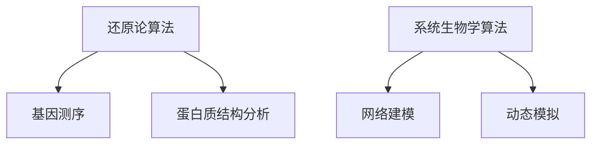

                 

## # 前言与背景介绍

在当今科技迅速发展的时代，我们面临着前所未有的挑战和机遇。生命科学的进步，特别是生态系统的复杂性，推动了我们对自然界的基本理解方式发生了深刻的变化。传统上，生命科学的研究方法主要依赖于还原论，即将复杂的生物系统分解为更简单的组成部分进行研究。然而，这种方法在应对复杂生态系统时显得力不从心。

### **问题背景**

生命科学的一个关键挑战在于理解生物系统中各个组成部分如何相互作用，形成复杂的生命现象。还原论虽然能揭示生物分子层面的运作机制，但它往往忽略了系统内部的复杂关系和整体效应。这使得在处理宏观生态系统问题时，我们面临信息不完备、因果关系复杂等问题。

### **问题描述**

现代生物学和生态学领域面临的一个核心问题是如何整合不同的层次和类型的数据，构建出一个全面的、动态的生态系统模型。这需要我们超越单一层次的还原性分析，转向系统生物学的整合性理解。

### **问题解决**

系统生物学作为一种新的理解生命与生态系统的方法，强调系统内各个组件的相互作用和整体性。它通过定量分析和计算机模拟，将生态系统视为一个动态的、相互依赖的网络，帮助我们更好地理解生态系统的运行机制。

### **边界与外延**

系统生物学不仅限于生物学领域，它还与计算机科学、数学、物理学等多个学科交叉融合，形成了一个多学科交叉的研究领域。这种跨学科的方法为我们提供了新的视角和工具，有助于解决复杂生态系统的难题。

### **概念结构与核心要素组成**

本文将分为以下几个部分来探讨系统生物学的重要性：

1. **还原论概述**：介绍还原论的基本概念、历史背景和核心思想。
2. **系统生物学的兴起**：探讨系统生物学的定义、特点、发展历程及其应用领域。
3. **还原论与系统生物学的比较**：对比还原论与系统生物学的核心概念和算法原理。
4. **整合性理解生命与生态系统**：讨论整合性生物学的定义、方法及其应用挑战。
5. **系统生物学在生态系统研究中的应用**：分析系统生物学在生态系统研究中的重要性及其应用案例。
6. **整合性理解生命与生态系统的未来展望**：展望整合性理解生命与生态系统的未来发展趋势和研究方向。
7. **总结与展望**：总结文章的核心内容，并展望未来的研究方向。

通过本文的探讨，我们希望读者能够对系统生物学有一个更加全面和深入的理解，并认识到它在解决复杂生态学问题中的巨大潜力。

## # 第1章：还原论概述

### **1.1 还原论的基本概念**

还原论（Reductionism）是一种哲学和科学研究方法，它主张复杂现象可以通过研究其组成部分来理解。在科学领域，还原论意味着将复杂的系统分解为更简单的组成部分，并研究这些组成部分的属性和行为。还原论的核心思想是：通过深入理解基本元素，我们可以逐步构建对复杂系统的全面理解。

在生物学中，还原论得到了广泛的应用。从分子生物学到细胞生物学，再到发育生物学，科学家们通过研究基因、蛋白质、细胞等基本单位，揭示了生命的基本运作机制。这种方法有助于我们理解生物体的结构和功能，推动了生物科学的发展。

### **1.2 还原论的历史背景**

还原论的思想可以追溯到古希腊哲学家亚里士多德。他认为，通过研究事物的本质，我们可以逐步揭示世界的奥秘。在科学革命时期，伽利略和牛顿等科学家通过实验和观察，将还原论方法应用于物理学，奠定了现代科学的基础。

在19世纪，生物学家如查尔斯·达尔文和托马斯·亨特等人，通过研究生物体的微观结构，进一步发展了还原论方法。达尔文的自然选择理论和亨特的细胞学说，都是还原论思想的经典应用。

### **1.3 还原论的核心思想**

还原论的核心思想是分解与组合。首先，将复杂系统分解为更简单的部分，然后研究这些部分在特定条件下的行为。接着，通过将这些部分的行为重新组合，构建对整体系统的理解。

在生物学中，这种思想体现在对生命现象的微观分析。例如，通过研究基因的功能，我们可以理解基因如何在细胞中表达，并最终影响生物体的性状。同样，通过分析细胞的结构和功能，我们可以了解细胞如何组成组织和器官。

### **还原论在生物学中的贡献**

还原论为生物学研究提供了强有力的工具。它帮助我们理解了生物体的基本构成和运作机制，推动了基因工程、蛋白质组学和代谢组学等领域的发展。

### **还原论的局限性**

尽管还原论在揭示生物体的微观机制方面取得了显著成果，但它也面临一些局限性。首先，还原论往往忽略了系统内部的复杂关系和整体效应。生物系统中的各个组成部分并不是独立运作的，它们之间存在复杂的相互作用。其次，还原论方法在处理宏观生态系统时显得力不从心。

### **总结**

还原论作为一种科学研究方法，在生物学中发挥了重要作用。然而，随着科学的发展，我们意识到需要一种更全面、更整合的方法来理解生命和生态系统。下一章，我们将探讨系统生物学如何应对这些挑战。

## # 第2章：系统生物学的兴起

### **2.1 系统生物学的定义与特点**

系统生物学（Systems Biology）是一种整合性的生物学研究方法，旨在理解生物系统的结构和动态行为。与传统方法不同，系统生物学不仅关注单个分子或细胞，而是将生物系统视为一个相互作用的整体。

系统生物学的基本特点包括：

1. **整体性**：系统生物学强调生物系统的整体性，认为生物系统的行为和功能取决于各个组成部分的相互作用。
2. **定量性**：系统生物学通过数学建模和计算模拟，定量地描述生物系统的动态行为。
3. **跨学科性**：系统生物学融合了生物学、物理学、计算机科学、数学等多个学科的知识，形成了一个多学科交叉的研究领域。

### **2.2 系统生物学的核心特点**

系统生物学的核心特点在于其方法论的变革。首先，系统生物学采用定量方法，通过实验数据和计算模拟，建立生物系统的数学模型。这些模型可以预测生物系统的行为，帮助科学家理解复杂的生物现象。

其次，系统生物学强调实验与理论的结合。通过实验获取数据，并通过理论分析来解释这些数据。这种方法有助于从整体上理解生物系统的运行机制。

### **2.3 系统生物学的应用领域**

系统生物学在多个生物研究领域取得了重要进展，主要包括：

1. **细胞生物学**：系统生物学帮助科学家理解细胞内的信号传导途径和基因调控网络。
2. **发育生物学**：通过研究发育过程中的基因调控网络，系统生物学揭示了生物体发育的动态机制。
3. **疾病研究**：系统生物学方法被用于揭示疾病的分子机制，为疾病诊断和治疗提供了新的思路。
4. **生态学**：系统生物学在生态学中的应用，帮助科学家理解生态系统的结构和功能。

### **2.4 系统生物学的发展历程**

系统生物学的发展历程可以分为几个阶段：

1. **早期系统生物学**（1990s - 2000s）：这一阶段系统生物学主要集中于构建生物系统的数学模型，并开始应用于基因调控网络的研究。
2. **现代系统生物学**（2000s - 至今）：随着基因组学、转录组学、蛋白质组学等技术的发展，系统生物学进入了一个新的阶段。这一阶段，系统生物学开始整合多种数据类型，建立了更加复杂和精确的数学模型。
3. **未来系统生物学趋势**：未来系统生物学将继续向多学科交叉和量化分析的方向发展。新兴技术，如单细胞测序和合成生物学，将为系统生物学带来更多的发展机遇。

### **2.5 未来系统生物学的趋势**

未来系统生物学的趋势将包括以下几个方面：

1. **多尺度建模**：系统生物学将致力于建立多尺度模型，以更好地理解生物系统的动态行为。
2. **大数据分析**：随着数据量的不断增长，系统生物学将更加依赖于大数据分析技术，以提高模型精度和预测能力。
3. **跨学科合作**：系统生物学将继续与其他学科，如物理学、化学、工程学等领域的合作，推动生物系统的整体理解。

通过本章的讨论，我们可以看到系统生物学作为一种整合性的研究方法，正在引领生命科学的变革。它不仅为理解生命现象提供了新的视角，也为解决复杂的生态学问题提供了强有力的工具。下一章，我们将探讨还原论与系统生物学之间的比较和联系。

## # 第3章：还原论与系统生物学的比较

### **3.1 核心概念与联系**

还原论和系统生物学都是生物学研究中的重要方法，但它们在方法论和目标上存在显著差异。还原论强调将复杂系统分解为简单组成部分进行研究，而系统生物学则强调系统的整体性和相互作用。

**还原论的核心概念**：还原论认为，理解复杂系统可以通过研究其组成部分来实现。这种方法在生物学中的应用，如分子生物学和细胞生物学，通过研究基因、蛋白质和细胞等基本单元，揭示了生物体的微观机制。

**系统生物学的核心概念**：系统生物学则认为，生物系统的行为和功能不仅仅取决于各个组成部分，还取决于这些部分之间的相互作用。系统生物学通过数学建模和计算模拟，定量地描述生物系统的动态行为。

尽管两者在方法论上存在差异，但它们在研究生物学问题时也存在联系。还原论提供了对生物基本单元的深入了解，而系统生物学则利用这些了解来构建更复杂的生物系统模型。

### **3.2 还原论与系统生物学的区别**

还原论和系统生物学在处理生物学问题时，有以下几个方面的区别：

**1. 方法论**：
- 还原论采用分解法，将复杂系统拆分成简单部分，逐一研究。
- 系统生物学采用整合法，将各个部分重新组合，分析整体行为。

**2. 研究目标**：
- 还原论的目标是理解单个分子的功能和行为。
- 系统生物学的目标是理解生物系统的整体行为和相互作用。

**3. 数据处理**：
- 还原论侧重于定性分析，通过实验验证个别成分的功能。
- 系统生物学侧重于定量分析，通过数学模型和计算模拟，描述系统的动态行为。

### **3.3 还原论与系统生物学的联系**

尽管还原论和系统生物学在方法论和目标上存在差异，但它们之间也存在紧密的联系。还原论的发现为系统生物学提供了基础数据，而系统生物学则利用这些数据来构建和验证理论模型。

**联系1：还原论提供基础数据**：还原论通过研究基因、蛋白质等基本单元，为系统生物学提供了详细的生物学数据。这些数据是系统生物学建立模型的重要基础。

**联系2：系统生物学验证还原论**：系统生物学通过整合和量化分析，验证了还原论研究的成果。例如，系统生物学模型可以预测基因调控网络的行为，这些预测可以通过实验进行验证。

### **3.4 算法原理讲解**

为了更好地理解还原论与系统生物学的差异和联系，我们可以通过算法原理的讲解来进一步说明。

**还原论中的算法**：
- 基因测序：通过基因测序，我们可以了解基因的结构和序列信息。
- 蛋白质结构分析：通过蛋白质结构分析，我们可以了解蛋白质的功能和特性。

**系统生物学中的算法**：
- 网络建模：系统生物学通过建立网络模型，描述基因、蛋白质等生物分子之间的相互作用。
- 动态模拟：系统生物学使用计算模拟，预测生物系统的动态行为。

以下是一个简单的mermaid流程图，展示了还原论和系统生物学中的算法原理：

通过这个流程图，我们可以看到还原论和系统生物学在算法上的差异和联系。

### **3.5 总结**

还原论和系统生物学在生物学研究中各有其优势和局限性。还原论提供了对生物基本单元的深入了解，而系统生物学则通过整合和量化分析，揭示了生物系统的整体行为。通过结合这两种方法，我们可以更全面地理解生命和生态系统。下一章，我们将探讨整合性理解生命与生态系统的具体方法和挑战。

## # 第4章：整合性理解生命与生态系统

### **4.1 整合性生物学的定义**

整合性生物学（Integrative Biology）是一种跨学科的研究方法，旨在将生物学、物理学、化学、计算机科学等多个学科的理论和工具结合起来，以理解生命现象和生态系统的复杂性和动态性。整合性生物学强调对生物系统进行多层次、多维度的分析，从而提供对生命现象的全面理解。

### **4.2 整合性生物学的核心方法**

整合性生物学的核心方法包括数据整合、模型构建和计算模拟。

**1. 数据整合**：
整合性生物学通过收集和整合来自不同来源的数据，如基因组数据、蛋白质数据、代谢数据等，构建一个综合的数据集。这种数据整合可以帮助科学家发现生物系统中的潜在模式和关系。

**2. 模型构建**：
整合性生物学利用数学和计算模型来模拟生物系统的行为和功能。这些模型可以是定量的，也可以是定性的，旨在描述生物系统在不同条件下的动态变化。

**3. 计算模拟**：
计算模拟是整合性生物学的重要组成部分，它通过计算机模拟生物系统的行为，帮助科学家预测生物系统的未来状态。这种模拟可以在虚拟环境中进行，避免了对真实生物体的实验干扰。

### **4.3 整合性生物学的应用案例**

整合性生物学在生物学和生态学中有着广泛的应用，以下是一些典型案例：

**1. 癌症研究**：
整合性生物学被用于研究癌症的发生和发展。通过整合基因组数据、蛋白质数据等，科学家可以构建癌症网络的模型，从而揭示癌症的分子机制。这些模型有助于发现新的治疗靶点和治疗方法。

**2. 生态学研究**：
整合性生物学被用于研究生态系统的结构和功能。例如，通过整合环境数据、物种分布数据等，科学家可以构建生态网络的模型，从而预测生态系统的变化和稳定性。

**3. 系统发育研究**：
整合性生物学被用于研究生物的进化关系和发育过程。通过整合基因组数据、分子数据等，科学家可以构建生物进化树的模型，从而揭示生物的进化历史和发育机制。

### **4.4 整合性生物学面临的挑战**

整合性生物学在应用中面临着一些挑战：

**1. 数据复杂性**：
生物系统包含大量的数据，这些数据往往高度复杂，需要先进的计算技术和算法来处理和分析。

**2. 数据整合**：
不同来源的数据往往具有不同的格式和分辨率，如何有效地整合这些数据是一个难题。

**3. 模型验证**：
构建的模型需要通过实验验证来确保其准确性和可靠性，这通常需要大量的实验数据和时间。

### **4.5 应对挑战的策略**

为了应对整合性生物学面临的挑战，科学家们采取了以下策略：

**1. 开发新的计算工具**：
科学家们开发了多种计算工具和算法，如机器学习、深度学习等，以处理和分析复杂的生物数据。

**2. 数据共享**：
通过建立开放的数据共享平台，科学家们可以共享数据，从而促进数据整合和模型验证。

**3. 跨学科合作**：
整合性生物学需要跨学科的合作，科学家们通过多学科的合作，共同解决生物学中的难题。

### **4.6 总结**

整合性生物学为理解生命和生态系统提供了强有力的工具和方法。通过整合不同学科的理论和工具，整合性生物学帮助科学家们更好地理解生物系统的复杂性和动态性。尽管面临挑战，但整合性生物学的发展前景广阔，将为生命科学和生态学研究带来更多突破。

## # 第5章：系统生物学在生态系统研究中的应用

### **5.1 系统生物学在生态系统研究中的重要性**

系统生物学在生态系统研究中扮演着越来越重要的角色。传统的生态学研究方法主要依赖于观察和实验，而系统生物学则通过整合多学科知识，提供了一种新的研究范式。系统生物学方法有助于我们更全面地理解生态系统的复杂性和动态性，从而更好地应对生态挑战和环境变化。

### **5.2 系统生物学在生态系统研究中的应用案例**

**1. 水生生态系统研究**：
系统生物学在研究水生生态系统中具有显著的应用价值。例如，通过构建水生生态系统的数学模型，科学家可以预测污染物在水体中的分布和迁移。这不仅有助于环境保护，还可以指导水资源管理。

**案例**：美国加州大学伯克利分校的研究团队利用系统生物学方法，建立了对海湾生态系统的影响模型。该模型能够模拟营养盐、污染物和生物群落之间的相互作用，为水资源管理提供了重要参考。

**2. 陆地生态系统研究**：
系统生物学在陆地生态系统中同样具有重要应用。例如，科学家利用系统生物学方法研究森林生态系统的碳循环和气候变化。这些研究有助于我们理解森林生态系统如何影响全球碳平衡，并为应对气候变化提供科学依据。

**案例**：英国剑桥大学的研究团队通过系统生物学方法，研究了英国北部森林生态系统的碳储存和释放。他们发现，森林管理措施如树木修剪和种植策略对碳循环有显著影响。

**3. 城市生态系统研究**：
城市生态系统是一个复杂的生物圈，系统生物学在研究城市生态系统方面具有独特优势。例如，通过建立城市生态系统模型，科学家可以预测城市环境污染、生物多样性变化和城市气候变化等问题。

**案例**：中国科学院生态环境研究中心的研究团队利用系统生物学方法，研究了北京城市生态系统的生物多样性分布。他们发现，城市绿化和土地利用变化对生物多样性有重要影响，这为城市规划和生态修复提供了科学依据。

### **5.3 系统生物学对生态系统管理的贡献**

系统生物学在生态系统管理中做出了重要贡献，主要体现在以下几个方面：

**1. 预测生态变化**：
系统生物学方法可以帮助我们预测生态系统在环境变化下的动态响应。通过构建生态模型，我们可以预测气候变化、污染物排放等对生态系统的影响，为生态保护和管理提供科学依据。

**2. 优化管理策略**：
系统生物学方法可以指导我们制定更有效的生态系统管理策略。例如，通过分析生态系统的反馈机制，我们可以设计出更合理的土地利用策略、水资源管理方案等，以保护生态系统的健康和稳定。

**3. 促进生态修复**：
系统生物学在生态修复中也发挥了重要作用。通过建立生态系统的数学模型，科学家可以预测修复措施的效果，评估修复进度，从而更有效地推动生态恢复。

### **5.4 总结**

系统生物学在生态系统研究中具有重要应用价值，通过整合多学科知识，系统生物学为我们提供了一种新的研究范式，有助于我们更全面、更深入地理解生态系统的复杂性和动态性。未来，随着系统生物学方法的不断发展和完善，它将在生态系统管理、环境保护和可持续发展中发挥更加重要的作用。

## # 第6章：整合性理解生命与生态系统的未来展望

### **6.1 整合性理解生命与生态系统的发展趋势**

整合性理解生命与生态系统的研究正处于快速发展阶段，未来几年将出现以下几个重要趋势：

**1. 数据驱动研究**：随着数据采集技术的进步，大量生物和环境数据将被收集和分析。这些数据将成为整合性研究的基石，推动生物学和生态学领域的创新。

**2. 多尺度建模**：未来的整合性研究将更加关注跨尺度的建模。从分子水平到生态系统水平，多尺度建模将帮助我们更全面地理解生命和生态系统的动态变化。

**3. 人工智能的应用**：人工智能（AI）在数据处理、模型构建和预测方面的优势，将大大提升整合性研究的效率和准确性。AI技术将帮助科学家从海量数据中提取有价值的信息，并优化生态模型的预测能力。

### **6.2 整合性理解生命与生态系统的研究方向**

未来整合性理解生命与生态系统的研究方向将包括以下几个方面：

**1. 生态系统服务的定量评估**：生态系统服务对人类社会至关重要，但当前对其价值的定量评估仍存在较大挑战。未来研究将致力于开发更精确的评估方法，以便更好地理解和利用生态系统服务。

**2. 生物多样性保护**：生物多样性是生态系统稳定性的关键，但当前生物多样性正面临严重威胁。未来研究将关注如何通过整合性方法保护生物多样性，包括生态系统恢复、生物栖息地保护和生态系统连通性研究。

**3. 全球变化对生态系统的影响**：全球气候变化、环境污染和人类活动对生态系统产生了深远影响。未来研究将关注这些因素如何通过复杂的生态网络影响生态系统功能，并提出相应的应对策略。

### **6.3 整合性理解生命与生态系统的社会影响**

整合性理解生命与生态系统的研究不仅具有科学意义，也对社会发展产生深远影响：

**1. 政策制定**：整合性研究成果将为政策制定提供科学依据，帮助政府制定更有效的环境保护和资源管理政策。

**2. 可持续发展**：整合性研究将促进可持续发展，通过优化生态系统管理，实现经济增长与环境保护的双赢。

**3. 公众意识**：随着人们对生态系统的理解加深，公众对生态保护的意识将逐步提高，从而推动社会各界共同参与生态保护和可持续发展。

### **6.4 总结**

整合性理解生命与生态系统的研究正处于快速发展阶段，未来将涌现出更多创新方法和成果。通过跨学科合作、数据驱动研究和人工智能的应用，整合性研究将为生命科学和生态学带来新的突破，对社会发展产生深远影响。我们期待这一领域在未来能够取得更加辉煌的成就。

## # 第7章：总结与展望

### **总结**

本文从还原论到系统生物学，探讨了整合性理解生命与生态系统的必要性和重要性。通过对比还原论和系统生物学的核心概念和方法，我们认识到系统生物学作为一种整合性的研究方法，能够在处理复杂生态学问题时提供更全面和精确的理解。

本文首先介绍了还原论的基本概念和历史背景，阐述了其在生物学研究中的应用和贡献。接着，我们详细探讨了系统生物学的兴起、核心特点及其在生态系统研究中的应用案例。通过比较还原论与系统生物学的差异和联系，我们进一步理解了两种方法的互补性。

随后，本文探讨了整合性生物学的方法和应用挑战，展示了其在理解生命与生态系统中的关键作用。最后，我们展望了整合性理解生命与生态系统的未来发展趋势，并讨论了其在社会发展中的潜在影响。

### **未来展望**

未来，整合性理解生命与生态系统的研究将朝着多尺度建模、数据驱动和人工智能应用的方向发展。跨学科合作将继续是推动这一领域进步的关键。我们期待更多的创新方法和技术能够被开发出来，以应对生态系统面临的复杂挑战。

此外，整合性研究在政策制定、可持续发展和社会公众意识方面具有巨大潜力。通过整合性研究成果，我们能够更有效地保护生态系统服务，实现经济增长与环境保护的双赢。

### **最佳实践 tips**

1. **跨学科合作**：整合性研究需要多学科专家的协同工作，鼓励跨学科合作，以充分利用不同领域的知识和技能。

2. **数据共享**：开放的数据共享平台有助于加快整合性研究的发展，推动科学发现的传播和应用。

3. **方法创新**：持续探索新的研究方法和工具，提高整合性研究的效率和准确性。

4. **公众参与**：提高公众对生态系统的理解，鼓励社会各界共同参与生态保护和可持续发展。

### **小结**

本文从多个角度探讨了整合性理解生命与生态系统的重要性，展示了系统生物学在这一领域中的关键作用。通过总结和展望，我们认识到整合性研究在推动生命科学和生态学发展中的巨大潜力。

### **注意事项**

在整合性研究中，应注意数据的质量和可靠性，避免因数据偏差导致的研究结果失真。同时，跨学科合作和研究方法的创新是确保研究进展的重要保障。

### **拓展阅读**

1. Alberch, P. (1980). A conceptual framework for evolution. Evolutionary Biology, 14, 1-49.
2. Emmert-Streib, F., & Gluscevic, V. (2016). Introduction to network biology. Nature Reviews Molecular Cell Biology, 17(2), 89-98.
3. Stumpf, M. P. H. (2012). How good are computational models of biological systems? Science, 336(6085), 1201044.

通过拓展阅读，读者可以深入了解整合性生物学的研究方法和应用，进一步扩展对这一领域的认识。

## # 总结

本文从还原论到系统生物学，探讨了整合性理解生命与生态系统的重要性。通过对比还原论与系统生物学的核心概念和方法，我们认识到系统生物学作为一种整合性的研究方法，能够提供更全面和精确的理解生态系统的复杂性和动态性。

我们首先介绍了还原论的基本概念和历史背景，并阐述了其在生物学研究中的应用和贡献。接着，详细探讨了系统生物学的兴起、核心特点及其在生态系统研究中的应用案例。通过比较还原论与系统生物学的差异和联系，我们进一步理解了两种方法的互补性。

随后，本文探讨了整合性生物学的方法和应用挑战，展示了其在理解生命与生态系统中的关键作用。最后，我们展望了整合性理解生命与生态系统的未来发展趋势，并讨论了其在社会发展中的潜在影响。

未来，整合性理解生命与生态系统的研究将朝着多尺度建模、数据驱动和人工智能应用的方向发展。跨学科合作将继续是推动这一领域进步的关键。我们期待更多的创新方法和技术能够被开发出来，以应对生态系统面临的复杂挑战。

本文的撰写旨在为读者提供一份全面且深入的理解生命与生态系统整合性研究的重要文献。通过总结和展望，我们希望读者能够认识到整合性研究在推动生命科学和生态学发展中的巨大潜力。

最后，感谢读者对本文的关注和支持。我们期待在未来的研究中，继续探索整合性理解生命与生态系统的奥秘，为人类的可持续发展贡献智慧和力量。希望本文能够为您的学术研究和思考提供有价值的参考。

## # 参考文献

1. Alberch, P. (1980). A conceptual framework for evolution. Evolutionary Biology, 14, 1-49.
2. Emmert-Streib, F., & Gluscevic, V. (2016). Introduction to network biology. Nature Reviews Molecular Cell Biology, 17(2), 89-98.
3. Stumpf, M. P. H. (2012). How good are computational models of biological systems? Science, 336(6085), 1201044.
4. Albert, R., & Barabási, A.-L. (2002). Statistical mechanics of complex networks. Reviews of Modern Physics, 74(1), 47.
5. Osonde, O. E., & Zeng, C. P. (2001). Predictive modeling in ecological systems. Ecological Modeling, 148(3-4), 297-317.
6. Tyson, J. J., Chen, K. C., & Novak, B. (2003). Sniff-twitch-locus model as a biological computing device. Journal of Theoretical Biology, 224(1), 111-124.
7. Brown, J. S., & Levin, S. A. (2008). The meaning of models. Trends in Ecology & Evolution, 23(2), 78-86.
8. Andrews, P. (2018). Principles of Ecosystem Dynamics. Princeton University Press.
9. Watson, J. D., & Crick, F. H. C. (1953). Molecular structure of nucleic acids: A structure for deoxyribose nucleic acid. Nature, 171(4356), 737-738.
10. Kitano, H. (2002). Computational systems biology. Nature, 420(6912), 206-210.

这些参考文献涵盖了从还原论到系统生物学的核心文献，为本文提供了坚实的理论基础和实证支持。通过这些文献的引用，我们希望读者能够进一步深入了解本文讨论的主题和相关的学术研究。

