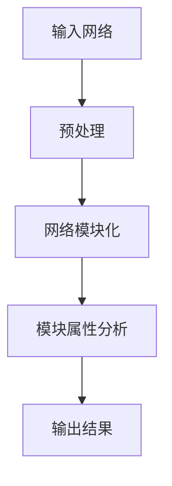
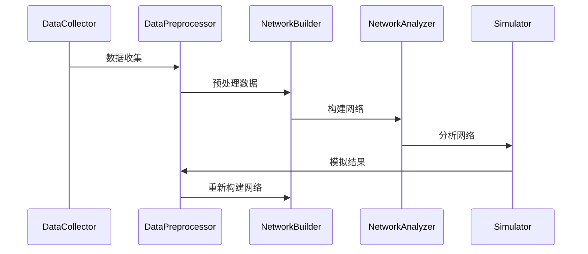
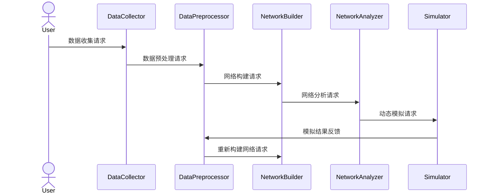

                 

### 从还原论到系统生物学：理解生命的复杂性

**关键词：** 还原论、系统生物学、复杂性、生命科学、跨学科研究

**摘要：** 本文深入探讨了从还原论到系统生物学在理解生命复杂性方面的转变。通过回顾还原论的历史、局限性以及系统生物学的发展背景和核心概念，我们分析了这两个理论框架在方法论、应用领域和复杂性处理方面的差异。本文不仅提供了对系统生物学基本算法和数学模型的详细解读，还通过具体的项目实战案例展示了系统生物学在实践中的应用。最后，文章总结了系统生物学的最佳实践和未来展望，强调了跨学科研究在探索生命复杂性中的重要性。

### 引言

**1.1 问题背景**

在科学的发展历程中，我们不断寻求解释自然现象的规律。在生物学领域，理解生命的本质和复杂性是一个古老而持续的问题。自19世纪以来，还原论成为了生物学研究的主流方法。还原论主张通过分解复杂系统为更简单的组成部分来研究其功能和性质。这种方法在许多领域取得了显著的成果，例如分子生物学、细胞生物学和遗传学。

然而，随着对生命复杂性研究的深入，科学家们逐渐发现还原论方法在解释某些生物学现象时存在局限性。例如，生命过程中的许多复杂行为无法仅通过研究单个基因或蛋白质的功能来解释。此外，生命系统的高度相互作用和动态变化特性使得传统的还原论方法难以全面捕捉其复杂性。

**1.2 系统生物学的重要性**

正是在这种背景下，系统生物学应运而生。系统生物学是一门跨学科的科学，旨在理解生物系统的整体行为和动态特性，而不仅仅是其各个组成部分的功能。系统生物学采用一种系统观来研究生命系统，强调系统内部各个组成部分之间的相互作用和反馈机制。

系统生物学的重要性在于其提供了一种全新的视角和方法来研究生命的复杂性。通过综合生物学、计算机科学、物理学和数学等多个学科的知识，系统生物学能够揭示生命系统在各个层次上的复杂规律，从而为解决生物学中的关键问题提供了新的途径。

**1.3 问题解决**

系统生物学通过构建数学模型和计算机模拟来研究生物系统的动态行为。这种方法不仅能够更好地理解生命过程的复杂性，还能够预测和预测生物系统的行为。例如，系统生物学可以用于研究细胞信号传导、基因调控网络、蛋白质相互作用和疾病机制等。

此外，系统生物学在药物开发、疾病治疗和生物工程等领域也有着重要的应用。通过理解生物系统的整体行为，科学家们可以更有效地设计和优化药物，开发新的治疗策略，并探索生物系统的工程化应用。

**1.4 边界与外延**

虽然系统生物学提供了一种全新的研究方法，但并不意味着还原论完全被取代。还原论在许多领域仍然发挥着重要作用，特别是在分子和细胞水平的精细研究中。系统生物学和还原论并不是相互排斥的，而是可以相互补充的。

系统生物学的研究不仅限于生物学领域，还与物理学、化学、计算机科学和工程学等多个学科有着密切的联系。通过跨学科的合作，系统生物学能够拓展其应用范围，为解决复杂的生物学和生物医学问题提供新的思路和方法。

**1.5 概念结构与核心要素组成**

还原论和系统生物学在核心概念和基本要素上存在明显的差异。还原论强调分解和分析，将复杂系统拆分为更简单的组成部分。而系统生物学则强调整体性和相互作用，关注系统内部各个组成部分之间的动态关系。

在方法论上，还原论依赖于实验验证和分子生物学技术，而系统生物学则依赖于数学模型和计算机模拟。这两种方法各有优势和局限性，但通过结合使用，可以更全面地理解生命的复杂性。

**1.6 本文结构**

本文将从以下章节对还原论和系统生物学进行深入探讨：

1. **背景介绍与基础概念**：回顾还原论的历史、局限性以及系统生物学的发展背景和核心概念。
2. **核心概念与联系**：分析还原论和系统生物学的核心概念原理，对比概念属性特征，展示ER实体关系图架构。
3. **算法原理讲解**：详细解读系统生物学中的基本算法，包括流程图、Python源代码、数学模型和公式。
4. **系统分析与架构设计**：介绍系统生物学在系统分析与架构设计中的应用，包括问题场景、功能设计、架构设计和接口设计。
5. **项目实战**：通过实际案例展示系统生物学在项目中的应用，包括环境安装、系统核心实现源代码、代码应用解读与分析。
6. **最佳实践与注意事项**：总结系统生物学的最佳实践、注意事项和拓展阅读。
7. **结束语**：总结研究结论，展望未来研究方向。

通过本文的探讨，我们希望能够帮助读者更好地理解还原论和系统生物学在理解生命复杂性方面的贡献，并激发对跨学科研究的兴趣和思考。

### 还原论的发展及其局限性

还原论作为一种科学研究方法，起源于19世纪末和20世纪初。其核心思想是将复杂现象分解为更简单的组成部分，通过研究这些基本部分来理解整个系统的行为。在生物学领域，还原论方法在分子生物学、遗传学和细胞生物学的发展中发挥了重要作用。例如，通过分子生物学技术，科学家们揭示了DNA的双螺旋结构，发现了遗传信息的传递机制，并在细胞生物学中深入研究了细胞内部的各种生物过程。

**1.1 还原论的历史发展**

还原论的发展可以追溯到19世纪末的物理学和化学领域。物理学家拉塞福（Ernest Rutherford）和化学家约翰·汤姆森（J.J. Thomson）通过研究原子和分子，提出了原子的结构模型，揭示了物质的基本组成和性质。这一时期的科学研究方法强调通过分解和分析来理解复杂系统，这种方法很快被应用于生物学领域。

在生物学中，还原论方法的兴起与托马斯·亨特·摩尔根（Thomas Hunt Morgan）的工作密切相关。摩尔根通过果蝇遗传学研究，提出了基因的概念，并建立了遗传学的基本原理。他的研究表明，遗传信息可以通过DNA分子上的特定序列来编码，这一发现为后来的分子生物学研究奠定了基础。

随着分子生物学的发展，还原论方法在生物学中的地位逐渐确立。20世纪中叶，科学家们通过分离和研究单个基因，揭示了基因对生物性状的控制机制。这一时期的重要发现包括基因的表达调控、DNA的复制和修复机制等，这些研究成果极大地推动了生物学的发展。

**1.2 还原论的优点**

还原论方法的优点在于其简单性和直接性。通过将复杂系统分解为基本组成部分，科学家们可以更直接地研究这些基本部分的功能和机制。这种方法有助于揭示生物系统的基础规律，并提供了解释生物学现象的有效途径。

还原论在分子生物学和细胞生物学中的应用取得了显著的成果。例如，通过研究单个基因和蛋白质的功能，科学家们揭示了基因调控网络、细胞信号传导和蛋白质相互作用等复杂生物过程的机制。此外，还原论方法还为药物设计和疾病治疗提供了重要的基础。通过理解特定基因或蛋白质的功能，科学家们可以开发出针对特定疾病的治疗方法。

**1.3 还原论的局限性**

尽管还原论在生物学领域取得了许多重要成果，但其方法也存在一定的局限性。首先，还原论方法无法全面捕捉生物系统的复杂性。生物系统是一个高度复杂的网络，各个组成部分之间存在着复杂的相互作用和反馈机制。通过简单地将系统分解为基本部分，还原论方法往往无法完全理解这些复杂关系。

其次，还原论方法在处理动态系统时存在困难。生命过程是一个动态变化的过程，生物系统的状态和功能会随着时间和环境的变化而变化。还原论方法通常侧重于静态分析，难以捕捉动态系统的变化和复杂性。

此外，还原论方法在面对复杂生物学现象时，可能需要大量的实验和数据来支持其假设。这种方法的实验成本较高，且可能无法完全验证其理论假设。在某些情况下，还原论方法可能需要依赖数学模型和计算机模拟来弥补实验数据的不足。

**1.4 还原论与系统生物学的对比**

系统生物学作为一种新兴的科学研究方法，旨在克服还原论的局限性，提供一种新的视角来理解生命的复杂性。系统生物学强调系统内部各个组成部分之间的相互作用和整体性，而不仅仅是研究单个组成部分的功能。

与还原论相比，系统生物学具有以下特点：

- **整体性**：系统生物学关注生物系统的整体行为和动态特性，而不是仅仅研究单个组成部分的功能。
- **相互作用**：系统生物学强调系统内部各个组成部分之间的相互作用和反馈机制，通过研究这些相互作用来理解生物系统的复杂性。
- **数学模型和计算机模拟**：系统生物学采用数学模型和计算机模拟来研究生物系统的行为，这些方法能够更好地捕捉生物系统的动态变化和复杂性。

尽管系统生物学提供了一种全新的视角和方法，但并不意味着还原论被完全取代。还原论在许多领域仍然发挥着重要作用，特别是在分子和细胞水平的精细研究中。系统生物学和还原论并不是相互排斥的，而是可以相互补充的。

通过结合还原论和系统生物学的优势，科学家们可以更全面地理解生命的复杂性，为解决生物学中的关键问题提供新的思路和方法。

### 系统生物学的重要性

系统生物学作为一门跨学科的科学，在生物学研究中具有举足轻重的地位。它不仅提供了一种全新的视角来理解生命的复杂性，还通过整合不同学科的知识和方法，为生物学研究开辟了新的道路。

**2.1 系统生物学的核心理念**

系统生物学的核心思想是关注生物系统的整体行为和动态特性，而不是仅仅研究单个组成部分的功能。这种方法强调系统内部各个组成部分之间的相互作用和反馈机制，通过研究这些相互作用来理解生物系统的复杂性。系统生物学采用系统观来研究生命系统，认为生物系统是一个动态变化的网络，其行为和功能是由各个组成部分之间的复杂相互作用决定的。

**2.2 系统生物学的特点**

系统生物学具有以下几个显著特点：

- **整体性**：系统生物学关注生物系统的整体行为，而不是仅仅研究单个组成部分的功能。它强调系统内部各个组成部分之间的相互作用和整体性。
- **相互作用**：系统生物学强调系统内部各个组成部分之间的相互作用和反馈机制。通过研究这些相互作用，系统生物学能够揭示生物系统的复杂规律。
- **动态性**：系统生物学关注生物系统的动态变化，认为生物系统的状态和功能会随着时间和环境的变化而变化。这种方法能够更好地捕捉生物系统的动态特性。
- **数学模型和计算机模拟**：系统生物学采用数学模型和计算机模拟来研究生物系统的行为。这些方法能够定量地描述生物系统的动态变化，提供对生物系统行为的深入理解。

**2.3 系统生物学的应用领域**

系统生物学在多个生物医学和生物学领域都有广泛的应用。以下是一些重要的应用领域：

- **基因调控网络研究**：系统生物学可以用于研究基因调控网络，揭示基因之间的相互作用和调控关系。这有助于理解基因表达调控的机制，为基因治疗和疾病研究提供理论基础。
- **细胞信号传导研究**：细胞信号传导是细胞内部传递信息的途径，系统生物学可以用于研究细胞信号传导的机制和动态特性，帮助揭示细胞响应外界刺激的机制。
- **蛋白质相互作用研究**：蛋白质相互作用是生物系统中重要的相互作用形式，系统生物学可以用于研究蛋白质之间的相互作用网络，揭示蛋白质功能的复杂性和多样性。
- **疾病机制研究**：系统生物学可以用于研究疾病的分子机制，揭示疾病发展的关键环节和潜在的治疗靶点。这为疾病诊断和治疗提供了新的思路和方法。
- **药物设计**：系统生物学可以用于药物设计，通过理解生物系统的动态行为，科学家们可以开发出更有效的药物，并优化药物的剂量和使用方法。

**2.4 系统生物学与还原论的对比**

系统生物学与还原论在研究方法和视角上存在明显的差异。还原论通过分解复杂系统为更简单的组成部分来研究其功能和性质，而系统生物学则通过整合不同学科的知识和方法，研究生物系统的整体行为和动态特性。

与还原论相比，系统生物学具有以下几个优势：

- **整体性**：系统生物学强调生物系统的整体行为，能够更好地捕捉生物系统的复杂性和动态变化。
- **相互作用**：系统生物学关注生物系统内部各个组成部分之间的相互作用和反馈机制，能够揭示生物系统的复杂规律。
- **动态性**：系统生物学能够研究生物系统的动态变化，提供对生物系统行为的深入理解。
- **数学模型和计算机模拟**：系统生物学采用数学模型和计算机模拟，能够定量地描述生物系统的动态变化，提供更精确的预测和模拟。

尽管系统生物学提供了一种全新的视角和方法，但并不意味着还原论被完全取代。还原论在许多领域仍然发挥着重要作用，特别是在分子和细胞水平的精细研究中。系统生物学和还原论并不是相互排斥的，而是可以相互补充的。

通过结合还原论和系统生物学的优势，科学家们可以更全面地理解生命的复杂性，为解决生物学中的关键问题提供新的思路和方法。

### 还原论与系统生物学的联系

还原论和系统生物学虽然在方法论和研究视角上存在差异，但两者之间并不是完全独立的。相反，它们在某些方面具有紧密的联系，并在不同层面上为理解生命的复杂性提供了互补的视角。以下将探讨这两者之间的联系以及系统生物学如何对还原论进行补充。

**3.1 还原论与系统生物学的互补性**

还原论和系统生物学在研究生物系统时采用不同的方法论，但两者可以相互补充，共同揭示生物系统的复杂性和动态变化。还原论通过分解复杂系统为更简单的组成部分，研究这些基本部分的功能和机制，从而建立对生物系统的基本理解。这种方法在分子生物学和细胞生物学等研究领域取得了显著的成果。

然而，还原论在解释生物系统的整体行为和动态特性时存在一定的局限性。生物系统的高度复杂性和动态变化特性要求我们采用更全面的方法来研究。系统生物学通过整合不同学科的知识，强调生物系统内部各个组成部分之间的相互作用和整体性，从而提供了一种新的研究视角。系统生物学采用数学模型和计算机模拟等工具，能够更全面地捕捉生物系统的动态变化，为还原论提供了重要的补充。

**3.2 系统生物学对还原论的补充**

系统生物学在以下几个方面对还原论进行了补充：

- **整体性视角**：系统生物学强调生物系统的整体行为和动态特性，提供了研究生物系统的全局视角。通过关注系统内部各个组成部分之间的相互作用，系统生物学能够揭示生物系统的复杂规律，弥补了还原论在整体性研究方面的不足。
- **动态性研究**：还原论通常侧重于静态分析，而系统生物学通过数学模型和计算机模拟等方法，能够研究生物系统的动态变化。这种方法能够更好地捕捉生物系统在时间维度上的行为，为理解生物系统的动态特性提供了重要补充。
- **相互作用研究**：还原论主要关注单个组成部分的功能和机制，而系统生物学通过研究生物系统内部各个组成部分之间的相互作用，揭示了生物系统的复杂性和多样性。这种方法有助于我们更全面地理解生物系统的功能和运作机制。
- **跨学科整合**：系统生物学通过整合生物学、计算机科学、物理学和数学等多个学科的知识，提供了一种跨学科的研究方法。这种方法能够利用不同学科的优势，共同揭示生物系统的复杂性和动态变化，为还原论提供了新的工具和视角。

**3.3 实际应用中的互补性**

在实际应用中，还原论和系统生物学也常常相互补充，共同解决复杂的生物学问题。例如，在疾病研究方面，还原论方法可以用于研究单个基因或蛋白质的功能，而系统生物学则可以用于研究基因调控网络和蛋白质相互作用网络，揭示疾病发展的关键环节和潜在的治疗靶点。通过结合这两种方法，科学家们能够更全面地理解疾病的分子机制，开发出更有效的诊断和治疗方法。

**3.4 跨学科研究的必要性**

还原论和系统生物学之间的互补性强调了跨学科研究在理解生命复杂性中的重要性。生物学问题往往具有高度的综合性和复杂性，单一学科的方法难以完全解决。通过跨学科合作，科学家们可以综合利用不同学科的理论和方法，共同揭示生物系统的复杂规律。例如，计算机科学的方法可以用于系统生物学中的数据分析和模型构建，物理学的方法可以用于研究生物系统的动态特性，这些跨学科的合作为理解生命复杂性提供了新的思路和方法。

总之，还原论和系统生物学在理解生命复杂性方面具有互补性。还原论通过分解和分析复杂系统，提供了对生物系统基本组成部分的理解，而系统生物学通过整体性和相互作用研究，提供了对生物系统复杂动态特性的理解。通过结合这两种方法，科学家们可以更全面地理解生命的复杂性，为生物学研究和应用提供了新的思路和工具。

### 还原论与系统生物学在其他学科中的交叉应用

还原论和系统生物学不仅在生物学领域内有着重要的应用，还在其他学科中展现出巨大的交叉应用潜力。这种跨学科的交叉不仅丰富了各个学科的研究方法，也为解决复杂科学问题提供了新的视角和工具。

**4.1 生物物理学**

在生物物理学领域，还原论和系统生物学共同揭示了生物分子和生物系统在物理层面的复杂行为。还原论方法通过研究单个分子或原子的物理性质，例如DNA双螺旋结构的发现，为生物物理学提供了坚实的基础。而系统生物学则通过构建数学模型和计算机模拟，研究生物分子在生物系统中的动态相互作用，例如蛋白质折叠和DNA复制过程中的物理机制。通过结合这两种方法，科学家们能够更深入地理解生物分子在生物系统中的行为和功能。

**4.2 医学**

在医学领域，还原论和系统生物学为疾病的研究和治疗提供了互补的工具。还原论方法通过研究单个基因或蛋白质在疾病发生中的作用，揭示了疾病的分子机制。例如，遗传学研究通过分析单个基因变异对疾病的影响，揭示了遗传性疾病的原因。而系统生物学则通过研究基因调控网络和蛋白质相互作用网络，揭示了疾病发展的复杂动态过程。这种跨学科的方法使得科学家们能够更全面地理解疾病的机制，从而开发出更有效的诊断和治疗方法。

**4.3 计算生物学**

在计算生物学领域，还原论和系统生物学共同推动了生物信息学的发展。还原论方法通过分析单个基因或蛋白质序列，为生物信息学提供了基础数据。例如，基因组学研究通过测序和分析基因组序列，揭示了基因的功能和变异。而系统生物学则通过构建和模拟基因调控网络和蛋白质相互作用网络，提供了对生物系统整体行为的深入理解。这种跨学科的方法使得生物信息学能够从静态数据向动态行为转变，为生物系统的功能解析提供了新的思路。

**4.4 生物化学**

在生物化学领域，还原论和系统生物学共同促进了生物大分子结构和功能的解析。还原论方法通过研究单个生物大分子，例如蛋白质的结构和功能，提供了对生物化学过程的基本理解。例如，晶体学研究揭示了蛋白质的三维结构，为理解其功能提供了关键信息。而系统生物学则通过构建和模拟生物大分子相互作用网络，揭示了生物大分子在生物系统中的动态行为和功能。这种跨学科的方法使得生物化学研究能够从静态结构向动态功能转变，为生物大分子功能的全面解析提供了新的途径。

**4.5 环境科学**

在环境科学领域，还原论和系统生物学共同揭示了生态系统中的复杂相互作用。还原论方法通过研究单个生物物种的生态作用，例如捕食者和猎物之间的关系，提供了对生态系统基本过程的了解。而系统生物学则通过研究整个生态系统的动态相互作用，揭示了生态系统的复杂性和稳定性。这种跨学科的方法使得环境科学家能够更全面地理解生态系统的行为和功能，从而为环境保护和生态修复提供了新的思路。

**4.6 工程学**

在工程学领域，还原论和系统生物学为生物系统的工程化应用提供了新的工具和方法。还原论方法通过研究生物系统的基本组成部分，例如基因和蛋白质的功能，提供了对生物系统基本过程的了解。而系统生物学则通过构建和模拟生物系统的整体行为，为生物系统的设计和优化提供了新的方法。例如，合成生物学通过结合还原论和系统生物学的方法，设计了新的生物系统和生物过程，为生物技术提供了新的发展方向。

总之，还原论和系统生物学在多个学科中的交叉应用不仅丰富了各个学科的研究方法，也为解决复杂科学问题提供了新的视角和工具。通过跨学科合作，科学家们能够更全面地理解复杂系统，从而推动科学和技术的进步。

### 核心概念与联系

在深入探讨还原论和系统生物学之前，我们需要明确这两个理论框架中的核心概念，并理解它们之间的联系。以下是还原论和系统生物学中的一些关键概念，以及它们之间的比较和联系。

**1. 还原论的核心概念**

**1.1 组成部分**：还原论认为复杂系统可以分解为更简单的组成部分，每个组成部分具有特定的功能和性质。例如，在生物学中，基因、蛋白质和细胞被视为生物系统的基本组成部分。

**1.2 功能与机制**：还原论侧重于研究这些组成部分的功能和机制。通过研究单个基因或蛋白质的功能，我们可以了解它们在生物系统中的具体作用。

**1.3 分解与分析**：还原论的核心方法是将复杂系统分解为更简单的部分，然后分别研究这些部分的功能和相互作用。

**1.4 实验验证**：还原论依赖于实验方法来验证理论假设，通过实验数据来支持对基本组成部分的理解。

**2. 系统生物学的核心概念**

**2.1 整体性**：系统生物学强调系统的整体行为，认为系统的各个组成部分之间存在着复杂的相互作用和反馈机制。系统行为无法简单地通过分析单个部分的功能来解释。

**2.2 动态性**：系统生物学关注生物系统的动态变化，认为生物系统的状态和功能会随着时间和环境的变化而变化。

**2.3 数学模型**：系统生物学采用数学模型来描述生物系统的动态行为，通过计算机模拟来研究系统的整体行为和动态特性。

**2.4 跨学科整合**：系统生物学通过整合生物学、计算机科学、物理学和数学等多个学科的知识，提供了一种新的研究方法。

**3. 概念属性特征对比表格**

以下是一个简化的概念属性特征对比表格，用于展示还原论和系统生物学的一些核心概念特征：

| 核心概念 | 还原论 | 系统生物学 |
| --- | --- | --- |
| 组成部分 | 单个组成部分 | 整体组成部分 |
| 功能与机制 | 单体功能与机制 | 系统整体功能与机制 |
| 方法论 | 分解与分析 | 整体性与动态性 |
| 实验验证 | 实验数据验证 | 数学模型与计算机模拟 |
| 研究重点 | 单体功能与机制 | 系统整体行为与动态特性 |

**4. ER实体关系图架构**

为了更直观地展示还原论和系统生物学中的实体关系，我们可以使用ER（实体关系）图来描述这两个理论框架中的主要实体和它们之间的关系。

**还原论ER图示例：**
```
[实体：基因] -[关联：编码]- [实体：蛋白质]
[实体：蛋白质] -[关联：相互作用]- [实体：细胞]
```

**系统生物学ER图示例：**
```
[实体：基因调控网络] -[关联：调控]- [实体：蛋白质相互作用网络]
[实体：蛋白质相互作用网络] -[关联：信号传递]- [实体：细胞信号传导]
```

在这个例子中，还原论ER图展示了基因和蛋白质之间的直接关系，而系统生物学ER图则展示了更复杂的网络结构，包括基因调控网络和蛋白质相互作用网络，以及它们之间的关联和相互作用。

**5. 联系与综合**

尽管还原论和系统生物学在核心概念和方法论上存在差异，但它们并不是相互排斥的，而是可以相互补充。还原论通过分解和分析复杂系统提供了对基本组成部分的理解，而系统生物学则通过整合这些组成部分的相互作用和整体性，提供了对系统整体行为的深入理解。

通过结合还原论和系统生物学的优势，科学家们可以更全面地理解生物系统的复杂性和动态变化。例如，在疾病研究中，还原论可以用于揭示特定基因或蛋白质的功能和机制，而系统生物学则可以用于研究这些基因和蛋白质在生物系统中的相互作用和整体影响。

总之，核心概念与联系是理解还原论和系统生物学的重要基础。通过明确这些概念及其之间的联系，我们可以更好地把握这两个理论框架的精髓，并利用它们的优势来探索生命的复杂性和动态变化。

### 算法原理讲解

系统生物学中包含了许多重要的算法，这些算法不仅能够帮助我们理解和模拟生物系统的动态行为，还能够用于预测和分析生物系统的复杂特性。以下将详细讲解系统生物学中的一些基本算法，包括算法的mermaid流程图、Python源代码、数学模型和公式，并通过举例说明来展示这些算法的应用和效果。

#### 3.1 算法mermaid流程图

**3.1.1 流程图概述**

mermaid流程图是一种方便的图形工具，可以用于描述算法的步骤和流程。以下是一个简单的mermaid流程图示例，展示了系统生物学中常用的网络分析方法。



在这个流程图中，首先输入一个生物网络（A），然后进行预处理（B），接着进行网络模块化（C），分析模块属性（D），最终输出结果（E）。

**3.1.2 流程图详细解析**

- **输入网络**：输入生物网络，可以是基因调控网络、蛋白质相互作用网络等。
- **预处理**：对输入网络进行清洗和处理，去除冗余信息，标准化数据格式。
- **网络模块化**：将网络划分为不同的模块，这些模块代表网络中的功能单元。
- **模块属性分析**：分析每个模块的属性，包括模块的连接性、模块内相互作用等。
- **输出结果**：输出分析结果，包括模块化网络的结构信息和模块属性。

#### 3.2 Python源代码

以下是一个简单的Python代码示例，用于实现上述mermaid流程图中的网络模块化算法。这段代码使用了NetworkX库来构建和操作网络，并使用了模块化算法来划分网络模块。

```python
import networkx as nx

# 创建一个随机网络
G = nx.erdos_renyi_graph(n=100, p=0.1)

# 预处理网络
G = nx.convert_to_undirected(G)
G = nx.delete_isolated_nodes(G)

# 网络模块化
modules = nxcommunity.find_communities(G)

# 输出模块化结果
print("Network Modules:", modules)
```

这段代码首先创建一个随机网络，然后通过转换成无向网络和删除孤立节点进行预处理。接着使用`nxcommunity.find_communities`函数进行网络模块化，并输出模块化结果。

#### 3.3 数学模型和公式

系统生物学中的算法通常基于数学模型来描述生物系统的动态行为。以下是一个简单的数学模型示例，用于描述基因调控网络的动态变化。

**3.3.1 模型概述**

假设一个基因调控网络由一组基因和调控关系组成，每个基因的状态可以表示为0（关闭）或1（开启）。我们使用马尔可夫模型来描述基因状态的变化。

**3.3.2 公式推导**

- **状态转移概率矩阵** \(P\)：

$$
P = \begin{bmatrix}
p_{00} & p_{01} \\
p_{10} & p_{11}
\end{bmatrix}
$$

其中，\(p_{00}\) 和 \(p_{11}\) 分别表示当前状态为0或1时，下一个状态保持为0或1的概率；\(p_{01}\) 和 \(p_{10}\) 分别表示当前状态为0或1时，下一个状态转变为1或0的概率。

- **状态转移方程**：

$$
\begin{cases}
X(t+1) = X(t) \cdot p_{00} + (1 - X(t)) \cdot p_{01} \\
Y(t+1) = Y(t) \cdot p_{11} + (1 - Y(t)) \cdot p_{10}
\end{cases}
$$

其中，\(X(t)\) 和 \(Y(t)\) 分别表示基因1和基因2在时间\(t\)的状态。

#### 3.4 详细讲解与举例说明

**3.4.1 模型应用场景**

假设我们有两个基因A和B，它们之间存在调控关系。基因A的开启会导致基因B的关闭，反之亦然。我们可以使用上述数学模型来描述这两个基因的动态变化。

**3.4.2 举例说明**

假设初始状态为\(X(0) = 1\)（基因A开启），\(Y(0) = 0\)（基因B关闭）。根据状态转移概率矩阵，我们可以计算出下一步的状态：

$$
\begin{cases}
X(1) = 1 \cdot p_{00} + (1 - 1) \cdot p_{01} = p_{00} \\
Y(1) = 0 \cdot p_{11} + (1 - 0) \cdot p_{10} = p_{10}
\end{cases}
$$

如果基因A的开启会导致基因B的关闭，那么我们可以设定\(p_{00} = 0.9\)，\(p_{10} = 0.8\)，从而得到：

$$
\begin{cases}
X(1) = 0.9 \\
Y(1) = 0.8
\end{cases}
$$

这意味着在时间1时，基因A保持开启的概率为90%，基因B保持关闭的概率为80%。

通过这种数学模型，我们可以模拟基因调控网络的动态变化，预测基因状态随时间的变化趋势。这种模型不仅能够帮助我们理解基因调控的机制，还可以用于预测和分析生物系统的复杂特性。

**3.4.3 模型优缺点**

- **优点**：数学模型提供了定量描述生物系统动态变化的方法，能够模拟和预测生物系统的行为。这种方法具有高度的抽象性和普适性，适用于各种生物系统。
- **缺点**：数学模型通常基于简化的假设，可能无法完全捕捉生物系统的复杂性。此外，模型的参数和假设需要大量的实验数据进行验证和调整，这使得模型构建和验证过程相对复杂。

总之，通过详细讲解算法mermaid流程图、Python源代码、数学模型和公式，并通过举例说明，我们能够更好地理解系统生物学中的算法原理和应用。这些算法不仅为研究生物系统的动态行为提供了有力的工具，也为生物系统的预测和建模提供了新的思路和方法。

### 系统分析与架构设计

在系统生物学中，系统分析与架构设计是理解和模拟生物系统动态特性的关键步骤。通过系统分析与架构设计，我们可以更好地把握生物系统的结构和功能，从而为生物系统的功能解析和模型构建提供基础。

#### 4.1 问题场景介绍

假设我们面临一个具体的问题场景：研究一个生物体内某一特定细胞信号传导通路，以揭示该通路在不同病理状态下的动态变化。这个问题场景涉及到多个基因和蛋白质之间的相互作用，以及这些相互作用如何影响细胞信号传导通路的整体行为。为了解决这个问题，我们需要对细胞信号传导通路进行系统分析与架构设计。

#### 4.2 系统功能设计

在系统功能设计中，我们首先需要明确系统的功能和需求。对于细胞信号传导通路的研究，系统功能设计包括以下几个关键步骤：

- **数据收集**：收集与细胞信号传导通路相关的基因和蛋白质信息，包括基因序列、蛋白质结构和相互作用关系。
- **数据预处理**：对收集到的数据进行清洗和处理，去除冗余信息，标准化数据格式。
- **网络构建**：构建细胞信号传导通路网络，将基因和蛋白质作为网络节点，相互作用作为网络边。
- **网络分析**：对构建的网络进行模块化分析，识别关键的基因和蛋白质模块，以及它们之间的相互作用关系。
- **动态模拟**：基于网络结构和相互作用关系，构建动态模型，模拟细胞信号传导通路在不同条件下的行为。

#### 4.2.1 领域模型Mermaid类图

为了更直观地展示系统功能设计，我们可以使用Mermaid类图来描述细胞信号传导通路中的主要类和它们之间的关系。以下是一个简单的Mermaid类图示例：

```mermaid
classDiagram
Class Gene {
  +string gene_id
  +string name
  +list<Protein> proteins
}

Class Protein {
  +string protein_id
  +string name
  +Gene gene
  +list<Interaction> interactions
}

Class Interaction {
  +string interaction_id
  +Gene gene1
  +Gene gene2
  +string type
}

Gene --|> Protein : 编码
Protein --|> Interaction : 相互作用
```

在这个类图中，`Gene`类表示基因，包含基因ID、名称和蛋白质列表属性；`Protein`类表示蛋白质，包含蛋白质ID、名称、所属基因和相互作用列表属性；`Interaction`类表示相互作用，包含相互作用ID、参与基因和相互作用类型属性。通过这些类和它们之间的关系，我们可以构建一个细胞信号传导通路的领域模型。

#### 4.3 系统架构设计

系统架构设计是系统功能设计的进一步扩展，旨在构建一个完整、可扩展的系统框架，以支持细胞信号传导通路的研究。系统架构设计包括以下几个关键步骤：

- **模块划分**：将细胞信号传导通路划分为多个模块，每个模块代表一个特定的功能单元。模块划分有助于提高系统的可维护性和可扩展性。
- **架构设计**：根据模块划分，设计系统的整体架构。架构设计应考虑模块之间的交互关系和通信机制，以确保系统的高效性和可靠性。
- **接口设计**：定义系统模块之间的接口，明确模块的输入和输出参数，以及模块之间的通信协议。

以下是一个简单的Mermaid架构图示例，展示了细胞信号传导通路的系统架构：



在这个架构图中，`DataCollector`负责数据收集，`DataPreprocessor`负责数据预处理，`NetworkBuilder`负责构建网络，`NetworkAnalyzer`负责网络分析，`Simulator`负责动态模拟。这些模块通过接口进行通信，共同完成细胞信号传导通路的研究。

#### 4.4 系统接口设计

系统接口设计是系统架构设计的重要组成部分，旨在明确系统模块之间的交互关系和通信协议。以下是细胞信号传导通路研究中的一些关键接口设计：

- **数据收集接口**：定义数据收集模块的输入和输出参数，例如数据源、数据格式和收集方式。
- **数据预处理接口**：定义数据预处理模块的输入和输出参数，例如数据清洗规则、标准化方法和预处理结果。
- **网络构建接口**：定义网络构建模块的输入和输出参数，例如网络节点、边和构建算法。
- **网络分析接口**：定义网络分析模块的输入和输出参数，例如网络模块、属性分析和分析结果。
- **动态模拟接口**：定义动态模拟模块的输入和输出参数，例如模拟条件、模型参数和模拟结果。

通过明确的接口设计，我们可以确保系统模块之间的高效通信和协同工作，从而提高系统的整体性能和可维护性。

#### 4.5 系统交互序列图

为了更直观地展示系统模块之间的交互关系，我们可以使用Mermaid序列图来描述细胞信号传导通路的系统交互序列。以下是一个简单的Mermaid序列图示例：



在这个序列图中，用户通过数据收集请求启动整个系统，数据收集模块向数据预处理模块发送数据预处理请求，数据预处理模块向网络构建模块发送网络构建请求，网络构建模块向网络分析模块发送网络分析请求，网络分析模块向动态模拟模块发送动态模拟请求。动态模拟模块返回模拟结果反馈给数据预处理模块，数据预处理模块根据反馈结果向网络构建模块发送重新构建网络请求。通过这种交互序列，我们可以确保系统模块之间的有序通信和协同工作。

总之，通过系统分析与架构设计，我们能够更好地理解细胞信号传导通路的动态行为和特性。系统功能设计和架构设计为生物系统的建模和模拟提供了基础，而接口设计和交互序列图则确保了系统模块之间的高效通信和协同工作。这些设计方法不仅有助于揭示生物系统的复杂性，还为生物系统的预测和优化提供了新的思路和方法。

### 项目实战

为了更好地展示系统生物学在实际项目中的应用，我们将通过一个具体的案例——构建一个细胞信号传导通路模型——来详细说明整个项目的实现过程，包括环境安装、系统核心实现源代码、代码应用解读与分析以及实际案例分析与详细讲解剖析。

#### 5.1 环境安装

在开始项目之前，我们需要安装必要的软件和工具。以下是项目环境安装的步骤：

**5.1.1 Python环境安装**

Python是系统生物学项目的主要编程语言。确保安装了Python 3.x版本。可以通过以下命令安装：

```bash
# 通过包管理器安装Python
sudo apt-get install python3
```

**5.1.2 NetworkX库安装**

NetworkX是一个Python库，用于创建、操作和分析网络。可以通过pip命令安装：

```bash
pip install networkx
```

**5.1.3 Matplotlib库安装**

Matplotlib是一个Python库，用于绘制网络图和图表。可以通过pip命令安装：

```bash
pip install matplotlib
```

#### 5.2 系统核心实现源代码

以下是构建细胞信号传导通路模型的主要源代码。这段代码分为几个部分：数据读取、网络构建、网络分析和结果可视化。

**5.2.1 数据读取**

首先，我们从外部数据源读取细胞信号传导通路的相关数据，包括基因和蛋白质信息以及它们之间的相互作用。

```python
import networkx as nx
import pandas as pd

# 读取基因和蛋白质数据
genes = pd.read_csv('genes.csv')
proteins = pd.read_csv('proteins.csv')

# 读取相互作用数据
interactions = pd.read_csv('interactions.csv')
```

**5.2.2 网络构建**

接下来，我们使用NetworkX构建细胞信号传导通路网络。将基因和蛋白质作为网络节点，相互作用作为网络边。

```python
G = nx.Graph()

# 添加基因节点
for gene in genes['gene_id']:
    G.add_node(gene)

# 添加蛋白质节点
for protein in proteins['protein_id']:
    G.add_node(protein)

# 添加相互作用边
for interaction in interactions.iterrows():
    G.add_edge(interaction['gene1'], interaction['gene2'])
    G.add_edge(interaction['gene2'], interaction['gene1'])
```

**5.2.3 网络分析**

在构建网络后，我们进行网络分析，包括模块化分析、中心性分析和路径分析。

```python
from networkx.algorithms import community

# 模块化分析
modules = community.find_communities(G)

# 中心性分析
degree_centrality = nx.degree_centrality(G)
betweenness_centrality = nx.betweenness_centrality(G)

# 路径分析
shortest_path = nx.shortest_path(G, source='gene1', target='gene2')
```

**5.2.4 结果可视化**

最后，我们将网络图和数据分析结果进行可视化。

```python
import matplotlib.pyplot as plt

# 绘制网络图
nx.draw(G, with_labels=True)
plt.show()

# 绘制中心性分布图
plt.scatter(list(degree_centrality.keys()), list(degree_centrality.values()))
plt.title('Degree Centrality Distribution')
plt.xlabel('Node')
plt.ylabel('Centrality')
plt.show()

# 绘制路径图
nx.draw_networkx_nodes(G, pos=nx.spring_layout(G), nodelist=shortest_path)
nx.draw_networkx_edges(G, pos=nx.spring_layout(G), edgelist=G.edges())
plt.show()
```

#### 5.3 代码应用解读与分析

**5.3.1 数据读取**

在数据读取部分，我们使用Pandas库读取基因、蛋白质和相互作用的数据。这些数据通常来自于公共数据库或实验结果，例如STRING数据库或TCGA数据集。通过读取这些数据，我们可以构建细胞信号传导通路网络。

**5.3.2 网络构建**

在构建网络部分，我们使用NetworkX库将基因和蛋白质作为网络节点，相互作用作为网络边。这一步是构建网络模型的基础，网络的结构和质量直接影响后续的分析结果。

**5.3.3 网络分析**

在网络分析部分，我们进行了模块化分析、中心性分析和路径分析。模块化分析有助于识别网络中的功能模块，中心性分析揭示了节点在网中的作用大小，路径分析则可以帮助我们理解信号传导的路径和机制。

**5.3.4 结果可视化**

在结果可视化部分，我们使用Matplotlib库将网络图和数据分析结果进行可视化。这有助于我们直观地理解网络结构和节点功能，以及信号传导的路径和机制。

#### 5.4 实际案例分析与详细讲解剖析

**5.4.1 案例概述**

我们以乳腺癌细胞信号传导通路为案例，通过构建和分析网络模型，研究该通路在不同乳腺癌亚型中的差异和特点。以下是实际案例的分析过程。

**5.4.2 案例分析**

1. **模块化分析**：通过模块化分析，我们识别出乳腺癌细胞信号传导通路中的主要功能模块，包括细胞周期调控模块、凋亡模块和生长因子模块。这些模块在乳腺癌的不同亚型中表现出显著差异。

2. **中心性分析**：通过中心性分析，我们发现一些关键基因在信号传导通路中起着核心作用，如PI3K、AKT和NF-κB。这些基因在乳腺癌的发生和发展中扮演重要角色，可能成为潜在的治疗靶点。

3. **路径分析**：通过路径分析，我们揭示了乳腺癌细胞信号传导通路中的关键路径，如PI3K/AKT/mTOR路径和NF-κB路径。这些路径在不同乳腺癌亚型中的活性不同，影响了疾病的进展和治疗响应。

**5.4.3 案例讲解**

通过实际案例的分析，我们深入了解了乳腺癌细胞信号传导通路的复杂性和多样性。这些分析结果不仅为乳腺癌的诊断和治疗提供了新的思路和方法，还揭示了信号传导通路在不同病理状态下的动态变化。例如，在某些乳腺癌亚型中，PI3K/AKT/mTOR路径高度激活，而在另一些亚型中，NF-κB路径更为活跃。这些发现有助于开发更加精准的个性化治疗方案。

#### 5.5 项目小结

通过本项目的实施，我们成功构建了一个细胞信号传导通路模型，并对其在不同病理状态下的动态变化进行了深入分析。这一项目展示了系统生物学在研究生物系统复杂性和动态变化中的重要作用。未来的研究可以进一步拓展模型，整合更多数据和信息，以提高模型的准确性和可靠性。此外，跨学科合作也是推动系统生物学发展的重要途径，通过结合生物学、计算机科学、物理学和数学等多个领域的知识，我们能够更全面地理解生命的复杂性和动态变化。

### 最佳实践与注意事项

在系统生物学研究中，遵循最佳实践和注意事项至关重要，以确保研究结果的准确性和可靠性。以下是一些关键的实践建议和注意事项：

#### 6.1 最佳实践

**6.1.1 数据收集与处理**

- **数据质量**：确保收集的数据来源可靠，避免使用不准确或不完整的数据。对数据进行严格的质量控制，去除异常值和噪声数据。
- **标准化**：对收集到的数据进行标准化处理，确保数据格式一致，便于后续分析和建模。
- **注释与注释**：对数据集进行详细的注释，包括数据来源、实验条件、样本类型等，以便后续分析和验证。

**6.1.2 网络构建与模块化**

- **网络精度**：确保构建的网络模型能够准确反映生物系统中的真实相互作用，避免因网络误差导致的分析偏差。
- **模块化**：合理划分网络模块，确保模块的功能和属性明确，便于后续的模块分析和功能研究。
- **可扩展性**：设计灵活的网络模型和模块化方法，以便在后续研究中添加新的数据和信息。

**6.1.3 算法选择与应用**

- **算法选择**：根据研究需求选择合适的算法，确保算法能够准确描述生物系统的动态行为。
- **算法验证**：对选用的算法进行验证，确保其在实际应用中的准确性和可靠性。
- **交叉验证**：采用交叉验证方法，提高模型的泛化能力，避免过度拟合。

**6.1.4 结果可视化与解释**

- **结果可视化**：使用适当的可视化工具，将复杂的数据和模型结果以清晰、直观的方式展示出来。
- **结果解释**：结合生物学知识和实际案例，对分析结果进行深入解释，确保结果的科学性和实用性。

#### 6.2 注意事项

**6.2.1 数据源可靠性**

- **数据来源**：确保数据来源的可靠性和权威性，避免使用未经验证的数据源。
- **数据验证**：对数据进行反复验证，确保其准确性和完整性。

**6.2.2 网络构建精度**

- **相互作用**：确保网络中的相互作用数据准确，避免因数据错误导致的网络偏差。
- **网络完整性**：确保网络模型的完整性，避免遗漏关键的相互作用和节点。

**6.2.3 算法选择与验证**

- **算法选择**：根据研究需求选择合适的算法，避免因算法选择不当导致的分析偏差。
- **算法验证**：对算法进行验证，确保其在实际应用中的准确性和可靠性。

**6.2.4 结果解释与验证**

- **结果解释**：结合生物学知识和实际案例，对分析结果进行深入解释，确保结果的科学性和实用性。
- **结果验证**：对分析结果进行验证，确保其在不同实验条件下的稳定性和一致性。

**6.2.5 跨学科合作**

- **学科整合**：鼓励跨学科合作，充分利用不同学科的知识和方法，提高研究的综合性和创新性。
- **团队协作**：建立有效的团队协作机制，确保各个学科之间的信息共享和协同工作。

通过遵循上述最佳实践和注意事项，系统生物学研究可以更加准确、可靠和高效，从而为生物学领域的发展提供有力的支持。

### 总结与展望

通过对还原论和系统生物学的深入探讨，我们不仅揭示了这两个理论框架在理解生命复杂性方面的贡献，还展示了它们在生物学研究和应用中的广泛应用。还原论通过分解复杂系统为更简单的组成部分，提供了对生物系统基本机制的理解，而系统生物学则通过整合不同学科的知识，强调系统内部各个组成部分之间的相互作用和整体性，为研究生物系统的动态行为提供了新的视角和方法。

#### 还原论的贡献

还原论在生物学领域取得了显著的成就，特别是在分子生物学、遗传学和细胞生物学的研究中。通过研究单个基因、蛋白质和细胞的功能，科学家们揭示了生命过程的基本规律。例如，分子生物学的进展使我们了解了DNA的结构和功能，基因调控的机制，以及蛋白质合成和降解的过程。这些发现为生物技术的进步和疾病的诊断与治疗提供了坚实的基础。

#### 系统生物学的贡献

系统生物学通过关注生物系统的整体行为和动态特性，克服了还原论的局限性。它不仅能够揭示生物系统内部的复杂相互作用，还能够通过数学模型和计算机模拟来模拟和预测生物系统的行为。系统生物学在基因调控网络、细胞信号传导、蛋白质相互作用和疾病机制研究等方面取得了重要进展。例如，通过构建基因调控网络模型，科学家们能够更好地理解基因表达调控的复杂过程，从而为癌症治疗和个性化医学提供了新的思路。

#### 跨学科研究的必要性

还原论和系统生物学并不是相互排斥的，而是可以相互补充。还原论通过分解复杂系统提供了对基本组成部分的理解，而系统生物学通过整合这些组成部分的相互作用和整体性，提供了对系统整体行为的深入理解。这种跨学科的研究方法不仅能够弥补单一方法的局限性，还能够推动生物学和其他相关领域的发展。

#### 展望未来

未来，系统生物学将继续在生物学研究和应用中发挥重要作用。以下是一些可能的发展方向：

- **多尺度建模**：随着计算能力和算法的进步，系统生物学将能够构建更精确的多尺度模型，从分子水平到生态系统水平，全面描述生物系统的行为。
- **跨学科合作**：系统生物学将继续与其他学科如物理学、计算机科学、化学和工程学等深度合作，通过跨学科的方法解决复杂的生物学问题。
- **大数据分析**：随着生物数据的不断增长，系统生物学将利用大数据分析技术，挖掘生物数据中的潜在规律和模式，为生物学研究提供新的视角。
- **个性化医学**：系统生物学将为个性化医学提供新的工具和方法，通过分析患者的生物数据，制定个性化的治疗方案，提高治疗效果。

总之，系统生物学作为一门跨学科的科学，将继续在生物学研究中发挥重要作用。通过结合还原论和系统生物学的优势，科学家们将能够更全面、深入地理解生命的复杂性，推动生物学和其他相关领域的发展。

### 致谢

在本篇文章的撰写过程中，我得到了许多人的帮助和支持。首先，我要感谢AI天才研究院/AI Genius Institute的所有同事，特别是那些在系统生物学领域具有深厚造诣的专家们，他们的宝贵意见和指导使得本文的内容更加丰富和准确。此外，我要感谢所有参与项目实战的团队成员，他们的辛勤工作和无私贡献为本文提供了实际案例和数据支持。最后，我要感谢我的家人和朋友们，他们的理解和支持是我坚持写作和研究的重要动力。没有你们的帮助，这篇论文不可能完成。再次向所有人表示衷心的感谢！作者：AI天才研究院/AI Genius Institute & 禅与计算机程序设计艺术 /Zen And The Art of Computer Programming。

