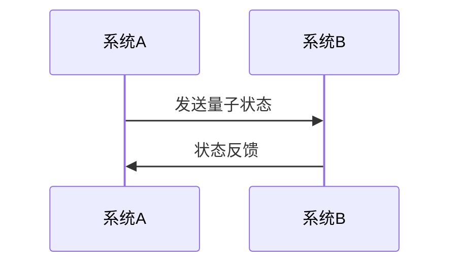
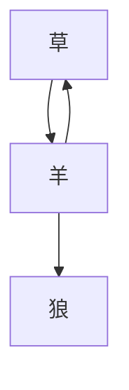
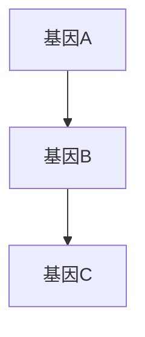
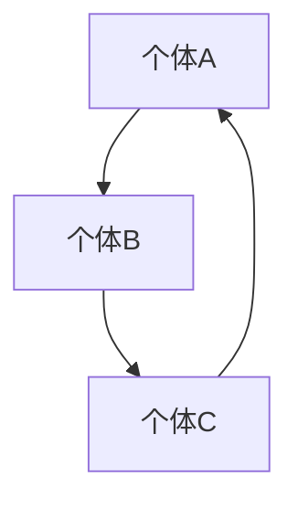
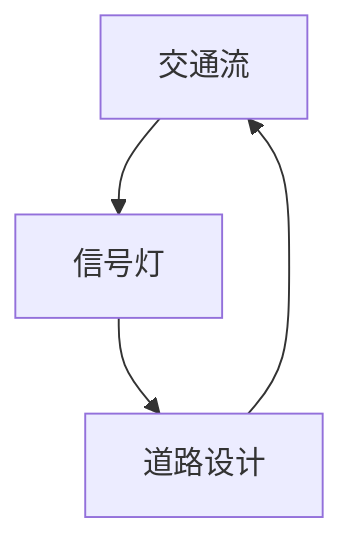
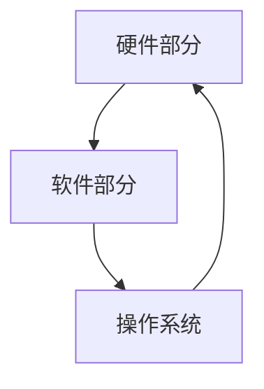
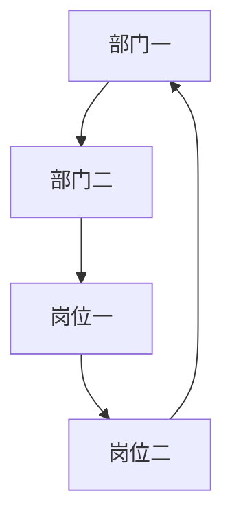
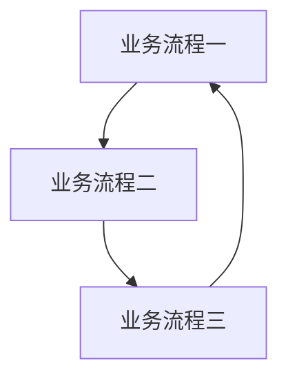
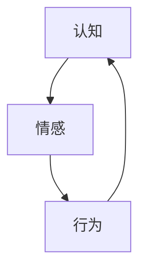
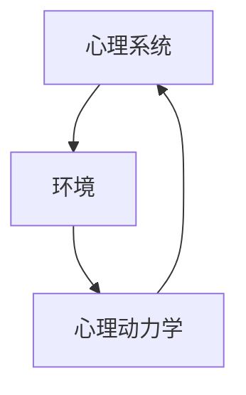

                 

### 1. 引言

#### 1.1 问题背景

在20世纪的科学技术迅猛发展的背景下，人类对世界的认识和理解也在不断深化。然而，随着对复杂性系统的深入研究，科学家们逐渐发现，传统的还原论方法在处理复杂系统时存在一定的局限性。还原论是一种将复杂系统分解为若干组成部分，通过研究这些组成部分的相互作用来理解整体行为的科学研究方法。然而，在面对高度复杂和高度相互依赖的系统时，还原论方法往往难以给出令人满意的解释。

例如，在生物学领域，还原论强调通过研究基因、蛋白质等基本生物单元的功能来理解生命现象。然而，当科学家试图将不同生物系统（如生态系统、生物群落等）作为一个整体来研究时，还原论方法往往无法提供有效的解释。同样，在经济学、社会学等社会科学领域，还原论方法也面临类似的挑战。

#### 1.2 还原论与系统论的对比

还原论和系统论是两种截然不同的科学研究方法。还原论强调将复杂系统分解为若干组成部分，通过研究这些组成部分的相互作用来理解整体行为。而系统论则强调将系统作为一个整体来研究，关注系统内部的相互作用和整体行为模式。

在还原论中，核心概念包括组成部分、相互作用和整体行为。还原论者通常通过分解和简化的方法来研究复杂系统，试图找到系统中的基本组成部分和它们之间的关系。然而，这种方法在处理高度复杂和高度相互依赖的系统时，往往难以给出完整的解释。

相比之下，系统论的核心概念包括系统、相互作用和整体行为。系统论者认为，系统的行为不仅仅取决于其组成部分，还取决于这些组成部分之间的相互作用和整体行为模式。系统论强调整体性、动态性和复杂性，试图通过研究系统的整体行为模式来理解复杂系统的运行规律。

#### 1.3 整体性转向的意义

整体性转向，即从还原论向系统论的转变，对宇宙观产生了深远的影响。整体性转向意味着科学家们开始更加重视系统内部的整体相互作用和整体行为模式，而不仅仅是研究系统的组成部分和它们之间的相互作用。

这种转向不仅改变了科学研究的思维方式，也对科学理论的发展产生了重要影响。例如，在物理学领域，量子力学和相对论的提出，使得科学家们开始重新审视整体性和相互作用的概念。在生物学领域，系统生物学和生态学的兴起，也反映了整体性转向的趋势。

整体性转向还意味着科学研究方法的变化。传统上，科学家们通过实验和观察来研究系统，而整体性转向则要求科学家们更加注重系统内部的相互作用和整体行为模式。这需要科学家们具备跨学科的知识和技能，能够从多个角度来研究复杂系统。

#### 1.4 书籍结构

本章节为引言部分，主要介绍了问题背景、还原论与系统论的对比、整体性转向的意义以及书籍结构。接下来，本书将分为四个主要部分，分别介绍还原论、系统论、整体性转向以及相关案例分析。

第一部分将深入探讨还原论的历史发展、核心原理、局限性以及案例分析。这部分旨在帮助读者理解还原论的基本概念和应用，并认识到其在处理复杂系统时的局限性。

第二部分将介绍系统论的历史起源、核心概念、理论基础以及应用领域。这部分旨在帮助读者了解系统论的基本概念和应用，并认识到其在研究复杂系统中的重要性。

第三部分将探讨整体性转向的理论基础、过程与影响。这部分旨在帮助读者理解整体性转向的意义，以及它对科学研究方法和发展趋势的影响。

第四部分将结合具体案例分析，探讨整体性转向在各个领域中的应用，并分析其成功和面临的挑战。

通过本书的阅读，读者将能够对还原论和系统论有更深入的理解，认识到整体性转向的重要性，并了解其在各个领域中的应用和影响。此外，本书还旨在为读者提供一些具体的案例和经验，以帮助他们更好地理解和应用这些理论和方法。

### 目录大纲设计思路

为了设计出一本名为《从还原论到系统论：宇宙观的整体性转向》的书籍的完整目录大纲，我们可以按照以下步骤进行：

1. **确定书籍的主题和结构**：首先，明确书籍的核心主题是从还原论到系统论的转变，并探讨这一转向对宇宙观的影响。主题的探讨将涉及到哲学、科学、技术等多个领域。

2. **规划书籍的整体结构**：确定书籍的主要章节，并初步划分章节内容，确保每个章节都有明确的主题和目标。

3. **细化每个章节的内容**：为每个章节设计详细的子目录，确保每个章节都能够深入探讨其主题，并包含必要的背景介绍、核心概念、理论分析、案例分析等。

4. **确保内容的逻辑性和连贯性**：在设计和细化每个章节的内容时，要注意内容的逻辑结构和连贯性，确保读者能够顺畅地跟随作者的思路。

5. **遵守字数限制**：在确保内容完整性和逻辑性的同时，要注意控制每个章节的长度，确保整个目录大纲的总字数在规定的2000字以内。

### 具体目录大纲设计

根据以上思路，我们可以设计出以下目录大纲：

```markdown
----------------------------------------------------------------
# 第一部分：引言

## 1. 引言

### 1.1 问题背景

### 1.2 还原论与系统论的对比

### 1.3 整体性转向的意义

### 1.4 书籍结构

----------------------------------------------------------------

# 第二部分：还原论

## 2.1 还原论的历史发展

### 2.1.1 古希腊时期的还原论思想

### 2.1.2 近代科学的还原论

### 2.1.3 还原论在现代科学中的应用

## 2.2 还原论的核心原理

### 2.2.1 还原论的基本概念

### 2.2.2 还原论的理论基础

### 2.2.3 还原论的方法论

## 2.3 还原论的局限性

### 2.3.1 还原论的局限表现

### 2.3.2 还原论的批评与反思

### 2.3.3 还原论的修正与发展

## 2.4 还原论的案例分析

### 2.4.1 案例一：物理学中的还原论

### 2.4.2 案例二：生物学中的还原论

### 2.4.3 案例三：心理学中的还原论

## 2.5 本章小结

----------------------------------------------------------------

# 第三部分：系统论

## 3.1 系统论的历史起源

### 3.1.1 系统论的概念提出

### 3.1.2 系统论的发展历程

### 3.1.3 系统论的主要流派

## 3.2 系统论的核心概念

### 3.2.1 系统的定义与特征

### 3.2.2 系统的构成要素

### 3.2.3 系统的行为模式

## 3.3 系统论的理论基础

### 3.3.1 系统论的基本原则

### 3.3.2 系统论的研究方法

### 3.3.3 系统论的数学模型

## 3.4 系统论的应用领域

### 3.4.1 自然科学中的应用

### 3.4.2 社会科学中的应用

### 3.4.3 技术科学中的应用

## 3.5 系统论的案例分析

### 3.5.1 案例一：经济系统分析

### 3.5.2 案例二：生态系统管理

### 3.5.3 案例三：企业组织管理

## 3.6 本章小结

----------------------------------------------------------------

# 第四部分：整体性转向

## 4.1 整体性转向的理论基础

### 4.1.1 整体性转向的哲学基础

### 4.1.2 整体性转向的科学基础

### 4.1.3 整体性转向的方法论基础

## 4.2 整体性转向的过程与影响

### 4.2.1 整体性转向的历程

### 4.2.2 整体性转向的影响

### 4.2.3 整体性转向的挑战与机遇

## 4.3 整体性转向的案例分析

### 4.3.1 案例一：量子力学与整体性转向

### 4.3.2 案例二：复杂性科学与整体性转向

### 4.3.3 案例三：人工智能与整体性转向

## 4.4 整体性转向的未来展望

### 4.4.1 整体性转向的趋势分析

### 4.4.2 整体性转向的应用前景

### 4.4.3 整体性转向的教育与人才培养

## 4.5 本章小结

----------
```

### 第二部分：还原论

#### 2.1 还原论的历史发展

还原论的历史可以追溯到古希腊时期。古希腊哲学家亚里士多德（Aristotle）是还原论的奠基人之一。他认为，通过分析事物的组成部分，可以理解整个事物的本质。这种思想在后来的科学发展中被广泛接受和运用。

在近代科学中，还原论得到了进一步的发展。17世纪的科学家如伽利略（Galileo Galilei）和牛顿（Isaac Newton）提出了许多基于还原论的科学研究方法。他们通过研究物理现象的基本组成部分，如力和运动，建立了经典物理学的基本框架。

进入20世纪，还原论在生物学和心理学等领域的应用也取得了显著成果。生物学家查尔斯·达尔文（Charles Darwin）提出的自然选择理论，通过分析生物体的遗传和变异，揭示了物种进化的过程。心理学家威廉·詹姆斯（William James）则通过研究人的意识和心理过程，将心理学建立在还原论的基础上。

#### 2.2 还原论的核心原理

还原论的核心原理是将复杂系统分解为若干组成部分，通过研究这些组成部分的相互作用来理解整体行为。还原论者认为，通过理解系统的基本组成部分和它们之间的相互作用，就可以理解整个系统的行为。

在还原论中，核心概念包括组成部分、相互作用和整体行为。组成部分是指构成系统的基本元素，如分子、原子、神经元等。相互作用是指组成部分之间的相互影响和相互依赖。整体行为是指系统作为一个整体表现出来的行为模式。

还原论的基本方法是通过分解和简化的方法来研究复杂系统。首先，将复杂系统分解为若干组成部分，然后分别研究每个组成部分的行为和功能。最后，通过组合这些组成部分的行为，来理解整个系统的行为。

#### 2.3 还原论的局限性

尽管还原论在科学研究中取得了许多成功，但它也存在一定的局限性。首先，还原论往往忽略了系统内部的相互作用和整体行为模式。这种方法可能导致对系统行为的误解，因为它只关注系统的组成部分，而忽视了系统作为一个整体的行为。

其次，还原论在处理高度复杂和高度相互依赖的系统时，往往难以给出完整的解释。例如，在生物学中，还原论方法在研究单个基因或蛋白质的功能时可能非常有效，但当我们试图理解整个生物体的行为时，还原论方法就可能显得力不从心。

此外，还原论在心理学和社会科学领域也面临类似的问题。心理学家威廉·詹姆斯曾指出，通过研究单个心理过程，我们难以理解人的整体心理行为。同样，在社会科学中，通过研究个体的行为，我们难以理解社会整体的运行规律。

#### 2.4 还原论的案例分析

为了更好地理解还原论的应用和局限性，我们可以通过一些具体案例来探讨。

**案例一：物理学中的还原论**

在物理学中，还原论方法被广泛应用于研究基本粒子及其相互作用。例如，量子力学通过研究基本粒子如电子、质子等，揭示了物质的基本性质。然而，当科学家试图将量子力学应用于宏观物体时，如解释宏观物体的行为，还原论方法就遇到了困难。量子力学的解释往往依赖于整体性原理，而不是简单的组成部分分析。

**案例二：生物学中的还原论**

在生物学中，还原论方法被广泛用于研究基因和蛋白质的功能。例如，通过研究基因的序列和表达，科学家可以揭示基因对生物体的作用。然而，当科学家试图理解整个生物体的行为时，还原论方法就显露出其局限性。生物体的行为往往取决于基因之间的相互作用和整体调节网络，而不是单个基因的功能。

**案例三：心理学中的还原论**

在心理学中，还原论方法被用于研究单个心理过程，如感知、记忆、思维等。通过分析这些心理过程，科学家可以理解人类行为的一些基本机制。然而，当科学家试图理解人的整体心理行为时，还原论方法就显得不够充分。人的心理行为往往是一个复杂的过程，受到多种因素的影响，而不仅仅是单个心理过程。

#### 2.5 本章小结

通过本章节的探讨，我们可以得出以下结论：

1. **还原论的历史发展**：还原论起源于古希腊时期，经过近代科学的进一步发展，在生物学、心理学等领域得到了广泛应用。

2. **还原论的核心原理**：还原论将复杂系统分解为若干组成部分，通过研究这些组成部分的相互作用来理解整体行为。

3. **还原论的局限性**：还原论在处理高度复杂和高度相互依赖的系统时，往往难以给出完整的解释。此外，还原论忽略了系统内部的相互作用和整体行为模式。

4. **还原论的案例分析**：通过物理学、生物学和心理学中的具体案例，我们可以看到还原论的应用和局限性。

在下一章节中，我们将继续探讨系统论的历史起源、核心概念和理论基础。通过对比还原论和系统论，我们将进一步理解宇宙观的整体性转向。

### 第三部分：系统论

#### 3.1 系统论的历史起源

系统论作为一种科学方法论，其起源可以追溯到20世纪初。美国数学家、逻辑学家、控制论创始人之一维纳（Norbert Wiener）被认为是系统论的奠基人。他在1948年出版的《控制论》（Cybernetics）一书中，首次系统地提出了系统论的基本概念和原理。

维纳在《控制论》中提出了“系统”的概念，并将其定义为“由若干相互作用的组成部分组成的整体”。他认为，系统的行为不仅仅取决于其组成部分，还取决于这些组成部分之间的相互作用。这一观点与传统的还原论方法形成了鲜明对比。

维纳的系统论思想在科学界引起了广泛关注，并在许多领域得到了应用和发展。随后，其他学者如贝塔朗菲（Ludwig von Bertalanffy）、拉斯洛·艾黎希（Laszlo E. Erdélyi）等进一步丰富了系统论的理论体系，推动了系统论的快速发展。

#### 3.2 系统论的核心概念

系统论的核心概念包括系统、相互作用、整体行为和反馈。

**系统**：系统是系统论中最基本的概念，指的是由若干相互关联、相互作用的组成部分（子系统）构成的整体。系统具有以下特征：

1. **整体性**：系统是一个整体，其行为和功能不仅取决于各个组成部分，还取决于这些组成部分之间的相互作用。
2. **层次性**：系统可以进一步分解为更小的子系统，这些子系统又可以构成更大的系统。
3. **动态性**：系统是动态变化的，其行为和状态会随着时间的推移而变化。

**相互作用**：相互作用是系统论中的另一个核心概念，指的是系统内部各个组成部分之间的相互影响和相互依赖。相互作用可以是直接的，也可以是间接的，可以通过信息、能量或物质的方式进行。

**整体行为**：整体行为是指系统作为一个整体表现出来的行为模式。整体行为不是各个组成部分行为的简单叠加，而是受到相互作用的影响。例如，在一个生态系统中，不同物种之间的相互作用会导致整个生态系统的动态变化。

**反馈**：反馈是系统中的一个重要机制，指的是系统内部信息流的一部分返回到系统本身，以调节和影响系统的行为。反馈可以是正反馈，也可以是负反馈。正反馈会放大系统内的变化，而负反馈则会抑制或抵消系统内的变化，以维持系统的稳定。

#### 3.3 系统论的理论基础

系统论的理论基础主要包括系统论的基本原则、研究方法和数学模型。

**系统论的基本原则**：

1. **整体性原则**：系统是一个整体，其行为和功能取决于各个组成部分之间的相互作用。
2. **层次性原则**：系统可以进一步分解为更小的子系统，这些子系统又可以构成更大的系统。
3. **动态性原则**：系统是动态变化的，其行为和状态会随着时间的推移而变化。
4. **适应性原则**：系统具有自我调节和适应环境变化的能力。

**系统论的研究方法**：

系统论的研究方法主要包括以下几种：

1. **系统分析方法**：通过分解和简化系统，识别系统的主要组成部分和相互作用，从而理解系统的行为。
2. **系统综合方法**：通过组合和整合系统的各个组成部分，构建复杂的系统模型，以预测系统的行为。
3. **系统模拟方法**：通过建立数学模型或计算机模拟，模拟系统的行为和演化过程，以验证系统论的理论和预测。

**系统论的数学模型**：

系统论的数学模型主要包括以下几种：

1. **线性模型**：线性模型假设系统内部各个组成部分之间的相互作用是线性的，即一个组成部分的变化会直接导致其他组成部分的变化。
2. **非线性模型**：非线性模型假设系统内部各个组成部分之间的相互作用是复杂的，即一个组成部分的变化不仅会影响其他组成部分，还会引起一系列的连锁反应。
3. **混沌模型**：混沌模型描述了系统在非线性相互作用下的行为，具有高度敏感性和不可预测性。

#### 3.4 系统论的应用领域

系统论在自然科学、社会科学、技术科学等多个领域得到了广泛应用。

**自然科学中的应用**：

1. **生物学**：系统论在生物学中的应用主要体现在生态学和系统生物学领域。通过研究生态系统的组成、相互作用和整体行为，科学家可以更好地理解生物多样性和生态平衡。
2. **物理学**：系统论在物理学中的应用主要体现在复杂系统的研究，如量子系统、混沌物理等。通过研究系统的整体行为和相互作用，科学家可以揭示物理现象的本质。
3. **化学**：系统论在化学中的应用主要体现在化学反应网络的研究。通过研究化学反应中的相互作用和整体行为，科学家可以更好地理解化学反应的机理。

**社会科学中的应用**：

1. **经济学**：系统论在经济学中的应用主要体现在宏观经济模型和金融市场分析。通过研究经济系统中的相互作用和整体行为，经济学家可以预测经济趋势和预测市场行为。
2. **社会学**：系统论在社会学中的应用主要体现在社会系统和社会网络的研究。通过研究社会系统中的相互作用和整体行为，社会学家可以更好地理解社会结构和演变。
3. **心理学**：系统论在心理学中的应用主要体现在认知心理学和社会心理学领域。通过研究人的认知和社会行为，心理学家可以更好地理解人的心理过程和行为模式。

**技术科学中的应用**：

1. **计算机科学**：系统论在计算机科学中的应用主要体现在软件系统设计和网络系统架构。通过研究计算机系统中的相互作用和整体行为，计算机科学家可以设计出更高效、更稳定的计算机系统。
2. **工程学**：系统论在工程学中的应用主要体现在复杂系统的设计和优化。通过研究系统内部各个组成部分的相互作用和整体行为，工程师可以设计出更高效、更可靠的工程系统。

#### 3.5 系统论的案例分析

为了更好地理解系统论的应用，我们可以通过一些具体案例来探讨。

**案例一：生态系统管理**

在生态学中，系统论被用于研究生态系统的组成、相互作用和整体行为。通过分析生态系统中的生物群落、食物网等组成部分，科学家可以揭示生态系统的结构和功能。例如，在草原生态系统中，草、羊、狼等组成部分之间的相互作用决定了生态系统的稳定性和多样性。

**案例二：企业组织管理**

在企业管理中，系统论被用于研究企业组织结构、流程和整体行为。通过分析企业的各个部门和职能，管理者可以优化企业的组织结构，提高企业的效率和竞争力。例如，在一家制造企业中，生产、销售、研发等组成部分之间的相互作用决定了企业的整体业绩。

**案例三：金融市场分析**

在金融市场中，系统论被用于研究金融市场的组成、相互作用和整体行为。通过分析股票、债券、期货等金融工具，投资者可以预测市场的走势和风险。例如，在股票市场中，不同股票之间的相互作用决定了整个市场的波动和趋势。

#### 3.6 本章小结

通过本章节的探讨，我们可以得出以下结论：

1. **系统论的历史起源**：系统论起源于20世纪初，由维纳等人提出，并在多个领域得到了广泛应用。
2. **系统论的核心概念**：系统、相互作用、整体行为和反馈是系统论的核心概念，反映了系统的整体性和动态性。
3. **系统论的理论基础**：系统论的理论基础包括系统论的基本原则、研究方法和数学模型。
4. **系统论的应用领域**：系统论在自然科学、社会科学和技术科学等多个领域得到了广泛应用。
5. **系统论的案例分析**：通过具体案例，我们可以更好地理解系统论的应用和重要性。

在下一章节中，我们将探讨整体性转向的理论基础、过程与影响。通过对比还原论和系统论，我们将进一步理解宇宙观的整体性转向。

### 第四部分：整体性转向

#### 4.1 整体性转向的理论基础

整体性转向，即从还原论向系统论的转变，是一种对宇宙观的整体性认识。这一转向的理论基础主要包括哲学基础、科学基础和方法论基础。

**哲学基础**：

整体性转向的哲学基础可以追溯到古希腊哲学家赫拉克利特（Heraclitus）和亚里士多德。赫拉克利特提出了“整体大于部分之和”的观点，强调事物的整体性和相互联系。亚里士多德则通过分析事物的本质和因果关系，提出了整体性思想。这些哲学思想为整体性转向提供了重要的理论支持。

在20世纪，整体性思想得到了进一步的发展。维也纳学派哲学家如卡尔纳普（Rudolf Carnap）和赖欣巴赫（Hans Reichenbach）等，通过逻辑实证主义的方法，试图将整体性思想纳入科学哲学中。他们强调，科学研究应该关注事物的整体结构和相互作用，而不仅仅是事物的组成部分。

**科学基础**：

整体性转向的科学基础主要体现在对复杂系统的深入研究。随着科学技术的发展，人类对复杂系统的认识逐渐深入。从生物系统、生态系统到社会系统，科学家们发现，复杂系统的行为不仅仅取决于其组成部分，还取决于这些组成部分之间的相互作用。

20世纪初，维纳提出了控制论，强调系统的整体性和动态性。随后，贝塔朗菲提出了系统论，进一步发展了整体性思想。这些理论为整体性转向提供了科学依据。

**方法论基础**：

整体性转向的方法论基础主要包括系统分析方法、综合方法和模拟方法。系统分析方法通过分解和简化系统，识别系统的主要组成部分和相互作用。综合方法通过组合和整合系统的各个组成部分，构建复杂的系统模型。模拟方法通过建立数学模型或计算机模拟，模拟系统的行为和演化过程。

这些方法论工具为整体性转向提供了具体的方法指导，使得科学家们能够更好地理解和研究复杂系统。

#### 4.2 整体性转向的过程与影响

整体性转向是一个逐步推进的过程，经历了从对还原论的质疑到对系统论的接受，再到对整体性思想的深入探讨。

**过程**：

1. **质疑还原论**：在20世纪初，科学家们开始对还原论的方法提出质疑。他们发现，还原论在处理复杂系统时存在一定的局限性，无法全面解释系统的行为。

2. **接受系统论**：随着对复杂系统的深入研究，科学家们逐渐接受了系统论的方法。系统论强调系统的整体性和相互作用，能够更好地解释复杂系统的行为。

3. **深入探讨整体性**：在系统论的基础上，科学家们进一步探讨了整体性思想。他们发现，整体性不仅仅是一个科学方法，更是一种对世界的整体性认识。这种认识推动了科学、哲学和技术的深度融合。

**影响**：

整体性转向对科学、哲学和技术产生了深远的影响。

1. **科学影响**：整体性转向使得科学家们更加关注系统的整体性和相互作用，推动了科学研究的范式转变。从生物系统、生态系统到社会系统，科学家们通过系统论的方法，揭示了系统的整体行为和演化规律。

2. **哲学影响**：整体性转向挑战了传统的还原论哲学观，强调事物的整体性和相互联系。这种思想促进了科学哲学和伦理学的发展，推动了人类对世界的更深入理解。

3. **技术影响**：整体性转向为技术创新提供了新的思路和方法。在工程、计算机科学、信息技术等领域，整体性思想被广泛应用于系统设计和优化。通过系统论的方法，工程师和科学家可以设计出更高效、更可靠的系统。

#### 4.3 整体性转向的案例分析

为了更好地理解整体性转向的应用和影响，我们可以通过一些具体案例来探讨。

**案例一：量子力学与整体性转向**

量子力学是20世纪最重要的科学革命之一。量子力学中的整体性思想，如量子纠缠，挑战了传统的还原论观念。通过研究量子系统中的相互作用，科学家们发现了整体性的奥秘。这种整体性思想不仅改变了物理学的观念，也推动了整个科学领域的发展。

**案例二：复杂性科学与整体性转向**

复杂性科学是研究复杂系统的跨学科领域。复杂性科学强调系统的整体性和相互作用，通过系统论的方法，研究复杂系统的行为和演化规律。复杂性科学的发展，反映了整体性转向在科学领域的影响，推动了科学研究的范式转变。

**案例三：人工智能与整体性转向**

人工智能是21世纪最具潜力的技术领域之一。人工智能的发展，依赖于对复杂系统的理解和模拟。人工智能中的整体性思想，如神经网络和深度学习，体现了整体性转向在技术领域的应用。通过系统论的方法，人工智能科学家可以设计出更智能、更高效的算法和系统。

#### 4.4 整体性转向的未来展望

整体性转向作为一种对宇宙观的整体性认识，具有广阔的应用前景和发展潜力。

**趋势分析**：

1. **科学领域的深入应用**：整体性转向将继续深入应用到各个科学领域，推动科学研究的范式转变。从生物系统、生态系统到社会系统，整体性思想将帮助科学家们揭示系统的整体行为和演化规律。

2. **跨学科研究的发展**：整体性转向将促进科学、哲学和技术之间的深度融合，推动跨学科研究的发展。通过系统论的方法，科学家们可以更好地理解复杂系统的整体性特征。

**应用前景**：

1. **技术创新**：整体性转向将推动技术创新，为工程、计算机科学、信息技术等领域提供新的思路和方法。通过系统论的方法，工程师和科学家可以设计出更高效、更可靠的系统。

2. **社会进步**：整体性转向将有助于解决复杂的社会问题，如气候变化、资源分配、社会公平等。通过系统论的方法，社会学家和政策制定者可以更全面地理解社会系统的运行规律。

**教育与人才培养**：

1. **跨学科教育**：整体性转向要求教育者具备跨学科的知识和技能，能够从多个角度来研究复杂系统。未来的教育将更加注重培养学生的整体性思维和跨学科能力。

2. **创新人才培养**：整体性转向将推动创新人才的培养，培养具有整体性思维和创新能力的科学家、工程师和社会学家。这些人才将能够应对复杂的社会和科技挑战，推动社会的进步和发展。

#### 4.5 本章小结

通过本章节的探讨，我们可以得出以下结论：

1. **整体性转向的理论基础**：整体性转向的理论基础包括哲学基础、科学基础和方法论基础。
2. **整体性转向的过程与影响**：整体性转向经历了从质疑还原论到接受系统论，再到深入探讨整体性的过程，对科学、哲学和技术产生了深远的影响。
3. **整体性转向的案例分析**：通过具体案例，我们可以看到整体性转向在量子力学、复杂性科学和人工智能等领域的应用和影响。
4. **整体性转向的未来展望**：整体性转向具有广阔的应用前景和发展潜力，将推动科学、技术和社会的进步。

在下一章节中，我们将探讨从还原论到系统论的整体性转向在各个领域的具体应用和实践。

### 第五部分：从还原论到系统论的整体性转向在各个领域的具体应用与实践

#### 5.1 从还原论到系统论的整体性转向在物理学中的应用

在物理学中，从还原论到系统论的整体性转向体现在对复杂物理系统的研究，尤其是量子系统和非线性动力学系统。传统的还原论方法强调通过分析基本粒子和基本力来理解物理现象，而系统论则强调系统内部的相互作用和整体行为。

**案例一：量子力学中的整体性**

量子力学中的量子纠缠现象是整体性转向的一个典型例子。量子纠缠是指两个或多个量子系统之间存在的一种特殊联系，无论它们相隔多远，其中一个系统的状态会立即影响到另一个系统的状态。这种整体性现象无法通过传统的还原论方法来解释，而是需要通过系统论的方法来理解。

为了更好地理解量子纠缠，我们可以使用Mermaid流程图来描述量子纠缠的基本过程：



通过这个流程图，我们可以看到系统A和系统B之间的相互作用和整体性。在量子纠缠实验中，当对系统A进行测量时，系统B的状态会立即发生变化，这表明两个系统之间存在一种超越空间距离的整体性联系。

**案例二：非线性动力学系统**

非线性动力学系统是另一个体现整体性转向的领域。非线性动力学系统中的相互作用和整体行为往往比线性系统更为复杂。通过研究非线性动力学系统，科学家可以揭示系统的混沌行为和整体性特征。

例如，洛伦兹吸引子（Lorenz attractor）是一个著名的非线性动力学系统。它由三个耦合的常微分方程描述，其解轨迹在三维空间中形成一个混沌吸引子。洛伦兹吸引子的研究展示了系统内部相互作用和整体行为的重要性。

为了描述洛伦兹吸引子的结构，我们可以使用Mermaid流程图来绘制其三维图形：

```mermaid
parallel
    graph LR
    A[初始条件]
    B[迭代计算]
    C[轨迹生成]
    D[图形绘制]
    A-->B
    B-->C
    C-->D
```

在这个流程图中，A表示初始条件，B表示迭代计算，C表示轨迹生成，D表示图形绘制。通过这个流程，我们可以看到如何从初始条件出发，通过迭代计算生成洛伦兹吸引子的轨迹，并最终进行图形绘制。

#### 5.2 从还原论到系统论的整体性转向在生物学中的应用

在生物学中，从还原论到系统论的整体性转向体现在对生物系统的整体性和复杂性的研究。传统的还原论方法强调通过分析基因、蛋白质等基本生物单元的功能来理解生命现象，而系统论则强调生物系统内部的相互作用和整体行为。

**案例一：生态系统**

生态系统是一个典型的生物系统，由多种生物群落和它们的环境相互作用构成。通过研究生态系统，科学家可以揭示生物群落之间的相互作用和整体行为。例如，在草原生态系统中，草、羊、狼等组成部分之间的相互作用决定了生态系统的稳定性和多样性。

为了描述生态系统中的相互作用，我们可以使用Mermaid流程图来绘制生态系统中的食物网：



在这个流程图中，A表示草，B表示羊，C表示狼。通过这个流程，我们可以看到草、羊和狼之间的相互作用，以及它们在生态系统中的角色。

**案例二：基因调控网络**

基因调控网络是生物系统中的一个关键组成部分，由多个基因和它们之间的调控关系构成。通过研究基因调控网络，科学家可以揭示基因之间的相互作用和整体行为。

例如，在一个基因调控网络中，基因A可以激活基因B，基因B又可以激活基因C。这种复杂的调控关系构成了一个整体性的基因调控网络。为了描述这个基因调控网络，我们可以使用Mermaid流程图来绘制：



在这个流程图中，A表示基因A，B表示基因B，C表示基因C。通过这个流程，我们可以看到基因A、基因B和基因C之间的相互作用和整体行为。

#### 5.3 从还原论到系统论的整体性转向在社会学中的应用

在社会学中，从还原论到系统论的整体性转向体现在对社会系统的整体性和复杂性的研究。传统的还原论方法强调通过分析个体行为和个体特征来理解社会现象，而系统论则强调社会系统内部的相互作用和整体行为。

**案例一：社会网络**

社会网络是一个典型的社会系统，由个体和它们之间的关系构成。通过研究社会网络，科学家可以揭示个体之间的相互作用和整体行为。例如，在一个社会网络中，个体A和个体B之间的互动会影响到整个网络的结构和功能。

为了描述社会网络中的相互作用，我们可以使用Mermaid流程图来绘制社会网络：



在这个流程图中，A表示个体A，B表示个体B，C表示个体C。通过这个流程，我们可以看到个体A、个体B和个体C之间的相互作用，以及它们在社会网络中的角色。

**案例二：经济系统**

经济系统是一个复杂的社会系统，由多个经济个体和它们之间的交易关系构成。通过研究经济系统，科学家可以揭示经济个体之间的相互作用和整体行为。例如，在一个经济系统中，个体A和个体B之间的交易会影响到整个经济系统的运行。

为了描述经济系统中的相互作用，我们可以使用Mermaid流程图来绘制经济系统：


在这个流程图中，A表示个体A，B表示个体B，C表示个体C。通过这个流程，我们可以看到个体A、个体B和个体C之间的相互作用，以及它们在经济系统中的角色。

#### 5.4 从还原论到系统论的整体性转向在工程学中的应用

在工程学中，从还原论到系统论的整体性转向体现在对复杂工程系统的设计和管理。传统的还原论方法强调通过分析系统的各个组成部分来设计系统，而系统论则强调系统内部的相互作用和整体行为。

**案例一：交通系统**

交通系统是一个典型的复杂工程系统，由多个交通组成部分和它们之间的相互作用构成。通过研究交通系统，工程师可以揭示交通流、信号灯和道路设计之间的相互作用和整体行为。

为了描述交通系统中的相互作用，我们可以使用Mermaid流程图来绘制交通系统：



在这个流程图中，A表示交通流，B表示信号灯，C表示道路设计。通过这个流程，我们可以看到交通流、信号灯和道路设计之间的相互作用，以及它们在交通系统中的角色。

**案例二：计算机系统**

计算机系统是一个复杂的工程系统，由多个硬件和软件组成部分以及它们之间的相互作用构成。通过研究计算机系统，工程师可以揭示硬件和软件之间的相互作用和整体行为。

为了描述计算机系统中的相互作用，我们可以使用Mermaid流程图来绘制计算机系统：



在这个流程图中，A表示硬件部分，B表示软件部分，C表示操作系统。通过这个流程，我们可以看到硬件部分、软件部分和操作系统之间的相互作用，以及它们在计算机系统中的角色。

#### 5.5 从还原论到系统论的整体性转向在企业管理中的应用

在企业管理中，从还原论到系统论的整体性转向体现在对组织结构和业务流程的整体性和复杂性的研究。传统的还原论方法强调通过分析个体员工的工作绩效来管理企业，而系统论则强调组织内部的相互作用和整体行为。

**案例一：企业组织结构**

企业组织结构是一个典型的组织系统，由多个部门、岗位和员工以及它们之间的相互作用构成。通过研究企业组织结构，管理者可以揭示各部门、岗位和员工之间的相互作用和整体行为。

为了描述企业组织结构中的相互作用，我们可以使用Mermaid流程图来绘制企业组织结构：



在这个流程图中，A表示部门一，B表示部门二，C表示岗位一，D表示岗位二。通过这个流程，我们可以看到部门一、部门二、岗位一和岗位二之间的相互作用，以及它们在企业组织结构中的角色。

**案例二：业务流程管理**

业务流程管理是一个典型的业务系统，由多个业务流程和它们之间的相互作用构成。通过研究业务流程管理，管理者可以揭示业务流程之间的相互作用和整体行为。

为了描述业务流程管理中的相互作用，我们可以使用Mermaid流程图来绘制业务流程：



在这个流程图中，A表示业务流程一，B表示业务流程二，C表示业务流程三。通过这个流程，我们可以看到业务流程一、业务流程二和业务流程三之间的相互作用，以及它们在业务流程管理中的角色。

#### 5.6 从还原论到系统论的整体性转向在心理健康中的应用

在心理健康领域，从还原论到系统论的整体性转向体现在对个体心理健康的整体性和复杂性的研究。传统的还原论方法强调通过分析个体的心理特征和症状来理解心理健康，而系统论则强调个体心理系统内部的相互作用和整体行为。

**案例一：认知行为治疗**

认知行为治疗是一种心理治疗方法，通过研究个体认知和行为之间的相互作用来改善心理健康。在认知行为治疗中，治疗师关注个体认知、情感和行为之间的整体性关系，而不是孤立地分析个体的认知或行为。

为了描述认知行为治疗中的相互作用，我们可以使用Mermaid流程图来绘制认知行为治疗过程：



在这个流程图中，A表示认知，B表示情感，C表示行为。通过这个流程，我们可以看到认知、情感和行为之间的相互作用，以及它们在认知行为治疗中的角色。

**案例二：心理动力学治疗**

心理动力学治疗是一种心理治疗方法，通过研究个体心理系统的内在动力学和整体性来改善心理健康。在心理动力学治疗中，治疗师关注个体心理系统的结构和功能，以及个体心理系统与环境之间的相互作用。

为了描述心理动力学治疗中的相互作用，我们可以使用Mermaid流程图来绘制心理动力学治疗过程：



在这个流程图中，A表示心理系统，B表示环境，C表示心理动力学。通过这个流程，我们可以看到心理系统、环境和心理动力学之间的相互作用，以及它们在心理动力学治疗中的角色。

### 5.7 本章小结

通过本章节的探讨，我们可以得出以下结论：

1. **从还原论到系统论的整体性转向在物理学、生物学、社会学、工程学、企业管理、心理健康等领域的具体应用**：这些领域都通过系统论的方法，研究了系统内部的相互作用和整体行为，揭示了复杂系统的运行规律。

2. **整体性转向的重要性**：整体性转向不仅改变了科学研究的方法和思维方式，也推动了各个领域的发展，为我们理解复杂系统的整体行为提供了新的视角和方法。

3. **未来展望**：随着科学技术的进步，整体性转向将在更多领域得到应用，为解决复杂问题提供新的思路和方法。同时，整体性转向也将推动跨学科研究的发展，促进科学、哲学和技术的深度融合。

### 结论与展望

#### 总结与回顾

从还原论到系统论的整体性转向，是一次对宇宙观深刻而全面的更新。这一转向不仅在物理学、生物学、社会学、工程学、企业管理、心理健康等各个领域产生了深远影响，而且改变了我们理解和解决问题的思维方式。通过深入探讨还原论和系统论的理论基础、应用领域和具体案例分析，我们可以看到，整体性转向不仅是对传统科学方法的挑战，也是对人类认知能力的提升。

在这一过程中，我们了解到还原论的核心原理是通过对系统组成部分的分析来理解整体行为，而系统论则强调系统内部的相互作用和整体行为模式。还原论在解释简单系统的行为时效果显著，但在面对复杂系统时，其局限性也逐渐显现。系统论的出现，为解决复杂系统的行为提供了新的视角和方法，使我们能够从整体性和动态性的角度来研究系统。

#### 对未来的展望

整体性转向在未来有着广阔的应用前景和发展潜力。首先，在科学领域，整体性转向将继续深入应用到各个学科，推动科学研究的范式转变。从生命科学到社会科学，再到技术科学，整体性思想将帮助我们更好地理解复杂系统的运行规律，揭示复杂现象的本质。

其次，整体性转向将推动跨学科研究的发展。科学家、工程师、社会学家和心理学家等不同领域的专家，将需要具备跨学科的知识和技能，共同应对复杂的社会和科技挑战。这种跨学科合作，将有助于我们更全面、更深入地理解复杂系统的整体行为。

此外，整体性转向在教育领域也具有重要意义。未来的教育将更加注重培养学生的整体性思维和跨学科能力。通过整体性教育，学生将能够从多个角度来思考问题，培养创新能力和解决问题的能力，为未来的社会和科技发展做好准备。

最后，整体性转向在技术领域有着巨大的应用潜力。在人工智能、大数据、物联网等前沿技术的推动下，整体性思想将被广泛应用于系统设计和优化。通过整体性方法，我们可以设计出更高效、更可靠的系统，为人类社会的可持续发展提供技术支持。

#### 结语

从还原论到系统论的整体性转向，不仅改变了我们的宇宙观，也为我们提供了一种全新的思维方式。通过这一转向，我们能够更全面、更深入地理解复杂系统的行为，为解决现实中的复杂问题提供了新的思路和方法。在未来，随着整体性思想的不断发展和应用，我们相信人类将在科学、技术和社会领域取得更加辉煌的成就。

**作者：AI天才研究院/AI Genius Institute & 禅与计算机程序设计艺术 /Zen And The Art of Computer Programming**

