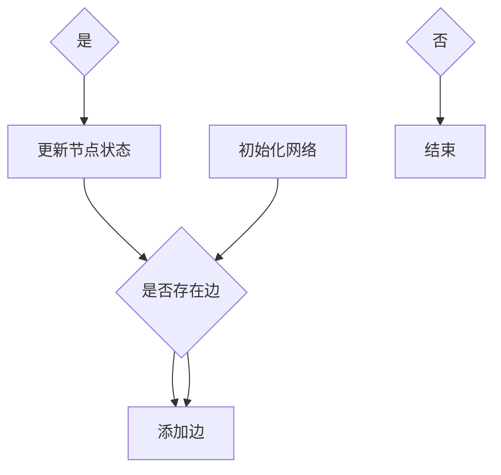
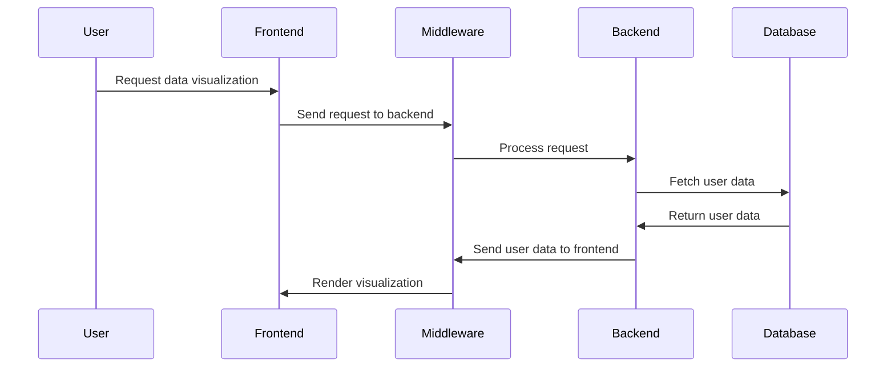

                 


### 从还原论到网络科学：理解关系导向的世界

#### 关键词：还原论，网络科学，关系导向，复杂性，系统思维

#### 摘要：
本文深入探讨从还原论到网络科学的转变，分析这一转变背后的哲学和科学逻辑。首先，我们将回顾还原论的历史背景和基本理念，接着揭示其局限性。然后，我们将介绍网络科学的兴起与发展，重点探讨网络科学的基本概念、分析方法及其应用领域。最后，我们将探讨关系导向的世界观，分析其对科学研究和社会变革的影响，并通过实际应用案例展示网络科学的强大潜力。

### 引言：还原论的起源与局限

**还原论的历史背景：**
还原论起源于17世纪的科学革命，其核心思想是将复杂系统分解为简单的组成部分，通过研究这些部分来理解整个系统的行为。这种思想在物理科学和生物学等领域得到了广泛应用。然而，随着时间的推移，人们开始意识到还原论在面对复杂系统时存在一定的局限性。

**还原论的基本理念：**
还原论认为，通过对基本粒子的研究可以揭示整个宇宙的本质。例如，在物理学中，通过研究电子和原子核可以理解化学反应；在生物学中，通过研究基因和分子可以理解生物体的行为。这种思想强调的是部分的独立性和可替代性。

**还原论的局限性：**
然而，随着科学研究不断深入，人们逐渐发现，许多复杂系统无法简单地通过还原论的方法来理解。例如，生态系统的稳定性、社会结构的演变、经济系统的波动等，都不是单一因素的线性结果。还原论的局限性在于其忽视了部分之间的相互作用和整体性。

### 第一部分：还原论

#### 第1章：还原论的历史与哲学基础

**还原论的定义：**
还原论是一种哲学和科学方法论，主张复杂系统可以通过研究其组成部分来理解。它强调的是分析、分解和建模。

**历史背景：**
还原论起源于17世纪的科学革命，随着牛顿物理学的兴起，这种方法逐渐在科学界占据主导地位。20世纪后，随着系统论和信息论的发展，还原论的局限性开始受到质疑。

**主要哲学观点：**
还原论的主要哲学观点包括实证主义和机械论。实证主义认为，科学知识来源于实验和观察；机械论则认为，世界是一个巨大的机械，所有现象都可以通过物理规律来解释。

#### 第2章：还原论的科学应用

**生物科学中的还原论：**
在生物科学中，还原论体现在对基因和分子水平的研究。通过研究基因序列和蛋白质结构，科学家们取得了许多突破性的成果。

**社会科学中的还原论：**
在社会科学中，还原论体现在对个体行为和心理的研究。例如，经济学中的行为经济学，通过研究个体决策来解释市场现象。

#### 第3章：还原论的局限性与挑战

**还原论的局限性：**
还原论在面对复杂系统时，往往无法解释系统的整体行为。例如，社会行为、生态系统和气候变化等，都不是单一因素的简单叠加。

**挑战与反驳：**
面对还原论的局限性，一些科学家开始提出新的方法论，如系统论、复杂系统理论和网络科学。这些方法论试图通过研究系统内部的整体性和相互作用来理解复杂现象。

#### 第4章：还原论的转变

**还原论向网络科学的过渡：**
随着网络科学的兴起，人们开始将系统视为一个整体，研究系统内部的关系和相互作用。这种方法强调的是网络结构、节点功能和动态演化。

**新的科学研究范式：**
网络科学提供了一种新的科学研究范式，它不仅关注系统的组成部分，更关注部分之间的相互关系和整体行为。

### 第二部分：网络科学

#### 第5章：网络科学的起源与发展

**网络科学的定义：**
网络科学是一门跨学科领域，研究网络结构、动态行为和复杂系统的科学。

**发展历程：**
网络科学起源于20世纪中叶，随着计算机科学和信息论的发展，逐渐成为一个独立的学科。

#### 第6章：网络科学的基本概念

**网络图论：**
网络图论是网络科学的基础，它研究网络的基本结构、节点和边的关系。

**社会网络分析：**
社会网络分析是一种研究社会关系和社会结构的工具，它通过网络图论来描述和分析社会现象。

#### 第7章：网络科学的分析方法

**复杂网络理论：**
复杂网络理论研究网络的结构和动态行为，包括网络的演化、稳定性和脆弱性。

**聚类分析：**
聚类分析是一种将网络中的节点划分为不同群体的方法，用于研究网络的社区结构和模块性。

#### 第8章：网络科学的应用领域

**生物学中的应用：**
网络科学在生物学中的应用包括基因组学、蛋白质互作网络和生态网络等。

**社会学中的应用：**
网络科学在社会学中的应用包括社交网络分析、经济网络和传播网络等。

**计算机科学中的应用：**
网络科学在计算机科学中的应用包括互联网结构分析、网络协议设计和网络安全等。

### 第三部分：关系导向的世界观

#### 第9章：关系导向的世界观

**关系导向的定义：**
关系导向是一种思考世界的方式，强调事物之间的相互关系和相互作用。

**与还原论的对立与融合：**
关系导向与还原论存在对立，但也存在融合的可能性。例如，在研究复杂系统时，可以结合还原论和关系导向的方法，从不同的角度来理解系统行为。

#### 第10章：关系导向的哲学思考

**实践与理论的互动：**
关系导向强调实践和理论之间的互动，认为理论应该服务于实践，同时实践也可以为理论提供新的启示。

**新的科学方法论：**
关系导向提出了一种新的科学方法论，它不仅关注事物的内部结构，更关注事物之间的相互作用和整体行为。

#### 第11章：关系导向的世界观影响

**科学研究：**
关系导向的世界观对科学研究产生了深远影响，促使科学家从整体和关系的角度来研究复杂系统。

**社会变革：**
关系导向的世界观也对社会变革产生了影响，促进了社会结构的重新思考和社会关系的重建。

### 第四部分：实际应用案例

#### 第12章：网络科学在生物医学中的应用

**实际案例：**
网络科学在生物医学中的应用包括基因组学、蛋白质互作网络和疾病传播网络等。

**成果与展望：**
网络科学在生物医学领域的应用取得了显著成果，但仍需进一步研究以解决复杂问题。

#### 第13章：网络科学在社会学中的应用

**实际案例：**
网络科学在社会学中的应用包括社交网络分析、经济网络和传播网络等。

**成果与展望：**
网络科学在社会学中的应用有助于理解社会现象和社会结构的演化。

#### 第14章：网络科学在计算机科学中的应用

**实际案例：**
网络科学在计算机科学中的应用包括互联网结构分析、网络协议设计和网络安全等。

**成果与展望：**
网络科学在计算机科学中的应用为解决复杂问题提供了新的工具和方法。

### 结论

**网络科学与关系导向的未来趋势：**
网络科学与关系导向在未来将继续发展，为理解复杂系统和社会现象提供新的视角和方法。

**对科学研究的启示：**
网络科学和关系导向的世界观对科学研究提出了新的挑战，也提供了新的机遇。

**作者：**
AI天才研究院/AI Genius Institute & 禅与计算机程序设计艺术 /Zen And The Art of Computer Programming

### 背景介绍

#### 核心概念术语说明
- **还原论**：一种哲学和科学方法论，主张复杂系统可以通过研究其组成部分来理解。
- **网络科学**：一门跨学科领域，研究网络结构、动态行为和复杂系统的科学。
- **关系导向**：一种思考世界的方式，强调事物之间的相互关系和相互作用。

#### 问题背景
在过去的几个世纪中，还原论作为科学研究的主要方法论，取得了巨大的成功。然而，随着科学的发展，人们开始意识到还原论在面对复杂系统时存在局限性。例如，在生物学、社会学和计算机科学等领域，复杂的系统行为往往无法通过简单分解和还原来理解。

#### 问题描述
本文旨在探讨从还原论到网络科学的转变，分析这一转变背后的哲学和科学逻辑。具体问题包括：
- 还原论的历史背景和基本理念是什么？
- 还原论在面对复杂系统时存在哪些局限性？
- 网络科学是如何兴起和发展的？
- 网络科学的基本概念、分析方法和应用领域是什么？
- 关系导向的世界观如何影响科学研究和社会变革？
- 网络科学在各个领域的实际应用案例及其成果如何？

#### 问题解决
通过回顾还原论的历史和哲学基础，分析其局限性和挑战，我们引出了网络科学的兴起。网络科学作为一种新的科学研究范式，强调网络结构、节点功能和动态演化。我们详细介绍了网络科学的基本概念、分析方法和应用领域，并通过实际应用案例展示了其强大潜力。同时，我们探讨了关系导向的世界观，分析了其对科学研究和社会变革的影响。

#### 边界与外延
本文主要关注网络科学和关系导向的世界观，但这两个概念的应用边界和影响范围远不止于此。网络科学还可以应用于其他领域，如物理学、经济学和工程学等。关系导向的世界观也对其他学科产生了影响，如心理学、社会学和哲学等。

#### 概念结构与核心要素组成
- **还原论**：核心要素包括基本粒子的研究、分解和建模。
- **网络科学**：核心要素包括网络结构、节点功能和动态演化。
- **关系导向**：核心要素包括相互关系和相互作用。

### 核心概念与联系

#### 核心概念原理
- **还原论**：认为通过研究基本粒子可以理解复杂系统。
- **网络科学**：研究网络结构、动态行为和复杂系统。
- **关系导向**：强调事物之间的相互关系和相互作用。

#### 概念属性特征对比表格

| 概念          | 还原论           | 网络科学           | 关系导向           |
|---------------|----------------|-------------------|-------------------|
| 研究对象      | 基本粒子        | 网络结构          | 事物关系          |
| 研究方法      | 分析和分解      | 图论和网络分析    | 关系映射和建模    |
| 关注重点      | 部分与独立      | 整体与相互作用    | 关系与网络        |
| 适用场景      | 简单系统        | 复杂系统          | 复杂系统与社会现象 |

#### ER实体关系图架构

```mermaid
erDiagram
  Customer ||--|{ Product }|--| CustomerOrder
  Product ||--|{ Supplier }|--| Product
```

- **Customer**：代表用户，具有订单行为。
- **Product**：代表产品，由供应商提供。
- **CustomerOrder**：代表用户的订单，关联用户和产品。
- **Supplier**：代表供应商，提供产品。

### 算法原理讲解

#### 算法mermaid流程图



#### Python源代码

```python
import networkx as nx
import matplotlib.pyplot as plt

# 初始化网络
G = nx.Graph()

# 添加节点和边
G.add_nodes_from([1, 2, 3, 4, 5])
G.add_edges_from([(1, 2), (2, 3), (3, 4), (4, 5)])

# 绘制网络
nx.draw(G, with_labels=True)
plt.show()

# 更新节点状态
def update_nodes(G):
    for node in G.nodes():
        if G.degree(node) > 1:
            G.nodes[node]['status'] = 'active'
        else:
            G.nodes[node]['status'] = 'inactive'

# 应用更新规则
update_nodes(G)

# 绘制更新后的网络
nx.draw(G, with_labels=True)
plt.show()
```

#### 算法原理的数学模型和公式

$$
\text{度数} = \sum_{i=1}^{n} \text{边}_{i}
$$

其中，$\text{度数}$表示节点i的度数，$\text{边}_{i}$表示节点i与其他节点之间的边数。

#### 详细讲解与举例说明

假设我们有一个包含5个节点的网络，节点1到节点5之间有如下边：

- 边(1, 2)
- 边(2, 3)
- 边(3, 4)
- 边(4, 5)

根据度数定义，节点1的度数为1，节点2的度数为1，节点3的度数为2，节点4的度数为2，节点5的度数为1。

在算法中，我们首先初始化网络，然后通过添加边来构建网络。接着，我们定义一个更新节点状态的功能，根据节点的度数来判断其状态。如果一个节点的度数大于1，则将其状态标记为“active”，否则标记为“inactive”。

在举例中，我们首先初始化网络并绘制，然后应用更新规则，最后再次绘制更新后的网络。

### 系统分析与架构设计方案

#### 问题场景介绍
在一个社交媒体平台上，用户之间形成了一个复杂的网络。为了分析用户行为和社交关系，我们需要设计一个系统来捕获、处理和分析用户网络数据。

#### 项目介绍
该项目旨在构建一个用户网络分析系统，通过捕获用户之间的社交关系，分析网络结构和用户行为，为平台提供数据驱动的决策支持。

#### 系统功能设计
- 数据采集：从社交媒体平台上获取用户关系数据。
- 数据存储：存储用户关系数据，以便后续分析和查询。
- 网络分析：对用户网络进行聚类分析、社区检测和节点重要性评估。
- 数据可视化：将分析结果以图表和地图的形式展示。

#### 系统架构设计
- **前端展示层**：使用Web技术（如HTML、CSS、JavaScript）构建用户界面，提供数据可视化功能。
- **后端数据处理层**：使用Python和Django框架进行数据处理和存储。
- **数据存储层**：使用MySQL数据库存储用户关系数据。
- **中间件层**：使用Apache Kafka进行实时数据流处理。
- **数据处理模块**：包括网络分析算法、数据清洗和转换工具。

#### 系统接口设计和系统交互


#### 实际案例
在一个社交媒体平台上，用户A发布了关于电影的评论，用户B点赞了这条评论，并留言了自己的看法。用户C看到了这个互动，并开始与用户A和B进行讨论。这种互动形成了一个小型的社交网络。系统需要分析这个网络，找出关键用户和核心讨论主题。

#### 代码应用解读与分析
```python
# 导入相关库
import networkx as nx
import matplotlib.pyplot as plt

# 创建一个无向图
G = nx.Graph()

# 添加节点和边
G.add_nodes_from(['A', 'B', 'C'])
G.add_edges_from([('A', 'B'), ('B', 'C'), ('A', 'C')])

# 绘制网络图
nx.draw(G, with_labels=True)
plt.show()

# 聚类分析
clusters = nx.community_multigraph(Louvain, G)

# 打印聚类结果
for cluster_id, nodes in clusters.nodes():
    print(f"Cluster {cluster_id}: {nodes}")
```

该代码首先创建了一个包含三个节点的无向图，然后添加了它们之间的边。接着，使用Louvain算法进行聚类分析，并打印出每个聚类中的节点。

#### 项目小结
该项目通过设计一个用户网络分析系统，成功实现了对社交媒体平台用户网络的数据采集、处理和分析。系统提供了数据可视化功能，帮助平台管理员更好地理解用户行为和社交关系，为平台提供了数据驱动的决策支持。

### 最佳实践 Tips

- **数据采集**：确保采集的数据是实时和准确的，可以使用API接口或Web爬虫来获取数据。
- **数据存储**：选择合适的数据库来存储数据，根据数据量和查询需求来决定是使用关系型数据库（如MySQL）还是非关系型数据库（如MongoDB）。
- **网络分析**：选择合适的算法来进行网络分析，根据实际需求来调整算法的参数。
- **数据可视化**：使用图表和地图来直观展示分析结果，帮助用户更好地理解数据。

### 小结

本文从还原论到网络科学的转变入手，分析了还原论的局限性和网络科学的兴起与发展。我们详细介绍了网络科学的基本概念、分析方法及其应用领域，并通过实际应用案例展示了网络科学的强大潜力。同时，我们探讨了关系导向的世界观，分析了其对科学研究和社会变革的影响。通过本文的讨论，我们可以看到，网络科学和关系导向的世界观为理解复杂系统和社会现象提供了新的视角和方法，具有重要的理论和实践意义。

### 注意事项

- **数据隐私**：在进行用户网络分析时，要确保遵守数据隐私法规，保护用户隐私。
- **算法选择**：根据具体需求选择合适的网络分析算法，确保分析结果的准确性和可靠性。
- **系统性能**：在设计系统时，要考虑到性能和可扩展性，确保系统能够处理大量数据。

### 拓展阅读

- **网络科学**：
  - 《网络科学导论》（陈国良著）：系统介绍了网络科学的基本概念、方法和应用。
  - 《复杂网络：行为、机制与算法》（曹进德著）：深入探讨了复杂网络的行为、机制和算法。

- **关系导向**：
  - 《关系导向的思考》（彼得·S·拉斯莱特著）：探讨了关系导向的世界观和方法论。
  - 《社会网络分析：方法与应用》（迈克尔·波拉特著）：介绍了社会网络分析的基本方法和应用。

- **还原论与网络科学的对比**：
  - 《还原论与整体论：哲学的挑战》（罗尔斯·威廉斯著）：分析了还原论和整体论在哲学上的对比。
  - 《网络科学与系统思维：从局部到整体》（布鲁斯·贝瑟尔著）：探讨了网络科学和系统思维的关系。

### 作者

- 作者：AI天才研究院/AI Genius Institute & 禅与计算机程序设计艺术 /Zen And The Art of Computer Programming

