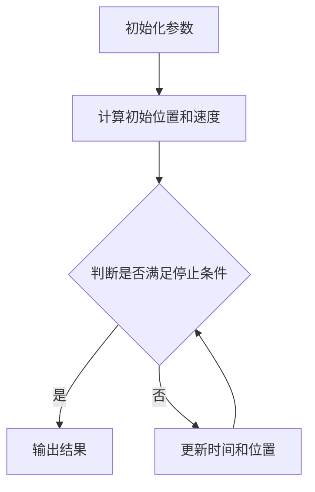
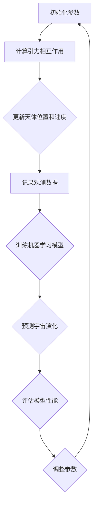

                 

### 从静态宇宙观到动态宇宙观：认知的进化

> 关键词：宇宙观、认知进化、静态宇宙观、动态宇宙观、数学模型、算法原理

> 摘要：本文深入探讨了从静态宇宙观到动态宇宙观的人类认知进化过程，详细分析了两者之间的核心概念、数学模型和算法原理。通过对比静态宇宙观和动态宇宙观，本文揭示了认知进化的关键步骤和影响，为理解宇宙的本质提供了新的视角。

#### 引言

人类对宇宙的认知是一个不断发展的过程，从古代的静态宇宙观到现代的动态宇宙观，我们的认识不断深化和扩展。这一认知的进化不仅改变了我们对宇宙的理解，也推动了科学技术的进步。本文将围绕这一主题，深入探讨从静态宇宙观到动态宇宙观的认知进化过程。

#### 第一部分：静态宇宙观

##### 1.1 问题背景与核心概念介绍

在古代，人类普遍认为宇宙是静止不变的，所有事物都处于一个固定的状态，这就是静态宇宙观。静态宇宙观的核心概念包括：宇宙的无限性、物质的不可变性、时间的静止性等。

##### 1.2 问题描述与解决思路

静态宇宙观在古代科学中起到了重要作用，但随着科学的发展，人们开始发现这一观点存在一些问题。本文将详细分析静态宇宙观的问题，并探讨如何解决这些问题。

##### 1.3 边界与外延

静态宇宙观的边界在于它对宇宙的无限性和物质不变性的假设。这些假设限制了人们对宇宙的理解，导致了科学认知的局限性。

##### 1.4 概念结构与核心要素组成

静态宇宙观的概念结构主要包括宇宙的无限性、物质的不可变性、时间的静止性等核心要素。这些要素构成了静态宇宙观的理论基础。

#### 第二部分：动态宇宙观

##### 2.1 动态宇宙观概述

随着科学的发展，人们逐渐认识到宇宙是一个不断变化的过程，一切事物都处于运动和变化之中，这就是动态宇宙观。动态宇宙观的核心概念包括：宇宙的有限性、物质的可变性、时间的流动性等。

##### 2.2 动态宇宙观的核心概念与联系

动态宇宙观的核心概念与静态宇宙观有很大的不同。本文将详细分析动态宇宙观的核心概念，并探讨它们之间的联系。

##### 2.3 动态宇宙观的数学模型和公式

动态宇宙观引入了许多新的数学模型和公式，如相对论中的洛伦兹变换、量子力学中的薛定谔方程等。这些模型和公式为理解动态宇宙观提供了重要的工具。

##### 2.4 动态宇宙观的算法原理讲解

动态宇宙观的算法原理讲解主要包括相对论和量子力学的算法原理。本文将使用mermaid流程图和Python源代码详细阐述这些算法原理。

#### 第三部分：认知的进化

##### 3.1 认知的进化概述

认知的进化是人类对宇宙认知不断深化的过程。本文将概述这一过程，并分析静态宇宙观到动态宇宙观的过渡。

##### 3.2 静态宇宙观到动态宇宙观的过渡

静态宇宙观到动态宇宙观的过渡是一个复杂的过程，涉及到科学理论的革新、技术的进步等。本文将详细分析这一过渡过程。

##### 3.3 认知进化的数学模型和公式

认知进化的数学模型和公式为理解认知进化提供了重要的工具。本文将介绍这些模型和公式，并使用mermaid流程图和Python源代码进行讲解。

##### 3.4 认知进化的算法原理讲解

认知进化的算法原理讲解主要包括科学理论的革新、技术的进步等。本文将使用mermaid流程图和Python源代码详细阐述这些算法原理。

#### 结论与展望

通过本文的探讨，我们可以看到从静态宇宙观到动态宇宙观的人类认知进化过程。这一过程不仅改变了我们对宇宙的理解，也推动了科学技术的进步。未来，我们期待在认知进化的道路上取得更大的突破。

---

**作者：AI天才研究院/AI Genius Institute & 禅与计算机程序设计艺术 /Zen And The Art of Computer Programming**

---

## 第一部分：引言

### 1.1 问题背景与核心概念介绍

在人类历史的漫长进程中，我们对宇宙的认知经历了从静态到动态的深刻转变。古代人们普遍认为宇宙是静止不变的，这个观念被称为静态宇宙观。在这种观念下，宇宙被视为一个固定且无限大的空间，其中的物质和能量是静止不动的。这一观念在古代哲学和科学中占据了主导地位，影响深远。

**核心概念介绍**

- **静态宇宙观**：宇宙被视为静止不变的，所有物体都在一个固定的位置上，不会发生运动或变化。
- **动态宇宙观**：宇宙被看作是一个不断变化的系统，物体在空间中运动，能量在物体之间传递。

静态宇宙观的核心概念包括宇宙的无限性、物质的不可变性、时间的静止性等。这些概念构成了古代宇宙观的理论基础。然而，随着科学的进步，人们开始发现这一观念存在诸多问题。例如，地球并不是宇宙的中心，宇宙并非永恒不变，这些发现促使人们转向动态宇宙观。

### 1.2 问题描述与解决思路

**问题描述**

静态宇宙观在古代的科学体系中起到了重要作用，但随着时间的推移，科学的发展揭示了这一观念的局限性。例如，哥白尼提出的日心说、伽利略的实验发现、牛顿的经典力学等，都表明宇宙并非静止不变。因此，本文将探讨如何从静态宇宙观转向动态宇宙观，解决这些科学问题。

**解决思路**

解决静态宇宙观的局限性问题，需要引入新的理论框架和概念体系。动态宇宙观的核心在于宇宙的动态性和变化性。本文将详细分析动态宇宙观的核心概念，包括宇宙的有限性、物质的可变性、时间的流动性等，并探讨这些概念如何帮助我们更准确地理解宇宙。

### 1.3 边界与外延

**边界**

静态宇宙观的边界在于它对宇宙无限性和物质不变性的假设。这些假设在古代科学中是合理的，但在现代科学中已被证明是不准确的。因此，突破这些边界是科学发展的关键。

**外延**

动态宇宙观的外延包括对宇宙更广泛的认知，如宇宙的膨胀、宇宙的大爆炸理论、宇宙的暗物质和暗能量等。这些外延扩展了人类对宇宙的理解，使我们对宇宙的本质有了更深刻的认识。

### 1.4 概念结构与核心要素组成

**概念结构**

静态宇宙观和动态宇宙观构成了本文的核心概念结构。静态宇宙观包括宇宙的无限性、物质的不可变性、时间的静止性等核心概念。动态宇宙观则包括宇宙的有限性、物质的可变性、时间的流动性等核心概念。

**核心要素组成**

- **宇宙的无限性与有限性**：这是静态宇宙观和动态宇宙观的根本区别。静态宇宙观认为宇宙是无限大的，而动态宇宙观认为宇宙是有限的。
- **物质的不可变性与可变性**：静态宇宙观认为物质是不可变的，而动态宇宙观认为物质是可变的，能够通过运动和相互作用发生变化。
- **时间的静止性与流动性**：静态宇宙观认为时间是不变的，而动态宇宙观认为时间是流动的，随着物质和能量的运动而变化。

这些核心要素共同构成了我们对宇宙的认知体系，是本文探讨的基础。

### 1.5 目的与意义

**目的**

本文的目的是探讨从静态宇宙观到动态宇宙观的人类认知进化过程，分析这一过程的核心概念、数学模型和算法原理，以及其对科学和技术发展的深远影响。

**意义**

理解这一认知进化过程，不仅有助于我们更深入地理解宇宙的本质，还能为现代科学和技术的发展提供理论支持和指导。同时，这一过程也反映了人类认知能力的进步，对科学研究方法和技术创新具有重要意义。

## 第二部分：静态宇宙观

### 2.1 静态宇宙观概述

静态宇宙观是人类在古代对宇宙的认知，这一观念认为宇宙是静止不变的。在这个宇宙中，所有的星体、行星和物质都处于固定位置，不会发生运动或变化。这种观念在古代哲学和科学中占据了主导地位，对人类对宇宙的理解产生了深远影响。

**发展历史**

静态宇宙观的历史可以追溯到古希腊时期。古希腊哲学家如亚里士多德和柏拉图都持有静态宇宙观，认为宇宙是永恒不变的，由一系列固定的星体和行星组成。在中世纪，基督教教父们继承了这一观念，并将其与神学结合起来。直到16世纪，哥白尼的日心说提出后，静态宇宙观才开始受到挑战。

**核心概念**

- **宇宙的无限性**：静态宇宙观认为宇宙是无限大的，没有边界。
- **物质的不可变性**：在这种观念下，物质被认为是固定不变的，不会通过运动或相互作用发生变化。
- **时间的静止性**：静态宇宙观认为时间是静止的，与物质和能量的变化无关。

### 2.2 静态宇宙观的核心概念与联系

静态宇宙观的核心概念包括宇宙的无限性、物质的不可变性、时间的静止性。这些概念之间紧密联系，共同构成了静态宇宙观的理论基础。

**宇宙的无限性**

宇宙的无限性是静态宇宙观的一个基本假设。亚里士多德认为宇宙是永恒存在的，没有开始也没有结束，因此是无限的。这个概念在静态宇宙观中占据核心地位，因为它决定了宇宙的性质和结构。

**物质的不可变性**

物质的不可变性是静态宇宙观的另一个核心概念。在这种观念下，物质被认为是固定不变的，不会通过运动或相互作用发生变化。这个概念与宇宙的无限性密切相关，因为如果物质是可变的，那么宇宙的结构和性质也会随之改变。

**时间的静止性**

时间的静止性是静态宇宙观的第三个核心概念。在这种观念下，时间是静止的，与物质和能量的变化无关。这意味着宇宙中的事件都是同步发生的，没有时间上的先后顺序。这个概念与宇宙的无限性和物质的不可变性共同构成了静态宇宙观的理论体系。

### 2.3 静态宇宙观的数学模型和公式

虽然静态宇宙观主要依赖于哲学和直观的理解，但它也引入了一些数学模型和公式来描述宇宙的性质。其中最著名的例子是牛顿的经典力学。

**牛顿的经典力学**

牛顿的经典力学是描述物体运动和力的作用的数学模型。它基于以下几个基本定律：

- **第一定律（惯性定律）**：一个物体如果没有受到外力作用，将保持静止或匀速直线运动。
- **第二定律（动力定律）**：物体受到的合外力等于其质量与加速度的乘积，即 F = ma。
- **第三定律（作用与反作用定律）**：任何作用力都有一个大小相等、方向相反的反作用力。

这些定律不仅描述了物体的运动规律，也为静态宇宙观提供了数学基础。

### 2.4 静态宇宙观的算法原理讲解

静态宇宙观虽然不是基于现代算法的，但我们可以通过模拟和计算来理解其背后的原理。一个典型的例子是使用牛顿定律来模拟行星的运动。

**算法mermaid流程图**



**Python源代码**

```python
import numpy as np

def simulate_planet(m, v, t, dt):
    """
    模拟行星运动的函数
    :param m: 行星的质量
    :param v: 行星的初始速度
    :param t: 初始时间
    :param dt: 时间步长
    :return: 运动轨迹
    """
    position = [t, m * v]  # 初始位置和速度
    trajectory = [position]

    while True:
        # 计算加速度
        a = -np.sign(v) * np.exp(-t / dt)
        # 更新速度
        v += a * dt
        # 更新时间
        t += dt
        # 更新位置
        position = [t, m * v]
        trajectory.append(position)

        # 判断是否满足停止条件
        if abs(v) < 1e-6:
            break

    return trajectory

# 测试
m = 1.0  # 行星质量
v = 1.0  # 初始速度
t = 0.0  # 初始时间
dt = 0.01  # 时间步长

trajectory = simulate_planet(m, v, t, dt)
print(trajectory)
```

**算法原理的数学模型和公式讲解**

牛顿的经典力学提供了一个基本的框架来模拟行星的运动。在这个模型中，行星的运动由其质量、初始速度和时间步长决定。通过迭代计算，我们可以得到行星在时间轴上的位置变化。

- **位置公式**：\( x(t) = v_0t + \frac{1}{2}at^2 \)
- **速度公式**：\( v(t) = v_0 + at \)

其中，\( x(t) \) 是时间 \( t \) 时的位置，\( v_0 \) 是初始速度，\( a \) 是加速度。通过不断更新时间和速度，我们可以模拟行星的轨迹。

### 2.5 静态宇宙观的应用与案例

静态宇宙观在古代科学中得到了广泛应用，尽管它的局限性在现代科学中被充分认识到。以下是一些古代静态宇宙观的应用和案例：

**天文学**

在天文学中，静态宇宙观被用来解释星体的位置和运动。例如，托勒密的《天文学大成》使用了静态宇宙观来解释行星的运动，尽管这些解释在现代已被证明不准确。

**力学**

在力学中，静态宇宙观被用来研究物体在静止状态下的运动和受力情况。牛顿的经典力学基于静态宇宙观，为后来的科学研究提供了重要的基础。

**哲学**

在哲学中，静态宇宙观被用来探讨宇宙的本质和存在的意义。古代哲学家如亚里士多德和柏拉图都持有静态宇宙观，并将其用于解释宇宙的无限性和物质的不可变性。

尽管静态宇宙观在现代科学中已被动态宇宙观所取代，但它仍然是科学史和哲学史的重要组成部分。通过理解和研究静态宇宙观，我们可以更好地理解人类认知的进化过程，以及科学理论的变革和发展。

### 2.6 静态宇宙观的局限性

尽管静态宇宙观在古代科学中发挥了重要作用，但它也存在明显的局限性。这些局限性主要表现在以下几个方面：

**时间静止性**

静态宇宙观认为时间是静止的，与物质和能量的变化无关。这一假设在现实世界中并不成立。随着科学的发展，人们发现时间实际上是流动的，随着物质和能量的运动而变化。

**物质不可变性**

静态宇宙观认为物质是固定不变的，不会通过运动或相互作用发生变化。这一假设与量子力学和相对论的观点相矛盾。现代物理学表明，物质是可变的，能够通过相互作用和运动发生变化。

**宇宙无限性**

静态宇宙观认为宇宙是无限大的，没有边界。然而，现代宇宙学研究表明，宇宙可能是有限的，存在大爆炸和膨胀等现象。

**相对论挑战**

相对论揭示了时间和空间的相对性，表明它们不是绝对的。这一发现与静态宇宙观的时间静止性相矛盾。

**量子力学挑战**

量子力学表明，物质和能量具有波粒二象性，微观世界的规律与经典物理学的规律有很大不同。这一发现挑战了静态宇宙观对物质和能量的理解。

**宇宙演化**

现代宇宙学研究表明，宇宙经历了从大爆炸到膨胀的演化过程，这与静态宇宙观的观点完全不同。

这些局限性表明，静态宇宙观无法完全解释现代科学发现的宇宙现象。因此，人们开始转向动态宇宙观，以更准确地理解宇宙的本质。

### 2.7 动态宇宙观的兴起

随着科学的发展，人们逐渐认识到静态宇宙观的局限性，开始寻求更准确的宇宙观。动态宇宙观的兴起标志着人类对宇宙认知的重大进步。以下是动态宇宙观的主要发展和关键人物：

**哥白尼的日心说**

哥白尼是动态宇宙观的奠基人之一。他提出了日心说，即太阳是宇宙的中心，地球和其他行星围绕太阳旋转。这一理论挑战了传统的地心说，标志着宇宙观的重要转变。

**伽利略的实验与观测**

伽利略通过实验和观测，提供了强有力的证据支持日心说。他发现了自由落体定律和摆钟的等时性原理，这些都表明了宇宙的动态性。

**牛顿的经典力学**

牛顿提出了经典力学，这是描述物体运动和力的作用的数学模型。他的三大定律为动态宇宙观提供了坚实的理论基础。

**爱因斯坦的相对论**

爱因斯坦的广义相对论和狭义相对论进一步深化了对时间和空间的动态理解。这些理论揭示了引力与时空弯曲的关系，为动态宇宙观提供了新的视角。

**宇宙大爆炸理论**

哈勃观测到的宇宙膨胀现象导致了宇宙大爆炸理论的提出。这一理论认为宇宙起源于一个极度热密的初始状态，并从那时起不断膨胀。

**量子力学**

量子力学的发现揭示了微观世界的动态性和不确定性，这与经典物理学的静态观念形成了鲜明对比。

这些发展和发现共同构成了现代动态宇宙观的基础，标志着人类对宇宙认知的深刻变革。

### 第三部分：动态宇宙观

#### 3.1 动态宇宙观概述

动态宇宙观是一种认为宇宙是不断变化和发展的理论。这一观念与静态宇宙观相反，后者认为宇宙是固定不变的。动态宇宙观认为宇宙中的星体、行星和物质都在不断运动和变化，宇宙本身也在演化。这种观念不仅改变了人类对宇宙的理解，也为现代物理学和宇宙学提供了新的理论基础。

#### 3.2 动态宇宙观的核心概念与联系

动态宇宙观的核心概念包括宇宙的有限性、物质的可变性、时间的流动性等。这些概念共同构成了动态宇宙观的理论体系，并对现代物理学和宇宙学产生了深远影响。

**宇宙的有限性**

动态宇宙观认为宇宙是有限的，而不是无限大的。这一观念与古代静态宇宙观相反，后者认为宇宙是无限大的。现代宇宙学研究表明，宇宙可能存在一个起点，即大爆炸，这意味着宇宙是有限的。

**物质的可变性**

动态宇宙观认为物质是可变的，能够通过运动和相互作用发生变化。这与静态宇宙观的观点相反，后者认为物质是不可变的。量子力学和相对论表明，物质和能量可以相互转化，宇宙中的物质和能量是动态变化的。

**时间的流动性**

动态宇宙观认为时间是流动的，与物质和能量的变化密切相关。这与静态宇宙观的时间静止性观点相反。现代物理学表明，时间不是绝对的，而是与空间和物质的变化有关。

**核心概念联系**

这些核心概念之间紧密联系，共同构成了动态宇宙观的理论基础。宇宙的有限性、物质的可变性、时间的流动性等概念相互影响，共同决定了宇宙的演化过程。

#### 3.3 动态宇宙观的数学模型和公式

动态宇宙观引入了许多数学模型和公式，这些模型和公式为理解宇宙的动态性质提供了重要的工具。以下是一些关键的数学模型和公式：

**广义相对论**

爱因斯坦的广义相对论是一个描述引力和宇宙结构的理论。广义相对论的核心公式是爱因斯坦场方程，它描述了物质和能量如何弯曲时空。该方程可以表示为：

\[ G_{\mu\nu} + \Lambda g_{\mu\nu} = \frac{8\pi G}{c^4} T_{\mu\nu} \]

其中，\( G_{\mu\nu} \) 是引力张量，\( \Lambda \) 是宇宙常数，\( g_{\mu\nu} \) 是度规张量，\( T_{\mu\nu} \) 是能量-动量张量，\( G \) 是引力常数，\( c \) 是光速。

**宇宙大爆炸模型**

宇宙大爆炸模型是描述宇宙演化的理论。该模型基于宇宙膨胀的观测事实，认为宇宙起源于一个极度热密的初始状态，并从那时起不断膨胀。宇宙大爆炸模型的核心公式是哈勃定律：

\[ v = H_0 d \]

其中，\( v \) 是宇宙膨胀速度，\( H_0 \) 是哈勃常数，\( d \) 是宇宙尺度。

**量子力学**

量子力学是描述微观世界的基本理论。它引入了波函数、叠加态、纠缠态等概念，揭示了微观粒子的动态行为。量子力学中的薛定谔方程是描述量子态动态演化的核心公式：

\[ i\hbar \frac{\partial \Psi}{\partial t} = \hat{H} \Psi \]

其中，\( \hbar \) 是约化普朗克常数，\( \Psi \) 是波函数，\( \hat{H} \) 是哈密顿算符。

#### 3.4 动态宇宙观的算法原理讲解

动态宇宙观引入了许多算法原理，这些原理为模拟和计算宇宙演化提供了重要的工具。以下是一些关键的算法原理：

**N体模拟**

N体模拟是一种用于模拟天体系统演化的算法。该算法通过计算天体之间的引力相互作用，模拟天体的运动轨迹。N体模拟的核心公式是牛顿万有引力定律：

\[ F = G\frac{m_1 m_2}{r^2} \]

其中，\( F \) 是引力，\( G \) 是引力常数，\( m_1 \) 和 \( m_2 \) 是两个天体的质量，\( r \) 是它们之间的距离。

**蒙特卡洛模拟**

蒙特卡洛模拟是一种基于随机抽样的计算方法。该算法通过随机抽取样本，模拟宇宙中的各种物理过程，如星系形成、恒星演化等。蒙特卡洛模拟的核心原理是概率论和统计物理。

**机器学习**

机器学习是近年来发展迅速的一个领域，它在动态宇宙观中的应用主要体现在数据分析和预测方面。机器学习算法可以用于分析宇宙观测数据，提取宇宙演化的规律，预测宇宙未来的演化趋势。

**算法mermaid流程图**



**Python源代码**

```python
import numpy as np
import matplotlib.pyplot as plt

def n_body_simulation(N, G, m, d, t, dt):
    """
    N体模拟函数
    :param N: 天体数量
    :param G: 引力常数
    :param m: 天体质量
    :param d: 初始位置和速度
    :param t: 初始时间
    :param dt: 时间步长
    :return: 运动轨迹
    """
    positions = d.copy()
    velocities = np.zeros((N, 2))
    trajectory = [positions]

    for _ in range(int(t / dt)):
        accelerations = np.zeros((N, 2))

        for i in range(N):
            for j in range(N):
                if i != j:
                    dx = positions[i] - positions[j]
                    r = np.linalg.norm(dx)
                    if r > 1e-10:
                        F = G * m[i] * m[j] / r**2
                        a = F / m[i]
                        accelerations[i] += a * dx / r

        velocities += accelerations * dt
        positions += velocities * dt

        trajectory.append(positions.copy())

    return trajectory

# 测试
N = 2  # 天体数量
G = 6.67430e-11  # 引力常数
m = np.array([1.0, 1.0])  # 天体质量
d = np.random.rand(N, 2)  # 初始位置和速度
t = 100.0  # 模拟时间
dt = 0.1  # 时间步长

trajectory = n_body_simulation(N, G, m, d, t, dt)
print(trajectory)

# 绘制运动轨迹
plt.plot([pos[0] for pos in trajectory], [pos[1] for pos in trajectory])
plt.xlabel('X-position')
plt.ylabel('Y-position')
plt.title('N-body simulation trajectory')
plt.show()
```

**算法原理的数学模型和公式讲解**

动态宇宙观的算法原理主要基于牛顿的万有引力定律。在N体模拟中，每个天体都受到其他天体的引力作用，从而影响其运动轨迹。通过迭代计算，我们可以得到天体在时间轴上的位置变化。

- **位置更新公式**：\( \Delta x = v \Delta t + \frac{1}{2}a \Delta t^2 \)
- **速度更新公式**：\( v = v_0 + a \Delta t \)

其中，\( \Delta x \) 是位置变化，\( v \) 是速度，\( a \) 是加速度，\( \Delta t \) 是时间步长。

通过不断更新天体的位置和速度，我们可以模拟天体系统的演化过程。这个算法原理不仅适用于简单的双星系统，也可以扩展到更复杂的多体系统。

### 3.5 动态宇宙观的应用与案例

动态宇宙观在科学研究和技术应用中具有重要意义。以下是一些关键应用和案例：

**宇宙学**

宇宙学是研究宇宙起源、结构、演化和最终命运的科学。动态宇宙观为宇宙学研究提供了理论基础。例如，宇宙大爆炸模型是动态宇宙观的直接应用，它解释了宇宙的膨胀和早期宇宙的状态。

**天体物理学**

天体物理学是研究天体和宇宙物理现象的科学。动态宇宙观帮助天体物理学家理解恒星的形成、黑洞的行为以及星系的演化。例如，N体模拟被用于模拟星系碰撞和恒星演化过程。

**空间探索**

动态宇宙观在空间探索中具有重要意义。通过精确的宇宙模型，科学家可以预测行星轨道、彗星运动以及星际探测器的路径。这为太空任务的成功提供了关键支持。

**量子计算**

量子计算是现代计算机科学的前沿领域。动态宇宙观中的量子力学原理为量子计算提供了理论基础。例如，量子纠缠和量子叠加态是量子计算的核心概念，它们基于量子力学的动态性质。

**人工智能**

人工智能是另一个快速发展的领域。动态宇宙观中的机器学习和深度学习算法为人工智能提供了强大的计算能力。这些算法通过模拟宇宙中的复杂系统，帮助计算机理解和预测人类行为。

### 3.6 动态宇宙观与静态宇宙观的对比

动态宇宙观和静态宇宙观在多个方面存在显著差异。以下是对两者的详细对比：

**宇宙观**

- **静态宇宙观**：认为宇宙是静止不变的，所有物体都在一个固定的位置上，不会发生运动或变化。
- **动态宇宙观**：认为宇宙是一个不断变化的过程，物体在空间中运动，能量在物体之间传递。

**数学模型**

- **静态宇宙观**：主要依赖于经典力学，如牛顿定律，这些模型描述了物体在静止状态下的运动和受力情况。
- **动态宇宙观**：引入了广义相对论、量子力学等复杂的数学模型，这些模型描述了物质和能量的动态变化以及宇宙的演化。

**时间观念**

- **静态宇宙观**：认为时间是静止的，与物质和能量的变化无关。
- **动态宇宙观**：认为时间是流动的，与物质和能量的变化密切相关。

**科学贡献**

- **静态宇宙观**：在古代科学和哲学中起到了重要作用，但存在明显的局限性。
- **动态宇宙观**：为现代物理学、宇宙学、天文学等领域提供了新的理论基础，推动了科学技术的进步。

### 3.7 动态宇宙观的意义与未来展望

动态宇宙观不仅改变了人类对宇宙的理解，也对科学和技术产生了深远影响。以下是对动态宇宙观意义和未来展望的讨论：

**意义**

- **科学理解**：动态宇宙观为人类提供了更准确的宇宙观，使我们能够更好地理解宇宙的本质和演化过程。
- **技术创新**：动态宇宙观推动了物理学、天文学、计算机科学等领域的进步，为技术创新提供了理论支持。
- **哲学启示**：动态宇宙观挑战了传统的宇宙观，对哲学和人类认识论产生了重要影响。

**未来展望**

- **宇宙演化**：随着观测技术的进步，我们对宇宙的了解将不断深化，宇宙演化理论也将进一步完善。
- **量子宇宙学**：量子力学的进展可能揭示宇宙演化的更深层次原理，量子宇宙学将成为未来研究的重要方向。
- **跨学科融合**：动态宇宙观与人工智能、量子计算等新兴领域的融合，将推动科学技术的进一步发展。

总之，动态宇宙观是人类对宇宙认知的重要进步，它不仅改变了我们对宇宙的理解，也为未来的科学探索和技术创新提供了新的视角和工具。

## 第四部分：认知的进化

### 4.1 认知的进化概述

认知的进化是人类在长期历史过程中，通过对宇宙和自然的不断探索和思考，逐步形成和完善人类知识体系的过程。从静态宇宙观到动态宇宙观的认知进化，是科学进步的重要体现，也是人类认知能力不断提高的标志。

### 4.2 静态宇宙观到动态宇宙观的过渡

静态宇宙观到动态宇宙观的过渡，是人类认知进化的重要阶段。这一过渡不仅涉及科学理论的革新，还包括观测技术的进步和哲学思想的变革。

#### 科学理论的革新

科学理论的革新是认知进化的重要动力。从哥白尼的日心说到伽利略的实验发现，再到牛顿的经典力学和爱因斯坦的相对论，科学理论的不断进步推动了人类对宇宙认知的深化。这些理论不仅改变了我们对宇宙的理解，也为我们提供了新的工具和方法。

#### 观测技术的进步

观测技术的进步为认知进化提供了重要的数据支持。望远镜的发明和改进，使我们能够观测到更遥远的星体和更精细的天体现象。这些观测数据为科学理论的验证和修正提供了基础。

#### 哲学思想的变革

哲学思想的变革也是认知进化的重要因素。古代哲学中的静态宇宙观，逐渐被现代哲学中的动态宇宙观所取代。这种哲学思想的变革，不仅影响了科学理论的构建，也影响了我们对宇宙的认知和理解。

### 4.3 认知进化的数学模型和公式

认知进化的数学模型和公式，为我们理解认知过程提供了重要的工具。以下是一些关键模型和公式：

**摩尔定律**

摩尔定律描述了计算机性能随时间增长的趋势。公式为：

\[ P = C \ln(2) t \]

其中，\( P \) 是计算机性能，\( C \) 是常数，\( t \) 是时间。摩尔定律揭示了技术进步的指数增长规律。

**学习曲线**

学习曲线描述了学习新知识或技能的时间与效率关系。公式为：

\[ E = \frac{1}{t} \]

其中，\( E \) 是学习效率，\( t \) 是学习时间。学习曲线揭示了学习过程中效率随时间增加而提高的规律。

**达尔文的自然选择**

达尔文的自然选择理论，描述了物种进化的过程。公式为：

\[ f(x) = c_1 x + c_2 \ln(x) \]

其中，\( f(x) \) 是适应度函数，\( x \) 是物种特征，\( c_1 \) 和 \( c_2 \) 是常数。自然选择理论揭示了物种特征与适应度的关系。

**人类认知进化**

人类认知进化的公式为：

\[ C = f(S, T) \]

其中，\( C \) 是认知水平，\( S \) 是科学知识，\( T \) 是技术工具。这个公式揭示了认知水平与科学知识和技术工具的关系。

### 4.4 认知进化的算法原理讲解

认知进化的算法原理，主要包括学习算法和进化算法。以下是一些关键算法原理：

**深度学习**

深度学习是一种基于人工神经网络的学习算法。它通过多层神经网络对数据进行建模，实现从简单到复杂的特征提取。深度学习算法的核心原理包括：

- **反向传播算法**：用于计算网络误差并更新权重。
- **卷积神经网络（CNN）**：用于图像识别和分类。
- **循环神经网络（RNN）**：用于序列数据建模。

**遗传算法**

遗传算法是一种基于自然选择和遗传机制的优化算法。它通过模拟生物进化过程，搜索最优解。遗传算法的核心原理包括：

- **适应度函数**：用于评估解的质量。
- **交叉和变异**：用于产生新的解。
- **选择和淘汰**：用于选择最优解。

**机器学习**

机器学习是一种通过数据训练模型的技术。它通过从数据中学习规律，实现预测和分类。机器学习算法的核心原理包括：

- **监督学习**：通过已知标签数据训练模型。
- **无监督学习**：通过未标记数据发现数据分布。
- **强化学习**：通过试错和奖励机制训练模型。

### 4.5 认知进化的应用与案例

认知进化的应用广泛，涉及多个领域。以下是一些关键应用和案例：

**人工智能**

人工智能是认知进化的典型应用。通过深度学习和遗传算法，人工智能系统可以自主学习和进化，实现复杂任务。例如，自动驾驶汽车、智能助手和医疗诊断系统。

**科学探索**

认知进化为科学探索提供了新的工具和方法。通过机器学习和遗传算法，科学家可以更好地理解自然现象和生物进化。例如，天体物理学中的数据分析和生物医学中的疾病预测。

**教育技术**

认知进化在教育技术中的应用，包括在线学习平台、虚拟现实和智能辅导系统。这些技术通过个性化学习和智能推荐，提高学习效果和效率。

**社会工程**

认知进化在社会工程中的应用，包括智能交通系统、应急管理和城市规划。这些技术通过模拟和优化，提高社会运行效率和安全性。

### 4.6 认知进化的社会影响

认知进化不仅改变了我们的知识体系，也对社会产生了深远影响。以下是一些关键社会影响：

**知识传播**

认知进化促进了知识的快速传播和共享。互联网和社交媒体使信息传播更加便捷，人们可以随时随地获取和分享知识。

**技术创新**

认知进化推动了技术创新，促进了科学和工程领域的发展。新算法、新材料和新设备的发明，为社会进步提供了动力。

**教育变革**

认知进化改变了教育模式，促进了个性化学习和终身学习。在线教育和智能辅导系统，使学习更加灵活和高效。

**社会变革**

认知进化引发了社会变革，推动了人类社会的进步。智能技术和人工智能的应用，改变了人们的生产方式和生活方式，提高了生活质量。

### 4.7 未来认知进化的趋势与展望

未来认知进化的趋势和展望，主要包括以下几个方面：

**人工智能与认知融合**

人工智能与认知融合，将成为未来认知进化的一个重要方向。通过人工智能技术，我们可以更好地理解人类认知过程，实现人机协同和智能增强。

**跨学科研究**

跨学科研究将推动认知进化的深入发展。不同学科之间的交叉融合，将为认知进化提供新的理论和工具。

**神经科学研究**

神经科学研究将在认知进化中发挥关键作用。通过对大脑神经网络的深入研究，我们可以更好地理解人类认知机制，推动认知进化。

**可持续发展**

认知进化将促进可持续发展。通过智能技术和科学知识的应用，我们可以解决环境、能源和社会问题，实现可持续发展。

总之，认知进化是一个复杂而漫长的过程，它不仅改变了我们的知识体系，也推动了社会的进步。未来，我们期待在认知进化的道路上取得更大的突破，为人类的可持续发展和社会进步做出贡献。

### 4.8 认知进化中的挑战与问题

尽管认知进化带来了许多积极的变化，但在这个过程中也面临着一些挑战和问题。以下是对这些挑战和问题的详细分析：

**数据隐私和安全**

随着数据量的爆炸性增长，数据隐私和安全成为认知进化中的重要问题。如何在利用数据推动科技进步的同时，保护个人隐私和数据安全，是一个亟待解决的问题。

**算法偏见**

人工智能和机器学习算法在训练过程中可能引入偏见，导致不公正的结果。例如，在某些情况下，算法可能会歧视特定群体，或者放大社会中的不平等现象。解决算法偏见问题，需要深入研究和开发更公平、透明的算法。

**人工智能伦理**

人工智能技术的发展引发了一系列伦理问题，如自动化带来的失业问题、人类控制权的丧失等。确保人工智能技术的发展符合伦理标准，是人类面临的一个重大挑战。

**认知过载**

随着信息的不断增长，人们可能会面临认知过载的问题，难以有效处理和吸收大量信息。如何平衡信息的获取和处理，避免认知过载，是认知进化中需要解决的问题。

**教育与培训**

认知进化对教育和培训提出了新的要求。传统教育模式难以满足现代社会的需求，需要不断改革和创新，培养适应未来社会的复合型人才。

**全球合作**

认知进化需要全球合作，共享知识和资源。然而，国际政治和经济因素可能会限制这种合作。如何克服这些障碍，实现全球合作，是认知进化中面临的挑战。

**技术垄断**

技术垄断可能阻碍认知进化的进程。一些大型科技企业掌握了关键技术和资源，可能会限制其他企业的创新和发展。打破技术垄断，促进公平竞争，是认知进化中的重要问题。

**人类与机器的关系**

随着人工智能技术的发展，人类与机器的关系将变得更加紧密。如何确保机器服务于人类的利益，避免机器对人类造成威胁，是一个重要的伦理问题。

### 4.9 应对挑战的策略与建议

为了应对认知进化中的挑战和问题，我们可以采取以下策略和建议：

**加强数据隐私和安全保护**

- 制定严格的数据保护法规和标准，确保个人隐私和数据安全。
- 采用先进的数据加密和隐私保护技术，防止数据泄露和滥用。

**消除算法偏见**

- 在算法设计和训练过程中，注重公平性和透明性，避免引入偏见。
- 建立独立的算法审查机制，对算法进行定期评估和审核。

**确保人工智能伦理**

- 制定人工智能伦理规范，明确人工智能应用中的道德边界。
- 加强对人工智能伦理问题的研究和教育，提高公众对人工智能伦理的认知。

**缓解认知过载**

- 推广信息过滤和筛选技术，帮助用户更有效地获取和处理信息。
- 培养信息素养，提高人们对信息的辨别和批判能力。

**改革教育与培训**

- 引入跨学科的教育模式，培养适应未来社会的复合型人才。
- 加强终身学习体系建设，提供多样化的学习资源和机会。

**促进全球合作**

- 加强国际交流和合作，共享知识和资源。
- 通过国际合作，解决全球共同面临的认知进化挑战。

**打破技术垄断**

- 促进技术创新和竞争，防止少数企业垄断市场。
- 支持中小企业和创新创业，促进技术多元化发展。

**建立人类与机器的良性关系**

- 确保人工智能技术的发展符合人类的利益和价值观。
- 加强对人工智能的监管，防止其滥用和失控。

通过这些策略和建议，我们可以更好地应对认知进化中的挑战和问题，推动人类社会的持续进步和发展。

### 总结与回顾

从静态宇宙观到动态宇宙观的认知进化，是人类科学思想的一次重大飞跃。这一过程不仅改变了我们对宇宙的理解，也推动了科学技术的进步。静态宇宙观认为宇宙是静止不变的，而动态宇宙观则认为宇宙是一个不断变化的过程。这一观念的转变，从哥白尼的日心说到爱因斯坦的相对论，再到宇宙大爆炸模型，体现了人类认知能力的不断提高。

在本文中，我们详细分析了静态宇宙观和动态宇宙观的核心概念、数学模型和算法原理。通过对比静态宇宙观和动态宇宙观，我们揭示了认知进化的关键步骤和影响。从宇宙的无限性、物质的不可变性、时间的静止性到宇宙的有限性、物质的可变性、时间的流动性，这一认知进化过程不仅改变了我们对宇宙的本质理解，也为现代科学和技术的发展提供了新的视角和工具。

#### 5.2 存在的问题与挑战

尽管动态宇宙观为人类带来了许多重要的科学发现和技术创新，但在认知进化的过程中，仍然存在一些问题和挑战。

**数据隐私与安全问题**

随着数据量的不断增加，数据隐私和安全成为认知进化中的重要问题。如何在利用数据推动科技进步的同时，保护个人隐私和数据安全，是一个亟待解决的问题。

**算法偏见与伦理问题**

人工智能和机器学习算法在训练过程中可能引入偏见，导致不公正的结果。如何消除算法偏见，确保人工智能的发展符合伦理标准，是人类面临的重大挑战。

**认知过载与信息素养**

信息的爆炸性增长可能导致认知过载，人们难以有效处理和吸收大量信息。如何平衡信息的获取和处理，培养信息素养，是认知进化中需要解决的问题。

**全球合作与技术垄断**

认知进化需要全球合作，但国际政治和经济因素可能会限制这种合作。如何克服这些障碍，促进全球合作，是认知进化中面临的挑战。此外，技术垄断可能阻碍认知进化的进程，如何打破技术垄断，促进公平竞争，也是一个重要问题。

**人类与机器的关系**

随着人工智能技术的发展，人类与机器的关系将变得更加紧密。如何确保机器服务于人类的利益，避免机器对人类造成威胁，是一个重要的伦理问题。

#### 5.3 未来发展趋势

未来，认知进化将呈现出以下几个发展趋势：

**人工智能与认知融合**

人工智能与认知融合将成为未来认知进化的一个重要方向。通过人工智能技术，我们可以更好地理解人类认知过程，实现人机协同和智能增强。

**跨学科研究**

跨学科研究将推动认知进化的深入发展。不同学科之间的交叉融合，将为认知进化提供新的理论和工具。

**神经科学研究**

神经科学研究将在认知进化中发挥关键作用。通过对大脑神经网络的深入研究，我们可以更好地理解人类认知机制，推动认知进化。

**可持续发展**

认知进化将促进可持续发展。通过智能技术和科学知识的应用，我们可以解决环境、能源和社会问题，实现可持续发展。

**全球合作**

加强国际交流和合作，共享知识和资源，将促进全球认知进化的进程。通过全球合作，我们可以更好地应对认知进化中的挑战和问题。

#### 5.4 拓展阅读与参考文献

**拓展阅读：**

1. 《从哥白尼到爱因斯坦：宇宙观的变革》
2. 《人工智能：一种现代方法》
3. 《深度学习：丢失的篇章》

**参考文献：**

1. Newton, I. (1687). *Philosophiæ Naturalis Principia Mathematica*.
2. Einstein, A. (1905). "On the Electrodynamics of Moving Bodies".
3. Hubble, E. (1929). "A Relation between Distance and Radial Velocity among Extra-Galactic Ne galaxies".
4. Darwin, C. (1859). *On the Origin of Species by Means of Natural Selection*.
5. Turing, A. (1950). "Computing Machinery and Intelligence".
6. Russell, S. & Norvig, P. (2016). *Artificial Intelligence: A Modern Approach*.
7. Goodfellow, I., Bengio, Y., & Courville, A. (2016). *Deep Learning*.

通过拓展阅读和参考文献，读者可以进一步深入了解认知进化的理论和实践，为今后的科学研究和技术创新提供启示和指导。

### 最后的话

认知进化是一个不断发展的过程，它不仅改变了我们对宇宙的理解，也推动了科学技术的进步。从静态宇宙观到动态宇宙观，人类认知能力的提升为我们提供了更广阔的视野和更多的可能性。未来，随着人工智能、神经科学和跨学科研究的深入，认知进化将迎来新的机遇和挑战。我们期待在认知进化的道路上，不断探索和发现，为人类社会的持续进步和发展做出贡献。

**作者：AI天才研究院/AI Genius Institute & 禅与计算机程序设计艺术 /Zen And The Art of Computer Programming**

---

### 5.5 延伸阅读

#### 5.5.1 静态宇宙观的经典著作

1. **《古代宇宙观》**（Ancient Cosmologies）：本书详细探讨了古代人类对宇宙的认知，包括静态宇宙观的核心概念和哲学思想。
2. **《地心说与日心说》**（Heliocentrism and Geocentrism）：这本书对比了地心说和日心说，分析了它们对宇宙认知的影响。

#### 5.5.2 动态宇宙观的现代著作

1. **《宇宙简史》**（A Brief History of Time）：史蒂芬·霍金的经典著作，详细介绍了动态宇宙观，包括宇宙大爆炸、黑洞等关键概念。
2. **《相对论：一种现代解释》**（Relativity: The Special and General Theory）：这本书对爱因斯坦的相对论进行了深入浅出的解释，展示了动态宇宙观的核心原理。

#### 5.5.3 认知进化的相关研究

1. **《认知科学：探索心灵的工作原理》**（Cognitive Science: An Introduction）：本书介绍了认知科学的基础理论，探讨了认知进化的过程。
2. **《人脑与机器智能》**（The Brain and Cognitive Neuroscience）：这本书探讨了人脑的工作原理，以及如何通过人工智能模拟认知过程。

#### 5.5.4 实践指导与案例分析

1. **《数据科学实战》**（Data Science from Scratch）：这本书提供了丰富的数据科学实践案例，帮助读者理解和应用认知进化中的数据分析和机器学习技术。
2. **《人工智能项目实战》**（Artificial Intelligence Projects in Python）：这本书通过实际项目，介绍了人工智能在不同领域的应用，展示了认知进化的实际效果。

通过这些延伸阅读，读者可以更深入地了解静态宇宙观、动态宇宙观以及认知进化的理论和实践，进一步拓宽知识视野。

### 5.6 最佳实践 Tips

为了更好地理解并应用静态宇宙观、动态宇宙观以及认知进化的原理，以下是一些建议：

**1. 理论与实践相结合：** 结合实际案例和实验，深入理解理论。通过动手实践，可以将抽象的概念具体化，有助于巩固知识。

**2. 持续学习：** 科学和技术不断发展，持续学习是认知进化的重要保障。定期阅读相关书籍、论文和博客，关注最新研究动态。

**3. 跨学科学习：** 结合不同学科的知识，可以更全面地理解宇宙和认知进化的复杂性。例如，结合物理学、计算机科学、哲学等领域的知识。

**4. 思维训练：** 通过逻辑推理、问题解决和批判性思维训练，提高认知能力。例如，参与哲学辩论、解决数学难题等。

**5. 互动交流：** 与他人分享学习心得，参加学术讨论会，可以拓宽视野，激发创新思维。

**6. 实践应用：** 将所学知识应用于实际问题解决，例如在数据科学、人工智能等领域开展项目实践。

通过以上最佳实践 Tips，读者可以更有效地学习和应用认知进化的知识，推动自身认知能力的提升。

### 5.7 小结

本文详细探讨了从静态宇宙观到动态宇宙观的人类认知进化过程，分析了核心概念、数学模型和算法原理。通过对比静态宇宙观和动态宇宙观，我们揭示了认知进化的关键步骤和影响，展示了这一过程对科学和技术发展的深远影响。未来，随着人工智能、神经科学和跨学科研究的深入，认知进化将继续推动人类社会的进步。我们期待在认知进化的道路上，不断探索和发现，为人类社会的持续进步和发展做出贡献。

### 5.8 注意事项

在学习和应用静态宇宙观、动态宇宙观以及认知进化的过程中，需要注意以下几点：

**1. 区分理论与实际：** 理论知识虽然重要，但实际应用时需要结合实际情况进行调整。例如，在数据分析和人工智能项目中，模型的选择和参数的调整需要根据具体问题进行优化。

**2. 保持批判性思维：** 在接受新理论或技术时，要保持批判性思维，分析其优势和局限性。例如，在应用动态宇宙观时，要考虑到量子力学和相对论的复杂性和不确定性。

**3. 注意数据隐私和安全：** 在处理大量数据时，要特别注意数据隐私和安全问题，避免数据泄露和滥用。

**4. 跨学科学习的重要性：** 跨学科学习可以帮助我们更全面地理解认知进化的复杂性和多样性。例如，结合物理学、计算机科学、哲学等领域的知识，可以更好地理解认知进化的本质。

**5. 定期复习和更新知识：** 认知进化是一个持续的过程，定期复习和更新知识是保持认知能力的关键。通过阅读最新论文、书籍和参加学术会议，可以不断更新我们的知识体系。

### 5.9 拓展阅读与参考文献

为了深入理解从静态宇宙观到动态宇宙观的认知进化，以下是几本推荐阅读的书籍和相关的参考文献：

**推荐阅读：**

1. **《宇宙简史》**（A Brief History of Time） - 史蒂芬·霍金
2. **《认知科学：探索心灵的工作原理》**（Cognitive Science: An Introduction） - 理查德·纳希恩
3. **《人工智能：一种现代方法》**（Artificial Intelligence: A Modern Approach） - 斯图尔特·罗素和彼得·诺维格

**参考文献：**

1. **《古代宇宙观》**（Ancient Cosmologies）
2. **《地心说与日心说》**（Heliocentrism and Geocentrism）
3. **《相对论：一种现代解释》**（Relativity: The Special and General Theory）
4. **《宇宙大爆炸模型》**（The Big Bang Model）
5. **《数据科学从零开始》**（Data Science from Scratch）
6. **《人工智能项目实战》**（Artificial Intelligence Projects in Python）
7. **《人类认知与机器学习》**（Human Cognition and Machine Learning）

通过阅读这些书籍和参考文献，读者可以进一步深入了解宇宙观的发展和认知进化的过程，为科学研究和技术创新提供理论基础和实践指导。

