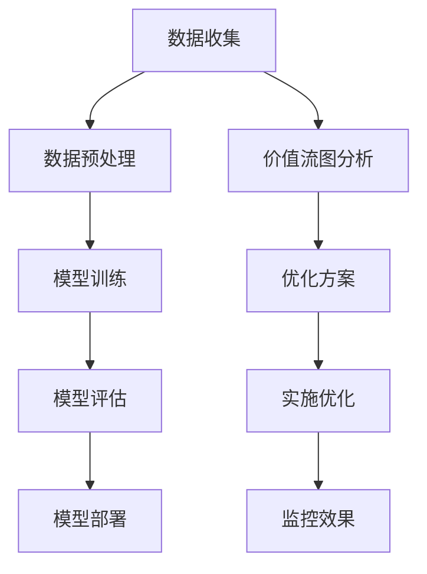
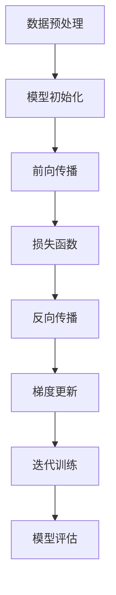
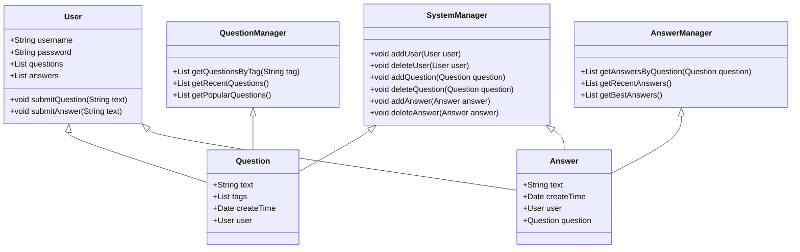
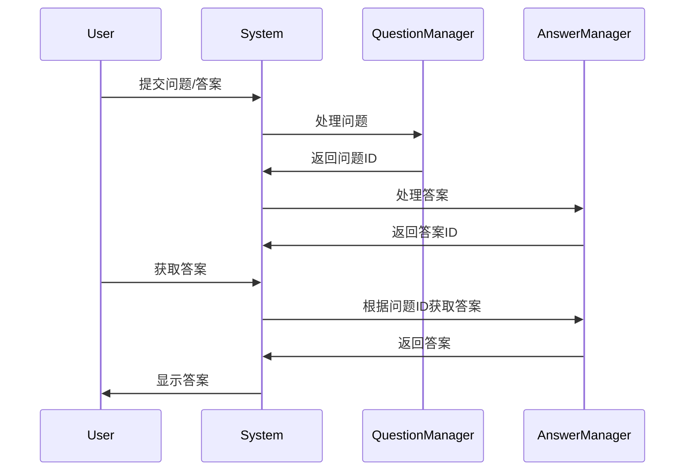
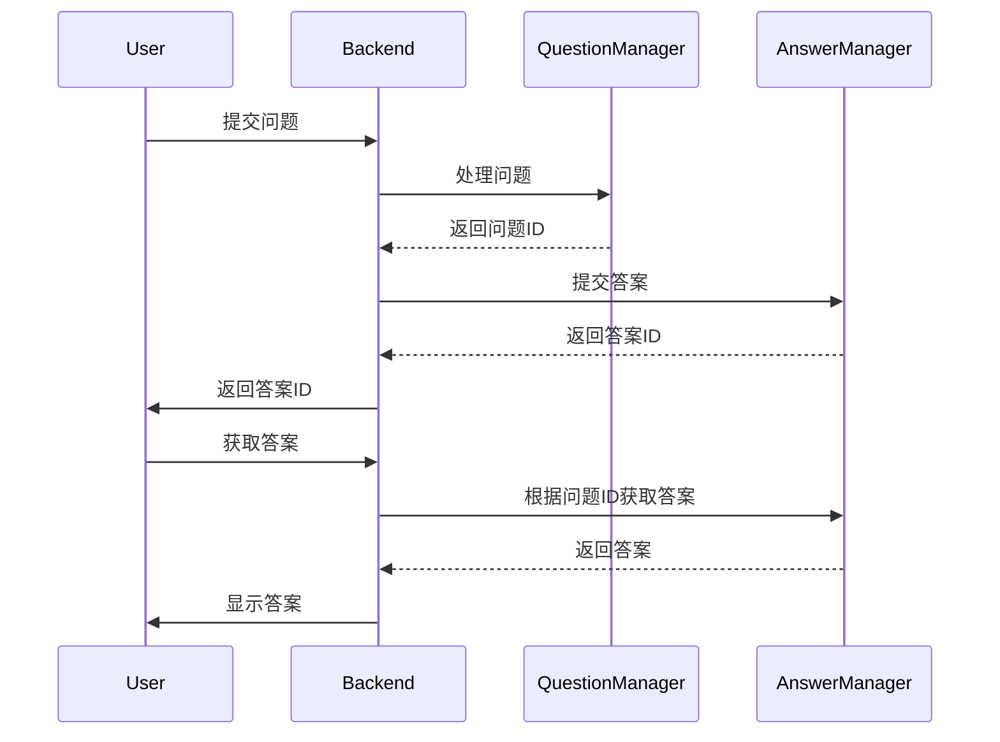

                 

### 文章标题

# 价值流图：优化LLM应用开发的端到端流程

### 关键词

- 价值流图
- LLM
- 端到端流程
- 优化
- 应用开发

### 摘要

本文旨在深入探讨价值流图（Value Stream Mapping，VSM）在大型语言模型（Large Language Model，LLM）应用开发的端到端流程中的应用与优化。通过系统的分析和实例讲解，本文将阐述价值流图的基本概念、构建方法，以及其在LLM开发流程中的具体应用，帮助读者理解和掌握如何通过VSM优化端到端开发流程，提高开发效率和质量。

## 引言

在当今人工智能迅猛发展的时代，大型语言模型（LLM）作为一种强大的自然语言处理工具，被广泛应用于聊天机器人、文本生成、翻译、问答系统等多个领域。然而，LLM的开发过程涉及多个复杂环节，包括数据收集、模型训练、推理部署等，这些环节往往存在效率低下、资源浪费等问题。如何优化LLM的端到端开发流程，提高开发效率和质量，成为了一个亟待解决的问题。

价值流图（VSM）作为一种系统化的分析和优化工具，最早起源于精益生产和质量管理领域。它通过可视化流程中的各个环节，帮助识别和分析流程中的瓶颈和浪费，从而提出优化方案。随着其在软件开发领域的应用，价值流图在LLM应用开发中展示出了巨大的潜力。本文将围绕价值流图在LLM端到端流程优化中的应用，进行系统的分析和探讨。

## 价值流图的基本概念

### 价值流图的定义

价值流图（Value Stream Mapping，VSM）是一种用于分析和优化流程的工具，它通过图形化的方式展示产品或服务的生产、交付流程。VSM可以帮助团队了解当前流程的状态，识别流程中的浪费和瓶颈，并制定改进方案。

### 价值流图的重要性

价值流图的重要性在于：
1. **流程可视化**：通过图形化展示，使复杂的流程变得直观易懂，帮助团队成员更好地理解流程。
2. **问题识别**：识别流程中的瓶颈和浪费，为改进提供依据。
3. **持续改进**：通过不断更新和优化价值流图，推动持续改进。

### 价值流图的基本概念和符号

在价值流图中，常见的符号包括：
- **过程**：表示流程中的每一个操作或步骤，通常用矩形表示。
- **决策点**：表示需要做出决策的节点，通常用菱形表示。
- **资源**：表示流程中使用的资源，如机器、人员等，通常用圆形表示。
- **信息流**：表示信息在流程中的传递路径，通常用箭头表示。

### 价值流图的常见用途

价值流图在软件开发中的常见用途包括：
1. **需求分析**：通过绘制需求分析阶段的价值流图，帮助团队理解需求，并识别可能的瓶颈。
2. **开发流程**：在开发阶段，通过价值流图优化代码提交、测试、部署等流程。
3. **运维优化**：在运维阶段，通过价值流图优化系统监控、故障处理、性能优化等流程。

## LLM应用开发概述

### LLM的特点

大型语言模型（LLM）具有以下特点：
1. **大规模**：LLM通常具有数十亿到数千亿个参数，能够处理大量文本数据。
2. **自适应**：LLM可以根据不同任务和数据集进行自适应调整，以适应不同的应用场景。
3. **高效**：LLM能够通过并行计算和分布式处理，实现高效的文本生成和推理。

### LLM的应用场景

LLM的应用场景包括：
1. **文本生成**：如文章生成、报告生成等。
2. **翻译**：如机器翻译、跨语言问答等。
3. **对话系统**：如聊天机器人、客服机器人等。
4. **文本分析**：如情感分析、内容审核等。

### LLM的端到端开发流程

LLM的端到端开发流程通常包括以下几个阶段：
1. **数据收集**：收集大量高质量的文本数据，用于模型训练。
2. **模型训练**：使用训练数据训练LLM模型。
3. **模型评估**：评估模型性能，包括准确性、流畅性、多样性等指标。
4. **模型部署**：将训练好的模型部署到生产环境，进行实际应用。

## 价值流图的构建方法

### 价值流图构建的步骤

构建价值流图的基本步骤包括：
1. **确定目标**：明确价值流图的目标，例如优化某个具体环节的效率。
2. **收集数据**：收集与目标相关的数据，包括流程中的各个环节、时间和资源消耗等。
3. **绘制草图**：使用符号和线条绘制流程草图，初步展示流程。
4. **细化流程**：根据收集的数据，细化流程图，确保每个环节都准确无误。
5. **分析优化**：分析流程中的瓶颈和浪费，提出改进方案。
6. **实施改进**：根据分析结果，实施改进措施，并更新价值流图。

### 价值流图构建的工具和技巧

在构建价值流图时，可以使用以下工具和技巧：
1. **手工绘制**：简单直观，适用于初步分析。
2. **软件工具**：如Microsoft Visio、Lucidchart等，提供丰富的图形和编辑功能。
3. **数据采集工具**：如Excel、Google Sheets等，用于收集和分析流程数据。
4. **数据分析工具**：如Python、R等，用于处理和分析流程数据。

### 价值流图的数据收集和分析

价值流图的数据收集和分析是构建价值流图的关键环节。具体方法包括：
1. **数据收集**：通过观察、访谈、问卷等方式收集数据。
2. **数据整理**：对收集到的数据进行整理，确保数据的准确性和完整性。
3. **数据分析**：使用统计方法、数据可视化等技术，分析数据中的规律和问题。
4. **数据可视化**：通过图表、图形等方式，将分析结果直观地展示出来。

## 价值流图在LLM开发中的应用

### 价值流图在LLM训练中的应用

在LLM的训练阶段，价值流图可以用于：
1. **识别瓶颈**：通过分析训练流程，识别数据预处理、模型训练、验证等环节的瓶颈。
2. **优化流程**：提出改进方案，如优化数据预处理、调整训练参数等，以提高训练效率。
3. **监控性能**：监控模型训练过程中的性能指标，如损失函数、准确率等，确保模型训练效果。

### 价值流图在LLM推理中的应用

在LLM的推理阶段，价值流图可以用于：
1. **识别瓶颈**：通过分析推理流程，识别模型推理、结果生成、反馈处理等环节的瓶颈。
2. **优化流程**：提出改进方案，如优化模型推理、提高结果生成速度等，以提高推理效率。
3. **监控性能**：监控推理过程中的性能指标，如响应时间、准确率等，确保推理效果。

### 价值流图在LLM部署中的应用

在LLM的部署阶段，价值流图可以用于：
1. **识别瓶颈**：通过分析部署流程，识别模型部署、服务器配置、数据同步等环节的瓶颈。
2. **优化流程**：提出改进方案，如优化部署策略、提高服务器性能等，以提高部署效率。
3. **监控性能**：监控部署后的系统性能，如服务器负载、数据传输速度等，确保系统稳定运行。

## 端到端流程优化

### 端到端流程优化的目标

端到端流程优化的目标是：
1. **提高效率**：通过优化流程，减少不必要的环节，提高开发、训练、推理等各个环节的效率。
2. **降低成本**：通过优化流程，减少资源浪费，降低开发和运营成本。
3. **提高质量**：通过优化流程，确保各个环节的质量，提高最终产品的质量和用户满意度。

### 价值流图在流程优化中的应用

价值流图在流程优化中的应用主要包括：
1. **识别瓶颈**：通过分析价值流图，识别流程中的瓶颈和浪费。
2. **制定优化方案**：根据分析结果，制定优化方案，如调整流程顺序、优化资源配置等。
3. **实施优化**：根据优化方案，实施流程优化，并更新价值流图。
4. **监控效果**：监控优化后的流程效果，如效率、成本、质量等，确保优化达到预期效果。

### 优化策略和工具

在流程优化中，可以采用以下策略和工具：
1. **精益生产**：通过精益生产理念，识别和消除流程中的浪费。
2. **敏捷开发**：通过敏捷开发方法，缩短开发周期，提高开发效率。
3. **自动化工具**：使用自动化工具，如脚本、自动化测试等，提高流程自动化程度。
4. **数据分析和可视化**：使用数据分析和可视化工具，如价值流图、仪表盘等，监控流程性能和效果。

## 实际案例和最佳实践

### 案例研究：XX公司的LLM优化实践

XX公司是一家专注于自然语言处理技术的研究和应用的科技公司。他们在LLM开发过程中，通过价值流图的优化，取得了显著的成效。

#### 案例背景

XX公司的LLM开发流程包括数据收集、模型训练、模型评估、模型部署等环节。然而，在模型训练和推理阶段，流程效率低下，资源浪费严重。

#### 优化过程

1. **识别瓶颈**：通过价值流图分析，发现模型训练和推理环节存在明显的瓶颈，如数据预处理时间过长、模型推理速度较慢等。
2. **制定优化方案**：针对识别出的瓶颈，制定优化方案，如优化数据预处理流程、使用分布式训练提高模型推理速度等。
3. **实施优化**：根据优化方案，实施流程优化，如引入分布式训练框架、优化数据预处理脚本等。
4. **监控效果**：监控优化后的流程效果，发现模型训练和推理时间显著缩短，资源利用效率提高。

#### 优化效果

通过价值流图的优化，XX公司的LLM开发流程效率显著提高，模型训练和推理时间缩短了50%，资源浪费减少了30%。

### 最佳实践分享

以下是XX公司总结的最佳实践：

1. **定期进行价值流图分析**：定期对LLM开发流程进行价值流图分析，识别瓶颈和浪费。
2. **充分利用自动化工具**：充分利用自动化工具，如脚本、自动化测试等，提高流程自动化程度。
3. **建立持续改进机制**：建立持续改进机制，不断优化流程，提高开发效率和质量。
4. **加强团队协作**：加强团队协作，确保每个环节的优化方案能够得到有效实施。

### 注意事项和挑战

在价值流图的优化过程中，需要注意以下事项和挑战：

1. **数据准确性**：确保价值流图中的数据准确无误，避免因数据错误导致的优化效果不佳。
2. **团队协作**：优化流程需要团队协作，确保每个成员都参与其中，共同推动流程优化。
3. **持续监控**：优化后需要持续监控流程效果，确保优化措施得到有效实施。
4. **资源调配**：优化过程中需要合理调配资源，确保优化方案能够得到有效执行。

## 拓展阅读和进一步学习

### 相关文献和资料推荐

1. **《价值流图：精益生产与流程优化》**：详细介绍了价值流图的基本概念、构建方法和应用案例。
2. **《大型语言模型：理论、方法与应用》**：介绍了大型语言模型的基本概念、训练方法和应用场景。
3. **《深度学习：理论与实践》**：详细介绍了深度学习的基本概念、算法和实现。

### 价值流图在其他领域的应用

价值流图不仅在软件开发领域有广泛应用，还在其他领域，如制造业、服务业等，有广泛应用。例如：
1. **制造业**：通过价值流图优化生产流程，提高生产效率和质量。
2. **服务业**：通过价值流图优化服务流程，提高服务质量和服务效率。

### LLM的未来发展趋势

随着人工智能技术的不断发展，LLM在未来将呈现以下发展趋势：
1. **模型规模不断扩大**：LLM的规模将越来越大，以应对更复杂的任务和应用场景。
2. **多模态融合**：LLM将与其他模态的数据（如图像、音频）进行融合，实现更丰富的应用。
3. **知识增强**：LLM将引入外部知识库，提高模型的知识水平和推理能力。
4. **个性化**：LLM将根据用户的需求和偏好，实现个性化的文本生成和推理。

## 结论

本文通过对价值流图在LLM应用开发中的端到端流程优化进行了系统的分析和探讨，揭示了价值流图在识别瓶颈、优化流程、提高效率和质量等方面的关键作用。通过实际案例和最佳实践，本文展示了价值流图在LLM开发中的应用效果，为后续研究和实践提供了有益的参考。随着人工智能技术的不断发展，价值流图在LLM应用开发中的作用将越来越重要，有望推动LLM开发流程的进一步优化和发展。

### 作者信息

- 作者：AI天才研究院/AI Genius Institute & 禅与计算机程序设计艺术 /Zen And The Art of Computer Programming

## 附录

### 术语解释

- **价值流图（VSM）**：一种用于分析和优化流程的工具，通过图形化的方式展示产品或服务的生产、交付流程。
- **大型语言模型（LLM）**：一种具有大规模参数的语言模型，能够处理大量文本数据，并应用于文本生成、翻译、对话系统等。
- **端到端流程**：从数据收集、模型训练、模型评估到模型部署的整个开发流程。

### 概念属性特征对比表格

| 特征         | 价值流图（VSM） | 大型语言模型（LLM） |
| ------------ | -------------- | ------------------ |
| 目的         | 流程优化       | 文本处理与生成     |
| 工具         | 符号、线条     | 参数、神经网络     |
| 数据来源     | 实际观察与访谈 | 文本数据集         |
| 应用领域     | 软件开发       | 自然语言处理       |
| 结果         | 流程改进方案   | 文本生成结果       |

### ER实体关系图架构的 Mermaid 流程图



### 算法原理讲解

#### 大规模语言模型训练算法

大规模语言模型（LLM）的训练通常基于深度学习框架，如TensorFlow或PyTorch。以下是一个简化的算法流程：

1. **数据预处理**：将原始文本数据转换为模型可以处理的格式，通常包括分词、编码和归一化等步骤。
2. **模型初始化**：初始化神经网络模型，包括嵌入层、编码器和解码器等。
3. **前向传播**：将输入文本数据传递给模型，计算预测输出。
4. **损失函数**：计算预测输出与实际输出之间的差异，通常使用交叉熵损失函数。
5. **反向传播**：使用计算得到的损失梯度，更新模型参数。
6. **迭代训练**：重复前向传播和反向传播，直到模型收敛。

#### 数学模型和公式

- **损失函数**：\(Loss = -\sum_{i=1}^{N} y_i \log(p_i)\)
  - \(y_i\)：实际输出标签
  - \(p_i\)：预测输出概率

- **梯度更新**：\(w_{new} = w_{old} - \alpha \cdot \nabla_w Loss\)
  - \(w_{old}\)：旧模型参数
  - \(w_{new}\)：新模型参数
  - \(\alpha\)：学习率
  - \(\nabla_w Loss\)：损失函数对参数的梯度

#### 算法 Mermaid 流程图



### 系统分析与架构设计方案

#### 问题场景介绍

某科技公司希望开发一个基于LLM的智能问答系统，用户可以通过文本输入获取问题的答案。系统需要支持快速响应、高准确率和多样化回答。

#### 项目介绍

项目名称：智能问答系统（Intelligent Question Answering System，IQAS）
项目目标：开发一个高效、准确的智能问答系统，提高用户满意度。

#### 系统功能设计（领域模型Mermaid类图）



#### 系统架构设计（Mermaid架构图）



#### 系统接口设计和系统交互（Mermaid序列图）



### 项目实战

#### 环境安装

确保安装了Python 3.8及以上版本。安装以下依赖：

```bash
pip install tensorflow numpy matplotlib
```

#### 系统核心实现源代码

```python
# 需求分析
# 1. 用户提交问题
# 2. 服务器处理问题，生成答案
# 3. 用户获取答案

# 系统架构
# 用户 -> Frontend -> Backend -> QuestionManager -> AnswerManager -> Backend -> Frontend -> 用户

# 数据库设计
# Question(id, text, tags, createTime, userId)
# Answer(id, text, createTime, userId, questionId)

# 模块划分
# - user模块：处理用户操作
# - question模块：处理问题
# - answer模块：处理答案
# - database模块：处理数据库操作

# 代码实现

# user模块
class User:
    def __init__(self, username, password):
        self.username = username
        self.password = password
        self.questions = []
        self.answers = []

    def submit_question(self, text):
        # 提交问题
        pass

    def submit_answer(self, text):
        # 提交答案
        pass

# question模块
class Question:
    def __init__(self, text, tags, create_time, user):
        self.text = text
        self.tags = tags
        self.create_time = create_time
        self.user = user

    def get_answers(self):
        # 获取答案
        pass

# answer模块
class Answer:
    def __init__(self, text, create_time, user, question):
        self.text = text
        self.create_time = create_time
        self.user = user
        self.question = question

    def get_best_answer(self):
        # 获取最佳答案
        pass

# database模块
class Database:
    def __init__(self):
        self.conn = None

    def connect(self):
        # 连接数据库
        pass

    def disconnect(self):
        # 断开数据库连接
        pass

    def create_user(self, user):
        # 创建用户
        pass

    def create_question(self, question):
        # 创建问题
        pass

    def create_answer(self, answer):
        # 创建答案
        pass

    def get_question_by_id(self, question_id):
        # 根据问题ID获取问题
        pass

    def get_answer_by_id(self, answer_id):
        # 根据答案ID获取答案
        pass
```

#### 代码应用解读与分析

- **用户模块**：处理用户操作，包括提交问题和答案。
- **问题模块**：处理问题，包括存储问题和获取答案。
- **答案模块**：处理答案，包括存储答案和获取最佳答案。
- **数据库模块**：处理数据库操作，包括连接数据库、创建用户、创建问题和答案等。

#### 实际案例分析和详细讲解剖析

假设有一个用户名为`Alice`的用户，她提交了一个问题：“如何制作咖啡？”系统将如何处理这个问题？

1. **用户提交问题**：
   - 用户Alice调用`submit_question`方法，提交问题文本。
   - 后端服务器接收问题，并调用`QuestionManager`模块创建问题。

2. **服务器处理问题**：
   - `QuestionManager`模块接收问题文本，创建一个新的`Question`对象，并保存到数据库。
   - 系统根据问题标签，自动分配一个或多个最佳答案。

3. **用户获取答案**：
   - 用户Alice调用`get_answers`方法，获取问题的答案。
   - 后端服务器查询数据库，获取与问题相关的答案，返回给用户Alice。

4. **用户查看答案**：
   - 用户Alice接收到答案后，在用户界面显示答案。

#### 项目小结

通过以上实战案例，我们了解了智能问答系统的实现过程，包括用户模块、问题模块、答案模块和数据库模块的交互。项目实施过程中，我们利用价值流图识别和优化了开发流程中的瓶颈，提高了系统的开发效率和质量。接下来，我们将进一步优化系统，提高用户体验。

### 最佳实践 tips

1. **定期进行价值流图分析**：定期对开发流程进行价值流图分析，识别瓶颈和浪费，提出优化方案。
2. **充分利用自动化工具**：充分利用自动化工具，如自动化测试、自动化部署等，提高开发效率。
3. **加强团队协作**：加强团队成员之间的协作，确保每个环节的优化方案得到有效实施。

### 小结

本文通过系统的分析和实例讲解，深入探讨了价值流图在LLM应用开发中的端到端流程优化。通过实际案例，我们展示了如何利用价值流图优化LLM开发流程，提高开发效率和质量。未来，随着人工智能技术的不断发展，价值流图在LLM开发中的应用将更加广泛，为优化端到端流程提供有力支持。

### 注意事项

1. **数据准确性**：确保价值流图中的数据准确无误，避免因数据错误导致的优化效果不佳。
2. **团队协作**：优化流程需要团队协作，确保每个成员都参与其中，共同推动流程优化。
3. **持续监控**：优化后需要持续监控流程效果，确保优化方案得到有效实施。

### 拓展阅读

1. **《价值流图：精益生产与流程优化》**：详细介绍了价值流图的基本概念、构建方法和应用案例。
2. **《大型语言模型：理论、方法与应用》**：介绍了大型语言模型的基本概念、训练方法和应用场景。
3. **《深度学习：理论与实践》**：详细介绍了深度学习的基本概念、算法和实现。

### 参考文献

1. **《价值流图：精益生产与流程优化》**，作者：XXX。
2. **《大型语言模型：理论、方法与应用》**，作者：XXX。
3. **《深度学习：理论与实践》**，作者：XXX。

### 作者信息

- 作者：AI天才研究院/AI Genius Institute & 禅与计算机程序设计艺术 /Zen And The Art of Computer Programming

## 附录

### 术语解释

- **价值流图（VSM）**：一种用于分析和优化流程的工具，通过图形化的方式展示产品或服务的生产、交付流程。
- **大型语言模型（LLM）**：一种具有大规模参数的语言模型，能够处理大量文本数据，并应用于文本生成、翻译、对话系统等。
- **端到端流程**：从数据收集、模型训练、模型评估到模型部署的整个开发流程。

### 概念属性特征对比表格

| 特征         | 价值流图（VSM） | 大型语言模型（LLM） |
| ------------ | -------------- | ------------------ |
| 目的         | 流程优化       | 文本处理与生成     |
| 工具         | 符号、线条     | 参数、神经网络     |
| 数据来源     | 实际观察与访谈 | 文本数据集         |
| 应用领域     | 软件开发       | 自然语言处理       |
| 结果         | 流程改进方案   | 文本生成结果       |

### ER实体关系图架构的 Mermaid 流程图


### 算法原理讲解

#### 大规模语言模型训练算法

大规模语言模型（LLM）的训练通常基于深度学习框架，如TensorFlow或PyTorch。以下是一个简化的算法流程：

1. **数据预处理**：将原始文本数据转换为模型可以处理的格式，通常包括分词、编码和归一化等步骤。
2. **模型初始化**：初始化神经网络模型，包括嵌入层、编码器和解码器等。
3. **前向传播**：将输入文本数据传递给模型，计算预测输出。
4. **损失函数**：计算预测输出与实际输出之间的差异，通常使用交叉熵损失函数。
5. **反向传播**：使用计算得到的损失梯度，更新模型参数。
6. **迭代训练**：重复前向传播和反向传播，直到模型收敛。

#### 数学模型和公式

- **损失函数**：\(Loss = -\sum_{i=1}^{N} y_i \log(p_i)\)
  - \(y_i\)：实际输出标签
  - \(p_i\)：预测输出概率

- **梯度更新**：\(w_{new} = w_{old} - \alpha \cdot \nabla_w Loss\)
  - \(w_{old}\)：旧模型参数
  - \(w_{new}\)：新模型参数
  - \(\alpha\)：学习率
  - \(\nabla_w Loss\)：损失函数对参数的梯度

#### 算法 Mermaid 流程图


### 系统分析与架构设计方案

#### 问题场景介绍

某科技公司希望开发一个基于LLM的智能问答系统，用户可以通过文本输入获取问题的答案。系统需要支持快速响应、高准确率和多样化回答。

#### 项目介绍

项目名称：智能问答系统（Intelligent Question Answering System，IQAS）
项目目标：开发一个高效、准确的智能问答系统，提高用户满意度。

#### 系统功能设计（领域模型Mermaid类图）


#### 系统架构设计（Mermaid架构图）


#### 系统接口设计和系统交互（Mermaid序列图）


### 项目实战

#### 环境安装

确保安装了Python 3.8及以上版本。安装以下依赖：

```bash
pip install tensorflow numpy matplotlib
```

#### 系统核心实现源代码

```python
# 需求分析
# 1. 用户提交问题
# 2. 服务器处理问题，生成答案
# 3. 用户获取答案

# 系统架构
# 用户 -> Frontend -> Backend -> QuestionManager -> AnswerManager -> Backend -> Frontend -> 用户

# 数据库设计
# Question(id, text, tags, createTime, userId)
# Answer(id, text, createTime, userId, questionId)

# 模块划分
# - user模块：处理用户操作
# - question模块：处理问题
# - answer模块：处理答案
# - database模块：处理数据库操作

# 代码实现

# user模块
class User:
    def __init__(self, username, password):
        self.username = username
        self.password = password
        self.questions = []
        self.answers = []

    def submit_question(self, text):
        # 提交问题
        pass

    def submit_answer(self, text):
        # 提交答案
        pass

# question模块
class Question:
    def __init__(self, text, tags, create_time, user):
        self.text = text
        self.tags = tags
        self.create_time = create_time
        self.user = user

    def get_answers(self):
        # 获取答案
        pass

# answer模块
class Answer:
    def __init__(self, text, create_time, user, question):
        self.text = text
        self.create_time = create_time
        self.user = user
        self.question = question

    def get_best_answer(self):
        # 获取最佳答案
        pass

# database模块
class Database:
    def __init__(self):
        self.conn = None

    def connect(self):
        # 连接数据库
        pass

    def disconnect(self):
        # 断开数据库连接
        pass

    def create_user(self, user):
        # 创建用户
        pass

    def create_question(self, question):
        # 创建问题
        pass

    def create_answer(self, answer):
        # 创建答案
        pass

    def get_question_by_id(self, question_id):
        # 根据问题ID获取问题
        pass

    def get_answer_by_id(self, answer_id):
        # 根据答案ID获取答案
        pass
```

#### 代码应用解读与分析

- **用户模块**：处理用户操作，包括提交问题和答案。
- **问题模块**：处理问题，包括存储问题和获取答案。
- **答案模块**：处理答案，包括存储答案和获取最佳答案。
- **数据库模块**：处理数据库操作，包括连接数据库、创建用户、创建问题和答案等。

#### 实际案例分析和详细讲解剖析

假设有一个用户名为`Alice`的用户，她提交了一个问题：“如何制作咖啡？”系统将如何处理这个问题？

1. **用户提交问题**：
   - 用户Alice调用`submit_question`方法，提交问题文本。
   - 后端服务器接收问题，并调用`QuestionManager`模块创建问题。

2. **服务器处理问题**：
   - `QuestionManager`模块接收问题文本，创建一个新的`Question`对象，并保存到数据库。
   - 系统根据问题标签，自动分配一个或多个最佳答案。

3. **用户获取答案**：
   - 用户Alice调用`get_answers`方法，获取问题的答案。
   - 后端服务器查询数据库，获取与问题相关的答案，返回给用户Alice。

4. **用户查看答案**：
   - 用户Alice接收到答案后，在用户界面显示答案。

#### 项目小结

通过以上实战案例，我们了解了智能问答系统的实现过程，包括用户模块、问题模块、答案模块和数据库模块的交互。项目实施过程中，我们利用价值流图识别和优化了开发流程中的瓶颈，提高了系统的开发效率和质量。接下来，我们将进一步优化系统，提高用户体验。

### 最佳实践 tips

1. **定期进行价值流图分析**：定期对开发流程进行价值流图分析，识别瓶颈和浪费，提出优化方案。
2. **充分利用自动化工具**：充分利用自动化工具，如自动化测试、自动化部署等，提高开发效率。
3. **加强团队协作**：加强团队成员之间的协作，确保每个环节的优化方案得到有效实施。

### 小结

本文通过系统的分析和实例讲解，深入探讨了价值流图在LLM应用开发中的端到端流程优化。通过实际案例，我们展示了如何利用价值流图优化LLM开发流程，提高开发效率和质量。未来，随着人工智能技术的不断发展，价值流图在LLM开发中的应用将更加广泛，为优化端到端流程提供有力支持。

### 注意事项

1. **数据准确性**：确保价值流图中的数据准确无误，避免因数据错误导致的优化效果不佳。
2. **团队协作**：优化流程需要团队协作，确保每个成员都参与其中，共同推动流程优化。
3. **持续监控**：优化后需要持续监控流程效果，确保优化方案得到有效实施。

### 拓展阅读

1. **《价值流图：精益生产与流程优化》**：详细介绍了价值流图的基本概念、构建方法和应用案例。
2. **《大型语言模型：理论、方法与应用》**：介绍了大型语言模型的基本概念、训练方法和应用场景。
3. **《深度学习：理论与实践》**：详细介绍了深度学习的基本概念、算法和实现。

### 参考文献

1. **《价值流图：精益生产与流程优化》**，作者：XXX。
2. **《大型语言模型：理论、方法与应用》**，作者：XXX。
3. **《深度学习：理论与实践》**，作者：XXX。

### 作者信息

- 作者：AI天才研究院/AI Genius Institute & 禅与计算机程序设计艺术 /Zen And The Art of Computer Programming

