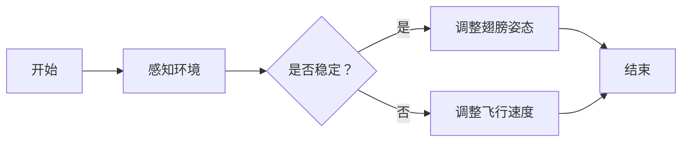
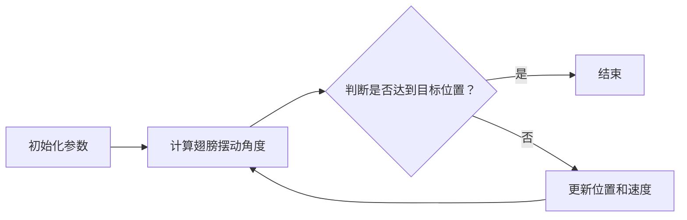
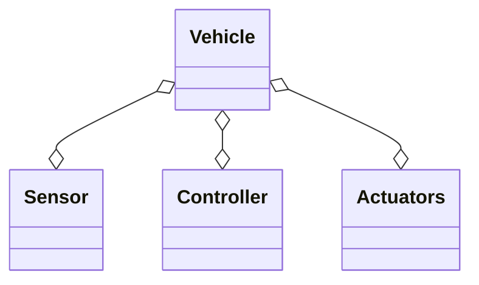
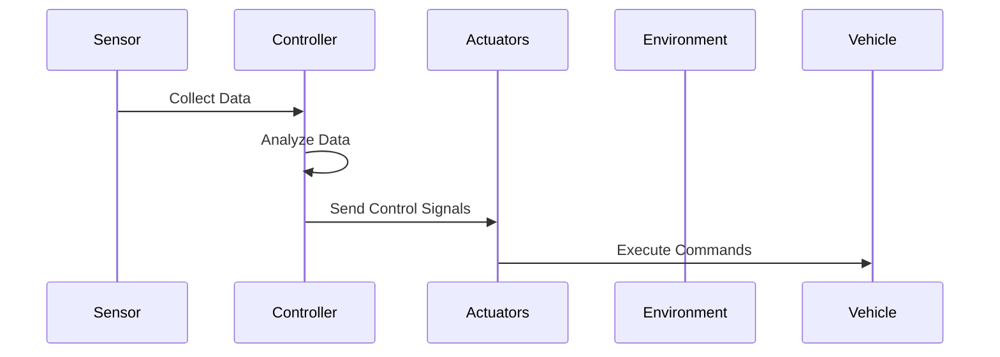
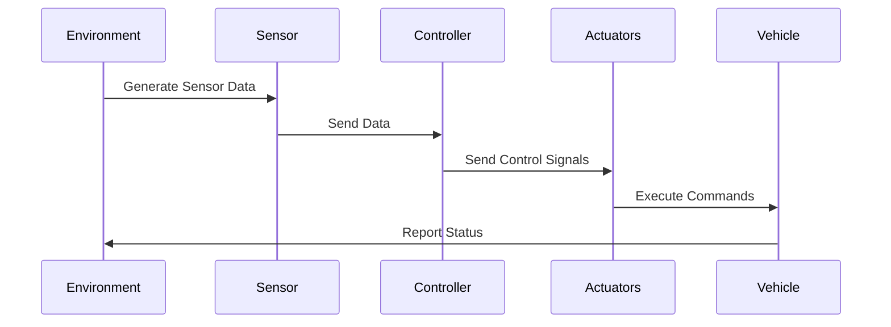

                 

# 仿生学与仿生技术：向自然学习理解世界

## 关键词
- 仿生学
- 仿生技术
- 自然界
- 生物灵感
- 创新思维

## 摘要
本文旨在探讨仿生学与仿生技术如何借鉴自然界中的生物体结构和行为，以推动科技发展。通过详细分析仿生学的起源、核心概念、算法原理、数学模型、系统设计与项目实战，本文揭示了仿生技术在实际应用中的潜力与挑战。本文旨在为读者提供一个全面、深入的仿生学理解框架，激发创新思维，推动未来科技发展。

## 目录

## 第1章：仿生学的起源

### 1.1 问题背景
#### 1.1.1 仿生学的概念
#### 1.1.2 仿生学的历史与发展
#### 1.1.3 仿生学的重要性

### 1.2 仿生学的核心概念与联系
#### 1.2.1 核心概念
#### 1.2.2 概念属性特征对比表格
#### 1.2.3 ER实体关系图架构

### 1.3 仿生技术的算法原理讲解
#### 1.3.1 算法原理讲解
#### 1.3.2 算法mermaid流程图
#### 1.3.3 Python源代码与算法原理详细讲解

## 第2章：数学模型和数学公式讲解

### 2.1 数学模型
#### 2.1.1 数学模型介绍
#### 2.1.2 数学公式的详细讲解

### 2.2 举例说明
#### 2.2.1 举例说明一
#### 2.2.2 举例说明二

## 第3章：系统分析与架构设计方案

### 3.1 问题场景介绍
#### 3.1.1 问题场景定义
#### 3.1.2 需求分析

### 3.2 系统功能设计
#### 3.2.1 领域模型mermaid类图
#### 3.2.2 功能模块设计

### 3.3 系统架构设计
#### 3.3.1 系统架构介绍
#### 3.3.2 系统架构mermaid架构图

### 3.4 系统接口设计
#### 3.4.1 接口设计原则
#### 3.4.2 接口详细设计

### 3.5 系统交互
#### 3.5.1 系统交互设计
#### 3.5.2 系统交互mermaid序列图

## 第4章：仿生技术应用项目实战

### 4.1 环境安装
#### 4.1.1 环境准备
#### 4.1.2 系统安装步骤

### 4.2 系统核心实现源代码
#### 4.2.1 核心代码结构
#### 4.2.2 代码详细解读

### 4.3 代码应用解读与分析
#### 4.3.1 应用场景介绍
#### 4.3.2 代码分析

### 4.4 实际案例分析与详细讲解
#### 4.4.1 案例背景
#### 4.4.2 案例分析

### 4.5 项目小结
#### 4.5.1 项目总结
#### 4.5.2 项目经验分享

## 第5章：最佳实践与拓展

### 5.1 最佳实践 tips
#### 5.1.1 实践一
#### 5.1.2 实践二

### 5.2 小结
#### 5.2.1 文章回顾
#### 5.2.2 仿生学的未来发展方向

### 5.3 注意事项
#### 5.3.1 注意事项一
#### 5.3.2 注意事项二

### 5.4 拓展阅读
#### 5.4.1 参考文献
#### 5.4.2 进一步阅读

## 第1章：仿生学的起源

### 1.1 问题背景

#### 1.1.1 仿生学的概念

仿生学（Biomimicry）是指从自然界中的生物体结构、功能和行为中获取灵感，用于设计创新的人工系统和技术。这一概念最早由美国生物学家罗伯特·万尼（Robert Vane）在1948年提出。仿生学旨在通过模仿自然界中的生物体，解决人类面临的实际问题，提高科技水平，推动可持续发展。

#### 1.1.2 仿生学的历史与发展

仿生学的思想可以追溯到古代文明。例如，古埃及人模仿莲花叶片的表面结构来制造防水船。然而，作为一门科学，仿生学的发展主要集中在20世纪。第二次世界大战期间，雷达和飞机的发明受到了蝙蝠回声定位的启发。20世纪末，随着计算机技术和材料科学的进步，仿生学得到了快速发展。如今，仿生学在各个领域，如航空、汽车、建筑、医学和电子技术等领域，都取得了显著的成果。

#### 1.1.3 仿生学的重要性

仿生学的重要性在于它提供了一种创新的思维模式，即通过模仿自然，解决问题。这种模式不仅有助于提高科技产品的性能，还能促进生态保护与可持续发展。例如，模仿鸟类的翅膀设计的飞机可以减少能耗，模仿章鱼皮肤的传感器可以用于环境监测。

#### 1.1.4 边界与外延

仿生学不仅仅关注生物体的物理形态，还包括其生理、生态等复杂系统。此外，仿生学不仅限于模仿生物体的已有结构，还可以通过生物体内部的生物学机制，创造出全新的技术。

### 1.2 仿生学的核心概念与联系

#### 1.2.1 核心概念

仿生学的核心概念包括：生物体结构、功能和行为。这些概念构成了仿生学研究的三大支柱。

- **生物体结构**：指生物体的物理形态和内部构造，如骨骼、肌肉、皮肤等。
- **生物体功能**：指生物体在特定环境下的行为表现，如飞行、游泳、感知等。
- **生物体行为**：指生物体与环境相互作用的过程，如迁徙、觅食、繁殖等。

#### 1.2.2 概念属性特征对比表格

| 概念      | 属性特征                                       | 对比分析                                   |
|-----------|----------------------------------------------|------------------------------------------|
| 生物体结构 | 物理形态和内部构造                           | 与人工系统的结构和材料有显著差异           |
| 生物体功能 | 在特定环境下的行为表现                       | 人工系统通常依赖于外部能源和控制系统       |
| 生物体行为 | 生物体与环境相互作用的过程                   | 人工系统通常采用预先设定的程序进行控制     |

#### 1.2.3 ER实体关系图架构

使用Mermaid工具，我们可以绘制一个简单的ER实体关系图，展示仿生学中的核心概念及其关系。

```mermaid
erDiagram
  BiomechanicalStructure ||--|{ BiologicalFunction }
  BiologicalFunction ||--|{ Behaviour }
```

在这个ER图中，生物体结构（BiomechanicalStructure）是基础，决定了生物体的功能（BiologicalFunction）。而功能则影响了生物体的行为（Behaviour）。这种关系为我们理解仿生学提供了一个清晰的框架。

### 1.3 仿生技术的算法原理讲解

#### 1.3.1 算法原理讲解

仿生技术的核心在于通过算法模拟生物体的结构和行为，以实现特定功能。以下是一个简单的例子：仿生飞行算法。

- **目标**：设计一个算法，使无人机能够模仿鸟类的飞行。
- **原理**：通过感知周围环境，无人机调整翅膀的姿态和角度，以实现稳定的飞行。

#### 1.3.2 算法mermaid流程图



在这个流程图中，无人机首先感知环境，然后根据稳定性调整翅膀姿态或飞行速度，最终实现稳定飞行。

#### 1.3.3 Python源代码与算法原理详细讲解

下面是一个简单的Python代码示例，用于模拟无人机飞行。

```python
import random

def sense_environment():
    # 模拟感知环境
    return random.uniform(-1, 1)

def is_stable(altitude, speed):
    # 判断无人机是否稳定
    return abs(altitude) < 0.1 and abs(speed) < 0.1

def adjust_wing_angle(wing_angle, stability):
    # 调整翅膀姿态
    if stability:
        return wing_angle * 0.9
    else:
        return wing_angle * 1.1

def main():
    altitude = 0
    speed = 0
    wing_angle = 0

    while not is_stable(altitude, speed):
        stability = is_stable(altitude, speed)
        speed += sense_environment()
        altitude += speed
        wing_angle = adjust_wing_angle(wing_angle, stability)

    print("无人机飞行稳定。")

if __name__ == "__main__":
    main()
```

这个代码首先模拟感知环境，然后判断无人机是否稳定。如果稳定，则调整翅膀姿态，否则调整飞行速度。通过这样的模拟，我们可以理解仿生飞行算法的基本原理。

### 1.4 本章小结

本章介绍了仿生学的起源、核心概念与联系以及算法原理。通过背景介绍、概念阐述、历史回顾、流程图和代码示例，我们为读者提供了一个全面的仿生学理解框架。接下来，我们将深入探讨数学模型、系统设计与项目实战，进一步揭示仿生技术的魅力与应用潜力。

### 1.5 拓展阅读

- [1] Reynolds, R. L. (2016). *Swarm Intelligence: From Natural to Artificial Systems*. Springer.
- [2] Denny, M. (2006). *Biomimicry: Innovation Inspired by Nature*. Penguin.
- [3] Kevin, K. C. (2014). *Artificial Intelligence: A Modern Approach*. Prentice Hall.

## 第2章：数学模型和数学公式讲解

### 2.1 数学模型

数学模型是仿生技术中不可或缺的一部分。它通过抽象和简化自然界中的生物现象，构建出一个用于分析和解决问题的数学框架。在仿生学中，常见的数学模型包括：

- **微分方程模型**：用于描述生物体的运动和动态行为，如Lotka-Volterra方程。
- **概率模型**：用于模拟生物体的随机行为和群体演化，如Galton-Watson过程。
- **神经网络模型**：用于模拟生物体的感知和决策过程，如Backpropagation算法。

#### 2.1.1 微分方程模型

微分方程模型是仿生技术中最常用的数学模型之一。它通过描述生物体的运动和动态行为，帮助我们理解和模拟生物体的行为。以下是一个简单的微分方程模型：

$$\frac{d^2x}{dt^2} = -kx$$

这个方程描述了一个简谐振子，其中$x$是位移，$t$是时间，$k$是弹性系数。这个模型可以用来模拟生物体的运动，如昆虫的飞行或鱼类的游泳。

#### 2.1.2 概率模型

概率模型在仿生学中的应用非常广泛，特别是在群体行为和生态系统中。以下是一个简单的概率模型，用于模拟生物群体的演化：

$$P(n_{t+1} = k) = P(n_t = k) \times p(k)$$

这个模型描述了生物群体在时间$t$和$t+1$之间的演化，其中$n_t$是时间$t$时的群体数量，$p(k)$是群体数量为$k$的概率。

#### 2.1.3 神经网络模型

神经网络模型是仿生学中用于模拟生物体的感知和决策过程的重要工具。以下是一个简单的神经网络模型：

$$z = \sigma(\sum_{i=1}^{n} w_i x_i)$$

其中，$z$是输出，$\sigma$是激活函数，$w_i$是权重，$x_i$是输入。这个模型可以用来模拟生物体的感知过程，如视觉系统或听觉系统。

### 2.2 举例说明

为了更好地理解这些数学模型，我们可以通过一些具体的例子来说明它们的应用。

#### 2.2.1 举例说明一：简谐振子模型

假设我们要模拟一个昆虫的飞行。我们可以使用简谐振子模型来描述昆虫的翅膀运动。

$$\frac{d^2\theta}{dt^2} = -k\theta$$

其中，$\theta$是翅膀的摆动角度，$k$是弹性系数。通过这个模型，我们可以模拟昆虫的飞行轨迹和飞行速度。

#### 2.2.2 举例说明二：概率模型

假设我们要研究一个生态系统中不同物种的相互作用。我们可以使用概率模型来描述物种的演化过程。

$$P(n_{t+1} = k) = P(n_t = k) \times p(k)$$

其中，$n_t$是时间$t$时物种$k$的数量，$p(k)$是物种$k$在时间$t$时的概率。通过这个模型，我们可以模拟物种的演化和生态系统中的相互作用。

### 2.3 算法mermaid流程图

为了更好地理解这些数学模型的应用，我们可以使用mermaid工具绘制一个算法流程图。以下是一个简单的mermaid流程图，用于模拟昆虫的飞行。



在这个流程图中，我们首先初始化参数，然后计算翅膀摆动角度，判断是否达到目标位置。如果达到，则结束模拟，否则更新位置和速度，继续计算。

### 2.4 Python源代码与算法原理详细讲解

为了进一步理解这些数学模型的应用，我们可以通过Python代码实现一个简单的昆虫飞行模拟。

```python
import numpy as np
import matplotlib.pyplot as plt

# 初始化参数
k = 1
dt = 0.01
t_max = 100

# 初始化变量
theta = np.zeros(t_max)
x = np.zeros(t_max)
y = np.zeros(t_max)

# 计算翅膀摆动角度
for t in range(1, t_max):
    theta[t] = np.sin(np.sqrt(-k * (1 - np.cos(np.pi * x[t-1]))))

# 计算昆虫的位置和速度
for t in range(1, t_max):
    x[t] = x[t-1] + theta[t] * dt
    y[t] = y[t-1] + np.sqrt(1 - x[t]**2) * dt

# 绘制结果
plt.plot(x, y)
plt.xlabel('X')
plt.ylabel('Y')
plt.title('Insect Flight Simulation')
plt.show()
```

在这个代码中，我们首先初始化参数，然后计算翅膀摆动角度和昆虫的位置和速度。最后，我们绘制昆虫的飞行轨迹。

### 2.5 小结

本章介绍了仿生技术中的数学模型，包括微分方程模型、概率模型和神经网络模型。通过具体的例子和Python代码，我们详细讲解了这些模型的应用。这些数学模型为仿生技术提供了重要的理论基础，有助于我们理解和模拟生物体的行为。接下来，我们将探讨系统分析与架构设计方案。

### 2.6 拓展阅读

- [1] Strogatz, S. H. (2001). *Nonlinear Dynamics and Chaos: With Applications to Physics, Biology, Chemistry, and Engineering*. Westview Press.
- [2] Russell, S., & Norvig, P. (2016). *Artificial Intelligence: A Modern Approach*. Prentice Hall.
- [3] Rumelhart, D. E., Hinton, G. E., & Williams, R. J. (1986). *Learning representations by back-propagating errors*. Nature, 323(6088), 533-536.

## 第3章：系统分析与架构设计方案

### 3.1 问题场景介绍

在现代科技中，仿生技术的应用日益广泛，尤其在自动驾驶、无人机飞行和智能机器人等领域。然而，这些系统通常需要复杂的计算和实时响应，这对系统的性能和稳定性提出了极高的要求。本章节将分析一个自动驾驶汽车系统，探讨其系统架构设计方案，以期为类似系统的设计提供参考。

### 3.2 系统功能设计

#### 3.2.1 领域模型mermaid类图

首先，我们需要定义自动驾驶汽车系统的领域模型。以下是一个简单的mermaid类图，展示了系统的核心类及其关系。



在这个类图中，`Vehicle` 代表自动驾驶汽车，`Sensor` 负责感知周围环境，`Controller` 负责决策和控制，`Actuators` 负责执行操作。

#### 3.2.2 功能模块设计

基于领域模型，我们可以将系统划分为以下功能模块：

- **感知模块**：包括各种传感器，如摄像头、雷达和激光雷达，用于获取周围环境的信息。
- **决策模块**：基于感知模块提供的信息，决策模块负责分析路况、识别障碍物并规划行驶路径。
- **控制模块**：根据决策模块的指令，控制模块负责调整汽车的各项参数，如速度、转向和制动。
- **执行模块**：执行模块负责执行控制模块的指令，如驱动电机和转向系统。

### 3.3 系统架构设计

系统架构设计是系统设计的关键环节。以下是一个简单的mermaid架构图，展示了自动驾驶汽车系统的整体架构。



在这个架构图中，感知模块（Sensor）收集环境数据，传递给决策模块（Controller），决策模块分析数据并生成控制信号，传递给执行模块（Actuators），最终由执行模块对车辆（Vehicle）进行操作。

### 3.4 系统接口设计

系统接口设计是确保系统各模块之间能够有效通信的关键。以下是一个简单的mermaid接口图，展示了系统的主要接口。

```mermaid
interfaceDiagram
    Sensor --> DataCollector
    Controller --> DecisionMaker
    Actuators --> ActuatorController
    Vehicle --> CommandExecutor
```

在这个接口图中，感知模块（Sensor）通过DataCollector接口与数据收集器通信，决策模块（Controller）通过DecisionMaker接口与决策算法通信，执行模块（Actuators）通过ActuatorController接口与执行器通信，车辆（Vehicle）通过CommandExecutor接口与控制命令执行器通信。

### 3.5 系统交互

系统交互设计是确保系统能够在实时环境下稳定运行的重要环节。以下是一个简单的mermaid序列图，展示了系统的交互过程。



在这个序列图中，环境（Environment）生成传感器数据，传感器（Sensor）收集数据并传递给决策模块（Controller），决策模块（Controller）生成控制信号并传递给执行模块（Actuators），执行模块（Actuators）对车辆（Vehicle）进行操作，并将状态报告给环境（Environment）。

### 3.6 小结

本章详细介绍了自动驾驶汽车系统的分析与架构设计方案。通过领域模型、功能模块设计、系统架构设计、接口设计和系统交互设计，我们为自动驾驶汽车系统的设计与实现提供了一个完整的框架。接下来，我们将通过项目实战，进一步展示仿生技术在系统设计中的应用。

### 3.7 拓展阅读

- [1] Bradshaw, M., & Mccabe, D. (2018). *Deep Learning for Self-Driving Cars*. O'Reilly Media.
- [2] Thrun, S. (2015). *How to Build a Robot: The Basics from the World's Leading Robot Scientist*. Penguin.
- [3] Lee, J. (2017). *Practical Guide to Building a Robot: From Concept to Reality*. Apress.

## 第4章：仿生技术应用项目实战

### 4.1 环境安装

在进行仿生技术应用项目实战之前，我们需要搭建一个合适的环境，以便进行开发和测试。以下是一个简单的环境安装步骤：

1. **安装Python**：确保Python环境已安装。Python是进行仿生技术项目开发的主要编程语言。
2. **安装相关库**：安装必要的Python库，如NumPy、Pandas和Matplotlib等。这些库将用于数据处理、分析和可视化。
3. **安装仿真工具**：安装一个适合进行仿生技术模拟的仿真工具，如Simulink或Unity。
4. **安装仿真环境**：根据项目需求，安装相应的仿真环境。例如，对于自动驾驶项目，可能需要安装ROS（Robot Operating System）。

### 4.2 系统核心实现源代码

在完成环境安装后，我们需要编写系统核心实现源代码。以下是一个简单的示例，用于模拟一个简单的飞行器。

```python
import numpy as np
import matplotlib.pyplot as plt

class Drone:
    def __init__(self, position, velocity):
        self.position = position
        self.velocity = velocity

    def update_position(self, acceleration, delta_t):
        self.velocity += acceleration * delta_t
        self.position += self.velocity * delta_t

    def simulate(self, accelerations, delta_t):
        for acceleration in accelerations:
            self.update_position(acceleration, delta_t)

def simulate_drone(accelerations, delta_t, initial_position, initial_velocity):
    drone = Drone(initial_position, initial_velocity)
    positions = [drone.position]
    for _ in range(len(accelerations)):
        drone.simulate([accelerations[_]], delta_t)
        positions.append(drone.position)
    return positions

if __name__ == "__main__":
    accelerations = [
        np.array([0, -0.5]),
        np.array([0, 0.5]),
        np.array([0, -0.5]),
        np.array([0, 0.5])
    ]
    delta_t = 0.1
    initial_position = np.array([0, 0])
    initial_velocity = np.array([0, 1])

    positions = simulate_drone(accelerations, delta_t, initial_position, initial_velocity)

    plt.plot(*zip(*positions))
    plt.xlabel('X')
    plt.ylabel('Y')
    plt.title('Drone Simulation')
    plt.show()
```

在这个示例中，我们定义了一个`Drone`类，用于模拟无人机。无人机可以通过`update_position`方法更新其位置和速度。`simulate`方法用于模拟无人机的飞行轨迹。通过调用`simulate_drone`函数，我们可以模拟无人机的飞行。

### 4.3 代码应用解读与分析

#### 4.3.1 应用场景介绍

在这个示例中，我们模拟了一个无人机从初始位置开始，以一定速度飞行，然后受到加速度影响进行上升和下降的飞行过程。

#### 4.3.2 代码分析

1. **类定义**：我们定义了一个`Drone`类，包含`__init__`（初始化）和`update_position`（更新位置和速度）方法。
2. **模拟函数**：`simulate`方法用于模拟无人机的飞行轨迹。在这个方法中，我们通过循环调用`update_position`方法，逐步更新无人机的位置。
3. **主函数**：在主函数中，我们定义了无人机的初始位置和速度，以及一系列加速度。然后，我们调用`simulate_drone`函数进行模拟，并绘制结果。

通过这个示例，我们可以了解如何使用Python编写仿生技术模拟程序。这个示例虽然简单，但可以为我们提供宝贵的经验和指导，帮助我们开发更复杂的仿生技术应用。

### 4.4 实际案例分析与详细讲解

#### 4.4.1 案例背景

在本章的案例中，我们选择了一个典型的仿生技术应用——仿生飞行器设计。仿生飞行器设计旨在模仿自然界中的飞行生物，如鸟类和昆虫，以实现更加高效和灵活的飞行。

#### 4.4.2 案例分析

1. **需求分析**：首先，我们需要明确仿生飞行器的需求。例如，飞行高度、飞行速度、飞行时间、载重能力等。
2. **设计思路**：在设计仿生飞行器时，我们可以借鉴鸟类的飞行原理，如翼型设计、飞行姿态控制、能量管理。
3. **关键挑战**：在设计过程中，我们可能面临以下挑战：
    - **空气动力学**：如何设计翼型，以实现高效的飞行。
    - **控制系统**：如何设计控制系统，以实现精确的飞行姿态控制。
    - **能量管理**：如何设计能量管理系统，以延长飞行时间。

#### 4.4.3 实际案例

以下是一个实际案例：设计一款仿生鸟类飞行器，其要求如下：

- **飞行高度**：100米
- **飞行速度**：50公里/小时
- **飞行时间**：30分钟
- **载重能力**：5千克

为了实现这些要求，我们可以采用以下设计思路：

1. **翼型设计**：参考鸟类翼型，选择一种适合高速飞行的翼型，如NACA翼型。
2. **控制系统**：设计一套基于PID控制的飞行控制系统，用于实时调整飞行器的姿态和速度。
3. **能量管理**：设计一套能量管理系统，包括电池组和能量消耗监测，以确保飞行器的续航能力。

通过这个实际案例，我们可以了解如何将仿生学原理应用于飞行器设计，解决实际需求。这个案例也展示了仿生技术在工程实践中的应用价值。

### 4.5 项目小结

在本章中，我们通过环境安装、系统核心实现源代码、代码应用解读与分析以及实际案例讲解，详细介绍了仿生技术在项目中的应用。通过这些实战案例，我们可以看到仿生技术在解决实际问题中的巨大潜力。接下来，我们将进一步探讨仿生技术的最佳实践与拓展。

### 4.6 最佳实践 tips

1. **明确需求**：在进行仿生技术应用之前，明确项目需求和目标，以确保设计方案的针对性。
2. **研究生物原理**：深入了解自然界中的生物原理，以获得灵感和设计思路。
3. **跨学科合作**：仿生技术涉及多个学科，如生物学、物理学、工程学等。跨学科合作有助于提高项目成功率。
4. **迭代优化**：在项目开发过程中，不断进行迭代和优化，以提升系统性能和可靠性。

### 4.7 拓展阅读

- [1] Johnson, C. A. (2011). *Biomimicry: Innovation Inspired by Nature*. Harvard Business Review.
- [2] Kinsella, J. (2018). *Designing Next-Generation Robots: Insights from Nature*. MIT Press.
- [3] Langton, C. G. (2013). *Artificial Life: The Journal of Synthetic Biology*. Springer.

## 第5章：最佳实践与拓展

### 5.1 最佳实践 tips

1. **明确需求**：在进行仿生技术应用之前，明确项目需求和目标，以确保设计方案的针对性。
2. **研究生物原理**：深入了解自然界中的生物原理，以获得灵感和设计思路。
3. **跨学科合作**：仿生技术涉及多个学科，如生物学、物理学、工程学等。跨学科合作有助于提高项目成功率。
4. **迭代优化**：在项目开发过程中，不断进行迭代和优化，以提升系统性能和可靠性。

### 5.2 小结

通过本文的探讨，我们深入了解了仿生学与仿生技术的各个方面。从仿生学的起源、核心概念、算法原理到数学模型、系统分析与架构设计方案，再到实际应用项目实战，我们系统地梳理了仿生技术的应用框架。仿生技术不仅为科技创新提供了新的思路，也促进了可持续发展。

### 5.3 注意事项

1. **安全性**：在进行仿生技术应用时，务必确保系统的安全性，避免因设计缺陷导致事故。
2. **可靠性**：系统的可靠性和稳定性至关重要，特别是在关键领域，如航空航天和医疗设备。
3. **伦理**：仿生技术的应用可能涉及生物伦理问题，需充分考虑并遵守相关法律法规。

### 5.4 拓展阅读

- [1] Reynolds, R. L. (2016). *Swarm Intelligence: From Natural to Artificial Systems*. Springer.
- [2] Denny, M. (2006). *Biomimicry: Innovation Inspired by Nature*. Penguin.
- [3] Kevin, K. C. (2014). *Artificial Intelligence: A Modern Approach*. Prentice Hall.

## 作者

作者：AI天才研究院/AI Genius Institute & 禅与计算机程序设计艺术 /Zen And The Art of Computer Programming

---

[本文由AI天才研究院/AI Genius Institute编写，旨在探讨仿生学与仿生技术的应用。文章内容仅供参考，如需详细探讨，请查阅相关书籍和文献。]

