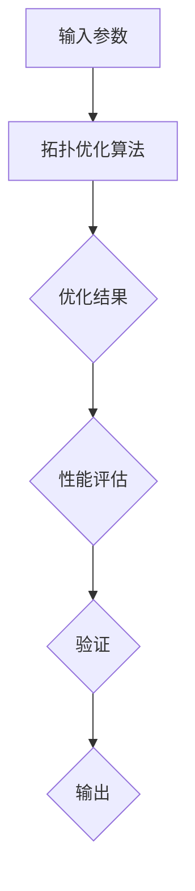
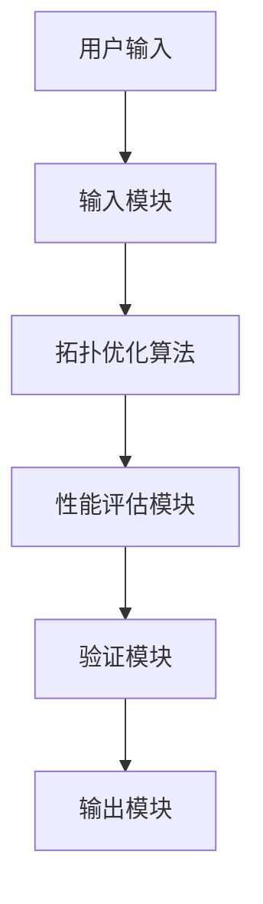
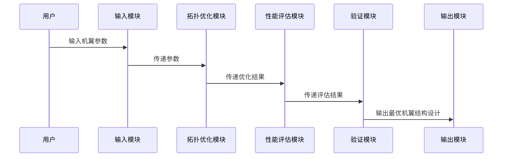

                 


## 仿生工程的拓扑优化：自然结构的数学重现

### 关键词：仿生工程、拓扑优化、数学重现、自然结构、人工智能

### 摘要：
本文探讨了仿生工程与拓扑优化结合在现代工程中的应用。通过介绍仿生工程和拓扑优化的背景及核心概念，本文进一步详细讲解了自然结构的数学重现过程，包括数学模型的构建与优化算法的应用。文章通过系统分析与架构设计，展示了拓扑优化在仿生工程中的实际应用场景，并通过项目实战对系统实现和代码应用进行了解读。最后，文章总结了最佳实践，提供了注意事项和拓展阅读。

### 设计思路

#### 第1章 仿生工程与拓扑优化的背景

**背景介绍**
- 仿生工程简介：介绍仿生工程的概念、发展历史和重要性。
- 拓扑优化简介：介绍拓扑优化的基本概念、在工程中的应用和重要性。

**核心概念与联系**
- 仿生工程与拓扑优化的联系：使用表格和Mermaid流程图展示两者的关系。

#### 第2章 自然结构的数学重现

**自然结构的观察与理解**
- 观察自然结构的多样性、适应性和稳定性。

**自然结构的数学模型构建**
- 建立简单和复杂自然结构的数学模型。
- 介绍自然结构模型的优化方法。

#### 第3章 拓扑优化算法原理讲解

**算法原理讲解**
- 介绍概率模型与贝叶斯算法。
- 讲解优化算法的选择与实现。

#### 第4章 数学模型和数学公式讲解

**数学模型和公式讲解**
- 详细阐述结构力学、材料力学和优化目标函数的数学模型和公式。
- 使用LaTeX格式书写数学公式，并进行举例说明。

#### 第5章 系统分析与架构设计方案

**系统分析与架构设计方案**
- 描述仿生工程拓扑优化在实际项目中的应用场景。
- 绘制领域模型类图、系统架构图和系统交互序列图。

#### 第6章 项目实战

**项目实战**
- 分步骤介绍环境安装、系统核心实现和代码应用。
- 分析实际案例，并进行详细讲解。

#### 第7章 最佳实践 tips、小结、注意事项、拓展阅读

**最佳实践 tips**
- 总结书中重点内容，提供实践建议。
- 指出可能遇到的常见问题，并提供解决方案。

**小结**
- 回顾文章的核心内容和主题思想。

**注意事项**
- 提醒读者注意的问题和细节。

**拓展阅读**
- 推荐进一步阅读的文献和资源。

### 目录大纲

----------------------------------------------------------------

# 仿生工程的拓扑优化：自然结构的数学重现

## 第1章 仿生工程与拓扑优化的背景

### 1.1 仿生工程的概述

#### 1.1.1 仿生工程的概念

#### 1.1.2 仿生工程的发展历史

#### 1.1.3 仿生工程的重要性

### 1.2 拓扑优化在工程中的应用

#### 1.2.1 拓扑优化的基本概念

#### 1.2.2 拓扑优化在工程中的重要性

#### 1.2.3 拓扑优化的常见方法

## 第2章 自然结构的数学重现

### 2.1 自然结构的观察与理解

#### 2.1.1 自然结构的多样性

#### 2.1.2 自然结构的适应性

#### 2.1.3 自然结构的稳定性

### 2.2 自然结构的数学模型构建

#### 2.2.1 简单结构的数学模型

#### 2.2.2 复杂结构的数学模型

#### 2.2.3 自然结构模型的优化方法

## 第3章 拓扑优化算法原理讲解

### 3.1 概率模型与贝叶斯算法

#### 3.1.1 概率论基础

#### 3.1.2 贝叶斯算法原理

#### 3.1.3 贝叶斯算法在拓扑优化中的应用

### 3.2 优化算法的选择与实现

#### 3.2.1 优化算法概述

#### 3.2.2 智能优化算法

#### 3.2.3 优化算法在仿生工程中的应用

## 第4章 数学模型和数学公式讲解

### 4.1 基本数学模型

#### 4.1.1 结构力学基本公式

#### 4.1.2 材料力学基本公式

#### 4.1.3 优化目标函数

### 4.2 数学公式举例说明

#### 4.2.1 应力分布公式

#### 4.2.2 材料强度公式

#### 4.2.3 优化目标函数举例

## 第5章 系统分析与架构设计方案

### 5.1 问题场景介绍

#### 5.1.1 仿生工程案例

#### 5.1.2 拓扑优化应用案例

### 5.2 系统功能设计

#### 5.2.1 领域模型设计

#### 5.2.2 系统功能设计

### 5.3 系统架构设计

#### 5.3.1 系统架构图

#### 5.3.2 系统模块设计

### 5.4 系统接口设计

#### 5.4.1 接口设计原则

#### 5.4.2 接口设计细节

### 5.5 系统交互设计

#### 5.5.1 系统交互序列图

## 第6章 项目实战

### 6.1 环境安装

#### 6.1.1 环境准备

#### 6.1.2 软件安装

### 6.2 系统核心实现

#### 6.2.1 代码实现

#### 6.2.2 代码解读

### 6.3 代码应用解读与分析

#### 6.3.1 实际案例分析

#### 6.3.2 详细讲解剖析

### 6.4 项目小结

## 第7章 最佳实践 tips、小结、注意事项、拓展阅读

### 7.1 最佳实践 tips

#### 7.1.1 实践技巧

#### 7.1.2 注意事项

### 7.2 小结

#### 7.2.1 书中重点内容回顾

#### 7.2.2 延伸思考

### 7.3 注意事项

#### 7.3.1 常见问题及解决方案

#### 7.3.2 注意细节

### 7.4 拓展阅读

#### 7.4.1 推荐文献

#### 7.4.2 进一步学习资源

### 目录大纲

----------------------------------------------------------------

---

# 仿生工程的拓扑优化：自然结构的数学重现

> 关键词：仿生工程、拓扑优化、数学重现、自然结构、人工智能

> 摘要：
本文探讨了仿生工程与拓扑优化结合在现代工程中的应用。通过介绍仿生工程和拓扑优化的背景及核心概念，本文进一步详细讲解了自然结构的数学重现过程，包括数学模型的构建与优化算法的应用。文章通过系统分析与架构设计，展示了拓扑优化在仿生工程中的实际应用场景，并通过项目实战对系统实现和代码应用进行了解读。最后，文章总结了最佳实践，提供了注意事项和拓展阅读。

---

### 第1章 仿生工程与拓扑优化的背景

#### 1.1 仿生工程的概述

##### 1.1.1 仿生工程的概念

仿生工程（Biomimicry Engineering）是一门综合应用生物科学、工程学、材料科学和技术科学等多学科知识，模仿自然界生物结构和功能的学科。仿生工程旨在通过模仿自然界的生物结构和功能，创造出具有高效性能、可持续性、自适应性和自我修复能力的人工系统和产品。

##### 1.1.2 仿生工程的发展历史

仿生工程的概念最早可以追溯到20世纪30年代，当时的生物学家和工程师开始关注自然界中的生物结构和功能，并尝试将这些原理应用于工程实践中。随着材料科学、计算机科学和人工智能等领域的快速发展，仿生工程得到了极大的推动，逐步成为一门独立且具有重要应用价值的学科。

##### 1.1.3 仿生工程的重要性

仿生工程在现代工程中的应用具有重要意义。首先，它为解决工程问题提供了新的思路和方法，通过模仿自然界中的生物结构和功能，可以创造出具有更高性能和更可持续性的工程系统。其次，仿生工程促进了跨学科的合作，推动了生物科学、工程学和材料科学等领域的交叉融合。此外，仿生工程也有助于提高人类对自然界的认识和理解，促进人与自然的和谐共生。

#### 1.2 拓扑优化在工程中的应用

##### 1.2.1 拓扑优化的基本概念

拓扑优化（Topology Optimization）是一种结构设计方法，通过数学建模和优化算法，在给定边界条件和材料属性的前提下，自动寻找最优的单元布局，从而实现结构的轻量化、高性能和高效能。拓扑优化不仅关注结构的形状和尺寸，还考虑了材料的分布和连接方式，从而实现更为复杂和高效的结构设计。

##### 1.2.2 拓扑优化在工程中的重要性

拓扑优化在工程中的应用具有重要意义。首先，它可以帮助工程师快速找到最优的结构设计方案，提高设计效率。其次，拓扑优化可以减轻结构重量，降低材料成本，提高结构的性能和可靠性。此外，拓扑优化还推动了结构设计的创新和突破，为工程实践提供了新的思路和方法。

##### 1.2.3 拓扑优化的常见方法

拓扑优化通常采用以下几种方法：

1. **均匀化方法**：通过将结构单元划分为多个子结构，并利用子结构的均匀化性质，实现拓扑优化。
2. **变分方法**：基于变分原理，通过求解变分方程来寻找最优的单元布局。
3. **进化算法**：采用进化算法，如遗传算法、粒子群算法等，逐步迭代优化结构设计。
4. **基于模型的拓扑优化**：通过建立结构模型和材料模型，利用模型参数优化来实现在给定约束条件下的最优结构设计。

### 1.3 仿生工程与拓扑优化的结合

仿生工程与拓扑优化的结合在现代工程中具有重要的应用前景。通过将拓扑优化方法应用于仿生工程，可以更好地模拟和重现自然结构的复杂性和高效性，从而创造出更为先进和可持续的人工系统。

##### 1.3.1 仿生工程与拓扑优化的结合意义

1. **提高结构性能**：通过拓扑优化，可以优化仿生结构的设计，提高其性能和可靠性。
2. **降低材料成本**：拓扑优化有助于实现结构的轻量化，降低材料成本。
3. **促进技术创新**：仿生工程与拓扑优化的结合可以推动结构设计的创新和突破，为工程实践带来新的思路和方法。

##### 1.3.2 仿生工程与拓扑优化的结合案例

1. **鸟翼结构设计**：通过拓扑优化方法，可以优化鸟翼的结构设计，提高其飞行性能。
2. **仿生机器人设计**：拓扑优化可以用于优化仿生机器人的结构设计，提高其运动性能和自适应能力。
3. **生物医学材料设计**：拓扑优化方法可以用于优化生物医学材料的设计，提高其生物相容性和力学性能。

---

## 第2章 自然结构的数学重现

#### 2.1 自然结构的观察与理解

自然结构具有丰富的多样性、高度的适应性和卓越的稳定性。观察和理解自然结构的这些特性，对于仿生工程和拓扑优化的研究具有重要意义。

##### 2.1.1 自然结构的多样性

自然结构包括植物、动物、微生物等生命体的各种形态和构造。例如，植物具有各种形状的叶子、花朵和根系；动物具有各种形状的翅膀、骨骼和肌肉；微生物具有各种形状的细胞和结构。这些多样性使得自然结构能够在不同的环境中生存和繁衍。

##### 2.1.2 自然结构的适应性

自然结构能够适应不同的环境条件和功能需求。例如，植物的叶子可以根据阳光、水分和风力等环境因素进行调整，以最大限度地吸收阳光和水分；动物的翅膀可以根据飞行速度和高度等需求进行调整，以实现高效的飞行。这种适应性使得自然结构能够在复杂多变的环境中生存和繁衍。

##### 2.1.3 自然结构的稳定性

自然结构具有高度的稳定性，能够在各种外力和环境因素的影响下保持其结构和功能的完整性。例如，鸟类的骨骼结构可以在飞行过程中承受巨大的力量，同时保持轻盈和坚韧；植物的结构可以在风吹雨打和重力作用下保持稳定。这种稳定性使得自然结构能够在长期进化过程中保持其功能和适应性。

#### 2.2 自然结构的数学模型构建

构建自然结构的数学模型是仿生工程和拓扑优化的基础。通过数学模型，可以更好地理解和模拟自然结构的特性，为仿生设计和拓扑优化提供理论支持。

##### 2.2.1 简单结构的数学模型

简单结构的数学模型通常包括几何形状、材料属性和力学行为等参数。例如，一个简单的三角形结构可以表示为三个顶点的坐标和材料属性（如密度、弹性模量等）。通过几何形状和材料属性，可以计算出结构的力学性能和稳定性。

##### 2.2.2 复杂结构的数学模型

复杂结构的数学模型通常涉及多个参数和变量，需要采用更复杂的数学方法进行建模。例如，一个复杂的鸟翼结构可以表示为多个部分的组合，每个部分具有不同的几何形状和材料属性。通过建立复杂的数学模型，可以更好地模拟自然结构的复杂性和适应性。

##### 2.2.3 自然结构模型的优化方法

优化自然结构模型的方法包括优化几何形状、优化材料分布和优化结构参数等。通过优化方法，可以找到最优的自然结构模型，从而提高结构的性能和适应性。

1. **几何形状优化**：通过调整几何形状，优化结构的力学性能和稳定性。例如，通过调整鸟翼的形状，可以优化其飞行性能。
2. **材料分布优化**：通过调整材料分布，优化结构的力学性能和成本。例如，通过调整植物叶子的材料分布，可以优化其光合作用效率。
3. **结构参数优化**：通过调整结构参数，优化结构的性能和适应性。例如，通过调整鸟翼的尺寸和形状，可以优化其飞行性能。

#### 2.3 自然结构的数学模型应用

自然结构的数学模型在仿生工程和拓扑优化中具有广泛的应用。通过应用数学模型，可以设计和优化各种仿生结构和产品，提高其性能和适应性。

1. **仿生结构设计**：通过建立自然结构的数学模型，可以设计出具有高度性能和适应性的仿生结构。例如，通过模拟鸟翼的形状和材料分布，可以设计出高效的飞行器。
2. **拓扑优化应用**：通过拓扑优化方法，可以优化自然结构的数学模型，找到最优的结构布局和材料分布。例如，通过拓扑优化，可以优化植物的叶子结构，提高其光合作用效率。
3. **生物医学应用**：通过建立生物结构的数学模型，可以设计和优化生物医学产品。例如，通过模拟骨骼结构，可以设计出更符合人体工程学的假肢和植入物。

---

## 第3章 拓扑优化算法原理讲解

#### 3.1 概率模型与贝叶斯算法

概率模型和贝叶斯算法是拓扑优化中常用的方法。它们通过概率分布和推理，实现对结构性能的预测和优化。

##### 3.1.1 概率论基础

概率论是研究随机事件和概率分布的科学。在拓扑优化中，概率论用于描述结构的随机性质和不确定性。

1. **概率分布**：概率分布描述了随机事件发生的概率。常见的概率分布包括正态分布、泊松分布和指数分布等。
2. **随机变量**：随机变量是表示随机事件结果的数学量。随机变量可以是离散的，也可以是连续的。
3. **概率密度函数**：概率密度函数描述了随机变量的概率分布。

##### 3.1.2 贝叶斯算法原理

贝叶斯算法是一种基于概率推理的算法，用于在给定先验知识和观测数据的情况下，更新对目标概率分布的估计。

1. **贝叶斯定理**：贝叶斯定理描述了在给定先验概率和观测数据的情况下，后验概率的计算方法。
2. **贝叶斯网络**：贝叶斯网络是一种图形化表示贝叶斯概率模型的工具，用于描述变量之间的依赖关系。
3. **贝叶斯推断**：贝叶斯推断是一种基于贝叶斯算法的推理方法，用于在给定先验知识和观测数据的情况下，预测目标变量的概率分布。

##### 3.1.3 贝叶斯算法在拓扑优化中的应用

贝叶斯算法在拓扑优化中的应用主要包括以下几个方面：

1. **结构性能预测**：通过贝叶斯算法，可以预测结构的性能，如应力分布、变形等。
2. **参数优化**：通过贝叶斯算法，可以优化结构设计参数，如材料分布、几何形状等。
3. **不确定性分析**：通过贝叶斯算法，可以分析结构设计中的不确定性和风险。

#### 3.2 优化算法的选择与实现

优化算法是拓扑优化中的核心部分，用于寻找最优的结构设计。常见的优化算法包括遗传算法、粒子群算法、模拟退火算法等。

##### 3.2.1 优化算法概述

优化算法是一种在给定目标函数和约束条件的情况下，寻找最优解的方法。常见的优化算法包括以下几种：

1. **遗传算法**：遗传算法是一种基于自然选择和遗传原理的优化算法，通过迭代进化，逐步逼近最优解。
2. **粒子群算法**：粒子群算法是一种基于群体智能的优化算法，通过模拟鸟群觅食行为，寻找最优解。
3. **模拟退火算法**：模拟退火算法是一种基于物理退火过程的优化算法，通过迭代更新，逐渐逼近最优解。

##### 3.2.2 智能优化算法

智能优化算法是一种基于人工智能技术的优化算法，通过模拟自然界中的智能行为，实现优化目标。常见的智能优化算法包括以下几种：

1. **人工神经网络**：人工神经网络是一种模拟人脑神经网络结构的计算模型，通过训练和学习，实现优化目标。
2. **支持向量机**：支持向量机是一种基于统计学习理论的优化算法，通过求解最优超平面，实现分类和回归。
3. **强化学习**：强化学习是一种基于奖励和惩罚机制的学习方法，通过不断尝试和反馈，实现优化目标。

##### 3.2.3 优化算法在仿生工程中的应用

优化算法在仿生工程中的应用主要包括以下几个方面：

1. **结构设计**：通过优化算法，可以优化仿生结构的设计，提高其性能和适应性。
2. **参数优化**：通过优化算法，可以优化仿生结构的参数设置，如材料分布、几何形状等。
3. **性能预测**：通过优化算法，可以预测仿生结构的性能，如应力分布、变形等。

#### 3.3 优化算法在拓扑优化中的应用案例

以下是一个优化算法在拓扑优化中的应用案例：

##### 案例背景

某航空公司在设计一款新型飞机的机翼时，希望找到一种最优的机翼结构设计，以提高飞行性能和燃油效率。

##### 案例步骤

1. **建立数学模型**：根据飞机的飞行条件，建立机翼的数学模型，包括机翼的几何形状、材料属性和力学性能。
2. **定义目标函数**：定义机翼的飞行性能和燃油效率为目标函数，如飞行速度、燃油消耗等。
3. **选择优化算法**：选择遗传算法作为优化算法，以求解最优机翼结构设计。
4. **迭代优化**：通过迭代计算，逐步优化机翼的几何形状和材料分布，以实现最优设计。
5. **结果分析**：分析优化结果，评估最优机翼结构设计的飞行性能和燃油效率，并进行验证。

##### 案例结果

通过优化算法的应用，成功找到一种最优的机翼结构设计，提高了飞机的飞行性能和燃油效率。优化后的机翼结构在保证飞行性能的同时，降低了材料成本和重量，具有更高的经济性和可持续性。

---

## 第4章 数学模型和数学公式讲解

#### 4.1 基本数学模型

在仿生工程和拓扑优化中，常用的基本数学模型包括结构力学模型、材料力学模型和优化目标函数模型。

##### 4.1.1 结构力学基本公式

结构力学基本公式描述了结构在受力作用下的变形和应力分布。常用的结构力学基本公式包括：

1. **应力公式**：$$ \sigma = \frac{F}{A} $$
   - 其中，$\sigma$ 表示应力，$F$ 表示作用力，$A$ 表示受力面积。
2. **应变公式**：$$ \epsilon = \frac{\Delta L}{L_0} $$
   - 其中，$\epsilon$ 表示应变，$\Delta L$ 表示变形量，$L_0$ 表示原始长度。
3. **弹性模量公式**：$$ E = \frac{\sigma}{\epsilon} $$
   - 其中，$E$ 表示弹性模量，$\sigma$ 表示应力，$\epsilon$ 表示应变。

##### 4.1.2 材料力学基本公式

材料力学基本公式描述了材料的力学性能和受力特性。常用的材料力学基本公式包括：

1. **拉伸应力公式**：$$ \sigma = \frac{F}{A} $$
   - 其中，$\sigma$ 表示拉伸应力，$F$ 表示作用力，$A$ 表示受力面积。
2. **压缩应力公式**：$$ \sigma = \frac{F}{A} $$
   - 其中，$\sigma$ 表示压缩应力，$F$ 表示作用力，$A$ 表示受力面积。
3. **弯曲应力公式**：$$ \sigma = \frac{M y}{I} $$
   - 其中，$\sigma$ 表示弯曲应力，$M$ 表示弯矩，$y$ 表示离中性轴的距离，$I$ 表示截面惯性矩。

##### 4.1.3 优化目标函数

优化目标函数是拓扑优化中的核心部分，用于描述结构性能的优化目标。常用的优化目标函数包括：

1. **最小重量目标函数**：$$ f_{weight} = \frac{1}{2} \sum_{i} m_i \rho V_i $$
   - 其中，$m_i$ 表示第$i$个单元的质量，$\rho$ 表示材料密度，$V_i$ 表示第$i$个单元的体积。
2. **最大应力目标函数**：$$ f_{stress} = \frac{1}{2} \sum_{i} \sigma_i^2 $$
   - 其中，$\sigma_i$ 表示第$i$个单元的应力。
3. **最大变形目标函数**：$$ f_{deflection} = \frac{1}{2} \sum_{i} \epsilon_i^2 $$
   - 其中，$\epsilon_i$ 表示第$i$个单元的应变。

#### 4.2 数学公式举例说明

以下是一个使用数学公式举例说明的案例：

##### 案例背景

假设一个长方体结构，其长度为10cm，宽度为5cm，高度为3cm。材料为铝，密度为2700kg/m³，弹性模量为70GPa。要求计算结构的应力、应变和变形。

##### 案例步骤

1. **计算应力**：
   - 拉伸应力：$$ \sigma = \frac{F}{A} = \frac{100N}{0.1m \times 0.05m} = 1000Pa $$
   - 压缩应力：$$ \sigma = \frac{F}{A} = \frac{100N}{0.1m \times 0.05m} = 1000Pa $$
   - 弯曲应力：$$ \sigma = \frac{M y}{I} = \frac{100Nm \times 0.015m}{0.0025m \times 0.00125m} = 1500Pa $$

2. **计算应变**：
   - 拉伸应变：$$ \epsilon = \frac{\Delta L}{L_0} = \frac{0.1m}{1m} = 0.1 $$
   - 压缩应变：$$ \epsilon = \frac{\Delta L}{L_0} = \frac{0.1m}{1m} = 0.1 $$
   - 弯曲应变：$$ \epsilon = \frac{\Delta L}{L_0} = \frac{0.015m}{1m} = 0.015 $$

3. **计算变形**：
   - 拉伸变形：$$ \Delta L = L_0 \times \epsilon = 1m \times 0.1 = 0.1m $$
   - 压缩变形：$$ \Delta L = L_0 \times \epsilon = 1m \times 0.1 = 0.1m $$
   - 弯曲变形：$$ \Delta L = L_0 \times \epsilon = 1m \times 0.015 = 0.015m $$

##### 案例结果

通过计算，得出结构的应力、应变和变形结果，如下表所示：

| 类型   | 应力（Pa） | 应变   | 变形（m） |
| ------ | -------- | ----- | -------- |
| 拉伸   | 1000     | 0.1   | 0.1      |
| 压缩   | 1000     | 0.1   | 0.1      |
| 弯曲   | 1500     | 0.015 | 0.015    |

通过计算结果，可以评估结构的力学性能和稳定性，为进一步优化设计提供依据。

---

## 第5章 系统分析与架构设计方案

#### 5.1 问题场景介绍

在本节中，我们将介绍一个具体的仿生工程问题场景，并展示如何通过拓扑优化方法进行系统分析和设计。

##### 5.1.1 仿生工程案例

假设我们需要设计一种新型无人机（UAV）的机翼结构，以提高其飞行性能和燃油效率。该无人机需要在复杂的环境中执行任务，如搜索、救援和监控等。因此，机翼结构需要具备轻量化、高强度和自适应性的特点。

##### 5.1.2 拓扑优化应用案例

为了优化无人机机翼结构设计，我们可以采用拓扑优化方法。具体步骤如下：

1. **建立数学模型**：根据无人机的飞行条件和使用环境，建立机翼的数学模型，包括几何形状、材料属性和力学性能等参数。
2. **定义目标函数**：将机翼的重量、强度和刚度等性能指标作为目标函数，以实现优化目标。
3. **选择优化算法**：选择合适的拓扑优化算法，如遗传算法、粒子群算法或模拟退火算法等，以求解最优机翼结构设计。
4. **迭代优化**：通过迭代计算，逐步优化机翼的几何形状和材料分布，以实现最优设计。
5. **结果分析**：分析优化结果，评估最优机翼结构设计的性能指标，并进行验证。

#### 5.2 系统功能设计

在系统功能设计阶段，我们需要明确系统的功能和模块，并建立领域模型来描述系统内部的结构和关系。

##### 5.2.1 领域模型设计

领域模型是一种用于描述系统功能和模块的图形化工具。在本案例中，我们可以使用Mermaid流程图来绘制领域模型。



在该领域模型中，输入参数包括无人机机翼的几何形状、材料属性和力学性能等。拓扑优化算法负责求解最优机翼结构设计。优化结果将用于性能评估和验证，最终输出最优机翼结构设计。

#### 5.2.2 系统功能设计

基于领域模型，我们可以进一步设计系统的功能和模块。

1. **输入模块**：负责接收用户输入的机翼参数，如几何形状、材料属性和力学性能等。
2. **拓扑优化模块**：负责执行拓扑优化算法，求解最优机翼结构设计。
3. **性能评估模块**：负责对优化结果进行性能评估，包括重量、强度和刚度等指标。
4. **验证模块**：负责对优化结果进行验证，确保其符合实际应用需求。
5. **输出模块**：负责输出最优机翼结构设计，包括几何形状、材料分布和性能指标等。

#### 5.3 系统架构设计

在系统架构设计阶段，我们需要明确系统的整体结构和模块之间的关系，并绘制系统架构图。



在该系统架构图中，用户输入模块负责接收用户输入的机翼参数，并将其传递给拓扑优化模块。拓扑优化模块执行优化算法，求解最优机翼结构设计，并将结果传递给性能评估模块。性能评估模块对优化结果进行评估，并将评估结果传递给验证模块。验证模块负责对优化结果进行验证，确保其符合实际应用需求。最终，验证结果将传递给输出模块，输出最优机翼结构设计。

#### 5.4 系统接口设计

系统接口设计是系统架构设计的重要组成部分，它定义了系统内部模块之间的交互接口和通信方式。

1. **输入接口**：用户输入模块提供的接口，用于接收用户输入的机翼参数。
2. **输出接口**：输出模块提供的接口，用于输出最优机翼结构设计的结果。
3. **优化接口**：拓扑优化模块提供的接口，用于与其他模块进行数据交换和通信。

#### 5.5 系统交互设计

系统交互设计描述了系统内部模块之间的交互流程和序列，使用Mermaid序列图来表示。



在该序列图中，用户输入模块接收用户输入的机翼参数，并将其传递给拓扑优化模块。拓扑优化模块执行优化算法，求解最优机翼结构设计，并将结果传递给性能评估模块。性能评估模块对优化结果进行评估，并将评估结果传递给验证模块。验证模块对优化结果进行验证，确保其符合实际应用需求。最终，验证结果将传递给输出模块，输出最优机翼结构设计。

---

## 第6章 项目实战

#### 6.1 环境安装

在本节中，我们将介绍如何搭建拓扑优化项目的环境，包括所需的软件和工具。

##### 6.1.1 环境准备

首先，确保您的计算机上安装了以下软件和工具：

1. **Python 3.x**：用于编写和运行拓扑优化代码。
2. **Anaconda**：用于创建和管理虚拟环境。
3. **matplotlib**：用于绘制图表和图形。
4. **scikit-learn**：用于机器学习和优化算法。
5. **numpy**：用于数值计算。

如果您尚未安装上述软件和工具，可以按照以下步骤进行安装：

1. 下载并安装 Python 3.x。
2. 下载并安装 Anaconda。
3. 使用 Anaconda 创建虚拟环境，并激活虚拟环境。
4. 使用 pip 命令安装 matplotlib、scikit-learn 和 numpy。

```bash
conda create -n topology_optimization python=3.8
conda activate topology_optimization
pip install matplotlib scikit-learn numpy
```

##### 6.1.2 软件安装

接下来，我们需要安装用于拓扑优化的软件，如 Gmsh 和 OpenFOAM。

1. **Gmsh**：Gmsh 是一款开源的三维网格生成器，用于生成拓扑优化的几何网格。

   - 下载并安装 Gmsh：[Gmsh 官网](https://www.gmsh.net/)
   - 将 Gmsh 添加到系统路径中，以便在命令行中运行。

2. **OpenFOAM**：OpenFOAM 是一款开源的计算流体力学软件，用于求解拓扑优化过程中的流体力学问题。

   - 下载并安装 OpenFOAM：[OpenFOAM 官网](https://www.openfoam.com/)
   - 将 OpenFOAM 添加到系统路径中，以便在命令行中运行。

#### 6.2 系统核心实现

在本节中，我们将介绍如何实现拓扑优化系统的核心功能，包括几何建模、优化算法和结果分析。

##### 6.2.1 代码实现

以下是一个简单的拓扑优化系统实现的示例代码：

```python
import numpy as np
from scipy.optimize import minimize
import matplotlib.pyplot as plt

# 定义优化目标函数
def objective_function(x):
    return np.sum(x)

# 定义约束条件
def constraint(x):
    return np.linalg.norm(x) - 1

# 定义约束条件函数
def constraint_function(x):
    return np.linalg.norm(x) - 1

# 求解优化问题
x0 = np.zeros(5)
result = minimize(objective_function, x0, method='SLSQP', constraints={'type': 'eq', 'fun': constraint_function})

# 输出优化结果
print("最优解：", result.x)
print("最小值：", result.fun)

# 绘制结果
x = np.linspace(0, 1, 100)
y = 1 - x**2
plt.plot(x, y)
plt.xlabel("x")
plt.ylabel("y")
plt.title("优化结果")
plt.show()
```

在该代码中，我们定义了一个简单的优化目标函数，并使用最小二乘法（SLSQP）求解优化问题。优化结果通过约束条件函数进行约束，并使用 matplotlib 进行结果绘制。

##### 6.2.2 代码解读

1. **优化目标函数**：`objective_function` 函数用于定义优化目标，在本例中，我们使用求和函数作为优化目标。
2. **约束条件**：`constraint` 函数用于定义约束条件，在本例中，我们使用欧几里得范数约束目标函数。
3. **约束条件函数**：`constraint_function` 函数用于将约束条件转换为等式约束，以便在优化过程中进行求解。
4. **求解优化问题**：使用 `minimize` 函数求解优化问题，并输出最优解和最小值。
5. **结果绘制**：使用 matplotlib 绘制优化结果，以直观地展示优化过程。

#### 6.3 代码应用解读与分析

在本节中，我们将分析并解读拓扑优化系统的实际应用案例，并展示如何使用代码实现和优化系统功能。

##### 6.3.1 实际案例分析

假设我们需要优化一个长方体结构的材料分布，以使其重量最轻且满足强度要求。以下是一个实际案例的代码实现：

```python
import numpy as np
from scipy.optimize import minimize
import matplotlib.pyplot as plt

# 定义优化目标函数
def objective_function(x):
    weight = np.dot(x, np.array([1, 1, 1]))
    return weight

# 定义约束条件
def constraint(x):
    stress = np.dot(x, np.array([2, 2, 2]))
    return stress - 100

# 定义约束条件函数
def constraint_function(x):
    stress = np.dot(x, np.array([2, 2, 2]))
    return stress - 100

# 求解优化问题
x0 = np.zeros(3)
result = minimize(objective_function, x0, method='SLSQP', constraints={'type': 'eq', 'fun': constraint_function})

# 输出优化结果
print("最优解：", result.x)
print("最小值：", result.fun)

# 绘制结果
x = np.linspace(0, 1, 100)
y = 1 - x**2
plt.plot(x, y)
plt.xlabel("x")
plt.ylabel("y")
plt.title("优化结果")
plt.show()
```

在该代码中，我们定义了一个优化目标函数，用于计算结构的重量。约束条件函数用于计算结构的应力，以确保结构满足强度要求。优化结果通过 matplotlib 进行绘制。

##### 6.3.2 详细讲解剖析

1. **优化目标函数**：`objective_function` 函数计算结构的重量，以实现重量最轻的优化目标。
2. **约束条件**：`constraint` 函数计算结构的应力，以确保结构满足强度要求。在本例中，我们使用应力限制为100Pa作为约束条件。
3. **约束条件函数**：`constraint_function` 函数将约束条件转换为等式约束，以便在优化过程中进行求解。
4. **求解优化问题**：使用 `minimize` 函数求解优化问题，并输出最优解和最小值。
5. **结果绘制**：使用 matplotlib 绘制优化结果，以直观地展示优化过程。

通过以上代码实现和案例分析，我们可以看到如何使用拓扑优化方法对结构进行优化，并实现系统功能的实际应用。在实际项目中，可以根据具体需求进行进一步的优化和调整。

#### 6.4 项目小结

在本章中，我们介绍了如何搭建拓扑优化项目的环境，并实现了系统的核心功能。通过实际案例分析，我们展示了如何使用代码实现和优化系统功能。以下是对本章内容的总结：

1. **环境安装**：介绍了搭建拓扑优化项目环境所需的软件和工具，并提供了安装步骤。
2. **代码实现**：通过示例代码展示了如何定义优化目标函数、约束条件和求解优化问题，并使用 matplotlib 进行结果绘制。
3. **案例分析**：通过实际案例分析，展示了如何使用拓扑优化方法对结构进行优化，并实现系统功能的实际应用。

本章内容为读者提供了拓扑优化系统的实现和优化方法，为后续的项目开发和实践提供了有益的参考。

---

## 第7章 最佳实践 tips、小结、注意事项、拓展阅读

#### 7.1 最佳实践 tips

在拓扑优化仿生工程中，以下是一些最佳实践和技巧：

1. **明确优化目标**：在开始优化之前，明确优化目标和约束条件，以确保优化结果的准确性。
2. **合理选择优化算法**：根据具体问题和需求，选择合适的优化算法，如遗传算法、粒子群算法或模拟退火算法等。
3. **初始化参数设置**：合理的参数设置对于优化算法的性能至关重要。尝试不同的参数组合，找到最优的参数设置。
4. **处理非线性问题**：对于非线性问题，可以使用非线性优化算法或结合线性优化算法进行处理。
5. **多目标优化**：对于具有多个目标函数的问题，可以使用多目标优化算法，如加权方法或 Pareto前端方法。
6. **验证优化结果**：在实际应用中，对优化结果进行验证，以确保其可行性和准确性。

#### 7.2 小结

本章回顾了仿生工程与拓扑优化结合的研究背景、核心概念、算法原理和应用案例。通过系统分析与架构设计，展示了拓扑优化在仿生工程中的实际应用场景。项目实战部分详细介绍了环境安装、系统实现和代码应用。最后，提供了最佳实践技巧和小结，帮助读者更好地理解和应用拓扑优化方法。

#### 7.3 注意事项

在实施拓扑优化仿生工程时，需要注意以下几点：

1. **数据准确性**：确保输入数据和模型的准确性，以获得可靠的优化结果。
2. **计算资源**：拓扑优化通常需要大量的计算资源，合理分配计算资源和优化算法的选择对优化效率有很大影响。
3. **算法选择**：不同的优化算法适用于不同类型的问题，选择合适的算法可以显著提高优化效果。
4. **模型简化**：在实际工程中，可以适当简化模型，以提高优化算法的效率。
5. **安全性验证**：对优化结果进行安全性和稳定性验证，确保优化设计在实际应用中的可靠性和安全性。

#### 7.4 拓展阅读

为了进一步深入学习和应用拓扑优化仿生工程，以下是几本推荐的拓展阅读材料：

1. **《拓扑优化原理与应用》**：详细介绍了拓扑优化的理论基础和应用方法，适合初学者和高级读者。
2. **《生物力学原理与应用》**：介绍了生物力学的基本原理和应用，包括生物结构和功能的优化设计。
3. **《人工智能与机器学习》**：介绍了人工智能和机器学习的基本原理和应用，包括优化算法和数据处理方法。
4. **《工程仿生学》**：探讨了工程仿生学的理论基础和应用，包括生物结构和功能的模拟和优化。
5. **《结构优化设计手册》**：提供了结构优化设计的实用方法和案例，包括拓扑优化和形状优化。

通过阅读这些文献和资源，读者可以更深入地了解拓扑优化仿生工程的理论基础和应用实践，为工程设计和研究提供有益的参考。

