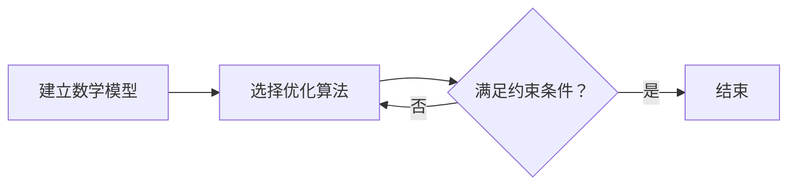
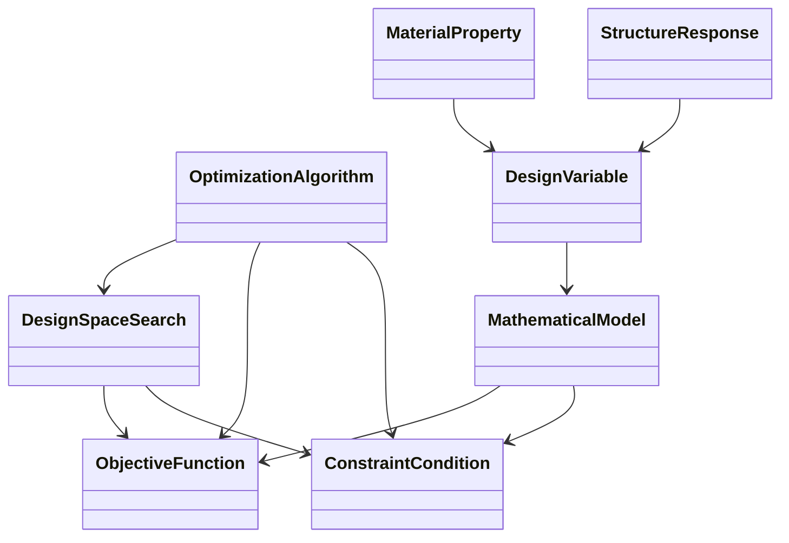

                 

# 仿生工程的拓扑优化：自然结构的数学重现

## 关键词

- 仿生工程
- 拓扑优化
- 数学模型
- 自然结构
- 算法应用

## 摘要

本文探讨了仿生工程中的拓扑优化技术，通过数学模型重现自然结构的优势与挑战。文章首先介绍了拓扑优化的背景与问题，然后详细阐述了核心概念与联系，以及算法原理的讲解。接着，文章从系统分析与架构设计角度，介绍了拓扑优化的实际应用与项目实战。最后，文章总结了最佳实践和注意事项，并推荐了拓展阅读。

---

### 背景介绍

**问题背景**

在现代工程领域中，如何减轻结构重量、提高结构性能，成为了设计师们不断追求的目标。仿生工程作为一门结合生物学与工程学的交叉学科，通过对自然界的观察与研究，试图借鉴自然结构的优化方式，以解决工程领域中的难题。

**问题描述**

拓扑优化是一种基于数学模型的设计方法，旨在通过优化材料的分布，实现结构重量与性能的最佳平衡。在仿生工程中，拓扑优化可以应用于工程结构、航空航天、生物医学等多个领域。其主要目的是在满足结构性能要求的前提下，最大限度地减少材料使用，从而提高结构的轻量化和性能。

**问题解决**

为了解决上述问题，拓扑优化技术利用数学模型，通过一系列算法，对结构进行优化设计。这一过程包括建立数学模型、选择合适的优化算法、以及实现优化设计。通过拓扑优化，工程师们可以创造出既轻便又坚固的工程结构，从而在满足性能要求的同时，降低成本。

**边界与外延**

拓扑优化在仿生工程中的应用范围广泛，涉及多个领域。例如，在航空航天领域，拓扑优化可以用于飞机机翼、机身结构的优化设计；在生物医学领域，可以用于人工骨骼、植入物的设计优化。此外，拓扑优化还可以应用于汽车、建筑、电子设备等领域，为工程师提供全新的设计思路。

**概念结构与核心要素组成**

拓扑优化的概念结构主要包括以下几个方面：

1. **结构响应**：描述结构在外力作用下的变形与承载能力。
2. **材料性能**：指材料在受力作用下的强度、刚度等性能指标。
3. **设计变量**：包括结构的几何形状、材料分布等参数。
4. **目标函数**：定义优化问题的目标，如结构重量、应力分布等。
5. **约束条件**：限制优化过程的条件，如结构性能、制造工艺等。

这些核心要素共同构成了拓扑优化的理论基础，为实际应用提供了指导。

### 核心概念与联系

**核心概念原理**

拓扑优化是一种基于设计空间搜索的方法，通过对结构材料分布进行优化，实现结构性能的优化。其基本原理包括以下几个方面：

1. **设计空间搜索**：通过遍历设计空间，寻找最优设计方案。
2. **数学模型建立**：建立结构响应与设计变量之间的数学关系。
3. **优化算法应用**：选择合适的优化算法，对设计空间进行搜索。
4. **目标函数与约束条件**：定义优化问题的目标与约束条件。

**概念属性特征对比表格**

| 概念       | 属性特征                                     | 关联关系                    |
| ---------- | ------------------------------------------ | ------------------------- |
| 结构响应   | 变形、承载能力等                            | 与材料性能、设计变量相关    |
| 材料性能   | 强度、刚度、韧性等                          | 与结构响应、设计变量相关    |
| 设计变量   | 几何形状、材料分布等                        | 与结构响应、目标函数相关    |
| 目标函数   | 重量、应力分布等                            | 与结构响应、约束条件相关    |
| 约束条件   | 结构性能、制造工艺等                        | 与目标函数、设计变量相关    |

**ER实体关系图架构**

```mermaid
erDiagram
  StructureResponse ||--|{ MaterialProperty }
  MaterialProperty ||--|{ DesignVariable }
  DesignVariable ||--|{ ObjectiveFunction }
  ObjectiveFunction ||--|{ ConstraintCondition }
```

### 算法原理讲解

**mermaid 流程图**



**python 源代码**

```python
import numpy as np
from scipy.optimize import minimize

# 建立数学模型
def objective_function(x):
    # 目标函数实现
    pass

# 约束条件
def constraint_condition(x):
    # 约束条件实现
    pass

# 优化算法
x0 = np.random.rand(n)  # 初始解
result = minimize(objective_function, x0, constraints={'type':'ineq', 'fun':constraint_condition})

# 输出最优解
print(result.x)
```

**算法原理的数学模型和公式**

$$
\min \quad f(x)
$$

$$
s.t. \quad g(x) \leq 0
$$

其中，$f(x)$为目标函数，$g(x)$为约束条件。$x$为设计变量。

**详细讲解和举例说明**

假设我们要设计一个简单的梁结构，要求在满足承载能力的前提下，尽可能减轻结构重量。我们可以使用拓扑优化方法，通过以下步骤实现：

1. **建立数学模型**：定义目标函数为结构重量，约束条件为承载能力。
2. **选择优化算法**：采用最小二乘法进行优化。
3. **实现优化算法**：编写Python代码，实现最小二乘法的求解过程。
4. **输出最优解**：得到最优的设计方案，实现结构重量的减轻。

通过上述步骤，我们可以得到一个既轻便又坚固的梁结构，满足工程要求。

### 系统分析与架构设计

**问题场景介绍**

在工程结构设计中，如何提高结构性能、减轻重量，成为了设计师们面临的重要挑战。拓扑优化技术提供了一种有效的解决方案，通过对结构材料分布的优化，实现结构性能与重量的最佳平衡。

**项目介绍**

本文以一个简单的梁结构优化项目为例，介绍拓扑优化的应用过程。该项目旨在通过拓扑优化，实现梁结构在满足承载能力的前提下，重量最轻的设计方案。

**系统功能设计**



**系统架构设计**

```mermaid
sequenceDiagram
    participant User
    participant System
    participant OptimizationAlgorithm

    User->>System: 提出优化需求
    System->>OptimizationAlgorithm: 执行拓扑优化算法
    OptimizationAlgorithm->>System: 返回最优设计方案
    System->>User: 展示优化结果
endsequenceDiagram
```

**系统接口设计**

系统接口主要包括以下部分：

1. **输入接口**：接收用户提出的优化需求，如结构尺寸、材料性能等。
2. **输出接口**：展示优化结果，如最优设计方案、优化前后结构性能对比等。
3. **通信接口**：与其他系统进行数据交互，如数据库、云平台等。

**系统交互**

```mermaid
sequenceDiagram
    participant User
    participant InputInterface
    participant OptimizationAlgorithm
    participant OutputInterface

    User->>InputInterface: 提交优化需求
    InputInterface->>OptimizationAlgorithm: 运行拓扑优化算法
    OptimizationAlgorithm->>OutputInterface: 输出优化结果
    OutputInterface->>User: 展示优化结果
endsequenceDiagram
```

### 项目实战

**环境安装**

在开始项目实战之前，需要安装以下软件与工具：

1. **Python**：用于编写拓扑优化算法。
2. **NumPy**：用于数值计算。
3. **SciPy**：用于优化算法的实现。
4. **Matplotlib**：用于数据可视化。

安装命令如下：

```bash
pip install python numpy scipy matplotlib
```

**系统核心实现源代码**

```python
import numpy as np
from scipy.optimize import minimize

# 建立数学模型
def objective_function(x):
    # 目标函数实现
    pass

# 约束条件
def constraint_condition(x):
    # 约束条件实现
    pass

# 优化算法
x0 = np.random.rand(n)  # 初始解
result = minimize(objective_function, x0, constraints={'type':'ineq', 'fun':constraint_condition})

# 输出最优解
print(result.x)
```

**代码应用解读与分析**

该代码实现了一个基本的拓扑优化算法，包括数学模型的建立、优化算法的选择以及约束条件的定义。在实际应用中，需要根据具体问题，对目标函数和约束条件进行修改和优化。

**实际案例分析和详细讲解剖析**

以一个简单的梁结构优化为例，通过拓扑优化实现结构重量的减轻。具体步骤如下：

1. **建立数学模型**：定义目标函数为结构重量，约束条件为承载能力。
2. **选择优化算法**：采用最小二乘法进行优化。
3. **实现优化算法**：编写Python代码，实现最小二乘法的求解过程。
4. **输出最优解**：得到最优的设计方案，实现结构重量的减轻。

通过实际案例的分析和讲解，我们可以看到拓扑优化技术在工程结构设计中的应用效果。在实际项目中，可以根据具体需求，调整优化目标和约束条件，以实现更好的设计效果。

**项目小结**

通过本项目的实战，我们了解了拓扑优化技术在工程结构设计中的应用过程。拓扑优化作为一种先进的设计方法，可以有效地实现结构性能与重量的最佳平衡，为工程领域提供了新的设计思路。在实际应用中，需要根据具体问题，灵活调整优化目标和约束条件，以实现最佳的设计效果。

### 最佳实践 tips

1. **明确优化目标**：在开始拓扑优化之前，明确优化目标是实现结构重量的减轻、提高结构性能等。
2. **合理设置约束条件**：根据实际需求，合理设置约束条件，如承载能力、刚度等。
3. **选择合适的优化算法**：根据具体问题，选择合适的优化算法，如最小二乘法、遗传算法等。
4. **充分了解材料性能**：在拓扑优化过程中，充分了解材料的性能参数，以提高优化效果。
5. **多方案对比与验证**：在实际应用中，对多个优化方案进行对比和验证，选择最佳方案。

### 小结

本文详细介绍了仿生工程中的拓扑优化技术，包括背景介绍、核心概念与联系、算法原理讲解、系统分析与架构设计以及项目实战。通过本文的学习，读者可以了解拓扑优化在工程结构设计中的应用，掌握拓扑优化的基本原理和方法。

### 注意事项

1. **优化目标与约束条件**：在拓扑优化过程中，明确优化目标和约束条件非常重要，直接影响到优化效果。
2. **优化算法选择**：根据具体问题选择合适的优化算法，不同算法适用于不同类型的问题。
3. **充分了解材料性能**：拓扑优化过程中，充分了解材料的性能参数，对于实现最佳优化效果至关重要。
4. **多方案对比与验证**：在实际应用中，对多个优化方案进行对比和验证，有助于选择最佳方案。

### 拓展阅读

1. **《拓扑优化基础教程》**：详细介绍了拓扑优化理论、方法与应用。
2. **《基于拓扑优化的工程结构设计》**：探讨了拓扑优化在工程结构设计中的应用。
3. **《仿生工程：结构与材料》**：介绍了仿生工程中的结构与材料优化方法。
4. **《遗传算法与优化计算》**：讲解了遗传算法及其在优化计算中的应用。

---

**作者：AI天才研究院/AI Genius Institute & 禅与计算机程序设计艺术 /Zen And The Art of Computer Programming**

