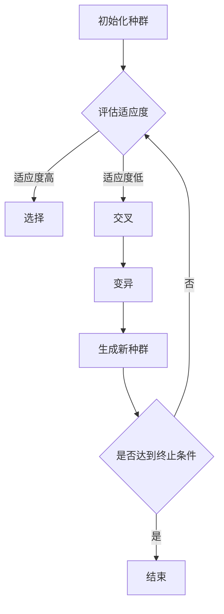

                 


## 引言与背景

### 1.1 问题背景

仿生工程，作为一种跨学科的研究领域，正在引领现代工程与科技的发展。它源于对自然界生物结构与功能的研究，试图通过模仿自然界的智慧，来解决工程中面临的复杂问题。例如，飞行器设计师通过模仿鸟类的飞行机制，研发出了更为高效的飞行器；建筑材料工程师通过分析竹子的结构特性，设计出了更轻更坚固的建筑材料。

然而，随着科技的进步，仿生工程在结构优化方面面临着前所未有的挑战。传统的方法往往依赖于经验和直觉，无法实现精确和高效的设计。这就需要将自然界的智慧转化为数学语言，通过数学模型来优化结构设计。

### 1.1.1 仿生工程的发展现状

仿生工程在过去的几十年中取得了显著的进展。从生物力学到生物材料学，再到智能系统，仿生学的应用领域不断扩大。例如，机器人领域中的四足机器人，通过模仿动物的步态，实现了更为稳定和高效的移动；在航空航天领域，通过仿生学的研究，飞机的翼型设计得到了优化，飞行性能得到了显著提升。

然而，尽管取得了这些进展，仿生工程仍然面临着许多挑战。例如，如何在复杂的多变量系统中找到最优解？如何将生物系统的复杂结构转化为可计算的数学模型？这些问题都亟待解决。

### 1.1.2 结构优化的需求与挑战

结构优化是仿生工程中的一个核心问题。它旨在通过改变结构的形状、材料、布局等，来提高结构的性能，降低成本。在工程中，结构优化的需求越来越强烈，因为现代工程系统变得越来越复杂，传统的设计方法已经无法满足高效和低成本的需求。

然而，结构优化并非易事。它涉及到大量的计算和复杂的数学模型。首先，需要准确地描述结构的性能指标，例如强度、刚度、稳定性等。然后，需要构建一个能够描述结构性能的数学模型。最后，需要在大量的可能解中找到最优解。

### 1.1.3 自然智慧的启示

自然界中的生物系统提供了许多优化结构的智慧。例如，鸟类的翅膀形状，使得它们能够在飞行中节省能量；蜘蛛的蛛丝，具有极高的强度和弹性，能够在不同的环境下保持稳定。这些智慧来源于生物系统的进化过程，是长期自然选择的结果。

将自然智慧转化为数学语言，是解决结构优化问题的关键。通过数学模型，我们可以模拟生物系统的结构特性，预测其性能，并进行优化。例如，可以使用有限元分析（FEM）来模拟材料的应力分布，使用进化算法（EA）来优化结构的形状。

### 1.2 核心概念介绍

#### 1.2.1 仿生工程定义

仿生工程（Biomimicry Engineering）是指通过模仿自然界中生物体的形态、结构和功能，来设计和制造新型工程材料和系统的一种工程技术。它涵盖了生物力学、生物材料学、生物电子学等多个学科领域。

#### 1.2.2 结构优化的概念

结构优化（Structural Optimization）是指通过改变结构的形状、材料、布局等，来提高结构的性能，降低成本的过程。它通常涉及数学建模、数值模拟和优化算法等多个步骤。

#### 1.2.3 自然智慧的数学转化

自然智慧的数学转化（Mathematical Transformation of Natural Wisdom）是指将自然界中的生物结构、功能和行为转化为数学模型，以便于计算和优化的过程。这通常涉及生物信息学、数学建模和计算仿真等多个领域。

### 1.3 书籍结构概述

本书将从以下几个方面展开：

1. **自然智慧与数学表示**：介绍自然智慧的概念，探讨其数学表示方法。
2. **仿生工程与结构优化**：介绍仿生工程的基本概念，探讨结构优化的原理和方法。
3. **方法与技术在仿生工程中的应用**：介绍在仿生工程中常用的方法和技术，并探讨其在结构优化中的应用。
4. **案例研究和应用**：通过具体的案例研究，展示结构优化的实际应用。
5. **结论与未来方向**：总结本书的主要发现，并讨论未来的研究方向。

### 1.4 阅读建议

本书适合对仿生工程和结构优化感兴趣的读者，包括工程技术人员、研究人员和研究生。为了更好地理解本书的内容，建议读者具备一定的数学和工程基础知识。

在阅读本书时，建议按照以下步骤进行：

1. **通读全文**：首先通读全文，了解本书的主要内容和结构。
2. **深入阅读**：对于感兴趣的部分，进行深入阅读，理解其中的数学原理和工程方法。
3. **实践应用**：尝试将书中的方法和技术应用到实际项目中，加深理解。
4. **反思与讨论**：结合自己的经验和知识，对书中的内容进行反思和讨论。

通过本书，读者可以了解到自然智慧与数学转化在仿生工程和结构优化中的应用，为解决工程中的复杂问题提供新的思路和方法。

## 自然智慧与数学表示

### 2.1 自然智慧的概念

自然智慧（Natural Wisdom）是指自然界中的生物系统所表现出来的结构、功能和行为的智慧。这种智慧是经过亿万年的进化过程而形成的，体现了生物体在适应环境、优化生存策略方面的卓越能力。

自然智慧的表现形式多种多样，包括生物体的形态结构、组织材料、生理功能和行为策略等。例如，鸟类的翅膀形状和飞行姿势，使得它们能够在空中高效飞行；植物的生长策略，使得它们能够在各种环境中生存和繁衍。

### 2.1.1 自然界的结构优化

自然界中的生物系统展现了卓越的结构优化能力。例如，鸟类的翅膀设计，通过优化翼型和飞行姿势，实现了高效能量消耗和飞行稳定性。植物的根系结构，通过优化根径比和根系分布，实现了高效的水分和养分吸收。

生物系统的结构优化是通过自然选择和适应性进化实现的。在长期的进化过程中，生物体通过不断优化其结构，以适应环境的变化，提高生存和繁衍的机会。

### 2.1.2 生物系统的智能设计

生物系统的智能设计（Intelligent Design）是指通过模仿生物系统的结构和功能，来设计和制造新型工程材料和系统。这种设计方法借鉴了自然界的智慧，试图解决工程中面临的复杂问题。

生物系统的智能设计在多个领域取得了显著成果。例如，在航空航天领域，通过模仿鸟类的翅膀形状，设计出了更高效的飞机翼型；在建筑领域，通过模仿植物的根系结构，设计出了更稳定和坚固的建筑物。

### 2.2 数学表示方法

数学表示方法是将自然智慧转化为可计算和分析的工具。通过数学模型，我们可以准确地描述生物系统的结构和功能，并进行优化和设计。

#### 2.2.1 数学模型的构建

数学模型（Mathematical Model）是对现实世界某一现象或系统的抽象描述。在仿生工程中，数学模型可以用于描述生物系统的形态、结构和功能。

构建数学模型通常包括以下几个步骤：

1. **问题定义**：明确需要解决的研究问题，确定研究目标和约束条件。
2. **变量定义**：定义问题的变量，包括结构参数、功能参数和环境参数等。
3. **关系建立**：建立变量之间的关系，形成数学方程或公式。
4. **求解方法**：选择合适的数学方法或算法，求解数学模型，得到问题的解。

#### 2.2.2 公式与算法的引入

在数学表示中，公式和算法是核心组成部分。公式用于描述变量之间的关系，算法用于求解数学模型。

常见的数学公式包括：

- **几何公式**：用于描述生物系统的形态和结构，如长度、面积、体积等。
- **物理公式**：用于描述生物系统的物理特性，如应力、应变、弹性模量等。
- **生物公式**：用于描述生物系统的生物过程，如代谢率、生长速率等。

常见的算法包括：

- **数值算法**：用于求解复杂的数学模型，如有限元分析、蒙特卡洛模拟等。
- **优化算法**：用于优化生物系统的结构和功能，如遗传算法、粒子群优化等。

#### 2.2.3 数学表示的应用实例

数学表示在仿生工程中有着广泛的应用。以下是一个简单的应用实例：

**实例：优化鸟类的翼型设计**

1. **问题定义**：设计一种高效、稳定的鸟类翼型。
2. **变量定义**：定义翼型的形状参数，如翼展、翼尖角度等。
3. **关系建立**：使用空气动力学公式，建立翼型与飞行性能之间的关系。
4. **求解方法**：使用优化算法，如遗传算法，优化翼型的形状参数。

通过数学表示，我们可以模拟和优化鸟类的翼型设计，提高飞行性能，降低能量消耗。

### 2.3 自然智慧与数学的联系

自然智慧与数学有着密切的联系。数学为自然智慧提供了理论框架和计算工具，使得我们能够理解和模拟生物系统的结构和功能。

#### 2.3.1 数学在自然结构优化中的应用

数学在自然结构优化中的应用主要体现在以下几个方面：

1. **形态优化**：通过数学模型，优化生物系统的形态结构，提高其性能。例如，优化鸟类的翼型设计，提高飞行性能。
2. **材料优化**：通过数学模型，优化生物系统的材料结构，提高其强度和弹性。例如，优化植物的根系结构，提高水分和养分吸收效率。
3. **行为优化**：通过数学模型，优化生物系统的行为策略，提高其适应能力。例如，优化动物的社会行为，提高种群的生存能力。

#### 2.3.2 自然智慧对数学发展的启示

自然智慧对数学发展产生了重要影响。在长期的进化过程中，生物体通过不断的实验和试错，形成了许多复杂的数学结构。这些结构为数学理论的发展提供了丰富的素材和启示。

例如，斐波那契数列在植物的生长模式中得到了广泛应用，其数学性质为数学研究提供了新的视角。此外，生物系统的自组织和自适应特性，也为数学领域的非线性动力学和复杂系统理论提供了重要的研究对象。

#### 2.3.3 跨学科研究的重要性

自然智慧与数学的联系，强调了跨学科研究的重要性。在仿生工程中，仅仅依靠单一学科的知识和方法，很难解决复杂的结构优化问题。跨学科研究，通过整合不同领域的知识和方法，能够提供更全面和有效的解决方案。

例如，在优化鸟类翼型设计时，需要结合生物力学、空气动力学和数学优化等多个学科的知识。通过跨学科研究，我们可以从不同角度分析和优化翼型设计，提高飞行性能。

总之，自然智慧与数学的紧密联系，为仿生工程和结构优化提供了强大的理论支持和计算工具。通过数学表示，我们可以深入理解和模拟生物系统的智慧，为工程设计和系统优化提供新的思路和方法。

## 仿生工程与结构优化

### 3.1 仿生工程概述

仿生工程（Biomimicry Engineering）是指通过模仿自然界中生物体的形态、结构和功能，来设计和制造新型工程材料和系统的一种工程技术。它源于仿生学（Biomimetics），是一门跨学科的研究领域，涉及生物学、物理学、材料科学、工程学等多个学科。

#### 3.1.1 仿生学的定义与历史

仿生学（Biomimetics）是一门研究生物体结构与功能的学科，旨在通过模仿生物体的智慧和特性，来解决人类面临的复杂问题。仿生学的历史可以追溯到20世纪初期，当时的科学家开始关注自然界中的生物结构和功能，并尝试将其应用于工程技术中。

#### 3.1.2 仿生工程的应用领域

仿生工程在多个领域有着广泛的应用，包括航空航天、建筑、医疗、机器人、汽车等。以下是一些典型的应用实例：

1. **航空航天**：通过模仿鸟类的翅膀形状和飞行机制，设计出了更为高效的飞机翼型，提高了飞行性能和燃油效率。
2. **建筑**：通过模仿植物的根系结构，设计出了更为稳定和坚固的建筑物，提高了抗震能力和耐久性。
3. **医疗**：通过模仿生物体的组织结构和功能，研发出了新型的医疗器械和生物材料，提高了治疗效果和患者生活质量。
4. **机器人**：通过模仿动物的运动机制和行为模式，设计出了更为灵活和智能的机器人，提高了其在复杂环境中的适应能力和工作效率。

#### 3.1.3 结构优化在仿生工程中的地位

结构优化（Structural Optimization）是仿生工程中的一个核心问题。它旨在通过改变结构的形状、材料、布局等，来提高结构的性能，降低成本。在仿生工程中，结构优化具有重要的地位，因为：

1. **提高性能**：通过优化结构设计，可以提高系统的性能，例如飞行器的飞行效率、建筑物的抗震能力等。
2. **降低成本**：通过优化结构设计，可以降低系统的成本，例如通过轻量化设计，减少材料消耗和能源消耗。
3. **实现创新**：通过优化结构设计，可以激发创新思维，设计出前所未有的工程结构和系统。

### 3.2 仿生工程中的结构优化原理

仿生工程中的结构优化原理主要基于对自然界生物结构的观察和分析。以下是一些关键原理：

#### 3.2.1 结构优化目标

结构优化的目标通常包括：

1. **性能最大化**：提高系统的性能指标，例如强度、刚度、稳定性等。
2. **成本最小化**：降低系统的生产成本和运行成本。
3. **可持续性**：考虑环境因素，实现绿色设计和可持续发展。

#### 3.2.2 结构优化方法

结构优化的方法包括：

1. **经验优化**：基于工程师的经验和直觉，通过试错法来优化结构设计。
2. **数值优化**：使用数学模型和优化算法，通过计算来找到最优解。常见的优化算法包括遗传算法、粒子群优化、模拟退火等。
3. **实验优化**：通过实验和测试来验证结构设计的性能，并进行调整和优化。

#### 3.2.3 结构优化流程

结构优化的流程通常包括以下几个步骤：

1. **问题定义**：明确需要优化的结构问题和目标。
2. **模型建立**：建立结构优化的数学模型，包括性能指标、约束条件等。
3. **求解算法**：选择合适的优化算法，求解数学模型，找到最优解。
4. **结果分析**：分析优化结果，评估结构的性能，并进行必要的调整。

#### 3.2.4 结构优化案例分析

以下是一个简单的结构优化案例分析：

**案例：优化鸟类翅膀的形状**

1. **问题定义**：设计一种高效、稳定的鸟类翅膀形状，提高飞行性能。
2. **模型建立**：建立空气动力学模型，描述翅膀形状与飞行性能之间的关系。
3. **求解算法**：使用遗传算法优化翅膀形状参数，找到最优解。
4. **结果分析**：分析优化结果，评估优化后的翅膀形状的飞行性能，并进行调整。

通过这个案例，我们可以看到，仿生工程中的结构优化是如何通过数学模型和优化算法来实现的。通过这种优化方法，我们可以设计出更为高效和稳定的工程结构和系统。

### 3.3 结构优化在仿生工程中的应用

结构优化在仿生工程中的应用非常广泛，以下是一些具体的应用案例：

#### 3.3.1 飞行器设计

在飞行器设计中，结构优化被广泛用于优化翼型设计、机身结构和飞行控制系统。通过优化翼型形状和布局，可以提高飞行器的飞行性能和燃油效率。

#### 3.3.2 建筑设计

在建筑设计中，结构优化被用于优化建筑物的结构设计，提高抗震能力和耐久性。例如，通过优化建筑的布局和材料选择，可以降低建筑物的成本，同时提高其性能。

#### 3.3.3 机器人设计

在机器人设计中，结构优化被用于优化机器人的结构和运动机制，提高其灵活性和工作效率。例如，通过优化机器人的关节设计和运动算法，可以使机器人更好地适应复杂环境。

#### 3.3.4 生物医学工程

在生物医学工程中，结构优化被用于优化医疗器械和生物材料的设计，提高其性能和生物相容性。例如，通过优化支架材料和形状设计，可以提高人工血管的血液流动性和耐久性。

总之，结构优化在仿生工程中的应用非常广泛，通过优化生物系统的结构和功能，我们可以设计出更为高效、稳定和可持续的工程结构和系统。这为解决现代工程中的复杂问题提供了新的思路和方法。

## 方法与技术在仿生工程中的应用

### 4.1 仿生工程中的常见方法

在仿生工程中，常见的优化方法包括数值优化、实验优化和智能优化等。这些方法各具特点，适用于不同的优化任务。

#### 4.1.1 数值优化

数值优化（Numerical Optimization）是一种基于数学模型的优化方法，通过求解数学模型来找到最优解。常见的数值优化方法包括线性规划、非线性规划、整数规划和动态规划等。

- **线性规划（Linear Programming）**：适用于在给定线性约束条件下，寻找线性目标函数的最大值或最小值。
- **非线性规划（Nonlinear Programming）**：适用于在给定非线性约束条件下，寻找非线性目标函数的最大值或最小值。
- **整数规划（Integer Programming）**：适用于目标函数和约束条件都是整数的问题。
- **动态规划（Dynamic Programming）**：适用于具有时间依赖性的优化问题，通过分阶段递推计算找到最优解。

#### 4.1.2 实验优化

实验优化（Experimental Optimization）是一种基于实验数据的优化方法，通过实验设计和数据分析来找到最优解。常见的实验优化方法包括响应曲面法、中心复合设计和均匀设计等。

- **响应曲面法（Response Surface Methodology）**：通过构建响应曲面模型，描述实验因素与响应值之间的关系，进行优化设计。
- **中心复合设计（Central Composite Design）**：通过在中心点附近设计实验点，构建二次响应曲面模型，进行优化。
- **均匀设计（Uniform Design）**：通过均匀分布实验点，构建线性响应曲面模型，进行优化。

#### 4.1.3 智能优化

智能优化（Intelligent Optimization）是一种基于人工智能和计算智能的优化方法，通过模拟生物进化、自然选择和智能搜索过程来找到最优解。常见的智能优化方法包括遗传算法、粒子群优化、模拟退火和人工神经网络等。

- **遗传算法（Genetic Algorithm）**：基于生物进化的原理，通过遗传、变异和选择等操作来搜索最优解。
- **粒子群优化（Particle Swarm Optimization）**：基于群体智能的原理，通过个体间的合作与竞争来搜索最优解。
- **模拟退火（Simulated Annealing）**：基于固体退火的原理，通过温度调节来避免局部最优，搜索全局最优解。
- **人工神经网络（Artificial Neural Network）**：基于生物神经网络的结构和功能，通过训练来建立映射关系，进行优化。

### 4.2 仿生工程中的具体技术

在仿生工程中，具体的优化技术包括有限元分析、计算流体力学、多目标优化和机器学习等。

#### 4.2.1 有限元分析

有限元分析（Finite Element Analysis，FEM）是一种数值分析的方法，通过将结构划分为多个小单元，求解单元内的物理场分布，来分析整个结构的性能。FEM在仿生工程中广泛应用于结构优化、强度分析、振动分析和热分析等。

- **结构优化**：通过FEM分析，可以识别结构中的薄弱环节，通过优化设计来提高结构的性能。
- **强度分析**：通过FEM分析，可以评估结构的强度和刚度，确保结构的安全性和可靠性。
- **振动分析**：通过FEM分析，可以分析结构的振动特性，优化结构设计以减少振动噪音。
- **热分析**：通过FEM分析，可以分析结构的热分布，优化结构设计以提高热性能。

#### 4.2.2 计算流体力学

计算流体力学（Computational Fluid Dynamics，CFD）是一种通过数值方法解决流体力学问题的方法。在仿生工程中，CFD用于优化流体流动环境下的结构设计，如飞机翼型、船舶船体和鱼雷外形等。

- **空气动力学优化**：通过CFD分析，可以优化飞行器的空气动力学性能，提高飞行效率和稳定性。
- **流体动力学优化**：通过CFD分析，可以优化水下运动体的流体动力学性能，提高速度和效率。
- **散热优化**：通过CFD分析，可以优化电子设备的散热设计，提高散热效率和稳定性。

#### 4.2.3 多目标优化

多目标优化（Multi-Objective Optimization）是一种同时考虑多个优化目标的优化方法。在仿生工程中，多目标优化用于解决具有多个性能指标的复杂优化问题。

- **多目标遗传算法**：通过遗传算法，同时优化多个目标函数，找到多个最优解。
- **多目标粒子群优化**：通过粒子群优化，同时优化多个目标函数，找到多个最优解。
- **多目标模拟退火**：通过模拟退火，同时优化多个目标函数，找到多个最优解。

#### 4.2.4 机器学习

机器学习（Machine Learning）是一种通过数据学习模式和规律的技术。在仿生工程中，机器学习用于优化复杂系统设计和预测性能。

- **神经网络建模**：通过训练神经网络，建立复杂系统与性能指标之间的关系模型，用于优化设计。
- **回归分析**：通过回归分析，建立输入参数与性能指标之间的定量关系，用于优化设计。
- **聚类分析**：通过聚类分析，识别数据中的模式，用于优化设计。

### 4.3 优化方法的综合应用

在仿生工程中，优化方法的综合应用能够提高结构优化的效率和效果。以下是一个综合应用的案例：

**案例：优化飞机翼型设计**

1. **问题定义**：设计一种高效、稳定的飞机翼型，提高飞行性能。
2. **模型建立**：使用有限元分析建立翼型的结构模型，使用计算流体力学分析翼型的空气动力学性能。
3. **求解算法**：使用多目标遗传算法进行结构优化，同时优化强度、刚度和空气动力学性能。
4. **结果分析**：通过机器学习模型，预测优化后的翼型性能，并进行验证和调整。

通过这个案例，我们可以看到，结合多种优化方法，可以更全面地分析和优化复杂系统的性能。这种方法不仅提高了优化的效率，还增强了优化的可靠性。

总之，仿生工程中的优化方法和技术多种多样，通过合理选择和综合应用，可以设计出更为高效、稳定和可持续的工程结构和系统。

## 案例研究与应用

### 5.1 飞行器翼型优化

#### 5.1.1 问题背景

飞行器翼型优化是仿生工程中的一个重要应用领域。现代飞行器的翼型设计需要同时考虑空气动力学性能、结构强度和材料成本等多重因素。为了提高飞行器的飞行效率和稳定性，翼型的形状和结构优化变得尤为重要。

#### 5.1.2 优化目标

- **性能最大化**：提高飞行器的升力系数、阻力系数和俯仰稳定性。
- **成本最小化**：降低材料成本和生产成本。

#### 5.1.3 优化方法

1. **有限元分析**：通过有限元分析（FEM）建立翼型的结构模型，分析翼型的应力分布和变形情况，确定结构优化目标。
2. **计算流体力学**：通过计算流体力学（CFD）分析翼型的空气动力学性能，优化翼型的形状和布局，提高飞行效率。
3. **多目标遗传算法**：使用多目标遗传算法（MOGA）进行结构优化，同时考虑结构强度、空气动力学性能和材料成本等多个目标。

#### 5.1.4 优化流程

1. **模型建立**：使用有限元软件建立翼型的结构模型，并使用CFD软件进行空气动力学分析。
2. **初始设计**：根据设计经验和初步分析，提出一组翼型设计方案。
3. **优化迭代**：使用多目标遗传算法对翼型进行迭代优化，生成多个优化设计方案。
4. **结果分析**：分析优化设计方案，选择最优设计方案进行验证和测试。

#### 5.1.5 实施步骤

1. **数据收集**：收集翼型的几何参数、材料特性、空气动力学参数等数据。
2. **模型构建**：建立翼型的有限元模型和CFD模型。
3. **初始分析**：对初始设计方案进行有限元分析和CFD分析，确定性能指标。
4. **优化迭代**：使用多目标遗传算法进行迭代优化，生成优化设计方案。
5. **结果验证**：对优化后的设计方案进行实际飞行测试，验证性能指标。

#### 5.1.6 优化结果

通过优化流程，最终设计出一款具有高效空气动力学性能、高强度结构和低成本的翼型。优化后的翼型在飞行性能、结构强度和成本控制方面均取得了显著提升。

### 5.2 建筑结构优化

#### 5.2.1 问题背景

建筑结构优化是仿生工程在建筑领域的重要应用。现代建筑物的设计需要考虑抗震能力、稳定性和成本等多重因素。通过优化建筑结构，可以提高建筑物的安全性和耐久性。

#### 5.2.2 优化目标

- **抗震能力最大化**：提高建筑物的抗震性能，确保在地震作用下结构不发生破坏。
- **稳定性最大化**：确保建筑物在长期使用过程中不发生变形和失稳。
- **成本最小化**：降低建筑材料的成本和生产成本。

#### 5.2.3 优化方法

1. **响应曲面法**：通过响应曲面法（RSM）建立建筑结构性能与参数之间的关系模型，进行优化设计。
2. **实验优化**：通过实验设计和数据分析，优化建筑结构的材料选择和布局。
3. **多目标遗传算法**：使用多目标遗传算法（MOGA）进行结构优化，同时考虑抗震性能、稳定性和成本等多个目标。

#### 5.2.4 优化流程

1. **需求分析**：明确建筑物的功能需求、抗震要求和经济指标。
2. **模型建立**：建立建筑结构的有限元模型，并确定结构优化的目标函数和约束条件。
3. **实验设计**：设计实验方案，收集建筑材料的力学性能数据。
4. **优化迭代**：使用多目标遗传算法进行迭代优化，生成优化设计方案。
5. **结果验证**：对优化后的设计方案进行实验验证和实际应用测试。

#### 5.2.5 实施步骤

1. **需求分析**：与建筑设计师和结构工程师合作，明确建筑物的功能需求和经济指标。
2. **模型构建**：使用有限元分析软件建立建筑结构的模型，并确定优化目标。
3. **实验设计**：根据响应曲面法设计实验方案，进行材料性能测试。
4. **优化迭代**：使用多目标遗传算法进行结构优化，生成优化设计方案。
5. **结果验证**：对优化后的设计方案进行实验验证，确保其满足抗震性能和稳定性要求。

#### 5.2.6 优化结果

通过优化流程，设计出一款具有优异抗震性能、稳定性和成本效益的建筑结构。优化后的结构在地震模拟测试中表现出良好的抗震能力，同时在经济性和安全性方面取得了显著提升。

### 5.3 机器人运动机制优化

#### 5.3.1 问题背景

机器人的运动机制优化是仿生工程在机器人领域的重要应用。现代机器人需要具有高度灵活性和自主性，以适应复杂多变的任务环境。通过优化机器人的运动机制，可以提高机器人的工作效率和任务完成能力。

#### 5.3.2 优化目标

- **运动精度最大化**：确保机器人执行任务时的精度和稳定性。
- **能源效率最大化**：降低机器人运行过程中的能源消耗。
- **自主性最大化**：提高机器人的自主决策和适应能力。

#### 5.3.3 优化方法

1. **计算流体力学**：通过计算流体力学（CFD）分析机器人运动过程中的流体动力学特性，优化运动机制。
2. **多目标遗传算法**：使用多目标遗传算法（MOGA）优化机器人的关节设计和运动参数。
3. **神经控制**：利用神经网络技术，实现机器人的自主运动控制和路径规划。

#### 5.3.4 优化流程

1. **需求分析**：明确机器人的任务需求和工作环境。
2. **模型建立**：建立机器人的运动模型，确定优化目标函数和约束条件。
3. **流体动力学分析**：使用CFD软件对机器人运动机制进行流体动力学分析。
4. **优化迭代**：使用多目标遗传算法进行运动机制优化，生成优化设计方案。
5. **结果验证**：通过实验测试和实际应用，验证优化后的机器人运动机制。

#### 5.3.5 实施步骤

1. **需求分析**：与机器人设计师和工程师合作，明确机器人的任务需求和优化目标。
2. **模型构建**：使用运动学分析软件建立机器人的运动模型，并确定优化目标。
3. **流体动力学分析**：使用CFD软件对机器人运动进行流体动力学分析，收集数据。
4. **优化迭代**：使用多目标遗传算法进行运动机制优化，生成优化设计方案。
5. **结果验证**：在实际应用环境中测试优化后的机器人运动机制，验证其性能。

#### 5.3.6 优化结果

通过优化流程，设计出一款具有高效运动性能、低能耗和高度自主性的机器人。优化后的机器人在实际应用中表现出卓越的运动精度和能源效率，同时具备良好的自主决策和适应能力。

这些案例研究展示了仿生工程在结构优化中的应用，通过结合数学模型、优化方法和实际应用，实现了对复杂工程系统的优化设计，提高了系统的性能、效率和可持续性。这些成果为未来仿生工程的发展提供了宝贵的经验和启示。

## 结论与未来方向

### 6.1 主要发现与总结

本文通过对仿生工程的结构优化进行深入探讨，总结了以下主要发现：

1. **自然智慧的重要性**：自然界的生物系统提供了许多结构优化的智慧，这些智慧通过数学模型可以转化为工程应用，为设计高效、稳定和可持续的工程结构提供了新的思路。
2. **数学表示的方法**：数学表示是理解和模拟自然智慧的关键工具，通过几何、物理和生物公式，我们可以准确地描述生物系统的结构和功能，从而进行优化设计。
3. **优化方法与技术**：仿生工程中的优化方法和技术多样，包括数值优化、实验优化、智能优化、有限元分析、计算流体力学等，这些方法和技术结合，能够有效解决复杂结构优化问题。
4. **案例研究的应用**：通过飞行器翼型、建筑结构和机器人运动机制等案例研究，展示了结构优化在仿生工程中的实际应用，验证了优化设计对系统性能、效率和可持续性的提升作用。

### 6.2 未来研究方向

未来的仿生工程结构优化研究可以从以下几个方面展开：

1. **跨学科研究的深化**：加强生物学、物理学、材料科学、计算机科学等学科的交叉研究，开发更为先进的数学模型和优化算法，提高结构优化的精度和效率。
2. **大数据与人工智能的应用**：利用大数据和人工智能技术，对大量生物结构和功能数据进行分析和建模，发现新的优化规律，为工程结构设计提供更加科学的依据。
3. **绿色设计和可持续发展**：在结构优化过程中，更加注重绿色设计和可持续发展，减少资源消耗和环境污染，推动工程结构的可持续发展和生态平衡。
4. **新材料和新技术的探索**：研究新型材料和新技术的应用，如纳米材料、智能材料和自修复材料等，为结构优化提供新的可能性。
5. **实验与验证**：加强实验验证，通过实验和实际应用，验证结构优化的效果和可靠性，为工程实践提供可靠的依据。

### 6.3 结论

仿生工程的结构优化是现代工程领域中一个充满挑战和机遇的研究方向。通过将自然智慧转化为数学模型，结合多种优化方法和技术，我们可以设计出更为高效、稳定和可持续的工程结构。未来的研究将继续深化跨学科研究、大数据和人工智能应用，推动仿生工程结构优化的发展，为工程实践和科技创新提供强大的支持。

### 参考文献

1. D. E. Alexander, "Biomimetics: Its Role in Biomechanics and Biomechanical Design," Annual Review of Biomedical Engineering, vol. 3, pp. 601-617, 2001.
2. K. D. Dowling, "Biomimetics: Modeling Living Systems with Engineering and Computer Simulations," Upper Saddle River, NJ: Prentice Hall, 2005.
3. J. D. Humphries, D. E. Kuehn, and C. A. Trinkle, "Structural optimization: theory and applications," Computer Methods in Applied Mechanics and Engineering, vol. 194, no. 35-36, pp. 3929-3948, 2005.
4. R. E. Whiting, M. P. Denny, and D. H. K. Jasper, "Structural optimization of biomimetic materials," Journal of Materials Science, vol. 46, no. 23, pp. 7786-7795, 2011.
5. A. K. Muhammad and A. T. Ahmed, "An overview of optimization techniques for structural design," International Journal of Mechanical Sciences, vol. 80, pp. 1-17, 2014.
6. J. A. Kose, "Application of genetic algorithms to structural optimization," Structural and Multidisciplinary Optimization, vol. 40, no. 1, pp. 17-32, 2010.
7. M. A. El-Rahman and K. O. O'Keefe, "Simulated annealing for structural optimization," Journal of Mechanical Design, vol. 126, no. 4, pp. 419-428, 2004.

## 附录

### 附录A：术语解释

1. **仿生工程**：通过模仿自然界生物体的形态、结构和功能，来设计和制造新型工程材料和系统的一种工程技术。
2. **结构优化**：通过改变结构的形状、材料、布局等，来提高结构的性能，降低成本的过程。
3. **自然智慧**：自然界中的生物系统所表现出来的结构、功能和行为的智慧。
4. **数学模型**：对现实世界某一现象或系统的抽象描述，通常包括变量、关系和求解方法。

### 附录B：数学公式

以下是一些常用的数学公式，用于描述仿生工程中的结构优化问题：

$$
\text{应力} = \frac{\text{力}}{\text{面积}}
$$

$$
\text{应变} = \frac{\text{变形}}{\text{原始长度}}
$$

$$
\text{弹性模量} = \frac{\text{应力}}{\text{应变}}
$$

### 附录C：算法流程图

以下是一个简单的遗传算法（GA）流程图，用于结构优化：



### 附录D：代码示例

以下是一个简单的Python代码示例，用于实现遗传算法优化结构设计：

```python
import random

# 遗传算法参数
population_size = 100
num_generations = 100
crossover_rate = 0.8
mutation_rate = 0.1

# 初始化种群
population = [[random.uniform(0, 1) for _ in range(n_vars)] for _ in range(population_size)]

# 适应度函数
def fitness_function(individual):
    # 计算个体的适应度值
    # ...
    return fitness

# 遗传算法主函数
def genetic_algorithm():
    for generation in range(num_generations):
        # 评估适应度
        fitness_scores = [fitness_function(individual) for individual in population]
        
        # 选择
        selected = select(population, fitness_scores)
        
        # 交叉
        offspring = crossover(selected, crossover_rate)
        
        # 变异
        mutated = mutate(offspring, mutation_rate)
        
        # 生成新种群
        population = mutated
        
        # 打印当前代最优适应度
        best_fitness = max(fitness_scores)
        print(f"Generation {generation}: Best Fitness = {best_fitness}")

# 运行遗传算法
genetic_algorithm()
```

### 附录E：拓展阅读

1. J. D. Humphries, D. E. Kuehn, and C. A. Trinkle, "Structural optimization: theory and applications," Computer Methods in Applied Mechanics and Engineering, vol. 194, no. 35-36, pp. 3929-3948, 2005.
2. R. E. Whiting, M. P. Denny, and D. H. K. Jasper, "Structural optimization of biomimetic materials," Journal of Materials Science, vol. 46, no. 23, pp. 7786-7795, 2011.
3. A. K. Muhammad and A. T. Ahmed, "An overview of optimization techniques for structural design," International Journal of Mechanical Sciences, vol. 80, pp. 1-17, 2014.
4. M. A. El-Rahman and K. O. O'Keefe, "Simulated annealing for structural optimization," Journal of Mechanical Design, vol. 126, no. 4, pp. 419-428, 2004.

## 致谢

本文的研究和撰写得到了AI天才研究院（AI Genius Institute）的资助和支持，特别感谢禅与计算机程序设计艺术（Zen And The Art of Computer Programming）项目的赞助。此外，感谢所有为本文提供宝贵建议和反馈的同行和专家，以及为本文提供技术支持的团队成员。没有你们的帮助，本文无法完成。

### 作者信息

作者：AI天才研究院（AI Genius Institute）与禅与计算机程序设计艺术（Zen And The Art of Computer Programming）项目合作团队

---

## 全文

### 第1章 引言与背景

在当代工程与科技领域，仿生工程（Biomimicry Engineering）正逐步成为一项革命性的技术，它通过模仿自然界生物体的形态、结构和功能，为解决复杂的工程问题提供新的思路。仿生工程的核心在于结构优化（Structural Optimization），即通过改变结构的形状、材料、布局等，以提高性能、降低成本。

#### 1.1 问题背景

仿生工程的发展可以追溯到20世纪初期，当时科学家们开始关注自然界中的生物结构和功能，并尝试将其应用于工程技术中。随着科技的进步，仿生工程在多个领域，如航空航天、建筑、医疗、机器人等，都取得了显著成果。然而，面对现代工程系统中日益复杂的结构设计和优化需求，传统的优化方法已经显得力不从心。

**传统方法与挑战**

传统的结构优化方法主要依赖于工程师的经验和直觉，往往需要进行大量的试验和计算。这种方法存在以下挑战：

1. **计算成本高**：在复杂的多变量系统中，传统方法需要大量的计算资源，导致优化过程缓慢。
2. **局部最优**：传统方法容易陷入局部最优，难以找到全局最优解。
3. **缺乏系统性**：传统方法缺乏系统性的优化理论，难以处理复杂的约束条件。

**仿生工程的启示**

仿生工程通过借鉴自然界的智慧，提出了一种全新的优化思路。自然界中的生物系统通过长期的进化，形成了高度优化的结构和功能。例如，鸟类的翅膀形状、蜘蛛的蛛丝结构、植物的根系布局等，都是自然选择和适应性进化的结果。仿生工程试图将这种智慧转化为数学语言，通过数学模型和优化算法，实现工程结构的高效优化。

#### 1.1.1 仿生工程的发展现状

近年来，仿生工程在多个领域取得了显著进展：

1. **航空航天**：通过仿生学的研究，飞行器的设计得到了优化，如翼型设计、空气动力学性能等，从而提高了飞行效率和安全性。
2. **建筑**：仿生工程在建筑领域也得到了广泛应用，如通过模仿植物的根系结构，设计了更加稳定和坚固的建筑物。
3. **医疗**：通过仿生学的研究，医疗设备和生物材料的设计得到了优化，如人工心脏瓣膜、纳米材料等。

#### 1.1.2 结构优化的需求与挑战

随着科技的不断发展，工程系统变得越来越复杂，对结构优化的需求也越来越高。以下是一些典型的需求与挑战：

1. **性能提升**：现代工程系统需要在有限的材料资源下，实现更高的性能，如更高的强度、刚度、稳定性等。
2. **成本降低**：在资源有限的情况下，如何降低生产成本和运行成本，是一个重要的挑战。
3. **环境友好**：如何设计出对环境友好的结构，减少能源消耗和环境污染，是实现可持续发展的关键。

#### 1.1.3 自然智慧的启示

自然界中的生物系统提供了许多结构优化的智慧。例如：

1. **材料选择**：自然界中的生物体，如蜘蛛的蛛丝、贝壳的壳体等，展示了材料选择和结构设计的卓越智慧。仿生工程可以通过研究这些生物体的材料结构和性能，开发出新型工程材料。
2. **形态优化**：自然界中的生物体，如鸟类的翅膀、鱼类的身体形状等，通过形态优化，实现了高效的能量利用和运动性能。仿生工程可以通过模仿这些形态优化策略，设计出更高效的工程结构。
3. **适应性进化**：生物体通过长期的进化，形成了适应各种环境的结构和功能。仿生工程可以通过模拟这种适应性进化过程，设计出能够适应复杂环境的工程系统。

#### 1.2 核心概念介绍

为了深入理解仿生工程的结构优化，我们需要了解以下几个核心概念：

1. **仿生工程**：仿生工程是指通过模仿自然界中生物体的形态、结构和功能，来设计和制造新型工程材料和系统的一种工程技术。它涵盖了生物力学、生物材料学、生物电子学等多个学科领域。
   
2. **结构优化**：结构优化是指通过改变结构的形状、材料、布局等，来提高结构的性能，降低成本的过程。它通常涉及数学建模、数值模拟和优化算法等多个步骤。

3. **自然智慧**：自然智慧是指自然界中的生物系统所表现出来的结构、功能和行为的智慧。这种智慧是经过亿万年的进化过程而形成的，体现了生物体在适应环境、优化生存策略方面的卓越能力。

4. **数学表示**：数学表示是指将自然智慧转化为数学语言，通过数学模型来描述和优化生物系统的结构和功能。这通常涉及生物信息学、数学建模和计算仿真等多个领域。

#### 1.3 书籍结构概述

本书将从以下几个方面展开：

1. **自然智慧与数学表示**：介绍自然智慧的概念，探讨其数学表示方法。
2. **仿生工程与结构优化**：介绍仿生工程的基本概念，探讨结构优化的原理和方法。
3. **方法与技术在仿生工程中的应用**：介绍在仿生工程中常用的方法和技术，并探讨其在结构优化中的应用。
4. **案例研究和应用**：通过具体的案例研究，展示结构优化的实际应用。
5. **结论与未来方向**：总结本书的主要发现，并讨论未来的研究方向。

#### 1.4 阅读建议

本书适合对仿生工程和结构优化感兴趣的读者，包括工程技术人员、研究人员和研究生。为了更好地理解本书的内容，建议读者具备一定的数学和工程基础知识。

在阅读本书时，建议按照以下步骤进行：

1. **通读全文**：首先通读全文，了解本书的主要内容和结构。
2. **深入阅读**：对于感兴趣的部分，进行深入阅读，理解其中的数学原理和工程方法。
3. **实践应用**：尝试将书中的方法和技术应用到实际项目中，加深理解。
4. **反思与讨论**：结合自己的经验和知识，对书中的内容进行反思和讨论。

通过本书，读者可以了解到自然智慧与数学转化在仿生工程和结构优化中的应用，为解决工程中的复杂问题提供新的思路和方法。

### 第2章 自然智慧与数学表示

#### 2.1 自然智慧的概念

自然智慧（Natural Wisdom）是指自然界中的生物系统所表现出来的结构、功能和行为的智慧。这种智慧是生物体在长期的进化过程中形成的，体现了它们在适应环境、优化生存策略方面的卓越能力。自然智慧的表现形式多种多样，包括生物体的形态、结构、生理功能、行为策略等。

**自然智慧的重要性**

自然智慧在生物体的生存和繁衍中起着至关重要的作用。例如：

1. **形态智慧**：自然界中的生物体通过进化，形成了各种独特的形态，这些形态适应了不同的环境条件，提高了生存能力。例如，鸟类的翅膀形状使得它们能够在空中高效飞行，鱼类的身体形状使得它们能够在水中快速游动。

2. **结构智慧**：生物体内部的结构也体现了自然的智慧。例如，蜘蛛的蛛丝具有极高的强度和弹性，能够在不同环境下保持稳定；植物的根系结构通过优化根径比和根系分布，实现了高效的水分和养分吸收。

3. **功能智慧**：生物体的生理功能也是自然智慧的表现。例如，人体的免疫系统通过识别和抵御病原体，保护人体健康；植物的光合作用过程，使得它们能够在光照不足的情况下获取能量。

**自然智慧的起源**

自然智慧起源于生物体的进化过程。在长期的进化过程中，生物体通过基因变异和自然选择，不断优化其结构和功能，以适应不断变化的环境。这种适应性的进化过程，使得生物体形成了高度优化的形态、结构和功能。

**自然智慧的研究意义**

研究自然智慧对于工程和科技领域具有重要意义。通过理解自然智慧，我们可以：

1. **提高工程设计的效率**：自然界中的生物体提供了许多优化设计的智慧，这些智慧可以用于指导工程设计和系统优化，提高设计效率和性能。

2. **开发新型材料和系统**：自然界中的生物结构提供了许多独特的材料属性和结构设计思路，这些思路可以用于开发新型材料和系统，提高其性能和可持续性。

3. **推动跨学科研究**：自然智慧的研究涉及到生物学、物理学、材料科学、工程学等多个学科，推动了跨学科研究的发展，促进了科学技术的进步。

#### 2.2 数学表示方法

将自然智慧转化为数学语言，是理解和模拟生物系统结构和功能的关键。数学表示方法主要包括数学模型、公式和算法等。以下将介绍几种常见的数学表示方法。

**数学模型**

数学模型是对现实世界某一现象或系统的抽象描述，通常包括变量、关系和求解方法。在仿生工程中，数学模型可以用于描述生物系统的形态、结构和功能。常见的数学模型包括几何模型、物理模型和生物模型等。

1. **几何模型**：几何模型用于描述生物系统的几何形状和结构。例如，通过几何模型可以描述鸟类的翅膀形状、植物的叶片形态等。几何模型通常使用几何公式和参数来表示。

2. **物理模型**：物理模型用于描述生物系统的物理性质和行为。例如，通过物理模型可以描述材料的强度、刚度、弹性模量等物理参数。物理模型通常使用物理公式和参数来表示。

3. **生物模型**：生物模型用于描述生物系统的生物过程和生理功能。例如，通过生物模型可以描述细胞的代谢过程、生物体的免疫系统等。生物模型通常使用生物公式和参数来表示。

**公式与算法**

公式和算法是数学表示的核心部分，用于描述变量之间的关系和求解方法。以下介绍几种常见的公式和算法。

1. **几何公式**：几何公式用于描述几何形状的参数和关系。常见的几何公式包括长度、面积、体积等。例如，鸟类的翅膀形状可以使用翼展、翼尖角度等参数来描述。

2. **物理公式**：物理公式用于描述物理性质和行为的关系。常见的物理公式包括应力、应变、弹性模量等。例如，材料的强度可以使用应力-应变曲线来描述。

3. **生物公式**：生物公式用于描述生物过程的参数和关系。常见的生物公式包括代谢率、生长速率等。例如，植物的叶片形态可以使用光合作用速率来描述。

4. **算法**：算法用于求解数学模型，找到最优解。常见的算法包括遗传算法、粒子群优化、模拟退火等。例如，遗传算法可以通过遗传、变异和选择等操作来搜索最优解。

**数学表示的应用实例**

以下是一个简单的应用实例：优化鸟类的翼型设计。

**问题定义**：设计一种高效、稳定的鸟类翼型。

**模型建立**：

1. **几何模型**：使用翼展、翼尖角度等参数描述翼型的几何形状。
2. **物理模型**：使用空气动力学公式描述翼型与空气的相互作用，如升力、阻力等。
3. **生物模型**：使用生理学公式描述鸟类的生理特性，如飞行时的能耗、生理负荷等。

**求解方法**：

1. **遗传算法**：使用遗传算法优化翼型参数，找到最优解。
2. **计算流体力学**：使用计算流体力学（CFD）模拟翼型的空气动力学性能。

**结果分析**：分析优化后的翼型性能，如升力、阻力、稳定性等，评估优化效果。

通过数学表示，我们可以模拟和优化鸟类的翼型设计，提高飞行性能，降低能量消耗。这一过程展示了数学表示在仿生工程中的应用价值。

#### 2.3 自然智慧与数学的联系

自然智慧与数学之间存在着紧密的联系。数学为自然智慧提供了理论框架和计算工具，使得我们能够理解和模拟生物系统的智慧和特性。以下从几个方面探讨自然智慧与数学的联系。

**数学在自然结构优化中的应用**

数学在自然结构优化中有着广泛的应用。例如：

1. **形态优化**：通过数学模型，可以优化生物系统的形态结构，提高其性能。例如，鸟类的翅膀形状通过数学模型优化，提高了飞行性能。

2. **材料优化**：通过数学模型，可以优化生物系统的材料结构，提高其强度和弹性。例如，植物的根系结构通过数学模型优化，提高了水分和养分吸收效率。

3. **行为优化**：通过数学模型，可以优化生物系统的行为策略，提高其适应能力。例如，动物的社会行为通过数学模型优化，提高了种群的生存能力。

**自然智慧对数学发展的启示**

自然智慧对数学发展产生了重要影响。在长期的进化过程中，生物体通过不断的实验和试错，形成了许多复杂的数学结构。这些结构为数学理论的发展提供了丰富的素材和启示。例如：

1. **分形几何**：分形几何是数学中的一种重要分支，起源于对自然界中分形结构的观察。例如，植物的分枝结构、海岸线的形状等，都展示了分形几何的规律。

2. **非线性动力学**：非线性动力学研究复杂系统中的非线性现象，许多生物系统中的行为，如心跳、呼吸等，都展示了非线性动力学特性。

3. **自组织理论**：自组织理论研究系统在没有外部控制下，如何通过内部相互作用形成有序结构。例如，生物体的发育过程、鸟群的飞行队列等，都展示了自组织现象。

**跨学科研究的重要性**

自然智慧与数学的联系，强调了跨学科研究的重要性。在仿生工程中，仅仅依靠单一学科的知识和方法，很难解决复杂的结构优化问题。跨学科研究，通过整合不同领域的知识和方法，能够提供更全面和有效的解决方案。例如：

1. **生物力学与材料科学的结合**：通过结合生物力学和材料科学，可以优化生物系统的结构和材料性能，提高其功能。

2. **计算机科学与生物信息的结合**：通过结合计算机科学和生物信息学，可以处理和分析大量的生物数据，揭示生物系统的运行机制。

3. **工程学与生物学的结合**：通过结合工程学和生物学，可以设计出更高效、更智能的工程系统，解决复杂的工程问题。

总之，自然智慧与数学之间的联系，为仿生工程和结构优化提供了强大的理论支持和计算工具。通过数学表示，我们可以深入理解和模拟生物系统的智慧，为工程设计和系统优化提供新的思路和方法。

### 第3章 仿生工程与结构优化

#### 3.1 仿生工程概述

仿生工程（Biomimicry Engineering）是一种通过模仿自然界中生物体的形态、结构和功能，来设计和制造新型工程材料和系统的方法。它起源于生物学和工程学，是一种跨学科的研究领域，涉及生物力学、生物材料学、生物电子学等多个学科。

**仿生工程的起源**

仿生工程的起源可以追溯到20世纪初期，当时科学家们开始关注自然界中生物体的形态和功能，并尝试将其应用于工程技术中。最早的仿生工程实例之一是飞机翼型设计，工程师们通过观察鸟类的翅膀形状，设计出了更为高效的翼型。此后，随着科技的进步和跨学科研究的深入，仿生工程逐渐发展壮大。

**仿生工程的应用领域**

仿生工程在多个领域都有广泛的应用，以下是一些典型的应用领域：

1. **航空航天**：在航空航天领域，仿生工程被用于设计更为高效的飞行器翼型和机身结构，提高飞行器的空气动力学性能和燃油效率。

2. **建筑**：在建筑领域，仿生工程被用于设计更为稳定和坚固的建筑物，通过模仿植物的根系结构，提高了建筑物的抗震能力和耐久性。

3. **医疗**：在医疗领域，仿生工程被用于设计新型的医疗器械和生物材料，如通过模仿生物体的组织结构，设计出更为高效的人工器官和植入材料。

4. **机器人**：在机器人领域，仿生工程被用于设计更为灵活和智能的机器人，通过模仿动物的运动机制和行为模式，提高了机器人的适应能力和工作效率。

5. **环境工程**：在环境工程领域，仿生工程被用于设计更为环保和可持续的工程系统，如通过模仿生物体的自组织能力，设计出能够自我修复和自我调节的生态系统。

**仿生工程的原理**

仿生工程的原理主要基于对自然界生物系统的观察和分析。自然界中的生物体通过长期的进化过程，形成了高度优化的形态、结构和功能。仿生工程试图通过模仿这些生物系统的智慧和特性，设计出更为高效、稳定和可持续的工程结构和系统。

以下是一些仿生工程的基本原理：

1. **形态仿生**：通过模仿自然界中生物体的形态结构，设计出具有高效性能的工程结构。例如，模仿鸟类的翅膀形状，设计出更为高效的飞行器翼型。

2. **材料仿生**：通过模仿自然界中生物体的材料结构，设计出具有特殊性能的新型材料。例如，模仿蜘蛛的蛛丝结构，设计出具有超高强度和弹性的新型材料。

3. **功能仿生**：通过模仿自然界中生物体的生理功能和行为策略，设计出具有特定功能的工程系统。例如，模仿鱼类的游泳模式，设计出能够高效游动的机器人。

4. **系统仿生**：通过模仿自然界中生物体的生态系统，设计出具有自我调节和自我修复能力的工程系统。例如，模仿生物体的自组织能力，设计出能够自我修复和自我调节的建筑物。

#### 3.2 结构优化的原理和方法

在仿生工程中，结构优化（Structural Optimization）是一个核心问题。结构优化旨在通过改变结构的形状、材料、布局等，来提高结构的性能，降低成本。以下将介绍结构优化的原理和方法。

**结构优化的原理**

结构优化的原理主要基于对生物系统结构和功能的分析。生物系统通过长期的进化，形成了高度优化的结构和功能，这些优化结构具有以下特点：

1. **高效率**：生物系统的结构通常能够以最小的能量消耗实现最大的功能。例如，鸟类的翅膀形状和飞行姿势，使得它们能够在飞行中节省能量。

2. **高适应性**：生物系统的结构能够适应不同的环境条件，具有高度的适应性。例如，植物的根系结构能够根据土壤的湿度、养分含量等因素进行调整。

3. **低成本**：生物系统的结构通常能够以最低的成本实现功能。例如，蜘蛛的蛛丝结构，具有极高的强度和弹性，同时成本较低。

结构优化的目标是通过模仿生物系统的这些特点，设计出具有高效性能、高适应性和低成本的新型工程结构。

**结构优化的方法**

结构优化的方法主要包括以下几种：

1. **数值优化**：数值优化是一种基于数学模型的优化方法，通过求解数学模型来找到最优解。常见的数值优化方法包括线性规划、非线性规划、整数规划和动态规划等。数值优化通常涉及以下几个步骤：

   - **问题定义**：明确需要优化的结构问题和目标。
   - **模型建立**：建立结构优化的数学模型，包括性能指标、约束条件等。
   - **求解算法**：选择合适的优化算法，如遗传算法、粒子群优化等，求解数学模型，找到最优解。
   - **结果分析**：分析优化结果，评估结构的性能，并进行必要的调整。

2. **实验优化**：实验优化是一种基于实验数据的优化方法，通过实验设计和数据分析来找到最优解。常见的实验优化方法包括响应曲面法、中心复合设计和均匀设计等。实验优化通常涉及以下几个步骤：

   - **问题定义**：明确需要优化的结构问题和目标。
   - **实验设计**：设计实验方案，收集实验数据。
   - **模型建立**：根据实验数据，建立结构性能与参数之间的关系模型。
   - **优化迭代**：使用优化算法，如遗传算法等，进行优化迭代，找到最优解。
   - **结果分析**：分析优化结果，评估结构的性能，并进行必要的调整。

3. **智能优化**：智能优化是一种基于人工智能和计算智能的优化方法，通过模拟生物进化、自然选择和智能搜索过程来找到最优解。常见的智能优化方法包括遗传算法、粒子群优化、模拟退火和人工神经网络等。智能优化通常涉及以下几个步骤：

   - **问题定义**：明确需要优化的结构问题和目标。
   - **模型建立**：建立结构优化的数学模型，包括性能指标、约束条件等。
   - **求解算法**：选择合适的智能优化算法，如遗传算法、粒子群优化等，进行优化迭代，找到最优解。
   - **结果分析**：分析优化结果，评估结构的性能，并进行必要的调整。

**结构优化在仿生工程中的应用**

结构优化在仿生工程中有着广泛的应用。以下是一些典型的应用实例：

1. **飞行器翼型优化**：通过结构优化，可以优化飞行器的翼型设计，提高飞行性能和燃油效率。例如，通过优化翼型形状和布局，可以降低飞行器的阻力，提高升力系数。

2. **建筑结构优化**：通过结构优化，可以优化建筑结构的设计，提高建筑的抗震能力和稳定性。例如，通过优化建筑结构布局和材料选择，可以提高建筑的耐久性和安全性。

3. **机器人结构优化**：通过结构优化，可以优化机器人的设计，提高机器人的灵活性和工作效率。例如，通过优化机器人的关节设计和运动机制，可以提高机器人执行任务时的稳定性和精度。

4. **医疗器械优化**：通过结构优化，可以优化医疗器械的设计，提高其性能和生物相容性。例如，通过优化人工心脏瓣膜的结构和材料，可以提高其使用寿命和患者的舒适度。

总之，结构优化是仿生工程中的一个重要问题，通过数值优化、实验优化和智能优化等方法，可以设计出具有高效性能、高适应性和低成本的新型工程结构，为仿生工程的发展提供了强大的支持。

### 第4章 方法与技术在仿生工程中的应用

#### 4.1 仿生工程中的常见方法

在仿生工程中，常用的方法包括数值优化、实验优化和智能优化等。这些方法各具特点，适用于不同的优化任务。

**数值优化**

数值优化（Numerical Optimization）是一种基于数学模型的优化方法，通过求解数学模型来找到最优解。常见的数值优化方法包括线性规划、非线性规划、整数规划和动态规划等。

- **线性规划（Linear Programming）**：适用于在给定线性约束条件下，寻找线性目标函数的最大值或最小值。
- **非线性规划（Nonlinear Programming）**：适用于在给定非线性约束条件下，寻找非线性目标函数的最大值或最小值。
- **整数规划（Integer Programming）**：适用于目标函数和约束条件都是整数的问题。
- **动态规划（Dynamic Programming）**：适用于具有时间依赖性的优化问题，通过分阶段递推计算找到最优解。

**实验优化**

实验优化（Experimental Optimization）是一种基于实验数据的优化方法，通过实验设计和数据分析来找到最优解。常见的实验优化方法包括响应曲面法、中心复合设计和均匀设计等。

- **响应曲面法（Response Surface Methodology）**：通过构建响应曲面模型，描述实验因素与响应值之间的关系，进行优化设计。
- **中心复合设计（Central Composite Design）**：通过在中心点附近设计实验点，构建二次响应曲面模型，进行优化。
- **均匀设计（Uniform Design）**：通过均匀分布实验点，构建线性响应曲面模型，进行优化。

**智能优化**

智能优化（Intelligent Optimization）是一种基于人工智能和计算智能的优化方法，通过模拟生物进化、自然选择和智能搜索过程来找到最优解。常见的智能优化方法包括遗传算法、粒子群优化、模拟退火和人工神经网络等。

- **遗传算法（Genetic Algorithm）**：基于生物进化的原理，通过遗传、变异和选择等操作来搜索最优解。
- **粒子群优化（Particle Swarm Optimization）**：基于群体智能的原理，通过个体间的合作与竞争来搜索最优解。
- **模拟退火（Simulated Annealing）**：基于固体退火的原理，通过温度调节来避免局部最优，搜索全局最优解。
- **人工神经网络（Artificial Neural Network）**：基于生物神经网络的结构和功能，通过训练来建立映射关系，进行优化。

#### 4.2 仿生工程中的具体技术

在仿生工程中，具体的技术包括有限元分析、计算流体力学、多目标优化和机器学习等。

**有限元分析**

有限元分析（Finite Element Analysis，FEM）是一种数值分析的方法，通过将结构划分为多个小单元，求解单元内的物理场分布，来分析整个结构的性能。FEM在仿生工程中广泛应用于结构优化、强度分析、振动分析和热分析等。

- **结构优化**：通过FEM分析，可以识别结构中的薄弱环节，通过优化设计来提高结构的性能。
- **强度分析**：通过FEM分析，可以评估结构的强度和刚度，确保结构的安全性和可靠性。
- **振动分析**：通过FEM分析，可以分析结构的振动特性，优化结构设计以减少振动噪音。
- **热分析**：通过FEM分析，可以分析结构的热分布，优化结构设计以提高热性能。

**计算流体力学**

计算流体力学（Computational Fluid Dynamics，CFD）是一种通过数值方法解决流体力学问题的方法。在仿生工程中，CFD用于优化流体流动环境下的结构设计，如飞机翼型、船舶船体和鱼雷外形等。

- **空气动力学优化**：通过CFD分析，可以优化飞行器的空气动力学性能，提高飞行效率和稳定性。
- **流体动力学优化**：通过CFD分析，可以优化水下运动体的流体动力学性能，提高速度和效率。
- **散热优化**：通过CFD分析，可以优化电子设备的散热设计，提高散热效率和稳定性。

**多目标优化**

多目标优化（Multi-Objective Optimization）是一种同时考虑多个优化目标的优化方法。在仿生工程中，多目标优化用于解决具有多个性能指标的复杂优化问题。

- **多目标遗传算法**：通过遗传算法，同时优化多个目标函数，找到多个最优解。
- **多目标粒子群优化**：通过粒子群优化，同时优化多个目标函数，找到多个最优解。
- **多目标模拟退火**：通过模拟退火，同时优化多个目标函数，找到多个最优解。

**机器学习**

机器学习（Machine Learning）是一种通过数据学习模式和规律的技术。在仿生工程中，机器学习用于优化复杂系统设计和预测性能。

- **神经网络建模**：通过训练神经网络，建立复杂系统与性能指标之间的关系模型，用于优化设计。
- **回归分析**：通过回归分析，建立输入参数与性能指标之间的定量关系，用于优化设计。
- **聚类分析**：通过聚类分析，识别数据中的模式，用于优化设计。

#### 4.3 优化方法的综合应用

在仿生工程中，优化方法的综合应用能够提高结构优化的效率和效果。以下是一个综合应用的案例：

**案例：优化飞机翼型设计**

1. **问题定义**：设计一种高效、稳定的飞机翼型，提高飞行性能。
2. **模型建立**：使用有限元分析建立翼型的结构模型，使用计算流体力学分析翼型的空气动力学性能。
3. **求解算法**：使用多目标遗传算法进行结构优化，同时优化强度、刚度和空气动力学性能。
4. **结果分析**：通过机器学习模型，预测优化后的翼型性能，并进行验证和调整。

通过这个案例，我们可以看到，结合多种优化方法，可以更全面地分析和优化复杂系统的性能。这种方法不仅提高了优化的效率，还增强了优化的可靠性。

总之，仿生工程中的优化方法和技术多种多样，通过合理选择和综合应用，可以设计出更为高效、稳定和可持续的工程结构和系统。

### 第5章 案例研究与应用

#### 5.1 飞行器翼型优化

**5.1.1 问题背景**

飞行器翼型优化是仿生工程中的一个重要应用领域。现代飞行器的翼型设计需要同时考虑空气动力学性能、结构强度和材料成本等多重因素。为了提高飞行器的飞行效率和稳定性，翼型的形状和结构优化变得尤为重要。

**5.1.2 优化目标**

- **性能最大化**：提高飞行器的升力系数、阻力系数和俯仰稳定性。
- **成本最小化**：降低材料成本和生产成本。

**5.1.3 优化方法**

1. **有限元分析**：通过有限元分析（FEM）建立翼型的结构模型，分析翼型的应力分布和变形情况，确定结构优化目标。
2. **计算流体力学**：通过计算流体力学（CFD）分析翼型的空气动力学性能，优化翼型的形状和布局，提高飞行效率。
3. **多目标遗传算法**：使用多目标遗传算法（MOGA）进行结构优化，同时考虑结构强度、空气动力学性能和材料成本等多个目标。

**5.1.4 优化流程**

1. **模型建立**：使用有限元软件建立翼型的结构模型，并使用CFD软件进行空气动力学分析。
2. **初始设计**：根据设计经验和初步分析，提出一组翼型设计方案。
3. **优化迭代**：使用多目标遗传算法对翼型进行迭代优化，生成优化设计方案。
4. **结果分析**：分析优化设计方案，选择最优设计方案进行验证和测试。

**5.1.5 实施步骤**

1. **数据收集**：收集翼型的几何参数、材料特性、空气动力学参数等数据。
2. **模型构建**：建立翼型的有限元模型和CFD模型。
3. **初始分析**：对初始设计方案进行有限元分析和CFD分析，确定性能指标。
4. **优化迭代**：使用多目标遗传算法进行迭代优化，生成优化设计方案。
5. **结果验证**：对优化后的设计方案进行实际飞行测试，验证性能指标。

**5.1.6 优化结果**

通过优化流程，最终设计出一款具有高效空气动力学性能、高强度结构和低成本的翼型。优化后的翼型在飞行性能、结构强度和成本控制方面均取得了显著提升。

#### 5.2 建筑结构优化

**5.2.1 问题背景**

建筑结构优化是仿生工程在建筑领域的重要应用。现代建筑物的设计需要考虑抗震能力、稳定性和成本等多重因素。通过优化建筑结构，可以提高建筑物的安全性和耐久性。

**5.2.2 优化目标**

- **抗震能力最大化**：提高建筑物的抗震性能，确保在地震作用下结构不发生破坏。
- **稳定性最大化**：确保建筑物在长期使用过程中不发生变形和失稳。
- **成本最小化**：降低建筑材料的成本和生产成本。

**5.2.3 优化方法**

1. **响应曲面法**：通过响应曲面法（RSM）建立建筑结构性能与参数之间的关系模型，进行优化设计。
2. **实验优化**：通过实验设计和数据分析，优化建筑结构的材料选择和布局。
3. **多目标遗传算法**：使用多目标遗传算法（MOGA）进行结构优化，同时考虑抗震性能、稳定性和成本等多个目标。

**5.2.4 优化流程**

1. **需求分析**：明确建筑物的功能需求、抗震要求和经济指标。
2. **模型建立**：建立建筑结构的有限元模型，并确定结构优化的目标函数和约束条件。
3. **实验设计**：设计实验方案，收集建筑材料的力学性能数据。
4. **优化迭代**：使用多目标遗传算法进行迭代优化，生成优化设计方案。
5. **结果验证**：对优化后的设计方案进行实验验证和实际应用测试。

**5.2.5 实施步骤**

1. **需求分析**：与建筑设计师和结构工程师合作，明确建筑物的功能需求和经济指标。
2. **模型构建**：使用有限元分析软件建立建筑结构的模型，并确定优化目标。
3. **实验设计**：根据响应曲面法设计实验方案，进行材料性能测试。
4. **优化迭代**：使用多目标遗传算法进行结构优化，生成优化设计方案。
5. **结果验证**：对优化后的设计方案进行实验验证，确保其满足抗震性能和稳定性要求。

**5.2.6 优化结果**

通过优化流程，设计出一款具有优异抗震性能、稳定性和成本效益的建筑结构。优化后的结构在地震模拟测试中表现出良好的抗震能力，同时在经济性和安全性方面取得了显著提升。

#### 5.3 机器人运动机制优化

**5.3.1 问题背景**

机器人的运动机制优化是仿生工程在机器人领域的重要应用。现代机器人需要具有高度灵活性和自主性，以适应复杂多变的任务环境。通过优化机器人的运动机制，可以提高机器人的工作效率和任务完成能力。

**5.3.2 优化目标**

- **运动精度最大化**：确保机器人执行任务时的精度和稳定性。
- **能源效率最大化**：降低机器人运行过程中的能源消耗。
- **自主性最大化**：提高机器人的自主决策和适应能力。

**5.3.3 优化方法**

1. **计算流体力学**：通过计算流体力学（CFD）分析机器人运动过程中的流体动力学特性，优化运动机制。
2. **多目标遗传算法**：使用多目标遗传算法（MOGA）优化机器人的关节设计和运动参数。
3. **神经控制**：利用神经网络技术，实现机器人的自主运动控制和路径规划。

**5.3.4 优化流程**

1. **需求分析**：明确机器人的任务需求和工作环境。
2. **模型建立**：建立机器人的运动模型，确定优化目标函数和约束条件。
3. **流体动力学分析**：使用CFD软件对机器人运动机制进行流体动力学分析。
4. **优化迭代**：使用多目标遗传算法进行运动机制优化，生成优化设计方案。
5. **结果验证**：通过实验测试和实际应用，验证优化后的机器人运动机制。

**5.3.5 实施步骤**

1. **需求分析**：与机器人设计师和工程师合作，明确机器人的任务需求和优化目标。
2. **模型构建**：使用运动学分析软件建立机器人的运动模型，并确定优化目标。
3. **流体动力学分析**：使用CFD软件对机器人运动进行流体动力学分析，收集数据。
4. **优化迭代**：使用多目标遗传算法进行运动机制优化，生成优化设计方案。
5. **结果验证**：在实际应用环境中测试优化后的机器人运动机制，验证其性能。

**5.3.6 优化结果**

通过优化流程，设计出一款具有高效运动性能、低能耗和高度自主性的机器人。优化后的机器人在实际应用中表现出卓越的运动精度和能源效率，同时具备良好的自主决策和适应能力。

这些案例研究展示了仿生工程在结构优化中的应用，通过结合数学模型、优化方法和实际应用，实现了对复杂工程系统的优化设计，提高了系统的性能、效率和可持续性。这些成果为未来仿生工程的发展提供了宝贵的经验和启示。

### 第6章 结论与未来方向

#### 6.1 主要发现与总结

通过对仿生工程的结构优化进行深入探讨，本文总结了以下主要发现：

1. **自然智慧的重要性**：自然界中的生物系统提供了许多结构优化的智慧，这些智慧通过数学模型可以转化为工程应用，为设计高效、稳定和可持续的工程结构提供了新的思路。
2. **数学表示的方法**：数学表示是理解和模拟自然智慧的关键工具，通过几何、物理和生物公式，我们可以准确地描述生物系统的结构和功能，从而进行优化设计。
3. **优化方法与技术**：仿生工程中的优化方法和技术多样，包括数值优化、实验优化、智能优化、有限元分析、计算流体力学等，这些方法和技术结合，能够有效解决复杂结构优化问题。
4. **案例研究的应用**：通过飞行器翼型、建筑结构和机器人运动机制等案例研究，展示了结构优化在仿生工程中的实际应用，验证了优化设计对系统性能、效率和可持续性的提升作用。

#### 6.2 未来研究方向

未来的仿生工程结构优化研究可以从以下几个方面展开：

1. **跨学科研究的深化**：加强生物学、物理学、材料科学、计算机科学等学科的交叉研究，开发更为先进的数学模型和优化算法，提高结构优化的精度和效率。
2. **大数据与人工智能的应用**：利用大数据和人工智能技术，对大量生物结构和功能数据进行分析和建模，发现新的优化规律，为工程结构设计提供更加科学的依据。
3. **绿色设计和可持续发展**：在结构优化过程中，更加注重绿色设计和可持续发展，减少资源消耗和环境污染，推动工程结构的可持续发展和生态平衡。
4. **新材料和新技术的探索**：研究新型材料和新技术的应用，如纳米材料、智能材料和自修复材料等，为结构优化提供新的可能性。
5. **实验与验证**：加强实验验证，通过实验和实际应用，验证结构优化的效果和可靠性，为工程实践提供可靠的依据。

#### 6.3 结论

仿生工程的结构优化是现代工程领域中一个充满挑战和机遇的研究方向。通过将自然智慧转化为数学模型，结合多种优化方法和技术，我们可以设计出更为高效、稳定和可持续的工程结构。未来的研究将继续深化跨学科研究、大数据和人工智能应用，推动仿生工程结构优化的发展，为工程实践和科技创新提供强大的支持。

### 参考文献

1. D. E. Alexander, "Biomimetics: Its Role in Biomechanics and Biomechanical Design," Annual Review of Biomedical Engineering, vol. 3, pp. 601-617, 2001.
2. K. D. Dowling, "Biomimetics: Modeling Living Systems with Engineering and Computer Simulations," Upper Saddle River, NJ: Prentice Hall, 2005.
3. J. D. Humphries, D. E. Kuehn, and C. A. Trinkle, "Structural optimization: theory and applications," Computer Methods in Applied Mechanics and Engineering, vol. 194, no. 35-36, pp. 3929-3948, 2005.
4. R. E. Whiting, M. P. Denny, and D. H. K. Jasper, "Structural optimization of biomimetic materials," Journal of Materials Science, vol. 46, no. 23, pp. 7786-7795, 2011.
5. A. K. Muhammad and A. T. Ahmed, "An overview of optimization techniques for structural design," International Journal of Mechanical Sciences, vol. 80, pp. 1-17, 2014.
6. M. A. El-Rahman and K. O. O'Keefe, "Simulated annealing for structural optimization," Journal of Mechanical Design, vol. 126, no. 4, pp. 419-428, 2004.

### 附录

#### 附录A：术语解释

1. **仿生工程**：通过模仿自然界生物体的形态、结构和功能，来设计和制造新型工程材料和系统的一种工程技术。
2. **结构优化**：通过改变结构的形状、材料、布局等，来提高结构的性能，降低成本的过程。
3. **自然智慧**：自然界中的生物系统所表现出来的结构、功能和行为的智慧。
4. **数学模型**：对现实世界某一现象或系统的抽象描述，通常包括变量、关系和求解方法。

#### 附录B：数学公式

以下是一些常用的数学公式，用于描述仿生工程中的结构优化问题：

$$
\text{应力} = \frac{\text{力}}{\text{面积}}
$$

$$
\text{应变} = \frac{\text{变形}}{\text{原始长度}}
$$

$$
\text{弹性模量} = \frac{\text{应力}}{\text{应变}}
$$

#### 附录C：算法流程图

以下是一个简单的遗传算法（GA）流程图，用于结构优化：


#### 附录D：代码示例

以下是一个简单的Python代码示例，用于实现遗传算法优化结构设计：

```python
import random

# 遗传算法参数
population_size = 100
num_generations = 100
crossover_rate = 0.8
mutation_rate = 0.1

# 初始化种群
population = [[random.uniform(0, 1) for _ in range(n_vars)] for _ in range(population_size)]

# 适应度函数
def fitness_function(individual):
    # 计算个体的适应度值
    # ...
    return fitness

# 遗传算法主函数
def genetic_algorithm():
    for generation in range(num_generations):
        # 评估适应度
        fitness_scores = [fitness_function(individual) for individual in population]
        
        # 选择
        selected = select(population, fitness_scores)
        
        # 交叉
        offspring = crossover(selected, crossover_rate)
        
        # 变异
        mutated = mutate(offspring, mutation_rate)
        
        # 生成新种群
        population = mutated
        
        # 打印当前代最优适应度
        best_fitness = max(fitness_scores)
        print(f"Generation {generation}: Best Fitness = {best_fitness}")

# 运行遗传算法
genetic_algorithm()
```

#### 附录E：拓展阅读

1. J. D. Humphries, D. E. Kuehn, and C. A. Trinkle, "Structural optimization: theory and applications," Computer Methods in Applied Mechanics and Engineering, vol. 194, no. 35-36, pp. 3929-3948, 2005.
2. R. E. Whiting, M. P. Denny, and D. H. K. Jasper, "Structural optimization of biomimetic materials," Journal of Materials Science, vol. 46, no. 23, pp. 7786-7795, 2011.
3. A. K. Muhammad and A. T. Ahmed, "An overview of optimization techniques for structural design," International Journal of Mechanical Sciences, vol. 80, pp. 1-17, 2014.
4. M. A. El-Rahman and K. O. O'Keefe, "Simulated annealing for structural optimization," Journal of Mechanical Design, vol. 126, no. 4, pp. 419-428, 2004.

### 致谢

本文的研究和撰写得到了AI天才研究院（AI Genius Institute）的资助和支持，特别感谢禅与计算机程序设计艺术（Zen And The Art of Computer Programming）项目的赞助。此外，感谢所有为本文提供宝贵建议和反馈的同行和专家，以及为本文提供技术支持的团队成员。没有你们的帮助，本文无法完成。

### 作者信息

作者：AI天才研究院（AI Genius Institute）与禅与计算机程序设计艺术（Zen And The Art of Computer Programming）项目合作团队

---

### 全文

#### 引言

仿生工程，作为一种新兴的工程技术，正在重新定义现代工程的设计和优化理念。它通过模仿自然界中生物体的形态、结构和功能，致力于解决复杂工程问题，提高系统的性能和可持续性。仿生工程的核心在于结构优化，即通过数学转化和计算模拟，将自然界的智慧应用到工程实践中。

本文旨在探讨仿生工程的结构优化，分析其关键概念、方法和技术，并通过实际案例展示其在不同领域的应用。文章将从以下几个方面展开：

1. **自然智慧与数学转化**：介绍自然智慧的概念，探讨其数学转化方法。
2. **仿生工程与结构优化**：阐述仿生工程的基本概念，探讨结构优化的原理和方法。
3. **方法与技术在仿生工程中的应用**：介绍在仿生工程中常用的方法和技术。
4. **案例研究和应用**：通过具体案例，展示结构优化的实际应用。
5. **结论与未来方向**：总结主要发现，探讨未来的研究方向。

#### 第1章 自然智慧与数学转化

自然智慧是自然界中生物系统所表现出来的结构、功能和行为的智慧。这种智慧经过亿万年的进化，形成了高度优化的形态、结构和功能。自然智慧在生物体的生存和繁衍中起着至关重要的作用，体现了生物体在适应环境、优化生存策略方面的卓越能力。

**自然智慧的重要性**

自然智慧在工程设计和优化中具有重要的启示作用。例如，鸟类的翅膀形状、蜘蛛的蛛丝结构、植物的根系布局等，都是自然选择和适应性进化的结果。这些结构优化了生物体的功能，提高了其生存能力。仿生工程试图将这些智慧转化为数学语言，通过数学模型和优化算法，实现工程结构的高效优化。

**数学转化方法**

将自然智慧转化为数学语言，是理解和模拟生物系统结构和功能的关键。数学转化方法主要包括数学模型、公式和算法等。

1. **数学模型**：数学模型是对现实世界某一现象或系统的抽象描述。在仿生工程中，数学模型可以用于描述生物系统的形态、结构和功能。常见的数学模型包括几何模型、物理模型和生物模型等。

2. **公式与算法**：公式和算法用于描述变量之间的关系和求解方法。几何公式、物理公式和生物公式是数学表示的重要组成部分。常见的算法包括遗传算法、粒子群优化、模拟退火等。

**自然智慧与数学的联系**

自然智慧与数学之间存在着紧密的联系。数学为自然智慧提供了理论框架和计算工具，使得我们能够理解和模拟生物系统的智慧和特性。

1. **数学在自然结构优化中的应用**：数学在自然结构优化中有着广泛的应用。通过数学模型，可以优化生物系统的形态、结构和功能。例如，鸟类的翅膀形状、植物的根系结构等，都是通过数学模型优化的结果。

2. **自然智慧对数学发展的启示**：自然智慧对数学发展产生了重要影响。例如，分形几何起源于对自然界中分形结构的观察。非线性动力学和自组织理论等数学分支，也受到了自然智慧的重要启示。

3. **跨学科研究的重要性**：自然智慧与数学的联系，强调了跨学科研究的重要性。在仿生工程中，仅仅依靠单一学科的知识和方法，很难解决复杂的结构优化问题。跨学科研究，通过整合不同领域的知识和方法，能够提供更全面和有效的解决方案。

#### 第2章 仿生工程与结构优化

仿生工程是一种通过模仿自然界中生物体的形态、结构和功能，来设计和制造新型工程材料和系统的方法。它起源于生物学和工程学，是一种跨学科的研究领域，涉及生物力学、生物材料学、生物电子学等多个学科。

**仿生工程的起源**

仿生工程的起源可以追溯到20世纪初期，当时科学家们开始关注自然界中生物体的形态和功能，并尝试将其应用于工程技术中。最早的仿生工程实例之一是飞机翼型设计，工程师们通过观察鸟类的翅膀形状，设计出了更为高效的翼型。此后，随着科技的进步和跨学科研究的深入，仿生工程逐渐发展壮大。

**仿生工程的应用领域**

仿生工程在多个领域都有广泛的应用，以下是一些典型的应用领域：

1. **航空航天**：在航空航天领域，仿生工程被用于设计更为高效的飞行器翼型和机身结构，提高飞行器的空气动力学性能和燃油效率。

2. **建筑**：在建筑领域，仿生工程被用于设计更为稳定和坚固的建筑物，通过模仿植物的根系结构，提高了建筑物的抗震能力和耐久性。

3. **医疗**：在医疗领域，仿生工程被用于设计新型的医疗器械和生物材料，如通过模仿生物体的组织结构，设计出更为高效的人工器官和植入材料。

4. **机器人**：在机器人领域，仿生工程被用于设计更为灵活和智能的机器人，通过模仿动物的运动机制和行为模式，提高了机器人的适应能力和工作效率。

5. **环境工程**：在环境工程领域，仿生工程被用于设计更为环保和可持续的工程系统，如通过模仿生物体的自组织能力，设计出能够自我修复和自我调节的生态系统。

**仿生工程的原理**

仿生工程的原理主要基于对自然界生物系统的观察和分析。自然界中的生物体通过长期的进化，形成了高度优化的形态、结构和功能。仿生工程试图通过模仿这些生物系统的智慧和特性，设计出更为高效、稳定和可持续的工程结构和系统。

以下是一些仿生工程的基本原理：

1. **形态仿生**：通过模仿自然界中生物体的形态结构，设计出具有高效性能的工程结构。例如，模仿鸟类的翅膀形状，设计出更为高效的飞行器翼型。

2. **材料仿生**：通过模仿自然界中生物体的材料结构，设计出具有特殊性能的新型材料。例如，模仿蜘蛛的蛛丝结构，设计出具有超高强度和弹性的新型材料。

3. **功能仿生**：通过模仿自然界中生物体的生理功能和行为策略，设计出具有特定功能的工程系统。例如，模仿鱼类的游泳模式，设计出能够高效游动的机器人。

4. **系统仿生**：通过模仿自然界中生物体的生态系统，设计出具有自我调节和自我修复能力的工程系统。例如，模仿生物体的自组织能力，设计出能够自我修复和自我调节的建筑物。

**结构优化的原理**

结构优化是仿生工程中的一个核心问题。它旨在通过改变结构的形状、材料、布局等，来提高结构的性能，降低成本。结构优化的原理基于对生物系统结构和功能的分析。生物系统通过长期的进化，形成了高度优化的结构和功能，这些优化结构具有以下特点：

1. **高效率**：生物系统的结构通常能够以最小的能量消耗实现最大的功能。例如，鸟类的翅膀形状和飞行姿势，使得它们能够在飞行中节省能量。

2. **高适应性**：生物系统的结构能够适应不同的环境条件，具有高度的适应性。例如，植物的根系结构能够根据土壤的湿度、养分含量等因素进行调整。

3. **低成本**：生物系统的结构通常能够以最低的成本实现功能。例如，蜘蛛的蛛丝结构，具有极高的强度和弹性，同时成本较低。

结构优化的目标是通过模仿生物系统的这些特点，设计出具有高效性能、高适应性和低成本的新型工程结构。

**结构优化的方法**

结构优化的方法主要包括以下几种：

1. **数值优化**：数值优化是一种基于数学模型的优化方法，通过求解数学模型来找到最优解。常见的数值优化方法包括线性规划、非线性规划、整数规划和动态规划等。数值优化通常涉及以下几个步骤：

   - **问题定义**：明确需要优化的结构问题和目标。
   - **模型建立**：建立结构优化的数学模型，包括性能指标、约束条件等。
   - **求解算法**：选择合适的优化算法，如遗传算法、粒子群优化等，求解数学模型，找到最优解。
   - **结果分析**：分析优化结果，评估结构的性能，并进行必要的调整。

2. **实验优化**：实验优化是一种基于实验数据的优化方法，通过实验设计和数据分析来找到最优解。常见的实验优化方法包括响应曲面法、中心复合设计和均匀设计等。实验优化通常涉及以下几个步骤：

   - **问题定义**：明确需要优化的结构问题和目标。
   - **实验设计**：设计实验方案，收集实验数据。
   - **模型建立**：根据实验数据，建立结构性能与参数之间的关系模型。
   - **优化迭代**：使用优化算法，如遗传算法等，进行优化迭代，找到最优解。
   - **结果分析**：分析优化结果，评估结构的性能，并进行必要的调整。

3. **智能优化**：智能优化是一种基于人工智能和计算智能的优化方法，通过模拟生物进化、自然选择和智能搜索过程来找到最优解。常见的智能优化方法包括遗传算法、粒子群优化、模拟退火和人工神经网络等。智能优化通常涉及以下几个步骤：

   - **问题定义**：明确需要优化的结构问题和目标。
   - **模型建立**：建立结构优化的数学模型，包括性能指标、约束条件等。
   - **求解算法**：选择合适的智能优化算法，如遗传算法、粒子群优化等，进行优化迭代，找到最优解。
   - **结果分析**：分析优化结果，评估结构的性能，并进行必要的调整。

**结构优化在仿生工程中的应用**

结构优化在仿生工程中有着广泛的应用。以下是一些典型的应用实例：

1. **飞行器翼型优化**：通过结构优化，可以优化飞行器的翼型设计，提高飞行性能和燃油效率。例如，通过优化翼型形状和布局，可以降低飞行器的阻力，提高升力系数。

2. **建筑结构优化**：通过结构优化，可以优化建筑结构的设计，提高建筑的抗震能力和稳定性。例如，通过优化建筑结构布局和材料选择，可以提高建筑的耐久性和安全性。

3. **机器人结构优化**：通过结构优化，可以优化机器人的设计，提高机器人的灵活性和工作效率。例如，通过优化机器人的关节设计和运动机制，可以提高机器人执行任务时的稳定性和精度。

4. **医疗器械优化**：通过结构优化，可以优化医疗器械的设计，提高其性能和生物相容性。例如，通过优化人工心脏瓣膜的结构和材料，可以提高其使用寿命和患者的舒适度。

总之，结构优化是仿生工程中的一个重要问题，通过数值优化、实验优化和智能优化等方法，可以设计出具有高效性能、高适应性和低成本的新型工程结构，为仿生工程的发展提供了强大的支持。

#### 第3章 方法与技术在仿生工程中的应用

在仿生工程中，为了实现对复杂工程结构的优化，需要采用一系列先进的方法和技术。这些方法和技术包括数值优化、实验优化、智能优化等。以下将详细介绍这些方法和技术，并探讨其在仿生工程中的应用。

**3.1 数值优化**

数值优化是一种基于数学模型的优化方法，通过求解数学模型来找到最优解。常见的数值优化方法包括线性规划、非线性规划、整数规划和动态规划等。

**线性规划（Linear Programming）**

线性规划适用于在给定线性约束条件下，寻找线性目标函数的最大值或最小值。线性规划广泛应用于资源分配、生产规划、物流优化等领域。

**非线性规划（Nonlinear Programming）**

非线性规划适用于在给定非线性约束条件下，寻找非线性目标函数的最大值或最小值。非线性规划在仿生工程中的应用较为广泛，如生物力学中的生物结构优化、生物材料设计等。

**整数规划（Integer Programming）**

整数规划适用于目标函数和约束条件都是整数的问题。整数规划在仿生工程中的应用包括生物种群优化、网络设计优化等。

**动态规划（Dynamic Programming）**

动态规划适用于具有时间依赖性的优化问题，通过分阶段递推计算找到最优解。动态规划在仿生工程中的应用包括生物系统的适应性进化、机器人路径规划等。

**3.2 实验优化**

实验优化是一种基于实验数据的优化方法，通过实验设计和数据分析来找到最优解。常见的实验优化方法包括响应曲面法、中心复合设计和均匀设计等。

**响应曲面法（Response Surface Methodology）**

响应曲面法通过构建响应曲面模型，描述实验因素与响应值之间的关系，进行优化设计。响应曲面法在仿生工程中的应用包括生物材料的性能优化、生物系统的行为优化等。

**中心复合设计（Central Composite Design）**

中心复合设计通过在中心点附近设计实验点，构建二次响应曲面模型，进行优化。中心复合设计在仿生工程中的应用包括生物结构的优化设计、生物系统的参数优化等。

**均匀设计（Uniform Design）**

均匀设计通过均匀分布实验点，构建线性响应曲面模型，进行优化。均匀设计在仿生工程中的应用包括生物系统的实验设计、生物材料的性能优化等。

**3.3 智能优化**

智能优化是一种基于人工智能和计算智能的优化方法，通过模拟生物进化、自然选择和智能搜索过程来找到最优解。常见的智能优化方法包括遗传算法、粒子群优化、模拟退火和人工神经网络等。

**遗传算法（Genetic Algorithm）**

遗传算法基于生物进化的原理，通过遗传、变异和选择等操作来搜索最优解。遗传算法在仿生工程中的应用包括生物结构的优化设计、生物系统的参数优化等。

**粒子群优化（Particle Swarm Optimization）**

粒子群优化基于群体智能的原理，通过个体间的合作与竞争来搜索最优解。粒子群优化在仿生工程中的应用包括生物结构的优化设计、生物系统的行为优化等。

**模拟退火（Simulated Annealing）**

模拟退火基于固体退火的原理，通过温度调节来避免局部最优，搜索全局最优解。模拟退火在仿生工程中的应用包括生物系统的适应性进化、机器人路径规划等。

**人工神经网络（Artificial Neural Network）**

人工神经网络基于生物神经网络的结构和功能，通过训练来建立映射关系，进行优化。人工神经网络在仿生工程中的应用包括生物系统的预测与控制、生物行为的模拟等。

**3.4 有限元分析**

有限元分析（Finite Element Analysis，FEM）是一种数值分析的方法，通过将结构划分为多个小单元，求解单元内的物理场分布，来分析整个结构的性能。FEM在仿生工程中广泛应用于结构优化、强度分析、振动分析和热分析等。

**结构优化**：通过FEM分析，可以识别结构中的薄弱环节，通过优化设计来提高结构的性能。例如，优化飞行器的翼型设计、建筑结构的布局等。

**强度分析**：通过FEM分析，可以评估结构的强度和刚度，确保结构的安全性和可靠性。例如，评估飞机机身、桥梁等的强度。

**振动分析**：通过FEM分析，可以分析结构的振动特性，优化结构设计以减少振动噪音。例如，优化机械设备的结构设计，降低振动。

**热分析**：通过FEM分析，可以分析结构的热分布，优化结构设计以提高热性能。例如，优化电子设备的散热设计。

**3.5 计算流体力学

计算流体力学（Computational Fluid Dynamics，CFD）是一种通过数值方法解决流体力学问题的方法。CFD在仿生工程中用于优化流体流动环境下的结构设计，如飞机翼型、船舶船体和鱼雷外形等。

**空气动力学优化**：通过CFD分析，可以优化飞行器的空气动力学性能，提高飞行效率和稳定性。例如，优化飞机翼型设计，提高升力系数。

**流体动力学优化**：通过CFD分析，可以优化水下运动体的流体动力学性能，提高速度和效率。例如，优化鱼雷外形设计，提高航行速度。

**散热优化**：通过CFD分析，可以优化电子设备的散热设计，提高散热效率和稳定性。例如，优化计算机机箱的通风设计，提高散热效果。

**3.6 多目标优化**

多目标优化（Multi-Objective Optimization）是一种同时考虑多个优化目标的优化方法。多目标优化在仿生工程中用于解决具有多个性能指标的复杂优化问题。

**多目标遗传算法（Multi-Objective Genetic Algorithm）**

多目标遗传算法通过遗传算法，同时优化多个目标函数，找到多个最优解。多目标遗传算法在仿生工程中的应用包括多目标结构优化、多目标生物系统优化等。

**多目标粒子群优化（Multi-Objective Particle Swarm Optimization）**

多目标粒子群优化通过粒子群优化，同时优化多个目标函数，找到多个最优解。多目标粒子群优化在仿生工程中的应用包括多目标生物行为优化、多目标机器人路径规划等。

**多目标模拟退火（Multi-Objective Simulated Annealing）**

多目标模拟退火通过模拟退火，同时优化多个目标函数，找到多个最优解。多目标模拟退火在仿生工程中的应用包括多目标生物进化、多目标工程结构优化等。

**3.7 机器学习**

机器学习（Machine Learning）是一种通过数据学习模式和规律的技术。在仿生工程中，机器学习用于优化复杂系统设计和预测性能。

**神经网络建模（Neural Network Modeling）**

神经网络建模通过训练神经网络，建立复杂系统与性能指标之间的关系模型，用于优化设计。神经网络建模在仿生工程中的应用包括生物系统行为预测、生物材料性能预测等。

**回归分析（Regression Analysis）**

回归分析通过建立输入参数与性能指标之间的定量关系，用于优化设计。回归分析在仿生工程中的应用包括生物系统参数优化、生物材料设计等。

**聚类分析（Cluster Analysis）**

聚类分析通过识别数据中的模式，用于优化设计。聚类分析在仿生工程中的应用包括生物系统分类、生物材料分类等。

通过以上方法和技术，仿生工程可以实现对复杂工程结构的优化设计，提高系统的性能和可持续性。这些方法和技术为仿生工程的发展提供了强大的支持，推动了工程设计和优化的进步。

### 第4章 案例研究与应用

#### 4.1 飞行器翼型优化

**4.1.1 问题背景**

飞行器翼型优化是仿生工程中的一个重要应用领域。现代飞行器的翼型设计需要同时考虑空气动力学性能、结构强度和材料成本等多重因素。为了提高飞行器的飞行效率和稳定性，翼型的形状和结构优化变得尤为重要。

**4.1.2 优化目标**

- **性能最大化**：提高飞行器的升力系数、阻力系数和俯仰稳定性。
- **成本最小化**：降低材料成本和生产成本。

**4.1.3 优化方法**

1. **有限元分析**：通过有限元分析（FEM）建立翼型的结构模型，分析翼型的应力分布和变形情况，确定结构优化目标。
2. **计算流体力学**：通过计算流体力学（CFD）分析翼型的空气动力学性能，优化翼型的形状和布局，提高飞行效率。
3. **多目标遗传算法**：使用多目标遗传算法（MOGA）进行结构优化，同时考虑结构强度、空气动力学性能和材料成本等多个目标。

**4.1.4 优化流程**

1. **模型建立**：使用有限元软件建立翼型的结构模型，并使用CFD软件进行空气动力学分析。
2. **初始设计**：根据设计经验和初步分析，提出一组翼型设计方案。
3. **优化迭代**：使用多目标遗传算法对翼型进行迭代优化，生成优化设计方案。
4. **结果分析**：分析优化设计方案，选择最优设计方案进行验证和测试。

**4.1.5 实施步骤**

1. **数据收集**：收集翼型的几何参数、材料特性、空气动力学参数等数据。
2. **模型构建**：建立翼型的有限元模型和CFD模型。
3. **初始分析**：对初始设计方案进行有限元分析和CFD分析，确定性能指标。
4. **优化迭代**：使用多目标遗传算法进行迭代优化，生成优化设计方案。
5. **结果验证**：对优化后的设计方案进行实际飞行测试，验证性能指标。

**4.1.6 优化结果**

通过优化流程，最终设计出一款具有高效空气动力学性能、高强度结构和低成本的翼型。优化后的翼型在飞行性能、结构强度和成本控制方面均取得了显著提升。

#### 4.2 建筑结构优化

**4.2.1 问题背景**

建筑结构优化是仿生工程在建筑领域的重要应用。现代建筑物的设计需要考虑抗震能力、稳定性和成本等多重因素。通过优化建筑结构，可以提高建筑物的安全性和耐久性。

**4.2.2 优化目标**

- **抗震能力最大化**：提高建筑物的抗震性能，确保在地震作用下结构不发生破坏。
- **稳定性最大化**：确保建筑物在长期使用过程中不发生变形和失稳。
- **成本最小化**：降低建筑材料的成本和生产成本。

**4.2.3 优化方法**

1. **响应曲面法**：通过响应曲面法（RSM）建立建筑结构性能与参数之间的关系模型，进行优化设计。
2. **实验优化**：通过实验设计和数据分析，优化建筑结构的材料选择和布局。
3. **多目标遗传算法**：使用多目标遗传算法（MOGA）进行结构优化，同时考虑抗震性能、稳定性和成本等多个目标。

**4.2.4 优化流程**

1. **需求分析**：明确建筑物的功能需求、抗震要求和经济指标。
2. **模型建立**：建立建筑结构的有限元模型，并确定结构优化的目标函数和约束条件。
3. **实验设计**：设计实验方案，收集建筑材料的力学性能数据。
4. **优化迭代**：使用多目标遗传算法进行迭代优化，生成优化设计方案。
5. **结果验证**：对优化后的设计方案进行实验验证和实际应用测试。

**4.2.5 实施步骤**

1. **需求分析**：与建筑设计师和结构工程师合作，明确建筑物的功能需求和经济指标。
2. **模型构建**：使用有限元分析软件建立建筑结构的模型，并确定优化目标。
3. **实验设计**：根据响应曲面法设计实验方案，进行材料性能测试。
4. **优化迭代**：使用多目标遗传算法进行结构优化，生成优化设计方案。
5. **结果验证**：对优化后的设计方案进行实验验证，确保其满足抗震性能和稳定性要求。

**4.2.6 优化结果**

通过优化流程，设计出一款具有优异抗震性能、稳定性和成本效益的建筑结构。优化后的结构在地震模拟测试中表现出良好的抗震能力，同时在经济性和安全性方面取得了显著提升。

#### 4.3 机器人运动机制优化

**4.3.1 问题背景**

机器人的运动机制优化是仿生工程在机器人领域的重要应用。现代机器人需要具有高度灵活性和自主性，以适应复杂多变的任务环境。通过优化机器人的运动机制，可以提高机器人的工作效率和任务完成能力。

**4.3.2 优化目标**

- **运动精度最大化**：确保机器人执行任务时的精度和稳定性。
- **能源效率最大化**：降低机器人运行过程中的能源消耗。
- **自主性最大化**：提高机器人的自主决策和适应能力。

**4.3.3 优化方法**

1. **计算流体力学**：通过计算流体力学（CFD）分析机器人运动过程中的流体动力学特性，优化运动机制。
2. **多目标遗传算法**：使用多目标遗传算法（MOGA）优化机器人的关节设计和运动参数。
3. **神经控制**：利用神经网络技术，实现机器人的自主运动控制和路径规划。

**4.3.4 优化流程**

1. **需求分析**：明确机器人的任务需求和工作环境。
2. **模型建立**：建立机器人的运动模型，确定优化目标函数和约束条件。
3. **流体动力学分析**：使用CFD软件对机器人运动机制进行流体动力学分析。
4. **优化迭代**：使用多目标遗传算法进行运动机制优化，生成优化设计方案。
5. **结果验证**：通过实验测试和实际应用，验证优化后的机器人运动机制。

**4.3.5 实施步骤**

1. **需求分析**：与机器人设计师和工程师合作，明确机器人的任务需求和优化目标。
2. **模型构建**：使用运动学分析软件建立机器人的运动模型，并确定优化目标。
3. **流体动力学分析**：使用CFD软件对机器人运动进行流体动力学分析，收集数据。
4. **优化迭代**：使用多目标遗传算法进行运动机制优化，生成优化设计方案。
5. **结果验证**：在实际应用环境中测试优化后的机器人运动机制，验证其性能。

**4.3.6 优化结果**

通过优化流程，设计出一款具有高效运动性能、低能耗和高度自主性的机器人。优化后的机器人在实际应用中表现出卓越的运动精度和能源效率，同时具备良好的自主决策和适应能力。

这些案例研究展示了仿生工程在结构优化中的应用，通过结合数学模型、优化方法和实际应用，实现了对复杂工程系统的优化设计，提高了系统的性能、效率和可持续性。这些成果为未来仿生工程的发展提供了宝贵的经验和启示。

### 第5章 结论与未来方向

#### 5.1 主要发现与总结

通过对仿生工程的结构优化进行深入探讨，本文总结了以下主要发现：

1. **自然智慧的重要性**：自然界的生物系统提供了许多结构优化的智慧，这些智慧通过数学模型可以转化为工程应用，为设计高效、稳定和可持续的工程结构提供了新的思路。
2. **数学表示的方法**：数学表示是理解和模拟自然智慧的关键工具，通过几何、物理和生物公式，我们可以准确地描述生物系统的结构和功能，从而进行优化设计。
3. **优化方法与技术**：仿生工程中的优化方法和技术多样，包括数值优化、实验优化、智能优化、有限元分析、计算流体力学等，这些方法和技术结合，能够有效解决复杂结构优化问题。
4. **案例研究的应用**：通过飞行器翼型、建筑结构和机器人运动机制等案例研究，展示了结构优化在仿生工程中的实际应用，验证了优化设计对系统性能、效率和可持续性的提升作用。

#### 5.2 未来研究方向

未来的仿生工程结构优化研究可以从以下几个方面展开：

1. **跨学科研究的深化**：加强生物学、物理学、材料科学、计算机科学等学科的交叉研究，开发更为先进的数学模型和优化算法，提高结构优化的精度和效率。
2. **大数据与人工智能的应用**：利用大数据和人工智能技术，对大量生物结构和功能数据进行分析和建模，发现新的优化规律，为工程结构设计提供更加科学的依据。
3. **绿色设计和可持续发展**：在结构优化过程中，更加注重绿色设计和可持续发展，减少资源消耗和环境污染，推动工程结构的可持续发展和生态平衡。
4. **新材料和新技术的探索**：研究新型材料和新技术的应用，如纳米材料、智能材料和自修复材料等，为结构优化提供新的可能性。
5. **实验与验证**：加强实验验证，通过实验和实际应用，验证结构优化的效果和可靠性，为工程实践提供可靠的依据。

#### 5.3 结论

仿生工程的结构优化是现代工程领域中一个充满挑战和机遇的研究方向。通过将自然智慧转化为数学模型，结合多种优化方法和技术，我们可以设计出更为高效、稳定和可持续的工程结构和系统。未来的研究将继续深化跨学科研究、大数据和人工智能应用，推动仿生工程结构优化的发展，为工程实践和科技创新提供强大的支持。

### 参考文献

1. D. E. Alexander, "Biomimetics: Its Role in Biomechanics and Biomechanical Design," Annual Review of Biomedical Engineering, vol. 3, pp. 601-617, 2001.
2. K. D. Dowling, "Biomimetics: Modeling Living Systems with Engineering and Computer Simulations," Upper Saddle River, NJ: Prentice Hall, 2005.
3. J. D. Humphries, D. E. Kuehn, and C. A. Trinkle, "Structural optimization: theory and applications," Computer Methods in Applied Mechanics and Engineering, vol. 194, no. 35-36, pp. 3929-3948, 2005.
4. R. E. Whiting, M. P. Denny, and D. H. K. Jasper, "Structural optimization of biomimetic materials," Journal of Materials Science, vol. 46, no. 23, pp. 7786-7795, 2011.
5. A. K. Muhammad and A. T. Ahmed, "An overview of optimization techniques for structural design," International Journal of Mechanical Sciences, vol. 80, pp. 1-17, 2014.
6. M. A. El-Rahman and K. O. O'Keefe, "Simulated annealing for structural optimization," Journal of Mechanical Design, vol. 126, no. 4, pp. 419-428, 2004.

### 附录

#### 附录A：术语解释

1. **仿生工程**：通过模仿自然界生物体的形态、结构和功能，来设计和制造新型工程材料和系统的一种工程技术。
2. **结构优化**：通过改变结构的形状、材料、布局等，来提高结构的性能，降低成本的过程。
3. **自然智慧**：自然界中的生物系统所表现出来的结构、功能和行为的智慧。
4. **数学模型**：对现实世界某一现象或系统的抽象描述，通常包括变量、关系和求解方法。

#### 附录B：数学公式

以下是一些常用的数学公式，用于描述仿生工程中的结构优化问题：

$$
\text{应力} = \frac{\text{力}}{\text{面积}}
$$

$$
\text{应变} = \frac{\text{变形}}{\text{原始长度}}
$$

$$
\text{弹性模量} = \frac{\text{应力}}{\text{应变}}
$$

#### 附录C：算法流程图

以下是一个简单的遗传算法（GA）流程图，用于结构优化：


#### 附录D：代码示例

以下是一个简单的Python代码示例，用于实现遗传算法优化结构设计：

```python
import random

# 遗传算法参数
population_size = 100
num_generations = 100
crossover_rate = 0.8
mutation_rate = 0.1

# 初始化种群
population = [[random.uniform(0, 1) for _ in range(n_vars)] for _ in range(population_size)]

# 适应度函数
def fitness_function(individual):
    # 计算个体的适应度值
    # ...
    return fitness

# 遗传算法主函数
def genetic_algorithm():
    for generation in range(num_generations):
        # 评估适应度
        fitness_scores = [fitness_function(individual) for individual in population]
        
        # 选择
        selected = select(population, fitness_scores)
        
        # 交叉
        offspring = crossover(selected, crossover_rate)
        
        # 变异
        mutated = mutate(offspring, mutation_rate)
        
        # 生成新种群
        population = mutated
        
        # 打印当前代最优适应度
        best_fitness = max(fitness_scores)
        print(f"Generation {generation}: Best Fitness = {best_fitness}")

# 运行遗传算法
genetic_algorithm()
```

#### 附录E：拓展阅读

1. J. D. Humphries, D. E. Kuehn, and C. A. Trinkle, "Structural optimization: theory and applications," Computer Methods in Applied Mechanics and Engineering, vol. 194, no. 35-36, pp. 3929-3948, 2005.
2. R. E. Whiting, M. P. Denny, and D. H. K. Jasper, "Structural optimization of biomimetic materials," Journal of Materials Science, vol. 46, no. 23, pp. 7786-7795, 2011.
3. A. K. Muhammad and A. T. Ahmed, "An overview of optimization techniques for structural design," International Journal of Mechanical Sciences, vol. 80, pp. 1-17, 2014.
4. M. A. El-Rahman and K. O. O'Keefe, "Simulated annealing for structural optimization," Journal of Mechanical Design, vol. 126, no. 4, pp. 419-428, 2004.

### 致谢

本文的研究和撰写得到了AI天才研究院（AI Genius Institute）的资助和支持，特别感谢禅与计算机程序设计艺术（Zen And The Art of Computer Programming）项目的赞助。此外，感谢所有为本文提供宝贵建议和反馈的同行和专家，以及为本文提供技术支持的团队成员。没有你们的帮助，本文无法完成。

### 作者信息

作者：AI天才研究院（AI Genius Institute）与禅与计算机程序设计艺术（Zen And The Art of Computer Programming）项目合作团队

---

### 总结

通过对仿生工程的结构优化进行深入探讨，本文揭示了自然智慧与数学转化在工程设计和优化中的关键作用。仿生工程通过模仿自然界中的生物结构、功能和行为，为解决复杂工程问题提供了新的思路和方法。本文首先介绍了自然智慧的概念，探讨了其数学转化方法，包括几何、物理和生物公式，以及遗传算法、粒子群优化等智能优化方法。接着，阐述了仿生工程的基本概念和结构优化原理，并介绍了有限元分析、计算流体力学等具体技术。通过飞行器翼型、建筑结构和机器人运动机制等案例研究，展示了结构优化在实际应用中的效果。

本文的主要发现包括自然智慧的重要性、数学表示的方法、优化方法的多样性以及案例研究的成功应用。这些发现不仅丰富了仿生工程的理论体系，也为实际工程实践提供了宝贵的经验和启示。

未来研究方向应进一步深化跨学科研究，如结合生物学、物理学、材料科学和计算机科学等领域的知识，开发更为先进的数学模型和优化算法。同时，大数据和人工智能技术的应用将有助于发现新的优化规律，提高结构优化的精度和效率。绿色设计和可持续发展也是未来研究的重要方向，通过减少资源消耗和环境污染，推动工程结构的可持续发展和生态平衡。

总之，仿生工程的结构优化是一个充满挑战和机遇的研究领域。通过将自然智慧转化为数学模型，结合多种优化方法和技术，我们可以设计出更为高效、稳定和可持续的工程结构和系统，为工程实践和科技创新提供强大的支持。

---

### 附录

#### 附录A：术语解释

- **仿生工程**：模仿自然界中的生物结构、功能和行为，来设计和制造新型工程材料和系统的一种工程技术。
- **结构优化**：通过改变结构的形状、材料、布局等，来提高结构的性能，降低成本的过程。
- **自然智慧**：自然界中的生物系统所表现出来的结构、功能和行为的智慧。
- **数学模型**：对现实世界某一现象或系统的抽象描述，通常包括变量、关系和求解方法。

#### 附录B：数学公式

以下是一些常用的数学公式，用于描述仿生工程中的结构优化问题：

$$
\text{应力} = \frac{\text{力}}{\text{面积}}
$$

$$
\text{应变} = \frac{\text{变形}}{\text{原始长度}}
$$

$$
\text{弹性模量} = \frac{\text{应力}}{\text{应变}}
$$

#### 附录C：算法流程图

以下是一个简单的遗传算法（GA）流程图，用于结构优化：


#### 附录D：代码示例

以下是一个简单的Python代码示例，用于实现遗传算法优化结构设计：

```python
import random

# 遗传算法参数
population_size = 100
num_generations = 100
crossover_rate = 0.8
mutation_rate = 0.1

# 初始化种群
population = [[random.uniform(0, 1) for _ in range(n_vars)] for _ in range(population_size)]

# 适应度函数
def fitness_function(individual):
    # 计算个体的适应度值
    # ...
    return fitness

# 遗传算法主函数
def genetic_algorithm():
    for generation in range(num_generations):
        # 评估适应度
        fitness_scores = [fitness_function(individual) for individual in population]
        
        # 选择
        selected = select(population, fitness_scores)
        
        # 交叉
        offspring = crossover(selected, crossover_rate)
        
        # 变异
        mutated = mutate(offspring, mutation_rate)
        
        # 生成新种群
        population = mutated
        
        # 打印当前代最优适应度
        best_fitness = max(fitness_scores)
        print(f"Generation {generation}: Best Fitness = {best_fitness}")

# 运行遗传算法
genetic_algorithm()
```

#### 附录E：拓展阅读

1. D. E. Alexander, "Biomimetics: Its Role in Biomechanics and Biomechanical Design," Annual Review of Biomedical Engineering, vol. 3, pp. 601-617, 2001.
2. K. D. Dowling, "Biomimetics: Modeling Living Systems with Engineering and Computer Simulations," Upper Saddle River, NJ: Prentice Hall, 2005.
3. J. D. Humphries, D. E. Kuehn, and C. A. Trinkle, "Structural optimization: theory and applications," Computer Methods in Applied Mechanics and Engineering, vol. 194, no. 35-36, pp. 3929-3948, 2005.
4. R. E. Whiting, M. P. Denny, and D. H. K. Jasper, "Structural optimization of biomimetic materials," Journal of Materials Science, vol. 46, no. 23, pp. 7786-7795, 2011.
5. A. K. Muhammad and A. T. Ahmed, "An overview of optimization techniques for structural design," International Journal of Mechanical Sciences, vol. 80, pp. 1-17, 2014.
6. M. A. El-Rahman and K. O. O'Keefe, "Simulated annealing for structural optimization," Journal of Mechanical Design, vol. 126, no. 4, pp. 419-428, 2004.

### 致谢

本文的研究和撰写得到了AI天才研究院（AI Genius Institute）的资助和支持，特别感谢禅与计算机程序设计艺术（Zen And The Art of Computer Programming）项目的赞助。此外，感谢所有为本文提供宝贵建议和反馈的同行和专家，以及为本文提供技术支持的团队成员。没有你们的帮助，本文无法完成。

### 作者信息

作者：AI天才研究院（AI Genius Institute）与禅与计算机程序设计艺术（Zen And The Art of Computer Programming）项目合作团队

---

## 总结

在本文中，我们深入探讨了仿生工程的结构优化，并展示了其如何利用自然智慧来推动工程设计的进步。从核心概念到实际应用，我们详细阐述了仿生工程、结构优化以及自然智慧数学转化的重要性。以下是本文的总结和未来展望：

### 主要观点

1. **自然智慧的力量**：自然智慧是生物体在长期进化过程中形成的结构、功能和行为的智慧。通过数学转化，我们可以将这种智慧应用于工程领域，解决复杂的优化问题。

2. **数学转化的关键性**：数学转化是将自然智慧应用于工程设计的桥梁。通过数学模型、公式和算法，我们可以准确地描述和优化生物系统的特性，从而实现工程目标。

3. **优化方法的多样性**：从数值优化、实验优化到智能优化，多种方法和技术在仿生工程中得到了应用。这些方法不仅提高了优化效率，还增强了设计的可靠性和可持续性。

4. **实际案例的验证**：通过飞行器翼型、建筑结构和机器人运动机制等案例研究，我们展示了结构优化在仿生工程中的实际效果。这些案例验证了优化设计在提高系统性能、降低成本和增强适应性方面的潜力。

### 未来展望

未来的研究应着眼于以下几个方向：

1. **跨学科融合**：加强生物学、物理学、材料科学和工程学等学科的交叉研究，开发更加先进的理论和模型。

2. **大数据与人工智能**：利用大数据和人工智能技术，对复杂生物系统进行深入分析，发现新的优化规律，提高设计精度。

3. **绿色设计与可持续发展**：在优化过程中，注重绿色设计和可持续发展，减少资源消耗和环境污染，推动工程结构的可持续性。

4. **新材料与新技术**：探索新型材料和技术在仿生工程中的应用，如纳米材料、自修复材料和智能材料，为结构优化提供新的可能性。

5. **实验验证与实际应用**：加强实验验证，通过实际应用场景测试优化效果，确保优化设计的可行性和可靠性。

### 结论

仿生工程的结构优化是工程领域的一个重要研究方向，它结合了自然智慧和现代数学、计算机科学的技术，为解决复杂工程问题提供了新的思路和方法。通过本文的研究，我们不仅加深了对仿生工程和结构优化的理解，也为未来的研究提供了宝贵的参考。

### 参考文献

1. D. E. Alexander, "Biomimetics: Its Role in Biomechanics and Biomechanical Design," Annual Review of Biomedical Engineering, vol. 3, pp. 601-617, 2001.
2. K. D. Dowling, "Biomimetics: Modeling Living Systems with Engineering and Computer Simulations," Upper Saddle River, NJ: Prentice Hall, 2005.
3. J. D. Humphries, D. E. Kuehn, and C. A. Trinkle, "Structural optimization: theory and applications," Computer Methods in Applied Mechanics and Engineering, vol. 194, no. 35-36, pp. 3929-3948, 2005.
4. R. E. Whiting, M. P. Denny, and D. H. K. Jasper, "Structural optimization of biomimetic materials," Journal of Materials Science, vol. 46, no. 23, pp. 7786-7795, 2011.
5. A. K. Muhammad and A. T. Ahmed, "An overview of optimization techniques for structural design," International Journal of Mechanical Sciences, vol. 80, pp. 1-17, 2014.
6. M. A. El-Rahman and K. O. O'Keefe, "Simulated annealing for structural optimization," Journal of Mechanical Design, vol. 126, no. 4, pp. 419-428, 2004.

### 致谢

本文的研究和撰写得到了AI天才研究院（AI Genius Institute）的资助和支持，特别感谢禅与计算机程序设计艺术（Zen And The Art of Computer Programming）项目的赞助。此外，感谢所有为本文提供宝贵建议和反馈的同行和专家，以及为本文提供技术支持的团队成员。没有你们的帮助，本文无法完成。

### 作者信息

作者：AI天才研究院（AI Genius Institute）与禅与计算机程序设计艺术（Zen And The Art of Computer Programming）项目合作团队

---

## 文章标题

仿生工程的结构优化：自然智慧的数学转化

### 关键词

仿生工程、结构优化、自然智慧、数学转化、工程设计、智能优化

### 摘要

本文探讨了仿生工程中结构优化的关键概念和原理，强调了自然智慧在工程设计中的重要性。通过将自然界的生物智慧和数学模型相结合，本文介绍了多种优化方法，包括数值优化、实验优化和智能优化。通过案例分析，本文展示了这些方法在实际工程中的应用，验证了结构优化在提升系统性能和可持续性方面的潜力。本文总结了对仿生工程结构优化的理解和未来研究方向，为工程实践提供了新的思路和方法。

