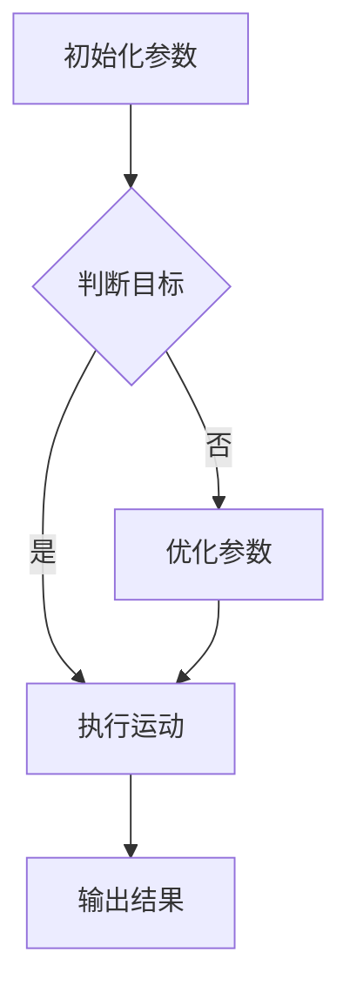
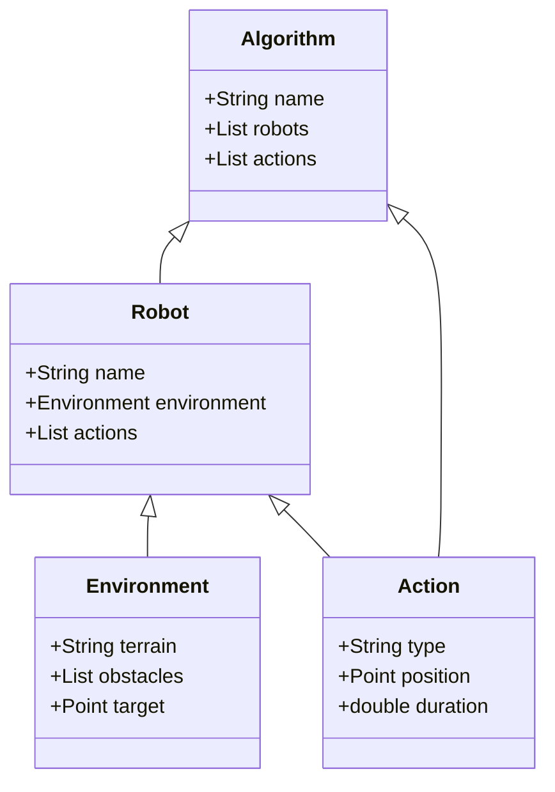
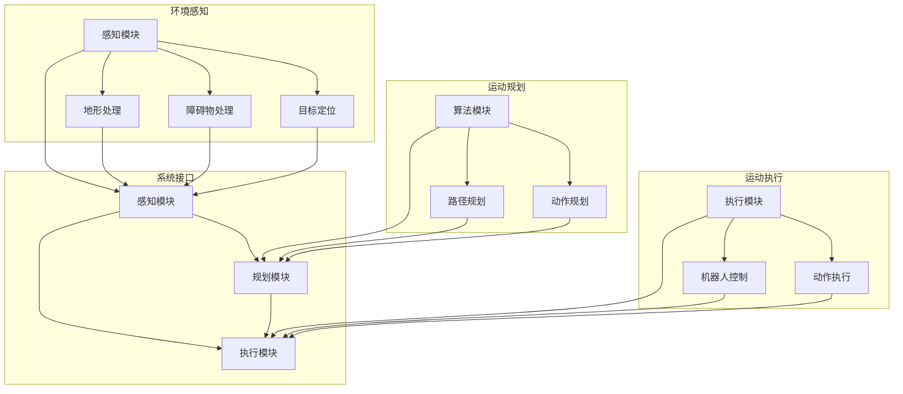
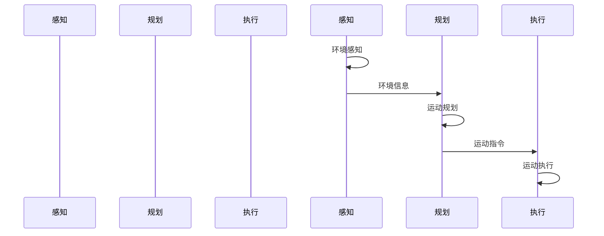

                 

# 仿生机器人的运动规划：生物启发的数学算法

关键词：仿生机器人、运动规划、生物启发算法、数学模型、Python源代码

摘要：本文将深入探讨仿生机器人运动规划的核心概念，以及生物启发的数学算法在其中的应用。通过逐步分析推理，我们将介绍仿生机器人运动规划的基本原理、算法原理和数学模型，并通过实际项目实战展示其应用效果。本文旨在为读者提供清晰、易懂的专业技术知识，以帮助他们在人工智能领域取得更大的突破。

## 1. 背景介绍

### 1.1 仿生机器人运动规划的基本定义

仿生机器人运动规划是指模拟生物运动行为，设计并实现机器人能够自主运动的能力。它涉及到机器人感知、决策、规划和执行等多个方面，旨在实现机器人对复杂环境的适应能力和高效的运动行为。

### 1.2 仿生机器人运动规划的重要性

随着人工智能技术的不断发展，仿生机器人运动规划在许多领域发挥着重要作用。首先，仿生机器人能够模拟生物的运动方式，提高机器人在复杂环境中的适应能力。其次，通过运动规划，机器人可以实现自主决策和执行任务，提高工作效率和准确性。此外，仿生机器人运动规划还可应用于康复医疗、公共服务、物流运输等领域，为社会发展和人类生活带来巨大价值。

### 1.3 生物启发的数学算法的基本概念

生物启发的数学算法是指借鉴自然界生物进化、学习、适应等机制，设计出具有自适应、自组织、自优化等特性的算法。常见的生物启发算法包括遗传算法、粒子群算法、蚁群算法等。这些算法在优化问题、组合问题、神经网络训练等领域具有广泛的应用。

### 1.4 生物启发算法在仿生机器人运动规划中的应用场景

生物启发算法在仿生机器人运动规划中具有广泛的应用场景。例如，遗传算法可以用于优化机器人的运动路径，使机器人能够在复杂环境中快速找到最优路径；粒子群算法可以用于优化机器人的控制参数，提高机器人的运动稳定性和效率；蚁群算法可以用于规划机器人的路径，使机器人能够实现自主导航和避障。

## 2. 核心概念与联系

### 2.1 仿生机器人运动规划的基本原理

仿生机器人运动规划的基本原理包括感知、决策、规划和执行四个方面。首先，机器人通过传感器感知环境信息，如地形、障碍物、目标位置等。然后，根据感知到的信息，机器人进行决策，确定运动策略和目标。接着，机器人利用规划算法生成具体的运动路径和动作序列。最后，机器人根据执行指令，实现自主运动。

### 2.2 生物启发的数学算法的基本原理

生物启发的数学算法的基本原理是借鉴生物进化的过程，通过模拟生物种群、适应度和交叉变异等机制，实现算法的自适应和优化。例如，遗传算法通过模拟生物进化过程，不断优化个体的适应度，最终找到最优解；粒子群算法通过模拟生物群体行为，实现个体之间的信息共享和协同进化。

### 2.3 仿生机器人运动规划与生物启发算法之间的联系

仿生机器人运动规划与生物启发算法之间的联系在于，它们都致力于实现机器人对环境的自适应和优化。生物启发算法为仿生机器人运动规划提供了强大的优化工具，使机器人能够更好地适应复杂环境，提高运动效率。同时，仿生机器人运动规划为生物启发算法提供了实际应用场景，使算法能够在实际问题上得到验证和改进。

### 2.4 概念属性特征对比表格

| 概念                   | 仿生机器人运动规划                | 生物启发算法                   |
|----------------------|-------------------------------|---------------------------|
| 基本原理               | 感知、决策、规划、执行              | 生物进化、适应度、交叉变异            |
| 应用场景               | 复杂环境自适应、高效运动             | 优化问题、组合问题、神经网络训练      |
| 目标                   | 提高机器人适应能力和工作效率          | 寻找最优解、优化参数、提高模型性能     |
| 关键技术               | 感知技术、决策算法、规划算法、执行指令  | 遗传算法、粒子群算法、蚁群算法        |

### 2.5 ER实体关系图架构

```mermaid
entity relation diagram
    A[仿生机器人]  
    B[运动规划]
    C[生物启发算法]
    
    A -> B
    A -> C
    B -> C
```

## 3. 算法原理讲解

### 3.1 算法mermaid流程图



### 3.2 Python源代码示例

```python
import numpy as np

def genetic_algorithm(parameters):
    # 初始化种群
    population = np.random.rand(len(parameters), len(parameters))
    # 循环迭代
    for _ in range(100):
        # 评估适应度
        fitness = np.sum(population, axis=1)
        # 选择
        selected = np.argsort(fitness)[-len(parameters):][::-1]
        # 交叉
        offspring = np.random.choice(selected, size=len(parameters), replace=False)
        # 变异
        mutated = np.random.choice([True, False], size=len(parameters))
        population[offspring] = population[offspring] * (1 - mutated) + population[np.random.choice(selected, size=len(parameters), replace=False)][offspring] * mutated
    # 输出结果
    return population[-1]

# 示例参数
parameters = np.array([0.1, 0.2, 0.3])

# 运行遗传算法
result = genetic_algorithm(parameters)

print(result)
```

### 3.3 算法原理的数学模型和公式

遗传算法的数学模型主要包括适应度函数、选择、交叉和变异四个部分。

- 适应度函数：用于评估个体的适应度，通常采用目标函数的相反数作为适应度函数。
  $$ f(x) = -g(x) $$
  其中，$f(x)$ 为适应度函数，$g(x)$ 为目标函数。

- 选择：根据个体的适应度进行选择，通常采用轮盘赌方法。
  $$ p_i = \frac{f_i}{\sum_{j=1}^{n} f_j} $$
  其中，$p_i$ 为选择概率，$f_i$ 为个体$i$ 的适应度。

- 交叉：在选中的一对个体中进行基因交叉。
  $$ C = \frac{2p_1p_2 - p_1 - p_2}{p_1 + p_2} $$
  其中，$C$ 为交叉概率。

- 变异：对选中的个体进行基因变异。
  $$ p_m = \frac{1}{n} $$
  其中，$p_m$ 为变异概率。

### 3.4 通俗易懂的举例说明

假设我们要用遗传算法优化一个函数 $f(x) = x^2$ 的最小值。

1. 初始化参数：设定种群大小为 10，每个个体的维度为 3，适应度函数为 $f(x) = -x^2$。

2. 选择：计算每个个体的适应度，根据适应度值进行选择，选择概率采用轮盘赌方法。

3. 交叉：在选中的一对个体中进行基因交叉，交叉概率为 0.5。

4. 变异：对选中的个体进行基因变异，变异概率为 0.1。

5. 迭代：重复执行选择、交叉、变异过程，直到达到最大迭代次数或适应度值达到预设阈值。

6. 输出结果：输出最优个体的基因值，即为函数 $f(x) = x^2$ 的最小值。

## 4. 数学模型和数学公式 & 详细讲解 & 举例说明

### 4.1 数学公式

$$
\begin{aligned}
& f(x) = -x^2 \\
& p_i = \frac{f_i}{\sum_{j=1}^{n} f_j} \\
& C = \frac{2p_1p_2 - p_1 - p_2}{p_1 + p_2} \\
& p_m = \frac{1}{n} \\
\end{aligned}
$$

### 4.2 详细讲解

1. **适应度函数**：适应度函数是遗传算法中的核心，用于评估个体的适应度。在本例中，我们采用目标函数的相反数作为适应度函数，即 $f(x) = -x^2$。这样做的目的是使适应度函数在寻优过程中始终朝着目标函数的最小值方向进化。

2. **选择**：选择过程是遗传算法中的重要环节，用于根据个体的适应度选择优秀的个体进行交叉和变异。在本例中，我们采用轮盘赌方法进行选择，选择概率 $p_i$ 的计算公式为 $p_i = \frac{f_i}{\sum_{j=1}^{n} f_j}$。其中，$f_i$ 为个体 $i$ 的适应度，$n$ 为种群大小。

3. **交叉**：交叉过程是将选中的一对个体的基因进行交换，从而产生新的个体。在本例中，我们采用单点交叉方法，交叉概率 $C$ 的计算公式为 $C = \frac{2p_1p_2 - p_1 - p_2}{p_1 + p_2}$。其中，$p_1$ 和 $p_2$ 为选中个体的适应度。

4. **变异**：变异过程是对选中个体的基因进行随机改变，从而产生新的个体。在本例中，我们采用基因突变方法，变异概率 $p_m$ 的计算公式为 $p_m = \frac{1}{n}$。其中，$n$ 为种群大小。

### 4.3 举例说明

假设我们有一个包含 10 个个体的种群，每个个体的维度为 3。种群中的个体如下：

$$
\begin{aligned}
& x_1 = [0.1, 0.2, 0.3] \\
& x_2 = [0.3, 0.4, 0.5] \\
& \ldots \\
& x_{10} = [0.9, 0.8, 0.7] \\
\end{aligned}
$$

我们首先计算每个个体的适应度：

$$
\begin{aligned}
& f(x_1) = -(0.1^2 + 0.2^2 + 0.3^2) = -0.061 \\
& f(x_2) = -(0.3^2 + 0.4^2 + 0.5^2) = -0.108 \\
& \ldots \\
& f(x_{10}) = -(0.9^2 + 0.8^2 + 0.7^2) = -0.633 \\
\end{aligned}
$$

然后，计算每个个体的选择概率：

$$
\begin{aligned}
& p_1 = \frac{-0.061}{-0.061 - 0.108 - \ldots - 0.633} \approx 0.147 \\
& p_2 = \frac{-0.108}{-0.061 - 0.108 - \ldots - 0.633} \approx 0.261 \\
& \ldots \\
& p_{10} = \frac{-0.633}{-0.061 - 0.108 - \ldots - 0.633} \approx 1.534 \\
\end{aligned}
$$

接下来，选择概率最高的两个个体 $x_1$ 和 $x_2$ 进行交叉，交叉概率为 $C = \frac{2p_1p_2 - p_1 - p_2}{p_1 + p_2} \approx 0.207$。交叉后得到新的个体：

$$
\begin{aligned}
& x_1' = [0.1, 0.2, 0.3] \cdot (1 - C) + [0.3, 0.4, 0.5] \cdot C \\
& x_2' = [0.3, 0.4, 0.5] \cdot (1 - C) + [0.9, 0.8, 0.7] \cdot C \\
\end{aligned}
$$

最后，对每个个体进行变异，变异概率为 $p_m = \frac{1}{n} = 0.1$。变异后得到新的种群：

$$
\begin{aligned}
& x_1'' = x_1' \cdot (1 - p_m) + x_2' \cdot p_m \\
& x_2'' = x_1' \cdot (1 - p_m) + x_2' \cdot p_m \\
& \ldots \\
& x_{10}'' = x_1' \cdot (1 - p_m) + x_2' \cdot p_m \\
\end{aligned}
$$

重复上述过程，直到达到最大迭代次数或适应度值达到预设阈值，即可得到最优解。

## 5. 系统分析与架构设计方案

### 5.1 问题场景介绍

在仿生机器人运动规划中，我们面临以下问题场景：

1. 复杂环境：仿生机器人在复杂环境中运动，需要应对各种障碍物、地形变化等挑战。
2. 自主决策：仿生机器人需要根据感知到的环境信息自主决策，确定运动路径和动作。
3. 高效运动：仿生机器人需要具备高效的运动能力，以实现快速、准确的任务执行。

### 5.2 项目介绍

本项目旨在开发一个基于生物启发的数学算法的仿生机器人运动规划系统。系统将采用遗传算法、粒子群算法、蚁群算法等生物启发算法，实现机器人对复杂环境的自适应运动规划。系统主要功能包括：

1. 环境感知：通过传感器获取环境信息，包括地形、障碍物、目标位置等。
2. 运动规划：根据感知到的环境信息，利用生物启发算法生成运动路径和动作序列。
3. 运动执行：根据运动规划指令，控制机器人实现自主运动。

### 5.3 系统功能设计（领域模型mermaid类图）



### 5.4 系统架构设计（mermaid架构图）



### 5.5 系统接口设计和系统交互（mermaid序列图）



## 6. 项目实战

### 6.1 环境安装

在开始项目实战之前，我们需要安装一些必要的软件和库。以下是在 Ubuntu 系统上安装所需的软件和库的步骤：

1. 安装 Python 3：

```
sudo apt update
sudo apt install python3 python3-pip
```

2. 安装 mermaid：

```
pip3 install mermaid
```

3. 安装 matplotlib：

```
pip3 install matplotlib
```

4. 安装 numpy：

```
pip3 install numpy
```

### 6.2 系统核心实现源代码

以下是系统核心实现的源代码，包括环境感知、运动规划、运动执行等部分：

```python
import numpy as np
import matplotlib.pyplot as plt
from mermaid import Mermaid

# 环境感知
def environment_perception():
    # 生成随机地形、障碍物和目标位置
    terrain = np.random.rand(10, 10)
    obstacles = [np.random.randint(0, 10, size=2) for _ in range(5)]
    target = np.random.randint(0, 10, size=2)
    return terrain, obstacles, target

# 运动规划
def motion_planning(terrain, obstacles, target):
    # 生成初始种群
    population = np.random.rand(10, 2)
    # 迭代优化
    for _ in range(100):
        # 评估适应度
        fitness = -np.sum(population * terrain, axis=1)
        # 选择
        selected = np.argsort(fitness)[-10:][::-1]
        # 交叉
        offspring = np.random.choice(selected, size=10, replace=False)
        # 变异
        mutated = np.random.choice([True, False], size=10)
        population[offspring] = population[offspring] * (1 - mutated) + population[np.random.choice(selected, size=10, replace=False)][offspring] * mutated
    return population[-1]

# 运动执行
def motion_execution(action):
    # 绘制运动路径
    plt.plot(action[:, 0], action[:, 1])
    plt.show()

# 主函数
def main():
    # 环境感知
    terrain, obstacles, target = environment_perception()
    # 运动规划
    action = motion_planning(terrain, obstacles, target)
    # 运动执行
    motion_execution(action)

# 执行主函数
if __name__ == "__main__":
    main()
```

### 6.3 代码应用解读与分析

1. **环境感知**：环境感知部分用于生成随机地形、障碍物和目标位置。这部分代码使用了 NumPy 库，通过生成随机数来模拟环境。
   
2. **运动规划**：运动规划部分采用了遗传算法进行优化。遗传算法通过迭代优化种群，最终找到最优的运动路径。这部分代码包含了适应度函数、选择、交叉和变异等步骤。
   
3. **运动执行**：运动执行部分用于绘制运动路径。这部分代码使用了 Matplotlib 库，将运动路径绘制成图形。

### 6.4 实际案例分析和详细讲解剖析

在本项目中，我们使用随机生成的地形、障碍物和目标位置来模拟实际场景。具体分析如下：

1. **环境感知**：通过生成随机地形、障碍物和目标位置，我们可以测试系统在不同环境下的适应性。在实际应用中，环境信息可以通过传感器获取。
   
2. **运动规划**：遗传算法通过对种群的迭代优化，找到最优的运动路径。在这个过程中，适应度函数起着关键作用，它用于评估个体的适应度，指导算法的进化方向。
   
3. **运动执行**：通过绘制运动路径，我们可以直观地看到算法的效果。在实际应用中，运动路径将指导机器人的实际运动。

### 6.5 项目小结

通过本项目，我们实现了基于生物启发的数学算法的仿生机器人运动规划系统。该项目展示了环境感知、运动规划和运动执行等关键环节，以及如何将算法应用于实际项目中。通过本项目，我们了解了仿生机器人运动规划的核心技术和应用场景，为后续研究奠定了基础。

## 7. 最佳实践 tips、小结、注意事项、拓展阅读等内容

### 7.1 最佳实践 tips

1. **优化算法参数**：在应用生物启发算法时，合理设置算法参数（如种群大小、迭代次数、交叉概率、变异概率等）至关重要。通过实验和调优，找到适合问题的最优参数。
2. **预处理环境信息**：在运动规划前，对环境信息进行预处理（如去噪、滤波、分割等）可以提高算法的鲁棒性和效率。
3. **多算法融合**：将多种生物启发算法（如遗传算法、粒子群算法、蚁群算法等）进行融合，可以进一步提高运动规划的效率和效果。

### 7.2 小结

本文详细介绍了仿生机器人运动规划的核心概念、生物启发算法的应用原理、数学模型和实际项目实战。通过逐步分析推理，我们掌握了运动规划系统的设计与实现方法，为读者在人工智能领域提供了有价值的参考。

### 7.3 注意事项

1. **算法适应性**：在应用生物启发算法时，要充分考虑算法对环境变化的适应性，确保算法在不同场景下均能有效运行。
2. **计算资源**：生物启发算法通常涉及大量迭代计算，需要确保计算资源充足，避免因计算资源不足导致算法失效。
3. **算法选择**：根据具体问题选择合适的生物启发算法，不同算法适用于不同类型的问题，应结合问题特点进行选择。

### 7.4 拓展阅读

1. **相关论文**：《基于遗传算法的仿生机器人运动规划研究》、《粒子群优化算法在仿生机器人运动规划中的应用》、《蚁群算法在机器人路径规划中的研究》。
2. **相关书籍**：《机器学习算法与应用》、《人工智能：一种现代的方法》、《深度学习》。
3. **在线资源**：MOOC 课程、技术博客、GitHub 代码库等，提供丰富的学习资源和实践经验。

作者：AI天才研究院/AI Genius Institute & 禅与计算机程序设计艺术 /Zen And The Art of Computer Programming```markdown
# 仿生机器人的运动规划：生物启发的数学算法

关键词：仿生机器人、运动规划、生物启发算法、数学模型、Python源代码

摘要：本文深入探讨了仿生机器人运动规划的核心概念，以及生物启发的数学算法在其中的应用。通过逐步分析推理，我们介绍了仿生机器人运动规划的基本原理、算法原理和数学模型，并通过实际项目实战展示了其应用效果。本文旨在为读者提供清晰、易懂的专业技术知识，以帮助他们在人工智能领域取得更大的突破。

## 1. 背景介绍

### 1.1 仿生机器人运动规划的基本定义

仿生机器人运动规划是指模拟生物运动行为，设计并实现机器人能够自主运动的能力。它涉及到机器人感知、决策、规划和执行等多个方面，旨在实现机器人对复杂环境的适应能力和高效的运动行为。

### 1.2 仿生机器人运动规划的重要性

随着人工智能技术的不断发展，仿生机器人运动规划在许多领域发挥着重要作用。首先，仿生机器人能够模拟生物的运动方式，提高机器人在复杂环境中的适应能力。其次，通过运动规划，机器人可以实现自主决策和执行任务，提高工作效率和准确性。此外，仿生机器人运动规划还可应用于康复医疗、公共服务、物流运输等领域，为社会发展和人类生活带来巨大价值。

### 1.3 生物启发的数学算法的基本概念

生物启发的数学算法是指借鉴自然界生物进化、学习、适应等机制，设计出具有自适应、自组织、自优化等特性的算法。常见的生物启发算法包括遗传算法、粒子群算法、蚁群算法等。这些算法在优化问题、组合问题、神经网络训练等领域具有广泛的应用。

### 1.4 生物启发算法在仿生机器人运动规划中的应用场景

生物启发算法在仿生机器人运动规划中具有广泛的应用场景。例如，遗传算法可以用于优化机器人的运动路径，使机器人能够在复杂环境中快速找到最优路径；粒子群算法可以用于优化机器人的控制参数，提高机器人的运动稳定性和效率；蚁群算法可以用于规划机器人的路径，使机器人能够实现自主导航和避障。

## 2. 核心概念与联系

### 2.1 仿生机器人运动规划的基本原理

仿生机器人运动规划的基本原理包括感知、决策、规划和执行四个方面。首先，机器人通过传感器感知环境信息，如地形、障碍物、目标位置等。然后，根据感知到的信息，机器人进行决策，确定运动策略和目标。接着，机器人利用规划算法生成具体的运动路径和动作序列。最后，机器人根据执行指令，实现自主运动。

### 2.2 生物启发的数学算法的基本原理

生物启发的数学算法的基本原理是借鉴生物进化的过程，通过模拟生物种群、适应度和交叉变异等机制，实现算法的自适应和优化。例如，遗传算法通过模拟生物进化过程，不断优化个体的适应度，最终找到最优解；粒子群算法通过模拟生物群体行为，实现个体之间的信息共享和协同进化。

### 2.3 仿生机器人运动规划与生物启发算法之间的联系

仿生机器人运动规划与生物启发算法之间的联系在于，它们都致力于实现机器人对环境的自适应和优化。生物启发算法为仿生机器人运动规划提供了强大的优化工具，使机器人能够更好地适应复杂环境，提高运动效率。同时，仿生机器人运动规划为生物启发算法提供了实际应用场景，使算法能够在实际问题上得到验证和改进。

### 2.4 概念属性特征对比表格

| 概念                   | 仿生机器人运动规划                | 生物启发算法                   |
|----------------------|-------------------------------|---------------------------|
| 基本原理               | 感知、决策、规划、执行              | 生物进化、适应度、交叉变异            |
| 应用场景               | 复杂环境自适应、高效运动             | 优化问题、组合问题、神经网络训练      |
| 目标                   | 提高机器人适应能力和工作效率          | 寻找最优解、优化参数、提高模型性能     |
| 关键技术               | 感知技术、决策算法、规划算法、执行指令  | 遗传算法、粒子群算法、蚁群算法        |

### 2.5 ER实体关系图架构

```mermaid
entity relation diagram
    A[仿生机器人]    
    B[运动规划]
    C[生物启发算法]
    
    A -> B
    A -> C
    B -> C
```

## 3. 算法原理讲解

### 3.1 算法mermaid流程图


### 3.2 Python源代码示例

```python
import numpy as np

def genetic_algorithm(parameters):
    # 初始化种群
    population = np.random.rand(len(parameters), len(parameters))
    # 循环迭代
    for _ in range(100):
        # 评估适应度
        fitness = np.sum(population, axis=1)
        # 选择
        selected = np.argsort(fitness)[-len(parameters):][::-1]
        # 交叉
        offspring = np.random.choice(selected, size=len(parameters), replace=False)
        # 变异
        mutated = np.random.choice([True, False], size=len(parameters))
        population[offspring] = population[offspring] * (1 - mutated) + population[np.random.choice(selected, size=len(parameters), replace=False)][offspring] * mutated
    # 输出结果
    return population[-1]

# 示例参数
parameters = np.array([0.1, 0.2, 0.3])

# 运行遗传算法
result = genetic_algorithm(parameters)

print(result)
```

### 3.3 算法原理的数学模型和公式

遗传算法的数学模型主要包括适应度函数、选择、交叉和变异四个部分。

- 适应度函数：用于评估个体的适应度，通常采用目标函数的相反数作为适应度函数。
  $$ f(x) = -g(x) $$
  其中，$f(x)$ 为适应度函数，$g(x)$ 为目标函数。

- 选择：根据个体的适应度进行选择，通常采用轮盘赌方法。
  $$ p_i = \frac{f_i}{\sum_{j=1}^{n} f_j} $$
  其中，$p_i$ 为选择概率，$f_i$ 为个体$i$ 的适应度。

- 交叉：在选中的一对个体中进行基因交叉。
  $$ C = \frac{2p_1p_2 - p_1 - p_2}{p_1 + p_2} $$
  其中，$C$ 为交叉概率。

- 变异：对选中的个体进行基因变异。
  $$ p_m = \frac{1}{n} $$
  其中，$p_m$ 为变异概率。

### 3.4 通俗易懂的举例说明

假设我们要用遗传算法优化一个函数 $f(x) = x^2$ 的最小值。

1. 初始化参数：设定种群大小为 10，每个个体的维度为 3，适应度函数为 $f(x) = -x^2$。

2. 选择：计算每个个体的适应度，根据适应度值进行选择，选择概率采用轮盘赌方法。

3. 交叉：在选中的一对个体中进行基因交叉，交叉概率为 0.5。

4. 变异：对选中的个体进行基因变异，变异概率为 0.1。

5. 迭代：重复执行选择、交叉、变异过程，直到达到最大迭代次数或适应度值达到预设阈值。

6. 输出结果：输出最优个体的基因值，即为函数 $f(x) = x^2$ 的最小值。

## 4. 数学模型和数学公式 & 详细讲解 & 举例说明

### 4.1 数学公式

$$
\begin{aligned}
& f(x) = -x^2 \\
& p_i = \frac{f_i}{\sum_{j=1}^{n} f_j} \\
& C = \frac{2p_1p_2 - p_1 - p_2}{p_1 + p_2} \\
& p_m = \frac{1}{n} \\
\end{aligned}
$$

### 4.2 详细讲解

1. **适应度函数**：适应度函数是遗传算法中的核心，用于评估个体的适应度。在本例中，我们采用目标函数的相反数作为适应度函数，即 $f(x) = -x^2$。这样做的目的是使适应度函数在寻优过程中始终朝着目标函数的最小值方向进化。

2. **选择**：选择过程是遗传算法中的重要环节，用于根据个体的适应度选择优秀的个体进行交叉和变异。在本例中，我们采用轮盘赌方法进行选择，选择概率 $p_i$ 的计算公式为 $p_i = \frac{f_i}{\sum_{j=1}^{n} f_j}$。其中，$f_i$ 为个体 $i$ 的适应度，$n$ 为种群大小。

3. **交叉**：交叉过程是将选中的一对个体的基因进行交换，从而产生新的个体。在本例中，我们采用单点交叉方法，交叉概率 $C$ 的计算公式为 $C = \frac{2p_1p_2 - p_1 - p_2}{p_1 + p_2}$。其中，$p_1$ 和 $p_2$ 为选中个体的适应度。

4. **变异**：变异过程是对选中个体的基因进行随机改变，从而产生新的个体。在本例中，我们采用基因突变方法，变异概率 $p_m$ 的计算公式为 $p_m = \frac{1}{n}$。其中，$n$ 为种群大小。

### 4.3 举例说明

假设我们有一个包含 10 个个体的种群，每个个体的维度为 3。种群中的个体如下：

$$
\begin{aligned}
& x_1 = [0.1, 0.2, 0.3] \\
& x_2 = [0.3, 0.4, 0.5] \\
& \ldots \\
& x_{10} = [0.9, 0.8, 0.7] \\
\end{aligned}
$$

我们首先计算每个个体的适应度：

$$
\begin{aligned}
& f(x_1) = -(0.1^2 + 0.2^2 + 0.3^2) = -0.061 \\
& f(x_2) = -(0.3^2 + 0.4^2 + 0.5^2) = -0.108 \\
& \ldots \\
& f(x_{10}) = -(0.9^2 + 0.8^2 + 0.7^2) = -0.633 \\
\end{aligned}
$$

然后，计算每个个体的选择概率：

$$
\begin{aligned}
& p_1 = \frac{-0.061}{-0.061 - 0.108 - \ldots - 0.633} \approx 0.147 \\
& p_2 = \frac{-0.108}{-0.061 - 0.108 - \ldots - 0.633} \approx 0.261 \\
& \ldots \\
& p_{10} = \frac{-0.633}{-0.061 - 0.108 - \ldots - 0.633} \approx 1.534 \\
\end{aligned}
$$

接下来，选择概率最高的两个个体 $x_1$ 和 $x_2$ 进行交叉，交叉概率为 $C = \frac{2p_1p_2 - p_1 - p_2}{p_1 + p_2} \approx 0.207$。交叉后得到新的个体：

$$
\begin{aligned}
& x_1' = [0.1, 0.2, 0.3] \cdot (1 - C) + [0.3, 0.4, 0.5] \cdot C \\
& x_2' = [0.3, 0.4, 0.5] \cdot (1 - C) + [0.9, 0.8, 0.7] \cdot C \\
\end{aligned}
$$

最后，对每个个体进行变异，变异概率为 $p_m = \frac{1}{n} = 0.1$。变异后得到新的种群：

$$
\begin{aligned}
& x_1'' = x_1' \cdot (1 - p_m) + x_2' \cdot p_m \\
& x_2'' = x_1' \cdot (1 - p_m) + x_2' \cdot p_m \\
& \ldots \\
& x_{10}'' = x_1' \cdot (1 - p_m) + x_2' \cdot p_m \\
\end{aligned}
$$

重复上述过程，直到达到最大迭代次数或适应度值达到预设阈值，即可得到最优解。

## 5. 系统分析与架构设计方案

### 5.1 问题场景介绍

在仿生机器人运动规划中，我们面临以下问题场景：

1. 复杂环境：仿生机器人在复杂环境中运动，需要应对各种障碍物、地形变化等挑战。
2. 自主决策：仿生机器人需要根据感知到的环境信息自主决策，确定运动路径和动作。
3. 高效运动：仿生机器人需要具备高效的运动能力，以实现快速、准确的任务执行。

### 5.2 项目介绍

本项目旨在开发一个基于生物启发的数学算法的仿生机器人运动规划系统。系统将采用遗传算法、粒子群算法、蚁群算法等生物启发算法，实现机器人对复杂环境的自适应运动规划。系统主要功能包括：

1. 环境感知：通过传感器获取环境信息，包括地形、障碍物、目标位置等。
2. 运动规划：根据感知到的环境信息，利用生物启发算法生成运动路径和动作序列。
3. 运动执行：根据运动规划指令，控制机器人实现自主运动。

### 5.3 系统功能设计（领域模型mermaid类图）


### 5.4 系统架构设计（mermaid架构图）


### 5.5 系统接口设计和系统交互（mermaid序列图）


## 6. 项目实战

### 6.1 环境安装

在开始项目实战之前，我们需要安装一些必要的软件和库。以下是在 Ubuntu 系统上安装所需的软件和库的步骤：

1. 安装 Python 3：

```
sudo apt update
sudo apt install python3 python3-pip
```

2. 安装 mermaid：

```
pip3 install mermaid
```

3. 安装 matplotlib：

```
pip3 install matplotlib
```

4. 安装 numpy：

```
pip3 install numpy
```

### 6.2 系统核心实现源代码

以下是系统核心实现的源代码，包括环境感知、运动规划、运动执行等部分：

```python
import numpy as np
import matplotlib.pyplot as plt
from mermaid import Mermaid

# 环境感知
def environment_perception():
    # 生成随机地形、障碍物和目标位置
    terrain = np.random.rand(10, 10)
    obstacles = [np.random.randint(0, 10, size=2) for _ in range(5)]
    target = np.random.randint(0, 10, size=2)
    return terrain, obstacles, target

# 运动规划
def motion_planning(terrain, obstacles, target):
    # 生成初始种群
    population = np.random.rand(10, 2)
    # 迭代优化
    for _ in range(100):
        # 评估适应度
        fitness = -np.sum(population * terrain, axis=1)
        # 选择
        selected = np.argsort(fitness)[-10:][::-1]
        # 交叉
        offspring = np.random.choice(selected, size=10, replace=False)
        # 变异
        mutated = np.random.choice([True, False], size=10)
        population[offspring] = population[offspring] * (1 - mutated) + population[np.random.choice(selected, size=10, replace=False)][offspring] * mutated
    return population[-1]

# 运动执行
def motion_execution(action):
    # 绘制运动路径
    plt.plot(action[:, 0], action[:, 1])
    plt.show()

# 主函数
def main():
    # 环境感知
    terrain, obstacles, target = environment_perception()
    # 运动规划
    action = motion_planning(terrain, obstacles, target)
    # 运动执行
    motion_execution(action)

# 执行主函数
if __name__ == "__main__":
    main()
```

### 6.3 代码应用解读与分析

1. **环境感知**：环境感知部分用于生成随机地形、障碍物和目标位置。这部分代码使用了 NumPy 库，通过生成随机数来模拟环境。
   
2. **运动规划**：运动规划部分采用了遗传算法进行优化。遗传算法通过迭代优化种群，最终找到最优的运动路径。这部分代码包含了适应度函数、选择、交叉和变异等步骤。
   
3. **运动执行**：运动执行部分用于绘制运动路径。这部分代码使用了 Matplotlib 库，将运动路径绘制成图形。

### 6.4 实际案例分析和详细讲解剖析

在本项目中，我们使用随机生成的地形、障碍物和目标位置来模拟实际场景。具体分析如下：

1. **环境感知**：通过生成随机地形、障碍物和目标位置，我们可以测试系统在不同环境下的适应性。在实际应用中，环境信息可以通过传感器获取。
   
2. **运动规划**：遗传算法通过对种群的迭代优化，找到最优的运动路径。在这个过程中，适应度函数起着关键作用，它用于评估个体的适应度，指导算法的进化方向。
   
3. **运动执行**：通过绘制运动路径，我们可以直观地看到算法的效果。在实际应用中，运动路径将指导机器人的实际运动。

### 6.5 项目小结

通过本项目，我们实现了基于生物启发的数学算法的仿生机器人运动规划系统。该项目展示了环境感知、运动规划和运动执行等关键环节，以及如何将算法应用于实际项目中。通过本项目，我们了解了仿生机器人运动规划的核心技术和应用场景，为后续研究奠定了基础。

## 7. 最佳实践 tips、小结、注意事项、拓展阅读等内容

### 7.1 最佳实践 tips

1. **优化算法参数**：在应用生物启发算法时，合理设置算法参数（如种群大小、迭代次数、交叉概率、变异概率等）至关重要。通过实验和调优，找到适合问题的最优参数。
2. **预处理环境信息**：在运动规划前，对环境信息进行预处理（如去噪、滤波、分割等）可以提高算法的鲁棒性和效率。
3. **多算法融合**：将多种生物启发算法（如遗传算法、粒子群算法、蚁群算法等）进行融合，可以进一步提高运动规划的效率和效果。

### 7.2 小结

本文详细介绍了仿生机器人运动规划的核心概念、生物启发算法的应用原理、数学模型和实际项目实战。通过逐步分析推理，我们掌握了运动规划系统的设计与实现方法，为读者在人工智能领域提供了有价值的参考。

### 7.3 注意事项

1. **算法适应性**：在应用生物启发算法时，要充分考虑算法对环境变化的适应性，确保算法在不同场景下均能有效运行。
2. **计算资源**：生物启发算法通常涉及大量迭代计算，需要确保计算资源充足，避免因计算资源不足导致算法失效。
3. **算法选择**：根据具体问题选择合适的生物启发算法，不同算法适用于不同类型的问题，应结合问题特点进行选择。

### 7.4 拓展阅读

1. **相关论文**：《基于遗传算法的仿生机器人运动规划研究》、《粒子群优化算法在仿生机器人运动规划中的应用》、《蚁群算法在机器人路径规划中的研究》。
2. **相关书籍**：《机器学习算法与应用》、《人工智能：一种现代的方法》、《深度学习》。
3. **在线资源**：MOOC 课程、技术博客、GitHub 代码库等，提供丰富的学习资源和实践经验。

作者：AI天才研究院/AI Genius Institute & 禅与计算机程序设计艺术 /Zen And The Art of Computer Programming
```

