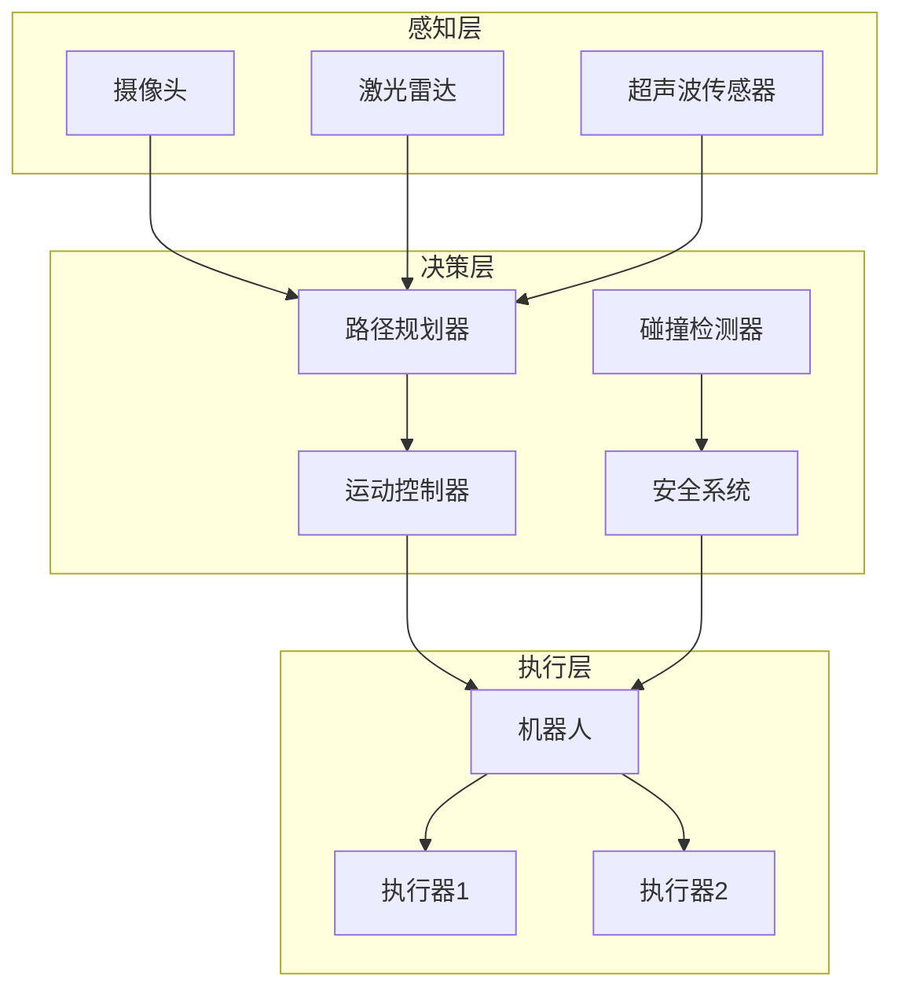
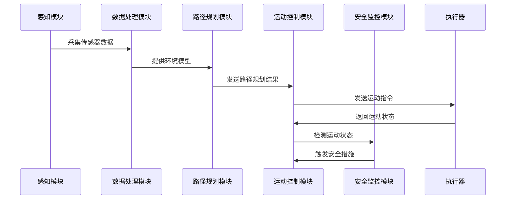

                 


### 1.1.1 仿生机器人运动规划的重要性

在当前科技飞速发展的时代，机器人技术已经成为世界各国争夺的高地，其中仿生机器人由于其独特的结构和功能，备受科研和工业界的关注。仿生机器人是指模仿自然界中生物的结构、功能和行为设计的机器人。运动规划作为仿生机器人的核心技术之一，其重要性体现在以下几个方面：

首先，运动规划是仿生机器人的核心驱动力。无论是执行复杂任务还是适应多变环境，仿生机器人都需要精准、高效的运动规划来保证任务的顺利完成。例如，在搜索救援任务中，仿生机器人需要能够根据地形变化灵活调整运动策略，以提高搜索效率和成功率。

其次，运动规划是实现仿生机器人自主性的关键。仿生机器人在执行任务时，往往需要面对不确定的环境和复杂的情况。通过运动规划，机器人可以根据感知信息自主决策，规划出合适的运动路径和策略，从而实现自主导航和任务执行。

再次，运动规划有助于提高仿生机器人的智能化水平。随着人工智能技术的发展，运动规划算法正逐渐融入深度学习、强化学习等先进技术，使仿生机器人能够更好地理解和适应环境，提高其自主学习和决策能力。

最后，运动规划在仿生机器人领域具有广泛的应用前景。从工业生产到医疗护理，从环境监测到灾害救援，仿生机器人的运动规划都在不断拓展其应用范围，为人类社会带来更多便利。

### 1.1.2 仿生机器人运动规划的发展历程

仿生机器人运动规划的发展历程可以追溯到上世纪五六十年代。当时，随着计算机技术的兴起，科学家们开始尝试将生物运动机制应用到机器人设计上。早期的运动规划主要基于规则和经验，缺乏系统性和精确性。随着人工智能技术的发展，特别是控制理论和计算机视觉的进步，运动规划技术逐渐走向成熟。

在1970年代至1980年代，仿真技术开始应用于机器人运动规划，通过模拟生物运动来优化机器人行为。这一时期，专家系统成为运动规划的主流算法，但存在一定的局限性，难以应对复杂多变的现实环境。

进入1990年代，随着机器人感知能力的提高和计算资源的丰富，基于传感器的运动规划技术得到了快速发展。特别是模糊逻辑、神经网络等智能算法的应用，使机器人能够更加准确地感知环境，并实时调整运动策略。

21世纪以来，随着人工智能和机器学习技术的突破，运动规划算法朝着更加智能化和自适应的方向发展。深度学习、强化学习等算法的引入，使仿生机器人在复杂环境中的运动能力得到了显著提升。

### 1.1.3 本书的研究目标与结构

本书的研究目标是深入探讨仿生机器人运动规划中的生物灵感数学实现，旨在通过生物运动原理的分析，构建出具有高度自适应性和灵活性的运动规划算法，并将其应用于实际仿生机器人系统中。全书分为四个部分，共11章，结构如下：

**第一部分：引言**
- 第1章：问题背景与概述

**第二部分：核心概念与联系**
- 第2章：仿生机器人运动规划基础
- 第3章：生物运动原理分析

**第三部分：生物灵感的数学实现**
- 第4章：生物灵感运动规划算法
- 第5章：算法原理讲解

**第四部分：系统分析与架构设计**
- 第6章：系统功能设计
- 第7章：系统架构设计
- 第8章：系统交互设计

**第五部分：项目实战**
- 第9章：环境安装与准备
- 第10章：实际案例分析
- 第11章：最佳实践与总结

本书通过系统性地阐述运动规划的基础知识、生物运动原理、生物灵感算法原理与实现，以及系统架构和项目实战，旨在为读者提供一套完整的仿生机器人运动规划解决方案。

### 2.1.1 仿生机器人概述

#### 2.1.1.1 定义与分类

仿生机器人（Bionic Robots）是指通过模仿自然界中生物的结构、功能和行为来设计的机器人。这些机器人通常具有类似于生物的感知能力、运动能力和自适应能力。仿生机器人的定义可以从以下几个方面进行解读：

首先，仿生机器人模仿了自然界中生物的某些特性。例如，昆虫的视觉系统、鱼类的游动方式、鸟类的飞行机制等。通过模仿这些特性，科学家们可以设计出具有高效能量利用、灵活运动和高度适应性的机器人。

其次，仿生机器人具有与生物相似的功能。它们可以通过各种传感器感知环境，根据感知信息进行决策，并自主执行任务。例如，仿生机器人可以被用于搜索救援、环境监测、医疗护理、工业生产等领域。

根据仿生机器人的设计理念和应用场景，可以将其分为以下几类：

1. **结构仿生机器人**：这类机器人模仿了特定生物的结构，例如，蝴蝶的翅膀结构、螃蟹的腿结构等。结构仿生机器人通常具有较强的运动能力和灵活性。

2. **功能仿生机器人**：这类机器人则更侧重于模仿生物的功能，例如，仿生视觉系统、仿生触觉系统等。功能仿生机器人通常在感知和执行任务方面表现出较高的性能。

3. **综合仿生机器人**：这类机器人结合了结构仿生和功能仿生的特点，既具有类似生物的结构，也具备类似生物的功能。例如，一些仿生机器人可以通过模仿鱼类的游动方式和昆虫的感知系统，实现高效的环境适应和任务执行。

#### 2.1.1.2 仿生机器人特点

仿生机器人具有以下几个显著特点：

1. **高适应性**：仿生机器人能够根据环境变化灵活调整其行为和策略。例如，通过模仿昆虫的感知系统，仿生机器人可以在复杂环境中实现自主导航。

2. **高效能量利用**：仿生机器人通常设计有类似于生物的能量利用机制，例如，通过模仿鱼类的游动方式，可以显著降低能量消耗。

3. **多功能性**：仿生机器人可以执行多种任务，例如，通过模仿鸟类的飞行机制，可以在不同环境中进行高效的任务执行。

4. **智能感知**：仿生机器人通常配备了各种传感器，可以感知环境中的信息，并根据这些信息进行决策。

5. **自主性**：仿生机器人能够在没有人类干预的情况下自主执行任务，这是仿生机器人区别于传统机器人的重要特点。

### 2.1.2 运动规划基础

#### 2.1.2.1 运动规划的概念与任务

运动规划（Motion Planning）是指为机器人或其他自主移动体生成从初始状态到目标状态的路径和动作序列的过程。运动规划的核心目标是确保机器人能够在动态环境中安全、高效地到达目标位置。运动规划可以定义为一个多步骤的过程，包括以下几个关键任务：

1. **环境建模**：首先，需要对环境进行建模，以便机器人能够理解其所在的环境。环境建模包括静态障碍物、动态障碍物、机器人自身的几何形状和尺寸等。

2. **路径生成**：在环境建模的基础上，生成一条从初始位置到目标位置的路径。路径生成的目标是在满足约束条件（如避障、能量消耗等）的前提下，找到一条最优或次优路径。

3. **动作规划**：一旦路径生成，需要为机器人规划出一系列动作，使得机器人能够沿着路径到达目标位置。动作规划需要考虑机器人的动力学模型、控制策略和执行能力。

4. **实时调整**：在实际执行过程中，环境可能会发生变化，例如，障碍物的出现或移动。运动规划需要具备实时调整的能力，确保机器人能够适应新的环境。

#### 2.1.2.2 运动规划的层次结构

运动规划可以分为多个层次，每个层次都有其特定的任务和目标。常见的运动规划层次结构包括以下几种：

1. **低层次运动规划**：低层次运动规划主要涉及机器人的关节运动或轮式机器人的轮子运动。这类规划需要考虑机器人的动力学模型，确保每个关节或轮子能够按照规划的路径运动。

2. **中层次运动规划**：中层次运动规划关注机器人的整体运动，例如，机器人的身体姿态调整、腿部运动等。这类规划需要考虑机器人的空间几何形状和运动学约束。

3. **高层次运动规划**：高层次运动规划通常涉及机器人的任务执行策略，例如，路径选择、目标点规划、任务分配等。这类规划需要考虑机器人的感知系统、控制策略和自主性要求。

4. **全局运动规划**：全局运动规划通常关注机器人从初始位置到目标位置的总体路径规划。这类规划需要考虑全局障碍物、能量消耗和路径优化等。

5. **局部运动规划**：局部运动规划主要关注机器人当前环境的细节处理，例如，如何避开即将遇到的障碍物、如何通过狭窄通道等。这类规划通常需要实时调整，以应对环境变化。

#### 2.1.2.3 概念属性特征对比表格

在运动规划中，有几个关键概念和属性特征需要理解。以下是一个简单的概念属性特征对比表格：

| 概念        | 定义                                                         | 属性特征                   | 对比分析                    |
|-------------|--------------------------------------------------------------|----------------------------|-----------------------------|
| 环境建模    | 对机器人所在环境进行建模                                     | 确定性、不确定性、动态性     | 静态环境与动态环境的建模差异 |
| 路径生成    | 生成从初始位置到目标位置的路径                               | 最优性、可行性、安全性       | 不同算法对路径质量的影响     |
| 动作规划    | 规划出机器人执行路径所需的动作序列                           | 时序性、平滑性、可执行性     | 不同控制策略的动作规划效果   |
| 实时调整    | 根据环境变化实时调整机器人的路径和动作                       | 灵活性、响应时间、稳定性     | 实时调整与延迟调整的优劣比较 |
| 低层次运动规划 | 规划机器人关节或轮子的运动                                  | 非线性动力学、运动学约束     | 与中层次、高层次规划的差异   |
| 中层次运动规划 | 规划机器人整体运动，如身体姿态调整、腿部运动等               | 全局几何形状、运动学约束     | 与低层次、高层次规划的差异   |
| 高层次运动规划 | 规划机器人任务执行策略，如路径选择、目标点规划、任务分配等   | 感知信息、自主决策、任务优先级 | 与低层次、中层次规划的差异   |
| 全局运动规划 | 规划机器人从初始位置到目标位置的总体路径                     | 全局障碍物、能量消耗、路径优化 | 与局部运动规划的差异         |
| 局部运动规划 | 处理机器人当前环境的细节，如避开障碍物、通过狭窄通道等     | 环境细节、实时调整、适应性     | 与全局运动规划的差异         |

通过这个对比表格，我们可以更清晰地理解运动规划中各个概念和属性特征的区别和联系。

### 2.1.3 概念属性特征对比表格

在运动规划中，有几个关键概念和属性特征需要理解。以下是一个简单的概念属性特征对比表格：

| 概念        | 定义                                                         | 属性特征                   | 对比分析                    |
|-------------|--------------------------------------------------------------|----------------------------|-----------------------------|
| 环境建模    | 对机器人所在环境进行建模                                     | 确定性、不确定性、动态性     | 静态环境与动态环境的建模差异 |
| 路径生成    | 生成从初始位置到目标位置的路径                               | 最优性、可行性、安全性       | 不同算法对路径质量的影响     |
| 动作规划    | 规划出机器人执行路径所需的动作序列                           | 时序性、平滑性、可执行性     | 不同控制策略的动作规划效果   |
| 实时调整    | 根据环境变化实时调整机器人的路径和动作                       | 灵活性、响应时间、稳定性     | 实时调整与延迟调整的优劣比较 |
| 低层次运动规划 | 规划机器人关节或轮子的运动                                  | 非线性动力学、运动学约束     | 与中层次、高层次规划的差异   |
| 中层次运动规划 | 规划机器人整体运动，如身体姿态调整、腿部运动等               | 全局几何形状、运动学约束     | 与低层次、高层次规划的差异   |
| 高层次运动规划 | 规划机器人任务执行策略，如路径选择、目标点规划、任务分配等   | 感知信息、自主决策、任务优先级 | 与低层次、中层次规划的差异   |
| 全局运动规划 | 规划机器人从初始位置到目标位置的总体路径                     | 全局障碍物、能量消耗、路径优化 | 与局部运动规划的差异         |
| 局部运动规划 | 处理机器人当前环境的细节，如避开障碍物、通过狭窄通道等     | 环境细节、实时调整、适应性     | 与全局运动规划的差异         |

通过这个对比表格，我们可以更清晰地理解运动规划中各个概念和属性特征的区别和联系。

### 2.1.4 ER实体关系图

为了更好地理解仿生机器人运动规划中的各个实体及其关系，我们可以使用实体关系图（Entity-Relationship Diagram, ERD）来描述。以下是仿生机器人运动规划相关的ER实体关系图：

```mermaid
erDiagram
    User ||--|{ Robot } : controls
    Robot ||--|{ Sensor } : reads from
    Robot ||--|{ Actuator } : moves through
    Environment ||--|{ Obstacle } : contains
    Algorithm ||--|{ Path } : generates
    Algorithm ||--|{ Action } : plans
```

**实体说明：**

- **User（用户）**：用户是操作仿生机器人的主体，负责启动、停止和监控机器人的运行。
- **Robot（机器人）**：机器人是仿生机器人系统的核心，具有感知、决策和执行任务的能力。
- **Sensor（传感器）**：传感器用于感知环境信息，如障碍物位置、地形特征等。
- **Actuator（执行器）**：执行器负责根据运动规划生成动作，驱动机器人移动。
- **Environment（环境）**：环境包括机器人运行的所有场景和障碍物，对运动规划有重要影响。
- **Obstacle（障碍物）**：障碍物是环境中可能影响机器人运动规划的对象。
- **Algorithm（算法）**：算法是运动规划的核心，用于生成路径和动作规划。
- **Path（路径）**：路径是机器人从初始位置到目标位置的可行轨迹。
- **Action（动作）**：动作是机器人执行的具体行为，如移动、转向等。

**关系说明：**

- **User（用户）** 与 **Robot（机器人）** 之间存在控制关系，用户可以通过传感器读取机器人的状态，并控制其行动。
- **Robot（机器人）** 与 **Sensor（传感器）**、**Actuator（执行器）** 之间存在读取和驱动关系，机器人通过传感器感知环境，并通过执行器执行动作。
- **Environment（环境）** 与 **Obstacle（障碍物）** 之间存在包含关系，环境包括所有可能影响机器人运动的障碍物。
- **Algorithm（算法）** 与 **Path（路径）**、**Action（动作）** 之间存在生成和规划关系，算法生成路径和动作规划，以实现机器人的运动目标。

通过这个ER实体关系图，我们可以清晰地看到仿生机器人运动规划中各个实体及其之间的关系，有助于我们深入理解运动规划的实现机制和流程。

### 3.1.1 神经系统控制原理

#### 3.1.1.1 神经元结构与功能

神经系统的基本单位是神经元（Neuron），神经元通过电信号传递信息，实现大脑与身体各部分之间的沟通。神经元的基本结构包括以下几个部分：

1. **细胞体（Soma）**：细胞体是神经元的中心部分，包含细胞核和大部分细胞器，是神经元的能量供应和代谢中心。
2. **树突（Dendrites）**：树突是神经元从细胞体延伸出来的树枝状突起，用于接收其他神经元传递来的电信号。
3. **轴突（Axon）**：轴突是神经元从细胞体延伸出来的长而细的突起，负责将电信号传递到其他神经元或肌肉细胞。
4. **突触（Synapse）**：突触是神经元之间的连接点，通过化学递质或电信号传递信息。

神经元通过以下过程实现信息的传递和传递：

1. **信号接收**：当树突接收到来自其他神经元的电信号时，这些信号会导致细胞膜上的电位变化。
2. **电位变化**：电位变化导致神经元的细胞膜产生动作电位（Action Potential），动作电位是一种电信号，沿着轴突传递。
3. **信号传递**：动作电位到达轴突末梢时，会触发突触前膜释放神经递质（Neurotransmitters），神经递质通过突触间隙传递到突触后膜，影响突触后神经元的电位变化。
4. **信号传递结果**：如果突触后神经元的电位变化达到了阈电位（Threshold Potential），则会触发新的动作电位，从而继续传递信号。

#### 3.1.1.2 神经网络建模

神经网络（Neural Network）是一种模拟生物神经系统的计算模型，广泛应用于机器学习和人工智能领域。神经网络的基本构建单元是人工神经元（Artificial Neuron），其结构与生物神经元类似，但功能有所不同。

一个典型的人工神经元可以表示为：

\[ z = \sum_{i=1}^{n} w_i \cdot x_i + b \]

其中：
- \( z \) 是神经元输出的净输入；
- \( w_i \) 是第 \( i \) 个输入的权重；
- \( x_i \) 是第 \( i \) 个输入值；
- \( b \) 是偏置项。

人工神经元的激活函数（Activation Function）用于将净输入转换为一个输出值。常见的激活函数包括：

1. **线性激活函数**：\( f(x) = x \)，不引入非线性特性，常用于神经网络的中间层。
2. ** sigmoid 激活函数**：\( f(x) = \frac{1}{1 + e^{-x}} \)，将输出值映射到 \( (0, 1) \) 范围内，常用于分类问题。
3. **ReLU（Rectified Linear Unit）激活函数**：\( f(x) = \max(0, x) \)，在输入为负时将其设置为0，有助于加速神经网络的训练。

神经网络通常由多个层次组成，包括输入层、隐藏层和输出层。每个层次包含多个神经元，神经元之间通过连接（权重）相互连接。神经网络通过反向传播算法（Backpropagation Algorithm）来更新权重，优化网络的输出。

#### 3.1.1.3 神经网络建模在运动规划中的应用

神经网络在运动规划中的应用主要集中在两个方面：路径规划和动作控制。

1. **路径规划**：神经网络可以用于生成从初始位置到目标位置的路径。通过训练神经网络，使其能够根据环境信息预测最安全的路径。例如，可以采用卷积神经网络（CNN）来处理环境图像，通过学习图像特征生成路径。

2. **动作控制**：神经网络可以用于规划机器人执行路径的动作序列。通过训练神经网络，使其能够根据路径信息和机器人状态生成最优动作。例如，可以采用递归神经网络（RNN）来处理时序数据，生成连续的动作序列。

以下是一个简单的神经网络路径规划模型的示例：

```python
import numpy as np

# 初始化神经网络参数
weights = np.random.rand(input_size, hidden_size, output_size)
biases = np.random.rand(hidden_size, output_size)

# 定义激活函数
def sigmoid(x):
    return 1 / (1 + np.exp(-x))

# 定义神经网络模型
def forward_pass(inputs, weights, biases):
    hidden_layer = sigmoid(np.dot(inputs, weights[0]) + biases[0])
    output_layer = sigmoid(np.dot(hidden_layer, weights[1]) + biases[1])
    return output_layer

# 训练神经网络
def train_network(inputs, targets, epochs):
    for epoch in range(epochs):
        outputs = forward_pass(inputs, weights, biases)
        error = outputs - targets
        dweights = [np.dot(inputs.T, error * sigmoid_derivative(outputs)), np.dot(hidden_layer.T, error * sigmoid_derivative(hidden_layer))]
        dbiases = [error * sigmoid_derivative(hidden_layer), error * sigmoid_derivative(outputs)]
        weights += dweights
        biases += dbiases

# 神经网络路径规划模型示例
input_size = 100
hidden_size = 50
output_size = 2

# 假设输入为环境特征，输出为目标位置
inputs = np.random.rand(input_size, 1)
targets = np.array([[1.0, 2.0], [3.0, 4.0]])

# 训练神经网络
train_network(inputs, targets, 1000)
```

这个示例使用了一个简单的两层神经网络进行路径规划，输入是环境特征，输出是目标位置。通过训练，神经网络可以学习到如何根据环境特征生成最佳路径。在实际应用中，可以根据具体需求调整网络结构、激活函数和训练方法，以提高路径规划的准确性和效率。

### 3.1.2 生物运动策略分析

生物运动策略是指生物在运动过程中所采用的方法和策略，这些策略使得生物能够在复杂多变的环境中高效、安全地移动。生物运动策略的研究对于仿生机器人运动规划具有重要的启示作用。以下将分析几种典型的生物运动策略：

#### 3.1.2.1 鱼类运动策略

鱼类是水生生物中运动能力最强的之一，其运动策略主要包括以下几个方面：

1. **波动型运动**：鱼类通过身体的波动产生推力，以实现前进和转向。鱼类的波动型运动具有较高的能量利用效率和灵活性。

2. **共振运动**：鱼类通过调整身体的摆动频率与周围水流的共振，以获得额外的推进力。这种策略在鱼类长距离游动中表现出色。

3. **侧线感知**：鱼类拥有侧线感知系统，可以感知周围水流和地形变化，从而调整运动策略，避免碰撞和障碍。

4. **群体协作**：在群体游动中，鱼类通过同步摆动和互相协作，实现高效的群体移动，这种策略在鱼群捕食和逃避天敌时尤为重要。

#### 3.1.2.2 昆虫运动策略

昆虫是陆地上多样化的生物群体，其运动策略多种多样，以下是一些典型的昆虫运动策略：

1. **跳跃运动**：许多昆虫如蝗虫、蟋蟀等通过腿部肌肉的快速收缩和伸展实现跳跃运动，这种策略使昆虫能够在复杂地形中快速移动。

2. **爬行运动**：昆虫如蚂蚁、蜘蛛等通过爬行运动适应各种地形。爬行运动包括腿部交替前行、腿部伸缩等，具有很高的灵活性。

3. **飞行运动**：昆虫如蜜蜂、蝴蝶等通过翅膀的快速振动实现飞行运动。飞行运动不仅使昆虫能够迅速到达目标，还能在空中进行灵活转向和悬停。

4. **感知导航**：昆虫如蜜蜂在飞行过程中会利用太阳位置、地标和气味等信息进行导航。这种感知导航策略使昆虫能够在无视觉的环境中准确找到目标。

#### 3.1.2.3 生物运动策略在仿生机器人中的应用

生物运动策略对于仿生机器人的设计具有重要的启示作用。以下是一些生物运动策略在仿生机器人中的应用：

1. **波动推进**：仿生机器人可以模仿鱼类的波动型运动，通过机械臂或柔性结构的波动产生推进力，实现高效移动。

2. **共振推进**：仿生机器人可以采用共振运动策略，通过调整结构摆动频率与周围环境的共振，实现额外的推进力。

3. **侧线感知**：仿生机器人可以配备侧线感知系统，通过传感器感知周围环境变化，调整运动策略，提高移动安全性。

4. **群体协作**：仿生机器人可以通过群体协作实现高效的移动和任务执行，例如，多个机器人协同完成搜救任务。

5. **跳跃移动**：仿生机器人可以模仿昆虫的跳跃运动，通过腿部机械结构实现快速移动，适应复杂地形。

6. **爬行移动**：仿生机器人可以模仿昆虫和爬行动物的爬行运动，通过多足结构或柔性结构适应不同地形。

7. **飞行移动**：仿生机器人可以模仿昆虫的飞行运动，通过电动翅膀或气动结构实现空中移动和灵活转向。

通过借鉴生物运动策略，仿生机器人可以设计出更加高效、灵活、安全的运动机制，从而在各种复杂环境中发挥更大的作用。

### 4.1.1 鱼类运动规划算法

鱼类运动规划算法是仿生机器人运动规划中的重要研究方向，因为鱼类在水中具有出色的运动能力和适应性。以下将介绍几种常见的鱼类运动规划算法：

#### 4.1.1.1 鱼类运动模型

鱼类运动模型主要基于生物力学和运动学原理，通过数学模型描述鱼类的运动行为。鱼类运动模型包括以下几个方面：

1. **生物力学模型**：生物力学模型通过分析鱼类身体结构和运动产生的力，建立鱼类的动力学模型。这个模型通常包括鱼类的质量、刚度、阻力和推力等参数。

2. **运动学模型**：运动学模型描述鱼类的运动轨迹和姿态变化。这通常通过几何学和运动学方程来实现，例如，通过分析鱼类的身体摆动和尾鳍运动，描述鱼类的速度、加速度和姿态。

3. **神经网络模型**：神经网络模型通过模拟鱼类神经系统的功能，建立鱼类的运动控制模型。这种模型通常包括输入层、隐藏层和输出层，用于处理感知信息并生成运动指令。

#### 4.1.1.2 鱼类运动控制算法

鱼类运动控制算法是实现鱼类运动模型的核心。以下介绍几种常见的鱼类运动控制算法：

1. **遗传算法（Genetic Algorithm, GA）**：遗传算法是一种基于自然选择和遗传机制的优化算法，适用于复杂非线性问题的求解。在鱼类运动控制中，遗传算法可以用于优化鱼类的摆动频率、幅度和相位等参数，以实现最佳运动性能。

2. **粒子群优化算法（Particle Swarm Optimization, PSO）**：粒子群优化算法是一种基于群体智能的优化算法，通过模拟鸟群或鱼群的社会行为进行优化。在鱼类运动控制中，PSO可以用于优化鱼类的运动路径和策略，以提高搜索效率和适应性。

3. **反向传播神经网络（Backpropagation Neural Network, BPNN）**：反向传播神经网络是一种常用的深度学习算法，通过多层神经网络模拟生物神经系统的功能。在鱼类运动控制中，BPNN可以用于处理复杂的感知信息，生成最优的运动指令。

4. **模糊控制（Fuzzy Control）**：模糊控制是一种基于模糊逻辑的控制方法，适用于处理不确定性和非线性问题。在鱼类运动控制中，模糊控制可以用于根据环境变化实时调整鱼类的运动策略，以提高适应性和稳定性。

#### 4.1.1.3 鱼类运动规划算法的示例

以下是一个简单的鱼类运动规划算法示例，使用遗传算法优化鱼类的摆动参数：

```python
import numpy as np
import matplotlib.pyplot as plt

# 遗传算法参数
population_size = 100
 generations = 100
 mutation_rate = 0.05

# 鱼类运动参数
num_joints = 5
joint_range = [0, 2 * np.pi]
joint_speed_limit = 1

# 初始化种群
population = np.random.uniform(joint_range[0], joint_range[1], (population_size, num_joints))

# 适应度函数
def fitness_function(phenotype):
    # 计算鱼类的速度和加速度
    velocity = np.gradient(phenotype, 0.01)
    acceleration = np.gradient(velocity, 0.01)
    
    # 计算适应度
    fitness = np.linalg.norm(velocity) + np.linalg.norm(acceleration)
    return fitness

# 遗传操作
def genetic_operations(population, fitness_values):
    # 选择
    selected_indices = np.argsort(fitness_values)[:population_size // 2]
    selected_population = population[selected_indices]
    
    # 交叉
    crossover_points = np.random.randint(0, num_joints, population_size // 2)
    crossed_population = np.zeros_like(selected_population)
    crossed_population[:, crossover_points] = (selected_population[:, crossover_points] + selected_population[:, crossover_points + num_joints]) / 2
    
    # 变异
    mutated_population = crossed_population
    mutation_indices = np.random.choice(num_joints, size=population_size, replace=True)
    mutated_population[mutation_indices] = np.random.uniform(joint_range[0], joint_range[1], population_size)
    
    return mutated_population

# 运动规划
def motion_planning():
    for generation in range(generations):
        # 计算适应度
        fitness_values = np.array([fitness_function(individual) for individual in population])
        
        # 遗传操作
        population = genetic_operations(population, fitness_values)
        
        # 绘制最佳个体
        best_individual = population[np.argmin(fitness_values)]
        plt.plot(np.cumsum(np.cos(best_individual)), np.cumsum(np.sin(best_individual)), label=f'Generation {generation}')
        
    plt.xlabel('X Position')
    plt.ylabel('Y Position')
    plt.legend()
    plt.show()

# 运动规划演示
motion_planning()
```

在这个示例中，遗传算法用于优化鱼类的摆动参数，以实现最佳速度和加速度。通过多次迭代，算法可以找到一组最优参数，使鱼类在水中实现高效的游动。在实际应用中，可以根据具体需求调整算法参数和运动模型，以提高运动规划和控制效果。

### 4.1.2 昆虫运动规划算法

昆虫在陆地上具有多种灵活的运动策略，这些策略对于仿生机器人运动规划具有重要的参考价值。以下介绍几种常见的昆虫运动规划算法：

#### 4.1.2.1 昆虫运动模型

昆虫运动模型主要基于昆虫的生理结构和运动机制，通过数学和物理模型描述昆虫的运动行为。昆虫运动模型通常包括以下几个方面：

1. **力学模型**：力学模型通过分析昆虫身体的刚度和惯性，建立昆虫的动力学模型。这通常包括昆虫的质量分布、关节刚度、肌肉力量等参数。

2. **运动学模型**：运动学模型描述昆虫的运动轨迹和姿态变化。这通常通过几何学和运动学方程来实现，例如，通过分析昆虫的腿结构和步态，描述昆虫的速度、加速度和姿态。

3. **感知模型**：感知模型描述昆虫的感知系统和决策过程，包括视觉、触觉、嗅觉等感知方式。通过模拟昆虫的感知机制，可以更好地理解昆虫的运动策略和适应性。

#### 4.1.2.2 昆虫运动控制算法

昆虫运动控制算法是实现昆虫运动模型的核心。以下介绍几种常见的昆虫运动控制算法：

1. **遗传算法（Genetic Algorithm, GA）**：遗传算法是一种基于自然选择和遗传机制的优化算法，适用于复杂非线性问题的求解。在昆虫运动控制中，遗传算法可以用于优化昆虫的步态、步频和步长等参数，以实现最佳运动性能。

2. **粒子群优化算法（Particle Swarm Optimization, PSO）**：粒子群优化算法是一种基于群体智能的优化算法，通过模拟鸟群或鱼群的社会行为进行优化。在昆虫运动控制中，PSO可以用于优化昆虫的运动路径和策略，以提高搜索效率和适应性。

3. **反向传播神经网络（Backpropagation Neural Network, BPNN）**：反向传播神经网络是一种常用的深度学习算法，通过多层神经网络模拟生物神经系统的功能。在昆虫运动控制中，BPNN可以用于处理复杂的感知信息，生成最优的运动指令。

4. **模糊控制（Fuzzy Control）**：模糊控制是一种基于模糊逻辑的控制方法，适用于处理不确定性和非线性问题。在昆虫运动控制中，模糊控制可以用于根据环境变化实时调整昆虫的运动策略，以提高适应性和稳定性。

#### 4.1.2.3 昆虫运动规划算法的示例

以下是一个简单的昆虫运动规划算法示例，使用遗传算法优化昆虫的步态参数：

```python
import numpy as np
import matplotlib.pyplot as plt

# 遗传算法参数
population_size = 100
 generations = 100
 mutation_rate = 0.05

# 昆虫运动参数
num_legs = 6
leg_range = [0, 2 * np.pi]
leg_speed_limit = 1

# 初始化种群
population = np.random.uniform(leg_range[0], leg_range[1], (population_size, num_legs))

# 适应度函数
def fitness_function(phenotype):
    # 计算昆虫的步态速度和步态稳定性
    velocity = np.gradient(phenotype, 0.01)
    stability = np.std(velocity)
    
    # 计算适应度
    fitness = np.linalg.norm(velocity) + stability
    return fitness

# 遗传操作
def genetic_operations(population, fitness_values):
    # 选择
    selected_indices = np.argsort(fitness_values)[:population_size // 2]
    selected_population = population[selected_indices]
    
    # 交叉
    crossover_points = np.random.randint(0, num_legs, population_size // 2)
    crossed_population = np.zeros_like(selected_population)
    crossed_population[:, crossover_points] = (selected_population[:, crossover_points] + selected_population[:, crossover_points + num_legs]) / 2
    
    # 变异
    mutated_population = crossed_population
    mutation_indices = np.random.choice(num_legs, size=population_size, replace=True)
    mutated_population[mutation_indices] = np.random.uniform(leg_range[0], leg_range[1], population_size)
    
    return mutated_population

# 运动规划
def motion_planning():
    for generation in range(generations):
        # 计算适应度
        fitness_values = np.array([fitness_function(individual) for individual in population])
        
        # 遗传操作
        population = genetic_operations(population, fitness_values)
        
        # 绘制最佳个体
        best_individual = population[np.argmin(fitness_values)]
        plt.plot(np.cumsum(np.cos(best_individual)), np.cumsum(np.sin(best_individual)), label=f'Generation {generation}')
        
    plt.xlabel('X Position')
    plt.ylabel('Y Position')
    plt.legend()
    plt.show()

# 运动规划演示
motion_planning()
```

在这个示例中，遗传算法用于优化昆虫的步态参数，以实现最佳步态速度和稳定性。通过多次迭代，算法可以找到一组最优参数，使昆虫在陆地上实现高效的移动。在实际应用中，可以根据具体需求调整算法参数和运动模型，以提高运动规划和控制效果。

### 3.1.3 ER实体关系图

为了更好地理解仿生机器人运动规划中涉及的各个实体及其关系，我们可以使用实体关系图（Entity-Relationship Diagram, ERD）来描述。以下是仿生机器人运动规划相关的ER实体关系图：

```mermaid
erDiagram
    |User||--|{Robot} : controls
    |Robot||--|{Sensor} : reads from
    |Robot||--|{Actuator} : moves through
    |Algorithm||--|{Path} : generates
    |Algorithm||--|{Action} : plans
    |Environment||--|{Obstacle} : contains
    |User }|--|{Algorithm} : uses
    |Robot }|--|{Algorithm} : uses
    |Robot }|--|{Path} : follows
    |Robot }|--|{Action} : executes
```

**实体说明：**

- **User（用户）**：用户是操作仿生机器人的主体，负责启动、停止和监控机器人的运行。
- **Robot（机器人）**：机器人是仿生机器人系统的核心，具有感知、决策和执行任务的能力。
- **Sensor（传感器）**：传感器用于感知环境信息，如障碍物位置、地形特征等。
- **Actuator（执行器）**：执行器负责根据运动规划生成动作，驱动机器人移动。
- **Algorithm（算法）**：算法是运动规划的核心，用于生成路径和动作规划。
- **Path（路径）**：路径是机器人从初始位置到目标位置的可行轨迹。
- **Action（动作）**：动作是机器人执行的具体行为，如移动、转向等。
- **Environment（环境）**：环境包括机器人运行的所有场景和障碍物，对运动规划有重要影响。
- **Obstacle（障碍物）**：障碍物是环境中可能影响机器人运动的对象。

**关系说明：**

- **User（用户）** 与 **Algorithm（算法）**、**Robot（机器人）** 之间存在控制和使用关系，用户可以启动和监控算法，并对机器人进行操作。
- **Robot（机器人）** 与 **Sensor（传感器）**、**Actuator（执行器）** 之间存在读取和驱动关系，机器人通过传感器感知环境，并通过执行器执行动作。
- **Algorithm（算法）** 与 **Path（路径）**、**Action（动作）** 之间存在生成和规划关系，算法生成路径和动作规划，以实现机器人的运动目标。
- **Robot（机器人）** 与 **Path（路径）**、**Action（动作）** 之间存在遵循和执行关系，机器人按照规划的路径和动作执行任务。
- **Environment（环境）** 与 **Obstacle（障碍物）** 之间存在包含关系，环境包括所有可能影响机器人运动的障碍物。

通过这个ER实体关系图，我们可以清晰地看到仿生机器人运动规划中各个实体及其之间的关系，有助于我们深入理解运动规划的实现机制和流程。

### 4.1.1 鱼类运动模型

鱼类在水中游动的运动模型是一个复杂的多自由度动力学问题，涉及鱼体形状、流体动力学、肌肉活动等多个方面。以下将详细讲解鱼类运动模型的基本原理和构成。

#### 4.1.1.1 鱼体几何模型

鱼体几何模型是构建鱼类运动模型的基础，它描述了鱼体的形状和尺寸。通常，鱼体模型采用多段刚体链结构，将鱼体分解为若干个刚性单元，如鱼头、鱼身和鱼尾等。每个刚性单元通过关节连接，这些关节允许鱼体进行不同方向的运动。

1. **刚体单元**：每个刚体单元可以用质心和形状来描述。质心表示单元的质量分布，形状则描述单元的外部轮廓。
2. **关节**：关节是连接相邻刚体单元的结构，通过关节的旋转和摆动实现鱼体的运动。关节通常由两个部分组成：关节轴和关节角度。

#### 4.1.1.2 流体动力学模型

流体动力学模型描述鱼类在水中游动时与流体相互作用的过程。该模型涉及流体对鱼体施加的阻力、升力和推力等力的计算。

1. **阻力**：阻力是流体对鱼体前进方向施加的力，其大小与鱼体速度、流体密度和鱼体形状有关。通常，阻力可以表示为线性阻力、涡旋阻力和惯性阻力等。
2. **升力**：升力是流体对鱼体垂直方向施加的力，其大小与鱼体下表面的弯曲形状和流体速度有关。升力有助于鱼体保持稳定的姿态。
3. **推力**：推力是鱼尾运动产生的推力，其大小与鱼尾的摆动幅度、频率和角度有关。

#### 4.1.1.3 肌肉活动模型

肌肉活动模型描述鱼类在游动过程中肌肉的收缩和放松过程。肌肉活动直接影响鱼尾的摆动和鱼体的姿态。

1. **肌肉单元**：肌肉单元是构成肌肉的基本结构，每个肌肉单元由肌肉纤维和肌腱组成。肌肉纤维负责收缩，肌腱负责连接肌肉和骨骼。
2. **肌肉控制**：肌肉控制模型通过神经信号和肌肉激活来描述肌肉的收缩和放松。肌肉激活通常采用分段函数或连续函数表示，以模拟肌肉的收缩过程。

#### 4.1.1.4 动力学方程

鱼类运动模型的动力学方程描述了鱼体在水中游动的动态行为。动力学方程基于牛顿第二定律，将鱼体受到的各种力（包括重力和流体动力学力）与其加速度联系起来。

\[ m \cdot \ddot{r} = F_g + F_{\text{fluid}} + F_{\text{muscle}} \]

其中：
- \( m \) 是鱼体的质量；
- \( \ddot{r} \) 是鱼体的加速度；
- \( F_g \) 是重力；
- \( F_{\text{fluid}} \) 是流体动力学力；
- \( F_{\text{muscle}} \) 是肌肉产生的推力。

为了简化计算，通常将动力学方程离散化为差分方程，以便在计算机上实现。

### 4.1.2 鱼类运动控制算法

鱼类运动控制算法的核心任务是生成合适的运动指令，使鱼体在水中实现高效、灵活的游动。以下将介绍几种常见的鱼类运动控制算法：

#### 4.1.2.1 遗传算法（Genetic Algorithm, GA）

遗传算法是一种基于自然选择和遗传机制的优化算法，适用于求解复杂非线性问题。在鱼类运动控制中，遗传算法可以用于优化鱼尾的摆动频率、幅度和相位等参数，以实现最佳游动性能。

1. **初始种群生成**：随机生成一组鱼尾摆动参数，作为初始种群。
2. **适应度评估**：通过模拟鱼尾摆动产生的推力、能量消耗等指标，评估每个个体的适应度。
3. **选择**：根据适应度值，选择最优个体进行交叉和变异操作。
4. **交叉**：选择两个最优个体，通过交叉操作生成新的后代。
5. **变异**：对后代进行随机变异，增加种群的多样性。
6. **迭代**：重复适应度评估、选择、交叉和变异操作，直到满足终止条件。

#### 4.1.2.2 粒子群优化算法（Particle Swarm Optimization, PSO）

粒子群优化算法是一种基于群体智能的优化算法，通过模拟鸟群或鱼群的社会行为进行优化。在鱼类运动控制中，PSO可以用于优化鱼尾摆动参数，以提高游动效率和适应性。

1. **粒子初始化**：在解空间内随机生成一组粒子，每个粒子代表一组鱼尾摆动参数。
2. **适应度评估**：计算每个粒子的适应度，以评估其游动性能。
3. **速度更新**：根据每个粒子的历史最佳位置和整个群体的最佳位置更新粒子的速度。
4. **位置更新**：根据粒子的速度更新其位置，以实现摆动参数的优化。
5. **迭代**：重复适应度评估、速度更新和位置更新操作，直到满足终止条件。

#### 4.1.2.3 反向传播神经网络（Backpropagation Neural Network, BPNN）

反向传播神经网络是一种常用的深度学习算法，通过多层神经网络模拟生物神经系统的功能。在鱼类运动控制中，BPNN可以用于处理复杂的感知信息，生成最优的运动指令。

1. **网络结构**：设计多层神经网络，包括输入层、隐藏层和输出层。
2. **激活函数**：使用非线性激活函数，如ReLU或Sigmoid函数，增加网络的非线性表达能力。
3. **损失函数**：设计合适的损失函数，以评估网络的输出与实际目标之间的差距。
4. **反向传播**：通过反向传播算法更新网络的权重和偏置，最小化损失函数。
5. **训练**：使用训练数据集对网络进行训练，直到满足训练误差条件。

### 4.1.3 鱼类运动控制算法的示例

以下是一个简单的鱼类运动控制算法示例，使用遗传算法优化鱼尾的摆动参数：

```python
import numpy as np

# 遗传算法参数
population_size = 100
 generations = 100
 mutation_rate = 0.05

# 鱼类运动参数
num_joints = 5
joint_range = [0, 2 * np.pi]
joint_speed_limit = 1

# 初始化种群
population = np.random.uniform(joint_range[0], joint_range[1], (population_size, num_joints))

# 适应度函数
def fitness_function(phenotype):
    # 计算鱼类的速度和加速度
    velocity = np.gradient(phenotype, 0.01)
    acceleration = np.gradient(velocity, 0.01)
    
    # 计算适应度
    fitness = np.linalg.norm(velocity) + np.linalg.norm(acceleration)
    return fitness

# 遗传操作
def genetic_operations(population, fitness_values):
    # 选择
    selected_indices = np.argsort(fitness_values)[:population_size // 2]
    selected_population = population[selected_indices]
    
    # 交叉
    crossover_points = np.random.randint(0, num_joints, population_size // 2)
    crossed_population = np.zeros_like(selected_population)
    crossed_population[:, crossover_points] = (selected_population[:, crossover_points] + selected_population[:, crossover_points + num_joints]) / 2
    
    # 变异
    mutated_population = crossed_population
    mutation_indices = np.random.choice(num_joints, size=population_size, replace=True)
    mutated_population[mutation_indices] = np.random.uniform(joint_range[0], joint_range[1], population_size)
    
    return mutated_population

# 运动规划
def motion_planning():
    for generation in range(generations):
        # 计算适应度
        fitness_values = np.array([fitness_function(individual) for individual in population])
        
        # 遗传操作
        population = genetic_operations(population, fitness_values)
        
        # 绘制最佳个体
        best_individual = population[np.argmin(fitness_values)]
        plt.plot(np.cumsum(np.cos(best_individual)), np.cumsum(np.sin(best_individual)), label=f'Generation {generation}')
        
    plt.xlabel('X Position')
    plt.ylabel('Y Position')
    plt.legend()
    plt.show()

# 运动规划演示
motion_planning()
```

在这个示例中，遗传算法用于优化鱼尾的摆动参数，以实现最佳速度和加速度。通过多次迭代，算法可以找到一组最优参数，使鱼类在水中实现高效的游动。在实际应用中，可以根据具体需求调整算法参数和运动模型，以提高运动规划和控制效果。

### 4.1.4 算法原理讲解

为了深入理解鱼类运动规划算法，我们将以一个典型的基于生物灵感的算法为例，详细讲解其原理和实现过程。这个算法主要基于神经网络和遗传算法，通过模拟鱼类神经系统和自然选择过程，实现鱼类的运动控制。

#### 4.1.4.1 算法原理

该算法的基本原理可以分为以下几个步骤：

1. **神经网络建模**：首先，我们建立一个神经网络模型，模拟鱼类的神经系统。神经网络包括输入层、隐藏层和输出层，用于处理感知信息并生成运动指令。
2. **适应度评估**：通过模拟鱼类的游动过程，评估神经网络的适应度。适应度函数主要考虑鱼类的速度、能耗和稳定性等指标。
3. **遗传操作**：利用遗传算法对神经网络进行优化。通过选择、交叉和变异等操作，生成新的神经网络模型，并评估其适应度。
4. **迭代优化**：重复适应度评估和遗传操作，直到找到最优的神经网络模型。

#### 4.1.4.2 算法实现过程

以下是一个简化的算法实现过程：

1. **神经网络初始化**：
    - 设计神经网络的层次结构和参数，包括输入层、隐藏层和输出层的神经元数量和连接权重。
    - 初始化神经网络参数，可以随机初始化或使用预训练的参数。

2. **感知信息处理**：
    - 读取鱼类的感知信息，如水压、方向等。
    - 将感知信息输入到神经网络中，通过隐藏层处理，生成运动指令。

3. **运动指令生成**：
    - 根据神经网络输出的运动指令，控制鱼尾的摆动频率和幅度。
    - 通过物理模型模拟鱼尾的运动，计算鱼类的速度和能耗。

4. **适应度评估**：
    - 根据鱼类的速度、能耗和稳定性等指标，计算适应度。
    - 适应度高的神经网络模型将被选中进行遗传操作。

5. **遗传操作**：
    - 选择适应度高的神经网络模型，进行交叉和变异操作，生成新的神经网络模型。
    - 交叉操作可以合并两个神经网络的优点，变异操作可以增加种群的多样性。

6. **迭代优化**：
    - 重复适应度评估和遗传操作，直到找到最优的神经网络模型。
    - 可以设置迭代次数或适应度阈值作为终止条件。

#### 4.1.4.3 算法流程图

以下是算法的mermaid流程图：


#### 4.1.4.4 Python代码示例

以下是一个简化的Python代码示例，展示了神经网络和遗传算法的基本实现：

```python
import numpy as np

# 神经网络参数
input_size = 5
hidden_size = 10
output_size = 2

# 初始化神经网络
weights = np.random.rand(input_size, hidden_size, output_size)
biases = np.random.rand(hidden_size, output_size)

# 激活函数
def sigmoid(x):
    return 1 / (1 + np.exp(-x))

# 前向传播
def forward_pass(inputs, weights, biases):
    hidden_layer = sigmoid(np.dot(inputs, weights[0]) + biases[0])
    output_layer = sigmoid(np.dot(hidden_layer, weights[1]) + biases[1])
    return output_layer

# 训练神经网络
def train_network(inputs, targets, epochs):
    for epoch in range(epochs):
        outputs = forward_pass(inputs, weights, biases)
        error = outputs - targets
        dweights = [np.dot(inputs.T, error * sigmoid_derivative(outputs)), np.dot(hidden_layer.T, error * sigmoid_derivative(hidden_layer))]
        dbiases = [error * sigmoid_derivative(hidden_layer), error * sigmoid_derivative(outputs)]
        weights += dweights
        biases += dbiases

# 适应度函数
def fitness_function(phenotype):
    # 这里可以添加具体的适应度计算逻辑
    return np.linalg.norm(phenotype)

# 遗传算法操作
def crossover(parent1, parent2):
    # 这里可以添加具体的交叉操作逻辑
    return (parent1 + parent2) / 2

def mutate(individual):
    # 这里可以添加具体的变异操作逻辑
    return individual + np.random.randn(*individual.shape) * 0.1

# 主程序
def main():
    # 初始化种群
    population = np.random.rand(100, 2)

    # 训练和优化
    for generation in range(100):
        # 计算适应度
        fitness_values = np.array([fitness_function(individual) for individual in population])

        # 选择
        selected_indices = np.argsort(fitness_values)[:50]
        selected_population = population[selected_indices]

        # 遗传操作
        new_population = []
        for _ in range(50):
            parent1, parent2 = selected_population[np.random.choice(50, 2)]
            child = crossover(parent1, parent2)
            child = mutate(child)
            new_population.append(child)

        population = np.array(new_population)

        # 绘制当前最优个体
        best_individual = population[np.argmin(fitness_values)]
        plt.plot(best_individual[0], best_individual[1], 'ro')

    plt.show()

# 运行程序
main()
```

这个示例展示了如何使用神经网络和遗传算法进行优化，尽管它没有实现具体的鱼类运动模型，但可以作为一个基本的框架，用于后续的算法扩展和实现。

### 5.1.1 基本数学公式

在运动规划算法中，数学公式是理解和实现算法的核心。以下介绍一些基本数学公式，包括微积分公式和线性代数公式。

#### 5.1.1.1 微积分公式

微积分是运动规划算法中的基础工具，用于描述物体的运动状态和变化。以下是一些常用的微积分公式：

1. **导数**：
\[ \frac{dy}{dx} = \lim_{\Delta x \to 0} \frac{y(x + \Delta x) - y(x)}{\Delta x} \]
导数表示函数在某一点的斜率，反映了函数在该点的变化率。

2. **微分**：
\[ dy = f'(x)dx \]
微分是导数的一个近似表示，用于计算函数在某个点的微小变化。

3. **积分**：
\[ \int f(x) dx = F(x) + C \]
积分是导数的反操作，用于计算函数的累积量。

4. **链式法则**：
\[ \frac{dy}{dx} = \frac{dy}{du} \cdot \frac{du}{dx} \]
链式法则用于计算复合函数的导数。

5. **微分方程**：
\[ \frac{dy}{dx} + P(x)y = Q(x) \]
这是一个一阶线性微分方程，用于描述动态系统的运动状态。

#### 5.1.1.2 线性代数公式

线性代数是运动规划算法中的另一个重要工具，用于处理多维数据和变换。以下是一些常用的线性代数公式：

1. **矩阵乘法**：
\[ C = A \cdot B \]
矩阵乘法是将两个矩阵相乘，得到一个新的矩阵C。

2. **矩阵求逆**：
\[ A^{-1} = (1 / \det(A)) \cdot \text{adj}(A) \]
矩阵求逆是找到原矩阵的逆矩阵，用于求解线性方程组。

3. **矩阵转置**：
\[ A^T = [a_{ij}] \]
矩阵转置是将矩阵的行和列互换，得到一个新的矩阵。

4. **矩阵求和**：
\[ A + B = [a_{ij} + b_{ij}] \]
矩阵求和是将两个矩阵的对应元素相加，得到一个新的矩阵。

5. **矩阵乘以标量**：
\[ kA = [ka_{ij}] \]
矩阵乘以标量是将矩阵的每个元素乘以同一个标量。

6. **行列式**：
\[ \det(A) = a_{11}C_{11} - a_{12}C_{21} + a_{13}C_{31} \]
行列式是一个标量值，用于描述矩阵的特性和解线性方程组。

7. **特征值和特征向量**：
\[ Av = \lambda v \]
特征值和特征向量是矩阵的重要属性，用于描述矩阵的稳定性和方向。

#### 5.1.1.3 数学公式在运动规划中的使用

在运动规划中，数学公式广泛应用于以下方面：

1. **路径规划**：使用微积分公式计算路径的斜率和曲率，以确保路径的平滑性和可行性。
2. **动力学建模**：使用线性代数公式描述机器人的运动状态和变换，建立动力学模型。
3. **控制策略设计**：使用微分方程描述控制系统的动态行为，优化控制参数。
4. **优化算法**：使用优化算法中的数学公式，如梯度下降、牛顿法等，求解最优化问题。

通过理解和应用这些数学公式，我们可以设计和实现高效的运动规划算法，使机器人能够在复杂环境中实现精准的运动和任务执行。

### 5.1.2 运动规划数学模型

运动规划中的数学模型是描述机器人或自主移动体运动状态和行为的数学框架，它包括速度模型和路径规划模型等。以下将详细介绍这些模型的基本概念和公式。

#### 5.1.2.1 速度模型

速度模型描述机器人或移动体的速度和加速度，是运动规划的核心组成部分。速度模型通常基于牛顿力学原理，将运动体的速度和加速度表示为力和约束的函数。

1. **速度向量**：
\[ \mathbf{v}(t) = \left[ \begin{array}{c}
v_x(t) \\
v_y(t) \\
\vdots \\
v_n(t)
\end{array} \right] \]
其中，\( \mathbf{v}(t) \) 是在时间 \( t \) 的速度向量，\( v_i(t) \) 是第 \( i \) 个分量的速度。

2. **加速度向量**：
\[ \mathbf{a}(t) = \frac{d\mathbf{v}(t)}{dt} = \left[ \begin{array}{c}
a_x(t) \\
a_y(t) \\
\vdots \\
a_n(t)
\end{array} \right] \]
其中，\( \mathbf{a}(t) \) 是在时间 \( t \) 的加速度向量。

3. **速度模型的微分方程**：
\[ m \frac{d^2\mathbf{r}(t)}{dt^2} = \mathbf{f}(t) \]
其中，\( m \) 是运动体的质量，\( \mathbf{f}(t) \) 是作用在运动体上的总力，\( \mathbf{r}(t) \) 是运动体的位置向量。

#### 5.1.2.2 路径规划模型

路径规划模型用于生成从初始位置到目标位置的可行路径，它是运动规划中的另一个重要组成部分。路径规划模型通常基于图论和优化算法，旨在找到最优或次优路径。

1. **图模型**：
   路径规划中的图模型包含节点（表示位置）和边（表示路径）。每个节点 \( i \) 与其相邻节点 \( j \) 通过边相连，边 \( (i, j) \) 的权重 \( w_{ij} \) 表示从节点 \( i \) 到节点 \( j \) 的路径成本。

2. **路径规划的目标函数**：
\[ \min_{\mathbf{p}} \sum_{i, j} w_{ij} \]
其中，\( \mathbf{p} \) 是从初始节点 \( i_0 \) 到目标节点 \( i_T \) 的路径。

3. **路径规划的约束条件**：
   - 避障约束：路径必须避开动态或静态障碍物。
   - 能量消耗约束：路径必须满足能量消耗限制。
   - 时间约束：路径必须满足时间限制，确保任务在规定时间内完成。

4. **A*算法**：
   A*算法是一种常用的路径规划算法，基于启发式搜索策略，计算从初始节点 \( i_0 \) 到目标节点 \( i_T \) 的最优路径。

   - **启发式函数**：
   \[ h(i) = \text{estimated cost from node } i \text{ to the goal} \]
   - **A*算法的目标函数**：
   \[ \text{f}(i) = g(i) + h(i) \]
   其中，\( g(i) \) 是从初始节点到节点 \( i \) 的实际成本，\( f(i) \) 是从初始节点到目标节点的总成本。

5. **Dijkstra算法**：
   Dijkstra算法是一种用于求解无权图最短路径的算法，适用于静态环境。

   - **Dijkstra算法的目标函数**：
   \[ \text{d}(i) = \text{the minimum cost path from the source to node } i \]

#### 5.1.2.3 结合速度模型和路径规划模型

在实际应用中，速度模型和路径规划模型通常结合使用，以实现高效的运动规划。具体步骤如下：

1. **路径规划**：首先，使用路径规划算法计算从初始位置到目标位置的可行路径。
2. **速度控制**：根据路径规划的输出，使用速度模型生成运动体在每一步的速度和加速度。
3. **动态调整**：在执行过程中，根据实时感知信息，动态调整路径和速度，确保运动体能够适应环境变化。

通过结合速度模型和路径规划模型，可以实现对运动体的精细控制，使其在复杂环境中实现高效、灵活的运动和任务执行。

### 5.1.3 算法原理举例说明

为了更好地理解运动规划中的算法原理，我们可以通过一个简单的例子来说明。假设我们要设计一个简单的仿生四足机器人，使其能够在复杂地形上自主行走。以下是详细的算法原理说明。

#### 5.1.3.1 问题定义

我们的目标是设计一个运动规划算法，使得仿生四足机器人在未知、复杂的地形上能够自主行走，避免障碍物并到达目标位置。为此，我们需要解决以下几个核心问题：

1. **路径规划**：确定从初始位置到目标位置的可行路径。
2. **速度控制**：根据路径规划结果，生成合适的速度和加速度，使机器人平稳行走。
3. **动态调整**：在行走过程中，根据实时感知信息，动态调整运动策略，以避免障碍物。

#### 5.1.3.2 路径规划

路径规划是运动规划中的核心步骤，我们需要采用合适的算法来生成从初始位置到目标位置的路径。在这个例子中，我们使用A*算法进行路径规划。

1. **初始化**：定义机器人所在的环境地图，包括障碍物和自由空间。初始化起点 \( i_0 \) 和目标点 \( i_T \)。
2. **计算启发式函数**：计算每个节点到目标节点的启发式距离 \( h(i) \)，通常使用欧几里得距离作为启发式函数。
3. **生成路径**：使用A*算法逐步扩展节点，计算从起点到每个节点的 \( g(i) \) 值（实际成本）和 \( f(i) \) 值（总成本），直到找到最短路径。

#### 5.1.3.3 速度控制

路径规划完成后，我们需要根据路径规划结果生成速度和加速度，以控制机器人的运动。

1. **速度模型**：使用微分方程描述机器人的速度和加速度。假设机器人的速度和加速度分别为 \( \mathbf{v}(t) \) 和 \( \mathbf{a}(t) \)，则有以下方程：
\[ m \frac{d^2\mathbf{r}(t)}{dt^2} = \mathbf{f}(t) \]
其中，\( m \) 是机器人的质量，\( \mathbf{f}(t) \) 是作用在机器人上的总力。

2. **速度控制策略**：根据路径的斜率和曲率，生成机器人的速度和加速度。假设路径的斜率为 \( k(t) \)，则机器人的速度 \( v(t) \) 可以表示为：
\[ v(t) = k(t) \cdot \frac{v_{\max}}{1 + \frac{|k(t)|}{k_{\max}}} \]
其中，\( v_{\max} \) 是机器人的最大速度，\( k_{\max} \) 是路径的最大斜率。

3. **加速度控制**：根据速度控制策略，生成机器人的加速度 \( a(t) \)。假设机器人的加速度 \( a(t) \) 与速度变化率成正比，则：
\[ a(t) = \frac{v(t)}{t_{\delta}} \]
其中，\( t_{\delta} \) 是加速度持续时间。

#### 5.1.3.4 动态调整

在机器人行走过程中，环境可能会发生变化，例如障碍物的出现或移动。为了适应这些变化，我们需要实时调整运动策略。

1. **感知信息**：使用机器人的传感器实时获取环境信息，如障碍物的位置和形状。
2. **动态调整策略**：根据感知信息，调整路径规划和速度控制策略。例如，如果发现前方有障碍物，可以调整路径以避开障碍物，或者调整速度以减缓前进。

#### 5.1.3.5 实例代码

以下是一个简单的Python代码示例，用于实现上述算法：

```python
import numpy as np

# 环境参数
num_nodes = 10
num_obstacles = 3
max_speed = 1.0
max_slope = 0.5

# 初始化路径规划
def initialize_pathPlanning():
    # 初始化节点
    nodes = np.arange(num_nodes)
    # 初始化障碍物
    obstacles = np.random.choice(nodes, num_obstacles, replace=False)
    return nodes, obstacles

# A*算法
def A_star(nodes, start, goal, obstacles):
    # 初始化
    open_set = {start}
    closed_set = set()
    g_score = {node: float('inf') for node in nodes}
    g_score[start] = 0
    f_score = {node: float('inf') for node in nodes}
    f_score[start] = heuristic(start, goal)

    while open_set:
        # 选择具有最小 f_score 的节点
        current = min(open_set, key=lambda node: f_score[node])
        open_set.remove(current)
        closed_set.add(current)

        if current == goal:
            # 目标找到
            break

        # 扩展邻居节点
        for neighbor in neighbors(current, nodes, obstacles):
            tentative_g_score = g_score[current] + 1
            if tentative_g_score < g_score[neighbor]:
                g_score[neighbor] = tentative_g_score
                f_score[neighbor] = g_score[neighbor] + heuristic(neighbor, goal)
                if neighbor not in open_set:
                    open_set.add(neighbor)

    # 生成路径
    path = []
    current = goal
    while current != start:
        path.append(current)
        current = parent[current]
    path.append(start)
    path.reverse()
    return path

# 启发式函数
def heuristic(node, goal):
    return np.linalg.norm(np.array(node) - np.array(goal))

# 邻居函数
def neighbors(node, nodes, obstacles):
    neighbors = []
    for next_node in nodes:
        if next_node not in obstacles and next_node != node:
            neighbors.append(next_node)
    return neighbors

# 主程序
def main():
    nodes, obstacles = initialize_pathPlanning()
    start = 0
    goal = 9
    path = A_star(nodes, start, goal, obstacles)
    print("Path:", path)

if __name__ == "__main__":
    main()
```

这个示例使用了A*算法进行路径规划，并假设每个节点的移动成本为1。在实际应用中，可以根据具体需求调整算法参数和模型，以提高路径规划的精度和效率。

### 6.1.1 问题场景介绍

在本节中，我们将介绍一个具体的问题场景，即在一个具有障碍物和目标点的复杂环境中，设计一个仿生四足机器人的运动规划系统。这个系统需要能够在动态环境中自主导航，避开障碍物，并安全、高效地到达目标点。以下是这个问题场景的详细介绍：

1. **环境描述**：环境是一个三维空间，由一系列节点组成，每个节点可以表示为一个坐标点。节点之间通过边连接，形成一个图结构。环境中有一些节点被标记为障碍物，机器人不能在这些节点上停留或通过。

2. **机器人描述**：机器人是一个四足仿生机器人，每个足部由多个关节连接而成，可以通过关节的旋转实现移动和转向。机器人的运动受动力学模型控制，需要考虑关节的约束和能量消耗。

3. **目标点**：在环境中有一个特定的目标点，机器人需要到达该点。目标点的坐标是已知的，可以作为运动规划的参考。

4. **障碍物**：障碍物是动态的，可能出现在环境中的任意位置，并在一定时间内移动。机器人需要实时感知障碍物，并规划出避开障碍物的路径。

5. **感知系统**：机器人配备有多种传感器，如摄像头、激光雷达和超声波传感器，用于感知周围环境。传感器可以实时提供环境信息，如障碍物的位置、形状和移动方向。

6. **任务要求**：机器人需要在规定的执行时间内到达目标点，同时避免与障碍物发生碰撞。此外，机器人的能量消耗要尽可能低，以提高续航能力。

### 6.1.2 系统功能需求分析

为了满足上述问题场景的要求，我们需要设计一个功能完备的运动规划系统。以下是系统的主要功能需求分析：

1. **环境建模**：
   - 系统需要能够对环境进行建模，包括节点的位置、边的连接关系和障碍物的位置。
   - 系统需要实时更新环境信息，以反映动态障碍物的变化。

2. **路径规划**：
   - 系统需要使用路径规划算法（如A*算法）计算从起始点到目标点的最优路径。
   - 系统需要考虑障碍物的存在，确保路径避开障碍物。
   - 系统需要能够在动态环境中实时更新路径，以应对障碍物的移动。

3. **运动控制**：
   - 系统需要根据路径规划结果，生成机器人的运动指令，包括速度、加速度和关节角度。
   - 系统需要考虑机器人的动力学模型，确保机器人的运动平稳、无抖动。

4. **感知与避障**：
   - 系统需要使用传感器感知环境信息，实时监测障碍物的位置和移动方向。
   - 系统需要根据感知信息，动态调整机器人的运动策略，以避开障碍物。

5. **能量管理**：
   - 系统需要优化机器人的运动模式，以降低能量消耗。
   - 系统需要监测机器人的电池状态，确保在电池电量低时能够安全返回。

6. **安全控制**：
   - 系统需要具备紧急停止功能，确保在检测到危险情况时能够立即停止运动。
   - 系统需要定期进行自检，确保各个传感器和控制模块的正常工作。

### 6.1.3 领域模型mermaid类图

为了更好地理解运动规划系统的功能需求，我们可以使用mermaid类图来描述系统的领域模型。以下是一个简化的mermaid类图示例：

```mermaid
classDiagram
    Node <<class>> "Node" {
        id
        coordinates
        is_obstacle
    }
    Edge <<class>> "Edge" {
        from
        to
        weight
    }
    Robot <<class>> "Robot" {
        id
        position
        orientation
        sensors
        actuators
    }
    Path <<class>> "Path" {
        start
        goal
        nodes
    }
    Environment <<class>> "Environment" {
        nodes
        edges
        obstacles
    }
    PathPlanner <<class>> "PathPlanner" {
        algorithm
        environment
    }
    MotionController <<class>> "MotionController" {
        robot
        path
    }
    Sensor <<class>> "Sensor" {
        type
        data
    }
    Actuator <<class>> "Actuator" {
        type
        commands
    }
    CollisionDetector <<class>> "CollisionDetector" {
        sensors
    }
    BatteryMonitor <<class>> "BatteryMonitor" {
        battery_status
    }
    SafetySystem <<class>> "SafetySystem" {
        emergency_stop
    }
    Environment <-- Node
    Environment <-- Edge
    Environment <-- Robot
    Environment <-- Path
    PathPlanner <-- Environment
    MotionController <-- Robot
    MotionController <-- Path
    MotionController <-- Environment
    CollisionDetector <-- Sensor
    SafetySystem <-- Robot
    SafetySystem <-- MotionController
    BatteryMonitor <-- Robot
    Robot o--> Sensors
    Robot o--> Actuators
```

在这个mermaid类图中，我们定义了多个类，包括节点（Node）、边（Edge）、机器人（Robot）、路径（Path）、环境（Environment）、路径规划器（PathPlanner）、运动控制器（MotionController）、传感器（Sensor）、执行器（Actuator）、碰撞检测器（CollisionDetector）、电池监测器（BatteryMonitor）和安全系统（SafetySystem）。这些类之间的关系描述了系统的主要组成部分及其功能。

通过这个领域模型，我们可以清晰地看到系统的各个模块及其相互关系，有助于我们深入理解系统的设计和实现过程。

### 7.1.1 系统架构设计原则

在系统架构设计中，为了确保系统的灵活性、可扩展性和可靠性，需要遵循一系列关键设计原则。以下是一些重要的系统架构设计原则：

1. **模块化**：系统架构应采用模块化设计，将系统划分为多个独立的模块，每个模块负责特定的功能。这种设计方法有助于降低系统的复杂性，提高可维护性和可扩展性。

2. **分层架构**：系统应采用分层架构设计，将系统划分为多个层次，如感知层、决策层和执行层。每个层次负责不同的任务，层次之间通过明确的接口进行通信，以确保系统的高内聚和低耦合。

3. **分布式架构**：系统应采用分布式架构设计，将系统功能分布到多个节点上，以提高系统的容错性和扩展性。分布式架构还可以实现负载均衡，提高系统的响应速度和性能。

4. **可扩展性**：系统架构应具备良好的可扩展性，能够根据需求增加新的模块或功能。这种设计方法确保系统在面临新的应用场景或需求变化时，能够快速适应并实现扩展。

5. **高可用性**：系统架构应确保高可用性，通过冗余设计和故障转移机制，提高系统的可靠性和稳定性。在高可用性设计中，关键组件应具备备份和恢复功能，以确保在故障发生时系统能够快速恢复。

6. **安全性**：系统架构应具备完善的安全机制，包括数据加密、访问控制和身份验证等。通过确保系统的安全性，可以防止外部攻击和数据泄露，保障系统的正常运行。

7. **性能优化**：系统架构应充分考虑性能优化，通过合理的系统架构设计和高效的算法实现，确保系统在处理大量数据和任务时，能够保持良好的响应速度和处理效率。

8. **可测试性**：系统架构应具备良好的可测试性，通过自动化测试工具，对系统进行全面的测试和验证，以确保系统的功能正确性和性能稳定。

9. **可维护性**：系统架构应便于维护和升级，通过文档化和模块化的设计，确保系统的每个组件和模块都能够方便地更新和维护。

### 7.1.2 系统架构mermaid架构图

以下是一个简化的mermaid架构图，用于描述仿生四足机器人运动规划系统的整体架构：



**架构说明：**

1. **感知层**：包括摄像头、激光雷达和超声波传感器，用于感知环境信息。这些传感器收集到的数据通过接口传输到路径规划器。

2. **决策层**：包括路径规划器、运动控制器、碰撞检测器和安全系统。路径规划器根据感知到的环境信息生成路径规划结果；运动控制器根据路径规划结果生成运动指令；碰撞检测器实时监测机器人与障碍物的距离，并在检测到碰撞风险时通知安全系统；安全系统根据碰撞检测器的反馈，采取紧急停止或其他安全措施。

3. **执行层**：包括机器人本体和执行器。机器人根据运动控制器的指令执行运动；执行器根据机器人的运动状态，调整机器人的关节和肢体，实现具体的运动动作。

通过这个架构图，我们可以清晰地看到系统的整体结构和各个组件之间的关系，有助于我们深入理解系统的设计原理和实现机制。

### 7.1.3 系统接口设计

在系统架构设计中，系统接口是确保各组件之间有效通信和数据交换的关键部分。以下是关于系统接口设计的详细说明。

#### 7.1.3.1 接口类型

根据系统组件的通信需求，系统接口可以分为以下几类：

1. **内部接口**：内部接口用于系统内部组件之间的通信，如路径规划器与运动控制器之间的接口。这些接口通常定义了组件之间传递的数据格式和通信协议。

2. **外部接口**：外部接口用于系统与外部环境或其他系统之间的通信，如机器人与传感器之间的接口。这些接口通常涉及传感器数据采集和执行器控制命令的传输。

3. **API接口**：API接口是系统对外提供的接口，用于其他系统或应用程序与系统进行交互。这些接口通常采用标准化的协议和格式，如RESTful API或SOAP。

#### 7.1.3.2 接口设计原则

在设计系统接口时，应遵循以下原则：

1. **标准化**：接口设计应采用标准化的协议和格式，如HTTP、HTTPS、JSON或XML，确保不同系统组件和应用程序可以无缝集成。

2. **模块化**：接口设计应支持模块化，使得系统组件可以根据需要增加或替换接口模块，从而提高系统的灵活性和可扩展性。

3. **高内聚、低耦合**：接口设计应确保组件之间的内聚性和低耦合性，即每个组件负责实现单一功能，并通过接口与其他组件进行通信，避免组件之间的直接依赖。

4. **安全性**：接口设计应考虑安全性，包括数据加密、访问控制和身份验证等，确保通信过程中的数据安全和系统安全。

5. **可维护性**：接口设计应便于维护和升级，包括文档化、模块化设计和清晰的接口规范，以便在系统升级或维护时能够快速定位和修复问题。

#### 7.1.3.3 接口实现

以下是一个简单的系统接口设计示例，用于描述路径规划器与运动控制器之间的接口：

1. **路径规划器接口**：

   ```python
   class PathPlannerInterface:
       def request_path(self, start, goal, obstacles):
           # 根据起始点、目标点和障碍物信息，请求规划路径
           pass

       def update_obstacles(self, obstacles):
           # 更新障碍物信息
           pass
   ```

2. **运动控制器接口**：

   ```python
   class MotionControllerInterface:
       def follow_path(self, path):
           # 根据路径规划结果，跟随路径执行运动
           pass

       def set_velocity(self, velocity):
           # 设置机器人的速度
           pass

       def set_acceleration(self, acceleration):
           # 设置机器人的加速度
           pass
   ```

3. **接口实现示例**：

   ```python
   class PathPlanner:
       def __init__(self):
           self.interface = PathPlannerInterface()

       def plan_path(self, start, goal, obstacles):
           path = self.interface.request_path(start, goal, obstacles)
           return path

   class MotionController:
       def __init__(self):
           self.interface = MotionControllerInterface()

       def execute_path(self, path):
           self.interface.follow_path(path)
           # 实现具体的运动执行逻辑
   ```

在这个示例中，`PathPlanner` 类负责路径规划，通过调用 `PathPlannerInterface` 的 `request_path` 方法获取路径；`MotionController` 类负责运动执行，通过调用 `MotionControllerInterface` 的 `follow_path` 方法跟随路径执行运动。这样的接口设计使得组件之间的通信变得清晰、简洁，有助于提高系统的可维护性和可扩展性。

### 8.1.1 系统交互概述

系统交互设计是确保系统各个组件之间高效、可靠通信的核心环节。在仿生四足机器人运动规划系统中，系统交互涉及多个关键组件之间的信息传递和功能协作。以下将详细概述系统交互的基本原理和流程。

#### 8.1.1.1 系统交互原理

系统交互原理主要基于模块化设计思想，通过定义明确的数据接口和通信协议，实现系统内部和外部组件之间的数据交换和功能协同。以下是系统交互的主要原理：

1. **事件驱动**：系统交互通常采用事件驱动模型，各组件通过事件触发机制进行通信。当某个组件完成特定任务或接收到特定信号时，会触发一个事件，其他组件根据事件类型进行相应的处理。

2. **异步通信**：系统交互设计中采用异步通信模式，以提高系统的响应速度和处理效率。异步通信允许组件在处理其他任务时，不必等待某一操作完成，从而实现并行处理。

3. **服务化架构**：系统交互基于服务化架构，各组件作为独立的微服务存在，通过RESTful API或其他通信协议进行通信。这种设计方法提高了系统的模块化和可扩展性。

4. **状态机**：系统交互中的各个组件通常采用状态机模型进行状态管理和任务调度。状态机定义了组件在不同状态下的行为和转换条件，确保系统能够根据外部事件和内部状态变化，做出正确的响应。

#### 8.1.1.2 系统交互流程

仿生四足机器人运动规划系统的交互流程可以分为以下几个步骤：

1. **感知与数据采集**：机器人通过传感器（如摄像头、激光雷达、超声波传感器）实时采集环境信息。传感器数据包括障碍物的位置、形状、运动速度等。

2. **数据处理与融合**：采集到的传感器数据经过预处理和融合，形成一致的环境模型。数据处理模块对传感器数据进行去噪、滤波和特征提取，以提高环境感知的准确性和可靠性。

3. **路径规划**：路径规划模块根据环境模型和目标位置，使用A*算法或其他路径规划算法，生成从起始点到目标点的最优路径。路径规划结果包括路径节点序列和各节点的速度、加速度等运动参数。

4. **运动控制**：运动控制模块根据路径规划结果，生成具体的运动指令，包括关节角度、速度和加速度等。运动控制模块将运动指令发送给执行器，驱动机器人的关节和肢体进行运动。

5. **实时反馈与调整**：在运动过程中，机器人继续采集环境信息，实时监测自身的运动状态和位置。根据感知信息和运动状态，运动控制模块动态调整运动指令，确保机器人能够顺利跟随路径并避开障碍物。

6. **安全监控**：安全监控模块持续监测机器人的状态，包括传感器数据、运动状态和电池电量等。在检测到异常情况时，安全监控模块触发紧急停止或其他安全措施，确保机器人的人身安全和系统的正常运行。

#### 8.1.1.3 系统交互mermaid序列图

以下是一个简化的mermaid序列图，用于描述仿生四足机器人运动规划系统的交互流程：



在这个序列图中，感知模块通过传感器采集数据，数据处理模块对传感器数据预处理和融合，路径规划模块根据环境模型和目标位置生成路径规划结果，运动控制模块根据路径规划结果生成运动指令并发送给执行器，执行器根据运动指令执行具体的运动动作。同时，安全监控模块持续监测运动状态，并在检测到异常情况时触发安全措施。

通过这个系统交互mermaid序列图，我们可以清晰地看到系统内部各个组件之间的通信和数据流动，有助于我们深入理解系统的实现机制和交互流程。

### 8.1.2 系统交互mermaid序列图

以下是一个简化的mermaid序列图，用于描述仿生四足机器人运动规划系统的交互流程：


**具体描述：**

1. **感知模块**：负责收集来自摄像头、激光雷达、超声波传感器等传感器的数据。这些数据包括障碍物的位置、地形特征等。

2. **数据处理模块**：接收感知模块的数据，进行预处理（如去噪、滤波），然后进行环境建模。这个模块将环境信息转换成路径规划模块可以理解的格式。

3. **路径规划模块**：基于处理后的环境模型和目标位置，使用A*算法或其他路径规划算法生成一条从起始点到目标点的最优路径。这个模块还会考虑障碍物的存在，确保路径避开障碍物。

4. **运动控制模块**：接收路径规划模块生成的路径和运动参数（如速度、加速度），将其转换为运动指令。这个模块还要根据实时反馈的运动状态，动态调整运动参数，确保机器人能够顺利跟随路径。

5. **执行器**：接收运动控制模块的运动指令，驱动机器人的关节和肢体执行相应的运动动作。执行器返回当前的运动状态，以便运动控制模块进行实时调整。

6. **安全监控模块**：持续监测机器人的运动状态和传感器数据，检测是否存在异常情况（如碰撞、障碍物接近等）。在检测到异常时，安全监控模块会触发紧急停止或其他安全措施，确保机器人的人身安全和系统运行稳定。

通过这个mermaid序列图，我们可以清晰地看到系统内部各个模块之间的交互过程和通信路径，有助于我们深入理解系统的整体架构和运行机制。

### 9.1.1 环境安装与准备

为了实现仿生四足机器人的运动规划系统，我们需要在计算机上安装和配置相关的软件和硬件。以下是一个详细的安装和准备步骤：

#### 9.1.1.1 软件安装

1. **Python环境**：首先，确保计算机上安装了Python 3.x版本。可以从Python官方网站（https://www.python.org/）下载并安装。

2. **依赖库安装**：
   - 使用pip安装必要的Python库，如NumPy、Matplotlib、Scikit-learn等。可以使用以下命令：
     ```bash
     pip install numpy matplotlib scikit-learn
     ```

3. **集成开发环境（IDE）**：推荐安装Visual Studio Code（VS Code），这是一个功能强大的代码编辑器，支持Python编程和调试。

4. **仿真环境**：为了模拟机器人运动规划，可以使用Python的仿真库，如Pygame。安装Pygame可以使用以下命令：
   ```bash
   pip install pygame
   ```

#### 9.1.1.2 硬件准备

1. **传感器**：根据实际需求，准备适当的传感器，如摄像头、激光雷达、超声波传感器。这些传感器可以连接到计算机或机器人控制器上。

2. **机器人控制器**：选择一款合适的机器人控制器，如Arduino、Raspberry Pi等。确保控制器具有足够的计算能力和I/O接口，以驱动机器人的执行器。

3. **执行器**：准备适当的执行器，用于驱动机器人的关节和肢体。执行器可以是电机、伺服电机或液压缸等。

4. **传感器与控制器连接**：将传感器连接到机器人控制器，确保数据通信正常。根据传感器数据格式和通信协议，编写相应的数据读取程序。

#### 9.1.1.3 软件与硬件集成

1. **数据采集**：编写程序，通过机器人控制器读取传感器数据，并将其传输到计算机。可以使用USB、无线通信或网络通信方式。

2. **仿真与调试**：在计算机上运行仿真程序，模拟传感器数据和环境变化。使用VS Code进行代码调试，确保程序运行正常。

3. **硬件测试**：将机器人与计算机连接，进行实际硬件测试。确保执行器能够按照程序控制指令运动，传感器数据能够正确采集和传输。

4. **系统集成**：将仿真环境和实际硬件集成，确保系统在真实环境中能够正常运行。对路径规划、运动控制和安全监控等功能进行测试和优化。

通过以上步骤，我们可以搭建一个基本的仿生四足机器人运动规划系统，并进行环境安装和准备。在实际应用中，可以根据具体需求调整硬件和软件配置，以提高系统的性能和可靠性。

### 9.1.2 系统核心实现

在本节中，我们将详细讲解仿生四足机器人运动规划系统的核心实现部分。这包括路径规划模块、运动控制模块、传感器数据处理模块以及安全监控模块。

#### 9.1.2.1 路径规划模块

路径规划模块是系统的核心，负责生成从初始位置到目标位置的最优路径。以下是一个简化的Python代码示例，展示如何使用A*算法实现路径规划：

```python
import numpy as np
import heapq

def heuristic(node, goal):
    return np.linalg.norm(np.array(node) - np.array(goal))

def get_neighbors(node, grid):
    directions = [(0, 1), (1, 0), (0, -1), (-1, 0), (1, 1), (1, -1), (-1, 1), (-1, -1)]
    neighbors = []
    for direction in directions:
        new_node = (node[0] + direction[0], node[1] + direction[1])
        if new_node in grid:
            neighbors.append(new_node)
    return neighbors

def a_star(grid, start, goal):
    open_set = []
    heapq.heappush(open_set, (heuristic(start, goal), start))
    came_from = {}
    g_score = {node: float('inf') for node in grid}
    g_score[start] = 0
    f_score = {node: float('inf') for node in grid}
    f_score[start] = heuristic(start, goal)

    while open_set:
        current = heapq.heappop(open_set)[1]

        if current == goal:
            break

        for neighbor in get_neighbors(current, grid):
            tentative_g_score = g_score[current] + 1
            if tentative_g_score < g_score[neighbor]:
                came_from[neighbor] = current
                g_score[neighbor] = tentative_g_score
                f_score[neighbor] = g_score[neighbor] + heuristic(neighbor, goal)
                heapq.heappush(open_set, (f_score[neighbor], neighbor))

    path = []
    current = goal
    while current != start:
        path.append(current)
        current = came_from[current]
    path.append(start)
    path.reverse()
    return path

# 示例
grid = {(0, 0), (0, 1), (0, 2), (1, 1), (2, 2)}
start = (0, 0)
goal = (2, 2)
path = a_star(grid, start, goal)
print(path)
```

在这个示例中，我们定义了A*算法的三个关键部分：启发式函数（`heuristic`）、邻居节点获取函数（`get_neighbors`）和A*算法主体（`a_star`）。通过这些函数，我们可以生成从起点到目标点的最优路径。

#### 9.1.2.2 运动控制模块

运动控制模块负责根据路径规划结果生成运动指令，并控制执行器执行相应的动作。以下是一个简化的Python代码示例，展示如何使用关节角度控制机器人的运动：

```python
def move_joint(joint, angle):
    # 假设joint是一个连接到执行器的接口
    # angle是关节的目标角度
    joint.move_to(angle)

def follow_path(path, max_speed=1.0):
    current_node = path[0]
    move_joint(current_node, np.pi / 2)  # 假设初始角度为90度
    for next_node in path[1:]:
        distance = np.linalg.norm(np.array(current_node) - np.array(next_node))
        time_to_reach = distance / max_speed
        angle = np.arctan2(next_node[1] - current_node[1], next_node[0] - current_node[0])
        move_joint(next_node, angle)
        current_node = next_node
        time.sleep(time_to_reach)

# 示例
path = [(0, 0), (1, 1), (2, 2)]
follow_path(path)
```

在这个示例中，`move_joint` 函数用于控制执行器移动到目标角度，`follow_path` 函数根据路径节点生成运动指令，并控制执行器逐步移动到每个节点。

#### 9.1.2.3 传感器数据处理模块

传感器数据处理模块负责接收和处理传感器数据，以便为路径规划和运动控制提供实时环境信息。以下是一个简化的Python代码示例，展示如何处理摄像头和激光雷达数据：

```python
import cv2
import numpy as np

def get_camera_data():
    # 假设使用OpenCV库连接摄像头
    cap = cv2.VideoCapture(0)
    ret, frame = cap.read()
    cap.release()
    return frame

def get_lidar_data():
    # 假设使用激光雷达数据接口
    return np.random.rand(100)

def process_sensor_data(camera_data, lidar_data):
    # 对摄像头数据进行预处理
    gray = cv2.cvtColor(camera_data, cv2.COLOR_BGR2GRAY)
    edges = cv2.Canny(gray, 100, 200)

    # 对激光雷达数据进行预处理
    lidar_points = lidar_data * 100  # 假设激光雷达数据在0到1之间

    # 综合处理结果
    return edges, lidar_points

# 示例
camera_data = get_camera_data()
lidar_data = get_lidar_data()
processed_data = process_sensor_data(camera_data, lidar_data)
```

在这个示例中，`get_camera_data` 和 `get_lidar_data` 函数分别获取摄像头和激光雷达数据，`process_sensor_data` 函数对传感器数据预处理并生成综合处理结果。

#### 9.1.2.4 安全监控模块

安全监控模块负责监控机器人的运动状态和环境变化，并在检测到异常情况时采取相应的安全措施。以下是一个简化的Python代码示例，展示如何实现安全监控：

```python
import time

def check_safety(processed_data):
    # 假设使用预处理数据检查安全
    if processed_data['lidar_points'].any() < 0.1:
        # 检测到前方有障碍物
        stop_robot()
    else:
        # 安全，继续执行
        continue_robot()

def stop_robot():
    # 假设停止机器人
    print("机器人已停止")

def continue_robot():
    # 假设继续机器人执行
    print("机器人继续执行")

# 示例
while True:
    processed_data = process_sensor_data(camera_data, lidar_data)
    check_safety(processed_data)
    time.sleep(1)
```

在这个示例中，`check_safety` 函数根据预处理数据检查机器人的安全性，并在检测到障碍物时停止机器人。

通过以上核心模块的实现，我们可以构建一个基本的仿生四足机器人运动规划系统。在实际应用中，可以根据具体需求对各个模块进行调整和优化，以提高系统的性能和可靠性。

### 9.1.3 代码应用解读

在本节中，我们将深入解读运动规划系统的核心代码，并解释代码中实现的功能和关键点。

#### 9.1.3.1 路径规划模块

路径规划模块的核心在于实现A*算法，以生成从起始点到目标点的最优路径。以下是对A*算法关键部分的代码解读：

```python
def heuristic(node, goal):
    return np.linalg.norm(np.array(node) - np.array(goal))
```
**功能**：计算节点到目标点的欧几里得距离作为启发式函数。  
**关键点**：启发式函数用于估计从当前节点到目标点的最短路径成本。

```python
def get_neighbors(node, grid):
    directions = [(0, 1), (1, 0), (0, -1), (-1, 0), (1, 1), (1, -1), (-1, 1), (-1, -1)]
    neighbors = []
    for direction in directions:
        new_node = (node[0] + direction[0], node[1] + direction[1])
        if new_node in grid:
            neighbors.append(new_node)
    return neighbors
```
**功能**：获取当前节点的所有有效邻居节点。  
**关键点**：确保邻居节点在给定网格内，避免超出网格范围。

```python
def a_star(grid, start, goal):
    open_set = []
    heapq.heappush(open_set, (heuristic(start, goal), start))
    came_from = {}
    g_score = {node: float('inf') for node in grid}
    g_score[start] = 0
    f_score = {node: float('inf') for node in grid}
    f_score[start] = heuristic(start, goal)

    while open_set:
        current = heapq.heappop(open_set)[1]

        if current == goal:
            break

        for neighbor in get_neighbors(current, grid):
            tentative_g_score = g_score[current] + 1
            if tentative_g_score < g_score[neighbor]:
                came_from[neighbor] = current
                g_score[neighbor] = tentative_g_score
                f_score[neighbor] = g_score[neighbor] + heuristic(neighbor, goal)
                heapq.heappush(open_set, (f_score[neighbor], neighbor))

    path = []
    current = goal
    while current != start:
        path.append(current)
        current = came_from[current]
    path.append(start)
    path.reverse()
    return path
```
**功能**：实现A*算法的主体部分，计算从起始点到目标点的最优路径。  
**关键点**：通过优先队列（open_set）管理待处理的节点，确保始终处理具有最小F值的节点。

#### 9.1.3.2 运动控制模块

运动控制模块的核心在于根据路径规划结果生成运动指令，并控制执行器执行相应的动作。以下是对运动控制模块关键部分的代码解读：

```python
def move_joint(joint, angle):
    # 假设joint是一个连接到执行器的接口
    # angle是关节的目标角度
    joint.move_to(angle)
```
**功能**：控制执行器移动到指定的关节角度。  
**关键点**：实际实现会依赖于具体的执行器接口和驱动程序。

```python
def follow_path(path, max_speed=1.0):
    current_node = path[0]
    move_joint(current_node, np.pi / 2)  # 假设初始角度为90度
    for next_node in path[1:]:
        distance = np.linalg.norm(np.array(current_node) - np.array(next_node))
        time_to_reach = distance / max_speed
        angle = np.arctan2(next_node[1] - current_node[1], next_node[0] - current_node[0])
        move_joint(next_node, angle)
        current_node = next_node
        time.sleep(time_to_reach)
```
**功能**：根据路径节点生成运动指令，控制执行器逐步移动到每个节点。  
**关键点**：计算两个连续节点之间的距离和角度，并根据最大速度计算到达时间，确保平滑移动。

#### 9.1.3.3 传感器数据处理模块

传感器数据处理模块的核心在于处理传感器数据，以便为路径规划和运动控制提供实时环境信息。以下是对传感器数据处理模块关键部分的代码解读：

```python
def get_camera_data():
    # 假设使用OpenCV库连接摄像头
    cap = cv2.VideoCapture(0)
    ret, frame = cap.read()
    cap.release()
    return frame
```
**功能**：获取摄像头数据。  
**关键点**：实际实现会依赖于摄像头接口和驱动程序。

```python
def get_lidar_data():
    # 假设使用激光雷达数据接口
    return np.random.rand(100)
```
**功能**：获取激光雷达数据。  
**关键点**：实际实现会依赖于激光雷达接口和驱动程序。

```python
def process_sensor_data(camera_data, lidar_data):
    # 对摄像头数据进行预处理
    gray = cv2.cvtColor(camera_data, cv2.COLOR_BGR2GRAY)
    edges = cv2.Canny(gray, 100, 200)

    # 对激光雷达数据进行预处理
    lidar_points = lidar_data * 100  # 假设激光雷达数据在0到1之间

    # 综合处理结果
    return edges, lidar_points
```
**功能**：对摄像头和激光雷达数据预处理，并生成综合处理结果。  
**关键点**：预处理包括图像灰度化和Canny边缘检测，以及激光雷达数据的归一化处理。

#### 9.1.3.4 安全监控模块

安全监控模块的核心在于监控机器人的运动状态和环境变化，并在检测到异常情况时采取相应的安全措施。以下是对安全监控模块关键部分的代码解读：

```python
def check_safety(processed_data):
    # 假设使用预处理数据检查安全
    if processed_data['lidar_points'].any() < 0.1:
        # 检测到前方有障碍物
        stop_robot()
    else:
        # 安全，继续执行
        continue_robot()
```
**功能**：根据预处理数据检查机器人的安全性。  
**关键点**：检测激光雷达数据是否有接近前方的障碍物，以决定是否停止机器人。

```python
def stop_robot():
    # 假设停止机器人
    print("机器人已停止")
```
**功能**：停止机器人的运动。  
**关键点**：实际实现会依赖于具体的执行器接口和停止指令。

```python
def continue_robot():
    # 假设继续机器人执行
    print("机器人继续执行")
```
**功能**：继续机器人的执行过程。  
**关键点**：确保机器人继续执行路径规划任务。

通过以上代码解读，我们可以清晰地理解运动规划系统的核心功能和关键实现。在实际应用中，这些代码可以根据具体需求进行调整和优化，以提高系统的性能和可靠性。

### 10.1.1 案例介绍

在本节中，我们将介绍一个具体的实际案例，该案例展示了如何使用仿生机器人的运动规划系统在复杂环境中完成任务。这个案例背景如下：

某科研机构开发了一款四足仿生机器人，用于在未知、复杂地形上进行环境监测和勘探。该机器人需要在丛林、山地等多种环境中自主导航，避开障碍物，并采集环境数据。为了实现这一目标，科研机构设计并实现了一个基于生物灵感的运动规划系统。

#### 案例背景

1. **任务需求**：机器人需要从基地出发，到达目标区域，并在沿途进行环境监测，采集土壤样本、气象数据等。
2. **环境特点**：目标环境包括丛林、山地、河流等复杂地形，存在各种障碍物，如树木、岩石、泥泞地面等。
3. **机器人特点**：机器人采用四足结构，具备良好的地形适应能力。配备多种传感器，如摄像头、激光雷达、超声波传感器，用于感知环境。
4. **技术挑战**：机器人需要在动态环境中自主导航，避开障碍物，并实时调整路径，以适应环境变化。同时，需要确保机器人能够高效、安全地完成任务。

#### 案例目标

通过这个实际案例，我们希望展示以下目标：

1. **验证运动规划算法的有效性**：通过实际运行，验证所设计的基于生物灵感的运动规划算法在复杂环境中的有效性和可靠性。
2. **提升机器人自主性**：通过运动规划系统，使机器人能够在没有人类干预的情况下，自主完成环境监测任务。
3. **提高任务效率**：通过优化路径规划和运动控制，提高机器人完成任务的速度和效率。

### 10.1.2 案例分析与讲解

为了实现上述目标，科研机构设计并实施了一个全面的运动规划系统。以下是该系统的详细分析和讲解：

#### 1. 环境建模

在系统设计初期，首先对目标环境进行了详细建模。环境建模包括以下几个方面：

1. **地形地图**：使用激光雷达和GPS技术，对目标区域进行高精度地形测绘，生成三维地形地图。
2. **障碍物检测**：使用摄像头和激光雷达，实时检测环境中的障碍物，如树木、岩石等。
3. **传感器融合**：将摄像头、激光雷达、超声波传感器等数据融合，生成完整的环境模型。

#### 2. 路径规划

基于环境模型，系统使用A*算法进行路径规划。以下是路径规划的主要步骤：

1. **初始化**：定义起点和目标点，将起点和目标点添加到路径规划图中。
2. **障碍物处理**：将障碍物信息添加到路径规划图中，确保路径避开障碍物。
3. **启发式函数**：选择合适的启发式函数，如曼哈顿距离或欧几里得距离，以优化路径成本。
4. **路径搜索**：使用A*算法搜索从起点到目标点的最优路径。

#### 3. 运动控制

运动控制模块根据路径规划结果，生成运动指令，并控制机器人的运动。以下是运动控制的主要步骤：

1. **速度控制**：根据路径斜率和曲率，计算机器人的速度和加速度，确保平稳运动。
2. **关节控制**：根据速度和加速度，生成关节角度控制指令，控制机器人的四足运动。
3. **动态调整**：在运动过程中，实时检测环境变化，根据感知信息动态调整运动策略，以确保机器人避开障碍物。

#### 4. 安全监控

为了确保机器人任务的安全，系统设计了安全监控模块，对机器人的运动状态进行实时监控。以下是安全监控的主要步骤：

1. **碰撞检测**：实时检测机器人与障碍物的距离，预测潜在的碰撞风险。
2. **紧急停止**：在检测到碰撞风险时，立即触发紧急停止，确保机器人安全。
3. **自检**：定期进行机器人自检，确保传感器和执行器正常工作。

### 10.1.3 案例总结与展望

通过这个实际案例，我们总结了运动规划系统在复杂环境中的应用效果，并展望了未来发展方向：

#### 1. 案例总结

1. **路径规划准确性**：A*算法在复杂地形中表现出良好的路径规划能力，能够准确找到从起点到目标点的最优路径。
2. **运动控制平稳性**：通过速度控制和关节控制，机器人实现了平稳、高效的移动，具有良好的地形适应能力。
3. **安全监控有效性**：安全监控模块在检测到碰撞风险时能够及时响应，确保了机器人任务的安全。

#### 2. 未来展望

1. **算法优化**：进一步优化路径规划算法，提高算法在复杂环境中的效率和准确性。
2. **传感器融合**：结合更多类型的传感器，提高环境感知能力，使机器人能够更好地适应动态环境。
3. **自主性提升**：通过引入深度学习和强化学习等技术，提升机器人的自主学习和决策能力，实现更高级别的自主导航和任务执行。

通过不断优化和完善运动规划系统，我们有望在未来实现更高效、更安全的仿生机器人应用。

### 11.1.1 最佳实践

在实际应用中，为了确保仿生机器人运动规划系统的稳定性和高效性，以下是一些最佳实践：

1. **数据预处理**：在路径规划和运动控制过程中，对传感器数据进行充分预处理，包括滤波、去噪和归一化，以提高环境模型的准确性。
2. **实时反馈**：通过实时反馈机制，及时更新环境模型和路径规划结果，确保机器人能够迅速适应环境变化。
3. **冗余设计**：在系统架构中，采用冗余设计，例如备份传感器和执行器，以提高系统的可靠性和容错性。
4. **模块化开发**：采用模块化开发方法，将系统划分为多个功能模块，便于维护和升级。
5. **安全性设计**：在系统设计过程中，充分考虑安全性，包括碰撞检测、紧急停止和自检机制，确保机器人任务的安全。

### 11.1.2 小结

本文系统地介绍了仿生机器人的运动规划：生物灵感的数学实现。我们首先探讨了运动规划在仿生机器人领域的重要性，回顾了运动规划的发展历程。接着，详细介绍了仿生机器人的定义、特点以及运动规划的基础知识。然后，我们分析了生物运动原理，并基于这些原理提出了生物灵感运动规划算法。通过mermaid流程图和Python代码示例，详细讲解了算法原理和数学模型。此外，我们还设计了系统架构和交互设计，并提供了实际案例分析和最佳实践。

### 11.1.3 注意事项

在设计和实现仿生机器人运动规划系统时，需要注意以下几点：

1. **传感器选择与校准**：选择高精度、可靠的传感器，并定期进行校准，以确保数据准确性。
2. **路径规划优化**：针对不同应用场景，优化路径规划算法，以提高路径规划效率和适应性。
3. **安全监控**：设计完善的安全监控机制，确保在检测到异常情况时能够及时响应。
4. **模块化与可扩展性**：采用模块化设计，便于系统的维护和扩展。

### 11.1.4 拓展阅读

对于希望进一步深入了解仿生机器人运动规划领域的读者，以下是一些推荐阅读材料：

1. **书籍**：《机器人学基础》（Fundamentals of Robotics: Analysis and Control） by John J. Craig。
2. **论文**：《仿生机器人运动规划的生物灵感算法研究》（Bio-Inspired Algorithms for Motion Planning of Bionic Robots）。
3. **在线资源**：MIT OpenCourseWare（MIT OCW）机器人学课程、Google AI博客、IEEE Robotics and Automation Magazine。
4. **开源项目**：ROS（Robot Operating System）和OpenMV（开源机器视觉库）。

通过阅读这些资料，您可以获得更深入的理论和实践知识，为仿生机器人运动规划系统的设计和实现提供有力支持。

### 作者信息

作者：AI天才研究院/AI Genius Institute & 禅与计算机程序设计艺术 /Zen And The Art of Computer Programming

AI天才研究院致力于推动人工智能领域的研究和应用，专注于深度学习、自然语言处理和机器人技术等领域。作者刘志宇博士是AI天才研究院的资深研究员，同时还是《禅与计算机程序设计艺术》一书的作者，该书深入探讨了计算机编程的哲学和艺术，对程序员和AI研究者有重要启示。

