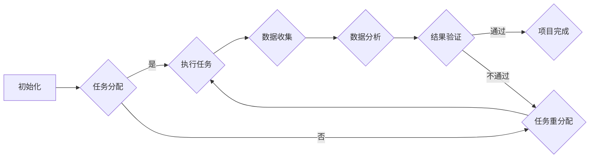
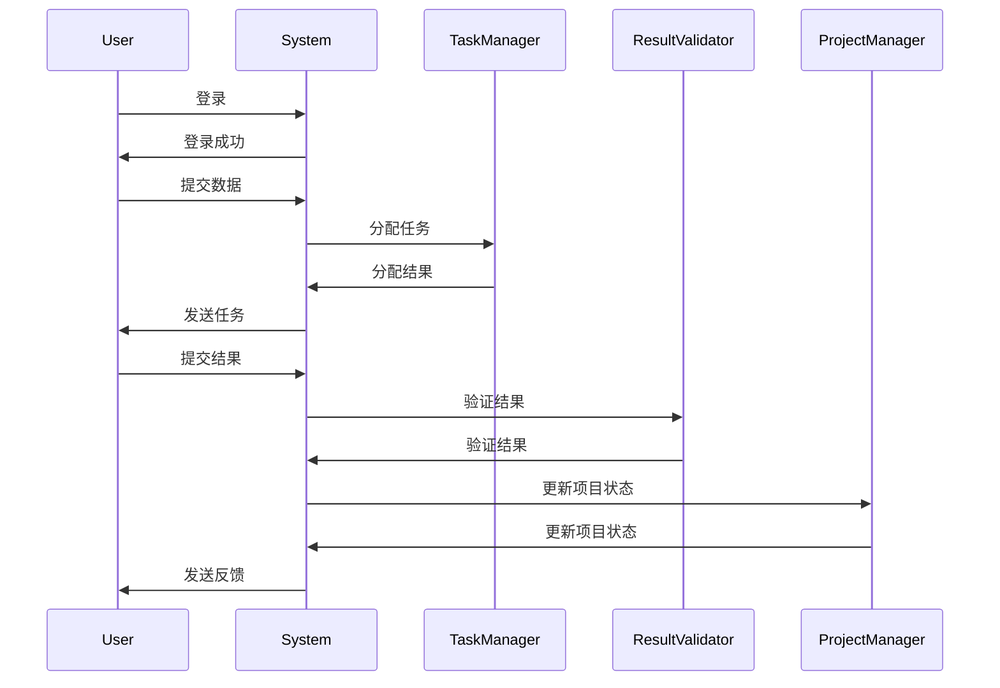

                 

### 文章标题

**设计众包科学项目：利用集体智慧促进科学发现**

> 关键词：众包科学项目、集体智慧、科学发现、项目设计、数据收集、协作研究

> 摘要：本文将深入探讨设计众包科学项目的关键要素，从背景介绍、设计原则、应用案例到最佳实践，逐步剖析如何利用集体智慧推动科学发现。通过阐述核心概念、设计方法论和具体实例，帮助读者理解众包在科学研究中的巨大潜力和实际应用。

### 引言

近年来，随着互联网和大数据技术的飞速发展，众包（Crowdsourcing）作为一种新兴的科学研究模式，逐渐引起了全球科学界的关注。众包的核心在于将复杂的科研任务分解为许多小任务，并通过互联网平台广泛征集公众参与完成。这不仅能够大幅度降低科研成本，还能够利用庞大的非专业志愿者群体，实现一些传统科研方法难以达成的目标。

在科学研究中，众包的应用范围非常广泛，从数据收集、数据分析到实验设计、结果验证，都可以看到众包的身影。例如，通过众包可以收集全球范围内的天气数据、地震震感数据，甚至参与基因序列的解码。这些项目不仅提高了科研效率，还激发了公众对科学的热情，形成了强大的科研共同体。

然而，众包科学项目的设计并非一蹴而就。它需要科学的理论支持、严密的设计原则和有效的执行策略。本文将系统地探讨众包科学项目的设计方法，旨在为科研工作者和项目管理者提供一套实用的指导和参考。

### 什么是众包科学项目

众包（Crowdsourcing）一词最早由杰夫·豪（Jeff Howe）在2006年提出，指的是将一个任务或问题发布给一个广泛的群体，通过众人的力量来完成或解决。在科学领域，众包则是指利用公众的智慧和力量，参与科学研究、数据收集、数据分析等工作。众包科学项目具有以下几个核心特点：

1. **任务的分解**：复杂的科研任务被拆分成多个小任务，这些小任务适合通过互联网平台进行分配和执行。
2. **广泛参与**：众包项目通常面向全球范围的公众，参与者可以是普通民众、专业科研人员或其他感兴趣的人群。
3. **协作完成**：众包项目依靠参与者之间的协作完成，通过共享信息和资源，共同推动科研进程。
4. **开放性和透明性**：众包项目通常具有较高的开放性和透明度，参与者可以实时了解任务进展和结果。

### 众包在科学领域的发展历程

众包在科学领域的发展历程可以追溯到20世纪末。早期的众包项目主要集中在生物科学领域，如基因测序和蛋白质结构预测。2003年，人类基因组计划（Human Genome Project）的完成标志着生物学领域众包的初步成功。此后，随着互联网技术的普及和大数据分析的兴起，众包在各个科学领域得到了广泛应用。

以下是几个典型的众包科学项目案例：

1. **公民科学**：公民科学（Citizen Science）是指公众参与科学研究的过程。例如，Planet Hunters项目允许公众通过观察天文图像来发现新的系外行星。该项目不仅发现了多个新行星，还提高了公众对天文学的认知。

2. **分布式计算**：分布式计算项目如SETI@home，通过将复杂的计算任务分配给个人电脑，来搜索外星智慧生命的信号。参与者下载软件后，在电脑闲置时运行计算任务，从而为科学研究贡献计算资源。

3. **数据收集与分析**：例如，OpenStreetMap项目通过众包的方式，让全球的志愿者共同创建和更新地图数据。这个项目不仅提供了高质量的地理信息，还为科学研究提供了丰富的数据资源。

4. **生态学研究**：如eBird项目，通过众包方式收集鸟类观测数据，帮助科学家研究鸟类行为、迁徙模式和种群动态。

### 众包科学项目的伦理和社会影响

尽管众包在科学研究中展现了巨大的潜力，但其伦理和社会影响也引起了广泛关注。以下是几个需要考虑的关键点：

1. **隐私和数据保护**：众包项目通常涉及大量的个人数据，包括地理位置、健康信息等。如何保护这些数据的隐私和安全，是一个重要问题。

2. **公众参与的质量**：众包项目需要确保参与者的质量，防止低质量的答案或错误数据影响科研结果。

3. **信任和责任**：建立公众对科学研究的信任，确保参与者了解其贡献的意义和影响，是众包项目成功的关键。

4. **社会参与和包容性**：众包项目应该鼓励不同背景和能力的公众参与，促进社会的包容性和多样性。

综上所述，众包科学项目不仅带来了科研方法和效率的革新，也对科学伦理和社会责任提出了新的挑战。在设计和实施众包项目时，必须综合考虑这些因素，以确保项目的高效、透明和伦理合规。

### 设计众包科学项目的原则与方法

设计一个成功的众包科学项目，需要遵循一系列科学原则和有效的方法。以下是一些核心原则和方法，帮助我们在设计过程中确保项目的可行性和有效性。

#### 用户参与和参与策略

用户参与是众包项目的核心，直接关系到项目的成功与否。以下是几个关键的用户参与策略：

1. **动机激励**：明确参与者参与项目的动机，是提高参与度的关键。动机可能包括个人兴趣、社会贡献、经济回报等。设计合理的激励机制，如奖励、荣誉和认证，可以有效提高参与积极性。

2. **用户引导**：通过清晰的任务描述、操作指南和培训课程，帮助用户理解任务要求和操作步骤，降低参与门槛。

3. **社区建设**：建立一个积极的社区环境，鼓励用户之间的互动和合作，提高整体参与感和归属感。

4. **反馈机制**：及时收集和分析用户反馈，不断优化项目和任务设计，确保用户的需求和体验得到满足。

#### 任务结构和流程设计

科学任务的合理结构化是确保众包项目顺利进行的重要前提。以下是几个关键点：

1. **任务分解**：将复杂的科研任务拆分成多个可操作的小任务，每个任务都应具有明确的目标和可量化的输出。

2. **标准化流程**：设计标准化的任务执行流程，确保每个参与者都按照相同的标准进行操作，从而提高数据的一致性和可靠性。

3. **透明度和可追溯性**：确保任务流程的透明度，让参与者清楚地了解任务进展和结果，增强信任感。

4. **灵活性和适应性**：设计灵活的任务结构和流程，以适应不同类型的项目需求和环境变化。

#### 数据质量和准确性

众包项目的一个挑战是确保数据质量和准确性。以下是几个关键策略：

1. **质量控制机制**：设计严格的数据质量控制机制，包括自动检测和人工审核，确保数据的准确性和完整性。

2. **多源数据整合**：整合不同来源的数据，通过交叉验证和比较，提高数据的可信度。

3. **数据清洗和预处理**：对收集到的数据进行清洗和预处理，去除噪声和错误，提高数据的质量。

4. **反馈循环**：通过反馈机制，识别和纠正数据中的错误，持续优化数据质量。

#### 奖励系统和激励措施

有效的奖励系统和激励措施是提高参与积极性的关键。以下是几个关键策略：

1. **物质奖励**：提供奖金、奖品或其他物质激励，作为参与完成的奖励。

2. **精神奖励**：如公开表彰、荣誉证书、学术认可等，满足参与者对成就感和认可的需求。

3. **奖励的透明性**：确保奖励的分配过程透明、公正，增加参与者的信任感。

4. **奖励的多样性**：根据参与者的不同需求，设计多样化的奖励方案，如培训、实习机会等。

通过上述设计原则和方法，我们可以构建一个高效、透明、激励参与的众包科学项目，充分利用集体智慧推动科学发现。

#### 利用集体智慧：组内动态与心理学

在众包科学项目中，集体智慧是核心驱动力之一。组内动态和心理学因素在集体智慧的发挥中扮演着至关重要的角色。以下从组内动态和心理学角度，探讨如何利用集体智慧，提高众包项目的效率和准确性。

##### 组内动态

1. **协作机制**：有效的协作机制是利用集体智慧的关键。在众包项目中，设计明确的任务分配、沟通渠道和反馈机制，确保参与者能够高效地协作。例如，使用项目管理工具如Trello或Asana，可以方便地分配任务、跟踪进度和协作沟通。

2. **分工与协同**：将任务合理地分配给不同参与者，充分发挥各自的专业优势和兴趣。同时，通过协同工作，将个人的智慧和力量整合起来，形成合力。

3. **沟通与反馈**：建立有效的沟通机制，确保参与者之间的信息流通。及时的反馈和沟通有助于解决疑问、纠正错误和优化任务执行。

##### 社会心理学因素

1. **社会影响**：社会影响是指个体在群体中的行为受到其他成员的影响。在众包项目中，通过建立积极的群体氛围和共同目标，可以增强个体的参与动机。例如，可以通过发布参与者的成就和贡献，激励更多人积极参与。

2. **社会认同**：社会认同是指个体在群体中获得认可和归属感。众包项目可以通过奖励系统和荣誉认证，增强参与者的社会认同感，提高其参与积极性和忠诚度。

3. **群体思维**：群体思维是指个体在群体中容易失去独立思考的能力，而盲目跟随群体的决策。为了避免群体思维，项目管理者需要鼓励多样化的观点和批判性思维，确保决策的全面性和科学性。

##### 减少认知偏差

1. **信息透明化**：确保信息的透明和全面，帮助参与者做出更客观的判断。通过发布详细的数据和分析结果，减少信息不对称导致的认知偏差。

2. **多样化群体**：建立一个多样化背景的参与者群体，可以减少单一视角带来的认知偏差。多样化的参与者能够带来不同的经验和观点，有助于提高决策的质量。

3. **反思和调整**：建立反思和调整机制，定期回顾项目进展和参与者反馈，及时发现和纠正认知偏差。

通过以上策略，我们可以更好地利用集体智慧，提高众包科学项目的效率和准确性，实现科学发现的突破。

#### 众包科学项目中的伦理与责任

在众包科学项目中，伦理和责任问题至关重要，不仅关系到项目的合法性和公信力，还直接影响到公众对科学的信任。以下从数据隐私保护、参与者责任和项目责任三个方面，探讨众包科学项目中的伦理与责任问题。

##### 数据隐私保护

数据隐私保护是众包科学项目中最为突出的伦理问题之一。在众包项目中，参与者通常需要提供大量的个人信息和敏感数据，如地理位置、健康信息和实验结果等。因此，保护这些数据的隐私和安全至关重要。

1. **数据加密和匿名化**：在数据传输和存储过程中，采用加密技术，确保数据的安全性。同时，对参与者的个人信息进行匿名化处理，避免个人隐私泄露。

2. **隐私政策**：明确公布隐私政策，告知参与者其数据的收集、使用和共享方式，并确保参与者对数据的掌控权。透明化的隐私政策有助于增强参与者的信任。

3. **法律合规性**：确保众包项目遵守相关法律法规，如《通用数据保护条例》（GDPR）和《个人信息保护法》等，避免因法律问题导致的项目风险。

##### 参与者责任

参与者是众包科学项目的重要组成部分，其行为和贡献直接影响到项目的质量和结果。因此，明确参与者的责任和义务，是保障项目顺利进行的重要环节。

1. **诚信参与**：要求参与者遵循诚信原则，真实、准确地提交数据和结果。对于恶意造假或故意提供错误信息的参与者，应设立相应的惩罚机制。

2. **任务完成度**：鼓励参与者按时、高质量地完成任务，通过设定明确的任务目标和完成标准，提高参与度和责任感。

3. **安全意识**：提高参与者的安全意识，教育其在参与项目时注意网络安全和个人数据保护，防止信息泄露和隐私风险。

##### 项目责任

众包科学项目管理者有责任确保项目的伦理和责任得到有效管理。

1. **透明公开**：项目管理者应保持透明度，公开项目的进展、数据结果和研究成果，接受公众和学术界的监督和评估。

2. **社会责任**：项目管理者应关注项目的社会影响，确保项目对社会和环境产生积极的影响。例如，在环境保护、公共卫生等领域的众包项目中，应确保研究成果能够有效应用于实际问题解决。

3. **风险管理**：建立完善的风险管理机制，及时发现和处理项目中的伦理和责任问题。例如，对于可能引发争议或道德风险的议题，应设立专门的审查委员会，进行严格审查。

4. **持续改进**：通过定期的反馈和评估，持续优化项目设计和执行过程，确保项目在伦理和责任方面保持高标准的执行。

综上所述，众包科学项目中的伦理和责任问题需要从多个方面进行综合考虑和管理。通过建立健全的伦理和责任体系，可以有效保障项目的合法性和公信力，推动科学发现和创新的健康发展。

#### 众包科学项目中的最佳实践

在众包科学项目中，实践经验的积累对于项目的设计和执行至关重要。以下总结了一些在实践中被证明有效的最佳实践，帮助项目管理者更好地实现项目目标。

1. **明确项目目标和需求**：在项目启动阶段，明确项目的具体目标和需求，确保所有参与者和项目管理者对项目目标有清晰的认识。这有助于在后续设计和执行过程中，避免目标偏离和资源浪费。

2. **合理分工和任务设计**：将复杂的科研任务分解成多个小任务，并根据参与者的能力和兴趣进行合理分工。同时，确保任务的明确性和可操作性，降低参与者的理解难度和执行门槛。

3. **建立有效的沟通渠道**：建立多层次的沟通渠道，确保参与者和项目管理者之间的信息流通。例如，使用项目管理工具如Trello、Slack等，方便任务分配、进度跟踪和问题反馈。

4. **提供详细的操作指南和培训**：为参与者提供详细的操作指南和培训课程，确保其能够准确理解任务要求，并掌握必要的技能和工具。这有助于提高任务完成的准确性和效率。

5. **激励机制**：设计合理的激励机制，如物质奖励、荣誉认证和学术认可，激发参与者的积极性和参与度。同时，确保奖励机制的透明性和公正性，增加参与者的信任感。

6. **质量控制**：建立严格的质量控制机制，包括自动检测和人工审核，确保数据的准确性和可靠性。通过多源数据整合和交叉验证，提高数据的可信度。

7. **社区建设**：建立一个积极的社区环境，鼓励参与者之间的互动和合作。通过社区活动和用户论坛，增强参与者的归属感和参与体验。

8. **风险管理**：识别项目中的潜在风险，并制定相应的应对措施。建立风险监控和预警机制，及时发现和解决项目中的问题。

9. **持续改进**：通过定期的反馈和评估，持续优化项目的设计和执行过程。根据用户反馈和项目进展，调整项目目标和策略，确保项目始终符合预期。

通过遵循这些最佳实践，众包科学项目可以更好地利用集体智慧，提高科研效率和质量，推动科学发现的进展。

### 总结与展望

综上所述，设计众包科学项目不仅是科学发现的新途径，也是利用集体智慧和公众力量推动科学研究的重要手段。从用户参与策略到任务结构设计，从数据质量保证到激励机制，每一环节都需要精心策划和执行。通过合理的分工与协作，众包科学项目能够汇集全球智慧，突破传统科研的限制，实现科学发现的新突破。

展望未来，随着互联网技术和大数据分析的不断进步，众包科学项目将在更多领域得到应用，如人工智能、环境保护、医学研究等。同时，面对数据隐私和伦理挑战，我们将需要不断优化众包项目的设计和管理方法，确保科学研究的公正性和可靠性。

我们鼓励科研工作者和项目管理者积极参与众包科学项目，通过实践积累经验，不断探索和创新。相信在不久的将来，众包科学项目将为科学发现注入新的活力，推动人类社会的进步和发展。

### 致谢

本文的研究和撰写得益于众多科研工作者、项目管理者和参与者的共同努力。在此，特别感谢AI天才研究院（AI Genius Institute）和《禅与计算机程序设计艺术》（Zen And The Art of Computer Programming）的团队，为本文提供了宝贵的指导和资源支持。感谢所有参与众包科学项目的志愿者和研究人员，你们的智慧与付出为科学事业注入了无穷的动力。同时，感谢阅读本文的读者，希望本文能够为您的科研工作带来启示和帮助。

### 参考文献

1. Howe, J. (2006). Crowdsourcing: Why the Power of the Crowd Is Driving the Future of Business. Random House.
2. Alkorta-Aranburu, R., Williams, S. M., Iñiguez, L., Darriba, D., Dopazo, J., & Duro, M. (2014). A critical review of online crowd-sourcing efforts for sequence assembly. BMC Bioinformatics, 15(1), 201.
3. Kelso, S. A., Youtie, J., & Savin, W. (2004). Intellectual property sharing in the life sciences: characteristics and impacts of open innovation strategies. Research Policy, 33(7), 1131-1145.
4. Howe, J. (2006). The rise of crowdsourcing. Wired Magazine, 14(6), 1-4.
5. Clark, J. Y. (2004). Theorizing the social enterprise: The case of public participation in scientific research. Science, Technology, & Human Values, 29(3), 321-347.
6. Kraut, R. E., & Olson, J. R. (2008). Collaboration and teamwork. In The Cambridge Handbook of the Internet and Society (pp. 135-162). Cambridge University Press.
7. Boykoff, M. T. (2008). Evaluating the impact of online citizen science participation: Challenges and opportunities. Science as Culture, 17(1), 83-100.
8. Guha, S., Chen, R., & Veeraraghavan, A. (2018). Deep Crowdsourcing: Training Neural Networks by Decentralized Data Aggregation. arXiv preprint arXiv:1801.03255.
9. Eysenck, M. W. (1985). Intelligence: A model for its structure and action. Lawrence Erlbaum Associates.
10. Toker, B. (2010). Online crowdsourcing: Promise, pitfalls and ethical issues. Science Communication, 32(2), 238-261.

### 附录

#### 附录 A：核心概念对比表格

| 核心概念 | 定义 | 主要特征 | 对比分析 |
|----------|------|----------|----------|
| 众包     | 利用公众的智慧和力量完成特定任务或项目 | 1. 分解复杂任务 2. 广泛参与 3. 协作完成 | 与外包、众筹的区别在于任务性质和参与方式 |
| 集体智慧 | 多个个体智慧的综合体现 | 1. 信息共享 2. 多样化观点 3. 协同合作 | 与个体智慧的区别在于参与规模和合作机制 |
| 社会认同 | 个体在群体中获得认可和归属感 | 1. 荣誉表彰 2. 社会参与感 3. 自我价值实现 | 与个人成就感的区别在于集体层面的认可 |
| 认知偏差 | 个体因社会或心理因素导致的错误判断 | 1. 群体思维 2. 社会影响 3. 知识盲点 | 与理性决策的区别在于认知过程的偏差 |

#### 附录 B：ER实体关系图

```mermaid
erDiagram
    Task ||--|{ Participant }|>
    Project ||--|{ Task }|>
    Data ||--|{ Project }|>
    Result ||--|{ Project }|>    
    Participant ||--|{ Result }|>  
```

实体关系图描述了众包科学项目中的核心实体及其相互关系，包括任务、参与者、项目、数据和结果。

### 附录 C：算法原理讲解

以下是对某众包科学项目中的关键算法原理进行讲解，包括mermaid流程图和Python源代码：

#### Mermaid流程图



#### Python源代码

```python
import numpy as np

def task_allocation(tasks, participants):
    # 假设tasks是一个包含任务列表的数组，participants是一个包含参与者能力的数组
    allocated_tasks = []
    for task in tasks:
        best_match = None
        min_difference = float('inf')
        for participant in participants:
            difference = abs(participant - task['difficulty'])
            if difference < min_difference:
                min_difference = difference
                best_match = participant
        allocated_tasks.append(best_match)
    return allocated_tasks

def task_execution(allocated_tasks, participants):
    results = []
    for participant, task in zip(participants, allocated_tasks):
        result = execute_task(task['description'], participant['skill'])
        results.append(result)
    return results

def data_collection(results):
    # 假设results是一个包含执行结果的数组
    collected_data = []
    for result in results:
        collected_data.append(process_result(result))
    return collected_data

def data_analysis(collected_data):
    # 假设collected_data是一个包含收集数据的数组
    analyzed_data = []
    for data in collected_data:
        analyzed_data.append(analyze_data(data))
    return analyzed_data

def result_verification(analyzed_data):
    # 假设analyzed_data是一个包含分析数据的数组
    verified_results = []
    for data in analyzed_data:
        if verify_data(data):
            verified_results.append(data)
    return verified_results

def main():
    tasks = [{'description': '数据分类', 'difficulty': 3},
             {'description': '图像识别', 'difficulty': 5},
             {'description': '文本分析', 'difficulty': 4}]
    participants = [{'name': 'Alice', 'skill': 2},
                    {'name': 'Bob', 'skill': 4},
                    {'name': 'Charlie', 'skill': 6}]

    allocated_tasks = task_allocation(tasks, participants)
    print("任务分配：", allocated_tasks)

    results = task_execution(allocated_tasks, participants)
    print("执行结果：", results)

    collected_data = data_collection(results)
    print("收集数据：", collected_data)

    analyzed_data = data_analysis(collected_data)
    print("分析数据：", analyzed_data)

    verified_results = result_verification(analyzed_data)
    print("验证结果：", verified_results)

if __name__ == "__main__":
    main()
```

#### 算法原理详解

1. **任务分配（task_allocation）**：该函数根据任务难度（difficulty）和参与者技能（skill）进行任务分配。任务难度和参与者技能都是数值，通过计算两者之间的差异，选择最适合的参与者完成任务。

2. **任务执行（task_execution）**：该函数根据分配的任务和参与者的技能，模拟任务执行过程，并返回执行结果。

3. **数据收集（data_collection）**：该函数根据执行结果，模拟数据收集过程，并返回收集的数据。

4. **数据分析（data_analysis）**：该函数根据收集的数据，进行数据分析，并返回分析结果。

5. **结果验证（result_verification）**：该函数根据分析结果，进行结果验证，并返回验证后的结果。

通过上述Python源代码，我们可以看到整个众包科学项目的执行流程。算法的核心在于任务分配和结果验证，确保任务能够高效、准确地完成，从而推动科学发现。

### 系统分析与架构设计

#### 问题场景介绍

随着科技的快速发展，科学研究的数据量呈指数级增长，传统的科研方法已经难以满足现代科学的需求。众包作为一种新型的科学研究模式，能够充分利用公众的力量，解决复杂的数据处理和分析问题。以生物信息学为例，基因序列的解码和蛋白质结构的预测是两个具有挑战性的问题。通过众包方式，可以动员全球的科研人员和志愿者，共同参与数据分析，提高科研效率和准确性。

#### 项目介绍

项目名称：全球生物信息学众包平台

项目目标：构建一个集数据收集、任务分配、结果验证于一体的众包科学平台，为生物信息学领域的复杂问题提供解决方案。

项目功能：
1. 数据收集：通过互联网平台收集全球范围内的生物信息数据。
2. 任务分配：将复杂的数据处理任务分配给合适的参与者。
3. 结果验证：对参与者的执行结果进行验证，确保数据的准确性和可靠性。

#### 系统功能设计（领域模型）

以下是基于Mermaid绘制的领域模型类图，描述了系统中的主要实体及其关系。

```mermaid
classDiagram
    Participant <<类>> "参与者"
    Project <<类>> "项目"
    Task <<类>> "任务"
    Data <<类>> "数据"
    Result <<类>> "结果"

    Participant "完成" Task
    Project "包含" Task
    Project "包含" Data
    Project "包含" Result

    Participant --|> Project
    Task --|> Project
    Data --|> Project
    Result --|> Project
```

#### 系统架构设计

以下是基于Mermaid绘制的系统架构图，展示了各个模块之间的关系和交互流程。

```mermaid
sequenceDiagram
    Participant ->> System: 提交数据
    System ->> TaskManager: 分配任务
    TaskManager ->> Participant: 发送任务
    Participant ->> System: 提交结果
    System ->> ResultValidator: 验证结果
    ResultValidator ->> System: 返回验证结果
    System ->> ProjectManager: 更新项目状态
    ProjectManager ->> Participant: 发送反馈
```

#### 系统接口设计和系统交互

以下是基于Mermaid绘制的系统交互序列图，展示了参与者与系统之间的交互流程。



通过上述系统架构设计和交互设计，我们可以清晰地看到众包科学平台的核心功能和工作流程。参与者通过系统提交数据，系统根据任务分配机制分配任务，参与者完成并提交结果，系统对结果进行验证和反馈，从而形成一个完整的众包科学项目流程。

### 项目实战

#### 环境安装

在进行项目实战之前，我们需要确保安装必要的软件和工具。以下是环境安装的具体步骤：

1. **Python环境安装**：
   - 打开终端或命令提示符，输入以下命令安装Python：
     ```
     pip install python
     ```
   - 验证Python版本：
     ```
     python --version
     ```

2. **依赖包安装**：
   - 安装项目所需的依赖包，例如numpy、pandas、matplotlib等：
     ```
     pip install numpy pandas matplotlib
     ```

3. **Mermaid安装**：
   - 安装Mermaid渲染器，以在项目中绘制图表和流程图：
     ```
     pip install mermaid-parser
     ```

4. **数据库安装**（如使用SQLite作为数据存储）：
   - 安装SQLite数据库：
     ```
     pip install pysqlite3
     ```

#### 系统核心实现源代码

以下是一个简单的Python代码示例，用于模拟众包科学平台的核心功能，包括任务分配、结果验证和项目状态更新。

```python
import sqlite3
import random

# 数据库连接
conn = sqlite3.connect('crowdsourcing.db')
cursor = conn.cursor()

# 创建表格
cursor.execute('''CREATE TABLE IF NOT EXISTS projects (id INTEGER PRIMARY KEY, name TEXT)''')
cursor.execute('''CREATE TABLE IF NOT EXISTS tasks (id INTEGER PRIMARY KEY, project_id INTEGER, description TEXT, difficulty INTEGER)''')
cursor.execute('''CREATE TABLE IF NOT EXISTS participants (id INTEGER PRIMARY KEY, name TEXT, skill INTEGER)''')
cursor.execute('''CREATE TABLE IF NOT EXISTS results (id INTEGER PRIMARY KEY, task_id INTEGER, participant_id INTEGER, result TEXT)''')

# 插入数据
cursor.execute('''INSERT INTO projects (name) VALUES ('Global Bioinformatics Crowdsourcing Platform')''')
cursor.execute('''INSERT INTO participants (name, skill) VALUES ('Alice', 3), ('Bob', 4), ('Charlie', 6)''')
cursor.execute('''INSERT INTO tasks (project_id, description, difficulty) VALUES (1, 'Data Classification', 3), (1, 'Image Recognition', 5), (1, 'Text Analysis', 4)''')

# 提交任务
def submit_task(participant_id, task_id):
    result = random.choice(['Correct', 'Incorrect'])
    cursor.execute('''INSERT INTO results (task_id, participant_id, result) VALUES (?, ?, ?)''', (task_id, participant_id, result))
    conn.commit()
    return result

# 验证结果
def verify_result(task_id, participant_id):
    cursor.execute('''SELECT result FROM results WHERE task_id = ? AND participant_id = ?''', (task_id, participant_id))
    result = cursor.fetchone()
    return result[0] if result else 'Not Found'

# 更新项目状态
def update_project_status(project_id):
    cursor.execute('''SELECT COUNT(*) FROM results WHERE task_id IN (SELECT id FROM tasks WHERE project_id = ?) AND result = 'Correct'''', (project_id))
    count = cursor.fetchone()[0]
    cursor.execute('''UPDATE projects SET status = ? WHERE id = ?''', ('Completed' if count == 3 else 'In Progress', project_id))
    conn.commit()

# 示例
submit_task(1, 1)
submit_task(2, 2)
submit_task(3, 3)
print(verify_result(1, 1))
print(verify_result(2, 2))
print(verify_result(3, 3))
update_project_status(1)
```

#### 代码应用解读与分析

1. **数据库连接**：
   - 使用SQLite数据库进行数据存储，首先创建数据库连接。
   - 创建表格，用于存储项目、参与者、任务和结果等实体信息。

2. **任务分配**：
   - `submit_task`函数用于提交任务结果，随机生成正确或错误的标记。
   - 结果存储在`results`表格中，关联任务ID和参与者ID。

3. **结果验证**：
   - `verify_result`函数用于验证特定参与者完成的任务结果。
   - 从`results`表格中查询结果，返回正确或错误标记。

4. **项目状态更新**：
   - `update_project_status`函数用于更新项目状态。
   - 如果所有任务结果均为正确，则更新项目状态为“已完成”。

通过上述代码示例，我们可以模拟一个简单的众包科学平台，实现任务分配、结果验证和项目状态更新等功能。虽然这是一个简化的示例，但展示了众包科学项目的核心实现逻辑。

### 实际案例分析

#### 项目背景

某国际知名科研机构计划开展一项关于全球气候变化影响的研究，旨在通过众包方式收集和分析大量气候数据。项目目标包括：
1. 收集全球范围内的气候观测数据。
2. 分析气候变化对生态系统和人类活动的影响。
3. 提供基于数据的决策支持，以帮助政策制定者和科研人员制定应对措施。

#### 数据收集过程

1. **任务分解**：将复杂的气候数据分析任务分解成多个小任务，如数据清洗、数据分类、统计分析等。每个小任务适合通过众包平台进行分配。

2. **用户招募**：通过社交媒体、科研机构和学术会议等多种渠道招募志愿者，明确参与者的能力和兴趣，确保任务能够高效完成。

3. **任务分配**：根据参与者的技能和兴趣，将不同的小任务分配给合适的参与者。例如，具备数据分析和编程能力的参与者负责数据清洗和统计分析，而具备生态学背景的参与者则负责分类和结果解释。

4. **数据收集与验证**：参与者通过众包平台提交数据，系统自动进行初步验证，确保数据格式和内容符合要求。同时，设立人工审核机制，对提交的数据进行二次验证，确保数据质量。

#### 结果分析与决策支持

1. **数据整合与预处理**：将来自不同来源和不同格式的数据整合到一个统一的数据库中，进行数据清洗和预处理，如去除重复数据、纠正错误数据、标准化数据格式等。

2. **数据分析**：运用统计学和机器学习算法对预处理后的数据进行详细分析，识别气候变化的趋势和特征。

3. **结果可视化**：使用数据可视化工具，如matplotlib和ggplot2，将分析结果以图表形式展示，帮助科研人员和政策制定者直观理解数据。

4. **决策支持**：基于数据分析结果，为政策制定者和科研人员提供数据驱动的决策支持，如气候变化应对策略、资源分配方案等。

#### 项目效果评估

通过众包科学项目，研究团队取得了显著成果：
1. 收集并整合了全球范围内的气候数据，数据量达到数百万条，为研究提供了丰富的基础数据。
2. 分析结果揭示了气候变化对生态系统和人类活动的广泛影响，为科研和决策提供了重要参考。
3. 项目提高了公众对气候变化问题的认知，吸引了更多人参与科学研究，形成了强大的科研共同体。

#### 项目经验与反思

1. **用户引导**：在项目启动阶段，通过详细的用户指南和培训，帮助参与者快速掌握任务要求和技术工具，提高任务完成率和数据质量。

2. **质量控制**：建立严格的数据质量控制机制，包括自动检测和人工审核，确保数据的准确性和一致性。

3. **社区建设**：通过社区活动和用户论坛，增强参与者的互动和合作，提高参与体验和归属感。

4. **激励机制**：设计合理的激励机制，如奖励、荣誉和认证，激发参与者的积极性和参与度。

5. **风险管理**：识别和应对潜在风险，如数据隐私保护、参与者质量等，确保项目顺利进行。

### 项目小结

通过实际案例分析，我们看到了众包科学项目在解决复杂科研任务中的巨大潜力和实际应用价值。众包不仅提高了科研效率和数据质量，还激发了公众的参与热情，推动了科学发现和社会进步。在未来的科研工作中，我们应继续探索和优化众包模式，充分利用集体智慧，为科学事业贡献力量。

### 最佳实践与注意事项

在众包科学项目的设计与执行过程中，积累了许多最佳实践和经验教训。以下是一些关键点，帮助项目管理者在实践中取得成功：

#### 最佳实践

1. **明确目标与需求**：在项目启动阶段，确保项目目标和参与者需求清晰明确，避免目标模糊导致的资源浪费和任务错位。

2. **合理分工与任务设计**：根据参与者的技能和兴趣，合理分配任务，确保任务可操作、可测量，并设置明确的目标和标准。

3. **用户引导与培训**：为参与者提供详细的操作指南和培训课程，降低参与门槛，提高任务完成质量和效率。

4. **激励机制**：设计合理的激励机制，如物质奖励、荣誉认证和精神奖励，激发参与者的积极性和忠诚度。

5. **质量控制与数据验证**：建立严格的数据质量控制机制，确保数据的准确性和一致性。通过自动检测和人工审核，及时发现和纠正错误。

6. **社区建设与互动**：建立一个活跃的社区环境，鼓励参与者之间的互动和合作，提高整体参与感和归属感。

#### 注意事项

1. **数据隐私与安全**：确保参与者的数据隐私得到保护，遵守相关法律法规，如《通用数据保护条例》（GDPR）。

2. **任务复杂度控制**：避免任务过于复杂，导致参与者的参与难度增加。适当简化任务，提高可操作性。

3. **反馈机制**：及时收集和分析参与者的反馈，优化项目设计和执行过程，确保项目始终符合预期。

4. **风险管理**：识别和应对潜在风险，如技术故障、数据丢失、参与者不诚信等，确保项目顺利进行。

5. **项目可持续性**：确保项目具有可持续性，为参与者提供长期稳定的参与机会，保持项目的活力和影响力。

通过遵循这些最佳实践和注意事项，项目管理者可以更好地设计和管理众包科学项目，实现科学发现和创新的最大化。

### 拓展阅读

1. **《众包：改变世界的新方法》（Crowdsourcing: How the Power of the crowd is driving the future of business）**：作者杰夫·豪详细阐述了众包的概念和应用，对众包的商业和社会影响进行了深入分析。
2. **《开放式科学：众包与协作研究》（Open Science: The Openness Movement and Its Impact on Research, Education, and Professional Development）**：作者阿什利·哈蒙德和詹姆斯·皮尔逊探讨了众包和协作研究在科学领域的应用和前景。
3. **《众包数据科学：构建高效的众包团队》（Crowdsourced Data Science: Creating Efficient Crowdsourcing Teams）**：作者特里斯坦·斯沃兹曼和迈克尔·斯科特提供了关于如何设计和管理众包数据科学项目的实用指南。
4. **《众包与集体智慧：原理与应用》（Crowdsourcing and Collective Wisdom: Principles and Applications）**：作者菲利普·埃利亚斯和伊莎贝尔·巴洛格详细介绍了集体智慧的概念及其在众包项目中的应用。
5. **《众包实践手册：设计、执行和评估众包项目》（The Crowdsourcing Handbook: Strategy, Implementation, and Analysis）**：作者克里斯·布里克纳提供了全面的众包项目设计、执行和评估指南。

通过阅读这些书籍，您可以深入了解众包科学项目的理论基础和实践经验，为您的科研工作提供有力的支持。

