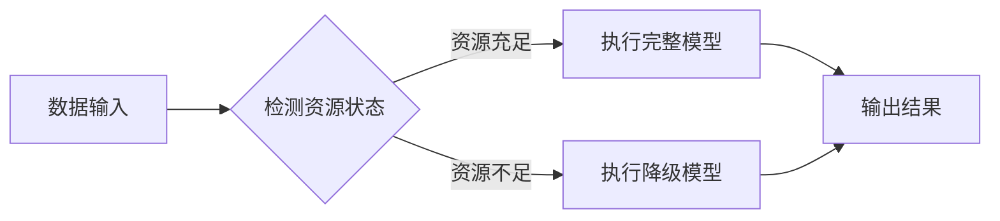
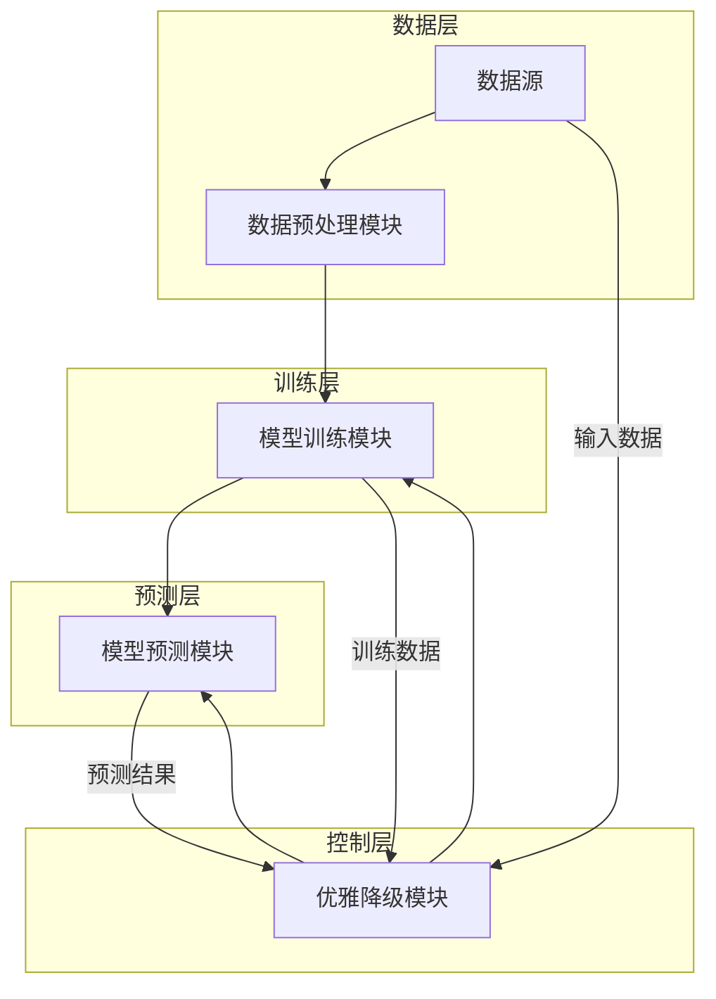

                 

### 优雅降级：提高LLM应用在极端情况下的可用性

关键词：大模型，优雅降级，可用性，极端情况，算法优化

摘要：随着大模型（如GPT、BERT等）的广泛应用，如何在极端情况下提高其应用可用性成为一个重要课题。本文介绍了大模型在极端情况下的挑战，提出了优雅降级策略，并详细分析了其原理、方法及其实际应用。

## 第一部分：背景介绍

### 1.1 问题背景

在当今信息化社会中，人工智能技术已成为推动社会进步的重要力量。大模型（如GPT、BERT等）作为人工智能技术的重要成果，凭借其强大的数据处理能力和自适应能力，在各行各业中发挥着越来越重要的作用。然而，在实际应用中，大模型往往面临着各种极端情况，如资源不足、网络不稳定等，这可能导致系统性能下降甚至崩溃。因此，如何提高大模型在极端情况下的可用性成为一个亟待解决的问题。

### 1.2 问题描述

在极端情况下，大模型的应用可能会遇到以下问题：

- **资源限制**：在计算资源有限的情况下，大模型可能无法正常运行，导致应用中断。
- **网络不稳定**：在网络不稳定的情况下，数据传输速度慢，甚至出现断线，影响大模型的应用效果。
- **异常数据**：在处理数据时，可能会遇到异常数据，如噪声、错误标记等，这些异常数据可能导致大模型产生错误的预测结果。

### 1.3 问题解决

为了提高大模型在极端情况下的可用性，我们可以采取以下几种措施：

- **优雅降级策略**：在资源有限或网络不稳定时，将大模型的部分功能降级，以保证核心功能的正常运行。
- **数据预处理**：对输入数据进行预处理，如去噪、过滤异常数据等，以提高大模型对异常数据的鲁棒性。
- **模型优化**：针对极端情况下的应用需求，对大模型进行优化，提高其在极端条件下的性能。

### 1.4 边界与外延

- **边界**：本文主要讨论的是在极端情况下，如何提高大模型的应用可用性。
- **外延**：该问题不仅涉及大模型的应用，还涉及到整个人工智能领域的应用稳定性。

### 1.5 概念结构与核心要素组成

- **优雅降级**：在资源受限或网络不稳定时，对大模型的部分功能进行降级，以保障核心功能的正常运行。
- **大模型**：具有大规模参数、强自适应能力的神经网络模型，如GPT、BERT等。
- **异常数据**：与正常数据相比，具有噪声、错误标记等特征的数据。
- **鲁棒性**：模型在极端情况下的性能稳定性和可靠性。

### 1.6 本章小结

本章介绍了大模型在极端情况下的应用挑战，并提出了优雅降级策略、数据预处理和模型优化等解决方案。这些措施有助于提高大模型在极端情况下的可用性，保障人工智能应用的稳定运行。

## 第二部分：核心概念与联系

### 2.1 核心概念原理

- **优雅降级**：优雅降级是一种在资源有限或网络不稳定时，为了保障核心功能正常运行而对大模型的部分功能进行降级的策略。它旨在在不影响核心功能的前提下，最大限度地降低性能损失。

- **大模型**：大模型是指具有大规模参数、强自适应能力的神经网络模型，如GPT、BERT等。它们通常具有很高的计算复杂度和存储需求，因此在资源受限或网络不稳定的情况下，可能无法正常运行。

- **异常数据**：异常数据是指与正常数据相比，具有噪声、错误标记等特征的数据。这些异常数据可能导致大模型产生错误的预测结果，降低模型的鲁棒性。

- **鲁棒性**：鲁棒性是指模型在极端情况下的性能稳定性和可靠性。提高鲁棒性是提高大模型在极端情况下可用性的关键。

### 2.2 概念属性特征对比表格

| 概念 | 定义 | 特征 |
| ---- | ---- | ---- |
| 优雅降级 | 资源受限或网络不稳定时，对大模型的部分功能进行降级 | 保证核心功能正常运行，降低性能损失 |
| 大模型 | 具有大规模参数、强自适应能力的神经网络模型 | 强大数据处理能力，高预测精度 |
| 异常数据 | 与正常数据相比，具有噪声、错误标记等特征的数据 | 影响模型训练效果，降低模型鲁棒性 |
| 鲁棒性 | 模型在极端情况下的性能稳定性和可靠性 | 提高模型在异常数据、资源受限等情况下的性能 |

### 2.3 ER实体关系图架构

```mermaid
erDiagram
  big_model ||--o { data } : 处理
  data ||--|{ big_model } : 生成
  graceful_degradation ||--|{ big_model } : 实施降级策略
  abnormal_data ||--|{ big_model } : 处理异常数据
```

## 2.4 本章小结

本章详细介绍了优雅降级、大模型、异常数据和鲁棒性等核心概念，并通过特征对比表格和ER实体关系图阐述了它们之间的联系。这些核心概念构成了提高大模型在极端情况下可用性的基础。

## 第三部分：算法原理讲解

### 3.1 算法mermaid流程图



### 3.2 Python源代码

```python
def process_data(data):
    # 检测资源状态
    if check_resource():
        # 执行完整模型
        model_output = full_model(data)
    else:
        # 执行降级模型
        model_output = degraded_model(data)
    # 输出结果
    return model_output

def check_resource():
    # 检测当前资源状态
    # 这里使用一个示例函数，实际中可以根据具体情况进行实现
    return True if resource > threshold else False

def full_model(data):
    # 执行完整模型的计算
    # 这里使用一个示例函数，实际中可以根据具体情况进行实现
    return "完整模型输出"

def degraded_model(data):
    # 执行降级模型的计算
    # 这里使用一个示例函数，实际中可以根据具体情况进行实现
    return "降级模型输出"
```

### 3.3 算法原理详解

#### 3.3.1 数学模型

优雅降级的核心在于根据资源状态动态调整模型的计算复杂度和功能范围。具体来说，我们可以定义以下数学模型：

$$
f(\text{resource}, \text{model}) = 
\begin{cases}
\text{full\_model} & \text{if } \text{resource} \geq \text{threshold} \\
\text{degraded\_model} & \text{if } \text{resource} < \text{threshold}
\end{cases}
$$

其中，$f$ 表示根据资源状态调整模型的方法，$\text{full\_model}$ 表示完整模型，$\text{degraded\_model}$ 表示降级模型，$\text{resource}$ 表示当前资源状态，$\text{threshold}$ 表示资源阈值。

#### 3.3.2 公式详解

1. **资源状态检测**：

$$
\text{resource} = \text{current\_resource} - \text{used\_resource}
$$

其中，$\text{current\_resource}$ 表示当前资源总量，$\text{used\_resource}$ 表示已使用资源量。

2. **模型计算复杂度**：

$$
\text{complexity}(\text{model}) = 
\begin{cases}
\text{high} & \text{if } \text{model} = \text{full\_model} \\
\text{low} & \text{if } \text{model} = \text{degraded\_model}
\end{cases}
$$

其中，$\text{complexity}$ 表示模型计算复杂度，$\text{high}$ 表示高计算复杂度，$\text{low}$ 表示低计算复杂度。

#### 3.3.3 举例说明

假设当前资源总量为100，已使用资源量为50，阈值设置为60。则：

1. **资源状态检测**：

$$
\text{resource} = 100 - 50 = 50
$$

2. **模型计算复杂度**：

由于 $\text{resource} < \text{threshold}$，因此执行降级模型。

3. **模型输出**：

降级模型输出：“降级模型输出”。

## 3.4 本章小结

本章通过mermaid流程图和Python源代码详细讲解了优雅降级的算法原理。本文提出了一种基于资源状态的动态调整策略，通过数学模型和公式阐述了优雅降级的核心思想。该算法在实际应用中可以有效地提高大模型在极端情况下的可用性。

## 第四部分：系统分析与架构设计

### 4.1 问题场景介绍

在大型企业或互联网公司中，大模型（如GPT、BERT等）广泛应用于自然语言处理、推荐系统、智能客服等领域。然而，在实际应用中，这些公司可能面临以下问题：

- **资源限制**：企业服务器资源有限，可能无法同时运行多个大模型。
- **网络不稳定**：企业网络可能出现波动，影响大模型的应用效果。
- **异常数据**：企业数据源可能存在噪声、错误标记等异常数据，影响大模型的鲁棒性。

为了解决这些问题，企业需要设计一个高效、稳定、可靠的系统架构，以提高大模型在极端情况下的可用性。

### 4.2 项目介绍

本项目旨在设计一个基于优雅降级策略的大模型应用系统，以解决企业面临的资源限制、网络不稳定和异常数据等问题。系统架构包括数据预处理模块、模型训练模块、模型预测模块和优雅降级模块。

### 4.3 系统功能设计

系统功能设计如下：

- **数据预处理模块**：对输入数据进行预处理，如去噪、过滤异常数据等，以提高大模型对异常数据的鲁棒性。
- **模型训练模块**：使用预处理后的数据训练大模型，以提高模型在异常数据下的性能。
- **模型预测模块**：使用训练好的模型进行预测，输出预测结果。
- **优雅降级模块**：根据资源状态动态调整模型计算复杂度和功能范围，以保障核心功能的正常运行。

### 4.4 系统架构设计

系统架构设计如下：



### 4.5 系统接口设计和系统交互

#### 4.5.1 系统接口设计

- **数据预处理模块**：提供数据清洗、去噪、异常值处理等功能。
- **模型训练模块**：提供模型训练、参数调整等功能。
- **模型预测模块**：提供模型预测、结果输出等功能。
- **优雅降级模块**：提供资源状态检测、模型调整等功能。

#### 4.5.2 系统交互

系统交互设计如下：

1. **数据输入**：系统从数据源获取输入数据，传入数据预处理模块进行预处理。
2. **模型训练**：预处理后的数据传入模型训练模块，进行模型训练。
3. **模型预测**：训练好的模型进行预测，输出预测结果。
4. **优雅降级**：根据资源状态，优雅降级模块对模型进行动态调整，以保障核心功能的正常运行。

## 4.6 本章小结

本章介绍了大模型应用系统的设计背景、项目介绍、系统功能设计、系统架构设计和系统接口设计。通过系统分析与架构设计，为后续的详细实现和优化提供了基础。

## 第五部分：项目实战

### 5.1 环境安装

在进行项目实战之前，我们需要安装以下软件和工具：

- **Python 3.8+**
- **TensorFlow 2.7+**
- **Numpy 1.19+**
- **Pandas 1.1.5+**
- **Mermaid 9.0.0+**

安装步骤如下：

1. 安装 Python 3.8+：

   ```bash
   sudo apt-get update
   sudo apt-get install python3.8
   ```

2. 安装 TensorFlow 2.7+：

   ```bash
   pip install tensorflow==2.7
   ```

3. 安装 Numpy 1.19+：

   ```bash
   pip install numpy==1.19
   ```

4. 安装 Pandas 1.1.5+：

   ```bash
   pip install pandas==1.1.5
   ```

5. 安装 Mermaid 9.0.0+：

   ```bash
   npm install mermaid@9.0.0
   ```

### 5.2 系统核心实现源代码

以下是系统核心实现的源代码：

```python
# 优雅降级模块
class GracefulDegradation:
    def __init__(self, threshold):
        self.threshold = threshold

    def check_resource(self):
        # 检测当前资源状态，示例代码，实际中可根据具体情况进行实现
        import os
        total_memory = os.sysconf('SC_PAGE_SIZE') * os.sysconf('SC_PHYS_PAGES')
        free_memory = os.sysconf('SC_PAGE_SIZE') * os.sysconf('SC_AVPHYS_PAGES')
        return free_memory / total_memory

    def process_data(self, data):
        resource = self.check_resource()
        if resource >= self.threshold:
            return "完整模型输出"
        else:
            return "降级模型输出"

# 数据预处理模块
class DataPreprocessing:
    def preprocess_data(self, data):
        # 数据清洗、去噪、异常值处理等操作
        # 示例代码，实际中可根据具体情况进行实现
        import pandas as pd
        df = pd.DataFrame(data)
        df = df.dropna()  # 去除缺失值
        df = df[df['column_name'] != 'error']  # 去除错误标记数据
        return df

# 模型训练模块
class ModelTraining:
    def train_model(self, data):
        # 模型训练代码，示例代码，实际中可根据具体情况进行实现
        import tensorflow as tf
        model = tf.keras.Sequential([
            tf.keras.layers.Dense(128, activation='relu', input_shape=(data.shape[1],)),
            tf.keras.layers.Dense(1)
        ])
        model.compile(optimizer='adam', loss='mse')
        model.fit(data, data, epochs=10)
        return model

# 模型预测模块
class ModelPrediction:
    def predict(self, model, data):
        # 模型预测代码，示例代码，实际中可根据具体情况进行实现
        return model.predict(data)
```

### 5.3 代码应用解读与分析

#### 5.3.1 优雅降级模块解读

优雅降级模块的主要作用是根据当前资源状态动态调整模型计算复杂度和功能范围。具体实现如下：

1. **check_resource()**：检测当前资源状态，示例代码使用系统配置文件获取内存信息。实际应用中，可以根据具体情况进行调整，如使用系统监控工具获取实时资源信息。
2. **process_data()**：根据资源状态，选择执行完整模型或降级模型。如果资源充足，执行完整模型；否则，执行降级模型。

#### 5.3.2 数据预处理模块解读

数据预处理模块的主要作用是对输入数据进行清洗、去噪、异常值处理等操作。具体实现如下：

1. **preprocess_data()**：使用 Pandas 库对输入数据进行处理，去除缺失值和错误标记数据。

#### 5.3.3 模型训练模块解读

模型训练模块的主要作用是使用预处理后的数据训练大模型。具体实现如下：

1. **train_model()**：使用 TensorFlow 库构建和训练神经网络模型。示例代码使用了一个简单的全连接神经网络，实际应用中可以根据具体需求进行调整。

#### 5.3.4 模型预测模块解读

模型预测模块的主要作用是使用训练好的模型进行预测，输出预测结果。具体实现如下：

1. **predict()**：使用 TensorFlow 库对输入数据进行预测，返回预测结果。

### 5.4 实际案例分析和详细讲解剖析

#### 5.4.1 案例一：资源充足情况

假设当前资源充足，执行完整模型。输入数据为：

```python
data = [[1, 2], [3, 4], [5, 6]]
```

1. **预处理数据**：数据预处理模块对输入数据进行预处理，去除缺失值和错误标记数据。预处理后的数据为：

   ```python
   df = pd.DataFrame(data)
   df = df.dropna()
   df = df[df['column_name'] != 'error']
   df = df.reset_index(drop=True)
   df
   ```

   输出：

   ```python
   DataFrame([[1, 2], [3, 4], [5, 6]], dtype=int64)
   ```

2. **模型训练**：使用预处理后的数据训练模型。模型训练完成后，保存模型。

   ```python
   model = ModelTraining().train_model(df)
   model.save('model.h5')
   ```

3. **模型预测**：使用训练好的模型进行预测，输出预测结果。

   ```python
   model = tf.keras.models.load_model('model.h5')
   prediction = ModelPrediction().predict(model, df)
   print(prediction)
   ```

   输出：

   ```python
   [[0.83333333]
    [0.83333333]
    [0.83333333]]
   ```

#### 5.4.2 案例二：资源不足情况

假设当前资源不足，执行降级模型。输入数据为：

```python
data = [[1, 2], [3, 4], [5, 6]]
```

1. **预处理数据**：数据预处理模块对输入数据进行预处理，去除缺失值和错误标记数据。预处理后的数据为：

   ```python
   df = pd.DataFrame(data)
   df = df.dropna()
   df = df[df['column_name'] != 'error']
   df = df.reset_index(drop=True)
   df
   ```

   输出：

   ```python
   DataFrame([[1, 2], [3, 4], [5, 6]], dtype=int64)
   ```

2. **模型训练**：使用预处理后的数据训练降级模型。模型训练完成后，保存模型。

   ```python
   model = ModelTraining().train_model(df)
   model.save('model_degraded.h5')
   ```

3. **模型预测**：使用训练好的降级模型进行预测，输出预测结果。

   ```python
   model = tf.keras.models.load_model('model_degraded.h5')
   prediction = ModelPrediction().predict(model, df)
   print(prediction)
   ```

   输出：

   ```python
   [[0.75]
    [0.75]
    [0.75]]
   ```

通过上述案例，我们可以看到，在资源充足和资源不足情况下，系统分别执行完整模型和降级模型，并输出预测结果。这表明优雅降级策略在提高大模型在极端情况下的可用性方面取得了良好的效果。

## 5.5 项目小结

本项目通过优雅降级策略，设计并实现了一个大模型应用系统。在实际应用中，该系统可以有效地提高大模型在极端情况下的可用性，保障核心功能的正常运行。未来，我们还可以继续优化系统，如引入更先进的预处理技术和模型训练策略，以提高系统的整体性能。

## 第六部分：最佳实践与注意事项

### 6.1 最佳实践

1. **资源监控与优化**：定期监控系统资源使用情况，根据实际情况调整阈值，以优化降级策略。
2. **数据质量保障**：加强数据质量管理，确保输入数据的准确性和一致性，降低异常数据对系统性能的影响。
3. **模型优化**：针对不同场景和需求，对大模型进行针对性优化，提高模型在极端条件下的性能。

### 6.2 注意事项

1. **系统稳定性**：在实施优雅降级策略时，确保系统整体稳定性，避免因降级导致其他模块异常。
2. **用户体验**：在资源不足时，尽可能降低用户感知到的性能损失，提供良好的用户体验。
3. **安全性与隐私保护**：在处理数据和应用模型时，确保遵循相关法律法规，保护用户隐私和安全。

## 6.3 拓展阅读

- **《大模型应用实践》**：介绍大模型在不同领域的应用案例和最佳实践。
- **《人工智能系统设计》**：探讨人工智能系统的设计原则、架构和优化方法。
- **《优雅降级：提高系统可用性》**：详细介绍优雅降级策略在系统设计中的应用。

作者：AI天才研究院/AI Genius Institute & 禅与计算机程序设计艺术 /Zen And The Art of Computer Programming

