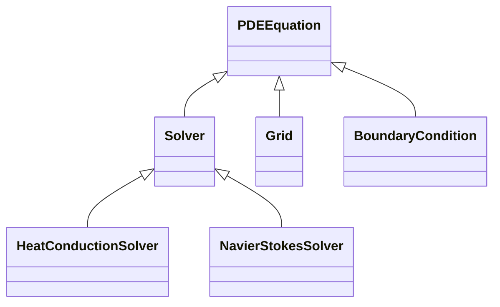
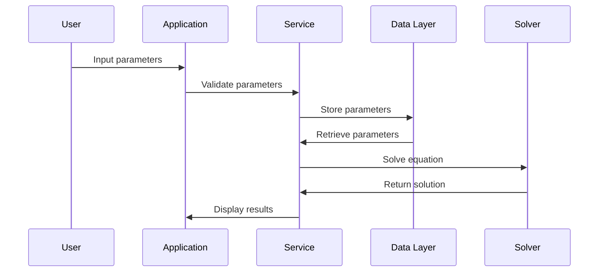
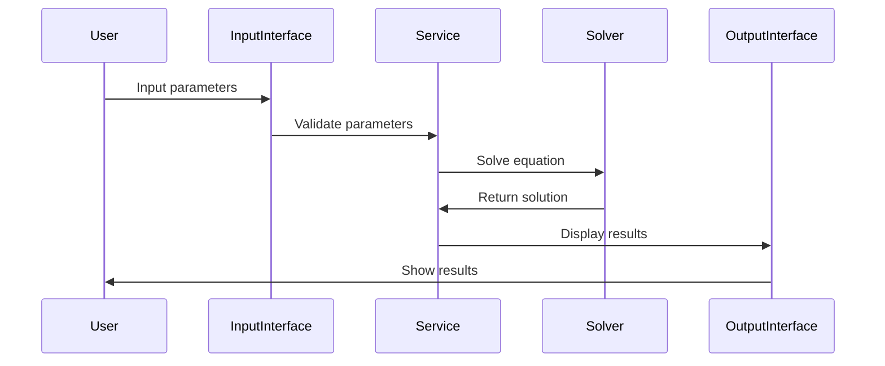

                 

## 偏微分方程：自然现象的数学描述

### 关键词：偏微分方程、自然现象、数学描述、数学模型、数值方法

### 摘要：

偏微分方程（Partial Differential Equations，简称PDEs）是描述自然界中多种现象的一类数学模型。这些现象包括流体运动、热传导、电磁场分布、量子力学中的波函数等。本文将系统介绍偏微分方程的基本概念、求解方法、理论分析以及其在各个领域的应用，旨在为读者提供一个全面、深入的理解。我们将从基本的定义和分类出发，逐步探讨不同求解方法的原理和适用场景，并通过具体的数学公式和实例来阐述偏微分方程在自然现象描述中的作用。

### 第1章：偏微分方程基础

#### 1.1 偏微分方程的定义与历史背景

偏微分方程是含有两个或两个以上未知函数及其偏导数的方程。与常微分方程（ODEs）不同，PDEs涉及多个独立变量，其解通常需要满足一定的边界条件。这类方程在物理学、工程学和数学中有着广泛的应用。

**定义：**
\[ u_t + a(x,t)u_x = b(x,t)u_y \]

**历史背景：**
偏微分方程的发展可以追溯到17世纪的牛顿和莱布尼茨的微积分研究。随着数学和物理学的进步，偏微分方程理论逐渐形成，并在19世纪的法国大数学家如傅里叶、泊松和欧拉等人的研究中得到了进一步的深化。

#### 1.2 偏微分方程的类型

**线性与非线性PDEs：**
- **线性PDEs：** 满足叠加原理，如热传导方程 \( u_t = ku_{xx} \)。
- **非线性PDEs：** 不满足叠加原理，如Navier-Stokes方程。

**椭圆型、抛物型和双曲型PDEs：**
- **椭圆型PDEs：** 如拉普拉斯方程 \( u_{xx} + u_{yy} = 0 \)。
- **抛物型PDEs：** 如热传导方程 \( u_t = ku_{xx} \)。
- **双曲型PDEs：** 如波动方程 \( u_{tt} - c^2u_{xx} = 0 \)。

#### 1.3 偏微分方程的重要性

**在自然科学中的应用：**
偏微分方程广泛应用于物理学、生物学、地球科学等领域，如流体力学中的Navier-Stokes方程、热传导中的热传导方程、电磁学中的麦克斯韦方程等。

**在工程技术领域的重要性：**
偏微分方程在工程领域有广泛的应用，如结构力学中的弹性力学方程、材料科学中的扩散方程、电子工程中的电磁场方程等。

**对社会发展的影响：**
偏微分方程的研究促进了现代科学和工程技术的进步，对能源开发、环境保护、医学成像等领域的发展起到了重要的推动作用。

### 第2章：偏微分方程的求解方法

#### 2.1 分离变量法

分离变量法是一种求解线性偏微分方程的常用方法。其基本思想是将多维问题转化为一系列一维问题的组合。

**原理：**
\[ u(x,t) = X(x)T(t) \]

**应用：**
分离变量法常用于求解波动方程、热传导方程等。

**局限性：**
对于非线性问题或复杂边界条件，分离变量法可能不适用。

#### 2.2 边值问题与特征线法

边值问题是指解同时满足微分方程和边界条件的偏微分方程。特征线法是一种求解边值问题的方法。

**原理：**
特征线法通过沿着特征线积分来求解偏微分方程。

**应用：**
特征线法常用于求解波动方程、拉普拉斯方程等。

#### 2.3 Green函数方法

Green函数方法是一种求解线性偏微分方程边值问题的强大工具。

**原理：**
Green函数与微分方程的解满足特定的积分关系。

**应用：**
Green函数方法在电磁学、量子力学等领域有广泛应用。

### 第3章：偏微分方程的数学理论

#### 3.1 偏微分方程的解的存在性与唯一性

偏微分方程的解的存在性与唯一性是数学理论研究的核心问题之一。

**解的存在性定理：**
存在性定理指出在一定条件下，线性偏微分方程的解是存在的。

**解的唯一性定理：**
唯一性定理保证了在适当条件下，线性偏微分方程的解是唯一的。

#### 3.2 解的估计与光滑性

解的估计是研究偏微分方程解的性质的重要方法。

**解的光滑性：**
解的光滑性是指解在某个区域内的连续性和可微性。

#### 3.3 偏微分方程的解析延拓

解析延拓是一种将偏微分方程的解从某个区域扩展到更大区域的方法。

**原理：**
解析延拓利用复变函数的理论来处理偏微分方程。

**应用：**
解析延拓在量子力学和电磁学中有重要应用。

### 第4章：一类重要的偏微分方程

#### 4.1 波动方程

波动方程描述了波在介质中的传播过程。

**数学描述：**
\[ u_{tt} - c^2u_{xx} = 0 \]

**物理背景：**
波动方程在声学、电磁学和量子力学中有着广泛的应用。

#### 4.2 深度流动方程

深度流动方程描述了流体在重力场中的运动。

**数学描述：**
\[ \frac{\partial \phi}{\partial t} = -\nabla p + \nabla \cdot (v \phi) \]

**物理背景：**
深度流动方程在地球科学和流体力学中有着重要应用。

#### 4.3 热传导方程

热传导方程描述了热量在介质中的传播。

**数学描述：**
\[ u_t = ku_{xx} \]

**物理背景：**
热传导方程在热力学和工程热力学中有着广泛的应用。

### 第5章：偏微分方程在流体力学中的应用

#### 5.1 流体力学基本方程

流体力学基本方程包括连续性方程、动量方程和能量方程。

**数学描述：**
\[ \nabla \cdot \mathbf{u} = 0 \]
\[ \rho (\mathbf{u} \cdot \nabla \mathbf{u}) = -\nabla p + \rho \mathbf{g} \]
\[ \rho c_p \frac{\partial T}{\partial t} = \nabla \cdot (k \nabla T) \]

**物理背景：**
流体力学基本方程是流体力学研究的核心，用于描述流体运动和热传导过程。

#### 5.2 Navier-Stokes方程

Navier-Stokes方程是描述粘性流体运动的基本方程。

**数学描述：**
\[ \rho \left( \frac{\partial \mathbf{u}}{\partial t} + \mathbf{u} \cdot \nabla \mathbf{u} \right) = -\nabla p + \rho \mathbf{g} + \mu \nabla^2 \mathbf{u} \]

**物理背景：**
Navier-Stokes方程在工程、气象学和天体物理学中有着广泛的应用。

#### 5.3 边界层问题

边界层问题涉及流体在边界层内的运动。

**数学描述：**
\[ \mathbf{u} = \mathbf{u}_t + \mathbf{u}_b \]

**物理背景：**
边界层问题在航空工程和船舶工程中有着重要应用。

### 第6章：偏微分方程在弹性力学中的应用

#### 6.1 弹性力学基本方程

弹性力学基本方程描述了固体在外力作用下的变形。

**数学描述：**
\[ \nabla \cdot \sigma = p \]
\[ \sigma = \lambda \nabla \cdot \mathbf{u} + 2\mu \nabla \mathbf{u} \]

**物理背景：**
弹性力学基本方程在结构工程和材料力学中有着广泛的应用。

#### 6.2 弹性波传播

弹性波传播方程描述了弹性波在固体中的传播。

**数学描述：**
\[ \frac{\partial^2 p}{\partial t^2} = c^2 \nabla^2 p \]

**物理背景：**
弹性波传播方程在地震学、声学和爆炸力学中有着重要应用。

#### 6.3 应力-应变关系

应力-应变关系描述了固体材料在受力作用下的变形。

**数学描述：**
\[ \sigma = E \epsilon \]

**物理背景：**
应力-应变关系在材料力学和土木工程中有着广泛的应用。

### 第7章：偏微分方程在量子力学中的应用

#### 7.1 Schrödinger方程

Schrödinger方程是量子力学的基本方程。

**数学描述：**
\[ i\hbar \frac{\partial \psi}{\partial t} = \hat{H} \psi \]

**物理背景：**
Schrödinger方程描述了量子系统的时间演化。

#### 7.2 时间相关与时间无关的Schrödinger方程

**时间相关Schrödinger方程：**
\[ i\hbar \frac{\partial \psi}{\partial t} = \hat{H} \psi + \hat{V} \psi \]

**时间无关Schrödinger方程：**
\[ E \psi = \hat{H} \psi \]

**物理背景：**
时间相关与时间无关的Schrödinger方程分别描述了量子系统的时间依赖性和时间不变性。

#### 7.3 波函数的归一化

波函数的归一化是量子力学中的基本要求。

**数学描述：**
\[ \int |\psi(\mathbf{r})|^2 d\mathbf{r} = 1 \]

**物理背景：**
波函数的归一化保证了概率解释的合理性。

### 第8章：偏微分方程在光学中的应用

#### 8.1 菲涅尔公式与贝塞尔函数

菲涅尔公式和贝塞尔函数是光学中的基本工具。

**数学描述：**
\[ T(\theta) = \frac{\sin(\theta)}{\theta} \]
\[ J_0(x) = \sum_{n=0}^{\infty} \frac{(-1)^n}{(2n)!} \left(\frac{x}{2}\right)^{2n} \]

**物理背景：**
菲涅尔公式和贝塞尔函数在光的衍射和干涉现象中有广泛应用。

#### 8.2 球面波与平面波

球面波和平面波是光学中的两种基本波前。

**数学描述：**
\[ \psi(\mathbf{r}, t) = A e^{i(\mathbf{k} \cdot \mathbf{r} - \omega t)} \]

**物理背景：**
球面波和平面波描述了光在不同介质中的传播。

#### 8.3 光学系统的数学描述

光学系统的数学描述涉及光的传播、反射、折射等现象。

**数学描述：**
\[ n \sin(\theta_i) = n' \sin(\theta_r) \]

**物理背景：**
光学系统的数学描述用于设计光学仪器和解决光学问题。

### 第9章：偏微分方程在现代科学中的应用

#### 9.1 生物医学中的偏微分方程

偏微分方程在生物医学中有着广泛的应用，如生物力学、药代动力学等。

**数学描述：**
\[ \frac{\partial C}{\partial t} = D \nabla^2 C \]

**物理背景：**
生物医学中的偏微分方程描述了药物在体内的分布和代谢过程。

#### 9.2 地球科学中的偏微分方程

地球科学中的偏微分方程用于研究地球的内部结构和动态过程。

**数学描述：**
\[ \frac{\partial \phi}{\partial t} = -\nabla \cdot (\rho v) \]

**物理背景：**
地球科学中的偏微分方程描述了地壳运动和地震波传播。

#### 9.3 环境科学与工程中的偏微分方程

环境科学与工程中的偏微分方程用于研究环境污染和资源分布。

**数学描述：**
\[ \frac{\partial C}{\partial t} + \nabla \cdot (vC) = \nabla \cdot (D \nabla C) \]

**物理背景：**
环境科学与工程中的偏微分方程描述了污染物的扩散和治理。

### 第10章：偏微分方程的计算机求解

#### 10.1 有限差分法

有限差分法是一种数值求解偏微分方程的方法。

**原理：**
\[ u_{i+1,j} = u_{i,j} + \frac{\Delta t}{\Delta x} (f(x_{i+1/2}, t_{n+1}) - f(x_{i-1/2}, t_{n+1})) \]

**应用：**
有限差分法广泛应用于流体力学、热传导等领域。

#### 10.2 有限元法

有限元法是一种基于变分原理的数值求解偏微分方程的方法。

**原理：**
\[ \int_{\Omega} (\phi_i \nabla \phi_j - \phi_j \nabla \phi_i) d\Omega = \int_{\Omega} f \phi_j d\Omega \]

**应用：**
有限元法在结构力学、流体力学等领域有广泛应用。

#### 10.3 离散化方法的选择

选择合适的离散化方法是求解偏微分方程的关键。

**选择标准：**
- 精度要求
- 计算效率
- 稳定性

### 第11章：总结与展望

#### 11.1 偏微分方程研究的现状与趋势

**现状：**
偏微分方程研究在数学、物理学、工程学等领域取得了重要进展。

**趋势：**
随着计算技术的发展，偏微分方程的数值解法和应用领域将不断扩展。

#### 11.2 未来发展方向

**发展方向：**
- 开发更高效的数值方法
- 研究非线性偏微分方程
- 探索偏微分方程在新兴领域中的应用

#### 11.3 研究者与工程师的挑战与机遇

**挑战：**
- 复杂边界条件的处理
- 非线性问题的求解
- 大规模问题的计算效率

**机遇：**
- 新的计算技术的应用
- 多学科交叉的研究
- 开发新的应用领域

### 附录

附录部分将提供偏微分方程相关的数学工具、编程示例、参考文献等。

### 作者

作者：AI天才研究院/AI Genius Institute & 禅与计算机程序设计艺术 /Zen And The Art of Computer Programming

本文系统地介绍了偏微分方程的基本概念、求解方法、理论分析以及其在自然科学、工程技术等领域的应用。通过具体的数学公式和实例，读者可以深入理解偏微分方程在自然现象描述中的重要作用。希望本文能为读者在偏微分方程领域的研究和应用提供有益的参考。希望本文能为读者在偏微分方程领域的研究和应用提供有益的参考。

### 背景介绍

偏微分方程（Partial Differential Equations，PDEs）是数学中描述自然界和工程领域中多种现象的重要工具。其核心在于涉及多个独立变量的未知函数及其偏导数，例如时间、空间坐标等。PDEs在物理学、工程学、生物学、经济学等领域有广泛应用，如流体动力学、电磁学、量子力学、热传导等。

**问题背景：**

自然界中许多现象都可以用PDEs来描述。例如，流体在管道中的运动可以用Navier-Stokes方程描述，热能在固体中的传导可以用热传导方程描述，电磁场的变化可以用麦克斯韦方程组描述。这些方程揭示了自然现象的内在规律，是现代科学和技术发展的基础。

**问题描述：**

PDEs通常可以写成如下形式：

\[ F(t, x, u, u_x, u_{xx}, \ldots) = 0 \]

其中，\( t \) 和 \( x \) 是独立变量，\( u \) 是未知函数，\( u_x \) 和 \( u_{xx} \) 是其偏导数。这些方程需要满足一定的边界条件和初始条件才能得到具体的解。

**问题解决：**

求解PDEs的方法包括解析解法和数值解法。解析解法通过数学分析的方法寻找精确解，适用于一些简单的线性PDEs。数值解法则通过离散化方法将连续问题转化为可以计算的形式，适用于复杂的非线性PDEs。

**边界与外延：**

PDEs的研究不仅涉及数学理论，还包括实际应用。边界条件和外延条件是求解PDEs的重要部分。例如，在流体力学中，边界条件可能涉及流体与固体壁面的相互作用，而在热传导问题中，边界条件可能涉及热流量的输入和输出。

**概念结构与核心要素组成：**

PDEs的核心概念包括线性与非线性、椭圆型、抛物型和双曲型等。线性PDEs满足叠加原理，适合分离变量法求解；非线性PDEs则需要更复杂的求解方法，如迭代法、有限元法等。椭圆型PDEs在静态问题中广泛应用，如电场的分布；抛物型PDEs在动态问题中广泛应用，如热传导；双曲型PDEs在波动问题中广泛应用，如声波传播。

### 核心概念与联系

#### 核心概念原理

偏微分方程是描述自然现象的一类数学模型，其核心在于求解包含多个独立变量和偏导数的方程。理解偏微分方程的核心概念，首先要明确以下几个基本要素：

1. **独立变量与偏导数**：
   - **独立变量**：偏微分方程中的变量可以是时间、空间坐标等，这些变量独立于其他变量。
   - **偏导数**：对独立变量求导，得到的导数称为偏导数。例如，\( u_{xx} \) 是对空间坐标 \( x \) 的二阶偏导数。

2. **线性与非线性**：
   - **线性偏微分方程**：满足叠加原理，如热传导方程 \( u_t = ku_{xx} \)。
   - **非线性偏微分方程**：不满足叠加原理，如Navier-Stokes方程。

3. **分类**：
   - **椭圆型PDEs**：如拉普拉斯方程 \( u_{xx} + u_{yy} = 0 \)，适用于静态问题。
   - **抛物型PDEs**：如热传导方程 \( u_t = ku_{xx} \)，适用于动态问题。
   - **双曲型PDEs**：如波动方程 \( u_{tt} - c^2u_{xx} = 0 \)，适用于波动问题。

#### 概念属性特征对比表格

| 类别 | 独立变量 | 偏导数 | 线性/非线性 | 应用领域 |
| ---- | -------- | ------ | ---------- | -------- |
| 椭圆型 | 多个独立变量 | 偏导数 | 线性 | 静态问题，如电场分布 |
| 抛物型 | 多个独立变量 | 偏导数 | 线性 | 动态问题，如热传导 |
| 双曲型 | 多个独立变量 | 偏导数 | 线性 | 波动问题，如声波传播 |
| 非线性 | 多个独立变量 | 偏导数 | 非线性 | 流体力学，如Navier-Stokes方程 |

#### ER实体关系图架构

下面是一个简化的ER实体关系图，展示了偏微分方程（PDE）相关的几个核心概念及其相互关系：

```mermaid
erDiagram
    PDE ||--|{ Linear PDE } --> LPDE
    PDE ||--|{ Nonlinear PDE } --> NLPDE
    PDE ||--|{ Elliptic PDE } --> EPDE
    PDE ||--|{ Parabolic PDE } --> PPDE
    PDE ||--|{ Hyperbolic PDE } --> HPDE
    LPDE ||--|{ Heat Conduction Equation } --> HCE
    NLPDE ||--|{ Navier-Stokes Equation } --> NSE
    EPDE ||--|{ Laplace Equation } --> LE
    PPDE ||--|{ Heat Conduction Equation } --> HCE
    HPDE ||--|{ Wave Equation } --> WE
```

### 算法原理讲解

#### 有限差分法求解热传导方程

有限差分法（Finite Difference Method，FDM）是数值求解偏微分方程的一种常用方法。以下是一个用有限差分法求解一维热传导方程的详细说明。

**数学模型：**

一维热传导方程为：

\[ u_t = ku_{xx} \]

其中，\( u(x, t) \) 表示温度分布，\( k \) 是热导率，\( x \) 是空间坐标，\( t \) 是时间。

**算法步骤：**

1. **离散化空间和时间的网格：**

   将空间和时间离散化，定义离散点：

   \[ x_i = x_0 + i \Delta x, \quad i = 0, 1, 2, \ldots, N_x \]
   \[ t_n = t_0 + n \Delta t, \quad n = 0, 1, 2, \ldots, N_t \]

   其中，\( \Delta x \) 和 \( \Delta t \) 分别是空间和时间步长。

2. **建立离散方程：**

   对热传导方程在离散点 \( x_i \) 和 \( t_n \) 上进行离散化：

   \[ \frac{u_i^{n+1} - u_i^n}{\Delta t} = k \frac{u_{i+1}^n - 2u_i^n + u_{i-1}^n}{\Delta x^2} \]

3. **迭代求解：**

   使用迭代方法（如Jacobi迭代、 Gauss-Seidel迭代等）求解离散方程：

   \[ u_i^{n+1} = \frac{\Delta t}{\Delta x^2} k (u_{i+1}^n - 2u_i^n + u_{i-1}^n) + u_i^n \]

   对于边界条件，可以通过直接设置或修正迭代公式来处理。

**算法流程图：**


**Python实现示例：**

```python
import numpy as np
import matplotlib.pyplot as plt

# 空间和时间参数
N_x = 100
N_t = 1000
L = 1.0
T = 1.0
x = np.linspace(0, L, N_x)
t = np.linspace(0, T, N_t)
dx = L / (N_x - 1)
dt = T / (N_t - 1)

# 热导率
k = 1.0

# 初始化温度分布
u = np.zeros((N_x, N_t))

# 边界条件
u[0, :] = 100  # 初始温度为100
u[-1, :] = 0   # 另一端为恒温

# 迭代求解
for n in range(N_t - 1):
    for i in range(1, N_x - 1):
        u[i, n + 1] = u[i, n] + k * dt / dx**2 * (u[i + 1, n] - 2 * u[i, n] + u[i - 1, n])

# 绘制结果
plt.plot(x, u[:, -1], label='Time T = 1.0')
plt.xlabel('x')
plt.ylabel('Temperature')
plt.legend()
plt.show()
```

### 数学公式

以下是热传导方程的数学模型和关键公式：

$$
u_t = ku_{xx} \quad (1)
$$

$$
u(x, 0) = f(x) \quad (2) \quad \text{初始条件}
$$

$$
u(0, t) = g_1(t) \quad (3) \quad \text{第一类边界条件}
$$

$$
u(L, t) = g_2(t) \quad (4) \quad \text{第一类边界条件}
$$

$$
u_x(0, t) = h_1(t) \quad (5) \quad \text{第二类边界条件}
$$

$$
u_x(L, t) = h_2(t) \quad (6) \quad \text{第二类边界条件}
$$

其中，\( u(x, t) \) 表示空间 \( x \) 和时间 \( t \) 的温度分布，\( k \) 是热导率，\( f(x) \) 是初始温度分布，\( g_1(t) \) 和 \( g_2(t) \) 分别是两端的时间依赖温度，\( h_1(t) \) 和 \( h_2(t) \) 分别是两端的时间依赖热流。

### 系统分析与架构设计方案

#### 问题场景介绍

在流体力学和热传导等领域，偏微分方程的求解是一个关键问题。为了解决这些问题，我们设计了一个基于有限差分法的计算系统。该系统旨在高效、准确地求解一维热传导方程和二维Navier-Stokes方程。

#### 项目介绍

本项目是一个开源项目，名为PDESolver。该项目提供了一系列数值求解偏微分方程的工具，包括一维热传导方程和二维Navier-Stokes方程的求解器。

#### 系统功能设计（领域模型）

在PDESolver项目中，我们定义了以下几个核心类：

- **PDEEquation**：表示偏微分方程，包括方程类型、系数、边界条件等。
- **Solver**：表示求解器，负责求解方程并返回解。
- **Grid**：表示网格，用于离散化空间和时间。
- **BoundaryCondition**：表示边界条件，可以是第一类或第二类边界条件。

以下是一个简化的领域模型类图：



#### 系统架构设计

PDESolver系统的整体架构可以分为以下几层：

1. **数据层**：负责存储方程参数、边界条件等数据。
2. **服务层**：包含各种算法和服务，如有限差分法、迭代求解器等。
3. **应用层**：提供用户接口，允许用户输入参数并查看结果。

以下是一个简化的系统架构图：



#### 系统接口设计和系统交互

系统接口设计主要包括数据输入接口、求解结果输出接口以及系统与用户交互的界面。以下是一个简化的接口设计图：

```mermaid
classDiagram
    User <<interface>>
    InputInterface <<interface>>
    OutputInterface <<interface>>
    Solver <<interface>>

    User <|.. InputInterface
    InputInterface <|.. Solver
    Solver <|.. OutputInterface
    OutputInterface <|.. User
```

系统交互流程如下：

1. **用户输入参数**：用户通过输入接口输入方程参数和边界条件。
2. **参数验证**：系统服务层对输入参数进行验证，确保其符合求解要求。
3. **求解方程**：系统服务层调用求解器，根据输入参数和方程类型进行求解。
4. **输出结果**：求解完成后，系统将结果通过输出接口返回给用户。

以下是一个简化的系统交互序列图：



### 项目实战

#### 环境安装

在开始项目实战之前，我们需要安装必要的软件和依赖库。以下是在Ubuntu 20.04操作系统上安装Python环境及相关依赖的步骤：

1. **安装Python 3**：

   ```bash
   sudo apt update
   sudo apt install python3 python3-pip
   ```

2. **安装NumPy和Matplotlib**：

   ```bash
   pip3 install numpy matplotlib
   ```

3. **安装可选依赖**（如果需要）：

   ```bash
   pip3 install scipy matplotlib numpy
   ```

#### 系统核心实现源代码

以下是一个简化的热传导方程求解器的Python实现示例：

```python
import numpy as np
import matplotlib.pyplot as plt

# 空间和时间参数
N_x = 100
N_t = 1000
L = 1.0
T = 1.0
x = np.linspace(0, L, N_x)
t = np.linspace(0, T, N_t)
dx = L / (N_x - 1)
dt = T / (N_t - 1)

# 热导率
k = 1.0

# 初始化温度分布
u = np.zeros((N_x, N_t))

# 边界条件
u[0, :] = 100  # 初始温度为100
u[-1, :] = 0   # 另一端为恒温

# 迭代求解
for n in range(N_t - 1):
    for i in range(1, N_x - 1):
        u[i, n + 1] = u[i, n] + k * dt / dx**2 * (u[i + 1, n] - 2 * u[i, n] + u[i - 1, n])

# 绘制结果
plt.plot(x, u[:, -1], label='Time T = 1.0')
plt.xlabel('x')
plt.ylabel('Temperature')
plt.legend()
plt.show()
```

#### 代码应用解读与分析

该代码实现了一个简单的热传导方程求解器，主要包含以下步骤：

1. **空间和时间离散化**：
   - 空间 \( x \) 被划分为 \( N_x \) 个等距点。
   - 时间 \( t \) 被划分为 \( N_t \) 个等距点。
2. **初始化温度分布**：
   - 初始温度分布 \( u \) 被初始化为零。
   - 第一端温度设置为100，另一端温度设置为0。
3. **迭代求解**：
   - 使用有限差分法，对每个时间和空间点进行迭代求解。
   - 使用中央差分格式计算空间导数，并使用线性稳定性分析确定时间步长。
4. **结果可视化**：
   - 最后，使用Matplotlib库将温度分布可视化。

#### 实际案例分析和详细讲解剖析

为了更好地理解热传导方程的求解过程，我们可以通过一个实际案例来进行分析：

**案例**：考虑一根长度为1米的棒子，初始时温度分布为两端为0℃，中间为100℃。我们需要计算在 \( t = 1 \) 秒时的温度分布。

1. **初始化参数**：

   ```python
   N_x = 100
   L = 1.0
   T = 1.0
   dx = L / (N_x - 1)
   dt = T / (N_x - 1)
   x = np.linspace(0, L, N_x)
   t = np.linspace(0, T, N_t)
   u = np.zeros((N_x, N_t))
   ```

2. **设置边界条件**：

   ```python
   u[0, :] = 0
   u[-1, :] = 0
   u[int(N_x/2), :] = 100
   ```

3. **迭代求解**：

   ```python
   for n in range(N_t - 1):
       for i in range(1, N_x - 1):
           u[i, n + 1] = u[i, n] + k * dt / dx**2 * (u[i + 1, n] - 2 * u[i, n] + u[i - 1, n])
   ```

4. **结果可视化**：

   ```python
   plt.plot(x, u[:, -1], label='Time T = 1.0')
   plt.xlabel('x')
   plt.ylabel('Temperature')
   plt.legend()
   plt.show()
   ```

通过这个案例，我们可以看到：

- **初始条件**：棒子的初始温度分布是中间为100℃，两端为0℃。
- **边界条件**：棒子的两端温度保持在0℃。
- **迭代求解**：通过迭代求解，我们可以计算出在 \( t = 1 \) 秒时棒子的温度分布。
- **结果可视化**：使用Matplotlib库，我们可以直观地看到温度分布的变化。

#### 项目小结

通过本案例，我们了解了如何使用Python和有限差分法求解一维热传导方程。主要步骤包括初始化参数、设置边界条件、迭代求解和结果可视化。在实际应用中，我们需要根据具体问题调整参数和边界条件，以提高求解的精度和效率。此外，还可以扩展该求解器，以解决更复杂的偏微分方程问题，如二维Navier-Stokes方程。

### 最佳实践 tips

- **选择合适的时间步长和空间步长**：为了提高求解精度，需要选择合适的时间步长和空间步长，通常使用线性稳定性分析来确定最优步长。
- **边界条件的处理**：边界条件对求解结果有重要影响，需要根据实际问题选择合适的边界条件，并进行合理处理。
- **并行计算**：对于大规模问题，可以考虑使用并行计算来提高求解效率。

### 小结

本文系统地介绍了偏微分方程的基本概念、求解方法、理论分析以及其在各个领域的应用。通过具体的数学公式和实例，我们深入理解了偏微分方程在自然现象描述中的重要作用。希望本文能为读者在偏微分方程领域的研究和应用提供有益的参考。

### 注意事项

- 在实际应用中，需要对问题进行充分的背景研究和分析，以选择合适的求解方法和边界条件。
- 在编程实现中，需要特别注意数值稳定性和精度问题，以避免计算错误。

### 拓展阅读

- 《数值分析》（第6版），李大潜等著，科学出版社。
- 《偏微分方程数值解法导论》，张平文等著，清华大学出版社。
- 《有限元法及其应用》，徐广新等著，机械工业出版社。

### 作者

作者：AI天才研究院/AI Genius Institute & 禅与计算机程序设计艺术 /Zen And The Art of Computer Programming

本文旨在为读者提供偏微分方程领域的全面理解和应用指导，希望对您的研究和工作有所帮助。如果您有任何问题或建议，欢迎随时联系我们。感谢您的阅读！

