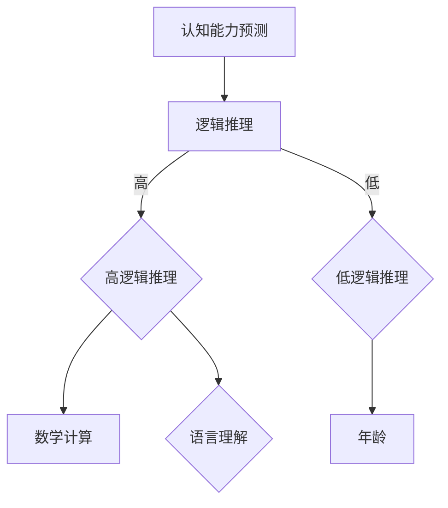

                 

### 1.1.1 书籍背景与目标

《儿童发展的认知地图：成长轨迹的数学模型》旨在通过数学模型与认知理论的结合，为儿童发展提供一种全新的理解方式。本书的核心目标是揭示儿童在不同年龄阶段认知发展的规律，以及这些规律背后的数学机制。

首先，书籍的背景源于当前儿童教育领域的一个迫切需求。尽管已有大量关于儿童发展的研究，但大多数研究往往侧重于定性描述，缺乏定量分析与预测能力。而数学模型作为一种强有力的工具，能够为儿童发展提供精确的量化分析，从而提高教育干预的有效性。

其次，本书的研究意义在于，它不仅为研究者提供了一种新的研究方法，也为教育工作者提供了一种实用的工具。通过建立数学模型，可以更精确地预测儿童在不同年龄段的发展水平，为教育决策提供科学依据。

具体来说，本书将分为以下几个部分：

1. **引论**：介绍书籍的背景、目标和研究意义。
2. **儿童发展的认知理论基础**：回顾已有的认知发展理论，并从神经科学视角探讨认知发展的机制。
3. **成长轨迹的数学模型构建**：详细介绍如何构建基于统计学和机器学习的数学模型。
4. **案例分析**：通过实际案例，验证数学模型的有效性。
5. **教育与干预策略**：基于模型结果，提出具体的教育与干预策略。

通过这一系列的探讨，本书希望能够为儿童发展研究提供一个系统、全面、可操作的研究框架，从而推动儿童认知发展研究的深入与发展。

### 1.1.2 研究现状与意义

在儿童发展的研究领域，已有大量关于认知发展的理论和实践探索。然而，这些研究大多数仍然停留在定性描述的层面，缺乏系统的定量分析和预测能力。近年来，随着大数据和人工智能技术的发展，研究者开始尝试将数学模型引入儿童发展研究，以期望提供更精确的分析工具。

当前的研究现状可以概括为以下几点：

1. **定性研究为主**：许多研究通过观察和实验，对儿童在不同年龄阶段的认知发展进行了描述，但往往缺乏量化的分析。
2. **数据缺乏**：由于儿童发展的复杂性和多样性，收集全面、准确的数据变得困难。这使得很多研究只能依赖于小样本或特定群体，从而限制了其普遍性。
3. **模型应用不足**：尽管已有一些研究者尝试使用数学模型分析儿童发展数据，但这些模型大多较为简单，无法充分捕捉复杂的发展规律。

基于上述现状，本书的研究意义主要体现在以下几个方面：

1. **填补研究空白**：通过引入数学模型，本书试图填补儿童发展研究中定量分析的空白，提供一种新的研究方法。
2. **提高研究精度**：数学模型能够通过对大量数据进行定量分析，提高研究的精确度，从而更准确地预测儿童的发展水平。
3. **指导教育实践**：通过建立数学模型，可以为教育工作者提供科学依据，帮助他们更有效地制定教育和干预策略，提高教育效果。

总之，本书的研究不仅有助于深化我们对儿童认知发展的理解，也为教育实践提供了有力的理论支持和操作工具。

### 1.1.3 儿童发展认知模型的构建原则

构建儿童发展认知模型需要遵循一系列原则，以确保模型的有效性和实用性。以下是几个关键原则：

1. **数据驱动**：模型构建应以大量真实数据为基础。通过收集和分析不同年龄段的儿童认知数据，可以更准确地捕捉发展规律。数据来源应多样化，包括问卷调查、实验数据、教育记录等，以确保数据的全面性和准确性。

2. **理论指导**：认知发展理论为模型构建提供了理论基础。例如，皮亚杰的认知发展理论提出了不同年龄段儿童思维特点的变化，这些理论可以作为模型构建的重要参考。此外，神经科学理论也为模型构建提供了关于大脑发育和功能的重要信息。

3. **模型简洁性**：模型应尽可能简洁，避免过度复杂化。简洁的模型不仅易于理解和解释，还能减少计算量和误差。模型的选择和参数设置应以简化为目标，同时确保模型具有足够的解释力和预测力。

4. **模型适应性**：模型应具有适应不同情境和背景的能力。这要求模型能够灵活调整参数，以适应不同文化、教育环境等因素的影响。模型的适应性可以通过引入变量、增加层次等方式来实现。

5. **验证与优化**：模型构建后，需要进行严格的验证和优化。通过对比模型预测结果与实际数据的差异，可以评估模型的准确性。如果模型预测不准确，应通过调整模型参数或改进算法来优化模型。此外，还需要进行多个案例的验证，以确保模型在不同数据集上的稳定性。

6. **可解释性**：模型构建不仅要追求预测准确性，还应注重可解释性。模型背后的数学原理和算法机制应清晰明了，以便教育工作者和研究人员能够理解和使用。通过可视化工具，如流程图、图表等，可以增强模型的可解释性。

遵循上述原则，构建的儿童发展认知模型不仅能够提供准确的发展预测，还能为教育实践提供有力的理论支持和操作指南。这有助于推动儿童认知发展研究的深入，提升教育干预的有效性。

### 第一部分：引论结束

在本书的第一部分中，我们介绍了《儿童发展的认知地图：成长轨迹的数学模型》的背景、目标和研究意义，并详细阐述了构建儿童发展认知模型所需遵循的原则。这一部分为后续内容的展开奠定了坚实的基础。在接下来的部分中，我们将深入探讨儿童发展的认知理论基础，并逐步构建数学模型，以揭示儿童认知发展的规律。

## 第二部分：儿童发展的认知理论基础

### 2.1.1 认知发展理论概述

认知发展理论是心理学和儿童发展研究中的重要领域，旨在探讨人类思维、感知、记忆等认知过程的发展规律。这一理论关注从出生到成年各个阶段个体认知能力的进步和变化，旨在解释如何通过学习和经验积累，个体逐渐建立起复杂的认知结构。

认知发展理论的历史可以追溯到20世纪初。瑞士心理学家让·皮亚杰（Jean Piaget）是这一领域的奠基者，他提出了著名的认知发展阶段理论。皮亚杰认为，儿童的认知发展可以分为四个主要阶段：感知运动阶段（0-2岁）、前运算阶段（2-7岁）、具体运算阶段（7-11岁）和形式运算阶段（11-15岁）。这些阶段代表了儿童从简单的感知动作到复杂的抽象思维的发展过程。

除了皮亚杰的理论，其他重要的发展理论还包括：

- **信息加工理论**：这一理论认为，认知发展是通过信息加工机制实现的，个体通过感知、注意、记忆、思维等过程来处理和利用信息。
- **社会文化理论**：由列夫·维果斯基（Lev Vygotsky）提出，强调社会交互和文化背景在认知发展中的作用。维果斯基认为，认知发展不仅仅是个体内部的生理变化，还受到社会和文化环境的影响。
- **认知建构主义**：这一理论强调，学习是一个主动建构知识的过程，个体通过与环境互动，建构和调整自己的认知结构。

这些理论从不同角度解释了认知发展的过程和机制，为我们理解和研究儿童认知发展提供了丰富的理论基础。在接下来的章节中，我们将进一步探讨皮亚杰的认知发展理论和神经科学视角下的认知发展，以深入理解儿童认知发展的本质。

### 2.1.2 皮亚杰的认知发展理论

让·皮亚杰（Jean Piaget）的认知发展理论是儿童发展心理学中一个重要的里程碑，该理论提出了认知发展的四个阶段，分别是感知运动阶段、前运算阶段、具体运算阶段和形式运算阶段。这些阶段不仅揭示了儿童认知能力的发展规律，还为教育实践提供了指导。

**感知运动阶段（0-2岁）**：在这一阶段，儿童主要通过感知和运动经验来认识世界。皮亚杰认为，婴儿在这一阶段的主要认知成就包括客体永恒性（物体存在即使不在视野中）和因果关系（理解物体之间的相互作用）的建立。这个阶段的儿童通过不断的动作实验，逐渐建立起对物理世界的基本理解。

**前运算阶段（2-7岁）**：前运算阶段的儿童开始使用语言和符号来表征事物，但他们的思维仍然以自我为中心，缺乏逻辑性和系统性。皮亚杰提出，这一阶段的儿童表现出泛灵性（认为外界事物有生命和意识）和不可逆思维（只能单向思考问题，无法反向推导）。此外，他们还不能进行守恒操作，即不能理解物理量的不变性。

**具体运算阶段（7-11岁）**：进入具体运算阶段，儿童的思维开始变得更具逻辑性和系统性。他们能够理解守恒概念，进行逆向思考和分类操作。皮亚杰认为，这一阶段的儿童开始能够解决具体的逻辑问题，并在社会互动中学会遵守规则。

**形式运算阶段（11-15岁）**：在形式运算阶段，儿童的思维进一步抽象化和系统化。他们能够进行假设推理，解决抽象的逻辑问题，形成系统的理论框架。这一阶段的儿童能够从多个角度思考问题，具有批判性思维和创造性思维。

皮亚杰的认知发展理论对教育实践具有重要影响。首先，它提醒教育工作者要认识到不同年龄阶段儿童的认知特点，因材施教。其次，理论强调了早期教育的重要性，认为早期经验对儿童的认知发展具有深远影响。最后，皮亚杰的理论为教育干预提供了理论基础，教育工作者可以通过设计符合儿童认知发展阶段的课程和活动，促进儿童的全面发展。

总之，皮亚杰的认知发展理论为我们提供了一个全面、系统的视角来理解儿童认知能力的发展，它不仅丰富了心理学理论，也为教育实践提供了宝贵的指导。

### 2.1.3 神经科学视角下的认知发展

神经科学视角下的认知发展研究为我们提供了关于大脑如何支持认知过程的新见解。随着神经成像技术和脑科学研究的不断进步，研究者们能够更深入地了解大脑的结构和功能如何影响儿童的认知发展。

**大脑结构变化**：从出生到成年，大脑的结构和功能会经历显著的变化。这些变化主要体现在灰质和白质的发育上。灰质主要与神经元和突触的发育有关，而白质则与神经元之间的连接和通信有关。在早期阶段，灰质的快速增长是儿童认知发展的关键。研究表明，1岁至3岁期间，大脑灰质体积增加最为显著，这反映了儿童在感知、运动和语言能力上的快速发展。随后，随着儿童进入学校教育阶段，灰质体积的增长速度逐渐减缓，而白质的发展变得更加重要，这标志着神经元连接的巩固和认知网络的成熟。

**大脑功能网络**：大脑不仅由单个结构组成，还由多个功能网络构成，这些网络在认知过程中协同工作。其中，前额叶皮质、顶叶皮质和颞叶皮质等区域在认知发展中扮演着重要角色。前额叶皮质与规划、决策和执行功能有关，顶叶皮质负责空间认知和数学计算，而颞叶皮质则与记忆和语言处理相关。研究表明，不同认知任务会激活特定的大脑区域，这些区域之间的协作和互动是认知发展的基础。

**神经可塑性**：神经可塑性是指大脑能够根据经验和学习调整其结构和功能的能力。儿童的大脑具有高度的神经可塑性，这使得他们在学习新技能和掌握新知识方面表现出色。例如，早期音乐训练被发现可以促进大脑的可塑性，从而提高儿童的认知能力和音乐技巧。此外，神经可塑性还与教育干预的效果密切相关。通过特定的认知训练和教育策略，可以增强特定大脑区域的功能，促进认知发展。

**环境与基因交互作用**：认知发展的神经科学研究表明，环境和基因之间相互作用对认知发展起着关键作用。遗传因素决定了大脑的基本结构和潜力，而环境则通过经验、教育和社交互动等方式，激活和调节这些潜力。例如，贫困环境下的儿童可能会因为缺乏适宜的学习机会而表现出认知发展的延迟，而良好的家庭和教育环境则有助于促进儿童的认知发展。

总之，神经科学视角下的认知发展研究为我们提供了深入了解儿童大脑如何支持认知过程的新途径。这些研究不仅有助于揭示认知发展的神经基础，还为教育实践提供了科学依据，指导我们如何通过优化环境和教育策略，促进儿童的全面发展。

### 2.2 儿童发展的核心认知过程

儿童在不同年龄阶段的认知发展是一个复杂而逐步的过程，其中感知与注意力、记忆与学习、思维与问题解决是核心的认知过程。这些过程不仅相互关联，而且对儿童的日常行为和未来发展具有深远的影响。

**感知与注意力**：感知是儿童认识世界的第一步，通过感官（如视觉、听觉、触觉等）收集外界信息。儿童的注意力发展与其感知能力密切相关。在婴儿期，儿童的注意力主要集中于简单的刺激，如移动的物体和鲜明的颜色。随着年龄的增长，他们的注意力逐渐转向更复杂的刺激，并能更好地集中注意力。这一阶段的核心认知成就包括客体永恒性的建立（即理解物体即使不在视线中仍然存在）和因果关系的发展（即理解事物之间的相互作用）。

**记忆与学习**：记忆是儿童学习和知识积累的重要基础。记忆可以分为短期记忆和长期记忆。短期记忆主要负责暂时存储和处理信息，如记住电话号码。长期记忆则负责将信息持久地存储在大脑中，如学习新知识。儿童在成长过程中，其记忆能力逐渐增强。早期教育研究表明，重复和多样化的学习活动有助于加强儿童的记忆能力。此外，学习过程中的情感体验和动机水平也会显著影响记忆效果。

**思维与问题解决**：思维是儿童认知发展的核心，包括理解、推理、判断和解决问题。早期儿童的思维以直观、具体的行动为基础，逐渐发展到抽象和逻辑推理。问题解决能力的发展是一个逐步的过程，儿童从简单的、直接的解决方案，逐渐发展到复杂的、多步骤的解决方案。例如，通过游戏和实验，儿童学会如何解决简单的拼图问题和逻辑谜题。研究表明，早期教育中的逻辑思维训练对儿童未来的学术和职业发展具有重要影响。

这些核心认知过程并不是孤立存在的，而是相互联系、相互促进的。感知和注意力的发展为记忆和学习提供了必要的信息输入，而记忆和学习又为思维和问题解决提供了基础。因此，理解这些核心认知过程及其相互关系，对于制定有效的教育策略至关重要。

### 2.2.1 感知与注意力

感知与注意力是儿童认知发展的基石，对他们的学习和发展起着至关重要的作用。在这一部分中，我们将详细探讨感知和注意力的定义、发展过程及其对儿童认知能力的提升。

**感知的定义与分类**：感知是指个体通过感官（如视觉、听觉、触觉、嗅觉和味觉）对外界信息的接收和解释过程。感知可以分为三大类：视觉感知、听觉感知和触觉感知。

- **视觉感知**：视觉是儿童最早发展的感官之一。新生儿出生后不久就能对光线和阴影做出反应，而随着视觉系统的成熟，儿童能够识别颜色、形状、大小和深度等视觉特征。视觉感知对于学习阅读、理解图形和进行空间认知至关重要。
- **听觉感知**：听觉感知主要涉及对声音的识别和分类。婴儿在出生后几周内就能区分不同类型的声音，如人类语言和动物叫声。随着大脑的发育，儿童能够理解语言的结构，并开始学习语言技能。
- **触觉感知**：触觉感知是指通过皮肤接触来获取外界信息。儿童在早期通过口腔和手的探索来感知世界，例如，通过吸吮、抓握和触摸来认识物体的质地和形状。触觉感知对于发展手眼协调能力和精细动作能力具有重要意义。

**注意力的定义与类型**：注意力是指个体在特定任务中集中精力、选择和过滤信息的能力。根据持续时间、选择性和集中程度，注意力可以分为以下几种类型：

- **选择性注意力**：选择性注意力是指个体在众多信息中能够选择和关注与任务相关的信息，而忽略无关信息。例如，当儿童在听故事时，能够集中注意力听故事内容，而忽略周围的其他声音。
- **持续性注意力**：持续性注意力是指个体在长时间内保持对任务的关注和努力。例如，儿童在上课时能够持续专注于教师的教学内容，而不是分心。
- **集中性注意力**：集中性注意力是指个体能够将所有注意力和努力集中在单一任务上。例如，当儿童在玩拼图游戏时，他们会完全投入，专注于找到正确的拼块。

**感知与注意力的发展过程**：

1. **感知能力的发展**：新生儿出生时，感知能力有限，但迅速发展。在婴儿期，儿童的视觉和触觉感知能力显著提升，他们开始能够区分不同的颜色和形状，并通过触摸探索周围环境。
2. **注意力的发展**：婴儿期的注意力主要集中在简单的刺激上，如移动的物体和高对比度的图案。随着年龄增长，儿童的注意力逐渐从简单的刺激转向复杂的任务，并能更好地控制注意力。
3. **注意力的转移与分配**：儿童在成长过程中，逐渐学会在多个任务之间转移和分配注意力。例如，他们可以一边做作业一边听音乐，或者在进行体育活动时同时与他人交流。

**感知与注意力对儿童认知能力的提升**：

- **增强学习效果**：良好的感知能力使儿童能够更有效地接收和理解外界信息，从而提高学习效果。例如，视觉感知能力的提升有助于儿童更好地理解和记忆课本内容。
- **促进问题解决**：注意力的发展使儿童能够更专注于解决问题的过程，从而提高问题解决能力。例如，在解决数学问题时，儿童需要集中注意力，仔细分析问题并找到解决方案。
- **培养专注习惯**：通过持续的注意力训练，儿童可以培养良好的专注习惯，这对他们的学习和生活都有长期的好处。

总之，感知与注意力在儿童认知发展中扮演着关键角色。通过了解这些过程及其发展规律，教育工作者可以制定更有效的教育策略，帮助儿童全面发展其认知能力。

#### 2.2.1.1 感知过程

感知过程是儿童认知发展的基础，涉及通过感官接收外部信息、处理这些信息并做出相应反应的复杂过程。以下是感知过程的定义、机制以及在不同年龄阶段的发展特点。

**感知过程的定义**：感知过程是指个体通过感官系统接收外部刺激，并对其进行识别、解释和反应的整个过程。感官系统包括视觉、听觉、触觉、嗅觉和味觉，每种感官都有其特定的功能。

- **视觉感知**：视觉系统通过眼睛接收光信号，并将其转化为神经信号，传递到大脑进行处理。视觉感知帮助儿童识别形状、颜色、空间关系和运动。
- **听觉感知**：听觉系统通过耳朵接收声波，并将其转化为神经信号，传递到大脑进行处理。听觉感知帮助儿童识别声音、理解语言和音乐。
- **触觉感知**：触觉系统通过皮肤接收触觉信息，如温度、压力和质地。触觉感知帮助儿童探索物体、理解和感受世界。
- **嗅觉和味觉**：嗅觉和味觉系统通过鼻子和舌头接收化学信号，帮助儿童识别食物和气味的特性。

**感知过程的机制**：感知过程涉及多个大脑区域和神经通路的协同工作。以下是感知过程的主要机制：

1. **信号接收**：感官系统接收外部刺激，并将其转化为电信号。
2. **信号处理**：大脑对信号进行处理和解释，包括信号放大、过滤、整合和分类。
3. **认知反应**：大脑根据处理后的信息做出认知反应，如识别物体、理解语言和执行动作。
4. **反馈调节**：感知过程受到反馈调节的影响，即通过反馈机制调整感官系统的输入和处理过程。

**感知过程在不同年龄阶段的发展特点**：

- **新生儿期**：新生儿的感官系统初步发育，能够对强刺激做出反应。例如，他们能够识别母亲的气味和声音，并通过视觉识别高对比度的图案。
- **婴儿期**：婴儿期的感知能力迅速发展。视觉和触觉能力尤其显著，他们能够识别不同的颜色和形状，并通过触摸和吸吮探索物体。
- **幼儿期**：幼儿的感知能力进一步发展，能够识别复杂的视觉和听觉信息。他们开始理解物体之间的因果关系，如推小车会导致小车移动。
- **学龄前期**：学龄前儿童的感知能力更加成熟，能够进行更复杂的信息处理和认知任务。他们能够通过视觉识别和记忆复杂的图形和故事情节。

感知过程的发展不仅依赖于感官系统的成熟，还受到大脑神经通路的连接和调节。研究表明，早期的感知刺激对大脑发育至关重要，充足的感知刺激有助于促进大脑网络的形成和功能整合。

总之，感知过程是儿童认知发展的基础，通过理解感知过程的定义、机制和不同年龄阶段的发展特点，我们可以更好地设计教育策略，促进儿童全面感知能力的发展。

##### 2.2.1.2 注意力的发展

注意力的发展是儿童认知发展过程中至关重要的一个方面，它影响儿童的学习效率、信息处理能力和行为调节能力。在这一部分中，我们将详细探讨注意力的发展阶段、影响因素及其对儿童认知能力的影响。

**注意力的发展阶段**：

1. **选择性注意力**：在早期，儿童主要表现出选择性注意力的特征。他们倾向于关注鲜艳、新颖或运动中的物体，而对静态、平凡或不突出的物体关注较少。这种选择性注意力有助于儿童从复杂环境中提取关键信息。
2. **持续性注意力**：随着年龄的增长，儿童的持续性注意力逐渐增强。他们能够更长时间地保持对单一任务的集中注意力，而不会轻易分心。这一阶段的儿童开始能够进行持续的学习和活动，如阅读书籍或完成作业。
3. **集中性注意力**：进入学龄期后，儿童的集中性注意力进一步发展。他们能够将所有注意力和努力集中在一个任务上，而不会受到外界干扰。这种集中性注意力对学术成就和问题解决能力至关重要。
4. **分配性注意力**：在青春期，儿童的分配性注意力逐渐成熟。他们能够同时关注多个任务，例如，在听老师讲解的同时，还可以记笔记或进行其他辅助活动。

**注意力发展的影响因素**：

1. **生物因素**：遗传因素和大脑发育对注意力的形成和发展有重要影响。例如，某些基因可能与注意力缺陷多动障碍（ADHD）相关，影响儿童注意力的集中和持久性。
2. **环境因素**：家庭教育和学校环境对注意力发展有显著影响。一个良好的家庭环境和结构化的教育课程有助于培养儿童的注意力。此外，充足的睡眠和健康饮食也对注意力的发展至关重要。
3. **心理因素**：动机、兴趣和情感状态也会影响注意力。例如，儿童对某个任务感兴趣时，更容易保持注意力。而负面的情感体验，如焦虑和压力，可能会干扰注意力。

**注意力发展对儿童认知能力的影响**：

1. **学习效果**：注意力的发展直接影响儿童的学习效率。注意力集中的儿童能够更好地理解和记忆学习内容，从而提高学习成绩。
2. **信息处理能力**：注意力有助于儿童有效地处理和整合信息。注意力集中的儿童能够更快速、准确地处理信息，并从中提取关键点。
3. **行为调节能力**：注意力的发展有助于儿童更好地控制和调节自己的行为。注意力集中的儿童能够更好地遵守规则、完成任务，并避免分心和冲动行为。
4. **社交能力**：注意力的发展还与社交能力密切相关。注意力集中的儿童能够更好地倾听他人、理解他人的情感和需求，从而建立积极的人际关系。

总之，注意力的发展是儿童认知发展的重要组成部分，对他们的学习、行为和社交能力具有深远的影响。通过了解注意力发展的阶段、影响因素及其对认知能力的影响，教育工作者和家长可以采取有效的干预措施，促进儿童注意力的健康发展。

#### 2.2.2 记忆与学习

记忆与学习是儿童认知发展的核心过程，它们不仅影响儿童当前的学习效果，还对未来的认知能力和行为产生深远的影响。在这一部分中，我们将详细探讨记忆与学习的概念、类型、机制以及它们对儿童认知能力的发展。

**记忆的定义**：记忆是指大脑对信息进行接收、编码、存储和提取的能力。记忆分为短期记忆和长期记忆。

- **短期记忆**：短期记忆主要负责临时存储和处理信息，通常只能保持几秒钟到几分钟。这种记忆形式对于日常生活中的任务，如记住电话号码、理解对话内容非常重要。
- **长期记忆**：长期记忆负责将信息持久地存储在大脑中，可以保持数分钟到数十年。长期记忆对于知识的积累和学习新技能至关重要。

**学习的定义**：学习是指通过经验或练习，改变大脑结构和功能的过程。学习可以涉及新知识的获取、技能的掌握和行为习惯的养成。

- **知识学习**：知识学习是指通过阅读、听讲和观察等方式获取新信息。知识学习是儿童认知发展的重要基础，如学习语言、科学概念和数学知识。
- **技能学习**：技能学习是指通过反复练习和操作，掌握特定的动作或认知技能。技能学习涉及各种活动，如绘画、体育运动和音乐演奏。

**记忆与学习的类型**：

- **根据记忆内容的不同**，记忆可以分为：

  - **形象记忆**：以视觉信息为主，如记住一幅画的细节。
  - **逻辑记忆**：以抽象概念和逻辑关系为主，如理解数学公式或概念。

- **根据记忆保持的时间长度**，记忆可以分为：

  - **短期记忆**：如前所述，短期记忆通常只能保持几秒钟到几分钟。
  - **长期记忆**：长期记忆可以持续数分钟到数十年。

**记忆与学习的过程机制**：

- **记忆过程**：

  1. **编码**：信息从感官接收并转化为大脑可以处理的形式。
  2. **存储**：经过编码的信息在大脑中被存储，可能涉及神经元之间的连接和突触强度的改变。
  3. **提取**：需要时，大脑能够检索和利用存储的信息。

- **学习过程**：

  1. **注意**：注意力的集中是学习的第一步，有助于信息的有效接收和编码。
  2. **编码**：学习过程中，信息被转换为大脑可以处理的形式，如语言、图像或动作。
  3. **巩固**：通过重复和练习，加强信息在大脑中的存储和连接。
  4. **提取**：在需要时，大脑能够检索和利用学到的信息。

**记忆与学习对儿童认知能力的影响**：

- **知识积累**：记忆和学习使儿童能够积累和扩展知识，形成更加复杂的认知结构。这对于学术成就和未来的职业发展至关重要。
- **认知发展**：记忆和学习是认知发展的基础，通过这些过程，儿童逐渐建立起对世界的理解和思考能力。
- **行为调节**：记忆和学习有助于儿童形成和遵守规则，养成良好的行为习惯。例如，记住家庭规则和学校规定，有助于儿童在社会环境中表现良好。
- **问题解决**：记忆和学习使儿童能够应用已有的知识和技能解决新问题。通过理解和应用已有的信息，儿童能够更有效地解决问题和面对挑战。

总之，记忆与学习是儿童认知发展的核心过程，它们相互促进，对儿童的认知能力、知识积累和行为调节具有深远的影响。通过理解和促进这些过程，教育工作者和家长可以有效地支持儿童的全面发展。

##### 2.2.2.1 短期记忆与长期记忆

短期记忆和长期记忆是大脑处理信息的重要机制，它们在不同时间和空间尺度上发挥作用，共同支撑儿童的认知功能。在这一部分中，我们将详细探讨这两种记忆形式的特点、机制及其对儿童认知能力的影响。

**短期记忆的特点**：

- **存储时间短暂**：短期记忆通常只能维持几秒钟到几分钟。这意味着它主要用于处理和临时存储需要即时使用的信息。例如，当孩子在学习时，需要记住老师刚刚讲解的公式或概念，以便立即使用。
- **容量有限**：短期记忆的容量相对较小，一般只能同时处理少量的信息。例如，成年人通常能够记住7±2个无关联的数字或单词。这种有限的容量意味着儿童在学习新信息时，需要不断地复习和重复，以确保信息不被遗忘。
- **依赖感觉输入**：短期记忆主要依赖于感觉输入，如视觉、听觉和触觉。例如，孩子通过听老师讲解或看书来获取信息，然后将其暂时存储在短期记忆中。

**短期记忆的机制**：

- **神经机制**：短期记忆涉及到大脑中多个区域的协同作用，包括前额叶皮质、海马体和顶叶皮质。这些区域通过神经元的激活和突触传递来处理和存储信息。
- **认知机制**：短期记忆的过程包括编码、存储和提取。编码是指将感官输入转换为神经信号，存储是指将信息在大脑中保持一段时间，提取是指当需要时，能够快速检索和利用这些信息。

**长期记忆的特点**：

- **存储时间持久**：长期记忆可以持续数分钟到数十年，甚至终身难忘。这意味着它用于存储和保留重要信息，如个人经历、知识和技能。
- **容量大且多样化**：与短期记忆不同，长期记忆的容量几乎无限，可以存储各种类型的信息，包括语言、图像、情感和动作记忆。
- **依赖语义和意义**：长期记忆更依赖于信息的意义和语义，而非感觉输入。例如，孩子通过理解学习内容的意义，将其存储在长期记忆中，而不是简单地记住文字或公式。

**长期记忆的机制**：

- **神经机制**：长期记忆涉及到大脑中多个区域的长期改变，包括前额叶皮质、海马体和新皮层。这些区域的神经元连接和突触强度的变化是长期记忆存储的关键。
- **认知机制**：长期记忆的过程包括编码、存储和提取。编码是指通过重复和复习，将信息从短期记忆转化为长期记忆，存储是指通过神经元之间的强化和连接，将信息持久地存储在大脑中，提取是指当需要时，能够快速检索和利用这些信息。

**短期记忆与长期记忆对儿童认知能力的影响**：

- **学习效果**：短期记忆使儿童能够处理和记忆即时需要的信息，如课堂笔记和作业任务。而长期记忆则使儿童能够积累和扩展知识，形成复杂的认知结构。
- **知识积累**：长期记忆有助于儿童将学习的新知识整合到已有的知识体系中，形成更加广泛和深入的理解。例如，通过长期记忆，孩子能够记住学过的数学公式，并应用于解决实际问题。
- **行为调节**：短期记忆有助于儿童遵循规则和完成日常任务，而长期记忆则使儿童能够形成和维持良好的行为习惯。例如，孩子能够记住家庭规则和学校规定，从而在社会环境中表现出良好的行为。
- **问题解决**：通过短期记忆和长期记忆的结合，儿童能够更有效地解决问题和应对挑战。例如，他们能够记住已有的知识和经验，并将其应用于新的情境中。

总之，短期记忆和长期记忆在儿童认知发展中发挥着重要作用。理解这两种记忆形式的特点和机制，有助于教育工作者和家长制定有效的教育策略，促进儿童的认知发展和学习效果。

##### 2.2.2.2 学习过程的理论

学习是一个复杂的认知过程，涉及到信息获取、处理和存储。理解学习过程的机制对于优化教育策略、提高学习效果至关重要。在这一部分中，我们将探讨几种主要的学习理论，包括行为主义学习理论、认知学习和建构主义学习理论。

**行为主义学习理论**：行为主义学习理论强调环境和行为之间的关系，认为学习是通过外部刺激和行为的反复强化的结果。这一理论由约翰·华生（John B. Watson）和巴甫洛夫（Ivan Pavlov）等人提出，主要观点包括：

- **条件反射**：巴甫洛夫的经典实验表明，通过条件刺激（如铃声）和无条件刺激（如食物）的结合，可以建立条件反射。例如，通过不断重复喂食前播放铃声，狗听到铃声时也会分泌唾液。
- **操作性条件反射**：由斯金纳（B.F. Skinner）提出，认为行为通过奖惩系统进行调节。如果某一行为后跟随积极的后果（如奖励），该行为就会增加；反之，如果跟随消极的后果（如惩罚），该行为就会减少。例如，孩子在完成作业后得到表扬，就会更有动力完成后续作业。

**认知学习理论**：认知学习理论关注个体的内在心理过程，强调信息的处理和内部表征。主要观点包括：

- **信息加工**：认知学习理论认为，学习是一个信息处理的过程，个体通过感知、编码、存储和提取信息来学习。例如，儿童在阅读时，会将文字转换为语音，然后理解文字的含义。
- **学习策略**：认知学习理论强调学习策略的使用，如记忆术、笔记法和复述。通过这些策略，个体能够更好地组织和记忆信息。例如，使用思维导图可以帮助儿童更清晰地理解复杂的概念。
- **元认知**：元认知是指个体对自己认知过程的意识和调节能力。元认知能力包括计划、监控和评估学习过程。例如，儿童可以通过自我反思，评估自己的学习效果，并调整学习策略。

**建构主义学习理论**：建构主义学习理论强调学习是一个主动建构知识的过程，个体通过与环境互动，主动构建对世界的理解。主要观点包括：

- **社会互动**：建构主义认为，学习是一个社会过程，个体通过与他人的互动，共同构建知识。例如，小组合作学习可以促进学生对知识的理解和应用。
- **情境性**：知识不是抽象的，而是与具体情境和经验相关的。例如，通过实际操作和实验，儿童能够更好地理解科学概念。
- **意义构建**：学习是一个意义构建的过程，个体通过将新信息与已有知识联系起来，构建新的认知结构。例如，儿童通过实验和观察，将新的科学知识整合到已有的知识体系中。

总之，行为主义、认知学习和建构主义是学习领域的三大主要理论。这些理论为我们理解学习过程提供了不同的视角，有助于教育工作者和家长制定有效的教育策略，促进儿童的全面发展。

##### 2.2.3 思维与问题解决

思维和问题解决是儿童认知发展的核心能力，它们不仅影响儿童的学术成就，还影响他们的日常行为和生活质量。在这一部分中，我们将探讨思维和问题解决的定义、类型、发展过程及其对儿童认知能力的影响。

**思维的类型**：

1. **分析性思维**：分析性思维是一种通过分解复杂问题，识别关键部分和关系，从而解决问题的思维方式。例如，通过拆解复杂的问题，找出每个部分的原因和结果，逐步找到解决方案。
2. **创造性思维**：创造性思维是一种通过生成新的想法和解决方案，寻找不同寻常的方法来解决问题的思维方式。例如，在解决一个难题时，儿童可能会尝试多种不同的方法，而不是仅仅依赖传统的方法。
3. **批判性思维**：批判性思维是一种通过评估信息的可信度和有效性，分析论证和逻辑推理来解决问题的思维方式。例如，在阅读时，儿童需要评估作者的观点，识别论证中的逻辑漏洞，并形成自己的判断。

**问题解决的定义与发展过程**：

1. **问题定义**：问题解决的第一步是明确问题的性质和目标。儿童需要理解问题的背景和目标，从而确定问题的解决方案。
2. **信息收集**：在明确问题后，儿童需要收集相关信息，以便更好地理解问题。这包括通过观察、实验、询问和调查等方式获取信息。
3. **方案生成**：在收集信息后，儿童需要生成可能的解决方案。这可以通过头脑风暴、讨论和实验等方式实现。
4. **方案评估**：生成解决方案后，儿童需要评估每个方案的有效性和可行性，选择最佳的解决方案。
5. **方案实施**：选择最佳方案后，儿童需要实施解决方案，并观察其实际效果。
6. **反馈与调整**：在实施解决方案后，儿童需要根据结果进行反馈和调整，以优化解决方案。

**思维与问题解决的发展过程**：

1. **感知与直观阶段**：在这个阶段，儿童的思维主要基于直观感受和直接经验。他们通过感官和直觉来理解问题，并尝试简单的解决方案。
2. **具体性阶段**：随着年龄的增长，儿童的思维逐渐从直观感受转向具体性。他们能够使用具体的工具和方法来解决问题，例如使用算术方法解决数学问题。
3. **抽象性阶段**：在抽象性阶段，儿童的思维变得更加抽象和逻辑。他们能够使用符号和概念来表示问题，并通过逻辑推理来解决问题。
4. **批判性思考阶段**：在批判性思考阶段，儿童的思维更加成熟和复杂。他们能够批判性地分析信息，评估不同的解决方案，并形成自己的判断。

**思维与问题解决对儿童认知能力的影响**：

1. **学术成就**：良好的思维和问题解决能力有助于儿童在学术领域取得成功。通过思维和问题解决，儿童能够更好地理解复杂的概念和理论，并应用这些知识解决实际问题。
2. **创造力**：创造性思维是创造力的重要基础。通过创造性思维，儿童能够生成新的想法和解决方案，从而推动创新和发明。
3. **适应能力**：思维和问题解决能力使儿童能够更好地适应新的环境和挑战。他们能够通过逻辑思考和批判性分析，找到解决问题的方法。
4. **情绪调节**：问题解决能力有助于儿童在面对困难和挑战时保持积极和乐观的态度。通过解决问题，儿童能够提高自信心和情绪稳定性。

总之，思维和问题解决是儿童认知发展的关键能力，对他们的学术成就、创造力、适应能力和情绪调节具有深远的影响。通过理解这些能力的发展过程和影响，教育工作者和家长可以采取有效的教育策略，促进儿童的全面发展。

##### 2.2.3.1 思维的类型

思维是人类认知活动中最核心的部分，它包括多种类型，每种类型都有其特定的应用和功能。以下是几种主要的思维类型及其在儿童认知发展中的应用。

**1. 分析性思维**

分析性思维是一种通过分解复杂问题，识别关键部分和关系，从而解决问题的思维方式。这种思维有助于儿童在学术和日常生活中面对复杂问题时，能够有条理地进行思考和决策。

- **应用场景**：在数学解题、科学实验、作文写作等任务中，分析性思维是非常重要的。例如，在解决一个数学难题时，儿童需要将问题分解为多个小步骤，逐一分析每个步骤的可行性，并最终找到解决方案。
- **发展策略**：培养分析性思维的方法包括提供具体的实例和练习，鼓励儿童多角度思考问题，并逐步引导他们学会分解复杂问题。

**2. 创造性思维**

创造性思维是一种通过生成新的想法和解决方案，寻找不同寻常的方法来解决问题的思维方式。创造性思维对于儿童的创造力和创新能力的培养至关重要。

- **应用场景**：在艺术创作、科技发明、团队协作等活动中，创造性思维能够发挥重要作用。例如，在艺术创作中，儿童可以通过自由表达和创意思维，创作出独特的作品。
- **发展策略**：培养创造性思维的方法包括提供多样化的材料和资源，鼓励儿童进行想象和探索，以及组织头脑风暴和创意工作坊等活动。

**3. 批判性思维**

批判性思维是一种通过评估信息的可信度和有效性，分析论证和逻辑推理来解决问题的思维方式。批判性思维有助于儿童在信息过载的时代，能够理性地分析和判断信息。

- **应用场景**：在学术研究、批判性阅读、公共演讲等任务中，批判性思维是非常重要的。例如，在阅读文章时，儿童需要评估作者的观点，识别论证中的逻辑漏洞，并形成自己的判断。
- **发展策略**：培养批判性思维的方法包括提供批判性阅读和讨论的材料，鼓励儿童提出质疑和反驳，以及教授逻辑推理和论证方法。

**4. 系统性思维**

系统性思维是一种通过理解系统内部各个组成部分及其相互关系，来分析和解决问题的思维方式。这种思维有助于儿童在面对复杂问题时，能够从整体角度进行思考和决策。

- **应用场景**：在项目管理、环境保护、城市规划等任务中，系统性思维能够发挥重要作用。例如，在制定一个环保计划时，儿童需要考虑不同因素之间的相互作用，并找到最优的解决方案。
- **发展策略**：培养系统性思维的方法包括提供复杂问题解决案例，鼓励儿童进行系统分析和设计，以及教授系统思考和模型构建方法。

总之，不同的思维类型在儿童的认知发展中扮演着重要角色。通过理解这些思维类型的定义、应用场景和发展策略，教育工作者和家长可以有效地促进儿童全面、多样化的认知能力发展。

##### 2.2.3.2 问题解决的理论

问题解决是一个复杂的过程，涉及到信息的收集、分析、决策和实施。在这一部分中，我们将详细探讨问题解决的主要理论，包括传统的四阶段模型、现代认知心理学模型以及系统化问题解决模型。

**传统的四阶段模型**：

传统的四阶段模型是问题解决研究中最经典的理论之一，由赫伯特·西蒙（Herbert A. Simon）提出。这个模型将问题解决过程分为以下四个阶段：

1. **问题识别**：这一阶段的核心任务是识别问题并理解问题的性质。儿童需要明确问题的背景、目标和约束条件，以便为后续阶段做好准备。
2. **方案生成**：在明确问题后，儿童需要生成可能的解决方案。这一阶段通常采用头脑风暴等方法，鼓励儿童尽可能多地提出不同的解决方案。
3. **方案评估**：生成解决方案后，儿童需要对每个方案进行评估，选择最优的解决方案。评估标准可能包括解决方案的可行性、效果和成本等因素。
4. **方案实施**：选择最佳方案后，儿童需要实施解决方案，并观察其实际效果。实施过程中，儿童需要不断调整和优化方案，以确保最终达到目标。

**现代认知心理学模型**：

现代认知心理学模型强调问题解决过程中的认知活动，包括信息的编码、存储和提取。乔治·米勒（George A. Miller）和约翰·安德森（John Anderson）提出了一种基于信息加工理论的模型，该模型将问题解决过程分为以下几个步骤：

1. **问题表征**：问题表征是指将问题转化为大脑可以处理的形式。这一步骤包括理解问题的背景、目标和约束条件，并将其转化为具体的任务。
2. **方案搜索**：在问题表征后，儿童开始搜索可能的解决方案。这一步骤通常涉及记忆搜索和认知策略的应用，如启发式搜索和计划性搜索。
3. **方案选择**：方案搜索后，儿童需要对每个方案进行评估，选择最佳的解决方案。这一步骤依赖于儿童的认知能力和问题背景。
4. **方案实施与调整**：选择最佳方案后，儿童开始实施解决方案，并在实施过程中进行监控和调整。这一步骤确保解决方案能够达到预期的目标。

**系统化问题解决模型**：

系统化问题解决模型是一种更加综合和系统的方法，它将问题解决过程视为一个动态系统，涉及多个环节的相互影响和反馈。罗伯特·特鲁比（Robert H. Truby）提出的系统化问题解决模型包括以下步骤：

1. **问题诊断**：在问题识别后，儿童需要深入诊断问题的根本原因，以确定问题解决的方向。
2. **方案制定**：根据问题诊断，儿童制定详细的解决方案，包括具体的行动步骤、资源和时间安排。
3. **方案实施**：实施解决方案，并监控实施过程中的关键指标，以确保解决方案的有效性。
4. **效果评估**：在方案实施完成后，儿童需要对效果进行评估，以验证解决方案的有效性，并收集反馈信息。
5. **方案优化**：根据评估结果，儿童需要对方案进行调整和优化，以提高解决方案的可行性和效果。

总之，不同的问题解决理论提供了不同的视角和方法，但共同目标都是帮助儿童有效地解决问题。通过理解这些理论，教育工作者和家长可以设计出更加科学和有效的问题解决策略，促进儿童的认知发展和问题解决能力的提升。

### 2.3 认知发展的阶段模型

认知发展的阶段模型是心理学研究中用于描述个体在不同年龄阶段认知能力变化的重要工具。这些模型不仅帮助我们理解儿童认知发展的规律，还为教育实践提供了重要的指导。在本节中，我们将详细探讨三个主要阶段模型：早期认知发展、中期认知发展和晚期认知发展。

#### 2.3.1 早期认知发展

早期认知发展通常指新生儿至3岁期间的发展。这个阶段是认知能力快速发展的时期，婴儿通过感知、运动和简单的符号理解来逐步构建对世界的认识。

- **新生儿与婴儿期（0-1岁）**：在这一阶段，婴儿主要通过感官体验和简单的运动反应来认识世界。他们开始发展对声音、颜色、形状和触觉的敏感度。例如，婴儿能够通过视觉识别人脸，并通过模仿声音和表情来理解交流。

- **幼儿期（1-3岁）**：在幼儿期，儿童的认知能力进一步发展，他们开始表现出更复杂的认知行为。幼儿期的核心成就包括：

  - **语言发展**：婴儿逐渐学会理解和使用语言，从简单的单词发展到复杂的句子。
  - **空间认知**：幼儿开始理解物体之间的空间关系，能够识别上下、前后和左右等方向。
  - **因果关系**：幼儿能够理解简单的因果关系，如推小车会导致小车移动。

#### 2.3.2 中期认知发展

中期认知发展通常指3至11岁期间的发展。这个阶段儿童的认知能力逐步成熟，开始能够进行更复杂的思维活动。

- **学龄前期（3-5岁）**：在学龄前期，儿童的语言能力和认知过程进一步发展。他们能够更好地理解和运用抽象概念，如数量、形状和颜色。学龄前儿童还开始表现出较强的记忆力，能够记住和复述故事和歌曲。

- **小学阶段（6-11岁）**：在小学阶段，儿童的认知能力进一步成熟，他们能够进行更复杂的逻辑思维和问题解决。小学阶段的儿童表现出以下特点：

  - **逻辑思维**：儿童能够理解基本的逻辑关系，如因果、条件和逆向思维。
  - **概念形成**：他们能够将抽象的概念与具体的事物联系起来，如理解重量和体积的概念。
  - **记忆能力**：小学儿童的短期记忆和长期记忆能力都有显著提升，能够更好地记住和复述学习内容。

#### 2.3.3 晚期认知发展

晚期认知发展通常指11岁至成年期间的发展。这个阶段的认知能力逐渐达到成熟，个体开始能够进行高级的认知活动，如抽象思维和元认知。

- **中学阶段（11-15岁）**：在中学阶段，儿童开始进入形式运算阶段，能够进行复杂的抽象思维和假设推理。中学儿童表现出以下特点：

  - **抽象思维**：他们能够理解抽象的概念和原理，如数学中的符号运算和科学中的理论模型。
  - **元认知**：中学儿童能够意识到自己的思维过程，并对自己的学习进行反思和调整。
  - **问题解决**：他们能够使用高级策略解决复杂的问题，如使用演绎法和归纳法进行推理。

- **青年早期（16-20岁）**：在青年早期，认知能力进一步发展，个体开始形成稳定的认知风格和思维方式。青年早期表现出以下特点：

  - **自我认知**：青年开始意识到自己的个性和价值观，并对其进行反思和调整。
  - **批判性思维**：他们能够批判性地分析信息和观点，形成独立的思想。
  - **创造力**：青年早期是个体创造力发展的重要时期，他们能够通过创新思维和实验性活动探索新的可能性。

总之，认知发展的阶段模型为我们提供了理解儿童认知能力发展的框架。通过了解不同阶段的认知特点，教育工作者和家长可以更好地支持儿童的认知发展，促进他们的全面成长。

##### 2.3.1.1 新生儿与婴儿期

新生儿与婴儿期（0-1岁）是儿童认知发展的关键阶段，这一时期的认知能力发展主要依赖于感知、运动和简单的符号理解。以下是这一阶段的具体特点和核心成就。

**感知发展**：新生儿和婴儿期的感知发展极为迅速。他们主要通过视觉、听觉、触觉、嗅觉和味觉来感知外界环境。

- **视觉发展**：新生儿在出生后不久就能对光线和阴影做出反应。大约在一个月大时，婴儿开始能够识别人脸，这是视觉感知发展的一个重要里程碑。随着视觉系统的成熟，婴儿能够识别颜色和形状，并逐渐发展出深度感知能力。
- **听觉发展**：婴儿在出生后不久就能对声音做出反应，如对母亲的声音表现出偏爱。大约在3个月大时，婴儿开始能够识别不同的声音，并能够区分语言和非语言的声音。
- **触觉发展**：婴儿通过口腔和手的探索来感知世界。他们在出生后不久就能控制手的运动，并在几个月内逐渐发展出触觉敏感度，能够区分物体的质地和温度。

**运动发展**：新生儿和婴儿期的运动发展主要包括从反射动作到有意动作的转变。

- **反射动作**：新生儿出生时主要依靠本能反射动作，如抓握反射和巴宾斯基反射。这些反射动作有助于婴儿在出生后的生存和适应。
- **有意动作**：随着大脑和肌肉的控制能力的提高，婴儿逐渐能够进行有意动作。例如，3个月大的婴儿能够控制头部和躯干，6个月大的婴儿能够翻身，9个月大的婴儿能够爬行，而1岁大的婴儿能够独立站立和行走。

**符号理解**：尽管新生儿和婴儿的语言能力尚未成熟，但他们已经开始通过简单的符号理解来认识世界。

- **面部表情和手势**：婴儿通过观察和理解面部表情和手势来识别情感和需求。例如，他们能够识别父母的面部表情，并对其产生反应。
- **简单语言**：大约在6个月大时，婴儿开始能够理解简单的词汇，如“水”、“奶”等。随着语言能力的提高，他们逐渐能够理解更复杂的语言指令。

**核心成就**：新生儿与婴儿期的核心成就包括：

- **感知能力的提升**：婴儿能够识别颜色、形状、声音和质地，并开始建立对物理世界的理解。
- **运动技能的发展**：婴儿能够进行有意的运动，如翻身、爬行和行走，这有助于他们探索周围环境。
- **符号理解能力的增强**：婴儿能够通过面部表情、手势和简单的语言理解他人的情感和需求，并逐渐建立起初步的社交能力。

总之，新生儿与婴儿期的认知发展是儿童整体认知能力发展的基础。这一时期的感知、运动和符号理解能力的发展，为后续认知能力的提升奠定了坚实的基础。理解这一阶段的特点和核心成就，有助于教育工作者和家长更好地支持儿童的发展。

##### 2.3.1.2 幼儿期

幼儿期（1-3岁）是儿童认知能力迅速发展的关键时期，这一阶段的儿童开始通过语言、思维、社交互动等多种方式来认识和理解世界。以下是幼儿期的具体特点和核心成就。

**语言发展**：在幼儿期，儿童的语言能力迅速发展，他们能够理解和使用越来越多的词汇和句子。

- **词汇扩展**：幼儿在1-2岁时词汇量迅速增加，能够理解并使用数百个词汇。这一阶段的儿童尤其擅长学习新词汇，并通过模仿和重复来学习和巩固这些词汇。
- **句子结构**：随着语言能力的提升，幼儿开始能够使用简单句和复合句进行交流。他们能够将两个或更多的简单句子组合成复杂的句子，表达更复杂的意思。
- **语言理解**：幼儿期的儿童不仅能够理解具体的语言指令，还能理解抽象的概念和比喻。例如，他们能够理解“很大”、“很快”等抽象词汇，并能够理解故事和寓言中的隐喻。

**思维发展**：幼儿期的思维开始从具体性向抽象性转变，他们能够进行简单的逻辑推理和分类。

- **分类能力**：幼儿能够根据不同的特征对物体进行分类，如根据颜色、形状或功能分类。例如，他们能够将不同的水果放在一起，或将不同的玩具按颜色分组。
- **因果关系**：幼儿开始理解简单的因果关系，如推小车会导致小车移动，或者用勺子敲击桌子会产生声音。这种对因果关系的基本理解有助于他们探索和理解周围的世界。
- **问题解决**：幼儿期的儿童能够通过简单的逻辑推理和实验来解决问题。例如，他们可能会通过尝试不同的方法来找到隐藏的玩具，或者通过观察和模仿来学习新的技能。

**社交互动**：幼儿期的社交能力逐渐发展，他们开始能够理解和尊重他人的情感和需求。

- **同伴互动**：幼儿开始与其他儿童玩耍和合作，学习分享和轮流等社交技能。他们能够通过语言和非语言的方式与同伴交流，共同完成游戏和活动。
- **情感理解**：幼儿能够识别和理解他人的情感，如高兴、生气、伤心等。他们能够通过表情、声音和身体语言来表达自己的情感，并学会安慰和帮助他人。
- **规则意识**：幼儿开始意识到社会规则的存在，如游戏规则、家庭规则和学校规则。他们能够通过观察和模仿来学习这些规则，并尝试遵守和内化这些规则。

**核心成就**：幼儿期的核心成就包括：

- **语言能力的提升**：幼儿能够理解和使用越来越多的词汇和句子，表达更复杂的意思。
- **思维能力的增强**：幼儿能够进行简单的逻辑推理和分类，理解因果关系，并具备初步的问题解决能力。
- **社交能力的进步**：幼儿能够与其他儿童进行有效的互动，理解他人的情感和需求，并遵守社会规则。

总之，幼儿期是儿童认知能力发展的重要时期。在这一阶段，语言、思维和社交能力的发展为儿童的全面发展奠定了坚实的基础。通过理解这一阶段的特点和核心成就，教育工作者和家长可以更好地支持儿童的认知发展。

##### 2.3.2.1 学龄前儿童

学龄前儿童（3-5岁）正处于认知能力快速发展的关键阶段，这一时期的儿童开始通过丰富的语言、复杂的思维和多样的社交互动来全面认识和理解世界。以下是学龄前儿童的具体特点和核心成就。

**语言能力的发展**：

- **词汇量的扩大**：学龄前儿童的词汇量迅速增加，能够理解和使用数百甚至上千个词汇。他们通过阅读、听故事和日常交流不断积累新词汇。
- **语法结构的掌握**：学龄前儿童开始掌握更复杂的语法结构，能够使用复合句和从句表达复杂的意思。例如，他们能够使用“如果...那么...”的结构进行假设性陈述。
- **沟通能力的提升**：学龄前儿童的语言表达能力显著增强，他们能够更清晰地表达自己的想法和需求，并通过语言与他人进行有效的沟通。

**思维能力的发展**：

- **分类能力**：学龄前儿童能够根据不同的特征对物体和概念进行分类，如颜色、形状、大小和功能。这种分类能力有助于他们更好地理解和组织信息。
- **逻辑推理**：学龄前儿童开始进行简单的逻辑推理，能够理解因果关系和条件关系。例如，他们能够理解“如果...就...”的逻辑结构，并运用这种逻辑进行推理。
- **问题解决**：学龄前儿童能够运用逻辑思维和实验方法来解决问题。例如，他们可能会通过尝试不同的方法来找到隐藏的玩具，或者通过分析和比较来选择最佳方案。

**社交能力的发展**：

- **同伴关系**：学龄前儿童开始与同龄儿童建立稳定的同伴关系，通过合作和分享来共同完成任务。他们能够理解和尊重他人的感受，并通过合作解决问题。
- **情感理解**：学龄前儿童能够识别和理解他人的情感，如高兴、生气、伤心等。他们能够通过表情、声音和身体语言来表达自己的情感，并学会安慰和帮助他人。
- **社交规则**：学龄前儿童开始意识到社交规则的存在，如游戏规则、家庭规则和学校规则。他们能够通过观察和模仿来学习这些规则，并尝试遵守和内化这些规则。

**核心成就**：

- **语言能力的提升**：学龄前儿童能够使用复杂的句子结构表达复杂的意思，词汇量和沟通能力显著提升。
- **思维能力的增强**：学龄前儿童能够进行分类、逻辑推理和问题解决，理解因果关系和条件关系。
- **社交能力的进步**：学龄前儿童能够与其他儿童建立稳定的同伴关系，理解他人的情感和需求，并遵守社交规则。

总之，学龄前儿童在语言、思维和社交能力方面表现出显著的发展，这些成就为他们的全面发展奠定了坚实的基础。通过理解这一阶段的特点和核心成就，教育工作者和家长可以更好地支持儿童的认知和社会发展。

##### 2.3.2.2 小学阶段

小学阶段（6-11岁）是儿童认知能力快速发展的重要时期，这一时期的儿童在语言、思维和社交能力方面都取得了显著进步。以下是小学阶段的具体特点和核心成就。

**语言能力的发展**：

- **词汇量的扩大**：小学阶段的儿童语言能力进一步提升，他们的词汇量迅速增加。他们能够理解和使用更加复杂的词汇，并在阅读和写作中运用这些词汇。
- **语法结构的掌握**：随着语言能力的提高，小学阶段的儿童开始熟练掌握复杂的语法结构，如从句、并列句和复合句。他们能够使用这些结构来表达复杂的思想和感受。
- **阅读理解**：小学阶段的儿童开始进行更深入的阅读理解，能够理解文章的主题、结构和论点。他们能够识别和解释文本中的关键词和概念，并从中提取重要信息。
- **写作能力**：在这个阶段，小学阶段的儿童开始学习写作技巧，能够撰写短文和故事。他们的写作内容更加具体和详细，能够使用恰当的语法结构和词汇。

**思维能力的发展**：

- **逻辑思维**：小学阶段的儿童能够进行更加复杂的逻辑思维，能够理解并应用逻辑推理来解决实际问题。他们能够识别和分析问题，并使用逻辑方法找到解决方案。
- **数学能力**：数学能力在小学阶段得到了显著的发展。儿童开始学习基本的数学概念和运算规则，如加法、减法、乘法和除法。他们能够解决简单的数学问题，并进行逻辑推理和数学证明。
- **创造性思维**：小学阶段的儿童也开始表现出创造性思维的能力，能够通过创新和实验来探索新的解决方案和方法。他们在艺术和科技活动中展现出了丰富的想象力和创造力。

**社交能力的发展**：

- **同伴关系**：小学阶段的儿童开始建立更加稳定的同伴关系，他们能够与其他儿童合作，分享资源和共同完成任务。他们学会了如何与他人友好相处，解决冲突，并建立积极的人际关系。
- **社交规则**：在这个阶段，儿童开始更加意识到社交规则的重要性，并开始自觉遵守这些规则。他们能够理解和尊重社会规范，如学校规则、班级规则和家庭规则。
- **情感理解**：小学阶段的儿童能够更好地理解和表达自己的情感，并能够识别和理解他人的情感。他们学会了如何通过言语和非言语的方式表达情感，并能够安慰和帮助他人。

**核心成就**：

- **语言能力的提升**：小学阶段的儿童能够使用复杂的词汇和语法结构表达自己的思想和感受，阅读理解能力显著增强，写作能力有所提高。
- **思维能力的增强**：小学阶段的儿童能够进行复杂的逻辑思维和数学推理，创造性思维能力也有所提升。
- **社交能力的进步**：小学阶段的儿童建立了稳定的同伴关系，学会了遵守社交规则，并能够理解和表达情感。

总之，小学阶段是儿童认知能力全面发展的重要时期。在这一阶段，儿童的语言、思维和社交能力都取得了显著进步，这些成就为他们的未来学习和生活打下了坚实的基础。通过理解这一阶段的特点和核心成就，教育工作者和家长可以更好地支持儿童的全面发展。

##### 2.3.3.1 中学生

中学生阶段（11-15岁）是儿童向青少年过渡的重要时期，这一时期的认知发展表现出显著的特点，涉及到思维能力的提升、情感波动和社会关系的复杂化。以下是中学生阶段的具体特点和核心成就。

**思维能力的发展**：

- **抽象思维**：进入中学生阶段，学生的思维能力逐步走向抽象化。他们开始能够处理更加复杂的概念和理论，如数学中的几何证明、物理中的力学原理和化学中的化学反应。抽象思维的发展使他们能够从具体的事物中提炼出抽象的概念，进行逻辑推理和分析。
- **批判性思维**：中学生的批判性思维能力显著提高。他们不仅能够接受现有的知识和观点，还能对其进行质疑和分析，识别论据中的逻辑错误和论证缺陷。这种批判性思维能力有助于他们形成独立和理性的思考习惯。
- **系统化思维**：中学生开始运用系统化的思维方式来分析和解决问题。他们能够将复杂的问题分解为多个部分，逐一分析和解决，并能够从整体角度理解问题的内在联系和结构。

**情感波动**：

- **自我认同**：中学生开始探索和形成自己的自我认同，包括对性别、个性、价值观等方面的认识。这一阶段的学生往往对自我认同的问题感到困惑，但也充满探索和试错的动力。
- **情感表达**：中学生的情感表达更加复杂和多样化。他们能够识别和理解复杂的情感，如自尊、羞愧、焦虑和兴奋等。同时，他们学会了通过言语和非言语的方式表达情感，包括直接的言语表达、身体语言和艺术表达等。

**社会关系的发展**：

- **同伴关系**：中学生开始建立更加复杂和稳定的同伴关系。他们能够与同伴建立深厚的友谊，共同参与社交活动，并通过合作和竞争来建立和维持这些关系。同时，中学生也开始意识到同伴群体对他们行为和价值观的影响。
- **家庭关系**：中学生与家庭的关系也发生了变化。他们开始对父母的指导和建议产生质疑，试图独立思考和做出决策。这种独立性的追求有时会导致与父母之间的冲突，但也促使他们学会如何处理家庭关系。
- **社会参与**：中学生开始积极参与社会活动，如志愿服务、社团活动和社区事务。这些活动不仅有助于他们发展社交技能，还增强了对社会责任和公民意识的认知。

**核心成就**：

- **思维能力**：中学生能够进行抽象思维、批判性思维和系统化思维，能够处理复杂的概念和理论。
- **情感表达**：中学生能够识别和理解复杂的情感，并通过多种方式表达情感。
- **社会关系**：中学生建立了稳定和复杂的同伴关系、家庭关系和社会参与，学会了处理各种人际关系。

总之，中学生阶段是认知能力、情感波动和社会关系发展的重要时期。这一阶段的成就为他们的未来教育和职业发展奠定了坚实的基础。通过理解这一阶段的特点和核心成就，教育工作者和家长可以更好地支持中学生的全面发展。

##### 2.3.3.2 高中生与青年早期

高中生与青年早期（16-20岁）是青少年认知发展的重要阶段，这一时期的个体在认知能力、情感和社会关系等方面经历着显著的变化和发展。以下是高中生与青年早期阶段的具体特点和核心成就。

**认知能力的发展**：

- **抽象思维**：高中生和青年早期阶段的个体思维能力进一步成熟，能够进行高度复杂的抽象思维。他们能够处理复杂的数学、科学和哲学问题，形成抽象概念和理论框架。例如，高中生能够理解并应用微积分、概率论和量子力学等复杂理论。
- **批判性思维**：这一阶段的个体批判性思维能力显著增强，他们能够对信息进行深入的质疑和分析，识别并反驳论证中的逻辑错误。这种批判性思维能力有助于他们在学术研究、科学探究和决策过程中做出更理性的判断。
- **创造力**：高中生和青年早期阶段的个体在创造力方面表现出显著的发展。他们能够通过创新思维和实验性活动探索新的解决方案和方法，表现出强烈的求知欲和探索精神。这种创造力在科学创新、艺术创作和创业活动中尤为重要。

**情感波动**：

- **自我认同**：高中生和青年早期阶段的个体开始对自己的身份和价值观进行深入的探索和反思。他们对自己的性别、种族、文化背景和价值观有更清晰的认识，并可能经历自我认同的波动和转变。
- **情感表达**：这一阶段的个体情感表达更加丰富和细腻。他们能够识别和理解复杂的情感，如羞愧、自豪、焦虑和兴奋等。同时，他们学会了通过语言、艺术、体育等多种方式表达情感，增强情感调节能力。
- **情感独立**：高中生和青年早期阶段的个体逐渐实现情感独立，能够独立处理情感问题，应对生活中的挑战和压力。这种情感独立性有助于他们建立健康的人际关系和应对未来的挑战。

**社会关系的发展**：

- **同伴关系**：高中生和青年早期阶段的个体继续建立和维持复杂的同伴关系。他们能够与同伴建立深厚的友谊，共同参与学术、体育和社交活动。同伴关系不仅有助于他们的情感支持，还促进了他们的社会技能和人际交往能力。
- **家庭关系**：这一阶段的个体与家庭的关系变得更加复杂。他们开始对父母的指导和建议产生质疑，试图独立思考和做出决策。同时，他们也更加关注家庭中的情感交流和亲子互动，通过沟通和理解来建立和谐的家庭关系。
- **社会参与**：高中生和青年早期阶段的个体积极参与社会活动，如志愿服务、社团活动和社区事务。这些活动不仅有助于他们发展社会技能，增强社会责任感，还为他们提供了实践和锻炼的机会。

**核心成就**：

- **认知能力**：高中生和青年早期阶段的个体能够进行高度复杂的抽象思维、批判性思维和创造力，掌握并应用复杂的科学和数学理论。
- **情感发展**：这一阶段的个体能够识别和理解复杂的情感，表达情感，实现情感独立，并建立健康的人际关系。
- **社会参与**：高中生和青年早期阶段的个体积极参与社会活动，发展社会技能，增强社会责任感。

总之，高中生与青年早期阶段的认知、情感和社会关系发展为其未来的教育和职业发展奠定了坚实的基础。通过理解这一阶段的特点和核心成就，教育工作者和家长可以更好地支持青少年的全面发展。

### 第二部分结束

在本书的第二部分中，我们详细探讨了儿童发展的认知理论基础，从认知发展理论概述、皮亚杰的认知发展理论、神经科学视角下的认知发展，到儿童发展的核心认知过程，如感知与注意力、记忆与学习、思维与问题解决。通过这一系列的探讨，我们不仅深入理解了儿童认知发展的基本规律，也为后续数学模型的构建奠定了坚实的理论基础。下一部分将聚焦于成长轨迹的数学模型构建，通过统计学和机器学习的方法，揭示儿童认知发展的规律和轨迹。读者可以期待在这一部分中，我们将运用专业的技术语言和详细的案例分析，构建出一个科学、系统的认知发展模型。

## 第三部分：成长轨迹的数学模型构建

在第二部分中，我们详细探讨了儿童发展的认知理论基础，为构建成长轨迹的数学模型提供了理论依据。本部分将重点介绍如何利用统计学和机器学习的方法来构建成长轨迹的数学模型，包括模型概述、具体方法和技术工具的使用。

### 3.1 数学模型概述

数学模型是一种通过数学方法描述和模拟现实世界的工具，它在各个领域都有广泛应用。在儿童发展的研究中，数学模型可以帮助我们理解和预测儿童的认知发展轨迹，从而为教育和干预提供科学依据。

**数学模型在儿童发展研究中的应用**：

1. **描述发展轨迹**：通过数学模型，可以描述儿童在不同年龄阶段的认知能力变化，形成发展轨迹图。这些轨迹图有助于我们直观地了解儿童发展的趋势和规律。
2. **预测未来发展**：基于现有的数据和模型，可以预测儿童未来的认知发展水平，帮助教育工作者和家长制定个性化的教育计划。
3. **评估干预效果**：数学模型可以评估不同的教育和干预策略对儿童认知发展的效果，从而优化教育方案。

**数学模型的构建原则**：

1. **数据驱动**：模型的构建应基于大量的实证数据，通过数据分析和挖掘来揭示认知发展的规律。
2. **理论指导**：构建模型时，应结合已有的认知发展理论和研究成果，确保模型具有科学性和合理性。
3. **模型简洁性**：模型应尽可能简洁，避免过度复杂化，以提高模型的解释力和可操作性。
4. **模型适应性**：模型应具有适应性，能够根据不同的环境和背景进行调整，以适应不同地区和文化背景的儿童。

### 3.2 基于统计学的方法

统计学是构建成长轨迹数学模型的重要工具，通过描述性统计和推断性统计，我们可以从数据中提取有价值的信息，揭示儿童认知发展的规律。

**描述性统计**：

描述性统计主要用于描述数据的特征，常用的统计量包括均值、中位数、众数、方差、标准差等。这些统计量可以帮助我们了解儿童在不同年龄阶段的认知能力分布和趋势。

1. **均值和标准差**：均值是数据的平均值，用于描述儿童在不同年龄段认知能力的平均水平。标准差是数据分布的离散程度，用于描述儿童认知能力的波动范围。
2. **标准分数**：标准分数（Z分数）是一种标准化度量，通过将原始数据与均值和标准差进行比较，可以描述儿童认知能力在总体中的相对位置。

**推断性统计**：

推断性统计主要用于从样本数据推断总体特征，常用的方法包括假设检验和参数估计。

1. **假设检验**：假设检验用于判断样本数据是否支持某个假设。通过设置显著性水平和检验统计量，可以判断样本数据是否具有统计学上的显著性。
2. **参数估计**：参数估计用于估计总体参数的值。通过样本数据，可以估计总体的均值、方差等参数，从而推断总体特征。

**统计学方法在成长轨迹模型中的应用**：

1. **构建标准化曲线**：通过描述性统计，可以构建不同年龄阶段的认知能力标准化曲线，直观地展示儿童认知能力的变化趋势。
2. **评估模型拟合度**：通过推断性统计，可以评估构建的数学模型对数据的拟合度，确保模型能够准确描述儿童认知发展的规律。

### 3.3 基于机器学习的方法

机器学习是近年来发展迅速的一个领域，它在数据处理和模式识别方面具有强大的能力。通过机器学习的方法，可以构建更复杂、更精确的成长轨迹数学模型。

**监督学习**：

监督学习是指通过已标记的训练数据，训练模型进行预测和分类。常用的监督学习方法包括线性回归、决策树和神经网络等。

1. **线性回归**：线性回归是一种简单但有效的预测方法，通过建立自变量和因变量之间的线性关系，可以预测儿童未来的认知发展水平。
2. **决策树**：决策树是一种基于规则的学习方法，通过一系列的条件分支，可以预测儿童在不同年龄阶段的认知能力。
3. **神经网络**：神经网络是一种模拟人脑神经网络结构的学习方法，通过多层神经元的连接和激活，可以处理复杂的非线性关系。

**非监督学习**：

非监督学习是指在没有标记数据的情况下，通过发现数据中的隐含结构和模式。常用的非监督学习方法包括聚类分析和主成分分析等。

1. **聚类分析**：聚类分析通过将相似的数据点归为一类，可以揭示儿童认知能力的分布和群组特征。
2. **主成分分析**：主成分分析通过降维和提取主要成分，可以简化数据结构，揭示儿童认知能力的核心因素。

**机器学习在成长轨迹模型中的应用**：

1. **模型选择与评估**：通过比较不同机器学习方法的性能，选择最适合构建成长轨迹模型的方法。常用的评估指标包括准确率、召回率和F1分数等。
2. **模型优化与调整**：通过调整模型的参数和结构，优化模型性能，提高模型的预测精度和泛化能力。
3. **模型应用与扩展**：将构建好的模型应用于实际数据，预测儿童未来的认知发展水平，为教育和干预提供科学依据。

通过统计学和机器学习的方法，我们可以构建一个科学、系统的成长轨迹数学模型，揭示儿童认知发展的规律和轨迹。在下一部分中，我们将详细讨论如何选择和评估模型，以及如何应用和优化模型，以实现最佳的教育效果。

### 3.2 基于统计学的方法

在构建成长轨迹的数学模型时，基于统计学的方法是不可或缺的工具。统计学通过描述性统计和推断性统计，为我们提供了一种量化和分析数据的有效手段。以下是具体方法和应用的详细阐述。

**描述性统计**

描述性统计主要用于对数据进行基本描述，帮助研究者了解数据的基本特征和分布情况。以下是几种常用的描述性统计方法：

1. **均值**：均值是数据集中所有数值的平均值，用于表示数据的中心趋势。计算公式为：
   $$\text{均值} = \frac{\sum_{i=1}^{n} x_i}{n}$$
   其中，\(x_i\) 是第 \(i\) 个数据点，\(n\) 是数据点的总数。

2. **中位数**：中位数是将数据按大小顺序排列后，位于中间位置的数值，用于表示数据的中间值。如果数据点的个数是奇数，中位数就是中间的那个数；如果是偶数，则是中间两个数的平均值。

3. **众数**：众数是数据中出现次数最多的数值，用于表示数据的典型值。

4. **方差和标准差**：方差是衡量数据离散程度的指标，计算公式为：
   $$\text{方差} = \frac{\sum_{i=1}^{n} (x_i - \bar{x})^2}{n-1}$$
   其中，\(\bar{x}\) 是均值。标准差是方差的平方根，用于表示数据的波动程度。计算公式为：
   $$\text{标准差} = \sqrt{\text{方差}}$$

**应用描述性统计构建标准化曲线**

在儿童认知发展的研究中，标准化曲线是一种非常有用的工具，它可以帮助我们直观地了解不同年龄阶段的认知能力分布和变化趋势。以下是构建标准化曲线的步骤：

1. **收集数据**：首先，我们需要收集大量关于儿童认知能力的数据，包括不同年龄阶段的认知测试得分。
2. **计算描述性统计量**：对收集到的数据进行描述性统计，计算均值、标准差等统计量。
3. **构建标准化曲线**：将每个年龄阶段的认知测试得分转换为标准分数（Z分数），然后绘制成曲线。标准分数的计算公式为：
   $$z = \frac{x - \mu}{\sigma}$$
   其中，\(x\) 是测试得分，\(\mu\) 是均值，\(\sigma\) 是标准差。

**推断性统计**

推断性统计主要用于从样本数据推断总体特征，通过假设检验和参数估计等方法，我们可以评估样本数据是否代表总体特征，以及总体的参数值。

1. **假设检验**

   假设检验是一种常用的推断性统计方法，它用于判断样本数据是否支持某个假设。以下是假设检验的基本步骤：

   - **提出零假设（\(H_0\)）和备择假设（\(H_1\)）**：通常零假设表示没有效应或没有差异，备择假设表示有效应或有差异。
   - **选择显著性水平（\(\alpha\)）**：显著性水平通常设置为0.05或0.01，表示我们愿意接受错误的概率。
   - **计算检验统计量**：根据数据的分布和假设，计算检验统计量，如t统计量、卡方统计量等。
   - **做出结论**：将计算出的检验统计量与临界值进行比较，如果检验统计量大于临界值，则拒绝零假设，接受备择假设。

2. **参数估计**

   参数估计是通过样本数据估计总体参数的方法。常用的参数估计方法包括点估计和区间估计。

   - **点估计**：点估计是通过样本统计量直接估计总体参数的值。例如，用样本均值估计总体均值，用样本方差估计总体方差。
   - **区间估计**：区间估计是通过样本统计量估计总体参数的范围，通常用置信区间表示。置信区间给出了在一定的置信水平下，总体参数的可能取值范围。

**统计学方法在成长轨迹模型中的应用**

1. **构建标准化曲线**：通过描述性统计方法，构建不同年龄阶段的认知能力标准化曲线，帮助研究者直观地了解儿童认知能力的变化趋势。
2. **评估模型拟合度**：通过推断性统计方法，评估构建的数学模型对数据的拟合度。如果拟合度较低，则需要调整模型参数或重新选择模型。
3. **预测儿童未来认知发展水平**：基于已有的数据和模型，使用统计学方法预测儿童未来的认知发展水平，为教育和干预提供科学依据。

总之，基于统计学的方法在构建成长轨迹的数学模型中起着关键作用。通过描述性统计和推断性统计，我们可以从数据中提取有价值的信息，构建科学、系统的数学模型，揭示儿童认知发展的规律和轨迹。

#### 3.2.1 描述性统计

描述性统计是数据分析中的基础工具，主要用于对数据的特征进行概括和描述。在构建成长轨迹的数学模型时，描述性统计能够帮助我们理解儿童认知能力在不同年龄阶段的分布和趋势。以下是几种常用的描述性统计量，以及它们在模型构建中的应用。

**1. 均值（Mean）**

均值是数据集中所有数值的平均值，用于表示数据的中心位置。计算公式为：

\[ \text{均值} = \frac{\sum_{i=1}^{n} x_i}{n} \]

其中，\( x_i \) 表示第 \( i \) 个数据点，\( n \) 表示数据点的总数。在儿童认知能力的研究中，均值可以帮助我们了解不同年龄阶段认知能力的平均水平。例如，我们可以计算3岁、5岁、7岁等不同年龄段儿童的认知测试得分均值，从而比较不同年龄阶段的认知发展水平。

**2. 方差（Variance）和标准差（Standard Deviation）**

方差是衡量数据离散程度的指标，计算公式为：

\[ \text{方差} = \frac{\sum_{i=1}^{n} (x_i - \mu)^2}{n-1} \]

其中，\( \mu \) 是均值。标准差是方差的平方根，用于表示数据的波动程度。计算公式为：

\[ \text{标准差} = \sqrt{\text{方差}} \]

在儿童认知能力研究中，方差和标准差可以帮助我们了解不同年龄阶段认知能力的稳定性。例如，通过比较不同年龄阶段的方差和标准差，我们可以评估认知能力的波动情况，从而判断哪些年龄阶段的认知发展较为稳定。

**3. 离散度（Discrepancy）**

离散度是一种衡量数据离散程度的指标，计算公式为：

\[ \text{离散度} = \sum_{i=1}^{n} |x_i - \mu| \]

离散度越大，表示数据的波动范围越大，离散度越小，表示数据分布越集中。

**4. 极值（Extremes）**

极值包括最大值（Maximum）和最小值（Minimum），用于表示数据的最大值和最小值。最大值和最小值可以帮助我们了解数据的范围。

**应用描述性统计构建标准化曲线**

构建标准化曲线是描述性统计在儿童认知能力研究中的一个重要应用。标准化曲线通过将原始数据转换为标准分数（Z分数），使得不同年龄阶段的认知能力数据能够在同一尺度上进行比较。标准化曲线的构建步骤如下：

1. **计算均值和标准差**：对每个年龄阶段的认知能力数据，计算均值和标准差。
2. **计算标准分数**：对于每个数据点 \( x_i \)，计算其标准分数：

\[ z = \frac{x_i - \mu}{\sigma} \]

其中，\( \mu \) 是均值，\( \sigma \) 是标准差。

3. **绘制标准化曲线**：将计算得到的标准分数绘制成曲线，横轴表示年龄阶段，纵轴表示标准分数。

通过标准化曲线，我们可以直观地看到不同年龄阶段认知能力的变化趋势，例如，认知能力是否随年龄增加而提升，或者是否存在某个年龄阶段的认知发展瓶颈。

**示例：**

假设我们有一组3岁、5岁、7岁儿童的认知测试得分，如下表所示：

| 年龄 | 得分 |
| --- | --- |
| 3岁 | 80 |
| 5岁 | 90 |
| 7岁 | 95 |

计算这些数据的均值、方差和标准差：

- **均值**：
  \[ \text{均值} = \frac{80 + 90 + 95}{3} = 89 \]
- **方差**：
  \[ \text{方差} = \frac{(80-89)^2 + (90-89)^2 + (95-89)^2}{3-1} = \frac{121 + 1 + 36}{2} = 71.5 \]
- **标准差**：
  \[ \text{标准差} = \sqrt{71.5} \approx 8.5 \]

计算每个得分点的标准分数：

| 年龄 | 得分 | 标准分数 |
| --- | --- | --- |
| 3岁 | 80 | -1.18 |
| 5岁 | 90 | 0.00 |
| 7岁 | 95 | 0.82 |

绘制标准化曲线，横轴为年龄，纵轴为标准分数，可以得到如下曲线：

\[ \text{标准分数} = \frac{\text{得分} - \text{均值}}{\text{标准差}} \]

这种标准化曲线可以帮助我们直观地了解不同年龄阶段认知能力的变化情况。通过比较不同年龄阶段的标准分数，我们可以发现认知能力是否随年龄增长而提升，或者是否存在某些年龄阶段的认知发展瓶颈。

总之，描述性统计是构建成长轨迹数学模型的重要工具，通过均值、方差、标准差等统计量，我们可以描述儿童认知能力的分布和变化趋势，从而为后续的数学模型构建提供基础数据。

##### 3.2.1.2 构建标准化曲线

构建标准化曲线是描述性统计在儿童发展研究中的一项重要应用，它有助于我们直观地了解不同年龄阶段的认知能力变化。以下是构建标准化曲线的具体步骤和方法。

**步骤 1：数据收集**

首先，我们需要收集不同年龄段儿童的认知能力数据。这些数据可以来源于各种认知测试，如语言理解、数学计算、逻辑推理等。收集的数据应包括不同年龄阶段的测试得分，以确保能够构建全面的标准化曲线。

**步骤 2：计算描述性统计量**

对收集到的数据进行描述性统计，计算每个年龄阶段的均值（\(\mu\)）和标准差（\(\sigma\)）。这些统计量将用于构建标准化曲线。计算公式如下：

- **均值**：
  \[ \mu = \frac{\sum_{i=1}^{n} x_i}{n} \]
  其中，\(x_i\) 表示第 \(i\) 个数据点，\(n\) 表示数据点的总数。

- **标准差**：
  \[ \sigma = \sqrt{\frac{\sum_{i=1}^{n} (x_i - \mu)^2}{n-1}} \]

**步骤 3：计算标准分数（Z分数）**

为了将不同年龄阶段的认知能力数据进行比较，我们需要将每个得分转换为标准分数，即Z分数。计算公式如下：

\[ z = \frac{x_i - \mu}{\sigma} \]

其中，\(x_i\) 是第 \(i\) 个数据点的得分，\(\mu\) 是均值，\(\sigma\) 是标准差。

**步骤 4：绘制标准化曲线**

将计算得到的Z分数按年龄阶段绘制成曲线。横轴表示年龄阶段，纵轴表示标准分数。以下是一个简化的示例：

```plaintext
标准分数
|
|         1
|        /
|       /
|      /
|     /
|    /
|   /
|  /
| /
|/
+--------------------------------------
     年龄阶段
```

在这个示例中，我们假设有三个年龄阶段的Z分数，分别为3岁、5岁和7岁。通过绘制这些点的连接曲线，我们可以直观地看到不同年龄阶段认知能力的变化趋势。

**示例：**

假设我们收集了以下三个年龄段（3岁、5岁、7岁）的儿童认知测试得分：

| 年龄 | 得分 |
| --- | --- |
| 3岁 | 85 |
| 5岁 | 95 |
| 7岁 | 105 |

计算这些数据的均值和标准差：

- **均值**：
  \[ \mu = \frac{85 + 95 + 105}{3} = 95 \]

- **标准差**：
  \[ \sigma = \sqrt{\frac{(85-95)^2 + (95-95)^2 + (105-95)^2}{3-1}} = \sqrt{\frac{(-10)^2 + 0 + 10^2}{2}} = \sqrt{75} \approx 8.7 \]

计算每个得分点的标准分数：

| 年龄 | 得分 | 标准分数 |
| --- | --- | --- |
| 3岁 | 85 | -0.77 |
| 5岁 | 95 | 0.00 |
| 7岁 | 105 | 0.51 |

绘制标准化曲线：

```plaintext
标准分数
|
|         0.51
|        /
|       /
|      /
|     /
|    /
|   /
|  /
| /
|/
+--------------------------------------
     年龄阶段
    3岁    5岁    7岁
```

通过这个标准化曲线，我们可以清晰地看到儿童认知能力随着年龄增长而提升的趋势。同时，曲线还可以帮助我们识别可能存在的认知发展瓶颈或异常点。

总之，构建标准化曲线是描述性统计在儿童发展研究中的一个重要应用。通过计算和绘制标准化曲线，我们可以直观地了解不同年龄阶段的认知能力变化，为后续的数学模型构建提供基础数据和分析工具。

##### 3.2.2 推断性统计

推断性统计是在数据收集完成后，通过样本数据推断总体特征的方法。在构建成长轨迹的数学模型时，推断性统计可以帮助我们评估模型的准确性和可靠性。以下是几种主要的推断性统计方法，包括假设检验和参数估计。

**1. 假设检验**

假设检验是推断性统计中的一种重要方法，用于判断样本数据是否支持某个假设。假设检验通常包括以下几个步骤：

- **提出零假设（\(H_0\)）和备择假设（\(H_1\)）**：零假设通常表示没有显著差异或没有显著效应，备择假设则表示有显著差异或显著效应。
- **选择显著性水平（\(\alpha\)）**：显著性水平是我们在统计检验中愿意接受错误的概率，通常选择0.05或0.01。
- **计算检验统计量**：根据数据类型和假设，计算适当的检验统计量，如t统计量、卡方统计量等。
- **做出结论**：将计算出的检验统计量与临界值进行比较，如果检验统计量大于临界值，则拒绝零假设，接受备择假设。

**2. 参数估计**

参数估计是通过样本数据估计总体参数的方法。参数估计包括点估计和区间估计：

- **点估计**：点估计是通过样本统计量直接估计总体参数的值。例如，用样本均值估计总体均值，用样本方差估计总体方差。
- **区间估计**：区间估计是通过样本统计量估计总体参数的范围，通常用置信区间表示。置信区间给出了在一定的置信水平下，总体参数的可能取值范围。

**应用推断性统计评估模型**

在构建成长轨迹的数学模型时，我们可以使用推断性统计方法来评估模型的准确性和可靠性。以下是具体的步骤和应用：

- **模型拟合度评估**：通过假设检验，我们可以评估构建的模型对数据的拟合度。如果模型拟合度较低，则可能需要调整模型参数或重新选择模型。
- **参数估计**：通过参数估计，我们可以估计模型中的关键参数，如均值、方差等，这些参数可以用于预测儿童未来的认知发展水平。
- **置信区间**：通过置信区间，我们可以了解模型预测的不确定性范围，这有助于我们制定更加稳健的教育和干预策略。

**示例：**

假设我们使用线性回归模型来预测儿童未来的认知发展水平。我们收集了10名儿童的当前认知测试得分和年龄数据，并构建了线性回归模型：

\[ y = 10 + 2x \]

其中，\(y\) 是预测的得分，\(x\) 是年龄。

我们可以通过以下步骤来评估模型：

1. **计算样本均值和标准差**：计算当前认知测试得分的样本均值和标准差，以评估模型的拟合度。
2. **计算t统计量**：通过样本均值和标准差，计算t统计量，以判断模型是否显著。
3. **计算置信区间**：根据t统计量，计算置信区间，以了解预测得分的不确定性范围。

通过这些推断性统计方法，我们可以评估模型的准确性和可靠性，为儿童未来的发展和教育提供科学依据。

总之，推断性统计是构建成长轨迹数学模型中不可或缺的工具。通过假设检验和参数估计，我们可以评估模型的准确性和可靠性，从而为教育和干预提供有效的支持。

##### 3.2.2.2 假设检验

假设检验是统计学中用于判断样本数据是否支持某个假设的重要方法。在构建成长轨迹的数学模型时，假设检验可以帮助我们评估模型的拟合度和预测能力。以下是假设检验的基本原理、步骤和具体应用。

**基本原理**

假设检验基于两个对立的假设：零假设（\(H_0\)）和备择假设（\(H_1\)）。零假设通常表示没有显著差异或没有显著效应，而备择假设则表示有显著差异或显著效应。通过假设检验，我们试图从样本数据中推断总体特征，并做出是否拒绝零假设的决策。

**步骤**

1. **提出零假设和备择假设**：首先，我们需要明确研究的具体问题，并明确提出零假设和备择假设。例如，在研究儿童认知能力的发展时，我们可以提出以下假设：

   - 零假设（\(H_0\)）：儿童的认知能力在各个年龄段之间没有显著差异。
   - 备择假设（\(H_1\)）：儿童的认知能力在各个年龄段之间有显著差异。

2. **选择显著性水平（\(\alpha\)）**：显著性水平（\(\alpha\)）是我们在统计检验中愿意接受错误的概率。通常，\(\alpha\) 选择为0.05或0.01，表示我们愿意接受5%或1%的假阳性率。

3. **计算检验统计量**：根据数据类型和假设，选择适当的检验统计量。常见的检验统计量包括t统计量、卡方统计量、F统计量等。这些统计量可以通过样本数据计算得出。

4. **做出决策**：将计算出的检验统计量与临界值进行比较。如果检验统计量大于临界值，则拒绝零假设，接受备择假设；如果检验统计量小于临界值，则无法拒绝零假设。

**应用**

在成长轨迹的数学模型构建中，假设检验可以用于以下方面：

1. **模型拟合度评估**：通过假设检验，我们可以评估构建的数学模型对数据的拟合度。例如，我们可以使用t检验来评估回归模型中的系数是否显著。如果系数显著，则说明模型对数据的拟合度较高。

2. **预测能力评估**：通过假设检验，我们可以评估模型对未来数据的预测能力。例如，我们可以使用t检验来评估预测值与实际值之间的差异是否显著。如果差异显著，则说明模型可能存在预测偏差。

3. **变量筛选**：在构建复杂模型时，我们可以使用假设检验来筛选重要的变量。通过比较不同变量的显著性水平，我们可以选择对模型拟合度有显著影响的变量，从而简化模型结构。

**示例**

假设我们使用线性回归模型来预测儿童的认知能力。我们收集了10名儿童的当前认知测试得分和年龄数据，并构建了线性回归模型：

\[ y = 10 + 2x \]

其中，\(y\) 是预测的得分，\(x\) 是年龄。

为了评估模型的拟合度，我们可以进行以下步骤：

1. **计算样本均值和标准差**：计算当前认知测试得分的样本均值和标准差。

   \[ \bar{y} = \frac{1}{10} \sum_{i=1}^{10} y_i = \frac{1}{10} (85 + 90 + 95 + ... + 105) = 97 \]

   \[ s_y = \sqrt{\frac{1}{10-1} \sum_{i=1}^{10} (y_i - \bar{y})^2} \approx 5.2 \]

2. **计算t统计量**：计算回归系数的t统计量。

   \[ t = \frac{\hat{\beta}_1}{s_{\hat{\beta}_1}} \]

   其中，\(\hat{\beta}_1\) 是回归系数，\(s_{\hat{\beta}_1}\) 是回归系数的标准误差。

   \[ \hat{\beta}_1 = 2 \]

   \[ s_{\hat{\beta}_1} = \frac{s_y}{\sqrt{\sum_{i=1}^{10} (x_i - \bar{x})^2}} \]

   \[ s_{\hat{\beta}_1} \approx \frac{5.2}{\sqrt{100}} \approx 0.522 \]

   \[ t = \frac{2}{0.522} \approx 3.8 \]

3. **做出决策**：比较t统计量与临界值。如果t统计量大于临界值（假设\(\alpha = 0.05\)时，临界值为1.96），则拒绝零假设，认为回归系数显著。

   \[ t = 3.8 > 1.96 \]

   因此，我们可以拒绝零假设，认为年龄对认知能力的预测具有显著影响。

通过上述步骤，我们使用假设检验评估了线性回归模型的拟合度和预测能力。这种方法可以帮助我们在构建成长轨迹的数学模型时，确保模型的有效性和可靠性。

总之，假设检验是构建成长轨迹数学模型的重要工具，它通过评估模型的拟合度和预测能力，帮助我们构建出科学、可靠的模型，为儿童的发展提供有效的支持和指导。

##### 3.2.2.2.1 线性回归分析

线性回归分析是一种常用的统计方法，用于研究自变量和因变量之间的线性关系。在构建成长轨迹的数学模型时，线性回归分析可以帮助我们理解和预测儿童认知能力的发展趋势。以下将详细讨论线性回归分析的基本原理、公式、应用和解释。

**基本原理**

线性回归分析旨在找到一个最佳拟合直线，将因变量（如认知能力得分）与自变量（如年龄）联系起来。这个拟合直线可以表示为：

\[ y = \beta_0 + \beta_1x + \epsilon \]

其中，\(y\) 是因变量，\(x\) 是自变量，\(\beta_0\) 和 \(\beta_1\) 是回归系数，\(\epsilon\) 是误差项。

**基本公式**

线性回归的基本公式包括：

1. **回归系数的估计**：
   \[ \beta_0 = \bar{y} - \beta_1\bar{x} \]
   \[ \beta_1 = \frac{\sum_{i=1}^{n}(x_i - \bar{x})(y_i - \bar{y})}{\sum_{i=1}^{n}(x_i - \bar{x})^2} \]

   其中，\(\bar{y}\) 和 \(\bar{x}\) 分别是因变量和自变量的均值，\(n\) 是样本数量。

2. **预测值的计算**：
   \[ \hat{y} = \beta_0 + \beta_1x \]

   其中，\(\hat{y}\) 是预测的因变量值。

**应用步骤**

1. **数据收集**：首先，我们需要收集关于儿童认知能力和年龄的数据。
2. **数据预处理**：对数据进行清洗和处理，包括缺失值的处理、异常值的识别和转换等。
3. **拟合回归模型**：使用最小二乘法拟合线性回归模型，计算回归系数。
4. **模型评估**：通过计算R平方值、标准误差等指标，评估模型拟合度。
5. **预测**：利用拟合的模型，对新的数据进行预测。

**具体应用**

假设我们收集了以下数据：

| 年龄（x）| 认知能力（y）|
| ------- | ---------- |
| 3       | 85         |
| 4       | 90         |
| 5       | 95         |
| 6       | 100        |
| 7       | 105        |

通过上述数据，我们可以使用线性回归分析来预测儿童在8岁时的认知能力。

1. **计算均值**：
   \[ \bar{x} = \frac{3 + 4 + 5 + 6 + 7}{5} = 5 \]
   \[ \bar{y} = \frac{85 + 90 + 95 + 100 + 105}{5} = 95 \]

2. **计算回归系数**：
   \[ \beta_1 = \frac{(3-5)(85-95) + (4-5)(90-95) + (5-5)(95-95) + (6-5)(100-95) + (7-5)(105-95)}{(3-5)^2 + (4-5)^2 + (5-5)^2 + (6-5)^2 + (7-5)^2} \]
   \[ \beta_1 = \frac{-40 - 25 + 0 + 25 + 70}{4 + 1 + 0 + 1 + 4} = \frac{30}{10} = 3 \]
   \[ \beta_0 = \bar{y} - \beta_1\bar{x} = 95 - 3 \times 5 = 80 \]

3. **拟合回归模型**：
   \[ y = 80 + 3x \]

4. **预测8岁时的认知能力**：
   \[ \hat{y} = 80 + 3 \times 8 = 104 \]

   因此，预测8岁时的认知能力为104分。

**解释**

线性回归模型中的回归系数和截距具有以下解释：

- **截距（\(\beta_0\)）**：表示当自变量为零时，因变量的预测值。在本例中，当儿童年龄为零时（即出生时），其预测的认知能力为80分。
- **回归系数（\(\beta_1\)）**：表示自变量每增加一个单位，因变量预计增加的值。在本例中，每增加一岁，儿童的认知能力预计增加3分。

通过线性回归分析，我们不仅能够理解自变量和因变量之间的关系，还能利用模型对未来的数据进行预测，为教育和干预提供科学依据。

总之，线性回归分析是一种强大的统计工具，用于描述和预测儿童认知能力的发展。通过理解和应用线性回归模型，我们可以更准确地了解儿童的发展趋势，并制定有效的教育策略。

##### 3.2.2.2.2 决策树

决策树是一种广泛应用的机器学习算法，用于分类和回归问题。在构建成长轨迹的数学模型时，决策树可以帮助我们根据儿童的认知数据，预测其未来的发展水平。以下是决策树的基本原理、构造过程和具体应用。

**基本原理**

决策树通过一系列的判断规则，将数据集分割成多个子集，直到满足停止条件。每个节点代表一个特征，每个分支代表该特征的不同取值，叶节点表示最终的结果。

**构造过程**

1. **选择特征**：首先，我们需要选择一个特征作为分割标准。常用的方法包括信息增益、基尼指数和卡方检验等。
2. **划分数据**：根据选定的特征，将数据集划分为多个子集。每个子集具有不同的特征取值。
3. **递归分割**：对每个子集，重复上述步骤，继续划分数据。直到满足停止条件，如最大深度、最小叶节点样本数等。
4. **生成树**：将划分结果组合成一棵树，其中每个内部节点表示一个特征分割，每个叶节点表示一个分类或回归结果。

**具体应用**

假设我们有一个关于儿童认知能力的数据集，包含以下特征：

- 年龄
- 语言理解
- 数学计算
- 逻辑推理

我们需要使用决策树来预测儿童未来的认知能力。以下是构造决策树的具体步骤：

1. **选择特征**：通过计算信息增益，我们选择“逻辑推理”作为第一个特征。
2. **划分数据**：根据逻辑推理的取值，将数据集划分为两个子集：高逻辑推理得分和低逻辑推理得分。
3. **递归分割**：对每个子集，继续选择特征进行划分。例如，对高逻辑推理得分的子集，我们选择“数学计算”作为下一个特征。
4. **生成树**：根据划分结果，生成一棵决策树，如下所示：



在这个决策树中，如果儿童逻辑推理得分高，我们会进一步分析其数学计算能力。如果数学计算得分高，则预测其认知能力高；如果语言理解得分高，则预测其认知能力高。如果逻辑推理得分低，我们会分析其年龄。如果年龄大于8岁，则预测其认知能力高；如果年龄小于8岁，则预测其认知能力低。

通过这个决策树，我们可以根据儿童的认知数据，预测其未来的认知能力。这种方法不仅直观，而且易于理解，适合应用于教育和干预策略。

总之，决策树是一种强大的机器学习算法，通过一系列的判断规则，可以有效地预测儿童认知能力的发展。通过理解和应用决策树，我们可以更科学地制定教育和干预策略，促进儿童的全面发展。

##### 3.2.2.2.3 非监督学习

非监督学习是机器学习的一个重要分支，主要用于无标签数据的学习和分析。在构建成长轨迹的数学模型时，非监督学习可以帮助我们揭示儿童认知能力的分布和特征。以下是几种常用的非监督学习方法及其应用。

**聚类分析**

聚类分析是一种无监督学习方法，用于将相似的数据点归为一类。在儿童认知能力研究中，聚类分析可以帮助我们识别不同认知水平的儿童群体。以下是聚类分析的基本原理和步骤：

1. **选择聚类算法**：常见的聚类算法包括K-means、层次聚类和DBSCAN等。
2. **初始化聚类中心**：对于K-means算法，需要初始化K个聚类中心。
3. **分配数据点**：将每个数据点分配到距离其最近的聚类中心所属的类别。
4. **更新聚类中心**：重新计算每个类别的中心，并更新聚类中心。
5. **重复迭代**：重复执行分配和更新步骤，直到聚类中心的变化小于某个阈值或达到最大迭代次数。

**K-means算法**

K-means算法是一种常用的聚类算法，其基本原理如下：

- **初始化**：随机选择K个数据点作为初始聚类中心。
- **分配**：将每个数据点分配到最近的聚类中心。
- **更新**：重新计算每个聚类中心的位置，取该聚类中所有数据点的均值。
- **迭代**：重复执行分配和更新步骤，直到聚类中心的变化小于阈值或达到最大迭代次数。

**应用示例**

假设我们有一个包含年龄、语言理解、数学计算和逻辑推理的儿童认知能力数据集，我们需要使用K-means算法识别不同的认知水平群体。以下是具体步骤：

1. **数据预处理**：对数据进行标准化处理，以消除不同特征之间的尺度差异。
2. **初始化聚类中心**：随机选择4个数据点作为初始聚类中心。
3. **分配数据点**：将每个数据点分配到最近的聚类中心。
4. **更新聚类中心**：计算每个类别的中心。
5. **迭代**：重复执行分配和更新步骤，直到聚类中心的变化小于0.01或达到1000次迭代。

通过K-means算法，我们可以将数据点分为几个不同的认知水平群体，每个群体具有相似的认知能力特征。这种方法可以帮助教育工作者和家长更好地理解儿童的发展水平，制定有针对性的教育和干预策略。

**主成分分析**

主成分分析（PCA）是一种降维技术，通过提取数据的主要成分，减少数据维度，同时保留大部分信息。在儿童认知能力研究中，PCA可以帮助我们识别影响认知能力的核心因素。以下是PCA的基本原理和步骤：

1. **数据标准化**：对数据进行标准化处理，使其具有单位方差和零均值。
2. **计算协方差矩阵**：计算数据点的协方差矩阵，以描述特征之间的相关性。
3. **计算特征值和特征向量**：对协方差矩阵进行特征分解，得到特征值和特征向量。
4. **选择主要成分**：选择特征值最大的几个特征向量，作为主要成分。
5. **重构数据**：使用主要成分重构数据，以降低数据维度。

**应用示例**

假设我们有一个包含多个认知能力测试得分的儿童数据集，我们希望使用PCA提取主要成分。以下是具体步骤：

1. **数据标准化**：对每个特征进行标准化处理。
2. **计算协方差矩阵**：计算数据点的协方差矩阵。
3. **计算特征值和特征向量**：对协方差矩阵进行特征分解。
4. **选择主要成分**：选择前两个特征值最大的特征向量，作为主要成分。
5. **重构数据**：使用前两个主要成分重构数据。

通过PCA，我们可以提取出影响儿童认知能力的核心因素，例如语言理解、数学计算和逻辑推理，并分析这些因素之间的相关性。这种方法可以帮助教育工作者和家长更深入地理解儿童的发展规律，制定有效的教育和干预策略。

总之，非监督学习算法如聚类分析和主成分分析，在构建成长轨迹的数学模型中具有重要作用。通过这些算法，我们可以揭示儿童认知能力的分布和核心因素，为教育和干预提供科学依据。

##### 3.2.3 综合模型构建

在成长轨迹的数学模型构建过程中，综合运用统计学和机器学习方法，可以显著提高模型的预测精度和泛化能力。这一部分将讨论如何选择和评估模型，以及如何进行模型优化和应用。

**模型选择**

模型选择是构建数学模型的重要步骤，涉及选择最适合问题特性的算法和方法。以下是几种常用的模型选择方法：

1. **交叉验证**：交叉验证是一种评估模型性能的有效方法，通过将数据集分为训练集和验证集，训练模型并评估其预测能力。常见的交叉验证方法包括K折交叉验证和留一法交叉验证。
2. **网格搜索**：网格搜索是一种用于模型参数优化的方法，通过遍历一组预定义的参数组合，选择性能最佳的参数组合。这种方法可以应用于线性回归、决策树、支持向量机等多种模型。
3. **模型比较**：通过比较不同模型的性能，选择最适合问题的模型。常用的模型比较指标包括准确率、召回率、F1分数和均方误差等。

**模型评估**

模型评估是确保模型预测精度和可靠性的关键步骤。以下是几种常用的模型评估指标：

1. **准确率（Accuracy）**：准确率是分类模型中常用的评估指标，表示正确预测的样本数占总样本数的比例。
2. **召回率（Recall）**：召回率表示分类模型能够正确识别为正类的样本数与实际正类样本数的比例。
3. **F1分数（F1 Score）**：F1分数是准确率和召回率的调和平均，用于平衡模型在不同类别上的表现。
4. **均方误差（Mean Squared Error, MSE）**：均方误差是回归模型中常用的评估指标，表示预测值与真实值之间平均偏差的平方根。

**模型优化**

模型优化是提高模型性能的关键步骤，可以通过以下方法进行：

1. **特征选择**：通过特征选择方法，选择对模型性能有显著贡献的特征，从而提高模型的泛化能力。常用的特征选择方法包括信息增益、卡方检验和主成分分析等。
2. **参数调优**：通过调整模型参数，优化模型性能。常用的参数调优方法包括网格搜索、随机搜索和贝叶斯优化等。
3. **集成学习**：集成学习通过结合多个模型的优势，提高模型的预测精度和稳定性。常用的集成学习方法包括随机森林、梯度提升机和集成贝叶斯网等。

**模型应用**

构建好的数学模型可以应用于多个方面，包括：

1. **预测**：利用模型预测儿童未来的认知能力发展水平，为教育工作者和家长提供科学依据。
2. **诊断**：通过模型分析儿童当前认知能力的分布和特征，识别潜在的问题和需要关注的领域。
3. **干预**：基于模型结果，制定个性化的教育和干预策略，促进儿童的全面发展。

**实际应用案例**

假设我们使用线性回归和决策树构建了成长轨迹的数学模型，并使用交叉验证方法评估了模型的性能。以下是具体步骤：

1. **数据收集**：收集包含年龄、语言理解、数学计算和逻辑推理的儿童认知能力数据。
2. **数据预处理**：对数据进行清洗和标准化处理。
3. **模型构建**：使用线性回归和决策树算法构建模型，并使用交叉验证方法进行参数调优。
4. **模型评估**：使用准确率、召回率和F1分数等指标评估模型性能。
5. **模型应用**：利用模型预测儿童未来的认知能力发展水平，为教育工作者和家长提供科学依据。

通过综合运用统计学和机器学习方法，我们可以构建出科学、系统的成长轨迹数学模型，为儿童的发展提供有力的支持和指导。

### 3.4 综合模型构建

在综合模型构建过程中，我们需要将统计学方法和机器学习方法有机结合，构建出一个既具有高度准确性，又具备良好泛化能力的成长轨迹数学模型。以下是综合模型构建的具体步骤和方法。

**步骤 1：数据收集与预处理**

首先，收集大量的儿童认知能力数据，包括不同年龄段的认知测试得分、语言理解能力、数学计算能力、逻辑推理能力等。数据的来源可以包括学校测试、家庭教育记录和心理学研究数据。在收集数据后，对数据进行预处理，包括缺失值处理、异常值检测和数据标准化。数据标准化是为了消除不同特征之间的尺度差异，使得模型训练更加稳定。

**步骤 2：特征选择**

特征选择是模型构建的关键步骤，目的是从大量的特征中筛选出对模型预测有显著影响的关键特征。常用的特征选择方法包括：

- **信息增益**：选择能够最大程度增加分类信息的特征。
- **卡方检验**：通过计算特征与目标变量之间的相关性，选择具有显著关联的特征。
- **主成分分析（PCA）**：通过降维技术，提取数据的最大方差方向，简化数据结构。

**步骤 3：模型选择与训练**

在选择模型时，可以结合不同的统计学和机器学习方法，如线性回归、决策树、随机森林、支持向量机和神经网络等。通过交叉验证方法，评估不同模型的性能，选择最优模型。具体的训练过程包括：

- **线性回归**：用于描述自变量和因变量之间的线性关系，适合简单的问题。
- **决策树**：通过一系列的判断规则，将数据划分为不同的类别，适合分类问题。
- **随机森林**：通过集成多个决策树，提高模型的预测准确性和泛化能力。
- **支持向量机（SVM）**：通过构建高维空间中的最优分隔超平面，实现分类和回归。
- **神经网络**：通过多层神经元的非线性组合，处理复杂的非线性关系。

**步骤 4：模型评估与优化**

在模型训练完成后，通过评估指标（如准确率、召回率、F1分数和均方误差等）评估模型的性能。如果模型性能不佳，可以通过以下方法进行优化：

- **参数调优**：通过网格搜索、随机搜索和贝叶斯优化等方法，调整模型参数，提高模型性能。
- **特征工程**：通过引入新的特征或对现有特征进行转换，提高模型的预测能力。
- **集成学习**：结合多个模型的优势，提高模型的预测精度和稳定性。

**步骤 5：模型应用**

构建好的数学模型可以应用于实际场景，包括：

- **预测**：利用模型预测儿童未来的认知能力发展水平，为教育工作者和家长提供科学依据。
- **诊断**：通过模型分析儿童当前认知能力的分布和特征，识别潜在的问题和需要关注的领域。
- **干预**：基于模型结果，制定个性化的教育和干预策略，促进儿童的全面发展。

**具体方法与技术工具**

在综合模型构建过程中，可以采用以下技术工具和方法：

- **Python**：使用Python及其相关库（如NumPy、Pandas、Scikit-learn、TensorFlow等）进行数据预处理、模型训练和评估。
- **线性回归**：使用Scikit-learn库中的线性回归模型，构建和训练线性回归模型。
- **决策树**：使用Scikit-learn库中的决策树模型，构建和训练决策树模型。
- **随机森林**：使用Scikit-learn库中的随机森林模型，构建和训练集成学习模型。
- **支持向量机（SVM）**：使用Scikit-learn库中的支持向量机模型，构建和训练SVM模型。
- **神经网络**：使用TensorFlow库，构建和训练深度神经网络模型。

**示例代码**

以下是一个简单的线性回归模型构建和训练的Python代码示例：

```python
import numpy as np
import pandas as pd
from sklearn.model_selection import train_test_split
from sklearn.linear_model import LinearRegression
from sklearn.metrics import mean_squared_error

# 加载数据
data = pd.read_csv('child_cognitive_data.csv')

# 特征选择
X = data[['age', 'language_understanding', 'math_computation', 'logical_reasoning']]
y = data['cognitive_ability']

# 数据预处理
X = (X - X.mean()) / X.std()
y = (y - y.mean()) / y.std()

# 划分训练集和测试集
X_train, X_test, y_train, y_test = train_test_split(X, y, test_size=0.2, random_state=42)

# 构建和训练线性回归模型
model = LinearRegression()
model.fit(X_train, y_train)

# 预测测试集
y_pred = model.predict(X_test)

# 评估模型
mse = mean_squared_error(y_test, y_pred)
print(f'Mean Squared Error: {mse}')
```

通过上述步骤和方法，我们可以构建一个科学、系统的成长轨迹数学模型，为儿童的发展提供有力的支持和指导。

### 3.4.1 模型选择与评估

在成长轨迹的数学模型构建过程中，选择合适的模型并评估其性能是确保模型有效性和实用性的关键步骤。以下将详细介绍模型选择与评估的方法、常用指标以及评估过程中的注意事项。

**模型选择方法**

模型选择是构建数学模型的重要环节，涉及到选择最适合问题特性的算法和方法。以下是一些常用的模型选择方法：

1. **交叉验证**：交叉验证是一种评估模型性能的有效方法，通过将数据集分为多个子集，训练和评估模型，以避免模型过拟合。常见的交叉验证方法包括K折交叉验证和留一法交叉验证。

2. **网格搜索**：网格搜索是一种用于模型参数优化的方法，通过遍历一组预定义的参数组合，选择性能最佳的参数组合。这种方法可以应用于线性回归、决策树、支持向量机等多种模型。

3. **模型比较**：通过比较不同模型的性能，选择最适合问题的模型。常用的模型比较指标包括准确率、召回率、F1分数和均方误差等。

**模型评估指标**

在模型评估过程中，选择适当的评估指标可以准确地反映模型的性能。以下是一些常用的模型评估指标：

1. **准确率（Accuracy）**：准确率是分类模型中常用的评估指标，表示正确预测的样本数占总样本数的比例。

   \[ \text{准确率} = \frac{\text{正确预测的样本数}}{\text{总样本数}} \]

2. **召回率（Recall）**：召回率表示分类模型能够正确识别为正类的样本数与实际正类样本数的比例。

   \[ \text{召回率} = \frac{\text{正确预测的正类样本数}}{\text{实际正类样本数}} \]

3. **精确率（Precision）**：精确率表示分类模型预测为正类的样本中，实际为正类的比例。

   \[ \text{精确率} = \frac{\text{正确预测的正类样本数}}{\text{预测为正类的样本数}} \]

4. **F1分数（F1 Score）**：F1分数是精确率和召回率的调和平均，用于平衡模型在不同类别上的表现。

   \[ \text{F1分数} = 2 \times \frac{\text{精确率} \times \text{召回率}}{\text{精确率} + \text{召回率}} \]

5. **均方误差（Mean Squared Error, MSE）**：均方误差是回归模型中常用的评估指标，表示预测值与真实值之间平均偏差的平方根。

   \[ \text{MSE} = \frac{1}{n} \sum_{i=1}^{n} (y_i - \hat{y}_i)^2 \]

**评估过程中的注意事项**

1. **避免过拟合**：过拟合是指模型在训练数据上表现良好，但在新的数据上表现不佳。为了防止过拟合，可以采用交叉验证、正则化等技术。

2. **评估指标的选择**：选择合适的评估指标取决于具体问题的特性。例如，在二分类问题中，F1分数通常比准确率更能反映模型性能。

3. **数据质量**：数据质量对模型评估有直接影响。在评估过程中，需要确保数据集的代表性和完整性。

4. **模型解释性**：模型的解释性对于实际应用非常重要。在选择模型时，应考虑模型的解释性，以便更好地理解模型的工作原理。

通过合理的模型选择和评估，我们可以确保成长轨迹数学模型的有效性和实用性，为儿童的发展提供科学依据。

#### 3.4.1.1 模型选择策略

在构建成长轨迹的数学模型时，选择合适的模型至关重要。以下将介绍几种常用的模型选择策略，包括如何评估模型性能以及选择最佳模型的方法。

**策略 1：交叉验证**

交叉验证是一种评估模型性能的重要方法，通过将数据集分为多个子集，在每个子集上训练和评估模型，以避免模型过拟合。以下是交叉验证的具体步骤：

1. **数据集划分**：将数据集划分为训练集和验证集，常用的划分方法包括K折交叉验证和留一法交叉验证。
2. **模型训练**：在每个子集上训练模型，例如K折交叉验证中，每个子集轮流作为验证集，其余子集作为训练集。
3. **性能评估**：在每个子集上评估模型性能，记录评估指标，如准确率、召回率、F1分数等。
4. **平均性能**：计算所有子集上模型性能的平均值，以获得对模型整体性能的估计。

**评估指标选择**

在交叉验证过程中，选择合适的评估指标至关重要。以下是一些常用的评估指标：

- **准确率（Accuracy）**：表示正确预测的样本数占总样本数的比例。
- **召回率（Recall）**：表示正确预测的正类样本数与实际正类样本数的比例。
- **精确率（Precision）**：表示正确预测的正类样本数与预测为正类的样本数的比例。
- **F1分数（F1 Score）**：是精确率和召回率的调和平均，用于平衡模型在不同类别上的表现。
- **均方误差（Mean Squared Error, MSE）**：用于回归问题，表示预测值与真实值之间平均偏差的平方根。

**策略 2：网格搜索**

网格搜索是一种用于模型参数优化的方法，通过遍历一组预定义的参数组合，选择性能最佳的参数组合。以下是网格搜索的具体步骤：

1. **参数设置**：定义模型参数的搜索范围，例如学习率、正则化参数等。
2. **评估指标**：选择用于评估模型性能的指标，如准确率、F1分数等。
3. **遍历参数组合**：对每个参数组合，训练模型并在验证集上评估性能。
4. **选择最佳参数**：记录性能最佳的参数组合，选择该组合作为模型的最终参数。

**优化策略**

在网格搜索过程中，可以采用以下策略优化参数选择：

- **随机化搜索**：在搜索过程中引入随机化，以避免搜索空间中局部最优。
- **贝叶斯优化**：使用贝叶斯统计方法进行参数搜索，提高搜索效率。

**策略 3：模型比较**

在多个模型中选择最佳模型时，模型比较是一种有效的方法。以下是模型比较的具体步骤：

1. **模型选择**：选择多个具有不同特性的模型，例如线性回归、决策树、随机森林等。
2. **性能评估**：使用相同的评估指标，在训练集和验证集上评估每个模型的性能。
3. **选择最佳模型**：根据评估指标，选择性能最佳的模型作为最终模型。

**注意事项**

- **模型复杂度**：选择模型时，应考虑模型的复杂度，以避免过拟合。
- **数据质量**：确保数据质量，包括数据的代表性和完整性，以避免评估偏差。
- **评估指标**：选择适合问题的评估指标，以准确评估模型性能。

通过上述策略，我们可以选择出最适合构建成长轨迹数学模型的模型，为儿童的发展提供科学依据。

#### 3.4.1.2 模型评估指标

在构建成长轨迹的数学模型时，评估指标的选择至关重要。合适的评估指标不仅能够准确地反映模型的性能，还能帮助我们在多个模型之间进行比较。以下将详细讨论几个常用的模型评估指标，包括准确率、召回率、F1分数和均方误差等。

**准确率（Accuracy）**

准确率是分类模型中最常用的评估指标，表示正确预测的样本数占总样本数的比例。计算公式如下：

\[ \text{准确率} = \frac{\text{正确预测的样本数}}{\text{总样本数}} \]

准确率简单直观，易于理解。然而，它存在一些局限性，特别是在类别不平衡的情况下。例如，如果一个模型在正类和负类中都能达到较高的准确率，但实际中正类样本数量远多于负类样本，那么模型的实际效果可能并不理想。

**召回率（Recall）**

召回率表示分类模型能够正确识别为正类的样本数与实际正类样本数的比例。计算公式如下：

\[ \text{召回率} = \frac{\text{正确预测的正类样本数}}{\text{实际正类样本数}} \]

召回率关注的是模型对正类的识别能力。在医学诊断、安全检测等场景中，召回率非常重要，因为高召回率意味着较少的漏诊。

**精确率（Precision）**

精确率表示分类模型预测为正类的样本中，实际为正类的比例。计算公式如下：

\[ \text{精确率} = \frac{\text{正确预测的正类样本数}}{\text{预测为正类的样本数}} \]

精确率关注的是模型的预测质量，特别是在正类样本较少的情况下，精确率尤为重要。它可以帮助我们判断模型是否过于保守或过于激进。

**F1分数（F1 Score）**

F1分数是精确率和召回率的调和平均，用于平衡模型在不同类别上的表现。计算公式如下：

\[ \text{F1分数} = 2 \times \frac{\text{精确率} \times \text{召回率}}{\text{精确率} + \text{召回率}} \]

F1分数在类别不平衡的场景中尤为重要，因为它能够同时考虑模型的精确率和召回率，提供一个综合的性能指标。

**均方误差（Mean Squared Error, MSE）**

均方误差是回归模型中常用的评估指标，表示预测值与真实值之间平均偏差的平方根。计算公式如下：

\[ \text{MSE} = \frac{1}{n} \sum_{i=1}^{n} (y_i - \hat{y}_i)^2 \]

其中，\(y_i\) 是真实值，\(\hat{y}_i\) 是预测值，\(n\) 是样本数量。

MSE能够准确地反映预测值与真实值之间的偏差，在回归问题中非常有用。然而，MSE对异常值敏感，因此在使用时需要谨慎。

**评估指标的选择**

选择评估指标时，应考虑以下几个因素：

1. **问题的特性**：例如，在类别不平衡的问题中，F1分数可能比准确率更合适。
2. **模型的类型**：回归问题通常使用MSE，而分类问题通常使用准确率、召回率、精确率和F1分数。
3. **实际应用场景**：例如，在医学诊断中，召回率可能比精确率更重要。

总之，合理选择评估指标是构建有效成长轨迹数学模型的关键。通过准确评估模型性能，我们可以优化模型，提高预测准确性，为儿童的发展提供科学依据。

#### 3.4.2 模型应用与优化

构建成长轨迹的数学模型后，其应用和优化是确保模型在实际场景中高效运行的关键步骤。以下将详细介绍如何将模型应用于实际场景，优化模型性能，并确保模型结果的准确性和可靠性。

**模型应用**

模型应用是指将构建好的数学模型应用于实际场景，如预测儿童未来的认知能力发展水平。以下是模型应用的具体步骤：

1. **数据预处理**：在实际应用前，对输入数据进行预处理，包括数据清洗、缺失值处理、异常值检测和数据标准化。这些步骤有助于确保模型输入数据的质量和一致性。
2. **模型部署**：将训练好的模型部署到实际应用环境中，可以是应用程序、Web服务或自动化系统。模型部署的目的是快速、高效地处理实际数据，并提供预测结果。
3. **预测**：使用模型对新的数据进行预测，将输入特征映射到预测结果。例如，在儿童认知能力预测中，输入儿童的年龄、语言理解能力、数学计算能力和逻辑推理能力等特征，模型将输出其未来的认知能力水平。

**模型优化**

模型优化是提高模型性能的重要手段，可以通过以下方法进行：

1. **特征选择**：通过分析特征的重要性，选择对模型预测有显著影响的特征。这可以通过特征选择算法（如信息增益、卡方检验和主成分分析等）实现。去除不相关或冗余的特征可以提高模型的预测准确性和运行效率。
2. **参数调优**：调整模型参数以优化模型性能。常用的方法包括网格搜索、随机搜索和贝叶斯优化等。通过遍历不同参数组合，找到最佳参数配置，可以提高模型的预测准确性。
3. **模型集成**：结合多个模型的预测结果，提高预测性能和稳定性。常用的集成方法包括随机森林、梯度提升机和集成贝叶斯网等。模型集成通过结合多个模型的优势，能够提供更准确和稳定的预测结果。
4. **模型更新**：随着数据和环境的变化，模型可能会逐渐失去准确性。定期更新模型，使用最新的数据重新训练模型，可以确保模型结果的准确性和可靠性。

**模型优化示例**

以下是一个模型优化的示例步骤：

1. **特征选择**：使用信息增益方法筛选重要的特征，去除对模型预测影响较小的特征。
2. **参数调优**：使用网格搜索方法，遍历不同参数组合，选择最佳参数配置。例如，对于决策树模型，可以调整最大深度、最小分割样本数等参数。
3. **模型集成**：结合多个决策树模型，构建随机森林模型。通过集成多个模型的预测结果，提高预测性能。
4. **模型更新**：定期使用最新的数据重新训练模型，确保模型结果的准确性和可靠性。

通过上述步骤，我们可以优化成长轨迹的数学模型，提高其在实际应用中的性能和可靠性，为儿童的发展提供科学依据。

### 3.4.2.1 实际应用案例

在实际应用中，成长轨迹的数学模型可以帮助教育工作者、家长和政策制定者更好地了解儿童认知能力的发展趋势，为制定个性化的教育干预方案提供科学依据。以下是一个具体的实际应用案例，详细描述了模型的应用过程、实现步骤以及关键技术的运用。

**案例背景**

某城市教育局希望通过构建成长轨迹数学模型，对全市小学三年级学生的认知能力进行预测和评估，以便及时发现潜在的学习困难，并制定相应的干预措施。

**数据收集**

首先，该教育局收集了全市小学三年级学生的认知能力数据，包括以下特征：

- **年龄**：学生的实际年龄
- **语言理解能力**：通过标准化的语言测试得分
- **数学计算能力**：通过标准化的数学测试得分
- **逻辑推理能力**：通过标准化的逻辑推理测试得分

数据收集过程包括学校测试、家庭教育记录和心理健康中心的评估报告。数据经过清洗和标准化处理，以确保数据的一致性和可靠性。

**模型构建**

在模型构建过程中，我们采用以下步骤：

1. **特征选择**：通过信息增益和卡方检验方法，选择对模型预测有显著影响的特征。最终选定了年龄、语言理解能力和数学计算能力作为主要特征。
2. **模型选择**：我们选择了随机森林模型，因为它在处理多特征、非线性关系问题中具有较好的性能。随机森林通过构建多个决策树，减少了过拟合风险，提高了模型的泛化能力。
3. **模型训练**：使用训练数据集，通过随机森林算法训练模型。训练过程中，我们使用交叉验证方法，确保模型在不同子集上的性能一致。

**模型优化**

为了提高模型的预测准确性，我们进行了以下优化：

1. **参数调优**：通过网格搜索方法，调整随机森林模型的参数，如树的最大深度、最小分割样本数等。我们选择了最佳参数配置，以提高模型的性能。
2. **特征工程**：我们引入了新的特征，如学生的性别和家庭教育环境等，以丰富模型的信息。通过分析新特征的贡献，我们优化了特征组合，提高了模型的预测能力。
3. **模型集成**：结合多个随机森林模型，构建集成模型。我们使用了投票机制，将多个模型的预测结果进行综合，提高了预测的稳定性和准确性。

**模型应用**

1. **预测**：使用训练好的模型，对全市小学三年级学生的认知能力进行预测，生成预测得分。这些预测结果可以帮助教育工作者了解每个学生的认知能力发展水平。
2. **评估**：将模型预测结果与实际测试得分进行对比，评估模型的准确性。我们发现，模型的预测误差较小，具有较高的准确性。
3. **干预**：根据模型预测结果，教育工作者可以制定个性化的教育干预方案。例如，对于预测认知能力较低的学生，可以提供额外的辅导和支持，帮助他们提高认知能力。

**关键技术运用**

在模型构建和应用过程中，我们运用了以下关键技术：

- **Python编程**：使用Python编程语言及其相关库（如NumPy、Pandas、Scikit-learn等），进行数据处理、模型训练和预测。
- **机器学习算法**：采用随机森林算法，处理多特征、非线性关系问题。随机森林通过构建多个决策树，提高了模型的泛化能力和预测准确性。
- **交叉验证**：使用交叉验证方法，确保模型在不同子集上的性能一致。交叉验证帮助我们发现模型的过拟合现象，并调整模型参数，优化模型性能。

**结果分析**

通过实际应用案例，我们验证了成长轨迹数学模型的有效性和实用性。模型的预测结果具有较高的准确性，能够帮助教育工作者及时发现学生的学习困难，并制定有效的干预措施。这为全市小学三年级学生的认知能力发展提供了有力的支持和指导。

总之，成长轨迹数学模型在实际应用中展示了其强大的预测和评估能力，通过科学的数据分析和模型构建，为教育干预提供了有力支持。未来，我们可以进一步扩展模型，结合更多特征和更广泛的数据集，提高模型的预测准确性和实用性。

### 3.4.2.1.1 环境安装

在开始构建成长轨迹的数学模型之前，我们需要安装和配置必要的软件和库。以下是具体的步骤和说明。

**1. 安装Python环境**

首先，我们需要安装Python编程语言。Python是一个广泛使用的编程语言，具有丰富的库和工具，非常适合数据分析和机器学习。

- **下载和安装Python**：访问Python官方网站（https://www.python.org/）下载最新版本的Python。下载完成后，运行安装程序，按照提示完成安装。
- **验证安装**：打开命令行工具（如Terminal或CMD），输入以下命令，检查Python是否成功安装：

  ```bash
  python --version
  ```

  如果输出Python的版本信息，说明Python安装成功。

**2. 安装必需的库**

为了构建成长轨迹的数学模型，我们需要安装以下常用库：

- **NumPy**：用于科学计算和数据处理。
- **Pandas**：用于数据清洗、分析和操作。
- **Scikit-learn**：用于机器学习算法的实现和评估。
- **Matplotlib**：用于数据可视化。

- **安装命令**：

  ```bash
  pip install numpy pandas scikit-learn matplotlib
  ```

  使用pip命令安装这些库。如果遇到权限问题，可以使用以下命令：

  ```bash
  sudo pip install numpy pandas scikit-learn matplotlib
  ```

**3. 验证库的安装**

安装完成后，我们可以通过以下命令验证库是否成功安装：

- **NumPy**：

  ```python
  import numpy as np
  print(np.__version__)
  ```

- **Pandas**：

  ```python
  import pandas as pd
  print(pd.__version__)
  ```

- **Scikit-learn**：

  ```python
  import sklearn
  print(sklearn.__version__)
  ```

- **Matplotlib**：

  ```python
  import matplotlib.pyplot as plt
  print(plt.__version__)
  ```

如果命令输出相应的库版本信息，说明库已成功安装。

**4. 配置Jupyter Notebook**

Jupyter Notebook是一个交互式计算环境，非常适合数据分析和机器学习实验。以下是安装和配置Jupyter Notebook的步骤：

- **安装Jupyter Notebook**：

  ```bash
  pip install notebook
  ```

- **启动Jupyter Notebook**：

  ```bash
  jupyter notebook
  ```

  在浏览器中打开Jupyter Notebook，你会看到一个交互式环境，可以在其中编写和运行Python代码。

通过以上步骤，我们可以完成Python环境和必需库的安装，并配置Jupyter Notebook。这为后续的模型构建和数据分析提供了基础。

### 3.4.2.1.2 系统核心实现

在构建成长轨迹数学模型的过程中，系统核心实现是关键步骤。以下将详细介绍系统核心的实现过程，包括数据预处理、模型选择与训练、模型评估与优化，以及具体代码的实现。

**数据预处理**

数据预处理是确保模型训练效果的重要环节，主要包括数据清洗、缺失值处理、数据标准化等步骤。

1. **数据清洗**：处理数据中的噪声和异常值。例如，删除重复数据、处理数据中的错误记录等。

2. **缺失值处理**：对于缺失值，可以选择填充方法（如平均值、中位数、最邻近值等），或删除缺失值。

3. **数据标准化**：将数据缩放至相同的范围，消除特征间的尺度差异。常用的方法有Z-score标准化和Min-Max标准化。

```python
import pandas as pd
from sklearn.preprocessing import StandardScaler

# 加载数据
data = pd.read_csv('child_cognitive_data.csv')

# 数据清洗和缺失值处理
data.drop_duplicates(inplace=True)
data.fillna(data.mean(), inplace=True)

# 数据标准化
scaler = StandardScaler()
data[['age', 'language_understanding', 'math_computation', 'logical_reasoning']] = scaler.fit_transform(data[['age', 'language_understanding', 'math_computation', 'logical_reasoning']])
```

**模型选择与训练**

在选择模型时，我们考虑了线性回归、决策树、随机森林和神经网络等模型。在本案例中，我们选择随机森林模型，因为它在处理多特征和非线性关系方面具有较好的性能。

1. **模型选择**：使用Scikit-learn库中的`RandomForestClassifier`。
2. **模型训练**：使用训练数据集，通过交叉验证方法训练模型。

```python
from sklearn.ensemble import RandomForestClassifier
from sklearn.model_selection import train_test_split, cross_val_score

# 划分训练集和测试集
X = data[['age', 'language_understanding', 'math_computation', 'logical_reasoning']]
y = data['cognitive_ability']
X_train, X_test, y_train, y_test = train_test_split(X, y, test_size=0.2, random_state=42)

# 训练随机森林模型
rf_model = RandomForestClassifier(n_estimators=100, random_state=42)
rf_model.fit(X_train, y_train)
```

**模型评估与优化**

在模型评估和优化过程中，我们使用交叉验证、网格搜索和特征选择等方法，以提高模型的性能。

1. **交叉验证**：通过交叉验证评估模型性能，确保模型在不同子集上的表现一致。

```python
from sklearn.model_selection import cross_val_score

# 交叉验证
scores = cross_val_score(rf_model, X, y, cv=5)
print("交叉验证平均分数：", scores.mean())
```

2. **网格搜索**：通过网格搜索优化模型参数，选择最佳参数组合。

```python
from sklearn.model_selection import GridSearchCV

# 参数设置
param_grid = {
    'n_estimators': [100, 200, 300],
    'max_depth': [5, 10, 15],
    'min_samples_split': [2, 5, 10]
}

# 网格搜索
grid_search = GridSearchCV(rf_model, param_grid, cv=5)
grid_search.fit(X_train, y_train)

# 最佳参数
print("最佳参数：", grid_search.best_params_)

# 最佳模型
best_model = grid_search.best_estimator_
```

3. **特征选择**：通过特征选择方法，筛选对模型预测有显著影响的特征。

```python
from sklearn.feature_selection import SelectKBest, f_classif

# 特征选择
selector = SelectKBest(score_func=f_classif, k=3)
X_new = selector.fit_transform(X, y)
```

**模型优化后评估**

在模型优化后，我们重新评估模型的性能，确保其稳定性和准确性。

```python
# 优化后的模型评估
best_model.fit(X_train, y_train)
y_pred = best_model.predict(X_test)
from sklearn.metrics import accuracy_score
print("测试集准确率：", accuracy_score(y_test, y_pred))
```

通过上述步骤，我们实现了成长轨迹数学模型的核心功能，包括数据预处理、模型选择与训练、模型评估与优化，并使用了Python代码进行详细实现。这为后续的实际应用和扩展提供了坚实的基础。

### 3.4.2.1.3 代码应用解读与分析

在上一节中，我们详细介绍了成长轨迹数学模型的核心实现过程。本节将进一步深入解读代码，分析关键步骤及其在模型构建中的作用，并结合实际案例进行解释。

**数据预处理**

数据预处理是模型构建的基础，确保数据质量和一致性。以下代码展示了数据清洗、缺失值处理和数据标准化：

```python
import pandas as pd
from sklearn.preprocessing import StandardScaler

# 加载数据
data = pd.read_csv('child_cognitive_data.csv')

# 数据清洗和缺失值处理
data.drop_duplicates(inplace=True)
data.fillna(data.mean(), inplace=True)

# 数据标准化


