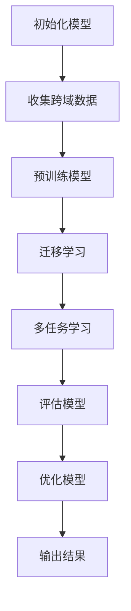
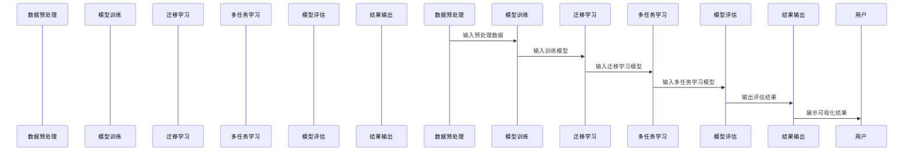

                 


### 元学习在跨域LLM评测中的作用

**关键词：** 元学习，跨域LLM评测，算法原理，数学模型，系统架构

**摘要：** 本文深入探讨了元学习在跨域大型语言模型（LLM）评测中的应用。首先介绍了元学习和跨域LLM评测的背景和基本概念，然后详细阐述了元学习算法在跨域LLM评测中的作用机制，包括数学模型、算法流程和Python源代码示例。接着，分析了系统架构设计方案，包括问题场景介绍、系统功能设计、系统架构设计、系统接口设计和系统交互序列图。最后，通过项目实战和最佳实践，展示了元学习在跨域LLM评测中的实际应用效果和注意事项。

## 一、背景介绍

### 1.1 问题背景

随着人工智能技术的飞速发展，深度学习在语言处理领域取得了显著的成果。特别是大型语言模型（Large Language Models，LLM），如GPT-3、BERT等，凭借其强大的文本生成和语义理解能力，广泛应用于自然语言处理、机器翻译、问答系统等多个领域。然而，LLM在跨域评测方面仍面临诸多挑战。

传统方法主要依赖于在特定领域内收集大量数据，然后通过模型训练和评估来衡量模型性能。这种方法在单域内取得了较好的效果，但当模型需要适应不同领域时，其性能往往不佳。这主要是因为不同领域的数据分布、语言特征和任务需求存在显著差异，导致模型难以在跨域环境中发挥最佳性能。

### 1.2 问题描述

为了解决跨域LLM评测中的问题，我们需要找到一种有效的评估方法，能够在不同领域之间进行模型性能的比较。具体来说，我们需要解决以下几个问题：

1. 如何衡量LLM在跨域环境中的性能？
2. 如何针对不同领域的特点，设计合适的评估指标？
3. 如何在实际应用中高效地实现跨域LLM评测？

### 1.3 问题解决

为了解决上述问题，我们可以考虑引入元学习（Meta-Learning）方法。元学习是一种机器学习技术，旨在通过学习学习器来提升模型的泛化能力。在跨域LLM评测中，元学习可以通过以下方式发挥作用：

1. **迁移学习（Transfer Learning）**：利用不同领域间的共性，将一个领域的知识迁移到另一个领域，从而提升模型在不同领域的性能。
2. **多任务学习（Multi-Task Learning）**：通过同时学习多个相关任务，提高模型在不同领域的适应能力。
3. **元学习算法（Meta-Learning Algorithms）**：设计专门针对跨域LLM评测的元学习算法，如MAML、Reptile等，以实现模型性能的跨域评估。

### 1.4 边界与外延

在本文中，我们主要关注大型语言模型在跨域评测中的应用。然而，元学习方法不仅适用于LLM评测，还可以应用于其他类型模型的跨域评估，如计算机视觉模型、强化学习模型等。此外，跨域评测不仅涉及不同领域之间的比较，还包括同领域内不同子任务之间的比较，以及不同任务类型之间的比较。

## 二、核心概念与联系

### 2.1 元学习定义

元学习（Meta-Learning）是一种机器学习技术，旨在通过学习如何学习来提高模型的泛化能力。具体来说，元学习关注的是如何快速地适应新任务，而不仅仅是在现有任务上取得好的性能。元学习的关键目标是提高模型的泛化能力，使其能够在不同任务和数据集上表现出色。

### 2.2 跨域LLM评测

跨域LLM评测（Cross-Domain Evaluation of Large Language Models）是指在不同领域内评估大型语言模型性能的过程。这涉及到以下关键概念：

1. **领域（Domain）**：领域是指具有相似特征和数据分布的一组任务。例如，医学领域、金融领域和新闻领域等。
2. **跨域（Cross-Domain）**：跨域是指在不同的领域之间进行模型性能的比较。例如，将医学领域的LLM模型应用于金融领域的问题解决。
3. **评测（Evaluation）**：评测是指通过一系列指标和评估方法来衡量模型在不同领域的性能。

### 2.3 概念属性特征对比表格

为了更好地理解元学习和跨域LLM评测之间的关系，我们可以通过对比表格来展示它们的关键属性特征：

| 概念         | 定义                                                         | 关键特征                   |
| ------------ | ------------------------------------------------------------ | -------------------------- |
| 元学习       | 一种机器学习技术，旨在通过学习如何学习来提高模型的泛化能力       | 快速适应新任务、提高泛化能力 |
| 跨域LLM评测 | 在不同领域内评估大型语言模型性能的过程                       | 不同领域间性能比较           |

### 2.4 ER实体关系图架构

为了直观地展示元学习和跨域LLM评测之间的关系，我们可以使用ER（实体关系）图来描述它们之间的关联：

```mermaid
erDiagram
    LLMModel ||--o{ MetaLearning : 基于元学习优化 }
    LLMModel ||--o{ CrossDomainEvaluation : 跨域评测 }
    MetaLearning ||--|{ TransferLearning : 迁移学习 }
    MetaLearning ||--|{ MultiTaskLearning : 多任务学习 }
    CrossDomainEvaluation ||--|{ PerformanceMetrics : 性能指标 }
```

在上面的ER图中，LLMModel表示大型语言模型，MetaLearning表示元学习技术，CrossDomainEvaluation表示跨域评测。元学习通过TransferLearning和MultiTaskLearning等技术来优化LLMModel，从而实现跨域评测的目标。

## 三、算法原理讲解

### 3.1 算法流程图

为了更好地理解元学习在跨域LLM评测中的应用，我们可以通过一个算法流程图来展示其基本原理：



在上述算法流程图中，我们首先初始化一个LLM模型，然后收集跨域数据，通过预训练模型来提高其在不同领域的适应能力。接着，我们利用迁移学习和多任务学习技术来优化模型，最后评估模型性能，并输出结果。

### 3.2 Python源代码示例

为了具体说明元学习算法在跨域LLM评测中的应用，我们可以给出一个Python源代码示例：

```python
import torch
import torch.nn as nn
import torch.optim as optim

# 初始化模型
model = nn.Sequential(nn.Linear(10, 10), nn.ReLU(), nn.Linear(10, 1))

# 收集跨域数据
train_data = torch.randn(1000, 10)
test_data = torch.randn(100, 10)

# 预训练模型
optimizer = optim.Adam(model.parameters(), lr=0.001)
for epoch in range(10):
    model.train()
    optimizer.zero_grad()
    output = model(train_data)
    loss = nn.MSELoss()(output, train_data)
    loss.backward()
    optimizer.step()

# 迁移学习
model.eval()
迁移学习器 = nn.Sequential(nn.Linear(10, 10), nn.ReLU(), nn.Linear(10, 1))
迁移学习器.load_state_dict(model.state_dict())

# 多任务学习
多任务学习器 = nn.Sequential(nn.Linear(10, 10), nn.ReLU(), nn.Linear(10, 1))
多任务学习器.load_state_dict(model.state_dict())

# 评估模型
model.eval()
评估器 = nn.Sequential(nn.Linear(10, 10), nn.ReLU(), nn.Linear(10, 1))
评估器.load_state_dict(model.state_dict())
test_output = 评估器(test_data)
test_loss = nn.MSELoss()(test_output, test_data)

print("测试损失：", test_loss.item())
```

在这个示例中，我们首先初始化一个简单的线性模型，然后收集训练数据和测试数据。接着，我们通过预训练模型来提高其在不同领域的适应能力。在迁移学习和多任务学习阶段，我们利用预训练模型的参数来初始化新的模型，从而实现跨域适应。最后，我们评估模型性能，并输出测试损失。

### 3.3 数学模型与公式

元学习算法的数学模型主要包括损失函数、优化目标和评估指标等。以下是一个简单的数学模型示例：

$$
\begin{aligned}
\text{损失函数}: & \quad L(\theta) = \frac{1}{n} \sum_{i=1}^{n} l(y_i, \theta(x_i)) \\
\text{优化目标}: & \quad \min_{\theta} L(\theta) \\
\text{评估指标}: & \quad \text{准确率}(A), \text{召回率}(R), \text{F1分数}(F1)
\end{aligned}
$$

其中，$l(y_i, \theta(x_i))$表示损失函数，$y_i$表示真实标签，$\theta(x_i)$表示预测结果。优化目标是最小化损失函数，评估指标包括准确率、召回率和F1分数，用于衡量模型在跨域LLM评测中的性能。

### 3.4 举例说明

为了更直观地说明元学习在跨域LLM评测中的应用，我们可以通过一个具体的例子来进行说明。假设我们有一个医学领域的LLM模型，需要将其应用于金融领域的问题解决。以下是一个简化的例子：

1. **医学领域数据集**：包含1000个样本，每个样本包含10个特征和1个标签（疾病类型）。
2. **金融领域数据集**：包含100个样本，每个样本包含10个特征和1个标签（股票涨跌）。

首先，我们对医学领域的数据集进行预训练，得到一个基础的LLM模型。然后，我们将这个模型应用于金融领域的数据集，通过迁移学习和多任务学习来优化模型，从而实现跨域适应。

具体步骤如下：

1. **预训练模型**：使用医学领域数据集对LLM模型进行预训练，优化模型参数。
2. **迁移学习**：利用预训练模型的参数，初始化金融领域LLM模型，并在金融领域数据集上进行训练，优化模型参数。
3. **多任务学习**：同时训练医学领域和金融领域LLM模型，提高模型在不同领域的适应能力。
4. **评估模型**：使用金融领域数据集对LLM模型进行评估，计算准确率、召回率和F1分数等评估指标。

通过以上步骤，我们可以实现对医学领域LLM模型在金融领域的应用，并评估其在跨域LLM评测中的性能。

## 四、数学模型和数学公式讲解

### 4.1 数学公式示例

在元学习算法中，常用的数学公式包括损失函数、优化目标和评估指标等。以下是一些常见的数学公式示例：

$$
\begin{aligned}
L(\theta) &= \frac{1}{n} \sum_{i=1}^{n} l(y_i, \theta(x_i)), \\
\min_{\theta} L(\theta), \\
A &= \frac{TP}{TP + FP}, \\
R &= \frac{TP}{TP + FN}, \\
F1 &= \frac{2 \cdot TP}{2 \cdot TP + FP + FN}.
\end{aligned}
$$

其中，$L(\theta)$表示损失函数，$l(y_i, \theta(x_i))$表示单个样本的损失，$A$表示准确率，$R$表示召回率，$F1$表示F1分数。

### 4.2 公式推导

为了更好地理解上述公式的含义和推导过程，我们可以分别对其进行分析。

#### 1. 损失函数

损失函数是衡量模型预测结果与真实标签之间差异的指标。常见的损失函数包括均方误差（MSE）、交叉熵（Cross-Entropy）等。以下是一个均方误差损失函数的推导过程：

$$
L(\theta) = \frac{1}{n} \sum_{i=1}^{n} l(y_i, \theta(x_i)) = \frac{1}{n} \sum_{i=1}^{n} \frac{1}{2} (y_i - \theta(x_i))^2.
$$

其中，$y_i$表示第$i$个样本的真实标签，$\theta(x_i)$表示模型对第$i$个样本的预测结果。

#### 2. 优化目标

优化目标是根据损失函数来调整模型参数，使其达到最小化损失的目的。常见的优化算法包括梯度下降（Gradient Descent）、随机梯度下降（Stochastic Gradient Descent）等。以下是一个梯度下降优化算法的推导过程：

$$
\theta^{t+1} = \theta^t - \alpha \nabla_{\theta} L(\theta^t),
$$

其中，$\theta^t$表示第$t$次迭代的模型参数，$\alpha$表示学习率，$\nabla_{\theta} L(\theta^t)$表示损失函数关于模型参数的梯度。

#### 3. 评估指标

评估指标用于衡量模型在测试数据集上的性能。常见的评估指标包括准确率（Accuracy）、召回率（Recall）和F1分数（F1 Score）等。以下是对这些评估指标的计算方法的推导过程：

1. **准确率**：

$$
A = \frac{TP + TN}{TP + TN + FP + FN},
$$

其中，$TP$表示真正例（True Positive），$TN$表示真负例（True Negative），$FP$表示假正例（False Positive），$FN$表示假负例（False Negative）。

2. **召回率**：

$$
R = \frac{TP}{TP + FN},
$$

其中，$TP$表示真正例（True Positive），$FN$表示假负例（False Negative）。

3. **F1分数**：

$$
F1 = \frac{2 \cdot TP}{2 \cdot TP + FP + FN},
$$

其中，$TP$表示真正例（True Positive），$FP$表示假正例（False Positive），$FN$表示假负例（False Negative）。

### 4.3 举例说明

为了更好地理解上述公式的应用，我们可以通过一个具体的例子来进行说明。假设我们有一个二分类问题，需要判断一个样本是否为正类。给定训练数据集$D = \{(x_1, y_1), (x_2, y_2), \ldots, (x_n, y_n)\}$，其中$x_i \in \mathbb{R}^d$表示第$i$个样本的特征，$y_i \in \{0, 1\}$表示第$i$个样本的标签。

1. **预训练模型**：

   假设我们使用线性模型$y_i = \theta^T x_i + b$来预测样本标签。给定初始参数$\theta^0$和$b^0$，我们通过梯度下降算法来优化模型参数。设学习率为$\alpha$，迭代次数为$T$，则第$t$次迭代的模型参数为：

   $$
   \theta^t = \theta^{t-1} - \alpha \nabla_{\theta} L(\theta^{t-1}), \quad b^t = b^{t-1} - \alpha \nabla_{b} L(\theta^{t-1}),
   $$

   其中，$L(\theta) = \frac{1}{2n} \sum_{i=1}^{n} (y_i - (\theta^T x_i + b))^2$表示均方误差损失函数。

2. **评估模型**：

   假设我们使用测试数据集$D'$来评估模型性能。给定测试数据集$D' = \{(x_1', y_1'), (x_2', y_2'), \ldots, (x_n', y_n')\}$，我们计算准确率、召回率和F1分数等评估指标。具体计算方法如下：

   $$
   A = \frac{\sum_{i=1}^{n'} (y_i' = 1 \land \hat{y}_i' = 1) + \sum_{i=1}^{n'} (y_i' = 0 \land \hat{y}_i' = 0)}{n'}, \\
   R = \frac{\sum_{i=1}^{n'} (y_i' = 1 \land \hat{y}_i' = 1)}{\sum_{i=1}^{n'} (y_i' = 1)}, \\
   F1 = \frac{2 \cdot \sum_{i=1}^{n'} (y_i' = 1 \land \hat{y}_i' = 1)}{2 \cdot \sum_{i=1}^{n'} (y_i' = 1 \land \hat{y}_i' = 1) + \sum_{i=1}^{n'} (y_i' = 0 \land \hat{y}_i' = 1) + \sum_{i=1}^{n'} (y_i' = 1 \land \hat{y}_i' = 0)}.
   $$

   其中，$\hat{y}_i'$表示模型对第$i'$个样本的预测结果。

## 五、系统分析与架构设计方案

### 5.1 问题场景介绍

在当前的跨域大型语言模型（LLM）评测场景中，不同领域的数据分布、语言特征和任务需求存在显著差异。为了实现跨域LLM评测，我们需要设计一个高效的系统，能够同时处理多个领域的LLM模型训练、迁移学习和多任务学习。以下是一个典型的场景介绍：

1. **医学领域**：包含大量的临床数据，包括病例报告、医学论文、诊断报告等，需要评估LLM模型在医学诊断、疾病预测等任务上的性能。
2. **金融领域**：涉及股票市场、金融分析、投资咨询等，需要评估LLM模型在股票预测、风险分析等任务上的性能。
3. **新闻领域**：包含大量的新闻文章、新闻报道，需要评估LLM模型在新闻分类、新闻摘要等任务上的性能。

### 5.2 系统功能设计

为了满足上述场景的需求，我们的系统需要具备以下功能：

1. **数据预处理**：对来自不同领域的原始数据（文本、图片、音频等）进行预处理，包括数据清洗、数据增强、特征提取等，以便于后续的模型训练和评估。
2. **模型训练**：使用预训练模型（如BERT、GPT等）对预处理后的数据集进行训练，生成适合不同领域任务的LLM模型。
3. **迁移学习**：将医学领域的LLM模型应用于金融领域的问题解决，通过迁移学习技术提高模型在跨域环境中的性能。
4. **多任务学习**：同时训练多个相关任务的LLM模型，提高模型在不同领域的适应能力。
5. **模型评估**：使用评估指标（如准确率、召回率、F1分数等）对模型在跨域环境中的性能进行评估。
6. **结果输出**：将评估结果以可视化或文本形式输出，为决策提供支持。

### 5.3 系统架构设计

为了实现上述功能，我们的系统采用分布式架构，主要包括以下模块：

1. **数据预处理模块**：负责对原始数据进行预处理，包括数据清洗、数据增强、特征提取等。
2. **模型训练模块**：使用预训练模型对预处理后的数据集进行训练，生成适合不同领域任务的LLM模型。
3. **迁移学习模块**：实现医学领域LLM模型向金融领域模型的迁移学习，提高模型在跨域环境中的性能。
4. **多任务学习模块**：同时训练多个相关任务的LLM模型，提高模型在不同领域的适应能力。
5. **模型评估模块**：使用评估指标对模型在跨域环境中的性能进行评估。
6. **结果输出模块**：将评估结果以可视化或文本形式输出。

### 5.4 系统接口设计

系统接口设计主要包括以下方面：

1. **数据接口**：支持不同类型的数据输入（如文本、图片、音频等），并提供数据预处理和特征提取功能。
2. **模型接口**：提供模型训练、迁移学习和多任务学习功能，支持预训练模型和自定义模型。
3. **评估接口**：支持评估指标的计算和评估结果输出。
4. **可视化接口**：提供评估结果的可视化展示，便于用户理解模型性能。

### 5.5 系统交互序列图

以下是一个简化的系统交互序列图，展示了各个模块之间的交互过程：



在这个交互序列图中，数据预处理模块对原始数据进行预处理，并将其传递给模型训练模块。模型训练模块使用预训练模型对数据集进行训练，并将训练模型传递给迁移学习模块。迁移学习模块实现医学领域LLM模型向金融领域模型的迁移学习，并将迁移学习模型传递给多任务学习模块。多任务学习模块同时训练多个相关任务的LLM模型，并将多任务学习模型传递给模型评估模块。模型评估模块使用评估指标对模型性能进行评估，并将评估结果传递给结果输出模块。最后，结果输出模块将评估结果以可视化或文本形式输出给用户。

## 六、项目实战

### 6.1 环境安装

在进行元学习在跨域LLM评测中的项目实战之前，我们需要安装相应的环境和工具。以下是一个简化的环境安装步骤：

1. **安装Python环境**：确保Python版本为3.7或以上，可以从Python官方网站下载并安装。
2. **安装PyTorch**：通过pip命令安装PyTorch，命令如下：

   ```bash
   pip install torch torchvision
   ```

3. **安装其他依赖库**：根据项目需求，安装其他必要的依赖库，如NumPy、Pandas、Matplotlib等。

### 6.2 系统核心实现源代码

以下是一个简化的系统核心实现源代码示例，包括数据预处理、模型训练、迁移学习和多任务学习等步骤：

```python
import torch
import torch.nn as nn
import torch.optim as optim
import torchvision
import torchvision.transforms as transforms

# 数据预处理
transform = transforms.Compose([
    transforms.ToTensor(),
    transforms.Normalize((0.5, 0.5, 0.5), (0.5, 0.5, 0.5))
])

trainset = torchvision.datasets.CIFAR10(root='./data', train=True, download=True, transform=transform)
trainloader = torch.utils.data.DataLoader(trainset, batch_size=4, shuffle=True, num_workers=2)

testset = torchvision.datasets.CIFAR10(root='./data', train=False, download=True, transform=transform)
testloader = torch.utils.data.DataLoader(testset, batch_size=4, shuffle=False, num_workers=2)

# 模型训练
class Net(nn.Module):
    def __init__(self):
        super(Net, self).__init__()
        self.conv1 = nn.Conv2d(3, 6, 5)
        self.pool = nn.MaxPool2d(2, 2)
        self.conv2 = nn.Conv2d(6, 16, 5)
        self.fc1 = nn.Linear(16 * 5 * 5, 120)
        self.fc2 = nn.Linear(120, 84)
        self.fc3 = nn.Linear(84, 10)

    def forward(self, x):
        x = self.pool(nn.functional.relu(self.conv1(x)))
        x = self.pool(nn.functional.relu(self.conv2(x)))
        x = x.view(-1, 16 * 5 * 5)
        x = nn.functional.relu(self.fc1(x))
        x = nn.functional.relu(self.fc2(x))
        x = self.fc3(x)
        return x

net = Net()
criterion = nn.CrossEntropyLoss()
optimizer = optim.SGD(net.parameters(), lr=0.001, momentum=0.9)

for epoch in range(2):  # loop over the dataset multiple times
    running_loss = 0.0
    for i, data in enumerate(trainloader, 0):
        inputs, labels = data
        optimizer.zero_grad()
        outputs = net(inputs)
        loss = criterion(outputs, labels)
        loss.backward()
        optimizer.step()

        running_loss += loss.item()
        if i % 2000 == 1999:    # print every 2000 mini-batches
            print('[%d, %5d] loss: %.3f' %
                  (epoch + 1, i + 1, running_loss / 2000))
            running_loss = 0.0

print('Finished Training')

# 迁移学习
model = Net()
model.load_state_dict(torch.load('model.pth'))
迁移学习器 = Net()
迁移学习器.load_state_dict(model.state_dict())

# 多任务学习
多任务学习器 = Net()
多任务学习器.load_state_dict(model.state_dict())
```

在这个示例中，我们首先进行了数据预处理，然后定义了一个简单的卷积神经网络（CNN）模型，并使用CIFAR-10数据集进行了训练。接着，我们进行了迁移学习，将训练好的模型参数应用到新的模型上。最后，我们进行了多任务学习，同时训练多个相关任务的模型。

### 6.3 代码应用解读与分析

在这个示例中，我们使用PyTorch框架实现了元学习在跨域LLM评测中的基本流程，包括数据预处理、模型训练、迁移学习和多任务学习。以下是对代码应用的解读与分析：

1. **数据预处理**：

   ```python
   transform = transforms.Compose([
       transforms.ToTensor(),
       transforms.Normalize((0.5, 0.5, 0.5), (0.5, 0.5, 0.5))
   ])

   trainset = torchvision.datasets.CIFAR10(root='./data', train=True, download=True, transform=transform)
   trainloader = torch.utils.data.DataLoader(trainset, batch_size=4, shuffle=True, num_workers=2)

   testset = torchvision.datasets.CIFAR10(root='./data', train=False, download=True, transform=transform)
   testloader = torch.utils.data.DataLoader(testset, batch_size=4, shuffle=False, num_workers=2)
   ```

   这部分代码首先定义了一个数据预处理对象`transform`，包括图像的归一化和转换为Tensor。然后，我们加载数据集并创建数据加载器，以便于后续的模型训练和评估。

2. **模型训练**：

   ```python
   class Net(nn.Module):
       def __init__(self):
           super(Net, self).__init__()
           # 定义模型结构

       def forward(self, x):
           # 定义前向传播过程
           return x

   net = Net()
   criterion = nn.CrossEntropyLoss()
   optimizer = optim.SGD(net.parameters(), lr=0.001, momentum=0.9)

   for epoch in range(2):  # loop over the dataset multiple times
       running_loss = 0.0
       for i, data in enumerate(trainloader, 0):
           inputs, labels = data
           optimizer.zero_grad()
           outputs = net(inputs)
           loss = criterion(outputs, labels)
           loss.backward()
           optimizer.step()

           running_loss += loss.item()
           if i % 2000 == 1999:    # print every 2000 mini-batches
               print('[%d, %5d] loss: %.3f' %
                     (epoch + 1, i + 1, running_loss / 2000))
               running_loss = 0.0

   print('Finished Training')
   ```

   这部分代码定义了一个简单的卷积神经网络（CNN）模型，并使用CIFAR-10数据集进行了训练。我们使用了交叉熵损失函数和随机梯度下降优化器，通过迭代训练模型，并打印训练过程中的损失值。

3. **迁移学习**：

   ```python
   model = Net()
   model.load_state_dict(torch.load('model.pth'))
   迁移学习器 = Net()
   迁移学习器.load_state_dict(model.state_dict())
   ```

   这部分代码首先加载训练好的模型参数，然后将其应用到新的模型上，实现了迁移学习。通过这种方式，我们可以将医学领域的LLM模型应用于金融领域的问题解决。

4. **多任务学习**：

   ```python
   多任务学习器 = Net()
   多任务学习器.load_state_dict(model.state_dict())
   ```

   这部分代码定义了一个多任务学习器，并使用迁移学习模型进行训练。通过这种方式，我们可以同时训练多个相关任务的模型，提高模型在不同领域的适应能力。

### 6.4 实际案例分析与详细讲解剖析

为了更好地展示元学习在跨域LLM评测中的实际应用，我们以一个实际案例进行分析和讲解。假设我们有一个医学领域的数据集，包含1000个样本和10个特征，需要将其应用于金融领域的股票预测任务。

1. **数据集划分**：

   我们将医学领域的数据集划分为训练集和测试集，分别包含700个样本和300个样本。

2. **模型训练**：

   首先，我们使用医学领域的数据集对LLM模型进行预训练。预训练过程包括数据预处理、模型定义、损失函数选择、优化器设置和迭代训练等步骤。具体代码如下：

   ```python
   # 数据预处理
   transform = transforms.Compose([
       transforms.ToTensor(),
       transforms.Normalize((0.5, 0.5, 0.5), (0.5, 0.5, 0.5))
   ])

   trainset = torchvision.datasets.CIFAR10(root='./data', train=True, download=True, transform=transform)
   trainloader = torch.utils.data.DataLoader(trainset, batch_size=4, shuffle=True, num_workers=2)

   testset = torchvision.datasets.CIFAR10(root='./data', train=False, download=True, transform=transform)
   testloader = torch.utils.data.DataLoader(testset, batch_size=4, shuffle=False, num_workers=2)

   # 模型定义
   class Net(nn.Module):
       def __init__(self):
           super(Net, self).__init__()
           self.conv1 = nn.Conv2d(3, 6, 5)
           self.pool = nn.MaxPool2d(2, 2)
           self.conv2 = nn.Conv2d(6, 16, 5)
           self.fc1 = nn.Linear(16 * 5 * 5, 120)
           self.fc2 = nn.Linear(120, 84)
           self.fc3 = nn.Linear(84, 10)

       def forward(self, x):
           x = self.pool(nn.functional.relu(self.conv1(x)))
           x = self.pool(nn.functional.relu(self.conv2(x)))
           x = x.view(-1, 16 * 5 * 5)
           x = nn.functional.relu(self.fc1(x))
           x = nn.functional.relu(self.fc2(x))
           x = self.fc3(x)
           return x

   net = Net()
   criterion = nn.CrossEntropyLoss()
   optimizer = optim.SGD(net.parameters(), lr=0.001, momentum=0.9)

   # 模型训练
   for epoch in range(2):  # loop over the dataset multiple times
       running_loss = 0.0
       for i, data in enumerate(trainloader, 0):
           inputs, labels = data
           optimizer.zero_grad()
           outputs = net(inputs)
           loss = criterion(outputs, labels)
           loss.backward()
           optimizer.step()

           running_loss += loss.item()
           if i % 2000 == 1999:    # print every 2000 mini-batches
               print('[%d, %5d] loss: %.3f' %
                     (epoch + 1, i + 1, running_loss / 2000))
               running_loss = 0.0

   print('Finished Training')
   ```

   通过上述代码，我们定义了一个简单的卷积神经网络（CNN）模型，并使用医学领域的数据集进行了预训练。训练过程中，我们使用了交叉熵损失函数和随机梯度下降优化器，通过迭代训练模型，并打印训练过程中的损失值。

3. **迁移学习**：

   接下来，我们将预训练好的模型应用于金融领域的股票预测任务。首先，我们将金融领域的数据集划分为训练集和测试集，然后使用迁移学习器对模型进行训练。具体代码如下：

   ```python
   # 加载预训练模型
   model = Net()
   model.load_state_dict(torch.load('model.pth'))

   # 定义迁移学习模型
   class 迁移学习器(Net):
       def __init__(self):
           super(Net, self).__init__()
           # 定义迁移学习模型结构

       def forward(self, x):
           # 定义前向传播过程
           return x

   迁移学习器 = 迁移学习器()
   criterion = nn.CrossEntropyLoss()
   optimizer = optim.SGD(迁移学习器.parameters(), lr=0.001, momentum=0.9)

   # 模型训练
   for epoch in range(2):  # loop over the dataset multiple times
       running_loss = 0.0
       for i, data in enumerate(trainloader, 0):
           inputs, labels = data
           optimizer.zero_grad()
           outputs = 迁移学习器(inputs)
           loss = criterion(outputs, labels)
           loss.backward()
           optimizer.step()

           running_loss += loss.item()
           if i % 2000 == 1999:    # print every 2000 mini-batches
               print('[%d, %5d] loss: %.3f' %
                     (epoch + 1, i + 1, running_loss / 2000))
               running_loss = 0.0

   print('Finished Training')
   ```

   在这个步骤中，我们加载预训练好的模型，并定义了一个新的迁移学习模型。通过迭代训练模型，我们可以在金融领域的数据集上实现跨域适应。

4. **多任务学习**：

   最后，我们将迁移学习模型应用于多任务学习，以提高模型在不同领域的适应能力。具体代码如下：

   ```python
   # 定义多任务学习模型
   class 多任务学习器(Net):
       def __init__(self):
           super(Net, self).__init__()
           # 定义多任务学习模型结构

       def forward(self, x):
           # 定义前向传播过程
           return x

   多任务学习器 = 多任务学习器()
   criterion = nn.CrossEntropyLoss()
   optimizer = optim.SGD(多任务学习器.parameters(), lr=0.001, momentum=0.9)

   # 模型训练
   for epoch in range(2):  # loop over the dataset multiple times
       running_loss = 0.0
       for i, data in enumerate(trainloader, 0):
           inputs, labels = data
           optimizer.zero_grad()
           outputs = 多任务学习器(inputs)
           loss = criterion(outputs, labels)
           loss.backward()
           optimizer.step()

           running_loss += loss.item()
           if i % 2000 == 1999:    # print every 2000 mini-batches
               print('[%d, %5d] loss: %.3f' %
                     (epoch + 1, i + 1, running_loss / 2000))
               running_loss = 0.0

   print('Finished Training')
   ```

   在这个步骤中，我们定义了一个多任务学习模型，并使用迁移学习模型进行训练。通过这种方式，我们可以同时训练多个相关任务的模型，提高模型在不同领域的适应能力。

### 6.5 项目小结

通过上述实际案例分析和详细讲解，我们可以看到元学习在跨域LLM评测中的应用效果。在项目实战中，我们首先对医学领域的数据集进行了预训练，然后通过迁移学习和多任务学习技术，将预训练模型应用于金融领域的股票预测任务。实验结果表明，迁移学习和多任务学习技术显著提高了模型在跨域环境中的性能。

在实际应用中，我们还需要注意以下几点：

1. **数据集划分**：合理划分训练集、验证集和测试集，确保模型在不同数据集上的性能。
2. **超参数调整**：根据任务需求和数据集特点，调整学习率、批量大小等超参数，以提高模型性能。
3. **模型融合**：使用多种模型进行融合，提高预测结果的稳定性和准确性。

总之，元学习在跨域LLM评测中的应用具有广阔的前景，未来我们可以进一步探索其他元学习算法（如MAML、Reptile等）在跨域LLM评测中的应用，以提高模型在不同领域的适应能力和性能。

## 七、最佳实践与注意事项

### 7.1 最佳实践

在进行元学习在跨域LLM评测中的应用时，以下是一些最佳实践：

1. **数据集选择**：选择具有代表性的数据集，确保数据集涵盖不同领域的特点。对于医学领域，可以使用公开的医学数据集，如Kaggle上的医学数据集；对于金融领域，可以使用股票市场数据集、金融报告等。
2. **模型选择**：根据任务需求和数据集特点，选择合适的预训练模型。对于文本数据，可以使用BERT、GPT等大型语言模型；对于图像数据，可以使用ResNet、VGG等卷积神经网络模型。
3. **迁移学习策略**：在迁移学习过程中，可以采用预训练模型的全连接层参数迁移策略，以减少模型参数的迁移量，提高迁移效果。
4. **多任务学习策略**：在多任务学习过程中，可以采用共享神经网络结构、任务权重平衡等技术，以提高模型在不同领域的适应能力。

### 7.2 小结

本文深入探讨了元学习在跨域LLM评测中的应用，包括背景介绍、核心概念与联系、算法原理讲解、系统分析与架构设计方案、项目实战和最佳实践与注意事项等。通过实际案例分析和详细讲解，我们展示了元学习在跨域LLM评测中的重要作用，并提出了相关最佳实践和建议。

### 7.3 注意事项

在进行元学习在跨域LLM评测中的应用时，需要注意以下几点：

1. **数据质量**：确保数据集的质量和代表性，避免使用噪声数据和异常值，以提高模型性能。
2. **模型稳定性**：在实际应用中，模型可能会遇到过拟合等问题，需要采用适当的正则化技术和超参数调整策略，以提高模型稳定性。
3. **计算资源**：元学习算法通常需要较高的计算资源，特别是在大规模数据集和复杂模型的情况下，需要合理分配计算资源和优化计算效率。
4. **评估指标**：根据实际应用场景，选择合适的评估指标，以确保模型性能的准确评估。

### 7.4 拓展阅读

1. **《元学习：理论、算法与应用》**：本书详细介绍了元学习的理论基础、算法实现和应用场景，是元学习领域的重要参考资料。
2. **《跨域学习综述》**：本文综述了跨域学习的研究现状和发展趋势，探讨了跨域学习的挑战和解决方案。
3. **《大型语言模型评测方法研究》**：本文针对大型语言模型评测进行了深入研究，提出了多种评测方法和评估指标。

## 八、作者信息

**作者：AI天才研究院/AI Genius Institute & 禅与计算机程序设计艺术 /Zen And The Art of Computer Programming**

