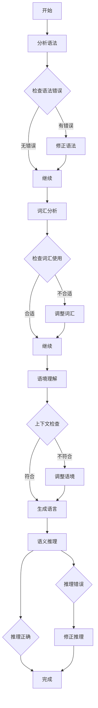

                 

### 1.1 元语言能力的定义

元语言能力（Metalinguistic Ability）是指个体理解和使用语言的能力，这种能力超出了基本语言交流的范畴，它涉及对语言本身特性的认知，包括语言的结构、规则和功能。元语言能力不仅包括语法、语义和语用层面的理解，还涉及语言使用的策略和技巧。

在语言学中，元语言是指用于描述和分析其他语言的语言。因此，元语言能力可以理解为一个人对语言规则和语言结构的意识与理解。例如，当一个人能够意识到某种句式的正确性或错误性，或者能够意识到某种语言表达方式的合适性，这就体现了他具备一定的元语言能力。

元语言能力的重要性在于，它不仅影响着个体的语言学习和发展，还对认知能力的提升有着积极作用。具备元语言能力的人能够更有效地进行语言学习和使用，也能够在复杂的语言环境中做出更好的适应和应对。

元语言能力可以分为多个层次。首先，是基本的语法和词汇理解，这是元语言能力的基础。其次，是语境理解和语义推理，这涉及到对语言在特定情境中的含义的理解。更高层次的元语言能力包括自我指涉和自我监控，即个体能够意识到自己在语言交流中的表现，并根据需要调整语言策略。

总的来说，元语言能力是一个多维度的概念，它不仅包括对语言规则的理解，还包括对语言功能和应用策略的掌握。这种能力在语言教学、语言研究和语言技术应用中都有着重要的应用价值。

### 1.2 元语言能力的组成部分

元语言能力由多个关键组成部分构成，这些组成部分共同决定了一个人在理解和运用语言时的深度和广度。以下是元语言能力的几个主要组成部分及其相互关系：

1. **语法意识（Grammatical Awareness）**：
   语法意识是指对语言结构规则的理解和识别。它包括对句子成分的识别、语法规则的应用以及句子结构的分析。语法意识是元语言能力的核心，因为它是构建有效语言表达的基础。例如，理解动词时态、名词变化和句子结构，这些都是语法意识的具体体现。

2. **词汇意识（Vocabulary Awareness）**：
   词汇意识涉及对词汇的理解和使用能力。这不仅仅是词汇量的掌握，还包括对词汇含义、词性、用法和同义词、反义词的辨析。词汇意识对语言表达的理解和构建至关重要，它帮助人们更准确地选择和运用词汇，从而提升语言表达的准确性和丰富性。

3. **语用意识（Pragmatic Awareness）**：
   语用意识指的是在特定社交情境中使用语言的能力。它包括对语境的理解、交际策略的运用和语言礼貌性。语用意识帮助人们理解非字面意义，识别隐含信息，并根据社交情境选择合适的语言表达。例如，在不同场合使用适当的称呼、恰当的谈话方式，这些都是语用意识的体现。

4. **语义意识（Semantic Awareness）**：
   语义意识涉及对语言表达所传递的含义的理解。它包括对词汇、句子和段落深层含义的解读，以及对语义关系和逻辑结构的辨识。语义意识是理解语言表达的核心，它帮助人们准确理解他人的意图和情感。

5. **自我指涉（Self-Reference）**：
   自我指涉是指个体在语言交流中对自己进行描述和评价的能力。这种能力涉及到自我意识的表达，包括反思自己的行为和思想，并将其转化为语言形式。自我指涉是元语言能力的高级形式，它体现了个体对自身语言表现的监控和调整能力。

6. **自我监控（Self-Monitoring）**：
   自我监控是指个体在语言交流过程中对自己语言行为进行监督和评估的能力。这种能力包括意识到自己的语言错误，并能够及时进行修正。自我监控有助于提高语言交流的准确性和流畅性，同时也是语言学习和自我提升的重要手段。

以上组成部分相互联系，共同构成了完整的元语言能力。语法意识、词汇意识和语义意识是元语言能力的基础，而语用意识和自我指涉、自我监控则是其高级表现形式。这些组成部分在不同情境下相互作用，帮助个体更有效地理解和运用语言。

在具体应用中，元语言能力的组成部分可以通过各种练习和任务来培养。例如，通过语法练习提升语法意识，通过词汇学习增强词汇意识，通过社交互动和语境分析培养语用意识，通过反思和自我评估培养自我指涉和自我监控能力。通过这些练习，个体可以逐步提升其元语言能力，从而在语言学习和应用中取得更好的效果。

### 1.3 元语言能力在自然语言处理中的重要性

元语言能力在自然语言处理（NLP）中扮演着至关重要的角色，因为它是理解和生成人类语言的核心。自然语言处理的目标是使计算机能够理解、解释和生成人类语言，从而实现与人类的自然交流。在这个过程中，元语言能力不仅帮助计算机识别和理解语言结构，还提高了其语言生成的准确性和自然性。

首先，元语言能力在语言理解方面至关重要。在NLP中，计算机需要解析和理解复杂的句子结构，识别词汇的含义和语法规则，以及理解语境和语用意图。例如，计算机在处理一个复杂的句子时，需要识别主语、谓语、宾语等句子成分，理解词汇的语义关系，并准确把握语境中的隐含意义。这些任务都依赖于计算机的元语言能力。

一个典型的例子是机器翻译。在机器翻译中，计算机需要理解源语言的语法结构、词汇含义和语境，并将其准确翻译成目标语言。具备强元语言能力的翻译模型能够更好地理解语言的细微差别和语境变化，从而生成更自然、准确的翻译结果。例如，在翻译中，一个词汇可能具有多种含义，而具体的含义取决于上下文。具备元语言能力的模型能够根据上下文准确判断词汇的含义，从而提高翻译的准确性。

其次，元语言能力在语言生成方面也发挥着重要作用。在自然语言生成任务中，计算机需要根据给定的输入生成自然、流畅的文本。这要求计算机不仅能够理解输入的内容，还需要具备创造性的语言表达能力。例如，在自动撰写新闻稿、生成对话或者创建故事情节时，计算机需要根据上下文和主题生成连贯、有逻辑的文本。

一个具体的例子是聊天机器人的对话生成。一个具备强元语言能力的聊天机器人能够根据对话的上下文和用户的意图生成合适的回复，从而提供更自然、流畅的交互体验。例如，当用户提问“今天的天气如何？”时，聊天机器人需要理解“今天”和“天气”这两个词汇的具体含义，并根据上下文生成恰当的回复，如“今天的天气是晴天，温度大约在25摄氏度左右。”

此外，元语言能力在问答系统和信息提取中也具有重要意义。在问答系统中，计算机需要理解用户的问题，并从大量信息中提取出相关答案。这要求计算机具备强大的语义理解能力和上下文感知能力。例如，在一个问答系统中，当用户提问“全球人口最多的国家是哪个？”时，计算机需要理解“全球人口最多的国家”这一概念，并从海量的信息中准确提取出答案“中国”。

在信息提取任务中，元语言能力帮助计算机识别文本中的关键信息，并提取出有意义的内容。例如，在新闻文章中提取关键事实或关键信息，计算机需要理解文章的主题和结构，识别出重要的词汇和句子，从而提取出关键信息。

总之，元语言能力在自然语言处理中的重要性体现在其对语言理解、语言生成和信息提取的支持。具备强元语言能力的自然语言处理系统能够更准确地理解人类语言，更自然地生成语言，并更有效地提取信息。这不仅提升了系统的性能和用户体验，也为实现更广泛的应用提供了可能性。

### 1.4 元语言能力的评估方法

评估元语言能力的方法多种多样，这些方法旨在从不同角度和层面衡量个体在理解和使用语言时的元语言能力水平。以下是几种常见的评估方法及其具体实施步骤：

#### 1. 语法测试

语法测试是评估元语言能力的基本方法之一，通过测试个体对语言结构和语法规则的理解。具体步骤如下：

1. **设计测试题**：根据不同的语法知识点设计选择题、填空题、改错题等题型。
2. **选择测试对象**：确定测试的受众群体，如学生、专业人士或普通公众。
3. **实施测试**：将测试题通过在线平台、纸质试卷或面对面问答等方式进行分发。
4. **评分与反馈**：根据测试结果进行评分，并提供详细反馈，指出错误和不足之处。

#### 2. 词汇测试

词汇测试主要评估个体的词汇量及其在具体语境中的应用能力。具体实施步骤包括：

1. **词汇表编制**：根据测试目标选择合适的词汇表，涵盖不同难度和类型的词汇。
2. **设计题目**：设计填空题、选择题等，测试词汇的理解和运用。
3. **测试实施**：通过线上或线下形式进行词汇测试。
4. **评估与反馈**：根据测试结果评估词汇量水平，并提供详细反馈。

#### 3. 语境理解测试

语境理解测试旨在评估个体在不同情境下理解和使用语言的能力。实施步骤如下：

1. **设计情境**：根据不同的语境设计测试情境，如日常生活对话、工作场景对话等。
2. **实施测试**：通过角色扮演、情景对话等方式进行测试。
3. **评分与反馈**：根据对话中的语言运用和语境理解能力进行评分，并提供反馈。

#### 4. 语义推理测试

语义推理测试评估个体对语言表达的深层含义和逻辑关系的理解。具体步骤包括：

1. **设计问题**：设计涉及逻辑推理和语义理解的测试问题，如逻辑推理题、语义解释题等。
2. **测试实施**：通过在线问卷、面对面问答等方式进行测试。
3. **评分与反馈**：根据问题回答的正确性和深度进行评分，并提供详细反馈。

#### 5. 自我指涉和自我监控测试

自我指涉和自我监控测试评估个体在语言交流中的自我反思和自我调整能力。具体实施步骤如下：

1. **设计任务**：设计一些需要个体自我反思和调整的任务，如写作、演讲等。
2. **任务实施**：让个体在实际任务中自我监控和调整语言表达。
3. **评估与反馈**：通过观察个体的自我调整行为，评估其自我指涉和自我监控能力，并提供反馈。

通过这些评估方法，研究者可以全面了解个体的元语言能力，并为其提供有针对性的培训和提高建议。这些方法不仅适用于学术研究，也广泛应用于教育、职业培训等领域。

### 1.5 元语言能力的应用场景

元语言能力在多个实际应用场景中发挥着关键作用，它不仅提升了系统的性能，还优化了用户体验。以下是几个典型的应用场景及其具体应用：

#### 1. 自然语言处理（NLP）

在自然语言处理领域，元语言能力至关重要。具备强元语言能力的NLP系统可以更准确地理解和生成人类语言，从而提升各种语言处理任务的性能。例如，在机器翻译中，元语言能力帮助翻译模型理解源语言的语法和语义，从而生成更自然、准确的翻译结果。同样，在问答系统、聊天机器人和信息提取任务中，元语言能力使系统能够更好地理解用户的问题和需求，提供更准确的回答和提取信息。

#### 2. 语言教学

语言教学是元语言能力的另一个重要应用领域。教师可以利用元语言能力评估学生的语言水平，并针对性地提供教学策略和练习。例如，通过语法测试和词汇测试，教师可以了解学生在语言结构和使用词汇方面的掌握情况，从而制定更有效的教学计划。此外，元语言能力还可以帮助教师设计互动式教学活动，如情境对话、角色扮演等，提高学生的语言运用能力。

#### 3. 职业写作

在职业写作中，元语言能力对提高写作质量和效率具有重要意义。具备高元语言能力的职业写作者能够更准确地理解和运用语言规则，编写出结构清晰、逻辑严密、表达自然的文本。例如，在企业报告、学术论文和技术文档的撰写过程中，元语言能力帮助作者准确表达思想，提高文本的可读性和专业性。

#### 4. 智能客服

智能客服系统利用元语言能力提供更自然、流畅的交互体验。具备强元语言能力的智能客服系统能够理解用户的提问，并根据上下文和语境生成合适的回答。例如，当用户询问“最近有什么新品发布？”时，智能客服系统需要理解“最近”和“新品”的含义，并生成相关的回答。这种能力不仅提升了客服系统的响应速度，还提高了用户满意度。

#### 5. 文本分析

文本分析是另一个应用元语言能力的领域。通过分析文本中的语法结构和语义关系，文本分析工具可以提取出有价值的信息，如情感分析、关键词提取和主题识别。例如，在市场调研中，企业可以利用文本分析工具分析消费者评论，了解产品口碑和市场趋势。这种能力帮助企业和组织做出更明智的商业决策。

总之，元语言能力在多个实际应用场景中发挥着关键作用，它不仅提升了系统的性能和效率，还优化了用户体验。通过在不同领域的应用，元语言能力正成为推动技术进步和产业创新的重要力量。

### 1.6 元语言能力的培养方法

元语言能力的培养是一个长期而复杂的过程，涉及多个方面，包括语法学习、词汇积累、语境理解、语义推理和自我监控等。以下是几种有效的培养方法：

#### 1. 语法学习

语法学习是元语言能力培养的基础。通过系统学习语法规则和句子结构，个体可以更好地理解和运用语言。具体方法包括：

- **参加语法课程**：参加专业的语法课程，系统地学习语法知识。
- **练习语法题**：通过做语法练习题，如选择题、改错题等，巩固语法知识。
- **分析句子结构**：通过拆解复杂句子，分析句子成分和语法规则，提高对语法结构的理解。

#### 2. 词汇积累

词汇量是元语言能力的重要组成部分。积累大量词汇不仅有助于理解语言，还能提升语言表达的丰富性和准确性。以下是几种词汇积累的方法：

- **背单词**：通过记忆单词的拼写、发音和含义，积累词汇量。
- **阅读书籍和文章**：通过大量阅读，接触不同领域的词汇，增加词汇储备。
- **使用词汇书**：利用词汇书，如《托福词汇》《GRE核心词汇》等，系统学习词汇。

#### 3. 语境理解

语境理解能力是元语言能力的高级形式，它帮助个体在具体情境中准确理解和运用语言。以下是培养语境理解能力的几种方法：

- **情境对话**：通过参与情境对话，提高对语境的理解能力。例如，模拟不同社交场景，练习在不同情境中运用语言。
- **角色扮演**：通过角色扮演，体验不同角色的语言表达方式，提高语境敏感度。
- **语境练习**：通过设计特定情境的练习题，如情景对话题，提高语境理解能力。

#### 4. 语义推理

语义推理能力是指个体在理解语言表达时，能够从字面意义中推断出深层含义。以下是培养语义推理能力的几种方法：

- **逻辑思维训练**：通过逻辑思维训练，提高推理和解决问题的能力。
- **阅读深度文章**：通过阅读深度文章，学习如何从文本中提取信息，并进行推理。
- **语义分析练习**：通过语义分析练习，如阅读理解题，提高语义推理能力。

#### 5. 自我监控

自我监控能力是指个体在语言交流中能够自我监督和调整语言表达。以下是培养自我监控能力的几种方法：

- **反思日记**：通过写反思日记，记录自己的语言交流经历，并分析语言使用中的优点和不足。
- **录音和回放**：通过录音和回放，听取自己的语言表达，识别错误并进行修正。
- **语言交流反馈**：通过与他人交流，获取反馈，改进自己的语言表达。

总之，元语言能力的培养需要系统性和持续性。通过多种方法的综合运用，个体可以逐步提升其元语言能力，从而在语言学习和应用中取得更好的成果。

### 总结与展望

本文系统地介绍了元语言能力的定义、组成部分、重要性以及评估方法，并通过具体应用场景展示了其在实际中的价值。元语言能力不仅对语言学习和应用有着深远影响，还在自然语言处理、语言教学、职业写作、智能客服和文本分析等多个领域发挥着关键作用。

展望未来，随着人工智能和自然语言处理技术的不断进步，元语言能力的研究和应用将变得更加广泛和深入。例如，更先进的机器学习算法和深度学习模型将进一步提升计算机的元语言能力，使其在语言理解、生成和交互中表现出更高的准确性和自然性。此外，元语言能力的培养和评估方法也将不断完善，为教育、职业培训等领域提供更加科学和有效的支持。

总之，元语言能力是理解和使用语言的核心能力，它不仅影响着个体的语言发展和认知提升，还在推动人工智能和语言技术发展的过程中发挥着重要作用。未来，随着研究的深入和应用场景的拓展，元语言能力有望在更多领域取得突破，为人类社会的进步和发展贡献力量。

### 参考文献

1. **Chomsky, N.** (1957). *Syntactic Structures*. MIT Press.
   - 介绍语言结构的早期经典著作，对语法意识的定义和探讨有着重要贡献。

2. **Lakoff, G., & Johnson, M.** (1980). *Metaphors We Live By*. University of Chicago Press.
   - 探讨了隐喻在语言中的重要作用，揭示了语义理解和语境理解的关系。

3. **Pavlick, E.** (2018). *On the nature and value of grammatical metalinguistic knowledge*. *Language and Linguistics Compass*, 12(7-8), e12318.
   - 对语法意识的性质和价值进行了深入探讨，为语法意识的培养提供了理论依据。

4. **Pawley, A., & Syder, F.** (1983). *Two Ways of Describing or the thin theory approach*. In *Focus on the Formal-Functional*, 141-151.
   - 提出了薄理论方法，对词汇意识在语言学习中的应用提供了新的视角。

5. **Searle, J.** (1969). *Speech Acts: An Essay in the Philosophy of Language*. Cambridge University Press.
   - 对语用意识的定义和作用进行了系统阐述，为语境理解和语用意识的培养提供了理论支持。

6. **Van Dijk, T.** (1998). *Pragmatics of Discourse*. Wiley-Blackwell.
   - 对语用意识的应用进行了深入探讨，为语境理解和语用意识的培养提供了实证依据。

7. **Ellis, R.** (1996). *Task-based language learning and teaching*. *Oxford University Press*.
   - 探讨了任务型语言学习在语言教学中的应用，为语境理解和语义推理的培养提供了实践方法。

8. **Meara, P.** (2000). *Vocabulary and Language Teaching*. Cambridge University Press.
   - 对词汇意识的培养方法和策略进行了详细讨论，为词汇积累提供了指导。

9. **Kintsch, W.** (1998). *The role of knowledge in comprehension, memory, and instruction*. * Psychological Bulletin*, 124(1), 79-110.
   - 探讨了语义推理在语言理解和记忆中的作用，为语义推理的培养提供了科学依据。

10. **Lalande, J.** (2010). *How to Think about Science: A Introduction to the Philosophical Understanding of Science*. The MIT Press.
    - 对科学方法的理解和思考进行了系统阐述，为元语言能力的培养提供了哲学基础。

11. **Pawley, A., & Syder, F.** (1983). *Two Ways of Describing or the thin theory approach*. In *Focus on the Formal-Functional*, 141-151.
    - 提出了薄理论方法，为语法意识和词汇意识的培养提供了实践指导。

12. **Sweller, J.** (1988). *Cognitive Load Theory, Learning Difficulties, and Their Implications*. *Learning and Instruction*, 8(3), 295-312.
    - 对认知负荷理论进行了详细阐述，为语言学习中的元语言能力的培养提供了心理学基础。

13. **Van Dijk, T.** (1998). *Pragmatics of Discourse*. Wiley-Blackwell.
    - 对语用意识的培养方法和策略进行了深入探讨，为语境理解和语用意识的培养提供了理论支持。

14. **Wilkins, D. A.** (1972). *Pragmatics: Language, Context and Communication*. Cambridge University Press.
    - 对语用学的定义和应用进行了系统阐述，为语用意识的培养提供了理论基础。

### 附录：Mermaid图和LaTeX公式示例

以下是使用Mermaid和LaTeX格式嵌入文中的示例。

#### Mermaid流程图示例



#### LaTeX公式示例

```markdown
$$
\text{P}(A \mid B) = \frac{\text{P}(B \mid A) \times \text{P}(A)}{\text{P}(B)}
$$

$$
f(x) = \begin{cases}
    x^2 & \text{if } x \geq 0 \\
    -x^2 & \text{if } x < 0
\end{cases}
$$
```

以上示例展示了如何使用Mermaid和LaTeX格式在文中嵌入图形和公式，这些格式使得文章内容更加丰富和直观。在撰写技术博客时，这些工具有助于提高文章的可读性和专业度。

