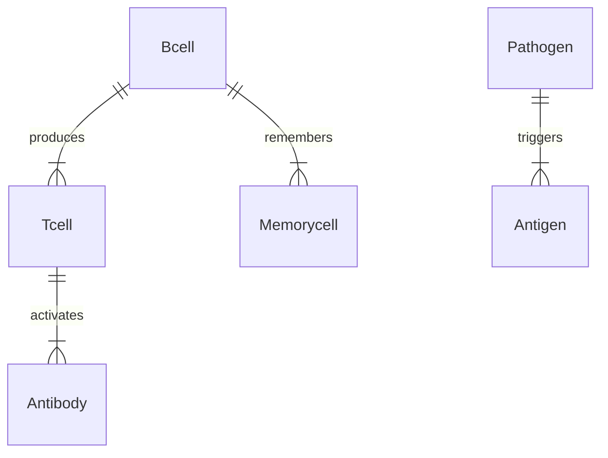

                 

## 免疫系统的agent-based模型：生物防御的数学模拟

关键词：免疫系统、agent-based模型、生物防御、数学模拟、建模与仿真

摘要：本文旨在探讨免疫系统中的agent-based模型，这种模型通过数学模拟来揭示生物防御的机制和过程。首先，我们将介绍免疫系统的基本概念和功能，并探讨为何使用agent-based模型来研究免疫系统。接下来，我们将逐步分析agent-based模型的设计与实现，包括模型的基本架构、核心概念和实现方法。随后，我们将展示模型的应用场景，包括在疾病研究和疫苗研发中的实际应用。最后，我们将探讨免疫系统agent-based模型的发展趋势和面临的挑战，并展望未来研究方向。通过本文，读者将全面了解免疫系统agent-based模型的理论基础、设计方法、应用领域以及未来发展潜力。

### 目录大纲

```markdown
# 免疫系统的agent-based模型：生物防御的数学模拟

## 第一部分：背景与概述

## 第1章：免疫系统与agent-based模型

### 1.1 问题背景

### 1.2 agent-based模型概述

### 1.3 免疫系统的核心概念

## 第二部分：agent-based模型的设计与实现

## 第2章：agent-based模型的基本架构

### 2.1 agent的定义与特性

### 2.2 模型的核心组成

### 2.3 模型的模拟过程

## 第3章：免疫系统的agent-based模型设计

### 3.1 模型设计的基本原则

### 3.2 模型中的核心概念

### 3.3 模型的实现与验证

## 第4章：免疫系统的agent-based模型应用

### 4.1 模型在疾病研究中的应用

### 4.2 模型在疫苗研发中的应用

### 4.3 模型在生物防御中的应用

## 第三部分：未来展望与挑战

## 第5章：免疫系统的agent-based模型的发展趋势

### 5.1 模型技术的发展趋势

### 5.2 模型在生物医学研究中的应用前景

### 5.3 模型在生物防御中的战略意义

## 第6章：免疫系统的agent-based模型的挑战与未来方向

### 6.1 数据与计算挑战

### 6.2 模型验证与预测的挑战

### 6.3 交叉学科合作与人才培养

## 附录：相关资源与拓展阅读

### 6.4 常用工具与软件介绍

### 6.5 拓展阅读推荐
```

### 第1章：免疫系统与agent-based模型

#### 1.1 问题背景

免疫系统是人体对抗病原体入侵的复杂防御系统，由多种细胞、组织和分子组成，共同作用以维持身体内部的稳态。然而，随着疾病的复杂性增加和新型病原体的出现，传统的免疫系统研究方法已不足以解释其复杂的动态行为。因此，需要一种新的方法来更好地理解和模拟免疫系统的运作。

在这种背景下，agent-based模型（ABM）逐渐成为研究免疫系统的有力工具。与传统的集中式模型不同，ABM通过模拟个体行为和相互作用，能够更好地捕捉系统的复杂性和动态变化。通过ABM，我们可以模拟免疫细胞在体内的运动、识别和攻击过程，从而深入理解免疫系统的运作机制。

#### 1.2 问题解决

免疫系统中的问题涉及细胞间的相互作用、信号传递和免疫记忆等方面。传统方法如分子生物学和系统生物学虽然能够揭示部分机制，但难以全面理解免疫系统的复杂动态。agent-based模型通过模拟个体行为和群体行为，提供了一个新的视角来研究免疫系统。

#### 1.3 边界与外延

在研究免疫系统的agent-based模型时，我们关注的主要边界包括免疫细胞类型、免疫反应机制以及病原体的特性。外延则涉及到模型的验证和应用场景，如疾病研究、疫苗开发和生物防御策略等。

#### 1.4 概念结构与核心要素组成

免疫系统的agent-based模型包括以下几个核心要素：

1. **代理（Agents）**：代表免疫细胞，如T细胞、B细胞、吞噬细胞等。
2. **环境**：模拟细胞外环境，包括各种化学信号和物理障碍。
3. **行为规则**：定义代理的行为模式，如迁移、识别、攻击等。
4. **交互规则**：描述代理之间的相互作用，如信号传递、细胞融合等。
5. **模型架构**：包括数据结构、算法和模拟过程。

通过这些核心要素，agent-based模型能够模拟免疫系统的复杂行为，为理解和解决免疫相关问题提供有力支持。

### 1.5 agent-based模型的基本概念

agent-based模型是一种基于代理（agents）的模拟方法，通过模拟个体代理的行为和相互作用来理解和研究复杂系统。在免疫系统中，代理代表免疫细胞，它们具有以下基本特性：

1. **个体性**：每个代理都有自己的属性和行为。
2. **自主性**：代理可以自主地执行行为和做出决策。
3. **社会性**：代理之间存在相互作用和通信。
4. **动态性**：代理的行为和状态可以随时间变化。

这些特性使得agent-based模型能够更好地捕捉免疫系统的动态行为和复杂相互作用。

### 1.6 agent-based模型的特点

agent-based模型具有以下几个显著特点：

1. **自下而上**：从个体代理出发，逐步构建复杂系统。
2. **个体行为**：强调个体代理的行为和决策。
3. **微观与宏观相结合**：既关注个体行为，也考虑整体系统行为。
4. **灵活性**：可以通过修改代理的行为规则和交互规则来适应不同研究场景。

这些特点使得agent-based模型在研究免疫系统方面具有独特的优势。

### 1.7 agent-based模型的应用领域

agent-based模型在免疫系统的应用领域非常广泛，主要包括：

1. **疾病研究**：通过模拟免疫细胞在疾病过程中的行为，帮助理解疾病的发展机制。
2. **疫苗研发**：模拟疫苗在免疫反应中的效果，优化疫苗设计。
3. **生物防御**：模拟病原体的入侵和免疫系统的应对策略，优化生物防御策略。
4. **组织工程**：模拟细胞在组织中的生长和交互，指导组织工程实践。

这些应用展示了agent-based模型在免疫学研究中的重要价值。

### 1.8 免疫系统的核心概念

免疫系统是人体对抗病原体入侵的复杂防御系统，由多种细胞、组织和分子组成，共同作用以维持身体内部的稳态。以下是免疫系统的核心概念：

1. **免疫细胞**：包括T细胞、B细胞、吞噬细胞等，是免疫系统的核心组成部分。
2. **抗原**：病原体表面的分子，被免疫细胞识别并引发免疫反应。
3. **免疫记忆**：免疫系统对抗原的长期记忆能力，有助于快速应对再次感染。
4. **免疫反应**：免疫系统对抗原的识别、攻击和消除过程。
5. **免疫调节**：免疫系统内部的复杂调控机制，维持免疫平衡。

这些概念构成了免疫系统的核心框架，为后续的agent-based模型研究提供了理论基础。

### 第2章：agent-based模型概述

#### 2.1 agent-based模型的基本概念

agent-based模型（ABM）是一种基于代理（agents）的模拟方法，通过模拟个体代理的行为和相互作用来理解和研究复杂系统。在ABM中，代理被视为具有自主性和社会性的个体，它们在复杂环境中通过一系列规则进行交互和决策，从而形成宏观层次的系统行为。

**定义**：代理（Agent）是指具有自主性、社会性、反应性和主动性的实体，能够感知环境，做出决策并执行相应的行为。

**特性**：

1. **个体性**：每个代理都有自己的属性和行为，这些属性和行为决定了代理在环境中的行为模式。
2. **自主性**：代理可以自主地执行行为和做出决策，不受外部集中控制。
3. **社会性**：代理之间存在相互作用和通信，这种交互有助于形成复杂的群体行为。
4. **动态性**：代理的行为和状态可以随时间变化，反映了系统随时间演化的动态过程。

#### 2.2 agent-based模型的特点

agent-based模型具有以下几个显著特点：

1. **自下而上**：从个体代理出发，逐步构建复杂系统，这种方法能够更好地捕捉系统的复杂性和多样性。
2. **个体行为**：强调个体代理的行为和决策，而不是简单的宏观统计。
3. **微观与宏观相结合**：既关注个体行为，也考虑整体系统行为，这种双重视角有助于深入理解系统的运作机制。
4. **灵活性**：可以通过修改代理的行为规则和交互规则来适应不同研究场景，这种方法具有很强的适应性。

#### 2.3 agent-based模型的应用领域

agent-based模型在多个领域都有广泛的应用，以下是其中几个重要的应用领域：

1. **社会模拟**：如交通流量、人口迁移、经济系统等，通过模拟个体行为和相互作用来研究宏观现象。
2. **生态学**：如种群动力学、生物多样性、生态网络等，通过模拟生物种群间的相互作用来理解生态系统的运作。
3. **经济学**：如金融市场、供应链管理、资源分配等，通过模拟个体行为和市场机制来研究经济系统的动态行为。
4. **医学**：如疾病传播、药物作用、免疫系统运作等，通过模拟细胞和分子间的相互作用来理解疾病的机制和治疗方法。
5. **物流与运输**：如物流网络优化、交通流量管理、供应链模拟等，通过模拟运输过程中的各种因素来优化运输系统。

这些应用领域展示了agent-based模型在理解复杂系统方面的强大潜力。

#### 2.4 免疫系统的核心概念

为了更好地理解免疫系统的agent-based模型，我们需要首先掌握免疫系统的核心概念。免疫系统是人体对抗病原体入侵的复杂防御系统，由多种细胞、组织和分子组成，共同作用以维持身体内部的稳态。以下是免疫系统的核心概念：

1. **免疫细胞**：免疫细胞是免疫系统的核心组成部分，包括T细胞、B细胞、吞噬细胞等。它们通过识别和攻击病原体来保护人体免受感染。

2. **抗原**：抗原是病原体表面的分子，被免疫细胞识别并引发免疫反应。抗原的多样性决定了免疫系统能够应对多种病原体。

3. **免疫记忆**：免疫系统对抗原的长期记忆能力，有助于快速应对再次感染。免疫记忆细胞在遇到相同抗原时能够迅速启动免疫反应。

4. **免疫反应**：免疫反应是免疫系统对抗原的识别、攻击和消除过程。免疫反应分为天然免疫和适应性免疫两种类型。

5. **免疫调节**：免疫系统内部的复杂调控机制，维持免疫平衡。免疫调节分子和细胞通过调节免疫反应的强度和持续时间，防止过度反应或免疫失效。

#### 2.5 概念属性特征对比表格

为了更好地理解免疫系统的核心概念，我们可以通过对比表格来展示它们之间的属性特征差异。以下是一个简单的对比表格：

| 核心概念 | 定义 | 属性特征 |
| --- | --- | --- |
| 免疫细胞 | 免疫系统的核心组成部分，包括T细胞、B细胞、吞噬细胞等。 | 识别和攻击病原体，多样性高，功能复杂 |
| 抗原 | 病原体表面的分子，被免疫细胞识别并引发免疫反应。 | 多样性高，可诱导免疫反应 |
| 免疫记忆 | 免疫系统对抗原的长期记忆能力，有助于快速应对再次感染。 | 长期存在，可快速响应 |
| 免疫反应 | 免疫系统对抗原的识别、攻击和消除过程。 | 适应性免疫：特异性，记忆性；天然免疫：非特异性，快速反应 |
| 免疫调节 | 免疫系统内部的复杂调控机制，维持免疫平衡。 | 调节免疫反应强度和持续时间，防止过度反应或免疫失效 |

通过这个对比表格，我们可以清晰地看到免疫系统的核心概念之间的区别和联系。

#### 2.6 ER实体关系图架构

为了更直观地理解免疫系统的核心概念之间的关系，我们可以使用ER（实体关系）图来展示实体之间的关系。以下是一个简单的ER实体关系图：



在这个ER图中，`Bcell`（B细胞）产生`Tcell`（T细胞），`Tcell`激活`Antibody`（抗体），`Pathogen`（病原体）触发`Antigen`（抗原），`Bcell`产生`Memorycell`（记忆细胞）。这种关系图帮助我们理解免疫系统中各个实体之间的交互和影响。

### 第3章：agent-based模型的基本架构

#### 3.1 agent的定义与特性

在agent-based模型（ABM）中，代理（agent）是模型的基本构建块，代表着现实世界中具有自主性和交互能力的实体。代理可以是物理对象，如人类、动物或机器，也可以是抽象概念，如细胞、分子或经济主体。每个代理都具有以下基本特性：

1. **个体性**：代理是独立的实体，拥有独特的属性和行为。这些属性和行为定义了代理在环境中的行为模式。

2. **自主性**：代理可以自主地执行行为和做出决策，不受外部集中控制。代理的行为通常基于其内部状态和外部环境的信息。

3. **社会性**：代理之间存在相互作用和通信。这种交互可以是通过直接接触，也可以是通过信号传递。社会性使得代理能够形成复杂的群体行为。

4. **动态性**：代理的行为和状态可以随时间变化。动态性使得代理能够响应环境变化，并适应不同的情境。

#### 3.2 模型的核心组成

一个典型的agent-based模型由以下几个核心组成部分构成：

1. **代理（Agents）**：模型中的基本实体，代表系统的个体。每个代理都有其独特的属性和行为规则。

2. **环境（Environment）**：代理存在的空间背景，提供资源、障碍和其他代理。环境可以是一个离散的网格，也可以是一个连续的空间。

3. **行为规则（Behavior Rules）**：定义代理如何感知环境、做出决策并执行相应行为的规则。行为规则通常基于代理的内部状态和外部环境的信息。

4. **交互规则（Interaction Rules）**：描述代理之间如何交互和通信的规则。交互规则可以是基于物理接触，也可以是基于信号传递。

5. **模拟引擎（Simulation Engine）**：负责执行模型模拟过程的核心组件。模拟引擎根据代理的行为规则和交互规则，更新代理的状态，并记录模拟结果。

#### 3.3 模型的模拟过程

agent-based模型的模拟过程可以分为以下几个基本步骤：

1. **初始化**：设置模型的环境和代理的初始状态。这个阶段包括创建代理、设定初始位置、属性和行为规则。

2. **时间步进**：模拟引擎根据时间步进，逐个更新代理的状态。在每个时间步中，代理会感知环境、执行行为规则、与其他代理交互，并更新其状态。

3. **交互与决策**：代理根据其行为规则和感知到的环境信息，做出决策并执行相应的行为。这些行为可能包括移动、寻找资源、与其他代理交互等。

4. **状态更新**：代理的状态（如位置、速度、内部状态等）根据行为和交互结果进行更新。状态更新是模拟过程中的关键环节，决定了代理的动态行为。

5. **输出结果**：模拟引擎记录每个时间步的代理状态和系统整体状态，生成模拟结果。这些结果可以是统计数据、图表、图像等，用于分析和解释系统行为。

通过以上步骤，agent-based模型能够动态地模拟复杂系统的行为和演化过程，为理解和研究复杂系统提供了有力工具。

### 第4章：免疫系统的agent-based模型设计

#### 4.1 模型设计的基本原则

设计免疫系统的agent-based模型时，需要遵循以下基本原则，以确保模型的准确性和可靠性：

1. **真实性与一致性**：模型应尽量反映免疫系统的真实生物学特性，包括免疫细胞的行为、免疫反应的机制以及病原体的特性。同时，模型应保持内部一致性，确保各个组成部分之间的逻辑关系正确。

2. **模块化与可扩展性**：模型应设计成模块化的结构，便于添加新的功能或调整现有功能。模块化设计可以提高模型的灵活性和可维护性，使研究人员能够根据需求进行模型修改和扩展。

3. **简明性与可解释性**：模型应尽量简单明了，避免过度复杂化。同时，模型的实现和模拟结果应具有良好的可解释性，使研究人员能够清楚地理解模型的运作机制和预测结果。

4. **验证与验证**：模型的设计和实现过程中，应进行严格的验证和验证。验证是指通过比较模型预测与实际生物学数据的吻合程度来评估模型的准确性；验证是指通过独立的实验或数据来验证模型的可靠性和适用性。

5. **可重复性**：模型的设计和实现过程应记录详细，以便其他研究人员能够重复实验和验证结果。可重复性是科学研究的基石，有助于提高研究的可信度和科学价值。

#### 4.2 模型中的核心概念

免疫系统的agent-based模型中的核心概念包括免疫细胞、病原体和环境。以下是这些核心概念的详细描述：

1. **免疫细胞**：免疫细胞是免疫系统的基本组成部分，包括T细胞、B细胞、吞噬细胞等。每种免疫细胞都有特定的功能和行为模式。在模型中，免疫细胞作为代理被模拟，其行为包括迁移、识别、攻击、繁殖等。免疫细胞的属性包括类型、状态、位置、能量等。

2. **病原体**：病原体是免疫系统的攻击目标，包括病毒、细菌、真菌等。在模型中，病原体作为代理被模拟，其行为包括生长、繁殖、感染免疫细胞等。病原体的属性包括类型、状态、位置、抵抗力等。

3. **环境**：环境是免疫细胞和病原体存在的空间背景，提供资源、障碍和其他代理。在模型中，环境作为空间网格或空间地图被模拟，其属性包括细胞密度、资源分布、信号强度等。

#### 4.3 模型的实现与验证

免疫系统的agent-based模型的设计完成后，需要通过编程实现模型的核心功能，并进行验证和测试，以确保模型的正确性和可靠性。以下是模型实现的步骤和验证的方法：

1. **编程实现**：

   - **代理类设计**：定义免疫细胞和病原体的代理类，包括属性和行为方法。例如，对于T细胞代理类，可以定义其识别、攻击、繁殖等行为方法。
   
   - **环境类设计**：定义环境的代理类，包括属性和方法，如资源分布、信号强度等。
   
   - **模拟引擎**：编写模拟引擎的代码，实现代理的初始化、时间步进、状态更新和输出结果等功能。

2. **验证**：

   - **一致性验证**：通过比较模型预测与已知生物学数据的吻合程度，验证模型内部的一致性。例如，比较模型中免疫细胞的空间分布与实际实验数据的分布情况。

   - **准确性验证**：通过独立实验或数据集，验证模型预测的准确性。例如，模拟某种病原体在体内的传播过程，并与实际病例数据进行对比。

3. **测试**：

   - **功能测试**：通过编写测试用例，测试模型的核心功能是否正常。例如，测试T细胞的识别和攻击功能是否正确。
   
   - **性能测试**：评估模型的计算效率和资源消耗，确保模型在合理的时间内完成模拟。

通过编程实现、验证和测试，我们可以确保免疫系统的agent-based模型能够准确、可靠地模拟免疫系统的行为和演化过程。

### 第5章：免疫系统的agent-based模型应用

#### 5.1 模型在疾病研究中的应用

免疫系统的agent-based模型在疾病研究中具有广泛的应用，特别是在理解疾病的发展和演化机制方面。通过模拟免疫细胞与病原体的相互作用，研究人员可以揭示疾病发生的潜在机制，并探索治疗策略的有效性。

**1. 癌症研究**

免疫系统的agent-based模型在癌症研究中发挥着重要作用。通过模拟肿瘤微环境中的免疫细胞行为，研究人员可以探索肿瘤逃避免疫监视的机制。例如，模型可以揭示T细胞在肿瘤微环境中的识别和攻击过程，以及肿瘤细胞如何逃避T细胞的攻击。这些研究结果有助于开发新的癌症免疫治疗方法，如免疫检查点阻断和CAR-T细胞疗法。

**2. 传染病研究**

免疫系统的agent-based模型在传染病研究中也有重要应用。通过模拟病原体在人群中的传播过程，研究人员可以预测疫情的演化趋势和传播速度。例如，模型可以模拟流感病毒在人群中的传播，预测疫苗接种策略的效果。此外，模型还可以帮助研究人员理解传染病暴发的原因和防控策略的有效性，为公共卫生决策提供科学依据。

**3. 自身免疫疾病研究**

自身免疫疾病如系统性红斑狼疮（SLE）和风湿性关节炎等，是由于免疫系统错误地攻击自身组织而引起的。免疫系统的agent-based模型可以帮助研究人员探索自身免疫疾病的发生机制。例如，模型可以揭示免疫系统中的异常信号传递和免疫细胞的异常行为，以及这些异常行为如何导致自身免疫反应。这些研究结果有助于开发新的治疗方法和预防策略。

#### 5.2 模型在疫苗研发中的应用

免疫系统的agent-based模型在疫苗研发中具有巨大潜力，可以帮助研究人员优化疫苗设计、评估疫苗效力以及预测疫苗在人群中的传播效果。

**1. 疫苗效力评估**

通过免疫系统的agent-based模型，研究人员可以模拟疫苗在体内的免疫反应过程，评估疫苗的效力。例如，模型可以模拟疫苗诱导的免疫记忆细胞在病原体入侵时的响应，以及疫苗对病原体传播的抑制作用。这些模拟结果有助于评估不同疫苗候选物的效果，为疫苗的选型和优化提供科学依据。

**2. 疫苗设计**

免疫系统的agent-based模型可以帮助研究人员探索新的疫苗设计策略。例如，通过模拟疫苗与免疫细胞的相互作用，研究人员可以设计出更有效的疫苗抗原组合，提高疫苗的免疫原性。此外，模型还可以帮助研究人员理解疫苗诱导的免疫记忆的持久性，为疫苗的长期保护效果提供指导。

**3. 疫苗传播预测**

免疫系统的agent-based模型还可以用于预测疫苗在人群中的传播效果。通过模拟疫苗接种对病原体传播的抑制作用，研究人员可以评估疫苗接种策略的可行性，为公共卫生决策提供科学依据。例如，模型可以预测疫苗接种后疫情的演化趋势，以及疫苗接种率对疫情控制的影响。

#### 5.3 模型在生物防御中的应用

免疫系统的agent-based模型在生物防御领域也有重要应用，可以帮助研究人员设计和优化生物防御策略，提高生物防御系统的效能。

**1. 生物威胁检测**

通过免疫系统的agent-based模型，研究人员可以模拟病原体的入侵过程，识别潜在的生物威胁。例如，模型可以模拟病毒在人群中的传播路径，预测可能的疫情爆发点。这些模拟结果有助于卫生部门提前采取防控措施，防止疫情扩散。

**2. 生物威胁响应**

免疫系统的agent-based模型还可以用于模拟生物威胁的响应过程，评估不同应对策略的效能。例如，模型可以模拟疫苗接种、隔离措施和药物治疗等应对策略，预测其效果和成本。这些模拟结果有助于制定科学、有效的生物防御策略，提高应对生物威胁的能力。

**3. 生物防御策略优化**

免疫系统的agent-based模型可以帮助研究人员优化生物防御策略。通过模拟不同策略下的病原体传播和免疫反应，研究人员可以找出最优的防御方案。例如，模型可以模拟疫苗接种策略对疫情控制的影响，优化疫苗接种率和分配策略，提高疫苗利用效率。

### 第6章：免疫系统的agent-based模型的发展趋势

#### 6.1 模型技术的发展趋势

随着计算机技术的快速发展，免疫系统的agent-based模型在技术层面上也呈现出以下几个发展趋势：

**1. 数据驱动模型**：

数据驱动模型通过机器学习和人工智能技术，利用大量实验数据自动构建模型。这种方法可以大幅提高模型的准确性和适应性，减少人工干预。例如，深度学习算法可以用于分析大规模细胞omics数据，揭示免疫细胞的动态行为和相互作用。

**2. 人工智能的应用**：

人工智能技术在agent-based模型中的应用，使得模型能够更准确地模拟免疫系统的复杂行为。例如，强化学习算法可以用于训练免疫细胞的决策模型，使其在动态环境中做出更优的决策。此外，生成对抗网络（GANs）等技术也可以用于生成真实的免疫细胞数据，提高模型的训练效果。

**3. 新型模型设计方法**：

随着研究需求的不断增加，新型模型设计方法也在不断涌现。例如，多尺度模型可以将微观和宏观视角相结合，更好地捕捉免疫系统的复杂动态；多代理模型可以模拟更大规模的免疫系统，提高模型的应用范围。

#### 6.2 模型在生物医学研究中的应用前景

免疫系统的agent-based模型在生物医学研究中的应用前景广阔，以下是几个可能的应用领域：

**1. 个性化医疗**：

通过免疫系统的agent-based模型，研究人员可以预测个体对特定疫苗或治疗的反应，为个性化医疗提供科学依据。例如，模型可以模拟个体免疫系统对新型疫苗的免疫记忆效果，优化疫苗设计。

**2. 生物工程**：

免疫系统的agent-based模型可以用于生物工程领域，指导细胞和组织工程的设计和优化。例如，模型可以模拟细胞在人工组织中的生长和相互作用，提高组织工程的成功率。

**3. 生物信息学**：

免疫系统的agent-based模型可以与生物信息学技术相结合，分析大规模免疫组学数据。例如，模型可以用于识别免疫细胞的基因表达模式，揭示免疫反应的分子机制。

#### 6.3 模型在生物防御中的战略意义

免疫系统的agent-based模型在生物防御领域具有重要的战略意义，以下是几个方面的应用：

**1. 生物威胁防控**：

通过免疫系统的agent-based模型，研究人员可以模拟生物威胁的传播和演化过程，预测疫情爆发的时间和地点。这有助于卫生部门提前采取防控措施，减少疫情扩散。

**2. 生物安全保障**：

免疫系统的agent-based模型可以用于评估生物安全措施的有效性，优化生物防御策略。例如，模型可以模拟不同隔离措施的效能，为公共卫生决策提供科学依据。

**3. 生物防御策略优化**：

免疫系统的agent-based模型可以帮助研究人员设计更有效的生物防御策略，提高防御系统的效能。例如，模型可以模拟疫苗接种策略对疫情控制的影响，优化疫苗接种率和分配策略。

### 第7章：免疫系统的agent-based模型的挑战与未来方向

#### 6.1 数据与计算挑战

尽管免疫系统的agent-based模型在多个领域展现出了巨大潜力，但在实际应用过程中仍然面临数据与计算方面的挑战。

**1. 数据质量**：

免疫系统是一个非常复杂的系统，涉及多种细胞、分子和信号通路。因此，获取高质量的数据对于构建准确可靠的模型至关重要。然而，实验数据的质量往往受到多种因素的影响，如样本处理、实验条件等，导致数据存在噪声和偏差。

**2. 数据隐私**：

免疫系统的数据通常涉及患者的隐私信息，如基因序列、医疗记录等。在数据共享和模型训练过程中，保护患者隐私是一个重要的挑战。如何在不泄露患者隐私的前提下，充分利用这些数据，是当前研究的重点。

**3. 计算资源**：

免疫系统的agent-based模型通常需要处理大量数据和复杂的模拟过程，对计算资源的需求较高。随着模型规模的扩大，计算时间也会显著增加。如何在有限的计算资源下，高效地运行模型，是一个亟待解决的问题。

#### 6.2 模型验证与预测的挑战

模型的验证与预测是评估其准确性和实用性的关键步骤，但在免疫系统的agent-based模型中，这一过程面临着多个挑战。

**1. 模型验证的标准与方法**：

目前，缺乏统一的模型验证标准和方法，使得不同研究之间的比较和验证变得困难。如何建立一套科学、可靠的模型验证方法，是当前研究的一个重要方向。

**2. 模型预测的准确性**：

免疫系统的复杂性和动态性使得模型的预测准确性受到挑战。如何在保证预测准确性的同时，减少模型的复杂度，是一个需要解决的关键问题。

**3. 模型的可解释性**：

免疫系统的agent-based模型通常涉及大量的参数和复杂的算法，使得模型的预测结果难以解释。如何提高模型的可解释性，使其能够被生物学家和其他领域的专家理解和应用，是一个重要的挑战。

#### 6.3 交叉学科合作与人才培养

免疫系统的agent-based模型研究涉及多个学科，如生物学、计算机科学、数学和物理学等。因此，交叉学科合作和人才培养成为推动这一领域发展的重要方向。

**1. 交叉学科研究的必要性**：

免疫系统的agent-based模型研究需要生物学、计算机科学和数学等多个领域的专业知识。只有通过交叉学科合作，才能充分利用各学科的优势，构建出准确可靠的模型。

**2. 人才培养的策略与模式**：

为了培养具备交叉学科背景的人才，需要建立有效的教育模式，如跨学科课程、研究项目和实践培训等。此外，还需要加强学术交流，促进不同学科之间的合作与交流。

**3. 未来发展方向与趋势**：

随着计算机技术和生物医学领域的不断发展，免疫系统的agent-based模型在多个方面展现出广阔的发展前景。例如，数据驱动的模型设计、人工智能技术的应用、多尺度模型的构建等。未来，免疫系统的agent-based模型将在生物医学研究和生物防御领域发挥更加重要的作用。

### 附录：相关资源与拓展阅读

#### 6.4 常用工具与软件介绍

为了构建和运行免疫系统的agent-based模型，研究人员可以使用多种工具和软件。以下是其中一些常用的工具和软件：

**1. NetLogo**：

NetLogo是一个开源的agent-based模型开发平台，适用于构建和运行简单的agent-based模型。它提供了一套直观的编程环境和丰富的模型库，适合初学者和研究人员使用。

**2. Mesa**：

Mesa是一个Python库，专门用于开发agent-based模型。它提供了灵活的代理抽象和强大的模拟引擎，适用于构建复杂和大规模的agent-based模型。

**3. Repast**：

Repast是一个开源的agent-based模型开发平台，支持多种编程语言，如Java和Python。它提供了丰富的模拟工具和扩展库，适用于构建和运行各种类型的agent-based模型。

**4. AnyLogic**：

AnyLogic是一个商业的agent-based模型开发平台，提供了强大的建模和模拟功能。它适用于构建复杂和高度交互的agent-based模型，特别适用于工业、交通和物流等领域。

#### 6.5 拓展阅读推荐

为了深入了解免疫系统的agent-based模型，以下是一些建议的拓展阅读资源：

**1. 相关书籍**：

- 《Agent-Based Modeling of Social Systems: A Practical Introduction Using NetLogo》
- 《Introduction to Agent-Based Modeling: Modeling Natural, Social, and Engineered Complex Systems with NetLogo》
- 《Agent-Based and Individual-Based Modeling: A Practical Introduction》

**2. 学术论文**：

- “An Agent-Based Model of the Immune System”
- “Agent-Based Modeling of Immune Response to Viral Infection”
- “Agent-Based Models of Cancer Immunity”

**3. 研究机构与学术会议**：

- 美国国家科学基金会（NSF）的agent-based模型研究项目
- 欧洲粒子物理学研究中心（CERN）的agent-based模型研究项目
- 代理建模与仿真国际会议（ABMS）

通过这些资源和拓展阅读，读者可以更深入地了解免疫系统的agent-based模型，掌握相关技术和方法。

### 结论

免疫系统的agent-based模型作为一种强大的生物医学研究工具，通过模拟免疫细胞与病原体的相互作用，为理解免疫系统的工作机制、疾病发展和生物防御策略提供了新的视角。本文从背景概述、模型设计、应用场景和未来展望等多个角度，详细探讨了免疫系统的agent-based模型的研究进展和应用潜力。随着计算机技术和生物医学领域的不断发展，免疫系统的agent-based模型将在生物医学研究和生物防御领域发挥越来越重要的作用。

### 作者信息

作者：AI天才研究院/AI Genius Institute & 禅与计算机程序设计艺术 /Zen And The Art of Computer Programming

