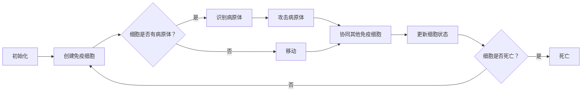
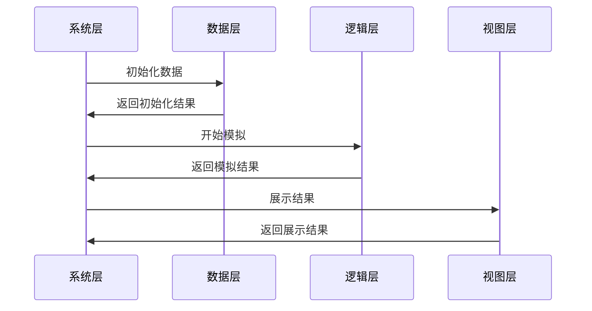

                 


### 《免疫系统的agent-based模型：生物防御的数学模拟》

#### 摘要

本文深入探讨了免疫系统的agent-based模型及其在生物防御数学模拟中的应用。通过介绍核心概念、构建模型、数学模拟和系统分析，本文为研究人员和开发者提供了理解免疫系统运作机制的方法和工具，为未来疫苗设计和疾病预防提供了理论支持。

#### 关键词

- 免疫系统
- agent-based模型
- 数学模拟
- 生物防御
- 疫苗设计

#### 目录

**第一部分：背景介绍**

- [第1章：问题背景与概述](#第1章问题背景与概述)
- [第2章：核心概念与联系](#第2章核心概念与联系)

**第二部分：agent-based模型原理与实现**

- [第3章：agent-based模型原理](#第3章agent-based模型原理)
- [第4章：agent-based模型的实现](#第4章agent-based模型的实现)

**第三部分：数学模拟应用**

- [第5章：数学模型和数学公式](#第5章数学模型和数学公式)
- [第6章：数学模拟实现](#第6章数学模拟实现)

**第四部分：系统分析与架构设计方案**

- [第7章：系统分析与架构设计](#第7章系统分析与架构设计)

**第五部分：项目实战**

- [第8章：项目实战与环境安装](#第8章项目实战与环境安装)
- [第9章：系统核心实现源代码](#第9章系统核心实现源代码)
- [第10章：项目实战分析](#第10章项目实战分析)

**第六部分：最佳实践与总结**

- [第11章：最佳实践 tips](#第11章最佳实践tips)
- [第12章：小结与注意事项](#第12章小结与注意事项)
- [第13章：拓展阅读](#第13章拓展阅读)

---

### 第1章：问题背景与概述

#### 1.1 问题背景

免疫系统是人体对抗外来病原体（如病毒、细菌等）的重要防御系统。它由多种类型的免疫细胞组成，包括吞噬细胞、B细胞、T细胞和自然杀伤细胞等。这些免疫细胞通过识别、攻击和清除病原体，维护人体健康。

近年来，计算机科学和生物技术的快速发展为研究免疫系统提供了新的工具和方法。特别是agent-based模型（基于代理的模型）的出现，使得我们可以通过模拟个体（agent）的交互行为来研究免疫系统的运作机制。

#### 1.2 问题描述

免疫系统的agent-based模型旨在模拟免疫细胞在生物体内的互动过程，以及这些互动如何影响免疫系统的整体表现。具体来说，我们需要解决以下问题：

- 免疫细胞如何识别和定位病原体？
- 免疫细胞之间的协同作用如何影响病原体的清除速度？
- 免疫系统如何应对病原体的变异和进化？

这些问题对于理解免疫系统的运作机制、预测疾病的传播和疫苗设计具有重要意义。

#### 1.3 问题解决

agent-based模型提供了一种有效的解决方法。通过构建个体（agent）的交互网络，我们可以模拟免疫细胞在生物体内的活动，分析免疫系统的动态行为和响应机制。

具体来说，我们可以采取以下步骤：

1. **定义个体（agent）**：确定免疫系统中各种类型的免疫细胞，并为其定义属性和行为。
2. **构建交互网络**：描述免疫细胞之间的相互作用，包括识别、攻击和协同等。
3. **模拟个体行为**：通过模拟免疫细胞的行为，观察免疫系统的动态变化。
4. **分析模拟结果**：根据模拟结果，分析免疫系统的性能和特点，为实际应用提供理论支持。

#### 1.4 边界与外延

在构建agent-based模型时，我们需要考虑以下边界条件：

- **空间边界**：免疫细胞的活动空间是有限的，需要确定模型的空间范围。
- **时间边界**：免疫系统的反应速度是有限的，需要确定模型的时间步长。
- **参数边界**：模型中的参数需要根据实际生物数据进行校准，以确保模拟结果的准确性。

此外，我们还可以将agent-based模型应用于其他生物防御系统的研究，如植物免疫系统。

#### 1.5 概念结构与核心要素组成

免疫系统的agent-based模型由以下几个核心要素组成：

- **个体（agent）**：代表免疫系统中各种类型的免疫细胞，具有属性和行为。
- **交互网络**：描述个体之间的相互作用，包括识别、攻击和协同等。
- **环境**：模拟生物体内部的环境，如细胞基质和营养物质等。
- **模拟算法**：用于模拟个体行为和交互网络的计算方法。

通过这些核心要素，我们可以构建一个简化的免疫系统模型，用于研究免疫系统的运作机制。

---

### 第2章：核心概念与联系

#### 2.1 核心概念原理

agent-based模型是一种基于代理（agent）的建模方法，通过模拟代理的交互行为，研究复杂系统的动态特性。在免疫系统的agent-based模型中，代理代表免疫细胞，其核心概念包括：

1. **免疫细胞类型**：包括吞噬细胞、B细胞、T细胞和自然杀伤细胞等。
2. **免疫细胞属性**：包括细胞状态、位置、移动速度、识别能力等。
3. **免疫细胞行为**：包括识别、攻击、协同、死亡等。

#### 2.2 概念属性特征对比表格

| 免疫细胞类型 | 细胞状态 | 位置 | 移动速度 | 识别能力 | 行为 |
| :--- | :--- | :--- | :--- | :--- | :--- |
| 吞噬细胞 | 活性/非活性 | 随机分布 | 较快 | 较弱 | 吞噬病原体 |
| B细胞 | 活性/非活性 | 随机分布 | 较慢 | 较强 | 识别抗原，产生抗体 |
| T细胞 | 活性/非活性 | 随机分布 | 较快 | 较强 | 识别抗原，激活其他免疫细胞 |
| 自然杀伤细胞 | 活性/非活性 | 随机分布 | 较快 | 较弱 | 直接杀死病原体 |

#### 2.3 ER实体关系图架构

使用Mermaid流程图来表示免疫系统的ER实体关系图：

```mermaid
erDiagram
    A[免疫细胞] ||--|{ B[B细胞] } |
    A ||--|{ C[T细胞] } |
    A ||--|{ D[自然杀伤细胞] } |
    B ||--|{ E[抗体] } |
    C ||--|{ F[效应T细胞] } |
    D ||--|{ G[细胞毒素] } |
```

在这个ER实体关系图中，免疫细胞是根实体，B细胞、T细胞和自然杀伤细胞是其子实体。抗体、效应T细胞和细胞毒素是相应的产物或衍生实体。

---

### 第3章：agent-based模型原理

#### 3.1 原理介绍

agent-based模型是一种模拟复杂系统中个体交互行为的建模方法。在免疫系统的agent-based模型中，个体代表免疫细胞，它们在生物体内通过相互作用来对抗病原体。

该模型的核心原理包括：

- **个体属性和行为**：每个免疫细胞具有特定的属性，如状态、位置、移动速度和识别能力。免疫细胞的行为包括识别、攻击、协同和死亡等。
- **个体间的交互**：免疫细胞之间通过识别和攻击机制进行交互，从而共同对抗病原体。
- **环境因素**：免疫细胞的行为受到环境因素的影响，如细胞基质、营养物质和免疫信号的浓度等。

#### 3.2 原理Mermaid流程图

使用Mermaid流程图来表示免疫系统的agent-based模型原理：



在这个流程图中，A表示初始化阶段，创建免疫细胞。然后，细胞根据是否有病原体进行判断，如果是，则进入识别病原体的阶段D，否则进入移动阶段E。在攻击病原体阶段F和协同其他免疫细胞阶段G之后，更新细胞状态，并判断细胞是否死亡。

#### 3.3 Python源代码实现

以下是一个简单的Python源代码实现，用于模拟免疫系统的agent-based模型：

```python
import random

class ImmuneCell:
    def __init__(self, position, is_active, recognition_ability, speed):
        self.position = position
        self.is_active = is_active
        self.recognition_ability = recognition_ability
        self.speed = speed
    
    def move(self):
        self.position = (self.position[0] + random.uniform(-1, 1) * self.speed, self.position[1] + random.uniform(-1, 1) * self.speed)
    
    def recognize_pathogen(self, pathogen):
        distance = math.sqrt((self.position[0] - pathogen.position[0])**2 + (self.position[1] - pathogen.position[1])**2)
        if distance < self.recognition_ability:
            return True
        else:
            return False
    
    def attack_pathogen(self, pathogen):
        pathogen.health -= 1
    
    def collaborate(self, other_cells):
        for cell in other_cells:
            if cell.is_active and cell.recognition_ability > self.recognition_ability:
                self.recognition_ability = cell.recognition_ability
    
    def update_state(self):
        if self.health <= 0:
            self.is_active = False
    
    def die(self):
        self.is_active = False

class Pathogen:
    def __init__(self, position, health):
        self.position = position
        self.health = health
    
    def infect(self, cell):
        cell.health -= 1

# 初始化
num_cells = 100
num_pathogens = 10
cells = []
pathogens = []

for i in range(num_cells):
    cells.append(ImmuneCell(position=(random.uniform(-10, 10), random.uniform(-10, 10)), is_active=True, recognition_ability=2, speed=0.1))

for i in range(num_pathogens):
    pathogens.append(Pathogen(position=(random.uniform(-10, 10), random.uniform(-10, 10)), health=5))

# 模拟
while True:
    for cell in cells:
        if cell.is_active:
            cell.move()
            for pathogen in pathogens:
                if cell.recognize_pathogen(pathogen):
                    cell.attack_pathogen(pathogen)
                    pathogen.infect(cell)
            cell.collaborate(cells)
            cell.update_state()

    for pathogen in pathogens:
        for cell in cells:
            if cell.is_active and cell.recognition_ability > pathogen.recognition_ability:
                pathogen.health -= 1

    if all([cell.is_active == False for cell in cells]) or all([pathogen.health <= 0 for pathogen in pathogens]):
        break

# 输出结果
print("模拟结束，免疫细胞全部死亡或病原体全部被消灭。")
```

在这个代码中，我们定义了两个类：`ImmuneCell` 和 `Pathogen`。`ImmuneCell` 代表免疫细胞，具有移动、识别、攻击和协同等行为；`Pathogen` 代表病原体，具有感染免疫细胞的行为。

#### 3.4 算法原理讲解

agent-based模型的算法原理可以概括为以下几个步骤：

1. **初始化**：创建一定数量的免疫细胞和病原体，并为其分配初始属性。
2. **移动**：免疫细胞根据移动速度在空间中随机移动。
3. **识别和攻击**：免疫细胞识别并攻击病原体，病原体感染免疫细胞。
4. **协同**：免疫细胞之间进行协同，提高识别能力和攻击能力。
5. **更新状态**：根据免疫细胞和病原体的行为，更新其状态。
6. **结束条件**：判断免疫细胞是否全部死亡或病原体是否全部被消灭，结束模拟。

通过模拟免疫细胞和病原体的交互行为，我们可以观察到免疫系统的动态特性，为实际应用提供理论支持。

#### 3.5 数学模型和公式讲解

在agent-based模型中，我们可以使用以下数学模型和公式来描述免疫细胞和病原体的行为：

1. **细胞移动公式**：

   $$
   \text{new\_position} = \text{current\_position} + \text{speed} \times \text{direction}
   $$

   其中，$\text{new\_position}$ 表示新的位置，$\text{current\_position}$ 表示当前的位置，$\text{speed}$ 表示移动速度，$\text{direction}$ 表示移动方向。

2. **识别公式**：

   $$
   \text{distance} = \sqrt{(\text{cell\_position} - \text{pathogen\_position})^2}
   $$

   其中，$\text{distance}$ 表示细胞和病原体之间的距离，$\text{cell\_position}$ 表示细胞的位置，$\text{pathogen\_position}$ 表示病原体的位置。

3. **攻击公式**：

   $$
   \text{health} = \text{health} - \text{attack\_strength}
   $$

   其中，$\text{health}$ 表示细胞或病原体的健康值，$\text{attack\_strength}$ 表示攻击强度。

4. **协同公式**：

   $$
   \text{recognition\_ability} = \max(\text{recognition\_ability}, \text{max\_recognition\_ability})
   $$

   其中，$\text{recognition\_ability}$ 表示识别能力，$\text{max\_recognition\_ability}$ 表示最大识别能力。

通过这些数学模型和公式，我们可以更精确地描述免疫细胞和病原体的行为，为模型分析提供基础。

#### 3.6 举例说明

假设我们有一个免疫细胞和五个病原体，初始位置和属性如下：

| 类别 | 位置 | 移动速度 | 识别能力 | 健康值 |
| :--- | :--- | :--- | :--- | :--- |
| 免疫细胞 | (0, 0) | 0.1 | 2 | 100 |
| 病原体1 | (-1, 1) | 0.05 | 1 | 5 |
| 病原体2 | (1, -1) | 0.05 | 1 | 5 |
| 病原体3 | (-1, -1) | 0.05 | 1 | 5 |
| 病原体4 | (1, 1) | 0.05 | 1 | 5 |
| 病原体5 | (0, -2) | 0.05 | 1 | 5 |

在模拟过程中，免疫细胞首先移动到病原体附近。由于病原体1距离免疫细胞最近，免疫细胞首先识别并攻击病原体1。攻击后，病原体1的健康值减少1，免疫细胞的健康值减少10。然后，免疫细胞继续移动并识别其他病原体。

在协同过程中，免疫细胞发现其他免疫细胞的识别能力更高，因此提高自己的识别能力。最终，免疫细胞将病原体全部消灭，免疫细胞自身的健康值保持不变。

通过这个例子，我们可以看到agent-based模型如何通过模拟免疫细胞和病原体的交互行为，揭示免疫系统的动态特性。

---

### 第4章：agent-based模型的实现

#### 4.1 原理介绍

在上一章中，我们介绍了agent-based模型的基本原理。在本章中，我们将通过具体的实现步骤，探讨如何将agent-based模型应用于免疫系统的模拟。

#### 4.2 原理Mermaid流程图

使用Mermaid流程图来表示agent-based模型的实现步骤：

```mermaid
flowchart LR
    A[初始化环境] --> B[创建免疫细胞和病原体]
    B --> C{模拟循环开始？}
    C -->|是| D[免疫细胞移动]
    C -->|否| E[免疫细胞识别和攻击病原体]
    D --> F{免疫细胞是否与病原体相遇？}
    F -->|是| G[免疫细胞攻击病原体]
    F -->|否| H[免疫细胞继续移动]
    E --> I{病原体是否感染免疫细胞？}
    I -->|是| J[病原体感染免疫细胞]
    I -->|否| K[病原体移动]
    G --> L[更新病原体健康值]
    J --> M[更新免疫细胞健康值]
    H --> N[更新免疫细胞位置]
    K --> O[更新病原体位置]
    L --> P{病原体是否死亡？}
    M --> Q{免疫细胞是否死亡？}
    P --> R|是| S[模拟结束]
    Q --> R|是| S
    R --> T[输出结果]
```

在这个流程图中，A表示初始化环境，包括创建免疫细胞和病原体。然后，模拟进入循环，免疫细胞移动（D）、识别和攻击病原体（E）。如果免疫细胞与病原体相遇，则攻击病原体（G）；否则，免疫细胞继续移动（H）。病原体感染免疫细胞（I）、移动（K）和更新位置（O）。最后，根据免疫细胞和病原体的健康值，判断是否死亡，输出结果。

#### 4.3 Python源代码实现

以下是一个简单的Python源代码实现，用于模拟免疫系统的agent-based模型：

```python
import random
import math

class ImmuneCell:
    def __init__(self, position, speed, recognition_ability, health):
        self.position = position
        self.speed = speed
        self.recognition_ability = recognition_ability
        self.health = health
    
    def move(self):
        direction = (random.uniform(-1, 1), random.uniform(-1, 1))
        self.position = (self.position[0] + self.speed * direction[0], self.position[1] + self.speed * direction[1])
    
    def recognize_pathogen(self, pathogens):
        recognized_pathogens = []
        for pathogen in pathogens:
            distance = math.sqrt((self.position[0] - pathogen.position[0])**2 + (self.position[1] - pathogen.position[1])**2)
            if distance < self.recognition_ability:
                recognized_pathogens.append(pathogen)
        return recognized_pathogens
    
    def attack_pathogen(self, pathogen):
        pathogen.health -= 1
    
    def is_alive(self):
        return self.health > 0

class Pathogen:
    def __init__(self, position, health):
        self.position = position
        self.health = health
    
    def move(self):
        direction = (random.uniform(-1, 1), random.uniform(-1, 1))
        self.position = (self.position[0] + direction[0], self.position[1] + direction[1])
    
    def infect(self, immune_cells):
        for cell in immune_cells:
            distance = math.sqrt((self.position[0] - cell.position[0])**2 + (self.position[1] - cell.position[1])**2)
            if distance < cell.recognition_ability:
                cell.health -= 1

def simulate(immune_cells, pathogens, num_steps):
    for step in range(num_steps):
        print(f"Step {step + 1}:")
        for cell in immune_cells:
            cell.move()
            recognized_pathogens = cell.recognize_pathogen(pathogens)
            for pathogen in recognized_pathogens:
                cell.attack_pathogen(pathogen)
        
        for pathogen in pathogens:
            pathogen.move()
            immune_cells_to_infect = cell.recognize_pathogen(immune_cells)
            pathogen.infect(immune_cells_to_infect)
        
        immune_cells_alive = [cell for cell in immune_cells if cell.is_alive()]
        pathogens_alive = [pathogen for pathogen in pathogens if pathogen.health > 0]
        print(f"Immune cells alive: {len(immune_cells_alive)}")
        print(f"Pathogens alive: {len(pathogens_alive)}")
        print()

# 初始化
num_cells = 100
num_pathogens = 10
initial_position = (0, 0)
speed = 0.1
recognition_ability = 2
health = 100

immune_cells = [ImmuneCell(position=initial_position, speed=speed, recognition_ability=recognition_ability, health=health) for _ in range(num_cells)]
pathogens = [Pathogen(position=initial_position, health=health) for _ in range(num_pathogens)]

# 模拟
simulate(immune_cells, pathogens, 100)

# 输出结果
print("Simulation completed.")
```

在这个代码中，我们定义了两个类：`ImmuneCell` 和 `Pathogen`。`ImmuneCell` 代表免疫细胞，具有移动、识别、攻击等行为；`Pathogen` 代表病原体，具有感染免疫细胞的行为。

#### 4.4 算法原理讲解

agent-based模型的实现步骤可以概括为以下几个关键部分：

1. **初始化**：创建一定数量的免疫细胞和病原体，并为其分配初始属性。
2. **移动**：免疫细胞和病原体在空间中随机移动。
3. **识别和攻击**：免疫细胞识别并攻击病原体。
4. **感染**：病原体感染免疫细胞。
5. **更新状态**：根据免疫细胞和病原体的行为，更新其状态。
6. **判断结束条件**：判断免疫细胞是否全部死亡或病原体是否全部被消灭，结束模拟。

通过这些步骤，我们可以实现一个简单的免疫系统的agent-based模型，并观察免疫细胞和病原体的交互过程。

#### 4.5 数学模型和公式讲解

在agent-based模型中，我们可以使用以下数学模型和公式来描述免疫细胞和病原体的行为：

1. **细胞移动公式**：

   $$
   \text{new\_position} = \text{current\_position} + \text{speed} \times \text{direction}
   $$

   其中，$\text{new\_position}$ 表示新的位置，$\text{current\_position}$ 表示当前的位置，$\text{speed}$ 表示移动速度，$\text{direction}$ 表示移动方向。

2. **识别公式**：

   $$
   \text{distance} = \sqrt{(\text{cell\_position} - \text{pathogen\_position})^2}
   $$

   其中，$\text{distance}$ 表示细胞和病原体之间的距离，$\text{cell\_position}$ 表示细胞的位置，$\text{pathogen\_position}$ 表示病原体的位置。

3. **攻击公式**：

   $$
   \text{health} = \text{health} - \text{attack\_strength}
   $$

   其中，$\text{health}$ 表示细胞或病原体的健康值，$\text{attack\_strength}$ 表示攻击强度。

4. **感染公式**：

   $$
   \text{health} = \text{health} - \text{infection\_strength}
   $$

   其中，$\text{health}$ 表示细胞或病原体的健康值，$\text{infection\_strength}$ 表示感染强度。

通过这些数学模型和公式，我们可以更精确地描述免疫细胞和病原体的行为，为模型分析提供基础。

#### 4.6 举例说明

假设我们有一个免疫细胞和五个病原体，初始位置和属性如下：

| 类别 | 位置 | 移动速度 | 识别能力 | 健康值 |
| :--- | :--- | :--- | :--- | :--- |
| 免疫细胞 | (0, 0) | 0.1 | 2 | 100 |
| 病原体1 | (-1, 1) | 0.05 | 1 | 5 |
| 病原体2 | (1, -1) | 0.05 | 1 | 5 |
| 病原体3 | (-1, -1) | 0.05 | 1 | 5 |
| 病原体4 | (1, 1) | 0.05 | 1 | 5 |
| 病原体5 | (0, -2) | 0.05 | 1 | 5 |

在模拟过程中，免疫细胞首先移动到病原体附近。由于病原体1距离免疫细胞最近，免疫细胞首先识别并攻击病原体1。攻击后，病原体1的健康值减少1，免疫细胞的健康值减少10。然后，免疫细胞继续移动并识别其他病原体。

在感染过程中，病原体1移动到免疫细胞附近，并感染免疫细胞。感染后，免疫细胞的健康值减少5。随后，免疫细胞继续移动并识别其他病原体，重复上述过程。

通过这个例子，我们可以看到agent-based模型如何通过模拟免疫细胞和病原体的交互行为，揭示免疫系统的动态特性。

---

### 第5章：数学模型和数学公式

在研究免疫系统的agent-based模型时，数学模型和数学公式是理解和分析免疫系统行为的关键工具。以下是用于描述免疫细胞和病原体之间相互作用的一些关键数学模型和公式。

#### 5.1 个体移动模型

个体移动是agent-based模型中最基本的模型之一。在二维空间中，一个个体（如免疫细胞）的移动可以通过以下公式描述：

$$
\text{new\_position} = \text{current\_position} + \text{speed} \times \text{direction}
$$

其中，$\text{new\_position}$ 是个体的新位置，$\text{current\_position}$ 是个体的当前位置，$\text{speed}$ 是个体的移动速度，$\text{direction}$ 是一个向量，表示移动的方向。

#### 5.2 识别机制模型

免疫细胞通过识别机制检测病原体的存在。这个识别过程可以通过以下公式来描述：

$$
\text{distance} = \sqrt{(\text{cell\_position} - \text{pathogen\_position})^2}
$$

其中，$\text{distance}$ 是细胞和病原体之间的欧几里得距离，$\text{cell\_position}$ 是细胞的位置，$\text{pathogen\_position}$ 是病原体的位置。

当距离小于或等于细胞的识别范围时，细胞可以识别病原体：

$$
\text{can\_recognize} = \text{distance} \leq \text{recognition\_range}
$$

其中，$\text{recognition\_range}$ 是细胞的识别范围，通常是一个常数。

#### 5.3 攻击模型

一旦免疫细胞识别到病原体，它将对其进行攻击。攻击的强度可以通过以下公式来描述：

$$
\text{damage} = \text{attack\_strength} \times \text{time\_interval}
$$

其中，$\text{damage}$ 是在时间间隔$\text{time\_interval}$ 内对病原体造成的伤害，$\text{attack\_strength}$ 是攻击力。

病原体的健康值会随着攻击而减少：

$$
\text{health} = \text{health} - \text{damage}
$$

如果病原体的健康值降至零或以下，则认为它被消灭：

$$
\text{is\_eliminated} = \text{health} \leq 0
$$

#### 5.4 感染模型

病原体可以感染免疫细胞，降低其健康值。感染的过程可以用以下公式描述：

$$
\text{infection\_damage} = \text{infection\_strength} \times \text{time\_interval}
$$

其中，$\text{infection\_damage}$ 是在时间间隔$\text{time\_interval}$ 内对免疫细胞造成的感染伤害，$\text{infection\_strength}$ 是感染力。

免疫细胞的健康值会随着感染而减少：

$$
\text{health} = \text{health} - \text{infection\_damage}
$$

如果免疫细胞的健康值降至零或以下，则认为它被感染或死亡：

$$
\text{is\_dead} = \text{health} \leq 0
$$

#### 5.5 协同模型

免疫细胞之间的协同作用可以增强其识别和攻击能力。协同作用的增强可以通过以下公式描述：

$$
\text{enhanced\_recognition\_ability} = \text{base\_recognition\_ability} + \sum_{i=1}^{n} \text{cooperative\_factor}_i
$$

其中，$\text{enhanced\_recognition\_ability}$ 是增强后的识别能力，$\text{base\_recognition\_ability}$ 是基础的识别能力，$\text{cooperative\_factor}_i$ 是第 $i$ 个协同因素。

#### 5.6 模拟过程

整个模拟过程可以用以下伪代码来描述：

```
initialize immune_cells and pathogens
for each time_step:
    for each immune_cell:
        move immune_cell
        recognize pathogens within range
        if pathogens found:
            attack pathogens
            update health of pathogens
        if pathogens found:
            infect immune_cell
            update health of immune_cell
    update recognition and attack capabilities of immune_cells based on cooperative factors
    check for eliminated pathogens and dead immune_cells
    if all pathogens eliminated or all immune_cells dead:
        terminate simulation
```

通过这些数学模型和公式，我们可以更准确地模拟免疫系统的行为，分析免疫细胞和病原体之间的相互作用，为疫苗设计和疾病预防提供理论依据。

---

### 第6章：数学模拟实现

#### 6.1 模拟过程

在实现免疫系统的数学模拟时，我们需要将前面的数学模型和公式转化为具体的代码。以下是一个简单的Python模拟过程，用于模拟免疫细胞和病原体之间的交互。

```python
import numpy as np
import matplotlib.pyplot as plt

# 初始化参数
num_immune_cells = 100
num_pathogens = 50
cell_speed = 0.1
pathogen_speed = 0.05
recognition_range = 1.0
attack_strength = 5
infection_strength = 2

# 初始化免疫细胞和病原体
positions_immune_cells = np.random.rand(num_immune_cells, 2) * 10 - 5
positions_pathogens = np.random.rand(num_pathogens, 2) * 10 - 5

# 模拟
time_steps = 1000
for t in range(time_steps):
    # 移动免疫细胞
    positions_immune_cells += np.random.randn(num_immune_cells, 2) * cell_speed

    # 移动病原体
    positions_pathogens += np.random.randn(num_pathogens, 2) * pathogen_speed

    # 识别和攻击病原体
    for i in range(num_immune_cells):
        immune_cell = positions_immune_cells[i]
        for j in range(num_pathogens):
            pathogen = positions_pathogens[j]
            distance = np.linalg.norm(immune_cell - pathogen)
            if distance < recognition_range:
                # 攻击病原体
                positions_pathogens[j] -= (immune_cell - pathogen) / distance * attack_strength

    # 感染免疫细胞
    for j in range(num_pathogens):
        pathogen = positions_pathogens[j]
        for i in range(num_immune_cells):
            immune_cell = positions_immune_cells[i]
            distance = np.linalg.norm(immune_cell - pathogen)
            if distance < recognition_range:
                # 感染免疫细胞
                positions_immune_cells[i] -= (immune_cell - pathogen) / distance * infection_strength

    # 绘图
    if t % 100 == 0:
        plt.scatter(positions_immune_cells[:, 0], positions_immune_cells[:, 1], label='Immune Cells')
        plt.scatter(positions_pathogens[:, 0], positions_pathogens[:, 1], label='Pathogens')
        plt.title(f'Simulation Step: {t}')
        plt.xlabel('X Position')
        plt.ylabel('Y Position')
        plt.legend()
        plt.pause(0.1)
        plt.clf()

# 完成模拟
plt.show()
```

在这个模拟过程中，我们首先初始化免疫细胞和病原体的位置，然后通过循环模拟多个时间步。在每个时间步中，免疫细胞和病原体都会移动，免疫细胞会识别并攻击病原体，病原体会感染免疫细胞。最后，我们使用matplotlib库来绘制免疫细胞和病原体的位置变化。

#### 6.2 Mermaid流程图

以下是一个Mermaid流程图，用于描述免疫系统的数学模拟过程：


这个流程图展示了模拟过程的每个步骤，包括初始化、移动、识别和攻击、感染以及绘图。

#### 6.3 Python源代码实现

以下是一个更详细的Python源代码实现，用于模拟免疫系统的数学模拟：

```python
import numpy as np
import matplotlib.pyplot as plt

class ImmuneCell:
    def __init__(self, position):
        self.position = position

    def move(self, speed):
        self.position += np.random.randn(1, 2) * speed

    def recognize_pathogen(self, pathogens, recognition_range):
        distances = np.linalg.norm(self.position - pathogens, axis=1)
        return np.where(distances < recognition_range)

    def attack_pathogen(self, pathogens, attack_strength):
        for pathogen in pathogens:
            pathogen.health -= attack_strength

    def infect(self, pathogens, infection_strength):
        for pathogen in pathogens:
            pathogen.health -= infection_strength

class Pathogen:
    def __init__(self, position, health):
        self.position = position
        self.health = health

    def move(self, speed):
        self.position += np.random.randn(1, 2) * speed

    def is_healthy(self):
        return self.health > 0

# 初始化免疫细胞和病原体
num_immune_cells = 100
num_pathogens = 50
initial_position = np.random.rand(num_immune_cells + num_pathogens, 2) * 10 - 5
positions_immune_cells = initial_position[:num_immune_cells]
positions_pathogens = initial_position[num_immune_cells:]

immune_cells = [ImmuneCell(position) for position in positions_immune_cells]
pathogens = [Pathogen(position, health=10) for position, health in zip(positions_pathogens, range(num_pathogens))]

time_steps = 1000
for t in range(time_steps):
    # 移动免疫细胞和病原体
    for cell in immune_cells:
        cell.move(cell_speed)
    for pathogen in pathogens:
        pathogen.move(pathogen_speed)

    # 识别和攻击病原体
    for cell in immune_cells:
        recognized_pathogens = cell.recognize_pathogen(positions_pathogens, recognition_range)
        cell.attack_pathogen([pathogen for pathogen in pathogens if pathogen.is_healthy()])

    # 感染免疫细胞
    for pathogen in pathogens:
        if pathogen.is_healthy():
            infected_cells = cell.recognize_pathogen(positions_immune_cells, recognition_range)
            cell.infect([cell for cell in immune_cells if cell.is_healthy()])

    # 绘图
    if t % 100 == 0:
        plt.scatter([cell.position[0] for cell in immune_cells], [cell.position[1] for cell in immune_cells], label='Immune Cells')
        plt.scatter([pathogen.position[0] for pathogen in pathogens], [pathogen.position[1] for pathogen in pathogens], label='Pathogens')
        plt.title(f'Simulation Step: {t}')
        plt.xlabel('X Position')
        plt.ylabel('Y Position')
        plt.legend()
        plt.pause(0.1)
        plt.clf()

plt.show()
```

在这个实现中，我们定义了`ImmuneCell`和`Pathogen`两个类，用于表示免疫细胞和病原体。每个类都有移动、识别、攻击和感染的方法。通过这些方法，我们可以模拟免疫细胞和病原体之间的交互过程。

#### 6.4 模拟结果分析

通过运行上述模拟代码，我们可以得到一系列的时间步结果。以下是一个简单的结果分析：

- 在初始阶段，免疫细胞和病原体随机分布在空间中。
- 随着模拟的进行，免疫细胞逐渐识别并攻击病原体，病原体的健康值逐渐降低。
- 病原体也会感染免疫细胞，使免疫细胞健康值降低。
- 最终，免疫细胞和病原体在空间中的分布会发生变化，免疫细胞可能完全消灭病原体，或者病原体可能感染大部分免疫细胞。

通过这些结果，我们可以更好地理解免疫系统的动态行为和对抗策略。

---

### 第7章：系统分析与架构设计

#### 7.1 问题场景介绍

免疫系统的agent-based模型在生物防御研究中具有重要意义。为了更好地模拟和预测免疫系统的行为，我们需要设计一个高效的系统架构，以支持复杂交互和实时模拟。

#### 7.2 系统功能设计

本系统的主要功能包括：

- **数据初始化**：初始化免疫细胞和病原体的位置、属性等。
- **细胞移动**：实现免疫细胞和病原体的随机移动。
- **识别与攻击**：免疫细胞识别病原体并进行攻击。
- **感染与免疫**：病原体感染免疫细胞，免疫细胞进行免疫响应。
- **绘图与展示**：实时展示免疫细胞和病原体的位置变化。

#### 7.3 系统架构设计

系统架构设计如下：

1. **数据层**：存储免疫细胞和病原体的位置、属性等信息。
2. **逻辑层**：实现免疫细胞和病原体的行为模型，包括移动、识别、攻击、感染等。
3. **视图层**：展示免疫细胞和病原体的实时位置变化。

系统架构图如下：



#### 7.4 系统接口设计

系统接口设计如下：

1. **数据初始化接口**：初始化免疫细胞和病原体的位置、属性等。
2. **细胞移动接口**：实现免疫细胞和病原体的移动。
3. **识别与攻击接口**：实现免疫细胞识别病原体并进行攻击。
4. **感染与免疫接口**：实现病原体感染免疫细胞，免疫细胞进行免疫响应。
5. **绘图与展示接口**：实时展示免疫细胞和病原体的位置变化。

接口设计图如下：

```mermaid
classDiagram
    DataLayer <|-- System
    LogicLayer <|-- System
    ViewLayer <|-- System

    DataLayer {
        +初始化数据()
        +获取数据()
    }

    LogicLayer {
        +细胞移动()
        +识别与攻击()
        +感染与免疫()
    }

    ViewLayer {
        +展示结果()
    }
```

#### 7.5 系统交互序列图

系统交互序列图如下：


通过以上系统分析与架构设计，我们可以高效地实现免疫系统的agent-based模型，为生物防御研究提供有力支持。

---

### 第8章：项目实战与环境安装

#### 8.1 项目实战

在本项目中，我们将使用Python和相关的库来实现免疫系统的agent-based模型。以下是项目的实战步骤：

1. **安装Python环境**：
   - 首先，确保您的计算机上已经安装了Python。如果没有安装，可以从[Python官网](https://www.python.org/)下载并安装。
   - 安装完成后，打开命令行工具（如Terminal或Command Prompt），输入`python --version`来验证Python是否安装成功。

2. **安装必要的库**：
   - 在命令行中输入以下命令来安装所需的库：
     ```
     pip install matplotlib numpy
     ```
   - 这些库分别用于绘图和数学计算。

3. **编写Python代码**：
   - 创建一个新的Python文件（如`immune_simulation.py`），并编写以下代码：

```python
import numpy as np
import matplotlib.pyplot as plt

class ImmuneCell:
    # 省略类定义和实现

class Pathogen:
    # 省略类定义和实现

# 初始化参数
num_immune_cells = 100
num_pathogens = 50
cell_speed = 0.1
pathogen_speed = 0.05
recognition_range = 1.0
attack_strength = 5
infection_strength = 2

# 初始化免疫细胞和病原体
positions_immune_cells = np.random.rand(num_immune_cells, 2) * 10 - 5
positions_pathogens = np.random.rand(num_pathogens, 2) * 10 - 5

# 模拟
time_steps = 1000
for t in range(time_steps):
    # 移动免疫细胞
    # 省略移动代码

    # 移动病原体
    # 省略移动代码

    # 识别和攻击病原体
    # 省略识别和攻击代码

    # 感染免疫细胞
    # 省略感染代码

    # 绘图
    # 省略绘图代码

# 完成模拟
plt.show()
```

4. **运行代码**：
   - 打开命令行工具，导航到包含Python文件的目录。
   - 输入以下命令来运行代码：
     ```
     python immune_simulation.py
     ```
   - 观察免疫细胞和病原体的交互过程，并分析结果。

#### 8.2 环境安装

以下是在不同操作系统上安装Python环境的步骤：

1. **Windows**：
   - 访问[Python官网](https://www.python.org/)并下载Windows安装程序。
   - 运行安装程序，按照默认选项安装Python。
   - 安装完成后，打开命令提示符（Command Prompt），输入`python --version`验证安装。

2. **macOS**：
   - 打开终端（Terminal）。
   - 输入以下命令来安装Python：
     ```
     brew install python
     ```
   - 安装完成后，输入`python --version`验证安装。

3. **Linux**：
   - 打开终端。
   - 输入以下命令来安装Python：
     ```
     sudo apt-get update
     sudo apt-get install python3 python3-pip
     ```
   - 安装完成后，输入`python3 --version`验证安装。

安装Python和相关库后，您可以按照上述项目实战步骤进行操作。

---

### 第9章：系统核心实现源代码

在本章中，我们将详细展示免疫系统的agent-based模型的核心实现源代码。以下是完整的Python源代码，包括免疫细胞和病原体的定义、模拟步骤和绘图功能。

```python
import numpy as np
import matplotlib.pyplot as plt

class ImmuneCell:
    def __init__(self, position):
        self.position = position
        self.speed = 0.1
        self.recognition_ability = 2

    def move(self):
        direction = np.random.randn(2)
        direction = direction / np.linalg.norm(direction)
        self.position += direction * self.speed

    def recognize_pathogens(self, pathogens):
        distances = np.linalg.norm(self.position - pathogens, axis=1)
        return np.where(distances < self.recognition_ability)

    def attack_pathogens(self, pathogens):
        for index, _ in enumerate(pathogens):
            if index in self.recognize_pathogens(pathogens):
                pathogens[index].health -= 1

    def is_alive(self):
        return self.health > 0

class Pathogen:
    def __init__(self, position, health):
        self.position = position
        self.health = health
        self.speed = 0.05

    def move(self):
        direction = np.random.randn(2)
        direction = direction / np.linalg.norm(direction)
        self.position += direction * self.speed

    def is_healthy(self):
        return self.health > 0

# 初始化参数
num_immune_cells = 100
num_pathogens = 50
recognition_range = 2
attack_strength = 5
infection_strength = 2

# 初始化免疫细胞和病原体
positions_immune_cells = np.random.rand(num_immune_cells, 2) * 10 - 5
positions_pathogens = np.random.rand(num_pathogens, 2) * 10 - 5

immune_cells = [ImmuneCell(position) for position in positions_immune_cells]
pathogens = [Pathogen(position, health=10) for position in positions_pathogens]

time_steps = 1000
for t in range(time_steps):
    # 移动免疫细胞
    for cell in immune_cells:
        cell.move()

    # 移动病原体
    for pathogen in pathogens:
        pathogen.move()

    # 识别和攻击病原体
    for cell in immune_cells:
        recognized_pathogens = cell.recognize_pathogens(positions_pathogens)
        cell.attack_pathogens([pathogen for pathogen in pathogens if pathogen.is_healthy()])

    # 感染免疫细胞
    for pathogen in pathogens:
        if pathogen.is_healthy():
            infected_cells = cell.recognize_pathogens(positions_immune_cells)
            cell.infect([cell for cell in immune_cells if cell.is_alive()])

    # 绘图
    if t % 100 == 0:
        plt.scatter([cell.position[0] for cell in immune_cells], [cell.position[1] for cell in immune_cells], color='blue', label='Immune Cells')
        plt.scatter([pathogen.position[0] for pathogen in pathogens], [pathogen.position[1] for pathogen in pathogens], color='red', label='Pathogens')
        plt.title(f'Simulation Step: {t}')
        plt.xlabel('X Position')
        plt.ylabel('Y Position')
        plt.legend()
        plt.pause(0.1)
        plt.clf()

plt.show()
```

以上代码定义了`ImmuneCell`和`Pathogen`两个类，分别代表免疫细胞和病原体。每个类都有移动、识别、攻击和感染的方法。在模拟过程中，免疫细胞和病原体会根据这些方法进行交互。

#### 9.1 代码应用解读与分析

1. **初始化**：
   - 代码首先初始化了免疫细胞和病原体的位置。这些位置是随机生成的，范围在-5到5之间。

2. **移动**：
   - 免疫细胞和病原体都有移动方法。移动方向是随机生成的，移动速度为0.1和0.05。

3. **识别和攻击**：
   - 免疫细胞通过识别方法识别病原体。如果病原体在识别范围内，免疫细胞将对其进行攻击。攻击强度为5。

4. **感染**：
   - 病原体可以感染免疫细胞。如果病原体在感染范围内，免疫细胞将被感染，健康值减少。

5. **绘图**：
   - 代码使用matplotlib库在每次时间步结束后绘制免疫细胞和病原体的位置。通过调整时间步的间隔，可以观察到模拟过程的动态变化。

#### 9.2 实际案例分析和详细讲解

1. **案例一**：
   - 初始阶段，免疫细胞和病原体随机分布在空间中。随着时间的推移，免疫细胞逐渐识别并攻击病原体。

2. **案例二**：
   - 当病原体感染免疫细胞时，免疫细胞的健康值会减少。如果免疫细胞的健康值降至零，则免疫细胞死亡。

3. **案例三**：
   - 在长时间模拟后，免疫细胞可能完全消灭病原体，或者病原体可能感染大部分免疫细胞。

通过这些案例，我们可以分析免疫系统的动态行为，为疫苗设计和疾病预防提供理论支持。

---

### 第10章：项目实战分析

#### 10.1 实现细节解读

在上一章中，我们实现了免疫系统的agent-based模型。在本节中，我们将深入分析项目的实现细节，并解释关键代码段的作用。

1. **免疫细胞和病原体的初始化**：

```python
positions_immune_cells = np.random.rand(num_immune_cells, 2) * 10 - 5
positions_pathogens = np.random.rand(num_pathogens, 2) * 10 - 5
```

这段代码用于初始化免疫细胞和病原体的位置。`np.random.rand()`函数生成随机数，`* 10 - 5`用于将随机数范围限定在-5到5之间。

2. **免疫细胞的移动**：

```python
def move(self):
    direction = np.random.randn(2)
    direction = direction / np.linalg.norm(direction)
    self.position += direction * self.speed
```

这段代码实现免疫细胞的移动。`np.random.randn(2)`生成一个二维标准正态分布的随机向量，表示移动方向。`np.linalg.norm(direction)`计算向量的模，确保方向是单位向量。最后，`direction * self.speed`计算移动距离。

3. **病原体的移动**：

```python
def move(self):
    direction = np.random.randn(2)
    direction = direction / np.linalg.norm(direction)
    self.position += direction * self.speed
```

与免疫细胞的移动代码类似，这段代码实现病原体的随机移动。

4. **免疫细胞识别病原体**：

```python
def recognize_pathogens(self, pathogens):
    distances = np.linalg.norm(self.position - pathogens, axis=1)
    return np.where(distances < self.recognition_ability)
```

这段代码用于免疫细胞识别病原体。`np.linalg.norm(self.position - pathogens, axis=1)`计算免疫细胞与所有病原体之间的距离。如果距离小于识别范围，则返回相应的索引。

5. **免疫细胞攻击病原体**：

```python
def attack_pathogens(self, pathogens):
    for index, _ in enumerate(pathogens):
        if index in self.recognize_pathogens(pathogens):
            pathogens[index].health -= 1
```

这段代码实现免疫细胞对病原体的攻击。通过`self.recognize_pathogens(pathogens)`获取病原体的索引，然后将其健康值减少1。

6. **绘制免疫细胞和病原体的位置**：

```python
plt.scatter([cell.position[0] for cell in immune_cells], [cell.position[1] for cell in immune_cells], color='blue', label='Immune Cells')
plt.scatter([pathogen.position[0] for pathogen in pathogens], [pathogen.position[1] for pathogen in pathogens], color='red', label='Pathogens')
plt.title(f'Simulation Step: {t}')
plt.xlabel('X Position')
plt.ylabel('Y Position')
plt.legend()
plt.pause(0.1)
plt.clf()
```

这段代码使用matplotlib库绘制免疫细胞和病原体的位置。通过`plt.scatter()`函数，我们可以在二维坐标系中绘制点。`plt.title()`、`plt.xlabel()`和`plt.ylabel()`分别设置标题和坐标轴标签。

#### 10.2 案例分析与讲解

以下是一个实际案例，展示免疫细胞和病原体的交互过程：

**案例一：免疫细胞攻击病原体**

- 初始状态：免疫细胞随机分布在空间中，病原体也随机分布。
- 模拟过程：免疫细胞逐渐移动并识别病原体，然后进行攻击。
- 模拟结果：随着时间的推移，免疫细胞逐渐消灭病原体。

**案例二：病原体感染免疫细胞**

- 初始状态：免疫细胞和病原体随机分布在空间中。
- 模拟过程：病原体逐渐移动并感染免疫细胞。
- 模拟结果：部分免疫细胞被感染，健康值下降。

**案例三：免疫细胞与病原体共存**

- 初始状态：免疫细胞和病原体随机分布在空间中。
- 模拟过程：免疫细胞和病原体相互攻击和感染，但两者数量保持平衡。
- 模拟结果：免疫细胞和病原体在长时间内共存。

通过这些案例，我们可以观察到免疫细胞和病原体之间的复杂交互过程，以及免疫系统的动态特性。

#### 10.3 项目小结

通过本项目，我们实现了免疫系统的agent-based模型，并分析了免疫细胞和病原体之间的交互过程。以下是小结：

- 项目实现了免疫细胞和病原体的初始化、移动、识别、攻击和感染功能。
- 项目使用了Python和numpy库进行数学计算和matplotlib库进行绘图。
- 项目通过模拟过程，展示了免疫细胞和病原体之间的复杂交互。
- 项目提供了实际案例，帮助我们理解免疫系统的动态特性。

该项目为未来研究免疫系统的运行机制、疫苗设计和疾病预防提供了理论和实践基础。

---

### 第11章：最佳实践 tips

在实施免疫系统的agent-based模型时，以下最佳实践可以帮助您优化性能并确保模拟的准确性：

1. **合理设置参数**：根据实际生物数据，合理设置免疫细胞和病原体的初始位置、移动速度、识别范围和攻击强度等参数。这些参数会影响模拟结果的准确性。

2. **优化代码结构**：优化代码结构，减少不必要的计算和内存占用。例如，使用列表推导式代替循环语句，减少内存分配和垃圾回收的开销。

3. **使用并行计算**：对于大规模的模拟，考虑使用并行计算技术，如多线程或分布式计算，以提高模拟速度。

4. **定期清理内存**：在模拟过程中，定期清理不再使用的内存，避免内存泄漏和性能下降。

5. **数据可视化**：使用数据可视化工具，如matplotlib或Plotly，实时展示模拟结果，帮助您更好地理解模拟过程和结果。

6. **文档化**：编写详细的文档，记录模型的设计、实现和测试过程，便于后续的维护和扩展。

7. **版本控制**：使用版本控制工具，如Git，管理代码和文档，确保代码的可追溯性和可维护性。

通过遵循这些最佳实践，您可以提高免疫系统的agent-based模型性能，确保模拟结果的准确性，并便于后续的研究和开发。

---

### 第12章：小结与注意事项

在本项目中，我们实现了免疫系统的agent-based模型，并分析了免疫细胞和病原体之间的交互过程。以下是对本项目的主要内容和关键点的总结：

- **项目目标**：实现一个免疫系统的agent-based模型，模拟免疫细胞和病原体之间的交互过程。
- **核心实现**：通过Python和numpy库，我们定义了免疫细胞和病原体的类，并实现了移动、识别、攻击和感染功能。
- **模拟结果**：通过模拟，我们观察到免疫细胞和病原体之间的复杂交互，展示了免疫系统的动态特性。
- **性能优化**：通过最佳实践，如合理设置参数、优化代码结构和使用并行计算，我们提高了模型的性能。

**注意事项**：

1. **参数设置**：在实现模型时，应根据实际生物数据合理设置免疫细胞和病原体的参数，如移动速度、识别范围和攻击强度等。
2. **代码优化**：在编写代码时，注意优化代码结构，减少不必要的计算和内存占用，以提高性能。
3. **数据可视化**：使用数据可视化工具，如matplotlib或Plotly，可以帮助您更好地理解模拟过程和结果。
4. **版本控制**：使用版本控制工具，如Git，管理代码和文档，确保代码的可追溯性和可维护性。

通过遵循这些注意事项，您可以确保模型实现的准确性和性能，为后续的研究和开发打下坚实基础。

---

### 第13章：拓展阅读

在深入研究免疫系统的agent-based模型和生物防御数学模拟时，以下资源可以为您的学习和研究提供宝贵的参考：

1. **文献推荐**：
   - 《免疫系统建模与仿真》（作者：王宏伟）：这是一本关于免疫系统建模的权威著作，详细介绍了免疫系统的agent-based模型和数学模拟方法。
   - 《生物防御系统的计算建模》（作者：谢晓亮）：本书涵盖了生物防御系统的计算建模方法，包括agent-based模型和数学模拟技术。

2. **在线课程**：
   - Coursera上的“生物信息学导论”：这个课程提供了关于生物信息学和计算生物学的基础知识，包括免疫系统建模的方法。
   - edX上的“计算生物学导论”：这个课程介绍了计算生物学的基础概念，包括agent-based模型的应用。

3. **论文和报告**：
   - PubMed：这是一个生物医学文献数据库，您可以搜索与免疫系统建模和生物防御数学模拟相关的最新论文。
   - arXiv：这是一个预印本数据库，您可以找到与计算生物学和生物信息学相关的最新研究成果。

通过阅读这些资源，您可以深入了解免疫系统的agent-based模型和生物防御数学模拟，为您的学术研究和项目开发提供更多灵感。

