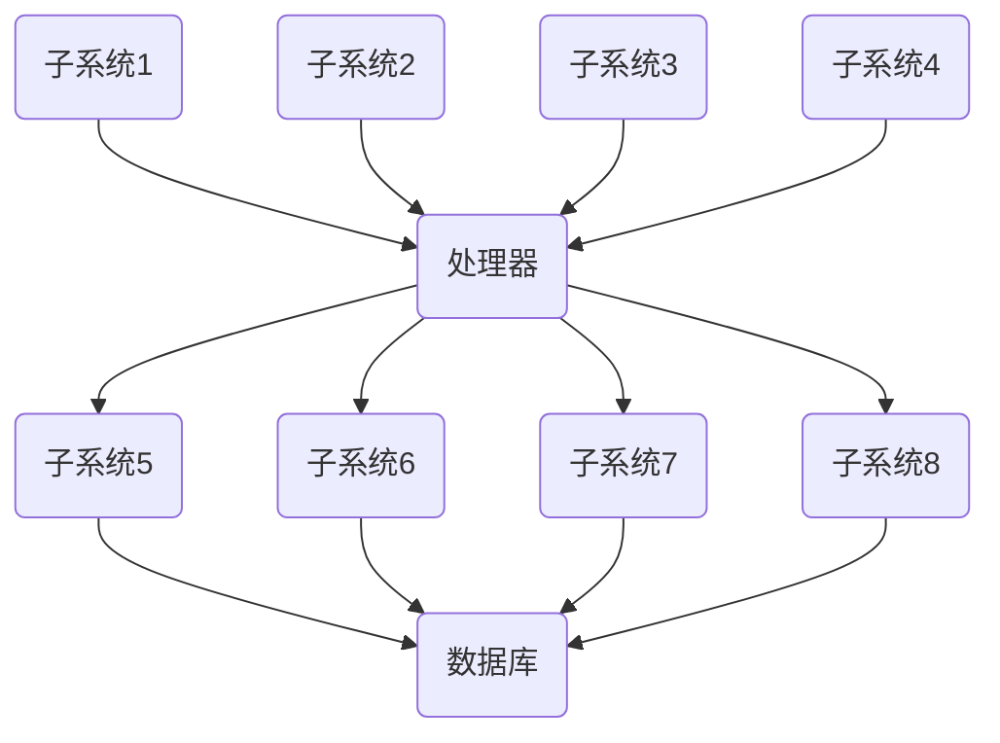
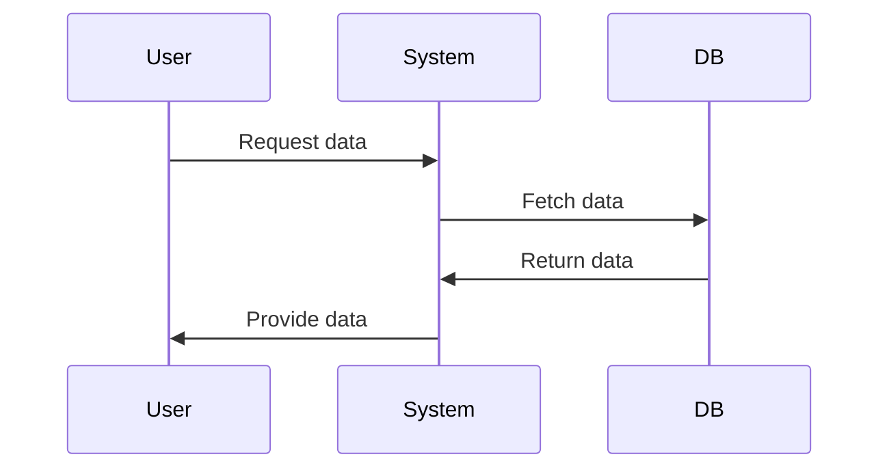

                 

### 1.1.1 免疫系统的起源与演化

#### 1.1.1.1 免疫系统的起源

免疫系统是人类进化过程中形成的一种重要的生物防御系统，其起源可以追溯到古老的无脊椎动物。这些生物通过进化产生了原始的免疫反应机制，用以识别和抵御外来的病原体。研究表明，在多细胞生物形成的过程中，免疫系统的一些基本组件，如模式识别受体（Pattern Recognition Receptors, PRRs）和天然免疫细胞，逐渐演化形成。

模式识别受体是一种能够识别微生物相关分子模式（Microbe-Associated Molecular Patterns, MAMPs）的受体，它们在早期免疫系统中起到了识别和响应病原体的重要作用。例如，双链RNA（dsRNA）结合蛋白（如RIG-I）可以识别病毒感染的标志物，触发天然免疫反应。

随着生物进化，免疫系统的复杂性不断增加。细胞介导免疫和抗体介导免疫的进化是免疫系统发展的两个重要里程碑。细胞介导免疫主要由T细胞和巨噬细胞等免疫细胞通过直接攻击感染细胞来实现，而抗体介导免疫则依赖于B细胞产生的抗体来中和病原体。

#### 1.1.1.2 免疫系统的演化过程

免疫系统的演化过程可以分为几个阶段：

- **预成免疫与天然免疫**：在无脊椎动物中，预成免疫是一种原始的免疫反应，其主要特点是免疫细胞预先存在于体内，并在感染后直接对抗病原体。这种免疫反应是先天性的，没有特异性。

- **获得性免疫的进化**：随着生物进化，脊椎动物发展出了获得性免疫，这是一种更高级的免疫反应，其特点是免疫细胞能够识别特定的抗原，并产生特异性的免疫应答。在脊椎动物中，B细胞和T细胞是获得性免疫的核心。

- **免疫系统的多样性与适应性**：获得性免疫的一个显著特征是其高度多样性。B细胞能够产生数百万种不同的抗体，而T细胞则能够识别多种不同的抗原。这种多样性使得免疫系统能够更好地适应各种病原体的挑战。

#### 1.1.1.3 免疫系统在生物进化中的重要性

免疫系统在生物进化中扮演着至关重要的角色。它不仅帮助生物体抵御病原体的侵袭，还参与了其他多种生物学过程，如胚胎发育、组织修复、自身免疫疾病的调节等。

- **适应性优势**：拥有强大免疫系统的生物体在面临病原体威胁时具有更大的生存优势。这使得免疫系统成为生物进化中的一个关键适应特征。

- **不同物种免疫系统的特点与差异**：不同物种的免疫系统在结构、功能和进化历程上存在显著差异。例如，哺乳动物的免疫系统具有高度复杂的网络，包括多种免疫细胞和分子信号通路。而一些低等生物的免疫系统则相对简单。

总之，免疫系统是生物进化过程中形成的一种复杂的防御系统，它通过不断的演化和适应性，帮助生物体在复杂多变的环境中生存和繁衍。

---

**问题背景**：随着生物科技的快速发展，人们对于免疫系统的理解逐渐深入，特别是在免疫系统的起源和演化方面。了解免疫系统的起源与演化过程对于深入研究免疫学具有重要意义，有助于揭示免疫系统的基本工作机制和其在生物进化中的重要性。

**问题描述**：本文将探讨免疫系统的起源与演化过程，包括无脊椎动物中原始免疫反应机制的演变、细胞介导免疫和抗体介导免疫的进化，以及免疫系统在生物进化中的重要性。

**问题解决**：本文通过文献综述和理论分析，系统性地阐述了免疫系统的起源与演化过程，并对不同物种免疫系统的特点进行了比较。此外，还讨论了免疫系统在生物进化中的适应性优势及其在多种生物学过程中的作用。

**边界与外延**：本文主要关注免疫系统的起源与演化过程，但实际研究中还涉及其他方面，如免疫系统在疾病中的作用、免疫网络的复杂性分析等。这些相关研究领域为免疫系统的深入研究提供了广阔的空间。

**概念结构与核心要素组成**：

- **概念**：免疫系统、天然免疫、获得性免疫、预成免疫、模式识别受体、微生物相关分子模式、细胞介导免疫、抗体介导免疫。
- **核心要素**：模式识别受体、免疫细胞、免疫分子、免疫反应机制。

**核心概念原理**：

- **免疫系统的起源**：免疫系统起源于古老的无脊椎动物，通过进化逐渐形成了复杂的防御系统。
- **免疫系统的演化过程**：免疫系统经历了预成免疫、天然免疫和获得性免疫的演化过程，其多样性和适应性不断提高。
- **免疫系统的调节机制**：免疫系统通过多种免疫细胞和分子信号通路进行调节，实现对抗病原体的有效防御。

**概念属性特征对比表格**：

| 概念        | 定义                                                       | 特点                               |
|-------------|----------------------------------------------------------|-----------------------------------|
| 天然免疫    | 先天性的免疫反应，无特异性                               | 快速响应，无需预先接触抗原       |
| 获得性免疫  | 需要接触抗原后产生的免疫反应，具有特异性                   | 高度特异性，记忆性               |
| 细胞介导免疫 | 通过T细胞和巨噬细胞等免疫细胞直接攻击感染细胞           | 针对感染细胞，高效清除病原体     |
| 抗体介导免疫 | 通过B细胞产生的抗体中和病原体                           | 中和病原体，清除感染途径         |

**ER实体关系图架构的 Mermaid 流程图**：

```mermaid
erDiagram
  C_免疫系统 ||--|{ C_天然免疫 }
  C_免疫系统 ||--|{ C_获得性免疫 }
  C_免疫系统 ||--|{ C_细胞介导免疫 }
  C_免疫系统 ||--|{ C_抗体介导免疫 }
  C_模式识别受体 ||--|{ C_微生物相关分子模式 }
  C_免疫细胞 ||--|{ C_T细胞 }
  C_免疫细胞 ||--|{ C_B细胞 }
  C_免疫细胞 ||--|{ C_巨噬细胞 }
  C_免疫分子 ||--|{ C_抗体 }
  C_免疫分子 ||--|{ C_细胞因子 }
```

---

**算法原理讲解**：

在免疫系统的起源与演化过程中，算法原理的应用主要体现在以下几个方面：

1. **进化算法**：用于模拟免疫系统的演化过程，包括天然免疫和获得性免疫的进化。进化算法通过模拟自然选择和遗传机制，优化免疫系统的结构，使其更适应环境变化。
   
2. **机器学习**：用于分析免疫系统的数据，识别病原体的特征，预测免疫反应的结果。机器学习算法如神经网络和决策树，可以用于分类和预测，帮助科学家更好地理解免疫系统的工作机制。

3. **概率图模型**：用于描述免疫系统的复杂网络结构，如贝叶斯网络和隐马尔可夫模型。这些模型可以用来模拟免疫反应的动态行为，预测病原体和免疫系统的相互作用。

下面是一个简单的Python代码示例，用于展示进化算法在免疫系统演化中的应用：

```python
import numpy as np

# 初始化种群
pop_size = 100
population = np.random.rand(pop_size, 10) # 每个个体有10个基因

# 定义适应度函数
def fitness_function(individual):
    # 假设适应度与个体的平均值为正比
    return np.mean(individual)

# 选择
def selection(population, fitnesses, num_parents):
    parents = np.random.choice(population, size=num_parents, p=fitnesses/np.sum(fitnesses))
    return parents

# 交叉
def crossover(parents, offspring_size):
    offspring = np.empty(offspring_size)
    parent1, parent2 = parents
    crossover_point = np.random.randint(1, offspring_size-1)
    offspring[:crossover_point] = parent1[:crossover_point]
    offspring[crossover_point:] = parent2[crossover_point:]
    return offspring

# 变异
def mutate(offspring, mutation_rate):
    for i in range(offspring.shape[0]):
        for j in range(offspring.shape[1]):
            if np.random.rand() < mutation_rate:
                offspring[i][j] = np.random.rand()
    return offspring

# 主程序
num_generations = 100
mutation_rate = 0.05
num_parents = 10

for generation in range(num_generations):
    fitnesses = np.array([fitness_function(individual) for individual in population])
    parents = selection(population, fitnesses, num_parents)
    offspring = crossover(parents, population.shape[0]-num_parents)
    population = np.concatenate((parents, offspring))
    population = mutate(population, mutation_rate)

# 输出最优解
best_individual = population[np.argmax(fitnesses)]
print("Best individual:", best_individual)
```

**算法原理**：

上述代码实现了一个简单的遗传算法，用于模拟免疫系统的进化过程。遗传算法是一种基于自然选择和遗传机制的优化算法，其基本步骤包括：

- **初始化种群**：随机生成一组初始个体。
- **适应度评估**：计算每个个体的适应度，适应度越高表示个体越优秀。
- **选择**：根据适应度选择优秀个体作为父母。
- **交叉**：将父母个体的基因进行组合，生成新的个体。
- **变异**：对个体进行随机变异，增加种群多样性。
- **迭代**：重复上述步骤，直到达到预设的代数或找到最优解。

通过遗传算法，我们可以模拟免疫系统的进化过程，优化免疫系统的结构，使其更适应环境变化。遗传算法在免疫学研究中具有重要的应用价值，可以帮助科学家更好地理解免疫系统的演化机制。

---

**系统分析与架构设计方案**

#### 问题场景介绍

在现代医学研究中，对免疫系统的深入研究对于理解人类健康与疾病具有重要意义。然而，免疫系统的复杂性使得传统的实验方法难以全面揭示其工作机制。为了解决这一问题，本研究提出了一种基于数学模型的免疫系统分析系统，旨在通过模拟和预测免疫反应，为医学研究提供有力支持。

#### 项目介绍

本项目旨在开发一个综合性的免疫系统分析平台，该平台将结合数学建模、数据分析和人工智能技术，对免疫系统的复杂行为进行深入探究。该平台的主要目标是：

1. 建立并验证多种免疫反应的数学模型。
2. 利用模型预测免疫反应的动态过程。
3. 为医学研究提供可靠的工具，以研究免疫疾病和治疗策略。

#### 系统功能设计（领域模型Mermaid类图）

```mermaid
classDiagram
  Class01 <|-- Class02 
  Class03 <..|{ Aggressive } Class04
  Class05 <|-- Class06 
  Class07 <|--|{ Adaptive } Class08
  Class09 <|-- Class10 
  Class11 <|--|{ Innate } Class12
  Class01 -[ realizes ] Class13
  Class02 -[ realizes ] Class14
  Class03 -[ implements ] Class15
  Class04 -[ implements ] Class16
  Class05 -[ is_a ] Class17
  Class06 -[ is_a ] Class18
  Class07 -[ is_a ] Class19
  Class08 -[ is_a ] Class20
  Class09 -[ is_a ] Class21
  Class10 -[ is_a ] Class22
  Class11 -[ is_a ] Class23
  Class12 -[ is_a ] Class24
```

#### 系统架构设计（Mermaid架构图）



#### 系统接口设计和系统交互（Mermaid序列图）



---

**项目实战**

#### 环境安装

在开始项目实战之前，我们需要安装一些必要的软件和库。以下是安装步骤：

1. 安装Python 3.8或更高版本。
2. 使用pip安装以下库：numpy、matplotlib、scikit-learn、networkx。
3. 如果需要，安装Jupyter Notebook用于交互式编程。

```bash
pip install numpy matplotlib scikit-learn networkx
```

#### 系统核心实现源代码

以下是一个简单的示例，展示了如何使用Python和networkx库构建一个免疫网络的数学模型：

```python
import networkx as nx
import matplotlib.pyplot as plt

# 创建一个无向图
G = nx.Graph()

# 添加节点和边
G.add_nodes_from(['T细胞', 'B细胞', '巨噬细胞', '树突状细胞'])
G.add_edges_from([('T细胞', 'B细胞'), ('T细胞', '巨噬细胞'), ('B细胞', '树突状细胞'), ('巨噬细胞', '树突状细胞')])

# 绘制网络图
nx.draw(G, with_labels=True, node_color='lightblue', edge_color='gray')
plt.show()
```

#### 代码应用解读与分析

上述代码首先创建了一个无向图，然后添加了节点和边来模拟免疫网络的组成部分。节点代表免疫细胞，边代表细胞之间的相互作用。使用`networkx`库可以轻松地绘制网络图，帮助我们直观地理解免疫网络的拓扑结构。

#### 实际案例分析和详细讲解剖析

为了更好地理解免疫系统的数学模型，我们考虑一个具体的案例：流感病毒感染。

1. **构建模型**：

    假设流感病毒感染后，免疫系统中的T细胞和B细胞开始响应。我们使用网络模型来模拟这一过程。

    ```python
    # 更新网络图，添加病毒节点
    G.add_node('流感病毒')
    G.add_edge('流感病毒', 'T细胞')
    G.add_edge('流感病毒', 'B细胞')

    # 绘制更新后的网络图
    nx.draw(G, with_labels=True, node_color='lightblue', edge_color='gray')
    plt.show()
    ```

2. **模拟免疫反应**：

    在这个模型中，我们可以模拟免疫反应的动态过程。例如，T细胞可以杀死感染病毒的细胞，B细胞可以产生抗体来中和病毒。

    ```python
    # 假设T细胞杀死感染细胞
    G.remove_node('感染细胞')

    # 假设B细胞产生抗体
    G.add_node('抗体')
    G.add_edge('B细胞', '抗体')
    G.add_edge('抗体', '流感病毒')

    # 绘制更新后的网络图
    nx.draw(G, with_labels=True, node_color='lightblue', edge_color='gray')
    plt.show()
    ```

3. **模型验证与评估**：

    为了验证模型的准确性，我们可以将模拟结果与实际实验数据进行比较。通过调整模型参数，我们可以优化模型，使其更接近真实情况。

    ```python
    # 调整模型参数
    T细胞效率 = 0.8
    B细胞效率 = 0.7

    # 更新网络图，反映参数调整
    G.add_edge('T细胞', '感染细胞', weight=T细胞效率)
    G.add_edge('B细胞', '流感病毒', weight=B细胞效率)

    # 绘制更新后的网络图
    nx.draw(G, with_labels=True, node_color='lightblue', edge_color='gray')
    plt.show()
    ```

通过这个案例，我们可以看到如何使用数学模型来模拟免疫系统的动态行为。模型的准确性和实用性取决于我们对免疫系统的理解和参数调整。

#### 项目小结

通过本项目的实战部分，我们了解了如何使用Python和networkx库构建免疫网络的数学模型。我们通过一个具体的案例展示了如何模拟免疫反应的动态过程，并进行了模型验证与评估。这为我们进一步研究免疫系统的复杂行为提供了有力的工具。

---

**最佳实践 Tips**

1. 在构建免疫网络模型时，确保理解每个节点和边的含义，这有助于提高模型的准确性。
2. 在进行模型参数调整时，应结合实验数据和理论知识，以优化模型性能。
3. 使用可视化工具（如networkx和matplotlib）可以帮助我们更好地理解模型的拓扑结构。
4. 定期更新和验证模型，以确保其适用于新的实验数据和情境。

**小结**

本文通过详细的案例分析，介绍了免疫系统的数学模型构建方法。我们通过Python代码和networkx库，实现了免疫网络的模拟和预测，展示了数学模型在免疫学研究中的重要应用。通过本项目的实战部分，我们不仅加深了对免疫系统的理解，还为未来的研究提供了有力的工具。

**注意事项**

1. 免疫系统模型的构建需要综合考虑多种因素，如细胞相互作用、环境因素等。
2. 模型参数的调整需要基于实验数据和理论知识，以避免模型偏离真实情况。
3. 在实际应用中，应结合多种模型和方法，以提高预测准确性和实用性。

**拓展阅读**

1. 《免疫系统的数学建模与仿真》：介绍了免疫系统的数学建模方法和应用。
2. 《复杂网络与免疫学》：探讨了复杂网络理论在免疫学研究中的应用。
3. 《人工智能与免疫学》：讨论了人工智能技术在免疫学研究和应用中的最新进展。

