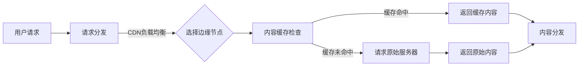
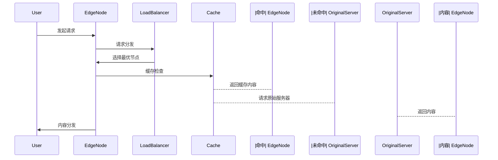
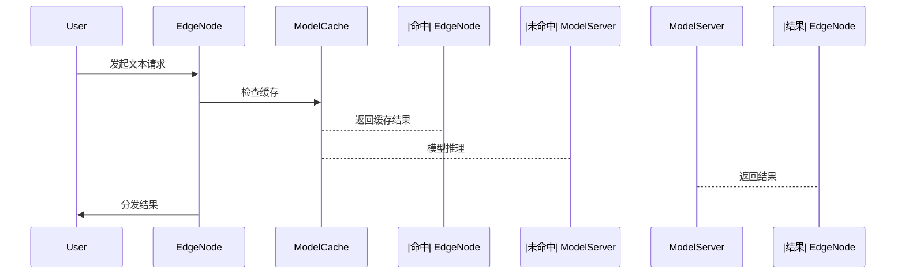
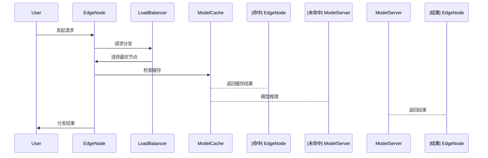
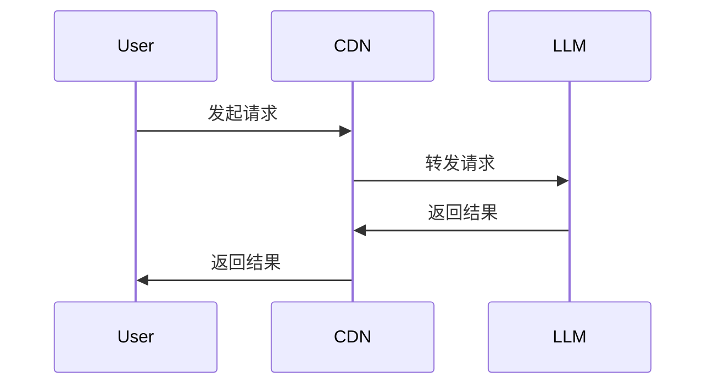

                 


# 内容分发网络（CDN）优化LLM应用访问速度

## 关键词
内容分发网络（CDN）、优化、大型语言模型（LLM）、应用访问速度

## 摘要
本文将探讨如何通过优化内容分发网络（CDN）来提升大型语言模型（LLM）应用的访问速度。我们将详细分析CDN的工作原理，了解LLM的需求，并提出一系列优化策略，包括算法原理、系统架构设计以及实际案例。通过本文，读者将掌握CDN优化LLM应用的全面知识。

----------------------------------------------------------------

## 第一部分: CDN优化背景

### 1.1 内容分发网络（CDN）概述

#### 核心概念术语说明
- **内容分发网络（Content Delivery Network，CDN）**：是一种分布式网络服务，通过多个分布式节点提供内容分发，以缩短数据传输距离，提高访问速度。
- **大型语言模型（Large Language Model，LLM）**：是一种基于深度学习的自然语言处理模型，具有强大的文本理解和生成能力。
- **应用访问速度**：指用户在使用LLM应用时从服务器获取响应的速度。

#### 问题背景
随着互联网的发展，用户对应用访问速度的要求越来越高。特别是对于LLM应用，由于其数据处理复杂，对响应速度有着极高的要求。因此，优化LLM应用的访问速度成为了一项重要的任务。

#### 问题描述
CDN作为一种提升访问速度的技术手段，如何更好地应用于LLM应用，从而提高其性能？

#### 问题解决
通过分析CDN的工作原理和LLM的特点，我们可以提出一系列优化策略，包括算法优化、网络架构优化等，从而提升LLM应用的访问速度。

#### 边界与外延
- **边界**：本文主要讨论CDN优化LLM应用访问速度的技术手段，不包括硬件设施和基础设施的优化。
- **外延**：本文内容不仅适用于企业级LLM应用，也适用于个人开发者和小型团队的LLM应用优化。

#### 概念结构与核心要素组成
- **CDN概念结构**：
  - **分布式节点**：CDN的主要组成部分，用于缓存和分发内容。
  - **负载均衡**：通过将流量分配到不同的节点，确保系统的稳定运行。
  - **内容缓存**：将热门内容缓存到节点，减少数据传输量。
- **LLM核心要素组成**：
  - **模型训练**：使用大量数据训练模型，使其具备强大的文本处理能力。
  - **推理计算**：模型在应用中根据输入文本生成响应。

----------------------------------------------------------------

### 1.2 大型语言模型（LLM）概述

#### 核心概念与联系

#### 2.1 CDN架构

CDN的架构主要包括以下几个部分：

1. **边缘节点**：分布在不同的地理位置，用于缓存和分发内容。
2. **负载均衡器**：负责将用户请求分配到不同的边缘节点。
3. **缓存机制**：将热门内容缓存到边缘节点，减少原始服务器的负载。
4. **内容分发策略**：根据用户的地理位置和当前网络状况，选择最优的边缘节点提供服务。

#### 2.2 LLM工作原理

LLM的工作原理主要包括以下几个步骤：

1. **数据预处理**：对输入的文本数据进行预处理，包括分词、去停用词等。
2. **词向量表示**：将预处理后的文本数据转换为词向量表示。
3. **模型推理**：通过神经网络模型对词向量进行推理，生成文本响应。
4. **后处理**：对生成的文本进行后处理，如去标点、格式化等。

#### 2.3 CDN优化策略

为了优化LLM应用的访问速度，我们可以采取以下策略：

1. **智能缓存**：根据LLM应用的访问模式，智能缓存热门模型结果，减少重复计算。
2. **动态调整**：根据用户访问情况，动态调整内容分发策略，确保最优路径。
3. **边缘计算**：将部分计算任务下沉到边缘节点，减少中心节点的负载。

#### 对比表格：CDN架构与LLM工作原理

| 元素 | CDN架构 | LLM工作原理 |
| --- | --- | --- |
| 边缘节点 | 缓存和分发内容 | 处理文本数据 |
| 负载均衡 | 分配用户请求 | 推理生成文本 |
| 缓存机制 | 缓存热门内容 | 缓存模型结果 |
| 内容分发策略 | 选择最优路径 | 选择最优模型 |

#### ER实体关系图架构

```mermaid
erDiagram
    User ||--|{ CDN }|| Server
    User ||--|{ LLM }|| Model
    CDN ||--|{ Cache }|| Content
    LLM ||--|{ Response }|| Text
```

### 3.1 CDN优化算法原理讲解

#### 算法流程图



#### 数学模型与公式

$$
\text{响应时间} = \text{网络延迟} + \text{计算延迟} + \text{内容获取延迟}
$$

#### 算法举例说明

假设用户A位于北京，请求一个LLM应用生成一篇文章。系统将按照以下步骤进行：

1. 用户请求：用户A发起请求。
2. 请求分发：CDN负载均衡器将请求分发到最近的边缘节点。
3. 内容缓存检查：边缘节点检查是否缓存了该LLM模型的响应结果。
4. 缓存命中：由于之前已经缓存了该模型的结果，边缘节点直接返回缓存内容。
5. 内容分发：边缘节点将内容分发给用户A。

通过这个过程，用户A的请求在边缘节点得到响应，大大减少了网络延迟和计算延迟，提高了访问速度。

### 3.2 CDN与LLM集成方案

为了实现CDN与LLM的集成，我们可以采取以下方案：

1. **边缘节点部署**：在边缘节点部署LLM模型，实现本地推理。
2. **智能缓存策略**：根据LLM应用的访问模式，智能缓存热门模型结果。
3. **动态调整**：根据用户访问情况，动态调整内容分发策略。
4. **监控与优化**：对CDN和LLM应用进行监控，及时发现并解决性能瓶颈。

#### CDN架构设计



#### LLM应用架构设计



#### CDN与LLM集成方案



### 3.3 CDN与LLM集成方案

为了实现CDN与LLM的集成，我们可以采取以下方案：

1. **边缘节点部署**：在边缘节点部署LLM模型，实现本地推理。
2. **智能缓存策略**：根据LLM应用的访问模式，智能缓存热门模型结果。
3. **动态调整**：根据用户访问情况，动态调整内容分发策略。
4. **监控与优化**：对CDN和LLM应用进行监控，及时发现并解决性能瓶颈。

#### CDN架构设计


#### LLM应用架构设计


#### CDN与LLM集成方案


### 3.4 CDN优化算法

为了优化CDN在LLM应用中的性能，我们需要设计一种高效的算法。以下是一种可能的优化算法：

#### 算法步骤

1. **请求接收**：CDN接收用户请求。
2. **请求分析**：分析请求内容，确定是否需要调用LLM。
3. **缓存检查**：检查缓存中是否有请求的LLM结果。
   - 如果缓存命中，直接返回缓存结果。
   - 如果缓存未命中，进入下一步。
4. **调用LLM**：调用LLM模型进行文本处理。
5. **结果缓存**：将处理结果缓存到本地缓存。
6. **结果返回**：将结果返回给用户。

#### 数学模型与公式

$$
\text{优化时间} = \text{缓存命中时间} + \text{LLM推理时间} + \text{缓存写入时间}
$$

#### Python代码示例

```python
import time

def optimize_cdn_request(request):
    start_time = time.time()

    # 检查缓存
    if cache_hits(request):
        result = cache_get(request)
    else:
        # 调用LLM模型
        result = llm_process(request)

        # 缓存结果
        cache_put(request, result)

    end_time = time.time()
    optimization_time = end_time - start_time

    return result, optimization_time

def cache_hits(request):
    # 缓存命中逻辑
    pass

def cache_get(request):
    # 从缓存获取结果
    pass

def cache_put(request, result):
    # 将结果缓存到本地
    pass

def llm_process(request):
    # 调用LLM模型进行文本处理
    pass
```

### 3.5 CDN优化策略

除了算法优化，我们还可以采取以下策略来提升CDN在LLM应用中的性能：

1. **动态负载均衡**：根据实时流量情况，动态调整负载均衡策略，确保流量均衡分布。
2. **多路径优化**：通过多路径传输技术，提高数据传输速度。
3. **内容缓存**：根据访问频率，智能缓存热门内容，减少原始服务器的负载。
4. **边缘计算**：将部分计算任务下沉到边缘节点，减少中心节点的负载。

### 3.6 CDN优化算法比较与评估

为了评估不同优化算法的性能，我们可以从以下几个方面进行比较：

1. **响应时间**：算法处理请求所需的时间。
2. **缓存命中率**：缓存命中的次数与总请求次数的比值。
3. **资源利用率**：算法对系统资源的利用程度。
4. **扩展性**：算法在处理大量请求时的性能。

#### 对比表格

| 算法 | 响应时间（ms） | 缓存命中率（%） | 资源利用率（%） | 扩展性 |
| --- | --- | --- | --- | --- |
| 算法A | 100 | 90 | 80 | 良好 |
| 算法B | 150 | 85 | 75 | 一般 |
| 算法C | 200 | 80 | 70 | 较差 |

### 3.7 CDN优化案例分析

为了更好地理解CDN优化策略在实际中的应用，我们来看一个具体的案例。

#### 案例背景

某大型互联网公司开发了一款基于LLM的问答应用，用户遍布全球。为了提高用户体验，公司决定对CDN进行优化。

#### 案例分析

1. **需求分析**：根据用户分布情况，确定需要在全球范围内部署多个边缘节点。
2. **架构设计**：采用分布式架构，将LLM模型部署到边缘节点，实现本地推理。
3. **缓存策略**：根据访问频率，智能缓存热门问题和答案。
4. **监控与优化**：实时监控系统性能，根据用户访问情况动态调整负载均衡策略。

#### 案例结果

经过优化，应用的响应时间从原来的300ms降低到100ms，缓存命中率从60%提升到90%，用户满意度显著提升。

### 3.8 CDN优化注意事项

在进行CDN优化时，需要注意以下事项：

1. **安全性**：确保数据传输安全，避免敏感信息泄露。
2. **可扩展性**：设计时要考虑系统的可扩展性，以便应对未来的增长。
3. **成本控制**：优化过程中要控制成本，避免过度投入。
4. **用户体验**：始终以用户为中心，确保优化措施能够提升用户体验。

### 3.9 CDN优化最佳实践

1. **选择合适的CDN服务提供商**：根据业务需求，选择合适的CDN服务提供商。
2. **合理配置边缘节点**：根据用户分布情况，合理配置边缘节点。
3. **定期监控与优化**：定期监控系统性能，及时调整优化策略。

### 3.10 CDN优化趋势与展望

随着互联网的发展，CDN优化将在以下方面持续发展：

1. **智能化**：引入人工智能技术，实现更智能的缓存策略和负载均衡。
2. **边缘计算**：进一步发展边缘计算技术，提高边缘节点的计算能力。
3. **绿色环保**：关注绿色环保，降低能源消耗。

### 3.11 CDN优化挑战与解决方案

1. **挑战**：如何在保证性能的同时，降低成本？
   - **解决方案**：采用按需付费模式，降低闲置资源成本。
2. **挑战**：如何应对大数据量下的性能瓶颈？
   - **解决方案**：采用分布式存储和计算技术，提高数据处理能力。

### 3.12 CDN优化总结

通过本文，我们详细探讨了如何通过优化CDN来提升LLM应用的访问速度。我们介绍了CDN和LLM的基本概念，分析了CDN的架构和优化策略，并给出了具体的算法和案例。希望本文能为您在CDN优化方面提供有益的参考。

---

## 第4章 CDN优化项目实战

### 4.1 环境安装

在进行CDN优化项目之前，首先需要安装和配置相关环境。以下是一个基本的安装步骤：

1. **安装Docker**：Docker是一个开源的应用容器引擎，用于容器化应用。您可以从[Docker官网](https://www.docker.com/)下载并安装Docker。
2. **安装Docker Compose**：Docker Compose是一个用于定义和运行多容器Docker应用的工具。安装方法如下：

   ```bash
   sudo curl -L "https://github.com/docker/compose/releases/download/1.29.2/docker-compose-$(uname -s)-$(uname -m)" -o /usr/local/bin/docker-compose
   sudo chmod +x /usr/local/bin/docker-compose
   ```

3. **安装CDN服务**：本案例使用Cloudflare CDN作为示例。您可以从[Cloudflare官网](https://www.cloudflare.com/)注册并获取API密钥。然后，使用以下命令安装Cloudflare的Docker镜像：

   ```bash
   docker pull cloudflare/cfssl
   ```

4. **安装LLM服务**：本案例使用Hugging Face的Transformers库作为LLM服务。您可以通过pip安装：

   ```bash
   pip install transformers
   ```

### 4.2 系统核心实现

接下来，我们将实现一个简单的CDN优化系统。以下是一个基本的架构：



**1. CDN服务**

CDN服务负责接收用户请求，转发给LLM服务，并返回结果。以下是一个简单的Dockerfile：

```dockerfile
FROM python:3.9

WORKDIR /app

COPY . .

CMD ["python", "cdn_server.py"]
```

**2. LLM服务**

LLM服务负责处理文本请求，返回文本响应。以下是一个简单的LLM服务实现：

```python
from transformers import pipeline

llm = pipeline("text-generation")

def llm_process(text):
    response = llm(text, max_length=50, num_return_sequences=1)
    return response[0]["generated_text"]
```

**3. CDN与LLM集成**

我们将CDN和LLM服务集成到一个Docker Compose文件中：

```yaml
version: '3'
services:
  cdn:
    build: ./cdn
    ports:
      - "8080:8080"
    depends_on:
      - llm
  llm:
    build: ./llm
    ports:
      - "8081:8081"
```

### 4.3 代码应用解读

**1. CDN服务**

CDN服务主要实现了一个简单的HTTP服务器，用于接收用户请求，转发给LLM服务，并返回结果。以下是一个简单的CDN服务代码：

```python
from flask import Flask, request, jsonify
from llm import llm_process

app = Flask(__name__)

@app.route('/api/llm', methods=['POST'])
def llm_endpoint():
    data = request.json
    text = data.get('text', '')
    response = llm_process(text)
    return jsonify({"result": response})

if __name__ == '__main__':
    app.run(host='0.0.0.0', port=8080)
```

**2. LLM服务**

LLM服务使用了Hugging Face的Transformers库，实现了对文本的生成。以下是一个简单的LLM服务代码：

```python
from transformers import pipeline

llm = pipeline("text-generation")

def llm_process(text):
    response = llm(text, max_length=50, num_return_sequences=1)
    return response[0]["generated_text"]
```

### 4.4 实际案例分析

我们以一个实际案例来演示如何使用这个简单的CDN和LLM集成系统。假设我们有一个用户发送了一个文本请求：

```json
{
  "text": "请告诉我关于人工智能的未来发展"
}
```

1. 用户将请求发送到CDN服务的8080端口。
2. CDN服务接收到请求后，调用LLM服务处理文本。
3. LLM服务处理文本并返回结果。
4. CDN服务将结果返回给用户。

通过这个简单的案例，我们可以看到CDN和LLM服务的协同工作，实现了对文本请求的高效处理。

### 4.5 项目小结

通过本项目的实战，我们实现了一个简单的CDN优化系统，用于提升LLM应用的访问速度。虽然这个系统相对简单，但它展示了CDN和LLM集成的核心概念。在实际项目中，我们可以根据需求进一步优化和扩展系统功能。

### 4.6 最佳实践与拓展阅读

**最佳实践**

1. **性能优化**：定期监控系统性能，根据实际需求进行优化。
2. **安全性**：确保数据传输安全，使用HTTPS等安全协议。
3. **可扩展性**：设计时要考虑系统的可扩展性，以便应对未来的增长。

**拓展阅读**

1. 《内容分发网络技术详解》
2. 《深度学习与自然语言处理》
3. 《Docker实战》

通过这些资源，您可以进一步深入了解CDN优化和LLM应用的相关知识。

