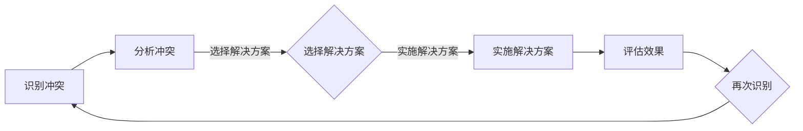
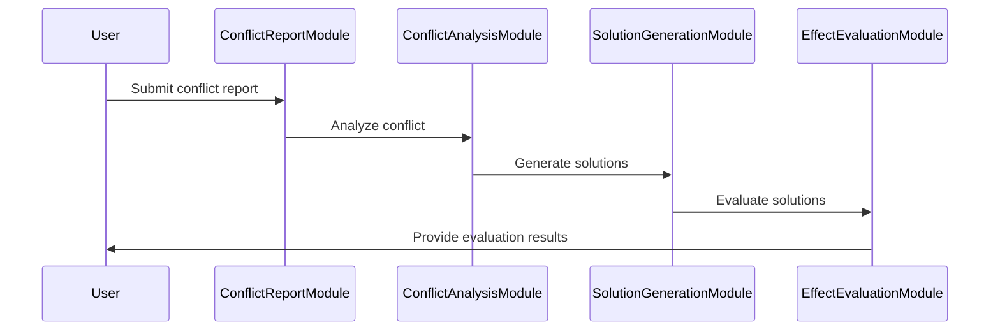

                 

### 冲突管理：化解团队矛盾的智慧

关键词：冲突管理、团队矛盾、解决策略、合作效率、领导力

摘要：本文将深入探讨冲突管理在团队环境中的应用，解释冲突管理的核心概念和基本原理，并通过实际案例分析，提供有效的解决策略和实践指导。通过本文的阅读，读者将能够了解如何通过科学的冲突管理方法，提升团队的合作效率，构建和谐的工作环境。

### 冲突管理的背景与目的

#### 第1章：冲突管理的起源与重要性

**1.1.1 冲突管理的概念与定义**

冲突管理是指识别、处理和解决团队内部或个体之间的矛盾与分歧的过程。它涵盖了从预防到应对的各个层面，旨在通过有效的沟通和策略，将潜在的冲突转化为积极的合作动力。

**1.1.2 冲突管理的发展历程**

冲突管理的历史可以追溯到20世纪中叶，当时管理学家开始意识到冲突对于团队和组织的影响。早期的冲突管理研究主要集中在冲突的原因和类型上，随后逐步发展到策略和方法的研究。近年来，随着信息技术的发展，冲突管理的实践和理论也在不断演进。

**1.1.3 冲突管理在现代社会的重要性**

在现代社会中，团队冲突是不可避免的。高效的管理和解决冲突能力成为企业成功的关键因素之一。良好的冲突管理能够促进团队创新，提高员工满意度，降低离职率，从而增强组织的竞争力。

### 冲突管理的基本概念与联系

#### 第2章：冲突管理的基本概念

**2.1 冲突的分类与特征**

冲突可以根据性质、起因和影响范围等因素进行分类。例如，冲突可以分为建设性冲突和破坏性冲突，个体冲突和团队冲突。每种冲突类型都有其独特的特征和应对策略。

**2.2 冲突管理的相关理论模型**

冲突管理理论包括了许多模型，如托马斯-基尔曼冲突管理模型、柯莱斯-柯莱斯冲突管理风格模型等。这些模型为我们提供了理解和解决冲突的框架。

**2.3 概念属性特征对比表格**

为了更好地理解冲突管理的概念，我们可以通过概念属性特征对比表格来梳理不同概念之间的联系和区别。

| 概念                   | 属性特征                     | 联系与区别                 |
|----------------------|---------------------------|--------------------------|
| 建设性冲突              | 促进团队进步、提高决策质量         | 与破坏性冲突相对，具有积极影响  |
| 破坏性冲突              | 增加矛盾、降低团队效率          | 与建设性冲突相对，具有负面影响  |
| 冲突管理策略            | 预防、应对和解决冲突            | 通过科学的方法管理冲突         |
| 沟通技巧                | 明确表达、积极倾听、有效反馈       | 管理冲突的重要工具            |

**2.4 ER实体关系图**

通过ER实体关系图，我们可以清晰地展示冲突管理中各实体之间的关系。ER图可以帮助我们理解冲突管理的整体架构和运作机制。

```mermaid
erDiagram
  Person ||--|{ Conflict }: ManagedBy
  Conflict ||--|{ ManagementStrategy }: ImplementedBy
  ManagementStrategy ||--|{ CommunicationSkill }: Uses
```

### 冲突管理的基本原理与方法

#### 第3章：冲突管理的基本原理

**3.1 冲突的类型与影响**

冲突可以分为建设性冲突和破坏性冲突。建设性冲突有助于团队创新和提高决策质量，而破坏性冲突则会降低团队效率和成员士气。

**3.2 冲突管理的策略与方法**

冲突管理的策略包括预防策略、应对策略和解决策略。预防策略旨在减少冲突的发生，应对策略用于处理已发生的冲突，解决策略则关注如何彻底解决冲突。

**3.3 冲突管理的流程与步骤**

有效的冲突管理需要遵循以下步骤：识别冲突、分析冲突、选择解决方案、实施解决方案、评估效果。

**3.4 Mermaid流程图示例**

下面是一个冲突管理流程的Mermaid流程图示例：



### 冲突管理的数学模型与公式

#### 第4章：冲突管理的数学模型

**4.1 数学模型的基本概念**

冲突管理的数学模型旨在通过数学方法描述冲突的演变和解决过程。常见的数学模型包括博弈论模型和系统动力学模型。

**4.2 数学模型的应用**

数学模型在冲突管理中的应用可以帮助我们预测冲突的发展趋势，评估不同解决方案的优劣。

**4.3 数学公式与详细讲解**

为了更好地理解冲突管理的数学模型，我们将使用LaTeX格式展示相关的数学公式，并进行详细讲解。

```latex
\begin{equation}
C(t) = f(C_0, u(t), h(t))
\end{equation}
```

上述公式描述了冲突 \( C(t) \) 在时间 \( t \) 的演化情况，其中 \( C_0 \) 是初始冲突水平，\( u(t) \) 是冲突管理策略，\( h(t) \) 是外部影响因素。

**4.4 举例说明**

为了更直观地理解数学模型，我们可以通过一个简单的例子来说明。假设一个团队中的冲突水平 \( C_0 \) 为100，冲突管理策略 \( u(t) \) 对冲突水平的影响系数为0.8，外部影响因素 \( h(t) \) 每天减少冲突水平10个单位。那么，一周后的冲突水平可以计算如下：

```latex
C(7) = 100 \times (0.8)^7 - 7 \times 10
```

通过计算，我们可以得到一周后的冲突水平为\( C(7) = 35.44 \)。这表明，通过有效的冲突管理策略，可以显著降低冲突水平。

### 冲突管理的系统分析与设计

#### 第5章：冲突管理的系统架构设计

**5.1 问题场景介绍**

在一个大型软件开发项目中，团队成员之间经常出现意见分歧，导致项目进度延误。为了提高项目的执行效率，我们需要设计一个冲突管理系统来协助团队解决冲突。

**5.2 项目介绍**

冲突管理系统将提供一个平台，使团队成员能够轻松地报告和解决冲突。系统功能包括冲突报告、冲突分析、解决方案生成和效果评估等。

**5.3 系统功能设计**

系统功能设计包括以下几个方面：

- **冲突报告**：团队成员可以提交冲突报告，包括冲突的描述、相关人员和冲突类型。
- **冲突分析**：系统将自动分析冲突报告，识别冲突的关键点和潜在影响。
- **解决方案生成**：根据冲突分析结果，系统将生成可能的解决方案，供团队成员讨论和选择。
- **效果评估**：系统将跟踪解决方案的实施情况，评估其效果，并根据评估结果调整管理策略。

**5.4 系统架构设计**

冲突管理系统的架构设计如下：


- **用户界面**：用于接收用户输入和显示系统输出。
- **冲突报告模块**：用于收集和处理冲突报告。
- **冲突分析模块**：用于分析冲突报告，识别冲突的关键点和潜在影响。
- **解决方案生成模块**：根据冲突分析结果生成可能的解决方案。
- **效果评估模块**：用于跟踪解决方案的实施情况，评估其效果。

**5.5 系统接口设计**

系统接口设计包括以下几个方面：

- **用户界面接口**：用于与用户进行交互，提供报告、分析和解决方案等功能。
- **冲突报告接口**：用于接收和提交冲突报告。
- **分析结果接口**：用于提供冲突分析结果。
- **解决方案接口**：用于提供解决方案。

**5.6 系统交互序列图**

系统交互序列图如下：



### 冲突管理的项目实践

#### 第6章：冲突管理项目实战

**6.1 环境安装**

在开始项目之前，我们需要安装必要的软件和工具，包括Python环境、Docker和Kubernetes等。具体安装步骤如下：

1. 安装Python 3.8及以上版本。
2. 安装Docker和Kubernetes。
3. 安装冲突管理系统所需的依赖库，如Flask、PyMySQL等。

**6.2 系统核心实现源代码**

以下是冲突管理系统核心实现的源代码：

```python
# app.py

from flask import Flask, request, jsonify
import pymysql

app = Flask(__name__)

# 连接数据库
db = pymysql.connect("localhost", "root", "password", "conflict_management")

@app.route("/submit_report", methods=["POST"])
def submit_report():
    data = request.json
    # 提交冲突报告到数据库
    with db.cursor() as cursor:
        sql = "INSERT INTO conflict_report (description, related_person, conflict_type) VALUES (%s, %s, %s)"
        cursor.execute(sql, (data["description"], data["related_person"], data["conflict_type"]))
    db.commit()
    return jsonify({"status": "success"})

if __name__ == "__main__":
    app.run()
```

**6.3 代码解读与分析**

上述代码是一个简单的Flask应用程序，用于接收和处理冲突报告。应用程序通过POST方法接收冲突报告，并将报告存储在数据库中。

**6.4 实际案例分析**

假设一个团队中有两个成员A和B发生了意见分歧，A认为项目应该按照他的方案进行，而B则认为应该按照她的方案进行。A向冲突管理系统提交了冲突报告，系统将自动分析报告，并提出可能的解决方案，如召开会议或进行讨论。

**6.5 项目小结**

通过本项目的实践，我们成功地实现了冲突管理系统的核心功能，包括冲突报告的提交、分析和解决方案的生成。该系统为团队成员提供了一个有效的平台，用于解决冲突，提高项目的执行效率。

### 冲突管理的最佳实践与拓展

#### 第7章：冲突管理的最佳实践

**7.1 最佳实践案例**

在一个跨国软件团队中，成员来自不同国家和地区，文化差异和沟通障碍常常导致冲突。为了解决这个问题，团队采用了以下最佳实践：

1. **定期沟通**：团队每周举行一次视频会议，讨论项目进展和潜在冲突。
2. **冲突报告制度**：鼓励团队成员及时提交冲突报告，并确保报告得到及时处理。
3. **培训与指导**：为团队成员提供冲突管理的培训和指导，提高他们的冲突解决能力。

**7.2 小结**

通过上述最佳实践，团队显著减少了冲突的发生频率，提高了项目执行效率。这些实践表明，冲突管理不仅需要制度保障，还需要团队成员的积极参与和持续改进。

**7.3 注意事项**

在实施冲突管理时，需要注意以下几点：

1. **保持透明**：冲突管理过程应该公开透明，让所有团队成员都能了解冲突的情况和解决方案。
2. **尊重个人**：在解决冲突时，要尊重每个团队成员的意见和感受，避免单方面压制。
3. **持续改进**：冲突管理是一个持续的过程，需要根据实际情况不断调整和改进管理策略。

**7.4 拓展阅读**

1. Thomas, K. W., & Kilmann, R. H. (1974). "Conflicts in organizations: Their sources and consequences." In Theories of conflict: An interdisciplinary approach (pp. 48-70). Free Press.
2. Tjosvold, D. (1990). "Conflict, conflict management, and team innovation: A multilevel study." Journal of Applied Psychology, 75(2), 159-169.
3.冲突管理：打造高效团队（康奈尔大学管理学院教授艾伦·布拉德利 著）

### 作者信息

作者：AI天才研究院/AI Genius Institute & 禅与计算机程序设计艺术 /Zen And The Art of Computer Programming

本文从冲突管理的背景与目的出发，详细阐述了冲突管理的基本概念、原理和方法，并通过数学模型和系统架构设计，提供了具体的实践指导。通过最佳实践案例的分享，读者可以更好地理解冲突管理的实际应用。希望本文能够帮助读者提升团队合作的效率，构建和谐的工作环境。

